# 第九章：2D 动画

在本章中，我们将涵盖：

+   水平翻转精灵——DIY 方法

+   水平翻转精灵——使用动画状态图和转换

+   为角色移动事件动画身体部位

+   创建一个 3 帧的动画剪辑，使平台持续动画

+   使用触发器使平台一旦被踩上就开始下落，从而将动画从一个状态转换到另一个状态

+   从精灵序列创建动画剪辑

+   使用图块和地图创建平台游戏

+   使用 2D Gamekit 创建场景

# 简介

自从 2014 年的 Unity 4.6 以来，Unity 就提供了专门的 2D 功能，Unity 2018 继续在此基础上发展。在本章中，我们提供了一系列食谱，介绍 Unity 2018 中 2D 动画的基础知识，并帮助您了解不同动画元素之间的关系。

# 整体概念

在 Unity 2D 中，可以通过几种不同的方式创建动画——一种方式是创建许多略有不同的图像，逐帧给出运动的外观。创建动画的第二种方式是为对象的各个部分定义关键帧位置（例如，手臂、腿部、脚、头部和眼睛），并在游戏运行时让 Unity 计算所有中间位置：

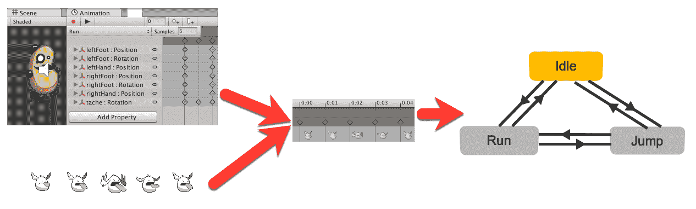

动画的两类来源在动画面板中变为动画剪辑。每个动画剪辑随后成为动画控制器状态机中的一个状态。我们还可以根据动画剪辑复制状态，或者创建新的状态，并添加脚本行为。

我们还可以定义复杂的条件，在满足这些条件的情况下，GameObject 将从一种动画状态转换到另一种状态。

# 网格、地图和图块调色板

Unity 引入了一套地图功能，使得创建基于地图的**场景**变得快速且简单。地图网格 GameObject 充当地图的父对象。地图是将图块绘制到其上的 GameObject，来自图块调色板。精灵可以被制作成图块资产，并将一组图块添加到调色板中，用于绘制场景。

它还提供了强大的脚本规则图块，增强了图块画笔工具，自动添加顶部、左侧、右侧和底部边缘的图块，当用图块绘制更多网格元素时。规则图块甚至可以在定义的条件下从一组图块中随机选择。更多信息请访问 [`unity3d.com/learn/tutorials/topics/2d-game-creation/using-rule-tiles-tilemap`](https://unity3d.com/learn/tutorials/topics/2d-game-creation/using-rule-tiles-tilemap)。

# 2D GameKit – 将 2D 工具整合在一起

Unity 引入的最令人兴奋的 2D 功能可能是 2D GameKit。它将构建 2D 游戏所需的几个强大的 Unity 功能汇集在一起，包括：

+   地图和规则图块

+   2D 角色控制器（以及输入映射器和玩家角色组件）

+   Cinemachine 智能相机控制

+   统一事件系统

+   许多预制好的常见 2D 游戏组件，包括门、传送门、对话框面板、开关、库存、近战、可收集物品和库存、可伤害物体以及敌人等等

本章的最后一个食谱介绍了 2D GameKit，而本章的其他食谱和一些其他食谱则分别介绍了某些组件，这样您就会知道足够的信息来开始使用 2D GameKit 并学习如何构建紧密组合核心 2D 游戏功能的场景。

# 资源

在本章中，我们介绍了展示 2D 游戏元素动画系统的食谱。PotatoMan2D 角色来自 Unity 2D 平台游戏，您可以从 Unity 资产商店自行下载。该项目是查看更多 2D 游戏和动画技术示例的好地方：

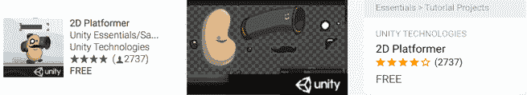

这里有一些链接，用于探索这些主题的更多有用资源和信息来源：

+   Unity 中 2D 功能概述：[`unity.com/solutions/2d`](https://unity.com/solutions/2d)

+   Unity 的 2D 游戏开发入门指南：[`unity3d.com/learn/tutorials/topics/2d-game-creation/2d-game-development-walkthrough`](https://unity3d.com/learn/tutorials/topics/2d-game-creation/2d-game-development-walkthrough)

+   Unity 的 2D Rogue-like 教程系列：[`unity3d.com/learn/tutorials/s/2d-roguelike-tutorial`](https://unity3d.com/learn/tutorials/s/2d-roguelike-tutorial)

+   Unity 2D 平台游戏（PotatoMan 角色来源处）：[`www.assetstore.unity3d.com/en/#!/content/11228`](https://www.assetstore.unity3d.com/en/#!/content/11228)

+   平台精灵来自 Daniel Cook 的 Planet Cute 游戏资源：[`www.lostgarden.com/2007/05/dancs-miraculously-flexible-game.html`](http://www.lostgarden.com/2007/05/dancs-miraculously-flexible-game.html)

+   创建基本的 2D 平台游戏：[`www.unity3d.com/learn/tutorials/modules/beginner/live-training-archive/creating-a-basic-platformer-game`](https://www.unity3d.com/learn/tutorials/modules/beginner/live-training-archive/creating-a-basic-platformer-game)

+   Hat Catch 2D 游戏教程：[`www.unity3d.com/learn/tutorials/modules/beginner/live-training-archive/2d-catch-game-pt1`](https://www.unity3d.com/learn/tutorials/modules/beginner/live-training-archive/2d-catch-game-pt1)

+   从 2D 视角看 Unity 游戏视频：[`www.unity3d.com/learn/tutorials/modules/beginner/live-training-archive/introduction-to-unity-via-2d`](https://www.unity3d.com/learn/tutorials/modules/beginner/live-training-archive/introduction-to-unity-via-2d)

+   来自 Kenny 的免费 Creative Commons 许可证的出色模块化 2D 角色集。这些资源非常适合以类似于本章中土豆人示例和 Unity 2D 平台游戏演示中的方式动画身体部位：[`kenney.nl/assets/modular-characters`](http://kenney.nl/assets/modular-characters)

+   Joe Strout 在 Gamasutra 上的关于使用 Unity 脚本和动画状态进行 2D 角色动画的三个方法的启发式文章：[`www.gamasutra.com/blogs/JoeStrout/20150807/250646/2D_Animation_Methods_in_Unity.php`](https://www.gamasutra.com/blogs/JoeStrout/20150807/250646/2D_Animation_Methods_in_Unity.php)

# 水平翻转精灵 - DIY 方法

可能最简单的 2D 动画就是简单的翻转，从面向左到面向右，或者从面向上到面向下，等等。在这个菜谱中，我们将向场景添加一个可爱的虫子精灵，并编写一个简短的脚本，当按下 *左* 和 *右* 方向键时翻转其水平方向：

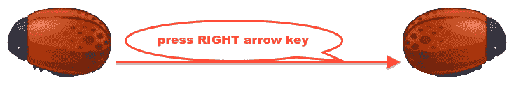

# 准备工作

对于这个菜谱，我们在名为 Sprites 的文件夹中名为 `08_01` 的文件夹中准备了所需的图像。

# 如何实现...

要通过箭头键按下水平翻转对象，请按照以下步骤操作：

1.  创建一个新的 Unity 2D 项目。

如果你在一个最初创建为 3D 的项目中工作，你可以通过菜单更改默认项目行为（例如，新的 Sprite Textures 和 **场景** 模式）到 2D，方法是：编辑 | 项目设置 | 编辑器，然后在检查器中选择 2D 作为默认行为模式。


1.  导入提供的图像：EnemyBug.png。

1.  从项目 | Sprites 文件夹中将红色 Enemy Bug 图像的实例拖到 **场景** 中。将此 GameObject 定位在 (0, 0, 0) 并缩放到 (2, 2, 2)。

1.  创建一个名为 BugFlip 的 C# 脚本类，并将实例对象作为组件添加到 Enemy Bug：

```cs
     using UnityEngine;
     using System.Collections;

     public class BugFlip : MonoBehaviour {
       private bool facingRight = true;

       void Update() {
         if (Input.GetKeyDown(KeyCode.LeftArrow) && facingRight)
           Flip ();
         if (Input.GetKeyDown(KeyCode.RightArrow) && !facingRight)
           Flip();
       }

       void Flip (){
         // Switch the way the player is labelled as facing.
         facingRight = !facingRight;

         // Multiply the player's x local scale by -1.
         Vector3 theScale = transform.localScale;
         theScale.x *= -1;
         transform.localScale = theScale;
       }
     } 
```

1.  当你运行场景时，按下 *左* 和 *右* 方向键应该使虫子面向左或右。

# 它是如何工作的...

C# 类定义了一个 **布尔** 变量 `facingRight`，它存储一个真/假值，对应于虫子是否面向右侧。由于我们的虫子精灵最初面向右侧，我们将 `facingRight` 的初始值设置为 true 以匹配这一点。

每一帧，`Update()` 方法都会检查是否按下了 *左* 或 *右* 方向键。如果按下 *左* 方向键且虫子面向右，则调用 `Flip()` 方法，同样，如果按下 *右* 方向键且虫子面向左（即面向右为假），则再次调用 `Flip()` 方法。

`Flip()` 方法执行两个操作；第一个操作简单地反转变量 `facingRight` 中的真/假值。第二个操作改变变换的 `localScale` 属性的 X 值的正负号。反转 `localScale` 的符号将导致我们想要的 2D 翻转。在下一个菜谱中，查看 PlayerControl 脚本中的 PotatoMan 角色内部，你会看到相同的 `Flip()` 方法被使用。

# 水平翻转精灵 - 使用动画状态图和转换

在这个配方中，我们将（以简单的方式）使用 Unity 动画系统创建两个状态，对应两个动画剪辑，以及一个根据哪个动画状态活动而改变 localScale 的脚本。我们将使用第二个脚本，它将箭头键的按下水平输入轴值映射到状态图中的参数，并驱动从一个状态到另一个状态的过渡。

虽然这可能看起来工作量很大，但与之前的配方相比，这种方法说明了我们如何将输入事件（如按键或触摸输入）映射到状态图中的参数和触发器。

# 准备工作

对于这个配方，我们在名为 Sprites 的文件夹中名为 `08_02` 的文件夹中准备了所需的图像。

# 如何操作...

要使用动画状态图和过渡水平翻转对象，请按照以下步骤操作：

1.  创建一个新的 Unity 2D 项目。

1.  导入提供的图像：EnemyBug.png。

1.  从项目 | Sprites 文件夹中将红色敌人虫子图像的实例拖动到场景中。将此 GameObject 定位在 (0, 0, 0) 并缩放到 (2, 2, 2)。

1.  在**层次结构**中选择 Enemy Bug GameObject，打开**动画**面板（菜单：窗口 | 动画 | 动画），然后单击创建按钮以创建一个新的动画剪辑资产。将新的动画剪辑资产保存为 beetle-right。你还会看到已经添加了 Animator 组件到 Enemy Bug GameObject：

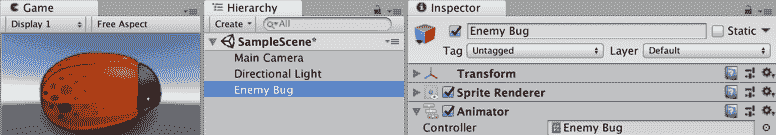

1.  如果你查看项目面板，你会看到创建了两个新的资产文件：beetle-right 动画剪辑和一个名为 Enemy Bug 的动画控制器：

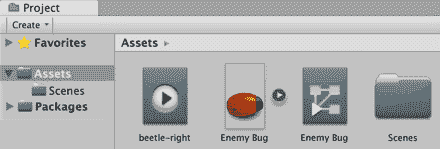

1.  关闭**动画**面板，双击**敌人虫子动画控制器**以开始编辑它——它应该出现在一个新的**动画器**面板中。你应该看到四个**状态**，任何状态和退出都是未链接的，状态进入有一个过渡箭头连接到动画剪辑 beetle-right。这意味着一旦动画控制器开始播放，它将进入 beetle-right 状态。状态 beetle-right 被着色为橙色，以表示它是默认状态。

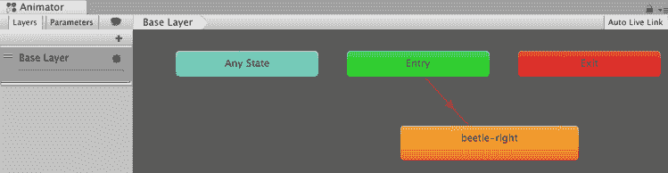

如果只有一个动画剪辑状态，它将自动成为默认状态。一旦你在状态图中添加了其他状态，你可以右键单击不同的状态，并使用上下文菜单更改首先进入的状态。

1.  选择 beetle-right 状态并复制它，将副本重命名为 beetle-left（可以使用右键菜单或 *Ctrl *+ *C*/*V* 键盘快捷键）。将 beetle-left 定位在 beetle-right 的**左侧**是有意义的：

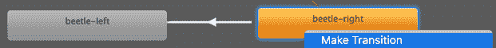

1.  将鼠标指针移至 beetle-right 状态，然后在鼠标右键上下文菜单中选择创建过渡，并将出现的白色箭头拖动到 beetle-left 状态：

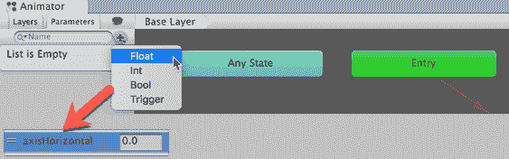

1.  使用 beetle-left 重复此步骤，以创建从 beetle-left 到 beetle-right 的转换回：

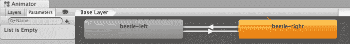

1.  我们需要一个左右面向的实例转换。因此，对于**每个**转换，取消选中“有退出时间”选项。点击转换箭头以选择它（它应该变成蓝色），然后在**检查器**中取消选中此选项：


要删除转换，首先选择它，然后使用*删除*键（**Windows**）或按*Fn* + *退格键*（**macOS**）。

1.  为了决定何时更改活动状态，我们需要创建一个参数来指示*左/右*箭头键是否被点击。*左/右*键的按下由 Unity 输入系统的水平轴值表示。通过在**动画师**面板的左上角选择参数（而不是层），点击加号符号"+"按钮，并选择浮点数，创建一个名为 axisHorizontal 的状态图浮点参数。将你的新**参数**命名为 axisHorizontal：

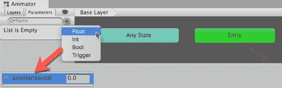

1.  使用我们的参数，我们可以定义在左右面向状态之间切换的条件。当按下*左箭头键*时，Unity 输入系统的水平轴值是负值，因此选择从 beetle-right 到 beetle-left 的转换，并在**检查器**中点击转换属性条件部分的加号符号。由于只有一个参数，这会自动建议，默认为大于零。将大于改为小于，我们就得到了所需的条件：

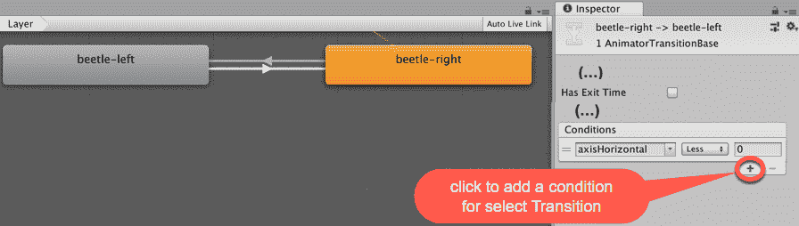

1.  现在，选择从 beetle-left 到 beetle-right 的转换，并添加一个条件。在这种情况下，默认的 axisHorizontal 大于零正好是我们想要的（因为当按下*右箭头键*时，Unity 输入系统的水平轴返回正值）。

1.  我们需要一个方法来将 Unity 输入系统的水平轴值（来自*左/右*数组键）映射到我们的动画师状态图参数 axisHorizontal。我们可以通过创建一个简短的脚本类来实现这一点，我们将在下一步中创建它。

1.  创建一个名为 InputMapper 的 C#脚本类，并将实例对象作为组件添加到 Enemy Bug 游戏对象中：

```cs
    using UnityEngine;

    public class InputMapper : MonoBehaviour {
         Animator animator;

         void Start() {
             animator = GetComponent<Animator>();
         }

         void Update() {
             animator.SetFloat("axisHorizontal", Input.GetAxisRaw("Horizontal"));
         }
     } 
```

1.  现在我们需要实际更改 GameObject 在切换到左右面向状态时的本地缩放属性。创建一个名为 LocalScaleSetter 的 C#脚本类：

```cs
    using UnityEngine;

     public class LocalScaleSetter : StateMachineBehaviour  {
         public Vector3 scale = Vector3.one;

         override public void OnStateEnter(Animator animator, AnimatorStateInfo stateInfo, int layerIndex) {
             animator.transform.localScale = scale;
         }

     } 
```

1.  在动画师面板中，选择 beetle-right 状态。在**检查器**中，点击添加行为按钮，并选择 LocalScaleSetter。对于此状态，默认的公共 Vector three 缩放值(1,1,1)是合适的。

1.  在动画师面板中，选择 beetle-left 状态。在**检查器**中，点击添加行为按钮，并选择 LocalScaleSetter。将公共 Vector three 缩放值更改为(-1,1,1) – 即，我们需要交换 X 缩放以使我们的 Sprite 面向左侧：

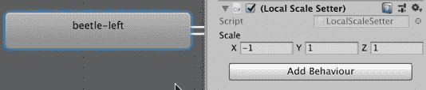

将 C# 脚本类的实例对象添加到动画器状态中是将进入/退出状态时的逻辑与动画器状态本身链接起来的好方法。

1.  在动画器面板中，选择 `beetle-right` 状态。在检查器中，点击添加行为按钮，并选择 InputMapper。

1.  当你运行 **场景** 时，按下 *左* 和 *右* 方向键应该使虫子面向左边或右边。

# 它是如何工作的...

每一帧，`InputMapper` C# 脚本类的 `Update()` 方法都会读取 Unity 输入系统的水平轴值，并将动画器状态图表参数 `axisHorizontal` 设置为该值。如果该值小于（左箭头）或大于（右箭头）零，如果适当，动画器状态系统将切换到另一个状态。

实际上改变 `LocalScaleSetter` C# 脚本类的 `localScale` 属性（初始值 1,1,1，或水平翻转使其面向左边 -1,1,1）。对于每个状态，公共 **Vector3** 变量都可以自定义到适当的值。

每次进入此 C# 类的实例附加到的状态时，都会涉及 `OnStateEnter(...)` 方法。您可以在 [`docs.unity3d.com/ScriptReference/StateMachineBehaviour.html`](https://docs.unity3d.com/ScriptReference/StateMachineBehaviour.html) 阅读有关 StateMachineBehaviour 类的各种事件消息。

当我们按下 *左* 方向键时，Unity 输入系统的水平轴值是负数，并将其映射到动画器状态图表，即 `Parameter axisHorizontal`，导致系统过渡到 `beetle-left` 状态，并执行 **LocalScaleSetter** 脚本类实例的 `OnStateEnter(...)`，将局部缩放设置为 **(-1, 1, 1**)，使 **纹理** 水平翻转，因此甲虫面向左边。

# 还有更多...

这里有一些增强此配方的建议。

# 瞬时交换

你可能已经注意到，即使我们设置了退出时间为零，仍然存在延迟。这是因为从一个状态过渡到另一个状态时存在默认混合。但是，这可以设置为 0，以便状态机可以瞬时从一个状态切换到下一个状态。

执行以下操作：

1.  在 **Animator** 面板中选择每个过渡。

1.  展开设置属性。

1.  将过渡持续时间和过渡偏移量都设置为 0：

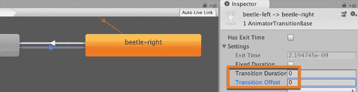

现在当你运行 **场景** 时，当你按下相应的箭头键时，虫子应该立即左右切换。

# 为角色移动事件动画化身体部位

在这个配方中，我们将学习如何根据跳跃事件动画化 Unity 土豆人角色的帽子。

# 准备工作

对于这个配方，我们在文件夹 `08_03` 中准备了所需的文件。

# 如何做到这一点...

要为角色移动事件动画化身体部位，请按照以下步骤操作：

1.  创建一个新的 Unity 2D 项目。

1.  将提供的 PotatoManAssets 包导入到你的项目中。

1.  将 **主摄像机** 的尺寸增加到 10。

1.  为此项目设置 2D 重力设置 - 我们将使用与 Unity 2D 平台教程相同的设置，Y= -30。通过选择菜单：编辑 | 项目设置 | 物理效果 2D，将 2D 重力设置为该值，然后在顶部将 Y 值更改为 -30：

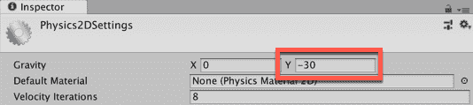

1.  将 PotatoMan hero character2D 的实例从 Project | 预制体文件夹拖动到 **场景** 中。将此 GameObject 定位于 (0, 3, 0)。

1.  将 Project | Sprites 文件夹中的 sprite platformWallBlocks 的实例拖动到 **场景** 中。将此 GameObject 定位于 (0, -4, 0)。

1.  通过选择菜单：添加组件 | 物理效果 2D | 矩形碰撞器 2D，将矩形碰撞器 2D 组件添加到 platformWallBlocks GameObject。

1.  现在我们有一个静止的平台，玩家可以着陆并左右行走。创建一个名为 Ground 的新层，并将 platformWallBlocks GameObject 分配到这个新层，如下截图所示。当角色在平台上时，按下 *空格* 键现在会使他跳跃：


1.  目前，当我们将 PotatoMan 英雄角色设置为跳跃时，他会被动画化（手臂和腿部移动）。让我们删除动画剪辑和动画控制器，从头开始创建自己的。如以下所示，从项目 | 资产 | PotatoMan2DAssets | Character2D | 动画中删除 Clips 和 Controllers 文件夹：

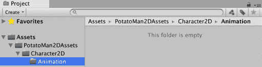

1.  让我们为我们的英雄角色创建一个动画剪辑（及其关联的动画控制器）。在**层次结构**中选中 GameObject hero。确保在**层次结构**中选中 GameObject hero character2D，打开**动画**面板，并确保它处于 Dope Sheet 视图（这是默认视图）。

1.  点击 **动画** 面板的创建按钮，并将新剪辑保存到 Character2D | 动画文件夹中，命名为 character-potatoman-idle。你现在已为空闲角色状态（未动画）创建了一个动画剪辑：

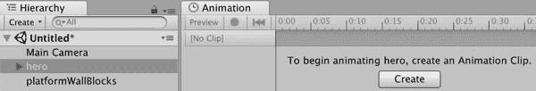

你的最终游戏可能包含数十个，甚至数百个动画剪辑。通过在剪辑名称前缀中添加对象类型、名称以及动画剪辑的描述，使搜索变得容易。

1.  在**项目**面板中查看 Character2D | 动画文件夹，你现在应该看到你刚刚创建的动画剪辑（character-potatoman-idle）和一个新的动画控制器，该控制器默认为你的 hero character2D GameObject 的名称：

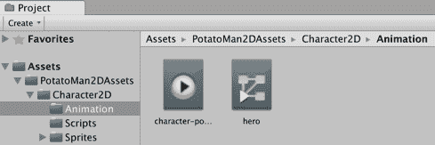

1.  确保在**层次结构**中选中了英雄 GameObject，打开**动画**面板，你会看到控制我们角色动画的状态机。由于我们只有一个动画剪辑（character-potatoman-idle），进入时，状态机立即进入此状态：

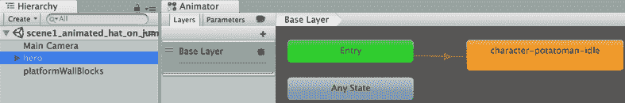

1.  运行你的**场景**。由于角色始终处于“空闲”状态，当我们让它跳跃时，我们还没有看到任何动画。

1.  创建一个跳跃动画剪辑，使帽子动画。确保在**层次结构**中仍然选中了**英雄**GameObject。点击**动画**面板（“样本”一词旁边的）中的空下拉菜单，并在你的动画文件夹中创建一个新的剪辑，命名为 character-potatoman-jump：

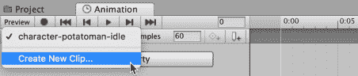

1.  点击“添加属性”按钮，通过点击其+（加号）按钮选择帽子子对象的 Transform | Position。我们现在可以记录在这个动画剪辑中帽子 GameObject 的(X, Y, Z)位置的变化：

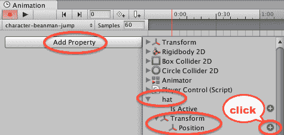

1.  你现在应该看到在 0.0 和 1.0 处有两个关键帧。这些在**动画**面板右侧部分的**时间轴**区域用菱形表示。

1.  点击选择第一个关键帧（在时间 0.0 处）——菱形应该变成蓝色以表示它已被选中。

1.  让我们为这个第一帧记录一个新的帽子位置。在**动画**面板中点击一次红色记录圆圈按钮开始记录。现在在**场景**面板中，将帽子向上和向左移动一点，远离头部。你应该会看到在**检查器**中所有三个 X, Y, Z 值都有红色背景——这是为了通知你 Transform 组件的值正在被记录在动画剪辑中：

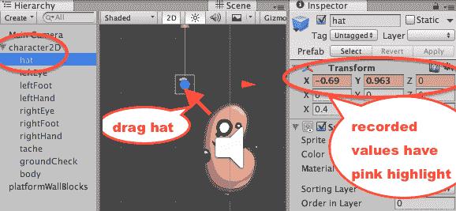

1.  再次点击红色记录圆圈按钮，在**动画**面板中停止记录。

1.  由于 1 秒可能对于我们跳跃动画来说太长了，将第二个关键帧的菱形向左拖动到 0.5 的时间：

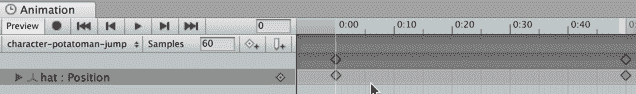

1.  我们需要定义角色应该从空闲状态过渡到跳跃状态的时间。在**动画器**面板中，选择 character-potatoman-idle 状态，通过右键单击并选择 Make Transition 菜单，然后拖动过渡箭头到 character-potatoman-jump 状态，如图所示：


1.  让我们在动画器面板的左上角点击添加参数加号“+”按钮，选择触发器，并输入名称“Jump”来添加一个名为“Jump”的触发参数：

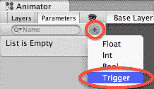

1.  我们现在可以定义当我们的角色应该从空闲状态过渡到跳跃状态时的属性。点击过渡箭头选择它，设置以下两个属性，并在**检查器**面板中添加一个条件：

    +   已有退出时间：取消选中此选项

    +   过渡持续时间（秒）：设置为 0.01

    +   条件：添加跳跃（点击底部的+按钮）：

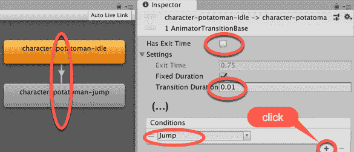

1.  保存并运行你的**场景**。一旦角色在平台上着陆并按下空格键跳跃，你会看到角色的帽子从头上跳开，并慢慢移动回来。由于我们没有添加离开跳跃状态的过渡，这个动画剪辑将循环，所以即使跳跃完成，帽子也会继续移动。

1.  在**动画器**面板中，选择`character-potatoman-jump`状态并添加一个新的过渡回到`character-potatoman-idle`状态。选择这个过渡箭头，并在**检查器**面板中设置其属性如下：

    +   有退出时间：（保持选中）

    +   退出时间：0.5（这需要与我们的跳跃动画剪辑的第二个关键帧相同的时值）：

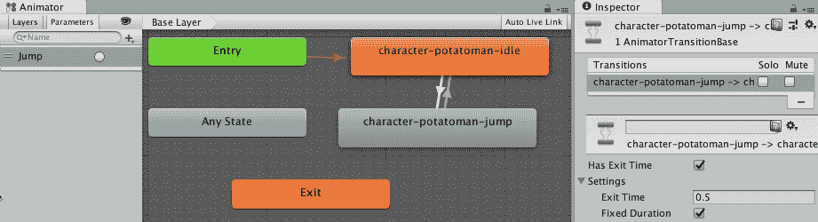

1.  保存并运行你的**场景**。现在当你跳跃时，帽子应该动一次，然后角色立即回到空闲状态。

# 它是如何工作的...

你已经将动画控制器状态机添加到了英雄游戏对象中。你创建的两个动画剪辑（空闲和跳跃）在**动画器**面板中显示为状态。当状态机接收到跳跃触发参数时，你创建了一个从空闲到跳跃的过渡。你创建了第二个过渡，在等待 0.5 秒后（与我们的跳跃动画剪辑中的两个关键帧之间的相同持续时间）返回到空闲状态。

玩家通过按下**空格**键使角色跳跃。这会导致英雄游戏对象的`PlayerControl` C#脚本组件中的代码被调用，使精灵在屏幕上向上移动，并给动画控制器组件发送一个名为跳跃的`SetTrigger(...)`消息。

布尔参数和触发器的区别在于，触发器被临时设置为 True，一旦`SetTrigger(...)`事件被状态转换消耗，它将自动返回到 False。因此，触发器适用于我们希望执行一次然后恢复到之前状态的行动。布尔参数是一个变量，可以在游戏的不同时间将其值设置为 True 或 False，因此可以创建不同的过渡，根据变量在任何时间的值来触发。请注意，布尔参数必须使用`SetBool(...)`显式地将值设置回 False。

以下截图突出了发送`SetTrigger(...)`消息的代码行：


用于一系列动作（跑步/行走/跳跃/坠落/死亡）的动画状态机将具有更多状态和过渡。Unity 提供的土豆人英雄角色具有更复杂的状态机，以及更复杂的动画（每个动画剪辑的手和脚、眼睛和帽子等），这可能对你探索这些内容很有用。

在 Unity 手册网页上了解更多关于动画视图的信息：[`docs.unity3d.com/Manual/AnimationEditorGuide.html.`](http://docs.unity3d.com/Manual/AnimationEditorGuide.html.)

# 创建一个三帧动画剪辑以使平台持续动画

在此配方中，我们将制作一个看起来像木头的平台持续动画，上下移动。这可以通过一个三帧的动画剪辑（从顶部开始，位置到底部，然后再次回到顶部位置）来实现：

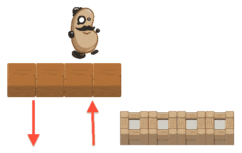

# 准备工作

此配方基于上一个配方，因此复制该项目，并在此配方中对其副本进行操作。

# 如何操作...

要创建一个持续移动的动画平台，请按照以下步骤操作：

1.  将平台木块精灵实例从“项目 | 精灵”文件夹拖动到**场景**中。将此 GameObject 定位在(-4, -5, 0)，这样这些木块就整齐地位于墙块平台的左侧，并且略微低于平台。

1.  向**平台木块**GameObject 添加一个 Box Collider 2D 组件，以便玩家角色也能站在这个平台上。选择菜单：添加组件 | 物理 2D | Box Collider 2D。

1.  创建一个名为“动画”的新文件夹，用于存储我们将创建的动画剪辑和控制器。

1.  确保**平台木块**GameObject 仍然被选中在**层次结构**中，打开一个**动画**面板，并确保它处于 Dope Sheet 视图（这是默认视图）。

1.  点击**动画**面板的创建按钮，并将新剪辑保存在您的新动画文件夹中，命名为 platform-wood-moving-up-down。

1.  点击**添加属性**按钮，选择 Transform，然后点击位置旁边的加号。我们现在准备好记录在此动画剪辑中对**平台木块**GameObject 的(X, Y, Z)位置所做的更改：

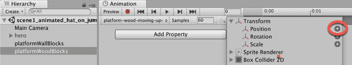

1.  您现在应该看到在 0.0 和 1.0 处有两个关键帧。这些在**动画**面板右侧部分的“时间轴”区域由菱形表示。

1.  我们需要 3 个关键帧，新关键帧在`2:00`秒处。在动画面板顶部的 2:00 处单击，以便当前播放头时间的红色线位于 2:00 处。然后单击菱形+按钮在当前播放头时间创建一个新的关键帧：

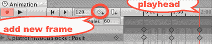

1.  第一个和第三个关键帧是好的——它们记录了木平台在 Y= -5 处的当前高度。我们需要使中间关键帧记录平台在运动顶部的位置，Unity 将为我们完成所有其余的动画工作。

1.  通过单击时间 1:00 处的菱形来选择中间关键帧（在时间 1:00 处），它们都应该变成蓝色，并且红色播放头垂直线应移动到 1:00，以指示正在编辑中间关键帧。

1.  点击红色录音圆按钮开始记录更改。

1.  在**检查器**中，将平台的 Y 位置更改为 0。你应该会看到所有三个 X、Y 和 Z 值在**检查器**中都有红色背景——这是为了通知你 Transform 组件的值正在记录在动画剪辑中。

1.  再次点击红色记录圆圈按钮，以完成更改的记录。

1.  保存并运行您的场景。现在，木平台应该正在连续动画，平滑地上下移动到我们设置的位置。

如果你想让 potatoman 角色能够在移动的木块上跳跃，你需要选择该块 GameObject 并将其层设置为地面。

# 它是如何工作的...

您已将动画添加到 platformWoodBlocks GameObject。此动画包含三个关键帧。关键帧表示对象在某一时间点的属性值。第一个关键帧存储 Y 值为-4，第二个关键帧 Y 值为 0，最后一个关键帧再次为-4。Unity 为我们计算所有中间值，结果是平台 Y 位置的平滑动画。

# 更多...

这里有一些增强此配方的建议。

# 将动画相对于新的父 GameObject 进行复制

如果我们想要复制移动平台，简单地复制 platformWoodBlocks GameObject 在**层次结构**中并移动副本将不起作用——因为当你运行**场景**时，每个副本都会被动画回原始动画帧的位置（即，所有副本都会定位并移动到原始位置）。

解决方案是首先创建一个新的空 GameObject（命名为 movingBlockParent），然后创建一个 platformWoodBlocks 父 GameObject。现在我们可以复制 movingBlockParent GameObject（及其 platformWoodBlocks 子 GameObject）来创建更多移动的方块，这些方块在场景中相对于父 GameObject 的位置**设计时**移动。

# 使用触发器将动画从一个状态移动到另一个状态，使平台一旦被踩到就开始下落

在许多情况下，我们不想在满足某些条件或发生某些事件之前开始动画。在这些情况下，组织 Animator Controller 的一个好方法是在两个动画状态（剪辑）之间设置一个触发器。我们使用代码检测何时想要动画开始播放，并在那时向动画控制器发送触发器消息，从而开始过渡。

在此配方中，我们将在我们的 2D 平台游戏中创建一个水平台方块；这些方块一旦被踩到，就会开始慢慢向下屏幕落下，因此玩家必须继续移动，否则他们也会随着方块一起掉落屏幕！它看起来如下：


# 准备工作

此配方基于之前的配方，因此复制该项目，并在副本上工作以进行此配方。

# 如何操作...

要构建一个只有在接收到触发器后才会播放的动画，请遵循以下步骤：

1.  在**层次结构**中创建一个名为 water-block-container 的空 GameObject，位置在(2.5, -4, 0)。这个空 GameObject 将允许我们制作动画 Water Block 的副本，这些副本将相对于其父 GameObject 的位置进行动画。

1.  将 Project | Sprites 文件夹中的 Water Block 精灵实例拖动到场景中，并将其子对象设置为 water-block-container GameObject。确保你的新子 Water Block GameObject 的位置是(0, 0, 0)，这样它就会整齐地出现在墙块平台右侧：

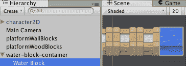

1.  向 child Water Block GameObject 添加一个 Box Collider 2D 组件，并将此 GameObject 的层设置为 Ground，以便玩家的角色可以站在这个水块平台上跳跃。

1.  确保在**层次结构**中选择 child Water Block GameObject，打开**动画**面板，然后创建一个名为 platform-water-up 的新剪辑，并将其保存在你的动画文件夹中。

1.  创建第二个动画剪辑，命名为 platform-water-down。再次点击“添加属性”按钮，选择变换和位置，并删除 1:00 处的第二个关键帧。

1.  选择 0:00 的第一个关键帧，点击一次红色记录按钮开始记录更改，并将 GameObject 的变换位置 Y 值设置为-5。再次按下红色记录按钮停止记录更改。你现在已经完成了 water-block-down 动画剪辑的创建，因此可以点击红色记录按钮停止记录。

1.  你可能已经注意到，除了你创建的上下动画剪辑外，在动画文件夹中还创建了一个名为 Water Block 的动画控制器文件。选择此文件并打开动画器面板，以查看和编辑状态机图：

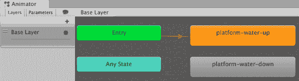

1.  目前，尽管我们创建了 2 个动画剪辑（状态），但只有 Up 状态始终处于活动状态。这是因为当场景开始时（入口），对象将立即进入 platform-water-up 状态，但由于没有从这个状态到 platform-water-down 的过渡箭头，目前 Water Block GameObject 将始终处于其 Up 状态。

1.  确保选择 platform-water-up 状态（它周围将有一个蓝色边框），然后通过鼠标右键点击菜单中的 Make Transition 选项创建一个到 platform-water-down 状态的过渡（箭头）。

1.  如果你现在运行场景，默认的过渡设置是在 0.75 秒（默认退出时间）后，Water Block 将过渡到其下状态。我们不想这样——我们只想在玩家走上它们之后让它们向下动画。

1.  通过在**动画器**面板中选择参数选项卡，点击+按钮并选择触发器，然后选择 Fall 来创建一个名为 Fall 的触发器。

1.  按以下步骤创建等待触发器的过渡：

    +   在**动画**面板中，选择过渡

    +   在**检查器**面板中，取消选中 Has Exit Time 选项

    +   将过渡持续时间设置为 3.0（这样水块将在 2 秒内缓慢过渡到其下状态）

    +   在**检查器**面板中，点击+按钮添加一个条件，它应该自动建议唯一的可能条件参数，即我们的触发下落：

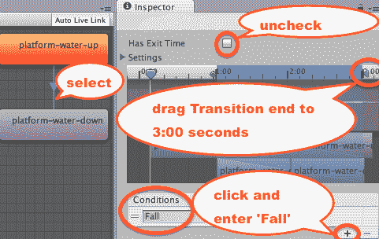

设置过渡持续时间的另一种方法是，在**检查器**中过渡设置提供的动画时间轴上拖动过渡结束时间到 3:00 秒。

1.  我们需要在水块上方添加一个 Collider 触发器，并为玩家进入 Collider 时发送 Animator Controller 触发器消息添加一个 C#脚本类行为。

1.  确保选中子 Water Block GameObject，添加一个（第二个）2D Box Collider，Y 偏移量为 1，并勾选其 Is Trigger 复选框：


1.  创建一个名为 WaterBlock 的 C#脚本类，并将实例对象作为组件添加到子 Water Block GameObject：

```cs
    using UnityEngine;
     using System.Collections;

     public class WaterBlock : MonoBehaviour {
       private Animator animatorController;

       void Start(){
         animatorController = GetComponent<Animator>();
       }

       void OnTriggerEnter2D(Collider2D hit){
         if(hit.CompareTag("Player")){
           animatorController.SetTrigger("Fall");
         }
       }
     } 
```

1.  将 water-block-container GameObject 复制 6 次，每次 X 位置增加 1，即 3.5、4.5、5.5 等等。

1.  运行**场景**，当玩家的角色跑过每个水块时，它们将开始下落，所以他最好继续跑！

# 它是如何工作的...

您创建了一个两状态 Animator Controller 状态机。每个状态都是一个动画剪辑。您创建了一个从水块上状态到其下状态的过渡，当 Animator Controller 接收到下落触发器消息时将发生此过渡。您创建了一个带有触发器的 Box Collider 2D，以便当玩家（标记为 Player）进入其 Collider 时，可以检测到脚本 WaterBlock 组件，并在此点发送下落触发器消息，使水块 GameObject 开始逐渐过渡到屏幕下方的下状态。

在 Unity Manual 网页上了解更多关于 Animator Controllers 的信息：[`docs.unity3d.com/Manual/class-AnimatorController.html`](http://docs.unity3d.com/Manual/class-AnimatorController.html)。

# 从精灵图集序列创建动画剪辑

传统的动画方法涉及手工绘制许多略有不同的图像，这些图像快速逐帧显示，以产生运动的外观。对于计算机游戏动画，Sprite Sheet 这个术语用于包含一个或多个精灵帧序列的图像文件。Unity 提供工具将单个精灵图像拆分成大型的 Sprite Sheet 文件，以便可以使用单个帧或帧的子序列来创建动画剪辑，这些动画剪辑可以成为 Animator Controller 状态机中的状态。在这个菜谱中，我们将导入并拆分一个开源怪物精灵图集到三个动画剪辑中，用于空闲、攻击和死亡，看起来如下所示：

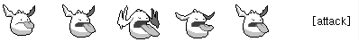

# 准备中

对于本章中的所有食谱，我们已经在文件夹 `08_04` 中准备了所需的精灵图像。感谢 Rosswet Mobile 使这些精灵以 **开源** 的形式在 [`www.rosswet.com/wp/?p=156`](http://www.rosswet.com/wp/?p=156) 可用。

# 如何做到这一点...

要从逐帧动画图像的精灵图中创建动画，请按照以下步骤操作：

1.  创建一个新的 Unity 2D 项目。

1.  导入提供的图像：monster1。

1.  在 **项目** 面板中选中 monster1 图像，在 **检查器** 中将其 Sprite 模式更改为 Multiple，然后点击面板底部的 Apply 按钮：

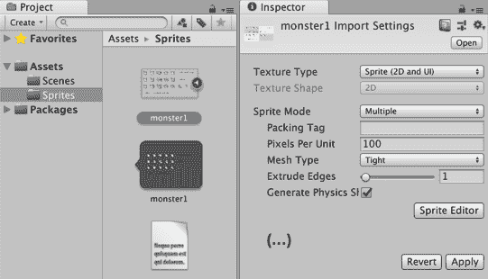

1.  在 **检查器** 中，通过点击 Sprite Editor 按钮打开 Sprite 编辑器面板。

1.  在 Sprite 编辑器中，打开 Slice 下拉对话框，将类型设置为 Grid，将网格像素大小设置为 64x64，然后点击 Slice 按钮。对于类型，选择 Grid by CellSize，并将 X 和 Y 设置为 64。点击 Slice 按钮，然后在 Sprite 编辑器面板右上方的栏中点击 Apply 按钮：

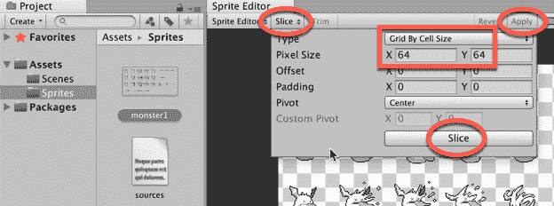

1.  在 **项目** 面板中，你现在可以点击精灵右侧的展开三角形按钮，你会看到这个精灵的所有不同子帧（如下面的截图所示）：

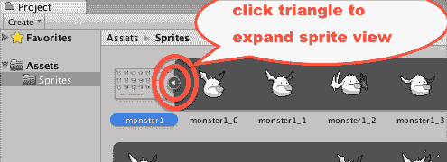

1.  创建一个名为 Animations 的文件夹。

1.  在你的新文件夹中，创建一个名为 monster-animator 的动画控制器资产文件，选择 **项目** 面板菜单：创建 | 动画控制器。

1.  在场景中，创建一个名为 monster1（位置为 0, 0, 0）的新空 GameObject，并将你的怪物动画器拖拽到这个 GameObject 上。

1.  在 **层次结构** 中选中 monster1 GameObject，打开 **动画** 面板，创建一个名为 monster1-idle 的新动画剪辑。

1.  在 **项目** 面板中选中 monster1 图像（在其展开视图中），选择并拖动前 5 帧（monster1_0 到 monster1_4）到 **动画** 面板。将样本率更改为 12（因为此动画是为每秒 12 帧而创建的）：

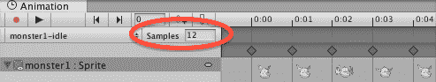

1.  如果你查看 monster-animator 的状态图，你会看到它有一个默认状态（剪辑）名为 monster-idle。

1.  当你运行你的 **场景** 时，你现在应该看到 monster1 GameObject 在其 monster-idle 状态中动画。你可能希望将 **主摄像机** 的大小缩小一点（大小 1），因为这些精灵相当小：

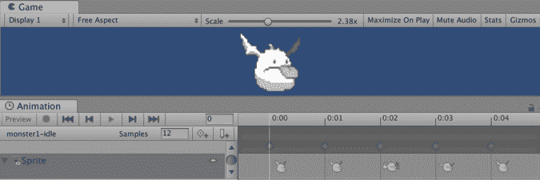

# 它是如何工作的...

Unity 的 Sprite 编辑器了解 Sprite Sheets，一旦输入了正确的网格大小，它就会将 Sprite Sheet 图像中每个网格方格内的项目视为单个图像或动画的帧。您选择了精灵动画帧的子序列，并将它们添加到几个动画剪辑中。您为您的人物对象添加了动画控制器，因此每个动画剪辑都作为动画控制器状态机中的一个状态出现。

您现在可以重复此过程，创建一个动画 Clipmonster-attack，包含帧 8-12，以及第三个动画 clip monster-death，包含帧 15-21。然后，您将创建触发器和转换，使怪物 GameObject 在游戏进行时过渡到适当的状态。

在 Unity 视频教程中了解更多关于 Unity Sprite 编辑器的信息：[`unity3d.com/learn/tutorials/modules/beginner/2d/sprite-editor`](https://unity3d.com/learn/tutorials/modules/beginner/2d/sprite-editor)。

在 John Horton 在 GameCodeOldSchool.com 上的一篇文章中了解更多关于使用 Sprite Sheets 进行 2D 动画的信息：[`gamecodeschool.com/unity/simple-2d-sprite-sheet-animations-in-unity/`](http://gamecodeschool.com/unity/simple-2d-sprite-sheet-animations-in-unity/)。

# 使用 Tile 和 Tilemaps 创建平台游戏

Unity 引入的强大 2D 工具之一是 Tilemapper。在这个菜谱中，我们将创建一个简单的 2D 平台游戏，使用一些免费的 Tile **Sprite**图像构建基于网格的**场景**：

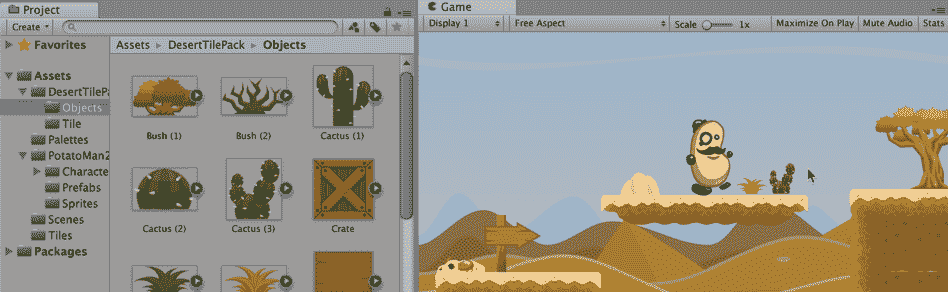

# 准备工作

对于这个菜谱，我们在文件夹`08_07`中准备了所需的 Unity 包和图像。

特别感谢 GameArt2D.com 发布带有 Creative Commons Zero 许可的 Desert 图像 Sprites：[`www.gameart2d.com/free-desert-platformer-tileset.html`](https://www.gameart2d.com/free-desert-platformer-tileset.html)。

# 如何做到这一点...

要使用 Tile 和 Tilemaps 创建平台游戏，请按照以下步骤操作：

1.  创建一个新的 Unity 2D 项目。

1.  导入提供的图像。

1.  我们在这个菜谱中使用的 Tile Sprites 大小为 128 x 128 像素。确保我们将每单位像素设置为 128，这样我们的 Sprite 图像就会映射到 1 x 1 Unity 单位的网格。选择 Project | DesertTilePack | Tile 文件夹中的所有 Sprites，并在**检查器**中将每单位像素设置为 128：

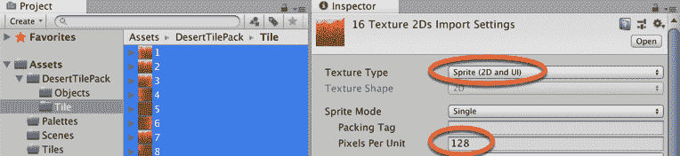

1.  显示**Til****e Palette**面板，通过选择菜单：窗口 | 2D | Tile Palette。

1.  在**项目**面板中，创建一个名为 Palettes 的新文件夹（这是保存你的 TilePalette 资产的地方）。

1.  在 Tile Palette 面板中点击创建新调色板按钮，并创建一个名为 DesertPalette 的新 Tile Palette：

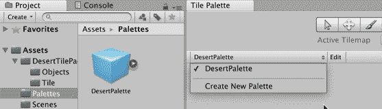

1.  在**项目**面板中，创建一个名为 Tiles 的新文件夹（这是保存你的 Tile 资产的地方）。

1.  确保在 Tile Palette 面板中选择了 Tile Palette DesertPalette，选择 Project | DesertTilePack | Tile 文件夹中的所有 Sprite，并将它们拖动到 Tile Palette 面板中。当被问及保存这些新的 Tile 资产文件的位置时，选择你的新 Assets | Tiles 文件夹。现在你应该在你的 Tiles 文件夹中有 16 个 Tile 资产，并且这些 Tile 应该在**Tile Palette**面板中的 DesertPalette 中可用：

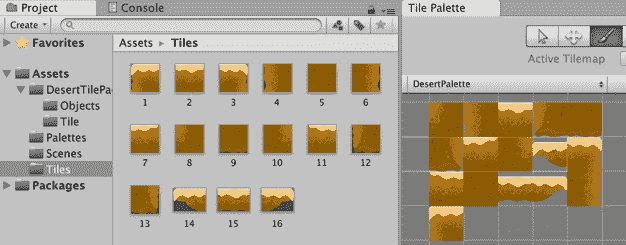

1.  从项目面板拖动 Sprite BG 到场景中，DesertTilePack，然后调整**主摄像机**的大小（由于这是一个 2D 项目，它应该是正交的），以便沙漠背景填满整个**游戏**面板。

1.  向**场景**中添加一个 Tilemap GameObject，选择创建菜单：2D Object | Tilemap。你会看到一个 Grid GameObject 被添加，并且作为它的子对象，你会看到一个 Tilemap GameObject。将 Tilemap GameObject 重命名为 Tilemap-platforms：

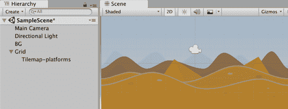

正如 UI GameObjects 是 Canvas 的子对象一样，Tilemap GameObjects 是 Grid 的子对象。

1.  我们现在可以开始在 Tilemap 上*绘制*Tile 了。确保在**层次结构**中选择 Tilemap-platforms，并且你可以看到 Tile Palette 面板。在 Tile Palette 面板中，选择使用活动刷子工具（*画笔*图标）。现在点击 Tile Palette 面板中的一个 Tile，然后在**场景**面板中，每次点击鼠标按钮你都会向 Tilemap-platforms 添加一个 Tile，并自动与网格对齐：

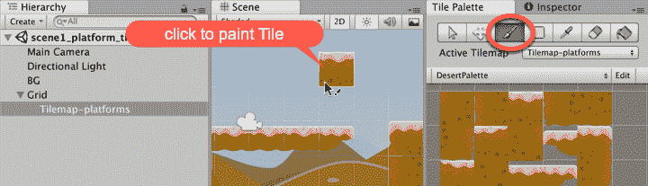

1.  如果你想要删除一个 Tile，使用 Shift-Click 在该网格位置上。

1.  使用 Tile Palette 刷子绘制两个或三个平台。

1.  向 Tilemap-platforms GameObject 添加一个合适的 Collider。在**层次结构**中选择 Tilemap-platforms GameObject，在**检查器**中添加一个 Tilemap Collider 2D。点击添加组件，然后选择 Tilemap | Tilemap Collider 2D。

1.  创建一个名为 Ground 的新层，并将 Tilemap-platforms GameObject 设置在这个层上（这将允许角色在平台上站立时跳跃）。

1.  让我们用二维角色来测试我们的**场景**平台——我们可以重用 Unity 免费教程中的 potatoman 角色。将提供的 PotatoManAssets 包导入到你的项目中。

1.  由于 potatoman 角色的尺寸相对于平台较大，我们需要为这个项目设置 2D 重力设置。我们将通过设置 Y= -60 的重力设置来使角色移动缓慢。通过选择菜单：编辑 | 项目设置 | 物理设置 2D，然后在顶部将 Y 值更改为-60 来设置 2D 重力。

1.  从项目 | 预制体文件夹中将 potatoman 英雄角色 2D 的一个实例拖动到**场景**中。将他定位在你其中一个平台上方。

1.  播放**场景**。2D 英雄角色应该会掉落并落在平台上。你应该能够左右移动角色，并使用*空格*键使他跳跃。

1.  您可能希望通过将一些对象精灵拖放到**场景**（在**项目**面板文件夹中，项目 | DesertTilePack | 对象）来装饰场景。

# 它是如何工作的...

通过拥有一组所有都是常规大小（128 x 128）的平台精灵，可以直接从这些精灵中创建一个 Tile 调色板，然后添加一个网格和 Tilemap 到**场景**中，使得 Tile 调色板笔可以绘制 Tile 到**场景**中。

您需要将精灵的像素每单位设置为 128，这样每个 Tile 就映射到 1 x 1 的 Unity 网格单位。

您已将 Tilemap Collider 2D 添加到 Tilemap GameObject 中，以便角色（如 potatoman）可以与平台交互。通过添加一个 Layer Ground，并将 Tilemap GameObject 设置为这个层，potatoman 角色控制器脚本中的跳跃代码可以测试被站立在上面的对象的层，这样跳跃动作只有在站在平台 Tile 上时才可能发生。

# 更多内容...

这里有一些增强这个食谱的建议。

# 对象和墙壁的 Tile 调色板

在沙漠免费包中的对象精灵大小各不相同，并且肯定与平台 Tile 的 128 x 128 精灵大小不一致。

然而，如果您的游戏中的对象和墙壁精灵与平台精灵大小相同，您可以为您的对象创建一个 Tile 调色板，并使用 Tile 调色板笔将它们绘制到**场景**中。

# 智能 Tile 选择规则 Tile

如果您探索 2D Extras Pack 或 2D GameKit（见下一个食谱），您将了解规则 Tile。这些允许您根据 Tile 的邻居定义关于 Tile 选择的规定。例如，您不会立即在另一个平台 Tile 的顶部放置一个平台顶 Tile，因此规则 Tile 会在平台顶 Tile 下方放置某种地面 Tile。规则可以确保组中最左端和最右端的 Tile 选择边缘的艺术品 Tile，等等。

在这个 Unity 现场培训视频会议中可以找到关于 Rule Times 的良好介绍：[`unity3d.com/learn/tutorials/topics/2d-game-creation/using-rule-tiles-tilemap`](https://unity3d.com/learn/tutorials/topics/2d-game-creation/using-rule-tiles-tilemap)。

# 学习更多

这里有一些关于 Tilemapping 的学习资源：

+   Unity TileMap 教程：[`unity3d.com/learn/tutorials/topics/2d-game-creation/intro-2d-world-building-w-tilemap`](https://unity3d.com/learn/tutorials/topics/2d-game-creation/intro-2d-world-building-w-tilemap)

+   Unity 教程 TileMap 资源：[`oc.unity3d.com/index.php/s/VzImolXrvp3K2Q5/download`](https://oc.unity3d.com/index.php/s/VzImolXrvp3K2Q5/download)

+   许多来自 Unity Technologies 的 2D 额外资源：[`github.com/Unity-Technologies/2d-extras`](https://github.com/Unity-Technologies/2d-extras)

+   Sean Duffy 在 Ray Wenderlich 网站上的优秀 Tilemapping 教程：[`www.raywenderlich.com/188105/introduction-to-the-new-unity-2d-tilemap-system`](https://www.raywenderlich.com/188105/introduction-to-the-new-unity-2d-tilemap-system)

# 使用 2D Gamekit 创建游戏

将一系列 Unity 2D 工具组合在一起，成为 Unity 2D GameKit。在本食谱中，我们将创建一个简单的 2D 平台游戏，以探索 2D GameKit 提供的一些功能，包括压力板、门和掉落物体伤害敌人：

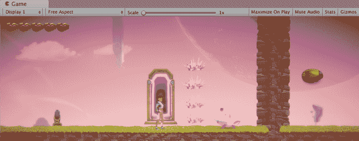

# 准备工作

本食谱使用免费的 Unity Asset Store 和包管理器包。

# 如何操作...

要使用**2D GameKit**创建游戏，请按照以下步骤操作：

1.  创建一个新的 Unity 2D 项目。

1.  使用包管理器安装 Cinemachine 和后处理包（如果已安装，下载 2D GameKit 时会出现错误）。

1.  从资产商店导入 2D GameKit（免费来自 Unity Technologies）。

1.  关闭并重新打开 Unity 编辑器。

1.  通过选择菜单：工具套件 | 创建新场景 创建一个新的 2D GameKit**场景**。然后您将被要求命名**场景**，并在您的项目 | 资产文件夹中创建一个新的**场景**资产文件。您会看到在您新**场景**的**层次结构**中有很多特殊游戏对象：

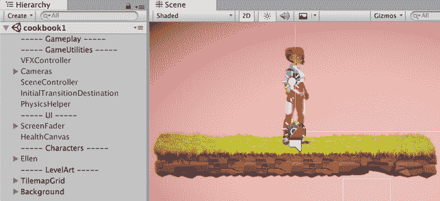

1.  如您所见，新的**场景**一开始包含一个动画 2D 角色（艾伦），以及一个小平台。

1.  在**检查器**中，选择 TilemapGrid 游戏对象的 Tilemap 子对象——我们正在为这个 Tilemap 游戏对象绘制一些瓦片。

1.  显示瓦片调色板，选择菜单：窗口 | 2D | 瓦片调色板。选择 TilesetGameKit，然后点击绿色顶部的草地平台瓦片。选择使用活动画笔工具（*画笔*图标）进行绘制。

1.  开始在**场景**上绘制草地顶部的平台。这是一个规则瓦片，因此它巧妙地确保只有接触组中顶部的瓦片被绘制为草地顶部的瓦片。其他接触的瓦片（左/右/下）被绘制为棕色、土质的瓦片。

1.  创建一个宽阔平坦的区域，然后在艾伦开始的地方右边，创建一个非常高的土墙，对于艾伦来说太高了，跳不过去。

1.  在艾伦和地球墙壁之间添加四个尖刺，这样她尝试跳过它们时会受伤。从 2DGameKit | 预制件 | 环境 项目文件夹中拖动尖刺预制件的实例。

1.  为了使事情更加困难，在尖刺和土墙之间添加一个 Chomper 敌人！从 2DGameKit | 预制件 | 敌人 项目文件夹中拖动 Chomper 预制件的实例：

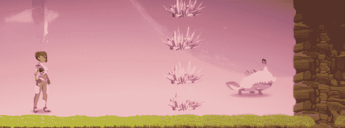

1.  我们必须给艾伦一些绕过土墙的方法，避免尖刺和 Chomper 障碍物。让我们在艾伦开始的地方左边添加一个传送门。从 2DGameKit | 预制件 | 交互式 项目文件夹中拖动传送门预制件的实例。

1.  让我们使用自定义 Sprite 创建一个传送器的目的地点。将敌人虫子 Sprite 导入此项目，并将实例从**项目**面板拖入场景——在地球墙的右侧某个位置。

1.  传送器需要在目标 GameObject 中有一个**转换点组件**。向敌人虫子添加一个 Collider 2D，选择添加组件 | 物理引擎 2D | 矩形碰撞器 2D。检查其**触发器**选项。

1.  向敌人虫子添加一个转换点组件，选择添加组件，搜索转换，然后添加转换点。

1.  我们现在可以设置传送器。在**层次结构**中选择传送器，在**检查器**的转换点（脚本）组件中，执行以下操作：

    +   转换游戏对象：将艾伦拖入此槽位

    +   转换类型：从下拉菜单中选择**同一场景**

    +   目的地变换：将敌人虫子拖入此转换点槽位

    +   转换时机：从下拉菜单中选择**触发器进入时**：


1.  运行**场景**。艾伦可以通过使用传送器安全地避开尖刺和咬合者。

1.  让我们让它更有趣一些——让传送器 GameObject 最初处于非活动状态（不可见或无法交互），并添加一个艾伦必须按下的开关来激活传送器。

1.  在**层次结构**中选择传送器 GameObject，并在**检查器**的左上角取消其活动框——GameObject 应该是不可见的，并在**层次结构**中显示为灰色。

1.  在游戏中添加一个单次使用的开关，位于艾伦开始的地方左侧。从 2DGameKit | Prefabs | 交互式项目文件夹中拖动单次使用开关的一个实例。

1.  在**层次结构**中选择**单次使用开关**，在**检查器**中设置以下内容：

    +   层：将**玩家层**添加到可交互层（这样开关可以通过玩家碰撞或射击子弹来启用）

    +   进入时：将传送器拖入一个仅运行时 GameObject 槽位，并将动作下拉菜单从无功能更改为 GameObject | 设置活动（布尔值），然后检查出现的复选框。

1.  运行**场景**。艾伦现在必须走到开关那里，以揭示传送器，然后它将她安全地运输到敌人虫子位置，越过地球墙，远离危险。

# 它是如何工作的...

我们已经涉猎了 2D GameKit 广泛的功能范围。希望这个配方能给你一个如何使用提供的 Prefab 以及如何探索如何使用适当添加的组件来创建自己的 GameObject 使用 2D GameKit 功能的想法。

如果你看看艾伦 2D 角色，你会看到一些脚本组件，它们管理着角色与 2D GameKit 的交互。这些包括：

+   2D 角色控制器：移动和物理交互

+   玩家输入：键盘/输入控制映射，以便您可以更改哪些键/控制器按钮控制移动、跳跃等

+   玩家角色：角色如何与 2D 游戏工具包交互，包括战斗（近战）、伤害和子弹池

在参考指南中了解更多关于艾伦及其组件的信息：[`unity3d.com/learn/tutorials/projects/2d-game-kit/ellen?playlist=49633`](https://unity3d.com/learn/tutorials/projects/2d-game-kit/ellen?playlist=49633).

# 还有更多...

这里有一些关于 Unity 2D 游戏工具包的学习资源：

+   Unity 的 2D 游戏工具包在线教程/参考指南/高级主题：[`unity3d.com/learn/tutorials/s/2d-game-kit`](https://unity3d.com/learn/tutorials/s/2d-game-kit)

+   Unity 官方 2D 游戏工具包论坛：[`forum.unity.com/threads/2d-game-kit-official-thread.517249/`](https://forum.unity.com/threads/2d-game-kit-official-thread.517249/)

+   Asset Store 2D 游戏工具包教程项目：[`assetstore.unity.com/packages/essentials/tutorial-projects/2d-game-kit-107098`](https://assetstore.unity.com/packages/essentials/tutorial-projects/2d-game-kit-107098)

+   Unity Technologies 制作的系列 YouTube 视频教程，标题为“2D 游戏工具包入门”：

    +   概述和目标 [1/8]：[`www.youtube.com/watch?v=cgqIOWu8W1c`](https://www.youtube.com/watch?v=cgqIOWu8W1c)

    +   艾伦和放置危险物 [2/8] 2018/2/21：[`www.youtube.com/watch?v=V2_vj_bbB4M`](https://www.youtube.com/watch?v=V2_vj_bbB4M)

    +   添加移动平台 [3/8]：[`www.youtube.com/watch?v=SfC3qYz4gAI`](https://www.youtube.com/watch?v=SfC3qYz4gAI)

    +   门窗和可破坏物体 [4/8]：[`www.youtube.com/watch?v=-hj6HnbI7PE`](https://www.youtube.com/watch?v=-hj6HnbI7PE)

    +   添加并挤压敌人 [5/8]：[`www.youtube.com/watch?v=WRKG_DDlUnQ`](https://www.youtube.com/watch?v=WRKG_DDlUnQ)

    +   使用物品系统 [7/8]：[`youtu.be/LYQz-mtr90U`](https://youtu.be/LYQz-mtr90U)

    +   传送和对话框 [8/8]：[`www.youtube.com/watch?v=gZ_OZL57c0g`](https://www.youtube.com/watch?v=gZ_OZL57c0g)
