# 第十一章：Web 服务器通信和在线版本控制

在本章中，我们将涵盖：

+   使用 PHP 和数据库设置排行榜

+   Unity 游戏与 Web 服务器排行榜的通信

+   创建和克隆 GitHub 仓库

+   将 Unity 项目添加到 Git 仓库，并将其推送到 GitHub

+   使用 GitHub for Unity 进行 Unity 项目版本控制

+   防止游戏在未知服务器上运行

# 简介

**服务器**等待接收请求**客户端**的消息，当收到消息时，它尝试解释并采取行动，然后向**客户端**发送适当的响应。**客户端**是一种可以与其他**客户端**和/或**服务器**通信的计算机程序。**客户端**发送**请求**，并接收**响应**。

在考虑和与**客户端**-**服务器**架构工作时，记住这些**客户端**/**服务器**/**请求**/**响应**的概念是有用的。

# 整体概念

世界是网络化的，涉及许多不同的**客户端**相互通信，以及与**服务器**通信。

每个 Unity 部署平台都展示了**客户端**的一个示例：

+   WebGL（在浏览器中运行）

+   Windows 和 Mac 应用程序

+   任天堂 Switch

+   微软 Xbox

+   索尼 PlayStation

这些游戏可以与之通信的**服务器**包括专用多人**游戏服务器**、常规 Web 服务器和在线数据库服务器。多人游戏开发是整本书的主题。

Web 和数据库服务器在游戏开发和运行时交互中可以扮演许多角色。Unity 游戏与 Web 服务器交互的一种形式是游戏与在线**服务器**通信以获取数据，例如高分、库存、玩家资料和聊天论坛。

另一种**客户端**-**服务器**关系是针对**分布式版本控制系统**（**DVCS**），其中本地计算机（笔记本电脑或台式机）上的内容可以与在线服务器同步，用于备份和历史变更目的，同时也允许与他人共享和协作编写代码项目。商业游戏公司内部使用私有仓库，而公共仓库用于**开源**项目，允许任何人访问内容。

本章中的食谱探讨了与 Unity 游戏开发、在线运行时通信以及云代码版本控制和共享相关的各种**客户端-服务器**通信场景。

# 使用 PHP 和数据库设置排行榜

当有玩家达到的高分排行榜时，游戏更有趣。即使是单人游戏也可以与共享的基于 Web 的排行榜通信。本食谱创建设置和从 SQL 数据库获取玩家分数的 Web **服务器端**（PHP）脚本。接下来的食谱将创建一个可以与这个 Web 排行榜**服务器**通信的 Unity 游戏**客户端**。

# 准备工作

这个食谱假设你或者拥有自己的网络托管，或者正在运行一个本地网络服务器。你可以使用内置的 PHP 网络**服务器**，或者像 Apache 或 Nginx 这样的网络**服务器**。对于数据库，你可以使用像 MySQL 或 MariaDB 这样的 SQL 数据库服务器，然而，我们尽量使用 SQLite——一个基于文件的数据库系统来简化事情。所以你实际上在电脑上需要的只是 PHP 7，因为它内置了网络**服务器**，并且可以与 SQLite 数据库通信，这正是这个食谱测试的设置。

这个食谱的所有 PHP 脚本和 SQLite 数据库文件都可以在`12_01`文件夹中找到。

如果你确实想安装一个网络服务器和数据库服务器应用程序，XAMPP 是一个很好的选择。它是一个免费的、跨平台的集合，包含了你在本地计算机上设置数据库和网络服务器所需的一切。下载页面还包含了 Windows、Mac 和 Linux 的常见问题解答和安装说明：[`www.apachefriends.org/download.html`](https://www.apachefriends.org/download.html)。

# 如何做到这一点...

要使用 PHP 和数据库设置排行榜，请执行以下操作：

1.  将提供的 PHP 项目复制到你将运行你的网络服务器的位置：

    +   **实时网站托管**：将文件复制到服务器上的实时网络文件夹（通常是`www`或`httdocs`）

    +   **在本地机器上运行**：在注释行，你可以使用 Composer 脚本快捷方式通过输入**composer run:**来运行内置的 PHP 网络服务器。


1.  使用网络浏览器打开你的网站位置：

    +   **实时网站托管**：访问你的托管域名的 URL

    +   **在本地机器上运行**：访问`localhost:8000` URL：

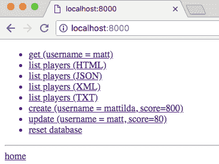

1.  通过点击最后一个项目符号链接：重置数据库来创建/重置数据库。你应该会看到一个带有消息“数据库已重置”和返回主页的链接（点击该链接）的页面。

1.  要在浏览器中以网页的形式查看排行榜分数，请点击第二个链接：列出玩家（HTML）：

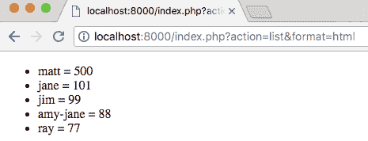

1.  尝试第五个链接——列出玩家（TXT）——以获取排行榜数据作为文本文件。注意它在浏览器中查看时的外观（浏览器忽略换行符），与在服务器返回的实际源文件中查看时的外观不同：


1.  使用 JSON 和 XML 选项做同样的事情——看看我们的**服务器**如何将数据库内容包装成 HTML、纯文本（TXT）、XML 或 JSON 返回。

1.  点击第六个链接——创建（用户名 = mattilda，分数=800）。当你下次检索内容时，你会看到有一个新的数据库记录，玩家 mattilda 的分数为 800。这表明我们的服务器可以接收数据并更改数据库的内容，而不仅仅是返回它。

# 它是如何工作的...

玩家的分数存储在 SQLLite 数据库中。通过提供的 PHP 脚本来方便地访问数据库。在我们的例子中，所有 PHP 脚本都放置在我们本地机器上的一个文件夹中，我们将从这个文件夹中运行服务器（使用 PHP 内置服务器时，它可以在任何地方）。因此，脚本通过 `http://localhost:8000` 访问。

所有访问都通过名为`index.php`的 PHP 文件进行。这被称为前端控制器，就像大楼里的接待员一样，解释请求并调用适当的函数执行一些操作，并以**响应**的形式返回给**请求**。

实现了五个操作，每个操作都通过在 URL 末尾添加操作名称来指示（这是 GET HTTP 方法，有时用于网页表单。例如，下次您在 Google 上搜索时，请查看浏览器的地址栏）。操作及其参数（如果有）如下：

+   **action = list & format = HTML / TXT / XML / JSON**：此操作请求返回所有玩家分数的列表。根据第二个变量格式（html/txt/xml/json）的值，用户和他们的分数以不同的文本文件格式返回。

+   **action = reset**：此操作请求一组默认玩家名称和分数值来替换数据库表中的当前内容。此操作不需要参数。它返回一些 HTML 声明数据库已重置，以及一个链接到主页。

+   **action = get & username = & format = HTML / TXT**：此操作请求找到指定玩家的整数分数。它返回分数整数。有两种格式：HTML，用于提供玩家分数的网页，TXT，其中 HTTP 消息返回的内容只有数值。

+   **action = update & username = <username> & score = <score>**：此操作请求将提供的分数存储在数据库中（但只有当这个新分数大于当前存储的分数时）。如果数据库更新成功，它返回单词 success，否则返回-1（表示没有更新发生）。

# 还有更多...

这里有一些方法可以进一步使用这个菜谱。

# SQLite、PHP 和数据库服务器

本菜谱中使用的 PHP 代码使用了 PDO 数据对象函数来与 SQLite 本地文件数据库进行通信。更多关于 PHP 和 SQLite 的信息请访问 [`www.sqlitetutorial.net/sqlite-php/`](http://www.sqlitetutorial.net/sqlite-php/)。

当 SQLite 不是解决方案（不被网络托管包支持）时，您可能需要在本地使用 SQL Server 进行开发，例如 MySQL 社区版或 MariaDB，然后使用托管公司的实时数据库**服务器**进行部署。

在您的本地机器上尝试事物的良好解决方案可以是 XAMP/WAMP/MAMP 等组合网络应用程序集合。您的 Web **服务器**需要支持 PHP，并且您还需要能够创建 MySQL 数据库。

# PHPLiteAdmin

当编写与数据库文件和数据库 **服务器** 通信的代码时，如果事情没有按预期工作，无法查看数据库内部，这可能会很令人沮丧。因此，数据库 **客户端** 存在，允许你与数据库 **服务器** 交互，而无需使用代码。

当使用 PHP 和 SQLite 时，PHPLiteAdmin 是一个轻量级（单文件！）解决方案，它是免费使用的（尽管如果你经常使用它，你可能考虑捐赠）。它包含在这个食谱的 PHP 脚本中的 `phpLiteAdmin` 文件夹中。可以使用 Composer 脚本快捷命令——**composer dbadmin**——来运行，它将在本地运行在 `localhost:8001`。一旦运行，只需点击玩家表格的链接，就可以看到数据库文件中每个玩家的分数数据：

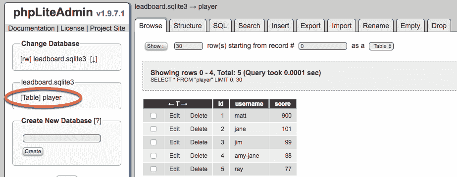

在项目的 GitHub 仓库和网站上了解更多关于 PHPLiteAdmin 的信息：

+   [`github.com/phpLiteAdmin/pla`](https://github.com/phpLiteAdmin/pla)

+   [`www.phpliteadmin.org/`](https://www.phpliteadmin.org/)

# Unity 游戏与 web 服务器排行榜的通信

在这个食谱中，我们创建了一个 Unity 游戏 **客户端**，可以通过 UI 按钮与之前食谱中的 web 服务器排行榜通信：

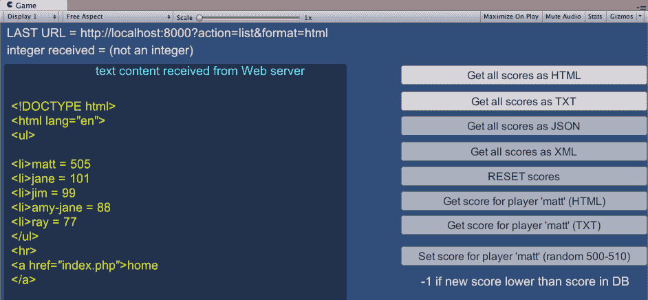

# 准备工作

由于场景包含多个 UI 元素，而食谱的代码是与 PHP 脚本和 SQL 数据库的通信，在 `12_02` 文件夹中，我们提供了一个名为 `UnityLeaderboardClient` 的 Unity 包，其中包含一个为 Unity 项目设置好的场景。

# 如何做到这一点...

要创建一个可以与 web 服务器排行榜通信的 Unity 游戏，请执行以下操作：

1.  导入提供的 Unity 包，`UnityLeaderboardClient`。

1.  运行提供的 **场景**。

1.  确保你的 PHP 排行榜正在运行。

1.  如果你没有在本地运行（`localhost:8000`），你需要通过在 Hierarchy 中选择 **主摄像机**，然后在 **Inspector** 中编辑 **Web 排行榜（脚本）** 组件的 **排行榜 URL** 文本来更新 URL：


1.  点击 **UI 按钮**，使 Unity 与可以访问高分数据库的 PHP 脚本通信。

# 它是如何工作的...

玩家的分数存储在 SQL 数据库中。通过之前设置的 web 服务器项目提供的 PHP 脚本来方便地访问数据库。

在我们的例子中，所有的 PHP 脚本都被放置在一个本地 web 服务器上的 **服务器** 文件夹中。因此，脚本通过 `http://localhost:8000/` 来访问。然而，由于 URL 是一个公共字符串变量，这可以在运行之前设置到你的服务器和网站代码的位置。

Unity 场景中有按钮（对应于网络排行榜理解的操作），这些按钮设置了相应的动作和要添加到 URL 中的参数，以便通过 `LoadWWW()` 方法对下一个网络 **Server** 调用进行调用。每个按钮的 `OnClick()` 动作已被设置为调用 **Main Camera** 的 `WebLeaderBoard` C# 脚本的相应方法。

此外，还有几个 **UI Text** 对象。一个显示发送到服务器的最新 URL 字符串。另一个显示从服务器接收到的响应消息中提取的整数值（如果收到其他数据，则显示为 **not an integer** 消息）。

第三个 **UI Text** 对象位于 **UI Panel** 内，并且已经足够大，可以显示从服务器接收到的完整多行文本字符串（该字符串存储在 `textFileContents` 变量中）。

我们可以看到，当为玩家 Matt 设置随机分数时，HTTP 文本响应消息的内容只是一个整数；当点击“获取玩家 'matt' 的分数（TXT）”按钮时，返回包含 `505` 的文本文件：


**UI Text** 对象已被分配给主相机的 `WebLeaderBoard` C# 脚本的公共变量。当任何 UI 按钮被点击时，会调用 `WebLeaderBoard` 方法的相应方法，该方法构建带有参数的 URL 字符串，然后调用 `LoadWWW()` 方法。此方法向 URL 发送请求，并通过协程的特性等待接收响应。然后，它将接收到的内容存储在 `textFileContents` 变量中，并调用 `UpdateUI()` 方法。对接收到的文本进行了美化，插入换行符以使 JSON、HTML 和 XML 更易于阅读。

# 还有更多...

这里有一些方法可以进一步使用这个食谱。

# 提取完整的排行榜数据以在 Unity 中显示

从 PHP 网络服务器检索到的 XML/JSON 文本为 Unity 游戏提供了一种有用的方法，允许游戏从数据库中检索完整的排行榜数据。然后，排行榜可以在 Unity 游戏中显示给用户（可能以美观的 3D 风格，或通过与游戏一致的 UI 显示）。

请参阅本食谱中的第 [处理纯文本、XML 和 JSON 文本文件](https://cdp.packtpub.com/unity_2017_cookbook/wp-admin/post.php?post=490&action=edit) 章节以了解如何处理 XML 和 JSON 格式的数据。

# 使用秘密游戏代码来保护排行榜脚本

所展示的 Unity 和 PHP 代码演示了一个简单、未受保护的基于网络的排行榜。为了防止玩家使用虚假分数破解排行榜，我们应该将某种形式的秘密游戏代码（或密钥）编码到通信中。只有包含正确代码的更新请求才会实际导致数据库发生变化。

Unity 代码将秘密密钥（在本例中为**harrypotter**字符串）与通信相关的内容结合在一起——例如，同一个 MySQL/PHP 排行榜可能为具有不同游戏 ID 的不同游戏有不同的数据库记录：

```cs
    // Unity Csharp code
     string key = "harrypotter"
     string gameId = 21;
     string gameCode = Utility.Md5Sum(key + gameId); 
```

服务器端 PHP 代码将接收加密的游戏代码以及用于创建该加密代码的游戏数据片段。在本例中，是游戏 ID 和 MD5 散列函数，这两个函数在 Unity 和 PHP 中都是可用的。您可以在维基百科上了解更多关于 MD5 散列的信息：[`en.wikipedia.org/wiki/MD5`](https://en.wikipedia.org/wiki/MD5)。

秘密密钥（**harrypotter**）与游戏 ID 结合使用，生成一个加密代码，该代码可以与从 Unity 游戏（或任何尝试与排行榜**服务器**脚本通信的用户代理或浏览器）接收到的代码进行比较。只有当在**服务器**上创建的游戏代码与随数据库操作请求发送的代码匹配时，数据库操作才会执行：

```cs
    // PHP - security code
     $key = "harrypotter"
     $game_id =  $_GET['game_id'];
     $provided_game_code =  $_GET['game_code'];
     $server_game_code = md5($key.$game_id);

     if( $server_game_code == $provided_game_code ) {
       // codes match - do processing here
     } 
```

# 创建和克隆 GitHub 仓库

**分布式版本控制系统**（**DVCS**）正成为软件开发人员日常生活中的必备工具。Unity 项目的问题可能是每个项目中都有许多二进制文件。在本地系统的 Unity 项目目录中，也有许多文件不需要存档/共享，例如特定操作系统的缩略图文件和垃圾文件。最后，一些 Unity 项目文件夹本身不需要存档，例如 Temp 和 Library。

虽然 Unity 提供了自己的**Unity Teams**在线协作工具，但许多小型游戏开发者选择不为此额外功能付费。此外，Git 和 Mercurial（最常见的 DVCS）是免费的，并且可以与任何需要维护的文档集（任何编程语言的程序、文本文件等）一起使用。因此，学习如何使用第三方、行业标准 DVCS 来处理 Unity 项目是有意义的。实际上，本书的文档都是使用私有**GitHub**仓库存档和版本控制的！

在本项目中，我们将使用免费的**GitHub**服务器创建一个新的在线项目仓库，然后将副本克隆（复制）到本地计算机上。接下来的食谱将把 Unity 项目转移到本地项目仓库，并使用克隆存储的链接将更改后的文件推送到**GitHub**在线服务器。

注意：**所有**来自本食谱的项目都已存档在**GitHub**的公共仓库中，供您阅读、下载、编辑和在您的计算机上运行。尽管在编写本书期间发生了硬盘故障，但由于遵循了本食谱的步骤，因此没有代码丢失。

注意：**Git**是一个版本控制系统，**GitHub**是几个在线系统之一，用于托管以**Git**格式归档的项目。**GitHub**的一个流行替代品是**BitBucket**，它可以托管**Git**和**Mercurial**版本控制项目格式。

# 准备工作

由于这个菜谱展示了如何在**GitHub**上托管代码，如果你还没有，你需要在 GitHub.com 上创建一个（免费）的**GitHub**账户。

如果尚未安装，你需要在本地计算机上安装**Git**作为此菜谱的一部分。了解如何操作，并从以下链接下载客户端：[`git-scm.com/book/en/Getting-Started-Installing-Git`](http://git-scm.com/book/en/Getting-Started-Installing-Git)

+   [`git-scm.com/book/en/Getting-Started-Installing-Git`](http://git-scm.com/book/en/Getting-Started-Installing-Git)

+   [`git-scm.com/downloads/guis`](http://git-scm.com/downloads/guis)

本菜谱的截图是在 Mac 上创建的。在 Windows 上，你会使用 Git BASH（见[`gitforwindows.org/`](https://gitforwindows.org/)）或 Powershell（见[`docs.microsoft.com/en-us/powershell/`](https://docs.microsoft.com/en-us/powershell/)）终端窗口进行命令行 Git 操作。

# 如何操作...

要创建和克隆一个**GitHub**仓库，请按照以下步骤操作：

1.  在你的计算机上安装**Git**的命令行版本。像往常一样，在安装任何新应用程序之前进行系统备份是一个好习惯：[`git-scm.com/book/en/v2/Getting-Started-Installing-Git`](https://git-scm.com/book/en/v2/Getting-Started-Installing-Git)。

1.  通过在终端窗口的命令行中输入**git**来测试你是否已安装**Git**。你应该会看到显示可能命令选项的文本帮助：


1.  打开一个网页浏览器并导航到你的**GitHub**仓库页面：


1.  点击绿色按钮开始创建一个新的仓库（例如**my-github-demo**）：

    +   为新仓库输入一个名称，例如**my-github-demo**

    +   点击创建**README**（重要，这样你就可以将文件克隆到本地计算机）

    +   添加一个`.gitignore`文件 - 选择 Unity 版本：

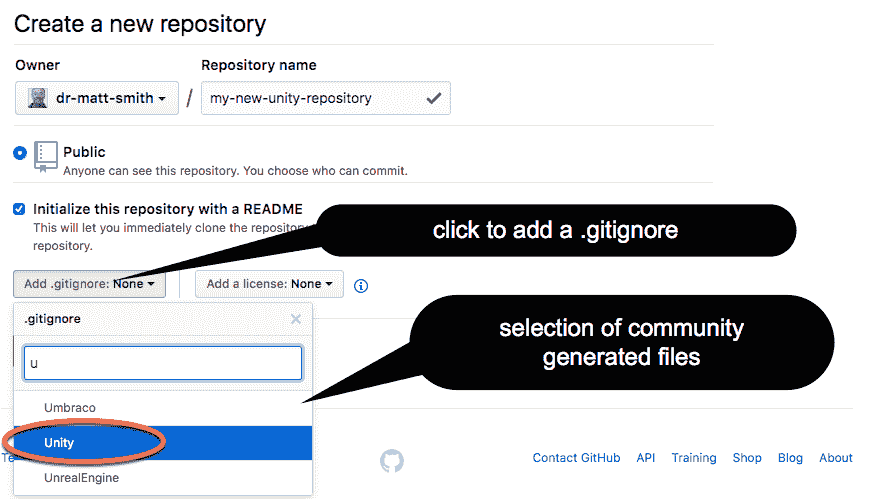

`.gitignore`文件是一个特殊的文件；它告诉版本控制系统哪些文件不需要归档。例如，我们不需要记录 Windows 或 Mac 的图像缩略图文件（`DS_STORE`或`Thumbs.db`）。

1.  选择好选项后，点击绿色的创建仓库按钮。

1.  你现在应该被带到仓库内容页面。点击名为“克隆或下载”的绿色下拉菜单，然后点击 URL 复制到剪贴板的工具按钮。这已经复制了连接到 GitHub 并将文件复制到本地计算机所需的特殊**GitHub** URL：


1.  打开一个命令行**终端**窗口，并导航到你希望克隆你的**GitHub**项目仓库的位置（例如桌面或 Unity-projects）。

1.  在命令行界面（CLI）中，键入 `**git clone**`，然后粘贴您的剪贴板中的 URL，它将类似于 [`github.com/dr-matt-smith/my-unity-github-demo.git`](https://github.com/dr-matt-smith/my-unity-github-demo.git)：


1.  切换到您的克隆目录，例如 `cd my-unity-github-demo`。

1.  列出文件。您应该看到您的 `README.md` 文件，如果您有查看隐藏文件夹和文件的选项，您还会看到 `.git` 和 `.gitignore`：

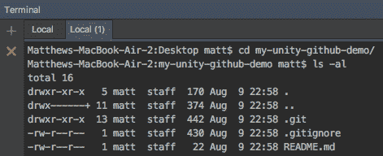

1.  使用 `git remote -v` 命令查看从您计算机上的项目文件副本存储的链接，然后将其备份到 GitHub 在线仓库：

```cs
 $ git remote -v
 origin  https://github.com/dr-matt-smith/my-unity-github-demo.git (fetch)
 origin  https://github.com/dr-matt-smith/my-unity-github-demo.git (push) 
```

# 它是如何工作的...

您学习了如何在 **GitHub** 网络服务器上创建一个新的空仓库。然后您将其克隆到您的本地计算机上。

您还检查了此克隆是否有一个指向其远程源的反向链接。

如果你只是下载并解压了 ZIP 文件，你将没有 `.git` 文件夹，也不会有指向其 GitHub 源的远程链接。

`.git` 文件实际上包含了项目仓库文件变更的整个历史记录——并且使用不同的 Git 命令，您可以更新文件夹以重新实例化项目仓库内容中提交的任何快照。

被称为 `.gitignore` 的特殊文件列出了所有不应存档的文件和目录。在撰写本文时，以下是无需存档的文件内容（它们要么是不必要的，要么在将项目加载到 Unity 时可以重新生成）：

```cs
         [Ll]ibrary/
     [Tt]emp/
     [Oo]bj/
     [Bb]uild/
     [Bb]uilds/
     Assets/AssetStoreTools*

     # Visual Studio cache directory
     .vs/

     # Autogenerated VS/MD/Consulo solution and project files
     ExportedObj/
     .consulo/
     *.csproj
     *.unityproj
     *.sln
     *.suo
     *.tmp
     *.user
     *.userprefs
     *.pidb
     *.booproj
     *.svd
     *.pdb
     *.opendb

     # Unity3D generated meta files
     *.pidb.meta
     *.pdb.meta

     # Unity3D Generated File On Crash Reports
     sysinfo.txt

     # Builds
     *.apk
     *.unitypackage  
```

如我们所见，**Library** 和 **Temp** 等文件夹不应存档。请注意，如果您有一个资源丰富的项目（例如使用 2D 或 3D Gamekits 的项目），根据您计算机的速度，重新构建 **Library** 可能需要几分钟。

注意，推荐的忽略文件对于 **Git** 随着 Unity 项目文件夹结构的更改而不断变化。**GitHub** 为 Unity 提供了一个主推荐的 `.gitignore` 文件，建议您定期查看它，尤其是在升级到 Unity 编辑器的新版本时：[`github.com/github/gitignore/blob/master/Unity.gitignore`](https://github.com/github/gitignore/blob/master/Unity.gitignore)。

如果您使用的是较旧（2018 年之前）的 Unity 版本，您可能需要查找适当的 `.gitignore` 内容。本食谱中给出的详细信息适用于 Unity 编辑器的 2018.2 版本。

# 还有更多...

这里有一些使用此食谱进一步发展的方法。

# 了解更多关于分布式版本控制系统（DVCS）的信息

这里是一个关于 DVCS 的简短视频介绍：[`youtu.be/1BbK9o5fQD4`](http://youtu.be/1BbK9o5fQD4)。

注意，Fogcreek Kiln 的“和谐”功能现在允许使用相同的 Kiln 仓库在**Git**和**Mercurial**之间无缝工作：[`blog.fogcreek.com/kiln-harmony-internals-the-basics/`](http://blog.fogcreek.com/kiln-harmony-internals-the-basics/)。

# 在命令行中了解更多关于 Git 的信息

如果你刚开始使用**CLI**，跟踪一些在线资源来提高你的技能是非常值得的。任何严肃的软件开发都可能需要在某个时候在命令行中进行一些工作。

由于**Git**和**Mercurial**都是开源的，因此有很多优秀的免费在线资源可用。以下是一些好的起点资源：

+   了解 Git 的所有信息，下载免费的图形用户界面客户端，甚至可以通过创意共享许可免费在线访问*The Pro Git*书籍（由 Scott Chacon 编写）：[`git-scm.com/book`](http://git-scm.com/book)。

+   你将找到一个在线交互式 Git 命令行来练习：[`try.github.io/levels/1/challenges/1`](https://try.github.io/levels/1/challenges/1)。

# 使用 Bitbucket 和 SourceTree 可视化应用程序

Unity 提供了一个很好的教程，介绍了使用 Bitbucket 网站和 SourceTree 应用程序进行版本控制：

+   [`unity3d.com/learn/tutorials/topics/cloud-build/creating-your-first-source-control-repository`](https://unity3d.com/learn/tutorials/topics/cloud-build/creating-your-first-source-control-repository)

SourceTree 是一个免费的 Mercurial 和 Git 图形用户界面客户端，可在以下地址获取：

+   [`www.sourcetreeapp.com/`](http://www.sourcetreeapp.com/)

# 了解 Mercurial 而不是 Git

主 Mercurial 网站，包括对*Mercurial*的免费在线访问*The Definitive Guide*（由 Bryan O'Sullivan 编写）可通过开放出版许可在[`mercurial.selenic.com/`](http://mercurial.selenic.com/)获取。

# 将 Unity 项目添加到本地 Git 仓库，并将文件推送到 GitHub

在上一个菜谱中，你使用免费的**GitHub Server**创建了一个新的在线项目仓库，然后将其克隆（复制）到本地计算机上。

在这个菜谱中，我们将把 Unity 项目转移到本地项目仓库，并使用克隆时存储的链接将更改后的文件推回 Guthub 在线**服务器**。

# 准备工作

这个菜谱是基于上一个菜谱的，所以确保你在开始这个菜谱之前已经完成了那个菜谱。

# 如何做到这一点...

要将 Unity 项目添加到**Git**仓库，并将其推送到**GitHub**，请执行以下操作：

1.  创建一个新的 Unity 项目（或者使用一个旧项目），保存**场景**，并退出 Unity。例如，我们创建了一个名为**project-for-version-control**的项目，其中包含默认的`SampleScene`和一个名为`m_red`的材质。项目面板中的资产文件是存储在磁盘上的文件，也是你将使用**Git**和**GitHub**进行版本控制的文件。

在您存档 Unity 项目时，非常重要的一点是所有工作都已保存，Unity 应用程序没有运行，因为如果 Unity 是打开的，可能会有未保存的更改，这些更改将无法正确记录。

1.  在您的计算机上，将以下文件夹复制到您克隆的**GitHub**仓库的文件夹中：

```cs
     /Assets
     /Plugins (if this folder exists - it may not)
     /ProjectSettings    
     /Packages 
```

1.  复制这些内容后的文件夹如下所示：


1.  在**CLI**中，输入`git status`以查看已更改并需要提交到项目内容下一个快照的文件夹/文件列表。

1.  通过输入`git add`添加所有这些文件。

1.  使用`git commit -m "files added to project"`命令提交我们的新快照：

```cs
 matt$ git commit -m "files added to project"

 [master 1f415a3] files added to project
 23 files changed, 1932 insertions(+)
 create mode 100644 Assets/Scenes.meta
 create mode 100644 Assets/Scenes/SampleScene.unity
      ...         
```

1.  我们已经创建了新文件和文件夹的快照，因此现在我们可以将这个新提交的快照推送到 GitHub 云服务器。输入`git push origin master`：

```cs
 matt$ git push origin master

 Counting objects: 29, done.
 Delta compression using up to 4 threads.
 Compressing objects: 100% (27/27), done.
 Writing objects: 100% (29/29), 15.37 KiB | 0 bytes/s, done.
 Total 29 (delta 0), reused 0 (delta 0)
 To https://github.com/dr-matt-smith/my-unity-github-demo.git
 1b27686..1f415a3  master -> master
 matt$ 
```

注意：第一次这样做时，您将被要求输入您的**GitHub**用户名和密码。

1.  访问**GitHub**，您应该会看到有一个新的提交，并且您的 Unity 文件和文件夹已上传到**GitHub**在线仓库：

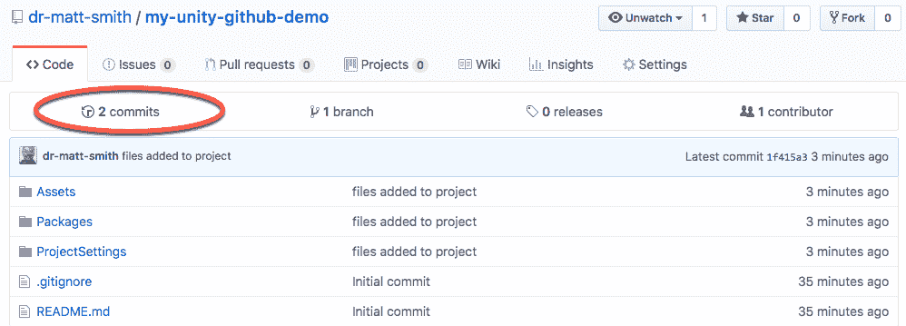

# 它是如何工作的...

在上一个菜谱中，您在**GitHub**云**服务器**上创建了一个项目仓库，然后将其克隆到您的本地机器上。然后，您将来自（关闭的）Unity 应用程序的文件添加到克隆的项目仓库文件夹中。这些新文件被添加并提交到一个新的文件夹**快照**中，并将更新的内容推送到**GitHub 服务器**。

由于 Unity 的工作方式，当创建新项目时，它会创建一个新的文件夹。因此，我们必须将 Unity 项目文件夹的内容转换为**Git**仓库。有两种方法可以做到这一点：

1.  将 Unity 项目的文件复制到克隆的**GitHub**仓库中（以便设置远程链接以推送到**GitHub**服务器）。

1.  将 Unity 项目文件夹转换为**Git**仓库，然后将其链接到远程**GitHub**仓库，或者将文件夹内容推送到**GitHub**服务器，并在该点创建一个新的在线仓库

对于 Git 和 GitHub 的新手来说，我们在这道菜谱中遵循的第一个步骤可能是最容易理解的。此外，如果出现问题，它也最容易修复——因为可以创建一个新的 GitHub 仓库，克隆到本地机器上，并将 Unity 项目文件复制到那里，然后推送到 GitHub（并删除旧仓库），基本上遵循相同的步骤集。

有趣的是，当使用**开源 GitHub for Unity**包时，建议使用第二种方法——这将在下一个菜谱中探讨。

# 使用 GitHub for Unity 进行 Unity 项目版本控制

**GitHub**发布了一个将**Git**和**GitHub**集成到 Unity 中的**开源**工具，我们将在本菜谱中探讨。

# 准备工作

您需要在您的计算机的命令行上安装**Git**：

+   [`git-scm.com/book/en/v2/Getting-Started-Installing-Git`](https://git-scm.com/book/en/v2/Getting-Started-Installing-Git)

您可能需要安装 Git LFS（大型文件存储）以使 GitHub for Unity 包正常工作：

+   [`git-lfs.github.com/`](https://git-lfs.github.com/)

您可能希望创建一个.gitattributes 文件来指定哪些文件应该使用 Git **大型文件存储** (**LFS**)。为了获得一些指导，请查看 Rob Reilly 的有用文章，*如何使用 Git 与 Unity*：[`robots.thoughtbot.com/how-to-git-with-unity`](https://robots.thoughtbot.com/how-to-git-with-unity)。

# 如何操作...

要使用 GitHUb for Unity 管理 Unity 项目的版本控制，请按照以下步骤操作：

1.  开始一个新的 Unity 项目。

1.  打开 Asset Store 面板，选择菜单：窗口 | 通用 | Asset Store。

1.  在 Asset Store 中搜索 GitHub for Unity，下载并将其导入到您的项目中：


1.  如果出现有关新版本的弹出窗口，请接受它并下载新版本。这将作为一个 Unity 包（可能位于您的下载文件夹中）下载，然后您可以将其导入到您的 Unity 项目中。

1.  导入后，您应该在项目面板中看到一个新的 Plugins | GitHub 文件夹。您现在也会在窗口菜单中看到两个新的项目，分别是 GitHub 和 GitHub 命令行：


1.  选择窗口 | GitHub 命令行允许您使用前两个菜谱中列出的 Git 命令（它将在您的 Unity 项目目录中打开）。

1.  选择窗口 | GitHub 菜单项将导致显示 GitHub 面板。最初此项目不是**Git**仓库，因此需要将其初始化为新的**Git**项目，这可以通过点击“为此项目初始化为 git 仓库”按钮来完成：

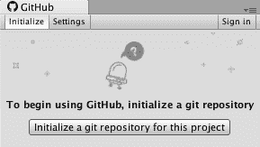

1.  您将能够看到有一个提交，这是为此项目的 Git 版本控制跟踪初始化的快照：

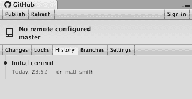

1.  使用您的**GitHub**用户名和密码登录：


1.  打开网页浏览器，登录您的**GitHub**账户，并创建一个新的空仓库（没有额外文件，即没有`README`、`.gitignore`或`Licence`）：


1.  将新仓库的 URL 复制到您的剪贴板：


1.  在 Unity 中，对于 GitHub 面板，点击设置按钮，粘贴`远程：origin`属性的 URL，然后点击“保存仓库”按钮以保存此更改。您的 Unity 项目现在已链接到远程**GitHub**云仓库：

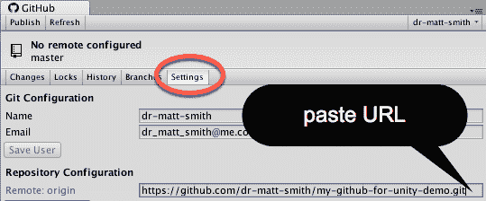

1.  您现在可以从 Unity 项目提交并推送更改到**GitHub**。

1.  添加一些新的资源（例如一个新的 C#脚本和一个名为**m_red**的**Material**）。在 GitHub 面板中点击“更改”标签页，确保完整的`Assets`文件夹被选中（及其所有内容），简要描述更改，然后点击“提交到[master]”按钮：


1.  你现在已经在你的电脑上有一个提交的新 Unity 项目内容快照。通过点击“推送到（1）”按钮，将这个新的提交快照推送到**GitHub**服务器。这里的（1）表示本地有一个尚未推送的新提交快照，也就是说，本地机器比**GitHub 服务器**上的 master 领先 1 个提交：

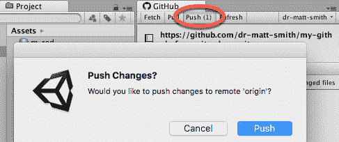

1.  在你的网络浏览器中访问**GitHub**上的仓库，你会看到 Unity 项目内容的新提交快照已经从你的电脑推送到**GitHub**云**服务器**：


# 工作原理...

**GitHub for Unity**包添加了一个具有以下**Git**/**GitHub**操作功能的特殊面板：

+   为当前 Unity 项目初始化一个新的**Git**项目仓库

+   使用你的**GitHub**用户名和密码凭证登录

+   将 Unity 项目的**Git**历史记录链接到远程**GitHub**在线仓库

+   将 Unity 项目中你希望记录的更改快照提交

+   将提交的更改推送到远程**GitHub**在线仓库

# 还有更多...

这里有一些使用此食谱进一步发展的方法。

# 关于 GitHub for Unity 的进一步阅读

查看以下链接以获取更多信息：

+   项目网站：[`unity.github.com/`](https://unity.github.com/)

+   快速入门指南：[`github.com/github-for-unity/Unity/blob/master/docs/using/quick-guide.md`](https://github.com/github-for-unity/Unity/blob/master/docs/using/quick-guide.md)

# 从其他开发者那里拉取更新

**GitHub**插件还提供了从远程**GitHub**仓库拉取更改到你的电脑的功能（如果你在多台电脑上工作，或者有其他游戏开发者帮助你添加游戏功能，这很有用）。

如果你与其他游戏开发者一起工作，了解 Git 分支非常有用。在开始新功能的工作之前，执行一次 pull 操作，以确保你正在使用项目最新版本的更新。

# Unity Collaborate 由 Unity Technologies 提供

虽然许多 Unity 项目使用**Git**和**GitHub**，但它们是通用的版本控制技术。Unity Technologies 为开发者和团队提供了一个自己的在线系统，以便他们可以协作工作在同一 Unity 项目上，然而，这个功能已不再包含在免费的 Unity 许可证计划中。

在 Unity 网站上了解更多关于**Unity Collaborate**和**Unity Teams**的信息：

+   [`unity3d.com/unity/features/collaborate`](https://unity3d.com/unity/features/collaborate)

+   [`unity3d.com/teams`](https://unity3d.com/teams)

# 防止你的游戏在未知服务器上运行

在完成你的网页游戏项目所必须经历的艰辛工作之后，如果它最终在别人的网站上产生流量和收入，那就太不公平了。在这个配方中，我们将创建一个脚本，以防止除非由授权 **服务器** 托管，否则主游戏菜单显示。

# 准备工作

对于这个配方，你需要访问一个可以托管游戏的网络空间提供商。然而，你可以使用本地主机网络 **服务器** 进行测试，例如内置的 PHP 服务器，或者 AMP Apache 或 Nginx 网络服务器。

你还需要安装 Unity **WebGL** 构建目标。

注意：在撰写本文时（2018 年夏季），对于 macOS 计算机，如果在通过 Unity Hub 进行原始安装时未包含 **WebGL** 包，则仍然存在添加 **WebGL** 包的问题。macOS WebGL 包需要 Unity 应用程序位于 Applications | Unity 文件夹中。通过 Unity Hub 安装时，它实际上位于 Applications | Unity | Hub | Editor | 2018.2.2f1。如果你有多个版本，它们将各自位于 Editor 文件夹中。为特定 Unity 版本安装 WebGL 的解决方案是将 Applications | Unity | Hub 文件夹临时移动到其他位置（例如桌面），然后将你的 Unity 版本文件夹（对我来说是 2018.2.2f1）的内容复制（或临时移动）到 Applications | Unity。然后你可以成功运行 WebGL 包安装程序，它将在 Applications | Unity 的 `PlaybackEngines` 文件夹中添加。最后，你可以将 Unity 应用程序移回它们原来的位置，以便 **Unity Hub** 继续工作。

# 如何操作...

要防止你的网页游戏被盗版，请按照以下步骤操作：

1.  从层次结构中创建一个名为 Text-loading-warning 的 **UI Text** GameObject，选择菜单：创建 | UI | 文本。

1.  在 **Text** 组件的检查器中输入 Loading...

1.  在 **检查器** 中设置 **Text (Script)** 组件的属性，将 **水平** 和 **垂直溢出** 设置为 **溢出**，并使用 Rect Transform 将对象对齐到 **场景** 的中心。使字体大小适中（50）。

1.  创建一个新的 C# 脚本类名为 `BlockAccess`，并将实例对象作为组件添加到 **Text-loading-warning** GameObject：

```cs
    using UnityEngine;
     using System.Collections;
     using UnityEngine.UI;
     using UnityEngine.SceneManagement;

     public class BlockAccess : MonoBehaviour {
         public Text textUI;
         public string warning;
         public bool fullURL = true;
         public string[] domainList;

         private void Start() {
             Text scoreText = GetComponent<Text>();
             if (Application.platform == RuntimePlatform.WebGLPlayer)
             {
                 string url = Application.absoluteURL;
                 if (LegalCopy(url))
                     LoadNextScene();
                 else
                     textUI.text = warning;
             }
         }

         private bool LegalCopy(string Url) {
            if (Application.isEditor)
             return true;

             for (int i = 0; i < domainList.Length; i++){
                 if (Application.absoluteURL == domainList[i])
                     return true;

                 if (Application.absoluteURL.Contains(domainList[i]) && !fullURL)
                     return true;
             }

             return false;
         }

         private void LoadNextScene() {
             int currentSceneIndex = SceneManager.GetActiveScene().buildIndex;
             int nextSceneIndex = currentSceneIndex + 1;
             SceneManager.LoadScene(nextSceneIndex);
         }
    }
```

1.  在检查器中，保留 Full URL 选项选中，将域名列表的大小增加到 `1`，并在元素 0 中填写你游戏的完整 URL。在警告字段中，输入 "这不是一个有效的游戏副本"：

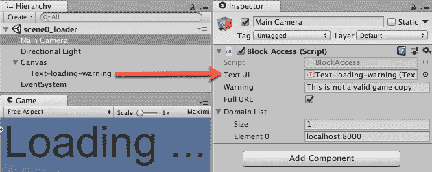

1.  将你的场景保存为 `scene0-loading`。将此场景添加到构建（菜单：文件 | 构建设置...）。它应该是第一个，索引为 0。

1.  创建一个新的场景，将主相机的背景颜色更改为黑色，并添加一个 UI Text 消息，说明游戏现在将播放。

1.  将这个场景保存为 `scene1-gamePlaying`。将这个场景添加到构建中——它应该是第二个，索引为 1。

1.  让我们构建我们的 **WebGL** 文件。再次打开构建设置面板，这次确保部署平台是 WebGL。点击构建按钮，并选择构建文件的名称和文件夹位置：

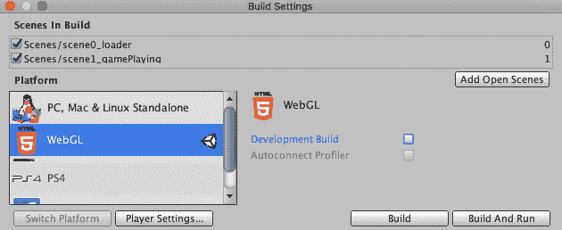

1.  现在，你应该有一个包含 HTML 文件（`index.html`）以及 `Build` 和 `TemplateData` 文件夹的文件夹：


1.  将这些文件夹内容复制到你的网络 **服务器** 的公共文件夹中，并使用浏览器通过网络 **服务器** 访问网页。

1.  如果你的 URL 在列表中，你会看到游戏播放（可能伴随着 **加载... 场景** 消息的短暂显示）。如果你的 URL 不在列表中，你会看到 **这不是有效的游戏副本** 消息，并且游戏将无法开始播放。

如果你尝试使用你的网络浏览器打开文件，你可能会遇到 WebGL 无法工作错误。你必须通过网络服务器（例如 `localhost:8000` 或从你的公开托管页面）访问 HTML 页面。

# 它是如何工作的...

一旦 **场景** 开始，脚本会将运行中的 Unity 生成的 **WebGL** 网页的实际 URL 与 **BlockAccess** 脚本组件中列出的 URL 进行比较。如果不匹配，构建的下一级将不会加载，并在屏幕上显示消息。如果匹配，构建列表中的下一个场景将被加载。

# 更多内容...

这里有一些方法可以进一步使用这个食谱。

# 在 Google Chrome 中启用 WebGL

对于这个食谱，你需要在你的网络浏览器中启用 **WebGL**。目前，我们的测试浏览器（Google Chrome）默认禁用了 WebGL。要在 Google Chrome 中启用 **WebGL**，请执行以下操作：

1.  打开 Google Chrome 并输入 `chrome://flags` URL。

1.  定位到 **Web GL Draft Extensions**（搜索 **WebGL**）。

1.  使用下拉菜单将状态从 **禁用** 切换到 **启用**。

1.  点击 **立即重新启动** 按钮以使用新设置重新启动应用程序：


1.  现在，你应该能够使用嵌入 **WebGL** 内容的网页。

# 通过在域名列表中使用完整 URL 提高安全性

如果你在域名列表中填写完整的 URL，例如 [`www.myDomain.com/unitygame/index.html`](http://www.myDomain.com/unitygame/index.html)，而不是仅仅填写主域名，例如 www.myDomain.com，那么你的游戏将更加安全。实际上，建议你选择保留完整 URL 选项，这样你的游戏就不会被盗用并在类似 www.stolenGames.com/yourgame.html?www.myDomain.com 这样的 URL 下发布。
