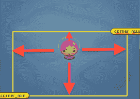
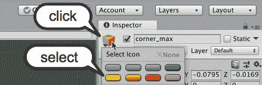
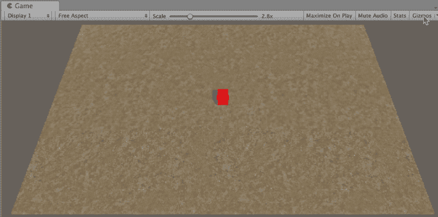
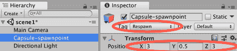
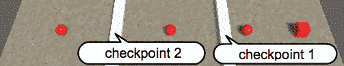
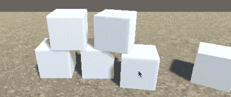
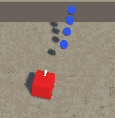

# 控制和选择位置

在本章中，我们将涵盖以下主题：

+   玩家控制 2D 游戏对象（并在矩形内限制移动）

+   玩家控制 3D 游戏对象（并在矩形内限制移动）

+   选择目的地 – 寻找随机生成点

+   选择目的地 – 寻找最近的生成点

+   选择目的地 – 回到最近通过的检查点重生

+   通过点击移动对象

+   向运动方向发射弹体

# 简介

游戏中的许多**游戏对象(GameObjects**)都在移动！移动可以由玩家控制，由环境中的（模拟的）物理定律控制，或者由**非玩家角色(NPC**)逻辑控制；例如，跟随路径的航点对象，或者寻找（朝向）或逃离（远离）角色的当前位置。Unity 为第一人称和第三人称角色以及汽车和飞机等车辆提供了几个控制器。**游戏对象(GameObject**)的移动也可以通过 Unity **Mecanim** 动画系统的状态机来控制。

然而，可能会有时候你想调整 Unity 中的玩家角色控制器，或者编写自己的。你可能希望编写方向逻辑——简单或复杂的**人工智能(Artificial Intelligence**)来控制游戏中的 NPC 和敌人角色。这种 AI 可能涉及你的计算机程序使对象朝向或远离角色或其他游戏对象。

本章（以及随后的章节）介绍了一系列这样的方向性食谱，许多游戏可以从更丰富和更令人兴奋的用户体验中受益。

Unity 提供了复杂的类和组件，包括`Vector3`类和刚体物理，用于在游戏中建模现实运动、力和碰撞。我们利用这些游戏引擎功能来实现本章食谱中的一些复杂的 NPC 和敌人角色移动。

# 整体概念

对于 3D 游戏（以及在一定程度上，2D 游戏），一个基本的对象类别是存储和操作表示 3D 空间中位置的(x, y, z)值的`Vector3`类对象。如果我们从一个原点(0, 0, 0)到空间中的一个点画一个想象中的箭头，那么这个箭头的方向和长度（向量）可以表示速度或力（即，在某个方向上的一定量的量度）。

如果我们忽略 Unity 中的所有角色控制器组件、碰撞体和物理系统，我们可以编写代码将对象直接传送到场景中的特定(x, y, z)位置。有时，这正是我们想要的；例如，我们可能希望在一个位置生成一个对象。然而，在大多数情况下，如果我们想让对象以更物理现实的方式移动，那么我们要么对对象的**刚体(RigidBody**)施加力，要么改变其速度分量。或者，如果它有一个**角色控制器(Character Controller**)组件，那么我们可以发送一个`Move()`消息给它。

NPC 对象移动和创建（实例化）的一些重要概念包括以下内容：

+   **生成点**：场景中创建或移动对象的具体位置

+   **检查点**：一旦通过，就会改变游戏后期发生的事情的位置（或碰撞体）（例如，额外时间，或者如果玩家的角色被杀死，他们将重生到最后一个通过的检查点，等等）

+   **航标点**：定义 NPC 或玩家角色跟随的路径的一系列位置

在本章中，我们将介绍一些配方，并展示关于角色控制、生成点和检查点的几种方法。在下一章中，我们将探讨 AI 控制角色的航标点。

你可以在[`unity3d.com/learn/tutorials/modules/beginner/2d/2d-controllers`](http://unity3d.com/learn/tutorials/modules/beginner/2d/2d-controllers)了解更多关于 Unity 2D 角色控制器的信息。

你可以在[`docs.unity3d.com/Manual/class-CharacterController.html`](http://docs.unity3d.com/Manual/class-CharacterController.html)和[`unity3d.com/learn/tutorials/projects/survival-shooter/player-character`](http://unity3d.com/learn/tutorials/projects/survival-shooter/player-character)了解 Unity 3D 角色组件和控制。

每个游戏都需要纹理。以下是一些适合许多游戏的免费纹理来源：

+   CG Textures 可在[`www.cgtextures.com/`](http://www.cgtextures.com/)找到

+   Naldz Graphics 博客，可在[`naldzgraphics.net/textures/`](http://naldzgraphics.net/textures/)找到

# 玩家对 2D GameObject 的控制（以及限制其在矩形内的移动）

虽然本章中的其余配方都是在 3D 项目中演示的，但基本的 2D 角色移动以及限制移动到边界矩形是许多 2D 游戏的核心技能，因此这个第一个配方说明了如何为 2D 游戏实现这些功能。

由于在第三章，*库存 UI*中，我们已经创建了一个基本的 2D 游戏，我们将适应这个游戏以限制移动到边界矩形内：



# 准备工作

这个配方基于第三章（c6ad221f-b476-4471-8259-9ad448749a32.xhtml）*库存 UI*的第一个配方中的简单 2D 游戏 Simple2DGame_SpaceGirl 迷你游戏。从这个游戏的副本开始，或者使用提供的完成配方项目作为这个配方的基础。你可以从[`github.com/dr-matt-smith/unity-cookbook-2018-ch03`](https://github.com/dr-matt-smith/unity-cookbook-2018-ch03)下载完成的项目。

# 如何做到这一点...

要创建一个用户控制的 2D 精灵，其移动限制在矩形内，请按照以下步骤操作：

1.  创建一个新的空 **游戏对象**，命名为 `corner_max`，并将其放置在名为 `player_spaceGirl` 的 **游戏对象**上方和右侧。在层次结构视图中选择此 **游戏对象**后，选择检查器面板中突出显示的大黄色椭圆形图标：



1.  复制 corner_max **游戏对象**，将副本命名为 `corner_min`，并将其放置在玩家-spaceGirl **游戏对象**下方和左侧。这两个 **游戏对象**的坐标将确定玩家角色的最大和最小移动范围。

1.  修改名为 `PlayerMove` 的 C# 脚本，在类开始处声明一些新的变量：

```cs
     public Transform corner_max;
     public Transform corner_min;
     private float x_min;
     private float y_min;
     private float x_max;
     private float y_max; 
```

1.  修改名为 `PlayerMove` 的 C# 脚本，以便 `Awake()` 方法现在获取 `SpriteRenderer` 的引用，并使用此对象来帮助设置最大和最小 X 和 Y 移动限制：

```cs
    void Awake(){
       rigidBody2D = GetComponent<Rigidbody2D>();
       x_max = corner_max.position.x;
       x_min = corner_min.position.x;
       y_max = corner_max.position.y;
       y_min = corner_min.position.y;
     } 
```

1.  修改名为 `PlayerMove` 的 C# 脚本，声明一个名为 `KeepWithinMinMaxRectangle()` 的新方法：

```cs
  private void KeepWithinMinMaxRectangle(){
     float x = transform.position.x;
     float y = transform.position.y;
     float z = transform.position.z;
     float clampedX = Mathf.Clamp(x, x_min, x_max);
     float clampedY = Mathf.Clamp(y, y_min, y_max);
     transform.position = new Vector3(clampedX, clampedY, z);
   } 
```

1.  修改名为 `PlayerMove` 的 C# 脚本，以便在 `FixedUpdate()` 方法更新速度后，调用 `KeepWithinMinMaxRectangle()` 方法：

```cs
  void FixedUpdate(){
     rigidBody2D.velocity = newVelocity;

     // restrict player movement
     KeepWithinMinMaxRectangle();
   } 
```

1.  在 **层次结构** 视图中选择玩家-spaceGirl **游戏对象**，将 corner_max 和 corner_min **游戏对象**拖动到检查器中名为 corner_max 和 corner_min 的公共变量上。

在 **场景** 面板中运行场景之前，尝试重新定位 corner_max 和 corner_min **游戏对象**。当你运行场景时，这两个 **游戏对象**（最大和最小，以及 X 和 Y）的位置将被用作玩家玩家空间女孩角色的移动限制。

# 它是如何工作的...

您已将名为 corner_max 和 corner_min 的空 **游戏对象**添加到场景中。这些 **游戏对象**的 X 和 Y 坐标将用于确定我们允许名为 player-spaceGirl 的角色进行的移动范围。由于这些是空 **游戏对象**，因此在游戏模式下玩家将看不到它们。然而，我们可以在 **场景** 面板中看到并移动它们，并且添加了黄色椭圆形图标后，我们可以很容易地看到它们的位置和名称。

在 `PlayerMoveWithLimits` 对象上使用 `Awake()` 方法时，在玩家空间女孩 `GameObject` 内部，记录了名为 corner_max 和 corner_min 的 `GameObjects` 的最大和最小 X 和 Y 值。每次通过 `FixedUpdate()` 方法调用物理系统时，玩家空间女孩角色的速度都会更新到 `Update()` 方法中设置的值，该值基于水平和垂直键盘/摇杆输入。然而，`FixedUpdate()` 方法的最终操作是调用 `KeepWithinMinMaxRectangle()` 方法，该方法使用 `Math.Clamp(...)` 函数将角色移动回 X 和 Y 限制内。这样，玩家的角色不允许移动到由 corner_max 和 corner_min `GameObjects` 定义的区域内。

我们一直遵循一个很好的经验法则：

“始终在 `Update()` 中监听 **输入**。”

总是在 `FixedUpdate()` 中应用 **物理**。

在 Unity Answers 线程中了解更多关于为什么我们不应该在 `FixedUpdate()` 中检查输入的原因（该线程也是用户 Tanoshimi 之前引用的来源），请参阅 [`answers.unity.com/questions/1279847/getaxis-being-missed-in-fixedupdate-work-around.html`](https://answers.unity.com/questions/1279847/getaxis-being-missed-in-fixedupdate-work-around.html)。

# 还有更多...

有些细节你不希望错过。

# 绘制辅助黄色矩形以视觉上显示边界矩形

作为开发者，在运行测试我们的游戏时，看到像边界矩形这样的元素是有用的。让我们通过在场景面板中绘制一个黄色的“辅助”矩形，使运动的矩形边界在黄色线条中视觉上明确。将以下方法添加到名为 `PlayerMove` 的 C# 脚本类中：

```cs
    void OnDrawGizmos(){
       Vector3 top_right = Vector3.zero;
       Vector3 bottom_right = Vector3.zero;
       Vector3 bottom_left = Vector3.zero;
       Vector3 top_left = Vector3.zero;

       if(corner_max && corner_min){
         top_right = corner_max.position;
         bottom_left = corner_min.position;

         bottom_right = top_right;
         bottom_right.y = bottom_left.y;

         top_left = top_right;
         top_left.x = bottom_left.x;
       }

       //Set the following gizmo colors to YELLOW
       Gizmos.color = Color.yellow;

       //Draw 4 lines making a rectangle
       Gizmos.DrawLine(top_right, bottom_right);
       Gizmos.DrawLine(bottom_right, bottom_left);
       Gizmos.DrawLine(bottom_left, top_left);
       Gizmos.DrawLine(top_left, top_right);
     } 
```

`OnDrawGizmos()` 方法检查对 corner_max 和 corner_min `GameObjects` 的引用是否不为空，然后设置代表由矩形定义的四个角的四个 **Vector3** 对象的位置，其中 corner_max 和 corner_min 位于对角。然后设置 **Gizmo** 颜色为黄色，并在 **场景** 面板中绘制线条，连接四个角。

# 参见

+   参考以下菜谱以获取有关限制玩家控制角色移动的更多信息。

# 3D GameObject 的玩家控制（并在矩形内限制移动）

本章中的许多 3D 菜单都是基于这个基本项目构建的，该项目构建了一个带有纹理地形、**主摄像机**和可以由用户使用四个方向箭头移动的红色立方体的场景。使用与上一个 2D 菜单中相同的技术约束立方体的运动范围：



# 如何做到这一点...

要创建一个基本的 3D 立方体控制游戏，请按照以下步骤操作：

1.  创建一个新的空 3D 项目。

1.  一旦项目创建完成，通过选择菜单：资产 | 导入包 | 环境，导入名为 SandAlbedo 的单个**地形纹理**。取消选择所有内容，然后转到`Assets/Environment/TerrainAssets/SurfaceTextures/ SandAlbedo.psd`找到并勾选该资产。

你本可以在创建项目时添加环境资产包，但这会导入数百个文件，而我们只需要这一个。如果你想要保持项目`资产`文件夹的大小尽可能小，那么在 Unity 中开始一个项目然后只选择性地导入所需内容是最好的方法。

1.  通过选择菜单：创建 | 3D 对象 | 地形来创建一个新的地形。在层次结构中选择这个新的地形**GameObject**，在其检查器属性中，将大小设置为 30 x 20，并将位置设置为(-15, 0, -10)：

地形的变换位置与其角落相关，而不是与其中心相关。

由于地形的**变换**位置与对象的角落相关，我们通过将 X 坐标设置为(*-1width/2*)，Z 坐标设置为(*-1length/2*)来将此类对象居中在(0, 0, 0)。换句话说，我们通过对象宽度的一半和高度的一半滑动对象，以确保其中心正好在我们想要的位置。

在这种情况下，宽度是 30，长度是 20，因此我们得到 X 坐标为-15(*-1 * 30/2*)，Z 坐标为-10(*-1 * 20/2*)。


1.  使用你的纹理 SandAlbedo 绘制此地形。

1.  对主摄像机进行以下更改：

    +   位置：(0, 20, -15)

    +   旋转：(60, 0, 0)

1.  将**游戏面板**的纵横比从自由纵横比更改为 4:3。现在你将在**游戏面板**中看到整个地形。

1.  创建一个新的空**GameObject**，命名为 corner_max，并将其定位在(14, 0, 9)。在层次结构中选择此**GameObject**，选择检查器面板中突出显示的大、黄色椭圆形图标。

1.  复制角落最大值 **GameObject**，将副本命名为 corner_min，并将此副本定位在(-14, 0, -9)。这两个**GameObject**的坐标将决定玩家角色允许移动的最大和最小边界。

1.  通过选择菜单：创建 | 3D 对象 | 立方体创建一个新的立方体**GameObject**。将其命名为`Cube-player`，并将位置设置为(0, 0.5, 0)，大小为(1, 1, 1)。

1.  向 Cube-player **GameObject**添加刚体组件（物理 | 刚体），并取消勾选**刚体**属性使用重力。

1.  创建一个名为`m_red`的红色**材质**，并将其应用到 Cube-player 上。

1.  创建一个名为`PlayerControl`的 C#脚本类，并将实例对象作为组件添加到**GameObject** Cube-player：

```cs
using UnityEngine;

public class PlayerControl : MonoBehaviour {
   public Transform corner_max;
         public Transform corner_min;
         public float speed = 40;
         private Rigidbody rigidBody;
         private float x_min;
         private float x_max;
         private float z_min;
         private float z_max;
         private Vector3 newVelocity;

    void Awake() {
       rigidBody = GetComponent<Rigidbody>();
       x_max = corner_max.position.x;
       x_min = corner_min.position.x;
       z_max = corner_max.position.z;
       z_min = corner_min.position.z;
    }

private void Update() {
    float xMove = Input.GetAxis("Horizontal") * speed * Time.deltaTime;
    float zMove = Input.GetAxis("Vertical") * speed * Time.deltaTime;
    float xSpeed = xMove * speed;
    float zSpeed = zMove * speed;
    newVelocity = new Vector3(xSpeed, 0, zSpeed);
}

void FixedUpdate() {
    rigidBody.velocity = newVelocity;
    KeepWithinMinMaxRectangle();
}

 private void KeepWithinMinMaxRectangle() {
   float x = transform.position.x;
   float y = transform.position.y;
   float z = transform.position.z;
   float clampedX = Mathf.Clamp(x, x_min, x_max);
   float clampedZ = Mathf.Clamp(z, z_min, z_max);
   transform.position = new Vector3(clampedX, y, clampedZ);
 }
 }
```

1.  在层次结构中选择 Cube-player **GameObject**，将名为 corner_max 和 corner_min 的**GameObject**拖到检查器面板中的公共变量 corner_max 和 corner_min 上。

当您运行场景时，corner_max 和 corner_min **GameObjects** 的位置将定义玩家立方体-玩家角色的移动范围。

# 它是如何工作的...

场景包含一个定位的地形，使其中心位于 (0, 0, 0)。红色立方体通过 `PlayerControl` 脚本由用户的箭头键控制。

就像之前的 2D 配方一样，当 `Awake()` 方法执行时，会存储对 (3D) RigidBody 组件的引用，并从两个角 **GameObjects** 中检索最大和最小 X 和 Z 值，并将它们存储在 `x_min`、`x_max`、`z_min` 和 `z_max` 变量中。请注意，对于这个基本的 3D 游戏，我们不会允许任何 Y 方向的运动，尽管可以通过扩展此配方中的代码轻松添加此类运动（以及通过添加第三个最大高度角 **GameObject** 的边界限制）。

`KeyboardMovement()` 方法读取水平和垂直输入值（Unity 默认设置从四个方向箭头键读取）。根据这些左右和上下值，更新立方体的速度。它将移动的量取决于速度变量。

`KeepWithinMinMaxRectangle()` 方法使用 `Math.Clamp(...)` 函数将角色移动回 X 和 Z 的限制范围内，以便玩家的角色不允许移动到由 corner_max 和 corner_min **GameObjects** 定义的区域内。

# 还有更多...

有一些细节您不想错过。

# 绘制一个黄色的 gizmo 矩形以直观地显示边界矩形

作为开发者，在测试运行我们的游戏时，看到像边界矩形这样的元素是有用的。让我们通过在 **场景** 面板中绘制一个黄色的“gizmo”矩形，使移动的矩形边界在黄色线条中直观地显示出来。将以下方法添加到名为 `PlayerMove` 的 C# 脚本类中：

```cs
void OnDrawGizmos (){
         Vector3 top_right = Vector3.zero;
         Vector3 bottom_right = Vector3.zero;
         Vector3 bottom_left = Vector3.zero;
         Vector3 top_left = Vector3.zero;

         if(corner_max && corner_min){
           top_right = corner_max.position;
           bottom_left = corner_min.position;

           bottom_right = top_right;
           bottom_right.z = bottom_left.z;

           top_left = bottom_left;
           top_left.z = top_right.z;
         }

         //Set the following gizmo colors to YELLOW
         Gizmos.color = Color.yellow;

         //Draw 4 lines making a rectangle
         Gizmos.DrawLine(top_right, bottom_right);
         Gizmos.DrawLine(bottom_right, bottom_left);
         Gizmos.DrawLine(bottom_left, top_left);
         Gizmos.DrawLine(top_left, top_right);
       } 
```

`OnDrawGizmos()` 方法检查对 corner_max 和 corner_min **GameObjects** 的引用是否不为空，然后设置代表矩形四个角的四个 Vector3 对象的位置，这些对象位于相对的角上。然后，它将 **Gizmo** 颜色设置为黄色，并在 **场景** 面板中绘制线条，连接四个角。

# 选择目的地 – 寻找一个随机出生点

许多游戏都使用出生点和航点。此配方演示了选择一个随机出生点，然后在所选点实例化一个对象。

# 准备工作

此配方基于之前的配方。因此，复制此项目，打开它，然后按照下一节中的步骤进行操作。

# 如何操作...

要找到一个随机出生点，请按照以下步骤操作：

1.  在场景面板中，创建一个大小为 (1, 1, 1) 的球体（通过导航到 Create | 3D Object | Sphere），位置在 (2, 2, 2)，并应用 m_red **材质**。

1.  在项目面板中，创建一个新的 **Prefab**（通过转到 Create | Prefab），命名为 `Prefab-ball`，并将你的球体拖入其中（然后从层次结构面板中删除球体）。

1.  在场景面板中，创建一个新的胶囊（通过导航到 Create | 3D Object | Capsule），命名为 `Capsule-spawnPoint`，位置在 (3, 0.5, 3)，并给它一个标记为 Respawn（这是 Unity 提供的默认标记之一）：

为了测试，我们将保留这些重生点的可见性。在最终游戏中，我们将取消选中每个重生 **GameObject** 的“网格渲染”选项，以便它们对玩家不可见。



1.  制作几个你的胶囊重生点的副本，将它们移动到地形上的不同位置。

1.  创建一个名为 SpawnBall 的 C# 脚本类，并将其作为组件添加到 Cube-player **GameObject**：

```cs
    using UnityEngine;

     public class BallSpawner : MonoBehaviour {
         public GameObject prefabBall;
         private SpawnPointManager spawnPointManager;
         private float timeBetweenSpawns = 1;

         void Start () {
             spawnPointManager = GetComponent<SpawnPointManager> ();
             InvokeRepeating("CreateSphere", 0, timeBetweenSpawns);
         }

         private void CreateSphere() {
             GameObject spawnPoint = 
             spawnPointManager.RandomSpawnPoint();

             GameObject newBall = (GameObject)Instantiate(
                 prefabBall, spawnPoint.transform.position, 
                 Quaternion.identity);
             Destroy(newBall, timeBetweenSpawns/2);
         }
     } 
```

1.  创建一个名为 `SpawnPointManager` 的 C# 脚本类，并将其作为组件添加到 Cube-player **GameObject**：

```cs
    using UnityEngine;

     public class SpawnPointManager : MonoBehaviour {
         private GameObject[] spawnPoints;

         void Start() {
             spawnPoints = GameObject.FindGameObjectsWithTag("Respawn");
         }

         public GameObject RandomSpawnPoint() {
             int r = Random.Range(0, spawnPoints.Length);
             return spawnPoints[r];
         }
     } 
```

1.  确保在检查器中选择 Cube-player 以用于 SpawnBall 脚本组件。然后，将 Prefab-ball 拖动到名为 public variable projectile 的公共变量“Prefab Ball”上。

1.  现在，运行你的游戏。每秒应该生成一个红色球体，并在半秒后消失。每个球体生成的位置应该是随机的。

# 它是如何工作的...

`Capsule-spawnPoint` 对象代表可能创建我们的球体 **Prefab** 实例的候选位置。当我们的 `SpawnPointManager` 对象在 Cube-player **GameObject** 内接收到 `Start()` 消息时，重生后的 **GameObject** 数组被设置为从 `FindGameObjectsWithTag("Respawn")` 调用返回的数组。这创建了一个具有 Respawn 标记的所有场景对象的数组，即我们的所有 `Capsule-spawnPoint` 对象。

当我们的 `SpawnBall` 对象 GameObject Cube-player 接收到 `Start()` 消息时，它将 `spawnPointManager` 变量设置为对其兄弟 `SpawnPointManager` 脚本组件的引用。接下来，我们使用 `InvokeRepeating(...)` 方法安排每秒调用一次 `CreateSphere()` 方法。

`SpawnBall` 方法 `CreateSphere()` 将 `spawnPoint` 变量赋值给由我们 `spawnPointManager` 的 `RandomSpawnpoint(...)` 方法返回的 **GameObject**。然后，它通过公共变量在与 `spawnPoint` **GameObject** 相同的位置创建一个新的 `prefab_ball` 实例。

# 参见

相同的技术和代码可以用于选择重生点或航点。有关航点的更多信息，请参考下一章中的“*NPC NavMeshAgent 控制以顺序跟随航点*”配方（[导航网格和代理](https://cdp.packtpub.com/unity_2017_cookbook/wp-admin/post.php?post=604&action=edit)）。

# 选择目的地 – 寻找最近的重生点

而不是仅仅选择一个随机的出生点或航点，有时我们希望选择离某个对象（如玩家的 **GameObject**）最近的那个。在这个配方中，我们将修改之前的配方以找到离玩家立方体最近的出生点，并使用该位置生成一个新的红色球体预制体。

# 准备就绪

此配方基于之前的配方。因此，复制此项目，打开它，然后按照下一节中的步骤操作。

# 如何操作...

要找到最近的出生点，请按照以下步骤操作：

1.  将以下方法添加到名为 `SpawnPointManager` 的 C# 脚本类中：

```cs
    public GameObject NearestSpawnpoint (Vector3 source){
       GameObject nearestSpawnPoint = spawnPoints[0];
       Vector3 spawnPointPos = spawnPoints[0].transform.position;
       float shortestDistance = Vector3.Distance(source, spawnPointPos);

       for (int i = 1; i < spawnPoints.Length; i++){
         spawnPointPos = spawnPoints[i].transform.position;
         float newDist = Vector3.Distance(source, spawnPointPos);
         if (newDist < shortestDistance){
           shortestDistance = newDist;
           nearestSpawnPoint = spawnPoints[i];
         }
       }

       return nearestSpawnPoint;
     } 
```

1.  现在，我们需要更改名为 `SpawnBall` 的 C# 类中的第一行，以便通过调用我们新方法 `NearestSpawnpoint(...)` 来设置 `spawnPoint` 变量：

```cs
    private void CreateSphere(){
       GameObject spawnPoint = 
       spawnPointManager.NearestSpawnpoint(transform.position);

       GameObject newBall = (GameObject)Instantiate (prefabBall, 
       spawnPoint.transform.position, Quaternion.identity);
       Destroy(newBall, timeBetweenSpawns/2);
     } 
```

1.  现在，运行你的游戏。每秒应该生成一个红色球体，半秒后消失。使用箭头键移动玩家的红色立方体在场景中。每次生成新的球体时，它应该位于离玩家最近的出生点。

# 它是如何工作的...

在 `NearestSpawnpoint(...)` 方法中，我们将 nearestSpawnpoint 设置为数组中的第一个（数组索引 `0`）**GameObject** 作为默认值。然后我们遍历数组的其余部分（数组索引 `1` 到 `spawnPoints.Length`）。对于数组中的每个 **GameObject**，我们测试其距离是否小于迄今为止的最短距离，如果是，则更新最短距离，并将 `nearestSpawnpoint` 设置为当前元素。当数组搜索完毕后，我们返回 `nearestSpawnpoint` 变量所引用的 **GameObject**。

# 更多内容...

有一些细节你不希望错过。

# 避免因数组为空而导致的错误

让我们使我们的代码更加健壮，以便它可以处理空 `spawnPoints` 数组的问题，即场景中没有标记为 `Respawn` 的对象。

为了处理没有标记为 `Respawn` 的对象，我们需要执行以下操作：

1.  改进名为 `SpawnPointManager` 的 C# 脚本类中的 `Start()` 方法，以便如果标记为 `Respawn` 的对象数组为空，则记录一个 *错误*：

```cs
    public GameObject NearestSpawnpoint (Vector3 source){
     void Start() {
       spawnPoints = GameObject.FindGameObjectsWithTag("Respawn");

       // logError if array empty
       if(spawnPoints.Length < 1)
         Debug.LogError ("SpawnPointManagaer - cannot find any objects 
         tagged 'Respawn'!");
     } 
```

1.  改进名为 `SpawnPointManager` 的 C# 脚本类中的 `RandomSpawnPoint()` 和 `NearestSpawnpoint()` 方法，以确保即使数组为空，它们仍然返回一个 **GameObject**：

```cs
    public GameObject RandomSpawnPoint (){
       // return current GameObject if array empty
       if(spawnPoints.Length < 1)
         return null;

     // the rest as before ... 
```

1.  改进名为 `SpawnBall` 的 C# 类中的 `CreateSphere()` 方法，以便只有在 `RandomSpawnPoint()` 和 `NearestSpawnpoint()` 方法返回非空对象引用时，才尝试实例化新的 **GameObject**：

```cs
    private void CreateSphere(){
       GameObject spawnPoint = spawnPointManager.RandomSpawnPoint ();

       if(spawnPoint){
         GameObject newBall = (GameObject)Instantiate (prefabBall, 
         spawnPoint.transform.position, Quaternion.identity);
         Destroy(newBall, destroyAfterDelay);
       }
     } 
```

# 相关内容

+   同样的技术和代码可以用于选择出生点或航点。请参考下一章中关于 *NPC* *NavMeshAgent 控制按顺序跟随航点* 的配方（[导航网格和代理](https://cdp.packtpub.com/unity_2017_cookbook/wp-admin/post.php?post=604&action=edit))。

# 选择目的地 – 回到最近通过的检查点

检查点通常表示游戏中（或可能是一条赛道）的某个距离，其中代理（用户或 NPC）成功到达。达到（或通过）检查点通常会导致奖励，例如额外时间、分数、弹药等。此外，如果玩家有多个生命，那么玩家通常只会被重生到最近通过的检查点，而不是直接回到关卡开始处。

本食谱演示了检查点的简单方法，即一旦玩家的角色通过检查点，如果他们死亡，他们将被移回最近通过的检查点：



# 准备工作

本食谱基于您在本章开头创建的玩家控制的 3D 立方体 Unity 项目。因此，复制此项目，打开它，然后按照本食谱的步骤进行操作。

# 如何操作...

要根据通过的检查点在失去生命时更改重生位置，请按照以下步骤操作：

1.  将 Cube-player **GameObject** 移动到 (12, 0.5, 0) 位置。

1.  在检查器面板中选择 Cube-player，通过点击添加组件 | 物理 | Character Controller 添加一个 **Character Controller** 组件（这是为了接收 **OnTriggerEnter** 碰撞消息）。

1.  在 (5, 0, 0) 位置创建一个名为 Cube-checkpoint-1 的立方体，缩放比例为 (1, 1, 20)。

1.  在选择 Cube-checkpoint-1 时，检查其 Box Collider 组件在检查器面板中的 Is Trigger 属性。

1.  创建一个 CheckPoint 标签，并将此标签分配给 Cube-checkpoint-1。

1.  复制 Cube-checkpoint-1 并将其副本命名为 `Cube-checkpoint-2`，并将其放置在 (-5, 0, 0) 位置。

1.  在 (7, 0.5, 0) 位置创建一个名为 `Sphere-Death` 的球体。将 m_red 材质分配给此球体以使其变红。

1.  在选择 Sphere-Death 时，检查其 Sphere Collider 组件在检查器面板中的 Is Trigger 属性。

1.  创建一个 `Death` 标签，并将此标签分配给 Sphere-Death。

1.  复制 Sphere-Death，并将这个副本放置在 (0, 0.5, 0) 位置。

1.  再次复制 Sphere-Death，并将这个第二个副本放置在 (-10, 0.5, 0) 位置。

1.  将名为 `CheckPoints` 的以下 C# 脚本类实例添加到 Cube-player **GameObject** 中：

```cs
    using UnityEngine;

     public class CheckPoint : MonoBehaviour {
         private Vector3 respawnPosition;
         void Start () {
             respawnPosition = transform.position;
         }

         void OnTriggerEnter (Collider hit) {
             if(hit.CompareTag("Checkpoint"))
                 respawnPosition = transform.position;

             if(hit.CompareTag("Death"))
```

```cs
                 transform.position = respawnPosition;
         }
     } 
```

运行场景。如果立方体在通过检查点之前撞到红色球体，它将被重新生成到其起始位置。一旦红色立方体通过检查点，如果撞到红色球体，则立方体将被移回到它最近通过的检查点位置。

# 它是如何工作的...

`CheckPoint` C# 脚本类有一个名为 `respawnPosition` 的变量，它是一个 **Vector3**，指代玩家立方体将被移动到（重新生成）的位置，如果它与一个带有 `Death` 标签的对象发生碰撞。此默认设置是场景开始时玩家立方体的位置，因此我们在 `Start()` 方法中将其设置为玩家的位置。

每当与标记为`Checkpoint`的对象发生碰撞时，`respawnPosition`的值将更新为玩家红色立方体在此时此刻的位置（即它接触标记为 CheckPoint 的拉伸对象时的位置）。下一次当标记为`Death`的对象被击中时，立方体将重新生成到它上次接触标记为 CheckPoint 的对象的位置。

# 通过点击移动对象

有时，我们希望允许用户通过鼠标指针点击与对象交互。在本食谱中，我们将允许用户通过点击来使对象向随机方向移动。

# 准备工作

本食谱基于你在本章开头创建的玩家控制的 3D 立方体 Unity 项目。因此，请复制此项目，打开它，然后按照本食谱的步骤进行操作。按照此食谱操作的结果应如下所示：



# 如何操作...

通过点击来移动对象，请按照以下步骤操作：

1.  删除**立方体-玩家（Cube-player**）**游戏对象**。

1.  将主相机的位置设置为（0，3，-5），并将它的旋转设置为（25，0，0）。

1.  创建一个名为`ClickMove`的 C#脚本类：

```cs
    using UnityEngine;

     [RequireComponent(typeof(Rigidbody))]
     public class ClickMove : MonoBehaviour {
         public float multiplier = 500f;
         private Rigidbody rigidBody;

         private void Awake() {
             rigidBody = GetComponent<Rigidbody>();
         }

         void OnMouseDown() {
             float x = RandomDirectionComponent();
             float y = RandomDirectionComponent();
             float z = RandomDirectionComponent();
             Vector3 randomDirection = new Vector3(x,y,z);
             rigidBody.AddForce(randomDirection);
         }

         private float RandomDirectionComponent() {
             return (Random.value - 0.5f) * multiplier;
         }
     } 
```

1.  创建一个**立方体（Cube**）**游戏对象（GameObject**），并将脚本类`ClickMove`的实例对象作为组件添加。

你应该会看到，由于脚本类中包含了指令 `RequireComponent(typeof(Rigidbody))`，新创建的立方体自动添加了一个**刚体（RigidBody**）组件。这仅在指令位于将脚本类添加到**游戏对象（GameObject**）之前时才有效。

1.  制作四个更多立方体的副本，并将六个对象按照以下位置排列成一个金字塔：

```cs
                       (0, 2.5, 0)
    (-0.75, 1.5, 0),   (0.75, 1.5, 0)
 (-1, 0.5, 0),   (0, 0.5, 0),   (1.5, 0.5, 0)
```

1.  运行场景。每次使用鼠标指针点击立方体时，点击的立方体将受到一个随机方向上的力。因此，通过几次点击，你可以将金字塔推倒！

# 工作原理...

公共的`float`变量`multiplier`允许你通过更改每个立方体的`ClickMove`脚本组件中的值来改变力的最大大小。

`ClickMove`脚本类中有一个名为`rigidBody`的私有变量，在`Awake()`方法中将它设置为对 RigidBody 组件的引用。

每次立方体接收到`MouseDown()`消息（例如，当用户用鼠标指针点击它时），此方法创建一个随机的方向**Vector3**，并将其作为力应用到对象的`rigidBody`引用上。

`RandomDirectionComponent()`方法返回一个介于`-multiplier`和`+multiplier`之间的随机值。

# 向移动方向发射弹丸

力的另一种常见用途是将力应用到新实例化的对象上，使其成为朝向玩家**游戏对象（GameObject**）面向的方向移动的弹丸。这就是本食谱中我们将要创建的内容。按照此食谱操作的结果应如下所示：



# 准备工作

这个配方基于你在本章开头创建的玩家控制的 3D 立方体 Unity 项目。因此，复制此项目，打开它，然后按照此配方的步骤进行操作。

# 如何做到这一点...

要在移动方向上发射弹体，请按照以下步骤操作：

1.  创建一个新的球体 **GameObject**（通过导航到 创建 | 3D 对象 | 球体）。将其大小设置为 (0.5, 0.5, 0.5)。

1.  将 RigidBody 组件添加到球体上（转到 物理 | RigidBody）。

1.  在项目面板中，创建一个新的蓝色 **材质** 命名为 `m_blue`（转到 创建 | 材质）。

1.  将 `m_blue` **材质** 应用到你的球体上。

1.  在项目面板中，创建一个新的 **Prefab** 命名为 `prefab_projectile`。

1.  将球体从层级面板拖动到你的 prefab_projectile 上（它应该变成蓝色）。

1.  现在你可以从层级中删除球体。

1.  确保 Cube-player 位于 (0, 0.5, 0)。

1.  创建一个新的立方体名为 `Cube-launcher`。禁用其 Box Collider 组件，并设置其变换如下：

    +   位置 (0, 1, 0.3)

    +   旋转 (330, 0, 0)

    +   缩放 (0.1, 0.1, 0.5)

1.  在层级中，通过将 Cube-launcher 拖动到 Cube-player 上，使 Cube-launcher 成为 Cube-player 的子对象。这意味着当用户按下箭头键时，两个对象将一起移动。

1.  创建一个名为 `FireProjectile` 的 C# 脚本类，并将其作为组件添加到 Cube-launcher 实例对象中：

```cs
    using UnityEngine;

     public class FireProjectile : MonoBehaviour {
         const float FIRE_DELAY = 0.25f;
         const float PROJECTILE_LIFE = 1.5f;

         public Rigidbody projectilePrefab;
         public float projectileSpeed = 500f;

         private float nextFireTime = 0;

         void Update() {
             if (Time.time > nextFireTime)
                 CheckFireKey();
         }

         private void CheckFireKey() {
             if(Input.GetButton("Fire1")) {
                 CreateProjectile();
                 nextFireTime = Time.time + FIRE_DELAY;
             }
         }

         private void CreateProjectile() {
             Vector3 position = transform.position;
             Quaternion rotation = transform.rotation;

             Rigidbody projectileRigidBody =
                 Instantiate(projectilePrefab, position, rotation);
             Vector3 projectileVelocity = transform.TransformDirection(
                 Vector3.forward * projectileSpeed);

             projectileRigidBody.AddForce(projectileVelocity);

             GameObject projectileGO = projectileRigidBody.gameObject;
             Destroy(projectileGO, PROJECTILE_LIFE);
         }
     } 
```

1.  在检查器中选择 Cube-launcher，从项目面板中，将 prefab_projectile 拖动到检查器中 Fire Projectile（脚本）组件的公共变量 Projectile Prefab。

1.  运行场景。你可以使用箭头键在场景中移动，每次点击鼠标按钮，你应该看到从玩家立方体面向的方向发射出一个蓝色的球体弹体。

# 它是如何工作的...

你创建了一个蓝色的球体作为 **Prefab**（包含 RigidBody）。然后你创建了一个缩放和旋转的立方体作为弹体发射器 Cube-launcher，并将此对象作为子对象添加到 Cube-player 中。

`FireProjectile` 脚本类包含一个常量 `FIRE_DELAY`——这是发射新弹体之间的最小时间，设置为 `0.25` 秒。还有一个名为 `PROJECTILE_LIFE` 的第二个常量——这是每个弹体“存活”的时间，直到它被自动销毁，否则，场景和内存会很快被大量旧弹体填满！

此外，还有两个公共变量。一个是球体预制件的引用，另一个是新实例化的预制件的初始速度。

还有一个名为 `nextFireTime` 的私有变量——这个变量用于判断是否已经过去了足够的时间，以便可以发射新的弹体。

`Update()` 方法将当前时间与 `nextFireTime` 的值进行比较。如果已经过去了足够的时间，那么它将调用 `CheckFireKey()` 方法。

`CheckFireKey()` 方法用于检测是否点击了 Fire1 按钮。这通常映射到左鼠标按钮，但可以通过项目设置（导航到 Edit | 项目设置 | 输入）映射到其他输入事件。如果检测到 `Fire1` 事件，则下一次射击时间将被重置为未来的 `FIRE_DELAY` 秒，并通过调用 `CreateProjectile()` 方法创建一个新的弹体。

`CreateProjectile()` 方法获取父 **GameObject** 的当前位置和旋转。请记住，这个类的实例对象已经被添加到 Cube-launcher 中，因此我们的脚本对象可以使用这个发射器的位置和旋转作为每个新弹体的初始设置。使用这些位置和旋转设置创建 `projectilePrefab` 的新实例。

接下来，通过将 `projectileSpeed` 变量与标准前进向量（0, 0, 1）相乘，创建了一个名为 `projectileVelocity` 的 Vector3。在 Unity 中，对于 3D 对象，Z 轴通常是对象面向的方向。

使用特殊的 `TransformDirection(...)` 方法将局部空间的前进方向转换为世界空间方向，这样我们就有一个表示相对于 Cube-launcher 对象的前进运动的 Vector。

然后，使用这个世界空间方向向量给弹体的 RigidBody 添加力。

最后，引用了弹体的父 **GameObject**，并使用 `Destroy(...)` 方法，以便弹体在 `1.5` 秒后——即 `PROJECTILE_LIFE` 的值——被销毁。

你可以在 [`docs.unity3d.com/ScriptReference/Transform.TransformDirection.html`](https://docs.unity3d.com/ScriptReference/Transform.TransformDirection.html) 了解更多关于 `Transform.TransformDirection()` 的信息。
