# 导航网格和代理

在本章中，我们将涵盖以下内容：

+   NPC 在避开障碍物的同时前往目的地

+   NPC 寻找或逃离移动物体

+   指点并点击移动到对象

+   指点并点击移动到瓦片

+   使用用户定义的高成本导航区域的点按射线投射

+   NPC 按顺序跟随航点

+   通过集群控制对象群体移动

+   创建可移动的 NavMesh 障碍物

# 简介

Unity 提供了**导航网格**和人工智能（AI）代理，它们可以规划路径并沿着这些计算出的路径移动对象。**路径查找**是经典的人工智能任务，Unity 为游戏开发者提供了快速高效的**路径查找**组件，无需额外配置即可使用。

拥有能够自动绘制并跟随从当前位置到目标位置点（或移动对象）路径的对象，为许多不同类型的交互式游戏角色和机制提供了组件。例如，我们可以通过点击位置或对象来创建点按游戏，指向我们希望一个或多个角色前往的位置。或者，我们可以让敌人在我们玩家的角色附近“醒来”，并移动向我们的玩家，一旦他们进入玩家角色短距离范围内，可能就会进入战斗或对话模式。

或者，对象可以集体集群在一起，作为一个群体向共同的目的地移动。

本章探讨了利用 Unity 的基于导航的 AI 组件来控制游戏角色的**路径查找**和移动的方法。

# 整体图景

Unity 导航系统的核心是两个概念/组件：

+   **导航网格**

+   **导航网格代理**

**导航网格**定义了世界中可导航的区域。它通常表示为一组多边形（二维形状），因此到目的地的路径是通过绘制最有效的相邻多边形序列来计算的，同时考虑到需要避开不可导航的障碍物。

**代理**是需要计算（绘制）从当前位置到目标位置路径的对象。**NavMesh 代理**具有诸如停止距离等属性，因此它们的目标是在目标坐标一定距离的点到达，并且自动制动，因此当它们接近目的地时，会逐渐减速。

**导航网格**可以由具有不同“成本”的**区域**组成。区域的默认成本是 1。然而，为了通过由 AI 代理控制的角色进行更现实的路径计算，我们可能想要模拟穿越水、泥或陡峭斜坡所需的额外努力。因此，Unity 允许我们定义自定义区域，我们可以选择名称（例如水或泥），并关联成本，例如 2（即水穿越起来是两倍费力）。

通过**NavMesh 链接**连接不同的可导航区域：

+   [Unity3D 官方文档 - NavMeshLink 类](https://docs.unity3d.com/Manual/class-NavMeshLink.html)

# 运行时 Nav Mesh 障碍物

游戏与**导航网格**最有效的工作方式是在游戏世界中预先计算多边形的成本；这被称为**烘焙**，在**设计时**执行，在我们运行游戏之前。

然而，有时游戏中会有一些我们希望在不同时间影响导航决策和路线规划的功能，即在游戏的不同时间动态运行时导航障碍。Unity 提供了一个**NavMesh 障碍物**组件，可以添加到 GameObject 中，具有“雕刻”（临时移除）**NavMesh**区域的功能，迫使 AI-Agent 重新计算避开带有**NavMesh 障碍物**组件的 GameObject 的路径。

# 关于 Unity 和 AI 导航的更多信息来源

一些**NavMesh**功能（例如**NavMesh 链接**和**运行时**的动态网格烘焙）不是标准 Unity 安装的一部分，需要额外安装。在此处了解更多关于这些组件、它们的 API 以及如何安装它们的信息：

+   [Unity3D 官方文档 - NavMesh 组件](https://docs.unity3d.com/Manual/NavMesh-BuildingComponents.html)

+   [Unity3D 官方文档 - NavMesh 组件 API](https://docs.unity3d.com/Manual/NavMesh-BuildingComponents-API.html)

在 Unity Technologies 教程中了解更多关于 Unity **NavMeshes**的信息，该教程可在以下链接找到：

+   [Unity3D 官方教程 - NavMeshes](http://unity3d.com/learn/tutorials/modules/beginner/live-training-archive/navmeshes)

从克雷格·W·雷诺兹的经典论文《自主角色的驾驶行为》中学习大量关于计算机控制移动 GameObject 的知识，该论文在 GDC-99（游戏开发者大会）上展出：

+   [Red3D - steer/gdc99/](http://www.red3d.com/cwr/steer/gdc99/)

尽管 Unity 开发社区已经呼吁几年了，但 2D **NavMeshes**尚未作为核心功能发布。关于如何编写自己的 2D**路径查找**系统的在线信息很多。在**TIGForums**上可以找到一个很好的帖子，其中包含大量链接：

+   [TIGSource 论坛 - 话题 46325](https://forums.tigsource.com/index.php?topic=46325.0)

在本章中，您将学习如何添加**NavMesh 代理**来控制角色，以及如何与您的游戏环境一起工作以指定和烘焙场景的**导航网格**。一些食谱探讨了如何创建点选式游戏，您可以通过在游戏世界中点击对象或点来指示角色想要导航到的位置。

你将创建“群体”对象，这些对象会移动并一起集群，你还将学习如何向移动的游戏对象添加**NavMesh Obstacle**组件，迫使 AI 代理在**运行时**动态重新计算路径，因为这些对象正在它们的方式中移动。

# NPC 在避开障碍物的同时前往目的地

Unity 的**NavMeshAgent**的引入极大地简化了 NPC（非玩家角色）和敌人代理行为的编码。在这个菜谱中，我们将添加一些墙壁障碍物（缩放立方体），并生成一个**NavMesh**，这样 Unity 就知道不要试图穿过墙壁。然后我们将向我们的 NPC 游戏对象添加一个**NavMeshAgent**组件，并告诉它通过智能规划和遵循路径，避开墙壁障碍物，前往指定的目的地位置。

当导航面板可见时，场景面板将显示蓝色阴影的可行走区域，以及地形边缘和两个墙壁对象周围的未阴影、不可行走区域：

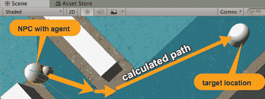

# 准备工作

所需的 Terrain TextureSandAlbedo 可以在 15_01 文件夹中找到。或者，你可以转到 Assets |导入包 | 环境，取消选择所有内容，然后找到并勾选此资产：Assets/Environment/TerrainAssets/SurfaceTextures/SandAlbedo.psd

# 如何操作...

要使 NPC 在避开障碍物的同时前往目的地，请按照以下步骤操作：

1.  创建一个新的空 3D 项目。

1.  创建一个新的 3D 地形，选择菜单：创建 | 3D 对象 | 地形。在层次结构中选择这个新的地形游戏对象，在其检查器属性中设置其大小为 30 x 20，位置为(-15, 0, -10)，这样我们就有一个以(0,0,0)为中心的游戏对象。

1.  使用 SandAlbedo 纹理绘制地形。

1.  在(-12, 0, 8)处创建一个名为 Capsule-destination 的 3D 胶囊。这将是我们的 NPC 自主导航游戏对象的靶目标。

1.  创建一个名为 Sphere-arrow 的球体，其位置在(2, 0.5, 2)。将其缩放为(1,1,1)。

1.  创建第二个名为 Sphere-small 的球体。将其缩放为(0.5, 0.5, 0.5)。

1.  在层次结构中，将 Sphere-small 子组件移动到 Sphere-arrow，并定位在(0, 0, 0.5)：

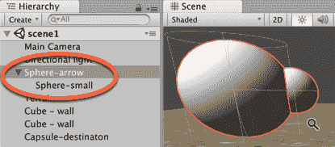

1.  在检查器面板中，向 Sphere-arrow 添加一个新的 NavMeshAgent。通过选择菜单：添加组件 | 导航 | Nav Mesh Agent 来完成此操作。

1.  将 NavMeshAgent 组件的停止距离属性设置为 2：

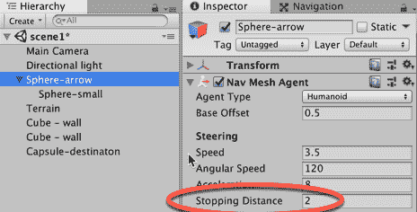

1.  创建`ArrowNPCMovement`C#脚本类，并将其实例对象添加到 Sphere-arrow 游戏对象中：

```cs
using UnityEngine;
 using UnityEngine.AI;

public class ArrowNPCMovement : MonoBehaviour {
 public GameObject targetGo;
 private NavMeshAgent navMeshAgent;

void Start() {
 navMeshAgent = GetComponent<NavMeshAgent>();
 HeadForDestintation();
 }

private void HeadForDestintation () {
 Vector3 destination = targetGo.transform.position;
 navMeshAgent.SetDestination (destination);
 }
 }
```

1.  确保在检查器面板中选择 Sphere-arrow。对于 ArrowNPCMovement 脚本组件，将 Capsule-destination 拖到 Target Go 变量上。

1.  在(-6, 0, 0)处创建一个名为 Cube-wall 的 3D 立方体，并将其缩放为(1, 2, 10)。

1.  在(-2, 0, 6)处创建另一个名为 Cube-wall2 的 3D 立方体，并将其缩放为(1, 2, 7)。

1.  通过选择菜单：窗口 | 导航来显示导航面板。

将导航面板停靠在检查器面板旁边是一个好地方，因为你永远不会同时使用检查器和导航面板。

1.  在层级面板中，选择两个立方体墙面对象（我们选择那些不应该成为场景可通行部分的对象），然后在导航面板中，点击**对象**按钮并勾选导航静态复选框：

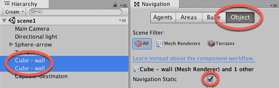

1.  在检查器中，点击顶部的**烘焙**按钮以获取烘焙选项。然后，点击右下角的**烘焙**按钮以创建你的导航网格资产：

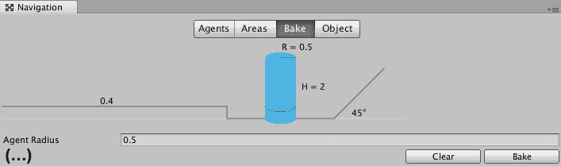

1.  当导航面板显示时，你会在场景的部分看到蓝色色调，这些部分是 NavMeshAgent 考虑其导航路径的区域。

1.  现在，运行你的游戏。你会看到球体箭头 GameObject 自动移动到胶囊目标 GameObject，沿着避开两个墙面对象的路径移动。

# 它是如何工作的...

我们添加到球体箭头 GameObject 中的 NavMeshAgent 组件为我们做了大部分工作。NavMeshAgents 需要两样东西：

+   一个要前往的目的地位置

+   地形上的可通行/不可通行区域的 NavMesh 组件，以便它可以通过避开障碍物来规划路径

我们创建了两个障碍物（立方体墙面对象），并在导航面板中为这个场景创建 NavMesh 时选择了它们。当导航面板显示时，同时场景面板（以及启用 Gizmos 的游戏面板）中，我们看到可通行区域形成一个蓝色导航网格。

注意：蓝色区域是默认的 NavMesh 区域。请看，在本章后面，有一个不同、自定义命名、有成本、颜色编码的 NavMesh 区域的配方。

我们 NPC 对象要前往的位置是胶囊目标 GameObject 在(-12, 0, 8)的位置；当然，我们也可以在场景面板中设计时移动这个对象，其新的位置将在游戏运行时成为目的地。

`ArrowNPCMovement` C#脚本类有两个变量：一个是目标 GameObject 的引用，另一个是 GameObject 的 NavMeshAgent 组件的引用，其中我们的`ArrowNPCMovement`类实例也是一个组件。当场景开始时，通过`Start()`方法找到 NavMeshAgent 兄弟组件，并调用`HeadForDestination()`方法，将 NavMeshAgent 的目的地设置为目的地 GameObject 的位置。

一旦 NavMeshAgent 有一个目标要前往，它将规划一条路径并持续移动，直到到达（或者如果该参数被设置为大于零的距离，则在其停止距离内）。

在场景面板中，如果您选择包含 NavMeshAgent 的 GameObject 并选择显示避免工具，那么您可以看到代理正在考虑的候选局部目标位置。方块越亮，位置排名越好。

方块的颜色越深，位置就越不理想；因此，深红色方块表示要避免的位置，因为它们可能会造成代理与 NavMesh 静态障碍物碰撞：

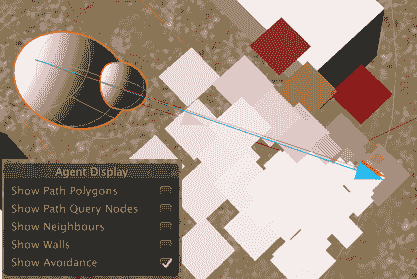

确保在**运行时**选择具有 NavMeshAgent 组件的对象在层次结构面板中，以便能够在场景面板中看到这些导航数据。

# NPC 寻找或逃离移动对象

而不是在场景开始时固定的目标，让我们允许 Capsule-destination 对象在场景运行时被玩家移动。在每一帧，我们将使 NPC 箭头重置 NavMeshAgent 的目标为 Capsule-destination 被移动到的任何位置。

# 准备工作

这个配方是在之前的配方基础上增加的，所以请复制那个项目文件夹，并使用该副本来完成这个配方的任务。

# 如何做到这一点...

要使 NPC 寻找或逃离移动对象，请按照以下步骤操作：

1.  在检查器中，为 Capsule-destination GameObject 添加一个刚体物理组件。

1.  在检查器中，对于 Capsule-destination GameObject，在刚体组件的约束选项中检查 Y 轴的冻结位置约束。这将防止由于移动时的碰撞而导致对象在 Y 轴上移动。

1.  创建`SimplePlayerControl`C#脚本类，并将其作为组件添加到 Capsule-destination GameObject：

```cs
using UnityEngine;

 public class SimplePlayerControl : MonoBehaviour {
 public float speed = 1000;
 private Rigidbody rigidBody;
 private Vector3 newVelocity;

 private void Start() {
 rigidBody = GetComponent<Rigidbody>();
 }

 void Update() {
   float xMove = Input.GetAxis("Horizontal") * speed * Time.deltaTime;
   float zMove = Input.GetAxis("Vertical") * speed * Time.deltaTime;
   newVelocity = new Vector3(xMove, 0, zMove);
 }

 void FixedUpdate() {
   rigidBody.velocity = newVelocity;
 }
}
```

1.  更新`ArrowNPCMovement`C#脚本类，以便我们每帧调用`HeadForDestintation()`方法，即从`Update()`而不是仅在`Start()`中调用一次：

```cs
void Start() {
     navMeshAgent = GetComponent<NavMeshAgent>();
 }

 private void Update() {
     HeadForDestintation();
 } 
```

# 它是如何工作的...

`SimplePlayerControl`脚本类检测箭头键的按下，并将它们转换为应用于移动 Capsule-destination GameObject 的力的方向。

`ArrowNPCMovement`脚本类的`Update()`方法使 NavMeshAgent 根据 Capsule-destination GameObject 的当前位置每帧更新其路径。当用户移动 Capsule-destination 时，NavMeshAgent 会计算到该对象的新路径。

# 还有更多

这里有一些你不想错过的细节。

# 使用调试射线显示源到目标线

使用可视调试射线显示 NPC 与 NavMeshAgent 之间的直线，以及它正在尝试导航到的当前目标非常有用。由于这是我们可能希望为许多游戏做的事情，因此在一个通用类中创建一个静态方法很有用，然后射线可以用一个单独的语句绘制。

要使用调试射线绘制源到目标线，请按照以下步骤操作：

1.  创建一个`UsefulFunctions.cs`C#脚本类，包含以下内容：

```cs
using UnityEngine;

public class UsefulFunctions : MonoBehaviour {
 public static void DebugRay(Vector3 origin, Vector3 destination, Color c) {
 Vector3 direction = destination - origin;
 Debug.DrawRay(origin, direction, c);
 }
 }
```

1.  现在，在`NPCMovement`C#脚本类中的`HeadForDestination()`方法末尾添加一个语句：

```cs
private void HeadForDestintation () {
Vector3 destination = targetGo.transform.position;
navMeshAgent.SetDestination (destination);
// show yellow line from source to target
 UsefulFunctions.DebugRay(transform.position, destination, Color.yellow);
 }
```

当场景运行时，我们可以在场景面板中看到一个黄色的线。如果选择游戏面板中的 Gizmos 选项（游戏面板标题栏的右上角），我们也可以在游戏面板中看到这个：

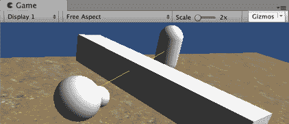

# 持续更新 NavMeshAgent 目的地以避开玩家的当前位置

有时候，我们希望由 AI 控制的 NPC 角色**远离**另一个角色，而不是朝它移动。例如，一个生命值非常低的敌人可能会逃跑，从而在再次战斗之前获得恢复生命值的时间。或者，一只野生动物可能会逃离任何靠近它的其他角色。

要让我们的 NavMeshAgent 避开玩家的位置，我们需要将`ArrowNPCMovement`C#脚本类替换为以下内容：

```cs
 using UnityEngine;
 using UnityEngine.AI;

 public class ArrowNPCMovement : MonoBehaviour {
 public float runAwayDistance = 10;
 public GameObject targetGO;
 private NavMeshAgent navMeshAgent;

void Start() {
 navMeshAgent = GetComponent<NavMeshAgent>();
 }

void Update() {
 Vector3 targetPosition = targetGO.transform.position;
 float distanceToTarget = Vector3.Distance(transform.position, targetPosition);
 if (distanceToTarget < runAwayDistance)
 FleeFromTarget(targetPosition);
 }

private void FleeFromTarget(Vector3 targetPosition) {
 Vector3 destination = PositionToFleeTowards(targetPosition);
 HeadForDestintation(destination);
 }

private void HeadForDestintation (Vector3 destinationPosition) {
 navMeshAgent.SetDestination (destinationPosition);
 }

private Vector3 PositionToFleeTowards(Vector3 targetPosition) {
 transform.rotation = Quaternion.LookRotation(transform.position - targetPosition);
 Vector3 runToPosition = targetPosition + (transform.forward * runAwayDistance);
 return runToPosition;
 }
 }
```

有一个公共变量`runAwayDistance`。当敌人距离小于这个`runAwayDistance`变量的值时，我们将指示计算机控制的对象向相反方向逃跑。

`Start()`方法缓存了 NavMeshAgent 组件的引用。

`Update()`方法计算敌人距离是否在`runAwayDistance`范围内，如果是，则调用`FleeFromTarget(...)`方法，并将敌人位置作为参数传递。

`FleeFromTarget(...)`方法计算一个点，该点在 Unity 单位中距离玩家立方体`runAwayDistance`，方向是直接远离计算机控制的对象。这是通过从当前变换的位置减去敌人位置向量来实现的。

最后，调用`HeadForDestintation(...)`方法，传递逃跑到的位置，这将导致 NavMeshAgent 被指示将位置设置为新的目的地。

Unity 单位是任意的，因为它们只是计算机上的数字。然而，在大多数情况下，将距离视为米（1 Unity 单位 = 1 米），质量视为千克（1 Unity 单位 = 1 千克）会使事情变得简单。当然，如果你的游戏基于微观世界或跨银河系太空旅行，那么你需要决定每个 Unity 单位在你的游戏上下文中对应什么。有关 Unity 中单位的进一步讨论，请查看这篇关于 Unity 测量的帖子：[`forum.unity3d.com/threads/best-units-of-measurement-in-unity.284133/#post-1875487`](http://forum.unity3d.com/threads/best-units-of-measurement-in-unity.284133/#post-1875487)。

Debug Ray 显示了 NPC 瞄准的点，无论是为了避开玩家的角色，还是为了赶上并保持与它的恒定距离：

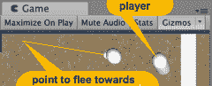

# 保持与目标恒定的距离（“潜伏”模式！）

将之前的代码修改为 NPC 尝试与目标对象保持恒定距离很简单。这涉及到始终朝向距离目标`runAwayDistance`的点移动，无论这个点是否朝向或远离目标。

只需从`Update()`方法中移除`If`语句：

```cs
void Update() {
 Vector3 targetPosition = targetGO.transform.position;
 float distanceToTarget = Vector3.Distance(transform.position, targetPosition);
 FleeFromTarget(targetPosition);
 }
```

然而，使用这种变化，可能最好将方法命名为`MoveTowardsConstantDistancePoint()`而不是`FleeFromTarget()`，因为我们的 NPC 有时在逃跑，有时在跟随。

# 点击式移动到对象

另一种为我们的 Sphere-arrow GameObject 选择目的地的方法是通过用户点击屏幕上的对象，然后 Sphere-arrow GameObject 移动到被点击对象的当前位置：

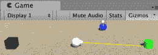

# 准备工作

这个配方增加了本章的第一个配方，所以请复制那个项目文件夹，并使用该副本来完成这个配方的任务。

# 如何做到这一点...

要创建基于对象的点击式迷你游戏，请执行以下操作：

1.  在检查器中，将 Player Tag 添加到 Sphere-arrow GameObject。

1.  从场景中删除两个 3D 立方体和 3D 胶囊目标。

1.  创建包含以下内容的`ClickMeToSetDestination` C#脚本类：

```cs
using UnityEngine;

public class ClickMeToSetDestination : MonoBehaviour
 {
 private UnityEngine.AI.NavMeshAgent playerNavMeshAgent;

void Start() {
 GameObject playerGO = GameObject.FindGameObjectWithTag("Player");
 playerNavMeshAgent = playerGO.GetComponent<UnityEngine.AI.NavMeshAgent>();
 }

private void OnMouseDown() {
 playerNavMeshAgent.SetDestination(transform.position);
 }
 }
```

1.  将`ClickMeToSetDestination` C#脚本类的实例对象作为组件添加到您的 3D 立方体、球体和圆柱体中。

1.  运行场景。当你点击其中一个 3D 对象时，Sphere-arrow GameObject 应该导航到被点击的对象。

# 它是如何工作的...

`ClickMeToSetDestination` C#脚本类的`OnMouseDown()`方法将 Sphere-arrow GameObject 中的 NavMeshAgent 的目标位置更改为被点击的 3D 对象的位置。

`ClickMeToSetDestination` C#脚本类的`Start()`方法获取标记为 Player 的 GameObject（即 Sphere-arrow GameObject）的 NavMeshAgent 组件的引用。

每次点击不同的对象时，Sphere-arrow GameObject 内部的 NavMeshAgent 都会更新，使 GameObject 移动到被点击对象的当前位置。

# 更多内容

有一些细节你不应该错过。

# 创建鼠标悬停黄色高亮

一个好的 UX（**用户体验**）反馈技术是在用户可以通过鼠标与对象交互时，通过视觉方式向用户指示。一种常见的方法是在鼠标移到可交互对象上时，呈现音频或视觉效果。

我们可以创建一个黄色的 Material，当鼠标悬停在对象上时，可以使对象看起来是黄色的，然后当鼠标移开时，对象恢复到原始材质。

创建包含以下内容的`MouseOverHighlighter` C#脚本类。然后，将实例对象作为组件添加到每个三个 3D GameObject 中：

```cs
using UnityEngine;

public class MouseOverHighlighter : MonoBehaviour
 {
 private MeshRenderer meshRenderer;
 private Material originalMaterial;

void Start() {
 meshRenderer = GetComponent<MeshRenderer>();
 originalMaterial = meshRenderer.sharedMaterial;
 }

void OnMouseOver() {
 meshRenderer.sharedMaterial = NewMaterialWithColor(Color.yellow);
 }

void OnMouseExit() {
 meshRenderer.sharedMaterial = originalMaterial;
 }

private Material NewMaterialWithColor(Color newColor) {
 Shader shaderSpecular = Shader.Find("Specular");
 Material material = new Material(shaderSpecular);
 material.color = newColor;

return material;
 }
 }
```

现在，当运行游戏时，当鼠标悬停在三个对象之一上时，该对象将被突出显示为黄色。如果你在对象突出显示时点击鼠标按钮，Sphere-arrow GameObject 将移动到（但停止在点击对象之前）。

# 点选移动到瓦片

与通过点击特定对象来指示我们的 AI 控制代理的目标相比，我们可以创建一个由 3D 平面（瓦片）对象组成的网格，允许玩家点击任何瓦片来指示 AI 控制角色的目的地。因此，任何位置都可以点击，而不仅仅是少数几个特定对象：

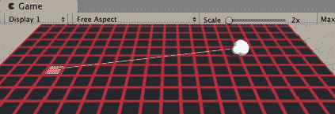

# 准备工作

此配方在先前的配方基础上进行扩展，因此请复制那个项目文件夹，并使用该副本来完成此配方的操作。

对于此配方，我们在`15_04`文件夹中的 Textures 文件夹中准备了一个名为 square_outline.png 的红色轮廓黑色方块 Texture 图像。

# 如何实现...

要创建一个点选游戏，将 GameObject 移动到选定的瓦片，请执行以下操作：

1.  从场景中删除你的 3D 立方体、球体和圆柱体 GameObject。

1.  创建一个新的 3D 平面对象，缩放为（0.1，0.1，0.1）。

1.  创建一个新的材质，使用提供的 Texture 图像 square_outline.png（黑色带有红色轮廓的方块）。将此材质应用到你的 3D 平面上。

1.  将`ClickMeToSetDestination`脚本类的实例对象作为组件添加到 3D 平面。

1.  在项目面板中，创建一个名为 tile 的新空 Prefab。

1.  通过将平面 GameObject 拖动到 Prefab 瓦片上，将 Prefab 瓦片填充为你的 3D 平面 GameObject 的属性（它应该从白色变为蓝色，以指示 Prefab 现在具有你的 GameObject 的属性）。

1.  从场景中删除你的 3D 平面 GameObject。

1.  创建一个新的`TileManager`C#脚本类，包含以下内容，并将其作为组件添加到主摄像机 GameObject：

```cs
using UnityEngine;

public class TileManager : MonoBehaviour {
 public int rows = 50;
 public int cols = 50;
 public GameObject prefabClickableTile;

void Start () {
 for (int r = 0; r < rows; r++) {
 for (int c = 0; c < cols; c++) {
 float y = 0.01f;
 Vector3 pos = new Vector3(r - rows/2, y, c - cols/2);
 Instantiate(prefabClickableTile, pos, Quaternion.identity);
 }
 }
 }
 }
```

1.  在层次结构中选择主摄像机，并在 Tile Manager（脚本）组件的检查器中，将“Prefab Clickable Tile”公共属性填充为项目面板中的 Prefab 瓦片。

1.  运行场景。现在，你应该能够点击任何小方块瓦片来设置 NavMeshAgent 控制的 Sphere-arrow GameObject 的目标。

# 工作原理...

你创建了一个 Prefab，其中包含名为 tile 的 3D 平面的属性，该 Prefab 包含`ClickMeToSetDestination`C#脚本类的组件实例对象。

`TileManager`脚本类循环创建场景中此瓦片 GameObject 的 50 x 50 个实例。

当你运行游戏时，如果你在鼠标指针悬停在瓦片上时点击鼠标按钮，Sphere-arrow GameObject 内部的 NavMeshAgent 将被设置为该瓦片的位置。因此，Sphere-arrow GameObject 将移动到，但在到达点击的瓦片位置之前停止。

**Y** 值为 0.01 表示平面将刚好位于地形之上，因此我们避免了由于同一位置网格造成的任何类型的摩尔纹干扰模式。通过从 **X** 和 **Z** 位置减去 `rows/2` 和 `cols/2`，我们将瓦片网格的中心定位在 (0, Y, 0)。

# 更多内容

有些细节是你不想错过的。

# 黄色调试射线显示 AI 代理的目的地

我们可以通过创建具有以下内容的 `MouseOverHighlighter` C# 脚本类来显示移动对象到其目的地瓦片的调试射线。然后，我们将实例对象作为组件添加到 NavMeshAgent 控制的 Sphere-arrow 游戏对象中：

```cs
using UnityEngine;
 using UnityEngine.AI;

public class DebugRaySourceDestination : MonoBehaviour {
 void Update() {
 Vector3 origin = transform.position;
 Vector3 destination = GetComponent<NavMeshAgent>().destination;
 Vector3 direction = destination - origin;
 Debug.DrawRay(origin, direction, Color.yellow);
 }
 }
```

# 使用用户定义的更高成本导航区域的点按射线投射

而不是通过点击对象或瓦片来指示期望的目的地，我们可以使用 Unity 内置的 `Physics.Raycast(...)` 方法来识别与游戏中的对象表面相关的哪个 Vector3 (x,y,z) 位置。

这涉及到从 2D (x,y) 屏幕位置转换到一个想象中的从用户视角出发的 3D “射线”，穿过屏幕，进入游戏世界，并识别它首先**击中**的对象（多边形）。

此配方使用 `Physics.Raycast` 将点击位置的位置设置为 NavMeshAgent 控制对象的新目的地。实际遵循的路线可以通过定义不同成本的导航网格区域来影响。例如，穿过泥地或游泳穿越水可能具有更高的成本，因为它们会花费更长的时间，所以 AI NavMeshAgent 可以计算出最低成本的路线，这可能是场景中最短距离的路线：

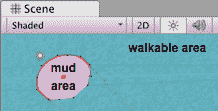

# 准备工作

此配方在先前的配方上进行了扩展，因此请复制那个项目文件夹，并使用该副本为此配方进行工作。

# 如何操作...

要使用射线投射创建一个点按游戏，请执行以下操作：

1.  从主相机游戏对象中移除 Tile Manager (脚本) 组件。

1.  创建一个新的 3D 球体，命名为 Sphere-destination，缩放为 (0.5, 0.5, 0.5)。

1.  创建一个新的红色材质，并将其分配给 Sphere-destination 游戏对象。

1.  创建一个新的`MoveToClickPoint` C# 脚本类，包含以下内容，并将实例对象作为组件添加到 Sphere-arrow 游戏对象中：

```cs
using UnityEngine;
 using UnityEngine.AI;

public class MoveToClickPoint : MonoBehaviour {
 public GameObject sphereDestination;
 private NavMeshAgent navMeshAgent;
 private RaycastHit hit;

void Start() {
 navMeshAgent = GetComponent<NavMeshAgent>();
 sphereDestination.transform.position = transform.position;
 }

void Update() {
 Ray rayFromMouseClick = Camera.main.ScreenPointToRay(Input.mousePosition);

if (FireRayCast(rayFromMouseClick)){
 Vector3 rayPoint = hit.point;
 ProcessRayHit(rayPoint);
 }
 }

private void ProcessRayHit(Vector3 rayPoint) {
 if(Input.GetMouseButtonDown(0)) {
 navMeshAgent.destination = rayPoint;
 sphereDestination.transform.position = rayPoint;
 }
 }

private bool FireRayCast(Ray rayFromMouseClick) {
 return Physics.Raycast(rayFromMouseClick, out hit, 100);
 }
 }
```

1.  在 Hierarchy 中选择 Sphere-arrow 游戏对象，并在 MoveToClickPoint (脚本) 组件的 Inspector 中，将 Sphere Destination 公共属性填充为你的红色 Sphere-destination 游戏对象。

1.  运行场景。现在你应该能够点击地形上的任何位置来设置 NavMeshAgent 控制的 Sphere-arrow 游戏对象的目的地。当你点击时，红色 Sphere-destination 游戏对象应该位于这个新的目的地点，Sphere-arrow 游戏对象将朝这个方向导航。

# 它是如何工作的...

你创建了一个名为 Sphere-destination 的小红色 3D 球体。

Sphere-arrow GameObject 的`MoveToClickPoint`脚本组件有一个公共变量。这个公共的`sphereDestination`变量已经与场景中的红色 Sphere-destination GameObject 链接。

有两个私有变量：

+   `navMeshAgent`：这将设置为指向 Sphere-arrow GameObject 的 NavMeshAgent 组件，以便在适当的时候重置其目的地。

+   `hit`：这是一个`RaycastHit`对象，作为`Physics.Raycast(...)`要设置的参数传入。在创建射线后，设置了该对象的多个属性，包括射线击中物体表面的场景中的位置。

`Start()`方法缓存了 Sphere-arrow GameObject 的 NavMesh 组件的引用，并将 Sphere-destination GameObject 移动到当前对象的位置。

在`Update()`方法中，每一帧都会根据主相机和屏幕上点击的(2,y)点创建一个射线。这个射线作为参数传递给`FireRayCast(...)`方法。如果该方法返回 true，则提取被击中物体的位置并传递给`ProcessRayHit(...)`方法。

`FireRayCast(...)`方法接收一个射线对象。它使用`Physics.Raycast(...)`来确定射线是否与场景中某个物体的部分发生碰撞。如果射线击中某个物体，则`RaycastHit hit`对象的属性将被更新。该方法返回一个布尔值，表示`Physics.Raycast(...)`是否击中了表面。

每当用户点击屏幕时，场景中的相应对象都会通过射线识别，红色球体被移动到那里，并且 NavMeshAgent 开始向该位置导航。

在[`docs.unity3d.com/ScriptReference/RaycastHit.html`](https://docs.unity3d.com/ScriptReference/RaycastHit.html)了解更多关于 Unity 射线 C#脚本类的信息。

# 还有更多

这里有一些细节，你不想错过。

# 通过为自定义定义的导航区域（如泥地和水面）设置不同的成本来实现更智能的路径查找

我们可以创建网格定义为 NavMeshAgents 旅行成本更高的对象，这有助于 AI 代理行为在避免水、泥地等时选择更快的路径，从而在现实世界中更加真实。

要创建一个具有更高旅行成本的定制 NavMesh 区域（我们假设它是泥地），请执行以下操作：

1.  在导航面板中，通过点击区域按钮来揭示区域。然后，定义一个名为泥地的新区域，成本为 2：

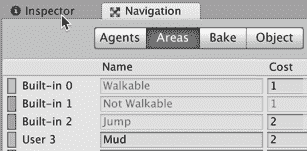

1.  创建一个新的 3D 圆柱体，命名为 Cylinder-mud，位置在(0, -4.9, 0)，缩放为(5,5,5)。

1.  确保在层次结构中选择 Cylinder-mud GameObject，并且导航面板是显示的。

1.  在导航面板中，点击对象按钮，勾选导航静态，并从导航区域下拉列表中选择泥地：

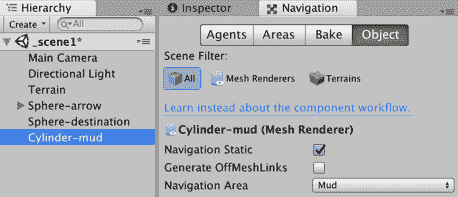

1.  现在，点击烘焙按钮以显示导航烘焙子面板，然后在此子面板中点击烘焙按钮以使用新对象重新生成导航网格。

现在，如果你点击移动 Sphere-arrow GameObject 接近圆柱-泥地区域的边缘，然后，比如说，点击对面，你会看到 NavMeshAgent 让 Sphere-arrow GameObject 沿着圆柱-泥地边缘的半圆形（最低成本）路径移动，而不是直接穿过成本更高的泥地路径：

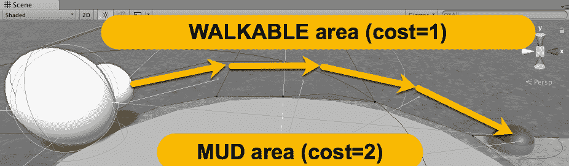

# 通过每帧更新“注视”光标来提高用户体验

在点击鼠标之前知道我们的目的地将被设置在哪里是很好的。所以，让我们添加一个黄色球体来显示我们的射线击中表面的“候选”目的地，这个目的地会随着我们移动鼠标而每帧更新。

因此，我们需要创建第二个黄色球体。我们还需要创建一个忽略层；否则，如果我们把黄色球体移动到射线击中表面的位置，那么在下一次帧中，我们的射线将会击中黄色球体的表面——每次帧都会让它离我们越来越近！

为了通过每帧更新“注视”光标来提高用户体验，请执行以下操作：

1.  创建一个新的名为 m_yellow 的黄色材质。

1.  创建第二个 3D 球体，命名为 Sphere-destination-candidate，并使用 m_yellow 纹理。

1.  创建一个新的层，UISpheres。

1.  将 Sphere-destination 和 Sphere-destination-candidate GameObject 的层设置为 LayerUISpheres。

1.  修改 `MoveToClickPoint` C# 脚本类，添加一个新的公共变量 `sphereDestinationCandidate`：

```cs
public class MoveToClickPoint : MonoBehaviour {
public GameObject sphereDestination;
public GameObject sphereDestinationCandidate;
```

1.  修改 `MoveToClickPoint` C# 脚本类，在 `ProcessRayHit(...)` 方法的逻辑中添加一个 Else 子句，以便如果鼠标没有点击，则将黄色 `sphereDestinationCandidate` 对象移动到射线击中表面的位置：

```cs
private void ProcessRayHit(Vector3 rayPoint) {
 if(Input.GetMouseButtonDown(0)) {
 navMeshAgent.destination = rayPoint;
 sphereDestination.transform.position = rayPoint;
 } else {
 sphereDestinationCandidate.transform.position = rayPoint;
 }
 }
```

1.  修改 `MoveToClickPoint` C# 脚本类，以便创建一个忽略层 UISpheres 的 `LayerMask`，并在调用 `Physics.Raycast(...)` 时将其作为参数传递：

```cs
private bool FireRayCast(Ray rayFromMouseClick) {
 LayerMask layerMask = ~LayerMask.GetMask("UISpheres");
 return Physics.Raycast(rayFromMouseClick, out hit, 100, layerMask.value);
 }
```

1.  在层次结构中选择 Sphere-arrow GameObject，然后在 MoveToClickPoint (Script) 组件的检查器中，将 Sphere Destination Candidate 公共属性填充为你的黄色 Sphere-destination-candidate GameObject。

1.  运行场景。现在，你应该能够点击地形上的任何地方来设置 NavMeshAgent 控制的 Sphere-arrow GameObject 的目的地。当你点击时，红色的 Sphere-destination GameObject 应该位于这个新的目的地点，Sphere-arrow GameObject 将朝这个方向导航。

我们使用 `~LayerMask.GetMask("UISpheres")` 语句设置了一个 `LayerMask`，这意味着除了命名层之外的所有层。这个层被传递给 `Raycast(...)` 方法，这样我们的红色和黄色球体在发射射线和查看射线首先击中哪个表面时会被忽略。

# NPC NavMeshAgent 按顺序跟随航点

航点通常用作指南，使自主移动的 NPC 和敌人以一般方式遵循路径，但能够在附近检测到朋友/捕食者/猎物时做出其他方向行为，如逃跑或寻找。航点按顺序排列，因此当角色到达或接近航点时，它将选择序列中的下一个航点作为移动的目标位置。这个配方演示了一个箭头对象移动到航点，然后当它足够接近时，它将选择序列中的下一个航点作为新的目标目的地。当到达最后一个航点后，它再次开始朝向第一个航点前进。

由于 Unity 的 NavMeshAgent 简化了 NPC 行为的编码，我们在这个配方中的工作基本上变成了找到下一个航点的位置，然后告诉 NavMeshAgent 这个航点是其新的目的地：

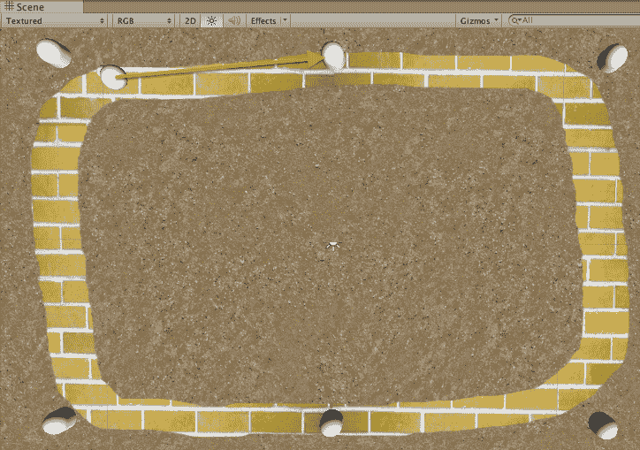

# 准备中

这个配方增加了本章的第一个配方，所以复制那个项目文件夹，并使用那个副本来完成这个配方的任务。

对于这个配方，我们在`1362_08_06`文件夹中的 Textures 文件夹中准备了一张你需要使用的黄色砖块纹理图像。

# 如何操作...

要指示一个对象遵循一系列航点，请按照以下步骤操作：

1.  将`ArrowNPCMovement`C#脚本类的内容替换为以下内容：

```cs
using UnityEngine;
 using UnityEngine.AI;

public class ArrowNPCMovement : MonoBehaviour {
 private GameObject targetGo = null;
 private WaypointManager waypointManager;
 private NavMeshAgent navMeshAgent;

void Start () {
 navMeshAgent = GetComponent<NavMeshAgent>();
 waypointManager = GetComponent<WaypointManager>();
 HeadForNextWayPoint();
 }

void Update () {
 float closeToDestinaton = navMeshAgent.stoppingDistance * 2;
 if (navMeshAgent.remainingDistance < closeToDestinaton) {
 HeadForNextWayPoint ();
 }
 }

private void HeadForNextWayPoint () {
 targetGo = waypointManager.NextWaypoint (targetGo);
 navMeshAgent.SetDestination (targetGo.transform.position);
 }
 }
```

1.  在(-12, 0, 8)的位置创建一个新的 3D 胶囊对象，命名为 Capsule-waypoint-0。

1.  复制 Capsule-waypoint-0，将其命名为 Capsule-waypoint-3，并将此副本放置在(8, 0, -8)的位置。

我们稍后将要添加一些中间的航点，编号为 1 和 2。这就是为什么这里的第二个航点编号为 3，以防你有所疑问。

1.  创建以下内容的`WaypointManager`C#脚本类，并将其作为组件添加到 Sphere-arrow 游戏对象中：

```cs
using UnityEngine;

 public class WaypointManager : MonoBehaviour {
 public GameObject wayPoint0;
 public GameObject wayPoint3;

public GameObject NextWaypoint(GameObject current) {
 if(current == wayPoint0)
 return wayPoint3;

return wayPoint0;
 }
 }
```

1.  确保在检查器中选择了 Sphere-arrow 的`WaypointManager`脚本组件。将 Capsule-waypoint-0 和 Capsule-waypoint-3 拖动到名为 Way Point 0 和 Way Point 3 的公共变量 projectiles 上，分别对应。

1.  现在，运行你的游戏。箭头对象将首先移动到其中一个航点胶囊，然后当它接近时，它会减速，掉头，朝向另一个航点胶囊前进，并持续这样做。

# 它是如何工作的...

我们添加到 Sphere-arrow 游戏对象的 NavMeshAgent 组件为我们做了大部分工作。NavMeshAgent 需要两样东西：

+   一个要前往的目的地位置

+   一个 NavMesh，以便它可以规划路径并避开障碍物

我们创建了两个可能的航点作为 NPC 移动的位置：Capsule-waypoint-0 和 Capsule-waypoint-3。

被称为 `WaypointManager` 的 C# 脚本类有一个任务：返回我们的 NPC 应该前往的下一个路点的引用。有两个变量，`wayPoint0` 和 `wayPoint3`，它们引用场景中的两个路点 GameObject。`NextWaypoint(...)` 方法接受一个名为 current 的单个参数，该参数是对象正在移动向其的当前路点的引用（或 `null`）。此方法的任务是返回 NPC 应该前往的下一个路点的引用。此方法的逻辑很简单：如果 current 指向 `waypoint0`，则我们将返回 `waypoint3`；否则，我们将返回 `waypoint0`。注意，如果我们向此方法传递 `null`，则我们将返回 `waypoint0`（因此，它是我们的默认第一个路点）。

`ArrowNPCMovement` C# 脚本类有三个变量。一个是名为 `targetGo` 的目标 GameObject 的引用。第二个是引用 GameObject 的 `NavMeshAgent` 组件，其中我们的 `ArrowNPCMovement` 类实例也是一个组件。第三个变量，称为 `waypointManager`，是引用兄弟脚本组件，即我们的 `WaypointManager` 脚本类的实例。

当场景通过 `Start()` 方法开始时，找到 NavMeshAgent 和 WaypointManager 兄弟组件，并调用 `HeadForDestination()` 方法。

`HeadForDestination()` 方法首先将名为 `targetGO` 的变量设置为指向通过调用名为 WaypointManager 的脚本组件的 `NextWaypoint(...)` 方法返回的 GameObject（即，`targetGo` 被设置为指向 Capsule-waypoint-0 或 Capsule-waypoint-3）。接下来，它指示 `NavMeshAgent` 将其目的地设置为 `targetGO` GameObject 的位置。

每帧都会调用名为 `Update()` 的方法。进行测试以查看 NPC 箭头对象与目的地路点的距离是否接近。如果距离小于我们在 NavMeshAgent 中设置的停止距离的两倍，则调用 `WaypointManager.NextWaypoint(...)` 来更新我们的目标目的地为序列中的下一个路点。

# 还有更多...

这里有一些你不想错过的细节。

# 与路点数组一起工作

拥有一个独立的`WaypointManager`C#脚本类，简单地在这几个胶囊位置（Capsule-waypoint-0 和 Capsule-waypoint-3）之间切换，可能看起来有点过于复杂，像是过度设计，但实际上这是一个非常好的举措。`WaypointManager`脚本类的实例对象负责返回下一个位置点。现在，在不修改`ArrowNPCMovement`C#脚本类中的任何代码的情况下，添加一个更复杂的具有位置点数组的实现方法变得非常简单。我们可以选择一个随机的位置点作为下一个目的地；例如，参见第十四章中的*选择目的地 - 查找最近的（或随机的）出生点*配方，*选择和控制位置*。或者，我们可以有一个位置点数组，并按顺序选择下一个位置点。

为了改进我们的游戏，使其能够按顺序跟随一系列位置点，我们需要做以下几步：

1.  复制 Capsule-waypoint-0，将其命名为 Capsule-waypoint-1，并将此副本放置在（0，0，8）的位置。

1.  再复制四个（命名为 Capsule-waypoint-1, 2, 4, 5），并按照以下方式定位它们：

    +   Capsule-waypoint-1: 位置 = (-2, 0, 8)

    +   Capsule-waypoint-2: 位置 = (8, 0, 8)

    +   Capsule-waypoint-4: 位置 = (-2, 0, -8)

    +   Capsule-waypoint-5: 位置 = (-12, 0, -8)

1.  将`WaypointManager`C#脚本类替换为以下代码：

```cs
using UnityEngine;
 using System;

public class WaypointManager : MonoBehaviour {
 public GameObject[] waypoints;

public GameObject NextWaypoint (GameObject current) {
 if( waypoints.Length < 1)
 Debug.LogError ("WaypointManager:: ERROR - no waypoints have been added to array!");

int currentIndex = Array.IndexOf(waypoints, current);
 int nextIndex = (currentIndex + 1) % waypoints.Length;

return waypoints[nextIndex];
 }
 }
```

1.  确保 Sphere-arrow 被选中。在`WaypointManager`脚本组件的检查器面板中，将 Waypoints 数组的大小设置为 6。现在，拖入所有六个名为 Capsule-waypoint-0/1/2/3/4/5 的胶囊位置点对象。

1.  运行游戏。现在，Sphere-arrow GameObject 将首先移动到位置点 0（左上角），然后跟随地形周围的序列。

1.  最后，你可以让它看起来像 Sphere 正在跟随一条黄色的砖路。导入提供的黄色砖纹理，将其添加到地形中，并绘制纹理以在位置点之间创建一个椭圆形路径。你也可以取消选中每个位置点胶囊的 Mesh Renderer 组件，这样用户就看不到任何位置点，只能看到跟随黄色砖路的箭头对象。

在`NextWaypoint(...)`方法中，首先检查数组是否为空，如果是，则记录错误。接下来，找到当前`waypoint`GameObject 在数组中的索引（如果存在）。最后，使用模运算符计算下一个位置点的数组索引，以支持循环序列，在访问到最后一个元素后返回数组的开始。

# 使用 WayPoint 类提高灵活性

而不是强制一个 GameObject 遵循单一的刚体位置序列，我们可以通过定义一个`WayPoint`类来使事情更加灵活，其中每个位置点 GameObject 都有一个可能的目的地数组，每个目的地也有自己的数组。这样，就可以实现一个有向图（digraph），其中线性序列只是可能的一个实例。

为了改进我们的游戏并使其与航点有向图一起工作，请执行以下操作：

1.  从球体箭头 GameObject 中移除脚本`WayPointManager`组件。

1.  将`ArrowNPCMovement`C#脚本类替换为以下代码：

```cs
 using UnityEngine;
 using System.Collections;

 public class ArrowNPCMovement : MonoBehaviour {
 public Waypoint waypoint;
 private bool firstWayPoint = true;
 private NavMeshAgent navMeshAgent;

 void Start (){
 navMeshAgent = GetComponent<NavMeshAgent>();
 HeadForNextWayPoint();
 }

 void Update () {
 float closeToDestinaton = navMeshAgent.stoppingDistance * 2;
 if (navMeshAgent.remainingDistance < closeToDestinaton){
 HeadForNextWayPoint ();
 }
 }

 private void HeadForNextWayPoint (){
 if(firstWayPoint)
 firstWayPoint = false;
 else
 waypoint = waypoint.GetNextWaypoint();

 Vector3 target = waypoint.transform.position;
 navMeshAgent.SetDestination (target);
 }
 }
```

1.  创建一个新的`WayPoint`C#脚本类，包含以下代码：

```cs
using UnityEngine;
using System.Collections;

public class Waypoint: MonoBehaviour {
public Waypoint[] waypoints;

public Waypoint GetNextWaypoint () {
return waypoints[ Random.Range(0, waypoints.Length) ];
 }
 }
```

1.  选择所有六个名为胶囊-航点-0/1/2/3/4/5 的 GameObject，并给它们添加一个`WayPoint`C#类的实例对象组件。

1.  选择球体箭头 GameObject，并添加一个`WayPoint`C#类的实例对象组件。

1.  确保选择了球体箭头 GameObject。在箭头 NPCMovement 脚本组件的检查器面板中，将胶囊-航点-0 拖入`Waypoint`公共变量槽中。

1.  现在，我们需要将胶囊-航点-0 连接到胶囊-航点-1，胶囊-航点-1 连接到胶囊-航点-2，依此类推。选择胶囊-航点-0，将其航点数组大小设置为 1，并将胶囊-航点-1 拖入。接下来，选择胶囊-航点-1，将其航点数组大小设置为 1，并将胶囊-航点-2 拖入。以此类推，直到最终将胶囊-航点-5 连接回胶囊-航点-0。

您现在拥有一个更加灵活的游戏架构，允许 GameObject 在到达每个航点时随机选择几条不同的路径。在这个配方变体中，我们已经实现了一个航点序列，因为每个航点只有一个链接航点的数组。然而，如果您将数组大小更改为 2 或更多，那么您将创建一个链接航点的图，为计算机控制的字符在游戏运行中的任何给定运行添加随机变化。

# 通过鸟群控制对象组移动

通过创建具有以下四个简单规则的对象集合，可以创建一个逼真的、自然外观的鸟群行为（例如鸟类、羚羊或蝙蝠）：

+   **分离**：避免与邻居过于接近

+   **避免障碍物**：立即转向远离前方障碍物

+   **对齐**：向鸟群前进的一般方向移动

+   **内聚性**：向鸟群中间的位置移动

鸟群中的每个成员都独立行动，但需要了解其鸟群成员的当前航向和位置。这个配方向您展示了如何创建一个包含两个鸟群立方体的场景：一个绿色立方体的鸟群和一个黄色立方体的鸟群。

为了简化，我们不会在我们的配方中考虑分离：

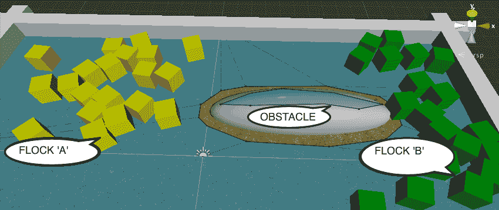

# 准备工作

这个配方基于您在第一个配方中创建的玩家控制的 3D 立方体 Unity 项目。因此，复制此项目，打开它，然后按照此配方的步骤进行操作。

控制红色立方体（玩家控制）移动所需的脚本（`PlayerControl.cs`）在`15_07`文件夹中提供。

# 如何操作...

要使一组对象聚集在一起，请按照以下步骤操作：

1.  在 Project 面板中创建一个材质，命名为 m_green，并将主颜色设置为绿色。

1.  在 Project 面板中创建一个材质，命名为 m_yellow，并将主颜色设置为黄色。

1.  在 (0,0,0) 位置创建一个名为 Cube-drone 的 3D 立方体 GameObject，并将 m_yellow 材质拖入此对象。

1.  向 Cube-drone 添加一个 Navigation | NavMeshAgent 组件。将 NavMeshAgent 组件的 Stopping Distance 属性设置为 2。

1.  向 Cube-drone 添加一个具有以下属性的 Physics RigidBody 组件：

    +   质量：1

    +   拖动为 0

    +   角度阻力为 0.05

    +   使用重力和不使用动力学都未勾选

    +   约束冻结位置：勾选 Y 轴

1.  创建以下 `Drone` C# 脚本类，并将一个实例对象作为组件添加到 Cube-drone GameObject：

```cs
 using UnityEngine;
 using UnityEngine.AI;

 public class Drone : MonoBehaviour {
 private NavMeshAgent navMeshAgent;

 void Start() {
 navMeshAgent = GetComponent<NavMeshAgent>();
 }

 public void SetTargetPosition(Vector3 swarmCenterAverage, Vector3 swarmMovementAverage) {
 Vector3 destination = swarmCenterAverage + swarmMovementAverage;
 navMeshAgent.SetDestination(destination);
 }
 }
```

1.  创建一个新的空 **Prefab**，命名为 dronePrefabYellow，然后从 Hierarchy 面板中，将你的 Cube-boid GameObject 拖入此 Prefab。

1.  现在，将 m_green 材质拖入 Cube-boid GameObject。

1.  创建一个新的空 Prefab，命名为 dronePrefabGreen，然后从 Hierarchy 面板中，将你的 Cube-drone GameObject 拖入此 Prefab。

1.  从 Scene 面板中删除 Cube-drone GameObject。

1.  创建以下 `Swarm` C# 脚本类，并将一个实例对象作为组件添加到 Main Camera：

```cs
using UnityEngine;
 using System.Collections.Generic;

public class Swarm : MonoBehaviour {
 public int droneCount = 20;
 public GameObject dronePrefab;

private List<Drone> drones = new List<Drone>();

void Awake() {
 for (int i = 0; i < droneCount; i++)
 AddDrone();
 }

void FixedUpdate() {
 Vector3 swarmCenter = SwarmCenterAverage();
 Vector3 swarmMovement = SwarmMovementAverage();

foreach(Drone drone in drones )
 drone.SetTargetPosition(swarmCenter, swarmMovement);
 }

private void AddDrone()
 {
 GameObject newDroneGo = Instantiate(dronePrefab);
 Drone newDrone = newDroneGo.GetComponent<Drone>();
 drones.Add(newDrone);
 }

private Vector3 SwarmCenterAverage() {
 Vector3 locationTotal = Vector3.zero;
 foreach(Drone drone in drones )
 locationTotal += drone.transform.position;

return (locationTotal / drones.Count);
 }

private Vector3 SwarmMovementAverage() {
 Vector3 velocityTotal = Vector3.zero;
 foreach(Drone drone in drones )
 velocityTotal += drone.GetComponent<Rigidbody>().velocity;

return (velocityTotal / drones.Count);
 }
 }
```

1.  在 Hierarchy 面板中选择 Main Camera，从 Project 面板中将 dronePrefabYellow 拖到 Drone Prefab 公共变量上。

1.  在 Hierarchy 面板中选择 Main Camera，向此 GameObject 添加 `Swarm` 脚本类的一个第二个实例对象，然后从 Project 面板中将 dronePrefabGreen 拖到 Drone Prefab 公共变量上。

1.  创建一个新的 3D 立方体，命名为 wall-left，具有以下属性：

    +   位置： (-15, 0.5, 0)

    +   缩放： (1, 1, 20)

1.  通过命名新对象 wall-right 复制 wall-left 对象，并将 wall-right 的位置更改为 (15, 0.5, 0)。

1.  创建一个新的 3D 立方体，命名为 wall-top，具有以下属性：

    +   位置： (0, 0.5, 10)

    +   缩放： (31, 1, 1)

1.  通过命名新对象 wall-bottom 复制 wall-top 对象，并将 wall-bottom 的位置更改为 (0, 0.5, -10)。

1.  创建一个新的 3D 球体，命名为 Sphere-obstacle，具有以下属性：

    +   位置： (5, 0, 3)

    +   缩放： (10, 3, 3)

1.  在 Hierarchy 面板中选择 Sphere-obstacle GameObject。然后在 Navigation 面板中勾选 Navigation Static 复选框。然后，点击 Navigation 面板底部的 Bake 按钮。

1.  最后，为玩家创建一个红色的 3D 立方体，通过添加 Materialm_red 使其变红，并通过将其缩放设置为 (3,3,3) 使其变大。现在，将 `PlayerControl` C# 脚本类的一个实例对象作为组件添加到这个 GameObject。

# 如何工作...

Swarm 类包含三个变量：

1.  `droneCount`：它是一个整数，引用了创建的 Swarm 类成员的数量

1.  `dronePrefab`：它引用了要克隆以创建群体成员的 Prefab

1.  `drones`：一个引用无人机的对象列表；一个列表，包含所有已创建的`Swarm`对象中的所有脚本`Drone`组件

在创建时，随着场景的开始，Swarm 脚本类的`Awake()`方法通过反复调用`AddDrone()`方法来循环创建`droneCount`个 swarm 成员。此方法从预制体实例化一个新的 GameObject，然后将`newDrone`变量设置为对新的`Swarm`类成员中 Drone 脚本对象的引用。在每一帧中，`FixedUpdate()`方法通过调用它们的`SetTargetPosition(...)`方法来遍历`Drone`对象列表，并传入`Swarm`中心位置和所有 swarm 成员速度的平均值。

这个`Swarm`类的其余部分由两个方法组成：一个（`SwarmCenterAverage`）返回一个表示所有`Drone`对象平均位置的`Vector3`对象，另一个（`SwarmMovementAverage`）返回一个表示所有`Drone`对象平均速度（运动力）的`Vector3`对象：

1.  `SwarmMovementAverage()`:

    1.  群体正在移动的一般方向是什么？

    1.  这被称为对齐：一个 swarm 成员试图移动到与群体平均方向相同

1.  `SwarmCenterAverage()`:

    1.  群体的中心位置在哪里？

    1.  这被称为凝聚力：一个 swarm 成员试图移动到群体的中心

核心工作由`Drone`类承担。每个无人机的`Start(...)`方法找到并缓存其 NavMeshAgent 组件的引用。

每个无人机的`UpdateVelocity(...)`方法接受两个`Vector3`参数：`swarmCenterAverage`和`swarmMovementAverage`。然后此方法通过简单地将两个向量相加来计算这个`Drone`所需的新速度，并使用结果（一个`Vector3`位置）来更新 NavMeshAgent 的目标位置。

现代计算中的大多数群聚模型都归功于 20 世纪 80 年代克雷格·雷诺斯的工作。了解更多关于克雷格和他的 boids 程序的信息，请访问[`en.wikipedia.org/wiki/Craig_Reynolds_(computer_graphics)`](http://en.wikipedia.org/wiki/Craig_Reynolds_(computer_graphics))。

# 创建可移动的 NavMesh 障碍物

有时，我们希望移动对象减速或防止 AI NavMeshAgent 控制的角色穿过游戏中的某个区域。或者，也许我们希望像门或吊桥这样的东西有时允许通行，而有时不允许。我们无法在 Design-Time 将这些对象“烘焙”到 NavMesh 中，因为我们希望在 Run-Time 更改它们。

虽然在计算上更昂贵（也就是说，它们会减慢你的游戏速度，比静态不可导航的对象更多），但 NavMesh 障碍物是可以添加到 GameObject 的组件，并且这些组件可以像任何其他组件一样启用和禁用。

NavMesh 障碍物的一个特殊属性是它们可以被设置为“雕刻”NavMesh 的区域，导致 NavMeshAgents 重新计算避免这些雕刻出的网格部分的路线。

在这个菜谱中，你将创建一个玩家控制的红色立方体，你可以移动它来阻碍 AI NavMeshAgent 控制的角色。此外，如果你的立方体在一个地方停留半秒或更长时间，它将雕刻出其周围的 NavMesh 的一部分，因此导致 NavMeshAgent 停止撞击障碍物，并计算并遵循一条避开它的路径：

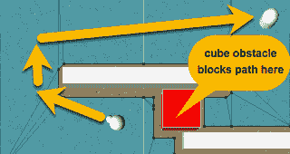

# 准备工作

这个菜谱增加了本章的第一个菜谱，所以请复制那个项目文件夹，并使用该副本来完成这个菜谱的工作。

控制红色立方体移动所需的脚本 (`PlayerControl.cs`) 已在 `15_08` 文件夹中提供。

# 如何操作...

要创建一个可移动的 NavMesh Obstacle，请按照以下步骤操作：

1.  在项目面板中创建一个 Material，命名为 m_green，并将主颜色调整为绿色。

1.  为玩家控制创建一个红色 3D 立方体，命名为 Cube-player，通过添加 Material m_red 使其变红，并通过将其比例设置为 (3,3,3) 使其变大。

1.  将提供的 `PlayerControl` C# 脚本类的一个实例作为组件添加到这个 GameObject 上。

1.  在检查器中，向 Cube-player 添加一个 Navigation | NavMesh Obstacle 组件并检查其 Carve 属性。

1.  运行游戏。你可以移动玩家控制的红色立方体来阻碍移动的 Sphere-arrow GameObject。在 NavMesh Obstacles Time-to-stationary 时间为半秒后，如果你显示了 Gizmos，你会看到 NavMesh 的雕刻，这样 Cube-player 占据的区域以及其周围的一小部分就会被从 NavMesh 中移除，然后 Sphere-arrow GameObject 将重新计算一条新的路线，避开 Cube-player 所在的雕刻区域。

# 它是如何工作的...

在运行时，AI NavMeshAgent 控制的 Sphere-arrow GameObject 会朝向目标点移动，但当玩家控制的红色立方体挡在路中间时，它会停止。一旦立方体静止超过 0.5 秒，NavMesh 就会被雕刻出来，这样 AI NavMeshAgent 控制的 **Sphere-arrow** GameObject 就不再尝试规划通过立方体占据的空间的路径，而是重新计算一条完全避开障碍物的新路径，即使这意味着要回头并偏离目标的一部分路径。
