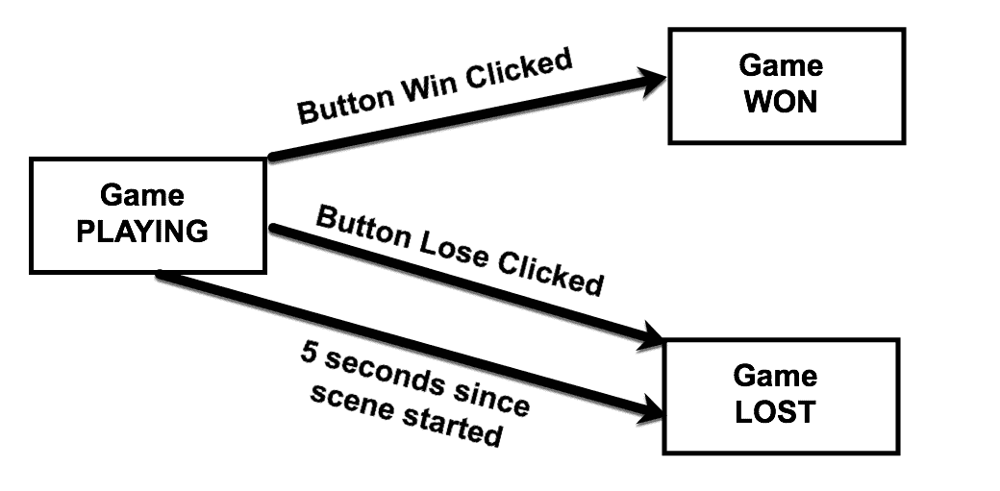
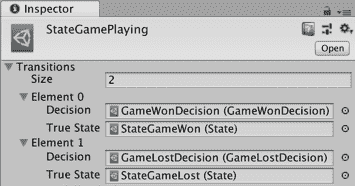
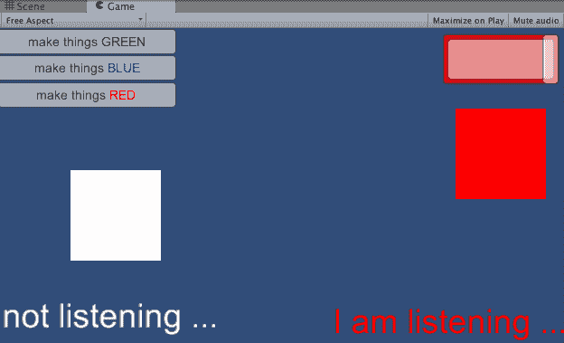

# 设计模式

在本章中，我们将涵盖：

+   由状态驱动的行为 DIY 状态

+   由状态驱动的行为 状态设计模式类

+   使用 Unity 可脚本化对象的状态驱动行为

+   发布-订阅模式 C#委托和事件

+   模型-视图-控制器（MVC）模式

# 简介

在计算机编程的一般情况下，某些类型的功能和需求经常出现。对于计算机游戏编程，新游戏通常具有与现有游戏共同的特征。软件**设计模式**是解决常见问题的可重用、计算机语言无关的模板。

并非所有设计模式对所有语言都是必需的（例如，某些计算机语言可能已经提供了解决常见问题的简单方法）。在本章中，我们将探讨在 C#编程语言背景下 Unity 游戏编程中的几个常见设计模式。

# 整体情况

没有必要重新发明轮子，并且对于游戏程序员来说，采用经过验证的方法来解决游戏项目中常见的功能有许多优势。设计模式是通过经验设计的，并经过提炼，以鼓励良好的编程实践和精心设计的软件架构解决方案。设计模式中的常见主题是代码组件的独立性，以及当组件需要相互了解时，明确定义的接口及其交互协议。

在本章中，食谱主要关注三个主要设计模式，这些模式不仅众所周知，而且不仅存在于游戏软件设计中，还存在于许多交互式软件系统的设计中，如 Web 应用和手机编程。本章探讨的设计模式包括：

+   **状态模式**：状态及其转换

+   **发布-订阅模式**：观察者订阅事件发布对象

+   **模型-视图-控制器（MVC）模式**：将内部工作与 UI 组件和显示表示分离

在本章中，示例以通用面向对象设计的形式呈现，同时也有 C#特定的功能（例如**委托**和**事件**），以及一些 Unity 特定的功能（例如**可脚本化对象**）。虽然通用方法具有优势，即来自其他语言或领域的程序员会立即熟悉他们的 Unity 游戏实现，但通过利用语言和引擎特定的功能，可以找到最显著的内存速度提升。

C# 的 **Delegate** 变量就像一个用于函数（或函数集合）的容器，这些函数可以被传递和调用。它们被分配了值，并且可以在运行时更改。**Delegates** 可以通过使用 `+=` 操作符进行多播，多个方法可以被分配给单个委托，并且当委托被调用时，所有方法都会被调用。C# 的 **events** 是一种特殊且更安全的委托类型。通过定义公共静态事件变量，我们限制其他脚本类只能允许：

+   订阅其中一个方法

+   取消其中一个方法的订阅

事件确保了我们的代码逻辑的良好分离，并且意味着发布事件的脚本类不需要了解或关心有多少其他脚本类正在订阅发布的事件。

这里有一些你可以学习更多关于 **设计模式** 和 Unity 的资源：

+   关于由敌人状态驱动的 AI 的 Unity 教程：[`unity3d.com/learn/tutorials/topics/navigation/finite-state-ai-delegate-pattern`](https://unity3d.com/learn/tutorials/topics/navigation/finite-state-ai-delegate-pattern)

+   关于 **delegates** 和 **events** 的 Unity 教程：

    +   [`unity3d.com/learn/tutorials/topics/scripting/delegates?playlist=17117`](https://unity3d.com/learn/tutorials/topics/scripting/delegates?playlist=17117)

    +   [`unity3d.com/learn/tutorials/topics/scripting/events`](https://unity3d.com/learn/tutorials/topics/scripting/events)

+   Prime[31] 关于 Unity 委托和事件的视频（2011 年发布，但仍然是一个很好的介绍）：[`www.youtube.com/watch?v=N2zdwKIsXJs`](http://www.youtube.com/watch?v=N2zdwKIsXJs)

+   Eric Nordeus 的 Unity 和 **设计模式** 教程：[`www.habrador.com/tutorials/programming-patterns/`](http://www.habrador.com/tutorials/programming-patterns/)

+   Unity **模型-视图-控制器** 教程：

    +   Gameasutra: [`www.gamasutra.com/blogs/TabeaIseli/20160926/282062/MVC_in_Unity.php`](https://www.gamasutra.com/blogs/TabeaIseli/20160926/282062/MVC_in_Unity.php)

    +   Eduardo Dias Da Costa：[`www.toptal.com/unity-unity3d/unity-with-mvc-how-to-level-up-your-game-development`](https://www.toptal.com/unity-unity3d/unity-with-mvc-how-to-level-up-your-game-development)

    +   Jackson Dunstan：[`jacksondunstan.com/articles/3092`](https://jacksondunstan.com/articles/3092)

# 驱动行为的状态 DIY 状态

总体而言，游戏以及单个对象或角色，常常可以被视为（或建模为）通过不同的状态或模式。建模状态和状态变化（由于事件或游戏条件）是管理游戏和游戏组件复杂性的非常常见方式。在本食谱中，我们使用 `GameManager` 类创建了一个简单的三状态游戏（游戏进行中/游戏胜利/游戏失败）。提供了按钮和计时器来模拟允许玩家赢得或输掉游戏的事件：


# 如何做到...

要使用状态来管理对象行为，请按照以下步骤操作：

1.  在屏幕顶部中间创建两个 UI 按钮。将一个命名为`Button-win`，并编辑其文本为`Win Game`。将第二个命名为`Button-lose`，并编辑其文本为`Lose Game`。

1.  在屏幕左上角创建一个 UI Text 对象。将其命名为`Text-state-messages`，并将其 Rect Transform 高度属性设置为`300`，其 Text（脚本）Paragraph Vertical Overflow 属性设置为`Overflow`。

1.  创建一个新的 C#脚本类，`GameStates.cs`：

```cs
    public class GameStates
     {
         public enum GameStateType
         {
             GamePlaying,
             GameWon,
             GameLost,
         }
     } 
```

1.  创建`MyGameManager.cs`C#脚本类，并将实例对象作为组件添加到主摄像机：

```cs
    using UnityEngine;
     using System;
     using UnityEngine.UI;

     public class MyGameManager : MonoBehaviour
     {
         public Text textStateMessages;
         public Button buttonWinGame;
         public Button buttonLoseGame;

         private GameStates.GameStateType currentState;
         private float timeGamePlayingStarted;
         private float timeToPressAButton = 5;

         void Start()
         {
              currentState = GameStates.GameStateType.GamePlaying;
         }

         //--------- Update[ S ] - state specific actions
         void Update()
         {
             switch (currentState)
             {
                 case GameStates.GameStateType.GamePlaying:
                     UpdateStateGamePlaying();
                     break;
                 case GameStates.GameStateType.GameWon:
                     // do nothing
                     break;
                 case GameStates.GameStateType.GameLost:
                     // do nothing
                     break;
             }
         }

         public void NewGameState(GameStates.GameStateType newState)
         {
             // (1) state EXIT actions
             OnMyStateExit(currentState);

             // (2) change current state
             currentState = newState;

             // (3) state ENTER actions
             OnMyStateEnter(currentState);

             PostMessageDivider();
         }

         public void PostMessageDivider()
         {
             string newLine = "\n";
             string divider = "--------------------------------";
             textStateMessages.text += newLine + divider;
         }

         public void PostMessage(string message)
         {
             string newLine = "\n";
             string timeTo2DecimalPlaces =
     String.Format("{0:0.00}", Time.time);
             textStateMessages.text += newLine +
     timeTo2DecimalPlaces + " :: " + message;
         }

         private void DestroyButtons()
         {
             Destroy(buttonWinGame.gameObject);
             Destroy(buttonLoseGame.gameObject);
         }

         //--------- OnMyStateEnter[ S ] - state specific actions
         private void OnMyStateEnter(GameStates.GameStateType state)
         {
             string enterMessage = "ENTER state: " +
             state.ToString();
             PostMessage(enterMessage);

             switch (state)
             {
                 case GameStates.GameStateType.GamePlaying:
                     OnMyStateEnterGamePlaying();
                     break;
                 case GameStates.GameStateType.GameWon:
                     // do nothing
                     break;
                 case GameStates.GameStateType.GameLost:
                     // do nothing
                     break;
             }
         }

         private void OnMyStateEnterGamePlaying()
         {
             // record time we enter state
             timeGamePlayingStarted = Time.time;
         }

         //--------- OnMyStateExit[ S ] - state specific actions
         private void OnMyStateExit(GameStates.GameStateType state)
         {
             string exitMessage = "EXIT state: " + state.ToString();
             PostMessage(exitMessage);

             switch (state)
             {
                 case GameStates.GameStateType.GamePlaying:
                     OnMyStateExitGamePlaying();
                     break;
                 case GameStates.GameStateType.GameWon:
                     // do nothing
                     break;
                 case GameStates.GameStateType.GameLost:
                     // do nothing
                     break;
             }
         }

         private void OnMyStateExitGamePlaying()
         {
             // if leaving gamePlaying state then destroy the 2 buttons
             DestroyButtons();
         }

         private void UpdateStateGamePlaying()
         {
             float timeSinceGamePlayingStarted =
             Time.time - timeGamePlayingStarted;
             if (timeSinceGamePlayingStarted > timeToPressAButton)
             {
                 string message = "User waited too long - automatically   
                 going to Game LOST state";
                   PostMessage(message);
                 NewGameState(GameStates.GameStateType.GameLost);
             }
         }
     } 
```

1.  创建`ButtonActions.cs`C#脚本类，并将实例对象作为组件添加到主摄像机：

```cs
    using UnityEngine;

     public class ButtonActions : MonoBehaviour
     {
         private MyGameManager myGameManager;

         private void Start()
         {
             myGameManager = GetComponent<MyGameManager>();
         }

         public void BUTTON_CLICK_ACTION_WIN_GAME()
         {
             string message = "Win Game BUTTON clicked";
             myGameManager.PostMessage(message);
             myGameManager.NewGameState
             (GameStates.GameStateType.GameWon);
         }

         public void BUTTON_CLICK_ACTION_LOSE_GAME()
         {
             string message = "Lose Game BUTTON clicked";
             myGameManager.PostMessage(message);
             myGameManager.NewGameState
             (GameStates.GameStateType.GameLost);
         }

     } 
```

1.  在层次结构中选择“Button-win”按钮，并为它的按钮（脚本）组件添加一个 OnClick 动作，以从主摄像机 GameObject 中的 ButtonsActions 组件调用`BUTTON_CLICK_ACTION_WIN_GAME()`方法。

1.  在层次结构中选择“Button-lose”按钮，并为它的按钮（脚本）组件添加一个 OnClick 动作，以从主摄像机 GameObject 中的 ButtonActions 组件调用`BUTTON_CLICK_ACTION_LOSE_GAME()`方法。

1.  在层次结构中选择主摄像机 GameObject。将此 GameObject 拖入检查器以确保所有三个 GameManager（脚本）公共变量（Text State Messages、Button Win Game 和 Button Lose Game）都有相应的 Canvas GameObject 拖入其中（两个按钮和 UI Text GameObject）。

# 它是如何工作的...

如以下状态图所示，这个配方模拟了一个简单的游戏，它从`GamePlaying`状态开始；然后，根据用户点击的按钮，游戏将移动到`GameWon`状态或`GameLost`状态。另外，如果用户等待太长时间（五秒）才点击按钮，游戏将移动到`GameLost`状态。

系统的可能状态是通过在`GameStates`类中使用枚举的`GameStateType`类型来定义的，并且系统在任何时间点的当前状态都存储在`GameManager`的`currentState`变量中：



初始状态`GamePlaying`是在`MyGameManager`的`Start()`方法中设置的。

`GameManager`在 Unity 中似乎是一个特殊的资产名称，因此，我们已将我们的游戏管理脚本类命名为`MyGameManager`，以避免任何问题。

当`MyGameManager`对象接收到消息（例如，对于`Update()`，每帧一次）时，其行为必须适合当前状态。因此，我们在`Update()`方法中看到了一个`Switch`语句，它调用特定状态的方法。例如，如果当前状态是`GamePlaying`，当接收到`Update()`消息时，将调用`UpdateStateGamePlaying()`方法。

`NewGameState(...)`方法首先调用带有当前状态的`OnMyStateExit(...)`方法，因为当退出特定状态时可能需要执行某些操作；例如，当退出`GamePlaying`状态时，它会销毁两个按钮。接下来，`NewGameState(...)`方法将`currentState`变量设置为分配新状态。然后，调用`OnMyStateEnter(...)`方法，因为当进入新状态时可能需要立即执行某些操作。最后，通过调用`PostMessageDivider()`方法，在 UI 文本框中发布一个消息分隔符。

当对应的按钮被点击时，会执行`BUTTON_CLICK_ACTION_WIN_GAME()`和`BUTTON_CLICK_ACTION_LOSE_GAME()`方法。它们将游戏移动到相应的`GameWon`或`GameLost`状态。

逻辑已经编写在`UpdateStateGamePlaying()`方法中，因此一旦`MyGameManager`处于`GamePlaying`状态超过一定时间（由`timeToPressAButton`变量定义），游戏将自动变为`GameLost`状态。

因此，对于每个状态，我们可能需要编写状态退出、状态进入和更新事件的相应方法，以及每个事件的主方法，其中包含一个 Switch 语句来确定应该调用哪个状态方法（或不应调用）。正如可以想象的那样，随着更多状态和更复杂的游戏逻辑的需求增加，我们的方法和`MyGameManager`类中的方法数量将显著增加。

# 参见

+   下一个菜谱采用了一种更复杂的状态驱动游戏方法，其中每个状态都有自己的类。本章节的下一个菜谱展示了如何通过类继承和状态设计模式来管理状态的复杂性。

# 使用状态设计模式实现状态驱动行为

之前展示的模式不仅说明了建模游戏状态的有用性，而且还说明了游戏管理类如何增长并变得难以管理。为了管理许多状态和状态的复杂行为，软件开发社区提出了状态模式。设计模式是一般用途的软件组件架构，经过尝试和测试，被证明是解决常见软件系统特征的优秀解决方案。状态模式的关键特性是每个状态都由其自己的类来建模，并且所有状态都继承（子类化）自单个父状态类。状态需要相互了解，以便告诉游戏管理器更改当前状态。这是为了将整体游戏行为的复杂性分解为单独的状态类而付出的微小代价。

注意：非常感谢 Bryan Griffiths 的贡献，这有助于改进这个菜谱。

# 准备工作

这个菜谱基于之前的菜谱。因此，请复制那个项目，打开它，然后按照这个菜谱的步骤进行操作。

# 如何操作...

要使用状态模式架构管理对象的行为，请执行以下步骤：

1.  创建一个新的 C#脚本类，名为`GameState`:

```cs
    public class GameState
     {
         public enum EventType
         {
             ButtonWinGame,
             ButtonLoseGame
         }

         protected MyGameManager gameManager;
         public GameState(MyGameManager manager)
         {
             gameManager = manager;
         }

         public virtual void OnMyStateEntered() {}
         public virtual void OnMyStateExit() {}
         public virtual void StateUpdate() {}
         public virtual void OnEventReceived(EventType eventType) {}
     } 
```

1.  创建一个新的 C#脚本类，名为`StateGamePlaying`:

```cs
    using UnityEngine;

     public class StateGamePlaying : GameState
     {
         public StateGamePlaying(MyGameManager manager) : 
         base(manager) { }

         public override void OnMyStateEntered()
         {
             string stateEnteredMessage = "ENTER state: 
             StateGamePlaying";
             gameManager.DisplayStateEnteredMessage
             (stateEnteredMessage);
             Debug.Log(stateEnteredMessage);
         }

         public override void OnEventReceived(EventType eventType)
         {
             switch(eventType){
                 case (EventType.ButtonWinGame):
                     gameManager.NewGameState(gameManager.stateGameWon);
                     break;
                 case (EventType.ButtonLoseGame):
                 case (EventType.TimerFinished):
                     gameManager.NewGameState
                     (gameManager.stateGameLost);
                     break;
             }
         }
     } 
```

1.  创建一个新的 C#脚本类，名为`StateGameWon`:

```cs
    using UnityEngine;

     public class StateGameWon : GameState
     {
         public StateGameWon(MyGameManager manager) : base(manager) { }

         public override void OnMyStateEntered()
         {
             string stateEnteredMessage = "ENTER state: StateGameWon";
             gameManager.DisplayStateEnteredMessage
             (stateEnteredMessage);
             Debug.Log(stateEnteredMessage);
         }
     } 
```

1.  创建一个新的 C#脚本类，名为`StateGameLost`:

```cs
    using UnityEngine;

     public class StateGameLost : GameState
     {
         public StateGameLost(MyGameManager manager) : base(manager) { }

         public override void OnMyStateEntered()
         {
             string stateEnteredMessage = "ENTER state: StateGameLost";
             gameManager.DisplayStateEnteredMessage
             (stateEnteredMessage);
             Debug.Log(stateEnteredMessage);
         }
     } 
```

1.  用以下内容替换`MyGameManager`C#脚本类的现有内容：

```cs
    using UnityEngine;
     using UnityEngine.UI;

     public class MyGameManager : MonoBehaviour
     {
         public Text textGameStateName;
         public Button buttonWinGame;
         public Button buttonLoseGame;

         [HideInInspector]
         public StateGamePlaying stateGamePlaying;

         [HideInInspector]
         public StateGameWon stateGameWon;

         [HideInInspector]
         public StateGameLost stateGameLost;

         private GameState currentState;

         private void Awake()
         {
             stateGamePlaying = new StateGamePlaying(this);
             stateGameWon = new StateGameWon(this);
             stateGameLost = new StateGameLost(this);
         }

         private void Start()
         {
             NewGameState(stateGamePlaying);
         }

         private void Update()
         {
             if (currentState != null)
                 currentState.StateUpdate();
         }

         public void NewGameState(GameState newState)
         {
             if (null != currentState)
                 currentState.OnMyStateExit();

             currentState = newState;
             currentState.OnMyStateEntered();
         }

         public void DisplayStateEnteredMessage(string  
         stateEnteredMessage)
         {
             textGameStateName.text = stateEnteredMessage;
         }

         public void PublishEventToCurrentState(GameState.EventType 
         eventType)
         {
             currentState.OnEventReceived(eventType);
             DestroyButtons();
         }

         private void DestroyButtons()
         {
             Destroy(buttonWinGame.gameObject);
             Destroy(buttonLoseGame.gameObject);
         }
     } 
```

1.  在层次结构中，选择“Button-win”按钮，为其“Button (Script)”组件添加一个 OnClick 动作，以调用主摄像机 GameObject 中 GameManager 组件的`BUTTON_CLICK_ACTION_WIN_GAME()`方法。

1.  在层次结构中，选择“Button-lose”按钮，为其“Button (Script)”组件添加一个 OnClick 动作，以调用主摄像机 GameObject 中 GameManager 组件的`BUTTON_CLICK_ACTION_LOSE_GAME()`方法。

1.  在层次结构中，选择主摄像机 GameObject。将其拖动到检查器中，以确保所有三个 GameManager (Script)公共变量（文本状态消息、按钮赢游戏和按钮输游戏）都有相应的 Canvas GameObject 拖动到它们中（两个按钮和**UI Text**GameObject）。

# 它是如何工作的...

对于这个配方，场景非常简单。有一个单独的主摄像机 GameObject，它附有`MyGameManager`脚本对象组件。

为游戏需要管理的每个状态定义一个 C#脚本类——对于这个例子，`StateGamePlaying`、`StateGameWon`和`StateGameLost`。这些状态类都是`GameState`的子类。`GameState`定义了所有子类状态将拥有的属性和方法：

+   一个枚举类型`EventType`，它定义了游戏可能生成的两种可能的按钮点击事件：`ButtonWinGame`和`ButtonLoseGame`。

+   `gameManager`变量，以便每个状态对象都有一个指向游戏管理器的链接。

+   接受对`MyGameManager`引用的构造函数方法，这会自动使`gameManager`变量指向传入的`MyGameManager`对象。

+   四个具有空体的方法：`OnMyStateEntered()`、`OnMyStateExit()`、`OnEventRecieved(...)`和`StateUpdate()`。请注意，这些方法被声明为虚拟的，以便在必要时可以被子类覆盖，如果没有覆盖，则不会执行任何操作。

当`MyGameManager`类的`Awake()`方法执行时，将创建三个状态对象，每个对象对应于一个玩/赢/输类。这些状态对象存储在其相应的变量中：`stateGamePlaying`、`stateGameWon`和`stateGameLost`。

`MyGameManager`类中有一个名为`currentState`的变量，它在游戏运行期间始终指向当前状态对象（最初，它将是 null）。由于它是`GameState`类（所有状态类的父类）的引用，它可以指向任何不同的状态对象。

在 `Awake()` 之后，`GameManager` 将接收一个 `Start()` 消息。此方法将 `currentState` 初始化为 `stateGamePlaying` 对象。

对于每一帧，`GameManager` 将接收 `Update()` 消息。在接收到这些消息后，`GameManager` 会向 `currentState` 对象发送 `StateUpdate()` 消息。因此，对于每一帧，当前游戏状态的对象将执行这些方法。例如，当 `currentState` 设置为游戏进行时，对于每一帧，`gamePlayingObject` 将调用其（在这种情况下，为空的）`StateUpdate()` 方法。

`StateGamePlaying` 类在其 `OnEventReceived()` 方法中实现了语句，以便当用户点击按钮时，`gamePlayingObject` 将调用 `GameManager` 实例的 `NewState(...)` 方法，并传递对应新状态的对象。例如，如果用户点击按钮-win，则 `NewState(...)` 方法传递给 `gameManager.stateGameWon`。

# 还有更多...

有些细节你不希望错过。

# 在游戏开始后五秒添加计时器事件

状态模式解决方案使得添加新功能变得更加简单和清晰。例如，要将五秒计时器功能添加到这个配方中，请执行以下操作：

1.  创建一个新的 C# 脚本类名为 `SimpleTimer`，并将实例对象作为组件添加到主摄像机 GameObject：

```cs
    using UnityEngine;

     public class SimpleTimer : MonoBehaviour
     {
         private float timeGamePlayingStarted;
         private float timeToPressAButton = 5;

         private MyGameManager myGameManager;

         private void Start()
         {
             myGameManager = GetComponent<MyGameManager>();
             timeGamePlayingStarted = Time.time;
         }

         void Update ()
         {
             float timeSinceGamePlayingStarted = Time.time - 
             timeGamePlayingStarted;

             if (timeSinceGamePlayingStarted > timeToPressAButton)
             {
                 myGameManager.PublishEventToCurrentState
                 (GameState.EventType.TimerFinished);
             }
         }
     } 
```

1.  在 `GameState` 脚本类中添加一个新的 `TimerFinished` 事件类型：

```cs
    public enum EventType
     {
         ButtonWinGame,
         ButtonLoseGame,
         TimerFinished
     } 
```

1.  在 `StateGamePlaying` 中的 switch 语句中添加一个新的情况，以便这个 `TimerFinished` 事件也能使游戏进入 `GameLost` 状态：

```cs
    public override void OnEventReceived(EventType eventType)
     {
         switch(eventType){
             case (EventType.ButtonWinGame):
                 gameManager.NewGameState(gameManager.stateGameWon);
                 break;
             case (EventType.ButtonLoseGame):
             case (EventType.TimerFinished):
                 gameManager.NewGameState(gameManager.stateGameLost);
                 break;
         }
     } 
```

# 参见

+   在这个配方中，通过其他脚本对象（如主摄像机内部的脚本对象组件 `ButtonActions` 和 `SimpleTimer`）调用 `PublishEventToCurrentState(...)` 公共方法实现了导致 `MyGameManager` 改变其当前状态的复杂事件类型的一些实现。在本章后面的 *发布-订阅模式 C# 委托和事件* 配方中提供了更好的实现游戏事件的方法。

# 使用 Unity Scriptable Objects 的状态驱动行为

Unity 有一个名为 Scriptable Objects 的功能。Scriptable Objects 是存储在 `Assets` 文件夹中的资产文件，就像其他任何资产（如材质或纹理）一样。在某种程度上，Scriptable Objects 类似于 Monobehaviours，但它们不附加到 GameObjects 上。逻辑（代码）和数据都可以以 Scriptable Objects 的形式作为资产文件存储。

在这个配方中，我们实现了一个基于状态的游戏，游戏从游戏进行状态开始，当计时器耗尽时进入游戏失败状态。如果在计时器耗尽之前收集到两个星星，游戏将进入游戏胜利状态。提供了一个 **UI 按钮** 给用户，每次点击都会收集一个星星。

正如你将看到的，Scriptable Object 资产文件用于表示哪些决策会导致哪些状态变化发生。

# 如何实现...

要使用 Unity 可脚本对象管理游戏的状态驱动行为，请执行以下步骤：

1.  在屏幕中间创建一个 **UI Button**。将其命名为 `Button-collect-star` 并编辑其文本，使其显示为 `Collect a star`。

1.  在屏幕的右上角创建一个 **UI Text** 对象。将其命名为 `Text-current-state`。

1.  在屏幕的右上角创建一个 **UI Text** 对象。将其命名为 `Text-stars-collected`。

1.  在屏幕的左上角创建第二个 UI Text 对象，位于 `Text-stars-collected` 下方。将其命名为 `Text-seconds-left`。

1.  创建一个新的 C# 脚本类，命名为 `Decision`：

```cs
    using UnityEngine;

     public abstract class Decision : ScriptableObject
     {
         public abstract bool Decide(StateController controller);
     }
```

1.  创建一个新的 C# 脚本类，命名为 `Transition`：

```cs
    [System.Serializable]
     public class Transition
     {
         public Decision decision;
         public State trueState;
     } 
```

1.  创建一个新的 C# 脚本类，命名为 `State`：

```cs
    using UnityEngine;

     [CreateAssetMenu(menuName = "MyGame/State")]
     public class State : ScriptableObject
     {         public Transition[] transitions;

         public void UpdateState(StateController controller)
         {
             CheckTransitions(controller);
         }

         private void CheckTransitions(StateController controller)
         {
             for (int i = 0; i < transitions.Length; i++)
             {
                 bool decisionSucceeded = 
                 transitions[i].decision.Decide(controller);

                 if (decisionSucceeded)
                 {
                     controller.TransitionToState
                     (transitions[i].trueState);
                 }
             }
         }
     } 
```

1.  创建一个新的 C# 脚本类，命名为 `StateController`：

```cs
    using UnityEngine;

     public class StateController : MonoBehaviour
     {
         public State currentState;
         [HideInInspector] public MyGameManager gameManager;

         void Awake()
         {
             gameManager = GetComponent<MyGameManager>();
         }

         private void Update()
         {
             currentState.UpdateState(this);
             gameManager.DisplayCurrentState(currentState);
         }

         public void TransitionToState(State nextState)
         {
             currentState = nextState;
         }
     } 
```

1.  创建一个新的 C# 脚本类，命名为 `GameWonDecision`：

```cs
    using UnityEngine;

     [CreateAssetMenu(menuName = "MyGame/Decisions/GameWonDecision")]
     public class GameWonDecision : Decision
     {

         public override bool Decide(StateController controller)
         {
             return GameWonActionDetected(controller.gameManager);
         }

         private bool GameWonActionDetected(MyGameManager gameManager)
         {
             return gameManager.HasCollectedAllStars();
         }
     } 
```

1.  创建一个新的 C# 脚本类，命名为 `GameLostDecision`：

```cs
    using UnityEngine;

     [CreateAssetMenu(menuName = "MyGame/Decisions/GameLostDecision")]
     public class GameLostDecision : Decision
     {

         public override bool Decide(StateController controller)
         {
             return GameLostActionDetected(controller.gameManager);
         }

         private bool GameLostActionDetected(MyGameManager gameManager)
         {
             return gameManager.GetTimeRemaining() <= 0;
         }
     } 
```

1.  创建一个新的 C# 脚本类，命名为 `MyGameManager`，并将其实例对象作为主摄像机的组件添加：

```cs
    using UnityEngine;
     using UnityEngine.UI;

     public class MyGameManager : MonoBehaviour
     {
         public Text textCurrentState;
         public Text textStarsCollected;
         public Text textSecondsLeft;

         public float secondsLeft = 10;
         public int totalStarsToBeCollected = 2;
         private int starsColleted = 0;

         void Update()
         {
             secondsLeft -= Time.deltaTime;
             UpdateDisplays();
         }

         public void DisplayCurrentState(State currentState)
         {
             textCurrentState.text = currentState.name;
         }

         public bool HasCollectedAllStars()
         {
             return (starsColleted == totalStarsToBeCollected);
         }

         public float GetTimeRemaining()
         {
             return secondsLeft;
         }

         public void BUTTON_ACTION_PickupOneStar()
         {
             starsColleted++;
         }

         private void UpdateDisplays()
         {
             textStarsCollected.text = "stars = " + starsColleted;
             textSecondsLeft.text = "time left = " + secondsLeft;
         }
     } 
```

1.  在层次结构中，选择 `Button-collect-star` 按钮，并为它的按钮（脚本）组件添加一个 OnClick 动作，调用主摄像机 GameObject 中的 `MyGameManager` 组件的 `BUTTON_ACTION_PickupOneStar()` 方法。

1.  在项目面板中创建两个新的文件夹，分别命名为 `_Decisions` 和 `_States`。这些文件夹将包含此项目的可脚本对象资产文件。

1.  在 `_Decisions` 文件夹中，创建两个新的决策可脚本对象，分别命名为 `GameWonDecision` 和 `GameLostDecision`。通过选择菜单：资产 | 创建 | MyGame | 决策来完成此操作。

1.  在 `_States` 文件夹中，创建三个新的状态可脚本对象，分别命名为 `StateGamePlaying`、`StateGameWon` 和 `StateGameLost`。通过选择菜单：资产 | 创建 | MyGame | 状态来完成此操作。

1.  在项目面板文件夹 `_States` 中，选择 `StateGamePlaying` 可脚本对象，并在检查器中将其转换属性的大小设置为 `2`。

    +   对于元素 0，将决策设置为 GameWonDecision，并将真实状态设置为 StateGameWon

    +   对于元素 1，将决策设置为 GameLostDecision，并将真实状态设置为 StateGameLost：



1.  在层次结构中，选择主摄像机 GameObject。将其拖动到检查器中，以确保所有三个 GameManager（脚本）公共变量（当前状态文本、收集的星星文本和剩余秒数文本）都有相应的 Canvas **UI Text** GameObject 拖动到它们中。

1.  运行游戏。游戏应从 `StateGamePlaying` 状态开始。如果用户不采取任何操作，当计时器到达零时，游戏应进入 `StateGameLost` 状态。如果用户在计时器到达零之前点击按钮两次（模拟收集两个星星），游戏应进入 `StateGameWon` 状态。

# 它是如何工作的...

`GameManager` 对游戏中基于状态的决策一无所知。它有一个公共方法提供计时器剩余的秒数：`GetTimeRemaining()`。它还有一个公共方法返回一个布尔值（true/false），表示是否所有星星都已收集：`HasCollectedAllStars()`。它还引用了三个**UI Text** GameObject，因此它可以保持显示更新，显示剩余时间和收集的星星。还有一个公共的 `DispayCurrentState(...)` 方法也更新当前游戏状态的名称（即传递给此方法的任何内容）。

核心游戏行为由 `StateController` 脚本类驱动。它维护当前状态，并引用 `MyGameManager` 类的实例对象，这是它在主相机中的同级组件。它的 `Awake()` 方法获取 `MyGameManager` 对象的引用。它的 `Update()` 方法调用当前状态的 `UpdateState(...)` 方法。它将自己传递给当前状态。它还有一个第三个公共方法，`TransitionToState(...)`，允许状态指示控制器更改当前状态。

`Transition` 类没有方法，它仅仅存储两个对象的引用：一个决策和系统在决策为真时将改变到的状态。

`Decision` 类是抽象的，这意味着从这个类中永远不会创建任何对象，但可以定义子类。它声明任何子类都必须实现一个名为 `Decide(...)` 的方法，该方法返回一个布尔值（true/false）。

`State` 类有一个 `Transition` 对象数组，并且它的 `UpdateState()` 方法简单地调用其 `CheckTransitions(...)` 方法。`CheckTransitions(...)` 遍历每个转换，测试其 `Decision`。如果决策为真，它告诉 `StateController` 将当前状态设置为转换的真正状态。

在这个项目中，我们声明了 `Decision` 类的两个子类：

+   `GameWonDecision`: 这个类的 `Decide(...)` 方法返回其 `GameWonActionDetected(...)` 方法的值。`GameWonActionDetected(...)` 返回游戏管理器的 `HasCollectedAllStars()` 方法的值，即当游戏管理器表示所有星星都已收集时，游戏胜利的决策为真。

+   `GameWonDecision`: 这个类的 `Decide(...)` 方法返回其 `GameLostActionDetected(...)` 方法的值。`GameLostActionDetected(...)` 返回真，如果游戏管理器的计时器为零或更少（时间已用完）。

我们创建了五个可脚本化对象资源：

+   **三个状态**：`StateGamePlaying`、`StateGameWon`、`StateGameLost`

+   **两个决策**：`GameWonDecision` 和 `GameLostDecision`

我们能够通过创建菜单，通过在`Decision`和`State`脚本类声明之前的语句中声明应该有一个名为 MyGame 的新子菜单来创建这些可脚本化对象资产：

```cs
[CreateAssetMenu(menuName = "MyGame/Decisions/GameLostDecision")] 
```

在这些可脚本化对象中，唯一需要定制的是`StateGamePlaying`。在这个对象中定义了两个转换：

+   如果`GameWonDecision`变为 true，状态控制器应将当前状态设置为`StateGameWon`

+   如果`GameLostDecision`变为 true，状态控制器应将当前状态设置为`StateGameLost`

虽然这个简单的游戏可能需要做很多工作，但这个配方展示的是如何创建一些通用的状态机类（`State`、`Decision`、`Transition`、`StateController`），并且实际的游戏行为是通过一系列可脚本化对象资产以及两个类来实现的，这两个类用于实现特殊游戏事件的决策（`GameWonDecision`和`GameLostDecision`）。

由于可脚本化对象是资产文件，因此只有一个。有时，当游戏运行时，我们可能希望不同的 GameObject 使用相同的可脚本化对象——例如，许多不同敌人角色的 AI 状态转换可能共享使用同一个可脚本化对象。因此，当在`State`和`Decision`可脚本化对象上调用方法时，会传递一个`StateController`对象实例的引用，这样可脚本化对象的方法中的逻辑就可以在提供的任何运行时控制器对象上工作。这是一个被称为**委托**设计模式（不要与 C#的委托混淆）的另一个设计模式的例子。

# 还有更多...

有些细节你不希望错过。

# 将游戏扩展到模拟玩家健康

为了进一步了解这种基于状态的游戏数据驱动方法的力量，让我们向游戏中添加以下行为：

+   玩家有一个健康值，起始值为 100%（浮点值为 1.0）

+   在每一帧，都会随机增加或减少一定量的健康值

+   如果玩家的健康值下降到零，则游戏失败

要实现这个功能，我们只需要做以下事情：

1.  在`GameLostDecision`脚本类中添加一个测试，如果时间或健康值为零则返回 true：

```cs
    private bool GameLostActionDetected(MyGameManager gameManager)
     {
         return (gameManager.GetTimeRemaining() <= 0) || 
         (gameManager.GetHealth() <= 0);
     } 
```

1.  将`health`功能添加到`GameManager`脚本类中：

```cs
    private float health = 1;
     public float healthPlusMaximum = 0.03f;
     public float healthMinusMaximum = -0.03f;

     void Update()
     {
         // extra feature
         RandomlyChangeHealth();

         secondsLeft -= Time.deltaTime;
         UpdateDisplays();
     }

     // extra freature
     public float GetHealth()
     {
         return health;
     }

     // health can't go below 0 or above 1
     private void RandomlyChangeHealth()
     {
         float healthChange = Random.Range(healthMinusMaximum,  
         healthPlusMaximum);
         health += healthChange;
         health = Mathf.Clamp(health, 0, 1);
     } 
```

我们还可以在屏幕上添加另一个**UI Text**来查看当前的健康值。如果公共`healthPlusMaximum`变量设置小于减去最大值（例如，`0.02`），则健康值将下降，因为随机平均值将小于零。

要添加另一个状态，例如`StatePauseGame`，所需的步骤如下：

1.  创建一个新的`GamePausedDecision`脚本类，包含检测游戏是否暂停的逻辑（例如，游戏管理器可以有一个`isPaused`布尔变量，当用户按下*P*键时设置为 true）

1.  创建一个新的`StateGamePaused`脚本对象状态

1.  创建一个新的`GamePausedDecision`脚本对象状态

1.  在`StateGamePlaying`脚本对象状态（元素 2）中添加第三个过渡，使用`GamePausedDecision`和`StateGamePaused`的真实状态

# 参见

+   要进一步了解使用脚本对象驱动状态的这种方法，包括在每个状态下执行动作的功能，请观看关于脚本对象用于敌人状态驱动 AI 的在线 Unity 教程：[`unity3d.com/learn/tutorials/topics/navigation/finite-state-ai-delegate-pattern`](https://unity3d.com/learn/tutorials/topics/navigation/finite-state-ai-delegate-pattern)。

# 发布者-订阅者模式 C#委托和事件

当事件可以根据可见性、距离或碰撞来触发时，我们可以使用像`OnTriggerExit`和`OnBecomeInvisible`这样的事件。当事件可以根据时间段来触发时，我们可以使用协程。然而，某些事件是每个游戏情况独有的，C#提供了几种方法来向脚本对象广播用户定义的事件消息。一种方法是`SendMessage(...)`方法，当发送到 GameObject 时，将检查每个 Monobehaviour 脚本组件，如果其参数匹配，则执行命名方法。然而，这涉及到一种称为反射的低效技术。C#提供了另一种事件消息方法，称为委托和事件，我们在本食谱中描述并实现它。

委托和事件的工作方式与`SendMessage(...)`类似，但更高效，因为 Unity 维护一个定义了哪些对象正在监听广播事件的列表。如果性能很重要，应避免使用`SendMessage(...)`，因为这意味着 Unity 必须分析每个脚本对象（对对象进行反射）以查看是否有与发送的消息相对应的公共方法；这比使用委托和事件慢得多。

委托将声明委托的代码与使用委托的任何代码（类）分开。声明公共委托的脚本类不需要了解任何使用其委托功能的对象或对象。

委托和事件实现了 **发布者-订阅者设计模式**（**pubsub**）。这也被称为 **观察者** 设计模式。对象可以将它们的方法之一订阅，以从特定的发布者接收特定类型的事件消息。在这个菜谱中，我们将有一个管理类，当 **UI 按钮** 被点击时，它会发布新的事件。我们将创建一些 **UI 对象**，其中一些对象订阅了颜色更改事件。每次发布颜色更改事件时，订阅的 **UI 对象**都会接收到事件消息并相应地更改它们的颜色。

我们还将添加一个控制台事件记录器，以监听并记录有关颜色更改事件的日志。

C# 发布者对象不必担心在任何时刻有多少对象订阅它们（可能是没有或 1,000 个！）这被称为**松耦合**，因为它允许不同的代码组件独立编写（和维护），并且是面向对象代码的一个理想特性：



# 准备工作

对于这个菜谱，在 `17_04` 文件夹中提供了一个 Unity 包（`colorChangeScene.unitypackage`）。这个包包含一个场景，其中包含 **UI 按钮** 和其他用于菜谱的对象。

# 如何操作...

要使用 C# 委托和事件实现发布者-订阅者模式，请按照以下步骤操作：

1.  创建一个新的 Unity 项目，并删除默认的 `Scenes` 文件夹。

1.  导入提供的 Unity 包（`colorChangeScene.unitypackage`）。

1.  将以下 `ColorManager` C# 脚本类添加到主摄像机：

```cs
    using UnityEngine;

     public class ColorManager : MonoBehaviour
     {
         private ColorModel colorModel;
         private ColorChangeListenerConsole colorChangeListenerConsole;

         void Awake()
         {
             colorModel = new ColorModel();
             colorChangeListenerConsole = new 
             ColorChangeListenerConsole();
         }

         public void BUTTON_ACTION_make_green()
         {
             colorModel.SetColor(Color.green);
         }

         public void BUTTON_ACTION_make_blue()
         {
             colorModel.SetColor(Color.blue);
         }

         public void BUTTON_ACTION_make_red()
         {
             colorModel.SetColor(Color.red);
         }
     }
```

1.  创建 `ColorChangeListenerImage` C# 脚本类，并将实例对象作为组件添加到 `Image-listening` 和 `Slider-listening` GameObject（都是 Canvas | listening-game-objects 的子对象）：

```cs
    using UnityEngine;
     using UnityEngine.UI;

     public class ColorChangeListenerImage : MonoBehaviour
     {
         void OnEnable() {
             ColorModel.OnChangeColor += ChangeColorEvent;
         }

         void OnDisable(){
             ColorModel.OnChangeColor -= ChangeColorEvent;
         }

         void ChangeColorEvent(Color newColor)
         {
             GetComponent<Image>().color = newColor;
         }
     } 
```

1.  创建 `ColorChangeListenerText` C# 脚本类，并将实例对象作为组件添加到 `Text-listening` GameObject（Canvas | listening-game-objects 的子对象）：

```cs
    using UnityEngine;
     using UnityEngine.UI;

     public class ColorChangeListenerText : MonoBehaviour
     {
         void OnEnable() {
             ColorModel.OnChangeColor += ChangeColorEvent;
         }

         void OnDisable(){
             ColorModel.OnChangeColor -= ChangeColorEvent;
         }

         void ChangeColorEvent(Color newColor)
         {
             GetComponent<Text>().color = newColor;
         }
     }
```

1.  创建 `ColorChangeListenerConsole` C# 脚本类：

```cs
    using UnityEngine;

     public class ColorChangeListenerConsole
     {
         public ColorChangeListenerConsole()
         {
             ColorModel.OnChangeColor += ChangeColorEvent;
         }

         ~ColorChangeListenerConsole()
         {
             ColorModel.OnChangeColor -= ChangeColorEvent;
         }

         void ChangeColorEvent(Color newColor){
             Debug.Log("new color = " + newColor);
         }
     } 
```

1.  创建 `ColorModel` C# 脚本类：

```cs
    using UnityEngine;

     public class ColorModel
     {
         private Color color;

         public delegate void ColorChangeHandler(Color newColor);
         public static event ColorChangeHandler OnChangeColor;

         private void PublishColorEvent()
         {
             // if there is at least one listener to this delegate
             if (OnChangeColor != null)
                 // broadcast change colour event
                 OnChangeColor(this.color);
         }

         public void SetColor(Color newColor)
         {
             this.color = newColor;
             PublishColorEvent();
         }
     } 
```

1.  在 Hierarchy 中选择按钮-GREEN，为该按钮添加一个新的 OnClick() 事件，将主摄像机作为目标 GameObject，并选择 BUTTON_ACTION_make_green() 公共函数。对按钮-BLUE 和按钮-RED 按钮分别执行相同的操作，使用 BUTTON_ACTION_make_blue() 和 BUTTON_ACTION_make_red() 函数。

1.  运行游戏。当你点击更改颜色按钮时，屏幕右侧的三个 **UI 对象**会显示所有对应的颜色更改，而屏幕左下角的两个 **UI 对象**将保持默认的白色。你还应该在控制台面板中看到 `Debug.Log` 消息，显示被点击按钮对应的 RBG 颜色。

# 它是如何工作的...

我们已经将 `ColorManager` 的实例对象添加到主摄像机。这个类主要做三件事：

+   创建`ColorChangeListenerConsole`脚本类的实例对象

+   创建`ColorModel`脚本类的实例对象

+   提供了三个可以通过点击红色/绿色/蓝色 UI 按钮调用的公共方法

每次点击按钮时，都会告诉`colorModel`对象将颜色设置为相应的颜色。

`ColorModel`脚本类有一个表示当前颜色的私有变量。这个值可以通过调用其`SetColor(...)`方法（在点击按钮时从`ColorManager`调用）来改变。除了改变颜色值之外，`SetColor(...)`方法还会调用`PublishColorEvent()`方法。`PublishColorEvent()`方法发布`OnChangeColor(this.color)`事件，这样所有注册监听此事件的监听器都会被调用，并使用新的颜色值。

在屏幕的右侧，我们有三个 GameObject：Image-listening、Slider-listening 和 Text-listening。这些对象各自都有一个`ColorChangeListenerImage`或`ColorChangeListenerText`的脚本组件。这些组件将它们各自的`OnChangeColor(...)`方法注册为监听`OnChangeColor(this.color)`事件。`ColorChangeListenerImage`和`ColorChangeListenerText`脚本类都将它们的`ChangeColor(...)`方法注册到`ColorModel`脚本类的`OnChangeColor(...)`事件。

`ColorChangeListenerConsole`脚本类也将它的`ChangeColor(...)`方法注册到`ColorModel`脚本类的`OnChangeColor(...)`事件。

由于我们的脚本对象可能在不同的时间被启用和禁用，每次脚本`ColorChangeListener`对象被启用（例如，当其 GameObject 父对象被实例化时），其`OnChangeColor()`方法将被添加到订阅颜色更改事件的列表中（`+=`），同样，每次`ColorChangeListenerImage`或`Text`对象被禁用，那些方法将从事件订阅者列表中移除（`-=`）。

当不再需要时，从事件的订阅者列表中删除方法非常重要。未能这样做可能会导致重大问题，例如内存泄漏。

当`ColorChangeListenerImage`或`Text`对象接收到颜色更改消息时，其订阅的`OnChangeColor()`方法将被执行，并且适当的组件颜色将更改为接收到的颜色值（绿色/红色/蓝色）。

`ColorManager` 类声明了一个名为 `ColorChangeHandler` 的 **委托**。委托定义了可以委托（订阅）到事件的方法的返回类型（在这种情况下，`void`）和参数签名。在这种情况下，方法必须具有单个 `Color` 类型参数的参数签名。我们的 `OnChangeColor()` 方法在 `ColorChangeListenerImage`、`Text` 和 `Console` 类中与这个参数签名相匹配，因此可以订阅 `ColorManager` 类中的 `changeColorEvent`。

你可能会注意到 `ColorChangeListenerConsole` 没有 `OnEnable` 或 `OnDisable` 方法。这是因为它不是一个 MonoBehaviour，所以不会接收到 Unity 运行时事件，如 `Awake()`、`Update()` 或 `OnEnable()`。然而，作为一个简单的类，它可以在使用 new 关键字创建新的对象实例时调用构造方法，并在对象不再被引用时调用析构方法。因此，在这些方法中，这些对象注册和注销以监听 `ColorModel.OnChangeColor` 事件。

# 模型-视图-控制器 (MVC) 模式

**模型-视图-控制器** (**MVC**) 模式是一种软件架构，试图将数据（模型）与显示（视图）以及改变数据的操作（控制器）分离。

在这个菜谱中，我们使用 MVC 模式来实现许多游戏的一个功能——一个表示玩家数值生命值的视觉生命条（在这种情况下，一个从 0.0 - 1.0 的浮点数）。当用户按下上/下箭头键（模拟治疗和伤害）时，玩家的生命值会发生变化。随着生命值变化事件的发生，视觉显示和 **控制台** 日志都会更新，以向用户展示新的生命值：


# 准备工作

对于这个菜谱，`17_05` 文件夹中提供了两个图像：

+   `health_bar_outline.png`：一个红色心形图像和填充轮廓

+   `health_bar_fill_blue_to_green.png`：一个渐变（从左边的蓝色到右边的绿色）填充图像，表示剩余的健康量

感谢 Pixel Art Maker 提供的生命条图像：

+   [`pixelartmaker.com/art/49e2498a414f221`](http://pixelartmaker.com/art/49e2498a414f221)

# 如何操作...

在 Unity 中实现 MVC 模式，请按照以下步骤操作：

1.  导入提供的两个图像。

1.  创建一个名为 `Image-health-bar-outline` 的 **UI Image**，并用 `health_bar_outline` 图像资源填充它。

1.  创建一个名为 `Image-health-bar-filler` 的 **UI Image**，并用 `health_bar_fill_blue_to_green` 图像资源填充它。在 Image (Script) 组件的检查器中，将图像类型设置为 Filled，并将填充类型设置为水平。

1.  将你的 **画布** 安排得使 Image-health-bar-filler 在层次结构中位于 Image-health-bar 之前（填充物位于轮廓之后）。

1.  创建一个新的 C# 脚本类，`Player`：

```cs
   public class Player
    {
        public delegate void HealthChangeAction(float health);
        public static event HealthChangeAction OnHealthChange;

        private float health;
        const float MIN_HEALTH = 0;
        const float MAX_HEALTH = 1;

        public Player(float health = 1)
        {
            this.health = health;

            // ensure initial value published
            PublishHealthChangeEvent();
        } 

        public float GetHealth()
        {
            return this.health;
        }

        public void AddHealth(float amount)
        {
            this.health += amount;
            if (this.health > MAX_HEALTH)
            {
                this.health = MAX_HEALTH;
            }
            PublishHealthChangeEvent();
        }

        public void ReduceHealth(float amount)
        {
            this.health -= amount;
            if (this.health < MIN_HEALTH)
            {
                this.health = MIN_HEALTH;
            }
            PublishHealthChangeEvent();
        }

        // event
        private void PublishHealthChangeEvent()
        {
            if (null != OnHealthChange)
                OnHealthChange(this.health);
        }
    } 
```

1.  创建一个新的 C# 脚本类，`PlayerController`：

```cs
    using UnityEngine;

     public class PlayerController
     {
         private Player player;

         public PlayerController()
         {
             player = new Player();
         }

         public void AddToHealth()
         {
             player.AddHealth(0.5f);
         }

         public void ReduceHealth()
         {
             player.ReduceHealth(0.1f);
         }
     } 
```

1.  创建一个新的 C#脚本类，`HealthBarDisplay`，并将实例对象作为组件添加到`Image-health-bar-filler`：

```cs
    using UnityEngine;
     using UnityEngine.UI;

     public class HealthBarDisplay : MonoBehaviour
     {
         private Image healthMeterFiller;

         private void Start()
         {
             healthMeterFiller = GetComponent<Image>();
         }

         private void OnEnable()
         {
             Player.OnHealthChange += UpdateHealthBar;
         }

         private void OnDisable()
         {
             Player.OnHealthChange -= UpdateHealthBar;
         }

         public void UpdateHealthBar(float health)
         {
             healthMeterFiller.fillAmount = health;
         }
     } 
```

1.  创建一个新的 C#脚本类，`HealthChangeLogger`：

```cs
    using UnityEngine;

     public class HealthChangeLogger
     {
         public HealthChangeLogger()
         {
             Player.OnHealthChange += LogNewHealth;
         }

         ~HealthChangeLogger()
         {
             Player.OnHealthChange -= LogNewHealth;
         }

         public void LogNewHealth(float health)
         {
             // 1 decimal place
             string healthAsString = health.ToString("0.0");
             Debug.Log("health = " + healthAsString);
         }
     } 
```

1.  将以下`PlayerManager` C#脚本类添加到主相机：

```cs
    using UnityEngine;

     public class PlayerManager : MonoBehaviour
     {
         private PlayerController playerController;
         private HealthChangeLogger healthChangeLogger;

         void Start()
         {
             playerController = new PlayerController();
             healthChangeLogger = new HealthChangeLogger();
         }

         void Update()
         {
             if (Input.GetKeyDown("up"))
                 playerController.AddToHealth();

             if (Input.GetKeyDown("down"))
                 playerController.ReduceHealth();
         }
     } 
```

1.  运行游戏。按下上箭头键和下箭头键应该提高/降低玩家的健康值，这应该通过填充图像和**控制台**中的`Debug.Log()`消息得到确认。

# 它是如何工作的...

您提供了两个&nbsp;**UI Images**：一个是健康条轮廓（红色心形和黑色轮廓），另一个是填充图像——用于显示从深蓝到浅蓝再到绿色，表示从弱到强的健康值。

您将 Image-health-bar-filler 的图像类型设置为填充，并设置为水平填充（从左到右）。因此，UI Image 的 fillAmount 属性决定了向用户显示的填充图像的量（从`0.0`到`1.0`）。

`PlayerManager`&nbsp;脚本类是一个管理脚本，它初始化`PlayerController`和`HealthChangeLogger`对象，并允许用户通过按上箭头键和下箭头键来改变玩家的健康值（在游戏中模拟治疗/伤害）。通过`Update()`方法，每次按下上箭头键或下箭头键都会调用`PlayerController`的方法：`AddToHealth()`和`ReducedHealth()`。

`PlayerController`&nbsp;脚本类在其构造函数中创建一个`PlayerModel`对象。它还有两个其他方法，`AddToHealth()`和`ReducedHealth()`，分别通过`+0.5`和`-0.1`来增加/减少`PlayerModel`对象的健康值。

`PlayerModel`&nbsp;脚本类管理玩家的健康值，并使用代理和事件将健康变化发布给任何监听**视图**类。当创建一个新的对象时，健康属性被初始化，并将健康变化事件发布给所有监听对象。同样，当调用`AddHealth(...)`和`ReduceHealth(...)`方法并传入一个值时，健康值会改变，并将健康变化事件发布给所有监听对象。`OnHealthChange`&nbsp;事件作为一个静态公共事件对其他对象可见。`PublishHealthChangeEvent()`&nbsp;方法通过调用所有监听的`OnHealthChange(...)`方法来发布健康的新值。

有两个视图类注册监听`Player.OnHealthChange(...)`事件：

+   `HealthBarDisplay`：为每个接收到的新的健康值更新 UI Image 的`fillAmount`

+   `HealthChangeLogger`：将接收到的新的`Player health`值的消息打印到 Debug.Log 文件

如所见，每个 Model/View/Controller 类都相当小且简单，并且每个都有自己的、定义良好的职责。很容易添加另一种健康变化事件监听器，比如播放一个声音，而不需要更改这些现有类中的任何代码。同样，添加一个新的属性到我们的`PlayerModel`（可能是一个得分或收集到的星星的库存值）也很简单，然后添加另一个公共静态事件，以便将得分/库存更改发布给订阅的监听视图。

# 参见

+   只有`PlayerManager`是一个 MonoBehaviour。这种 MVC 架构的一个优点是，这些组件中的每一个都变得更容易在隔离状态下进行单元测试。这个食谱的版本在第十九章“自动化测试”中的*状态设计模式* *PlayMode 和单元测试带有事件、日志和异常的健康条*食谱中被用作示例。
