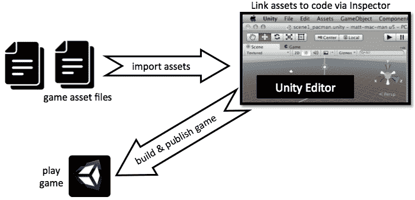
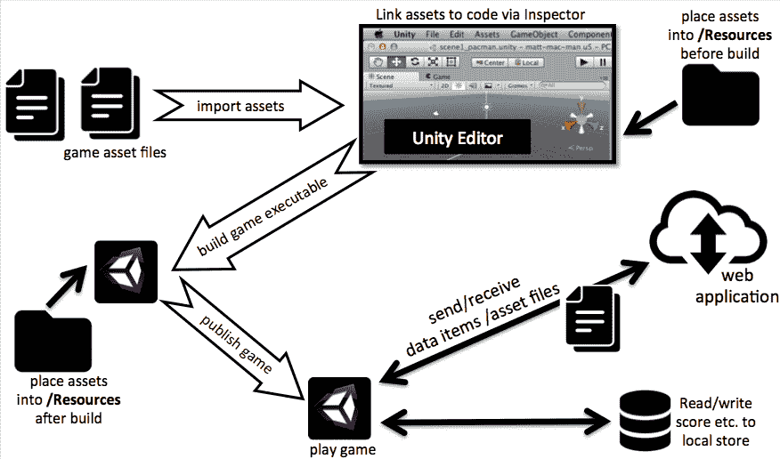
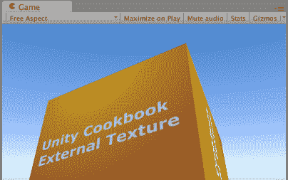
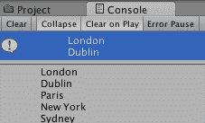
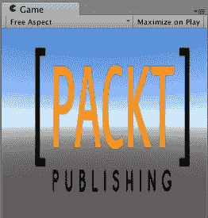
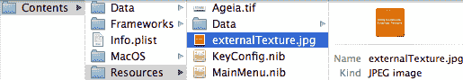
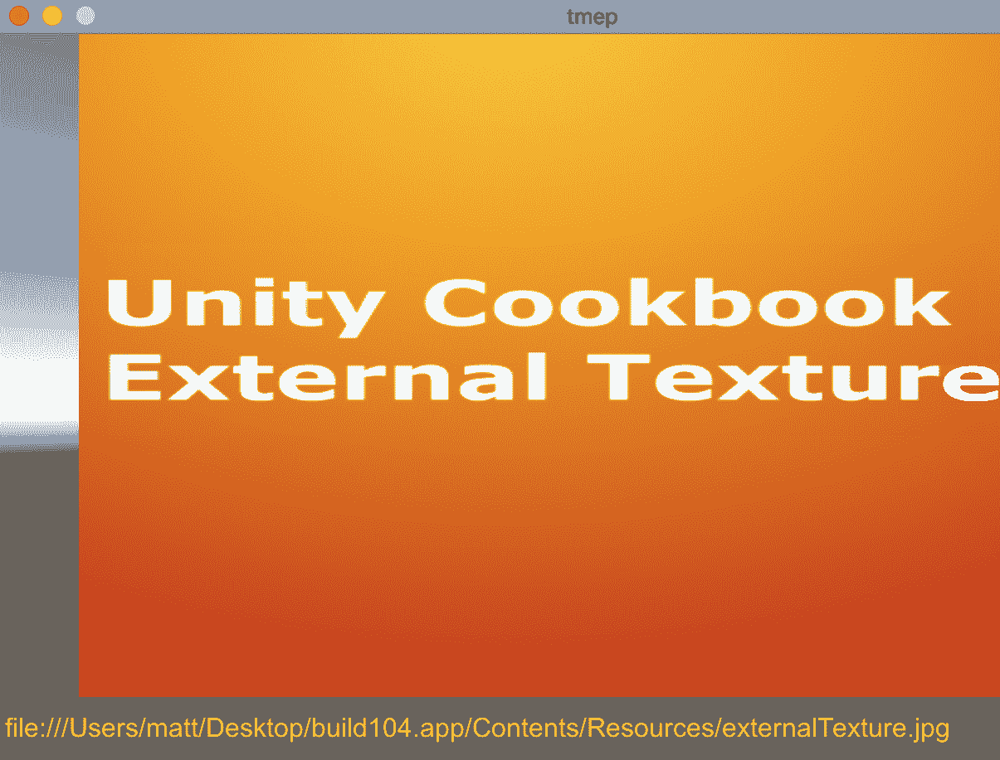
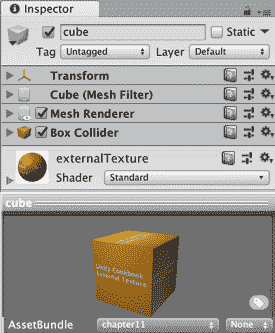
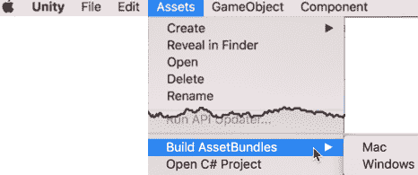
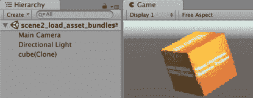

# 第十六章：与外部资源文件和设备一起工作

在本章中，我们将涵盖以下主题：

+   加载外部资源文件——使用 Unity 默认资源

+   加载外部资源文件——从互联网下载文件

+   加载外部资源文件——手动将文件存储在 Unity 的“资源”或`StreamingAssets`文件夹中

+   将项目文件保存到 Unity Asset Bundles 中

+   从 Unity Asset Bundles 加载资源

# 简介

对于某些项目，使用**检查器**窗口手动将导入的资产分配到组件槽位，然后构建并播放游戏，无需进一步更改，效果很好。然而，也有很多时候，某些类型的外部数据可以为游戏增加灵活性和功能。例如，它可能添加可更新或用户可编辑的内容；它可以使用户偏好和成就之间的场景，甚至游戏会话的记忆。在运行时使用代码读取本地或互联网文件内容可以帮助文件组织和游戏程序员与内容设计师之间的任务分离。拥有不同类型的资产和长期游戏记忆技术意味着为玩家和开发者提供广泛的机会，以提供丰富的体验。

# 整体情况

在继续介绍食谱之前，让我们退后一步，快速回顾一下资产文件在 Unity 游戏构建和运行过程中的作用。与资产最直接的工作方式是将它们导入到 Unity 项目中，使用**检查器**窗口将资产分配给检查器中的组件，然后构建并播放游戏：



独立的可执行文件提供另一种可能的流程，即在游戏构建后将其文件添加到游戏的`Resources`文件夹中。这将支持游戏媒体资产开发者能够在开发和构建完成后提供资产的最终版本。然而，另一个选项是使用**WWW**类在运行时动态地从网络读取资产，或者，也许是为了与高分或多人游戏服务器通信，发送和接收信息和文件。

当在本地或通过网络界面加载/保存数据时，重要的是要记住可以使用的数据类型。当编写 C#代码时，我们的变量可以是语言允许的任何类型，但当通过网络界面通信或使用 Unity 的**PlayerPrefs**类与本地存储通信时，我们在可以处理的数据类型上受到限制。Unity 的**WWW**类允许三种文件类型（文本文件、二进制音频剪辑和二进制图像纹理），但例如，对于 2D UI，我们有时需要**精灵**图像而不是纹理，因此我们在本章提供了一个 C#方法，可以从**纹理**创建**精灵**。

当使用**PlayerPrefs**类时，我们限于保存和加载整数、浮点数和字符串：



WWW 是一个小类，使用起来非常简单。近年来，Unity 在其网络库中引入了**Unity Web Request 系统**，用于创建和处理 HTTP 消息（请求和响应）。虽然**WWW**类足以处理本章中的资源保存和加载菜谱，但如果你可能需要以更复杂的方式处理 HTTP 消息，那么建议学习 Unity Web Requests，例如以下链接：

+   Unity Web Requests 的 Unity 手册部分：[`docs.unity3d.com/Manual/UnityWebRequest.html`](https://docs.unity3d.com/Manual/UnityWebRequest.html)

+   GitHub 上 Unity Web Request 的示例用法：[`gist.github.com/emoacht/89590d4e4571d40f9e1b`](https://gist.github.com/emoacht/89590d4e4571d40f9e1b)

+   StackOverflow 上 HTTP GET/PUT 等请求的示例：[`stackoverflow.com/questions/46003824/sending-http-requests-in-c-sharp-with-unity`](https://stackoverflow.com/questions/46003824/sending-http-requests-in-c-sharp-with-unity)

# 加载外部资源文件 - 使用 Unity 默认资源

在这个菜谱中，我们将加载一个外部图像文件，并使用 Unity 默认资源文件（在游戏编译时创建的库）将其显示在屏幕上。

这种方法可能是存储和读取外部资源文件的最简单方式。然而，只有在资源文件的内容在编译后不会改变的情况下才适用，因为这些文件的内容被合并并编译到`resources.assets`文件中。

编译后的游戏在`Data`文件夹中可以找到`resources.assets`文件：



# 准备工作

在`10_01`文件夹中，我们为这个菜谱提供了一个图像文件、一个文本文件以及一个`.ogg`格式的音频文件：

+   `externalTexture.jpg`

+   `cities.txt`

+   `soundtrack.ogg`

# 如何操作...

要从 Unity 默认资源加载外部资源，请执行以下操作：

1.  创建一个新的 3D Unity 项目。

1.  在`项目`窗口中，创建一个新的文件夹并将其重命名为`Resources`。

1.  将`externalTexture.jpg`文件导入并放置在`Resources`文件夹中。

1.  创建一个 3D 立方体，并将其命名为`Cube-1`。

1.  创建一个 C# `ReadDefaultResources`脚本类，并将其作为组件添加到`Cube-1`：

```cs
using UnityEngine;

 public class ReadDefaultResources : MonoBehaviour {
   public string fileName = "externalTexture";
   private Texture2D externalImage;

   void Start () {
     externalImage = (Texture2D)Resources.Load(fileName);
     Renderer myRenderer = GetComponent<Renderer>();
     myRenderer.material.mainTexture = externalImage;
 }
 }
```

1.  播放场景。`纹理`将被加载并在屏幕上显示。

1.  如果你还有其他图像文件，将其副本放入`Resources`文件夹。然后，在`检查器`窗口中，将公共文件名更改为你的图像文件名，再次播放场景。现在将显示新的图像。

# 它是如何工作的...

`Resources.Load (fileName)` 语句使 Unity 在其编译的项目数据文件 `resources.assets` 中查找名为 `externalTexture` 的文件的内容。内容作为纹理图像返回，并存储在 `externalImage` 变量中。`Start()` 方法中的最后一个语句将脚本附加到的 GameObject 的纹理设置为我们的外部 `externalImage` 变量。

字符串变量 `fileName` 是公共属性，因此您可以在层次结构中选择 GameObject Cube-1，并在检查器中编辑 Read Default Resources (Script) 组件中的文件名字符串。

传递给 `Resources.Load()` 的文件名字符串不包括文件扩展名（例如 `.jpg` 或 `.txt`）。

# 更多内容...

这里有一些您不想错过的细节。

# 使用此方法加载文本文件

您可以使用相同的方法加载外部文本文件。私有变量需要是字符串（用于存储文本文件内容）。`Start()` 方法使用一个临时的 `TextAsset` 对象来接收文本文件内容，该对象的文本属性包含要存储在私有 `textFileContents` 变量中的字符串内容：

```cs
using UnityEngine;

 public class ReadDefaultResourcesText : MonoBehaviour {
   public string fileName = "textFileName"; // e.g.: cities.txt
   private string textFileContents;

   void Start () {
     TextAsset textAsset = (TextAsset)Resources.Load(fileName);
     textFileContents = textAsset.text;
     Debug.Log(textFileContents);
   }
 } 
```

最后，此字符串将在控制台上显示：



# 使用此方法加载和播放音频文件

您可以使用相同的方法加载外部音频文件。私有变量需要是 `AudioClip`：

```cs
using UnityEngine;

[RequireComponent (typeof (AudioSource))]
public class ReadDefaultResourcesAudio : MonoBehaviour {
   public string fileName = "soundtrack";

   void Start () {
     AudioSource audioSource = GetComponent<AudioSource>();
     audioSource.clip = (AudioClip)Resources.Load(fileName);
     if(!audioSource.isPlaying && audioSource.clip.loadState == AudioDataLoadState.Loaded)
           audioSource.Play();
 }
 }
```

我们不会尝试播放 `AudioClip` 直到加载完成，这可以通过音频剪辑的 `loadState` 属性来测试。在 Unity 脚本参考页面中了解更多关于 **Audio Load State** 的信息：[`docs.unity3d.com/ScriptReference/AudioDataLoadState.html`](https://docs.unity3d.com/ScriptReference/AudioDataLoadState.html)

# 参见

参考本章中的以下菜谱以获取更多信息：

+   通过手动将文件存储在 Unity `Resources` 文件夹中来加载外部资源文件

+   通过从互联网下载文件来加载外部资源文件

# 通过从互联网下载文件来加载外部资源文件

存储和读取文本文件数据的一种方法是将文本文件存储在网络上。在这个菜谱中，下载、读取给定 URL 的文本文件内容，然后显示。

# 准备工作

对于这个菜谱，您需要能够访问网络服务器上的文件。如果您运行本地网络服务器，例如 Apache，或者有自己的网络托管，那么您可以使用 `10_02` 文件夹中的文件和相应的 URL。

否则，您可能会发现以下 URL 有用，因为它们是图像文件（Packt 出版物的标志）和文本文件（ASCII 艺术獾图片）的网络位置：

+   

+   

# 如何操作...

通过从互联网下载来加载外部资源，请按照以下步骤操作：

1.  在 3D 项目中，创建一个新的 RawImage UI 游戏对象。

1.  创建一个 C# ReadImageFromWeb 脚本类，并将其实例对象作为组件添加到 RawImage 游戏对象中：

```cs
using UnityEngine;
 using UnityEngine.UI;
 using System.Collections;

 public class ReadImageFromWeb : MonoBehaviour {
     public string url = "http://www.packtpub.com/sites/default/files/packt_logo.png";

     IEnumerator Start() {
         WWW www = new WWW(url);
         yield return www;

         Texture2D texture = www.texture;
         GetComponent<RawImage>().texture = texture;
     }
 } 
```

1.  播放**场景**。一旦下载完成，图像文件的内容将被显示：



# 它是如何工作的...

注意需要使用`UnityEngine.UI`包来实现此食谱。

当游戏开始时，我们的`Start()`方法启动名为`LoadWWW()`的协程方法。**协程**是一种可以在后台持续运行而不会停止或减慢游戏其他部分和帧率的函数。`yield`语句表示一旦`imageFile`可以返回值，方法的其他部分就可以执行——也就是说，直到文件下载完成，不应尝试提取`WWW`对象变量的纹理属性。

一旦图像数据被加载，执行将超过`yield`语句。最后，将脚本附加到的 RawImage 游戏对象的纹理属性更改为从网络下载的图像数据（在 WWW 对象的纹理变量中）。

# 还有更多...

有些细节是你不想错过的。

# 从纹理转换为精灵

在食谱中，我们使用了 UI RawImage，因此我们可以直接使用下载的纹理；然而，有时我们可能希望使用精灵而不是纹理。要从一个纹理创建精灵对象，请创建以下脚本类：

```cs
using UnityEngine;
 using UnityEngine.UI;
 using System.Collections;

 public class ImageFromWebTextureToSprite : MonoBehaviour {
     public string url = "http://www.packtpub.com/sites/default/files/packt_logo.png";

     IEnumerator Start() {
         WWW www = new WWW(url);
         yield return www;

         Texture2D texture = www.texture;
         GetComponent<Image>().sprite = TextureToSprite(texture);
     }

     private Sprite TextureToSprite(Texture2D texture) {
         Rect rect = new Rect(0, 0, texture.width, texture.height);
         Vector2 pivot = new Vector2(0.5f, 0.5f);
         Sprite sprite = Sprite.Create(texture, rect, pivot);
         return sprite;
     }
 } 
```

# 从网络下载文本文件

使用此技术下载文本文件（将脚本类的实例对象附加到 UI Text 对象）：

```cs
using UnityEngine;
 using System.Collections;
 using UnityEngine.UI;

 public class ReadTextFromWeb : MonoBehaviour {
     public string url = "http://www.ascii-art.de/ascii/ab/badger.txt";

     IEnumerator Start() {
         Text textUI = GetComponent<Text>();
         textUI.text = "(loading file ...)";
         WWW www = new WWW(url);
         yield return www;

         string textFileContents = www.text;
         Debug.Log(textFileContents);
         textUI.text = textFileContents;
     }
 } 
```

# WWW 类和资源内容

WWW 类定义了多个不同的属性和方法，以便将下载的媒体资源文件数据提取到适当的变量中，以便在游戏中使用。其中最有用的包括以下内容：

+   `.text`: 一个只读属性，返回作为字符串的网页数据

+   `.texture`: 一个只读属性，返回作为`Texture2D`图像的网页数据

+   `.GetAudioClip()`: 返回作为`AudioClip`的网页数据的方法

更多信息请访问[`docs.unity3d.com/ScriptReference/WWW.html`](http://docs.unity3d.com/ScriptReference/WWW.html)

# 使用 UnityWebRequest 的一个示例

而不是使用`WWW`类，我们还可以使用`UnityWebRequest`库来下载纹理。只需将`ReadImageFromWeb`脚本类的以下内容替换掉：

```cs
using UnityEngine;
using UnityEngine.UI;
using System.Collections;
using UnityEngine.Networking;
public class ReadImageFromWebUnityWebRequest : MonoBehaviour {
 public string url = "http://www.packtpub.com/sites/default/files/packt_logo.png";
IEnumerator Start() {
 using (UnityWebRequest uwr = UnityWebRequestTexture.GetTexture(url)) {
 yield return uwr.SendWebRequest();
if (uwr.isNetworkError || uwr.isHttpError)
 Debug.Log(uwr.error);
 else {
 Texture2D texture = DownloadHandlerTexture.GetContent(uwr);
 UpdateUIRawImage(texture);
 }
 }
 }

 private void UpdateUIRawImage(Texture2D texture) {
 GetComponent<RawImage>().texture = texture; 
 }
}
```

# 参见

参考本章中的以下食谱以获取更多信息：

+   通过**Unity 默认资源**加载外部资源文件

+   通过手动将文件存储在 Unity 的`Resources`文件夹中加载外部资源文件

# 通过手动将文件存储在 Unity 的`Resources`或`StreamingAssets`文件夹中加载外部资源文件

有时，在游戏编译后，可能需要更改外部资源文件的内容。在网络上托管资源文件可能不是一个选项。有一种手动存储和从编译后的游戏`Resources`文件夹中读取文件的方法，这使得这些文件在游戏编译后可以更改。

`Resources`文件夹技术在编译为 Windows 或 Mac 独立可执行文件时有效。`StreamingAssets`文件夹技术也适用于这些，以及 iOS 和 Android 设备。下一个菜谱将说明`Resources`文件夹技术，然后我们在最后讨论如何使用`StreamingAssets`方法。

# 准备工作

`10_01`文件夹提供了可用于此菜谱的纹理图像：

+   `externalTexture.jpg`

# 如何操作...

要通过手动将文件存储在资源文件夹中来加载外部资源，请执行以下操作：

1.  创建一个新的 3D 项目。

1.  创建一个新的 UI Image GameObject。使其占据屏幕的大部分区域。

1.  创建一个新的 UI Text GameObject。将其定位在屏幕底部，以拉伸整个屏幕宽度。

1.  创建一个 C# ReadManualResourceImageFile 脚本类，并将实例对象作为组件添加到 UI Image GameObject：

```cs
using System.Collections;
 using UnityEngine;
 using UnityEngine.UI;
 using System.IO;

 public class ResourceFileLoader : MonoBehaviour
 {
     public Text textUrl;

     private string fileName = "externalTexture.jpg";
     private string urlPrefixMac = "file://";
     private string urlPrefixWindows = "file:///";

     IEnumerator Start()
     {
         //        string url = urlPrefixWindows + Application.dataPath;
         string url = urlPrefixMac + Application.dataPath;
         url = Path.Combine(url, "Resources");
         url = Path.Combine(url, fileName);

         textUrl.text = url;

         WWW www = new WWW(url);
         yield return www;

         Texture2D texture = www.texture;
         GetComponent<Image>().sprite = TextureToSprite(texture);
     }

     private Sprite TextureToSprite(Texture2D texture)
     {
         Rect rect = new Rect(0, 0, texture.width, texture.height);
         Vector2 pivot = new Vector2(0.5f, 0.5f);
         Sprite sprite = Sprite.Create(texture, rect, pivot);
         return sprite;
     }
 } 
```

1.  在层次结构中选择 UI Image GameObject 后，将 UI Text 对象拖动到检查器中的 ResourceFileLoader（脚本）组件的公共 Text URL 属性中。

1.  保存当前场景，并将其添加到构建设置中。

1.  构建您的（Windows 或 Mac）独立可执行文件。

1.  将 externalTexture.jpg 图像复制到您的独立应用程序的`Resources`文件夹：



1.  运行您的独立游戏应用程序，图像将在运行时从资源文件夹中读取并显示（并且该资源的路径将在应用程序窗口底部的 UI Text 中显示）：



# 它是如何工作的...

URL 路径被定义，说明了 Unity 如何在独立应用程序构建的资源文件夹中找到所需的图像。此路径通过将 UI Text GameObject 的文本属性设置为该路径的字符串值，在屏幕上显示。

**WWW**对象发现 URL 以文件协议开头，因此 Unity 尝试在其资源文件夹中找到外部资源文件（等待它加载完成），然后加载其内容。

`Start()`方法被声明为`IEnumerator`，允许它作为**协程**运行，并因此等待直到 WWW 类对象完成图像文件的加载：

您需要在每次编译后手动将文件放置在资源文件夹中。

当您创建 Windows 或 Linux 独立可执行文件时，还有一个名为 _Data 的文件夹，与可执行应用程序文件一起创建。资源文件夹位于此数据文件夹内部。

Mac 独立应用程序的可执行文件看起来像一个单独的文件，但实际上是一个 macOS 包文件夹。右键单击可执行文件并选择 **显示包内容**。然后你将在 Contents 文件夹内找到独立版本的 Resources 文件夹。

我们使用文件协议作为 URL，它必须以以下形式开始：`file:///:`

对于 OSX 独立版本，Unity Application.dataPath 返回的路径形式为 `/user/location-to-Contents`，因此我们在这个路径前加上 `file://` 以获取有效的文件协议 URL，形式为 `file:///user/location-to-Contents`。

对于 Windows，Unity Application.dataPath 返回的路径形式为 `C:Projects/MyUnityProject/location-to-``Data`，因此我们在这个路径前加上 `file:///` 以获取有效的文件协议 URL，形式为 `file:///C:Projects/MyUnityProject/location-to-Data`

从 Unity 文档和 Unity 答案页面了解更多信息：

+   脚本 `Application.dataPath`：[`docs.unity3d.com/ScriptReference/Application-dataPath.html`](https://docs.unity3d.com/ScriptReference/Application-dataPath.html)

+   Unity 答案：[`answers.unity.com/questions/517414/how-to-use-www-to-load-local-files.html`](https://answers.unity.com/questions/517414/how-to-use-www-to-load-local-files.html)

# 还有更多...

有些细节你不希望错过。

# 避免使用 Path.Combine() 而不是 / 或 \ 来解决跨平台问题

Windows 和 Mac 文件系统中的文件路径分隔符字符不同（Windows 使用反斜杠 \，Mac 使用正斜杠 /）。然而，Unity 知道你正在将项目编译成哪种类型的独立版本；因此，`Path.Combine()` 方法会插入所需的文件 URL 中的适当分隔符斜杠字符。

# StreamingAssets 文件夹

如果部署到 iOS 或 Android，`Resources` 文件夹技术将不起作用，你应该在名为 `StreamingAssets.` 的文件夹中创建和存储资源文件。例如，如果你有一个名为 `MyTextFile.txt` 的文本文件，你可以在 **项目** 面板中创建一个名为 `StreamingAssets` 的文件夹，将文件 `MyTextFile.txt` 存储在该文件夹中，并使用以下代码在运行时使用你的应用程序加载该文件的内容：

```cs
string filePath = System.IO.Path.Combine(Application.streamingAssetsPath, "MyTextFile.txt");
string contents = System.IO.File.ReadAllText(filePath);
```

在以下链接中了解更多关于 Unity 中 StreamingAsset 文件夹的信息：[`docs.unity3d.com/Manual/StreamingAssets.html`](https://docs.unity3d.com/Manual/StreamingAssets.html) 和 [`docs.unity3d.com/ScriptReference/Application-streamingAssetsPath.html`](https://docs.unity3d.com/ScriptReference/Application-streamingAssetsPath.html)

# 参见

参考本章中的以下食谱以获取更多信息：

+   使用 Unity 默认资源加载外部资源文件

+   通过从互联网下载文件来加载外部资源文件

# 将项目文件保存到 Unity Asset Bundles

Unity 提供了 Asset Bundle 机制作为另一种在运行时管理资源加载的方法。Asset Bundles 可以存储在本地或互联网上。

在本教程中，我们将创建一个 Prefab（3D 立方体 GameObject 的 Prefab），并将其保存到 Asset Bundle 中。

# 准备工作

在`10_06`文件夹中，我们提供了`externalTexture.jpg`图像文件。

# 如何操作...

要保存 Unity Asset Bundles，请执行以下操作：

1.  创建一个新的 3D Unity 项目。

1.  导入提供的图像文件（到名为 Textures 的新文件夹中）。

1.  在场景中创建一个新的立方体（命名为`Cube-1`），并应用导入的纹理图像。

1.  在项目窗口中，创建一个新文件夹并将其重命名为 Prefabs。

1.  在项目文件夹 Prefabs 中，创建一个名为 cube 的新空 Prefab。

1.  从场景面板，将 GameObject Cube-1 拖到项目文件夹 Prefabs 中的 Prefab cube 上。Prefab 应该变成蓝色，现在它是一个存储 GameObject Cube-1 属性的文件。

1.  在项目面板中选中文件 cube，转到检查器面板底部创建一个新的 AssetBundle，命名为 chapter11。请参阅说明截图：



1.  在项目面板中，创建一个名为`Editor`和`AssetBundles`的新文件夹。

1.  在`Editor`文件夹中，创建一个新的 C# CreateAssetBundles 脚本类，包含以下代码：

```cs
using UnityEditor;

 public class CreateAssetBundles
 {
     [MenuItem("Assets/Build AssetBundles/Mac")]
     static void BuildAllAssetBundlesMac()
     {
         string assetBundleDirectory = "Assets/AssetBundles";
         BuildPipeline.BuildAssetBundles(assetBundleDirectory, BuildAssetBundleOptions.None, BuildTarget.StandaloneOSX);
     }

     [MenuItem("Assets/Build AssetBundles/Windows")]
     static void BuildAllAssetBundlesWindows()
     {
         string assetBundleDirectory = "Assets/AssetBundles";
         BuildPipeline.BuildAssetBundles(assetBundleDirectory, BuildAssetBundleOptions.None, BuildTarget.StandaloneWindows);
     }
 } 
```

1.  你现在应该能在资产菜单底部看到两个新菜单项：



1.  选择适合你使用的操作系统（Mac 或 Windows）的创建包操作。

1.  你现在应该能在文件夹`AssetBundles`中看到创建的文件：`AssetBundles`和`chapter11`。

# 它是如何工作的...

`Resources.Load(fileName)`语句使 Unity 在其编译的项目数据文件`resources.assets`中查找名为`externalTexture`的文件的内容。内容作为纹理图像返回，并存储到`externalImage`变量中。`Start()`方法中的最后一个语句将 GameObject 的纹理设置为附加脚本的`externalImage`变量。

字符串变量 fileName 是一个公共属性，因此你可以选择层次结构中的 GameObject Cube-1，并在检查器中的 Read Default Resources（Script）组件中编辑文件名字符串。

在以下地址了解更多关于 Asset Bundles 和 Unity 推荐的工作流程：

+   Asset Bundles 工作流程：[`docs.unity3d.com/2018.1/Documentation/Manual/AssetBundles-Workflow.html`](https://docs.unity3d.com/2018.1/Documentation/Manual/AssetBundles-Workflow.html)

+   Asset Bundle 的本地使用：[`docs.unity3d.com/2018.1/Documentation/Manual/AssetBundles-Native.html`](https://docs.unity3d.com/2018.1/Documentation/Manual/AssetBundles-Native.html)

# 从 Unity Asset Bundles 加载资源

在本教程中，我们将加载一个 Asset Bundle，检索一个预制件，然后从检索到的数据中在场景中创建（实例化）一个`GameObject`：



# 准备工作

本教程使用前一个教程创建的文件。我们还提供了`10_07`文件夹中 AssetBundles 文件夹的副本。

# 如何操作...

要加载 Unity 资产包，请执行以下操作：

1.  创建一个新的 3D Unity 项目。

1.  导入提供的文件夹 `AssetBundles`。

1.  创建以下 C# `AssetBundleLoader` 脚本类，并将其作为一个组件添加到主摄像机实例中：

```cs
using UnityEngine;
 using System.IO;
 using UnityEngine.Networking;
 using System.Collections;

 public class AssetBundleLoader : MonoBehaviour
 {
     public string bundleFolderName = "AssetBundles";
     public string bundleName = "chapter11";
     public string resourceName = "cube";

     void Start()
     {
         StartCoroutine(LoadAndInstantiateFromUnityWebRequest());
     }

     private IEnumerator LoadAndInstantiateFromUnityWebRequest()
     {
         // (1) load asset bundle
         string uri = "file:///" + Application.dataPath;
         uri = Path.Combine(uri, bundleFolderName);
         uri = Path.Combine(uri, bundleName);

         UnityWebRequest request = UnityWebRequestAssetBundle.GetAssetBundle(uri, 0);
         yield return request.SendWebRequest();

         // (2) extract 'cube' from loaded asset bundle
         AssetBundle bundle = DownloadHandlerAssetBundle.GetContent(request);
         GameObject cube = bundle.LoadAsset<GameObject>(resourceName);

         // (3) create scene GameObject based on 'cube'
         Instantiate(cube);
     }
 } 
```

1.  运行 **场景**，应该会在场景中出现一个立方体，它是通过从资产包中提取预制件立方体文件创建的，然后基于这个预制件实例化一个新的 GameObject。

# 它是如何工作的...

Unity 方法 `UnityWebRequestAssetBundle.GetAssetBundle(...)` 期望一个指向命名资产包的文件协议 URI。这个包被加载到变量 `bundle` 中，然后使用 `LoadAsset(...)` 方法提取名为 `cube` 的文件。最后，在运行时基于这个预制件创建了一个 GameObject，结果是我们在运行场景时看到的立方体。

变量 `bundleFolderName`、`bundleName` 和 `resourceName` 定义了项目中的文件夹、资产包文件名和 `Asset` 包内的预制件。

如果你选择了 `chapter11` 清单文件（看起来像一张带有线条的纸张的图标），那么在检查器中，你可以看到它包含我们的立方体预制件：

```cs
    ...
     Assets:
     - Assets/Prefabs/cube.prefab 
```

在以下地址了解更多关于 `AssetBundles` 和 Unity 推荐的工作流程：

+   资产包工作流程：[`docs.unity3d.com/2018.1/Documentation/Manual/AssetBundles-Workflow.html`](https://docs.unity3d.com/2018.1/Documentation/Manual/AssetBundles-Workflow.html)

+   原生使用资产包：[`docs.unity3d.com/2018.1/Documentation/Manual/AssetBundles-Native.html`](https://docs.unity3d.com/2018.1/Documentation/Manual/AssetBundles-Native.html)

# 还有更多...

有些细节你不希望错过。

# 通过 AssetBundle.LoadFromFile() 加载资产包

对于从瓦片本地加载的替代 `UnityWebRequest` 是使用 `AssetBundle.LoadFromFile():`

```cs
    void Start()
     {
         // (1) load asset bundle
         string path = Path.Combine(Application.streamingAssetsPath, bundleName);
         AssetBundle myLoadedAssetBundle = AssetBundle.LoadFromFile(path);

         if (null == myLoadedAssetBundle)
         {
             Debug.Log("Failed to load AssetBundle: " + path);
             return;
         }

         // (2) extract 'cube' from loaded asset bundle
         string resourceName = "cube";
         GameObject prefabCube = myLoadedAssetBundle.LoadAsset<GameObject>(resourceName);

         // (3) create scene GameObject based on 'cube'
         Instantiate(prefabCube);
     } 
```

# 通过网络服务器托管加载资产包

尽管我们刚刚展示了如何从本地文件加载 `AssetBundle`，但通常这些资源是从网络服务器加载的。在这种情况下，URI 需要是一个互联网协议。

例如，如果文件是在本地的 8000 端口上提供服务的，那么主机将是 http://localhost:8000 等等：

```cs
    public string bundleName = "chapter11";
     public string resourceName = "cube";

     public string host = "http://localhost:8000";

     void Start() {
         StartCoroutine(LoadAndInstantiateFromUnityWebRequestServer());
     }

     private IEnumerator LoadAndInstantiateFromUnityWebRequestServer() {
         string uri = Path.Combine(host, bundleName);
         UnityWebRequest request = UnityWebRequestAssetBundle.GetAssetBundle(uri, 0);
         yield return request.SendWebRequest();

         AssetBundle bundle = DownloadHandlerAssetBundle.GetContent(request);
         GameObject cube = bundle.LoadAsset<GameObject>(resourceName);
         Instantiate(cube);
     } 
```
