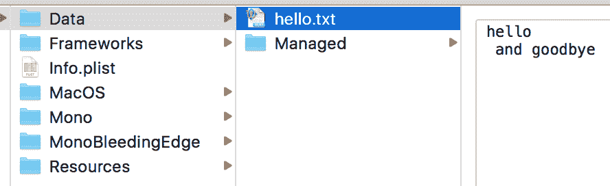
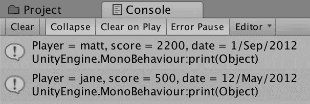
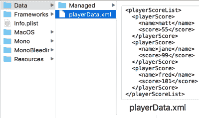

# 与纯文本、XML 和 JSON 文本文件一起工作

在本章中，我们将涵盖以下主题：

+   使用 TextAsset 公共变量加载外部文本文件

+   使用 C# 文件流加载外部文本文件

+   使用 C# 文件流保存外部文本文件

+   加载和解析外部 XML 文件

+   使用 XMLWriter 手动创建 XML 文本数据

+   通过序列化自动保存和加载 XML 文本数据

+   使用 XMLDocument.Save() 将 XML 直接保存到文本文件中创建 XML 文本文件

+   从单个对象和对象列表创建 JSON 字符串

+   从 JSON 字符串创建单个对象和对象列表

# 简介

基于文本的外部数据非常常见且非常有用，因为它既适合计算机阅读也适合人类阅读。文本文件可以用来允许非技术团队成员编辑书面内容，或者在开发和测试期间记录游戏性能数据。基于文本的格式还允许**序列化**——将实时对象数据编码成适合传输、存储和以后检索的格式。

Unity 将以下所有内容（以及 C# 脚本）视为**文本资产**：

+   `.txt`：纯文本文件

+   `.html`、`.htm`：HTML 页面标记（超文本标记语言）

+   `.xml`：XML 数据（可扩展标记语言）

+   `.bytes`：二进制数据（通过 bytes 属性访问）

+   `.json`：JSON（JavaScript 对象表示法）

+   `.csv`：CSV（逗号分隔变量）

+   `.yaml`：YAML 不是标记语言

+   `.fnt`：位图字体数据（与相关的图像纹理文件）

要了解有关 Unity 文本资产的手册页面，请点击以下链接：[`docs.unity3d.com/Manual/class-TextAsset.html`](https://docs.unity3d.com/Manual/class-TextAsset.html)。

许多基于网络的系统使用 XML 进行异步通信，而不需要用户交互，因此产生了术语**AJAX**：**异步 JavaScript XML**。一些现代基于网络的系统现在使用 JSON 进行基于文本的通信。因此，本章特别关注这两种文本文件格式。

# 整体图景

除了纯文本之外，还有两种常见的文本交换文件格式：XML 和 JSON。本章将讨论并举例说明这两种格式。

# XML – 可扩展标记语言

XML 是一种元语言，即一组规则，允许创建标记语言来编码特定类型的数据。以下是一些使用 XML 语法的数据描述语言格式示例：

+   `.txt`：纯文本文件

+   `.html`、`.htm`：HTML 页面标记（超文本标记语言）

+   `.xml`：XML 数据（可扩展标记语言）

+   `SVG`：可缩放矢量图形——一个由万维网联盟支持的开放标准图形描述方法

+   `SOAP`：用于在计算机程序和 Web 服务之间交换消息的简单对象访问协议

+   `X3D`：Xml 3D——一个用于表示 3D 对象的 ISO 标准——它是 **VRML**（**虚拟现实建模语言**）的继任者

# JSON – JavaScript 对象表示法

JSON 有时被称为 XML 的“无脂肪替代品”——提供类似的数据交换强度，但更小、更简单，因为它不提供可扩展性，并且仅使用三个字符进行格式化：

+   `属性 : 值`：冒号字符用于分隔属性名称和其值

+   `{ }`：花括号用于表示对象

+   `[ ]`：方括号用于表示值/对象的数组

你可以在[`www.json.org/xml.html`](https://www.json.org/xml.html)了解更多关于 JSON 与 XML 的信息

在第十章“处理外部资源文件”中，演示了加载外部资源文件的方法，这些方法适用于图像、音频和文本资源。在本章中，还介绍了加载文本文件的一些额外方法。

在第十三章，“着色器图和视频播放器”，一些示例说明了如何使用 JSON 为数据库驱动的网页排行榜，以及 Unity 游戏与该排行榜的通信。

# 使用 TextAsset 公共变量加载外部文本文件

一种简单的方法是将数据存储在文本文件中，然后在编译前选择它们，可以使用类`TextAsset`的公共变量。

这种技术仅在游戏编译后数据文件不会发生变化时适用，因为文本文件数据是序列化的（混合到）通用构建资源中，因此构建创建后无法更改。

# 准备工作

对于这个示例，你需要一个文本`(.txt)`文件。在`11_01`文件夹中，我们提供了两个这样的文件：

+   `cities.txt`

+   `countries.txt`

# 如何操作...

要使用`TextAsset`加载外部文本文件，请执行以下步骤：

1.  创建一个新的 2D 项目。

1.  创建一个**UI TextGameObject**，使用**Rect Transform**将其居中显示在屏幕上，并设置其水平和垂直溢出为溢出。

1.  将你希望使用的文本文件导入到你的项目中（例如，`cities.txt`）

1.  创建一个 C# `ReadPublicTextAsset`脚本类，并将其作为组件附加到你的**UI Text GameObject**：

```cs
   using UnityEngine;
    using UnityEngine.UI;

    public class ReadPublicTextAsset : MonoBehaviour {
     public TextAsset dataTextFile;

     private void Start() {
         string textFromFile = dataTextFile.text;
         Text textOnScreen = GetComponent<Text>();
         textOnScreen.text = textFromFile;
     }
    } 
```

1.  在**Hierarchy**视图中选择**Main Camera**，将`cities.txt`文件拖放到**Inspector**中的公共字符串变量`dataTextFile`。

# 工作原理...

当场景开始时，文本文件的内容被读取到变量`textFromFile`中。找到**UI Text**组件的引用，并将该 UI 组件的文本属性设置为`textFromFile`的内容。用户可以随后在屏幕中间看到文本文件的内容。

# 使用 C#文件流加载外部文本文件

对于既从文本文件中读取又向文本文件中写入（创建或更改）的独立可执行游戏，通常使用**.NET**数据流进行读写。本示例说明了如何读取文本文件，而下一个示例将说明如何将文本数据写入文件。

此技术仅在将编译为 Windows 或 Mac 独立可执行文件时有效；例如，它不会为**WebGL**构建工作。

# 准备工作

对于此菜谱，您需要一个文本文件；在`11_01`文件夹中提供了两个文件。

# 如何操作...

要使用 C#文件流加载外部文本文件，请执行以下步骤：

1.  创建一个新的 C#脚本类`FileReadWriteManager`：

```cs
using System;
using System.IO;

 public class FileReadWriteManager {
     public void WriteTextFile(string pathAndName, string stringData) {
         FileInfo textFile = new FileInfo( pathAndName );
         if( textFile.Exists )
              textFile.Delete();

         StreamWriter writer;
         writer = textFile.CreateText();

         writer.Write(stringData);
         writer.Close();
     }

     public string ReadTextFile(string pathAndName) {
         string dataAsString = "";

         try {
             StreamReader textReader = File.OpenText( pathAndName );

             dataAsString = textReader.ReadToEnd();
             textReader.Close();
         }
         catch (Exception e) {
             return "error:" + e.Message;
         }

         return dataAsString;
     }
 } 
```

1.  创建一个 C# `ReadWithStream`脚本类并将其实例作为组件附加到您的**UI Text GameObject**：

```cs
using UnityEngine;
 using UnityEngine.UI;
 using System.IO;

 public class ReadWithStream : MonoBehaviour {
     private string fileName = "cities.txt";

     private string textFileContents = "(file not found yet)";
     private FileReadWriteManager fileReadWriteManager = new FileReadWriteManager();

     private void Start () {
         string filePath = Path.Combine(Application.dataPath, "Resources");
         filePath = Path.Combine(filePath, fileName);

         textFileContents = fileReadWriteManager.ReadTextFile( filePath );

         Text textOnScreen = GetComponent<Text>();
         textOnScreen.text = textFileContents;
     }
 } 
```

1.  保存当前场景并将其添加到构建的场景列表中。

1.  构建并运行您的（Windows、Mac 或 Linux）独立可执行文件。

1.  将包含您数据的文本文件复制到您的独立应用程序的`Resources`文件夹中（即`Start()`方法中设置的第一个语句中的文件名——在我们的示例中，这是`cities.txt`文件）。

每次编译后，您都需要手动将文件放置在`Resources`文件夹中。

对于 Windows 和 Linux 用户：当您创建 Windows 或 Linux 独立可执行文件时，会创建一个包含可执行应用程序文件的数据文件夹`_Data`。`Resources`文件夹位于此数据文件夹内部。

对于 Mac 用户：Mac 独立应用程序的可执行文件看起来像一个单独的文件，但实际上是一个 macOS "包"文件夹。右键单击可执行文件并选择显示包内容。然后您将在 Contents 文件夹内找到独立应用程序的 Resources 文件夹。

1.  当您运行构建的可执行文件时，您应该在应用程序窗口的中间看到加载并显示的文本文件内容。

# 工作原理...

当游戏运行时，`Start()`方法创建`filePath`字符串，然后从`fileReadWriteManager`对象调用`ReadTextFile()`方法，并将 filePath 字符串传递给它。此方法读取文件内容，并将其作为字符串返回，存储在`textFileContents`变量中。我们的`OnGUI()`方法显示这两个变量的值（`filePath`和`textFileContents`）。

注意，此菜谱需要使用`System.IO`包。C#脚本`FileReadWriteManager.cs`包含两个通用的文件读写方法，您可能会在许多不同的项目中找到它们很有用。

# 使用 C#文件流保存外部文本文件

此菜谱说明了如何使用 C#流将文本数据写入文本文件，无论是写入独立项目的`Data`文件夹还是`Resources`文件夹。

此技术仅在将编译为 Windows 或 Mac 独立可执行文件时有效。

# 准备工作

在`11_02`文件夹中，我们提供了一个包含之前菜谱中创建的完成 C#脚本类的文本文件：

```cs
FileReadWriteManager.cs
```

# 如何操作...

要使用 C#文件流保存外部文本文件，请按照以下步骤操作：

1.  创建一个新的 2D 项目。

1.  将 C# `FileReadWriteManager.cs`脚本类导入到您的项目中。

1.  将以下 C# `SaveTextFile`脚本类添加到**主相机**：

```cs
using UnityEngine;
 using System.IO;

 public class SaveTextFile : MonoBehaviour {
     public string fileName = "hello.txt";
     public string folderName = "Data";
     private string filePath = "(no file path yet)";
     private FileReadWriteManager fileManager;

     void Start () {
         string textData = "hello \n and goodbye";
         fileManager = new FileReadWriteManager();
         filePath = Path.Combine(Application.dataPath, folderName);
         filePath = Path.Combine(filePath, fileName);
         fileManager.WriteTextFile( filePath, textData );
     }
 } 
```

1.  保存当前场景并将其添加到构建的场景列表中。

1.  构建并运行你的（Windows、Mac 或 Linux）独立可执行文件。

1.  运行构建好的可执行文件后，你现在应该能在你的项目独立文件中的`Data`文件夹里找到一个名为`hello.txt`的新文本文件，其中包含 hello 和 goodbye 两行。



在 Unity 编辑器内运行时可以测试这一点（即在构建独立应用程序之前）。要这种方式测试，你需要在项目面板中创建一个`Data`文件夹。

# 它是如何工作的...

当游戏运行时，`Start()`方法从公共变量`fileName`和`folderName`创建`filePath`字符串，然后从`fileReadWriteManager`对象调用`WriteTextFile()`方法，并将`filePath`和`textData`字符串传递给它。此方法创建（或覆盖）一个包含接收到的字符串数据的文本文件（对于给定的文件路径和文件名）。

# 还有更多...

以下是一些你不希望错过的细节。

# 选择数据或资源文件夹

独立构建的应用程序包含一个`Data`文件夹和一个`Resources`文件夹。这两个文件夹中的任何一个都可以用于写入（或如果需要，其他文件夹）。我们通常将只读文件放入`Resources`文件夹，并使用`Data`文件夹来创建从头开始创建或内容已更改的文件。

在构建你的可执行文件之前，你可以指定不同的文件和文件夹名称（例如，`Resources`而不是`Data`）。确保在**层次结构**中选择了**主摄像机 GameObject**，然后更改**检查器**组件中的那些公共变量在保存文本文件（脚本）中的值。

# 加载和解析外部 XML

能够解析（处理包含 XML 格式数据的文本文件和字符串）非常有用。C#提供了一系列类和方法来简化此类处理，我们将在本食谱中探讨。

# 准备工作

你将在`11_04`文件夹中的`playerScoreData.xml`文件中找到以 XML 格式存储的玩家姓名和分数数据。此文件的内容如下：

```cs
<scoreRecordList>
        <scoreRecord>
            <player>matt</player>
            <score>2200</score>
            <date>
                <day>1</day>
                <month>Sep</month>
                <year>2012</year>
            </date>
        </scoreRecord>
        <scoreRecord>
            <player>jane</player>
            <score>500</score>
            <date>
                <day>12</day>
                <month>May</month>
                <year>2012</year>
            </date>
        </scoreRecord>
    </scoreRecordList> 
```

数据通过一个名为`scoreRecordList`的根元素进行结构化，该元素包含一系列`scoreRecord`元素。每个`scoreRecord`元素包含一个玩家元素（其中包含玩家的名字），一个分数元素（包含玩家的分数的整数值），以及一个日期元素，该日期元素本身包含三个子元素 - 天、月和年。

# 如何操作...

要加载和解析外部 XML 文件，请按照以下步骤操作：

1.  创建一个包含以下内容的 C# `PlayerScoreDate`脚本类：

```cs
    public class PlayerScoreDate
     {
         private string playerName;
         private int score;
         private string date;

         public void SetPlayerName(string playerName)
         { this.playerName = playerName; }

         public void SetScore(int score)
         { this.score = score; }

         public void SetDate(string date)
         { this.date = date; }

         override public string ToString()
         {
             return "Player = " + this.playerName + ",
             score = " + this.score + ", date = " + this.date;
         }
     } 
```

1.  创建一个 C# `ParseXML`脚本类并将其实例作为组件附加到**主摄像机**：

```cs
using UnityEngine;
 using System;
 using System.Xml;
 using System.IO;

 public class ParseXML : MonoBehaviour {
     public TextAsset scoreDataTextFile;
     private PlayerScoreDate[] playerScores = new PlayerScoreDate[999];

     private void Start() {
         string textData = scoreDataTextFile.text;
         int numberObjects = ParseScoreXML( textData );

         for (int i = 0; i < numberObjects; i++)
             print(playerScores[i]);
     }

     private int ParseScoreXML(string xmlData) {
         XmlDocument xmlDoc = new XmlDocument();
         xmlDoc.Load( new StringReader(xmlData) );

         string xmlPathPattern = "//scoreRecordList/scoreRecord";
         XmlNodeList myNodeList = xmlDoc.SelectNodes( xmlPathPattern );

         int i = 0;
         foreach(XmlNode node in myNodeList){
             playerScores[i] = NodeToPlayerScoreObject(node);
             i++;
         }

         return i;
     }

     private PlayerScoreDate NodeToPlayerScoreObject(XmlNode node) {
         XmlNode playerNode = node.FirstChild;
         string playerName = playerNode.InnerXml;

         XmlNode scoreNode = playerNode.NextSibling;
         string scoreString = scoreNode.InnerXml;
         int score = Int32.Parse(scoreString);

         XmlNode dateNode = scoreNode.NextSibling;
         string date = NodeToDateString(dateNode);

         PlayerScoreDate playerObject = new PlayerScoreDate();
         playerObject.SetPlayerName(playerName);
         playerObject.SetScore(score);
         playerObject.SetDate(date);

         return playerObject;

     }

     private string NodeToDateString(XmlNode dateNode) {
         XmlNode dayNode = dateNode.FirstChild;
         XmlNode monthNode = dayNode.NextSibling;
         XmlNode yearNode = monthNode.NextSibling;

         return dayNode.InnerXml + "/" + monthNode.InnerXml + "/" + yearNode.InnerXml;
     }
 } 
```

1.  运行场景，`print()`语句的输出应该在控制台窗口中可见：



# 它是如何工作的...

`PlayerScoreDate`脚本类仅包含玩家按日期计分的三个数据项：

+   玩家的名字（字符串）

+   玩家的分数（整数）

+   记录分数的日期（字符串——为了使这个食谱简短...）

注意，对于 C# `ParseXML` 脚本类，需要使用 `System`、`System.Xml` 和 `System.IO` 包。

`TextAsset` 变量 `scoreDataTextFile` 的 `text` 属性提供了 XML 文件的内容作为字符串，该字符串传递给 `ParseScoreXML(...)` 方法。

此 `ParseScoreXML(...)` 方法使用此字符串的内容创建一个新的 `XmlDocument` 变量。`XmlDocument` 类提供了 `SelectNodes()` 方法，该方法返回给定元素路径的节点对象列表。在此示例中，请求了一个 `scoreRecord` 节点列表。一个 for-each 语句循环遍历每个 `scoreRecord`，将当前节点传递给 `NodeToPlayerScoreObject(...)` 方法，并将返回的对象存储在 `playerScores` 数组的下一个槽位中。

`NodeToPlayerScoreObject(...)` 方法依赖于 XML 元素的顺序来检索玩家的姓名、分数和数据字符串。分数字符串被解析为整数，日期节点使用方法 `NodeToDateString(...)` 转换为日期字符串。创建一个新的 `PlayerScoreDate` 对象，并将名称、分数和日期存储在其中，然后返回该对象。

`NodeToDateString(...)` 方法通过解析包含三个日期组件的节点来创建一个日期字符串，以斜杠分隔。

# 更多...

以下是一些你不希望错过的细节。

# 从网络检索 XML 数据文件

如果 XML 文件位于网络上而不是你的 Unity 项目中，可以使用 WWW Unity 类。

# 使用 XMLWriter 手动创建 XML 文本数据

从游戏对象和属性创建 XML 数据结构的一种方法是通过手动编码一个方法来创建每个元素及其内容，使用 `XMLWriter` 类。

# 如何操作...

要使用 `XMLWriter` 创建 XML 文本数据，请按照以下步骤操作：

1.  创建一个 C# `CreateXMLString` 脚本类，将其作为组件添加到 **主相机**：

```cs
using UnityEngine;
 using System.Xml;
 using System.IO;

 public class CreateXMLString : MonoBehaviour {

     private void Start () {
         string output = BuildXMLString();
         print(output);
     }

     private string BuildXMLString() {
         StringWriter str = new StringWriter();
         XmlTextWriter xml = new XmlTextWriter(str);

         // start doc and root element
         xml.WriteStartDocument();
         xml.WriteStartElement("playerScoreList");

         // data element
         xml.WriteStartElement("player");
         xml.WriteElementString("name", "matt");
         xml.WriteElementString("score", "200");
         xml.WriteEndElement();

         // data element
         xml.WriteStartElement("player");
         xml.WriteElementString("name", "jane");
         xml.WriteElementString("score", "150");
         xml.WriteEndElement();

         // end root and document
         xml.WriteEndElement();
         xml.WriteEndDocument();

         return str.ToString();
     }
 } 
```

1.  当场景运行时，XML 文本数据应在控制台面板中可见，并且应如下所示（添加了一些换行符以使输出更易于阅读...）：

```cs
<?xml version="1.0" encoding="utf-16"?>
   <playerScoreList>
   <player>
   <name>matt</name>
   <score>200</score>
   </player>
   <player>
   <name>jane</name>
   <score>150</score>
   </player>
   </playerScoreList> 
```

# 它是如何工作的...

`Start()` 方法调用 `BuildXMLString()` 并将返回的字符串存储在输出变量中。然后，将此输出文本打印到控制台调试面板。

`BuildXMLString()` 方法创建一个 `StringWriter` 对象，`XMLWriter` 将 XML 元素的字符串构建到该对象中。XML 文档以 `WriteStartDocument()` 和 `WriteEndDocument()` 方法开始和结束。元素以 `WriteStartElement()` 和 `WriteEndElement()` 方法开始和结束。使用 `WriteElementString()` 添加元素的内容。

# 更多...

这里有一些细节，你不想错过。

# 添加新行以使 XML 字符串更易于阅读。

在每次调用`WriteStartElement()`和`WriteElementString()`方法之后，你可以使用`WriteWhiteSpace()`添加一个换行符。这些在 XML 解析方法中被忽略，但如果你的意图是显示给人类看的 XML 字符串，新行字符的存在会使它更容易阅读：

```cs
xml.WriteWhitespace("\n ");
```

# 使数据类负责从列表创建 XML

要生成的 XML 通常来自对象列表，所有对象都是同一类。在这种情况下，让负责为这些对象的列表生成 XML 的对象类是有意义的。

`CreateXMLFromArray`类简单地创建一个包含`PlayerScore`对象的`List<T>`实例，然后调用（静态）方法`ListToXML()`，传入对象列表。

以下应该是一个单独的代码块：

```cs
using UnityEngine;
using System.Collections.Generic;

public class CreateXMLFromArray : MonoBehaviour {
   private List<PlayerScore> playerScoreList;

   private void Start () {
       playerScoreList = new List<PlayerScore>();
       playerScoreList.Add (new PlayerScore("matt", 200) );
       playerScoreList.Add (new PlayerScore("jane", 150) );

       string output = PlayerScore.ListToXML( playerScoreList );
       print(output); 
   }
}
```

所有艰苦的工作现在都由`PlayerScore`类负责。这个类有两个用于玩家姓名和得分的私有变量，以及一个接受这些属性值的构造函数。公共静态方法`ListToXML()`接受一个`List`对象作为参数，并使用`XMLWriter`构建 XML 字符串，遍历列表中的每个对象，并调用对象的`ObjectToElement()`方法。这个方法向接收该对象数据的`XMLWriter`参数添加一个 XML 元素：

```cs
using System.Collections.Generic;
using System.Xml;
using System.IO;

public class PlayerScore {
   private string _name;
   private int _score;

   public PlayerScore(string name, int score) {
       _name = name;
       _score = score;
   }

   static public string ListToXML(List<PlayerScore> playerList) {
       StringWriter str = new StringWriter();
       XmlTextWriter xml = new XmlTextWriter(str);
       xml.WriteStartDocument();
       xml.WriteStartElement("playerScoreList");
       foreach (PlayerScore playerScoreObject in playerList) {
          playerScoreObject.ObjectToElement( xml );
       }

       xml.WriteEndElement();
       xml.WriteEndDocument();
       return str.ToString();
    }

    private void ObjectToElement(XmlTextWriter xml) {
       // data element
       xml.WriteStartElement("player");
       xml.WriteElementString("name", _name);
       string scoreString = "" + _score; // make _score a string
       xml.WriteElementString("score", scoreString);
       xml.WriteEndElement();
    }
 }

```

# 通过序列化自动保存和加载 XML 文本数据

另一种从游戏对象和属性中处理 XML 数据结构的方法是通过自动序列化对象的内容。这种技术会自动为对象的公共属性生成 XML。这个配方使用了可以在标准`System.Xml` C#包中找到的`XmlSerializer`类。

这个配方是从这篇 2013 年（仍然有效！）Unify 社区维基文章改编的：[`wiki.unity3d.com/index.php?title=Saving_and_Loading_Data:_XmlSerializer`](http://wiki.unity3d.com/index.php?title=Saving_and_Loading_Data:_XmlSerializer)

# 准备工作

在`11_06`文件夹中，你会找到两个 XML 数据文件，允许你使用不同的 XML 文本文件数据文件测试读取器。

# 如何做到这一点...

要通过序列化创建 XML 文本数据，请执行以下步骤：

1.  创建一个 C# `PlayerScore`脚本类：

```cs
    using System.Xml.Serialization;

     [System.Serializable]
     public class PlayerScore
     {
         [XmlElement("Name")]
         public string name;

         [XmlElement("Score")]
         public int score;

         [XmlElement("Version")]
         public string version;
     } 
```

1.  创建一个 C# `PlayerScoreCollection`脚本类：

```cs
    using System.Xml.Serialization;
     using System.IO;

     [XmlRoot("PlayerScoreCollection")]
     public class PlayerScoreCollection
     {
         [XmlArray("PlayerScores"), XmlArrayItem("PlayerScore")]
         public PlayerScore[] playerScores;

         public void Save(string path) {
             var serializer = new XmlSerializer(typeof(PlayerScoreCollection));
             using (var stream = new FileStream(path, FileMode.Create)) {
                 serializer.Serialize(stream, this);
             }
         }
     } 
```

1.  创建一个 C# `XmlWriter`脚本类，并将其实例作为组件附加到**主摄像机**：

```cs
    using UnityEngine;
     using System.IO;

     public class XmlWriter : MonoBehaviour {
         public string fileName = "playerData.xml";
         public string folderName = "Data";

         private void Start() {
             string filePath = Path.Combine(Application.dataPath, folderName);
             filePath = Path.Combine(filePath, fileName);

             PlayerScoreCollection psc = CreatePlayScoreCollection();
             psc.Save(filePath);
             print("XML file should now have been created at: " + filePath);
         }

         private PlayerScoreCollection CreatePlayScoreCollection() {
             PlayerScoreCollection playerScoreCollection = new PlayerScoreCollection();

             // make 2 slot array
             playerScoreCollection.playerScores = new PlayerScore[2];

             playerScoreCollection.playerScores[0] = new PlayerScore();
             playerScoreCollection.playerScores[0].name = "matt";
             playerScoreCollection.playerScores[0].score = 22;
             playerScoreCollection.playerScores[0].version = "v0.5";

             playerScoreCollection.playerScores[1] = new PlayerScore();
             playerScoreCollection.playerScores[1].name = "joelle";
             playerScoreCollection.playerScores[1].score = 5;
             playerScoreCollection.playerScores[1].version = "v0.9";

             return playerScoreCollection;
         }
     } 
```

1.  如果你能在项目面板中创建一个名为`Data`的文件夹，然后运行场景，你就可以快速在 Unity 编辑器中测试场景。大约 10-20 秒后，你应该会发现在`Data`文件夹中已经创建了一个名为`playerData.xml`的文本文件。

1.  保存当前场景，然后将其添加到构建场景列表中。

1.  构建并运行你的（Windows、Mac 或 Linux）独立可执行文件。

1.  现在，你应该能在你的项目独立文件中的`Data`文件夹中找到一个名为`playerData.xml`的新文本文件，其中包含三个玩家的 XML 数据。

1.  `playerData.xml` 文件的内容应该是 XML 玩家列表数据，即：

```cs
    <?xml version="1.0" encoding="us-ascii"?>
     <PlayerScoreCollection

         >
       <PlayerScores>
         <PlayerScore>
           <Name>matt</Name>
           <Score>22</Score>
           <Version>v0.5</Version>
         </PlayerScore>
         <PlayerScore>
           <Name>joelle</Name>
           <Score>5</Score>
           <Version>v0.9</Version>
         </PlayerScore>
       </PlayerScores>
     </PlayerScoreCollection> 
```

# 它是如何工作的...

类 `XmlWriter` 的 `Start()` 方法定义了文件路径（`Data/playerData.xml`），并通过调用 `CreatePlayScoreCollection()` 方法创建一个新的 `PlayerScoreCollection` 对象 psc。然后调用 `PlayerScoreCollection` 对象的 `Save(...)` 方法，传递文件路径。

类 `XmlWriter` 的 `CreatePlayScoreCollection()` 方法创建一个新的 `PlayerScoreCollection`，并向其中插入一个包含两个 `PlayerScore` 对象的数组，这些对象具有以下名称/分数/版本值：

```cs
    matt, 22, v0.5
    joelle, 5, v.09 
```

`PlayerScoreCollection` 类的 `Save(...)` 方法为类类型创建一个新的 `XmlSerializer`，并使用 `FileStream` 告诉 C# 将 `PlayerScoreCollection` 对象（即其 `PlayerScore` 对象数组）的内容序列化为文本到该文件。

# 还有更多...

这里有一些你不想错过的细节。

# 定义 XML 节点名称

我们可以使用编译器语句来定义用于编码每个对象属性的 XML 元素名称。例如，我们为每个 `PlayerScore` 的名称属性定义了元素 Name（首字母大写 N）：

```cs
    [XmlElement("Name")]
    public string name; 
```

如果没有声明，那么 XML 序列化器将默认使用小写属性名 `name` 为这些数据元素。

# 从 XML 文本加载数据对象

我们可以为 `PlayerScoreCollection` 类编写静态（类）方法，这些方法使用 `XML` 序列化器来加载 XML 数据，并从加载的数据创建数据对象。

这里有一个从文件路径加载的方法：

```cs
    public static PlayerScoreCollection Load(string path) {
         var serializer = new XmlSerializer(typeof(PlayerScoreCollection));
         using (var stream = new FileStream(path, FileMode.Open)) {
             return serializer.Deserialize(stream) as PlayerScoreCollection;
         }
     } 
```

可以编写另一个方法从文本字符串加载：

```cs
    public static PlayerScoreCollection LoadFromString(string text) {
         var serializer = new XmlSerializer(typeof(PlayerScoreCollection));
         return serializer.Deserialize(new StringReader(text)) as PlayerScoreCollection;
     } 
```

例如，你可以创建一个公共的 `TextAsset` 变量，然后通过调用此静态方法创建一个 `PlayerScoreCollection` 对象，然后通过以下代码循环遍历并打印出加载的对象：

```cs
    public TextAsset dataAsXmlString;

     private void Start()
     {
         PlayerScoreCollection objectCollection =   
         PlayerScoreCollection.LoadFromString(dataAsXmlString.text);

         foreach(PlayerScore playerScore in objectCollection.playerScores){
             print("name = " + playerScore.name + ", score = " + playerScore.score + ",
                 version = " + playerScore.version);
         }
     } 
```

# 创建 XML 文本文件 – 使用 XMLDocument.Save() 直接将 XML 保存到文本文件

有可能创建一个 XML 数据结构，然后使用 `XMLDocument.Save()` 方法直接将该数据保存到文本文件；这个配方说明了如何做。

# 如何做到这一点...

要直接将 XML 数据保存到文本文件，请执行以下步骤：

1.  创建一个新的 C# `PlayerXMLWriter` 脚本类：

```cs
    using System.Xml;
     using System.IO;

     public class PlayerXMLWriter {
         private string filePath;
         private XmlDocument xmlDoc;
         private XmlElement elRoot;

         public PlayerXMLWriter(string filePath) {
             this.filePath = filePath;
             xmlDoc = new XmlDocument();

             if(File.Exists (filePath)) {
                 xmlDoc.Load(filePath);
                 elRoot = xmlDoc.DocumentElement;
                 elRoot.RemoveAll();
             }
             else {
                 elRoot  = xmlDoc.CreateElement("playerScoreList");
                 xmlDoc.AppendChild(elRoot);
             }
         }

         public void AddXMLElement(string playerName, string playerScore) {
             XmlElement elPlayer = xmlDoc.CreateElement("playerScore");
             elRoot.AppendChild(elPlayer);

             XmlElement elName = xmlDoc.CreateElement("name");
             elName.InnerText = playerName;
             elPlayer.AppendChild(elName);

             XmlElement elScore = xmlDoc.CreateElement("score");
             elScore.InnerText = playerScore;
             elPlayer.AppendChild(elScore);
         }

         public void SaveXMLFile() {
            xmlDoc.Save(filePath);
         }
     } 
```

1.  创建一个 C# `CreateXMLTextFile` 脚本类，并将其实例作为组件附加到 **主相机**：

```cs
    using UnityEngine;
     using System.IO;

     public class CreateXMLTextFile : MonoBehaviour {
         public string fileName = "playerData.xml";
         public string folderName = "Data";

         private void Start() {
             string filePath = Path.Combine( Application.dataPath, folderName);
             filePath = Path.Combine( filePath, fileName);

             PlayerXMLWriter playerXMLWriter = new PlayerXMLWriter(filePath);
             playerXMLWriter.AddXMLElement("matt", "55");
             playerXMLWriter.AddXMLElement("jane", "99");
             playerXMLWriter.AddXMLElement("fred", "101");
             playerXMLWriter.SaveXMLFile();

             print( "XML file should now have been created at: " + filePath);
         }
     } 
```

1.  如果你在一个名为 `Data` 的文件夹中创建一个 `Data` 文件夹并在 Unity 编辑器中运行场景，你可以快速测试场景。大约 10-20 秒后，你应该现在在 `Data` 文件夹中找到一个名为 `playerData.xml` 的文本文件。

1.  保存当前场景，然后将其添加到构建的场景列表中。

1.  构建并运行你的（Windows、Mac 或 Linux）独立可执行文件。

1.  你现在应该在项目的独立文件 `Data` 文件夹中找到一个名为 `playerData.xml` 的新文本文件，其中包含三个玩家的 XML 数据：

1.  `playerData.xml` 文件的内容应该是 XML 玩家列表数据：



# 它是如何工作的...

`Start()` 方法创建 `playerXMLWriter`，这是 `PlayerXMLWriter` 类的新对象，它将新的、必需的 XML 文件路径 `filePath` 作为参数传递。向 `PlayerXMLWriter` 对象添加了三个元素，用于存储三个玩家的姓名和分数。调用 `SaveXMLFile()` 方法并显示一个调试 `print()` 消息。

`PlayerXMLWriter` 类的构造函数方法如下：当创建一个新对象时，提供的文件路径字符串存储在一个私有变量中；同时，检查是否已存在任何文件。如果找到现有文件，则删除内容元素；如果没有找到现有文件，则创建一个新的根元素 `playerScoreList` 作为子数据节点的父元素。`AddXMLElement()` 方法为提供的玩家姓名和分数追加一个新的数据节点。`SaveXMLFile()` 方法将 XML 数据结构保存为文本文件，用于存储的文件路径字符串。

# 从单个对象和对象列表创建 JSON 字符串

`JsonUtility` 类允许我们轻松地从单个对象和 **对象列表** 创建 JSON 字符串。

# 如何实现...

要从单个对象和 **列表** 创建 JSON 字符串，请执行以下步骤：

1.  创建一个名为 `PlayerScore` 的新 C# 脚本类：

```cs
    using UnityEngine;

     [System.Serializable]
     public class PlayerScore {
         public string name;
         public int score;

         public string ToJson() {
             bool prettyPrintJson = true;
             return JsonUtility.ToJson(this, prettyPrintJson);
         }
     } 
```

1.  创建一个名为 `PlayerScoreList` 的新 C# 脚本类：

```cs
    using UnityEngine;
     using System.Collections.Generic;

     [System.Serializable]
     public class PlayerScoreList {
         public List<PlayerScore> list = new List<PlayerScore>();

         public string ToJson() {
             bool prettyPrint = true;
             return JsonUtility.ToJson(this, prettyPrint);
         }
     } 
```

1.  创建一个名为 `ToJson` 的 C# 脚本类，并将其实例作为组件附加到 **主摄像机**：

```cs
    using UnityEngine;

     public class ToJson : MonoBehaviour {
         private PlayerScore playerScore1 = new PlayerScore();
         private PlayerScore playerScore2 = new PlayerScore();
         private PlayerScoreList playerScoreList = new PlayerScoreList();

         private void Awake() {
             playerScore1.name = "matt";
             playerScore1.score = 800;

             playerScore2.name = "joelle";
             playerScore2.score = 901;

             playerScoreList.list.Add(playerScore1);
             playerScoreList.list.Add(playerScore2);
         }

         void Start() {
             ObjectToJson();
             CollectionToJson();
         }

         public void ObjectToJson() {
             string objectAsString = playerScore1.ToJson();
             print("1: Object to JSON \n" + objectAsString);
         }

         public void CollectionToJson() {
             string objectListAsString = playerScoreList.ToJson();
             print("2: List of objects to JSON \n" + objectListAsString);
         }
     } 
```

1.  运行场景。应该有两个消息输出到控制台面板：

```cs
    1: Object to JSON
     {
         "name": "matt",
         "score": 800
     } 
```

应遵循以下步骤：

```cs
    2: List of objects to JSON
     {
         "list": [
             {
                 "name": "matt",
                 "score": 800
             },
             {
                 "name": "joelle",
                 "score": 901
             }
         ]
     } 
```

# 它是如何工作的...

`PlayerScore` 脚本类声明了两个公共属性：`name` 和 `score`。它还定义了一个公共方法 `ToJson()`，该方法通过 `JsonUtility.ToJson(...)` 方法返回包含属性值的字符串，这些属性值以 JSON 编码。

`PlayerScoreList` 脚本类声明了一个单个公共属性 `list`，它是一个 `PlayerScore` 对象的 C# `List<>`。因此，我们可以在我们的列表中存储零个、一个或任何数量的 `PlayerScore` 对象。还声明了一个单个公共方法 `ToJson()`，该方法通过 `JsonUtility.ToJson(...)` 方法返回包含 `list` 属性内容的字符串，这些内容以 JSON 编码。

它还定义了一个公共 `ToJson()` 方法，该方法通过 `JsonUtility.ToJson(...)` 方法返回包含属性值的字符串，这些属性值以 JSON 编码。

`Awake()` 方法创建两个 `PlayerScore` 对象，对象 `playerScore1` 和 `playerScore2` 中包含一些演示数据。它还创建了一个 `PlayerScoreList` 类的实例对象，并将这两个对象的引用添加到该列表中。

`Start()` 方法首先调用 `ObjectToJson()` 方法，然后调用 `CollectionToJson()`。

方法 `ObjectToJson()` 调用对象 `playerScore1` 的 `ToJson()` 方法，该方法返回一个字符串，然后将其打印到控制台面板。

方法 `CollectionToJson()` 调用了对象列表 `playerScoreList` 的 `ToJson()` 方法，该方法返回一个字符串，然后该字符串被打印到控制台面板。

如我们所见，`PlayerScore` 和 `PlayerScoreList` 类都定义了一个 `ToJson()` 方法，该方法使用了 `JsonUtilty` 的 `ToJson()` 方法。在两种情况下，它们的 `ToJson()` 方法都返回一个字符串，该字符串是对象数据的 JSON 表示形式。

`PlayerScore` 类的 `ToJson()` 方法以以下形式输出 JSON 对象字符串：

```cs
    { "name": "matt", "score": 800 }. 
```

`PlayerScoreList` 类的 `ToJson()` 方法以以下形式输出 JSON 数组字符串：

```cs
    {
         "list": [
             { "name": "matt", "score": 800 },
             { "name": "joelle", "score": 901 }
         ]
     } 
```

如我们所见，`JsonUtility` 类的 `ToString()` 方法能够将单个对象和 C# 对象列表序列化为可存储的字符串。

# 从 JSON 字符串创建单个对象和对象列表

`JsonUtility` 类使我们能够轻松解析（处理）JSON 字符串并提取单个对象，以及对象列表。

# 如何实现...

要从 JSON 字符串创建单个对象和对象列表，请执行以下步骤：

1.  创建一个名为 `PlayerScore` 的新 C# 脚本类：

```cs
    using UnityEngine;

     [System.Serializable]
     public class PlayerScore {
         public string name;
         public int score;

         public static PlayerScore FromJSON(string jsonString) {
             return JsonUtility.FromJson<PlayerScore>(jsonString);
         }
     } 
```

1.  创建一个名为 `PlayerScoreList` 的新 C# 脚本类：

```cs
    using UnityEngine;
     using System.Collections.Generic;

     [System.Serializable]
     public class PlayerScoreList {
         public List<PlayerScore> list = new List<PlayerScore>();

         public static PlayerScoreList FromJSON(string jsonString) {
             return JsonUtility.FromJson<PlayerScoreList>(jsonString);
         }
     } 
```

1.  创建一个 C# `ToJson` 脚本类并将其作为组件附加到 **主相机**：

```cs
    using UnityEngine;

     public class FromJson : MonoBehaviour {
         private void Start() {
             JsonToObject();
             JsonToList();
         }

         public void JsonToObject() {
             string playerScoreAsString = "{ \"name\":\"matt\", \"score\":201}";
             PlayerScore playerScore = PlayerScore.FromJSON(playerScoreAsString);

             print(playerScore.name + ", " + playerScore.score);
         }

         public void JsonToList() {
             string playerScorelistAsString = "";

             playerScorelistAsString += "{";
             playerScorelistAsString += "\"list\": [";
             playerScorelistAsString += "        {";
             playerScorelistAsString += "            \"name\": \"matt\",";
             playerScorelistAsString += "            \"score\": 800";
             playerScorelistAsString += "        },";
             playerScorelistAsString += "        {";
             playerScorelistAsString += "            \"name\": \"joelle\",";
             playerScorelistAsString += "            \"score\": 901";
             playerScorelistAsString += "        }";
             playerScorelistAsString += "    ]";
             playerScorelistAsString += "}";

             PlayerScoreList playerScoreList = PlayerScoreList.FromJSON(playerScorelistAsString);

             foreach (var playerScore in playerScoreList.list) {
                 print("from list :: " + playerScore.name + ", " + playerScore.score);
             }
         }
     } 
```

1.  运行场景。控制台面板应输出三条消息：

```cs
    matt, 201 
```

应该紧随其后的是：

```cs
    from list :: matt, 800
    from list :: joelle, 901 
```

# 它是如何工作的...

`Start()` 方法首先调用 `JsonToObject()` 方法，然后调用 `JsonToList()` 方法。

方法 `JsonToObject()` 声明了一个字符串，该字符串定义了一个 `PlayerScore` 对象：`{name:matt, score:201}`。该字符串使用转义的双引号字符来创建属性名称和文本数据（对于数值数据不需要引号）。JSON 字符串包含以下内容：

```cs
{ 
   "name":"matt",  
   "score":201 
} 
```

使用转义的双引号字符来表示属性名称和文本数据（对于数值数据不需要引号）。然后，类 `PlayerScore` 的 **静态** 方法 `FromJSON(...)` 使用这个 JSON 数据字符串作为其参数被调用。该方法返回一个 `PlayerScore` 对象，然后其值被打印到控制台面板。

类 `PlayerScore` 的 **静态** 方法 `FromJSON(...)` 调用了 `JsonUtility` 类的 `FromJson()` 方法，并提供了 `PlayerScore` 类类型。

方法 `JsonToList()` 声明了一个字符串，该字符串定义了两个 `PlayerScore` 对象的列表：`{name:matt, score:800}` 和 `{name:joelle, score:901}`。JSON 字符串包含以下内容：

```cs
{ 
   "list": [         
         {             
               "name": "matt",             
               "score": 800         
         },         
         {             
               "name": "joelle",            
               "score": 901         
         }     
   ] 
} 
```

然后，使用该 JSON 数据字符串作为参数调用类 `PlayerScoreList` 的 **静态** 方法 `FromJSON(...)`。该方法返回一个 `PlayerScoreList` 对象。一个 `foreach` 循环从 `PlayerScoreList` 对象的列表属性中提取每个 `PlayerScore` 对象。每个对象的 `name` 和 `score` 值被打印到控制台面板，前面带有列表中的文本。

`PlayerScoreList` 类的 **静态** 方法 `FromJSON(...)` 调用了 `JsonUtility` 类的 `FromJson()` 方法，并提供了类类型 `PlayerScoreList`。

如我们所见，`JsonUtility` 类的 `FromJson()` 方法能够将数据反序列化为单个对象，以及存储在仓库对象内部的 C# **列表** 对象，例如 `PlayerScoreList`。
