# 虚拟现实和额外功能

本章将涵盖以下主题：

+   从游戏中保存截图

+   使用静态属性保存和加载玩家数据

+   使用 PlayerPrefs 保存和加载玩家数据

+   从文本文件地图加载游戏数据

+   UI 滑块更改游戏质量设置

+   暂停游戏

+   实现慢动作

+   Gizmo 显示场景面板中当前选定的对象

+   Gizmo 绘制的编辑器网格对齐

+   创建 VR 项目

+   将 360 度视频添加到 VR 项目中

+   在 VR 环境中编辑 VR 内容 – XR 编辑器

# 简介

Unity 2018 的功能太多，无法在单本书中全部涵盖。在本章中，我们将展示一系列食谱，展示 Unity 中的 VR 游戏开发，以及我们希望包含的一系列其他 Unity 功能。

# 整体概念

除了纯文本外，以下三个部分将为您提供一个关于本章内容的想法。

# 虚拟现实

VR 是向玩家呈现沉浸式的视听体验，足够吸引他们沉浸于探索和与创建的游戏世界互动。

从一个角度来看，VR 只需要两个摄像头来为每只眼睛生成图像，以产生 3D 效果。但有效的 VR 需要内容、UI 控件和工具来帮助创建它们。在本章中，我们将探讨与 360 度视频和 Unity 的 XR 编辑器工具集一起工作的食谱。

# Gizmos

Gizmos 是另一种 Unity 编辑器自定义。Gizmos 是游戏设计师在场景面板中提供的视觉辅助工具。它们可以用作设置辅助（帮助我们了解我们在做什么），或者用于调试（理解为什么对象没有按预期表现）。

Gizmos 不是通过编辑器脚本绘制的，而是作为 Monobehaviours 的一部分，因此它们仅适用于当前场景中的 GameObject。Gizmo 绘制通常通过两种方法进行：

+   `OnDrawGizmos()`: 这在每个帧上执行，针对层次结构中的每个 GameObject

+   `OnDrawGizmosSelect()`: 这在每个帧上执行，仅针对当前在层次结构中选定的 GameObject

Gizmo 图形绘制使得绘制线条、立方体和球体变得简单。更复杂的形状也可以使用网格绘制，您还可以显示位于项目文件夹中的 2D 图像图标（位于：`Assets` | `Gizmos`）。

本章中的一些食谱展示了 Gizmos 如何有用。通常，从编辑器扩展创建的新 GameObject 将关联有有用的 Gizmos。

# 运行时保存/加载数据

当在本地加载/保存数据时，重要的是要记住可以使用的数据类型。当编写 C#代码时，我们的变量可以是语言允许的任何类型，但当通过 Web 界面通信或使用 Unity 的**PlayerPrefs**类与本地存储通信时，我们在可以处理的数据类型上受到限制。当使用**PlayerPrefs**类时，我们仅限于保存和加载整数、浮点数和字符串。我们提供了几个菜谱，展示了在运行时保存和加载数据的方法，包括使用静态变量、PlayerPrefs 以及包含 2D 游戏关卡文本格式数据的公共 TextAsset。

# 从游戏中保存截图

在这个菜谱中，我们将学习如何捕获游戏中的快照，并将它们保存到外部文件。更好的是，我们将使选择三种不同方法成为可能。

这种技术仅在 Unity 编辑器中或构建为独立 Windows 或 Mac 可执行文件时（例如，Web Player 构建将无法使用）有效：

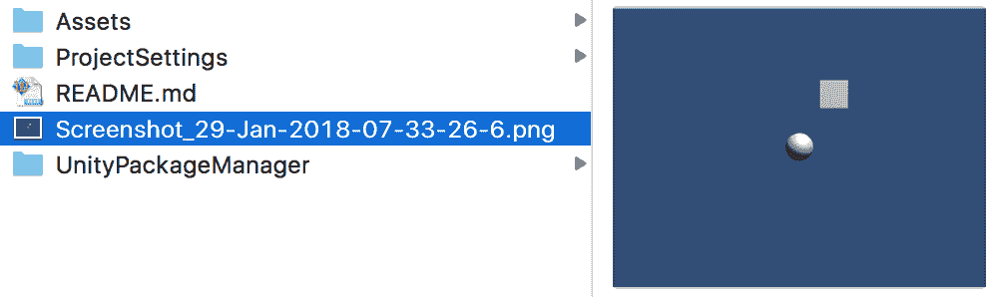

# 准备工作

要遵循此菜谱，请将位于`16_01`文件夹中的截图包导入到您的项目中。该包包括主相机、立方体和球体——这样你就可以在截图时识别它们了！

# 如何操作...

要保存游戏中的截图，请按照以下步骤操作：

1.  创建一个新的 3D 项目。

1.  通过选择以下菜单导入截图包：`**资产 | 导入包 | 自定义包**...`

1.  打开截图包中提供的场景。

1.  创建一个 C#的`CaptureScreenshot`脚本类，并将其实例对象作为组件添加到主相机中：

```cs
using System.Collections;
 using UnityEngine;
 using System.IO;

 public class CaptureScreenshot : MonoBehaviour {
     public string prefix = "Screenshot";
     public enum CaptureMethod {
         SCREENSHOT_PNG,
         READ_PIXELS_PNG,
         READ_PIXELS_JPG
     };
     public CaptureMethod captureMethod = CaptureMethod.SCREENSHOT_PNG;
     public int screenshotScale = 1;

     // A slider from 0 to 100 from which to set JPG quality
     [Range(0, 100)]
     public int jpgQuality = 75;

     private Texture2D texture;
     string date;

     void  Update () {
         if (Input.GetKeyDown (KeyCode.P)){
             TakeShot();
         }
     }

     private void TakeShot() {
         date = System.DateTime.Now.ToString("_d-MMM-yyyy-HH-mm-ss-f");

         if (CaptureMethod.SCREENSHOT_PNG == captureMethod){
             string fileExtension = ".png";
             string filename = prefix + date + fileExtension;
             ScreenCapture.CaptureScreenshot(filename, screenshotScale);
         } else {
             StartCoroutine(ReadPixels());
         }
     }

     IEnumerator  ReadPixels () {
         byte[] bytes;
         yield return new WaitForEndOfFrame();

         int screenWidth = Screen.width;
         int screenHeight = Screen.height;
         Rect screenRectangle = new Rect(0, 0, screenWidth, screenHeight);
         texture = new Texture2D (screenWidth, screenHeight, TextureFormat.RGB24, false);
         texture.ReadPixels(screenRectangle, 0, 0);
         texture.Apply();

         switch(captureMethod){
             case CaptureMethod.READ_PIXELS_JPG:
                 bytes = texture.EncodeToJPG(jpgQuality);
                 WriteBytesToFile(bytes, ".jpg");
                 break;

             case CaptureMethod.READ_PIXELS_PNG:
             default:
                 bytes = texture.EncodeToPNG();
                 WriteBytesToFile(bytes, ".png");
                 break;
         }
     }

     void WriteBytesToFile(byte[] bytes, string fileExtension) {
         Destroy (texture);
         string filename = prefix + date + fileExtension;
         string path = Application.dataPath;
         path = Path.Combine(path, "..");
         path = Path.Combine(path, filename);
         File.WriteAllBytes(path, bytes);
     }
 } 
```

1.  在`Hierarchy`中选择主相机，在`Inspector`中访问`CaptureScreenshot (Scripted)`组件。将`Capture Method`设置为`SCREENSHOT_PNG`。将`Screenshot Scale`更改为`2`。

如果你想你的图像文件名不以“截图”这个词开头，请在“前缀”字段中更改它：

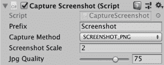

1.  播放场景。每次按下*P*键时，都会在项目文件夹中保存一个大小为原始两倍的新截图。

# 工作原理...

对于每一帧，`Update()`方法都会检查是否按下了*P*键。如果按下，则调用`TakeShot()`方法。

方法`TakeShot()`捕获屏幕图像并将其作为文件存储在主 Unity 项目目录中（即与`Assets`和`Library`目录等并列）。主相机的`CaptureScreenshot (Scripted)`的公共设置决定了项目创建的图像文件属性。

三种类型的截图图像被定义为枚举类型：

+   `SCREENSHOT_PNG`：内置 Unity 函数`CaptureScreenshot()`。该函数能够按比例调整原始屏幕大小，这可以通过我们的公共属性`Capture Scale`来设置。

+   `READ_PIXELS_PNG`：使用`ReadPixels()`函数，编码为 PNG 格式。

+   `READ_PIXELS_JPG`：使用`ReadPixels()`函数，编码为 JPG。

通过内置的 Unity 函数`WriteAllBytes()`在`WriteBytesToFile(...)`方法中将 ReadPixels 函数捕获的图像数据写入文件。

在所有情况下，创建的文件都将具有适当的`*.png`或`*.jpg`文件扩展名，以匹配其图像文件格式。

# 更多内容...

我们使用`ReadPixel`函数展示了如何在不使用 Unity 的`CaptureScreenshot()`函数的情况下将图像保存到磁盘。这种方法的一个优点是它可以适应只捕获和保存屏幕的一部分——如果定义了一个不同大小的矩形。

# 保存和加载玩家数据——使用静态属性

在游戏中跟踪玩家的进度和用户设置对于给游戏带来更深的感受和内容至关重要。在这个食谱中，我们将学习如何使我们的游戏记住玩家在不同级别（场景）之间的得分。

# 准备工作

我们在`16_02`文件夹中包含了一个名为`game_HigherOrLower`的完整 Unity 项目包。为了遵循这个食谱，我们将导入这个包作为起点。

# 如何做...

要保存和加载玩家数据，请按照以下步骤操作：

1.  创建一个新的 2D 项目并导入`game_HigherOrLower`包。

1.  将每个场景按顺序添加到构建中（scene0_mainMenu，然后 scene1_gamePlaying，依此类推）。

1.  通过玩几次游戏并检查场景内容来熟悉游戏。游戏从`scene0_mainMenu`场景开始，位于`Scenes`文件夹内。

1.  让我们创建一个类来存储用户做出的正确和错误猜测的数量。创建一个名为`Player`的新 C#脚本，代码如下：

```cs
using UnityEngine;

 public class Player : MonoBehaviour {
   public static int scoreCorrect = 0;
   public static int scoreIncorrect = 0;
 } 
```

1.  在场景`scene0_mainMenu`的左下角，创建一个名为`Text - score`的 UI Text GameObject，包含占位文本`Score: 99 / 99`：

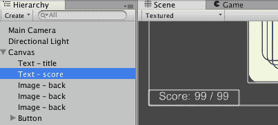

1.  接下来，将以下 C#脚本附加到 UI GameObject Text—score 上：

```cs
using UnityEngine;
 using System.Collections;

 using UnityEngine.UI;

 public class UpdateScoreText : MonoBehaviour {
   void Start(){
     Text scoreText = GetComponent<Text>();
     int totalAttempts = Player.scoreCorrect + Player.scoreIncorrect;
     string scoreMessage = "Score = ";
     scoreMessage += Player.scoreCorrect + " / " + totalAttempts;

     scoreText.text = scoreMessage;
   }
 } 
```

1.  在`scene2_gameWon`场景中，将以下 C#脚本附加到主摄像机上：

```cs
using UnityEngine;

 public class IncrementCorrectScore : MonoBehaviour {
   void Start () {
     Player.scoreCorrect++;
   }
 } 
```

1.  在`scene3_gameLost`场景中，将以下 C#脚本附加到主摄像机上：

```cs
using UnityEngine;

 public class IncrementIncorrectScore : MonoBehaviour {
   void Start () {
     Player.scoreIncorrect++;
   }
 } 
```

1.  保存你的脚本，并玩游戏。当你从级别（场景）进步到下一个级别时，你会发现得分和玩家的名字被记住，直到你退出应用程序。

# 它是如何工作的...

`Player`类使用静态（类）属性`scoreCorrect`和`scoreIncorrect`来存储当前正确和错误猜测的总数。由于这些是公共静态属性，任何场景中的任何对象都可以访问（设置或获取）这些值，因为静态属性在场景之间是记忆的。此类还提供了一个名为`ZeroTotals()`的公共静态方法，可以将这两个值重置为零。

当 `scene0_mainMenu` 场景被加载时，所有带有脚本的 `GameObjects` 将执行它们的 `Start()` 方法。名为 `Text-score` 的 UI Text GameObject 有一个 `UpdateScoreText` 类的脚本组件实例，因此脚本 `Start()` 方法将被执行，从 `Player` 类中检索正确和错误的总计，创建关于当前分数的 `scoreMessage` 字符串，并更新文本属性，以便用户看到当前分数。

当游戏运行且用户猜对（更高）时，则加载 `scene2_gameWon` 场景。因此，在这个场景中，主摄像机的 `IncrementCorrectScore` 脚本组件的 `Start()` 方法被执行，将 1 加到 `Player` 类的 `scoreCorrect` 变量上。

当游戏运行且用户猜错（更低）时，则加载 `scene3_gameLost` 场景。因此，在这个场景中，主摄像机的 `IncrementIncorrectScore` 脚本组件的 `Start()` 方法被执行，将 1 加到 `Player` 类的 `scoreIncorrect` 变量上。

下次用户访问主菜单场景时，将从 `Player` 类中读取正确和错误的总计新值，并且屏幕上的 UI Text 将通知用户他们的游戏更新总分。

# 更多内容...

有一些细节你不应该错过。

# 在第一次尝试完成之前隐藏分数

显示零分并不专业。让我们添加一些逻辑，以便只有在总尝试次数大于零时才显示分数：

```cs
void Start(){
   Text scoreText = GetComponent<Text>();
   int totalAttempts = Player.scoreCorrect + Player.scoreIncorrect;

   // default is empty string
   string scoreMessage = "";
   if( totalAttempts > 0){
     scoreMessage = "Score = ";
     scoreMessage += Player.scoreCorrect + " / " + totalAttempts;
   }

   scoreText.text = scoreMessage;
 } 
```

# 相关内容

参考本章中的以下配方以获取更多信息：

+   保存和加载玩家数据 - 使用 PlayerPrefs

# 保存和加载玩家数据 – 使用 PlayerPrefs

虽然之前的配方说明了静态属性如何允许游戏在不同场景之间记住值，但这些值一旦游戏应用程序退出就会被遗忘。Unity 提供了 `PlayerPrefs` 功能，允许游戏在不同游戏会话之间存储和检索数据：

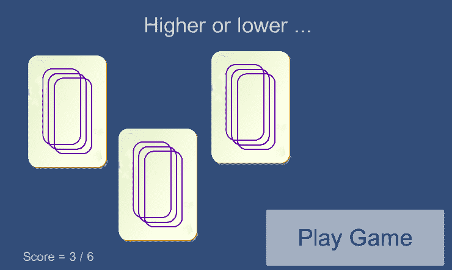

# 准备工作

这个配方基于之前的配方，所以请复制那个项目并在此基础上工作。

# 如何操作...

要使用 `PlayerPrefs` 保存和加载玩家数据，请按照以下步骤操作：

1.  删除名为 `Player` 的 C#脚本。

1.  编辑名为 `UpdateScoreText` 的 C#脚本，将其 `Start()` 方法替换为以下内容：

```cs
void Start(){
   Text scoreText = GetComponent<Text>();

   int scoreCorrect = PlayerPrefs.GetInt("scoreCorrect");
   int scoreIncorrect = PlayerPrefs.GetInt("scoreIncorrect");

   int totalAttempts = scoreCorrect + scoreIncorrect;
   string scoreMessage = "Score = ";
   scoreMessage += scoreCorrect + " / " + totalAttempts;

   scoreText.text = scoreMessage;
 } 
```

1.  现在编辑名为 `IncrementCorrectScore` 的 C#脚本，将其 `Start()` 方法替换为以下代码：

```cs
void Start () {
   int newScoreCorrect = 1 + PlayerPrefs.GetInt("scoreCorrect");
   PlayerPrefs.SetInt("scoreCorrect", newScoreCorrect);
 } 
```

1.  现在编辑名为 `IncrementIncorrectScore` 的 C#脚本，将其 `Start()` 方法替换为以下代码：

```cs
void Start () {
   int newScoreIncorrect = 1 + PlayerPrefs.GetInt("scoreIncorrect");
   PlayerPrefs.SetInt("scoreIncorrect", newScoreIncorrect);
 } 
```

1.  保存你的脚本并玩游戏。退出 Unity 然后重新启动应用程序。你会发现玩家的名字、等级和分数现在在游戏会话之间被保留。

# 工作原理...

由于这个配方使用的是 Unity 提供的内置运行时类`PlayerPrefs`，因此我们不需要 Player 类。

Unity 的`PlayerPrefs`运行时类能够在用户的机器上存储和访问信息（字符串、int 和 float 变量）。值存储在 plist 文件（Mac）或注册表（Windows）中，类似于网络浏览器的 cookies，因此可以在游戏应用会话之间记住。

总正确和错误得分的值由`IncrementCorrectScore`和`IncrementIncorrectScore`类中的`Start()`方法存储。这些方法使用`PlayerPrefs.GetInt("")`方法检索旧的总分，将其加 1，然后使用`PlayerPrefs.SetInt("")`方法存储增加后的总分。

这些正确和错误的总数在每次加载`scene0_mainMenu`场景时都会被读取，并且通过屏幕上的 UI Text 对象显示得分总数。

有关`PlayerPrefs`的更多信息，请参阅 Unity 在线文档[`docs.unity3d.com/ScriptReference/PlayerPrefs.html`](http://docs.unity3d.com/ScriptReference/PlayerPrefs.html)。

# 参考信息

有关更多信息，请参阅本章中的以下配方：

+   保存和加载玩家数据 - 使用静态属性

# 从文本文件地图加载游戏数据

而不是为每个游戏级别手动创建和放置每个`GameObject`，一个更好的方法是可以创建包含行和列字符的文本文件，其中每个字符对应于要在相应位置创建的`GameObject`的类型。

在这个配方中，我们将使用文本文件和一组预制精灵来显示经典游戏*NetHack*屏幕的文本数据文件的图形版本：

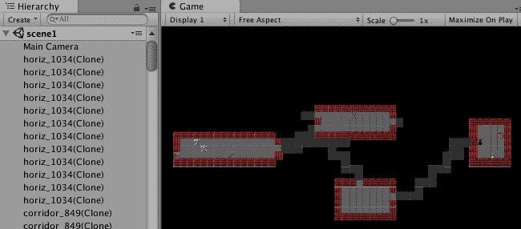

# 准备中

在`16_04`文件夹中，我们为这个配方提供了以下两个文件：

+   `level1.txt`（一个文本文件，表示一个关卡）

+   `absurd128.png`（一个 128 x 128 的精灵图，用于 NetHack）。

关卡数据来自 NetHack 维基百科页面，精灵图来自 SourceForge：

+   [`en.wikipedia.org/wiki/NetHack`](http://en.wikipedia.org/wiki/NetHack)

+   [`sourceforge.net/projects/noegnud/files/tilesets_nethack-3.4.1/absurd%20128x128/`](http://sourceforge.net/projects/noegnud/files/tilesets_nethack-3.4.1/absurd%20128x128/)

注意，我们还包含了一个包含所有预制件设置的 Unity 包，因为这可能是一个费时的任务。

# 如何操作...

要从文本文件地图加载游戏数据，请执行以下操作：

1.  导入文本文件`level1.txt`和图像文件`absurd128.png`。

1.  在检查器中选择`absurd128.png`，并将纹理类型设置为 Sprite (2D/uGUI)，并将 Sprite 模式设置为 Multiple。

1.  在精灵编辑器中编辑此精灵，选择类型为 Grid，并将像素大小设置为 128 x 128，并应用以下设置：

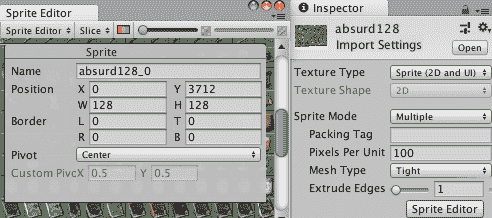

1.  在“项目”面板中，点击指向右侧的白三角图标以展开图标，以单独显示此精灵图集中的所有精灵：

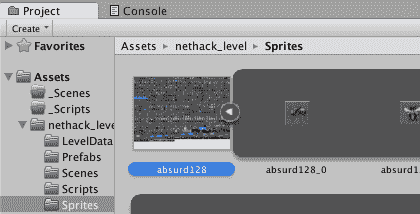

1.  将名为 absurd128_175 的精灵拖放到场景中。

1.  在“项目”面板中创建一个新的预制件 `corpse_175`，并将其从场景中的空白预制件精灵 absurd128_175 拖放到此。现在从场景中删除精灵实例。你现在创建了一个包含 `Sprite 175` 的预制件。

1.  对以下精灵重复此过程（即为每个精灵创建预制件）：

    +   `– floor_848`

    +   `– corridor_849`

    +   `– horiz_1034`

    +   `– vert_1025`

    +   `– door_844`

    +   `– potion_675`

    +   `– chest_586`

    +   `– alter_583`

    +   `– stairs_up_994`

    +   `– stairs_down_993`

    +   `– wizard_287`

1.  在“检查器”中选择主相机，并确保它设置为大小为 20 的正交相机，清除标志为纯色，背景为黑色。

1.  将以下 C# 代码附加到主相机上，作为名为 `LoadMapFromTextfile` 的脚本类：

```cs
using UnityEngine;
 using System.Collections;

 using System.Collections.Generic;

 public class LoadMapFromTextfile : MonoBehaviour
 {
   public TextAsset levelDataTextFile;

   public GameObject floor_848;
   public GameObject corridor_849;
   public GameObject horiz_1034;
   public GameObject vert_1025;
   public GameObject corpse_175;
   public GameObject door_844;
   public GameObject potion_675;
   public GameObject chest_586;
   public GameObject alter_583;
   public GameObject stairs_up_994;
   public GameObject stairs_down_993;
   public GameObject wizard_287;

   public Dictionary<char, GameObject> dictionary = new Dictionary<char, GameObject>();

   void Awake(){
     char newlineChar = '\n';

     dictionary['.'] = floor_848;
     dictionary['#'] = corridor_849;
     dictionary['('] = chest_586;
     dictionary['!'] = potion_675;
     dictionary['_'] = alter_583;
     dictionary['>'] = stairs_down_993;
     dictionary['<'] = stairs_up_994;
     dictionary['-'] = horiz_1034;
     dictionary['|'] = vert_1025;
     dictionary['+'] = door_844;
     dictionary['%'] = corpse_175;
     dictionary['@'] = wizard_287;

     string[] stringArray = levelDataTextFile.text.Split(newlineChar);
     BuildMaze( stringArray );
   }

   private void BuildMaze(string[] stringArray){
     int numRows = stringArray.Length;

     float yOffset = (numRows / 2);

     for(int row=0; row < numRows; row++){
       string currentRowString = stringArray[row];
       float y = -1 * (row - yOffset);
       CreateRow(currentRowString, y);
     }
   }

   private void CreateRow(string currentRowString, float y) {
     int numChars = currentRowString.Length;
     float xOffset = (numChars/2);

     for(int charPos = 0; charPos < numChars; charPos++){
       float x = (charPos - xOffset);
       char prefabCharacter = currentRowString[charPos];

       if (dictionary.ContainsKey(prefabCharacter)){
         CreatePrefabInstance( dictionary[prefabCharacter], x, y);
       }
     }
   }

   private void CreatePrefabInstance(GameObject objectPrefab, float x, float y){
     float z = 0;
     Vector3 position = new Vector3(x, y, z);
     Quaternion noRotation = Quaternion.identity;
     Instantiate (objectPrefab, position, noRotation);
   }
 } 
```

1.  选择主相机，将适当的预制件拖放到“检查器”中 `LoadMapFromTextfile` 脚本组件的预制件槽中。

1.  当你运行场景时，你会看到基于精灵的 Nethack 地图出现，使用你的预制件。

# 它是如何工作的...

精灵图集被自动切割成数百个 128 x 128 像素的精灵方块。我们从这些精灵中创建了一些预制件对象，以便在需要时在运行时创建副本。

文件名为 `level1.txt` 的文本文件包含文本字符的行。每个非空格字符表示精灵预制件应该实例化的位置（列 = *x*；行 = y）。在 `Start()` 方法中声明并初始化了一个名为 `dictionary` 的 C# 字典变量，以将特定的预制件 GameObject 与文本文件中的某些特定字符关联起来。

`Awake()` 方法使用换行符作为分隔符将字符串拆分为数组。因此，现在我们有了 `stringArray`，其中包含文本数据的每一行的条目。`BuildMaze(...)` 方法使用 `stringArray` 被调用。

`BuildMaze(...)` 方法查询数组以找到其长度（此级别的数据行数），并将 `yOffSet` 设置为该值的一半。这样做是为了允许将预制件放置在 *y* = 0 的一半以上和一半以下，因此 (0,0,0) 是级别地图的中心。使用 for 循环读取数组中的每一行的字符串。它将字符串传递给 `CreateRow(...)` 方法，并附带对应于当前行的 *y* 值。

`CreateRow(...)`方法提取字符串的长度，并将`xOffSet`设置为该值的一半。这样做是为了允许将预制件放置在*x* = 0 的左侧和右侧的一半，因此(0,0,0)是地图中心的水平面。使用 for 循环从当前行的字符串中读取每个字符，并且（如果我们的字典中有该字符的条目）则调用`CreatePrefabInstance (...)`方法，传递字典中该字符的预制件引用以及*x*和*y*值。

`CreatePrefabInstance(...)`方法在位置*x, y, z*处实例化给定的预制件，其中*z*始终为零，并且没有旋转（`Quarternion.identity`）。

# UI 滑块更改游戏质量设置

在本菜谱中，我们将向您展示玩家如何通过提供 UI 滑块来控制质量设置。从这，他们可以从当前项目的可能质量设置数组中进行选择：

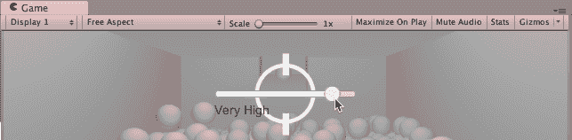

# 准备工作

对于这个菜谱，我们准备了一个名为`BallGame`的包，包含两个场景。该包位于`16_05`文件夹中。

# 如何操作...

要创建一个玩家 UI 来更改游戏的质量设置，请执行以下操作：

1.  创建一个新的 3D 项目并导入`BallGame`包。

1.  打开名为`scene0_ballCourt`的场景。

1.  在场景中，通过选择菜单：创建 | UI | 面板创建一个新的 UI 面板名为`Panel-quality`。

1.  在层次结构中选择 Panel-quality 游戏对象后，通过选择菜单：创建 | UI | 滑块创建一个新的 UI 滑块名为 Slider-quality。此游戏对象应该是 Panel-quality 的子对象。

1.  在层次结构中选择 Panel-quality 后，通过选择菜单：创建 | UI | 文本创建一个新的 UI 文本游戏对象名为 Text-quality。此游戏对象应该是 GameObject Panel-quality 的子对象。在**检查器**中，将其 Transform Position Y 值设置为-25。

1.  创建一个新的 C#脚本类名为`QualityChooser`，并将实例对象作为组件附加到第一人称控制器：

```cs
    using UnityEngine;
     using UnityEngine.UI;
     using System.Collections;

     public class QualityChooser : MonoBehaviour {
         public GameObject panelGo;
         public Slider slider;
         public Text textLabel;

         void Awake () {
             slider.maxValue = QualitySettings.names.Length - 1;
             slider.value = QualitySettings.GetQualityLevel();
             SetQualitySliderActive(true);
         }

         public void SetQualitySliderActive(bool active) {
             Cursor.visible = active;
             panelGo.SetActive(active);
         }

         public void UpdateQuality(float sliderFloat) {
             int qualityInt = Mathf.RoundToInt (sliderFloat);
             QualitySettings.SetQualityLevel (qualityInt);
             textLabel.text = QualitySettings.names [qualityInt];
         }
     } 
```

1.  在**层次结构**中，选择第一人称控制器。然后，从**检查器**中访问质量选择器组件，并将面板 Go、滑块和文本标签公共字段填充为 UI 游戏对象面板-quality、滑块和文本：

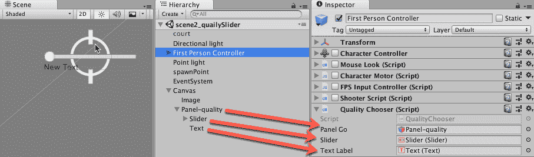

1.  从**层次结构**面板中选择滑块。然后，从**检查器**中，对于滑块组件，找到名为 On Value Changed (Single)的列表，并单击加号以添加命令。

1.  将**第一人称控制器**从**层次结构**拖入新命令的**游戏对象**字段。然后，使用功能选择器在动态浮点部分（无功能 | 质量选择器 | 动态浮点 | UpdateQuality）中找到 UpdateQuality 函数：

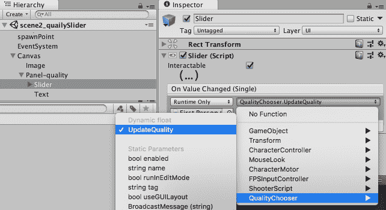

1.  当您播放场景时，您应该能够拖动质量滑块来更改质量设置。

# 工作原理...

你创建了一个包含 UI 滑块和 UI 文本对象的面板。

`SetQualitySliderActive(...)`方法接收一个 true/false 值，并使用这个值来显示/隐藏鼠标光标和 UI 面板。

`UpdateQuality(...)`方法从滑块的`OnChange`事件接收一个浮点值。此值被转换为整数，该整数是要选择的当前质量设置的索引。此索引既用于选择项目质量设置，也用于更新 UI 文本标签，显示当前所选质量设置的名称。

当场景开始时，在`Awake()`方法中，UI 滑块的最大值设置为项目质量项数减 1（例如，如果有五个项目，滑块将从 0 到 4）。此外，UI 滑块移动到对应当前质量级别的位置，并使用 true 值调用`SetQualitySliderActive(...)`方法，以显示鼠标指针和显示滑块和文本标签的 UI 面板。

# 还有更多...

这里有一些方法可以进一步使用这个菜谱。

# 查看/编辑质量设置列表

你可以通过选择菜单：编辑 | 项目设置 | 质量，来查看和修改项目可用的质量设置。

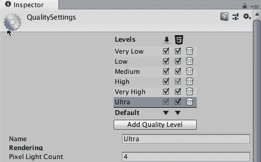

# 暂停游戏

尽管你的下一款游戏将非常吸引人，但你应该始终允许玩家暂停它以短暂休息。有时，游戏暂停用于让玩家休息，但另一个原因可能是更改一些游戏设置，如音量或图形质量。

暂停游戏通常涉及冻结游戏动作和隐藏或显示 UI 项目，以向玩家显示消息并提供 UI 控件来更改设置。

在这个菜谱中，我们将实现一个简单而有效的暂停屏幕，当游戏正在播放时隐藏之前菜谱的质量设置滑块，当游戏暂停时显示它。

# 准备工作

这个菜谱基于之前的菜谱，所以请复制那个菜谱并使用副本。

# 如何操作...

要在按下*Esc*键时暂停游戏，请按照以下步骤操作：

1.  选择第一人称控制器，并在检查器中启用以下组件：

    +   角色控制器

    +   鼠标瞄准（脚本）

    +   角色引擎（脚本）

    +   FPS 输入控制器（脚本）

    +   射击（脚本）

1.  将以下名为`PauseGame`的 C#脚本添加到第一人称控制器：

```cs
    using UnityEngine;
     using UnityEngine.UI;
     using System.Collections;

     public class PauseGame : MonoBehaviour {
         private bool isPaused = false;
         private QualityChooser qualityChooser;

         void Start () {
             qualityChooser = GetComponent<QualityChooser>();
         }

         void Update () {
             if (Input.GetKeyDown(KeyCode.Escape)) {
                 isPaused = !isPaused;
                 SetPause ();
             }
         }

         private void SetPause() {
             float timeScale = !isPaused ? 1f : 0f;
             Time.timeScale = timeScale;
             GetComponent<MouseLook> ().enabled = !isPaused;
             qualityChooser.SetQualitySliderActive(isPaused);
         }        
     } 
```

1.  编辑`QualityController`脚本类，并在`Awake()`方法中，将最后一行修改为将 false（而不是 true）传递给`SetQualitySliderActive(...)`方法：

```cs
        void Awake () {
             slider.maxValue = QualitySettings.names.Length - 1;
             slider.value = QualitySettings.GetQualityLevel();
             SetQualitySliderActive(false);
         } 
```

1.  当你播放场景时，你应该能够通过按下*Esc*键暂停/恢复游戏，这将同时显示/隐藏控制游戏质量设置的滑块。

# 它是如何工作的...

要使用脚本暂停 Unity 游戏，我们需要将游戏的时间缩放设置为 0（并在恢复时将其设置为 1）。`SetPause()`方法根据`isPaused`变量的值执行这些操作：

+   `isPause` = `true`：时间缩放 0（暂停游戏），禁用`MouseLook`组件，并激活质量滑块和鼠标光标

+   `isPause` = `false`：时间缩放 1（恢复游戏），启用`MouseLook`组件，并停用质量滑块和鼠标光标：

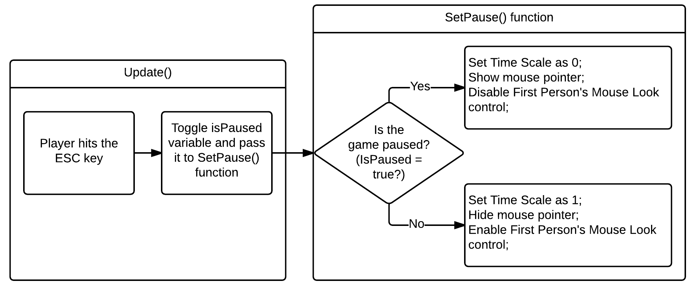

在`Update()`方法中，对每一帧进行测试，检查是否按下了*Esc*键。如果按下，则切换`isPaused`的值，并调用`SetPause()`方法。

# 更多内容...

这里有一些方法可以进一步改进这个食谱。

# 了解更多关于质量设置的信息

我们更改质量设置的代码是对 Unity 文档中给出的示例的修改。如果您想了解更多关于这个主题的信息，请查看以下链接：[`docs.unity3d.com/ScriptReference/QualitySettings.html`](http://docs.unity3d.com/ScriptReference/QualitySettings.html)。

# 提供更多游戏设置给用户

您可以添加更多 UI 面板，在游戏暂停时激活，例如，用于音量控制、保存/加载按钮等。

# 实现慢动作

自从 Remedy Entertainment 的*Max Payne*视频游戏以来，慢动作或子弹时间已经成为游戏中的一个流行功能。例如， Criterion 的*Burnout*系列成功探索了赛车类别中的慢动作效果。在这个食谱中，我们将实现一个通过按下鼠标右键触发的慢动作效果。

# 准备工作

对于这个食谱，我们将使用与之前食谱相同的包，即`BallGame`，它位于`16_07`文件夹中。

# 如何操作...

要实现慢动作，请按照以下步骤操作：

1.  将`BallGame`包导入到您的项目中，并从项目面板中打开名为`scene1_ballGame`的场景。

1.  创建一个名为`BulletTime`的 C#脚本类，并将其作为组件添加到第一人称控制器 GameObject 实例中：

```cs
    using UnityEngine;
     using UnityEngine.UI;
     using System.Collections;

     public class BulletTime : MonoBehaviour {
         public float slowSpeed = 0.1f;
         public float totalTime = 10f;
         public float recoveryRate = 0.5f;
         public Slider EnergyBar;
         private float elapsed = 0f;
         private bool isSlow = false;

         void Update (){        
             if (Input.GetButtonDown ("Fire2") && elapsed < totalTime)
                 SetSpeed (slowSpeed);
```

```cs

             if (Input.GetButtonUp ("Fire2"))
                 SetSpeed (1f);

             if (isSlow) {
                 elapsed += Time.deltaTime / sloSpeed;

                 if (elapsed >= totalTime)
                     SetSpeed (1f);                  
             } else {
                 elapsed -= Time.deltaTime * recoveryRate;
                 elapsed = Mathf.Clamp (elapsed, 0, totalTime);
             }

             float remainingTime = (totalTime - elapsed) / totalTime;
             EnergyBar.value = remainingTime;
         }

         private void SetSpeed (float speed) {
             Time.timeScale = speed;
             Time.fixedDeltaTime = 0.02f * speed;
             isSlow = !(speed >= 1.0f);  
         }
     } 
```

1.  通过选择菜单：创建 | UI | 滑块，在场景中添加一个名为`Slider-energy`的 UI 滑块。请注意，它将作为现有 Canvas 对象的子对象创建。

1.  选择滑块-能量，并在检查器中的矩形变换组件中设置其锚点如下：

    +   最小 X: 0，Y: 1

    +   最大 X: 0.5，Y: 1

    +   轴心 X: 0，Y: 1

1.  选择滑块-能量，并在检查器中的矩形变换组件中设置其位置如下：

    +   左: 0

    +   Y 轴位置: 0

    +   Z 轴位置: 0

    +   右: 0

    +   高度：50：

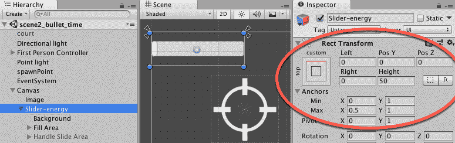

1.  在检查器中，将滑块的子**GameObject**滑块区域设置为不活动：

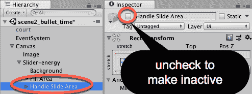

1.  最后，从层次结构中选择第一人称控制器。然后，找到子弹时间组件，并将层次结构中的 GameObject 滑块-能量拖动到其能量条槽中。

1.  播放你的游戏。你应该能够通过按住右鼠标按钮（或你为输入轴设置的任何替代选项）来激活慢动作。滑块将充当进度条，缓慢缩小，指示你剩余的子弹时间。

# 它是如何工作的...

基本上，要实现慢动作效果，我们只需要减小`Time.timeScale`变量。在我们的脚本中，我们通过使用`slowSpeed`变量来实现这一点。请注意，我们还需要调整`Time.fixedDeltaTime`变量，更新我们游戏的物理模拟。

为了使体验更具挑战性，我们还实现了一种能量条，以指示玩家剩余的子弹时间（初始值由`totalTime`变量给出，以秒为单位）。当玩家不使用子弹时间时，他/她的配额将根据`recoveryRate`变量填充。

关于 UI 滑块，我们使用了 Rect Transform 设置将其放置在左上角，并设置其尺寸为屏幕宽度的一半和 50 像素高。此外，我们已隐藏了手柄滑动区域，使其类似于传统的能量条。最后，我们不是允许玩家直接与滑块交互，而是使用`BulletTime`脚本更改滑块的值。

# 还有更多...

在以下子节中描述了一些如何进一步改进你的慢动作效果的建议。

# 个性化滑块

不要忘记，你可以通过创建自己的精灵或根据滑块的值更改滑块的填充颜色来个性化滑块的外观。

尝试将以下代码行添加到`Update`函数的末尾：

```cs
    GameObject fill = GameObject.Find("Fill").gameObject;
     Color sliderColor = 
Color.Lerp(Color.red, Color.green, remainingTime);
     fill.GetComponent<Image> ().color = sliderColor; 
```

# 添加运动模糊

运动模糊是一种与慢动作频繁相关的图像效果。一旦附加到相机上，它可以根据速度浮点值启用或禁用。有关运动模糊后处理图像效果的更多信息，请参阅以下链接：

+   [`github.com/Unity-Technologies/PostProcessing/wiki/Motion-Blur`](https://github.com/Unity-Technologies/PostProcessing/wiki/Motion-Blur)

+   [`docs.unity3d.com/Packages/com.unity.postprocessing@2.0/manual/Motion-Blur.html`](https://docs.unity3d.com/Packages/com.unity.postprocessing@2.0/manual/Motion-Blur.html)

+   [`docs.unity3d.com/Packages/com.unity.postprocessing@2.0/manual/Manipulating-the-Stack.html`](https://docs.unity3d.com/Packages/com.unity.postprocessing@2.0/manual/Manipulating-the-Stack.html)

# 创建音效氛围

*Max Payne* 闻名于使用强烈的、沉重的心跳声作为音效氛围。你也可以尝试降低音效音量，以传达角色在慢动作时的专注。此外，使用相机上的音频过滤器可能是一个有趣的选择。

# 使用 Gizmo 在场景面板中显示当前选定的对象

Gizmos 是在场景面板中提供给游戏设计师的视觉辅助工具。在这个菜谱中，我们将突出显示在场景面板中 **层次结构** 中当前选中的 **游戏对象**：

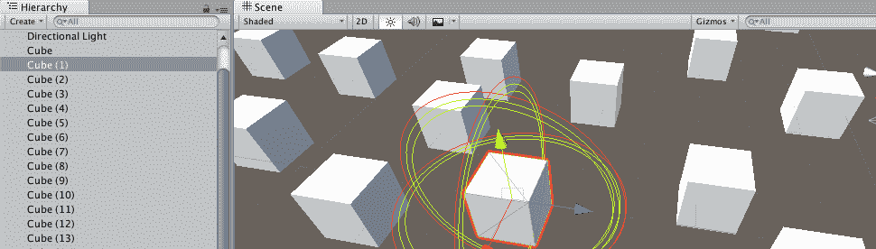

# 如何做到这一点...

要在场景面板中创建一个显示所选对象的 Gizmo，请按照以下步骤操作：

1.  创建一个新的 3D 项目。

1.  通过选择菜单：创建 | 3D 对象 | 立方体来创建一个 3D 立方体。

1.  创建一个名为 `GizmoHighlightSelected` 的 C# 脚本类，并将一个实例对象作为组件添加到 **3D 立方体**：

```cs
    using UnityEngine;

     public class GizmoHighlightSelected : MonoBehaviour {
         public float radius = 5.0f;

         void OnDrawGizmosSelected() {
             Gizmos.color = Color.red;
             Gizmos.DrawWireSphere(transform.position, radius);

             Gizmos.color = Color.yellow;
             Gizmos.DrawWireSphere(transform.position, radius - 0.1f);

             Gizmos.color = Color.green;
             Gizmos.DrawWireSphere(transform.position, radius - 0.2f);
         }
     } 
```

1.  制作大量 3D 立方体的副本，并将它们随机分布在场景中。

1.  当你在层次结构中选择一个立方体时，你应该在场景面板中看到围绕所选 **游戏对象** 绘制了三个彩色线框球体。

# 它是如何工作的...

当在场景中选择一个对象时，如果它包含一个包含 `OnDrawGizmosSelected()` 方法的脚本组件，则调用该方法。我们的方法在所选对象周围绘制三个不同颜色的同心线框球体。

您可以在 Gizmos Unity 手册条目中了解更多信息：[`docs.unity3d.com/Manual/GizmosMenu.html`](https://docs.unity3d.com/Manual/GizmosMenu.html)。

# 由 Gizmo 绘制的编辑器网格

如果需要将对象的定位限制到特定的增量，在场景面板中绘制一个网格非常有用，这有助于确保新对象基于这些值定位，并且还有代码将对象吸附到该网格上。

在这个菜谱中，我们将使用 Gizmos 绘制一个可自定义网格大小、颜色、线条数量和线长的网格。遵循此菜谱的结果将如下所示：

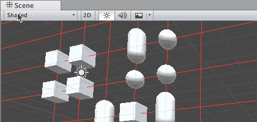

# 如何做到这一点...

要在场景面板中创建一个显示所选对象的 Gizmo，请按照以下步骤操作：

1.  创建一个新的 3D 项目。

1.  对于场景面板，关闭 Skybox 视图（或者简单地关闭所有视觉设置），以便为您的网格工作提供一个纯背景：

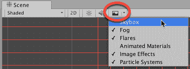

1.  显示和更新子对象将由一个名为 `GridGizmo` 的脚本类执行。创建一个名为 `GridGizmo` 的新 C# 脚本类，其中包含以下内容：

```cs
    using System.Collections;
     using System.Collections.Generic;
     using UnityEngine;

     public class GridGizmo : MonoBehaviour {
         [SerializeField]
         public int grid = 2;

         public void SetGrid(int grid) {
             this.grid = grid;
             SnapAllChildren();
         }

         [SerializeField]
         public Color gridColor = Color.red;

         [SerializeField]
         public int numLines = 6;

         [SerializeField]
         public int lineLength = 50;

         private void SnapAllChildren() {
             foreach (Transform child in transform)
                 SnapPositionToGrid(child);
         }

         void OnDrawGizmos() {
             Gizmos.color = gridColor;

             int min = -lineLength;
             int max = lineLength;

             int n = -1 * RoundForGrid(numLines / 2);
             for (int i = 0; i < numLines; i++) {
                 Vector3 start = new Vector3(min, n, 0);
                 Vector3 end = new Vector3(max, n, 0); 
                 Gizmos.DrawLine(start, end);

                 start = new Vector3(n, min, 0);
                 end = new Vector3(n, max, 0); 
                 Gizmos.DrawLine(start, end);

                 n += grid;
             }
         }

         public int RoundForGrid(int n) {
             return (n/ grid) * grid;
         }

         public int RoundForGrid(float n) {
             int posInt = (int) (n / grid);
             return posInt * grid;
         }

         public void SnapPositionToGrid(Transform transform) {
             transform.position = new Vector3 (
                 RoundForGrid(transform.position.x),
                 RoundForGrid(transform.position.y),
                 RoundForGrid(transform.position.z)
             );
         }
     } 
```

1.  让我们使用一个编辑器脚本来向 **游戏对象** 菜单添加一个新的菜单项。创建一个名为 `Editor` 的文件夹，并在该文件夹中创建一个名为 `EditorGridGizmoMenuItem` 的新 C# 脚本类，其中包含以下内容：

```cs
    using UnityEngine;
     using UnityEditor;
     using System.Collections;

     public class EditorGridGizmoMenuItem : Editor {
         [MenuItem("GameObject/Create New Snapgrid", false, 10000)]
         static void CreateCustomEmptyGameObject(MenuCommand menuCommand) {
             GameObject gameObject = new GameObject("___snap-to-grid___");

             gameObject.transform.parent = null;
             gameObject.transform.position = Vector3.zero;
             gameObject.AddComponent<GridGizmo>();        
         }
     } 
```

1.  现在，让我们添加另一个用于 `GridGizmo` 组件的自定义检查器显示（和更新器）的 **编辑器** 脚本。同样，在您的 **编辑器** 文件夹中，创建一个名为 `EditorGridGizmo` 的新 C# 脚本类，其中包含以下内容：

```cs
    using UnityEngine;
     using UnityEditor;
     using System.Collections;

     [CustomEditor(typeof(GridGizmo))]
     public class EditorGridGizmo : Editor {
         private GridGizmo gridGizmoObject;
         private int grid;
         private Color gridColor;
         private int numLines;
         private int lineLength;

         private string[] gridSizes = {
             "1", "2", "3", "4", "5"
         };

         void OnEnable() {
             gridGizmoObject = (GridGizmo)target;
             grid = serializedObject.FindProperty("grid").intValue;
             gridColor = serializedObject.FindProperty("gridColor").colorValue;
             numLines = serializedObject.FindProperty("numLines").intValue;
             lineLength = serializedObject.FindProperty("lineLength").intValue;
         }

         public override void OnInspectorGUI() {
             serializedObject.Update ();

             int gridIndex = grid - 1;
             gridIndex =  EditorGUILayout.Popup("Grid size:",  gridIndex, gridSizes);                
             gridColor = EditorGUILayout.ColorField("Color:", gridColor);
             numLines =  EditorGUILayout.IntField("Number of grid lines",  numLines);
             lineLength =  EditorGUILayout.IntField("Length of grid lines",  lineLength);

             grid = gridIndex + 1;
             gridGizmoObject.SetGrid(grid);  
             gridGizmoObject.gridColor = gridColor;
             gridGizmoObject.numLines = numLines;    
             gridGizmoObject.lineLength = lineLength;    
             serializedObject.ApplyModifiedProperties ();
             sceneView.RepaintAll();
         }        
     } 
```

1.  通过选择菜单：游戏对象 | 创建新吸附网格，将一个新的 `GizmoGrid` 游戏对象添加到场景中。应该添加一个名为 ___ 吸附网格 ___ 的新游戏对象到层次结构中：


1.  选择 GameObject ___snap-to-grid___，并在检查器中修改其一些属性。您可以更改网格大小、网格线的颜色、线条数量及其长度：

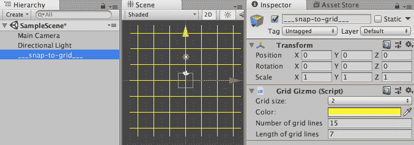

1.  通过选择菜单：创建 | 3D 对象 | 立方体来创建一个**3D 立方体**。现在，将**3D 立方体**拖动到层次结构中，并将其作为 GameObject ___snap-to-grid___ 的子对象。

1.  我们现在需要一个小的脚本类，以便每次 GameObject 在编辑器模式中移动时，它都会请求其位置通过父脚本组件`SnapToGizmoGrid`进行自动对齐。创建一个名为`SnapToGizmoGrid`的 C#脚本类，并将其作为组件添加到**3D 立方体**：

```cs
    using System.Collections;
     using System.Collections.Generic;
     using UnityEngine;

     [ExecuteInEditMode]
     public class SnapToGridGizmo : MonoBehaviour {
         public void Update()
         {
     #if UNITY_EDITOR
             transform.parent.GetComponent<GridGizmo>().SnapPositionToGrid(transform);
     #endif
         }
     } 
```

1.  在场景中随机分布大量 3D 立方体的副本——你会发现它们会自动对齐到网格。

1.  再次选择 GameObject ___snap-to-grid___，并在检查器中修改其一些属性。您会看到更改立即在场景中可见，并且所有具有`SnapToGizmoGrid`脚本组件的子对象都会自动对齐到任何新的网格大小更改。

# 它是如何工作的...

`EditorGridGizmoMenuItem`脚本类向 GameObject 菜单添加一个新项目。当选择时，会在层次结构中添加一个新的 GameObject，命名为 ___snap-to-grid___，位置在(0, 0, 0)，并包含`GridGizmo`脚本类的实例对象组件。

`GridGizmo`根据公共属性（网格大小、颜色、线条数量和线条长度）绘制 2D 网格。关于`SetGrid(...)`方法，以及更新整数网格大小变量 grid，它还会调用`SnapAllChildren()`方法，因此每次更改网格大小，所有子 GameObject 都会自动对齐到新的网格位置。

`SnapToGridGizmo`脚本类包含一个`Editor`属性`[ExecuteInEditMode]`，这样当在编辑器中设计时更改其属性时，它将接收到`Update()`消息。每次调用`Update()`时，它都会在其父`GridGizmo`实例对象中调用`SnapPositionToGrid(...)`方法，以便其位置根据当前网格设置自动对齐。为了确保此逻辑和代码不会编译到任何最终游戏构建中，`Update()`的内容被包裹在`#if UNITY_EDITOR`编译器测试中。在为最终游戏编译构建之前，此类内容会被移除。

`EditorGridGizmo`脚本类是一个自定义编辑器检查器组件。这允许控制哪些属性在检查器中显示，如何显示，并且允许在更改任何值时执行操作。例如，在更改保存后，`sceneView.RepaintAll()`语句确保网格被重新显示，因为它会导致发送`OnDrawGizmos()`消息。

# 创建 VR 项目

在这个菜谱中，我们将通过在 Unity 中设置基本 VR 场景的步骤，使用 Windows 计算机上的 Vive VR 头戴设备。

# 准备工作

你需要设置站立模式或房间规模的 Steam VR。如果你还没有这样做，请按照以下步骤设置你的 Vive 头戴式设备，以便它为 Unity 游戏开发做好准备：

1.  安装 Steam

1.  安装 Steam VR

1.  连接你的 Vive 头戴式设备

1.  从 Steam 应用程序窗口中运行 Steam VR（点击 Steam 应用窗口右上角的 VR）：

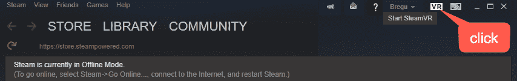

1.  Steam VR 应该运行。然后，选择运行房间设置菜单项：

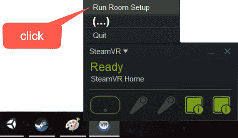

1.  将你的**灯塔**放置在你想使用的房间空间内。

1.  从房间设置屏幕中选择你的房间设置：站立模式或房间规模：

    +   站立模式：

        +   使用头戴式设备设置中心

        +   使用头戴式设备定位地板

    +   房间规模：

        +   将你的灯塔放置在你想使用的空间内

        +   通过将手控制器放在地板上来校准地板

        +   在房间内走动，使用带有扳机的手控制器绘制你可以安全移动的空间

1.  你现在可以探索 Steam VR 主界面。

# 如何做到这一点...

要创建一个基本的 VR Unity 项目，请按照以下步骤操作：

1.  开始一个新的 3D 项目。

要么使用一个新的 3D Unity 项目，要么备份你即将添加 VR 功能的任何项目，因为你将添加一个会更改许多设置的包，这可能会破坏现有项目的设置。

1.  从场景中删除主相机。

1.  通过选择菜单：编辑 | 项目设置 | 玩家来显示 Unity Player 设置：

1.  在检查器中检查虚拟现实支持选项：


1.  确保你已经登录到你的 Unity 账户（在访问**资产商店**之前）。

1.  访问**资产商店**并从 Valve 公司搜索 Steam VR：

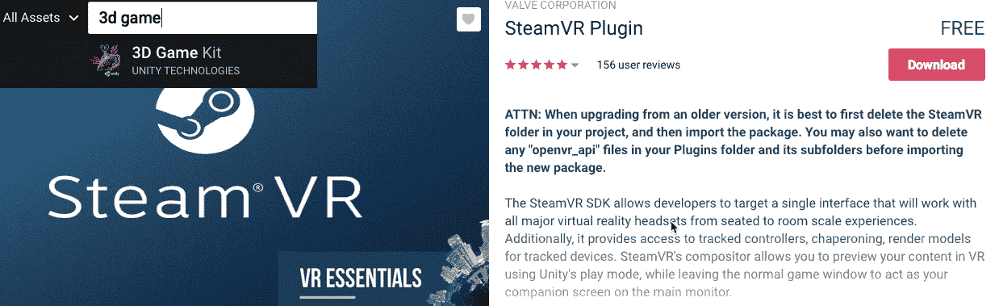

1.  下载并导入包（导入前会警告你备份...）。

1.  从任何弹出窗口中选择你喜欢的选项：

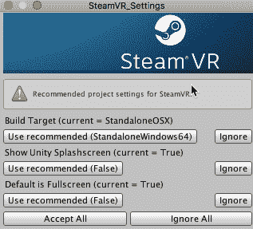

1.  将从文件夹：项目 | SteamVR | 预制件中的[CameraRig]预制件的副本拖入场景。你会看到一个代表你的房间设置的 3D 空间（我们的示例显示了站立模式房间设置的基于矩形的空間）：

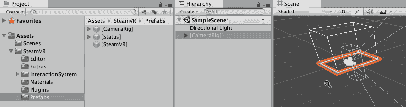

1.  运行场景，戴上你的 VR 头戴式设备，拿起你的手控制器。你应该在虚拟空间中看到你的手控制器位置、扳机设置等的 3D 表示。

1.  在你的场景中导入/创建 3D 对象 - 例如，将**3D 立方体**添加到 CameraRig 房间空间内的场景中。

1.  运行场景，尝试移动虚拟手控制器与 3D 立方体碰撞：

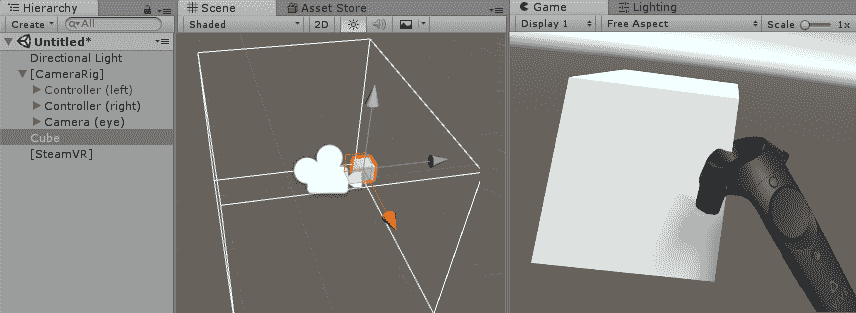

1.  通过向 3D 立方体（并关闭重力）添加刚体组件来测试物理，将 Box Collider 添加到 GameObject Controller（右侧）并缩小。

1.  运行场景 - 您应该能够使用虚拟手控制器推动**3D 立方体**。

# 它是如何工作的...

您已经学会了设置 Vive 并定位和安装 Steam VR 软件包。

此软件包包含预制件，以便头戴设备和手持设备在您设置的站立/房间空间中工作。

您创建了一个包含 Vive 预制件的 Unity 项目。然后您向场景中添加了一个 3D 立方体，并通过向立方体添加碰撞器和手控制器 GameObject 与之交互。

这是在 Unity 2017.4.9 LTS 上测试的，因为当时它无法与 2018 版本完全兼容。

# 还有更多...

这里有一些进一步改进此菜谱的建议。

# 探索免费的 VR/XR 样本/教程

一些优秀的免费样本 VR 项目资源包括以下：

+   Unity Technologies VR 样本：[`assetstore.unity.com/packages/essentials/tutorial-projects/vr-samples-51519`](https://assetstore.unity.com/packages/essentials/tutorial-projects/vr-samples-51519)

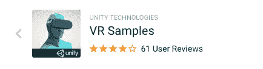

+   来自**雷·温德利克**的关于 Vive 和 Unity 的优秀教程：[`www.raywenderlich.com/792-htc-vive-tutorial-for-unity`](https://www.raywenderlich.com/792-htc-vive-tutorial-for-unity)

+   Valve Lab Renderer 在 Unity **Asset Store** 上的链接：[`assetstore.unity.com/packages/tools/the-lab-renderer-63141`](https://assetstore.unity.com/packages/tools/the-lab-renderer-63141)

+   在 Unity **Asset Store** 上启用 Vive 输入实用工具：[`assetstore.unity.com/packages/tools/integration/vive-input-utility-64219`](https://assetstore.unity.com/packages/tools/integration/vive-input-utility-64219)

# 使用 Oculus Rift 进行设置

Oculus Rift 的设置与 Vive 类似，尽管它实际上与 Unity 的集成更好。您需要执行以下操作：

1.  安装 Oculus 运行时。

1.  设置红外摄像头所需的房间/站立模式。

1.  无需下载任何包，也无需删除主相机。

您可以在 Oculus Rift Unity 文档网站上了解更多信息：[`developer.oculus.com/documentation/unity/latest/concepts/book-unity-gsg/`](https://developer.oculus.com/documentation/unity/latest/concepts/book-unity-gsg/)

# 如果使用轻量级渲染管线，则使用单次遍历

如果您使用的是**轻量级渲染脚本管线**，则在设置 XR 时，在设置中为**RenderingMethod***属性选择单次遍历，在菜单中选择：编辑 | 项目设置 | 玩家：


# 将 360 度视频添加到 VR 项目中

Google Earth VR 非常有趣！这张截图来自一个实时 VR 会话，显示了虚拟手控制器和一个虚拟屏幕菜单，显示有关 6 个建议访问地点的照片和文本：


经济实惠的 360 度摄像头意味着您可以轻松创建自己的，或者找到免费的在线 360 度图像和视频片段。在本教程中，我们将学习如何在 VR 项目中添加 360 度视频片段作为天空盒。您还将了解 360 度视频片段如何播放 3D 对象表面，包括球体的内部——有点像**谷歌地球****VR**模式，当您将球体举到头上查看其 360 度图像内容时：

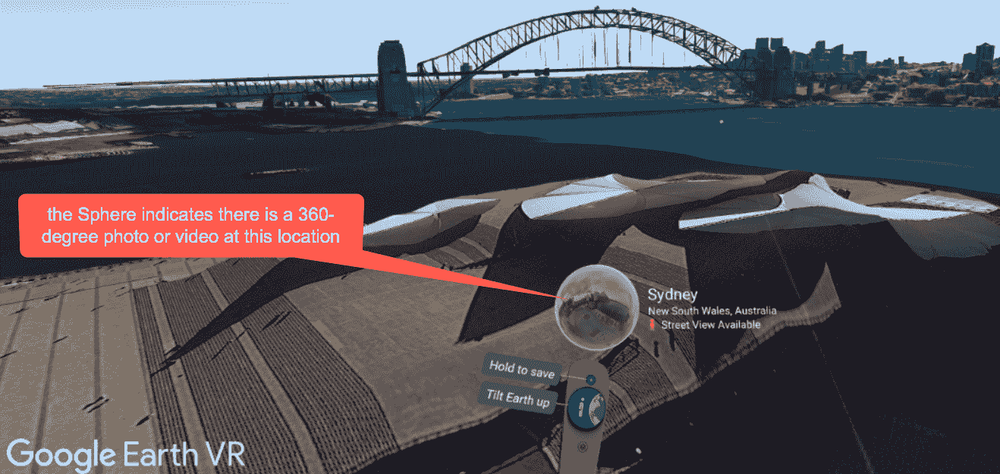

# 准备中

对于本教程，我们在`16_07`文件夹中提供了一个简短的`Snowboarding_Polar.mp4`视频。本项目基于上一个项目（一个基本的 VR 项目），因此复制该项目并在此基础上工作。

特别感谢 Kris Szczurowski 允许使用他的滑雪 360 度视频片段，并帮助这些 VR 项目教程。祝您博士学业顺利！

# 如何做...

要将 360 度视频添加到 VR 项目，请按照以下步骤操作：

1.  将您的 360 度极地格式视频片段导入 Unity 项目（在我们的示例中，这是`Snowboarding_Polar.mp4`）。

1.  在项目面板中选择视频资产，并在检查器中记下其分辨率（我们稍后会用到），例如，2,560 x 1,280：

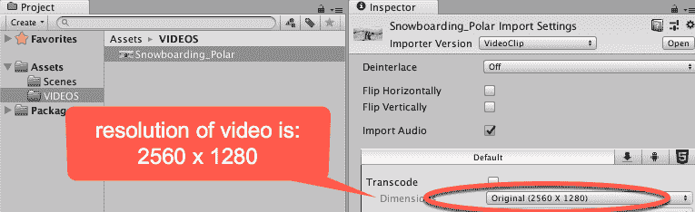

1.  通过选择菜单：创建 | 空对象创建一个名为 video-player 的新空 GameObject。

1.  在层级中选择视频播放器，并在检查器中，通过选择：添加组件 | 视频 | 视频播放器来添加**视频播放器**组件。

1.  从项目面板中，将您的视频资产文件（例如，`Snowboarding_Polar`）拖动到视频播放器组件的视频片段属性中。

1.  通过选择菜单：创建 | 渲染纹理创建一个名为`VideoRenderTexture`的新渲染纹理资产文件。

1.  将`VideoRenderTexture`的分辨率设置为与视频资产分辨率匹配，例如，2,560 x 1,280：

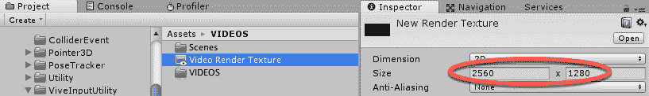

1.  在层级中选择 GameObject 视频播放器，并为视频播放器组件设置目标纹理为`VideoRenderTexture.`

1.  通过选择菜单：创建 | 材质创建一个名为`video_m`的新材质。

1.  在项目面板中选择`video_m`，将其**着色器**更改为天空盒 | 全景：

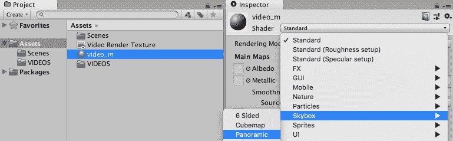

1.  在检查器中，对于球形 HDR 属性，点击选择按钮并选择纹理`VideoRenderTexture:`

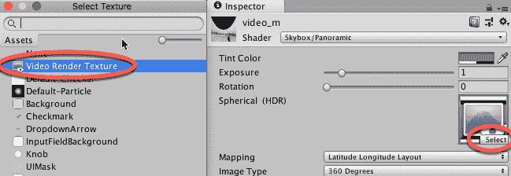

1.  打开照明设置面板，选择菜单：窗口 | 渲染 | 照明设置。在检查器中，将天空盒材质设置为`video_m:`

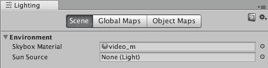

1.  播放场景，戴上您的 VR 头盔，您应该会看到 360 度视频在您周围播放。

# 它是如何工作的...

您已创建了一个具有视频播放器组件的 GameObject，并使其播放您的 360 度视频。您使此组件渲染与您的视频相同尺寸的渲染纹理。

您创建了一个 Skybox-panomaric **材料**，并将您的渲染纹理作为此**材料**的纹理。然后，您将此**材料**设置为光照设置的 Skybox。

这是在 Unity 2017.4.9 LTS 上测试的，因为当时它还没有完全与 2018 版本兼容。

# 还有更多...

这里有一些进一步改进这个菜谱的建议。

# 在 3D 对象表面上播放 360 度视频

要在 3D 对象表面上播放 360 度视频，执行上述步骤，但不要将 Skybox 设置为`video_m`。相反，将您的 3D 对象的 Mesh Renderer 组件的材料设置为`video_m`：

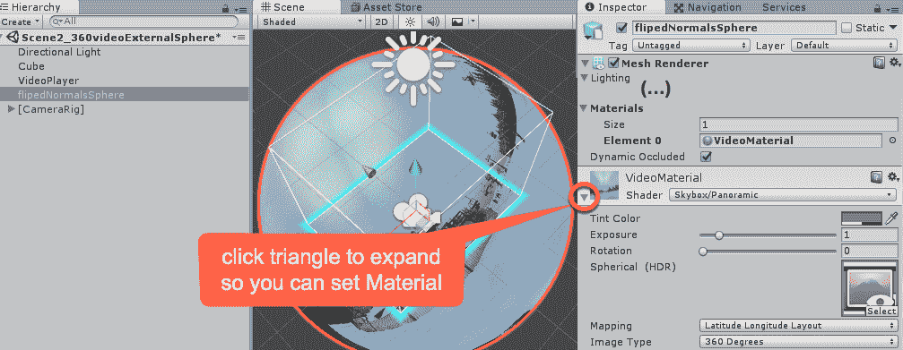

这适用于具有反转法线的 3D 对象，例如，一个可以从内部观看的空心 3D 球体。

# 在 VR 环境中处理 VR 内容——XR 编辑器

Unity 的一个令人兴奋的项目是 XR-Editor，这是一个 VR 环境，允许您在 VR 中编辑场景。该项目提供了 VR UI 元素的优秀示例，包括 3D 菜单和激光指针选择器。它允许您在环境中查看控制台报告并与 GameObject 的层次结构交互：在这个屏幕截图中，我们可以看到主工作区菜单显示在虚拟左手控制器上，而虚拟右手控制器被展示为一个旋转菜单，用于执行可以对当前选定的 GameObject 执行的操作。

在这个旋转菜单中当前选中了“选择父项”选项：

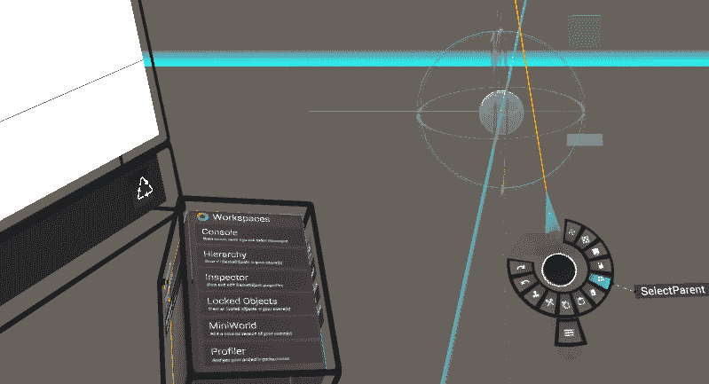

在这个菜谱中，我们将设置 XR-Editor 以在 Unity 项目中使用。

# 准备工作

从上一个菜谱中创建的基本 VR 项目的副本开始这个菜谱。

# 如何做到这一点...

在 XR 编辑器中，要在 VR 环境中处理 VR 内容，请按照以下步骤操作：

1.  通过选择菜单：窗口 | 包管理器，安装 TextMeshPro 包，并选择 Text Mesh Pro。

1.  从 Unity 博客页面上的链接下载 Editor XR 包：

    +   [`rebrand.ly/EditorVR-package`](http://rebrand.ly/EditorVR-package)

    +   [`blogs.unity3d.com/2016/12/15/editorvr-experimental-build-available-today/`](https://blogs.unity3d.com/2016/12/15/editorvr-experimental-build-available-today/)

1.  将 EditorXR-package 包导入到您的项目中。

1.  同意屏幕上的提示以修补输入管理器设置：

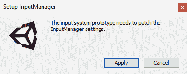

1.  应该在窗口菜单中有一个新的项目，窗口 | EditorXR。选择此菜单项：

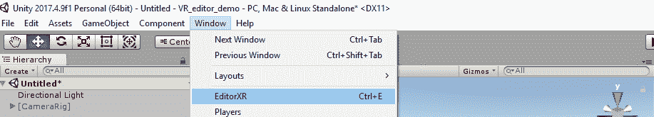

1.  现在应该创建了一个新的、浮动的 EditorXR 应用程序窗口：

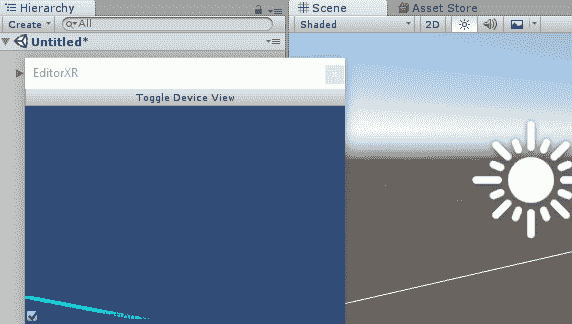

1.  穿上您的 VR 头盔并开始创作。**不要运行场景**——Editor XR 在**设计时间**工作，而不是**运行时间**，所以**不要播放**场景。

1.  您可以通过将一个虚拟手控制器上的激光指针指向另一个手控制器上的菜单栏来显示主菜单：

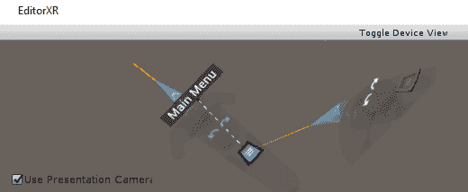

1.  你将获得一个类似立方体、多面且可旋转的主菜单，你可以用激光指针选择其中的项目。例如，在菜单对象的“工作空间”部分，有显示**控制台**、**层次结构**、**检查器**、**锁定对象**、**迷你世界**和**性能分析器**面板的选项：

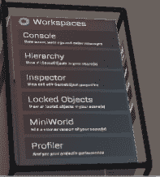

1.  你可以选择“原语”菜单，在那里你可以创建新的 3D 对象：

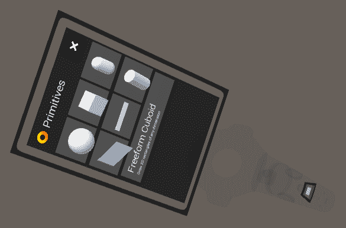

1.  当选择一个 GameObject 时，一个轮式菜单提供了一系列操作，例如删除或选择父对象，等等：

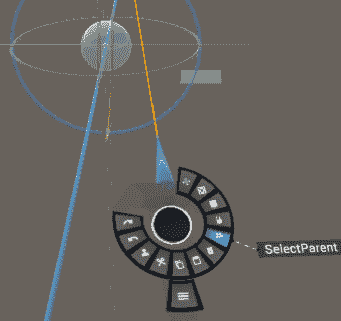

# 它是如何工作的...

在这个教程中，你学习了如何安装并开始与 Unity 的 Editor-XR 交互。

这是在 Unity 2017.4.9 LTS 版本上测试的，因为在写作时它还不能完全与 2018 版本兼容。

你可以在 Unity 博客上了解更多关于 Editor XR/VR 的信息：[`blogs.unity3d.com/2016/12/15/editorvr-experimental-build-available-today/`](https://blogs.unity3d.com/2016/12/15/editorvr-experimental-build-available-today/)[.](https://blogs.unity3d.com/2016/12/15/editorvr-experimental-build-available-today/)
