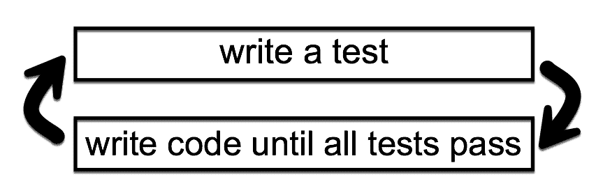
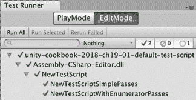
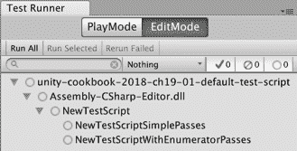
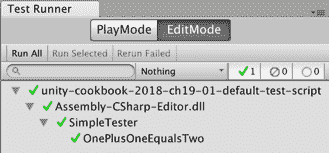
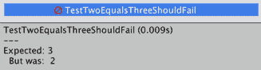
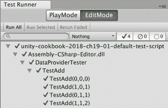
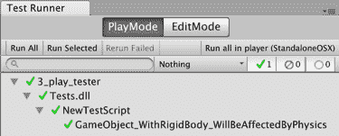
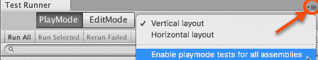
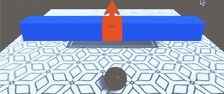
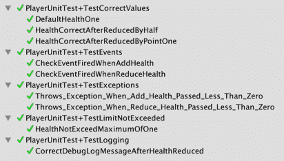

# 第十九章：自动化测试

在本章中，我们将涵盖以下内容：

+   生成和运行默认测试脚本类

+   执行一个简单的单元测试

+   使用数据提供者方法参数化测试

+   单元测试一个简单的健康脚本类

+   在 PlayMode 中创建和执行单元测试

+   在 PlayMode 中测试门动画

+   使用事件、日志和异常在 PlayMode 测试玩家健康条

# 简介

对于一个非常简单的计算机程序，我们可以编写代码，然后运行它，输入各种有效和无效的数据，看看程序是否按预期运行。这被称为先编码后测试的方法。然而，这种方法有几个显著的弱点：

+   每次我们更改代码，以及运行与我们要改进的代码相关的新测试时，我们必须运行所有旧测试，以确保没有引入意外的修改行为（换句话说，我们的新代码没有**破坏**程序的其他部分）

+   手动运行测试很耗时

+   我们依赖于人类在每次重新运行测试，而这个测试可能使用不同的数据，或者可能省略某些数据，或者不同的团队成员可能采取不同的测试方法

因此，即使是简单的程序（大多数都不是简单的），某种快速、自动化的测试系统也很有意义。

# 整体图景

有一种软件开发方法称为**测试驱动开发**（**TDD**），其中代码只有在所有测试通过后才会编写。因此，如果我们想添加或改进游戏程序的行为，我们必须以测试的形式指定我们想要的内容，然后程序员编写代码以通过测试。这避免了程序员编写不需要的代码或特征，或者花费时间过度优化本来可以过得去的事情等情况。这意味着游戏开发团队将工作方向指向所有成员都理解的目标，因为这些目标已经被指定为测试。

以下图表说明了基本的 TDD，即我们只编写代码直到所有测试通过。然后是编写更多测试的时间：



TDD（测试驱动开发）经常被总结为红-绿-重构：

+   **红色**：我们编写会失败测试的代码（换句话说，对于我们希望添加到系统中或改进的新功能/行为）

+   **绿色**：我们编写通过新测试（以及所有现有测试）的代码

+   **重构**：我们（可能）选择改进代码（并确保改进后的代码通过所有测试）

以下两种软件测试类型如下：

+   **单元测试**

+   **集成测试**

# 单元测试

**单元测试**测试代码的“单元”，这可能是一个单独的方法，但也可能包括在测试的方法和检查最终结果之间执行的一些其他计算机工作。

“单元测试是一段代码，它调用一个工作单元并检查该工作单元的一个特定结果。如果对最终结果的假设被证明是错误的，则单元测试失败。”

——罗伊·奥舍格罗夫（第 5 页，《单元测试的艺术》（第二版）。

单元测试应该是这样的：

+   自动化（一键运行）

+   快速

+   容易实现

+   容易阅读

+   独立执行（测试应相互独立）

+   被评估为通过或失败

+   相关内容将在明天

+   一致（每次都得到相同的结果！）

+   容易确定每个失败的测试中出了什么问题

大多数计算机语言都提供了 xUnit 单元测试系统，例如：

+   C#: NUnit

+   Java: JUnit

+   PHP: PHPUnit

Unity 提供了一种简单的方法在编辑器中（以及在命令行）编写和执行 NUnit 测试。

通常，每个单元测试都会分为三个部分，一个序列：

+   **准备**：设置任何需要的初始值（有时，我们只是给一个变量赋值以提高代码可读性）

+   **行动**：调用一些代码（如果适当，存储结果）

+   **断言**：对被调用的代码（以及任何存储的结果）进行断言

注意到单元测试方法的命名（按照惯例）相当冗长——它由许多描述其功能的单词组成。例如，你可能有一个名为`TestHealthNotGoAboveOne()`的单元测试方法。其理念是，如果测试失败，测试的名称应该给程序员一个非常好的关于正在测试的行为的想法，因此可以快速确定测试是否正确，如果正确，则在程序代码中查找被测试的内容。单元测试命名的另一个惯例是不使用数字——只使用单词——因此我们在测试方法的名称中写“一”、“二”等等。

# 集成测试（Unity 中的 PlayMode 测试）

**集成测试**涉及检查交互式软件组件的行为，例如，使用实时、真实文件系统或与网络或其他在计算机上运行的应用程序通信的组件。集成测试通常不如单元测试快，并且可能不会产生一致的结果（因为组件可能在不同的时间以不同的方式交互）。

**单元测试**和**集成测试**都很重要，但它们是不同的，应该被不同地对待。

Unity 提供了**Play Mode**测试，允许在 Unity 场景执行时进行集成测试。

你可以了解更多关于 Unity 测试的地方包括以下：

+   Unity Test Runner 和 PlayMode 文档页面：

    +   [`docs.unity3d.com/Manual/testing-editortestsrunner.html`](https://docs.unity3d.com/Manual/testing-editortestsrunner.html)

    +   [`docs.unity3d.com/Manual/PlaymodeTestFramework.html`](https://docs.unity3d.com/Manual/PlaymodeTestFramework.html)

+   “单元测试的艺术”书籍的网站（以及与测试相关的许多其他学习资源）：[`artofunittesting.com/`](http://artofunittesting.com/)

+   一篇关于 Unity 测试的精彩双篇文章教程，由 Unity 的 Tomek Paszek 撰写（讨论的是旧的 Unity 测试工具，但大部分内容仍然非常相关）：[`blogs.unity3d.com/2014/06/03/unit-testing-part-2-unit-testing-monobehaviours/`](https://blogs.unity3d.com/2014/06/03/unit-testing-part-2-unit-testing-monobehaviours/)

+   YouTube，你可以从 Infalliblecode 那里学到很多关于 Unity 测试（以及其他主题）的知识：[`www.youtube.com/infalliblecode`](https://www.youtube.com/infalliblecode)

+   CodeProject.com 对 TDD 和 NUnit 的介绍：[`www.codeproject.com/Articles/162041/Introduction-to-NUnit-and-TDD`](https://www.codeproject.com/Articles/162041/Introduction-to-NUnit-and-TDD)

# 生成默认测试脚本类

Unity 可以为你创建一个默认的 C#测试脚本，从而让你能够快速开始创建和执行项目中的测试：



# 如何做到这一点...

要生成默认测试脚本类，请按照以下步骤操作：

1.  在项目面板中，创建一个名为“Editor”的文件夹

1.  通过选择以下菜单显示测试运行器面板：窗口 | 通用 | 测试运行器

1.  确保在测试运行器面板中选中了“编辑模式”按钮

1.  确保在项目面板中选中了你的新编辑器文件夹

1.  在测试运行器面板中，点击当前文件夹中的“创建测试脚本”按钮

1.  你现在应该在编辑器文件夹中添加了一个新的 C#脚本

1.  要在脚本类中运行测试，请点击测试运行面板中的“运行所有”按钮

1.  你现在应该能在面板中看到所有的绿色勾号（勾选）

# 它是如何工作的...

Unity 会检查你在项目面板中是否选中了名为“编辑器”的文件夹，然后为你创建一个包含以下内容的 C# NewTestScript 脚本类：

```cs
    using UnityEngine;
     using UnityEngine.TestTools;
     using NUnit.Framework;
     using System.Collections;

     public class NewTestScript {
         [Test]
         public void NewTestScriptSimplePasses() {
             // Use the Assert class to test conditions.
         }

         // A UnityTest behaves like a coroutine in PlayMode
         // and allows you to yield null to skip a frame in EditMode
         [UnityTest]
         public IEnumerator NewTestScriptWithEnumeratorPasses() {
             // Use the Assert class to test conditions.
             // yield to skip a frame
             yield return null;
         }
     } 
```

在测试运行器面板中，你应该能看到脚本类及其两个方法列出。注意，测试运行器面板的第一行是 Unity 项目名称，第二行将显示`Assembly-CSharp-Editor.dll`，然后是你的脚本类名称，然后是每个测试方法：



每个测试/类的状态都有三个符号表示：

+   **空圆圈**：自脚本类上次更改以来未执行测试

+   **绿色勾号**（勾选）：测试成功通过

+   **红十字会**：测试未通过

# 还有更多...

这里有一些你不想错过的细节。

# 从项目面板的创建菜单创建默认测试脚本

创建默认单元测试脚本的其他方法如下：

+   从项目面板中选择以下菜单：创建 | 测试 | C# 测试脚本

# 编辑模式最小单元测试脚本框架

请注意，如果您只打算使用此脚本类在 EditMode 中进行测试，您可以删除第二个方法和一些使用语句，如下所示，以便为您提供一个最小的工作框架：

```cs
    using NUnit.Framework;

     public class UnitTestSkeleton
     {
         [Test]
         public void NewTestScriptSimplePasses()
         {
             // write your assertion(s) here
         }
     } 
```

# 简单的单元测试

就像打印 "hello world" 是大多数程序员的第一条程序语句一样，断言 1 + 1 = 2 可能是那些学习单元测试的人执行的最常见的第一个测试。这就是我们在本食谱中要创建的内容：



# 如何做...

要创建和执行一个简单的单元测试，请按照以下步骤操作：

1.  在项目面板中，创建一个名为 Editor 的文件夹。

1.  在您的编辑器文件夹中，创建一个新的 C# `SimpleTester.cs` 脚本类，包含以下内容：

```cs
    using NUnit.Framework;

     class SimpleTester
     {
         [Test]
         public void TestOnePlusOneEqualsTwo()
         {
             // Arrange
             int n1 = 1;
             int n2 = 1;
             int expectedResult = 2;

             // Act
             int result = n1 + n2;

             // Assert
             Assert.AreEqual(expectedResult, result);
         }
     } 
```

1.  通过选择以下菜单显示测试运行器面板：窗口 | 通用 | 测试运行器。

1.  确保测试运行器面板中的 `EditMode` 按钮被选中。

1.  点击运行所有。

1.  您应该看到您的单元测试执行的结果——如果测试成功完成，它旁边应该有一个绿色的勾号。

# 它是如何工作的...

您已声明 C# `SimpleTester.cs` 脚本类中的 `TestOnePlusOneEqualsTwo()` 方法是一个测试方法。当执行此测试方法时，Unity 测试运行器会按顺序执行每个语句，因此变量 `n1`、`n2` 和 `expectedResult` 被设置，然后计算 1 + 1 的结果存储在变量 result 中，最后（最重要的一点），我们断言执行该代码后应该为真的值。我们的断言表明 `expectedResult` 变量的值应该等于变量 result 的值。

如果断言为真，则测试通过，否则失败。通常，作为程序员，我们期望我们的代码通过，因此我们会非常仔细地检查每个失败，首先看看是否有明显的错误，然后可能检查测试本身是否正确（特别是如果它是一个新测试），然后开始调试并理解为什么我们的代码以这种方式表现，没有产生预期的结果。

# 更多内容...

这里有一些您不想错过的细节。

# 简短的测试，其中包含断言的值

对于简单的计算，一些程序员更喜欢通过直接将值放入断言中来编写更少的测试代码。所以，如下所示，我们的 1 + 1 = 2 测试可以表达为一个单一的断言，其中预期的值 2 和表达式 1 + 1 直接输入到 `AreEqual(...)` 方法调用中：

```cs
    using NUnit.Framework;

     class SimpleTester
     {
         [Test]
         public void TestOnePlusOneEqualsTwo()
         {
             // Assert
             Assert.AreEqual(2, 1 + 1);
         }
     } 
```

然而，如果您是测试的新手，您可能更喜欢先前的方法，其中准备、代码执行、结果存储以及关于这些结果的属性断言都清晰地按顺序排列在 **Arrange/Act/Assert** 序列中。

# 预期值后跟实际值

在使用断言比较值时，通常先给出预期的（正确）值，然后是实际值：

```cs
    Assert.AreEqual( <expectedValue>, <actualValue> ); 
```

虽然它对等式的真伪性质没有影响，等等，但在某些测试框架中测试失败时的消息可能会有所不同（例如，“得到 2 但期望 3”与“得到 3 但期望 2”有非常不同的含义）。因此，以下断言会输出一个可能会令人困惑的消息，因为 2 是我们期望的结果：

```cs
    public void TestTwoEqualsThreeShouldFail() {
         // Arrange
         int expectedResult = 2;

         // Act
         int result = 1 + 2; // 3 !!!

         // Assert
         Assert.AreEqual(result, expectedResult);
     } 
```

参考以下截图：



# 使用数据提供程序方法参数化测试

如果我们使用一系列测试数据来测试我们的代码，那么除了值之外，每个测试之间可能几乎没有区别。我们不必重复我们的 Arrange/Act/Assert 语句，可以重用单个方法，Unity 测试运行器将遍历测试数据集合，为每组测试数据运行测试方法。向测试方法提供多组测试数据的方法称为数据提供程序，我们将在本食谱中创建一个：



# 如何做...

要使用数据提供程序方法参数化测试，请按照以下步骤操作：

1.  在项目面板中，创建一个名为 Editor 的文件夹。

1.  在您的编辑器文件夹中，创建一个新的 C# `DataProviderTester.cs` 脚本类，包含以下内容：

```cs
    using NUnit.Framework;

     class DataProviderTester
     {
         [Test, TestCaseSource("AdditionProvider")]
         public void TestAdd(int num1, int num2, int expectedResult)
         {
             // Arrange
             // (not needed - since values coming as arguments)

             // Act
             int result = num1 + num2;

             // Assert
             Assert.AreEqual(expectedResult, result);
         }

         // the data provider
         static object[] AdditionProvider =
         {
             new object[] { 0, 0, 0 },
             new object[] { 1, 0, 1 },
             new object[] { 0, 1, 1 },
             new object[] { 1, 1, 2 }
         };
     } 
```

1.  通过选择以下菜单显示测试运行器面板：窗口 | 通用 | 测试运行器。

1.  确保在测试运行器面板中选择 EditMode 按钮。

1.  点击运行全部。

1.  您应该看到单元测试的执行结果。您应该看到`TestAdd(...)`测试方法的四组结果，每组对应于`AdditionProvider`方法提供的每个数据集。

# 它是如何工作的...

我们已经指出`TestAdd(...)`方法是一个具有编译器属性[Test]的测试方法。然而，在这种情况下，我们添加了额外的信息来声明此方法的数据源是`AdditionProvider`方法。

这意味着 Unity 测试运行器将从附加提供程序中检索数据对象，并为`TestAdd(...)`方法创建多个测试，每个测试对应于`AdditionProvider()`方法中的每组数据。

在测试运行器面板中，我们可以看到每个测试的行：

```cs
    TestAdd(0,0,0)
     TestAdd(1,0,1)
     TestAdd(0,1,1)
     TestAdd(1,1,2) 
```

# 单元测试简单的健康脚本类

让我们创建一些可能在游戏中使用，并且可以轻松进行单元测试的东西。不继承自 Monobehavior 的类更容易进行单元测试，因为可以使用关键字 new 创建实例对象。如果类经过精心设计，具有私有数据和具有明确声明依赖性参数的公共方法，那么编写一组测试来让我们有信心，这个类的对象在默认值以及有效和无效数据方面将按预期行为就变得容易了。

在这个菜谱中，我们将创建一个健康脚本类，以及对这个类的一系列测试。这种类可以用于游戏中的玩家健康，也可以用于人工智能（AI）控制的敌人：


# 如何做到这一点...

要对健康脚本类进行单元测试，请按照以下步骤操作：

1.  在项目面板中，创建一个 _Scripts 文件夹。

1.  在你的 _Scripts 文件夹中，创建一个新的 C# `Health.cs`脚本类，包含以下内容：

```cs
    using UnityEngine;
     using System.Collections;

     public class Health
     {
         private float health = 1;

         public float GetHealth()
         {
             return health;
         }

         public bool AddHealth(float heathPlus)
         {
             if(heathPlus > 0){
                 health += heathPlus;
                 return true;
             } else {
                 return false;
             }
         }

         public bool KillCharacter()
         {
             health = 0;
             return true;
         }
     } 
```

1.  在你的 _Scripts 文件夹中，创建一个名为 Editor 的新文件夹。

1.  在你的编辑器文件夹中，创建一个新的 C# `TestHealth.cs`脚本类，包含以下内容：

```cs
using NUnit.Framework;

class TestHealth {
   [Test]
   public void TestReturnsOneWhenCreated()   {
      // Arrange
      Health h = new Health ();
      float expectedResult = 1;

      // Act
      float result = h.GetHealth ();

      // Assert
      Assert.AreEqual (expectedResult, result);
   }     

    [Test]
    public void TestPointTwoAfterAddPointOneTwiceAfterKill()    {
        // Arrange
        Health h = new Health();
        float healthToAdd = 0.1f;
        float expectedResult = 0.2f;

        // Act
        h.KillCharacter();
        h.AddHealth(healthToAdd);
        h.AddHealth(healthToAdd);
        float result = h.GetHealth();

        // Assert
        Assert.AreEqual(expectedResult, result);
    }

    [Test]
    public void TestNoChangeAndReturnsFalseWhenAddNegativeValue()     {
        // Arrange
        Health h = new Health();
        float healthToAdd = -1;
        bool expectedResultBool = false;
        float expectedResultFloat = 1;

        // Act
        bool resultBool = h.AddHealth(healthToAdd);
        float resultFloat = h.GetHealth();

        // Assert
        Assert.AreEqual(expectedResultBool, resultBool);
        Assert.AreEqual(expectedResultFloat, resultFloat);
    }

    [Test]
    public void TestReturnsZeroWhenKilled()    {
        // Arrange
        Health h = new Health();
        float expectedResult = 0;

        // Act
        h.KillCharacter();
        float result = h.GetHealth();

        // Assert
        Assert.AreEqual(expectedResult, result);
    }

    [Test]
    public void TestHealthNotGoAboveOne()    {
        // Arrange
        Health h = new Health();
        float expectedResult = 1;

        // Act
        h.AddHealth(0.1f);
        h.AddHealth(0.5f);
        h.AddHealth(1);
        h.AddHealth(5);
        float result = h.GetHealth();

        // Assert
        Assert.AreEqual(expectedResult, result);
    }
}
```

1.  通过选择以下菜单来显示测试运行器面板：窗口 | 调试 | 测试运行器。

1.  确保在测试运行器面板中选择了 EditMode 按钮。

1.  点击运行全部。

1.  你应该能看到你的单元测试执行的结果。

# 它是如何工作的...

下面将描述每个 C#脚本类。

# 脚本类 Health.cs

这个脚本类有一个私有属性；由于它是私有的，只能通过方法来更改。它的初始值是 1.0，换句话说，100%的健康值：

+   `health` (float): 有效范围是从 0（死亡！）到 1.0（100%健康）

有 3 个公共方法：

+   `GetHealth()`: 这个方法返回当前健康浮点数的值（应该在 0 和 1.0 之间）

+   `AddHealth(float)`: 这个方法接受一个浮点数（要添加到健康值中的数量），并返回一个布尔值 true/false，表示值是否有效。注意这个方法的逻辑是接受 0 或更多的值（并将返回 true），但它将确保健康值的值永远不会超过 1

+   `KillCharacter()`: 这个方法将健康值设置为 0，并返回 true，因为在这个动作中总是成功的

# 脚本类 TestHealth.cs

这个脚本类有五个方法：

+   `TestReturnsOneWhenCreated()`: 这个测试检查当创建一个新的 Health 对象时，健康值的初始值是 1。

+   `TestPointTwoAfterAddPointOneTwiceAfterKill()`: 这个测试检查在杀死（健康值设置为 0）后，两次添加 0.1，健康值应该是 0.2。

+   `TestReturnsZeroWhenKilled()`: 这个测试检查在调用`KillCharacter()`方法后，健康值应立即设置为 0。

+   `TestNoChangeAndReturnsFalseWhenAddNegativeValue()`: 这个测试检查尝试向健康值添加负数时应该返回 false，并且健康值不应该发生变化。这个方法是一个具有多个断言（但都与操作相关）的测试示例。

+   `TestHealthNotGoAboveOne()`: 这个测试验证即使向健康值添加了很多值，总数超过 1.0，`GetHealth()`返回的值也是 1。

希望当你运行它们时，所有的测试都能通过，这会让你对`Health.cs`脚本类中的逻辑实现是否按预期工作有一定的信心。

# 在游戏模式中创建和执行单元测试

将游戏的大部分逻辑编写为隔离的、非 Monobehavior 类，这些类在编辑模式下易于单元测试。然而，游戏中的某些逻辑与游戏运行时发生的事情有关。例如，包括物理、碰撞和基于时间的活动。我们在 Play Mode 测试这些游戏的部分。

在这个菜谱中，我们将创建一个非常简单的 Play Mode 测试，以检查物理对 RigidBody 的影响（基于 Unity 文档中的示例）：



# 如何做...

要在**Play**模式下创建和执行单元测试，请按照以下步骤操作：

1.  通过选择以下菜单显示测试运行器面板：窗口 | 通用 | 测试运行器

1.  为所有汇编启用 PlayMode 测试。通过显示测试运行器面板右上角的下拉菜单，然后选择为所有汇编启用 Playmode 测试（对任何有关重新启动编辑器的消息点击确定）：



1.  现在，重新启动 Unity 编辑器（只需关闭应用程序，然后使用项目重新打开它）。

在启用 PlayMode 后重新启动 Unity 编辑器应用程序非常重要。如果你没有这样做，那么你可能无法找到你的 PlayMode 测试脚本类，它们可以看到（并引用）你的 Monobehavior 类。

1.  确保在测试运行器面板中选择了 PlayMode 按钮。

1.  在测试运行器面板中，点击创建 PlayMode 测试汇编文件夹按钮。应该已经创建了一个名为 Tests 的新文件夹。

1.  在项目面板中，打开`Tests`文件夹。它应该包含一个汇编定义文件 Tests.asmdef。

1.  在测试运行器面板中，点击当前文件夹中创建测试脚本按钮 – 你可能希望将此脚本重命名为默认名称，`NewTestScript`。

1.  编辑你的新测试脚本，将内容替换为以下内容：

```cs
    using UnityEngine;
     using UnityEngine.TestTools;
     using NUnit.Framework;
     using System.Collections;

     public class NewTestScript
     {
         [UnityTest]
         public IEnumerator GameObject_WithRigidBody_WillBeAffectedByPhysics()
         {
             // Arrange
             var go = new GameObject();
             go.AddComponent<Rigidbody>();
             var originalPosition = go.transform.position.y;

             // Act
             yield return new WaitForFixedUpdate();

             // Assert
             Assert.AreNotEqual(originalPosition, go.transform.position.y);
         }
     } 
```

1.  点击运行全部。

1.  在层次结构中，你会看到创建了一个临时场景（命名为类似于 InitTestScene6623462364 的东西），并且创建了一个名为基于代码的测试运行器的 GameObject。

1.  在游戏面板中，你会短暂地看到消息 显示 1 无相机渲染。

1.  你应该看到你的单元测试执行的结果——如果测试成功完成，它旁边应该有一个绿色的勾号。

# 它是如何工作的...

带有`[UnityTest]`属性的函数作为协程运行。协程有暂停执行（当遇到 yield 语句时）并将控制权返回给 Unity 的能力，但然后在再次调用时从上次离开的地方继续（例如，下一帧、第二帧或任何其他）。yield 语句表示在哪个语句之后以及暂停执行多长时间。不同类型的 yield 的例子包括：

+   等待直到下一帧：`null`

+   等待给定的时间长度：`WaitForSeconds(<seconds>)`

+   等待下一个固定更新时间周期（由于帧率不同，物理不会在每一帧应用）：`WaitForFixedUpdate()`

方法`GameObject_WithRigidBody_WillBeAffectedByPhysics()`创建一个新的 GameObject，并将其附加一个 RigidBody。它还存储了原始的 Y 位置。yield 语句使 PlayMode 测试运行器等待下一个固定更新周期开始时物理开始。最后，断言原始 Y 位置不等于新的 Y 位置（在物理固定更新之后）。由于 RigidBody 的默认设置是应用重力，这是一个很好的测试，以验证物理是否被应用于新对象（换句话说，一旦应用了物理，它应该已经开始下落）。

# 测试门动画的 PlayMode

在上一个食谱中学习了 PlayMode 测试的基础知识后，现在让我们测试一下在游戏中可能会遇到的不平凡内容。在这个食谱中，我们将创建一个 PlayMode 测试，以确保当玩家的球体对象进入碰撞体时，门开启动画能够播放。

提供了一个场景，玩家的球体初始化为向红色门滚动。当球体击中碰撞体（`OnTriggerEnter`事件）时，一些代码将门的 Animator Controller Opening 变量设置为 true，从而将门从关闭状态过渡到开启状态，如以下截图所示：



应感谢地面纹理的创作者；它由 Starline 设计，并在[Freepik.com](http://Freepik.com)发布。

# 准备工作

对于这个食谱，已经在`19_06`文件夹中提供了一个 Unity 包 `(doorScene.unitypackage)`。

# 如何操作...

要测试门动画的 PlayMode，请按照以下步骤操作：

1.  创建一个新的 Unity 项目，并删除默认的 Scenes 文件夹。

1.  导入提供的 Unity 包 (doorScene.unitypackage)。

1.  将以下场景 doorScene 和 menuScene 添加到项目构建中（顺序无关紧要）。

1.  确保当前打开的场景是 menuScene。

1.  通过选择以下菜单显示测试运行器面板：窗口 | 通用 | 测试运行器

1.  为所有程序集启用 Playmode 测试。通过在测试运行器面板右上角显示下拉菜单，并选择“为所有程序集启用 Playmode 测试”（点击 OK 以确认任何有关重启编辑器的消息）。

1.  现在重新启动 Unity 编辑器（只需关闭应用程序，然后使用项目重新打开它）。

1.  确保在测试运行器面板中选择了 PlayMode 按钮。

1.  在项目面板中，选择顶级文件夹 Assets。

1.  在测试运行器面板中，点击“创建 PlayMode 测试程序集文件夹”按钮。应该创建了一个名为 Tests 的新文件夹。

1.  在项目面板中，打开`Tests`文件夹。它应该包含一个程序集定义文件`Tests.asmdef`。

1.  在测试运行器面板中，点击“在当前文件夹中创建测试脚本”按钮。将此脚本类重命名为`DoorTest`。

1.  编辑`DoorTest.cs`脚本类，将内容替换为以下：

```cs
    using System.Collections;
     using NUnit.Framework;
     using UnityEngine;
     using UnityEngine.SceneManagement;
     using UnityEngine.TestTools;

     public class DoorTest
     {
         const int BASE_LAYER = 0;
         private string initialScenePath;
         private Animator doorAnimator;
         private Scene tempTestScene;

         // name of scene being tested by this class
         private string sceneToTest = "doorScene";

         [SetUp]
         public void Setup()
         {
             // setup - load the scene
             tempTestScene = SceneManager.GetActiveScene();
         }
     } 
```

1.  将以下测试方法添加到`DoorTest.cs`中：

```cs
    [UnityTest]
     public IEnumerator TestDoorAnimationStateStartsClosed()
     {
         // load scene to be tested
         yield return SceneManager.LoadSceneAsync(sceneToTest, LoadSceneMode.Additive);
         SceneManager.SetActiveScene(SceneManager.GetSceneByName(sceneToTest));

         // Arrange
         doorAnimator = GameObject.FindWithTag("Door").GetComponent<Animator>();
         string expectedDoorAnimationState = "DoorClosed";

         // immediate next frame
         yield return null;

         // Act
         AnimatorClipInfo[] currentClipInfo = doorAnimator.GetCurrentAnimatorClipInfo(BASE_LAYER);
         string doorAnimationState = currentClipInfo[0].clip.name;

         // Assert
         Assert.AreEqual(expectedDoorAnimationState, doorAnimationState);

         // teardown - reload original temp test scene
         SceneManager.SetActiveScene(tempTestScene);
         yield return SceneManager.UnloadSceneAsync(sceneToTest);
     } 
```

1.  将以下测试方法添加到`DoorTest.cs`中：

```cs
    [UnityTest]
     public IEnumerator TestIsOpeningStartsFalse()
     {
         // load scene to be tested
         yield return SceneManager.LoadSceneAsync(sceneToTest, LoadSceneMode.Additive);
         SceneManager.SetActiveScene(SceneManager.GetSceneByName(sceneToTest));

         // Arrange
         doorAnimator = GameObject.FindWithTag("Door").GetComponent<Animator>();

         // immediate next frame
         yield return null;

         // Act
         bool isOpening = doorAnimator.GetBool("Opening");

         // Assert
         Assert.IsFalse(isOpening);

         // teardown - reload original temp test scene
         SceneManager.SetActiveScene(tempTestScene);
         yield return SceneManager.UnloadSceneAsync(sceneToTest);
     } 
```

1.  将以下测试方法添加到`DoorTest.cs`中：

```cs
    [UnityTest]
     public IEnumerator TestDoorAnimationStateOpenAfterAFewSeconds()
     {
         // load scene to be tested
         yield return SceneManager.LoadSceneAsync(sceneToTest, LoadSceneMode.Additive);
         SceneManager.SetActiveScene(SceneManager.GetSceneByName(sceneToTest));

         // wait a few seconds
         int secondsToWait = 3;
         yield return new WaitForSeconds(secondsToWait);

         // Arrange
         doorAnimator = GameObject.FindWithTag("Door").GetComponent<Animator>();
         string expectedDoorAnimationState = "DoorOpen";

         // Act
         AnimatorClipInfo[] currentClipInfo = doorAnimator.GetCurrentAnimatorClipInfo(BASE_LAYER);
         string doorAnimationState = currentClipInfo[0].clip.name;
         bool isOpening = doorAnimator.GetBool("Opening");

         // Assert
         Assert.AreEqual(expectedDoorAnimationState, doorAnimationState);
         Assert.IsTrue(isOpening);

         // teardown - reload original temp test scene
         SceneManager.SetActiveScene(tempTestScene);
         yield return SceneManager.UnloadSceneAsync(sceneToTest);
     } 
```

1.  点击“运行全部”。

1.  当测试运行时，你首先会在层次结构、游戏和场景面板中看到创建了一个临时场景，然后是门场景正在运行，球体正滚向红色的门。

1.  你应该能看到你的单元测试执行的结果——如果所有测试都成功完成，每个测试旁边应该有绿色的勾号（检查标记）。

# 它是如何工作的...

你添加了两个场景到构建中，因此它们可以在 PlayMode 测试期间使用 SceneManager 在我们的脚本中选择。

我们打开了 menuScene，以便在 PlayMode 测试期间清楚地看到 Unity 运行不同的场景——测试完成后，我们会看到 menu 场景被重新打开。

存在一个在每次测试之前执行的`SetUp()`方法。SetUp 和 TearDown 方法在每次测试前准备事情和测试后重置事物回原状非常有用。不幸的是，例如在每次测试前加载我们的门场景，然后在测试后重新加载菜单，需要等待场景加载过程完成。我们无法在`SetUp()`和`TearDown()`方法中放置 yield 语句，所以你会看到每个测试在每个测试的开始和结束时都会重复场景加载：

```cs
// load scene to be tested
 yield return SceneManager.LoadSceneAsync(sceneToTest, LoadSceneMode.Additive);
     SceneManager.SetActiveScene(SceneManager.GetSceneByName(sceneToTest));

 // Arrange-Act-Assert goes here

 // teardown - reload original temp test scene
 SceneManager.SetActiveScene(tempTestScene);
 yield return SceneManager.UnloadSceneAsync(sceneToTest); 
```

对于每个测试，我们等待，要么是单个帧（返回`null`），要么是几秒钟（返回`return new WaitForSeconds(...)`）。这确保了在测试开始运行之前，所有对象都已创建并且物理引擎已启动。前两个测试检查初始条件，换句话说，门开始于 DoorClosed 动画状态，并且 Animation Controller 的`isOpening`变量为 false。

最后一个测试等待几秒钟（这足以让球体滚到门前并触发开启动画），并测试门是否进入/已进入 DoorOpen 动画状态，以及 Animation Controller 的`isOpening`变量是否为 true。

如所见，PlayMode 测试比单元测试要复杂得多，但它意味着我们有一种方法来测试实际的游戏对象交互，当计时器和物理引擎运行时。正如这个示例所示，我们还可以为 PlayMode 测试加载自己的场景，无论是专门创建来测试交互的特殊场景，还是最终游戏构建中要包含的实际场景。

# 使用事件、日志和异常进行 PlayMode 和单元测试玩家生命条

在这个菜谱中，我们将许多不同类型的测试组合到许多游戏的一个功能上——一个表示玩家数值生命值的视觉生命条（在这种情况下，一个从 0.0 到 1.0 的浮点数）。尽管这个菜谱并没有全面测试生命条的各个方面，但它提供了一个很好的示例，说明我们可以如何使用 Unity 测试工具来测试游戏的不同部分。

提供了一个包含以下内容的 Unity 包：

+   `Player.cs`：一个玩家脚本类，管理玩家生命值，并使用委托和事件将健康变化发布到任何监听的**视图**类

+   两个**视图**类，它们注册以监听玩家生命值变化事件：

    +   `HealthBarDisplay.cs`：这个脚本更新 UI 图像的填充量，以反映每个新收到的玩家生命值

    +   `HealthChangeLogger.cs`：这个脚本将关于接收到的新的玩家生命值的消息打印到 Debug.Log 文件中

+   `PlayerManager.cs`：一个管理脚本，它初始化玩家和 HealthChangeLogger 对象，并允许用户通过按上箭头键和下箭头键来改变玩家的生命值（模拟游戏中的治疗/伤害）

+   一个包含 2 个 UI 图像的场景——一个是生命条轮廓（红色心形和黑色轮廓），另一个是填充图像——显示从深蓝色到浅蓝色再到绿色，表示从弱到强的生命值）

这个菜谱允许展示几种不同类型的测试：

+   进行 PlayMode 测试，以检查显示的 UI 图像的实际`fillAmount`是否与玩家生命值的 0.0 到 1.0 范围相匹配

+   单元测试，以检查玩家生命值是否以正确的默认值开始，并在调用`AddHealth(...)`和`ReduceHealth(...)`方法后正确增加和减少

+   单元测试，以检查玩家对象是否发布了健康变化事件

+   单元测试，以检查预期的消息是否记录在`Debug.Log`中

+   单元测试，以检查如果将负值传递给玩家的`AddHealth(...)`或`ReduceHealth(...)`方法，是否会抛出参数范围异常。这在上面的屏幕截图中得到了演示：


感谢 Pixel Art Maker 提供的生命条图像：[`pixelartmaker.com/art/49e2498a414f221`](http://pixelartmaker.com/art/49e2498a414f221)

# 准备工作

对于这个菜谱，在`19_07`文件夹中提供了一个 Unity 包（`healthBarScene.unitypackage`）。

# 如何操作...

要对玩家生命条进行 PlayMode 和单元测试，请按照以下步骤操作：

1.  创建一个新的 Unity 项目，创建一个新的空场景，并删除默认的 Scenes 文件夹。

1.  导入提供的 Unity 包（`healthBarScene.unitypackage`）。

1.  打开 HealthBarScene 场景。

1.  将 HealthBarScene 添加到项目构建中（菜单：文件 | 构建设置 ...）。

1.  通过选择以下菜单来显示测试运行器面板：窗口 | 通用 | 测试运行器。

1.  为所有程序集启用测试模式。通过在测试运行器面板右上角显示下拉菜单，并选择“为所有程序集启用测试模式（点击 OK 以确认重启编辑器）”来完成此操作。

1.  现在重新启动 Unity 编辑器（只需关闭应用程序，然后使用项目重新打开它）。

1.  确保在测试运行器面板中选择了“测试模式”按钮。

1.  在项目面板中，选择顶级文件夹“Assets”。

1.  在测试运行器面板中，点击“创建测试模式测试程序集文件夹”按钮。应该已经创建了一个名为 Tests 的新文件夹。

1.  确保在项目面板中选择了“Assets”文件夹。创建一个名为 PlayModeTests 的新文件夹（现在它应该出现在“Assets”文件夹中）。

1.  确保在项目面板中选择了“PlayModeTests”文件夹。在测试运行器面板中，点击“在当前文件夹中创建测试脚本”按钮。将此脚本类重命名为`HealthBarPlayModeTests`。

1.  编辑`HealthBarPlayModeTests.cs`脚本类，将内容替换为以下：

```cs
    using UnityEngine;
     using UnityEngine.UI;
     using UnityEngine.TestTools;
     using NUnit.Framework;
     using System.Collections;
     using UnityEngine.SceneManagement;

     [TestFixture]
     public class HealthBarPlayModeTests
     {
         private Scene tempTestScene;

         // name of scene being tested by this class
         private string sceneToTest = "HealthBar";

         [SetUp]
         public void Setup()
         {
             // setup - load the scene
             tempTestScene = SceneManager.GetActiveScene();
         }
     } 
```

1.  在`HealthBarPlayModeTests.cs`中添加以下测试：

```cs
   [UnityTest]
     public IEnumerator TestHealthBarImageMatchesPlayerHealth()
     {
         // load scene to be tested
         yield return SceneManager.LoadSceneAsync(sceneToTest, LoadSceneMode.Additive);
         SceneManager.SetActiveScene(SceneManager.GetSceneByName(sceneToTest));

         // wait for one frame
         yield return null;

         // Arrange
         Image healthBarFiller = GameObject.Find("image-health-bar-filler").GetComponent<Image>();
         PlayerManager playerManager = GameObject.FindWithTag("PlayerManager").GetComponent<PlayerManager>();
         float expectedResult = 0.9f;

         // Act
         playerManager.ReduceHealth();

         // Assert
         Assert.AreEqual(expectedResult, healthBarFiller.fillAmount);

         // teardown - reload original temp test scene
         SceneManager.SetActiveScene(tempTestScene);
         yield return SceneManager.UnloadSceneAsync(sceneToTest);
     } 
```

1.  点击“运行所有”。

1.  当测试运行时，你首先会在“层次结构”、“游戏”和“场景”面板中看到创建了一个临时场景，然后运行带有可视健康条的 HealthBarScene。

1.  你应该看到你的测试模式测试执行的结果——如果测试成功完成，应该有一个绿色的勾号（勾选标记）。

1.  确保在项目面板中选择了“Assets”文件夹。创建一个名为 Editor 的新文件夹（现在它应该出现在“Assets”文件夹中）。

1.  确保在项目面板中选择了“Editor”文件夹。在测试运行器面板中，点击“在当前文件夹中创建测试脚本”按钮。将此脚本类重命名为`EditModeUnitTests`。

1.  编辑`EditModeUnitTests.cs`脚本类，将内容替换为以下：

```cs
    using System;
     using UnityEngine.TestTools;
     using NUnit.Framework;
     using UnityEngine;

     public class EditModeUnitTests
     {

         // inner unit test classes go here

     } 
```

1.  在`EditModeUnitTests.cs`中的`EditModeUnitTests`类内部添加以下类和基本测试：

```cs
    public class TestCorrectValues
     {
         [Test]
         public void DefaultHealthOne()
         {
             // Arrange
             Player player = new Player();
             float expectedResult = 1;

             // Act
             float result = player.GetHealth();

             // Assert
             Assert.AreEqual(expectedResult, result);
         }

         [Test]
         public void HealthCorrectAfterReducedByPointOne()
         {
             // Arrange
             Player player = new Player();
             float expectedResult = 0.9f;

             // Act
             player.ReduceHealth(0.1f);
             float result = player.GetHealth();

             // Assert
             Assert.AreEqual(expectedResult, result);
         }

         [Test]
         public void HealthCorrectAfterReducedByHalf()
         {
             // Arrange
             Player player = new Player();
             float expectedResult = 0.5f;

             // Act
             player.ReduceHealth(0.5f);
             float result = player.GetHealth();

             // Assert
             Assert.AreEqual(expectedResult, result);
         }
     } 
```

1.  在`EditModeUnitTests.cs`中的`EditModeUnitTests`类内部添加以下类和限制测试：

```cs
    public class TestLimitNotExceeded
     {
         [Test]
         public void HealthNotExceedMaximumOfOne()
         {
             // Arrange
             Player player = new Player();
             float expectedResult = 1;

             // Act
             player.AddHealth(1);
             player.AddHealth(1);
             player.AddHealth(0.5f);
             player.AddHealth(0.1f);
             float result = player.GetHealth();

             // Assert
             Assert.AreEqual(expectedResult, result);
         }
     } 
```

1.  在`EditModeUnitTests.cs`中的`EditModeUnitTests`类内部添加以下类和事件测试：

```cs
    public class TestEvents
     {
         [Test]
         public void CheckEventFiredWhenAddHealth()
         {
             // Arrange
             Player player = new Player();
             bool eventFired = false;

             Player.OnHealthChange += delegate
             {
                 eventFired = true;
             };

             // Act
             player.AddHealth(0.1f);

             // Assert
             Assert.IsTrue(eventFired);
         }

         [Test]
         public void CheckEventFiredWhenReduceHealth()
         {
             // Arrange
             Player player = new Player();
             bool eventFired = false;

             Player.OnHealthChange += delegate
             {
                 eventFired = true;
             };

             // Act
             player.ReduceHealth(0.1f);

             // Assert
             Assert.IsTrue(eventFired);
         }
     } 
```

1.  在`EditModeUnitTests.cs`中的`EditModeUnitTests`类内部添加以下类和异常测试：

```cs
    public class TestExceptions
     {
         [Test]
         public void Throws_Exception_When_Add_Health_Passed_Less_Than_Zero()
         {
             // Arrange
             Player player = new Player();

             // Act

             // Assert
             Assert.Throws<ArgumentOutOfRangeException>(
                 delegate
                 {
                     player.AddHealth(-1);
                 }
             );
         }

         [Test]
         public void Throws_Exception_When_Reduce_Health_Passed_Less_Than_Zero()
         {
             // Arrange
             Player player = new Player();

             // Act

             // Assert
             Assert.Throws<ArgumentOutOfRangeException>(
                 () => player.ReduceHealth(-1)
             );
         }
   } 
```

1.  在`EditModeUnitTests.cs`中的`EditModeUnitTests`类内部添加以下类和日志测试：

```cs
    public class TestLogging
     {
         [Test]
         public void Throws_Exception_When_Add_Health_Passed_Less_Than_Zero()
         {
             Debug.unityLogger.logEnabled = true;

             // Arrange
             Player player = new Player();
             HealthChangeLogger healthChangeLogger = new HealthChangeLogger();
             string expectedResult = "health = 0.9";

             // Act
             player.ReduceHealth(0.1f);

             // Assert
             LogAssert.Expect(LogType.Log, expectedResult);
         }
     } 
```

你可以看到，内部类允许在测试运行器面板中视觉上对单元测试进行分组。



# 它是如何工作的...

让我们详细看看它是如何工作的。

# 测试模式测试

测试模式测试`TestHealthBarImageMatchesPlayerHealth()`加载`HealthBar`场景，获取 PlayerManager 实例对象的引用，PlayerManager 是标记为 PlayerManager 的 GameObject 的组件，并调用`ReduceHealth()`方法。此方法将玩家的健康值减少 0.1，因此从其起始值 1.0 变为 0.9。

PlayerManager GameObject 还有一个组件，是一个 C# `HealthBarDisplay` 脚本类的实例对象。此对象注册监听来自玩家类的发布事件。它还有一个公共 UI Image 变量，该变量已链接到场景中生命值填充图像的 UI Image。

当玩家的生命值减少到 0.9 时，它发布 `OnChangeHealth(0.9)` 事件。此事件被 `HealthBarDisplay` 对象实例接收，然后设置场景中链接的生命值填充图像的 fillAmount 属性。

`TestHealthBarImageMatchesPlayerHealth(`) PlayMode 测试获取名为 image-health-bar-filler 的对象实例的引用，将此引用存储在 `healthBarFiller` 变量中。测试断言是，expectedResult 值为 0.9 与场景中 UI Image 的实际 fillAmount 属性相匹配：

```cs
Assert.AreEqual(expectedResult, healthBarFiller.fillAmount); 
```

# 单元测试

有几个单元测试，通过将它们放在自己的类中，放在 `EditModeUnitTests` 脚本类中，进行分组。

+   `TestCorrectValues` 类:

    +   `DefaultHealthOne()`: 这个测试验证玩家的生命值的默认（初始值）是 1

    +   `HealthCorrectAfterReducedByPointOne()`: 这个测试验证当玩家的生命值减少到 0.1 时，它变成了 0.9

    +   `HealthCorrectAfterReducedByHalf()`: 这个测试验证当玩家的生命值减少到 0.5 时，它确实变成了 0.5

+   class `TestLimitNotExceeded`:

    +   `HealthNotExceedMaximumOfOne()`: 这个测试验证玩家的生命值不会超过 1，即使尝试将其初始值 1 增加 1、0.5 和 0.1

+   class `TestEvents`:

    +   `CheckEventFiredWhenAddHealth()`: 这个测试验证当玩家的生命值增加时，会发布 OnChangeHealth() 事件

    +   `CheckEventFiredWhenReduceHealth()`: 这个测试验证当玩家的生命值减少时，会发布 OnChangeHealth() 事件

+   class `TestLogging`:

    +   `CorrectDebugLogMessageAfterHealthReduced()`: 这个测试验证在玩家的生命值减少到 0.1 到 0.9 之后，Debug.Log 消息被正确记录

+   class `TestExceptions`:

    +   `Throws_Exception_When_Add_Health_Passed_Less_Than_Zero()`: 这个测试验证当将负值传递给 AddHealth(...) 玩家方法时，会抛出 ArgumentOutOfRangeException

    +   `Throws_Exception_When_Reduce_Health_Passed_Less_Than_Zero()`: 这个测试验证当将负值传递给 ReduceHealth(...) 玩家方法时，会抛出 ArgumentOutOfRangeException

这两个测试说明了命名测试的一个约定，即在方法名中的每个单词之间添加一个下划线 _ 字符，以提高可读性。

# 参见

在 Unity 文档中了解更多关于 LogAssert Unity 脚本引用的信息：

+   [`docs.unity3d.com/ScriptReference/TestTools.LogAssert.html`](https://docs.unity3d.com/ScriptReference/TestTools.LogAssert.html)

单元测试 C# 事件的方法是借鉴自 philosophicalgeek.com 上的一个帖子：

+   [`www.philosophicalgeek.com/2007/12/27/easily-unit-testing-event-handlers/`](http://www.philosophicalgeek.com/2007/12/27/easily-unit-testing-event-handlers/)

在这个健康条功能中，健康变化事件的委托-事件发布是一个发布者-订阅者设计模式的例子。在《第十七章》中了解更多关于设计模式和它们在 Unity 游戏中的实现，章节名为“额外功能和设计模式”。
