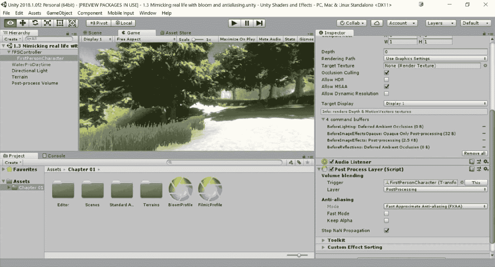

# 第一章：后期处理堆栈

在本章中，你将学习以下食谱：

+   安装后期处理堆栈

+   使用颗粒、渐晕和抗锯齿获得电影般的视觉效果

+   使用辉光和抗锯齿模仿现实生活

+   使用色彩分级设定氛围

+   使用雾气创建恐怖游戏的外观

# 简介

编写自己的着色器和效果以精细调整你的项目，使其看起来正是你想要的，这是我们将在本书的大部分内容中探讨的。然而，指出 Unity 已经内置了一些预构建的方式来获取用户喜欢通过后期处理堆栈使用的一些更常见的效果，这也是很好的。

对于只想快速启动的人来说，后期处理堆栈可以是一个极好的方式，让你在不编写任何额外代码的情况下调整游戏的外观。使用后期处理堆栈还可以帮助你了解着色器能做什么以及它们如何改进你的游戏项目，因为幕后，后期处理堆栈本身就是一个应用于屏幕的着色器，恰当地称为屏幕着色器。

# 安装后期处理堆栈

在我们能够使用后期处理堆栈之前，我们必须首先从新引入的包管理器中获取它。Unity 包是一个包含各种资产的单个文件，这些资产可以在 Unity 中以类似.zip 文件的方式使用。以前，Unity 使用资产商店与用户共享这些文件，但随着时间的推移，包管理器被添加以使用户能够轻松地从 Unity 获取免费内容。我们实际上将在第十二章 Shader Graph 中再次使用包管理器，但现在我们将使用它来安装它所包含的后期处理包。

# 准备工作

要开始这个食谱，你需要运行 Unity 并创建一个新的项目。本章还要求你有一个工作环境。本书提供的代码文件将包含一个基本的场景和内容，用于创建 Unity 的标准资产场景。

打开项目浏览器中的`Asset` | `Chapter 01` | `Scenes`文件夹内的`Chapter 1  `| `Starting Point`场景。如果一切顺利，你应该在游戏标签页中看到如下内容：

这是一个简单的环境，它将使我们能够轻松地看到在后期处理效果中做出的更改如何修改屏幕上绘制的内容。

如果你对学习如何创建所使用的环境感兴趣，请查看我的上一本书，*Unity 5.x 游戏开发蓝图*，也由 Packt Publishing 出版。

# 如何操作...

开始：

1.  通过前往窗口 | 包管理器（或按*Ctrl + 9*）打开包管理器：

1.  从列表视图，点击“全部”按钮以显示所有可能的包列表。一旦列表填充了所有选项，选择“后处理”选项：

1.  从那里，在菜单的右上角，点击安装 2.0.7-preview 按钮。可能需要等待一段时间，直到它完成内容的下载。一旦完成，你应该会返回到“在项目中选择”界面，现在你会在列表中看到添加了“后处理”：

1.  关闭“包”标签页，返回到场景窗口查看级别。然后，从层次窗口，我们需要选择带有我们的相机组件的对象，因为后处理堆栈需要知道我们想要修改哪个屏幕。如果你使用自己的项目，你可以选择默认 Unity 场景中附带的主相机对象，但正在使用的示例项目中，相机位于`FPSController`对象的子对象中。要选择它，点击名称旁边的箭头以展开对象的子对象，然后选择`FirstPersonCharacter`对象：

此对象上有相机组件，负责在游戏开始时将所看到的内容绘制到游戏标签页。

你可以在 Hierarchy 标签页中双击一个游戏对象，从 Scene 标签页将其相机缩放到其位置。这使得在大型游戏级别中查找事物变得非常容易。

1.  在对象被选中并且我们的相机组件附加到它之后，接下来我们需要通过进入 Component | Rendering | Post-process Layer 来向对象添加后处理行为组件：

1.  添加后，从 Inspector 标签页向下滚动到 Post Process Layer（脚本）组件，并在 Layer 下，将下拉菜单更改为`PostProcessing`。

1.  这告诉组件我们想要在屏幕上绘制哪些对象。在设置此属性时，对象必须将其 Layer 属性设置为`PostProcessing`才能被看到。

1.  要创建后处理体积，转到菜单并选择 GameObject | 3D Object | Post Process Volume。从那里，转到 Inspector 标签页，将 Layer 属性更改为`PostProcessing`。最后，为了便于工作，将 Position 更改为`0`，`0`，`0`，并在 Post Process Volume 组件下，勾选 Is Global 属性：

注意，体积有一个 Profile 属性。此属性将包含有关我们希望如何修改屏幕的信息。通过勾选 Is Global，我们表示这些信息应该始终绘制在对象上。通过取消勾选它，效果将仅在从放置体积的一定距离处可见。根据游戏的不同，这可能允许你极大地改变游戏在某些区域的外观，但我们目前只关心获得视觉效果。

# 使用颗粒、渐晕和景深获得电影般的视觉效果

现在我们已经安装了后处理堆栈，我们可以创建第一个后处理体积。新的后处理堆栈依赖于使用描述如何绘制的体积，无论是全局还是特定区域。

人们喜欢项目的外观之一是电影风格。这在诸如《未知的》系列和《侠盗猎车手 V》等标题中相当常用。它也在《左 4 死》系列中被非常有效地使用，因为它的创作者试图模仿基于游戏的 B 级僵尸电影。

# 准备工作

确保你在开始这个之前已经完成了“安装后处理堆栈”配方。

# 如何操作...

1.  我们首先通过在项目窗口中的`Assets` | `第一章`文件夹内右键单击并选择创建 | 后处理配置文件来创建一个新的后处理配置文件。一旦选择，它将允许我们重命名项目。继续并将名称设置为`FilmicProfile`：

如果你没有正确输入名称，你可以通过在项目选项卡中点击名称然后再次点击来重命名项目。

1.  一旦创建，你应该注意到，当选择时，检查器窗口现在将包含一个显示“添加效果...”（如前图所示）的按钮，这将允许我们增强通常绘制在屏幕上的内容。

1.  从层次结构选项卡中再次选择后处理体积对象，然后从检查器选项卡转到后处理体积组件，并将“配置文件”属性分配给刚刚创建的`FilmicProfile`：

注意，一旦设置了配置文件，添加效果...按钮也会在这里显示。我们可以在任何地方使用它，并且更改将被保存在文件中。

1.  要开始，点击“添加效果...”按钮并选择 Unity | 粒子选项。默认情况下，你只会看到带有勾选的粒子选项，因此点击箭头以展开其内容：

默认情况下，你会看到所有内容都是灰色的。为了使其影响任何内容，你必须点击左侧的复选框。你可以通过按屏幕上的全部或无按钮快速打开或关闭它们。

1.  在我们的情况下，勾选强度选项并将其设置为`0.2`。然后，勾选大小属性并将其设置为`0.3`。之后，切换到游戏选项卡以查看我们的调整所产生的影响：

1.  你会注意到屏幕比之前模糊得多。将强度降低到`0.2`，大小降低到`0.3`，并取消选中彩色选项。

与用户在 Unity 中通常的工作方式不同，由于后处理配置文件已归档，你可以在玩游戏时修改它们，停止游戏后，值仍然被保存。这可以用于调整值以实现你想要的精确外观。

1.  我们接下来想要调整的属性是 Vignette 属性。注意屏幕周围的变暗边缘。点击添加效果...并选择 Unity | Vignette。打开属性并将强度设置为`0.5`，平滑度设置为`0.35`：

1.  接下来，再次选择添加效果...，这次选择 Unity | 景深。勾选景深选项。一开始可能难以看到变化，但将焦点距离设置为`6`，焦距设置为`80`，你应该会注意到背景前的草地和远处的山现在变模糊了：

1.  现在，如果我们进入游戏本身，你应该能看到我们的影视风格正在发挥作用：

影视风格的最终效果

有了这些，我们现在有一个场景看起来比一开始更像电影了！

# 它是如何工作的...

每次我们将效果添加到后处理体积中，我们都是在覆盖原本应该显示在屏幕上的内容。

如果你曾经去过仍然使用胶片的电影院，你可能注意到了在电影播放时胶片上会有一些小颗粒。**颗粒**效果模拟了这种胶片颗粒，随着电影的播放，效果变得更加明显。这通常用于恐怖游戏，以模糊玩家的视野。

关于颗粒效果的信息，请查看：[`github.com/Unity-Technologies/PostProcessing/wiki/Grain`](https://github.com/Unity-Technologies/PostProcessing/wiki/Grain).

在电影界，**晕影**可能是由于使用了错误的镜头类型来达到你想要的效果，或者是因为你拍摄的画面宽高比不正确。在游戏开发中，我们通常使用晕影来产生戏剧效果，或者通过暗化屏幕边缘并/或降低其饱和度来让玩家专注于屏幕中心。

关于光晕效果的信息，请查看：[`github.com/Unity-Technologies/PostProcessing/wiki/Vignette`](https://github.com/Unity-Technologies/PostProcessing/wiki/Vignette).

**景深**设置基本上决定了什么会模糊，什么不会。想法是让重要的物品保持清晰，而背景中的物品则不清晰。

关于景深效果的信息，请查看：[`github.com/Unity-Technologies/PostProcessing/wiki/Depth-of-Field`](https://github.com/Unity-Technologies/PostProcessing/wiki/Depth-of-Field).

# 使用光晕和抗锯齿模拟真实生活

**光晕**光学效果旨在模仿现实世界中相机的成像效果，在光线区域内的物品会沿着边缘发光，从而压倒相机。光晕效果非常独特，你很可能在游戏中魔法或天堂般的区域看到过它。

# 准备工作

在开始这一步之前，请确保你已经完成了*安装 Post Processing Stack*的步骤。

# 如何实现...

1.  我们首先通过在项目窗口中的`Assets`文件夹内右键单击并选择创建 | 后处理配置文件来创建一个新的后处理配置文件。一旦选择，它将允许我们重命名项目。继续并将名称设置为`BloomProfile`。

1.  选择`后处理体积`对象，然后从检查器窗口中转到后处理体积组件，并将配置文件属性分配给刚刚创建的`BloomProfile`。

1.  之后，选择游戏标签页，如果尚未选择，以查看我们将在以下步骤中进行的更改的结果。

1.  选择添加效果...按钮，选择 Unity | Bloom。一旦效果被添加到后处理体积组件的覆盖部分，选择箭头打开其属性。检查强度属性并将其设置为`3`。之后，检查并设置阈值到`0.75`，软膝盖到`0.1`，半径到`3`：

1.  接下来，选择带有后处理图层组件的对象（在示例中，是`FPSController` | `FirstPersonCharacter`对象），然后从检查器选项卡向下滚动到后处理图层脚本。从那里，将抗锯齿属性下拉菜单更改为`快速近似抗锯齿`：

1.  之后，保存你的场景并点击播放按钮来检查你的项目：

使用 bloom 和抗锯齿的最终结果

# 它是如何工作的...

如前所述，bloom 会使明亮的东西更加明亮，同时为较亮区域添加光晕。在这个配方中，你可能注意到路径比之前要亮得多。这可以用来确保玩家会沿着路径到达游戏下一部分。

想了解更多关于 bloom 的信息，请查看：[`github.com/Unity-Technologies/PostProcessing/wiki/Bloom`](https://github.com/Unity-Technologies/PostProcessing/wiki/Bloom).

抗锯齿试图减少锯齿的出现，这是屏幕上线条出现锯齿状效果的原因。这通常是因为玩家使用的显示设备分辨率不够高，无法正确显示。抗锯齿将通过与附近的线条组合颜色来消除它们的突出，但代价是游戏看起来会模糊。

想了解更多关于抗锯齿以及每种模式意味着什么的信息，请查看：[`github.com/Unity-Technologies/PostProcessing/wiki/Anti-aliasing`](https://github.com/Unity-Technologies/PostProcessing/wiki/Anti-aliasing).

# 使用色彩分级设置氛围

改变场景氛围的最简单方法之一是通过改变场景使用的颜色。最好的例子之一是电影《黑客帝国》系列，其中现实世界总是带有蓝色调，而矩阵的计算机生成世界总是带有绿色调。我们可以通过使用色彩分级在我们的游戏中模仿这一点。

# 准备工作

在开始此操作之前，确保已经完成了`安装后处理堆栈`配方。

# 如何操作...

1.  我们首先通过在项目窗口的`资产`文件夹内右键单击并选择`创建`|`后处理配置文件`来创建一个新的后处理配置文件。一旦选择，它将允许我们重命名项目。继续并将名称设置为`ColorProfile`。

1.  选择`后处理体积`对象，然后从`检查器`窗口进入`后处理体积`组件，将`配置文件`属性分配给刚刚创建的`ColorProfile`。

1.  之后，选择`游戏`选项卡，如果尚未选择，以查看所做的更改结果。

1.  选择`添加效果...`按钮并选择`Unity | 色彩分级`。

1.  检查`模式`属性，将其设置为低定义范围（LDR）。从那里，你会看到许多可以用来调整屏幕上颜色的属性，类似于 Photoshop 的色调/饱和度菜单工作方式。检查`温度`属性并将其设置为`30`。之后，将`色调偏移`属性设置为`-20`，将`饱和度`设置为`15`：

1.  在进行更改后，进入游戏查看游戏时的效果：

使用色彩分级后的最终效果

注意之前非常绿色的环境现在变得温暖多了，比之前更黄。

关于色彩分级效果的更多信息，请查看：[`github.com/Unity-Technologies/PostProcessing/wiki/Color-Grading`](https://github.com/Unity-Technologies/PostProcessing/wiki/Color-Grading)。

# 使用雾气创建恐怖游戏外观

最有效地利用后处理堆栈功能的游戏类型之一是恐怖游戏。使用诸如景深来隐藏恐怖物体以及静态来使屏幕更具威胁性，这真的可以帮助你的游戏牢牢地定位在正确的位置，并提供你所追求的氛围。

# 准备工作

确保在开始此操作之前已经完成了`安装后处理堆栈`配方。

# 如何操作...

1.  我们首先通过在项目窗口的`资产`文件夹内右键单击并选择`创建`|`后处理配置文件`来创建一个新的后处理配置文件。一旦选择，它将允许我们重命名项目。继续并将名称设置为`HorrorProfile`。

1.  选择`后处理体积`对象，然后从`检查器`窗口进入`后处理体积`组件，将`配置文件`属性分配给刚刚创建的`HorrorProfile`。

1.  与之前的设置不同，尽管如此，雾气设置位于`照明`窗口中，可以通过进入`窗口`|`照明`来访问。

1.  从那里，滚动到最底部直到到达其他设置选项。一旦到达那里，检查雾气并将其颜色设置为接近天空盒的值。我使用了以下设置：

如果你从你的图形编辑软件中知道了颜色的十六进制值，你只需在颜色窗口的十六进制颜色属性中输入即可。

1.  接下来，将模式改为`指数`，并将密度改为`0.03`：

如你所见，它已经比之前更加恐怖了，但仍有更多选项我们可以更改。

1.  再次打开“HorrorProfile”，转到“检查器”选项卡。按下“添加效果...”按钮，选择 Unity | 环境遮挡。检查模式选项，并选择“可伸缩环境遮挡”。之后，将强度改为`2`，并将半径改为`20`：

1.  最后，光照通常对场景的主题也有很大的影响。如果你正在使用示例地图，请在“层次”选项卡中选择“方向光”对象，然后在“灯光组件”下的“检查器”选项卡中，将强度改为`0.5`，然后调整颜色为更暗的色调。（我使用了与*步骤 4*相同的颜色，十六进制值为`5F7684FF`。）

1.  保存你的游戏，然后启动它以查看所有更改的效果：

我们恐怖风格的最终结果

# 它是如何工作的...

环境遮挡选项将计算应该有额外阴影的区域。由于我们的场景中充满了树木，这将使底部比之前暗得多。

关于环境遮挡效果的更多信息，请查看：[`github.com/Unity-Technologies/PostProcessing/wiki/Ambient-Occlusion`](https://github.com/Unity-Technologies/PostProcessing/wiki/Ambient-Occlusion)。如果你对查看后处理堆栈的其他选项感兴趣，请查看：[`github.com/Unity-Technologies/PostProcessing/wiki`](https://github.com/Unity-Technologies/PostProcessing/wiki)。
