# 第二章：创建你的第一个着色器

在本章中，你将学习以下配方：

+   创建基本的标准着色器

+   向着色器添加属性

+   在表面着色器中使用属性

# 简介

本章将介绍当今游戏开发着色器管道中的一些更常见的漫反射技术。让我们想象一个在 3D 环境中被均匀涂成白色的立方体。即使使用的颜色在每个面上都相同，但由于光线来的方向和观察的角度不同，它们都会呈现出不同的白色阴影。通过使用着色器，这种额外的真实感在 3D 图形中得以实现，着色器是主要用于模拟光线工作的特殊程序。一个木制立方体和一个金属立方体可能共享相同的 3D 模型，但使它们看起来不同的正是它们使用的着色器。

本章将向你介绍 Unity 中的着色器编程。如果你对着色器几乎没有或没有先前的经验，那么这一章就是你需要的，以便了解着色器是什么，它们是如何工作的，以及如何自定义它们。到本章结束时，你将学会如何构建执行基本操作的基本着色器。掌握了这些知识，你将能够创建几乎任何表面着色器。

# 创建基本的标准着色器

在 Unity 中，当我们创建一个游戏对象时，我们通过使用**组件**来附加额外的功能。实际上，每个游戏对象都需要有一个变换组件；Unity 已经包含了一些组件，当我们编写扩展自`MonoBehaviour`的脚本时，我们创建自己的组件。

所有属于游戏的对象都包含一些影响其外观和行为的组件。虽然脚本决定了对象应该如何行为，但渲染器决定了它们应该在屏幕上如何显示。Unity 提供了多种渲染器，具体取决于我们试图可视化的对象类型；每个 3D 模型通常都附有一个`MeshRenderer`组件。一个对象应该只有一个渲染器，但渲染器本身可以包含多个材质。每个材质都是一个单一着色器的包装，是 3D 图形链中的最后一环。这些组件之间的关系可以在以下图中看到：

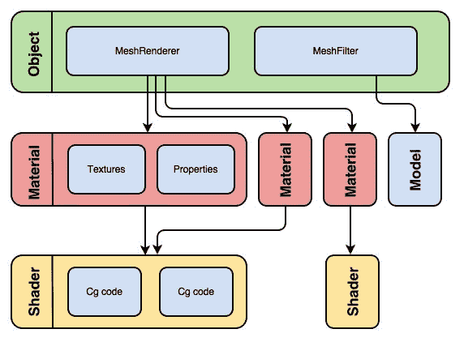

理解这些组件之间的区别对于理解着色器的工作方式至关重要。

# 准备工作

要开始这个配方，你需要运行 Unity 并打开一个项目。如前所述，这个食谱中还将包含一个 Unity 项目，因此你也可以使用那个项目，并且只需在逐步执行每个配方时添加你自己的自定义着色器即可。完成这些后，你现在就可以进入实时着色的奇妙世界了！

在我们开始第一个着色器之前，让我们创建一个小的场景供我们使用：

1.  通过导航到文件 | 新建场景来创建一个场景。

1.  一旦创建了场景，在 Unity 编辑器中通过导航到 GameObject | 3D Objects | Plane 创建一个平面作为地面。接下来，在层次结构标签页中选择对象，然后进入检查器标签页。从那里，右键点击 Transform 组件并选择重置位置选项：

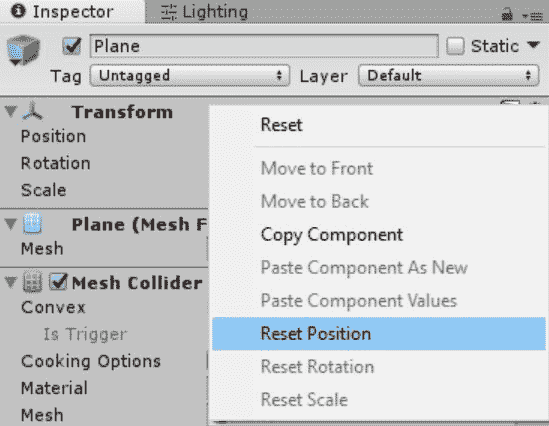

这将重置对象的定位属性为 `0`, `0`, `0`：

1.  为了更容易看到我们的着色器应用后的样子，让我们添加一些形状来可视化每个着色器的作用。通过导航到 GameObject | 3D Objects | Sphere 创建一个球体。创建完成后，选择它并进入检查器标签页。接下来，将 Position 改为 `0`, `1`, `0` 以使其位于世界原点（在 `0`, `0`, `0`）和之前创建的平面上方：

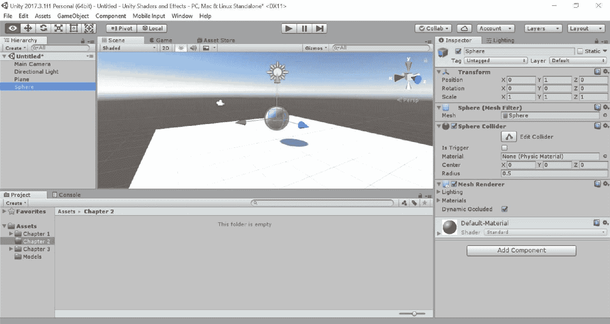

1.  一旦创建了球体，再创建两个球体，将它们放置在球体的左侧和右侧，位置分别为 `-2`, `1`, `0` 和 `2`, `1`, `0`：

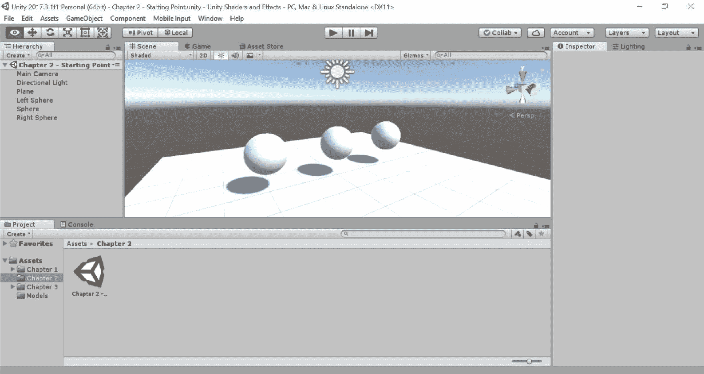

1.  最后，确认你有一个方向光（应该在层次结构标签页中可见）。如果没有，你可以通过选择 GameObject | Light | Directional Light 来添加一个，以便更容易看到你更改的效果以及你的着色器如何对光线做出反应。

如果你使用的是随烹饪书附带的 Unity 项目，你可以打开“第二章” | “起点”场景，因为它已经设置好了。

# 如何操作...

在场景生成后，我们可以继续到着色器编写步骤：

1.  在你的 Unity 编辑器的“项目”标签页中，右键点击“第二章”文件夹，然后选择创建 | 文件夹。

1.  通过右键点击你创建的文件夹并从下拉列表中选择重命名，或者通过选择文件夹并按键盘上的 *F2*，将其重命名为“着色器”。

1.  创建另一个文件夹并将其重命名为“材质”。

1.  右键点击“着色器”文件夹并选择创建 | 着色器 | 标准表面着色器。然后，右键点击“材质”文件夹并选择创建 | 材质。

1.  将着色器和材质都重命名为`StandardDiffuse`。

1.  通过双击文件启动 `StandardDiffuse` 着色器。这将自动为你启动一个脚本编辑器并显示着色器的代码。

你会看到 Unity 已经用一些基本代码填充了我们的着色器。默认情况下，这将为你提供一个接受一个纹理的 Albedo（RGB）属性的着色器。我们将修改这个基础代码，以便你可以学习如何快速开始开发你自己的自定义着色器。

1.  现在，让我们为我们的着色器创建一个自定义文件夹，以便从中选择。着色器中的第一行代码是我们必须提供给着色器的自定义描述，这样 Unity 才能在将着色器分配给材质时在着色器下拉列表中使其可用。我们已经将路径重命名为`Shader "CookbookShaders/StandardDiffuse"`，但您可以将其命名为任何您想要的名称，并且可以在任何时候重命名，所以请放心，目前不需要担心任何依赖关系。在脚本编辑器中保存着色器，并返回到 Unity 编辑器。当 Unity 识别到文件已更新时，它将自动编译着色器。此时您的着色器应该看起来是这样的：

```cs
Shader "CookbookShaders/StandardDiffuse" {
  Properties {
    _Color ("Color", Color) = (1,1,1,1)
    _MainTex ("Albedo (RGB)", 2D) = "white" {}
    _Glossiness ("Smoothness", Range(0,1)) = 0.5
    _Metallic ("Metallic", Range(0,1)) = 0.0
  }
  SubShader {
    Tags { "RenderType"="Opaque" }
    LOD 200

    CGPROGRAM
    // Physically based Standard lighting model, and enable shadows on all light types
    #pragma surface surf Standard fullforwardshadows

    // Use shader model 3.0 target, to get nicer looking lighting
    #pragma target 3.0

    sampler2D _MainTex;

    struct Input {
      float2 uv_MainTex;
    };

    half _Glossiness;
    half _Metallic;
    fixed4 _Color;

    // Add instancing support for this shader. You need to check 'Enable Instancing' on materials that use the shader.
    // See https://docs.unity3d.com/Manual/GPUInstancing.html for more information about instancing.
    // #pragma instancing_options assumeuniformscaling
    UNITY_INSTANCING_BUFFER_START(Props)
      // put more per-instance properties here
    UNITY_INSTANCING_BUFFER_END(Props)

    void surf (Input IN, inout SurfaceOutputStandard o) {
      // Albedo comes from a texture tinted by color
      fixed4 c = tex2D (_MainTex, IN.uv_MainTex) * _Color;
      o.Albedo = c.rgb;
      // Metallic and smoothness come from slider variables
      o.Metallic = _Metallic;
      o.Smoothness = _Glossiness;
      o.Alpha = c.a;
    }
    ENDCG
  }
  FallBack "Diffuse"
}
```

1.  从技术角度讲，这是一个基于**基于物理的渲染**（**PBR**）的表面着色器。正如其名所示，这种类型的着色器通过模拟光线击中物体时的物理行为来实现逼真效果。

1.  在您的着色器创建后，我们需要将其连接到材质。选择我们在*步骤 4*中创建的名为`StandardDiffuse`的材质，并查看“检查器”标签页。从“着色器”下拉列表中选择 CookbookShaders | StandardDiffuse。（如果选择了不同的路径名称，您的着色器路径可能不同。）这将把您的着色器分配给您的材质，并使其准备好分配给对象。

将材质分配给对象，您只需简单地从“项目”标签页点击并拖动您的材质到场景中的对象即可。您还可以将材质拖动到 Unity 编辑器中对象的“检查器”标签页，以便分配它。

以下是一个示例截图：

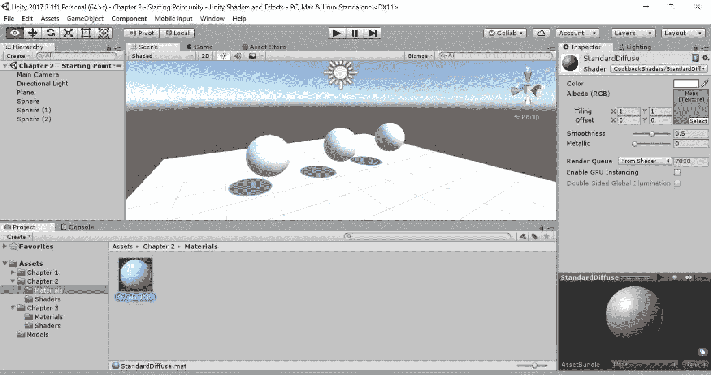

目前看起来没有什么可看的，但我们的着色器开发环境已经设置好了，我们现在可以开始修改着色器以满足我们的需求。

# 它是如何工作的...

Unity 已经使您设置着色器环境的工作变得非常简单。这只是一个点击几个按钮的问题，然后您就可以开始了。在表面着色器本身方面，有很多元素在后台工作。Unity 已经对 Cg 着色器语言进行了优化，以便您更高效地编写，通过为您执行大量的重 Cg 代码。表面着色器语言是一种更基于组件的编写着色器的方法。处理自己的纹理坐标和变换矩阵等任务已经为您完成，因此您不必从头开始。在过去，我们不得不创建一个新的着色器并反复重写大量代码。随着您在表面着色器方面经验的增加，您自然会想要探索 Cg 语言的更多底层功能以及 Unity 是如何为您处理所有底层**图形** **处理单元**（**GPU**）任务的。

Unity 项目中的所有文件都是独立于它们所在的文件夹进行引用的。我们可以在编辑器内部移动着色器和材质，而不用担心破坏任何连接。然而，文件永远不应该从编辑器外部移动，因为 Unity 将无法更新它们的引用。

因此，只需将着色器的路径名称更改为我们选择的名称，我们就在 Unity 环境中实现了基本漫反射着色器，包括灯光和阴影等，只需更改一行代码即可！

# 还有更多...

内置着色器的源代码通常在 Unity 中是隐藏的。你不能像处理自己的着色器那样从编辑器中打开它。有关查找大量内置 Cg 函数的信息，请转到你的 Unity 安装目录，并导航到`Editor` | `Data` | `CGIncludes`文件夹：

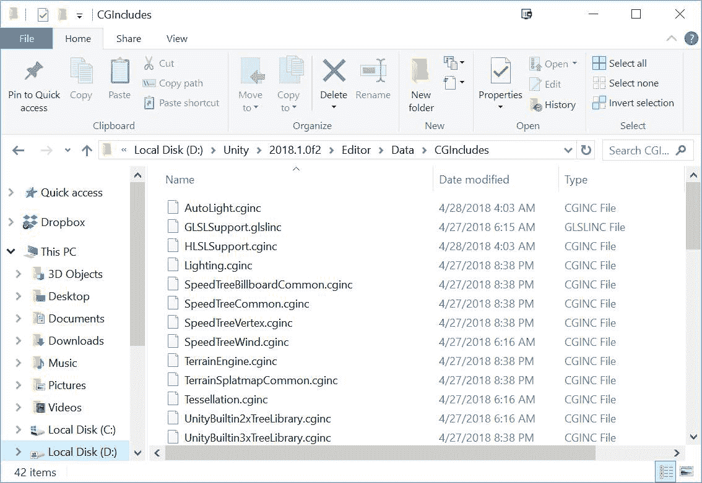

在这个文件夹中，你可以找到 Unity 附带着色器的源代码。随着时间的推移，它们已经发生了很大变化；如果你需要访问不同版本的 Unity 中使用的着色器的源代码，请访问**Unity 下载存档**([`unity3d.com/get-unity/download/archive`](https://unity3d.com/get-unity/download/archive))。选择正确的版本后，从下拉列表中选择内置着色器，如图下所示：

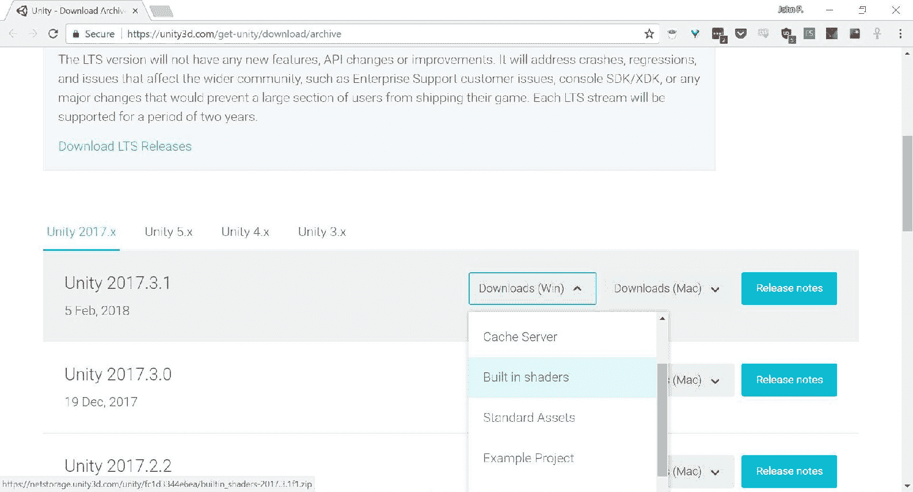

目前有三个文件值得关注：`UnityCG.cginc`、`Lighting.cginc` 和 `UnityShaderVariables.cginc`。我们当前的着色器正在使用所有这些文件。在第十一章，“高级着色技术”中，我们将深入探讨如何使用 CGInclude 以模块化方式编写着色器代码。

# 向着色器添加属性

着色器的属性对于着色器管道非常重要，因为它们是艺术家或着色器用户用来分配纹理和调整着色器值的方法。属性允许你在材质的检查器标签页中暴露 GUI 元素，而无需使用单独的编辑器，这提供了调整着色器的视觉方式。在你的 IDE 中打开着色器，查看第二行到第七行的代码块。这被称为脚本的`Properties`块。目前，它将包含一个名为`_MainTex`的纹理属性。

如果你查看应用了此着色器的材质，你会在检查器标签页中注意到有一个**纹理**GUI 元素。我们着色器中的这些代码行正在为我们创建这个 GUI 元素。再次强调，Unity 在编码效率和迭代更改属性所需的时间方面使这个过程非常高效。

# 准备工作

让我们看看在我们的当前着色器 `StandardDiffuse` 中它是如何工作的，通过创建我们自己的属性并了解更多关于涉及的语法。对于这个例子，我们将重新调整之前创建的着色器。它将不再使用纹理，而只使用其颜色和一些我们可以直接从检查器选项卡更改的其他属性。首先，复制 `StandardDiffuse` 着色器。您可以在检查器选项卡中选择它并按 *Ctrl *+ *D* 来完成此操作。这将创建一个名为 `StandardDiffuse 1` 的副本。继续将其重命名为 `StandardColor`。

您可以在着色器的第一行为其提供一个更友好的名称。例如，`Shader "CookbookShaders/StandardDiffuse"` 告诉 Unity 将此着色器命名为 `StandardDiffuse` 并将其移动到名为 `CookbookShaders` 的组中。如果您使用 *Ctrl *+ *D* 复制一个着色器，您的新文件将具有相同的名称。为了避免混淆，请确保更改每个新着色器的第一行，以便它使用在此和未来的配方中唯一的别名。

# 如何操作...

一旦 `StandardColor` 着色器准备就绪，我们就可以开始更改其属性：

1.  在脚本的第 一行中，更新名称为以下内容：

```cs
Shader "CookbookShaders/Chapter 02/StandardColor" {
```

下载示例代码

您可以从您在 [`www.packtpub.com`](http://www.packtpub.com/) 购买的 Packt 书籍的账户中下载所有示例代码文件。如果您在其他地方购买了这本书，您可以访问 [`www.packtpub.com/support`](http://www.packtpub.com/support) 并注册以将文件直接通过电子邮件发送给您。

1.  在我们的着色器 `Properties` 块中，通过从当前着色器中删除以下代码来移除当前属性：

```cs
_MainTex ("Albedo (RGB)", 2D) = "white" {} 
```

1.  由于我们已经移除了一个基本属性，这个着色器将不会编译，直到移除对 `_MainTex` 的其他引用。让我们在 `SubShader` 部分中删除这一行：

```cs
sampler2D _MainTex; 
```

1.  原始着色器使用 `_MainTex` 为模型着色。让我们通过用以下代码替换 `surf()` 函数的第一行来更改这一点：

```cs
fixed4 c = _Color; 
```

正如您在用 C# 和其他编程语言编写代码时可能习惯于使用 `float` 类型表示浮点值一样，`fixed` 用于定点值，并且在编写着色器时使用此类型。您也可能看到使用 `half` 类型，它类似于 `float` 类型，但占用一半的空间。这有助于节省内存，但在表示上精度较低。我们将在第八章第八部分的*使着色器更有效的技术*配方中更详细地讨论这一点，*移动着色器调整*。

关于定点值的更多信息，请查看[`en.wikipedia.org/wiki/Fixed-point_arithmetic`](https://en.wikipedia.org/wiki/Fixed-point_arithmetic)。

`fixed4`中的`4`表示颜色是一个包含四个`fixed`值的单个变量：红色、绿色、蓝色和 alpha。你将在下一章中了解更多关于它是如何工作的以及如何更详细地修改这些值的信息，第三章，*表面着色器和纹理映射*。

1.  当你保存并返回 Unity 时，着色器将进行编译，你会看到现在我们的材质的“检查器”标签中不再有纹理样本。为了完成这个着色器的重新配置，让我们在`属性`块中添加一个额外的属性并看看会发生什么。输入以下代码：

```cs
_AmbientColor ("Ambient Color", Color) = (1,1,1,1) 
```

1.  我们已经在材质的“检查器”标签中添加了另一个颜色样本。现在让我们再添加一个，以便感受我们可以创建的其他类型的属性。将以下代码添加到`属性`块中：

```cs
_MySliderValue ("This is a Slider", Range(0,10)) = 2.5 
```

1.  我们现在创建了一个另一个 GUI 元素，允许我们以视觉方式与我们的着色器交互。这次，我们创建了一个名为 This is a Slider 的滑块，如下面的截图所示：

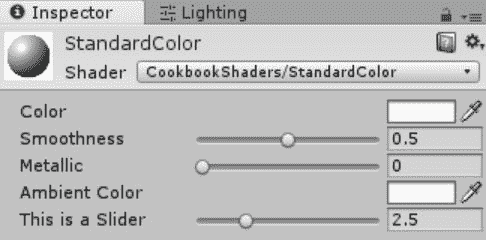

1.  属性允许你创建一种视觉方式来调整着色器，而无需更改着色器代码中的值。下一道菜谱将向你展示这些属性实际上是如何被用来创建一个更有趣的着色器的。

虽然属性属于着色器，但与它们关联的值存储在材质中。相同的着色器可以在许多不同的材质之间安全共享。另一方面，更改材质的属性将影响当前使用它的所有对象的外观。

# 它是如何工作的...

每个 Unity 着色器都在其代码中寻找一个内置的结构。`属性`块是 Unity 期望的函数之一。背后的原因是为了给你，着色器程序员，提供一种快速创建与着色器代码直接关联的 GUI 元素的方法。你可以在`属性`块中声明的这些属性（变量）然后可以在你的着色器代码中使用它们来更改值、颜色和纹理。定义属性的语法如下：


让我们来看看这里底层的运作原理。当你第一次开始编写一个新的属性时，你需要给它一个**变量名**。**变量名**将是你的着色器代码将用来从 GUI 元素获取值的名称。这为我们节省了很多时间，因为我们不需要自己设置这个系统。属性的下一个元素是**检查器 GUI 名称**和属性的**类型**，这些都在括号内。**检查器 GUI 名称**是当用户与材质的检查器标签进行交互和调整着色器时将显示的名称。**类型**是此属性将要控制的数据类型。在 Unity 着色器中，我们可以为属性定义许多类型。以下表格描述了我们可以在我们着色器中拥有的变量类型：

| **表面着色器属性类型** | **描述** |
| --- | --- |
| `Range` (min, max) | 这创建了一个从最小值到最大值的`float`属性滑块 |
| `Color` | 这将在检查器标签中创建一个颜色样本，并打开一个`color picker = (float,float,float,float)` |
| `2D` | 这将创建一个纹理样本，允许用户将纹理拖放到着色器中 |
| `Rect` | 这将创建一个非二的幂纹理样本，并且与`2D` GUI 元素功能相同 |
| Cube | 这将在检查器标签中创建一个立方体贴图样本，并允许用户将立方体贴图拖放到着色器中 |
| `float` | 这将在检查器标签中创建一个浮点值，但没有滑块 |
| Vector | 这将创建一个四浮点属性，允许你创建方向或颜色 |

最后，还有**默认值**。这简单地将此属性的值设置为你在代码中放置的值。所以，在先前的示例图中，名为`_AmbientColor`的属性默认值，其类型为`Color`，被设置为`1, 1, 1, 1`。由于这是一个期望颜色为`RGBA`或`float4`或`r, g, b, a = x, y, z, w`的`Color`属性，因此当首次创建时，此`Color`属性被设置为白色。

# 参见

这些属性在 Unity 手册中有文档说明，请参阅[`docs.unity3d.com/Documentation/Components/SL-Properties.html`](http://docs.unity3d.com/Documentation/Components/SL-Properties.html)。

# 在表面着色器中使用属性

现在我们已经创建了一些属性，让我们将它们实际连接到着色器，这样我们就可以将它们用作着色器的调整，并使材质处理更加交互式。我们可以使用材质检查器标签中的属性值，因为我们已经将变量名附加到属性本身，但在着色器代码中，你必须在开始通过变量名调用值之前设置一些事情。

# 如何做到这一点...

以下步骤显示了如何在表面着色器中使用属性：

1.  在上一个示例的基础上继续，让我们创建另一个名为 `ParameterExample` 的着色器。就像之前一样，以与本章中“向着色器添加属性”配方相同的方式移除 `_MainTex` 属性：

```cs
// Inside the Properties block
_MainTex ("Albedo (RGB)", 2D) = "white" {} 

// Below the CGPROGRAM line
sampler2D _MainTex; 

// Inside of the surf function
fixed4 c = tex2D (_MainTex, IN.uv_MainTex) * _Color; 
```

1.  之后，将 `Properties` 部分更新为以下代码：

```cs
Properties {
  _Color ("Color", Color) = (1,1,1,1)
 _AmbientColor ("Ambient Color", Color) = (1,1,1,1) 
 _MySliderValue ("This is a Slider", Range(0,10)) = 2.5 

  _Glossiness ("Smoothness", Range(0,1)) = 0.5
  _Metallic ("Metallic", Range(0,1)) = 0.0
}
```

1.  接下来，在 `CGPROGRAM` 行下面添加以下代码行到着色器中：

```cs
float4 _AmbientColor; 
float _MySliderValue; 
```

1.  经过完成**步骤 3**，我们现在可以使用着色器中的属性值了。让我们通过将 `_Color` 属性的值添加到 `_AmbientColor` 属性中，并将这个结果赋给 `o.Albedo` 代码行来实现这一点。所以，让我们在 `surf()` 函数的着色器中添加以下代码：

```cs
void surf (Input IN, inout SurfaceOutputStandard o) {
      // We can then use the properties values in our shader 
      fixed4 c = pow((_Color + _AmbientColor), _MySliderValue); 

      // Albedo comes from property values given from slider and colors
      o.Albedo = c.rgb;

      // Metallic and smoothness come from slider variables
      o.Metallic = _Metallic;
      o.Smoothness = _Glossiness;
      o.Alpha = c.a;
    }
    ENDCG
```

1.  最后，你的着色器应该看起来像以下着色器代码。如果你保存你的着色器并重新进入 Unity，你的着色器将会编译。如果没有错误，你现在将能够通过滑动条值来改变材质的环境光和自发光颜色，以及增加最终颜色的饱和度。非常方便：

```cs
Shader "CookbookShaders/Chapter02/ParameterExample" {
  // We define Properties in the properties block 
  Properties {
    _Color ("Color", Color) = (1,1,1,1)
    _Glossiness ("Smoothness", Range(0,1)) = 0.5
    _Metallic ("Metallic", Range(0,1)) = 0.0
  }
  SubShader {
    Tags { "RenderType"="Opaque" }
    LOD 200

    // We need to declare the properties variable type inside of the
    // CGPROGRAM so we can access its value from the properties block.

    CGPROGRAM
    // Physically based Standard lighting model, and enable shadows on all light types
    #pragma surface surf Standard fullforwardshadows

    // Use shader model 3.0 target, to get nicer looking lighting
    #pragma target 3.0

    float4 _AmbientColor; 
    float _MySliderValue; 

    struct Input {
      float2 uv_MainTex;
    };

    half _Glossiness;
    half _Metallic;
    fixed4 _Color;

    // Add instancing support for this shader. You need to check 'Enable Instancing' on materials that use the shader.
    // See https://docs.unity3d.com/Manual/GPUInstancing.html for more information about instancing.
    // #pragma instancing_options assumeuniformscaling
    UNITY_INSTANCING_BUFFER_START(Props)
      // put more per-instance properties here
    UNITY_INSTANCING_BUFFER_END(Props)

    void surf (Input IN, inout SurfaceOutputStandard o) {
      // We can then use the properties values in our shader 
      fixed4 c = pow((_Color + _AmbientColor), _MySliderValue); 

      // Albedo comes from property values given from slider and colors
      o.Albedo = c.rgb;

      // Metallic and smoothness come from slider variables
      o.Metallic = _Metallic;
      o.Smoothness = _Glossiness;
      o.Alpha = c.a;
    }
    ENDCG
  }
  FallBack "Diffuse"
}
```

`pow(arg1, arg2)` 函数是一个内置函数，它将执行等价的 `math` 函数的幂运算。所以，参数 `1` 是我们想要提升到幂的值，而参数 `2` 是我们想要提升到的幂。

要了解更多关于 `pow()` 函数的信息，请查看 Cg 教程。这是一个非常好的免费资源，你可以用它来学习更多关于着色器的知识，并且有一个所有 Cg 着色语言中可用的函数的词汇表，可以在[`http.developer.nvidia.com/CgTutorial/cg_tutorial_appendix_e.html`](http://http.developer.nvidia.com/CgTutorial/cg_tutorial_appendix_e.html)找到。

以下截图展示了使用我们的属性从材质的“检查器”标签中控制材质颜色和饱和度的结果：

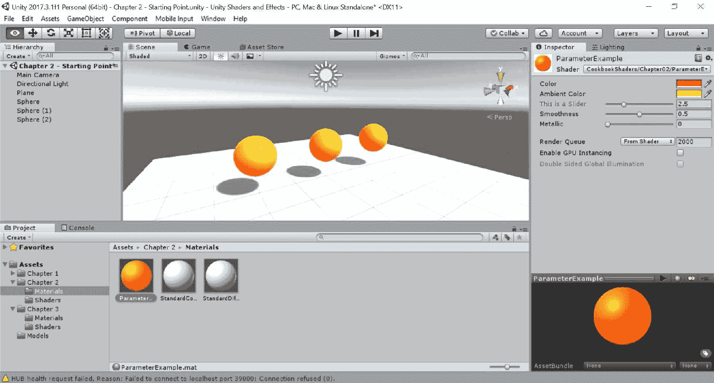

# 它是如何工作的...

当你在 `Properties` 块中声明一个新的属性时，你为着色器提供了一种从材质的“检查器”标签中检索调整值的方法。这个值存储在属性的变量名部分。在这种情况下，`_AmbientColor`、`_Color` 和 `_MySliderValue` 是我们存储调整值的变量。

为了让你能够使用 `SubShader` 块中的值，你需要创建三个具有与属性变量名相同名称的新变量。这自动设置了一个链接，使它们知道它们必须使用相同的数据。此外，它声明了我们想要存储在 `SubShader` 变量中的数据类型，这在我们在后面的章节中查看优化着色器时将很有用。一旦创建了 `SubShader` 变量，你就可以在 `surf()` 函数中使用这些值。在这种情况下，我们想要将 `_Color` 和 `_AmbientColor` 变量相加，并将其提升到 `_MySliderValue` 变量在材质检查器标签中等于的任何幂。绝大多数着色器最初都是标准着色器，并经过修改直到它们符合所需的视觉效果。我们现在为任何需要漫反射组件的表面着色器创建了基础。

材质是资产。这意味着在编辑器中游戏运行时对它们所做的任何更改都是永久的。如果你不小心更改了属性的值，你可以使用 *Ctrl *+ *Z* 撤销更改。

# 还有更多...

就像任何其他编程语言一样，Cg 不允许错误。因此，如果你的代码中有拼写错误，你的着色器将无法工作。当这种情况发生时，你的材质将以无阴影的洋红色渲染：

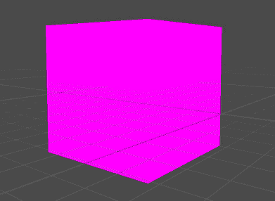

当脚本无法编译时，Unity 会阻止你的游戏导出或执行。相反，着色器中的错误不会阻止你的游戏执行。如果你的某个着色器显示为洋红色，那么是时候调查问题所在了。如果你选择有问题的着色器，你将在其检查器标签中看到一个错误列表：

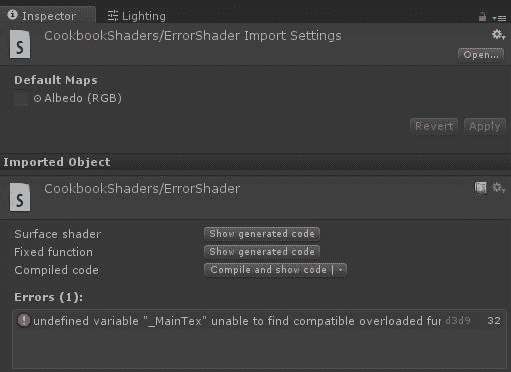

尽管错误信息显示了引发错误的行，但这很少意味着这就是需要修复的行。前一个屏幕截图中的错误信息是由从“SubShader{”块中删除 `sampler2D _MainTex` 变量生成的。然而，错误是由尝试访问此类变量的第一行引发的。找到并修复代码中的问题是一个称为 **调试** 的过程。你应该检查的最常见的错误如下：

+   缺少的括号。如果你忘记添加花括号来关闭一个部分，编译器可能会在文档的末尾、开头或在新部分中引发错误。

+   缺少的分号。这是最常见的错误之一，但幸运的是，这也是最容易发现和修复的。在查看错误定义时，首先检查它上面的行是否有分号。

+   在“属性”部分中定义但未与“SubShader{”块中的变量耦合的属性。

+   与你在 C# 脚本中可能习惯的相比，Cg 中的浮点值不需要跟一个 `f`。它是 `1.0`，而不是 `1.0f`。

着色器抛出的错误信息可能会非常误导，尤其是由于它们严格的语法约束。如果你对它们的含义有疑问，最好是上网搜索。Unity 论坛上充满了其他开发者，他们很可能在之前遇到过（并解决了）你的问题。

# 另请参阅

+   关于如何掌握表面着色器和它们的属性，更多信息可以在第三章《表面着色器和纹理映射》中找到。

+   如果你好奇想看看当着色器发挥其全部潜力时能做什么，可以查看第十一章《高级着色技术》，书中涵盖的一些最先进的技术。
