# 表面着色器和纹理映射

在本章中，我们将比上一章更深入地探讨表面着色器。我们将从一个非常简单的哑光材质开始，以全息投影和高级地形混合结束。我们还将看到如何使用纹理来动画化、混合和驱动它们喜欢的任何其他属性。

在本章中，你将学习以下方法：

+   漫反射着色

+   访问和修改打包数组

+   向着色器添加纹理

+   通过修改 UV 值滚动纹理

+   使用法线贴图创建着色器

+   创建透明材质

+   创建全息着色器

+   打包和混合纹理

+   在你的地形周围创建一个圆

# 简介

表面着色器在第二章“创建你的第一个着色器”中引入，作为 Unity 中使用的着色器的主要类型。本章将详细介绍这些着色器的实际内容和它们的工作原理。一般来说，每个表面着色器有两个基本步骤。首先，你必须指定你想要描述的材料的某些物理属性，例如其漫反射颜色、平滑度和透明度。这些属性在名为**surface function**的函数中初始化，并存储在名为`SurfaceOutput`的结构中。其次，`SurfaceOutput`被传递给一个光照模型。这是一个特殊的函数，它还会接收场景中附近灯光的信息。这两个参数随后被用来计算模型每个像素的最终颜色。光照函数是着色器真正计算的地方，因为它是确定光线接触材料时应如何行为的代码片段。

以下图表大致总结了表面着色器的工作原理。自定义光照模型将在第四章“理解光照模型”中探讨，而第六章“顶点函数”将专注于顶点修改器：

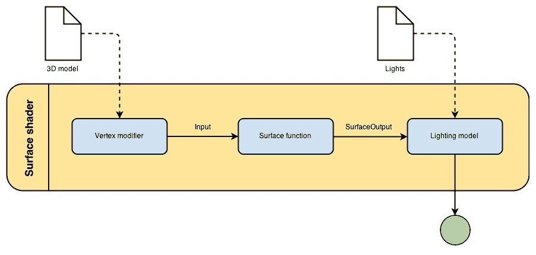

# 漫反射着色

在我们开始纹理映射之旅之前，了解漫反射材料的工作原理非常重要。某些物体可能具有均匀的颜色和光滑的表面，但不够光滑以在反射光中发光。这些哑光材料最好用漫反射着色器来表示。虽然，在现实世界中纯漫反射材料不存在，但漫反射着色器的实现相对便宜，并且在具有低多边形美学的游戏中大量应用，因此它们值得学习。

你可以通过几种方式创建自己的漫反射着色器。一种快速的方法是从 Unity 的标准表面着色器开始，并编辑它以删除任何额外的纹理信息。

# 准备工作

在开始此配方之前，您应该已经创建了一个名为`SimpleDiffuse`的标准表面着色器。有关创建标准表面着色器的说明，请参阅第二章中的*创建您的第一个着色器*配方，如果您还没有这样做的话。

# 如何做到这一点...

打开您创建的`SimpleDiffuse`着色器，并做出以下更改：

1.  在`属性`部分，删除除`_Color`之外的所有变量：

```cs
  Properties 
  {
    _Color ("Color", Color) = (1,1,1,1)
  }
```

1.  从`SubShader{}`部分中删除`_MainTex`、`_Glossiness`和`_Metallic`变量。您不应该删除对`uv_MainTex`的引用，因为 Cg 不允许`Input`结构为空。该值将被简单地忽略。

1.  此外，删除`UNITY_INSTANCING_BUFFER_START/END`宏及其相关的注释。

1.  删除`surf()`函数的内容，并替换为以下内容：

```cs
void surf (Input IN, inout SurfaceOutputStandard o) 
{
  o.Albedo = _Color.rgb; 
}
```

1.  您的着色器应该看起来如下：

```cs
Shader "CookbookShaders/Chapter03/SimpleDiffuse" {
  Properties 
  {
    _Color ("Color", Color) = (1,1,1,1)
  }
  SubShader 
  {
    Tags { "RenderType"="Opaque" }
    LOD 200

    CGPROGRAM
    // Physically based Standard lighting model, and enable shadows on all light types
    #pragma surface surf Standard fullforwardshadows

    // Use shader model 3.0 target, to get nicer looking lighting
    #pragma target 3.0

    struct Input 
    {
      float2 uv_MainTex;
    };

    fixed4 _Color;

    void surf (Input IN, inout SurfaceOutputStandard o) 
    {
      o.Albedo = _Color.rgb; 
    }

    ENDCG
  }
  FallBack "Diffuse"
}
```

以下`CGPROGRAM`的两行实际上是同一行，由于书籍的大小而被截断。

1.  由于这个着色器已经适配了 Standard Shader，它将使用基于物理的渲染来模拟光线在模型上的行为。

如果您试图实现非真实感的外观，您可以更改第一个`#pragma`指令，使其使用`Lambert`而不是`Standard`。如果您这样做，还应该将`surf`函数的`SurfaceOutputStandard`参数替换为`SurfaceOutput`。有关此信息和 Unity 支持的其他光照模型的信息，Jordan Stevens 编写了一篇非常好的文章，您可以通过以下链接查看：[`www.jordanstevenstechart.com/lighting-models`](http://www.jordanstevenstechart.com/lighting-models)

1.  保存着色器，然后返回 Unity。使用与第二章中*创建基本标准表面着色器*配方相同的指令，创建一个名为`SimpleDiffuseMat`的新材质，并将我们新创建的着色器应用到它上。通过在检查器窗口中选择并单击颜色属性旁边的窗口，将颜色更改为不同的颜色，例如红色。

1.  然后，进入本书示例代码的`Models`文件夹，通过从项目窗口拖放到层次窗口中，将兔子对象拖放到我们的场景中。从那里，将`SimpleDiffuseMat`材质分配给对象：


1.  您可以在层次窗口中双击一个对象，以便将相机居中到所选对象。

# 它是如何工作的...

着色器允许你通过它们的 `SurfaceOutput` 将你的材料渲染属性传达给光照模型的方式。它基本上是围绕当前光照模型所需的所有参数的一个包装。不同光照模型有不同的 `SurfaceOutput` 结构体，这不会让你感到惊讶。以下表格显示了在 Unity 中使用的三个主要输出结构体以及它们的使用方法：

| **着色器类型** | **标准** | **基于物理的光照模型** |
| --- | --- | --- |
| 扩散 | 任何表面着色器`SurfaceOutput` | 标准`SurfaceOutputStandard` |
| 镜面 | 任何表面着色器`SurfaceOutput` | 标准（镜面设置）`SurfaceOutputStandardSpecular` |

`SurfaceOutput` 结构体具有以下属性：

+   `fixed3 Albedo;`: 这是材料的扩散颜色

+   `fixed3 Normal;`: 这是切线空间中的法线，如果写入的话

+   `fixed3 Emission;`: 这是材料发出的光的颜色（在标准着色器中此属性被声明为 `half3`）

+   `fixed Alpha;`: 这是材料的透明度

+   `half Specular;`: 这是镜面功率，范围从 `0` 到 `1`

+   `fixed Gloss;`: 这是镜面强度的固定值

`SurfaceOutputStandard` 结构体具有以下属性：

+   `fixed3 Albedo;`: 这是材料的基色（无论是扩散还是镜面）

+   `fixed3 Normal;`

+   `half3 Emission;`: 这个属性被声明为 `half3`，而在 `SurfaceOutput` 中定义为 `fixed3`

+   `fixed Alpha;`

+   `half Occlusion;`: 这是遮挡（默认 `1`）

+   `half Smoothness;`: 这是平滑度（`0` = 粗糙，`1` = 平滑）

+   `half Metallic;`: `0` = 非金属，`1` = 金属

`SurfaceOutputStandardSpecular` 结构体具有以下属性：

+   `fixed3 Albedo;`

+   `fixed3 Normal;`

+   `half3 Emission;`

+   `fixed Alpha;`

+   `half Occlusion;`

+   `half Smoothness;`

+   `fixed3 Specular;`: 这是镜面颜色。这与 `SurfaceOutput` 中的 `Specular` 属性非常不同，因为它允许你指定一个颜色而不是单个值。

正确初始化 `SurfaceOutput` 为正确的值是正确使用表面着色器的问题。

关于创建表面着色器的更多信息，请查看以下链接： [`docs.unity3d.com/Manual/SL-SurfaceShaders.html`](https://docs.unity3d.com/Manual/SL-SurfaceShaders.html)

# 访问和修改打包数组

简单来说，着色器内部的代码必须至少执行屏幕上每个像素一次。这就是为什么 GPU 高度优化了并行计算；它们可以同时执行多个进程。这种理念在 Cg 中可用的标准类型变量和运算符中也很明显。理解它们是至关重要的，不仅是为了正确使用着色器，也是为了编写高度优化的着色器。

# 如何做到这一点...

Cg 中有两种类型的变量：单个值和压缩数组。后者可以通过它们的类型以数字结尾来识别，例如`float3`或`int4`。正如它们的名称所暗示的，这些类型的变量类似于结构体，这意味着它们各自包含几个单个值。Cg 称它们为压缩数组，尽管它们在传统意义上并不完全是**数组**。

压缩数组的元素可以像正常结构体一样访问。它们通常被称为`x`、`y`、`z`和`w`。然而，Cg 还为你提供了它们的另一个别名，即`r`、`g`、`b`和`a`。尽管使用`x`或`r`之间没有区别，但它对读者来说可能有很大的影响。实际上，着色器编码通常涉及位置和颜色的计算。你可能在标准着色器中见过这种情况：

```cs
o.Alpha = _Color.a; 
```

在这里，`o`是一个结构体，`_Color`是一个压缩数组。这也是为什么 Cg 禁止混合使用这两种语法：你不能使用`_Color.xgz`。

压缩数组还有一个重要的特性，在 C#中没有等效功能：**swizzling**。Cg 允许在单行内对压缩数组中的元素进行寻址和重新排序。再次强调，这也在标准着色器中体现出来：

```cs
o.Albedo = _Color.rgb; 
```

`Albedo`是`fixed3`，这意味着它包含三个`fixed`类型的值。然而，`_Color`被定义为`fixed4`类型。直接赋值会导致编译器错误，因为`_Color`比`Albedo`大。在 C#中这样做的方式如下：

```cs
o.Albedo.r = _Color.r; 
o.Albedo.g = _Color.g; 
o.Albedo.b = _Color.b; 
```

然而，在 Cg 中它可以被压缩：

```cs
o.Albedo = _Color.rgb; 
```

Cg 还允许重新排序元素，例如，使用`_Color.bgr`来交换红色和蓝色通道。

最后，当单个值赋给压缩数组时，它被复制到所有字段中：

```cs
o.Albedo = 0; // Black =(0,0,0) 
o.Albedo = 1; // White =(1,1,1) 
```

这被称为**模糊化**。

Swizzling 也可以用于表达式的左侧，允许只覆盖压缩数组的某些组件：

```cs
o.Albedo.rg = _Color.rg; 
```

在这种情况下，它被称为**遮罩**。

# 更多...

当 swizzling 应用于压缩矩阵时，它真正显示出其全部潜力。Cg 允许使用`float4x4`这样的类型，它代表一个有四行四列的浮点矩阵。你可以使用`_mRC`表示法访问矩阵的单个元素，其中*R*是行，*C*是列：

```cs
float4x4 matrix; 
// ... 
float first = matrix._m00; 
float last = matrix._m33; 
```

`_mRC`表示法也可以链式使用：

```cs
float4 diagonal = matrix._m00_m11_m22_m33; 
```

可以使用方括号选择整行：

```cs
float4 firstRow = matrix[0]; 
// Equivalent to 
float4 firstRow = matrix._m00_m01_m02_m03; 
```

# 参见

+   除了更容易编写之外，swizzling、smearing 和 masking 属性还有性能优势。

+   然而，不当使用 swizzling 可能会使你的代码在第一眼看起来更难以理解，也可能使编译器更难自动优化你的代码。

+   压缩数组是 Cg 最吸引人的特性之一。你可以在这里了解更多信息：[`http.developer.nvidia.com/CgTutorial/cg_tutorial_chapter02.html`](http://http.developer.nvidia.com/CgTutorial/cg_tutorial_chapter02.html)

# 向着色器添加纹理

纹理可以迅速使我们的着色器变得生动，以实现非常逼真的效果。为了有效地使用纹理，我们需要了解二维图像是如何映射到三维模型的。这个过程称为纹理映射，并且需要对我们要使用的着色器和 3D 模型进行一些工作。实际上，模型是由三角形组成的，通常被称为多边形；模型上的每个顶点都可以存储着色器可以访问和使用的数据，以确定要绘制的内容。

存储在顶点中最重要的信息之一是 **UV 数据**。它由两个坐标组成，*U* 和 *V*，范围从 0 到 1。它们代表将要映射到顶点的 2D 图像中像素的 *XY* 位置。UV 数据仅存在于顶点中；当三角形的内部点需要纹理映射时，GPU 会插值最接近的 UV 值，以找到纹理中要使用的正确像素。以下图表显示了如何将 **2D 纹理**从 3D 模型映射到三角形：


UV 数据存储在 3D 模型中，需要使用建模软件进行编辑。一些模型缺少 UV 组件，因此它们无法支持纹理映射。例如，斯坦福兔子最初并没有提供 UV 组件。

# 准备工作

对于这个食谱，你需要一个带有 UV 数据和纹理的 3D 模型。在开始之前，它们都需要导入到 Unity 中。你可以通过简单地拖动它们到编辑器中来实现。由于标准着色器默认支持纹理映射，我们将使用它，并详细解释其工作原理。

# 如何操作...

使用标准着色器为你的模型添加纹理非常简单，如下所示：

1.  在本书提供的本章示例代码中，你可以找到 `basicCharacter` 模型，默认情况下，它已经嵌入 UV 信息，这使得当我们附加材质时，它会使用这些信息来绘制纹理。

1.  通过转到项目标签并选择创建 | 着色器 | 标准表面着色器，创建一个名为 `TexturedShader` 的新标准表面着色器。一旦创建，你可以输入着色器的新名称，然后按 *Enter* 键。

1.  为了组织起见，打开着色器并将第一行更改为以下内容：

```cs
Shader "CookbookShaders/Chapter03/TexturedShader" {
```

1.  这将使我们能够找到我们迄今为止为本书使用的组织内部的着色器。

1.  通过转到项目标签并选择创建 | 材质，创建一个名为 `TexturedMaterial` 的新材质。一旦创建，你可以输入材质的新名称，然后按 *Enter* 键确认更改。

1.  通过转到检查器标签并点击着色器下拉菜单，然后选择 `CookbookShaders/Chapter 03/TexturedShader` 来将着色器分配给材质：


你也可以通过首先选择材质，然后在项目标签中将其拖动到着色器文件上来实现这一点。

1.  选择材质后，将你的纹理拖放到名为 Albedo (RGB)的空白矩形中。如果你缺少某些纹理，本章的示例代码中提供了可以使用的纹理。如果你正确地遵循了所有这些步骤，你的材质检查器标签页应该看起来像这样：

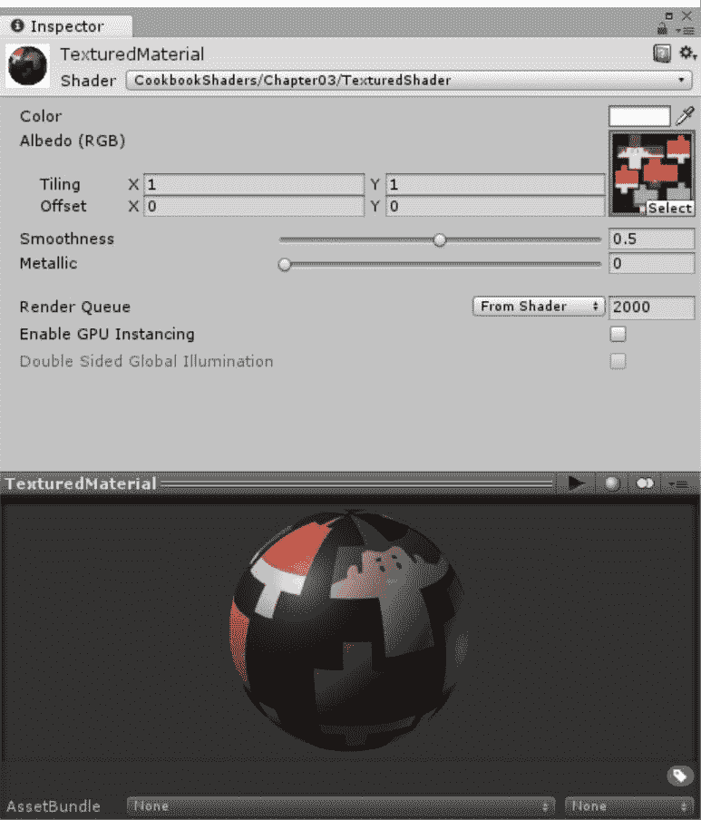

标准着色器知道如何使用其 UV 模型和纹理将 2D 图像映射到 3D 模型，本例中使用的纹理是由 Kenney Vleugels 和 Casper Jorissen 创建的。你可以在[Kenney.nl](http://Kenney.nl)找到这些以及其他许多公共领域游戏资产。

1.  要查看 UV 数据在实际中的应用，在示例代码的`模型`文件夹中，将模型拖放到“层次结构”标签页。一旦到达那里，双击新创建的对象以便放大，以便你可以看到该对象：

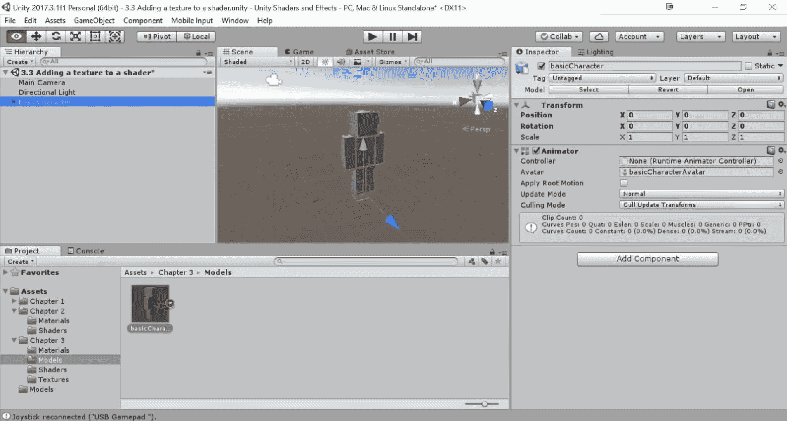

1.  一旦到达那里，你可以转到“项目”标签页，打开`第三章 `| `材料`文件夹，并将我们的`纹理材质`拖放到角色上。请注意，该模型由不同的对象组成，每个对象都提供了在特定位置绘制方向。这意味着你需要将材质应用到模型的每个部分（`ArmLeft1`、`ArmRight1`、`Body1`等）；仅尝试将其应用于层次结构的顶层（`basicCharacter`）将不会起作用：

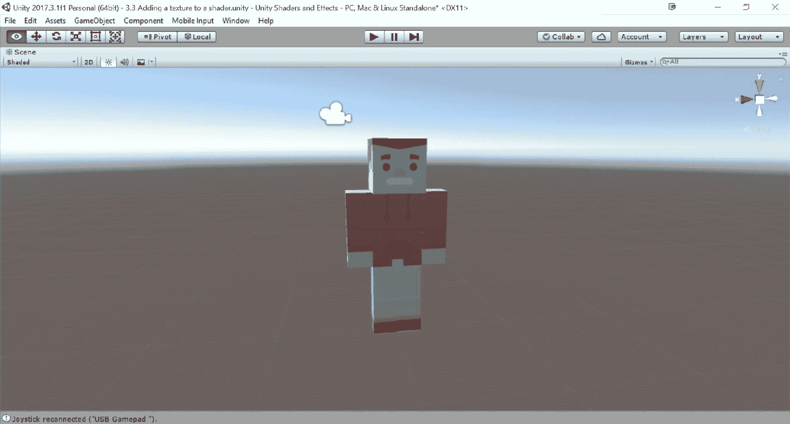

1.  通过更改正在使用的纹理，也可以更改对象的外观。例如，如果我们使用提供的其他纹理（`skin_womanAlternative`），我们将得到一个看起来非常不同的角色：

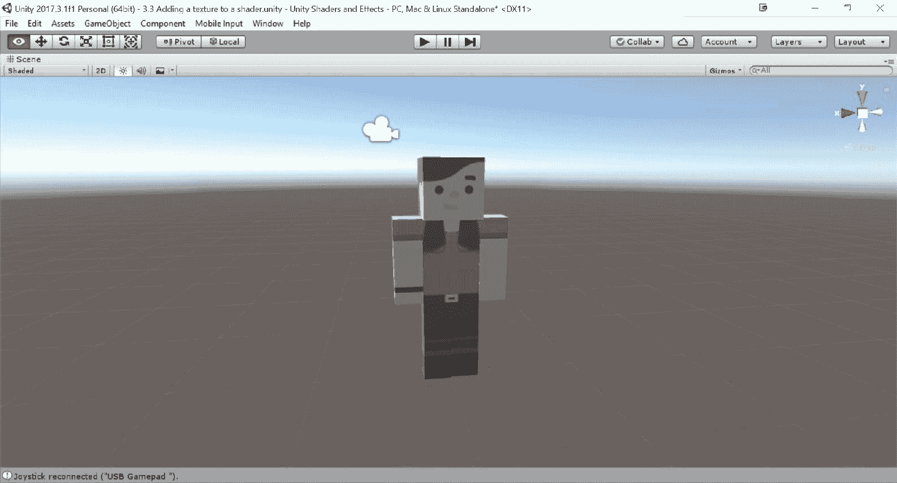

这通常在游戏中用于以最小的成本提供不同类型的角色。

# 它是如何工作的...

当从材质的检查器使用标准着色器时，纹理映射背后的过程对开发者来说是完全透明的。如果我们想了解它是如何工作的，就需要更仔细地查看`TexturedShader`。从`属性`部分，我们可以看到`Albedo (RGB)`纹理实际上在代码中被称为`_MainTex`：

```cs
_MainTex ("Albedo (RGB)", 2D) = "white" {} 
```

在`CGPROGRAM`部分，此纹理被定义为`sampler2D`，这是 2D 纹理的标准类型：

```cs
sampler2D _MainTex; 
```

下面的行显示了一个名为`struct`的结构。这是表面函数的输入参数，包含一个名为`uv_MainTex`的打包数组：

```cs
struct Input { 
  float2 uv_MainTex; 
}; 
```

每次调用`surf()`函数时，`Input`结构将包含需要渲染的 3D 模型特定点的`_MainTex`的 UV。标准着色器识别出名称`uv_MainTex`指的是`_MainTex`，并自动初始化它。如果你对了解 UV 实际上是如何从 3D 空间映射到 2D 纹理感兴趣，可以查看第五章，*理解光照模型*。

最后，UV 数据用于在表面函数的第一行采样纹理：

```cs
fixed4 c = tex2D (_MainTex, IN.uv_MainTex) * _Color; 
```

这是通过使用 Cg 的 `tex2D()` 函数来完成的；它接受一个纹理和 UV，并返回该位置的像素颜色。

*U* 和 *V* 坐标从 *0* 到 *1*，其中 (0,0) 和 (1,1) 对应于两个相对的角。不同的实现将 UV 与不同的角关联；如果你的纹理恰好出现反转，尝试反转 V 分量。

# 更多内容...

当您将纹理导入 Unity 时，您正在设置 `sampler2D` 将使用的一些属性。最重要的是过滤模式，它决定了在采样纹理时颜色如何插值。UV 数据不太可能正好指向像素的中心；在其他所有情况下，您可能想要在最近的像素之间进行插值，以获得更均匀的颜色。以下是一个示例纹理的检查器选项卡的截图：

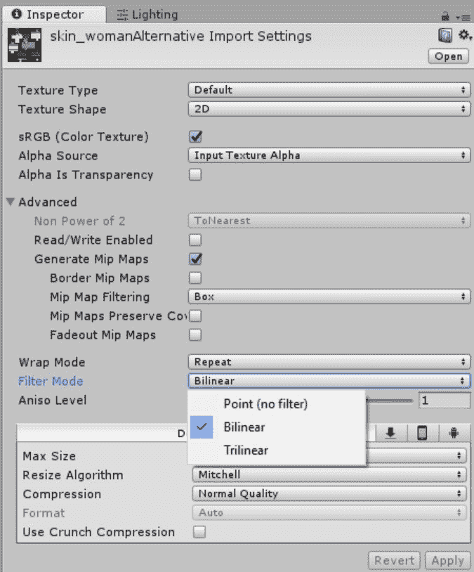

对于大多数应用来说，双线性提供了既经济又有效的方法来平滑纹理。然而，如果您正在创建 2D 游戏，双线性可能会产生模糊的瓦片。在这种情况下，您可以使用点采样来从纹理采样中移除任何插值。

当从陡峭的角度观察纹理时，纹理采样很可能会产生视觉上不愉快的伪影。您可以通过将 Aniso Level 设置为更高的值来减少它们。这对于地板和天花板纹理特别有用，因为故障可能会破坏连续性的幻觉。

# 参见

+   如果您想了解更多关于纹理如何映射到 3D 表面的内部工作原理的信息，您可以阅读在 [`developer.nvidia.com/CgTutorial/cg_tutorial_chapter03.html`](http://http.developer.nvidia.com/CgTutorial/cg_tutorial_chapter03.html) 可用的信息。

+   要获取导入 2D 纹理时可用选项的完整列表，您可以参考以下网站：[`docs.unity3d.com/Manual/class-TextureImporter.html`](http://docs.unity3d.com/Manual/class-TextureImporter.html)

# 通过修改 UV 值来滚动纹理

在当今游戏行业中，最常用的纹理技术之一是允许您在对象的表面上滚动纹理的过程。这使您能够创建瀑布、河流和熔岩流动等效果。这同样也是创建动画精灵效果的基础技术，但我们将在这章的后续菜谱中介绍。首先，让我们看看我们如何在 Surface Shader 中创建一个简单的滚动效果。

# 准备工作

要开始这个菜谱，您需要创建一个新的着色器文件（`ScrollingUVs`）和材质（`ScrollingUVMat`）。这将为我们提供一个干净整洁的着色器，我们可以用它单独研究滚动效果。

# 如何操作...

首先，我们将启动我们刚刚创建的新着色器文件，并按照以下步骤输入代码：

1.  着色器需要两个新属性，这将允许我们控制纹理滚动的速度。所以，让我们添加一个用于*X*方向的滚动速度属性和一个用于*Y*方向的滚动速度属性，如下面的代码所示：

```cs
Properties {
  _Color ("Color", Color) = (1,1,1,1)
  _MainTex ("Albedo (RGB)", 2D) = "white" {}
  _ScrollXSpeed ("X Scroll Speed", Range(0,10)) = 2 
  _ScrollYSpeed ("Y Scroll Speed", Range(0,10)) = 2 
}
```

1.  当在 ShaderLab 中工作时，`Properties`的语法看起来如下：

```cs
Properties
{
    _propertyName("Name in Inspector", Type) = value
}
```

包含在`Properties`块中的每个属性首先有一个用于在代码中引用对象的名称，这里指定为`_propertyName`。下划线不是必需的，但这是一个常见的标准。在括号内，您将看到两个参数。第一个是一个字符串，它定义了在检查器中显示的文本，用于表示此属性。第二个参数是我们希望存储的数据类型。

在我们的案例中，对于*X*和*Y*滚动速度，我们创建了一个可能的范围从 0 到 10 的数字。最后，我们可以使用默认值初始化属性，这通常在末尾完成。正如我们之前看到的，如果您选择使用此着色器的材质，这些属性将显示在检查器中。

有关属性及其创建的更多信息，请参阅[`docs.unity3d.com/Manual/SL-Properties.html`](https://docs.unity3d.com/Manual/SL-Properties.html)。

对于这个例子，我们不需要`Smoothness`或`Metallic`属性，因此我们也可以移除它们。

1.  在`_MainTex`定义上面的`CGPROGRAM`部分中修改 Cg 属性，并创建新变量，以便我们可以从我们的属性中访问值：

```cs
fixed _ScrollXSpeed; 
fixed _ScrollYSpeed; 
sampler2D _MainTex; 
```

1.  由于我们不再使用它们，我们需要移除`_Glossiness`和`_Metallic`的定义。

1.  修改表面函数以改变提供给`tex2D()`函数的 UVs。然后，在编辑器中按下播放按钮时，使用内置的`_Time`变量随时间动画 UVs：

```cs
void surf (Input IN, inout SurfaceOutputStandard o) {
    // Create a separate variable to store our UVs 
    // before we pass them to the tex2D() function 
    fixed2 scrolledUV = IN.uv_MainTex; 

    // Create variables that store the individual x and y 
    // components for the UV's scaled by time 
    fixed xScrollValue = _ScrollXSpeed * _Time; 
    fixed yScrollValue = _ScrollYSpeed * _Time; 

    // Apply the final UV offset 
    scrolledUV += fixed2(xScrollValue, yScrollValue); 

    // Apply textures and tint 
    half4 c = tex2D(_MainTex, scrolledUV); 
    o.Albedo = c.rgb * _Color; 
    o.Alpha = c.a; 
}
```

1.  一旦脚本完成，保存它，然后回到 Unity 编辑器。转到`Materials`文件夹，将`ScrollingUVsMat`分配给使用`ScrollingUVs`着色器的材质。完成后，在 Albedo (RGB)属性下，从本书提供的示例代码中拖放水纹理以分配属性：

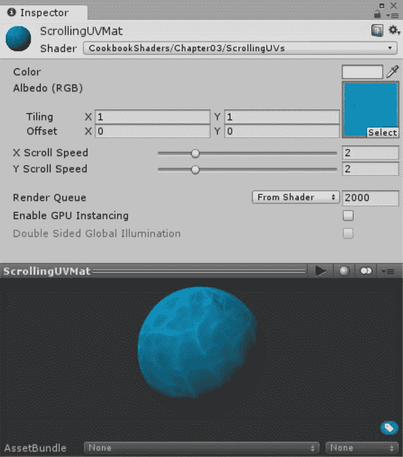

1.  创建完成后，我们需要创建一个可以使用着色器的对象。从一个新场景开始，选择 GameObject | 3D Object | Plane，并将`ScrollingUVMat`材质拖放到它上。

1.  一旦应用，继续玩游戏以查看着色器的作用：

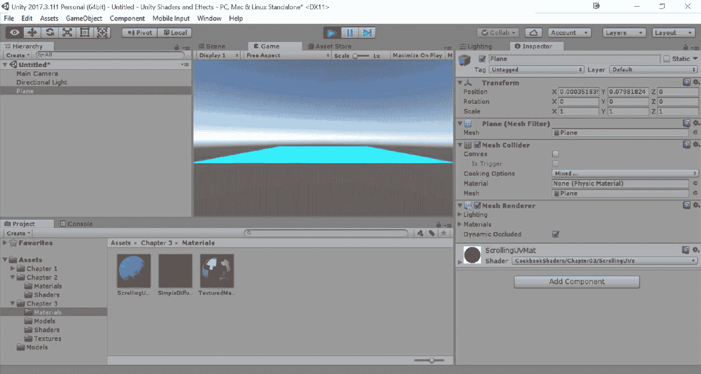

虽然在这个静态图像中不可见，但您会注意到在 Unity 编辑器中，对象现在将在*X*和*Y*轴上移动！您可以自由地将 X 滚动速度和 Y 滚动速度属性拖放到检查器选项卡中，以查看这些更改如何影响对象的移动。如果您想更容易地看到，也可以自由地移动相机。

如果你在游戏过程中修改了材质上的变量，其值将保持更改，这与 Unity 通常的工作方式不同。

非常酷！有了这些知识，我们可以将这个概念进一步发展，以创建有趣的视觉效果。以下截图展示了使用多个材料利用滚动 UV 系统创建简单河流运动环境的结果：

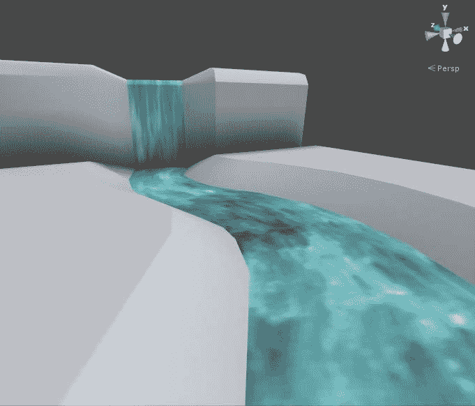

# 它是如何工作的...

滚动系统从声明几个属性开始，这些属性将允许用户增加或减少滚动效果的滚动速度。在本质上，它们是作为从材料的 Inspector 标签传递到着色器表面函数的浮点值。有关着色器属性的更多信息，请参阅第二章，*创建您的第一个着色器*。

一旦我们从材料的 Inspector 标签中获取了这些浮点值，我们就可以使用它们在着色器中偏移我们的 UV 值。

要开始这个过程，我们首先将 UVs 存储在一个名为`scrolledUV`的单独变量中。这个变量必须是`float2`/`fixed2`，因为 UV 值是从`Input`结构传递给我们的：

```cs
struct Input 
{ 
  float2 uv_MainTex; 
} 
```

一旦我们能够访问网格的 UVs，我们可以使用我们的滚动速度变量和内置的`_Time`变量来偏移它们。这个内置变量返回一个`float4`类型的变量，这意味着这个变量的每个分量都包含与游戏时间相关的不同时间值。

这些个别时间值的完整描述可以在以下链接中找到：[`docs.unity3d.com/Manual/SL-UnityShaderVariables.html`](http://docs.unity3d.com/Manual/SL-UnityShaderVariables.html)

这个`_Time`变量将根据 Unity 的游戏时间时钟给我们一个递增的浮点值。因此，我们可以使用这个值在 UV 方向上移动我们的 UVs，并使用我们的滚动速度变量来缩放这个时间：

```cs
// Create variables that store the individual x and y  
// components for the uv's scaled by time 
fixed xScrollValue = _ScrollXSpeed * _Time; 
fixed yScrollValue = _ScrollYSpeed * _Time; 
```

通过计算正确的时间偏移，我们可以将新的偏移值添加回原始 UV 位置。这就是为什么我们在下一行使用`+=`运算符的原因。我们想要获取原始 UV 位置，添加新的偏移值，然后将这个值传递给`tex2D()`函数作为纹理的新 UVs。这会在表面上创建纹理移动的效果。我们真正做的是操作 UVs，因此我们是在模拟纹理移动的效果：

```cs
scrolledUV += fixed2(xScrollValue, yScrollValue); 
half4 c = tex2D (_MainTex, scrolledUV); 
```

# 创建具有法线贴图的着色器

3D 模型的每个三角形都有一个*面向方向*，这是它指向的方向。通常用一个箭头表示，放置在三角形的中心，并且与表面垂直。面向方向在光线反射到表面上的方式中起着重要作用。如果相邻的两个三角形面向不同的方向，它们将以不同的角度反射光线，因此它们将以不同的方式着色。对于弯曲物体，这是一个问题：显然，几何形状是由平面三角形组成的。

为了避免这个问题，三角形上光线的反射方式不考虑其朝向方向，而是考虑其**法线方向**。正如在“向着色器添加纹理”的配方中所述，顶点可以存储数据；法线方向是除 UV 数据之外最常用的信息。这是一个单位长度的向量（这意味着它的长度为 1），它指示顶点所面对的方向。

无论朝向方向如何，三角形内的每个点都有自己的法线方向，它是其顶点中存储的法线的线性插值。这使我们能够在低分辨率模型上模拟高分辨率几何形状的效果。

下面的截图显示了使用不同顶点法线渲染的相同几何形状。在图像的左侧，法线与由其顶点表示的面垂直；这表明每个面之间有明显的分离。在右侧，法线沿着表面进行插值，表明即使表面是粗糙的，光线也应该像在光滑表面上一样反射。很容易看出，即使以下截图中的三个物体具有相同的几何形状，它们反射光线的方式也不同。尽管它们由平面三角形组成，但右侧的物体反射光线就像其表面实际上是弯曲的一样：

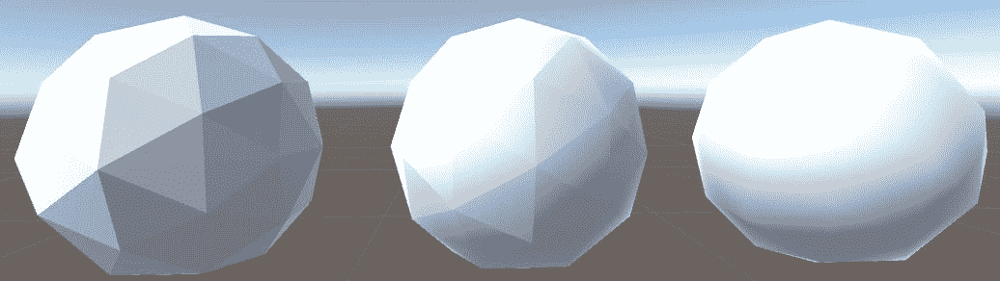

带有粗糙边缘的平滑物体是顶点法线插值的一个明显迹象。如果我们绘制每个顶点中存储的法线方向，就像以下截图所示，这一点可以观察到。请注意，每个三角形只有三个法线，但由于多个三角形可以共享同一个顶点，因此可能有多条线从这个顶点发出：

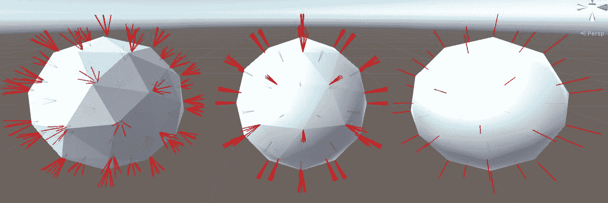

从 3D 模型计算法线是一种迅速被更高级的单法线贴图技术所取代的技术。与纹理贴图类似，法线方向可以通过一个额外的纹理提供，通常称为正常贴图或凹凸贴图。

正常贴图通常是使用图像的红色、绿色和蓝色通道来表示法线方向的**X**、**Y**和**Z**分量。如今创建正常贴图的方法有很多。一些应用程序，例如 CrazyBump([`www.crazybump.com/`](http://www.crazybump.com/))和 NDO Painter([`quixel.se/ndo/`](http://quixel.se/ndo/))，会接收 2D 数据并将其转换为正常数据。其他应用程序，如 Zbrush 4R7([`www.pixologic.com/`](http://www.pixologic.com/))和 AUTODESK([`usa.autodesk.com`](http://usa.autodesk.com/))，则会接收 3D 雕刻数据并为您创建正常贴图。创建正常贴图的实际过程超出了本书的范围，但前文中的链接应该能帮助您开始。

Unity 使用`UnpackNormals()`函数使在表面着色器领域添加法线到你的着色器变得非常简单。让我们看看这是如何完成的。

# 准备工作

要开始这个配方，首先通过选择 File | New Scene 创建一个新的场景。然后，通过 GameObject | 3D Objects | Sphere 创建一个球体游戏对象。在 Hierarchy 标签中双击对象，使其在 Scene 标签中聚焦。你还需要创建一个新的标准表面着色器文件（`NormalShader`）和材质（`NormalShaderMat`）。创建后，将材质设置为场景中的球体。这将给我们一个干净的工作空间，我们可以查看仅法线贴图技术：

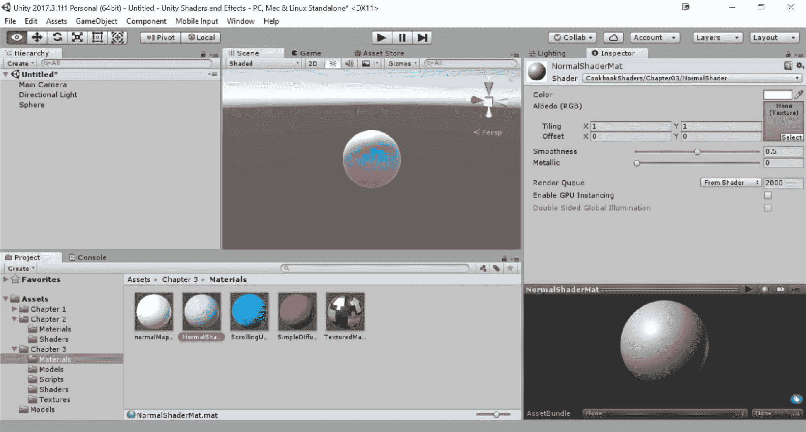

你需要为这个配方提供一个法线贴图，但本书附带的 Unity 项目中也有一个。

本书内容中包含的一个示例法线贴图如下所示：

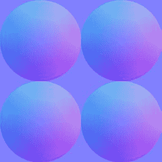

你可以在`Assets | Chapter 03 | Textures`文件夹下的`normalMapExample`中自己查看。

# 如何操作...

创建法线贴图着色器的以下步骤：

1.  让我们设置`Properties`块，以便有一个颜色`Tint`和纹理：

```cs
Properties 
{ 
  _MainTint ("Diffuse Tint", Color) = (0,1,0,1) 
  _NormalTex ("Normal Map", 2D) = "bump" {} 
} 
```

在这种情况下，我在绿色和 alpha 通道中设置为`1`，红色和蓝色通道设置为`0`，因此默认颜色将是绿色。对于`_NormalTex`属性，我们使用 2D 类型，这意味着我们可以使用 2D 图像来指定每个像素将使用的内容。通过将纹理初始化为`bump`，我们告诉 Unity `_NormalTex`将包含一个法线贴图（有时也称为凹凸贴图，因此命名为 bump），如果未设置纹理，它将被灰色纹理替换。使用的颜色（`0.5`，`0.5`，`0.5`，`1`）表示没有任何凹凸。

1.  在`SubShader{}`块中，在`CGPROGRAM`语句下方滚动并删除原始的`_MainText`，`_Glossiness`，`_Metallic`和`_Color`定义。之后，添加我们的`_NormalTex`和`_MainTint`：

```cs
    CGPROGRAM
    // Physically based Standard lighting model, and enable shadows 
    // on all light types
    #pragma surface surf Standard fullforwardshadows

    // Use shader model 3.0 target, to get nicer looking lighting
    #pragma target 3.0

    // Link the property to the CG program 
    sampler2D _NormalTex; 
    float4 _MainTint; 
```

1.  我们需要确保更新`Input`结构体中的正确变量名，以便我们可以使用模型的 UVs 来为法线贴图纹理：

```cs
// Make sure you get the UVs for the texture in the struct 
struct Input 
{ 
  float2 uv_NormalTex; 
} 
```

1.  最后，我们使用内置的`UnpackNormal()`函数从法线贴图纹理中提取法线信息。然后，你只需将这些新的法线应用到表面着色器的输出中：

```cs
void surf (Input IN, inout SurfaceOutputStandard o) {
  // Use the tint provided as the base color for the material
  o.Albedo = _MainTint;

  // Get the normal data out of the normal map texture 
  // using the UnpackNormal function 
  float3 normalMap = UnpackNormal(tex2D(_NormalTex, 
    IN.uv_NormalTex)); 

  // Apply the new normal to the lighting model 
  o.Normal = normalMap.rgb; 
}
```

1.  保存你的脚本并返回到 Unity 编辑器。你应该注意到，如果添加了球体，它现在默认是绿色的。更重要的是，请注意新添加的法线贴图属性。将法线贴图纹理拖放到槽中。

1.  你可能会注意到一些变化，但可能难以直观地看到正在发生什么。在法线贴图属性中，将平铺设置为（`10`，`10`）。这样，你可以在球体的 X 和 Y 轴上看到法线贴图重复 10 次，而不是只重复一次：

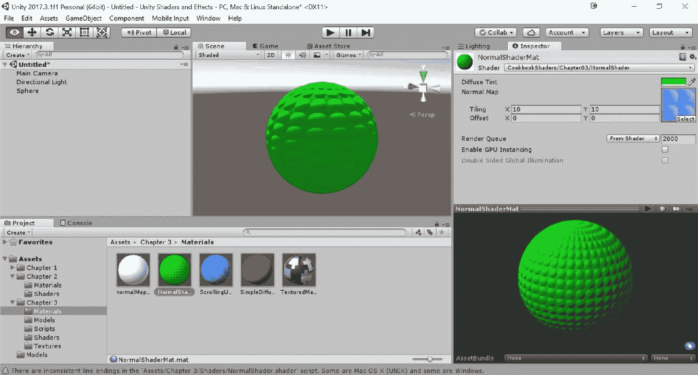

1.  以下截图展示了我们的法线贴图着色器的结果：

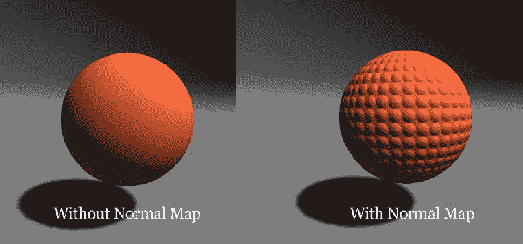

着色器可以同时具有纹理贴图和法线贴图。使用相同的 UV 数据来处理两者并不罕见。然而，在顶点数据中（UV2）提供一组次级 UV 也是可能的，这些 UV 专门用于法线贴图。

# 它是如何工作的...

执行正常映射效果的数学计算确实超出了本章的范围，但 Unity 已经为我们完成了所有这些。它为我们创建了函数，这样我们就不必一遍又一遍地重复做同样的事情。这也是为什么表面着色器是编写着色器的一种非常高效的方法的另一个原因。

如果你查看在 Unity 安装目录中的`Editor` | `Data` | `CGIncludes`文件夹中找到的`UnityCG.cginc`文件，你将找到`UnpackNormal()`函数的定义。当你在这个表面着色器中声明这个函数时，Unity 会为你处理提供的法线贴图，并给出正确的数据类型，以便你可以在你的每像素光照函数中使用它。这是一个节省大量时间的方法！在采样纹理时，你会从`0`到`1`得到 RGB 值；然而，法线向量的方向范围从`-1`到`1`。`UnpackNormal()`将这些分量带入正确的范围。

一旦使用`UnpackNormal()`函数处理了法线贴图，你就将其发送回你的`SurfaceOutput`结构体，以便在光照函数中使用。这是通过使用`o.Normal = normalMap.rgb;`来完成的。我们将在第四章，“理解光照模型”中看到法线是如何实际上用于计算每个像素的最终颜色的。

# 更多...

你还可以为你的法线贴图着色器添加一些控件，让用户调整法线贴图的强度。这可以通过修改法线贴图变量的`x`和`y`分量，然后将它们全部加回来轻松完成。在`Properties`块中添加另一个属性，并将其命名为`_NormalMapIntensity`：

```cs
_NormalMapIntensity("Normal intensity", Range(0,3)) = 1 
```

在这种情况下，我们赋予属性在`0`到`3`之间的能力，默认值为`1`。一旦创建，你需要在 SubShader 内部添加变量：

```cs
// Link the property to the CG program 
sampler2D _NormalTex; 
float4 _MainTint; 
float _NormalMapIntensity;
```

在添加属性后，我们可以利用它。将展开的法线贴图的`x`和`y`分量相乘，然后将此值以粗体显示的更改重新应用于法线贴图变量：

```cs
void surf (Input IN, inout SurfaceOutputStandard o) {
  // Use the tint provided as the base color for the material
  o.Albedo = _MainTint;

  // Get the normal data out of the normal map texture 
  // using the UnpackNormal function 
  float3 normalMap = UnpackNormal(tex2D(_NormalTex, 
    IN.uv_NormalTex)); 

 normalMap.x *= _NormalMapIntensity; 
 normalMap.y *= _NormalMapIntensity; 

 // Apply the new normal to the lighting model 
 o.Normal = normalize(normalMap.rgb); 
}
```

法线向量应该具有长度等于一的长度。将它们乘以`_NormalMapIntensity`会改变它们的长度，因此需要进行归一化。归一化函数将调整向量，使其指向正确的方向，但长度为 1，这正是我们所寻找的。

现在，你可以在材质的检查器标签中让用户调整法线贴图的强度，如下所示：

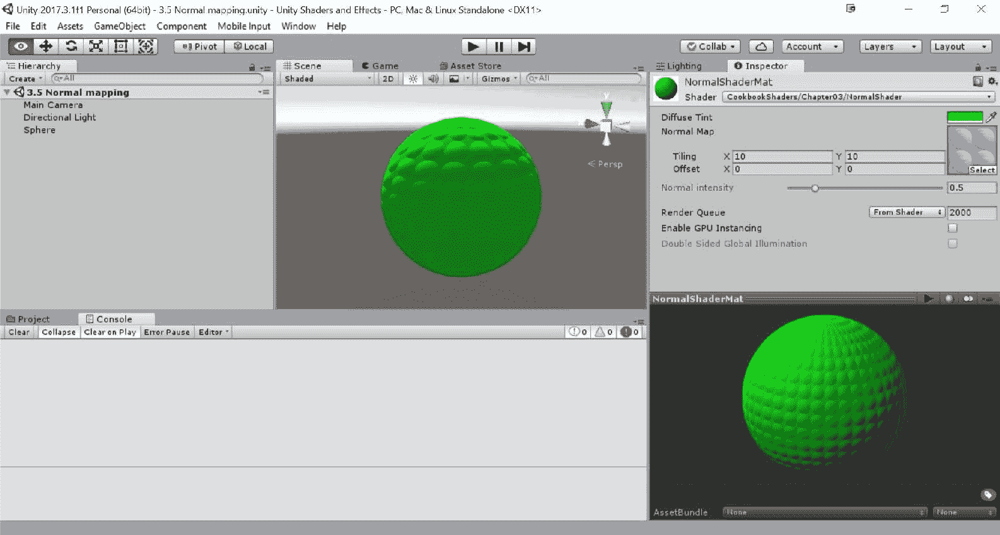

以下截图显示了使用我们的标量值修改法线贴图的结果：

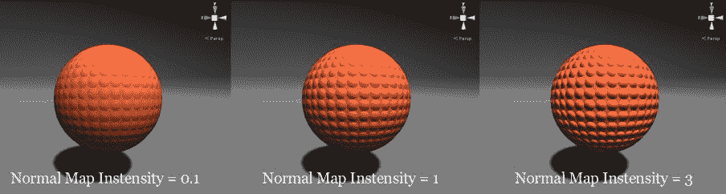

# 创建透明材质

我们迄今为止看到的着色器都有一个共同点；它们用于固体材质。如果你想改善游戏的外观，透明材质通常是一个很好的起点。它们可以用于从火焰效果到玻璃窗户的任何东西。不幸的是，与它们一起工作稍微复杂一些。在渲染固体模型之前，Unity 会根据从相机到模型的距离对它们进行排序（*Z 排序*），并跳过所有面向相机的三角形（**裁剪**）。当渲染透明几何体时，这两个方面有时会导致问题。这个配方将向你展示如何在创建透明表面着色器时解决这些问题。这个主题将在第七章（part0188.html#5J99O0-e8c76c858d514bc3b1668fda96f8fa08）中大量回顾，*片段着色器和抓取通道*，其中将提供逼真的玻璃和水着色器。

# 准备工作

这个配方需要一个新着色器，我们将称之为 `Transparent`，以及一个新的材质（`TransparentMat`），以便它可以附加到对象上。由于这将是一个透明玻璃窗户，一个四边形或平面是完美的（GameObject | 3D Objects | Quad）。我们还需要几个其他不透明对象来测试效果：

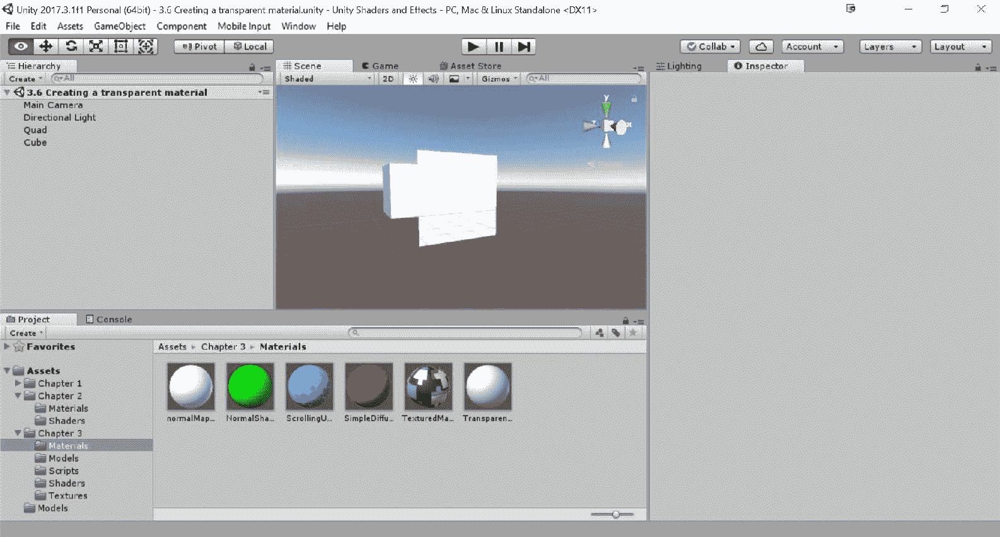

在这个例子中，我们将使用 PNG 图像文件作为玻璃纹理，因为它支持用于确定玻璃透明度的 alpha 通道。创建此类图像的过程取决于你使用的软件。然而，这些是你需要遵循的主要步骤：

1.  找到你想要用于窗户的玻璃图像。

1.  使用像 *GIMP* 或 *Photoshop* 这样的照片编辑软件打开它。

1.  选择你想要半透明的图像部分。

1.  在你的图像上创建一个白色（全不透明）的图层蒙版。

1.  使用之前选择的选项，用较深的颜色填充图层蒙版。白色被视为完全可见，黑色被视为不可见，灰色则介于两者之间。

1.  保存图像并将其导入 Unity。

本配方中使用的玩具图像是法国 *梅奥大教堂* 的彩色玻璃的图片 ([`en.wikipedia.org/wiki/Stained_glass`](https://en.wikipedia.org/wiki/Stained_glass))。如果你已经遵循了所有这些步骤，你的图像应该看起来像这样（**RGB** 通道在左侧，**A** 通道在右侧）：

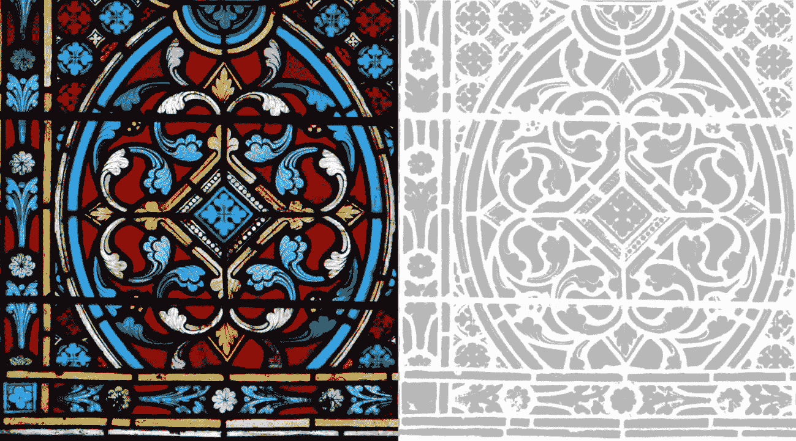

你还可以使用提供的示例代码中的图像文件（`Chapter 3` | `Textures` 文件夹中的 `Meaux_Vitrail.psd`）。

将此图像附加到材质上会使图像显示出来，但我们无法看到玻璃后面的内容：

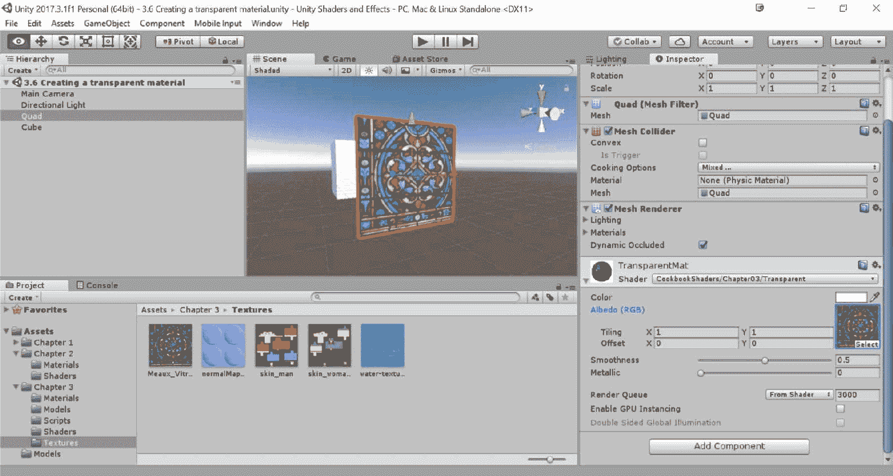

由于我们想看到背后的内容，我们可以调整着色器来实现这一点。

# 如何操作...

如前所述，在使用透明着色器时，有几个方面需要注意：

1.  从代码的`Properties`和`SubShader`部分移除`_Glossiness`和`_Metallic`变量，因为在这个示例中它们不是必需的。

1.  在着色器的`SubShader{}`部分中，修改`Tags`部分如下，以便我们可以发出信号，表明着色器是透明的：

```cs
Tags 
{ 
  "Queue" = "Transparent" 
  "IgnoreProjector" = "True" 
  "RenderType" = "Transparent" 
} 
```

标签由`SubShader`使用，以了解项目和何时渲染。类似于字典类型，标签是键值对，其中左侧是标签名称，右侧是您希望设置的值。

有关 ShaderLab 中标签的更多信息，请参阅：[`docs.unity3d.com/Manual/SL-SubShaderTags.html`](https://docs.unity3d.com/Manual/SL-SubShaderTags.html)

1.  由于这个着色器是为 2D 材质设计的，请确保通过在`LOD 200`行下方添加以下内容来防止模型的背面几何体被绘制：

```cs
    LOD 200

    // Do not show back
    Cull Back

    CGPROGRAM
    // Physically based Standard lighting model, and enable shadows on all light types
    #pragma surface surf Standard alpha:fade 
```

1.  告诉着色器，这个材质是透明的，并且需要与屏幕上绘制的内容混合：

```cs
#pragma surface surf Standard alpha:fade 
```

1.  使用此表面着色器确定玻璃的最终颜色和透明度：

```cs
void surf(Input IN, inout SurfaceOutputStandard o) 
{ 
  float4 c = tex2D(_MainTex, IN.uv_MainTex) * _Color; 
  o.Albedo = c.rgb; 
  o.Alpha = c.a; 
} 
```

1.  之后，保存您的脚本并返回到 Unity 编辑器：

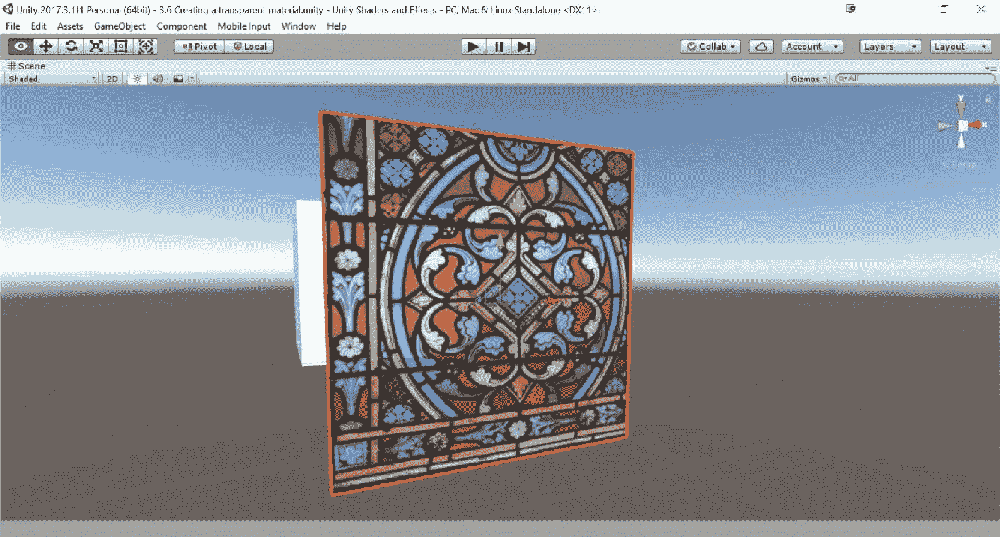

注意，您现在可以看到玻璃后面的立方体。太完美了！

# 它是如何工作的...

这个着色器引入了几个新概念。首先，`Tags`用于添加有关对象如何渲染的信息。这里真正有趣的是`Queue`。默认情况下，Unity 会根据对象与摄像机的距离为您排序对象。因此，当对象靠近摄像机时，它将覆盖所有远离摄像机的对象。对于大多数情况，这对游戏来说效果很好，但您会发现自己在某些情况下想要对场景中对象的排序有更多的控制。Unity 为我们提供了一些默认的渲染队列，每个队列都有一个独特的值，指示 Unity 何时将对象绘制到屏幕上。这些内置的渲染队列被称为`Background`、`Geometry`、`AlphaTest`、`Transparent`和`Overlay`。这些队列并非随意创建；它们实际上有助于我们在编写着色器和与实时渲染器交互时简化生活。

参考以下表格，了解每个单独渲染队列的用法描述：

| **渲染队列** | **渲染队列描述** | **渲染队列值** |
| --- | --- | --- |
| `Background` | 这个渲染队列首先渲染。它用于天空盒等。 | `1000` |
| `Geometry` | 这是默认的渲染队列。它用于大多数对象。不透明几何体使用此队列。 | `2000` |
| `AlphaTest` | 使用此队列进行 Alpha 测试的几何体。它与`Geometry`队列不同，因为它在绘制所有实体对象之后渲染 Alpha 测试对象更有效率。 | `2450` |
| `Transparent` | 此渲染队列在`Geometry`和`AlphaTest`队列之后按从后向前的顺序渲染。任何 alpha 混合（即不写入深度缓冲区的着色器）的内容应放在这里，例如，玻璃和粒子效果。 | `3000` |
| `Overlay` | 此渲染队列用于叠加效果。最后渲染的内容应放在这里，例如，镜头光晕。 | `4000` |

因此，一旦您知道您的对象属于哪个渲染队列，您就可以分配其内置的渲染队列标签。我们的着色器使用了`Transparent`队列，因此我们编写了`Tags{"Queue"="Transparent"}`。

`Transparent`队列在`Geometry`之后渲染的事实并不意味着我们的玻璃会出现在所有其他实体物体之上。Unity 将最后绘制玻璃，但它不会渲染属于被其他东西遮挡的几何形状的像素。这种控制是通过一种称为**ZBuffering**的技术完成的。有关模型渲染的更多信息，请参阅以下链接：[`docs.unity3d.com/Manual/SL-CullAndDepth.html`](http://docs.unity3d.com/Manual/SL-CullAndDepth.html)。

`IgnoreProjector`标签使此对象不受 Unity 投影器的影响。最后，`RenderType`在**着色器替换**中发挥作用，这个主题将在第十章游戏玩法和屏幕效果中简要介绍。

最后介绍的概念是`alpha:fade`。这表示所有来自这种材质的像素都必须根据它们的 alpha 值与屏幕上之前的内容混合。如果没有这个指令，像素将以正确的顺序绘制，但它们将没有任何透明度。

# 创建全息着色器

每年都有越来越多的以太空为主题的游戏发布。一款好的科幻游戏的一个重要部分是未来科技的表现和融入游戏玩法的方式。没有比全息投影更能体现未来感的了。尽管全息投影以多种形式存在，但它们通常被表示为半透明、薄薄的对象投影。这个配方向您展示了如何创建模拟这种效果的着色器。以此为起点：您可以添加噪声、动画扫描线、振动，以创建真正出色的全息效果。以下截图显示了全息效果的示例：

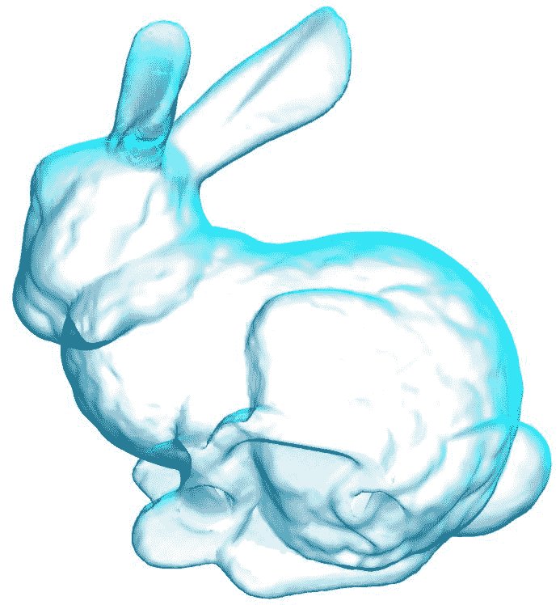

# 准备工作

创建一个名为`Holographic`的着色器。将其附加到材质（`HolographicMat`）并将它分配到场景中的 3D 模型：

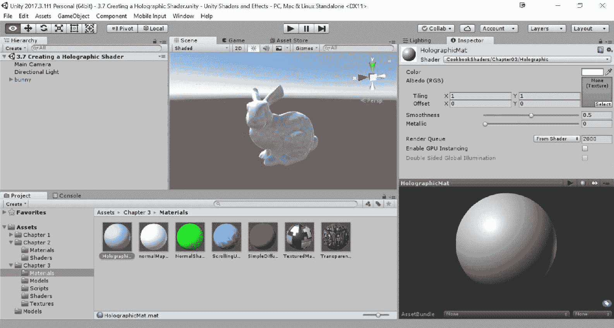

# 如何做到这一点...

以下更改将把我们的现有着色器转换为全息着色器：

1.  删除以下属性，因为它们将不会使用：

    +   `_Glossiness`

    +   `_Metallic`

1.  将以下属性添加到着色器中：

```cs
_DotProduct("Rim effect", Range(-1,1)) = 0.25 
```

1.  将其相应的变量添加到`CGPROGRAM`部分：

```cs
float _DotProduct; 
```

1.  由于这种材质是透明的，请添加以下标签：

```cs
Tags 
{ 
  "Queue" = "Transparent" 
  "IgnoreProjector" = "True" 
  "RenderType" = "Transparent" 
} 
```

根据你将使用的对象类型，你可能希望其背面看起来。如果是这样，添加`Cull Off`，这样模型的背面就不会被移除（*裁剪*）。

1.  这个着色器并不试图模拟真实材料，因此不需要使用 PBR 光照模型。相反，使用非常便宜的**朗伯反射**。此外，我们应该禁用任何带有`nolighting`的照明，并通知 Cg 这是一个使用`alpha:fade`的透明着色器：

```cs
#pragma surface surf Lambert alpha:fade nolighting 
```

1.  更改`Input`结构，以便 Unity 将其填充为当前视图方向和世界法线方向：

```cs
struct Input 
{ 
  float2 uv_MainTex; 
  float3 worldNormal; 
  float3 viewDir; 
}; 
```

1.  使用以下表面函数。请记住，由于这个着色器使用朗伯反射作为其光照函数，因此`SurfaceOutput`结构的名称应相应地更改为`SurfaceOutput`而不是`SurfaceOutputStandard`：

```cs
void surf(Input IN, inout SurfaceOutput o) 
{ 
  float4 c = tex2D(_MainTex, IN.uv_MainTex) * _Color; 
  o.Albedo = c.rgb; 

  float border = 1 - (abs(dot(IN.viewDir, 
     IN.worldNormal))); 
  float alpha = (border * (1 - _DotProduct) + _DotProduct); 
  o.Alpha = c.a * alpha; 
} 
```

1.  保存你的脚本并进入 Unity。从那里，更改 HolographicMat 中的颜色属性，看看你的全息图是如何变得生动起来的：

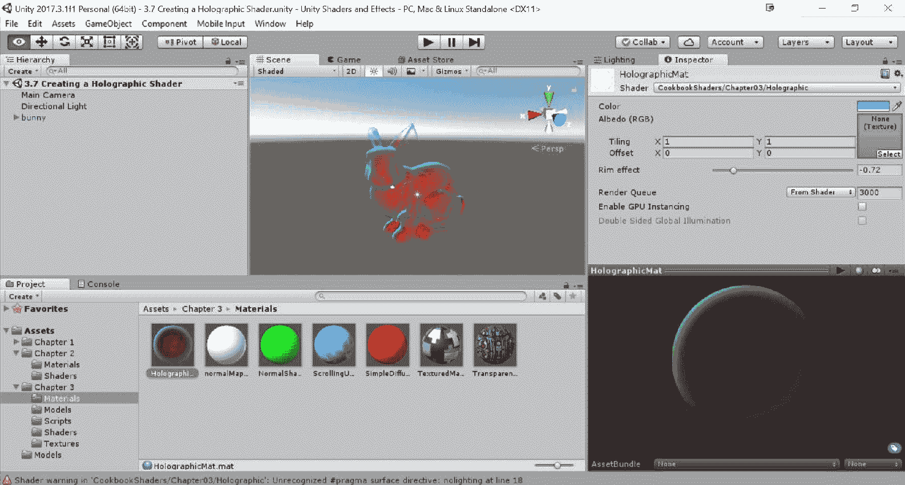

你现在可以使用边缘效果滑块来选择全息效果的强度。

# 它是如何工作的...

如前所述，这个着色器通过仅显示对象的轮廓来工作。如果我们从另一个角度观察对象，其轮廓将改变。从几何学角度讲，模型的边缘是所有那些其*法线方向*与当前*视图方向*正交（90 度）的三角形。`Input`结构分别声明了这些参数，`worldNormal`和`viewDir`。

使用`_DotProduct`可以解决理解两个向量是否正交的问题。这是一个操作符，它接受两个向量，如果它们是正交的，则返回零。我们使用`_DotProduct`来确定`_DotProduct`需要接近零到什么程度，以便三角形完全消失。

在这个着色器中使用的第二个方面是模型边缘（完全可见）与由`_DotProduct`确定的角（不可见）之间的柔和渐变。这种线性插值如下所示：

```cs
float alpha = (border * (1 - _DotProduct) + _DotProduct); 
```

最后，将原始纹理中的`alpha`与新计算的系数相乘，以实现最终的外观。

# 还有更多...

这种技术非常简单且相对便宜，但可以用于各种效果，如下所示：

+   科幻游戏中行星的略带色彩的气氛

+   已被选中或当前鼠标悬停下的对象边缘

+   一个幽灵或鬼魂

+   发动机排出的烟雾

+   爆炸的冲击波

+   正在受到攻击的宇宙飞船的气泡护盾

# 参见

`_DotProduct`在计算反射的方式中起着重要作用。第四章，*理解光照模型*，将详细解释它是如何工作的以及为什么它在许多着色器中被广泛使用。

# 纹理打包和混合

纹理不仅用于存储大量数据，不仅仅是像素颜色，正如我们通常所认为的那样，而且还用于在*x*和*y*方向以及 RGBA 通道中的多组像素。我们实际上可以将多个图像打包到一个 RGBA 纹理中，并通过从着色器代码中提取每个组件，将每个 R、G、B 和 A 组件用作单独的纹理。

将单个灰度图像打包到单个 RGBA 纹理中的结果可以在以下屏幕截图中看到：

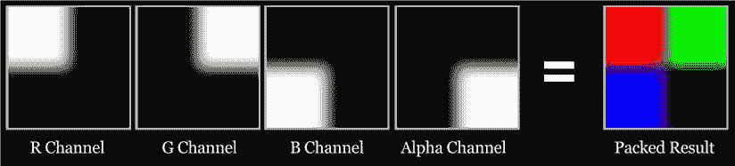

为什么这有帮助呢？好吧，从你的应用程序实际占用的内存量来看，纹理占据了应用程序大小的大部分。我们当然可以减小图像的大小，但这样我们就会失去它在表示方式上的细节。因此，为了开始减小应用程序的大小，我们可以查看我们在着色器中使用的所有图像，看看我们是否可以将这些纹理合并成一个纹理。使用包含多个图像的单个纹理比使用单独的文件需要更少的绘制调用和更少的开销。我们还可以使用这个概念将不规则形状的纹理（即不是正方形的纹理）合并成一个，这样占用的空间比给它们各自的全纹理要少。

任何灰度纹理都可以打包到另一个纹理的 RGBA 通道中。一开始这听起来可能有点奇怪，但这个配方将要演示打包纹理和使用这些打包纹理在着色器中的用途之一。

使用这些打包纹理的一个例子是当你想要将一组纹理混合到单个表面上的情况。你通常在地面类型着色器中看到这种情况，你需要使用某种控制纹理或打包纹理（在这种情况下）很好地融合到另一个纹理中。这个配方涵盖了这项技术，并展示了如何构建一个优秀的四纹理混合地面着色器的开始。

# 准备工作

让我们在`Shaders`文件夹中创建一个新的着色器文件（`TextureBlending`），然后为这个着色器创建一个新的材质（`TextureBlendingMat`）。着色器和材质文件的命名规范完全取决于你，所以尽量保持它们有组织，便于以后参考。

一旦你的着色器和材质准备好了，创建一个新的场景，我们可以在这个场景中测试我们的着色器。在场景内部，放置来自“第三章”|“模型”文件夹的`Terrain_001`对象，并将其`TextureBlendingMat`材质分配给它：


你还需要收集你想要混合的四个纹理。这些可以是任何东西，但为了一个漂亮的地面着色器，你将想要草地、泥土、多石泥土和岩石纹理。你可以在本书的示例代码中找到这些资源，在“第一章”|“标准资源”|“环境”|“地形资源”|“表面纹理”文件夹中。

最后，我们还需要一个包含灰度图像的混合纹理。这将给我们四个混合纹理，我们可以使用它们来指导颜色纹理如何放置在物体表面上。

我们可以使用非常复杂的混合纹理来在地形网格上创建非常逼真的地形纹理分布，如下面的屏幕截图所示：

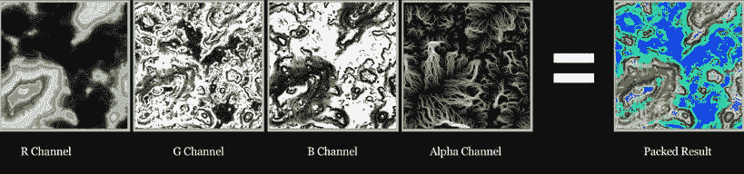

# 如何做到...

让我们通过以下步骤中的代码来学习如何使用打包纹理：

1.  我们需要在`Properties`块中添加一些属性。我们需要五个`sampler2D`对象，或纹理，以及两个`Color`属性：

```cs
Properties 
{ 
 _MainTint ("Diffuse Tint", Color) = (1,1,1,1) 

//Add the properties below so we can input all of our 
   textures 
  _ColorA ("Terrain Color A", Color) = (1,1,1,1) 
  _ColorB ("Terrain Color B", Color) = (1,1,1,1) 
  _RTexture ("Red Channel Texture", 2D) = ""{} 
  _GTexture ("Green Channel Texture", 2D) = ""{} 
  _BTexture ("Blue Channel Texture", 2D) = ""{} 
  _ATexture ("Alpha Channel Texture", 2D) = ""{} 
  _BlendTex ("Blend Texture", 2D) = ""{} 
} 
```

和往常一样，从我们的代码中移除我们不使用的基着色器属性。

1.  然后，我们需要创建`SubShader{}`部分变量，这将是我们与`Properties`块中的数据链接：

```cs
CGPROGRAM 
#pragma surface surf Lambert 

// Use shader model 3.5 target, to support enough textures
#pragma target 3.5
float4 _MainTint; 
float4 _ColorA; 
float4 _ColorB; 
sampler2D _RTexture; 
sampler2D _GTexture; 
sampler2D _BTexture; 
sampler2D _BlendTex; 
sampler2D _ATexture; 
```

1.  由于我们的着色器中包含的项目数量，我们需要将我们的着色器模型的目标版本更新到`3.5`：

有关着色器编译目标级别的更多信息，请参阅：[`docs.unity3d.com/Manual/SL-ShaderCompileTargets.html`](https://docs.unity3d.com/Manual/SL-ShaderCompileTargets.html)。

1.  因此，现在我们有了纹理属性，并将它们传递给我们的`SubShader{}`函数。为了允许用户按纹理基础更改平铺率，我们需要修改我们的`Input`结构。这将允许我们在每个纹理上使用平铺和偏移参数：

```cs
struct Input  
{ 
  float2 uv_RTexture; 
  float2 uv_GTexture; 
  float2 uv_BTexture; 
  float2 uv_ATexture; 
  float2 uv_BlendTex; 
}; 
```

1.  在`surf()`函数中，获取纹理信息并将其存储在其自己的变量中，这样我们就可以以干净、易于理解的方式处理数据：

```cs
  void surf (Input IN, inout SurfaceOutput o) {
    //Get the pixel data from the blend texture 
    //we need a float 4 here because the texture 
    //will return R,G,B,and A or X,Y,Z, and W 
    float4 blendData = tex2D(_BlendTex, IN.uv_BlendTex); 

    //Get the data from the textures we want to blend 
    float4 rTexData = tex2D(_RTexture, IN.uv_RTexture); 
    float4 gTexData = tex2D(_GTexture, IN.uv_GTexture); 
    float4 bTexData = tex2D(_BTexture, IN.uv_BTexture); 
    float4 aTexData = tex2D(_ATexture, IN.uv_ATexture); 
```

记住，由于我们使用了 Lambert，我们将使用`SurfaceOutput`而不是`SurfaceOutputStandard`作为`surf`函数。

1.  让我们使用`lerp()`函数将我们每个纹理混合在一起。它接受三个参数，`lerp(value : a, value : b, blend: c)`。`lerp()`函数接收两个纹理，并使用最后一个参数提供的浮点值将它们混合：

```cs
//No we need to construct a new RGBA value and add all  
//the different blended texture back together 
float4 finalColor; 
finalColor = lerp(rTexData, gTexData, blendData.g); 
finalColor = lerp(finalColor, bTexData, blendData.b); 
finalColor = lerp(finalColor, aTexData, blendData.a);
finalColor.a = 1.0;
```

1.  最后，我们将混合纹理乘以颜色着色值，并使用红色通道来确定两种不同的地形着色颜色放置的位置：

```cs
  //Add on our terrain tinting colors 
  float4 terrainLayers = lerp(_ColorA, _ColorB, blendData.r); 
  finalColor *= terrainLayers; 
  finalColor = saturate(finalColor); 

  o.Albedo = finalColor.rgb * _MainTint.rgb; 
  o.Alpha = finalColor.a;
}
```

1.  保存你的脚本，然后回到 Unity。一旦进入，你就可以将`TerrainBlend`纹理分配给混合纹理属性。完成此操作后，将不同的纹理放置在不同的通道中，以便看到我们的脚本在起作用：

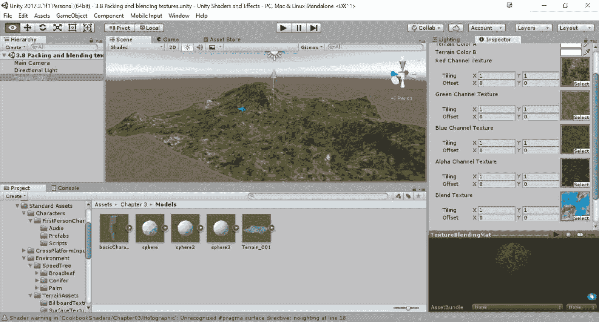

1.  通过使用不同的纹理和地形着色，我们可以进一步实现这一效果，以最小的努力创建出一些看起来很棒的地形。将四个地形纹理混合在一起并创建地形着色技术的结果可以在以下屏幕截图中看到：

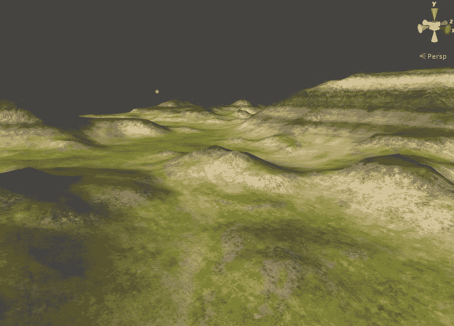

# 它是如何工作的...

这可能看起来像是很多行代码，但混合的概念实际上非常简单。为了使该技术生效，我们必须使用来自 `CgFX` 标准库的内置 `lerp()` 函数。这个函数允许我们使用第三个参数作为混合量，在第一个和第二个参数之间选择一个值：

| 函数 | 描述 |
| --- | --- |
| `lerp(a, b, f)` | 这涉及线性插值：*(1 - f)* a + b * f*在这里，`a` 和 `b` 是匹配的向量或标量类型。`f` 参数可以是与 `a` 和 `b` 相同类型的标量或向量。 |

例如，如果我们想找到 `1` 和 `2` 之间的中间值，我们可以将值 `0.5` 作为 `lerp()` 函数的第三个参数输入，它将返回值 `1.5`。这对于我们的混合需求来说非常完美，因为 RGBA 纹理中单个通道的值是单个浮点值，通常在 `0` 到 `1` 的范围内。

在着色器中，我们简单地从我们的混合纹理中取一个通道，并使用它来驱动每个像素中选择的颜色，在 `lerp()` 函数中。例如，我们取我们的草地纹理和泥土纹理，使用混合纹理的红通道，并将其输入到 `lerp()` 函数中。这将为我们提供每个像素表面的正确混合颜色结果。

使用 `lerp()` 函数时发生的情况的更直观表示如下所示：


着色器代码简单地使用混合纹理的四个通道和所有颜色纹理来创建最终的混合纹理。然后，这个最终纹理将成为我们可以与漫反射光照相乘的颜色。

# 在你的地形周围创建一个圆

许多即时战略游戏通过在选定的单位周围画圆来显示距离（攻击范围、移动距离、视野等）。如果地形是平坦的，这可以通过拉伸一个带有圆形纹理的四边形来完成。如果不是这样，四边形很可能会被山丘或其他几何图形裁剪掉。这个配方将向你展示如何创建一个着色器，允许你在任意复杂性的对象周围画圆。如果你想能够移动或动画化你的圆，我们需要一个着色器和 C# 脚本。

以下截图显示了使用着色器在丘陵地区绘制圆的示例：

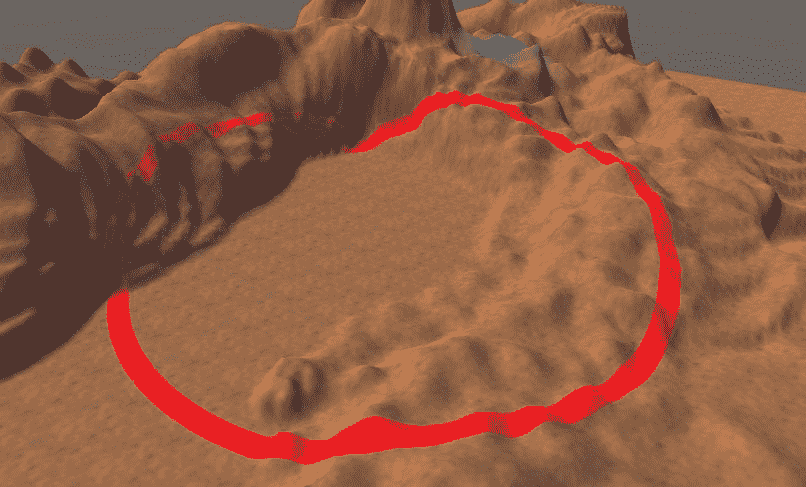

# 准备工作

尽管与每一块几何图形都有关联，但这种技术主要针对地形。因此，第一步是在 Unity 中设置一个地形，但我们将不在模型中使用，而是在 Unity 编辑器内创建一个：

1.  让我们从创建一个新的着色器 `RadiusShader` 和相应的材质 `RadiusMat` 开始。

1.  准备好你的对象角色；我们将围绕它画一个圆。

1.  从菜单中，导航到 GameObject | 3D Object | Terrain 创建一个新的地形。

1.  为你的地形创建几何形状。你可以导入现有的一个，或者使用可用的工具（提升/降低地形，绘制高度，平滑高度）来绘制自己的地形。

1.  在 Unity 中，地形是特殊对象，纹理映射的方式与传统 3D 模型不同。你不能从着色器提供`_MainTex`，因为它需要直接从地形本身提供。为此，选择绘制纹理，然后点击添加纹理...：

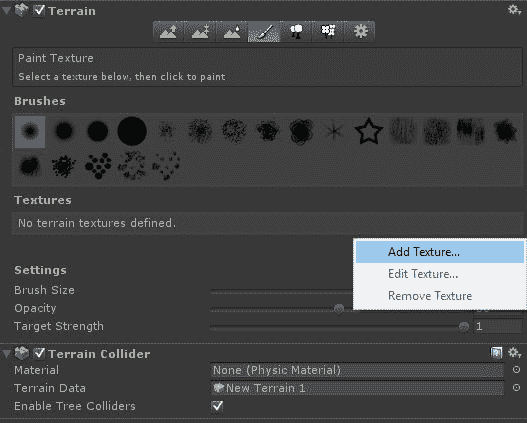

本书没有涵盖地形的创建，但如果你想了解更多，请查看以下链接：[`docs.unity3d.com/Manual/terrain-UsingTerrains.html`](https://docs.unity3d.com/Manual/terrain-UsingTerrains.html)

1.  现在纹理已经设置好了，你必须更改地形的材质，以便提供一个自定义着色器。从地形设置中，将材质属性更改为`Custom`，然后将半径材质拖到`Custom Material`框中：

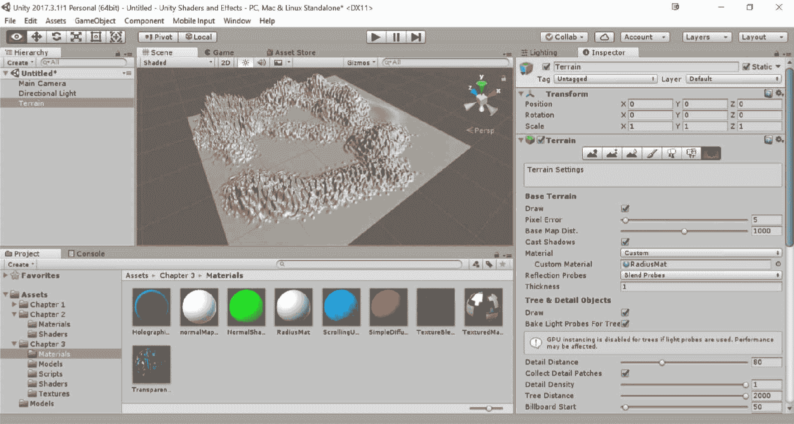

你现在可以创建你的着色器了。

# 如何做到这一点...

让我们先编辑`RadiusShader`文件：

1.  在新的着色器中，删除`_Glossiness`和`_Metallic`属性，并添加以下四个属性：

```cs
_Center("Center", Vector) = (200,0,200,0) 
_Radius("Radius", Float) = 100 
_RadiusColor("Radius Color", Color) = (1,0,0,1) 
_RadiusWidth("Radius Width", Float) = 10
```

1.  将它们各自的变量添加到`CGPROGRAM`部分，记得删除`_Glossiness`和`_Metallic`的声明：

```cs
float3 _Center; 
float _Radius; 
fixed4 _RadiusColor; 
float _RadiusWidth; 
```

1.  `Input`到我们的表面函数不仅需要纹理的 UV，还需要地形的每个点的位置（在世界坐标中）。我们可以通过更改`struct Input`来检索此参数：

```cs
struct Input 
{ 
  float2 uv_MainTex; // The UV of the terrain texture 
  float3 worldPos;   // The in-world position 
}; 
```

1.  最后，我们使用这个表面函数：

```cs
void surf(Input IN, inout SurfaceOutputStandard o) 
{
  // Get the distance between the center of the 
  // place we wish to draw from and the input's 
  // world position
  float d = distance(_Center, IN.worldPos);

  // If the distance is larger than the radius and
  // it is less than our radius + width change the color
  if ((d > _Radius) && (d < (_Radius + _RadiusWidth)))
  {
    o.Albedo = _RadiusColor;
  }
  // Otherwise, use the normal color
  else
  {
    o.Albedo = tex2D(_MainTex, IN.uv_MainTex).rgb;
  }
}
```

这些步骤就是绘制地形上的圆圈所需的所有步骤。你可以使用材质的检查器选项卡来更改圆圈的位置、半径和颜色：

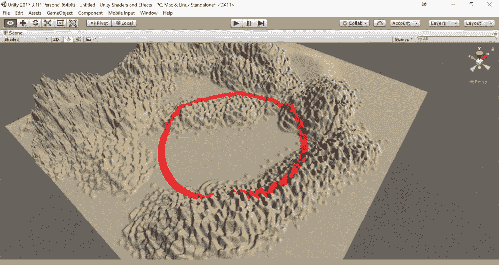

# 移动圆圈

这很棒，但你可能还希望更改运行时圆圈的位置，我们可以通过代码来实现。如果你想让圆圈跟随你的角色，则需要其他步骤：

1.  创建一个新的 C#脚本，命名为`SetRadiusProperties`。

1.  由于你可能希望在游戏和编辑器中都能看到这个变化，我们可以在类顶部添加一个标签，表示在游戏运行时执行此代码，通过添加以下标签：

```cs
[ExecuteInEditMode]
public class SetRadiusProperties : MonoBehaviour
```

1.  将以下属性添加到脚本中：

```cs
public Material radiusMaterial; 
public float radius = 1; 
public Color color = Color.white; 
```

1.  在`Update()`方法中，添加以下代码行：

```cs
if(radiusMaterial != null)
{
    radiusMaterial.SetVector("_Center", transform.position);
    radiusMaterial.SetFloat("_Radius", radius);
    radiusMaterial.SetColor("_RadiusColor", color);
}
```

1.  将脚本附加到你希望绘制圆圈的对象上。

1.  最后，将`RadiusMat`材质拖到脚本的半径材质槽中：

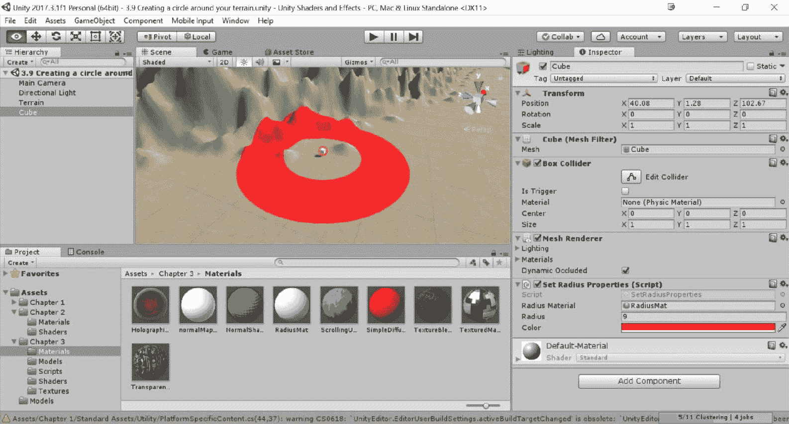

现在，你可以移动你的角色，这将围绕它创建一个漂亮的圆圈。更改`Radius`脚本的属性将更改半径。

# 它是如何工作的...

绘制圆的相关参数包括其中心、半径和颜色。这些参数在着色器中均可用，分别以 `_Center`、`_Radius` 和 `_RadiusColor` 命名。通过将 `worldPos` 变量添加到 `Input` 结构中，我们请求 Unity 提供我们正在绘制的像素的位置，该位置以世界坐标表示。这是在编辑器中对象的实际位置。

`surf()` 函数是实际绘制圆的地方。它计算正在绘制的点与半径中心的距离，然后检查它是否位于 `_Radius` 和 `_Radius + _RadiusWidth` 之间；如果是这种情况，它使用所选颜色。在其他情况下，它就像我们迄今为止看到的所有其他着色器一样，对纹理图进行采样。
