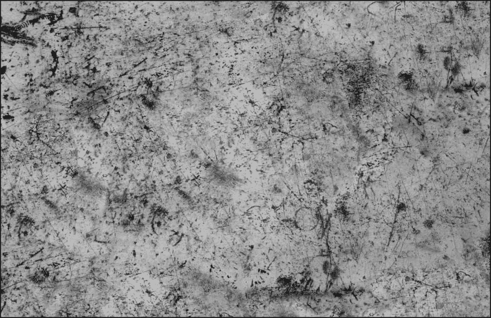

# 第九章：使用 Unity 渲染纹理的屏幕效果

在本章中，你将学习以下食谱：

+   设置屏幕效果脚本系统

+   使用亮度、饱和度和对比度与屏幕效果

+   使用类似 Photoshop 的基本混合模式与屏幕效果

+   使用叠加混合模式与屏幕效果

# 简介

学习编写着色器最令人印象深刻的一面是创建自己的屏幕效果的过程，也称为后期效果。有了这些屏幕效果，我们可以通过泛光、运动模糊、HDR 效果等创建令人惊叹的实时图像。如今市场上大多数现代游戏都大量使用这些屏幕效果来实现景深效果、泛光效果，甚至色彩校正效果。

在第一章“后期处理堆栈”中，我们讨论了如何使用 Unity 内置的后期处理堆栈，但在这章中，你将学习如何自己构建脚本系统。这个系统将赋予你创建许多种屏幕效果的控件。我们将涵盖`RenderTexture`、深度缓冲区是什么，以及如何创建能够让你对游戏最终渲染图像有类似 Photoshop 控制效果的方法。通过为你的游戏利用屏幕效果，你不仅完善了你的着色器编写知识，而且还将拥有从零开始使用 Unity 创建自己令人难以置信的实时渲染的能力。

# 设置屏幕效果脚本系统

创建屏幕效果的过程是我们抓取全屏图像（或纹理），使用着色器在 GPU 上处理其像素，然后将它发送回 Unity 的渲染器以应用于整个游戏的渲染图像。这使我们能够在实时中对游戏的渲染图像进行逐像素操作，从而给我们提供更全局的艺术控制。

想象一下，如果你必须逐个调整游戏中每个对象的材质，仅仅调整游戏最终外观的对比度。虽然不是不可能，但这需要一些劳动来完成。通过利用屏幕效果，我们可以整体调整屏幕的最终外观，从而让我们对游戏最终外观有更多的类似 Photoshop 的控制。

为了让屏幕效果系统运行起来，我们必须设置一个单独的脚本来作为游戏当前渲染图像的使者，或者 Unity 所说的`RenderTexture`。通过利用这个脚本将`RenderTexture`传递给着色器，我们可以创建一个灵活的系统来建立屏幕效果。对于我们的第一个屏幕效果，我们将创建一个非常简单的灰度效果，使我们的游戏看起来是黑白的。让我们看看这是如何实现的。

# 准备工作

为了让我们的屏幕效果系统运行起来，我们需要为我们的当前 Unity 项目创建一些资产。通过这样做，我们将为以下章节中的步骤做好准备：

1.  在当前项目中创建一个新的场景来工作。

1.  在场景中创建一个简单的球体，并为其分配一个新的材质（我称之为`RedMat`）。这个新材质可以是任何东西，但为了我们的示例，我们将使用 Standard Shader 创建一个简单的红色材质。

1.  最后，创建一个新的方向光并保存场景。

1.  我们需要创建一个新的 C#脚本并命名为`TestRenderImage.cs`。为了组织目的，从项目选项卡创建一个名为`Scripts`的文件夹来放置它。

在所有资产准备就绪后，你应该有一个简单的场景设置，看起来类似于以下截图：


# 如何做到这一点...

为了让我们的灰度屏幕效果工作，我们需要一个脚本和着色器。因此，我们将在这里完成这两个新项目，并填充适当的代码以产生我们的第一个屏幕效果。我们的第一个任务是完成 C#脚本。这将使整个系统运行。在此之后，我们将完成着色器并查看屏幕效果的结果。让我们按照以下步骤完成我们的脚本和着色器：

1.  打开`TestRenderImage.cs` C#脚本，首先输入一些我们将需要存储重要对象和数据的变量。在`TestRenderImage`类的顶部输入以下代码：

```cs
#region Variables
public Shader curShader;
public float greyscaleAmount = 1.0f;
private Material screenMat;
#endregion
```

1.  为了让我们能够实时编辑屏幕效果，当 Unity 编辑器没有播放时，我们需要在`TestRenderImage`类的声明上方输入以下代码行：

```cs
using UnityEngine;

[ExecuteInEditMode]
public class TestRenderImage : MonoBehaviour {
```

1.  由于我们的屏幕效果正在使用着色器在我们的屏幕图像上执行像素操作，我们必须创建一个材质来运行着色器。没有这个，我们无法访问着色器的属性。为此，我们将创建一个 C#属性来检查材质，并在找不到时创建一个。在*步骤 1*的变量声明之后输入以下代码：

```cs
#region Properties
Material ScreenMat
{
    get
    {
        if (screenMat == null)
        {
            screenMat = new Material(curShader);
            screenMat.hideFlags = HideFlags.HideAndDontSave;
        }
        return screenMat;
    }
}
#endregion
```

1.  现在，我们想在脚本中设置一些检查，以查看我们正在构建 Unity 游戏的当前目标平台是否实际上支持图像效果。如果脚本开始时找不到任何东西，那么脚本将禁用自己：

```cs
void Start()
{
    if (!SystemInfo.supportsImageEffects)
    {
        enabled = false;
        return;
    }

    if (!curShader && !curShader.isSupported)
    {
        enabled = false;
    }
}
```

1.  为了从 Unity 渲染器实际获取渲染的图像，我们需要使用 Unity 为我们提供的以下内置函数，称为`OnRenderImage()`。输入以下代码以便我们可以访问当前的`RenderTexture`：

```cs
void OnRenderImage(RenderTexture sourceTexture, RenderTexture destTexture)
{
    if (curShader != null)
    {
        ScreenMat.SetFloat("_Luminosity", greyscaleAmount);

        Graphics.Blit(sourceTexture, destTexture, ScreenMat);
    }
    else
    {
        Graphics.Blit(sourceTexture, destTexture);
    }
}
```

1.  我们的屏幕效果有一个名为`grayScaleAmount`的变量，我们可以用它来控制我们想要的最终屏幕效果的灰度程度。因此，在这种情况下，我们需要将值从`0`变为`1`，其中`0`表示没有灰度效果，而`1`表示全灰度效果。我们将在`Update()`函数中执行此操作，该函数将在游戏运行时每帧被调用：

```cs
void Update ()
{
    greyscaleAmount = Mathf.Clamp(greyscaleAmount, 0.0f, 1.0f);
}
```

1.  最后，我们通过在脚本开始时创建的对象上进行一些清理来完成我们的脚本：

```cs
void OnDisable()
{
  if(screenMat)
  {
    DestroyImmediate(screenMat);
  }
}
```

1.  到目前为止，我们可以在 Unity 中将此脚本应用于相机，如果它没有错误地编译，让我们将 `TestRenderImage.cs` 脚本应用到场景中的主相机上。你应该看到 `grayScaleAmount` 值和一个着色器字段，但脚本在控制台窗口中抛出一个错误。它说缺少一个对象实例，因此无法适当地处理。如果你还记得 *步骤 4*，我们正在做一些检查，看看我们是否有着色器以及当前平台是否支持着色器。因为我们没有给屏幕效果脚本提供一个着色器来工作，所以 `curShader` 变量只是 null，这会抛出一个错误。让我们通过完成着色器来继续我们的屏幕效果系统。

1.  创建一个新的着色器，命名为 `ScreenGrayscale`。为了开始我们的着色器，我们将用一些变量填充我们的 `Properties`，这样我们就可以将数据发送到这个着色器：

```cs
Properties 
{
 _MainTex ("Base (RGB)", 2D) = "white" {}
 _Luminosity("Luminosity", Range(0.0, 1)) = 1.0
}
```

1.  我们现在的着色器将利用纯 CG 着色器代码，而不是使用 Unity 内置的 Surface Shader 代码。这将使我们的屏幕效果更加优化，因为我们只需要处理 `RenderTexture` 的像素。因此，我们将删除 `Pass` 中之前的所有内容，并在我们的着色器中创建一个新的 `Pass` 块，并用一些我们之前未见过的新的 `#pragma` 语句填充它：

```cs
SubShader 
{
  Pass
  {
    CGPROGRAM
    #pragma vertex vert_img
    #pragma fragment frag
    #pragma fragmentoption ARB_precision_hint_fastest
    #include "UnityCG.cginc"
```

1.  为了访问从 Unity 编辑器发送到着色器的数据，我们需要在我们的 `CGPROGRAM` 中创建相应的变量：

```cs
uniform sampler2D _MainTex;
fixed _Luminosity;
```

1.  最后，我们只需要设置我们的像素函数，在这个例子中称为 `frag()`。这是屏幕效果的核心所在。这个函数将处理 `RenderTexture` 的每个像素，并将新的图像返回到 `TestRenderImage.cs` 脚本：

```cs
fixed4 frag(v2f_img i) : COLOR
{
  //Get the colors from the RenderTexture and the uv's
  //from the v2f_img struct
  fixed4 renderTex = tex2D(_MainTex, i.uv);

  //Apply the Luminosity values to our render texture
  float luminosity = 0.299 * renderTex.r + 0.587 * renderTex.g + 0.114 * renderTex.b;
  fixed4 finalColor = lerp(renderTex, luminosity, _Luminosity);

  renderTex.rgb = finalColor;

  return renderTex;
}
```

1.  最后，将 `FallBack` 行更改为以下内容：

```cs
FallBack off
```

1.  最终的着色器应如下所示：

```cs
Shader "CookbookShaders/Chapter09/Grayscale" 
{
  Properties 
  {
    _MainTex ("Base (RGB)", 2D) = "white" {}
    _Luminosity("Luminosity", Range(0.0, 1)) = 1.0
  }

  SubShader 
  {
    Pass
    {
      CGPROGRAM
      #pragma vertex vert_img
      #pragma fragment frag
      #pragma fragmentoption ARB_precision_hint_fastest
      #include "UnityCG.cginc"

      uniform sampler2D _MainTex;
      fixed _Luminosity;

      fixed4 frag(v2f_img i) : COLOR
      {
        //Get the colors from the RenderTexture and the uv's
        //from the v2f_img struct
        fixed4 renderTex = tex2D(_MainTex, i.uv);

        //Apply the Luminosity values to our render texture
        float luminosity = 0.299 * renderTex.r + 0.587 * renderTex.g + 0.114 * renderTex.b;
        fixed4 finalColor = lerp(renderTex, luminosity, _Luminosity);

        renderTex.rgb = finalColor;

        return renderTex;
      }

    ENDCG
    }
  }
  FallBack off
}
```

一旦着色器完成，返回 Unity 并让它编译以查看是否发生了错误。如果没有错误，将新的着色器分配给 `TestRenderImage.cs` 脚本并更改灰度量变量的值。你应该看到游戏视图从彩色游戏版本变为灰度游戏版本：


以下截图演示了此屏幕效果：


完成后，我们现在有一个简单的方法来测试新的屏幕效果着色器，而无需反复编写整个屏幕效果系统。让我们深入了解，了解 `RenderTexture` 在其存在过程中是如何处理的。

# 它是如何工作的...

要在 Unity 中实现屏幕效果，我们需要创建一个脚本和着色器。脚本驱动编辑器中的实时更新，并负责从主相机捕获 `RenderTexture` 并传递给着色器。一旦 `RenderTexture` 到达着色器，我们就可以使用着色器执行逐像素操作。

在脚本开始时，我们执行一些检查以确保当前选定的构建平台实际上支持屏幕效果以及着色器本身。有些情况下，当前平台可能不支持屏幕效果或我们使用的着色器。因此，我们在 `Start()` 函数中进行的检查确保如果平台不支持屏幕系统，我们不会遇到任何错误。

一旦脚本通过这些检查，我们就通过调用内置的 `OnRenderImage()` 函数来初始化屏幕效果系统。这个函数负责获取 `renderTexture`，使用 `Graphics.Blit()` 函数将其传递给着色器，并将处理后的图像返回给 Unity 渲染器。你可以在以下网址找到有关这两个函数的更多信息：

+   `OnRenderImage`: [`docs.unity3d.com/Documentation/ScriptReference/MonoBehaviour.OnRenderImage.html`](http://docs.unity3d.com/Documentation/ScriptReference/MonoBehaviour.OnRenderImage.html)

+   `Graphics.Blit`:[`docs.unity3d.com/Documentation/ScriptReference/Graphics.Blit.html`](http://docs.unity3d.com/Documentation/ScriptReference/Graphics.Blit.html)

当当前的 `RenderTexture` 达到着色器时，着色器将其获取，通过 `frag()` 函数进行处理，并为每个像素返回最终颜色。

你可以看到这有多么强大，因为它让我们对游戏最终渲染图像有了类似 Photoshop 的控制。这些屏幕效果像 Photoshop 层一样按顺序工作，覆盖在摄像机所看到的内容之上。当你一个接一个地放置这些屏幕效果时，它们将按此顺序进行处理。这些只是让屏幕效果工作起来的基本步骤，但这是屏幕效果系统工作的核心。

# 还有更多...

现在我们已经有一个简单的屏幕效果系统正在运行，让我们看看我们可以从 Unity 的渲染器中获得的一些其他有用信息：


我们实际上可以通过打开 Unity 的内置深度模式来获取我们当前游戏中所有事物的深度。一旦打开，我们就可以使用深度信息来实现大量不同的效果。让我们看看如何实现这一点：

1.  将我们创建的球体复制两次，并在下面创建一个平面：


1.  通过选择 `ScreenGreyscale` 代码并按 *Ctrl *+ *D* 复制来创建一个新的着色器。一旦复制，将脚本重命名为 `SceneDepth`。然后双击此着色器以在脚本编辑器中打开它。

1.  我们将创建主纹理 (`_MainTex`) 属性和一个用于控制场景深度效果强度的属性。在你的着色器中输入以下代码：

```cs
Properties 
{
  _MainTex ("Base (RGB)", 2D) = "white" {}
  _DepthPower("Depth Power", Range(0, 1)) = 1
}
```

1.  现在我们需要在我们的 `CGPROGRAM` 中创建相应的变量。我们将添加一个名为 `_CameraDepthTexture` 的额外变量。这是一个内置变量，Unity 通过使用 `UnityCG.cginclude` 文件提供给我们。它为我们提供了来自摄像机的深度信息：

```cs
Pass
{
  CGPROGRAM
  #pragma vertex vert_img
  #pragma fragment frag
  #pragma fragmentoption ARB_precision_hint_fastest
  #include "UnityCG.cginc"

  uniform sampler2D _MainTex;
 fixed _DepthPower;
 sampler2D _CameraDepthTexture;
```

1.  我们将通过利用 Unity 为我们提供的几个内置函数来完成我们的深度着色器，这些函数是`UNITY_SAMPLE_DEPTH()`和`linear01Depth()`。第一个函数实际上从我们的`_CameraDepthTexture`中获取深度信息，并为每个像素生成一个单独的浮点值。然后`Linear01Depth()`函数确保这些值在`0`-`1`范围内，通过将最终的深度值取到我们可以控制的幂，其中`0`-`1`范围内的中值基于相机位置位于场景中：

```cs
fixed4 frag(v2f_img i) : COLOR
{
  //Get the colors from the RenderTexture and the uv's
  //from the v2f_img struct
  float depth = UNITY_SAMPLE_DEPTH(tex2D(_CameraDepthTexture, i.uv.xy));
  depth = pow(Linear01Depth(depth), _DepthPower);

  return depth;
}
```

1.  在我们的着色器完成后，让我们将注意力转向 Unity 编辑器，并创建一个新的脚本以与之配合。选择我们的`TestRenderImage`脚本并复制它。将这个新脚本命名为`RenderDepth`并在脚本编辑器中打开它。

1.  将脚本更新为与我们在上一步中重命名的类名相同（`RenderDepth`）：

```cs
using UnityEngine;

[ExecuteInEditMode]
public class RenderDepth : MonoBehaviour {
```

1.  我们需要在脚本中添加`depthPower`变量，以便我们可以在编辑器中让用户更改该值：

```cs
#region Variables
public Shader curShader;
public float depthPower = 0.2f;
private Material screenMat;
#endregion
```

1.  然后，我们的`OnRenderImage()`函数需要更新，以便它向我们的着色器传递正确的值：

```cs
void OnRenderImage(RenderTexture sourceTexture, RenderTexture destTexture)
{
    if (curShader != null)
    {
        ScreenMat.SetFloat("_DepthPower", depthPower);

        Graphics.Blit(sourceTexture, destTexture, ScreenMat);
    }
    else
    {
        Graphics.Blit(sourceTexture, destTexture);
    }
}
```

1.  为了完成我们的深度屏幕效果，我们需要告诉 Unity 在当前相机中开启深度渲染。这可以通过简单地设置主相机的`depthTextureMode`来完成：

```cs
void Update ()
{
    Camera.main.depthTextureMode = DepthTextureMode.Depth;
    depthPower = Mathf.Clamp(depthPower, 0, 1);
}
```

在设置好所有代码后，保存你的脚本和着色器，并返回 Unity 让它们都编译。之后，选择主相机，在 TextRenderImage 组件上右键单击，并选择移除组件。之后，将这个新组件附加到对象上，并将我们新的着色器拖放到里面。如果没有遇到错误，你应该会看到一个类似于以下截图的结果：


如果我们进一步调整这些值，我们可以得到以下示例：


# 使用亮度、饱和度和对比度与屏幕效果结合

现在我们已经将屏幕效果系统搭建起来并运行，我们可以探索如何创建更复杂的像素操作来执行游戏中今天常见的某些屏幕效果。

使用屏幕效果来调整游戏的整体最终颜色对于让艺术家对游戏最终外观拥有全局控制至关重要。例如，颜色调整滑块等技术允许用户调整最终渲染游戏中的红色、蓝色和绿色的强度。这一概念也用于像棕褐色调效果这样的技术，在整个屏幕上覆盖某种色调的颜色。

对于这个特定的配方，我们将介绍一些我们可以在图像上执行的核心颜色调整操作。这些是亮度、饱和度和对比度。学习如何编写这些颜色调整代码为我们提供了一个很好的基础，我们可以从中学习屏幕效果的艺术。

# 准备工作

我们需要创建一些新的资产。我们可以利用与我们的测试场景相同的场景，但我们需要一个新的脚本和着色器：

1.  通过访问文件 | 新场景来创建一个新的场景。

1.  在场景中添加几个新对象，设置一些不同颜色的漫反射材质，并将它们随机分配给场景中的新对象。这将为我们提供良好的颜色范围来测试我们的新屏幕效果：


# 如何做到这一点...

现在我们已经完成了场景设置并创建了新的脚本和着色器，我们可以开始填写实现亮度、饱和度和对比度屏幕效果的必要代码。我们将专注于脚本和着色器的像素操作和变量设置，因为在本章的*设置屏幕效果脚本系统*食谱中描述了如何设置屏幕效果系统：

1.  通过从项目标签下的`第九章`|`着色器`文件夹中选择`ScreenGreyscale`代码并按*Ctrl* + *D*来复制一个新的着色器。一旦复制，将脚本重命名为`ScreenBSC`。然后双击此着色器以在脚本编辑器中打开它。

1.  首先编辑着色器更有意义，这样我们就会知道我们的 C#脚本需要哪些变量。让我们先输入亮度、饱和度和对比度效果的适当属性。记住，我们需要在着色器中保留`_MainTex`属性，因为这是`RenderTexture`在创建屏幕效果时指向的属性：

```cs
Properties 
{
  _MainTex ("Base (RGB)", 2D) = "white" {}
  _Brightness("Brightness", Range(0.0, 1)) = 1.0
  _Saturation("Saturation", Range(0.0, 1)) = 1.0
  _Contrast("Contrast", Range(0.0, 1)) = 1.0
}
```

1.  如同往常一样，为了在我们`CGPROGRAM`中访问来自属性的数据，我们需要在`CGPROGRAM`中创建相应的变量，替换之前的变量：

```cs
Pass
{
  CGPROGRAM
  #pragma vertex vert_img
  #pragma fragment frag
  #pragma fragmentoption ARB_precision_hint_fastest
  #include "UnityCG.cginc"

 uniform sampler2D _MainTex;
 fixed _Brightness;
 fixed _Saturation;
 fixed _Contrast;
```

1.  现在，我们需要创建执行亮度、饱和度和对比度效果的运算。在我们的着色器中，在`frag()`函数之上输入以下新函数：

```cs
float3 ContrastSaturationBrightness(float3 color, float brt, float sat, float con)
{
  // Increase or decrease these values to 
  //adjust r, g and b color channels separately
  float AvgLumR = 0.5;
  float AvgLumG = 0.5;
  float AvgLumB = 0.5;

//Luminance coefficients for getting lumoinance from the image
  float3 LuminanceCoeff = float3(0.2125, 0.7154, 0.0721);

  //Operation for brightness
  float3 AvgLumin = float3(AvgLumR, AvgLumG, AvgLumB);
  float3 brtColor = color * brt;
  float intensityf = dot(brtColor, LuminanceCoeff);
  float3 intensity = float3(intensityf, intensityf, intensityf);

  //Operation for Saturation
  float3 satColor = lerp(intensity, brtColor, sat);

  //Operation for Contrast
  float3 conColor = lerp(AvgLumin, satColor, con);
  return conColor;
}
```

如果现在还不明白也没有关系；所有代码将在本食谱的*工作原理*部分进行解释。

1.  最后，我们只需更新我们的`frag()`函数以实际使用`ContrastSaturationBrightness()`函数。这将处理我们的`RenderTexture`的所有像素，并将其传递回我们的脚本：

```cs
fixed4 frag(v2f_img i) : COLOR
{
  //Get the colors from the RenderTexture and the uv's
  //from the v2f_img struct
  fixed4 renderTex = tex2D(_MainTex, i.uv);

  //Apply the Brughtness, saturation, contrast operations
  renderTex.rgb = ContrastSaturationBrightness(renderTex.rgb, 
                        _Brightness, 
                        _Saturation, 
                        _Contrast);

  return renderTex;
}
```

在着色器中输入代码后，返回 Unity 编辑器以让新着色器编译。如果没有错误，我们可以返回代码编辑器来工作。让我们开始创建一些新的代码行，将适当的数据发送到我们的着色器：

1.  现在着色器已经完成，让我们开始编写使效果显示所需的脚本。从项目标签，转到`第九章`|`脚本`文件夹。一旦到达那里，选择`TestRenderImage`脚本并按*Ctrl* + *D*进行复制。将新创建的脚本重命名为`RenderBSC`。一旦重命名，双击它以进入您选择的 IDE。

1.  要修改我们的脚本，我们需要将类名重命名为与我们的文件名匹配，即`RenderBSC`：

```cs
[ExecuteInEditMode]
public class RenderBSC : MonoBehaviour {
```

1.  之后，我们需要添加驱动屏幕效果值的正确变量。在这种情况下，我们需要一个亮度滑块、一个饱和度滑块和一个对比度滑块：

```cs
#region Variables
public Shader curShader;
public float brightness = 1.0f;
public float saturation = 1.0f;
public float contrast = 1.0f;
private Material screenMat;
#endregion
```

1.  在设置好我们的变量后，我们现在需要告诉脚本将我们创建的变量的值发送到着色器。我们在`OnRenderImage()`函数中这样做：

```cs
void OnRenderImage(RenderTexture sourceTexture, RenderTexture destTexture)
{
    if (curShader != null)
    {
        ScreenMat.SetFloat("_Brightness", brightness);
        ScreenMat.SetFloat("_Saturation", saturation);
        ScreenMat.SetFloat("_Contrast", contrast);

        Graphics.Blit(sourceTexture, destTexture, ScreenMat);
    }
    else
    {
        Graphics.Blit(sourceTexture, destTexture);
    }
}
```

1.  最后，我们只需要将变量的值限制在合理的范围内。这些钳位值完全是主观的，所以你可以使用你认为合适的任何值：

```cs
void Update()
{
    brightness = Mathf.Clamp(brightness, 0.0f, 2.0f);
    saturation = Mathf.Clamp(saturation, 0.0f, 2.0f);
    contrast = Mathf.Clamp(contrast, 0.0f, 3.0f);
}
```

在脚本完成和着色器完成后，我们只需将我们的脚本分配给我们的主相机，将着色器分配给脚本，你应该会看到通过操作属性值实现的亮度、饱和度和对比度效果：


以下截图显示了使用此屏幕效果可以实现的结果：


以下截图显示了通过调整渲染图像的颜色可以实现的另一个示例：


# 它是如何工作的...

既然我们已经了解了基本屏幕效果系统的工作原理，那么我们就来了解一下在`ContrastSaturationBrightness()`函数中创建的逐像素操作。

函数首先接受几个参数。第一个也是最重要的参数是当前的`RenderTexture`。其他参数只是简单地调整屏幕效果的整体效果，并在屏幕效果的“检查器”标签页中以滑块的形式表示。一旦函数接收到`RenderTexture`和调整值，它就会声明一些常量值，我们使用这些值来修改并与原始的`RenderTexture`进行比较。

`luminanceCoeff`变量存储了将给我们提供当前图像整体亮度的值。这些系数基于 CIE 颜色匹配函数，并且在整个行业中相当标准化。我们可以通过获取当前图像与这些亮度系数的点积来找到图像的整体亮度。一旦我们有了亮度，我们只需使用几个`lerp`函数来混合亮度操作的灰度版本和原始图像，乘以传递给函数的亮度值。

这样的屏幕效果对于实现你游戏中高质量的图形至关重要，因为它们让你可以调整游戏最终的外观，而无需编辑当前游戏场景中的每个材质。

# 使用基本的 Photoshop-like 混合模式与屏幕效果

屏幕效果不仅限于调整我们游戏中渲染图像的颜色。我们还可以使用它们将其他图像与我们的`RenderTexture`结合。这种技术与在 Photoshop 中创建一个新图层并选择混合模式来混合两个图像或，在我们的情况下，一个纹理与`RenderTexture`没有区别。这成为了一种非常强大的技术，因为它为制作环境中的艺术家提供了一种在游戏中模拟他们的混合模式的方法，而不仅仅是 Photoshop 中。

对于这个特定的菜谱，我们将查看一些更常见的混合模式，例如乘法、加法和叠加。您将看到在游戏中拥有 Photoshop 混合模式的力量是多么简单。

# 准备工作

首先，我们必须准备好我们的资产。所以让我们遵循接下来的几个步骤，为我们的新混合模式屏幕效果启动屏幕效果系统：

1.  我们需要另一个纹理来执行我们的混合模式效果。在这个菜谱中，我们将使用一种磨损类型的纹理。这将使我们在测试时效果非常明显。

1.  以下截图是制作此效果时使用的磨损纹理。找到一个具有足够细节和良好灰度值范围的纹理将使我们的新效果测试变得很棒：



前面的纹理可以在本书的示例代码中找到，位于`第九章`|`纹理`文件夹中。

# 如何操作...

我们将实现的第一种混合模式是 Photoshop 中看到的乘法混合模式。让我们首先修改我们的着色器中的代码：

1.  通过在`第九章`|`着色器`文件夹下从项目标签中选择`ScreenGreyscale`代码并按*Ctrl* + *D*来复制它，创建一个新的着色器。一旦复制，将脚本重命名为`ScreenBlendMode`。然后，双击此着色器以在脚本编辑器中打开它。

1.  我们需要添加一些新属性，以便我们有一个可以混合的纹理和一个滑块来调整我们想要使用的混合模式的最终数量。在你的新着色器中输入以下代码：

```cs
Properties 
{
  _MainTex ("Base (RGB)", 2D) = "white" {}
  _BlendTex ("Blend Texture", 2D) = "white"{}
  _Opacity ("Blend Opacity", Range(0,1)) = 1
}
```

1.  在我们的`CGPROGRAM`中输入相应的变量，以便我们可以从我们的`Properties`块访问数据，替换之前创建的变量：

```cs
Pass
{
  CGPROGRAM
  #pragma vertex vert_img
  #pragma fragment frag
  #pragma fragmentoption ARB_precision_hint_fastest
  #include "UnityCG.cginc"

 uniform sampler2D _MainTex;
 uniform sampler2D _BlendTex;
 fixed _Opacity;
```

1.  我们修改我们的`frag()`函数，以便它对两个纹理执行乘法操作：

```cs
fixed4 frag(v2f_img i) : COLOR
{
  //Get the colors from the RenderTexture and the uv's
  //from the v2f_img struct
  fixed4 renderTex = tex2D(_MainTex, i.uv);
  fixed4 blendTex = tex2D(_BlendTex, i.uv);

  //Perform a multiply Blend mode
  fixed4 blendedMultiply = renderTex * blendTex;

  //Adjust amount of Blend Mode with a lerp
  renderTex = lerp(renderTex, blendedMultiply, _Opacity);

  return renderTex;
}
```

1.  保存着色器并返回 Unity 编辑器，让新的着色器代码编译并检查错误。如果没有发生错误，那么我们可以继续创建我们的脚本文件。

1.  着色器完成后，让我们开始编写使效果显示所需的脚本。从项目标签中，转到`第九章`|`脚本`文件夹。一旦到达那里，选择`TestRenderImage`脚本并按*Ctrl* + *D*复制它。将新创建的脚本重命名为`RenderBlendMode`。一旦重命名，双击它以进入您选择的 IDE。

1.  修改我们的脚本的第一步是重命名类以匹配我们的文件名，`RenderBlendMode`：

```cs
[ExecuteInEditMode]
public class RenderBlendMode : MonoBehaviour {
```

1.  在我们的脚本文件中，我们需要创建相应的变量。我们需要一个纹理，以便我们可以将其分配给着色器，以及一个滑块来调整我们想要使用的混合模式的最终数量：

```cs
#region Variables
public Shader curShader;
public Texture2D blendTexture;
public float blendOpacity = 1.0f;
private Material screenMat;
#endregion
```

1.  然后，我们需要通过`OnRenderImage()`函数将我们的变量数据发送到着色器中：

```cs
void OnRenderImage(RenderTexture sourceTexture, RenderTexture destTexture)
{
    if (curShader != null)
    {
        ScreenMat.SetTexture("_BlendTex", blendTexture);
        ScreenMat.SetFloat("_Opacity", blendOpacity);

        Graphics.Blit(sourceTexture, destTexture, ScreenMat);
    }
    else
    {
        Graphics.Blit(sourceTexture, destTexture);
    }
}
```

1.  要完成脚本，我们只需填写我们的`Update()`函数，以便我们可以将`blendOpacity`变量的值限制在`0.0`和`1.0`之间：

```cs
void Update()
{
    blendOpacity = Mathf.Clamp(blendOpacity, 0.0f, 1.0f);
}
```

1.  完成后，我们将屏幕效果脚本分配给我们的主相机（如果之前附加了`Render BSC`脚本，请将其移除），并将我们的屏幕效果着色器添加到脚本中，以便它有一个用于每个像素操作的着色器。为了使效果完全功能，脚本和着色器会查找一个纹理。您可以在屏幕效果脚本的检查器中将任何纹理分配给纹理字段。一旦这个纹理到位，您将看到将这个纹理乘以游戏渲染截图的效果：


1.  以下截图展示了具有较小`Blend Opacity`选项的屏幕效果：


在我们设置好第一个混合模式后，我们可以开始添加几个更简单的混合模式，以更好地理解添加更多效果以及如何轻松地在游戏中微调最终结果。然而，首先让我们分析一下这里发生了什么。

# 它是如何工作的...

现在我们开始在屏幕效果编程中获得大量的功能和灵活性。我相信你现在开始理解你在 Unity 中可以用这个简单的系统做多少事情。我们实际上可以复制 Photoshop 图层混合模式的效果到我们的游戏中，为艺术家提供他们需要的灵活性，以便在短时间内实现高质量的图形。

在这个特定的食谱中，我们看看如何将两个图像相乘，将两个图像相加，并执行屏幕混合模式，只需一点数学知识。当使用混合模式时，你必须从每个像素的角度去思考。例如，当我们使用乘法混合模式时，我们实际上是从原始`RenderTexture`中取出每个像素，并将其与混合纹理的每个像素相乘。对于加法混合模式也是如此。它只是将源纹理或`RenderTexture`中的每个像素简单地加到混合纹理上。

屏幕混合模式确实要复杂一些，但它实际上在做的是同样的事情。它对每个图像、`RenderTexture`和混合纹理进行反转，然后将它们相乘，再次反转以实现最终的外观。就像 Photoshop 使用混合模式混合纹理一样，我们也可以用屏幕效果做到同样的事情。

# 更多...

让我们通过添加几个更多的混合模式到我们的屏幕效果中继续这个食谱：

1.  在屏幕效果着色器中，让我们在我们的`frag()`函数中添加以下代码，并将我们返回给脚本的值更改。我们还需要注释掉乘法混合模式，这样就不会返回它：

```cs
fixed4 frag(v2f_img i) : COLOR
{
  //Get the colors from the RenderTexture and the uv's
  //from the v2f_img struct
  fixed4 renderTex = tex2D(_MainTex, i.uv);
  fixed4 blendTex = tex2D(_BlendTex, i.uv);

  //Perform a multiply Blend mode
 //fixed4 blendedMultiply = renderTex * blendTex;

 //Perform an additive Blend mode
 fixed4 blendedAdd = renderTex + blendTex;

  //Adjust amount of Blend Mode with a lerp
  renderTex = lerp(renderTex, blendedAdd, _Opacity);

  return renderTex;
}
```

1.  将着色器文件保存在你选择的 IDE 中（例如`MonoDevelop`）并返回 Unity 编辑器，让着色器进行编译。如果没有错误发生，你应该会看到以下截图类似的结果：


1.  这是一个简单的加法混合模式，`Blend Opacity`设置为`0.5`：


如你所见，这与乘法的效果相反，因为我们是在将两个图像相加。

1.  最后，让我们添加一个名为屏幕混合的更多混合模式。这个混合模式在数学上稍微复杂一些，但仍然易于实现。在着色器的 `frag()` 函数中输入以下代码：

```cs
    fixed4 frag(v2f_img i) : COLOR
    {
      //Get the colors from the RenderTexture and the uv's
      //from the v2f_img struct
      fixed4 renderTex = tex2D(_MainTex, i.uv);
      fixed4 blendTex = tex2D(_BlendTex, i.uv);

      //Perform a multiply Blend mode
      //fixed4 blendedMultiply = renderTex * blendTex;

      //Perform an additive Blend mode
 //fixed4 blendedAdd = renderTex + blendTex;

 //Perform screen blending mode
 fixed4 blendedScreen = (1.0 - ((1.0 - renderTex) * (1.0 - blendTex)));

      //Adjust amount of Blend Mode with a lerp
      renderTex = lerp(renderTex, blendedScreen, _Opacity);

      return renderTex;
    }

```

以下截图展示了使用屏幕类型混合模式将两个图像混合在一起在屏幕效果中的结果：


这是一个显示效果的截图：


# 使用屏幕效果与叠加混合模式

对于我们的最终配方，我们将查看另一种类型的混合模式，即叠加混合模式。这种混合模式实际上使用了一些条件语句来确定每个通道中每个像素的最终颜色。因此，使用这种类型的混合模式需要更多的编码才能工作。让我们看看在接下来的几个配方中是如何实现的。

# 如何做到...

为了开始我们的叠加屏幕效果，我们需要确保我们的着色器代码没有错误并运行起来。然后我们可以修改我们的脚本文件，以便向着色器提供正确的数据：

1.  通过复制 `ScreenGreyscale` 代码并从 `Chapter 9 | Shaders` 文件夹下的项目标签页中选择它，然后按 *Ctrl* + *D* 来创建一个新的着色器。一旦复制完成，将脚本重命名为 `ScreenOverlay`。然后，双击此着色器以在脚本编辑器中打开它。

1.  我们首先需要在 `Properties` 块中设置属性。我们将使用本章前面几个配方中相同的属性：

```cs
Properties 
{
  _MainTex ("Base (RGB)", 2D) = "white" {}
  _BlendTex ("Blend Texture", 2D) = "white"{}
  _Opacity ("Blend Opacity", Range(0,1)) = 1
}
```

1.  然后，我们需要在 `CGPROGRAM` 中创建相应的变量，删除之前创建的变量：

```cs
Pass
{
  CGPROGRAM
  #pragma vertex vert_img
  #pragma fragment frag
  #pragma fragmentoption ARB_precision_hint_fastest
  #include "UnityCG.cginc"

  uniform sampler2D _MainTex;
  uniform sampler2D _BlendTex;
  fixed _Opacity;
```

1.  为了让叠加混合效果工作，我们必须对每个通道的每个像素进行单独处理。要在着色器中这样做，我们必须编写一个自定义函数，该函数将接受单个通道，例如红色通道，并执行叠加操作。在着色器中变量声明下方输入以下代码：

```cs
fixed OverlayBlendMode(fixed basePixel, fixed blendPixel)
{
  if(basePixel < 0.5)
  {
    return (2.0 * basePixel * blendPixel);
  }
  else
  {
    return (1.0 - 2.0 * (1.0 - basePixel) * (1.0 - blendPixel));
  }
}
```

1.  我们需要更新我们的 `frag()` 函数，以便处理我们的纹理的每个通道，以执行混合：

```cs
fixed4 frag(v2f_img i) : COLOR
{
  //Get the colors from the RenderTexture and the uv's
  //from the v2f_img struct
  fixed4 renderTex = tex2D(_MainTex, i.uv);
  fixed4 blendTex = tex2D(_BlendTex, i.uv);

  fixed4 blendedImage = renderTex;

  blendedImage.r = OverlayBlendMode(renderTex.r, blendTex.r);
  blendedImage.g = OverlayBlendMode(renderTex.g, blendTex.g);
  blendedImage.b = OverlayBlendMode(renderTex.b, blendTex.b);

  //Adjust amount of Blend Mode with a lerp
  renderTex = lerp(renderTex, blendedImage, _Opacity);

  return renderTex;
}
```

1.  在着色器中完成代码后，我们的效果应该已经开始工作了。保存着色器并返回到 Unity 编辑器，让着色器进行编译。我们的脚本已经设置好了；选择主摄像机对象。从项目标签页，将 ScreenOverlay 着色器拖放到检查器标签页中的渲染混合模式组件的 `Cur Shader` 属性上。一旦着色器编译完成，你应该会看到一个类似于以下截图的结果：


这是一个使用 `0.5` 混合不透明度的截图：


# 它是如何工作的...

我们的叠加混合模式确实更为复杂，但如果你真正分解其功能，你会发现它实际上只是一个乘法混合模式和屏幕混合模式。在这种情况下，我们进行条件检查，以将一个或另一个混合模式应用于像素。

在这个特定的屏幕效果中，当叠加功能接收到一个像素时，它会检查该像素是否小于`0.5`。如果是，则对该像素应用修改后的乘法混合模式；如果不是，则对该像素应用修改后的屏幕混合模式。我们对每个通道的每个像素都这样做，从而得到屏幕效果的最终 RGB 像素值。

如你所见，可以使用屏幕效果做很多事情。这实际上完全取决于平台和分配给屏幕效果的内存量。通常，这会在游戏项目的整个过程中确定，所以尽情享受并发挥创意，制作出有趣的屏幕效果。
