# 游戏玩法和屏幕效果

当涉及到创建逼真和沉浸式的游戏时，材质设计并不是我们需要考虑的唯一方面。整体感觉可以通过屏幕效果来改变。这在电影中非常常见，例如，在后期制作阶段校正颜色。你可以在游戏中使用从第九章，“使用 Unity 渲染纹理的屏幕效果”中获得的知识来实现这些技术。本章中介绍了两个有趣的效果；然而，你可以根据需要调整它们，创建你自己的屏幕效果。

在本章中，你将学习以下内容：

+   创建老电影屏幕效果

+   创建夜视屏幕效果

# 简介

如果你正在阅读这本书，你很可能是这样一个在某个时候玩过一两个游戏的人。实时游戏的一个方面是让玩家沉浸在一个世界中，让他们感觉就像他们真的在现实世界中玩游戏一样。更现代的游戏大量使用屏幕效果来实现这种沉浸感。

通过屏幕效果，我们只需改变屏幕的外观，就能将某个环境的情绪从平静转变为恐怖。想象一下走进一个位于关卡内的房间，然后游戏接管并进入一个电影时刻。许多现代游戏会开启不同的屏幕效果来改变当前时刻的氛围。了解如何创建由游戏玩法触发的效果是我们关于着色器编写的旅程中的下一个环节。

在本章中，我们将探讨一些更常见的游戏玩法屏幕效果。你将学习如何将游戏的外观从正常转变为老电影效果，并且我们将探讨许多第一人称射击游戏如何将夜视效果应用到屏幕上。对于这些配方中的每一个，我们将探讨如何将它们连接到游戏事件，以便它们根据游戏当前的表现需求开启和关闭。

# 创建老电影屏幕效果

许多游戏设定在不同的时代。有些发生在幻想世界或未来科幻世界中，有些甚至发生在老西部，当时电影摄影机刚刚被开发出来，人们观看的电影是黑白或有时被一种称为**棕褐色效果**的颜色着色。这种外观非常独特，我们将使用 Unity 中的屏幕效果来复制这种外观。

要实现这种外观有几个步骤；仅仅为了让整个屏幕变成黑白或灰度，我们需要将这个效果分解为其组成部分。如果我们分析一些老电影的参考片段，我们就可以开始这样做。让我们看一下以下图像，并分解构成老电影外观的元素：

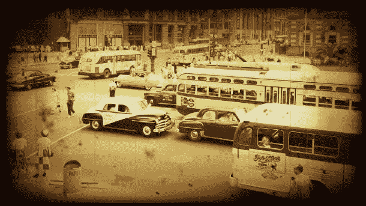

我们使用网上找到的一些参考图像构建了这张图片。尝试使用 Photoshop 构建这样的图片总是一个好主意，这可以帮助你为新屏幕效果制定计划。执行此过程不仅告诉我们将需要编码的元素，而且还给我们提供了一个快速查看哪些混合模式有效以及我们将如何构建屏幕效果层的方法。

# 准备工作

现在我们知道了我们要制作什么，让我们看看每一层是如何组合在一起以创建最终效果，并为我们的着色器和屏幕效果脚本收集一些资源：

+   **棕褐色调**：这是一个相对简单的效果，因为我们只需要将原始渲染纹理的所有像素颜色调整到单个颜色范围内。这可以通过使用原始图像的亮度并添加一个常数颜色轻松实现。我们的第一层将看起来像以下截图：

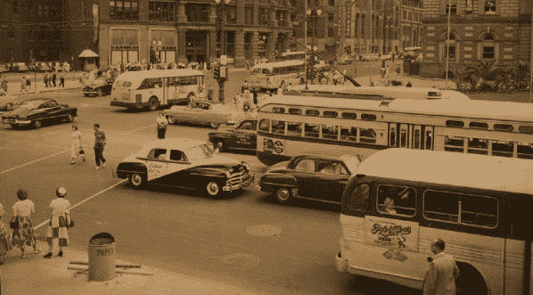

+   **晕影效果**：当使用老旧电影放映机放映老电影时，我们总能看到某种类型的软边框。这是由于用于电影放映机的灯泡在电影边缘的亮度比中间的亮度要低。这种效果通常被称为晕影效果，并且是屏幕效果的第二层。我们可以通过在整个屏幕上叠加纹理来实现这一点。以下截图演示了这一层看起来像什么，隔离为纹理：

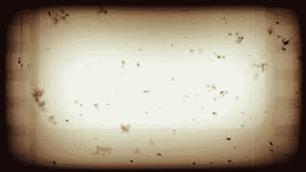

+   **灰尘和划痕**：在我们老旧电影屏幕效果中的第三和最后一层是灰尘和划痕。这一层将利用两种不同的平铺纹理，一种用于划痕，一种用于灰尘。原因是我们将想要在时间上以不同的平铺速率动画化这两种纹理。这将产生一种效果，即电影在移动，并且每一帧的老电影上都有小划痕和灰尘。以下截图演示了将此效果隔离到其自身纹理中的样子：

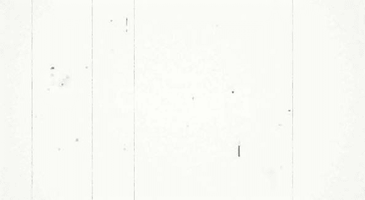

让我们使用前面的纹理准备好我们的屏幕效果系统。执行以下步骤：

1.  收集晕影纹理和灰尘划痕纹理，就像我们刚才看到的那些。

1.  我们还需要一个场景，我们想要模拟我们试图构建的效果。我创建了一个示例场景，你可以将其用于示例代码中的`第十章`文件夹，名为`10.1 Starter Scene`：

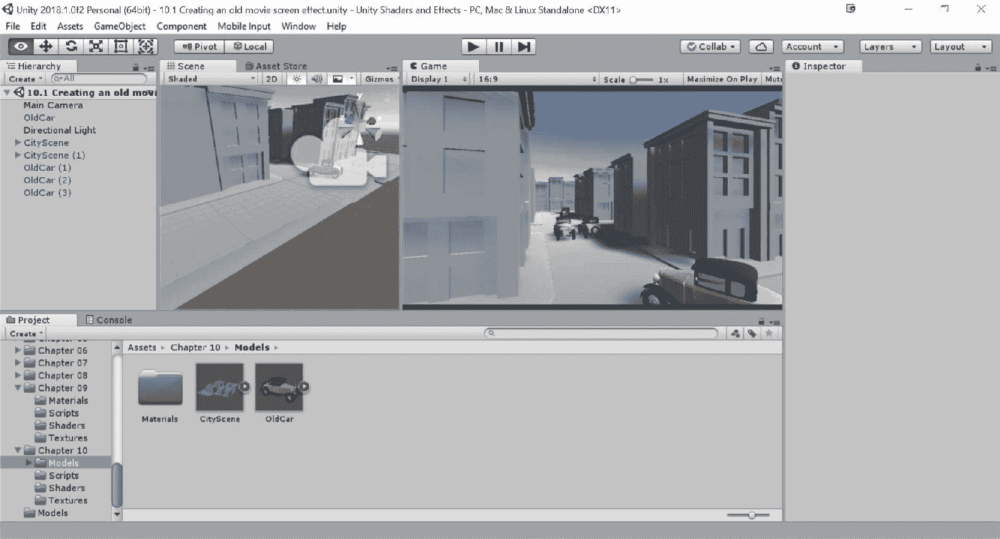

1.  通过复制`ScreenGrayscale`代码创建一个新的着色器；从`第九章`|`着色器`文件夹下的`项目`选项卡中选择它，然后按*Ctrl* + *D*。一旦复制，将脚本重命名为`ScreenOldFilm`。然后，将脚本拖放到`第十章`|`着色器`文件夹中，如果需要则创建它。

1.  接下来，转到`第九章`|`脚本`文件夹，复制`TestRenderImage`脚本。将新文件重命名为`RenderOldFilm`，然后将其拖放到`第十章`|`脚本`文件夹中，如果需要则创建它。

最后，当我们的屏幕效果系统运行良好并且我们已经收集了纹理后，我们可以开始重新创建这个老式电影效果的过程。

# 如何做到这一点...

我们的老式电影屏幕效果的各个单独层相当简单，但结合在一起，我们会得到一些非常视觉上令人惊叹的效果。让我们来了解一下如何构建我们的脚本和着色器的代码，然后我们可以逐行分析代码，了解为什么事情会以这种方式工作。到目前为止，你应该已经启动并运行了屏幕效果系统，因为我们不会在这个配方中介绍如何设置它。

1.  我们将从在脚本中输入代码开始。修改我们的脚本的第一步是将类名重命名为与我们的文件名匹配，`RenderOldFilm`：

```cs
[ExecuteInEditMode]
public class RenderOldFilm : MonoBehaviour {
```

1.  我们将要输入的第一个代码块将定义我们想要暴露给 Inspector 的变量，以便用户可以根据需要调整此效果。我们还可以在决定需要暴露给此效果 Inspector 的内容时，将我们的模拟 Photoshop 文件作为参考。在你的效果脚本中输入以下代码：

```cs
#region Variables 
public Shader curShader; // old film shader

public float OldFilmEffectAmount = 1.0f;

public Color sepiaColor = Color.white;
public Texture2D vignetteTexture;
public float vignetteAmount = 1.0f;

public Texture2D scratchesTexture;
public float scratchesYSpeed = 10.0f;
public float scratchesXSpeed = 10.0f;

public Texture2D dustTexture;
public float dustYSpeed = 10.0f;
public float dustXSpeed = 10.0f;

private Material screenMat;
private float randomValue;
#endregion
```

1.  接下来，我们需要填充我们的 `OnRenderImage()` 函数的内容。在这里，我们将从我们的变量传递数据到着色器，以便着色器可以使用这些数据来处理渲染纹理：

```cs
void OnRenderImage(RenderTexture sourceTexture, RenderTexture destTexture)
{
    if (curShader != null)
    {
        ScreenMat.SetColor("_SepiaColor", sepiaColor);
        ScreenMat.SetFloat("_VignetteAmount", vignetteAmount);
        ScreenMat.SetFloat("_EffectAmount", OldFilmEffectAmount);

        if (vignetteTexture)
        {
            ScreenMat.SetTexture("_VignetteTex", vignetteTexture);
        }

        if (scratchesTexture)
        {
            ScreenMat.SetTexture("_ScratchesTex", scratchesTexture);
            ScreenMat.SetFloat("_ScratchesYSpeed", scratchesYSpeed);
            ScreenMat.SetFloat("_ScratchesXSpeed", scratchesXSpeed);
        }

        if (dustTexture)
        {
            ScreenMat.SetTexture("_DustTex", dustTexture);
            ScreenMat.SetFloat("_dustYSpeed", dustYSpeed);
            ScreenMat.SetFloat("_dustXSpeed", dustXSpeed);
            ScreenMat.SetFloat("_RandomValue", randomValue);
        }

        Graphics.Blit(sourceTexture, destTexture, ScreenMat);
    }
    else
    {
        Graphics.Blit(sourceTexture, destTexture);
    }
}
```

1.  为了完成这个效果的脚本部分，我们只需确保我们将需要限制范围的变量值进行限制，而不是任何值：

```cs
void Update()
{
    vignetteAmount = Mathf.Clamp01(vignetteAmount);
    OldFilmEffectAmount = Mathf.Clamp(OldFilmEffectAmount, 0f, 1.5f);
    randomValue = Random.Range(-1f, 1f);
}
```

1.  我们的脚本完成后，让我们将注意力转向我们的着色器文件。我们需要创建在脚本中创建的相应变量，这样脚本和着色器就可以相互通信。在着色器的 `Properties` 块中输入以下代码：

```cs
Properties 
{ 
    _MainTex ("Base (RGB)", 2D) = "white" {} 
    _VignetteTex ("Vignette Texture", 2D) = "white"{} 
    _ScratchesTex ("Scratches Texture", 2D) = "white"{} 
    _DustTex ("Dust Texture", 2D) = "white"{} 
    _SepiaColor ("Sepia Color", Color) = (1,1,1,1) 
    _EffectAmount ("Old Film Effect Amount", Range(0,1)) = 1.0 
    _VignetteAmount ("Vignette Opacity", Range(0,1)) = 1.0 
    _ScratchesYSpeed ("Scratches Y Speed", Float) = 10.0 
    _ScratchesXSpeed ("Scratches X Speed", Float) = 10.0 
    _dustXSpeed ("Dust X Speed", Float) = 10.0 
    _dustYSpeed ("Dust Y Speed", Float) = 10.0 
    _RandomValue ("Random Value", Float) = 1.0 
    _Contrast ("Contrast", Float) = 3.0 
} 
```

1.  然后，像往常一样，我们需要将这些相同的变量名添加到我们的 `CGPROGRAM` 块中，以便 `Properties` 块可以与 `CGPROGRAM` 块通信：

```cs
Pass
{
  CGPROGRAM 
  #pragma vertex vert_img 
  #pragma fragment frag 
  #pragma fragmentoption ARB_precision_hint_fastest 
  #include "UnityCG.cginc" 

  uniform sampler2D _MainTex; 
  uniform sampler2D _VignetteTex; 
  uniform sampler2D _ScratchesTex; 
  uniform sampler2D _DustTex; 
  fixed4 _SepiaColor; 
  fixed _VignetteAmount; 
  fixed _ScratchesYSpeed; 
  fixed _ScratchesXSpeed; 
  fixed _dustXSpeed; 
  fixed _dustYSpeed; 
  fixed _EffectAmount; 
  fixed _RandomValue; 
  fixed _Contrast; 
```

1.  现在，我们只需填充我们的 `frag()` 函数的内部逻辑，以便我们可以处理屏幕效果的像素。首先，让我们从脚本中获取传递给我们的渲染纹理和晕影纹理：

```cs
fixed4 frag(v2f_img i) : COLOR 
{ 
    //Get the colors from the RenderTexture and the uv's 
    //from the v2f_img struct 
    fixed4 renderTex = tex2D(_MainTex, i.uv); 

    //Get the pixels from the Vignette Texture 
    fixed4 vignetteTex = tex2D(_VignetteTex, i.uv); 
```

1.  然后，我们需要通过输入以下代码来添加灰尘和划痕的处理过程：

```cs
//Process the Scratches UV and pixels 
half2 scratchesUV = half2(i.uv.x + (_RandomValue * _SinTime.z * _ScratchesXSpeed), i.uv.y + (_Time.x * _ScratchesYSpeed)); 
fixed4 scratchesTex = tex2D(_ScratchesTex, scratchesUV); 

//Process the Dust UV and pixels 
half2 dustUV = half2(i.uv.x + (_RandomValue * (_SinTime.z * _dustXSpeed)), i.uv.y + (_RandomValue * (_SinTime.z * _dustYSpeed))); 
fixed4 dustTex = tex2D(_DustTex, dustUV); 
```

1.  接下来在我们的列表中是棕褐色调过程：

```cs
// get the luminosity values from the render texture using the YIQ values. 
fixed lum = dot (fixed3(0.299, 0.587, 0.114), renderTex.rgb); 

//Add the constant color to the lum values 
fixed4 finalColor = lum + lerp(_SepiaColor, _SepiaColor + 
 fixed4(0.1f,0.1f,0.1f,1.0f), _RandomValue); 
finalColor = pow(finalColor, _Contrast); 
```

1.  最后，我们将所有层和颜色组合在一起，并返回最终的屏幕效果纹理：

```cs
  //Create a constant white color we can use to adjust opacity of effects 
  fixed3 constantWhite = fixed3(1,1,1); 

  //Composite together the different layers to create finsl Screen Effect 
  finalColor = lerp(finalColor, finalColor * vignetteTex, _VignetteAmount); 
  finalColor.rgb *= lerp(scratchesTex, constantWhite, (_RandomValue)); 
  finalColor.rgb *= lerp(dustTex.rgb, constantWhite, (_RandomValue * _SinTime.z)); 
  finalColor = lerp(renderTex, finalColor, _EffectAmount); 

  return finalColor; 
}
```

1.  在输入所有代码且没有错误后，返回 Unity 编辑器，并将 `RenderOldFilm` 组件添加到示例场景中的 `MainCamera` 上。从那里，将我们的着色器拖放到 Cur Shader 属性中。之后，在棕褐色调下，分配一个类似以下的棕色：

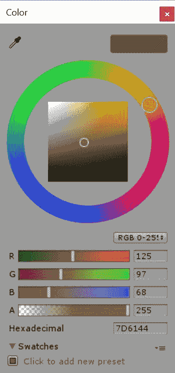

1.  然后，将提供的每个纹理分配给相应的属性。你应该会在屏幕上注意到以下类似的内容：

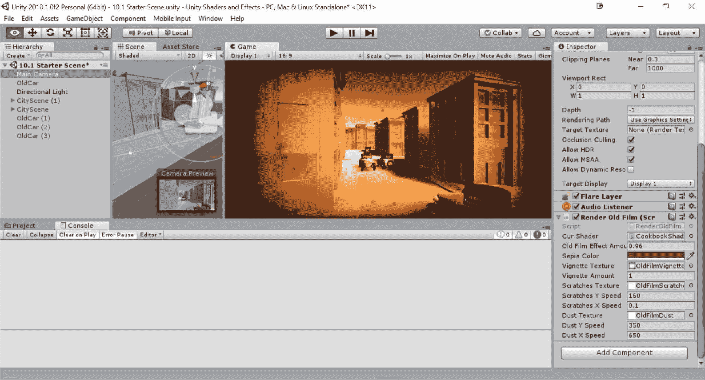

1.  此外，确保在 Unity 编辑器中点击播放，以查看灰尘和划痕效果的全貌以及我们给予屏幕效果的轻微图像偏移。

# 它是如何工作的...

现在，让我们逐一分析这个屏幕效果中的每一层，解释每一行代码为什么能按预期工作，并深入了解我们如何为这个屏幕效果添加更多内容。

现在我们老旧的电影屏幕效果已经生效，让我们逐步分析`frag()`函数中的代码行，因为在此书此阶段，其他代码应该相当直观易懂。

就像我们的 Photoshop 图层一样，我们的着色器正在处理每一层并将它们组合在一起，所以当我们逐层分析时，试着想象 Photoshop 中的图层是如何工作的。保持这个概念在心中，在开发新的屏幕效果时总是有帮助的。

在这里，我们有`frag()`函数中的第一组代码行：

```cs
fixed4 frag(v2f_img i) : COLOR 
{ 
    //Get the colors from the RenderTexture and the uv's 
    //from the v2f_img struct 
    fixed4 renderTex = tex2D(_MainTex, i.uv); 

    //Get the pixels from the Vignette Texture 
    fixed4 vignetteTex = tex2D(_VignetteTex, i.uv); 
```

代码的第一行，紧随`frag()`函数声明之后，定义了 UVs 应该如何为我们的主渲染纹理或游戏实际渲染的帧工作。由于我们想要模拟老旧电影风格的效果，我们希望在每一帧中调整渲染纹理的 UVs，使其闪烁。这种闪烁模拟了电影放映机卷轴略微偏移的情况。这告诉我们需要动画化 UVs，这正是第一行代码所做的事情。

我们使用了 Unity 提供的内置`_SinTime`变量，以获取介于`-1`和`1`之间的值。然后我们将其乘以一个非常小的数字，在这个例子中是`0.005`，以减少效果强度。最终的值然后再次乘以我们在效果脚本中生成的`_RandomValue`变量。这个值在`-1`和`1`之间来回弹跳，基本上是来回翻转运动的方向。

一旦我们的 UVs 构建并存储在`renderTexUV`变量中，我们就可以使用`tex2D()`函数来采样渲染纹理。这个操作然后给我们最终的渲染纹理，我们可以在着色器的其余部分进一步处理它。

接下来看上一张图片中的最后一行，我们只是简单地使用`tex2D()`函数对晕影纹理进行直接采样。我们不需要使用之前已经创建的动画 UVs，因为晕影纹理将与摄像机的运动本身相关联，而不是与摄像机胶片的闪烁相关联。

```cs
frag() function:
```

```cs
//Process the Scratches UV and pixels 
half2 scratchesUV = half2(i.uv.x + (_RandomValue * _SinTime.z * _ScratchesXSpeed), 
        i.uv.y + (_Time.x * _ScratchesYSpeed)); 
fixed4 scratchesTex = tex2D(_ScratchesTex, scratchesUV); 

//Process the Dust UV and pixels 
half2 dustUV = half2(i.uv.x + (_RandomValue * (_SinTime.z * _dustXSpeed)),  
        i.uv.y + (_RandomValue * (_SinTime.z * _dustYSpeed))); 
fixed4 dustTex = tex2D(_DustTex, dustUV); 
```

这些代码行几乎与之前的代码行完全相同，我们需要生成独特的动画 UV 值来修改屏幕效果层的位置。我们简单地使用内置的`_SinTime`值来获取介于`-1`和`1`之间的值，乘以我们的随机值，然后再乘以另一个乘数来调整动画的整体速度。一旦生成了这些 UV 值，我们就可以使用这些新的动画值来采样灰尘和划痕纹理。

我们下一组代码处理的是为我们的老电影屏幕效果创建着色效果。以下代码片段演示了这些行：

```cs
// get the luminosity values from the render texture using the YIQ values 
fixed lum = dot (fixed3(0.299, 0.587, 0.114), renderTex.rgb); 

//Add the constant color to the lum values 
fixed4 finalColor = lum + lerp(_SepiaColor, _SepiaColor +
     fixed4(0.1f,0.1f,0.1f,1.0f), _RandomValue);
```

使用这组代码，我们正在创建整个渲染纹理的实际颜色着色。为了实现这一点，我们首先需要将渲染纹理转换为它自己的灰度版本。为此，我们可以使用由 `YIQ` 值提供的亮度值。`YIQ` 值是 NTSC 彩色电视系统使用的颜色空间。`YIQ` 中的每个字母实际上存储了电视用来调整可读性的颜色常数。

虽然实际上知道这种颜色尺度的原因并不是必要的，但应该知道，`YIQ` 中的 `Y` 值是任何图像的恒定亮度值。因此，我们可以通过将渲染纹理的每个像素与我们的亮度值点积来生成渲染纹理的灰度图像。这就是这组代码中的第一行所做的事情。

一旦我们有了亮度值，我们就可以简单地添加我们想要给图像着色的颜色。这种颜色从我们的脚本传递到我们的着色器，然后到我们的 `CGPROGRAM` 块，在那里我们可以将其添加到我们的灰度渲染纹理中。一旦完成，我们就会得到一个完美着色的图像。

最后，我们在屏幕效果中创建每一层的混合。以下代码片段显示了我们所查看的代码集：

```cs
//Create a constant white color we can use to adjust opacity of effects 
fixed3 constantWhite = fixed3(1,1,1); 

//Composite together the different layers to create finsl Screen Effect 
finalColor = lerp(finalColor, finalColor * vignetteTex, _VignetteAmount); 
finalColor.rgb *= lerp(scratchesTex, constantWhite, (_RandomValue)); 
finalColor.rgb *= lerp(dustTex.rgb, constantWhite, (_RandomValue * _SinTime.z)); 
finalColor = lerp(renderTex, finalColor, _EffectAmount); 

return finalColor 
```

我们最后一组代码相对简单，实际上并不需要太多解释。简而言之，它只是将所有层相乘以得到最终结果。就像我们在 Photoshop 中将层相乘一样，我们在着色器中将它们相乘。每一层都通过一个 `lerp()` 函数进行处理，这样我们就可以调整每一层的透明度，从而对最终效果有更多的艺术控制。在屏幕效果方面，提供的调整越多，效果越好。

# 参见

关于 `YIQ` 值的更多信息，请参阅以下链接：

+   [`en.wikipedia.org/wiki/YIQ`](http://en.wikipedia.org/wiki/YIQ)

+   [`www.blackice.com/colorspaceYIQ.htm`](http://www.blackice.com/colorspaceYIQ.htm)

# 创建夜视屏幕效果

我们下一个屏幕效果绝对是一个更受欢迎的效果。夜视屏幕效果在 *Call of Duty: Modern Warfare*、*Halo* 以及市场上几乎任何第一人称射击游戏中都可以看到。这是使用非常独特的草绿色来提亮整个图像的效果。

为了实现我们的夜视效果，我们需要使用 Photoshop 将效果分解。这是一个简单的过程，即在网上找到一些参考图像，并组合一个分层图像来查看你需要什么样的混合模式，或者我们需要按什么顺序组合我们的层。以下截图显示了在 Photoshop 中执行此过程的成果：

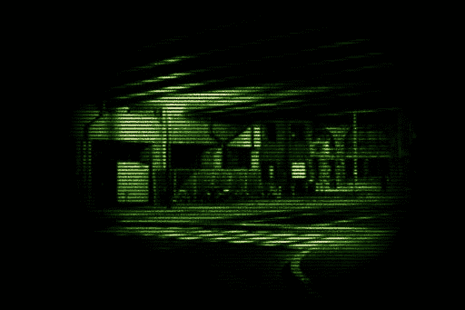

让我们将粗糙的 Photoshop 合成图像分解成其组成部分，以便我们更好地理解我们需要收集的资产。在下一章中，我们将介绍这一过程。

# 准备工作

让我们再次将我们的效果分解为其组成部分，以此开始这个屏幕效果。使用 Photoshop，我们可以构建一个分层图像，以更好地说明我们如何捕捉夜视效果：

+   **着色绿色**：我们屏幕效果中的第一层是标志性的绿色，几乎在每一张夜视图像中都能找到。这将给我们的效果带来独特的夜视外观，如下面的截图所示：

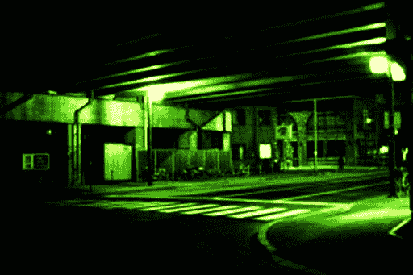

+   **扫描线**：为了增加这种新类型显示器对玩家的效果，我们在着色层上方添加了扫描线。为此，我们将使用在 Photoshop 中创建的纹理，并允许用户平铺它，以便扫描线可以更大或更小。

+   **噪声**：我们的下一层是一个简单的噪声纹理，我们将其平铺在着色图像和扫描线上，以打破图像并为我们添加更多细节。这一层仅仅强调了数字读数的外观：

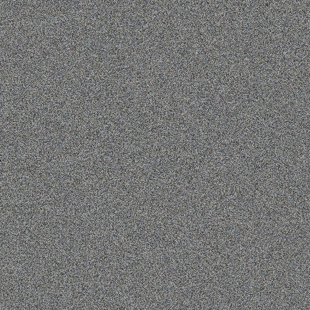

+   **晕影**：我们夜视效果中的最后一层是晕影。如果你查看《使命召唤：现代战争》中的夜视效果，你会注意到它使用了一个模仿通过瞄准镜向下看的晕影效果。我们将为这个屏幕效果做同样的事情：

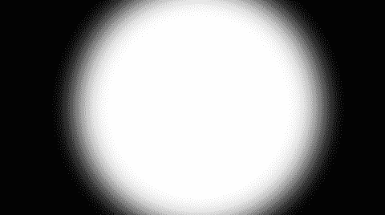

通过收集我们的纹理来创建一个屏幕效果系统。执行以下步骤：

1.  收集晕影纹理、噪声纹理和扫描线纹理，就像我们刚才看到的。就像之前一样，我在书的示例代码中的`Chapter 10` | `Textures`文件夹中提供了这些纹理。

1.  找一个示例场景以便更容易看到着色器的效果。我将使用与上一章相同的场景，所以请随意再次使用`10.1 Sample Scene`。

1.  通过复制`ScreenGrayscale`代码创建一个新的着色器；从`Chapter 9` | `Shaders`文件夹下的`Project`标签中选择它，然后按*Ctrl* + *D*。一旦复制，将脚本重命名为`ScreenNightVision`。然后将脚本拖放到`Chapter 10` | `Shaders`文件夹中，如果需要则创建它。

1.  接下来，前往`Chapter 9` | `Scripts`文件夹，复制`TestRenderImage`脚本。将新文件重命名为`RenderNightVision`，然后将其拖放到`Chapter 10` | `Scripts`文件夹中，如果需要则创建它。

最后，当我们的屏幕效果系统运行起来并且我们已经收集了纹理后，我们可以开始重新创建这个夜视效果的过程。

# 如何操作...

在收集了所有资产并且屏幕效果系统运行顺畅后，让我们开始添加必要的代码，包括脚本和着色器。我们将从`RenderNightVision.cs`脚本开始编码，所以现在请双击此文件，在您选择的代码编辑器中打开它：

1.  我们将首先在我们的脚本中输入代码。修改脚本的第一步是将类重命名为与文件名匹配，即`RenderNightVision`：

```cs
[ExecuteInEditMode]
public class RenderNightVision : MonoBehaviour {
```

1.  我们需要创建一些变量，使用户能够通过脚本的检查器调整此效果。在`NightVisionEffect.cs`脚本中输入以下代码：

```cs
#region Variables 
    public Shader curShader; 

    public float contrast = 3.0f; 
    public float brightness = 0.1f; 
    public Color nightVisionColor = Color.green; 

    public Texture2D vignetteTexture; 

    public Texture2D scanLineTexture; 
    public float scanLineTileAmount = 4.0f; 

    public Texture2D nightVisionNoise; 
    public float noiseXSpeed = 100.0f; 
    public float noiseYSpeed = 100.0f; 

    public float distortion = 0.2f; 
    public float scale = 0.8f; 

    private float randomValue = 0.0f; 
    private Material screenMat; 
    #endregion 
```

1.  接下来，我们需要完成我们的`OnRenderImage()`函数，以便正确地将数据传递给着色器，以便着色器能够正确处理屏幕效果。使用以下代码完成`OnRenderImage()`函数：

```cs
void OnRenderImage(RenderTexture sourceTexture, RenderTexture destTexture)
{
    if (curShader != null)
    {
        ScreenMat.SetFloat("_Contrast", contrast);
        ScreenMat.SetFloat("_Brightness", brightness);
        ScreenMat.SetColor("_NightVisionColor", nightVisionColor);
        ScreenMat.SetFloat("_RandomValue", randomValue);
        ScreenMat.SetFloat("_distortion", distortion);
        ScreenMat.SetFloat("_scale", scale);

        if (vignetteTexture)
        {
            ScreenMat.SetTexture("_VignetteTex", vignetteTexture);
        }

        if (scanLineTexture)
        {
            ScreenMat.SetTexture("_ScanLineTex", scanLineTexture);
            ScreenMat.SetFloat("_ScanLineTileAmount", scanLineTileAmount);
        }

        if (nightVisionNoise)
        {
            ScreenMat.SetTexture("_NoiseTex", nightVisionNoise);
            ScreenMat.SetFloat("_NoiseXSpeed", noiseXSpeed);
            ScreenMat.SetFloat("_NoiseYSpeed", noiseYSpeed);
        }

        Graphics.Blit(sourceTexture, destTexture, ScreenMat);
    }
    else
    {
        Graphics.Blit(sourceTexture, destTexture);
    }
}
```

1.  要完成`NightVisionEffect.cs`脚本，我们只需确保某些变量被限制在一定的范围内，这样它们才能保持在这个范围内。这些范围是任意的，可以在以后的时间进行更改。这些只是工作得很好的值：

```cs
void Update()
{
    contrast = Mathf.Clamp(contrast, 0f, 4f);
    brightness = Mathf.Clamp(brightness, 0f, 2f);
    randomValue = Random.Range(-1f, 1f);
    distortion = Mathf.Clamp(distortion, -1f, 1f);
    scale = Mathf.Clamp(scale, 0f, 3f);
}
```

1.  现在，我们可以将注意力转向这个屏幕效果的着色器部分。如果您还没有打开着色器，请打开它，并首先在`Properties`块中输入以下属性：

```cs
Properties 
{ 
    _MainTex ("Base (RGB)", 2D) = "white" {} 
    _VignetteTex ("Vignette Texture", 2D) = "white"{} 
    _ScanLineTex ("Scan Line Texture", 2D) = "white"{} 
    _NoiseTex ("Noise Texture", 2D) = "white"{} 
    _NoiseXSpeed ("Noise X Speed", Float) = 100.0 
    _NoiseYSpeed ("Noise Y Speed", Float) = 100.0 
    _ScanLineTileAmount ("Scan Line Tile Amount", Float) = 4.0 
    _NightVisionColor ("Night Vision Color", Color) = (1,1,1,1) 
    _Contrast ("Contrast", Range(0,4)) = 2 
    _Brightness ("Brightness", Range(0,2)) = 1 
    _RandomValue ("Random Value", Float) = 0 
    _distortion ("Distortion", Float) = 0.2 
    _scale ("Scale (Zoom)", Float) = 0.8 
} 
```

1.  为了确保我们从`Properties`块传递数据到`CGPROGRAM`块，我们需要确保在`CGPROGRAM`块中使用相同的名称声明它们：

```cs
Pass
{
  CGPROGRAM 
  #pragma vertex vert_img 
  #pragma fragment frag 
  #pragma fragmentoption ARB_precision_hint_fastest 
  #include "UnityCG.cginc" 

  uniform sampler2D _MainTex; 
  uniform sampler2D _VignetteTex; 
  uniform sampler2D _ScanLineTex; 
  uniform sampler2D _NoiseTex; 
  fixed4 _NightVisionColor; 
  fixed _Contrast; 
  fixed _ScanLineTileAmount; 
  fixed _Brightness; 
  fixed _RandomValue; 
  fixed _NoiseXSpeed; 
  fixed _NoiseYSpeed; 
  fixed _distortion; 
  fixed _scale; 
```

1.  我们的效果还将包括镜头畸变，以进一步传达我们正在通过镜头看，图像的边缘正被镜头的角度所扭曲。在`CGPROGRAM`块的变量声明之后输入以下函数：

```cs
    float2 barrelDistortion(float2 coord)  
    { 
        // lens distortion algorithm 
        // See http://www.ssontech.com/content/lensalg.htm 

        float2 h = coord.xy - float2(0.5, 0.5); 
        float r2 = h.x * h.x + h.y * h.y; 
        float f = 1.0 + r2 * (_distortion * sqrt(r2)); 

        return f * _scale * h + 0.5; 
    } 
```

1.  现在，我们可以专注于我们的`NightVisionEffect`着色器的核心部分。让我们首先输入获取渲染纹理和晕影纹理所需的代码。在着色器的`frag()`函数中输入以下代码：

```cs
    fixed4 frag(v2f_img i) : COLOR 
    { 
        //Get the colors from the RenderTexture and the uv's 
        //from the v2f_img struct 
        half2 distortedUV = barrelDistortion(i.uv); 
        fixed4 renderTex = tex2D(_MainTex, distortedUV); 
        fixed4 vignetteTex = tex2D(_VignetteTex, i.uv); 
```

1.  在我们的`frag()`函数中的下一步是处理扫描线和`Noise`纹理，并将适当的动画 UV 应用到它们上：

```cs
//Process scan lines and noise 
half2 scanLinesUV = half2(i.uv.x * _ScanLineTileAmount, i.uv.y * _ScanLineTileAmount); 
fixed4 scanLineTex = tex2D(_ScanLineTex, scanLinesUV); 

half2 noiseUV = half2(i.uv.x + (_RandomValue * _SinTime.z * _NoiseXSpeed), 
                  i.uv.y + (_Time.x * _NoiseYSpeed)); 
fixed4 noiseTex = tex2D(_NoiseTex, noiseUV); 
```

1.  要完成屏幕效果中的所有层，我们只需处理渲染纹理的亮度值，然后将其应用于夜视颜色，以实现标志性的夜视外观：

```cs
// get the luminosity values from the render texture using the     //YIQ values. 
        fixed lum = dot (fixed3(0.299, 0.587, 0.114), renderTex.rgb); 
        lum += _Brightness; 
        fixed4 finalColor = (lum *2) + _NightVisionColor; 
```

1.  最后，我们将所有层合并在一起，并返回我们夜视效果的最终颜色：

```cs
  //Final output 
  finalColor = pow(finalColor, _Contrast); 
  finalColor *= vignetteTex; 
  finalColor *= scanLineTex * noiseTex; 

  return finalColor; 
}
```

1.  当你完成代码输入后，返回 Unity 编辑器，让脚本和着色器编译。如果没有错误，选择场景中的`MainCamera`。如果已经存在，移除`Render Old Film`组件，并添加`RenderNightVision`组件。一旦完成，将`ScreenNightVision`着色器拖放到组件的 Cur Shader 属性中，然后将夜视颜色属性分配为绿色，如下所示：

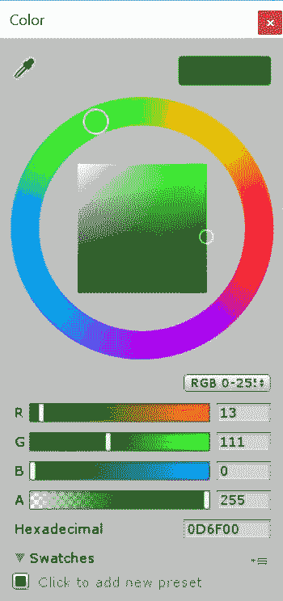

1.  之后，将纹理分配到它们正确的位置：

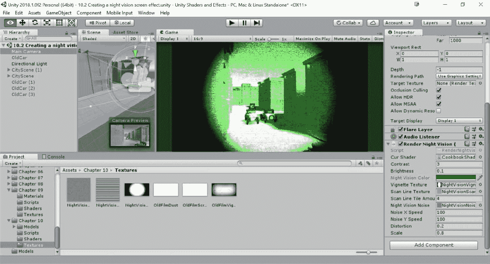

1.  之后，确保在编辑器中运行以查看效果的完整最终版本：

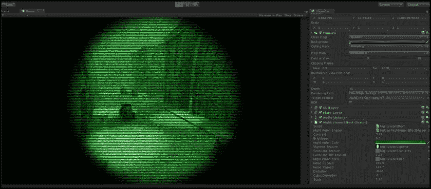

我们夜视屏幕效果的最终结果

# 它是如何工作的...

夜视效果实际上与老式电影屏幕效果非常相似，这展示了我们可以将这些组件做得多么模块化。只需简单地交换我们用于叠加的纹理，并改变我们的平铺率计算速度，我们就可以使用相同的代码实现非常不同的结果。

与此效果唯一的区别是我们将镜头畸变效果包含到了屏幕效果中。因此，让我们将其分解，以便更好地理解其工作原理。

```cs
SynthEyes, and the code is freely available to use in your own effects:
```

```cs
float2 barrelDistortion(float2 coord)  
{ 
    // lens distortion algorithm 
    // See http://www.ssontech.com/content/lensalg.htm 
    float2 h = coord.xy - float2(0.5, 0.5); 
    float r2 = h.x * h.x + h.y * h.y; 
    float f = 1.0 + r2 * (_distortion * sqrt(r2)); 

    return f * _scale * h + 0.5; 
} 
```

# 还有更多...

在视频游戏中，需要突出显示某些对象的情况并不少见。例如，热视镜应该只对人和其他热源应用后处理效果。根据本书迄今为止收集的知识，这样做已经可能；实际上，您可以通过代码更改对象的着色器或材质。然而，这通常很费时，并且必须在每个对象上重复。

使用替换着色器的更有效方法。每个着色器都有一个名为 `RenderType` 的标签，迄今为止从未使用过。此属性可以用来强制相机仅对某些对象应用着色器。您可以通过将以下脚本附加到相机上来实现这一点：

```cs
using UnityEngine; 

public class ReplacedShader : MonoBehaviour { 

    public Shader shader; 
    void Start () { 
        GetComponent<Camera>().SetReplacementShader(shader, "Heat"); 
    } 
} 
```

进入播放模式后，相机将查询所有需要渲染的对象。如果它们没有装饰有 `RenderType = "Heat"` 的着色器，则不会进行渲染。带有此类标签的对象将使用脚本附加的着色器进行渲染。
