# 第十一章：高级着色技术

在本章中，您将学习以下内容：

+   使用 Unity 内置的 CgInclude 文件

+   使用 CgInclude 使您的着色器世界模块化

+   实现毛皮着色器

+   使用数组实现热图

# 简介

本章介绍了您可以在游戏中使用的某些高级着色器技术。您应该记住，您在游戏中看到的大部分最引人注目的效果都是通过测试着色器能做什么的极限来制作的。本书为您提供修改和创建着色器的技术基础，但强烈鼓励您尽可能多地玩耍和实验。制作一款好游戏并不是追求照片级真实感；您不应该带着复制现实的目的去处理着色器，因为这不太可能发生。相反，您应该尝试将着色器作为工具，使您的游戏真正独特。通过本章的知识，您将能够创建您想要的材质。

# 使用 Unity 内置的 CgInclude 文件

我们编写自己的 `CgInclude` 文件的第一个步骤是了解 Unity 已经为我们提供了哪些着色器。在编写表面着色器时，幕后有很多事情发生，这使得编写表面着色器的过程非常高效。我们可以在您安装 Unity 的目录中找到的包含的 `CgInclude` 文件中看到此代码，在 `Editor` | `Data` | `CGIncludes`。这个文件夹中的所有文件都在屏幕上使用我们的着色器渲染我们的对象。其中一些文件负责阴影和光照，一些文件负责辅助函数，还有一些文件管理平台依赖项。没有它们，我们的着色器编写体验将会更加费力。

您可以在以下链接中找到 Unity 提供给我们的一张信息列表：

[Unity 内置 CgInclude 文件](http://docs.unity3d.com/Documentation/Components/SL-BuiltinIncludes.html)。

让我们开始理解这些内置的 `CgInclude` 文件的过程，使用来自 `UnityCG.cginc` 文件的一些内置辅助函数：

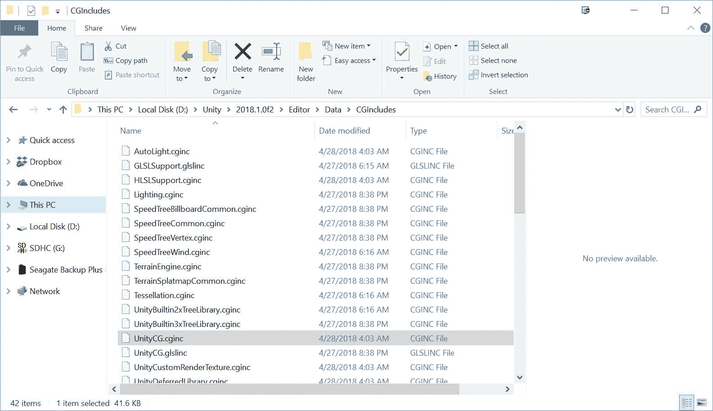

# 准备工作

在我们开始深入编写着色器的核心内容之前，我们需要在我们的场景中设置一些项目。让我们做以下操作，然后打开您选择的 IDE 中的着色器：

1.  创建一个新的场景，并用一个简单的球体模型填充它。

1.  创建一个新的着色器（`Desaturate`）和一个材质（`DesaturateMat`）。

1.  将新的着色器附加到新的材质上，并将材质分配给球体。

1.  创建一个方向光并将其放置在球体上方。

1.  最后，从 Unity 的 `CgInclude` 文件夹中打开 `UnityCG.cginc` 文件，该文件夹位于 Unity 的安装目录中。这将使我们能够分析一些辅助函数的代码，以便我们可以在使用它们时理解正在发生什么。

1.  您现在应该已经设置了一个简单的场景来编写着色器。参考以下截图，这是一个示例：

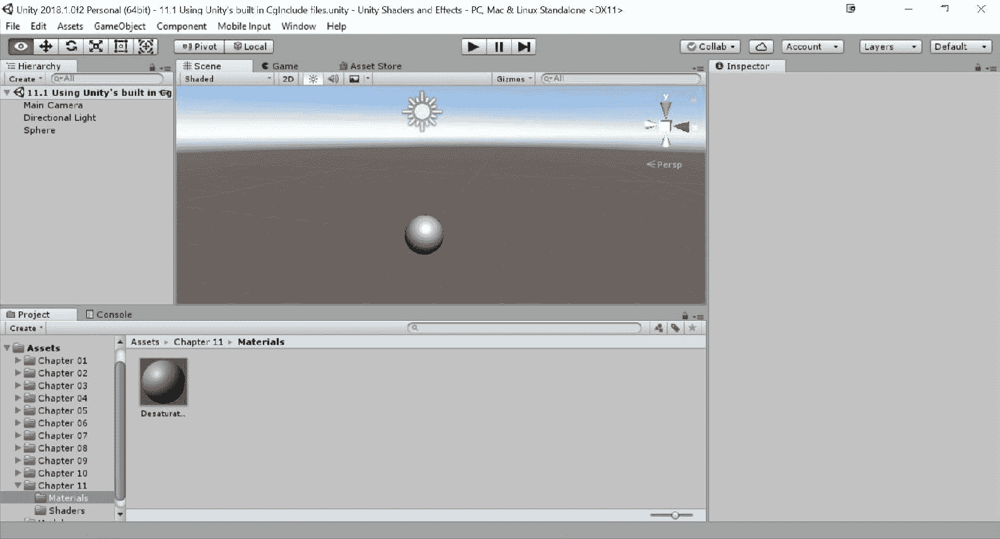

# 如何操作...

场景准备就绪后，我们现在可以开始尝试使用 `UnityCG.cginc` 文件中包含的一些内置辅助函数了。双击为这个场景创建的着色器，以便在您选择的 IDE 中打开它，并按照以下步骤插入代码：

1.  将以下代码添加到新着色器文件的 `Properties` 块中。我们的示例着色器需要一个纹理和一个滑动条：

```cs
Properties 
{ 
    _MainTex ("Base (RGB)", 2D) = "white" {} 
    _DesatValue ("Desaturate", Range(0,1)) = 0.5 
} 
```

我们接下来需要确保在 `Properties` 和 `CGPROGRAM` 块之间创建数据连接。

1.  在 `CGPROGRAM` 声明和 `#pragma` 指令之后放置以下代码，移除其他默认属性：

```cs
sampler2D _MainTex; 
fixed _DesatValue; 
```

1.  接下来，我们只需更新我们的 `surf()` 函数，以包含以下代码。我们引入了一个我们还没有见过的函数，它是 Unity 的 `UnityCG.cginc` 文件内置的：

```cs
void surf (Input IN, inout SurfaceOutputStandard o) 
{ 
  half4 c = tex2D (_MainTex, IN.uv_MainTex); 
  c.rgb = lerp(c.rgb, Luminance(c.rgb), _DesatValue); 

  o.Albedo = c.rgb; 
  o.Alpha = c.a; 
} 
```

1.  保存您的脚本并返回到 Unity 编辑器。从那里，您应该能够将材质分配给 `DesaturateMat`（我使用了来自 `第三章 `| `纹理` 文件夹的 `TerrainBlend` 纹理）：

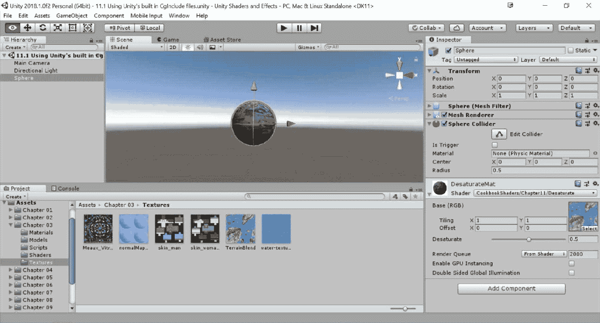

1.  修改着色器代码后，您应该会看到类似于前面的截图。我们只是使用了一个内置的辅助函数，这个函数是 Unity 的 `CgInclude` 文件的一部分，以给我们一个去饱和化主纹理的效果。注意，如果我们把值改为 `1`，所有的颜色都会消失，给我们一个灰度效果：

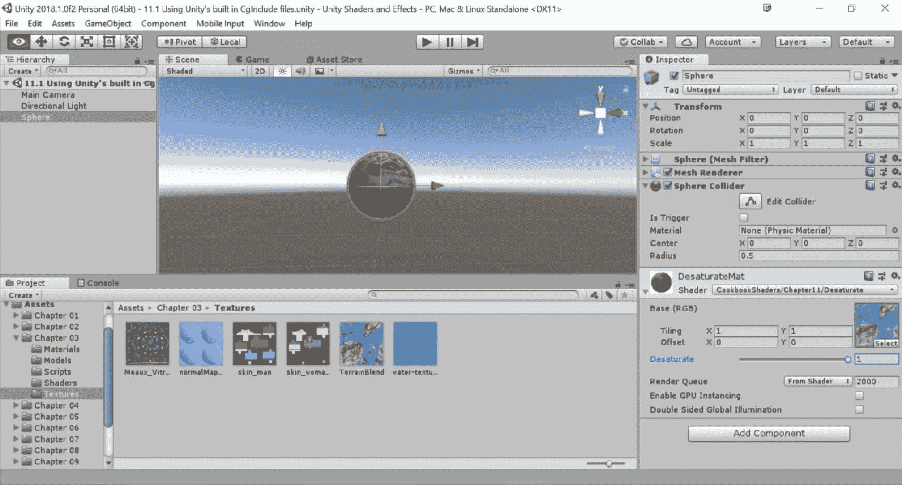

# 它是如何工作的...

使用名为 `Luminance()` 的内置辅助函数，我们能够快速在我们的着色器上获得去饱和化或灰度效果。这一切都是因为当我们使用 Surface Shader 时，`UnityCG.cginc` 文件会自动带到我们的着色器中。

如果您在脚本编辑器中搜索 `UnityCG.cginc` 文件，您将在第 *473* 行找到这个函数的实现。以下代码片段来自该文件：

```cs
// Converts color to luminance (grayscale)
inline half Luminance(half3 rgb)
{
    return dot(rgb, unity_ColorSpaceLuminance.rgb);
}
```

由于这个函数包含在文件中，并且 Unity 会自动与这个文件一起编译，因此我们也可以在我们的代码中使用这个函数，从而减少我们需要反复编写的代码量。

注意，还有一个名为 `Lighting.cginc` 的文件，这是 Unity 自带的。这个文件包含了我们在声明类似 `#pragma Surface surf Lambert` 这样的内容时使用的所有光照模型。浏览这个文件可以发现，所有内置的光照模型都定义在这里，以便重用和模块化。

# 还有更多...

您会注意到我们使用的 `Luminance` 函数将返回传入的颜色和名为 `unity_ColorSpaceLuminance` 的属性之间的点积。要查看这是什么，您可以使用文本编辑器的 `查找` 菜单 (*Ctrl *+ *F*) 并输入它。搜索后，您应该能够在第 *28* 行看到以下内容：

```cs
#ifdef UNITY_COLORSPACE_GAMMA
#define unity_ColorSpaceGrey fixed4(0.5, 0.5, 0.5, 0.5)
#define unity_ColorSpaceDouble fixed4(2.0, 2.0, 2.0, 2.0)
#define unity_ColorSpaceDielectricSpec half4(0.220916301, 0.220916301, 0.220916301, 1.0 - 0.220916301)
#define unity_ColorSpaceLuminance half4(0.22, 0.707, 0.071, 0.0) // Legacy: alpha is set to 0.0 to specify gamma mode
#else // Linear values
#define unity_ColorSpaceGrey fixed4(0.214041144, 0.214041144, 0.214041144, 0.5)
#define unity_ColorSpaceDouble fixed4(4.59479380, 4.59479380, 4.59479380, 2.0)
#define unity_ColorSpaceDielectricSpec half4(0.04, 0.04, 0.04, 1.0 - 0.04) // standard dielectric reflectivity coef at incident angle (= 4%)
#define unity_ColorSpaceLuminance half4(0.0396819152, 0.458021790, 0.00609653955, 1.0) // Legacy: alpha is set to 1.0 to specify linear mode
#endif
```

这意味着，根据所使用的色彩空间，给定的值将发生变化。默认情况下，Unity 使用伽玛色彩空间，因为只有某些平台支持线性。要检查你的项目中使用的是哪种色彩空间，你可以转到 Edit | Project Settings | Player | Other Settings，并查看色彩空间属性。

想了解更多关于色彩空间的信息，请查看：[`www.kinematicsoup.com/news/2016/6/15/gamma-and-linear-space-what-they-are-how-they-differ`](http://www.kinematicsoup.com/news/2016/6/15/gamma-and-linear-space-what-they-are-how-they-differ)。

# 使用 CgInclude 以模块化方式构建你的着色器世界

了解内置的 `CgInclude` 文件很好，但如果我们想构建自己的 `CgInclude` 文件来存储我们自己的光照模型和辅助函数呢？实际上，我们可以创建自己的 `CgInclude` 文件，但在我们能够高效地在着色器编写管道中使用它们之前，我们需要学习一些更多的代码语法。让我们看看从头开始创建一个新的 `CgInclude` 文件的过程。

# 准备工作

让我们通过这个过程来生成这个食谱的新条目：

1.  在项目标签页中，右键单击 `Assets` 文件夹，并选择 Show in Explorer。你应该能看到你的项目文件夹。然后通过右键单击并选择 New | Text Document 来创建一个文本文件：


1.  将文件重命名为 `MyCGInclude`，并将 `.txt` 文件扩展名替换为 `.cginc`：


1.  Windows 将会给出一个警告消息，说文件可能会变得不可用，但它仍然可以工作。

1.  将这个新的 `.cginc` 文件导入到你的 Unity 项目中，并让它编译。如果一切顺利，你将看到 Unity 已经知道将其编译成 `CgInclude` 文件。

现在，我们已经准备好开始创建我们自己的自定义 `CgInclude` 代码。只需双击你创建的 `CgInclude` 文件，以便在你的首选 IDE 中打开它。

# 如何操作...

当我们的 `CgInclude` 文件打开时，我们可以开始输入将使其与我们的表面着色器一起工作的代码。以下步骤将使我们的 `CgInclude` 文件准备好在表面着色器中使用，并允许我们在开发更多着色器时不断向其中添加更多代码：

1.  我们从所谓的预处理器指令开始我们的 `CgInclude` 文件。这些指令包括 `#pragma` 和 `#include` 等语句。在这种情况下，我们想要定义一组新的代码，如果我们的着色器在编译指令中包含此文件，则将执行这些代码。在你的 `CgInclude` 文件顶部输入以下代码：

```cs
#ifndef MY_CG_INCLUDE 
#define MY_CG_INCLUDE 
```

1.  我们始终需要确保使用 `#endif` 来关闭 `#ifndef` 或 `#ifdef` 的定义检查，就像在 C# 中，一个 `if` 语句需要用两个括号来关闭一样。在 `#define` 指令之后立即输入以下代码：

```cs
#endif 
```

1.  在这一点上，我们只需要实现 `CgInclude` 文件的内容。因此，我们在 `#define` 之后和 `#endif` 之前输入以下代码来完成我们的 `CgInclude` 文件：

```cs
fixed4 _MyColor; 

inline fixed4 LightingHalfLambert(SurfaceOutput s, fixed3 lightDir, fixed atten) 
{ 
    fixed diff = max(0, dot(s.Normal, lightDir)); 
    diff = (diff + 0.5)*0.5; 

    fixed4 c; 
    c.rgb = s.Albedo * _LightColor0.rgb * ((diff * _MyColor.rgb) * atten); 
    c.a = s.Alpha; 
    return c; 
} 
#endif 
```

1.  完成这些后，你现在就有了你的第一个`CgInclude`文件。仅用这么一点代码，我们就可以大大减少需要重写的代码量，并且我们可以开始在这里存储我们经常使用的光照模型，这样我们就永远不会丢失它们。你的`CgInclude`文件应该看起来类似于以下代码：

```cs
#ifndef MY_CG_INCLUDE 
#define MY_CG_INCLUDE 

fixed4 _MyColor; 

inline fixed4 LightingHalfLambert(SurfaceOutput s, fixed3 lightDir, fixed atten) 
{ 
    fixed diff = max(0, dot(s.Normal, lightDir)); 
    diff = (diff + 0.5)*0.5; 

    fixed4 c; 
    c.rgb = s.Albedo * _LightColor0.rgb * ((diff * _MyColor.rgb) * atten); 
    c.a = s.Alpha; 
    return c; 
} 
#endif 
```

在我们可以完全利用这个`CgInclude`文件之前，我们还需要完成几个步骤。我们只需要告诉当前我们正在处理的着色器使用这个文件及其代码。为了完成创建和使用`CgInclude`文件的过程，让我们完成以下步骤：

1.  我们必须将我们的`CgInclude`文件放在与我们的着色器相同的目录中，所以从项目标签中将其拖放到`第十一章 `| `着色器`文件夹中。

如果*步骤 1*未完成，你将得到一个编译错误。

1.  现在我们在这个文件夹中，选择在先前的菜谱中创建的`Desaturate`着色器，并对其进行复制（*Ctrl *+ *D*）。将副本命名为`Colorize`，然后双击它以打开它。

1.  从那里，更新着色器名称：

```cs
Shader "CookbookShaders/Chapter11/Colorize" 
```

1.  如果你将注意力转向我们的着色器，你会看到我们需要告诉我们的`CGPROGRAM`块包含我们的新`CgInclude`文件，这样我们就可以访问它包含的代码。修改我们的`CGPROGRAM`块的指令以包含以下代码：

```cs
CGPROGRAM
#include "MyCGInclude.cginc" 
// Physically based Standard lighting model, and enable shadows on all light types
#pragma surface surf Standard fullforwardshadows
```

1.  我们当前的着色器目前正在使用内置的标准光照模型，但我们想使用我们在`CgInclude`中创建的半朗伯光照模型。由于我们已经包含了`CgInclude`文件中的代码，我们可以使用以下代码使用半朗伯光照模型：

```cs
CGPROGRAM 
#include "MyCGInclude.cginc" 
#pragma surface surf HalfLambert 
```

1.  最后，我们还在我们的`CgInclude`文件中声明了一个自定义变量，以表明我们可以为我们的着色器设置默认变量。要查看此操作，请在着色器的`Properties`块中输入以下代码：

```cs
Properties 
{ 
    _MainTex ("Base (RGB)", 2D) = "white" {} 
    _DesatValue ("Desaturate", Range(0,1)) = 0.5 
    _MyColor ("My Color", Color) = (1,1,1,1) 
} 
```

1.  最后，我们需要更新我们的`surf`函数头，因为我们使用了`LightingHalfLambert`函数中的`SurfaceOutput`：

```cs
 void surf (Input IN, inout SurfaceOutput o) 
```

1.  回到 Unity 中，创建一个新的材质，它将使用新创建的`Colorize`着色器（`ColorizeMat`），并将其分配给我们在上一个菜谱中创建的球体。像往常一样分配材质，并从检查器中修改 MyColor 值以查看它如何修改对象。以下截图显示了使用我们的`CgInclude`文件的结果：

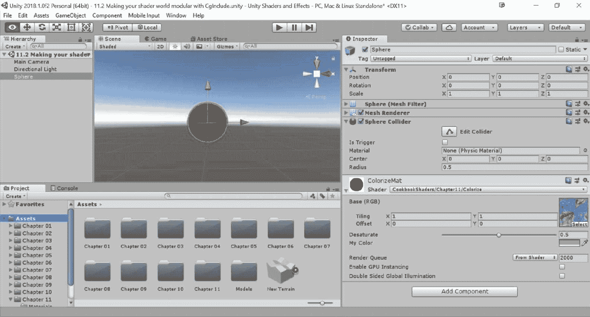

# 它是如何工作的...

当使用着色器时，我们可以使用`#include`预处理指令包含其他代码集。这告诉 Unity 我们希望当前着色器使用包含文件中的代码；这就是为什么这些文件被称为`CgInclude`文件。我们使用`#include`指令包含 Cg 代码片段。

一旦我们声明了`#include`指令，并且 Unity 能够在项目中找到该文件，Unity 就会开始寻找已经定义的代码片段。这就是我们开始使用`#ifndef`和`#endif`指令的地方。当我们声明`#ifndef`指令时，我们只是在说“如果没有定义，就用一个名字定义一些东西。”在这个菜谱的情况下，我们说我们想要`#define MY_CG_INCLUDE`。所以，如果 Unity 找不到名为`MY_CG_INCLUDE`的定义，它会在`CgInclude`文件编译时创建它，从而让我们能够访问随后的代码。`#endif`方法只是简单地表示这是这个定义的结束，所以停止寻找更多的代码。

你现在可以看到这是多么强大，我们可以在一个文件中存储所有的光照模型和自定义变量，从而大大减少我们需要编写的代码量。真正的力量在于你可以在`CgInclude`文件中定义多个函数状态，从而开始给你的着色器提供灵活性。

# 实现毛皮着色器

材质的外观取决于其物理结构。着色器试图模拟它们，但在这样做的时候，它们过于简化了光的行为。具有复杂宏观结构的材料尤其难以渲染。许多织物和动物毛皮就是这样。这个菜谱将向你展示如何模拟毛皮和其他材料（如草地），这些材料不仅仅是平面。为了做到这一点，相同的材质被多次绘制，每次都增加大小。这创造了毛发的错觉。

这里展示的着色器是基于 Jonathan Czeck 和 Aras Pranckevičius 的工作：

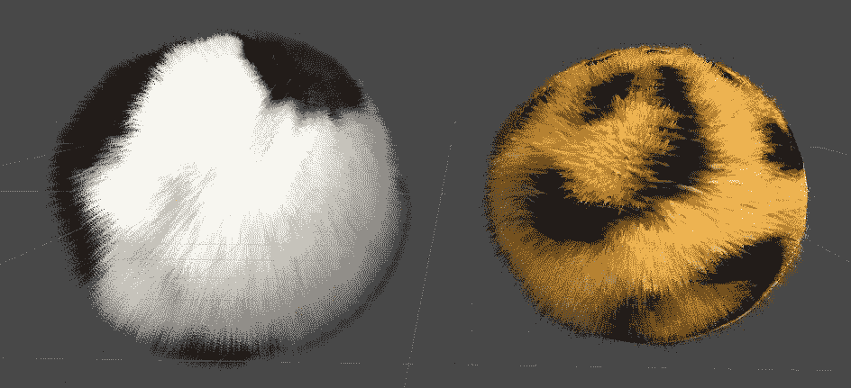

# 准备工作

为了使这个菜谱工作，你需要一个显示你希望如何显示毛发的纹理：

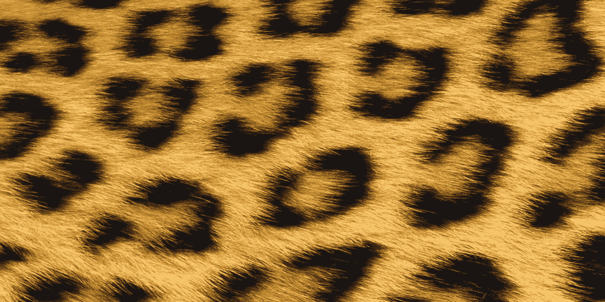

我在书的第十一章`Textures`文件夹中提供了两个示例，包括书中的示例代码（`Faux Fur`和`panda`）。

和之前所有的着色器一样，你需要创建一个新的标准表面着色器（`Fur`）和一个材质（`FurMat`）来承载它，并将其附加到一个球体上进行演示：

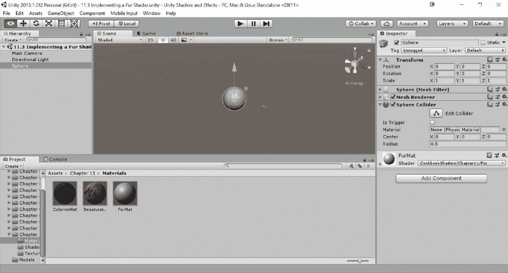

# 如何做到这一点...

在这个菜谱中，我们可以开始修改一个标准表面着色器：

1.  双击`Fur`着色器以在您选择的 IDE 中打开它。一旦打开，添加以下加粗的`Properties`：

```cs
Properties 
{
  _Color ("Color", Color) = (1,1,1,1)
  _MainTex ("Albedo (RGB)", 2D) = "white" {}
  _Glossiness ("Smoothness", Range(0,1)) = 0.5
  _Metallic ("Metallic", Range(0,1)) = 0.0

 _FurLength ("Fur Length", Range (.0002, 1)) = .25
 _Cutoff ("Alpha Cutoff", Range(0,1)) = 0.5 // how "thick"
 _CutoffEnd ("Alpha Cutoff end", Range(0,1)) = 0.5 // how thick they are at the end
 _EdgeFade ("Edge Fade", Range(0,1)) = 0.4

 _Gravity ("Gravity Direction", Vector) = (0,0,1,0)
 _GravityStrength ("Gravity Strength", Range(0,1)) = 0.25
}
```

1.  这个着色器需要你重复执行相同的流程多次。我们将使用在*使用 CgIncludes 使你的着色器世界模块化*菜谱中介绍的技术，将单个流程中所有必要的代码组合到一个外部文件中。让我们开始创建一个名为`FurPass.cginc`的新`CgInclude`文件，并包含以下代码：

```cs
#pragma target 3.0

fixed4 _Color;
sampler2D _MainTex;
half _Glossiness;
half _Metallic;

uniform float _FurLength;
uniform float _Cutoff;
uniform float _CutoffEnd;
uniform float _EdgeFade;

uniform fixed3 _Gravity;
uniform fixed _GravityStrength;

void vert (inout appdata_full v)
{
  fixed3 direction = lerp(v.normal, _Gravity * _GravityStrength + v.normal * (1-_GravityStrength), FUR_MULTIPLIER);
  v.vertex.xyz += direction * _FurLength * FUR_MULTIPLIER * v.color.a;
  //v.vertex.xyz += v.normal * _FurLength * FUR_MULTIPLIER * v.color.a;
}

struct Input {
  float2 uv_MainTex;
  float3 viewDir;
};

void surf (Input IN, inout SurfaceOutputStandard o) {
  fixed4 c = tex2D (_MainTex, IN.uv_MainTex) * _Color;
  o.Albedo = c.rgb;
  o.Metallic = _Metallic;
  o.Smoothness = _Glossiness;

  //o.Alpha = step(_Cutoff, c.a);
  o.Alpha = step(lerp(_Cutoff,_CutoffEnd,FUR_MULTIPLIER), c.a);

  float alpha = 1 - (FUR_MULTIPLIER * FUR_MULTIPLIER);
  alpha += dot(IN.viewDir, o.Normal) - _EdgeFade;

  o.Alpha *= alpha;
}
```

1.  回到你的原始着色器，并在`ENDCG`部分之后添加这个额外的流程：

```cs
void surf (Input IN, inout SurfaceOutputStandard o) {
  // Albedo comes from a texture tinted by color
  fixed4 c = tex2D (_MainTex, IN.uv_MainTex) * _Color;
  o.Albedo = c.rgb;
  // Metallic and smoothness come from slider variables
  o.Metallic = _Metallic;
  o.Smoothness = _Glossiness;
  o.Alpha = c.a;
}
ENDCG

CGPROGRAM
#pragma surface surf Standard fullforwardshadows alpha:blend vertex:vert
#define FUR_MULTIPLIER 0.05
#include "FurPass.cginc"
ENDCG
```

1.  返回 Unity，并将`FauxFur`纹理分配到 Albedo（RGB）属性中。你应该会注意到着色器上沿着一些小点：

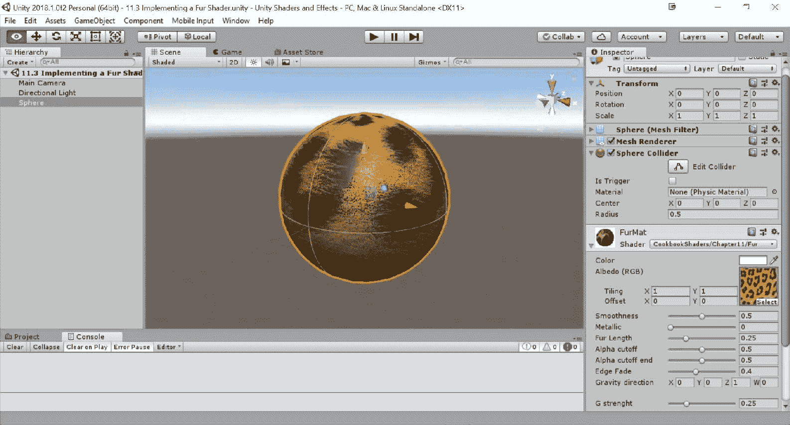

1.  增加更多遍历，逐步增加`FUR_MULTIPLIER`。使用 20 遍，从`0.05`到`0.95`可以得到相当不错的结果：

```cs
    CGPROGRAM
    #pragma surface surf Standard fullforwardshadows alpha:blend vertex:vert
    #define FUR_MULTIPLIER 0.05
    #include "FurPass.cginc"
    ENDCG

    CGPROGRAM
    #pragma surface surf Standard fullforwardshadows alpha:blend vertex:vert
    #define FUR_MULTIPLIER 0.1
    #include "FurPass.cginc"
    ENDCG

    CGPROGRAM
    #pragma surface surf Standard fullforwardshadows alpha:blend vertex:vert
    #define FUR_MULTIPLIER 0.15
    #include "FurPass.cginc"
    ENDCG

    // ... 0.2 - 0.85 here

        CGPROGRAM
    #pragma surface surf Standard fullforwardshadows alpha:blend vertex:vert
    #define FUR_MULTIPLIER 0.90
    #include "FurPass.cginc"
    ENDCG

    CGPROGRAM
    #pragma surface surf Standard fullforwardshadows alpha:blend vertex:vert
    #define FUR_MULTIPLIER 0.95
    #include "FurPass.cginc"
    ENDCG
  }

  Fallback "Diffuse"
}
```

1.  一旦着色器被编译并附加到材质上，您就可以在检查器中更改其外观。

`Fur Length`属性决定了毛发壳之间的空间，这将改变毛发的长度。较长的毛发可能需要更多的遍历来看起来逼真。

`Alpha Cutoff`和`Alpha Cutoff End`用于控制毛发的密度以及其如何逐渐变薄。

`Edge Fade`决定了毛发的最终透明度和其外观的模糊程度。较软的材料应该有较高的`Edge Fade`。

最后，`Gravity Direction`和`Gravity Strength`使毛发壳弯曲，以模拟重力效果：

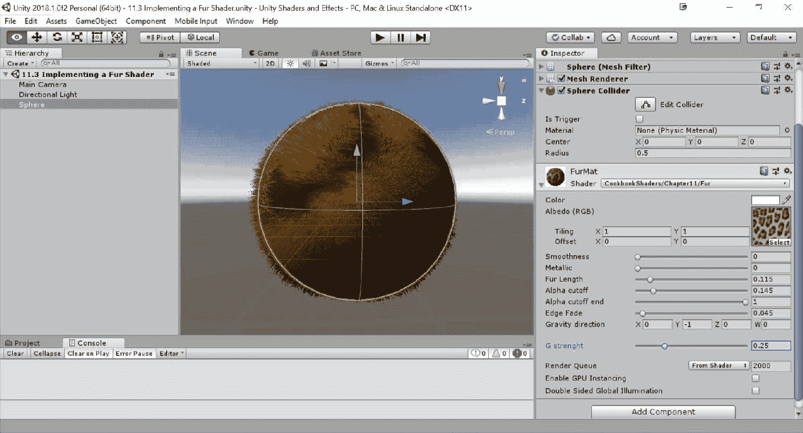

# 它是如何工作的...

本食谱中介绍的技术被称为 Lengyel 的同心毛发壳技术，或简单地称为壳技术。它是通过创建需要渲染的几何形状的逐渐增大的副本来工作的。通过适当的透明度，它会产生连续毛发线的错觉：

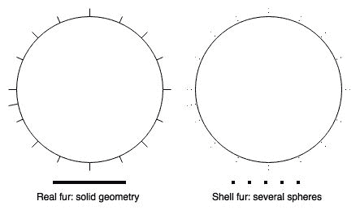

壳技术非常灵活且相对容易实现。要实现逼真的毛发，不仅需要拉伸模型的几何形状，还需要改变其顶点。这可以通过细分着色器实现，这些着色器更为先进，但本书没有涉及。

在这个`Fur`着色器中的每一遍都在`FurPass.cginc`中。顶点函数创建了一个稍微大一点的模型版本，这是基于法线拉伸原理。此外，还考虑了重力效应，因此越远离中心，效果越强烈：

```cs
void vert (inout appdata_full v) 
{ 
    fixed3 direction = lerp(v.normal, _Gravity * _GravityStrength + v.normal * (1-_GravityStrength), FUR_MULTIPLIER); 
    v.vertex.xyz += direction * _FurLength * FUR_MULTIPLIER * v.color.a; 
} 
```

在本例中，alpha 通道用于确定毛发的最终长度，这允许更精确的控制。

最后，表面函数从 alpha 通道读取控制掩码。它使用截止值来确定哪些像素要显示，哪些要隐藏。此值从第一个到最后的毛发壳都会改变，以匹配`Alpha Cutoff`和`Alpha Cutoff End`：

```cs
o.Alpha = step(lerp(_Cutoff,_CutoffEnd,FUR_MULTIPLIER), c.a); 

float alpha = 1 - (FUR_MULTIPLIER * FUR_MULTIPLIER); 
alpha += dot(IN.viewDir, o.Normal) - _EdgeFade; 

o.Alpha *= alpha; 
```

毛发的最终 alpha 值还取决于其与摄像机的角度，使其看起来更柔和。

# 还有更多...

`Fur`着色器已被用于模拟毛发。然而，它可以用于各种其他材质。它非常适合由多层自然构成的材质，如森林树冠、毛茸茸的云朵、人类头发，甚至草地。

在本书的示例代码中，可以看到仅通过调整参数就使用相同着色器的额外示例：

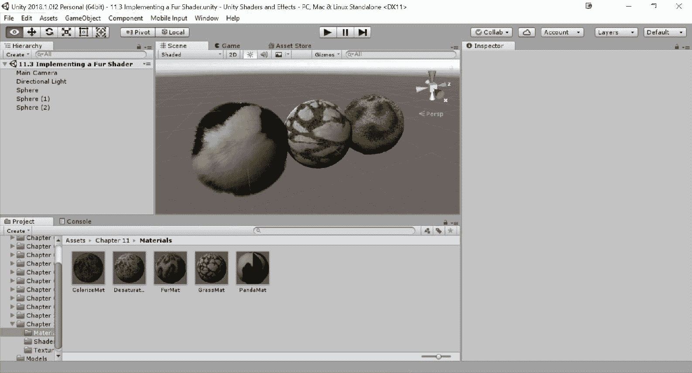

有许多其他改进可以显著提高其真实感。您可以通过根据当前时间改变重力的方向来添加一个非常简单的风动画。如果校准正确，这可以给人一种毛发因风而移动的印象。

此外，您还可以在角色移动时使您的毛发移动。所有这些小调整都有助于使您的毛发看起来更加逼真，给人一种它不仅仅是绘制在表面上的静态材质的错觉。不幸的是，这个着色器代价很高：20 次遍历计算非常沉重。遍历的次数大致决定了材质的逼真程度。您应该调整毛发长度和遍历次数，以获得最适合您的效果。鉴于这个着色器的性能影响，建议您拥有几个不同遍历次数的材质；您可以在不同的距离处使用它们，从而节省大量的计算。

# 使用数组实现热图

使着色器难以掌握的一个特点是缺乏适当的文档。大多数开发者通过在代码中摸索来学习着色器，而没有深入了解正在发生的事情。由于 Cg/HLSL 做出了很多假设，其中一些并没有得到适当的宣传，这个问题变得更加严重。Unity3D 允许 C#脚本使用`SetFloat`、`SetInt`、`SetVector`等方法与着色器通信。不幸的是，Unity3D 没有`SetArray`方法，这使得许多开发者认为`Cg/HLSL`也不支持数组。这并不正确。本文将向您展示如何将数组传递给着色器。只需记住，GPU 高度优化了并行计算，在着色器中使用循环将大大降低其性能。

对于这个配方，我们将实现一个热图，如下面的截图所示：


# 准备工作

这个配方中的效果是从一组点创建热图。这个热图可以叠加在另一张图片上，如前面的截图所示。以下步骤是必要的：

1.  创建一个带有您想要用于`Heatmap`的纹理的四边形（`GameObject` | `3D Object` | `Quad`）。在这个例子中，使用了伦敦的地图。为了将纹理放在四边形上，使用 Unlit/Texture 着色器创建一个新的材质（`Map`），并将图像分配给 Base (RGB)属性。创建后，将此对象拖放到四边形上。四边形对象的位置必须设置为（0，0，0）。

1.  创建另一个四边形，并将其放置在之前的四边形之上。我们的`Heatmap`将显示在这个四边形上。

1.  将新的着色器（`Heatmap`）和材质（`HeatmapMat`）附加到第二个四边形上：

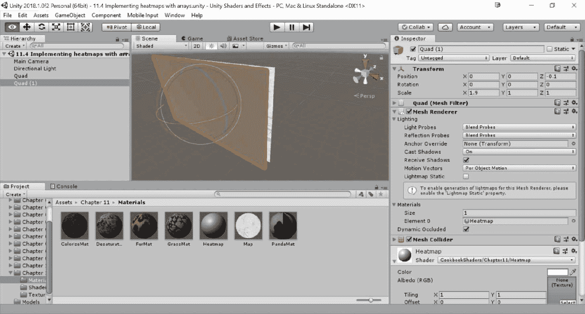

1.  为了便于可视化，我还选择了 MainCamera，并将投影改为`Orthographic`，大小属性设置为`0.5`。

# 如何实现...

这个着色器与之前创建的着色器相当不同，但它相对较短。因此，以下步骤提供了整个代码：

1.  将此代码复制到新创建的着色器中：

```cs
shader " Heatmap" { 
    Properties { 
        _HeatTex ("Texture", 2D) = "white" {} 
    } 
    Subshader { 
        Tags {"Queue"="Transparent"} 
        Blend SrcAlpha OneMinusSrcAlpha // Alpha blend 

        Pass { 
            CGPROGRAM 
            #pragma vertex vert              
            #pragma fragment frag 

            struct vertInput { 
                float4 pos : POSITION; 
            };   

            struct vertOutput { 
                float4 pos : POSITION; 
                fixed3 worldPos : TEXCOORD1; 
            }; 

            vertOutput vert(vertInput input) { 
                vertOutput o; 
                o.pos = mul(UNITY_MATRIX_MVP, input.pos); 
                o.worldPos = mul(_Object2World, input.pos).xyz; 
                return o; 
            } 

            uniform int _Points_Length = 0; 
            uniform float3 _Points [20];        // (x, y, z) = position
            uniform float2 _Properties [20];    // x = radius, y = intensity 

            sampler2D _HeatTex; 

            half4 frag(vertOutput output) : COLOR { 
                // Loops over all the points 
                half h = 0; 
                for (int i = 0; i < _Points_Length; i ++) 
                { 
                    // Calculates the contribution of each point 
                    half di = distance(output.worldPos, _Points[i].xyz); 

                    half ri = _Properties[i].x; 
                    half hi = 1 - saturate(di / ri); 

                    h += hi * _Properties[i].y; 
                } 

                // Converts (0-1) according to the heat texture 
                h = saturate(h); 
                half4 color = tex2D(_HeatTex, fixed2(h, 0.5)); 
                return color; 
            } 
            ENDCG 
        } 
    }  
    Fallback "Diffuse" 
} 
```

1.  一旦将此脚本附加到您的材料上，您应该为热图提供渐变纹理。重要的是要配置它，使其 Wrap Mode 设置为 Clamp：

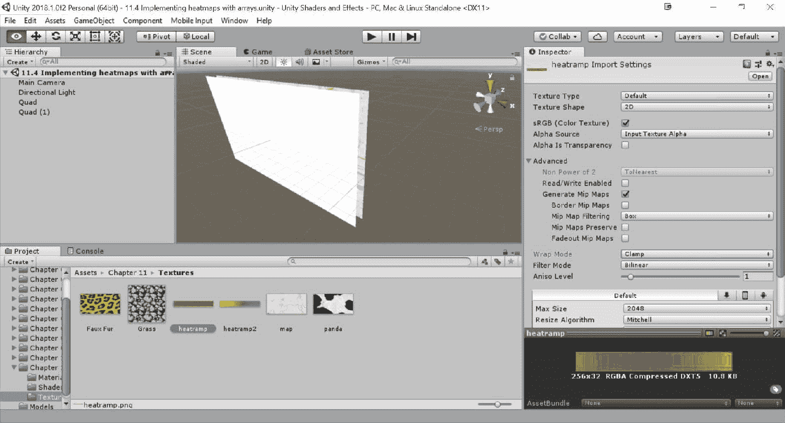

如果你的热图将要用作叠加层，那么请确保渐变纹理具有 alpha 通道，并且纹理是以“Alpha is Transparency”选项导入的。

1.  使用以下代码创建一个名为 `HeatmapDrawer` 的新脚本：

```cs
using UnityEngine;

public class HeatmapDrawer : MonoBehaviour
{

    public Vector4[] positions;
    public float[] radiuses;
    public float[] intensities;
    public Material material;

    void Start()
    {
        material.SetInt("_Points_Length", positions.Length);

        material.SetVectorArray("_Points", positions);

        Vector4[] properties = new Vector4[positions.Length];

        for (int i = 0; i < positions.Length; i++)

        {
            properties[i] = new Vector2(radiuses[i], intensities[i]);
        }

        material.SetVectorArray("_Properties", properties);

    }
}
```

1.  将脚本附加到场景中的对象上，最好是四边形。然后，将为此效果创建的材料拖到脚本的 `Material` 槽中。通过这样做，脚本将能够访问 `Material` 并初始化它。

1.  最后，扩展你的脚本中的位置、半径和强度字段，并用你的热图值填充它们。位置表示你的热图在世界坐标中的点，半径表示它们的大小，强度表示它们对周围区域的影响强度：

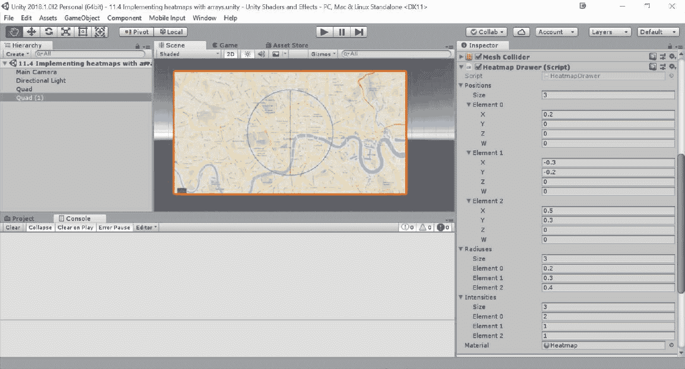

1.  如果一切顺利，当你玩游戏时，你应该会注意到以下截图类似的内容：

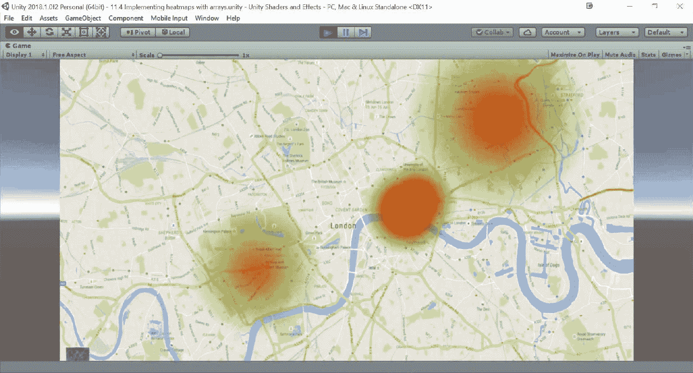

如果你没有看到这个，请确保热图放置在地图四边形之前，并且两个对象都在摄像机之前。

如果你收到一个警告说点的数量已更改，请进入你的着色器，通过添加一个空格修改脚本，然后再次保存。

# 它是如何工作的...

这个着色器依赖于本书之前未介绍的内容；第一个是数组。Cg 允许使用以下语法创建数组：

```cs
uniform float3 _Points [20];     
```

Cg 不支持未知大小的数组：你必须预先分配你需要的所有空间。前面的代码行创建了一个包含 `20` 个元素的数组。

Unity 允许我们通过使用多种方法来设置数组，包括 `SetVectorArray`、`SetColorArray`、`SetFloatArray` 和 `GetMatrixArray`。

`SetVectorArray` 函数目前只与 `Vector4` 类一起使用。这不会给我们带来任何问题，因为你可以自动将一个 `Vector3` 分配给一个 `Vector4`，Unity 会自动在最后一个元素中包含一个零。此外，你也可以在 `Update` 循环中使用我们的 `Start` 代码来能够看到我们修改它们时的值变化，但这将非常耗费计算资源。

在着色器的片段函数中，有一个类似的循环，它对材料的每个像素查询所有点以找到它们对热图的贡献：

```cs
half h = 0; 
for (int i = 0; i < _Points_Length; i ++) 
{ 
    // Calculates the contribution of each point 
    half di = distance(output.worldPos, _Points[i].xyz); 

    half ri = _Properties[i].x; 
    half hi = 1 - saturate(di / ri); 

    h += hi * _Properties[i].y; 
} 
```

`h` 变量存储了所有点的热量，这些点由它们的半径和强度给出。然后它被用来查找从渐变纹理中使用的颜色。

着色器和数组是一个获胜的组合，尤其是由于非常少有游戏能够充分利用它们。然而，它们引入了一个显著的瓶颈，因为对于每个像素，着色器必须遍历所有点。
