# 创建一个 2D 收集游戏

在*第一章*中，你被介绍了 Unity 编辑器和其常见的窗口和工具栏。我们还创建了我们的第一个玩家角色——瓢虫！遗憾的是，瓢虫目前正坐在一片浩瀚的虚无之中，没有任何目标为其存在提供价值。

在本章中，我们将通过首先向场景中添加更多的 GameObject 并创建一个为*外部世界*收集游戏（我们的瓢虫们确实会感到高兴）的 2D、自上而下环境来开始将之前获得的知识付诸实践。

使用**Tilemap**功能创建 2D 自上而下环境和设计关卡是一个简单的任务。它允许你创建一个**瓦片**调色板，然后只需在 Unity 场景视图中直接绘制关卡。

仅使用 GameObject 和 Unity 的内置组件所能做的有限，因此你将接触到**C#**语言。用 C#编写自己的脚本允许你创建游戏和体验所需的功能。

我们将讨论如何创建脚本，并了解编写代码的最佳实践方法，包括结构、原则和模式，这将使你的代码易于工作、维护和扩展。这些编写代码的方法将对你个人以及团队环境中的工作都有益，因为在行业中广泛采用了这些结构和实践。

我们将要处理的第一个 C#脚本是一个**控制器**，用于解决我们的瓢虫角色无法移动的问题。在整个书中，我们将使用一种*问题解决*的方法来定义过程，因为它以分析的心态来界定编码需求，将问题分解成更小的任务，同时考虑整体解决方案。我们还将处理玩家输入，因此你将学习如何设置和连接你的代码到 Unity 的新基于事件的**输入系统**。

在本章中，我们将涵盖以下主要主题：

+   使用**Tilemap**创建一个 2D、自上而下的游戏环境

+   C#中创建脚本的介绍——IDE、SOLID 原则和设计模式

+   使用新输入系统编写简单的玩家控制器

到本章结束时，你将能够快速创建一个 2D、自上而下、基于瓦片的游戏环境，设计一个关卡，并了解如何在考虑最佳实践原则和设计模式的同时创建和编辑 C#脚本。我们的瓢虫角色也将能够通过响应玩家输入来探索一个酷炫的新环境。

# 技术要求

要跟随本章的内容，你需要安装**Visual Studio Community 2022**；我们将在整个章节和书中的项目中使用这个版本。这应该已经在*第一章*中与 Unity 编辑器一起安装了。

您可以在 GitHub 上下载完整项目：[`github.com/PacktPublishing/Unity-2022-by-Example`](https://github.com/PacktPublishing/Unity-2022-by-Example)。

# 使用 Tilemap 创建 2D、俯视游戏环境

我们将首先完成的事情来创建收集游戏环境是进行一些水平设计。级别的设计将影响游戏玩法——游戏的乐趣和挑战性。这不会是一个对水平设计的全面深入研究；毕竟，我们正在制作一个非常简单的收集游戏。

我们现在将专注于水平设计的一个原则——引导玩家。由于这是一个 2D、俯视视角的游戏，我们引导玩家的最简单方法就是使用水平中的形状并引入危险。在这样的简单游戏中我们能做的有限，但这些原则可以应用于更大、更复杂的游戏。

设计的可视化不是每个人的强项——我们有时都需要创造性的帮助和灵感。虽然**游戏设计文档**（**GDD**）擅长描述事物，但它只能用这么多字来传达。正如人们所说，一张图胜过千言万语，所以看看我最初为收集游戏级别设计所做的草图：

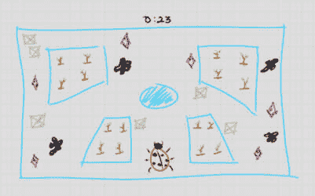

图 2.1 – 收集游戏级别的草图

如果你缺乏灵感或者只是喜欢跟随（这里没有人会因为你这样做而评判你），那么就使用我的草图来达到你自己的目的。当你深入这本书的时候，我可能听起来就像一个破唱片，但请记住这一点——如果你不觉得开心，你就是在做错事。

接下来，让我们探索一些引导玩家的例子。

## 水平设计 – 引导玩家

通过在水平中创建形状（也称为**引导线**），我们鼓励玩家向期望的方向移动。例如，从玩家生成的位置开始，让我们先给他们一个直接在他们面前的开阔区域。

这个开阔区域的一侧将开始向内倾斜，随着它远离玩家面对的方向，这将创造出箭头形状。这种形状会无意识地引导玩家向前移动，朝着“箭头”所指的方向。

生成/重生/消失玩家

**生成**指的是在游戏中创建玩家。这通常发生在游戏开始时，或者在开始一个关卡时。

**重生**是指玩家在死亡或需要玩家在特定位置重新开始的某些游戏事件后重新生成。

当玩家**消失**时，他们将从游戏世界中移除。

形状是我们水平设计中用来引导玩家通过环境的工具之一，另一个是危险。让我们在下一节中看看如何使用危险。

### 危险

在视频游戏中，关卡设计可以通过视觉提示影响玩家的移动，其中之一就是危险元素。这些元素可以引导玩家向下一个目标前进，推动游戏进程，同时通过在玩家必须访问以完成游戏目标的地方放置危险元素来改变关卡难度。

阅读材料 | 2D 关卡设计

《2D 游戏中的关卡设计模式》由*Ahmed* *Khalifa*著：[`www.gamedeveloper.com/design/level-design-patterns-in-2d-games`](https://www.gamedeveloper.com/design/level-design-patterns-in-2d-games)

在本节中，你了解到形状和危险元素是简单的概念，可以引导玩家，如果做得好，它们可以产生很好的效果。要使引导微妙并融入/隐藏到环境设计中，需要练习。

让我们通过创建 2D 收集游戏关卡来开始练习。在下一节中，我们将使用 Unity 2D 工具集的一部分，即**Tilemap**功能，这个工作流程的第一步是创建一个**Tile Palette**。

## 创建 Tile Palettes

你可能在上次我们处理玩家角色时关闭了 Unity。要返回项目中我们上次停止的地方，请打开 Unity Hub。默认视图将列出你之前创建的所有项目。列表还包括一些关于项目的附加信息，例如上次修改时间和用于它的编辑器版本。以下截图是一个示例：

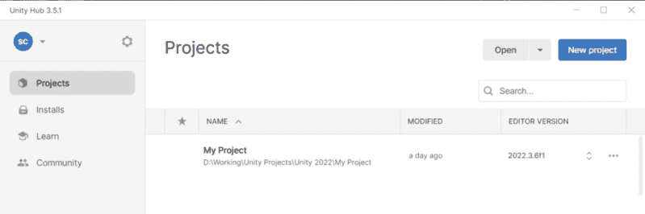

图 2.2 – Unity Hub 项目列表

从 Unity Hub 添加和删除项目

你可以从 Unity Hub 添加和删除项目以保持项目列表的相关性。通过使用窗口右上角的**打开**按钮从磁盘添加项目。使用列表中每个条目右侧的水平省略号来删除项目。请注意，从 Hub 中删除项目不会从磁盘上删除它，并且需要在 Hub 外手动清理。

打开你之前从**2D URP Core**模板（如图 2.2 所示，它是**My Project**项目）创建的项目。只需在列表中单击项目名称即可完成此操作。

在实际创建我们的瓦片地图之前，我们需要一些精灵图像来工作。以下部分将介绍向项目中添加精灵，这些精灵将构成我们第一个瓦片地图的基础，用于构建游戏关卡。

### 2D 游戏资源

为了创建我们关卡的环境，我们将使用一些免费提供的游戏资源。在接下来的章节中，我们将使用原始艺术资源，并采用不同的艺术流程和工作流程，这样你将获得更全面的知识，当处理 Unity 中的 2D 艺术时。

免费游戏资源

**Kenney**提供无附加条件的现成游戏资源！数千个精灵可供使用——适用于许多不同的主题和流派——您可以在自己的项目中使用，任何类型的用途都允许，甚至包括商业用途。您可以在以下位置找到所有 Kenney 资源列表：[`kenney.nl/assets`](https://kenney.nl/assets)

**Kenney**是一个提供许多预制精灵图集和瓦片图资源的网站。这两个图形术语之间的主要区别可以概括如下：

+   **精灵图集图像**是由几个较小的图像组成的图像（*图 2.5*中的左侧图像）

+   **瓦片图**是由几个较小的图像组成的图像，这些图像以二维网格的形式排列（*图 2.5*中的右侧图像）

重要注意事项

**精灵图集**和**瓦片图**这两个术语经常被互换使用，意义差别不大。我在以下章节中尝试从实际角度澄清这些术语，并提供示例。

2D 艺术通常以精灵图集的形式提供，因为单个图像是在游戏引擎中处理图像的更优方式，而不是为每个资产使用单独的图像。即使 2D 艺术以单个图像的形式提供，Unity 也有工具可以将单个精灵图像组合成单个图像以进行优化（在这种情况下，Unity 中的组合或打包图像被称为**精灵图集**）。如前所述，Kenney 提供以精灵图集和瓦片图形式的游戏资源。

优化注意事项

精灵图集更加**优化**，因为它们减少了渲染器（显卡）必须执行的绘制调用次数。图集上包含的所有精灵可以同时绘制，将整个精灵图集视为单个绘制，而如果它们是单独的精灵，则需要单独绘制。这种减少绘制调用的次数可以提高游戏性能（提高帧率）。

现在我们已经了解了 2D 游戏资产图像是什么，让我们在下一节中从 Kenney 导入一些资产，以了解实际导入和使用图像的过程。

### 导入精灵

将图像导入 Unity 很容易，但让我们首先通过创建一些文件夹来定义我们项目中的组织结构。按照以下步骤创建`Sprites`、`Tile Palettes`和`Tile Palettes/Tiles`文件夹：

1.  在`Assets`文件夹中。

1.  在**项目**窗口内右键点击以打开**创建**菜单（或者在**项目**标签上方直接点击**+**按钮）并选择**创建** | **文件夹**。

1.  将文件夹命名为`Sprites`并按*Enter*键。

1.  重复*步骤 2*以创建`Tile Palettes`文件夹。

1.  现在，在选择了`Tile Palettes`文件夹后，重复*步骤 2*以创建`Tiles`文件夹（此文件夹是`Tile Palettes`文件夹的子文件夹）。

我们将在集合游戏项目中使用 Kenney 的两个精灵图集来创建游戏环境 – **俯视坦克 Redux** 和 **塔防**（**俯视**）游戏资源。您可以直接从 [`kenney.nl/assets`](https://kenney.nl/assets) 网站下载精灵图集，或者它们也包含在 GitHub 项目中提供的书籍项目文件中（参考 *技术要求* 部分的链接）。

一旦创建了文件夹并下载了精灵图集，我们现在就可以导入精灵了。太好了！

您可以通过从文件管理器（Windows）/Finder（Mac）拖动它们并将它们拖放到 Unity **项目** 窗口中，或者通过在 **项目** 窗口中右键单击并选择 **导入** **新资源…** 来将精灵导入 Unity。

首先，我们将使用 *塔防（俯视）* 游戏资源的 `towerDefense_tilesheet.png` 精灵图集。将图像导入到 `Assets/Sprites` 文件夹中，一旦资源导入完成，在 **项目** 窗口中选择它将在 **检查器** 窗口中显示精灵导入设置。

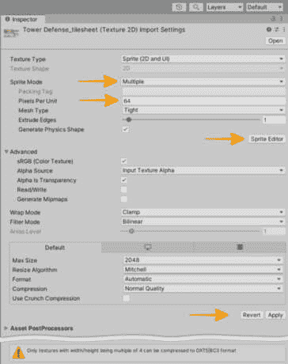

图 2.3 – 精灵导入设置

由于精灵图集包含许多图像，我们首先想要将 **精灵模式** 改为 **多个**。每次更改导入设置时，您都必须点击字段列表底部的 **应用** 按钮。一旦点击，我们将继续切片精灵图集以创建可单独选择的精灵。

2 的幂纹理

最好将纹理的尺寸设置为所有边都是 2 的幂的尺寸。尺寸为 2、4、8、16、32、64、128、256、512、1,024 或 2,048 像素（px）。请注意，纹理不必是正方形的（例如，256 x 1,024）。Unity 将使用非 2 的幂纹理，尽管它们不会被压缩（占用更多视频内存）并且不会优化（在某些情况下，加载和渲染速度较慢）。当它们无法被压缩时，**检查器**窗口将显示警告，如图 2.3* 底部所示。

#### 切片精灵图集

当 **精灵模式** 设置为 *多个* 时，导入的图像现在被视为精灵图集，需要定义几个较小的图像。如果我们跳过此步骤，精灵图集中的所有较小图像将无法访问，我们无法将它们分配给 **精灵渲染器** 或为在 **瓦片地图** **瓦片调色板** 中绘制或填充我们的关卡创建瓦片。

通过单击 **精灵编辑器** 按钮位于 **精灵模式** 部分字段下方来打开精灵编辑器（参考 *图 2.3*）。您会看到精灵图集实际上是一个瓦片地图图像，因为精灵已经为我们排列在一个二维网格中。这使得切片变得轻而易举！

接下来，点击`64`和`64`。这个 Kenney 瓦片图的精灵单元是 64 像素方形，但你可能需要处理不同大小的精灵，因此你必须相应地设置此值。

我们可以保留对话框中其余字段的默认值，然后通过点击**切片**按钮继续将图像切片成精灵。切片结果应如下所示：

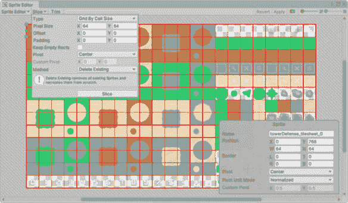

图 2.4 – 精灵编辑器塔防（俯视）瓦片图

裁剪精灵

对于一些没有完全填满网格单元的精灵，如果某些间距没有调整得恰到好处，你可能会从相邻的精灵中得到一些溢出。这可以通过在精灵编辑器中点击有问题的精灵，然后点击**裁剪**按钮（位于**切片**按钮的右侧）来轻松修复。

让我们继续切片我们将用于收集游戏环境中的对象的另一个 Kenney 资产 – `Top-down Tanks Redux` 游戏资产的 `Assets/Sprites/topdowntanks_onlyObjects_default.png` 精灵图集。

同样，导入后，在**项目**窗口中选择图像以在**检查器**窗口中显示导入设置，将**精灵模式**设置为**多个**，点击底部的**应用**按钮，最后点击**精灵****编辑器**按钮。

你可能会立即注意到这张图片的不同之处 – 它不是一个瓦片图。Kenney 为比 Unity 更多的游戏引擎提供了游戏资产作为精灵图集。虽然这个精灵图集可能在其他一些游戏引擎中工作得很好，但不幸的是，它在 Unity 中却不行。

假设较小的图像有更多的填充（由围绕图像的透明像素表示的空白空间）。在这种情况下，Unity 的**自动**切片类型设置可能按预期工作，将切片分割成单个精灵 – 它在有足够填充的情况下可以这样做 – 但在这种情况下，它没有工作，并将整个精灵图集图像视为单个精灵。

因此，要使用与 Unity 的自动切片不兼容的填充不足的精灵图集中的图像，你必须打开你喜欢的图像编辑软件（例如，Adobe Photoshop、Gimp 或 Krita）并重新排列图像以添加填充，或者按单元格大小排列它们进行切片。

如以下截图所示，我选择从原始 Kenney 精灵图集中复制图像（左侧）并创建一个新的瓦片图图像，具有一致的单元格大小布局（右侧 – 此图像包含在本书的项目文件中）。

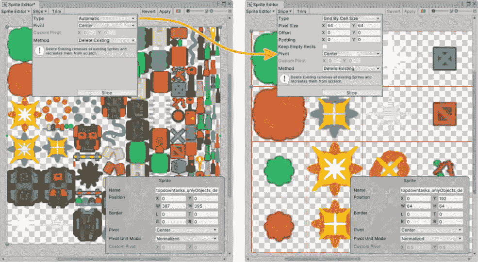

图 2.5 – 精灵编辑器 – 自动切片与网格切片

优化提示

为了减少使用称为批处理渲染技术的绘制调用，可以将精灵图集添加到项目中。将单个精灵、精灵图集图像甚至文件夹分配给精灵图集，将它们打包成一个单独的精灵图集图像以进行渲染。这个图集将是唯一被绘制的资产，而不是多个精灵图像，其中每个额外的精灵图像都会向渲染器添加一个绘制调用。

作为一项附加活动，从 **创建** 菜单中选择 **创建** | **2D** | **精灵图集** 在 **项目** 窗口中创建一个精灵图集。然后，您可以将导入的切片精灵图集分配给 **打包对象** 列表或 **精灵** 文件夹本身。您可能需要验证在 **项目设置** | **编辑器** | **精灵打包器** | **模式 = 精灵图集 v2 –** **启用** 中该功能是否已启用（默认）。

现在我们已经将瓦片图分成单个精灵，我们准备创建一个瓦片调色板。精灵将被添加到瓦片调色板中，以创建用于绘制关卡的瓦片。让我们在下一节中创建我们的第一个瓦片调色板。

附加阅读 | Unity 文档

**精灵** **编辑器**：[`docs.unity3d.com/2022.3/Documentation/Manual/SpriteEditor.xhtml`](https://docs.unity3d.com/2022.3/Documentation/Manual/SpriteEditor.xhtml)

### 创建瓦片调色板

要开始创建瓦片调色板，请执行以下步骤：

1.  首先，通过转到 **窗口** | **2D** | **瓦片调色板** 打开 **瓦片调色板** 窗口。

1.  我们将使用 *塔防（俯视）* 游戏资源作为我们的主要环境图，因此通过点击 **创建新调色板** 下拉菜单并选择 *新建调色板* 来创建一个新的 **瓦片调色板**。这个下拉列表是我们将选择当前调色板以在场景视图中绘制瓦片图的地方。

1.  命名为 `Environment Main`；保持默认设置，因为我们使用的是矩形网格。

1.  点击如图 *图 2.6* 所示的 **创建** 按钮。

1.  瓦片调色板是一个保存在 `项目` 文件夹中的资产，因此您将被提示保存它。选择我们之前创建的文件夹 – `Assets/Tile Palettes`。

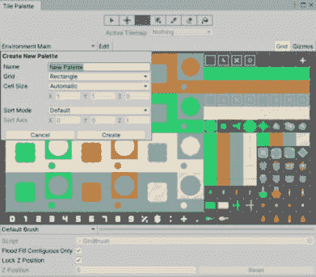

图 2.6 – 创建瓦片调色板和瓦片

附加阅读 | Unity 文档

创建瓦片调色板：[`docs.unity3d.com/2022.3/Documentation/Manual/Tilemap-Palette.xhtml`](https://docs.unity3d.com/2022.3/Documentation/Manual/Tilemap-Palette.xhtml)

调色板创建完成后，我们可以继续进行在开始绘制关卡之前所需的最后一步，我们将在下一节通过向调色板添加瓦片来解决这个问题。

### 创建瓦片

瓦片是瓦片调色板用来将精灵绘制到场景中的东西。你可能想知道为什么我们已经有切片并准备好作为单独图像使用的精灵，还需要创建瓦片。那是因为瓦片在绘制瓦片图时可以提供额外的功能。其他类型的瓦片包括 **规则瓦片** 和 **动画瓦片**，但我们将从默认的瓦片类型开始使用。

让我们先从将 `towerDefense_tilesheet.png` 精灵图集从 `Assets/Sprites` 文件夹拖动到我们已为他们准备的 `Assets/Tile Palettes/Tiles` 文件夹开始。结果应该看起来像 *图 2**.6* 中的瓦片调色板窗口。

在我们开始绘制我们的关卡之前，让我们快速查看两种非常有用的瓦片类型。

#### 瓦片类型

常见的瓦片类型包括：

+   **规则瓦片**：这允许我们创建规则，其中指定的相邻瓦片将被用来更容易地绘制复杂形状。这本质上是一个自动绘图工具。这是一个节省大量时间的方法！

要创建一个新的规则瓦片，切换到 `Assets/Tile Palettes/Tiles` 中的 `Rule Tiles` 文件夹。在如图 **检查器** 窗口中，在 `Environment Area 1` 内右键单击：

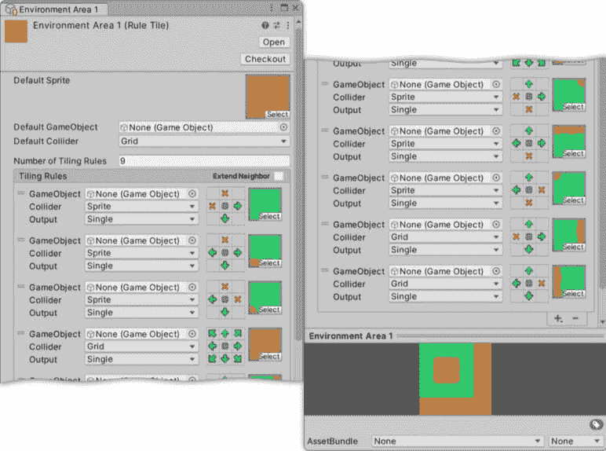

图 2.7 – 规则瓦片设置

我们将添加瓦片规则来创建一个带有适当角落精灵的填充正方形，与水平和垂直边精灵相邻。这总共需要九个精灵——四个在边缘，四个在角落，一个在中心。

设置 `9`，然后按照 *图 2**.7* 作为指南，分配环境精灵图集中的所有精灵。一旦分配了精灵，我们就可以设置“3 x 3”的盒子，这些盒子可以可视化规则的行为。再次使用 *图 2**.7*，相应地设置盒子规则。

额外阅读 | Unity 文档

**规则** **瓦片**：[`docs.unity3d.com/Packages/com.unity.2d.tilemap.extras%403.0/manual/RuleTile.xhtml`](https://docs.unity3d.com/Packages/com.unity.2d.tilemap.extras%403.0/manual/RuleTile.xhtml)

+   **动画瓦片**：这允许我们通过分配几个精灵以指定速度相互替换来创建精灵动画。

要创建一个新的动画瓦片，切换到 `Assets/Tile Palettes/Tiles` 中的 `Animated Tiles` 文件夹。在 **项目** 窗口中右键单击以打开 **创建** 菜单，然后在新的文件夹中转到 **创建** | **2D** | **瓦片** | **动画瓦片**。要使用此瓦片，将一系列精灵拖到 **拖动精灵或精灵纹理资产以开始创建动画瓦片** 部分。

额外阅读 | Unity 文档

**动画** **瓦片**：[`docs.unity3d.com/Packages/com.unity.2d.tilemap.extras%403.0/manual/AnimatedTile.xhtml`](https://docs.unity3d.com/Packages/com.unity.2d.tilemap.extras%403.0/manual/AnimatedTile.xhtml)

为了快速回顾我们创建的所有文件夹以组织和包含所有我们的艺术资产，我们的 **项目** 窗口应该看起来类似于以下内容：

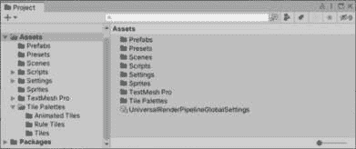

图 2.8 – 项目文件夹结构

在本节中，你学习了如何创建瓦片调色板，了解了如何导入和切割精灵图集以创建单个精灵，并探讨了使用规则瓦片使绘制更容易的优势。

这是我们绘制收集游戏关卡环境所需的所有先决设置，所以让我们开始做吧。在下一节中，我们将添加几个瓦片图，用于构成关卡设计的不同组件。

## 使用瓦片图构建收集游戏环境

我们需要一个新场景来放置游戏关卡，所以请转到**文件** | **新建场景** (*Ctrl*/*Cmd* + *N*)。这将打开**新建场景**窗口，在那里我们将选择**Lit 2D (URP)**场景模板，然后点击窗口右下角的**创建**按钮，如图下截图所示：

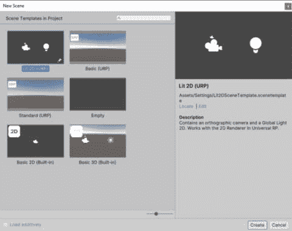

图 2.9 – 新场景模板

场景模板 – Unity 文档

Unity 提供了一套内置的场景模板，但您可以添加自己的用户定义模板来创建包含所有起始内容的新场景。有关创建场景模板的更多信息，请参阅 Unity 文档：[`docs.unity3d.com/2022.3/Documentation/Manual/scene-templates.xhtml`](https://docs.unity3d.com/2022.3/Documentation/Manual/scene-templates.xhtml)

一个新的**游戏**或**关卡**，因为我们的游戏将完全由单个场景（即单个游戏关卡）组成。

在保存了我们的新游戏场景后，我们就可以在下一节开始添加瓦片图了！

### 向场景添加瓦片图

**瓦片图**是添加到 GameObject 上的组件，它提供的功能就像我们之前讨论过的任何其他组件一样。**瓦片图**组件存储和管理用于创建 2D 环境和关卡所使用的**瓦片**资源。它还依赖于一个**网格**组件，该组件提供视觉引导并使绘制的瓦片对齐。我们将制作多个瓦片图，以服务于不同的视觉和功能目的。

要在场景中创建瓦片图，请从**瓦片图 – 背景**开始。请参考图 2.11 以了解在**层次结构**窗口中此操作的示例。

在下一节中，我们将学习如何控制多个瓦片图的绘制顺序。

#### 层级排序

就像我们在单个精灵上有排序层一样，我们在瓦片图上也有。**瓦片图排序层**将允许我们在不同的层上绘制精灵，以控制前后层叠（绘制在其他人之上或之后的对象）并应用于整个瓦片图（构成瓦片图的全部精灵）。

让我们通过点击**排序层**下拉列表创建一个新的**排序层**用于背景瓦片地图，当前该下拉列表的值为**默认**，然后点击**添加排序层…**。**检查器**窗口将切换到**标签与层**设置，我们将指定以下层及其顺序：*背景*，*碰撞器*，*对象*和*前景*。

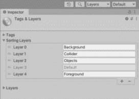

图 2.10 – 排序层

渲染器将按照它们在这里出现的顺序绘制层，**层 0**（**背景**）在后面，**层 4**（**前景**）在前面，中间的层将在它们各自的位置绘制。

点击**+**按钮将向列表中添加一个新层，而点击已选中的层旁边的**-**按钮将移除它。将字段左侧的**=**向上/向下拖动（例如，**层 0**）将重新排序。一旦我们完成添加和设置层顺序后，再次点击**层次结构**窗口中的**Tilemap - Background**，并在**瓦片地图渲染器排序**层下拉字段中选择*背景*。

我们仍然有在同一个排序层上创建第二个瓦片地图背景的选项，我们可以通过使用**层中顺序**字段来控制哪个背景绘制在另一个背景之上/之下——如果你有两个不同风格的背景环境并且想要分别管理它们，这将很有用。

我们终于准备好在下一节开始使用我们的瓦片进行绘制了！

### 在场景视图中绘制关卡

如果你曾经使用过绘图程序，那么在瓦片调色板工具栏中的绘画工具将看起来很熟悉，只是你现在将限制在网格上绘画。画笔、填充、框填充和橡皮擦工具都是绘图程序中的标准绘画工具。

我们不会详细涵盖所有绘画工具，但我鼓励你在绘制你的环境和关卡设计时自己探索它们 – 不要害怕犯错！像 Unity 中的大多数事情一样——以及几乎每个程序——你可以通过使用 *Ctrl*/*Cmd* + *Z* 快速撤销操作。

在进行过程中记得保存你的进度，以保留你喜欢的部分。享受你的绘画过程，并花时间进行实验，因为你永远不知道这种创造力的方向在哪里。

场景导航

作为在绘制关卡时在场景视图中导航的提醒，请参考*第一章*中的*导航场景视图*部分。

每次你想在场景视图中使用绘画工具进行绘制时，请遵循以下步骤：

1.  首先，选择你想要绘制的瓦片地图，无论是在**层次结构**窗口中还是在**瓦片调色板**窗口内，使用**活动瓦片地图**下拉列表（位于工具栏下方）。

1.  使用位于左侧**活动瓷砖图**部分下方**瓷砖调色板**下拉列表中选择你想要绘制的**瓷砖**的**调色板**。例如，我们将选择我们之前创建的**环境主**调色板。

1.  通过在瓷砖部分网格中点击它来选择要绘制的瓷砖。记住，我们是从我们的关卡设计的背景开始，所以选择一个可以用来填充大面积的实心方块瓷砖。

1.  要绘制单个瓷砖，请在场景视图中点击网格单元格，或者通过点击并拖动来绘制精灵的连续线条，选择**画笔**工具（画笔图标）。

1.  要绘制一个用所选瓷砖填充的矩形形状，请选择**方块填充**工具（方块图标）。

1.  你还可以使用**填充**工具（水桶图标）用所选瓷砖填充更大的连续网格单元格区域。

1.  **橡皮擦**工具可以通过点击它们或点击并拖动来擦除单元格网格中的瓷砖。

下图说明了在**层级**窗口中选定的背景瓷砖图（*A*），在**检查器**窗口中查看其组件（*B*），我们正在使用它来绘制背景的环境调色板（**环境主**）（*C*），以及当前选定的瓷砖（**草地**）（*D*）和正在使用的绘画工具（**画笔**）（*E*）。

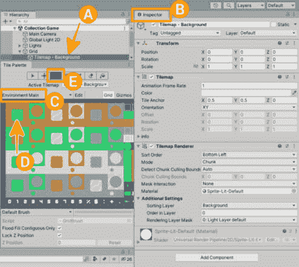

图 2.11 – 层级和瓷砖调色板窗口中的瓷砖图

额外阅读 | Unity 文档

**在瓷砖图中绘制**：[`docs.unity3d.com/2022.3/Documentation/Manual/Tilemap-Painting.xhtml`](https://docs.unity3d.com/2022.3/Documentation/Manual/Tilemap-Painting.xhtml)

作为我们在这里绘制内容的提醒，我们正在为我们的收集游戏关卡创建背景——定义一般游戏区域。为了可视化整体关卡设计计划，可能有助于首先在纸上绘制一些你的想法，然后使用这些想法在编辑器中开始绘制（如有需要，请参考我的初始草图作为指南）。

纸质原型设计

纸质原型设计是游戏设计过程中广泛使用的方法，它可以帮助你在投入时间编写代码或创建数字艺术资源之前测试你的想法。这也是验证你的游戏玩法和早期发现潜在问题的快速方法。

在尝试你的关卡设计时，请考虑我们将在以下部分引导玩家到达关卡中我们将放置收集品的区域。不要害怕犯错；根据游戏测试对游戏进行更改是您将不得不定期做的事情——迭代更改以改进游戏玩法或平衡难度。

在调整环境和其他关卡设计元素之前，让我们确保通过调整**相机**设置，我们的艺术资源在游戏视图中看起来最好。

#### 图像设置以获得清晰的图形

Unity 在新场景中提供的默认设置并不总是适合您将要工作的游戏资产。因此，我们将调整我们的精灵图导入设置和场景相机，以确保它们看起来最好！

我们在瓦片图图像中的单个图像是 64 像素的方形（注意，这些尺寸可能不同，取决于游戏设计对艺术作品所需尺寸的规定）。与瓦片图图像一起工作的最佳方式是确保单个精灵大小等于网格大小。由于瓦片图网格单元格的大小设置为等于一个 Unity 单位，因此我们必须将每单位像素数设置为等于一个 Unity 单位。

要设置我们的**塔防（俯视）**资产中精灵的每单位像素数，请点击位于`Assets/Sprites`文件夹中的`towerDefense_tilesheet.png`图像以查看导入设置在`64`（像素）。

现在，我们必须解决相机设置问题，以便 64 像素的精灵图像在屏幕上以原生分辨率表示。这是我们所说的**清晰图形**——原生大小。这需要一点数学计算和针对目标平台的首选分辨率的决定。假设大多数桌面系统上的玩家——我们的目标平台是收集游戏——的屏幕分辨率为 1,920 像素宽 x 1,080 像素高，让我们使用这个值。

在**场景层次结构**窗口中选择**主相机**；然后，在**投影**部分，通过将屏幕分辨率高度除以每单位像素数，然后将结果除以 2 来设置正交相机投影大小（这是一个垂直值）——我们之所以除以 2，是因为大小值是相机垂直视场的一半。以下是计算结果在**检查器**窗口中的样子 – *(1,080 ÷ 64) ÷ 2 =* *8.4375*。

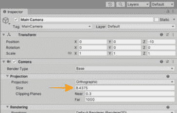

图 2.12 – 相机的正交大小

现在垂直延伸的精灵数量对于清晰图形来说是最佳的！为了在编辑器中可视化结果，切换到**游戏**视图（通过点击位于主工具栏下方的**场景**旁边的标签）并将**纵横比**下拉列表值设置为**全高清（1920x1080）**——默认情况下；这是设置为**自由纵横比**。

在本节中，我们学习了如何在场景视图中绘制瓦片以创建背景环境并定义关卡的游戏区域。我们还学习了如何使我们的艺术资产看起来最好！接下来，我们将添加一些 2D 灯光——利用通用渲染管道（通用 RP，或 URP）的 2D 功能——以增强环境设计。

### 添加 2D 灯光

通用 RP 2D 渲染器允许我们通过添加 2D 灯光来增强我们的环境！让我们在代表环境设计中光源的一些瓦片位置添加一些 2D 灯光。按照以下步骤添加一些**光源**：

1.  首先，为将绘制在背景瓷砖图之上的瓷砖创建一个新的瓷砖图，并将其命名为`Tilemap -` `Objects`。

1.  将**排序层**设置为*对象*。

1.  创建一个新的`Environment Objects`。

1.  将`topdowntanks_onlyObjects_default`精灵图集中的精灵添加到创建瓷砖中。

1.  在**瓷砖** **调色板**窗口中，将*Tilemap - Objects*设置为**活动瓷砖图**。

1.  选择星形瓷砖，并使用**画笔**工具在场景中绘制几个。

重要提示

要专注于特定瓷砖图，同时将场景中的其他 GameObject 淡出，请使用**瓷砖图聚焦**模式（场景视图中的浮动叠加层）。

好的，环境中有一些光源；现在，按照以下步骤给它们添加一些 2D 光源：

1.  在场景的`Lights`根目录下创建一个新的空 GameObject。

1.  右键单击**Lights** GameObject——以打开**创建**菜单——然后选择**Light** | **Freeform Light 2D** | **Circle**。

1.  使用**移动**工具，将其定位在其中一个*星*瓷砖上。

1.  你可以尝试看看什么对你来说看起来不错。我将灯光的**混合**部分的**混合样式**值更改为**加法**（默认是**乘法**），以便更好地可视化示例截图。对于完成的游戏，我会降低全局光源的强度，并在环境中添加的许多 2D 光源上使用**乘法**混合样式，以设定正确的光照设计基调。

额外阅读 | Unity 文档

**灯光混合** **样式**：[`docs.unity3d.com/Packages/com.unity.render-pipelines.universal%4015.0/manual/LightBlendStyles.xhtml`](https://docs.unity3d.com/Packages/com.unity.render-pipelines.universal%4015.0/manual/LightBlendStyles.xhtml)

1.  调整**半径**、**内聚光角度**/**外聚光角度**、**强度**和**衰减强度**值，直到满意。

1.  对于你环境设计中的所有光源，按需重复此操作！

你可能需要调整场景中的整体光照，以充分利用 2D 光源。通过在**场景层次结构**窗口中选择**全局光 2D**GameObject 并调整光 2D 组件的**强度**值来完成此操作。

在场景中添加 2D 光源的结果可以在**图 2**.13*中看到——在玩家角色（瓢虫）的左右两侧。在接下来的章节中，我们将使用不同类型的 2D 光源。

在本节中，你学习了如何有效地将 2D 光源添加到你的环境设计中。下一节将解决一个缺失的要求，通过使用**TilemapCollider2D**组件使我们的关卡可玩。

## 使关卡可玩——Tilemap Collider 2D

在我们能够使关卡可玩之前，我们需要对关卡设计做一些准备——我们将在下一章通过添加自定义脚本和映射输入来使玩家角色可控制。

为了防止玩家穿越到关卡中指定的区域，我们需要在 tilemap 中添加一种特殊的碰撞器。碰撞器是 Unity 物理系统的一部分，为开发者提供了与 GameObjects 交互的方式，类似于现实世界中的物体工作方式。

碰撞器阻止事物相互进入，并且对象的碰撞都可以通过代码作为事件来响应——我们将在添加游戏功能时进一步探讨这一点。

让我们在场景中添加一个新的 tilemap 来定义玩家不允许进入的区域。这将与创建之前的 tilemap 类似，但需要添加一个 **TilemapCollider2D** 组件：

1.  为将要在背景 tilemap 上绘制并包含玩家无法穿越的区域的新 tilemap 创建一个新的 tilemap。命名为 `Tilemap -` `Collider`。

1.  将 **Sorting Layer** 设置为 *Collider*。

1.  让我们使用一个 `Rules Palette`。

1.  将 `Assets/Tile Palettes/Rule` `Tiles` 文件夹拖入。

1.  在 **Tile** **Palette** 窗口中，将 *Tilemap - Collider* 设置为 **Active Tilemap**。

1.  选择规则图块，并使用 **Filled** **Box** 工具在场景中绘制区域。

现在，为了使这个 tilemap 具有交互性，在 **Hierarchy** 窗口中选中 **Tilemap - Collider**，在 **Inspector** 窗口的底部点击 **Add Component** 按钮。在打开的对话框顶部的搜索字段中输入 *Tilemap*，然后选择 **Tilemap Collider 2D** 项以添加它——我们可以使用默认值。

参考以下图示，了解我们正在创建的内容：

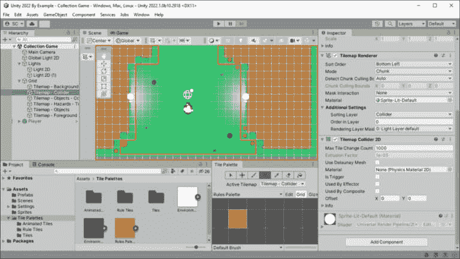

图 2.13 – 场景视图中碰撞器关卡设计示例

现在你已经了解了如何添加 tilemap、在场景中绘制图块以及排序 tilemap 层以设置正确的绘制顺序，花些时间填充环境细节。这是你实验环境设计细节和思考玩家如何通过关卡完成游戏目标——收集物品的时间。

在本节中，你学习了关卡设计的一些关键元素。你了解了如何通过导入和切割精灵图集图像来创建和操作 tilemap。为了绘制游戏关卡，你使用了图块来绘制单个精灵和区域。通过添加灯光和使图形清晰，你完成了设计。最后，我们通过使用碰撞器创建了可交互的对象。

在接下来的几节中，我们将通过添加 C# 脚本来移动玩家和收集物品，将这些概念结合起来。

# C# 脚本创建入门 – IDE、SOLID 原则和设计模式

在 Unity 中制作游戏时，你需要创建自己游戏特定功能。我们需要学习 Unity 如何提供编程支持，使用 C# 语言编写脚本以实现这一点。

在本节中，您将了解默认代码编辑器，深入了解 C#语言的具体内容，并学习编写可管理、可维护和可扩展代码的最佳实践方法。

## IDE – Visual Studio Community 2022

Unity 作为 Unity 编辑器安装的一部分提供的默认**集成开发环境**（**IDE**）是**Microsoft Visual Studio 2022 社区版**。社区版对学生和个人免费，提供功能强大的 IDE，包括适用于开发每个阶段的全套工具和功能，包括针对 Unity 的特定工具。

额外阅读 | Unity 视觉脚本

我们将在本书中使用 Visual Studio 2022 编写 C#代码，但值得注意的是，Unity 还提供了一个使用基于图系统的视觉脚本选项，而不是传统的代码：[`unity.com/features/unity-visual-scripting`](https://unity.com/features/unity-visual-scripting)

Visual Studio 2022 的界面，拥有标准窗口、功能和可编辑的脚本，可以如下所示：

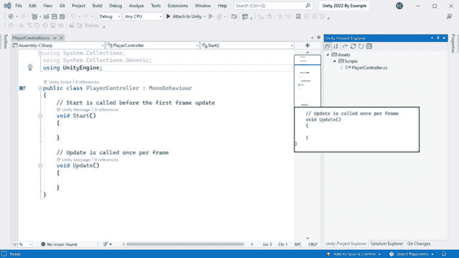

图 2.14 – Visual Studio 2022 社区版

除了基本的脚本编辑功能外，让我们快速了解一下 Visual Studio 2022 提供的一些功能：

+   **IntelliSense**：通过提供命名、参数信息和单词的建议来帮助代码完成，节省您按键！

+   **IntelliCode**：通过**人工智能**（**AI**）增强您的软件开发，可以自动完成代码 – 甚至整行！

+   **代码镜头**：在 IDE 中保持对代码结构的关注，无需离开，代码引用和上下文信息尽在指尖！

+   **实时共享**：提供实时协作编码会话，您可以与项目中的其他成员共享 – 一起工作，更快地产生结果！

+   **集成调试**：允许开发者在代码运行时控制执行、逐行执行代码并交互式地检查其状态 – 看看您的代码在运行时做了什么！

额外阅读 | Visual Studio

**Visual Studio 2022 的新功能**：[`docs.microsoft.com/en-us/visualstudio/ide/whats-new-visual-studio-2022?view=vs-2022`](https://docs.microsoft.com/en-us/visualstudio/ide/whats-new-visual-studio-2022?view=vs-2022%0D)

在打开 IDE 编辑脚本之前，我们首先需要创建一个！创建脚本可以通过几种方式完成。良好的做法是从一开始就保持项目文件的组织，因此让我们首先在项目根目录下创建一个名为`Scripts`的新文件夹 – `Assets/Scripts`。

要在此文件夹中创建新脚本，请执行以下操作：

1.  确保在**项目**窗口中当前选中的文件夹是`Scripts`文件夹。

1.  在**项目**窗口内右键单击以打开**创建**菜单（或使用**+**按钮）。

1.  选择**C# 脚本**。

1.  将脚本重命名为其默认名称 `PlayerController`（它当前被高亮显示，以便立即命名）。

小贴士

不要在脚本文件名中使用空格或以数字开头命名脚本。这两者都是 C#类的命名规则违规，因此你的脚本将无法工作。你可以使用下划线字符代替空格。然而，这种命名约定风格在开发者社区中通常是不受欢迎的——除非它是私有成员变量的名称的第一个字符（这是 C#中的常见约定，并在本书中使用）。

作为使用良好命名约定标准的参考——并且坚持使用（因为一致性和良好的命名可以提高所有人的代码可读性）——请参阅以下指南：[C#编码标准和命名约定](https://www.c-sharpcorner.com/UploadFile/8a67c0/C-Sharp-coding-standards-and-naming-conventions/)

你也可以通过窗口底部的 **添加组件** 按钮直接在 **检查器** 窗口中添加新脚本（即组件）（当你当前选中一个 GameObject 时）。点击 **添加组件** 按钮，然后选择 **新** **脚本 >**。

你将被提示输入脚本名称，然后点击 `Assets` 文件夹——因此我更喜欢之前提到的方法在特定文件夹中创建。

新脚本是从 Unity 提供的默认模板生成的（你可以修改模板以适应个人需求；请参阅以下 *C# 脚本模板* 提示框）。新脚本也赋予了 `.cs` 文件扩展名，表示它们是 C#脚本文件（文件扩展名在 Unity **项目**窗口中不可见）。

我们在这里将其命名为 `PlayerController`，因为下一节我们将编写的第一个 C#代码是赋予我们之前创建的瓢虫玩家角色从玩家输入移动的能力。

C#脚本模板 - Unity 文档

脚本模板是 Unity 在创建新脚本时生成默认 C#代码所使用的，为你的脚本提供了一个常用的代码起点。你可以根据自己的更改、添加、注释等修改模板。

更多信息可以在以下链接中找到：[如何自定义 Unity 脚本模板](https://support.unity.com/hc/en-us/articles/210223733-How-to-customize-Unity-script-templates%0D)

Unity 在脚本生成过程中也将脚本中的类命名为 `PlayerController`（这是脚本模板提供的一个功能）。请注意，对于需要添加到 GameObject 中的脚本（否则，如果你尝试添加，你会得到一个错误：“无法添加脚本组件‘ScriptName’，因为找不到脚本类。’”），文件名和类名必须匹配。参见图 2.14 以了解新脚本内容的示例。

当安装 Unity 编辑器时，VS2022 已安装并配置为项目中 C# 脚本的默认脚本编辑器。您可以通过转到 **编辑** | **首选项…** 并选择 **外部工具** – **外部脚本编辑器** 下拉菜单将设置为 **Microsoft Visual Studio** **2022 [版本]** 来验证此设置。

现在我们已经创建了一个脚本并确认了脚本编辑器已配置，编辑脚本就像执行以下任何一项操作一样简单：

+   在 **项目** 窗口中双击脚本。

+   对于添加到场景中 GameObject 的组件，在 **检查器** 窗口中右键单击组件（或使用垂直省略号菜单）并选择 **编辑脚本**。

+   使用 **Unity 项目** **资源管理器** 窗口从 VS 内部打开。

我们已经学会了如何在 VS 中创建一个新的脚本并打开它进行编辑，但我们仍然需要理解我们所看到的 C# 代码的含义。在下一节中，让我们剖析玩家控制器脚本的生成 C# 代码。

## C# 语言——面向对象编程（OOP）

Unity 通过开源的 .NET **公共语言运行时（CLR**）提供编码支持，并使用 C# 语言——这些都是微软的技术。C# 是一种托管语言，这意味着它通过——主要是——管理内存和 CLR 安全执行代码（即不是由操作系统直接执行的字节码）提供了一个安全的编码环境。

代码可以编译为即时运行（**JIT**）或预编译运行（**AOT**），具体取决于使用的 Unity 提供的两个脚本后端中的哪一个——Mono 或 **中间语言到 C++（IL2CPP**）。这里的主要区别在于编译时间，但某些平台构建可能需要其中一个。

Unity 是一个 C++ 游戏引擎

Unity 游戏引擎是用 C++ 编写的，但 C# 被用作“更友好”的编程语言。C# 中的 Unity 对象类型与原生 C++ 对象相对应。

好吧，前面的段落相当无聊。所以，现在来点必要的“书呆子”警告…我们将在这和接下来的两个部分中讨论一些编程概念、原则和设计模式。虽然这些内容不会教你如何编写循环或评估变量的代码基础知识，但我认为它们是开发者旅程开始时的重要介绍。

不仅学习基础知识（例如如何编写循环和评估变量的代码）很重要，而且还要理解代码应该如何结构的更广泛概念——为了你未来的开发者自我（以及可能为了你未来的开发者队友）。

尽管我已经尝试使这一节简洁并提供了相关的现实世界类比，但这些关于代码应该如何结构的更广泛概念可能对一些人来说还太早，所以在这种情况下，不要害怕——仍然要阅读并尽力理解，但如果很难理解，也不要担心。

我们将在书中通过项目来实现所有这些（也许你甚至会回忆起这里所说的内容，或者想要回来重新阅读）。

好的，现在我们已经讲完了这些，让我们深入探讨那些将提升你在 Unity 开发者旅程中编码技能的概念！

### C#语言

C#（发音为 *C sharp*）是一种现代的、面向对象、类型安全、受管理的编程语言。**面向对象编程**是一种计算机编程模型，它将软件设计围绕对象组织，对象可以包含数据和代码（类），而不是函数和逻辑。

C#主要是一种类型安全的语言，这意味着特定类型只能通过它们定义的协议进行交互，这确保了每种类型的连续性。例如，你不能像与数字类型交互一样编写与字符串类型交互的代码。

面向对象编程有四个基本概念用于处理对象。我们现在将简要回顾这些概念，并在接下来的章节中编写游戏代码时应用这些概念：

+   **封装**：隐藏对象的内部数据和行为（类）以防止其他对象访问，并且只允许通过公共方法访问；防止对象直接修改其他对象可以减少外部错误发生的可能性。

+   **抽象**：一个不完整的实现，它隐藏特定细节，只提供所需信息，但也不与任何特定实例相关联，因为抽象类仅打算成为其他类的基类。它提供了一个模板，用于组织具有所需细节的对象层次结构，例如，聚光灯（对象）是光（抽象类）的一种类型，它需要一个亮度属性。

+   **继承**：由于继承，抽象成为可能，因为当从一个基类创建新类时，派生类继承了基类的所有属性和方法，这意味着我们可以重用、扩展和修改基类的行为。在前面的简单示例中，如果点光源和聚光灯都从光抽象基类继承，那么它们将具有相同的亮度属性。

+   **多态性**：这是一个希腊词，意思是*一个名称具有多种形式*或*具有多种形式*，在 C#中我们可以将其理解为具有多个函数的一个名称。多态性允许一个类通过重写它来拥有多个具有相同名称的实现，这要归功于继承。

继续前面的光示例，我们可以通过为`ChangeLightRadius()`方法提供不同的代码，在不同的聚光灯和点光源抽象中实现从基类继承的方法，聚光灯有一个*锥形* *光束*。

相反，点光源是全方向的，因此它的行为不同。多态性有助于代码重用，因为一旦编写、测试和实现，类就可以根据需要重用，节省大量时间，同时使事物更加逻辑化。

额外阅读 | C#

**面向对象编程的 Microsoft C# 文档**：[`learn.microsoft.com/en-us/dotnet/csharp/fundamentals/object-oriented/`](https://learn.microsoft.com/en-us/dotnet/csharp/fundamentals/object-oriented/)

### `MonoBehaviour` 类

`MonoBehaviour` 类是每个可以分配给 GameObject 的 Unity 脚本的基类——这是 Unity 的**组件化架构**。你之前已经看到过“类”这个词，所以为了清晰起见，类是一种对象类型。你将创建自定义对象类型，将变量、方法和事件组合在一起，以给你的脚本提供数据和实现其预期功能。

从 `MonoBehaviour` 继承类——由于继承——为添加到 GameObject 的组件提供了一组基础变量、方法和事件；这也是一个要求——除非继承自 `MonoBehaviour`，否则你不能将脚本添加到 GameObject。在本书的项目中，我们将使用 `MonoBehaviour` 基类为我们自定义脚本组件提供的功能。

重要提示

由于 **MonoBehaviour** 类需要它是 **场景层次结构**中对象的实例，因此你不能使用 **new** 关键字来创建其新实例，就像你为不继承任何类的类那样做。

我们之前创建的 `PlayerController` 类的代码，由默认的 Unity 模板生成，已经为我们继承自 `MonoBehaviour`——正如以下 `public class` 声明行之后的冒号（`:`）所示：

```cs
using UnityEngine;
public class PlayerController : MonoBehaviour
{
    // Start is called before the first frame update
    void Start()
    {
    }
    // Update is called once per frame
    void Update()
    {
    }
}
```

// (C#) | 代码注释

单行**注释**以两个反斜杠（**//**）开始。C# 编译器会在运行程序时移除这些文本并忽略它们。

不要害怕对代码中的任何内容进行注释以阐明意图。在编程时，总会有至少两个人在查看你的代码——你和你自己在 6 个月后（或者有时在任何周一早上）。你*会*忘记你为什么要这样做。

**自注释代码**/**自文档代码**是讨论代码注释时可能会听到的一个术语，它依赖于良好的类、方法和变量命名。这当然是重要的。然而，我的观点是，你可以花费大量时间来深思熟虑地命名事物——这可能会打断你的思路——而简单的几句话在注释中可以迅速带来清晰的意图。

`Start()` 和 `Update()` 方法也为我们提供了。`MonoBehaviour` 提供了初始化任何代码的 Message 事件，并在每一帧更新时运行代码的 `Update()`。`MonoBehaviour` 还提供了其他几个 Message 事件，我们将在接下来的章节中探讨它们。

命名空间（C#）

**使用 UnityEngine;** 在上一个 **PlayerController** 代码示例的顶部是赋予包含代码访问 **MonoBehaviour** 基类权限的关键。**命名空间** 是一种组织和提供代码中分离层次的方式。它们在为大型项目中的类和方法提供容器以控制作用域时非常有用。你可以，并且应该，为你的类添加自己的命名空间。

在理解了如何创建新的 C# 脚本、在 VS IDE 中打开它以及识别从 `MonoBehaviour` 派生类的基本部分之后，我们现在可以探索一些最佳实践原则，这些原则是我们编写使用 SOLID 原则的游戏代码时应该遵循的。

## SOLID 原则

**SOLID** 是一个缩写，用于表示罗伯特·C·马丁提出的面向对象设计的五个基本原则，适用于各种编程语言，而不仅仅是 C#。它们是基本的设计原则，旨在保持你编写的代码可维护和可扩展，同时避免在未来不必要地重构（重构现有代码）。生成的代码应该易于其他开发者阅读和遵循——避免编写意大利面代码！

意大利面代码

**意大利面代码** 是一个用来描述项目中无结构、难以理解和维护的源代码的短语。原因可以归因于几个因素，通常归结为没有遵循最佳实践，如 SOLID 原则、**不要重复自己**（**DRY**）和清洁代码——格式正确且以易于他人或自己在 6 个月后阅读或修改的方式组织的代码！

SOLID 原则是以下内容：

+   **S –** **单一职责原则**（**SRP**）：你的代码中的每个类或函数（对于语言无关的术语，但我会将 C# 中的函数称为方法）应该只有一个职责。

这意味着 *只做一件事* 而不是所有事情，包括厨房用具！类内的所有内容都应该有助于它存在的单一原因。多个单功能类可以协同工作以完成更大、更复杂的任务。如果出现问题，通常更容易知道错误在哪里，并且它也将与该类隔离。

+   **O –** **开闭原则**（**OCP**）：类可以被扩展但不能被修改。

不，这并不是一个矛盾；如何同时既是开放的又是封闭的？嗯，这意味着一个类应该对扩展开放但对修改封闭。通过多态，我们可以通过继承类来改变抽象基类的行为，同时不修改基类。通过设计永远不会改变的基类，你可以防止不希望的变化传播到依赖的类，从而有助于代码的可重用性，并最终使代码更难工作。

+   **L –** **Liskov 替换原则**：引用基类的方法必须能够无缝地使用派生类。

任何使用基类引用的函数都应该能够使用该类的派生类，而无需知道它。这听起来可能有点令人困惑，所以让我们使用之前 OOP 概念中的简单例子——一个引用灯的方法不应该关心那盏灯是聚光灯还是点光源。我们可以用一个点光源替换聚光灯，代码应该仍然可以正常工作。

我们可以通过使用一个**接口**（一种类似于类的类型，但它只代表声明结构——这通常被称为**契约**，但您也可以将其视为**类定义**的蓝图）来实现这种替换。

接口还可以通过让基类接受接口作为抽象引用以注入不同功能来实现**开闭原则**。功能可以扩展，而封闭基类中的引用保持不变。

+   **I –** **接口分离原则**：几个较小范围的接口比单一的大规模接口更受欢迎。

类不应该包含在其单一职责角色中不使用的功能。在马丁的原始介绍中，他将其描述为**胖接口**的**缺点**，其中大型多用途接口的功能可以分解成成员函数的组，以提供更好的内聚性。这可以防止类使用它们不需要以实现功能的功能。

+   **D –** **依赖倒置原则**：使用抽象而不是直接类引用。

最后这个原则指出，具体类应该依赖于接口——或者抽象函数和类——而不是具体的函数和类。抽象类也不应该依赖于具体类；这里应该使用接口。这里的优势意味着代码需要更少的工作来更改，因为接口抽象解耦了具体类——一个类的更改也不会破坏另一个类。松散耦合的代码更灵活，更容易测试。太棒了！

额外阅读 | SOLID 原则

要阅读由罗伯特·C·马丁提出的 SOLID 原则背后的原始引言和思想，您可以参考这篇文章：[`learn.microsoft.com/en-us/archive/msdn-magazine/2014/may/csharp-best-practices-dangers-of-violating-solid-principles-in-csharp`](https://learn.microsoft.com/en-us/archive/msdn-magazine/2014/may/csharp-best-practices-dangers-of-violating-solid-principles-in-csharp)

或者，只需在主题上做一些网络搜索：[`www.google.com/search?q=SOLID+programming+principles`](https://www.google.com/search?q=SOLID+programming+principles%0D)

在这个简短的介绍之后，你可能不完全理解这些原则，但不用担心——我们将在接下来的章节中实际使用它们，这样你就会了解它们是如何实现的。有了对 SOLID 原则的基本理解，我们现在可以讨论实现 SOLID 原则所提出思想的设计模式。

## 设计模式

现在你已经知道了 C#语言是什么，以及编写游戏时需要注意的一些原则，让我们看看如何在实践中应用它们。

当你为游戏编写代码时，你可以自己决定如何处理架构。在 Unity 中，没有任何限制或特定的设置方式——它可以像你喜欢的那么混乱或有序。

然而，应该很明显，你的代码越无序、越不结构化，将来就越难与之合作和扩展。我们已经通过 OOP 和 SOLID 原则接触了一些基本原理，但那些只是需要遵循的原则。为了执行这些原则，我们使用设计模式。

### 游戏开发中的常见设计模式

以下是一个常见设计模式的列表，用于在编写代码时解决常见问题——这绝对不是一个详尽无遗的列表，我们在这里只是简要介绍这些模式的原因：

+   `MyClass.Instance.MyMember`（其中`Instance`是静态变量，`MyMember`是任何公开可访问的变量或方法）。

这种模式因为误用而声名狼藉，但对于小型项目来说却非常有帮助——它快速且易于实现，并且可以在任何地方使用（你好，游戏马拉松！）。这种声誉主要与更广泛的项目相关，在这些项目中，静态变量使得代码更难调试和调试——普遍的观点是，当你使代码的每一部分都易于访问时，你只是在自找麻烦！

+   GameObject 脚本 API 中的`GetComponent()`方法。本质上，定位器将检索所需类或对象实例的引用，以便在调用方法中使用。

+   **观察者模式（事件）**：这是最受欢迎的设计模式之一。这种模式允许监听器注册到提供者并接收通知。这通常是通过一对一的关系来执行的，当提供者对象状态改变并调用通知时，任何数量的监听器都会收到通知。在 C#中，这种模式是通过事件实现的。事件是 C#中的一个特殊关键字，它强制执行正确的模式，只有声明类才能调用通知。

+   `GameManager`类，其中可以包含加载、播放、暂停、游戏结束、胜利、失败等状态。当进入和退出状态时可以触发事件，以便轻松扩展基于状态的功能。实现该模式的对象还可以将状态相关行为委托给其他类，例如在每一帧更新时调用的`Tick()`方法。

+   **命令模式**：这种模式将执行函数的请求转换为一个包含所有请求所需信息的对象。当我们需要延迟或排队请求的执行，或者我们想要跟踪操作序列（如回放系统）时，命令模式在 C#中很受欢迎。

这种模式的另一个好处是它将调用类与执行过程的对象解耦——松散耦合的代码（一个类不会影响另一个类，减少依赖）更容易测试和维护！

+   `Update()`方法，每个都会添加到需要每帧更新的脚本列表中。

这种模式可以减少每帧调用`Update()`方法的次数，以减少开销——这些 Unity 消息是从原生 C++调用到托管 C#的，它们是有成本的！例如，管理器将是唯一具有在每帧更新时运行的`Update()`方法的对象，而许多引用的实例仅有一个管理器调用的`Tick()`方法。

额外阅读 | 编程模式

**游戏编程模式**（网络版免费）：[`gameprogrammingpatterns.com/contents.xhtml`](https://gameprogrammingpatterns.com/contents.xhtml)

优化提示

如果你不需要使用 Unity 消息事件，那么请从你的代码中移除它们——即使是空的**Start()**和**Update()**方法仍然被缓存并在每个从**MonoBehaviour**派生的脚本上调用，在**Update()**的情况下，它将在每一帧更新时被调用！

在本节中，你学习了如何使用 VS2022 IDE 创建和编辑脚本，并了解了 C#语言、SOLID 原则和一些常见的设计模式。

在接下来的章节中，我们将深入探讨具体用例，随着我们在我们的收集游戏中完善功能和功能，从下一节开始，我们将为我们的瓢虫角色组合一个简单的玩家控制器。

# 使用新的输入系统编写简单的玩家控制器

你可能会惊讶地发现，使我们的玩家角色移动的大部分工作已经被 Unity 的功能为我们完成了。本节中我们将探讨以下功能：

+   **新的输入系统**：用于接收来自玩家的键盘设备输入。

+   **2D 物理引擎**：用于将输入值转换为运动并提供与环境对象的交互。

## 新输入系统

新的**输入系统**是一个提供对输入设备支持的包，它以灵活和可配置的方式控制项目中的对象。它还取代了传统的输入管理器。我们首先需要确保它已安装以便使用：

1.  通过转到**文件**菜单中的**窗口** | **包管理器**来打开包管理器，并按照以下步骤操作。

1.  确保将**包**下拉列表设置为**包：Unity 注册表**（位于窗口标签下方）。

1.  在包列表（对话框的左侧）中找到**输入系统**并点击以选择它。

1.  现在，点击窗口右下角的**安装**按钮。

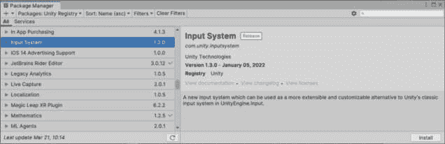

图 2.15 – 输入系统安装包管理器

如果安装完成后，你收到一个警告说**项目正在使用新的输入系统包，但新的输入系统的本地平台后端在玩家设置中未启用**，请点击**是**以启用后端。请注意，这将重新启动编辑器 – 因此，如果你在场景中有未保存的更改，请在提示时点击**保存**。

额外阅读 | Unity 文档

**输入** **系统**：[`docs.unity3d.com/Packages/com.unity.inputsystem%401.3/manual/`](https://docs.unity3d.com/Packages/com.unity.inputsystem%401.3/manual/)

我们已经准备好在安装了输入系统后，在下一节中开始编写玩家移动的代码。

## 玩家控制器脚本

在我们开始编码之前，我们首先需要了解我们可以用两种方式与新的输入系统一起工作：

+   直接从**输入设备**接收输入

+   间接通过**输入** **动作**接收输入

我们将在书中介绍这两种方法，但我们将从直接从输入设备读取开始 – 键盘。在确定了接收玩家输入的方法后，我们现在就开始编码，因为我们已经在之前的一个部分中创建了我们的瓢虫角色的玩家控制器脚本。

### 接收键盘输入

通过键盘直接从输入设备处理玩家输入是直接的。你只需要获取当前键盘设备的引用并读取适合所需功能的属性。我们在`Update()`方法中读取输入，因为它每帧都会运行。

让我们看一下以下`PlayerController`代码中的`Update()`方法这一部分：

```cs
    // Update is called once per frame - process input
    void Update()
    {
        var keyboard = Keyboard.current;
        // Keyboard connected?
        if (keyboard == null)
            return;     // No - stop running code.
        if (keyboard.spaceKey.IsPressed())
        {
            // Move while holding spacebar key down.
            …
```

在`Update()`方法（位于`{}`波浪括号之间），我们首先通过`var keyboard = Keyboard.current;`（在 C#中，每行要执行的代码必须以分号结尾）为当前键盘设备分配一个变量（用于存储数据的容器）。

var（C#）

**var**关键字是一个隐式类型的变量，它从赋值语句的右侧（等号之后的内容）推断类型。这意味着我们不需要为返回整数值的数学表达式使用**int**类型 - **var**将推断它应该是**int**类型。

`Keyboard.current`通过输入系统对我们的代码可用，只需在我们的脚本顶部使用`using`关键字包含`InputSystem`命名空间即可：

```cs
using UnityEngine;
using UnityEngine.InputSystem;
public class PlayerController : MonoBehaviour
{
    …
```

一旦将当前键盘设备分配给我们的键盘变量，我们可以通过将变量与 `null` 值进行比较来检查是否已连接键盘，使用 `== 操作符`（一个 `=` 是用于赋值，而两个 `==` 是 *是* *等于* 操作）。

在这里，我们可以看到如果键盘值等于 `null`，我们可以通过使用 `return` 关键字立即停止在此方法中运行代码：

```cs
        // Keyboard connected?
        if (keyboard == null)
            return;     // No - stop running code.
        …
```

null (C#)

**null** 值表示没有 *对象* 被分配。

```cs
spaceKey – and evaluating the value returned from the IsPressed() method to see whether it is true:
```

```cs
        if (keyboard.spaceKey.IsPressed())
        {
            // Move while holding spacebar key down.
            …
```

if (C#)

一个 **if** 语句测试条件是否评估为 **true** 或 **false**，如果为 **true**，则执行直接 preceding 的块或代码行。

在 C# 中，一个存储 **true** 或 **false** 值的变量类型称为 **bool** 类型（布尔）。当未指定特定值时，**bool** 类型有一个默认值 **false**。

### 使用 2D 物理移动

我们正在接收玩家的输入，并且现在准备好处理它。耶！

从技术上来说，遵循单一责任原则，我们现在将创建第二个脚本来处理玩家移动。目前，由于我们的收集游戏很小，只有一个输入，它不需要更复杂的架构。

当玩家按下 *空格键* 时，让我们在按键按下时向前移动他们，并在释放时停止移动：

```cs
        if (keyboard.spaceKey.IsPressed())
        {
            // Move while holding spacebar key down.
        }
        else if (keyboard.spaceKey.wasReleasedThisFrame)
        {
            // The spacebar key was released – stop moving.
        }
```

else if (C#)

一个 **else if** 语句仅在之前的 **if** 语句评估为 **false** 条件时测试新的条件，如果为 **true**，则执行直接 proceeding 的块或代码行。为了评估多个条件，你可以级联多个 **else if** 语句，直到满足所需次数。

使用 `Update()` 方法非常适合处理玩家输入。然而，我们想要使用 `2D Physics` 来移动玩家，为此，我们需要使用 `FixedUpdate()` – 这会在每次物理 `0.02`（这个值通常不需要更改）时被调用。

你可能已经想知道我们如何告诉一个不同的 Unity 消息事件，该事件是 *自动* 调用来执行另一个 Unity 消息事件的代码。我们将简单地使用一个 `bool` 变量作为 *标志* 来指示应该执行代码。

让我们创建一个现在：

```cs
public class PlayerController : MonoBehaviour
{
    private bool _shouldMoveForward;
    …
```

公共和私有访问器（C#） | 序列化

**访问器**，如 **public** 和 **private**，定义了变量的作用域，即它如何被类内部和外部访问。将 `public` 访问器分配给变量使其对其他外部类可访问，而将 `private` 访问器使其仅对类内部可访问。如果你没有明确声明访问器，默认将是 `internal`（参考[`docs.microsoft.com/en-us/dotnet/csharp/programming-guide/classes-and-structs/access-modifiers`](https://docs.microsoft.com/en-us/dotnet/csharp/programming-guide/classes-and-structs/access-modifiers)）。

声明一个变量为公共的另一个功能是 Unity 将其标记为序列化。**序列化**是将对象状态转换为 Unity 可以使用的格式的过程——这对于在**检查器**窗口中可用字段是必需的。

我们将变量创建为私有字段，以便仅在`PlayerController`类内部可访问。我们在声明时没有为其赋值，因此它将有一个初始值`false`——我们的标志在程序启动时不会触发代码执行。

要在`FixedUpdate()`中执行移动玩家的代码，我们将它设置为`true`，当按下**空格键**时，并在释放时将其设置回`false`：

我们玩家的输入代码现在看起来是这样的：

```cs
        if (keyboard.spaceKey.IsPressed())
        {
            // Move while holding spacebar key down.
            _shouldMoveForward = true;
        }
        else if (keyboard.spaceKey.wasReleasedThisFrame)
        {
            // The spacebar key was released - stop moving.
            _shouldMoveForward = false;
        }
```

我们将像这样在`FixedUpdate()`中检查`_shouldMoveForward`布尔标志的值：

```cs
    // FixedUpdate is called every physics fixed timestep
    private void FixedUpdate()
    {
        if (_shouldMoveForward)
        {
            // Process physics movement.
        }
        else
        {
            // Stop movement.
        }
    }
```

小贴士

请参阅**InputSystem**文档，了解键盘设备上所有可能的属性和方法。您还可以在按下**.*（点号/句点）**字符时，在 VS IDE 中查看可用的内容。IntelliSense 将提供所有可能的完成选项列表（例如，当输入**keyboard**然后**.**时，弹出列表将列出**IsPressed()**方法和**wasReleasedThisFrame**属性）。

#### Rigidbody2D

当使用物理系统时，在场景中移动具有与其他对象交互能力的对象非常简单——您可以得到很多**现成的**价值，因为您不需要自己编程这些交互。例如，移动玩家就像为移动方向设置一个速度值一样简单。

考虑以下对`FixedUpdate()`方法的补充：

```cs
    private void FixedUpdate()
    {
        if (_shouldMoveForward)
        {
            // Process physics movement.
            // Up is the direction the object sprite
            // is currently facing.
            Rb.velocity = transform.up * MoveSpeed;
        }
        else
        {
            // Stop movement.
            Rb.velocity = Vector2.zero;
        }
    }
```

我们添加了一行代码，将一个值赋给`Rb`对象的`velocity`属性，通过将`transform.up`值与`MoveSpeed`变量的值相乘。`Rb`是我们声明的公共字段，代表我们将添加到玩家 GameObject 中的`Rigidbody2D`组件，作为公共字段，也可以在**检查器**窗口中进行赋值。

让我们添加`Rb`和`MoveSpeed`变量的声明——默认值为`10f`（`f`表示这是一个浮点值，一个以浮点表示法存储的数值）——以提供一些移动速度：

```cs
public class PlayerController : MonoBehaviour
{
    public Rigidbody2D Rb;
    public float MoveSpeed = 10f;
```

小贴士 | VS IntelliSense

您可以在**Rb.velocity**赋值行代码中首先输入**MoveSpeed**，但 VS 会抱怨它尚未声明，并显示一条红色的波浪线。您可以通过首先单击下划线单词，然后按*Alt*/*Cmd* + *Enter*，并在**MoveSpeed**下选择**生成**字段，轻松地将变量声明添加到代码中。

通过设置`velocity`的值，我们告诉对象向指定方向移动——这个方向由`transform.up`指示——并且以`MoveSpeed`乘数值指示的速度移动。玩家精灵将始终沿着`transform.up`指示的方向移动，无论其旋转如何，如下面的图所示：

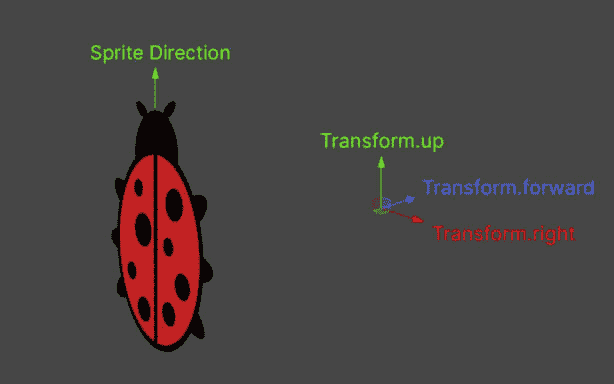

图 2.16 –瓢虫精灵的 Transform.up 方向

Transform.up（Unity API）

这操作的是对象在**Y**轴（绿色轴）上的位置（世界空间中的位置）。它与**Vector3.up**类似，但**Transform.up**在移动对象时会考虑其旋转。

其他可用的轴有右侧（**X**轴——红色）和前方（**Z**轴——蓝色）。

当玩家释放**空格键**时，`_shouldMoveForward`被赋值为`false`，这导致`Rb.velocity`被设置为`Vector2.zero`——速度是一个`Vector2`结构，意味着它可以用来通过`X`和`Y`值表示 2D 位置，正如这种表示法——`Vector2(float, float)`所示。`Vector2.zero`是`Vector2(0, 0)`的简写。

额外阅读 | Unity 文档

**Vector2**: [`docs.unity3d.com/ScriptReference/Vector2.xhtml`](https://docs.unity3d.com/ScriptReference/Vector2.xhtml)

#### 向量数学、Mathf 和 Quaternion

到目前为止，代码已经解决了根据精灵面向的方向向前移动玩家角色的方向问题。然而，它目前只面向一个方向——向上。我们将通过让玩家朝向鼠标指针的方向看，来引导玩家在环境中移动——控制前进运动。

我们可以通过读取另一个输入设备——鼠标——并使用一些向量数学来根据鼠标指针在屏幕上的位置旋转玩家对象来实现这一点。

看看下面的`LookAtMousePointer()`方法：

```cs
    private void LookAtMousePointer()
    {
        var mouse = Mouse.current;
        if (mouse == null)
            return;
        var mousePos = Camera.main.ScreenToWorldPoint(
            mouse.position.ReadValue());
        var direction = (Vector2)mousePos - Rb.position;
        var angle = Mathf.Atan2(
            direction.y, direction.x) * Mathf.Rad2Deg
               + SpriteRotationOffset;
        // Direct rotation.
        Rb.rotation = angle;
    }
```

让我们逐项分析代码：

1.  就像我们验证了键盘的有效性一样，`mouse`被分配并检查是否为`null`（如果没有分配，则使用`return`停止代码的执行）

1.  `mousePos`变量通过`mouse.position.ReadValue()`方法的返回值赋值，该方法返回一个`Vector2`位置，并使用主相机引用`Scene (Camera.main)`将其`Vector2`屏幕空间位置转换为`Vector3`世界点（Unity 引擎使用的 3D 坐标系）。

1.  通过简单的向量数学表达式计算鼠标位置到玩家`Rigidbody2D`位置的方向——从一个向量减去另一个向量是计算方向的一种快速方法。简单！

1.  注意，你只能在同一向量类型上使用向量算术运算——这里，我们有 `Vector3` 表示鼠标位置，`Vector2` 表示 `Rigidbody2D` 位置。为了在表达式中将 `mousePos` 变量作为 `Vector2` 处理，我们通过在它前面加上 `(Vector2)` 来进行类型转换（我们只需要 2D 的 `x` 和 `y` 值）。

1.  现在，我们需要将旋转角度应用到玩家的 `Rigidbody2D` 上。Unity 提供了一个数学库，正好用于这种情况——`Mathf`。特别是，我们使用的是 `Atan2` 方法，它从 2D 向量返回一个弧度角度。

1.  我们实际上希望我们的角度值以旋转度数表示——而不是弧度——所以，再次，`Mathf` 来拯救我们。`Mathf.Rad2Deg` 是一个转换常数（等于 *360 / (PI x 2)*），我们将它与返回的弧度相乘，然后，我们就得到了旋转度数值。`SpriteRotationOffset` 公共变量提供了一个偏移量，如果精灵的方向不是面向 `Transform.right` ——方程结果的方向（我们在这里确实需要一个 -90 度的值，因为我们的瓢虫精灵是指向上方的，而不是向右的）。

1.  最后，我们将得到的旋转角度（以旋转度数表示）设置为 `Rb.rotation` 属性！

为了确保玩家的旋转每帧都被设置，在 `Update()` 的末尾添加对 `LookAtMousePointer()` 方法的调用：

```cs
    void Update()
    {
        …
        LookAtMousePointer();
    }
```

#### 平滑旋转

每帧更新时设置 `Rb.rotation` 值足以使玩家指向鼠标指针的方向工作，但我们能做得更好！

我们可以使用 Unity 提供的插值方法，称为 **Slerp**，来实现更平滑的旋转并调整旋转速度以改变游戏玩法。Slerp 将平滑旋转并消除突兀的旋转，同时提供更好的游戏感觉，增强玩家体验。

Slerp (Unity API) | 额外阅读 | Unity 文档

**Slerp** 是 **spherically interpolated** 的缩写。它提供了一个方法，通过一个名为 *T* 的量插值 *A* 和 *B* 之间的值。与 **线性插值**（**Lerp**）的区别在于，*A* 和 *B* 向量被视为方向而不是位置点。

**Quaternion.Slerp**: [`docs.unity3d.com/ScriptReference/Quaternion.Slerp.xhtml`](https://docs.unity3d.com/ScriptReference/Quaternion.Slerp.xhtml)

将直接旋转赋值（`Rb.rotation = angle;`）替换为以下代码片段：

```cs
        // Interpolated rotation – smoothed.
        // Forward (Z-axis) is what we want to rotate on.
        var q = Quaternion.AngleAxis(angle,
            Vector3.forward);
        Rb.transform.rotation = Quaternion.Slerp(
            Rb.transform.rotation, q, Time.deltaTime
               * LookAtSpeed);
```

让我们分解这段代码：

1.  为了插值旋转值，我们需要使用一个稍微不同的方法，使用 `Quaternion`（基于表示旋转的复数，这些旋转可以很容易地进行插值，并且 Unity 内部用于表示所有旋转）。

1.  我们首先需要使用`AngleAxis()`方法来计算围绕轴的旋转，以便将我们的角度度数转换为四元数值（`var q`）。在这里，我们提供`Vector3.forward`作为我们的旋转轴——参照*图 2**.16*，我们可以看到它将在*XY*平面上旋转瓢虫精灵，这正是我们想要的！

1.  与需要浮点值作为角度度的`Rb.rotation`不同，我们现在需要分配一个四元数值，因此我们将不得不使用`Rb.transform.rotation`属性。

1.  最后，我们将使用`Quaternion.Slerp()`来插值旋转值，从玩家角色的当前旋转到期望的旋转——指向鼠标指针的方向。

我们可以通过使用`LookAtSpeed`公共变量值来改变旋转速度。速度值乘以`Time.deltaTime`以使其成为帧率无关的旋转速度（这意味着它将在所有不同的运行游戏系统中保持一致）。

额外阅读 | Unity 文档

**Time.deltaTime**: [`docs.unity3d.com/ScriptReference/Time-deltaTime.xhtml`](https://docs.unity3d.com/ScriptReference/Time-deltaTime.xhtml)

我们最终的变量声明，包括为`SpriteRotationOffset`和`LookAtSpeed`新添加的变量，以及一些默认的起始值，如下所示：

```cs
public class PlayerController: MonoBehaviour
{
    public Rigidbody2D Rb;
    public float MoveSpeed = 10f;
    public float SpriteRotationOffset = -90f;
    public float LookAtSpeed = 2f;
    private bool _shouldMoveForward;
    …
```

PlayerController.cs 代码

要查看**PlayerCharacter**类的完整代码，请访问以下 GitHub 仓库：[`github.com/PacktPublishing/Unity-2022-by-Example/tree/main/ch2/Unity%20Project/Assets/Scripts`](https://github.com/PacktPublishing/Unity-2022-by-Example/tree/main/ch2/Unity%20Project/Assets/Scripts)

本节教我们如何直接使用输入设备读取玩家输入，通过操作速度来移动`Rigidbody2D`对象，以及使用向量数学和四元数实现平滑旋转。

# 摘要

本章介绍了许多主题，包括关卡设计概念、将 2D 艺术作品添加到项目中，使用 Unity 的 2D 工具将其作为精灵准备，以及使用准备好的艺术作品使用**Tilemap**绘制 2D 游戏环境。我们还使用 C#语言和 Visual Studio IDE 编写脚本，为 GameObject 添加功能，用于读取输入和用物理移动玩家角色。

在下一章中，我们将添加一个虚拟相机系统来跟随瓢虫角色在关卡中移动，添加基本 UI，并处理游戏胜负的条件。
