# 第三章：完成收集游戏

在 *第二章* 中，你被介绍了关卡设计、添加不同的 2D 资产、使用 Tilemap 创建游戏环境，以及使用 C# 语言和 **Visual Studio**（**VS**）IDE 创建脚本以添加玩家角色的移动。

当玩家在环境中移动时，我们希望有一种方法可以视觉上跟随他们在关卡中的移动。本章将使用 Unity 的相机系统，称为 **Cinemachine**（**CM**）——这是一个强大的相机控制功能，使得添加和设置流畅的相机移动变得容易。

我们将本章以介绍添加 **用户界面**（**UI**）结束。你将学习如何将文本添加到屏幕上，以计时器和分数跟踪游戏进度。我们将使用 Unity 的 UI 系统，通常称为 **uGUI**，来完成这个任务。

在本章中，我们将涵盖以下主要主题：

+   使用 CM 跟随玩家和进行测试

+   游戏机制以及如何通过代码（组件）创建

+   uGUI、计时器、计数和获胜的介绍

到本章结束时，你将能够通过向 GameObject 添加功能来使用 C# 脚本编写游戏机制，并熟悉向你的游戏添加基本 UI。

# 技术要求

你可以在 GitHub 上下载完整项目：[`github.com/PacktPublishing/Unity-2022-by-Example`](https://github.com/PacktPublishing/Unity-2022-by-Example)。

# 使用 CM 跟随玩家和进行测试

**CM** 功能丰富——难怪它是获得艾美奖的代码无工具套件——但我们只关注一个功能：让相机跟随我们的瓢虫在 2D 环境中移动的能力。

首先，我们需要确保我们已安装 CM 包，方法是转到 **Windows** | **包管理器**，选择 **Cinemachine**，然后点击 **安装** 按钮。没有玩家跟随，CM 对我们帮助不大，所以让我们将上一章中设计的玩家导入到我们的关卡场景中。

## 创建玩家 Prefab

Unity 的 **Prefab** 系统允许你将配置好的 GameObject 存储为项目中的可重用资产（文件），包括所有其组件、分配的值以及任何子 GameObject。你甚至可以将 Prefab 作为另一个 Prefab 的子项；在这种情况下，我们称它们为 **嵌套 Prefab**。

此外，可以从原始 Prefab 派生出新的 Prefab 资产作为 **Prefab 变体**（相同的基属性但独特的变体——当基 Prefab 被修改时，所有派生的变体也会被修改）。

Prefab 的一项功能是能够在运行时将它们的新实例生成到场景中（例如，敌对 **非玩家角色**（**NPC**）的群体、投射物、拾取物品、环境重复的部分等等）。

额外阅读 | Unity 文档

**预制件**：[`docs.unity3d.com/2022.3/Documentation/Manual/Prefabs.xhtml`](https://docs.unity3d.com/2022.3/Documentation/Manual/Prefabs.xhtml)

按照以下步骤创建我们的玩家角色预制件：

1.  打开你之前保存的包含玩家角色设计的场景。

1.  在`Assets/Prefabs`创建一个`Prefabs`文件夹并将其设置为当前文件夹。

1.  点击并拖动`Assets/Prefabs`文件夹。在*图 3.1*中，你可以看到我们刚刚创建的瓢虫玩家预制资产。

1.  现在，回到你的游戏关卡场景，点击并拖动场景中的`(0, 0, 0)`（在场景中）。

1.  你可能无法在场景视图中看到玩家角色，因为我们尚未为其精灵分配任何排序层。我们不必单独为所有精灵分配排序层，只需使用`sorting`中的`1000`，确保如果我们在该排序层中添加任何额外的精灵，玩家始终作为最顶层的精灵绘制。

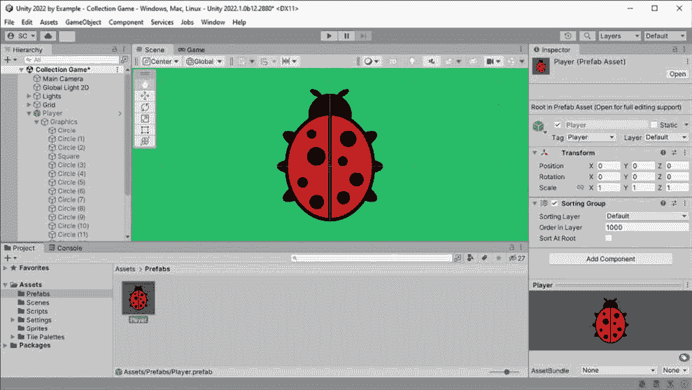

图 3.1 – 瓢虫玩家预制件

小贴士 | Unity 文档

要将更改应用到**场景层次结构**中的预制件上——当预制件不在**预制件模式**（一个用于直接编辑预制件的独立环境）中打开时——使用**检查器**顶部**审查**、**还原**或**应用覆盖**下拉菜单。或者，进入**预制件模式**的最快方法是双击项目窗口中的预制件。

*在预制件模式中编辑预制件* | *在隔离中编辑*：[`docs.unity3d.com/2022.3/Documentation/Manual/EditingInPrefabMode.xhtml`](https://docs.unity3d.com/2022.3/Documentation/Manual/EditingInPrefabMode.xhtml)

## 创建一个 2D 跟随相机

使用 CM，在 2D 环境中创建跟随相机非常简单。现在我们已经将玩家放入场景中，我们可以添加一个 CM 相机，它会跟随玩家移动，按照以下步骤进行：

1.  从**层次结构**窗口的**创建**菜单或主**文件**菜单创建一个新的 CM**虚拟相机**（**vcam**），方法是转到**GameObject** | **Cinemachine** | **2D Camera**——对于场景中添加的第一个 vcam，这也会将**Cinemachine Brain**组件添加到**主相机**（CM 通过一个或多个 vcam 控制**主相机**）。

1.  选择新的 vcam，将**Player**对象从**层次结构**拖动到**CinemachineVirtualCamera**组件中的**跟随**字段（以分配其引用），如以下截图所示：

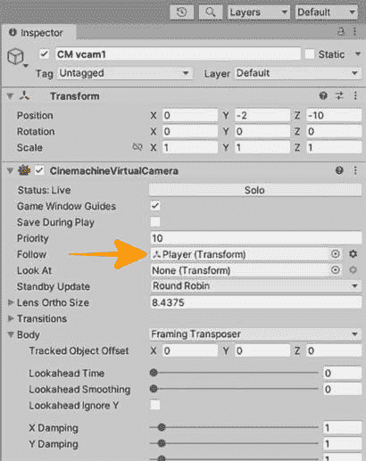

图 3.2 – CM 跟随玩家检查器分配

1.  在**身体**部分中，如果需要，展开**身体**左侧的箭头；你可以调整 XY 阻尼、屏幕位置、死区等。尝试这些设置并微调你的相机以符合你的偏好。

额外阅读 | Unity 文档

**Cinemachine**：[`docs.unity3d.com/Packages/com.unity.cinemachine%402.3/manual/index.xhtml`](https://docs.unity3d.com/Packages/com.unity.cinemachine%402.3/manual/index.xhtml)

**Cinemachine** **功能**：[`unity.com/unity/features/editor/art-and-design/cinemachine`](https://unity.com/unity/features/editor/art-and-design/cinemachine)

*Cinemachine 2D 技巧与技巧*：[`blog.unity.com/technology/cinemachine-for-2d-tips-and-tricks`](https://blog.unity.com/technology/cinemachine-for-2d-tips-and-tricks)

现在我们可以探索整个环境，知道摄像机将跟随我们移动。太棒了！

## 测试关卡

使我们的关卡可玩性的最后一步是添加必要的组件（即**PlayerController**和物理），调整组件值，并分配组件引用。

现在我们按照以下步骤来做：

1.  通过在**层次结构**中选择或在**项目**窗口中选择**预制**资产，然后在**检查器**顶部点击**打开**，以**预制模式**打开**玩家**预制。

1.  添加一个`collider`，并在结果中选择它——这将通过 Unity 内置的 2D 物理引擎（Box2D）与环境中的其他碰撞体提供物理交互。

1.  使用**偏移**和**大小**字段调整碰撞体以适应玩家的图形，然后使用**编辑碰撞体**按钮在场景视图中手动将其移动到适当的位置。

1.  添加一个`rigidbody`，并在结果中选择它——这将为我们玩家的角色提供物理属性，例如它如何受到重力的影响、它的质量、阻力、位置/旋转约束以及`100`和`1`的类型来细化玩家移动（调整到你的喜好）。

1.  最重要的是，禁用`0`——在俯视环境中，一切已经*坐在地面上*，所以我们不分配任何重力（如果我们分配了，由于重力基于*y*轴，对象会向屏幕底部坠落；这对于 2D 侧面游戏视图来说效果很好）。

+   通过在**检查器**中使用**添加组件**按钮或在**项目**窗口中拖动脚本到**层次结构**窗口中的**玩家**，或者，在**玩家**对象已经选择的情况下，将其拖入**检查器**，添加**PlayerController**脚本。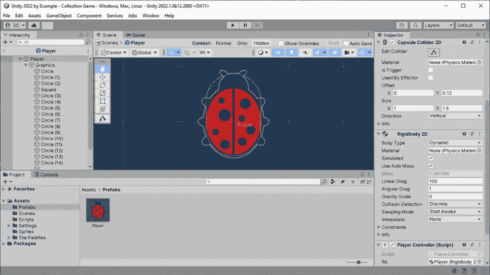

图 3.3 – 玩家预制组件配置

就这样！现在我们可以按下主工具栏上的**播放**按钮来测试我们的关卡设计。

瓢虫会旋转以面对鼠标指针的位置，并在按下空格键时朝着面对的方向移动。在**Tilemap**上分配了**TilemapCollider2D**的地砖将阻止玩家进入这些区域。

现在是调整`PlayerController`上的值的好时机。在这里，你可以看到我们开始的默认值：

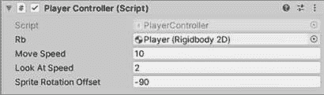

图 3.4 – 玩家控制器检查器字段值

这些调整会影响游戏感觉和整体玩家体验，所以花时间微调这些值，直到它对你这个游戏设计师来说感觉“恰到好处”。祝您玩得开心！

小贴士

当你找到你喜欢的值，并希望在测试期间快速在这些值之间来回切换（而无需在某个地方写下它们），你可以使用 **预设**（**组件**标题栏右侧的 *滑块图标*）：[`docs.unity3d.com/2022.3/Documentation/Manual/Presets.xhtml`](https://docs.unity3d.com/2022.3/Documentation/Manual/Presets.xhtml)

在本节中，你学习了如何直接从输入设备读取输入来使用自定义 C# 脚本移动玩家角色，同时使用物理，你探索了添加 CM vcam 提供的节省时间和强大的功能，并了解到游戏测试是关于调整数值以获得良好的玩家体验的游戏感觉。

奖励活动

在按住左鼠标按钮的同时移动瓢虫玩家角色。

在下一节中，我们将通过编写收集拾取的代码来实现一些玩家交互。

# 游戏机制及其代码创建方法（组件）

本节将探讨游戏机制的概念以及这对我们制作的 *外部世界* 收集游戏中的游戏玩法意味着什么。我们将在对 **游戏设计文档** (**GDD**) 的简要扩展中精确定义我们将使用的机制，并通过添加一个使用 2D 物理交互事件的自定义组件的新 Prefab 来编写该机制的代码。

## 什么是游戏机制？

**游戏机制**可以大致定义为规定游戏玩法以及玩家应该如何与机制充分互动以提供愉快和娱乐体验的规则。一些流行的游戏玩法机制类型包括收集、移动、射击和建造东西。

一些规定游戏玩法的游戏机制规则是由游戏而不是玩家遵循的，例如，只有当玩家完成当前关卡时，游戏才会解锁新关卡。

增益 & 削弱 | 游戏平衡

将机制元素改变为玩家的优势称为 **增益**，而对其不利则称为 **削弱**，以保持游戏平衡：[`www.inverse.com/gaming/nerf-buff-meaning-video-games-coined-series`](https://www.inverse.com/gaming/nerf-buff-meaning-video-games-coined-series)

现在让我们来探索如何添加我们游戏的主要机制。

## 添加到我们的 GDD

我们将要添加到我们的 GDD 并实现的游戏机制是环境中拾取物品的收集。我们可以这样描述它：

| **游戏名称** | 外部世界 |
| --- | --- |
| **收集游戏的核心理念是什么** **？** | 玩家将通过触摸它们直到收集完所有“水钻石”或倒计时计时器到期，在环境中找到并收集“水钻石”。 |

表 3.1 – GDD 游戏机制新增

阅读更多 | 游戏机制

威尔·赖特（*模拟人生*的创造者），*编写游戏机制 5 个技巧*：[`www.masterclass.com/articles/will-wrights-tips-for-writing-game-mechanics#will-wrights-5-tips-for-writing-game-mechanics`](https://www.masterclass.com/articles/will-wrights-tips-for-writing-game-mechanics#will-wrights-5-tips-for-writing-game-mechanics)

现在我们已经定义了核心游戏机制，让我们把代码组合起来使其工作！

奖励活动

通过探索向我们的关卡添加基于物理的额外对象的想法，设计一个涉及玩家推动我们称之为 *工具箱* 的瓷砖块的游戏机制。工具箱可能会给玩家带来不便并减慢他们收集 *水钻石* 的速度，或者通过要求它们移动到特定位置来提供额外的游戏玩法。

## 收集拾取物

到目前为止，我们已经涵盖了在 Unity 中工作以及创建基于组件的脚本的大部分基础知识，所以我们在组装事物时会稍微快一点 – 而不是花太多时间解释细节。

我们核心机制的主要目标是收集物体。我们将通过利用 2D 物理引擎提供的交互事件来实现这一点。让我们开始吧！

### 创建可收集物品 Prefab

首先，我们需要为我们的收集对象 – *水钻石* – 创建一个精灵。您可以在 Unity 中创建您的精灵艺术（就像我们为瓢虫角色所做的那样）或导入一个（建议的大小是 64 像素的正方形）。按照以下步骤创建一个用于收集对象的新的 Prefab：

1.  将您的 *水钻石* 精灵添加到场景中。

1.  将 **Graphics** 对象的精灵附加到一个空的 GameObject（容器）上。

1.  在父 GameObject 上添加一个最适合您的 *水钻石* 精灵形状的原始碰撞器 – 我选择了 **CapsuleCollider2D**，如 *图 3**.5* 所示。

1.  在 **CapsuleCollider2D** 组件上启用 **IsTrigger** 字段，因为我们不希望钻石和玩家之间发生任何碰撞交互；我们只想接收交互事件的提示。

阅读更多 | Unity 文档

简单来说，当 **IsTrigger** 被启用时，物体之间不会发生物理碰撞 – 物体不会对施加的力做出反应。

**Collider.isTrigger**: [`docs.unity3d.com/2022.3/Documentation/ScriptReference/Collider-isTrigger.xhtml`](https://docs.unity3d.com/2022.3/Documentation/ScriptReference/Collider-isTrigger.xhtml)

1.  让我们不要忘记确保精灵在 `Sprite Renderer` 的 `100` 中以正确的深度绘制。

1.  如果你使用 Sprite Creator 工具的形状在 Unity 中创建了自己的精灵，请选择 **Graphics** 父对象，并添加一个 **Sorting Group** 组件以分配排序层。

1.  将精灵的父对象拖动到 **Project** 窗口中的 `Assets/Prefabs` 文件夹。

小贴士 | Unity 文档

当 GameObject 被制作成 Prefab 时，**Hierarchy** 窗口中的对象会变成蓝色，并且在其右侧有正确的光标（箭头）。点击光标将进入场景中的 **Prefab 模式**（如图 *3**.5* 所示）。

*在 Prefab 模式下编辑 Prefab* | *在上下文中编辑*：[`docs.unity3d.com/2022.3/Documentation/Manual/EditingInPrefabMode.xhtml`](https://docs.unity3d.com/2022.3/Documentation/Manual/EditingInPrefabMode.xhtml)

你可以使用以下截图验证你的可收集 **Water Diamond** Prefab 设置：

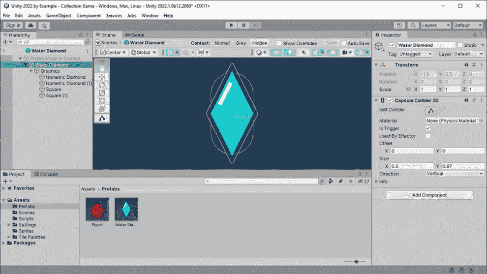

图 3.5 – 带有碰撞器的 Water Diamond Prefab

更多阅读 | Unity 文档

**Collider 2D**: [`docs.unity3d.com/2022.3/Documentation/ScriptReference/CapsuleCollider2D.xhtml`](https://docs.unity3d.com/2022.3/Documentation/ScriptReference/CapsuleCollider2D.xhtml)

**优化物理性能**：[`docs.unity3d.com/2022.3/Documentation/Manual/iphone-Optimizing-Physics.xhtml`](https://docs.unity3d.com/2022.3/Documentation/Manual/iphone-Optimizing-Physics.xhtml)

注意，2D 碰撞器的性能顺序（从最快到最慢）是：**圆形**、**胶囊**、**盒子**、**复合**、**多边形**，然后是 **边缘**。

好的，我们已经有了可收集物品精灵的 Prefab；现在，让我们编写交互代码。

### 创建 CollectItem 组件

在 `Scripts` 文件夹中创建一个新的脚本，并将其命名为 `CollectItem`。用以下模板替换生成的代码：

```cs
using UnityEngine;
public class CollectItem : MonoBehaviour
{
    void Start()
    {
        Debug.Log($"{gameObject.name}'s Start
            called", gameObject);
    }
    private void OnTriggerEnter2D(Collider2D collision)
    {
        Debug.Log("Collision message event triggered!");
        Destroy(gameObject);
    }
    private void OnDestroy()
    {
        Debug.Log("Destroyed");
    }
}
```

让我们逐行查看代码：

1.  `Start()` 中的 `Debug.Log()` 行只会输出一条消息到我们的 `Start()` 方法被调用。我们可以使用这个方法来验证我们将添加到场景中的所有可收集物品对象都在 *注册* 自己。当我们添加 UI 时，我们将使用这个方法来增加需要收集的总物品数量（下一节中的 *0 of 10* 中的 10）。

$ 字符串插值 | C#

在 **Debug.Log($"{gameObject.name}'s Start called");** 中的美元符号（**$**）用于标识一个插值字符串。在字符串字面量（由两个双引号 **""** 表示）中的 **{}**（开放/关闭波浪括号）内的文本是插入代码的字符串结果（通常是变量或表达式）。

参考以下 C# 语言参考以获取更多信息：[`docs.microsoft.com/en-us/dotnet/csharp/language-reference/tokens/interpolated`](https://docs.microsoft.com/en-us/dotnet/csharp/language-reference/tokens/interpolated)

因为我们在 `Debug.Log()` 调用中添加了第二个参数（`gameObject`），当 `gameObject`（驼峰式命名）关键字指向当前组件正在运行的 GameObject（帕斯卡式命名）时（也由 `MonoBehaviour` 基类提供）。

优化提示 | Unity 文档

注意，一旦测试完成并且不再需要，出于性能考虑，您可能需要注释掉 **Debug.Log()** 语句。

**调试**: [`docs.unity3d.com/2022.3/Documentation/Manual/class-Debug.xhtml`](https://docs.unity3d.com/2022.3/Documentation/Manual/class-Debug.xhtml)

1.  `OnTriggerEnter2D(Collider2D collision)` 是魔法发生的地方。当两个物理对象发生碰撞，其中一个对象启用了碰撞器 `IsTrigger` 值时，会调用此 Unity 消息。我们通过碰撞参数值接收另一个对象的碰撞器引用（我们将在下一节中使用 `collision` 来检测另一个对象是否是玩家）。

1.  `OnDestroy()` 是另一个 Unity 消息，当场景中的 GameObject 被销毁时会被调用 - 如您在之前的 `OnTriggerEnter2D()` 方法中看到的，当玩家与可收集物品发生碰撞时，它将在 `OnTriggerEnter2D()` 中处理物品的收集，然后通过调用 `Destroy(gameObject)` 从场景中移除物品（因此物品不能再次被收集）。

1.  将 `CollectItem` 脚本保存并添加到您的 `Collider` 组件中，这些组件必须位于与碰撞器相同的 GameObject 上 - 您可以在 `CollectItem` 脚本中看到它就在 `CapsuleCollider2D` 组件下方。

1.  查看以下屏幕截图，显示在 **Console** 中进行游戏测试并运行瓢虫角色进入 **水** **钻石**精灵时的 `Debug.Log()` 输出：

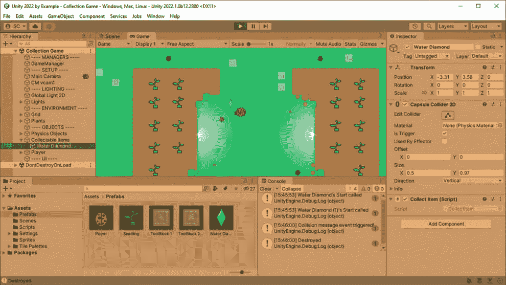

图 3.6 – 测试可收集物品

重要提示

在之前的屏幕截图中，还有两件额外的事情值得提及。

**编辑器** 被染成橙色，因为我已经分配了一个颜色来显示在进入 **Play Mode** 时 - 在 **Edit** | **Preferences** | **Colors** 然后 **General** | **Playmode tint** 中设置颜色。这种着色 *应该* 提醒您正在 **Play Mode** 中，并且您对 **Component** 值所做的大多数更改在停止时将不会保存（然而，基于文件的资产中的更改将被保存）。

我已经添加了一些空的 GameObject 来组织 **场景层次结构** 中的对象到逻辑分组中。对于仅用于组织目的添加的对象（即，游戏中没有使用子资产），您可以分配一个 **EditorOnly** 标签，这样它就不会包含在最终的游戏构建中（在这个过程中节省一些资源）。

您可以继续复制 **水钻** 预制件，通过在 **层次结构** 中选择一个并多次按 *Ctrl*/*Cmd* + *D* 来实现，并在关卡中重新定位它。进行测试以了解您在关卡中移动以到达每个物品的能力！

小贴士

您可以在场景中的空根 GameObject 中组织所有的 **水钻** 可收集物品 – 只需确保在拖入物品之前，根对象位于（**0**，**0**，**0**）。

您可以通过点击**检查器**中 GameObject 的 **Transform** 组件旁边的垂直省略号按钮（位于标题栏中的 **帮助** 和 **预设** 按钮右侧）并选择 **重置** 来快速重置 GameObject 的 **Transform** 组件。

这样，我们的游戏正在逐渐形成一个有趣的游戏！但关于增加挑战呢？我们将使用危险来减缓玩家在接触它们时的速度…小心！

## 触发危险

我们之前讨论了游戏中的危险和关卡设计，现在让我们来看看在章节的最后部分实现它们之前如何实施它们。

首先，让我们通过将其添加到我们的 GDD 文档中来定义我们的 nerf 机制：

| **游戏名称** | 外部世界 |
| --- | --- |
| **在收集游戏中，玩家遇到的 nerf 机制是什么？** | 当玩家触摸环境中的“有毒水坑”时，他们的速度会降低 – 增加在计时器到期前收集所有“水钻”的挑战。 |

表 3.2 – GDD 中添加的 nerf 机制

好的，我们需要在关卡中添加 *有毒水坑*！我们可以像创建 **水钻** 预制件并以此方式填充关卡一样做这些，但让我们采取不同的方法，并重新审视我们的贴图。

通过以下步骤在关卡中的挑战性位置添加有毒水坑：

1.  创建一个新的 `Tilemap - Hazards -` `Trigger`。

1.  打开 **贴图调色板**（**窗口** | **2D** | **贴图调色板**）并确保活动贴图是我们之前步骤中创建的贴图。

1.  从可用的 **调色板** 下拉菜单中选择 **环境对象**。

1.  从可用的贴图中选择 *黑色斑点/水坑* 精灵，并使用 **画笔** 工具（快捷键 *B*）将这些贴图散布在您关卡中的战略位置（我的建议是在水钻附近放置它们！）。

1.  由于我们希望有毒水坑可交互（通过物理引擎），请向 **层次结构** 中的 **Tilemap** GameObject 添加一个 `TilemapCollider2D` 组件。

1.  与之前碰撞对象的 `TileMapCollider2D.IsTrigger` 值进行比较，以便我们可以使用 `OnTriggerEnter2D()` 事件来响应碰撞。

这是使用新的危险区域贴图、在关卡中绘制的有毒水坑（在贴图调色板中选择）和 `TileMapCollider2D` 的 **Is Trigger** 复选框勾选的设置看起来像：

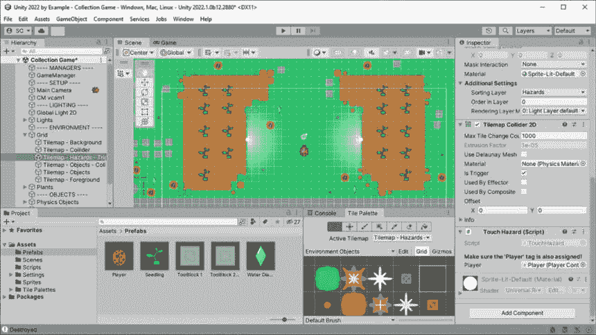

图 3.7 – 危险区域贴图触发碰撞器设置

在 *图 3*.7 中，你可以看到我已经为玩家与危险 tilemap 的瓦片交互添加了一个 `TouchHazard` 组件。

让我们来看看 `TouchHazard` 脚本：

```cs
using UnityEngine;
public class TouchHazard : MonoBehaviour
{
    [Header("Make sure the 'Player' tag is also
        assigned!")]
    public PlayerController Player;
    private void OnTriggerEnter2D(Collider2D collision)
    {
        if (collision.CompareTag(Player.tag))
        {
            Debug.Log("You touched a toxic puddle!");
            Player.SlowPlayerSpeed();
        }
    }
}
```

现在，让我们一点一点地分解它：

1.  你在这里首先会注意到的新行是我们添加了一些 *标题信息*。`[Header]` 是一个可以用来装饰公共字段的属性，以便在 **检查器**中向开发者或设计师显示一些信息，与字段一起可见。你可以在 *图 3*.7 中的 **检查器**中看到这条信息。

附加阅读 | Unity 文档

**属性**: [`docs.unity3d.com/2022.3/Documentation/Manual/Attributes.xhtml`](https://docs.unity3d.com/2022.3/Documentation/Manual/Attributes.xhtml)

1.  我们在这里声明的第一个公共变量 – `Player` – 是用于 `PlayerController` 引用的。我们不是在这里使用 GameObject 引用 – 需要额外的步骤来访问添加到 GameObject 上的组件 – 我们使用组件的对象类型来直接访问其公共成员。

1.  我们在这里再次可以看到，我们正在使用当 tilemap 上的 2D 碰撞器报告碰撞时调用的 `OnTriggerEnter2D` 消息。

1.  现在我们有一个碰撞发生，我们将使用一个 `if` 语句进行快速测试，以查看 *谁* 与危险瓦片发生了碰撞，通过使用 `collision.CompareTag()` 方法。

附加阅读 | Unity 文档

**CompareTag**: [`docs.unity3d.com/2022.3/Documentation/ScriptReference/GameObject.CompareTag.xhtml`](https://docs.unity3d.com/2022.3/Documentation/ScriptReference/GameObject.CompareTag.xhtml)

我们通过传递玩家的标签分配来指定我们想要检测的标签，使用 `Player.tag`。所以，让我们确保现在 **Player** 预制件已经分配了 **Player** 标签！

1.  在 **层次结构**中选择 **Player** 对象，转到 **检查器**的顶部，使用 **标签**下拉菜单 (*A*) 从列表中选择 **Player** 标签，然后通过使用 **覆盖**下拉菜单并点击 **应用所有** (*B*) 将更改应用到 **Player** 预制件，如图所示：

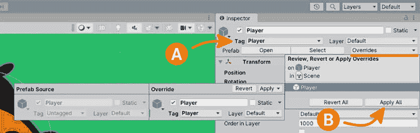

图 3.8 – 在检查器中设置玩家标签并应用覆盖

附加阅读 | Unity 文档

**标签**: [`docs.unity3d.com/2022.3/Documentation/Manual/Tags.xhtml`](https://docs.unity3d.com/2022.3/Documentation/Manual/Tags.xhtml)

**标签和层**: [`docs.unity3d.com/2022.3/Documentation/Manual/class-TagManager.xhtml`](https://docs.unity3d.com/2022.3/Documentation/Manual/class-TagManager.xhtml)

1.  如果我们的 `if` 语句的结果返回 `true`（标签匹配），那么 `Debug.Log()` 语句将在 `Player` 对象引用的 `SlowPlayerSpeed()` 中通知我们。访问对象的公共成员是通过 `Player.SlowPlayerSpeed()` 来执行的。

1.  让我们看看添加`SlowPlayerSpeed()`公共方法到我们的`PlayerController`类所需的**添加内容**：

```cs
public class PlayerController : MonoBehaviour
{
    …
    [Header("Hit Hazard Speed")]
    public float SlowedSpeed = 2f;
    public float SlowedTime = 5f;   // Seconds
    private float _speedStartValue;
    private void Start()
    {
        _speedStartValue = MoveSpeed;
    }
    …
    public void SlowPlayerSpeed()
    {
        MoveSpeed = SlowedSpeed;
        Invoke(nameof(RestoreSpeed), SlowedTime);
    }
    private void RestoreSpeed()
    {
        MoveSpeed = _speedStartValue;
    }
}
```

1.  我们可以看到需要一些新的变量来支持短时间内减慢玩家角色的速度。在`SlowedSpeed`中可分配的公共变量：一个`float`变量，用于指定玩家新的较慢移动速度，默认值为`2f`。

1.  `SlowedTime`：一个`float`变量，用于指定保持`SlowedSpeed`值的时间（以秒为单位），默认值为`5f`（5 秒）。

+   `Start()`方法用于缓存（保留）玩家的原始`MoveSpeed`值。*   我们还添加了`SlowPlayerSpeed()`方法——从`TouchHazard`类调用——将玩家的当前`MoveSpeed`设置为`SlowedSpeed`值以减慢移动速度。*   在将`MoveSpeed`赋值之后，使用`Invoke()`方法（`MonoBehaviour`）和延迟时间值（第二个参数）来等待，直到`SlowedTime`变量指定的时刻才调用新的`RestoreSpeed()`方法。*   我们在这里还使用了 C#的`nameof()`表达式与`RestoreSpeed()`方法，因此我们不需要使用字符串字面量作为方法名。

额外阅读 | Unity 文档

**Invoke**: [`docs.unity3d.com/ScriptReference/MonoBehaviour.Invoke.xhtml`](https://docs.unity3d.com/ScriptReference/MonoBehaviour.Invoke.xhtml)

1.  最后，我们添加了`RestoreSpeed()`方法，该方法简单地将`MoveSpeed`变量重置为其原始值——将玩家移动速度重置为正常。

通过这样，我们现在可以通过参考**图 3**.7 来启用危险交互。

1.  将**TouchHazard**组件添加到**Tilemap - Hazards -** **Trigger**对象。

1.  将**Hierarchy**中的**Player**对象拖放到**TouchHazard**组件中的**Player**字段。

1.  在**Player**上的**PlayerController**组件中验证**SlowedSpeed**和**SlowedTime**值。

现在，您可能想要测试您的关卡并调整危险效果的速率和持续时间，直到它符合您的需求（我选择了`2`和`5`，作为我的初始值）；将危险和钻石移动到关卡中，使其更具挑战性或更有趣。再次强调，只需享受这个过程即可！

在本节中，我们了解了什么是游戏机制以及如何在 GDD 中定义它，并学习了如何在我们这个级别实现收集机制和影响游戏玩法的影响。接下来，我们将通过添加 UI、倒计时计时器和胜利条件来为收集游戏添加最后的修饰。

# uGUI 简介，计时器，计数和胜利

玩家需要了解游戏中的情况，而我们通过 UI 向玩家传达这种关键信息。Unity 提供了易于使用的工具来创建 UI，通常被称为**uGUI**（或**Unity 图形用户界面**）——发音为 *You-gooey*。正式名称为**Unity UI**（在文档中搜索 *ugui* 返回 *无* *结果找到*）。

Unity UI 是一个基于 GameObject 的 UI 系统，因此您已经熟悉如何添加 UI 组件以以不同的方式显示和交互 UI 控件。

额外阅读 | Unity 文档

**Unity** **UI**: [`docs.unity3d.com/Packages/com.unity.ugui%401.0/manual/index.xhtml`](https://docs.unity3d.com/Packages/com.unity.ugui%401.0/manual/index.xhtml)

*UI 如何* *做*：[`docs.unity3d.com/Packages/com.unity.ugui%401.0/manual/UIHowTos.xhtml?q=unity%20ui`](https://docs.unity3d.com/Packages/com.unity.ugui%401.0/manual/UIHowTos.xhtml?q=unity%20ui)

玩家在收集游戏中需要看到的三项关键信息如下：

+   收集的项目数量与需要收集的总数量对比

+   收集所有项目剩余的时间

+   游戏结束时获胜（赢/输）的状态

我们首先讨论添加的 UI 对象是 Canvas，因为它负责绘制我们的 UI。

## Canvas

**Canvas** 是一个定义的区域，其中包含所有的 UI 小部件——可以将其想象为一张纸，所有要绘制的内容都将包含在页面上。如前所述，Unity UI 是基于 GameObject 的，因此 Canvas 是一个具有 Canvas 组件的 GameObject。场景中添加的所有 UI 小部件都必须是 Canvas 的子项。

将 UI Canvas 添加到场景中就像在**创建**菜单中选择**UI** | **Canvas**一样简单。第一次将 Canvas 添加到场景时，它还会添加一个**EventSystem**。我们需要选择**EventSystem**并将其更新为使用新的输入系统。点击**替换为 InputSystemUIInputModule**，如图 3.9 所示：

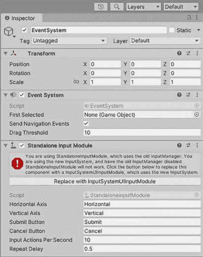

图 3.9 – 更新 EventSystem 以使用新的输入系统

如下图中所示，使用`0.5`：

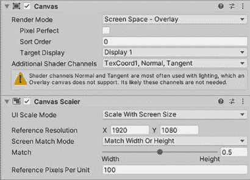

图 3.10 – Canvas 缩放器

Canvas 已经设置好了，现在让我们添加第一个 UI 小部件来显示收集的项目当前数量！

## TextMesh Pro

**TextMesh Pro**（**TMP**）是一套用于在项目中创建高度可定制和高质量的 2D 和 3D UI 文本的工具。我们将使用 TMP 文本小部件来显示所有游戏信息，包括收集的项目、倒计时计时器和胜负信息。

额外阅读 | Unity 文档

**TextMeshPro**: [`docs.unity3d.com/2022.3/Documentation/Manual/com.unity.textmeshpro.xhtml`](https://docs.unity3d.com/2022.3/Documentation/Manual/com.unity.textmeshpro.xhtml)

**TextMesh Pro** **文档**：[`docs.unity3d.com/Packages/com.unity.textmeshpro%404.0/manual/index.xhtml`](https://docs.unity3d.com/Packages/com.unity.textmeshpro%404.0/manual/index.xhtml)

在**层次结构**中选择 Canvas 对象后，使用**创建**菜单将**UI** | **Text – TextMeshPro**文本小部件添加到场景中。如果你是第一次将**TextMeshPro**小部件添加到项目中，系统会提示你安装必需的资源。点击**导入** **TMP Essentials**：

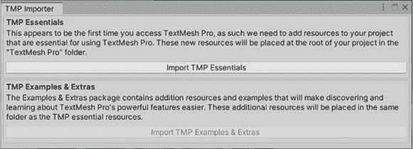

图 3.11 – TMP 导入对话框

使用以下步骤在屏幕左下角显示收集物品文本：

1.  将新添加的 TMP 文本对象重命名为`Collected` `Count Text`。

1.  要将文本锚定到屏幕的左下角，使用**锚点预设** (*A*)，同时按住**Shift**（**也设置轴点**）和**Alt**（**也设置位置**）键（*B*），然后点击左下角的锚点（*C*）：

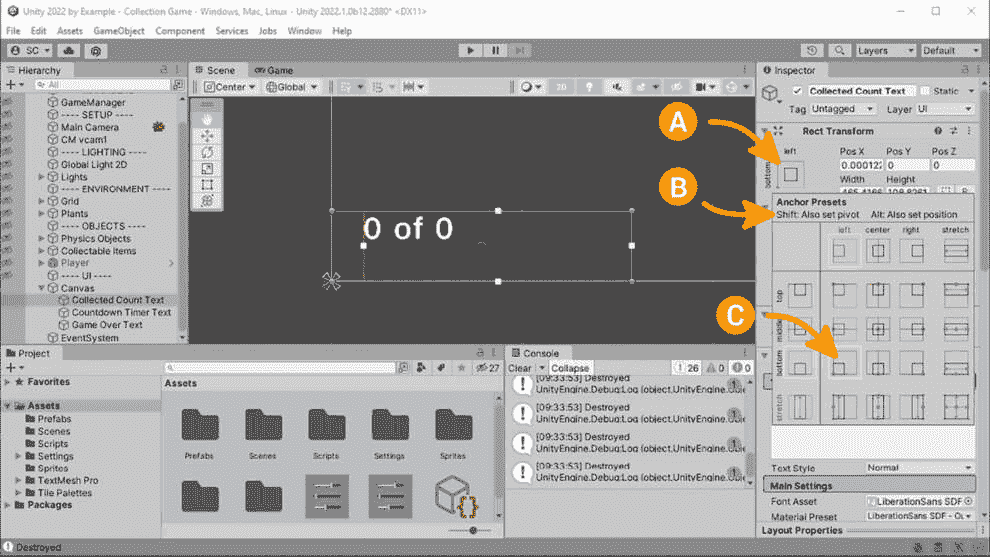

图 3.12 – TextMeshPro 矩形锚点设置

1.  使用以下设置来提供默认文本以显示并设置文本样式（参考*图 3**.12*作为参考）：

    1.  `0` `of 0`

    1.  **字体样式**：**粗体**

    1.  **字体大小**：**48**

    1.  **额外设置** | **边距** | **左**：**50**

到此为止，我们已准备好在每次收集物品时更新文本。让我们在下一节中看看如何将所有这些结合起来。

## 更新拾取计数

我们现在要解决的问题是如何在收集物品时更新 UI 文本？我们可以参考设计模式来找到解决方案！我们之前已经介绍了单例和观察者模式，任何一个都适合我们的需求。

为了提供一个实际应用的例子，我们将使用两个，从单例开始。

拾取计数将显示为`GameManager`，将负责保存收集品的（变量）数据，因此这将成为一个单例实例。

当游戏首次运行时，场景中每个可收集物品的`Start()`方法将被调用，因此我们将使用此方法将每个可收集物品添加到总物品计数中。

让我们首先创建`GameManager`脚本，并通过在变量声明部分（靠近类顶部）添加以下行将其设置为单例实例：

```cs
    // Singleton instance.
    public static GameManager Instance
        { get; private set; }
    private void Awake() => Instance = this;
```

`GameManager`类本身被声明为`public static`属性 – 我们希望使用`Instance`变量直接从另一个类型访问该类。我们让`get`保持公开，而将`set`声明为私有，这样外部类就只能读取。

在`Awake()`方法中，我们将`Instance`变量设置为`this`，即当前类的实例。在这里我们使用表达式体（由`=>`表示）而不是通常的花括号（块体）来使代码更简洁，因为它只需要一个表达式。

属性（C#）

C#属性是一个使用显式访问器`get`和`set`方法来读取或写入数据值的类成员。

现在，我们可以添加存储可收集物品总数的变量、公共方法来增加总数，以及通过以下步骤从`CollectItem`类调用增加方法：

1.  在变量声明部分添加一个私有`_totalCollectibleItems`整型变量。它的访问器是私有的，因为它只封装在声明类内部以更改其值（在面向对象封装中，认为在类外部修改变量值是不良做法）：

    ```cs
        private int _totalCollectibleItems;
    ```

1.  在变量声明部分添加一个公共的`AddCollectibleItem()`方法，没有返回类型（`void`），作为一个表达式体，以增加`_totalCollectibleItems`当前值。`++`一元算术运算符将操作数增加 1。`public`访问器意味着我们可以在声明类外部调用此方法，我们将在下一部分从`CollectItem`类通过单例实例来这样做：

    ```cs
        public void AddCollectibleItem() =>
            _totalCollectibleItems++;
    ```

1.  现在，在`CollectItem`类中，在`Start()`方法的底部添加以下内容，以调用`GameManager`单例实例并将可收集物品添加到总物品计数中：

    ```cs
        void Start()
        {
            …
            GameManager.Instance.AddCollectibleItem();
        }
    ```

这样，我们现在就知道每个场景中对象实例的`Start()`方法将被调用多少次了。简单易懂！

可收集物品的 UI 显示的第二部分需要显示当前收集的物品数量。我们现在将使用我们在实践中覆盖的第二个设计模式：观察者来实现这一点。

### 增加收集项目数量

我们已经看到了如何通过静态变量访问`GameManager`单例实例。我们将对`CollectItem`类做类似处理，以便知道何时有项目被收集。

通常情况下，场景中每个对象的实例都是相互独立的——每个实例都有自己的独立成员。我们希望`GameManager`能够注册并监听（即观察）任何被收集的项目，因此我们将通过调用一个静态事件来实现这一点——静态声明将使其在所有类实例中通用，所以我们不需要引用任何单个项目实例。

让我们继续在`CollectItem`类中添加我们的静态事件，然后从`GameManager`注册监听器，以便在事件被调用时采取行动：

1.  在`CollectItem`中添加以下公共静态变量声明：

    ```cs
        public static event UnityAction OnItemCollected;
    ```

将`event`关键字添加到声明中，以强制仅在声明类内部调用——我们不想让外部类能够触发事件！

我们在这里使用`UnityAction`作为方法委托，因此我们可以通过它来引用调用多个方法，甚至将其作为方法参数传递。在命名事件委托和方法时，通常在单词*On*之前加前缀（例如`OnItemCollected`）也是常见做法。

额外阅读 | Unity 文档

**UnityAction**: [`docs.unity3d.com/2022.3/Documentation/ScriptReference/Events.UnityAction.xhtml`](https://docs.unity3d.com/2022.3/Documentation/ScriptReference/Events.UnityAction.xhtml)

1.  在 `OnTriggerEnter2D()` 方法的顶部添加以下行以调用或 *触发* 事件（也称为 **事件调用**），当物品被收集时：

    ```cs
            OnItemCollected?.Invoke();
    ```

添加到 `OnItemCollected` 的问号和点 (`?.`) 是一个空条件运算符 – 它只有在操作数不评估为 `null` 时才会执行操作。在这种情况下，这意味着如果没有注册监听器，我们不想在调用 `Invoke`（执行事件）时抛出 `NullReferenceException` 错误。

NullReferenceException (C#)

**NullReferenceException**（**NRE**）是在尝试访问一个 **null** 对象（未分配）的成员时可能发生的错误。

1.  现在进入 `GameManager` 类，我们添加一个私有变量来跟踪玩家收集的物品数量：

    ```cs
        private int _collectedItemCount;
    ```

1.  该类封装了这个变量 – 因为它的访问器被设置为 `private` – 因此，让我们添加一个 `ItemCollected()` 方法来递增计数：

    ```cs
        private void ItemCollected() =>
            _collectedItemCount++;
    ```

我们只是通过在变量后使用 `++` 算术运算符来递增计数，每次收集到物品时增加 1。

1.  那么，现在 `ItemCollected()` 方法是如何被调用的呢？这正是注册 `CollectItem.OnItemCollected` 事件的地方。我们将使用 `OnEnable()` 和 `OnDisable()` Unity 消息事件 – 这些事件分别在行为首次启用并激活时调用，然后变为禁用：

    ```cs
        private void OnEnable()
        {
            CollectItem.OnItemCollected += ItemCollected;
        }
        private void OnDisable()
        {
            CollectItem.OnItemCollected -= ItemCollected;
        }
    ```

`+=` 运算符用于在订阅事件时指定添加事件处理方法。我们将注册 `ItemCollected` 方法，以便在调用 `CollectItem.ItemCollected` 事件时被调用（即注册监听器）。

重要提示

为了避免资源泄露，应该始终执行取消订阅事件的操作！

`-=` 运算符用于指定移除事件处理方法以停止订阅事件。我们正在注销 `ItemCollected` 方法，以便在调用 `CollectItem.ItemCollected` 事件时它将不再被调用。假设我们没有注销事件处理程序，并且包含处理方法的对象被销毁，那么它将抛出 `null`) – 我们肯定不会对此感到高兴！

小贴士

不要忘记，如果处理方法尚未创建，您可以通过单击 **ItemCollected** 文本，然后使用 *Alt/Cmd* + *Enter* 并选择 **Generate** **method ItemCollected** 来让 VS 为您生成方法。

现在我们已经计算出了总物品和收集物品的值，让我们更新 UI 显示。

### 更新 UI

显示收集物品进度的文本组件已经作为 **Collected Count Text** 添加到场景中。现在，我们需要一种方法来引用和更新每次玩家收集到 **Water Diamond** 时显示的文本。

我们将创建一个新的 `UIManager` 类，以将 UI 功能与 `GameManager` 分离 – 遵循单一责任原则。

创建一个新的脚本名为 `UIManager` 并添加以下代码：

```cs
using UnityEngine;
using TMPro;
public class UIManager : MonoBehaviour
{
    public TextMeshProUGUI CollectedItemText;
    void Start()
    {
        CollectedItemText.text = string.Empty;
    }
    public void UpdateCollectedItemsText(
        int currentItemCount, int totalCollectableItems) =>
            CollectedItemText.text =
                $"{currentItemCount} of
                    {totalCollectableItems}";
}
```

在编写新的 `UIManager` 脚本时，我们将这样做。

1.  我们首先要做的是添加一个 `using` 语句用于 `TextMeshPro` (`TMPro`)，这样我们就可以引用 TMP 文本组件的属性。

1.  然后，我们将添加一个公共变量用于 **收集计数文本** TMP 对象，在 **检查器** 中进行分配（用于引用）。

1.  当游戏开始播放时，我们使用 `string.Empty`（一个零长度的字符串，相当于 `""`）重置 `CollectedCountText` 文本，以不显示任何内容 – 这将清除我们在设计时输入的任何临时显示文本，以调整位置和显示值。

1.  最后，添加了一个名为 `UpdateCollectedItemsText()` 的方法，用于设置 `CollectedCountText` 文本。它有两个方法参数，一个用于当前项目计数，另一个用于场景中的总可收集物品。我们再次使用字符串插值将变量的值与 *of* 结合起来进行显示。

让我们回到 Unity 编辑器，通过将 `UIManager` 添加到 `CollectedCountText` 字段来完成 `UIManager`，如图中 **检查器** 所示：

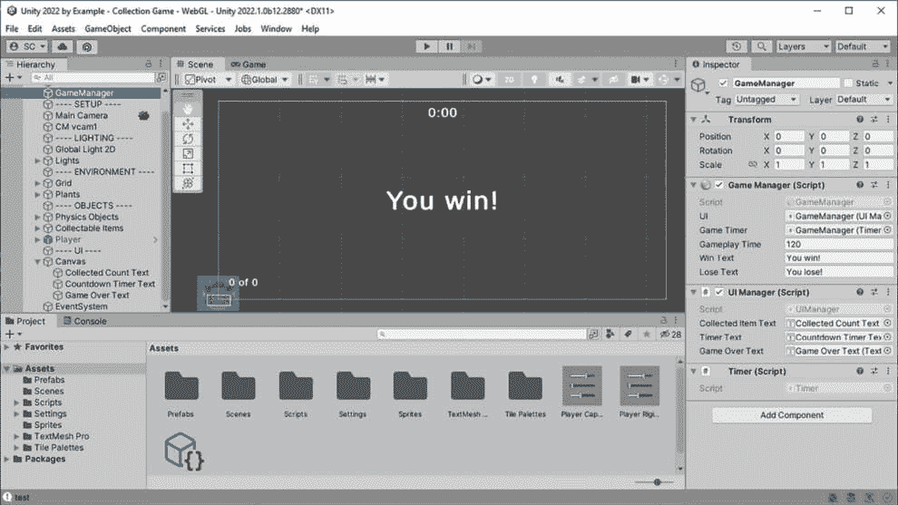

图 3.13 – 管理器检查器分配

在收集对象时，我们最后要做的就是在 `GameManager.ItemCollected()` 中连接 `UI.UpdateCollectedItemsText()` 调用：

1.  在 `GameManger` 中添加一个公共变量来保存对 `UIManager` 组件的引用：

    ```cs
        public UIManager UI;
    ```

1.  将 `ItemCollected()` 方法更改为现在调用 `UI.UpdateCollectedItemsText()` 方法，传递增加后的 `_collectedItemCount` 和 `_totalCollectibleItems` 值：

    ```cs
        private void ItemCollected() =>
            UI.UpdateCollectedItemsText(
                ++_collectedItemCount,
                    _totalCollectibleItems);
    ```

`_collectedItemCount` 前面的 `++` 操作符意味着我们将预增其操作数（前缀），然后读取其值。我们希望传递给方法的已经是增加后的值。

-- (C#)

注意，C# 中也提供了 **--** 一元算术操作符，它不是将操作数增加 1，而是将其减 1。相同的规则适用于前缀或后缀递减赋值。

这样，唯一剩下的任务是将 `UIManager` 拖到 `GameManager` 组件中，以分配其引用（参考 *图 3**.13*）。保存您的文件并测试游戏！

现在，游戏正在跟踪收集的水钻数量并向玩家显示进度。这还不完全是一个游戏，所以我们将添加一个简单的倒计时计时器，我们将在下一节将其与胜负条件关联起来。

## 计时器脚本

参考我们的 GDD 中的*表 3.1*，我们知道如果玩家在收集所有水钻之前，倒计时计时器达到 0，游戏将失败。为此，我们需要一个简单的计时器脚本，每秒从时间中减去 1 秒。让我们看看我们如何实现这一点，并通知监听器时间变化和过期事件。

创建一个名为`Timer`的新脚本，并参考以下代码：

```cs
using UnityEngine;
using UnityEngine.Events;
public class Timer : MonoBehaviour
{
    public event UnityAction<int> OnTimeUpdate;
    public event UnityAction OnTimeExpired;
    private int _timeSeconds, _timeCurrent;
    public void StartTimer(int time)
    {
        _timeSeconds = time;
        _timeCurrent = 0;
        InvokeRepeating(nameof(UpdateTimer), 1f, 1f);
    }
    public void StopTimer() => CancelInvoke();
    private void UpdateTimer()
    {
        _timeCurrent++;
        OnTimeUpdate?.Invoke(_timeCurrent);
        if (_timeCurrent >= _timeSeconds)
        {
            StopTimer();
            OnTimeExpired?.Invoke();
        }
    }
}
```

让我们看看代码并回顾一下新内容：

1.  `OnTimeUpdate`事件增加了一个参数：`UnityAction<int>`。这允许在事件被调用时向监听器传递一个整数值（你可以通过`UnityAction`添加最多四种类型的参数）。我们使用传入的`int`值（秒数）来显示 UI 中的剩余时间。

1.  我们在一行中声明了两个`int`类型的变量`_timeSeconds`和`_timeCurrent`，通过逗号分隔变量名称。

1.  `StartTimer()`是一个公共方法，GameManager 将调用它来开始计时器的倒计时并开始游戏。

1.  `InvokeRepeating()`与`Invoke()`类似，除了，你猜对了，有一个重复的时间指定。我们使用这个方法每秒更新计时器值。

额外阅读 | Unity 文档

**InvokeRepeating**: [`docs.unity3d.com/2022.3/Documentation/ScriptReference/MonoBehaviour.InvokeRepeating.xhtml`](https://docs.unity3d.com/2022.3/Documentation/ScriptReference/MonoBehaviour.InvokeRepeating.xhtml)

`InvokeRepeating()`方法接受一个表示方法名称的字符串表示形式作为参数，就像`Invoke()`一样，并且每次你在代码中输入一个字符串字面量时，都应该触发一个标志——硬编码的字符串或*魔法字符串*是纯粹的邪恶！因此，我们不会直接输入一个字符串，而是使用`nameof`表达式来返回方法名称作为字符串。太棒了！

nameof (C#)

`nameof`表达式从变量、类型或成员中获取一个字符串常量，并在编译时进行评估。这可以用作字符串字面量的替代品。它确保没有拼写错误，并允许 VS CodeLens 生成引用。

1.  `StopTimer()`方法调用`CancelInvoke()`，这将停止计时器的倒计时（通过停止`InvokeRepeating`过程）。

1.  `UpdateTimer()`方法负责增加计时器并调用`OnTimeUpdate`事件，传递`_timeCurrent`值。

1.  最后，我们使用`>=`比较运算符测试计时器是否已过期条件：`_timeCurrent`是否大于或等于`_timeSeconds`？我们使用`>=`而不是`==`，因为在处理时间增加可能跳过一秒的边缘情况时，我们会错过一个相等条件。此外，计时器将被停止，并将触发`OnTimeExpired`事件。

呼呼！脚本不长，但几个关键部分使得它能够很好地与我们的其他组件协同工作。说到这个，我们现在可以将`Timer`代码与`GameManager`和`UIManager`集成，以开始计时器的运行并更新 UI 中的剩余时间文本。

### 对 GameManager 的扩展

在`Timer`脚本准备就绪后，让我们在`GameManager`类中将`Timer`脚本连接起来，以开始运行计时器并处理时间更新和倒计时结束的事件。

我们首先要解决的是在游戏开始时启动计时器倒计时。计时器倒计时通过在`GameManager`类的`Start()`方法中分配的直接引用调用`Timer.StartTimer()`公共方法来启动。

按照以下步骤查看设置过程：

1.  添加一个公共变量`GameTimer`，用于引用添加到**层次结构**中的**GameManager**GameObject 的`Timer`组件：

    ```cs
        public Timer GameTimer;
    ```

1.  添加一个公共整型变量`GameplayTime`，用于指定游戏倒计时的时间（以秒为单位）- 这将是玩家收集所有水钻所需的总时间。确定要设置什么值的最简单方法是进行游戏测试！

    ```cs
        public int GameplayTime;
    ```

1.  当游戏运行时，从`Start()`方法开始计时器。我们在`StartTimer()`方法上调用`Invoke()`，延迟 2 秒 - 给玩家一些时间在游戏开始前稍微定位自己：

    ```cs
        private void Start() =>
            Invoke(nameof(StartTimer), 2f);
    ```

1.  添加`StartTimer()`方法，该方法执行对`Timer`的`StartTimer()`方法的实际调用，并传入倒计时的时间：

    ```cs
        private void StartTimer() =>
            GameTimer.StartTimer(GameplayTime);
    ```

1.  最后，回到`Timer`组件，在**层次结构**中的**GameManager**GameObject 上，并在**GameTimer**字段中分配对其的引用（参见图 3.13）。

前面的步骤已经将`Timer`与我们的`GameManager`集成，并在游戏开始时开始计时。但我们仍然需要处理计时器的事件，所以让我们首先添加对时间更新的监听器：

1.  在`OnEnable()`方法中，添加对`OnTimeUpdate`事件的监听器，并指定处理方法：

    ```cs
        private void OnEnable()
        {
            …
            GameTimer.OnTimeUpdate += TimeUpdated;
        }
    ```

1.  记住，当我们订阅一个事件时，我们也应该取消订阅它以防止内存泄漏，所以将以下代码添加到`OnDisable()`中：

    ```cs
        private void OnDisable()
        {
            …
            GameTimer.OnTimeUpdate -= TimeUpdated;
        }
    ```

1.  创建`TimeUpdated()`方法（*Alt/Cmd* + *Enter*），其中我们将执行处理计时器更新为新时间的代码：

    ```cs
        private void TimeUpdated(int seconds) =>
            UI.UpdateTimerText(seconds, GameplayTime);
    ```

和之前一样，我们正在调用 UI 引用上的公共方法来更新倒计时计时器文本，同时添加从`Timer`和总游戏时间传递进来的秒数值。

关于代码架构的说明

我们可以在**UIManager**内部直接添加对**Timer.OnTimeUpdate**事件的监听器来更新倒计时计时器文本，但我决定在项目中只保留一个对**Timer**的引用，并在**GameManager**中处理所有计时器事件。这将使事情更简洁，并且由于与计时器相关的代码都在一个类中，因此更容易调试任何问题。

我们将在下一节中添加`UpdateTimerText()`方法，其中我们将更新`UIManager`。

### 添加到 UIManager

让我们直接添加额外的变量和方法来支持更新计时器文本和游戏结束消息，我们将在下一节完成这些：

1.  打开`UIManager`脚本，并进行以下修改：

    ```cs
        public TextMeshProUGUI TimerText;
        public TextMeshProUGUI GameOverText;
        void Start()
        {
            …
            TimerText.text = string.Empty;
            GameOverText.text = string.Empty;
        }
        public void UpdateTimerText(int currentSeconds,
            int totalSeconds)
        {
            var ts = System.TimeSpan.FromSeconds(
                totalSeconds – currentSeconds);
            TimerText.text = $"{ts.Minutes}:{ts.Seconds:00}";
        }
        public void SetGameOverText(string text) =>
            GameOverText.text = text;
    ```

1.  添加两个`TextMeshProUGUI`公共字段，用于在 UI 中显示计时器和游戏结束文本。

1.  在`Start()`中，我们将清除设计时间期间使用的任何占位文本，这样就不会显示任何文本，直到它被更新。

1.  添加带有当前和总秒数的`UpdateTimerText()`方法参数，以计算倒计时剩余时间并显示。

注意，我们使用`System.TimeSpan`来简化事情。然后我们可以使用`ts`变量来显示文本，格式化以显示分钟和秒，其中秒总是以两位数字显示（`00`被指定）。

1.  最后，添加`SetGameOverText()`方法，用于更新`GameOverText`文本以显示游戏结束消息。

为了完成修订，我们将回到**编辑器**中，在**场景层次结构**中的**Canvas**下创建两个新的**Text - TextMeshPro** UI 小部件（参见图 3.13）：

1.  要在用户界面中显示计时器，将其命名为*Countdown Timer Text*并将其锚定在屏幕顶部中央。调整文本大小，使其对玩家易于可见。

1.  要在用户界面中显示游戏结束文本，将其命名为*Game Over Text*并将其锚定在屏幕中央。给文本一个大号，覆盖大部分屏幕，这样在游戏结束时玩家无论是赢还是输都不会弄错。

当你完成这些文本小部件的 UI 设计后，将它们拖到`UIManager`组件。

如果不能在游戏中赢或输，那么这根本不是一场游戏！所以，让我们在下一节完成收集游戏的收尾工作。

## 赢得游戏

我们所需的一切来确定胜负条件都已经就绪。让我们从胜利条件开始：如果玩家在倒计时计时器结束之前收集到所有的水钻石，他们就会获胜。

这是一个简单的相等条件语句：累积的项目数量是否等于可收集的项目总数？如果我们在一个项目被收集时检查这个条件，并且它等于`true`，我们就知道我们赢得了游戏。

在`GameManager`中，修改`ItemCollected()`方法以包含此检查，如果为`true`，我们将调用`Win()`方法。

你首先必须将表达式体重构为块体，以便在方法中包含额外的代码行（提示：VS 可以为你重构并添加波浪括号）。现在它将看起来如下：

```cs
    private void ItemCollected()
    {
        UI.UpdateCollectedItemsText(
            ++_collectedItemCount, _totalCollectibleItems);
        if (_collectedItemCount == _totalCollectibleItems)
            Win();
    }
```

这很简单！现在，让我们声明失败条件：如果倒计时计时器在玩家收集到所有的水钻石之前耗尽，他们就会失败。这需要做一点更多的工作，但我们只是将使用我们已经实现的内容，具体来说，就是`Timer.OnTimeExpired`事件。

在`GameManager`中，再次为时间耗尽添加`OnEnable()`监听器并分配处理方法：

```cs
    private void OnEnable()
    {
        …
        GameTimer.OnTimeExpired += TimeExpired;
    }
```

再次，取消订阅：

```cs
    private void OnDisable()
    {
        …
        GameTimer.OnTimeExpired -= TimeExpired;
    }
```

创建`TimeExpired()`方法作为表达式体，我们将只调用`Lose()`——时间已耗尽；如果玩家已经收集了所有物品并获胜——则此方法永远不会被调用：

```cs
    private void TimeExpired() => Lose();
```

最后，作为完成收集游戏的最后几个步骤，参考以下`GameManager`脚本的添加，我们将添加两个公共字段`WinText`和`LoseText`，它们包含游戏结束时显示的消息（如图*3**.13*所示）：

```cs
    public string WinText = "You win!";
    public string LoseText = "You lose!";
```

如果你没有为这里的变量声明分配一些默认的文本值，那么别忘了在**检查器**中分配它们！

我们还将添加`Win()`和`Lose()`方法：

```cs
    private void Win()
    {
        GameTimer.StopTimer();
        UI.SetGameOverText(WinText);
        Time.timeScale = 0f;
    }
    private void Lose()
    {
        UI.SetGameOverText(LoseText);
        Time.timeScale = 0f;
    }
```

这两个新方法的简要说明如下：

1.  `Win()`方法首先通过调用`GameTimer.StopTimer()`停止计时器。这将取消调用更新计时器方法，因为我们的游戏现在已经结束了。

1.  这两个方法都调用`UI.SetGameOverText()`，但带有相应的参数来显示正确的消息，分别是`WinText`和`LoseText`。

1.  它们各自将运行中的游戏`Time`的`timeScale`变量设置为`0`，这会暂停游戏（有一些例外；有关`Time.timeScale`的更多信息，请参阅下面的提示块）。 

注意，将`timeScale`设置为零在技术上会产生与在这里调用`GameTimer.StopTimer()`相同的结果，因为此时唯一的选择是重新开始游戏。不过，我喜欢在代码中明确一些语句，以便意图清晰可见（当然，只要它不会对其他方面产生负面影响，哈哈）。

额外阅读 | Unity 文档

**Time.timeScale**: [`docs.unity3d.com/2022.3/Documentation/ScriptReference/Time-timeScale.xhtml`](https://docs.unity3d.com/2022.3/Documentation/ScriptReference/Time-timeScale.xhtml)

由于在本节中将代码拆分成了很多小块，你可能需要参考完整的`GameManager`脚本，它可以在 GitHub 仓库中找到：[`github.com/PacktPublishing/Unity-2022-by-Example/tree/main/ch3`](https://github.com/PacktPublishing/Unity-2022-by-Example/tree/main/ch3)

这样，我们的游戏就完成了。太好了！然而，在我们可以与世界分享我们的游戏之前，还需要一个关键的步骤……那就是确保其他人觉得游戏具有挑战性和乐趣。

### 游戏测试

现在是进行游戏测试和更改关卡设计参数的时候了，改变玩家可以走的路径，移动物体和危险，移动可收集物品，并调整游戏时间，使游戏对玩家具有挑战性和乐趣。

让其他人玩你的游戏——如果可能的话，观察他们玩游戏，以了解他们如何玩游戏并获取他们的反馈。根据游戏测试的结果进行改进，并对游戏进行迭代！

下载完整的游戏代码

记住，本书的示例代码可以从以下 GitHub 仓库下载：[`github.com/PacktPublishing/Unity-2022-by-Example`](https://github.com/PacktPublishing/Unity-2022-by-Example)

# 摘要

本章介绍了 CM 相机系统的强大功能，用于快速添加玩家跟随相机，实现收集物品的游戏机制以吸引玩家，使用 Unity UI 向玩家展示关键游戏进度元素，以及如何通过胜负条件完成和平衡我们的收集游戏。

在下一章中，我们将通过定义《Outer World》2D 冒险游戏的 GDD（游戏设计文档）来介绍本书的下一个项目，学习如何导入原始艺术作品以配合额外的 Unity 关卡构建工具使用，并探索关卡设计和游戏打磨的更多方面。
