# 创建一个 2D 冒险游戏

在*第三章*中，您被介绍了 Cinemachine，用于创建快速但强大的相机跟随系统。我们学习了如何使用 Unity UI 实现收集物品和显示游戏进度的游戏机制，以及如何在考虑胜负条件的同时处理游戏平衡。

通过完成收集游戏，前几章提供了基础知识，我们将在此基础上继续构建，本章我们将开始制作一个 2D 冒险游戏。我们将探索导入艺术作品并使用额外的 Unity 2D 工具，即**Sprite Shape**，来构建 2D 侧面环境以及级别设计。

我们将通过添加动态移动平台和触发器来结束本章，这些触发器将为玩家提供二级动作，以创造更具吸引力的游戏体验，并采用一些优化技术来保持游戏性能和品质，以增加沉浸感。

本章我们将涵盖以下主要主题。

+   扩展**游戏设计文档**（**GDD**） – 介绍 2D 冒险游戏

+   将资源导入以用于 Sprite Shape – 一种不同类型的 2D 环境构建器

+   级别和环境设计 – 引导玩家

+   移动平台和触发器 – 创建一个动态可交互的环境

+   为我们的环境添加细节以增强沉浸感和优化

到本章结束时，您将拥有另一个可用于您项目的 GDD 示例，并能够导入和使用原始艺术作品来创建一个使用 Sprite Shape 设计的引导玩家环境。您还将能够创建一个交互性和动态的移动环境，该环境经过优化且视觉效果精美。

# 技术要求

要跟随本章中为书中项目创建的相同艺术作品，请从本节提供的 GitHub 链接下载资源。要使用您自己的艺术作品跟随，您需要使用 Adobe Photoshop 或能够导出分层 Photoshop PSD/PSB 文件的图形程序（例如，Gimp、MediBang Paint 或 Krita）创建类似的艺术作品。

此外，为了跟随玩家输入部分，您可能需要一个与您的系统兼容的游戏控制器（尽管这是可选的，因为也会提供键盘输入）。

您可以在 GitHub 上下载完整的项目[`github.com/PacktPublishing/Unity-2022-by-Example`](https://github.com/PacktPublishing/Unity-2022-by-Example)。

# 扩展 GDD – 介绍 2D 冒险游戏

我们现在继续下一个游戏概念，同时继续书中项目的整体主题，因此让我们继续更新 GDD 并在需要的地方扩展它。

让我们先更新以下之前覆盖的概述部分；这还将作为您对游戏的介绍：

| **游戏名称** | 外部世界 |
| --- | --- |
| **描述游戏玩法、核心循环和进度。** | 在寻找进入入口所需的关键部件的同时，找到通往栖息地站的道路，并中和试图阻止你任务的感染机器人。 |
| **冒险游戏的核心游戏机制是什么？** | 玩家将反复与阻碍前往栖息地站的感染机器人战斗。 |
| **冒险游戏的次要游戏机制是什么？** | 玩家将在环境中寻找隐藏的关键部件。这些部件需要正确组合作为输入，才能获得进入栖息地站入口的权限。 |
| **需要实现哪些系统来支持游戏机制？** | 玩家移动、装备带有弹药装填和射击能力的武器、带有库存的拾取、谜题解决者、生命值和伤害。 |

表 4.1 – 冒险游戏的 GDD

我们在前面表格的末尾添加了一个新章节，将游戏机制细节进一步扩展到 *开发需求* 领域。在定义了一些系统之后，我们可以开始考虑代码架构以及需要解决的一些 *问题* – 这是我们应用一些设计模式的地方。

现在，我们不再添加削弱效果，而是这次为玩家添加一个增益效果：

| **在冒险游戏中，增益机制对玩家意味着什么？** | 玩家将能够收集散布在环境中的能量碎片（*水钻石*），当收集到一定数量时，将为所有武器提供升级状态（增加造成的伤害）。 |
| --- | --- |

表 4.2 – 为 GDD 添加增益效果

我们的游戏玩家角色和敌人将比收集游戏更加完善。让我们在 GDD 中为这些角色的背景和玩家挑战结构添加章节。

| **主要角色：****描述游戏中的主要角色以及他们如何推动故事。这位**玩家角色是谁？** | **类型**：Kryk’zylx 人形种族。**背景**：Kryk’zylx 的人民已经超越了他们的家园星球，正在寻找适合殖民的星球。侦察兵被派往星球表面建立可能维持生命的栖息地站。**目标**：建立并维护一个栖息地站，配备自动化的建筑和维护机器人。**技能**：动力服跳跃和充电。**弱点**：大气不可呼吸。 |
| --- | --- |

Kryk’zylx 侦察兵必须在栖息地站外的星球敌对大气中穿着动力服才能生存。以下是一个动力服头盔的示例：

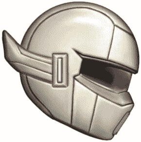

图 4.1 – 动力服头盔

现在，我们将继续添加关于玩家挑战结构的详细章节：

| **主角的挑战结构是什么？** | 在平台上导航，避开感染的机器人，并解决关键谜题。 |
| --- | --- |
| **敌人 A：** 描述游戏中的第一个敌人以及他们如何推动故事发展。**这个敌人是谁？** | **类型**：建筑机器人，两足**背景**：部署在为栖息地站建设和维护的预殖民任务中的机器人。**目标**：建设和维护。**技能**：高机动性，包括在崎岖地形上。**弱点**：充电时间长。 |
| **敌人 B：** 描述游戏中的第二个敌人以及他们如何推动故事发展。**这个敌人是谁？** | **类型**：维护机器人，轮式**背景**：部署在为栖息地维护和支持的预殖民任务中的机器人。**目标**：维护和人员支持。**技能**：快速充电。**弱点**：机动性有限。 |

表 4.3 – 添加角色和敌人生物

我们将进一步扩展文档，并引入一个关注环境的章节。这里的描述将有助于在设计和创建环境及关卡艺术资源时保持游戏的视觉方向：

| **描述游戏发生的环境。它看起来如何，谁居住在那里，以及有哪些** **兴趣点？** | 游戏发生在一个有殖民潜力的行星表面，尽管这个特定的行星没有可呼吸的大气。这个行星由紫色-红色岩石和茂密的植被组成（其移动方式暗示它可能具有思考的能力）。 |
| --- | --- |
| **描述游戏关卡。** | 游戏关卡是由静态和动态平台以及玩家在前往栖息地站的过程中需要克服或避免的障碍物组成的组合。 |

表 4.4 – 环境和关卡

让我们添加一个关于输入控制的章节。之前，我们使用键盘和鼠标进行收集游戏，但这次，我们还将添加对游戏手柄输入的支持：

| **定义输入/控制方法动作。** | **键盘**：*W*、*A*、*S* 和 *D* 键用于移动；空格键用于跳跃；鼠标用于瞄准，左鼠标按钮用于射击主要武器，右鼠标按钮用于在瞄准时发射/释放次要武器（左鼠标按钮用于取消）；*E* 键用于与物品交互。**游戏手柄**：左摇杆/D 按钮用于移动；*X* 键用于跳跃；右摇杆用于瞄准，右扳机或 *Y* 键用于射击；右肩部用于在瞄准时发射/释放次要武器（右扳机用于取消）；按钮 *A* 用于交互。 |
| --- | --- |

表 4.5 – 输入/控制方法动作

最后，让我们定义所有部件如何相互作用，为玩家提供一个完整的游戏体验：

| **所有这些部件是如何相互作用的？** | 玩家通过与环境的互动来探索，发现使用整个关卡中找到的谜题钥匙的各个部分来达到并进入栖息地站，同时抵御被覆盖整个星球表面的奇异植物感染的机器人。 |
| --- | --- |

表 4.6 – 将所有部件组合在一起

2D 冒险游戏的完整 GDD

要查看 2D 冒险游戏的完整 GDD 文档，请访问以下项目 GitHub 仓库：[`github.com/PacktPublishing/Unity-2022-by-Example/tree/main/ch4/GDD`](https://github.com/PacktPublishing/Unity-2022-by-Example/tree/main/ch4/GDD)

在你不确定下一步该做什么的时候，请参考 GDD。只要你在遵循你所写的内容，下一步应该是一个自然的进展，你可以在此基础上迭代。然而，不要觉得你被你的 GDD 初稿所束缚——作为一个活文档，随着你处理它们，想法会自然地变化，新的想法也会浮现（就像我在写这本书的过程中所做的那样！）。

在本节中，你学习了如何扩展我们的游戏设计文档（GDD），包括游戏主要角色的额外细节，并描述游戏世界以及如何让一切协同工作，为玩家创造沉浸式的体验。我们将在下一节继续导入原始艺术作品，开始使用 Sprite Shape 构建游戏关卡。

# 将资产导入以用于 Sprite Shape – 一种不同的 2D 环境构建器

我们将为 2D 冒险游戏使用的艺术作品是原创艺术作品，是艺术家 Nica Monami 合作的结果。艺术资产都是为这本书中的这个项目专门创建的。Nica 借用了她创作奇幻绘画风格艺术的天赋，为游戏创造了一个独特的环境，我很高兴能与这些资产合作。

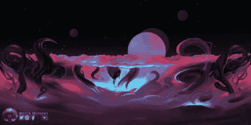

图 4.2 – 原始游戏艺术作品

冒险游戏 2D 艺术资产

要跟随本章内容，请从以下项目 GitHub 下载艺术作品：[`github.com/PacktPublishing/Unity-2022-by-Example/tree/main/ch4/Art-Assets`](https://github.com/PacktPublishing/Unity-2022-by-Example/tree/main/ch4/Art-Assets)

Nica Monami 允许仅用于学习目的使用提供的游戏艺术作品；商业用途是严格禁止的。Nica 的精选作品可以在 ArtStation 上查看，网址为[`www.artstation.com/dnanica213`](https://www.artstation.com/dnanica213)

除了 Sprite Shape——我们将使用它来构建大多数冒险游戏关卡——我们还将介绍**2D 动画包**提供的工具中的大部分。我们首先将介绍导入和为艺术作品进行任何必要的准备工作以开始。

## 导入和准备艺术作品

让我们从创建一个新的 Unity 项目开始，用于冒险游戏，再次使用 2D **通用渲染管线**（**URP**）核心模板。我们将通过将 2D 冒险游戏制作成侧视正交游戏视图（类似于许多其他马里奥兄弟或受《超级马里奥兄弟》启发的平台游戏）来继续探索不同的游戏玩法风格。

项目打开后，将艺术品导入到新的`Assets/Sprites`文件夹下。

忠实的组织提醒

维护一个合理命名的文件夹结构可以帮助保持事物井然有序，便于以后查找和使用。

在项目窗口的**搜索**工具中的**按类型搜索**选项中查看所有导入的精灵资源——以防你丢失了某个资源或同时处理多个资源——可以轻松完成，如下图所示：

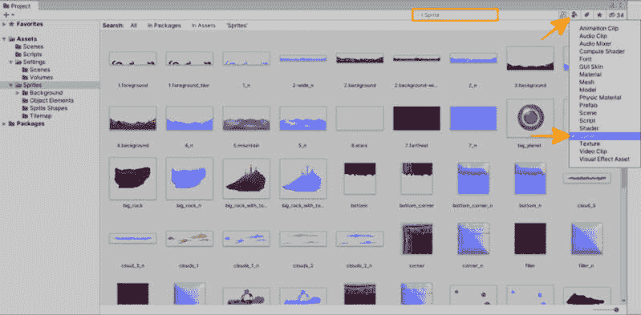

图 4.3 – 在项目窗口中过滤精灵

导入的图像资源将用于不同的目的，并使用额外的精灵工具。以下是本章剩余部分我们将如何按文件夹处理导入资源的快速概述：

+   `Assets/Sprites/Sprite Shapes`: 此文件夹中的图像将与 Unity 的 2D **Sprite Shape**工具一起使用。Sprite Shape 是一个基于样条的工具体，它提供了创建开放路径或封闭形状的能力，这些形状可以用作玩家可以行走的关卡部分，添加背景元素或快速装饰环境。

额外阅读 | Unity 文档

*2D 精灵* *形状:* [`docs.unity3d.com/Packages/com.unity.2d.spriteshape%409.0/manual/index.xhtml`](https://docs.unity3d.com/Packages/com.unity.2d.spriteshape%409.0/manual/index.xhtml)

+   `Assets/Sprites/Sprite Skins`: 此文件夹中的图像将与 Unity 的 2D `SpriteSkin`组件一起使用。

额外阅读 | Unity 文档

*精灵* *皮肤*: [`docs.unity3d.com/Packages/com.unity.2d.animation%409.0/manual/SpriteSkin.xhtml`](https://docs.unity3d.com/Packages/com.unity.2d.animation%409.0/manual/SpriteSkin.xhtml)

+   `Assets/Sprites/Tilemap`: 此文件夹中的图像将被用于创建**瓦片地图**；我们已经在*第一章*中构建收集游戏时熟悉了这一 2D 功能。

+   `Assets/Sprites/Background`: 此文件夹中的图像将被用于创建游戏环境的分层背景。这次我们不会使用任何特定的 Unity 功能，但我们将使用脚本添加视差移动。

背景视差

垂直透视是一种应用于背景图像的技术，它使图像在帧中相对于前景图像以更慢的速度远离相机移动，从而在 2D 场景中创造深度感。这种技术在 20 世纪 80 年代初期的 2D 视频游戏中变得流行（尽管由于当时硬件的限制，背景平面的数量有限 – 幸运的是，我们没有受到前辈的限制，因为我们今天没有这样的限制）。

+   `Assets/Sprites/Background/Clouds`: 该文件夹中的图像将用于创建云朵，这些云朵将在游戏环境的背景中连续滚动并循环，进一步增强深度和沉浸感。我们将使用 Unity 的**Spline**包和相应的**Spline Animate**组件来使这项工作变得快速且简单（类似于之前提到的移动平台）。

+   `Assets/Sprites/Object Elements`: 该文件夹中的图像将用于详细描述环境并提供一些可能的特殊兴趣区域。这里没有特别之处，只是包含 Sprite Renderer 和 2D 碰撞体，以方便与玩家角色进行交互。

在完成对导入资产的基本审查后，让我们在使用之前为需要准备的精灵做一些准备工作。

### 为 Sprite Shape 准备艺术作品

Sprite Shape 功能创建动态且*灵活*的形状，可以是开放路径或封闭并填充的区域。为 Sprite Shape 的样条路径分配的精灵将被沿定义的轮廓平铺和变形。由于平铺，我们需要采取一些特殊步骤来准备这里使用的精灵，即在它将无缝平铺的左右边缘位置添加边框。

参考图*4**.4*，按照以下步骤操作，以确保精灵将与 Sprite Shape 兼容并良好工作：

1.  在项目文件夹中选择精灵。

1.  在**导入设置（检查器）**中，点击**精灵** **编辑器**按钮。

1.  点击图像，并使用绿色框或输入**边框**对话框中的**L**和**R**字段中的值，在精灵的平铺位置上向左和右两侧拖动。完成后点击**应用**。

1.  将**网格类型**设置为**全矩形**（这是使用 Sprite Shape 所必需的，如果未相应设置，将在 Sprite Shape 资产上产生警告）。

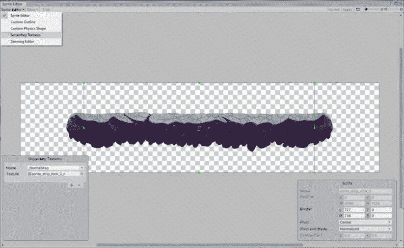

图 4.4 – Sprite Shape 艺术精灵编辑器

包管理器示例

Unity 包管理器中的大多数包在其各自的包管理器页面上都有额外的内容作为附加安装。在 Sprite Shape 的情况下，可以导入展示其许多功能的示例和额外内容。我鼓励您查看包示例以进行额外学习。

### 为 Sprite Skin 准备艺术作品

Sprite Skin 功能通常用于创建有骨架的肢体角色，并且是从分层 Photoshop PSB/PSD 文件（使用**PSD Importer**包）导入的。我们将在*第五章*中使用这个 2D 动画包功能，当我们创建冒险游戏的角色时。不过，现在在这个章节中，我们只是给一些环境元素添加一些动作。

我们将动画导入到`Sprites/Sprite Skins`文件夹中的单个 PNG 图像。除了将这些图像作为单独的图像保留（为了简单起见），我们不需要对导入设置做任何额外操作。

### 准备 Tilemap 的艺术作品

我们在*第二章*中广泛使用了 Tilemap；现在你应该已经非常熟练了！让我们通过创建一个新的 Tile Palette 来快速回顾图像准备过程，这个 Palette 是为导入到`Sprites/Tilemap`的`Tilemap-01`sprite sheet 图像准备的，如图所示：

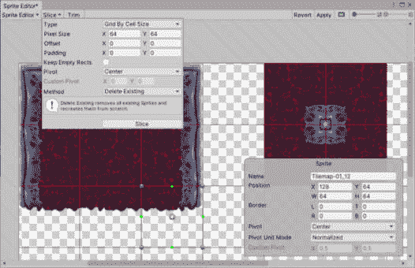

图 4.5 – 为 Tilemap 瓦片切片的 Sprite Sheet

使用以下步骤准备用于 Tilemap 的艺术作品：

1.  在项目文件夹中选择 sprite sheet 图像。

1.  在**导入设置（检查器）**中，将**Sprite 模式**设置为**多个**。

1.  应用更改并点击**Sprite** **编辑器**按钮。

1.  选择**切片**下拉菜单，然后选择**按单元格大小**作为切片的**类型**。

1.  供应的 Tilemap 图像使用 64x64 像素大小的网格（与集合游戏相同），因此请验证正确的大小并点击**切片**。

1.  点击**应用**，或者关闭**Sprite 编辑器**并保存，这就是 Tilemap 准备工作完成！

### 正常贴图

**正常贴图**是一种特殊类型的图像，其中 RGB 通道的编码表示像素的方向。使用精灵的像素和 2D 灯光，很容易添加虚假体积和细节，以实现模拟的 3D 效果。

由于 Unity 不支持创建正常贴图，您需要使用特殊的第三方软件在 Unity 之外创建正常贴图，如图中所示，我们将使用环境中的岩石：

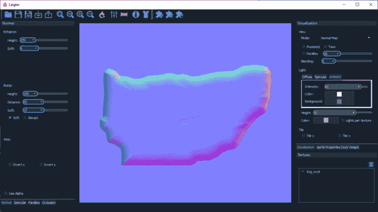

图 4.6 – Laigter 中一块岩石的正常贴图

正常贴图生成软件

创建 2D 冒险游戏艺术作品的全部 2D 精灵正常贴图的程序是 Laigter（可在[`azagaya.itch.io/laigter`](https://azagaya.itch.io/laigter)免费获取）。其他可以导出 2D 正常贴图的程序包括 Photoshop、SpriteIlluminator、Sprite Dlight 和 Sprite Lamp。

注意，当导入 2D 精灵正常贴图时，图像导入设置的**纹理类型**将是**Sprite（2D 和 UI）**，而不是**正常贴图**——因为受 2D 灯光影响的精灵需要在 Sprite 编辑器中分配正常贴图纹理（2D 灯光也需要启用正常贴图以影响精灵）。

示例 2D 冒险游戏项目中的所有图像都附有相应的正常图。对于您自己的图像，请按照以下步骤生成正常图，然后将它们分配给精灵：

1.  在项目文件夹中选择精灵。

1.  点击**精灵编辑器**按钮进入**导入** **设置（检查器）**。

1.  从**精灵编辑器**下拉菜单中选择**次级纹理**。

1.  在打开的**次级纹理**对话框中，从**名称**下拉菜单中选择**_NormalMap**。

1.  通过将精灵的正常图图像从项目窗口拖动到**纹理**字段中，分配精灵的正常图图像。

参考前面的**图 4**.4，了解**次级纹理**对话框的示例。

这样，我们就成功地为项目导入的艺术资产做好了准备，以便在接下来的章节中使用 2D 工具。在下一节中，我们将在使用艺术来创建不同类型的平台之前，再次审视关卡设计。

# 关卡和环境设计 – 引导玩家

在继续介绍我们将用于构建游戏关卡的功能之前，让我们暂时从项目的技术方面抽身，再次讨论一些游戏设计概念。

拥有 GDD 很好，但它不提供任何具体的视觉来传达游戏的主题和风格。艺术可以迅速引发情感反应，并建立难以与 GDD 的书面文字相比的兴奋感。例如，看看为*Outer* *World*游戏创建的概念艺术：

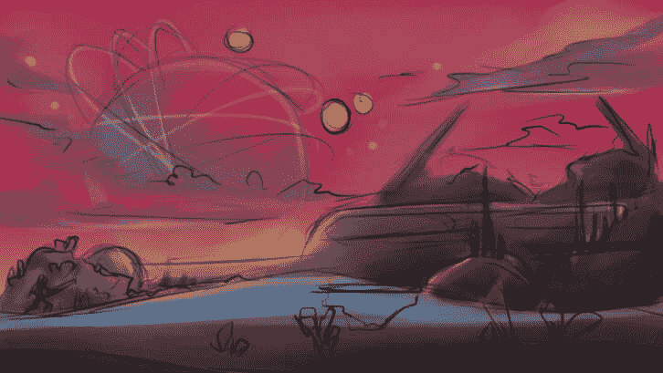

图 4.7 – 原始“外部世界”环境概念艺术

您应该立刻感受到在这个环境中作为玩家的感觉！游戏通常在早期通过艺术家的渲染来营销，以可视化概念，以激发对项目的兴趣和兴奋。它们也被内部使用，以激发制作团队构建产品。

在兴奋的氛围中，让我们介绍一个新的游戏设计原则来引导玩家，并让他们探索这个独特的环境。

## 指引

我们在**第二章**中讨论了引导玩家，通过引入形状来引导玩家走向期望的方向。我们在这里将提出的游戏设计原则是环境中的焦点，这被称为**指引**。指引帮助玩家知道他们应该做什么，或者告诉他们他们的目的地。

我们希望玩家在玩游戏时有明确的目标——玩家几乎不会在游戏中感到迷失（只有当他们长时间没有进步时，引导他们走向正确的方向，以避免玩家感到沮丧或更糟，离开游戏）。这种类型的指引也被称为**旅程**。

在冒险游戏中，我们为玩家设定的旅程可以在以下图中看到，其中在背景的远处可以看到一个栖息地站：

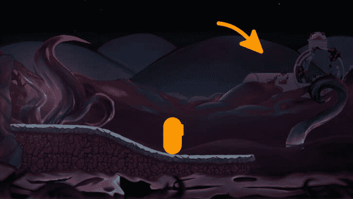

图 4.8 – 为玩家指示栖息地站

现在玩家有一个目标了。始终考虑以目的来设计水平…我们希望玩家尝试做什么，玩家应该完成什么，或者玩家应该到达哪里？

在使用以下章节中我们将介绍的工具设计你的水平时，请记住这些事情，首先是添加玩家将行走的平台。

## 创建平台

没有平台就无法玩平台游戏！Unity 的 2D 工具集提供了不同的工具来构建 2D 游戏的平台。我们已经使用 Tilemap 为收集游戏创建了一个刚性和基于网格的水平设计。虽然我们仍将使用 Tilemap 为冒险游戏水平的一部分，但我们首先将使用 Sprite Shape 创建没有相同约束的平台。

### 创建封闭 Sprite Shape 配置文件

在使用 Sprite Shape 创建时，我们可以使用两种类型的形状：开放形状和封闭形状。开放形状提供了样条路径的精灵轮廓，而封闭形状包括填充纹理，用于创建一个封闭的形状，其中也可以定义两侧和底部精灵。

让我们从创建一个封闭的 Sprite Shape 平台开始，玩家将在其中出生。为此，我们首先在项目中创建 Sprite Shape 配置文件资产，然后按照以下步骤将平台添加到场景中：

1.  在项目窗口中，在`Assets/Sprites/Sprite Shapes`文件夹内，选择**创建** | **2D** | **Sprite Shape Profile**，并将其命名为*Platform* *Closed 1*。

1.  通过首先点击定义**角度范围**的圆形的蓝色边框，为平台的顶部边缘分配精灵。

1.  调整`45`和`-45`。

1.  现在已经定义了顶部边缘的区域，通过从项目窗口拖动并将其拖入`SpriteShapeEdge`占位符，分配`sprite_strip_rock`精灵。

1.  对 Sprite Shape 的左侧和右侧都做同样的处理，分别使用`45`和`135`作为角度，并将`sprite_side_rock`作为精灵，如图所示：

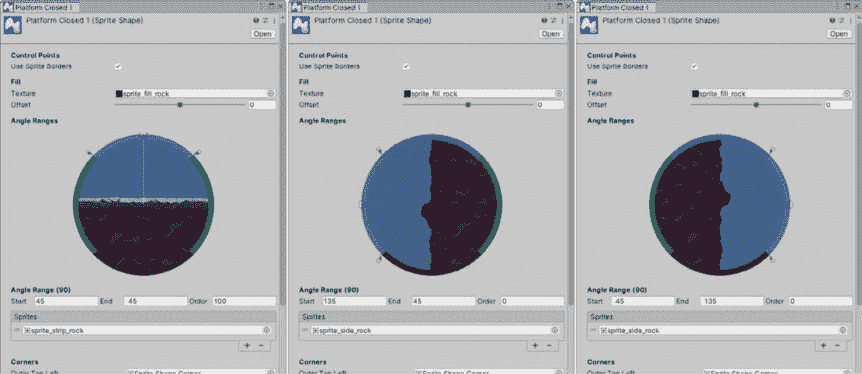

图 4.9 – 关闭的 Sprite Shape 资产属性（顶部、左侧和右侧）

1.  创建封闭 Sprite Shape 的最后一步是为它分配填充纹理，因此将`sprite_fill_rock`精灵分配给**填充** | **纹理**字段（替换**Sprite Shape**填充占位符）。

如果分配的精灵大小不符合你的喜好，你可以重新访问精灵导入设置，并将**每单位像素**的值更改为看起来更好的值（这可以在任何时候进行调整）。用于精灵形状的图像是高分辨率的，因此你可以灵活地更改大小而不会损失显示质量。

1.  同样，我们也可以调整填充纹理的缩放比例，但我们将在这个场景中添加到`SpriteShapeController`组件时进行操作——使用**填充** | **每单位像素**字段来调整填充纹理的缩放比例。

1.  创建了配置文件资产后，我们现在可以通过点击**GameObject** | **2D Object** | **Sprite Shape** | **Closed Shape**来为我们的玩家制作第一个平台。

1.  分配精灵形状资产`SpriteShapeController`组件。通过操纵和添加或删除节点来调整样条形状，如图下所示：

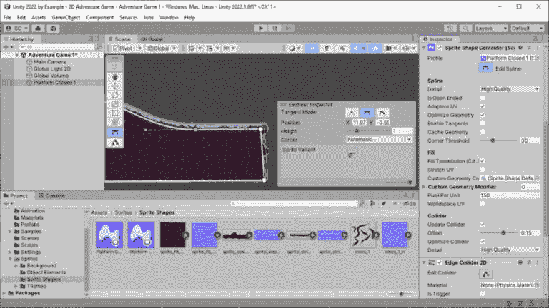

图 4.10 – 场景中的封闭精灵形状平台

要使这个封闭的精灵形状成为玩家角色的可通行平台，最后一步是添加一个碰撞器。对于精灵形状平台，我们使用`edge`。

1.  添加后，选择**精灵形状控制器** | **碰撞器** | **更新碰撞器**来启用它。然后，调整**偏移**值以与顶部边缘精灵对齐——这也可以在玩家角色添加到场景后进行调整。

优化注意事项

默认情况下，精灵形状 API 允许你在运行时更改样条节点。如果你不需要运行时更改，你可以烘焙或缓存样条的几何形状以提高性能。所以，如果你不需要在运行时修改样条，选择**精灵形状控制器**，启用**编辑样条**，然后点击*缓存几何形状*来烘焙网格。否则，从包管理器安装 Burst 包（版本 1.3 或更高）以提高在运行时修改样条时的性能。

另一点需要注意的是，精灵形状的渲染器就像任何其他精灵渲染器组件一样，并使用**排序层**。我们将在整个项目中使用**排序层**来正确分层构成关卡平台和整体环境的各种艺术作品。我们将把所有关卡的平台都放在默认层上，因此我们不需要做任何更改。

奖励活动

精灵形状还可以用于在可更新的样条路径上分布各种精灵。探索精灵形状的功能，了解你如何使用提供的*藤蔓*和*毒素*资产来装饰平台。

现在你已经学会了如何使用精灵形状创建灵活形状的平台，在继续创建关卡中的动态和交互式功能之前，我们将快速回顾设置 Tile Palette 以用于使用地图块绘制平台。

### 地图块

本节将快速回顾使用 Tilemap 在我们的关卡设计中创建平台，因为我们已经对这个主题进行了广泛的介绍*第二章*。

要使用 Tile Palette 绘制地块，请按照以下步骤操作：

1.  通过转到**窗口** | **2D** | **Tile Palette**打开 Tile Palette。

1.  使用默认的矩形网格属性时，选择`Environment`。

1.  点击`Assets/Sprites/Tilemap/Tile Palettes`。

1.  当提示时，从`Asset/Sprites/Tilemap`文件夹中，点击并拖动`Tilemap-01`图像到`Assets/Sprites/Tilemap/Tiles`文件夹。

现在我们已经创建了用于 Tilemap 部分关卡的地块，让我们继续使用以下步骤制作位于 Sprite Shape 平台右侧的平台：

1.  在**层次结构**窗口中，通过使用**创建**或**GameObject**菜单并选择**2D Object** | **Tilemap** | **Rectangular**创建一个新的 Tilemap。

1.  我们将在**Tilemap Renderer**上使用与 Sprite Shape Renderer 相同的**默认**排序层。

1.  使用刷子和填充工具绘制平台，同时使用正确的地块来绘制顶部、侧面、底部和角落，如图下所示：

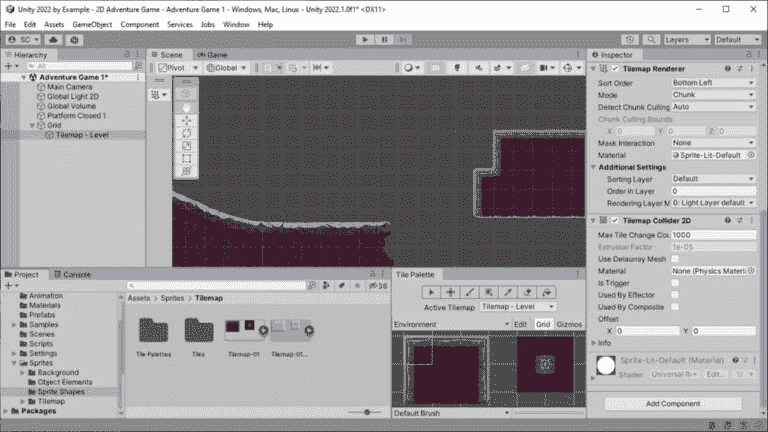

图 4.11 – 添加到场景中的 Tilemap 平台

1.  作为最后一步，将**Tilemap Collider 2D**组件添加到 Tilemap 对象上，以便玩家角色可以行走。

我们现在有两种不同的平台样式可以使用，以在关卡中创建视觉上不同的区域。在下一节中，我们将通过引入运动和用 C#脚本在环境中触发交互，将平台提升到新的水平。

# 移动平台和触发器 – 创建动态交互式环境

将移动平台添加到我们的游戏关卡中增加了视觉兴趣，并为玩家提供了额外的挑战。Unity 再次提供了工具，使得在场景视图中创建移动平台变得简单直接，而且无需编写任何代码。

我们之前使用 Sprite Shape 制作了一个封闭的平台，但 Sprite Shape 还允许创建开放形状，这对于制作一个可以移动的小平台将非常完美。

## 使用 Splines 移动 Sprite Shape 平台

Unity 2022 技术流引入了新的 2D 包，名为`Spline`组件。`Sprite Animate`组件用于沿 spline 路径移动平台，并且无需使用任何代码。太棒了！

Splines

通过让生成的线条通过任意数量的控制点，可以使用样条曲线创建平滑形状。提供硬边和圆角之间调整的插值线条的不同方法可用，例如 Catmull-Rom（有助于计算通过所有控制点的曲线）、贝塞尔曲线（提供手柄以调整线条相对于点的切线）和 B-Splines（类似于 Catmull-Rom 样条曲线，但生成的线条不一定通过控制点）。

Unity 2022 的**Splines**包专门支持线性、Catmull-Rom 和 Bézier 类型。

要在我们的项目中使用样条曲线，我们需要验证该包是否已安装。打开`splines`或找到**Splines**在**包**列表中，选择并安装。

创建移动平台的第一步是创建平台。

### 创建开放的精灵形状配置文件

当我们在*创建一个封闭的精灵形状配置文件*部分创建封闭平台时，我们已经对精灵形状进行了介绍。创建开放的精灵形状甚至更容易！

使用以下几个步骤创建开放的精灵形状配置文件资产：

1.  在项目窗口中，在`Assets/Sprites/Sprite Shapes`文件夹内，选择**创建** | **2D** | **Sprite Shape Profile**并将其命名为*Platform* *Open 1*。

1.  通过从项目窗口拖动`sprite_strip_rock`精灵并将其拖入`SpriteShapeEdge`占位符来分配`sprite_strip_rock`精灵）。

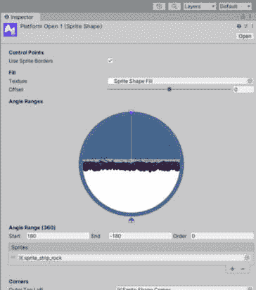

图 4.12 – 开放的精灵形状资产属性

1.  创建了配置文件资产后，现在我们可以通过点击**GameObject** | **2D Object** | **Sprite Shape** | **Open Shape**将第一个开放的精灵形状移动平台添加到场景中。

1.  分配`SpriteShapeController`组件的**配置文件**字段，然后使用场景工具栏覆盖中的**形状**编辑工具制作一个小直平台（如图*图 4**.13 所示）。提示：使用只有两个节点，并将**切线模式**设置为**线性**。

与之前一样，使这个开放的精灵形状成为玩家角色可走的平台所需的最后一步是添加一个碰撞器——我们同样使用`edge`。

1.  一旦添加，请确保**精灵形状控制器** | **碰撞器** | **更新碰撞器**字段已启用，然后调整**偏移**值以与顶部边缘精灵对齐（这可以在任何时候进行调整）。

最后，让我们将移动平台保持在与其他平台相同的排序层上：**默认**。

创建移动平台的下一步是设置它将采取的路径。

### 样条路径

与我们使用样条曲线创建精灵形状平台的方式类似，我们可以使用 Unity 的**Splines**功能工具来创建通用的样条路径，用于任何数量的游戏玩法原因。在这里，我们只是为平台在两点之间移动创建一个路径（可能更多，但我们只创建一个简单的垂直或水平移动平台）。

在 **层级** 窗口中，使用 **创建** 菜单或单击 **游戏对象** | **3D 对象** | **样条** | **绘制样条工具…** 来向场景添加一个新的样条（重命名它或按 *Enter* 键以接受默认值）。是的，样条被认为是 3D 对象，因为样条路径的节点是 Vector3 位置（相对于游戏对象的变换位置，因此它们位于 **局部空间**）。我们将仅使用它们在 2D（*X* 和 *Y* 轴）上为此项目，所以请注意 *Z* 轴的值始终应为零。

使用 `(0, 0, 0)` – **样条** 对象的位置将被设置为点击的位置）。

点击在第一个节点下方一定距离处添加第二个节点，并使用 **精灵检查器** 叠加层将它的 *X* 位置值设置为零，以便节点垂直对齐，如图所示：

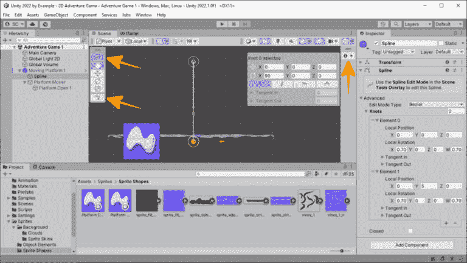

图 4.13 – 使用贝塞尔样条为开放精灵形状平台工作

注意，当选择样条工具时，**样条检查器**叠加层可能会停靠在场景视图的侧面，如图 *4*.13* 所示。您可以在叠加工具栏中单击图标或将它拖入场景视图窗口来操作所选样条节点的属性。

如果需要编辑位置或节点的 **切线模式**，请使用 **样条变换** 工具，并为添加到样条中的节点使用 **绘制样条** 工具（这两个工具都在选择层级中的样条对象时在 **工具栏** 叠加层中可用）。

额外阅读 | Unity 文档 | Unity 2022 新特性

**样条**：[`docs.unity3d.com/Packages/com.unity.splines%401.0/manual/getting-started-with-splines.xhtml`](https://docs.unity3d.com/Packages/com.unity.splines%401.0/manual/getting-started-with-splines.xhtml)

现在是时候让事物动起来了！

### Spline Animate

`Splines` 包提供了覆盖一些常见样条路径用例的附加组件。我们将在这里使用其中之一 – **样条** **动画** 组件。

为了使我们的移动平台不仅易于动画化和操作，而且可以快速轻松地创建预制件，以便在整个关卡中添加额外的移动平台，我们需要做一些整理工作。

目前，我们有一个开放的精灵形状平台对象和一个样条路径对象位于层级结构的根目录。为了使其成为一个可重用的预制件，我们可以在其中对样条路径和平台的位置有最大控制，我们希望最终得到以下对象层级：

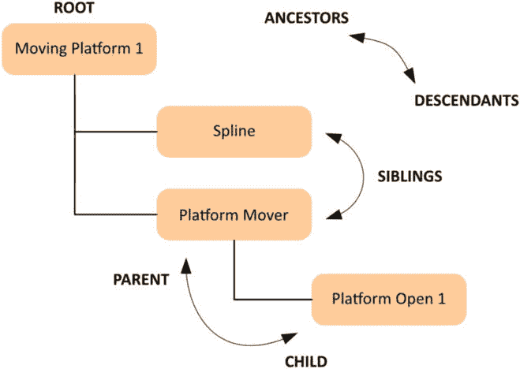

图 4.14 – 层级关系

使用 **层级** 窗口 **创建** 菜单中可用的 **创建空对象** 或 **创建空父对象** 选项来完成此操作 – 空游戏对象是组织或提供操纵对象额外方式的好方法！

只确保样条线和平台对象的变换位置在 (`0`, `0`, `0`)，因为我们应该使用根对象（`Moving Platform 1`）的变换位置来放置平台在关卡中。

创建这种对象层次结构的一部分原因是为了添加我们将要使用 **Sprite Animate** 组件移动的对象 – **Platform Mover** 对象。现在通过选择 **Platform Mover** 并在 **Inspector** 窗口中点击 **Add Component** 来添加 **Sprite Animate** 组件。将 **Spline** 对象分配给 **Spline** 字段，在 **Align To** 字段中选择 **Spline Object**，然后将 **Loop Mode** 设置为 **Ping Pong**（这样平台会在样条线节点之间来回移动）。

使用以下图作为参考，调整 **Duration** 和 **Easing** 到你喜欢的程度。

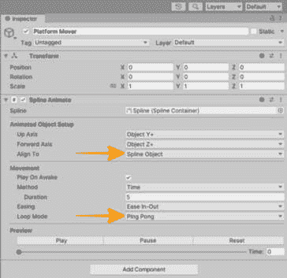

图 4.15 – 使用样条线动画移动平台

就这样！我说过让我们的平台移动起来会很容易……只需要一点设置。你可以在场景视图中预览平台的移动，而无需进入 **Play Mode**。使用 **Play**、**Pause** 和 **Reset** 控制来调整持续时间、缓动类型、样条线节点的位置以及 **Platform Open 1** 的偏移位置，直到你对定位和移动满意为止。

最后，将 `Moving Platform 1` 对象拖到项目窗口中的 `Assets/Prefabs` 文件夹以创建预制资产。

## 在关卡中触发动作

游戏中经常有当玩家移动到特定区域或触摸某物时在环境中触发的交互 – 想想岩石掉落、门打开、警报敌人、开关灯、过渡到场景或任何你的游戏需要的。如果我们利用 Unity 物理引擎，就像我们之前在收集游戏中执行收集物品一样，这很容易添加。

流程如下：

1.  我们首先将对象的精灵添加到游戏关卡中。

1.  在对象周围创建一个碰撞体体积来定义触发区域 – 使用最经济的 2D 碰撞体类型，例如 `CircleCollider2D`。

1.  在碰撞体上启用 **IsTrigger**，这样它就不会与场景中的任何其他对象进行物理交互。

1.  添加一个组件，当玩家进入碰撞体时，当调用 Unity 物理消息 `OnTriggerEnter2D()` 时将触发事件。

我们还将采取一个对设计师友好的方法，在 **Inspector** 窗口中使动作可分配，这样我们就不必为每种触发事件创建自定义脚本。这将使触发事件组件可以在游戏中任何我们希望玩家触发交互的地方重复使用。太好了！

### UnityEvent

我们在这里将使用的委托事件类型是 **UnityEvent** – 我们之前使用过 **UnityAction**。区别在于 **UnityEvent** 是序列化的，并可以在 **Inspector** 中使用来分配公共方法。

额外阅读 | Unity 文档

*UnityEvent*: [`docs.unity3d.com/2022.3/Documentation/ScriptReference/Events.UnityEvent.xhtml`](https://docs.unity3d.com/2022.3/Documentation/ScriptReference/Events.UnityEvent.xhtml)

在 Unity 2022 中，**Inspector**中的**UnityEvent**列表现在可以重新排序了！

让我们通过创建一个名为`TriggeredEvent`的新脚本，并使用以下代码来查看它是如何工作的：

```cs
[RequireComponent(typeof(Collider2D))]
public class TriggeredEvent : MonoBehaviour
{
    [Tooltip("Requires the player character
        to have the 'Player' tag assigned.")]
    public bool IsTriggeredByPlayer = true;
    public UnityEvent OnTriggered;
    private void OnTriggerEnter2D(Collider2D collision)
    {
      if (IsTriggeredByPlayer &&
          !collision.CompareTag(Tags.Player))
              return;
      OnTriggered?.Invoke();
    }
}
```

让我们分解一下，特别是因为有几个值得注意的新项目：

1.  类声明被`RequireComponent`属性装饰。这意味着当`TriggeredEvent`脚本作为组件添加到 GameObject 时，它将要求在 GameObject 上存在指定的类型作为同级组件。如果可能，将添加所需组件。

1.  在我们的情况下，我们只指定了所有 2D 碰撞体继承的基础`Collider2D`类型——这允许我们添加任何类型的碰撞体作为触发事件的触发体积。如果我们尝试将脚本添加到尚未添加 2D 碰撞体的 GameObject，我们将收到以下错误：

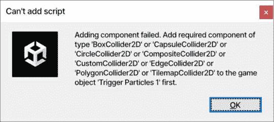

Figure 4.16 – Can’t add script for the required component

解决方案是在添加`TriggeredEvent`脚本之前，将 2D 碰撞体（适用于玩家交互场景）添加到 GameObject 中。对于这个例子，我们添加了一个`CircleCollider2D`，将其放置并调整大小在奇特岩石形成之前，并触发一个粒子系统开始播放（如*图 4**.16*所示）。

1.  接下来是我们在**Inspector**中设置的`IsTriggeredByPlayer`布尔值。在其下方几行将用于确定是否只有玩家可以触发交互。这个字段是可选的，但快速且容易添加，如果，比如说，敌人或其他对象进入碰撞体（在这里考虑所有可能触发环境中的不同事情）。

1.  正如刚才讨论的，`UnityEvent`声明允许我们，作为开发者和设计师，在**Inspector**中添加特定的交互——一个或多个——当触发时会被调用（如*图 4.16*中**Inspector**下较暗灰色**On Triggered ()**部分所示）。16*).

1.  `if`块决定了如果只需要玩家触发事件，我们是否会继续运行触发代码。所以如果`IsTriggeredByPlayer`设置为`true`，条件 AND 运算符(`&&`)将评估碰撞的对象是否被标记为`Player`。如果不是，它将停止执行此方法代码（通过使用`return`语句）。

&& (C#)

条件 AND（**&&**）运算符意味着两个语句在逻辑上都必须等于**true**才能执行块中的代码。请注意，这具有“短路”逻辑，意味着如果第一个表达式评估为**false**，则第二个表达式将不会评估。

这里要注意的另一件事是，`Tags.Player` 将导致编译错误，因为 `Tags` 类型尚未定义（通过红色波浪线下的标识）。现在让我们修复这个问题。我们将通过在 IDE 中右键单击单词 **Tags**（或单击 **Tags** 上的任何位置并按 *Alt* + *Enter*，或 *Ctrl* + *.*，具体取决于您的 IDE）来使用 IDE 内置的重构工具。

在打开的对话框中，选择**重构...** | **生成类型‘标签’** | **在** **新文件**中生成类‘标签’。

优化说明

为了性能原因，你应该始终使用 **CompareTag()** 而不是使用 **==** 操作符来评估 GameObject 的 **.tag** 属性。

创建新文件后，添加一个用于 `Player` 标签字符串的常量，如下所示：

```cs
internal class Tags
{
    // Ensure all tags are spelled correctly!
    public const string Player = "Player";
}
```

注意，这个类不会从 `MonoBehaviour` 继承，因为我们不会将其添加到场景中的 GameObject。它仅在我们需要在代码的任何地方指定对象的标签时使用 - 最小化代码中字符串字面量的使用，避免简单的拼写错误，并提供 CodeLens 引用，以便在代码中使用的地方都能找到。任何需要引用游戏中其他对象标签的时候，只需在这里添加即可。

常量（C#）

声明为常量的变量是一个不可变的值，在整个程序的生命周期中都不会改变（即在编译时已知）。使用公共访问器声明的 **const**（**string**、**int**、**float** 等）对于其他类来说是可用的，无需实例引用 - 类似于静态变量的使用方式。

1.  最后一行调用了在 `OnTriggered?.Invoke();` 中分配的事件（s）- 注意，这里的 `?.`（空条件）操作符是可选的，但我总是包括它以保持代码一致性。

现在，按照以下图所示的设置，当玩家进入碰撞体时，粒子将从岩石中产生！

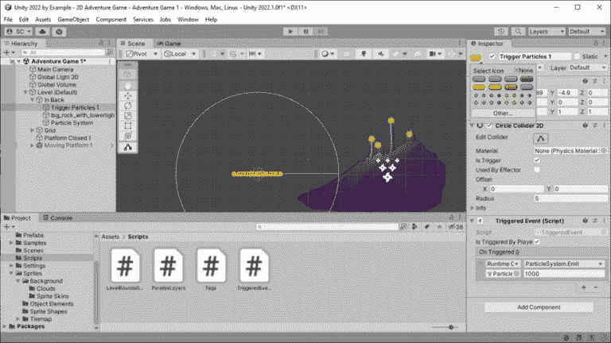

图 4.17 – 带场景视图图标的 TriggerEvent 碰撞体

使用这种可重复使用的触发任何类型事件的组件，现在对于项目中的开发者和设计师来说，通过添加交互变得非常简单！易如反掌！

在本节中，我们现在已经完成了所有用于创建所有可通行平台（包括移动平台）以及关卡中交互性的 2D 功能工具。在下一节中，我们将查看最终完成游戏环境、添加细节和优化绘制调用以获得更好的性能。

# 为我们的环境添加细节以沉浸玩家并优化

使用前几节中介绍的工具和技术，你现在应该探索构建你的关卡设计。为主要的平台使用封闭的精灵形状，为既是静态又是移动的平台使用开放的精灵形状，并在关卡特定区域混合使用瓦片地图平台——所有这些都被用来给玩家在前往我们背景中提供的栖息站点的旅程中提供体验和挑战。

在空白屏幕上的平台相当单调。让我们通过添加背景和一些运动来为关卡添加一些润色。

## 环境润色

现在您的游戏关卡已经很好地定义了（当然，一旦我们添加了玩家角色并开始测试关卡，我们将会进行大量的调整），让我们看看如何完成和润色环境，从添加背景和前景元素开始，以更充分地完善游戏设计——提供沉浸感和为玩家体验设定基调。

### 背景视差效果

如前所述，我们将应用一个相对较旧的 2D 游戏设计技术，即视差，将背景中的分层图像应用于创建深度和沉浸感。我们将使用自定义的 C#脚本来实现这一点，因为 Unity 没有提供专门针对处理此技术的 2D 功能。

让我们从在`Assets/Scripts`文件夹中创建一个新的 C#脚本开始，并将其命名为`ParallaxLayers`。这个脚本将是一个可重用的组件，我们可以用它为任意数量的分层图像添加视差移动。在 2D 冒险游戏中，我们将使用它来处理背景和一些前景元素。

让我们看一下以下代码：

```cs
public class ParallaxLayers : MonoBehaviour
{
    public List<Layer> Layers;
    [System.Serializable]
    public class Layer    // Nested class.
    {
      public Renderer Image;
      [Tooltip("How far away is the image from the
          camera?"), Range(0, 10000)]
      public int Zdepth;
    }
    private Camera _camera;
    private Vector3 _cameraLastScreenPosition;
    private void Awake()
    {
      _camera = Camera.main;
      _cameraLastScreenPosition =
          _camera.transform.position;
    }
    private void LateUpdate()
    {
      if (_camera.transform.position.x ==
          _cameraLastScreenPosition.x)
              return;
      foreach (var item in Layers)
      {
        float parallaxSpeed = 1 – Mathf.Clamp01(
            Mathf.Abs(_camera.transform.position.z
                / item.Zdepth));
        float difference = _camera.transform.position.x
            - _cameraLastScreenPosition.x;
        item.Image.transform.Translate(
            difference * parallaxSpeed * Vector3.right);
      }
      _cameraLastScreenPosition =
          _camera.transform.position;
    }
}
```

让我们逐项分析代码：

1.  声明的第一个公共变量是我们将用于视差层的图像列表，这些图像将根据它们的深度以不同的速度移动（这就是如何实现视差效果；远处的对象看起来比近处的对象移动得慢）。我们使用 C# `List<T>`指定`Layer`作为类型，其中`Layer`是我们声明的自定义类[对象]，用于保存特定图像及其分配给它的深度值，以计算其相对于相机移动的速度。

列表（C#）

**List<T>** 是一个强类型对象的集合，可以通过它提供的方法添加、按索引访问或返回。它还提供了排序和以不同方式操作对象的方法。

附加阅读：https://docs.microsoft.com/en-us/dotnet/api/system.collections.generic.list-1

1.  接下来是`Layer`嵌套类声明，其中包含公共字段`Image`，其类型为`Renderer`（所有精灵、网格、线条、尾迹和粒子都是通过从`Renderer`类派生的组件绘制的），以及`ZDepth`，这是一个表示图像距离相机距离的`int`值。

1.  `ZDepth` 变量声明也装饰了 `Tooltip` 和 `Range` 属性（这些可以在单个 `[]` 语句中以逗号分隔）。`Tooltip` 属性在鼠标悬停在 `Range` 属性的字段标签上时显示指定的消息文本；`Range` 属性将限制字段的有效值在指定的范围内。

额外阅读 | Unity 文档

*属性*：[`docs.unity3d.com/2022.3/Documentation/Manual/Attributes.xhtml`](https://docs.unity3d.com/2022.3/Documentation/Manual/Attributes.xhtml)

1.  `Layer` 类声明本身也装饰了 `System.Serializable` 属性。在 `Layers` 访问器中，类声明不可用，仅此不足以序列化类。

1.  私有的 `_camera` 成员用于缓存主相机引用，因为我们多次从它获取计算值，并且希望这具有高性能。

1.  `LateUpdate()` 在 `Update()` 之后以及内部动画更新处理之后执行。在游戏循环中的所有更新完成后，我们可以使用 `LateUpdate()` 进一步影响这些更新。在这种情况下，我们希望在相机移动之后才移动背景层。

额外阅读 | Unity 文档

*LateUpdate*：[`docs.unity3d.com/2022.3/Documentation/ScriptReference/MonoBehaviour.LateUpdate.xhtml`](https://docs.unity3d.com/2022.3/Documentation/ScriptReference/MonoBehaviour.LateUpdate.xhtml)

**事件函数执行顺序**：[`docs.unity3d.com/2022.3/Documentation/Manual/ExecutionOrder.xhtml`](https://docs.unity3d.com/2022.3/Documentation/Manual/ExecutionOrder.xhtml)

1.  相机是否移动了？通过快速评估 `_cameraLastScreenPosition` 布尔值即可得知——如果没有移动，则不要执行后续操作（使用 `return` 语句）。不要运行不必要的代码！

1.  这就是魔法发生的地方……使用 `foreach` 迭代器，我们将遍历在 **检查器** 中添加的每个 `Layer` 项目，并按照相机移动的距离计算相对距离来移动它：

    ```cs
    foreach (var item in Layers)
    {
    ```

    +   `parallaxSpeed`：我们首先从相机位置获取图像深度的比例（数学运算的顺序），返回绝对值（一个正数），将值限制在 `0` 到 `1` 的范围内，最后从 `1` 减去限制后的值，以获取相机移动的百分比来移动图像：

        ```cs
        float parallaxSpeed = 1 - Mathf.Clamp01(
            Mathf.Abs(_camera.transform.position.z /
                item.ZDepth));
        ```

    +   `difference`：相机从当前位置移动到上次位置的移动距离：

        ```cs
        float difference = _camera.transform.position.x
            - _cameraLastScreenPosition.x;
        ```

    +   `transform.Translate()`：沿 *X* 轴（由于 `Vector3.right`）移动图像，移动距离是相机移动距离乘以速度因子（实际上，接近 `1` 的速度值移动相对相同的距离）：

        ```cs
        item.Image.transform.Translate(
            difference * parallaxSpeed * Vector3.right);
        ```

foreach (C#)

**foreach** 语句遍历一个项目集合，并对每个项目执行其代码块。列表中的每个元素都是声明列表时指定的类型。

关于 C#迭代语句的附加阅读：[`docs.microsoft.com/en-us/dotnet/csharp/language-reference/statements/iteration-statements`](https://docs.microsoft.com/en-us/dotnet/csharp/language-reference/statements/iteration-statements)

1.  在移动后更新保存摄像机最后位置的变量。

整数与浮点除以零

你可能会想，“嘿，等等，Scott，使用**Range**属性，你允许距离为零的值，而为了计算视差速度，我们正在除以距离。所以，如果距离为零，那么不会抛出除以零异常错误吗？”你提出了一个敏锐的观察点；感谢你的提问！如果摄像机的**transform.position.z**值是整数类型，你会是对的。它确实会抛出异常，但它是一个浮点值，所以除以零永远不会抛出异常，因为在 C#中，浮点类型基于 IEEE 754 标准，它允许表示无穷大和**非数字**（**NaN**）的数字。

**附加阅读**：[`docs.microsoft.com/en-us/dotnet/api/system.dividebyzeroexception?view=net-6.0`](https://docs.microsoft.com/en-us/dotnet/api/system.dividebyzeroexception?view=net-6.0)

现在我们已经完成了视差效果脚本，让我们将背景层添加到场景中，并分配字段值。

以下`ZDepth`值为 10,000——这意味着它们看起来是静止的——以及靠近摄像机的图像值小于 1,000——这意味着它们会更靠近摄像机的移动：

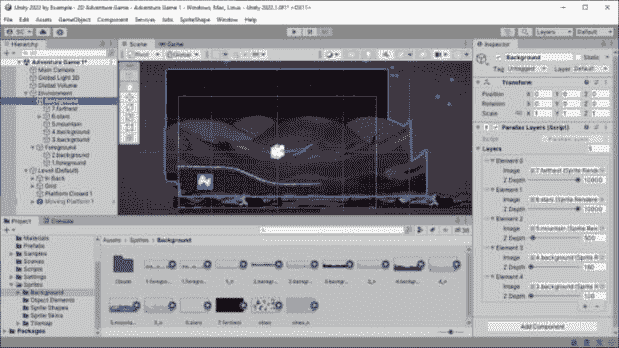

图 4.18 – 分配给检查器的视差背景层

上述图还显示了我们可以用来组织背景层图像（以及使用相同技术的前景图像）的对象层次结构。将`Assets/Sprites/Background`中的背景图像拖到场景中，并将**层次结构**中的对象设置为**背景**空 GameObject 的父对象。

在场景中的对象，你可以定位它们，并使用排序层和层顺序（Sprite Renderer）来设置它们的显示。务必添加一个新的**背景**排序层，并将其放置在**层 0**，这样我们的平台**默认**层就会在背景图像之前绘制。

这更多的是艺术而不是技术，所以可以尝试调整位置和缩放、背景图像顺序等，直到看起来不错！

现在，为每个图像添加`ZDepth`值——为距离更远的图像分配更高的值。

你可以通过输入`ZDepth`值来测试视差效果，以确保它在你的关卡设计范围内工作。

让我们继续用一些在天空中移动的动画云来为环境增添光泽。这再次利用**Spline** **Animate**组件将会非常简单。

### 动画云

在本章的早期部分，你学习了如何使用简单的样条路径和动画组件轻松创建移动平台。我们将采用相同的方法创建两层不同风格的云层，以不同的速度在天空移动。与平台相比，这里唯一的区别是云层将从屏幕外开始，并持续循环，而不是像乒乓球一样来回移动（毕竟，云层通常只在一个方向上穿越天空）。

使用以下步骤创建两层云层在天空中移动：

1.  使用`(90, 0, 0)`将 Spline 对象添加到场景中。

+   将云精灵添加到场景中，并将其与样条一起设置为名为`Clouds 1`的新空 GameObject（你可以添加任意数量的云层，只需按图 4.18 所示增加计数即可）。我们有两个云层，并为`Clouds 2`对象添加了多个云精灵。*   将**Spline Animate**组件添加到云层图像 GameObject 中，并设置以下属性：

    1.  将**层次结构**中的 Spline 对象分配到**样条**字段。

    1.  将**对齐到**设置为**样条对象**。

    1.  将**持续时间**字段设置为使云层在天空中缓慢移动的值 – 确保将此值设置为不同的时间，以便多个云层彼此偏移！

    1.  将**循环模式**设置为**循环连续**，因为我们希望云层在达到左侧的终点节点后，在右侧重新开始动画。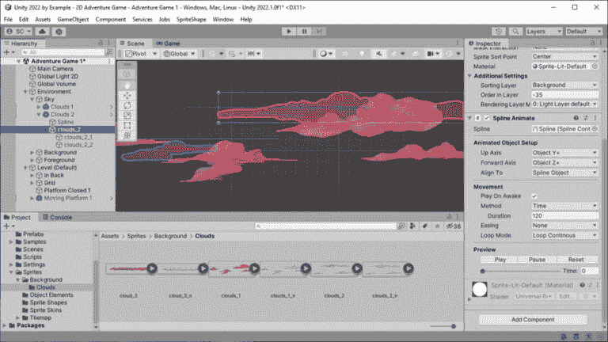

图 4.19 – 动画背景云层设置

这是一种快速简单的方法，可以让环境更加生动。对于接下来我们将介绍的下一个 2D 工具功能，也是如此，用于添加更多细节。

### 带有精灵皮肤的动画环境艺术

现在，让我们设置一些植物实体的藤蔓，使其在背景中以不同的方式摇摆和移动，通过这里不自然的力给玩家一种存在感。

我们已经导入并准备了与`Assets/Sprites/Sprite Skins`文件夹一起使用的艺术作品，并打开**精灵编辑器**。

使用以下步骤创建一个可由一组加权骨骼变形的网格几何体：

1.  从**精灵编辑器**下拉菜单中选择**皮肤编辑器**，并启用**可见性**工具（在**还原**和**应用**旁边的窗口右上角）。

1.  在**骨骼**部分（窗口左侧），选择**创建****骨骼**按钮。

1.  下一个步骤是至关重要的，但在**皮肤编辑器**的工作流程中并不明显 – 双击精灵！

你现在应该有一个尖端带有红色点的光标。通过将骨骼拖动到所需长度来创建骨骼，点击添加新的骨骼，完成时按*Esc*键。参考*图 4.19*了解如何布局骨骼（请注意，使用较少的骨骼同时允许所需的变形会更高效）。

1.  当对骨骼满意时，在 **Geometry** 部分下选择 **Auto Geometry**，然后点击 **Generate For Selected** 按钮：

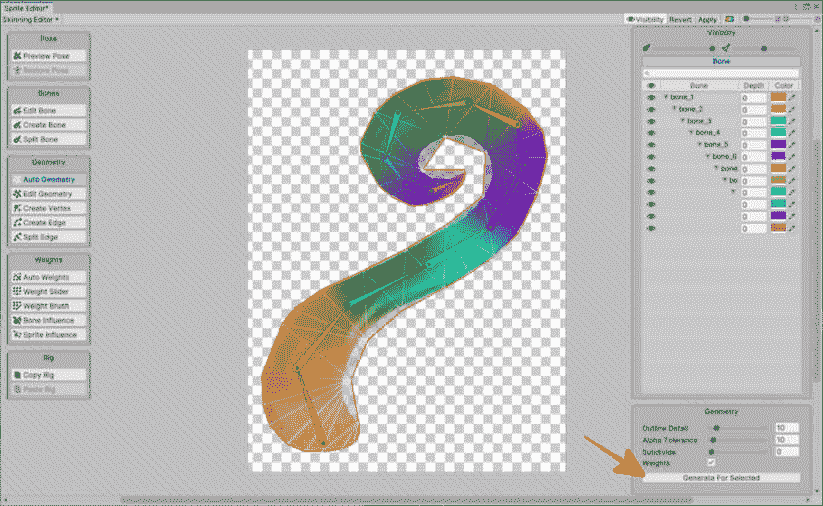

图 4.20 – 使用 Sprite Skinning 动画藤蔓

1.  最后，在 **Weights** 部分下选择 **Auto Weights** 并点击窗口右下角的 **Generate** 按钮。

在这一点上，点击 **Apply** 按钮，我们就创建了我们的第一个 Sprite Skin。耶，准备进行动画！您可以通过在 **Pose** 部分下点击 **Preview Pose** 按钮来在 **Skinning Editor** 中测试变形。

现在我们已经将藤蔓 *绑定*，它就准备好进行动画制作了！

#### 动画 Sprite Skin

现在我们将藤蔓精灵添加到游戏环境中作为背景元素，并准备它进行动画：

1.  将藤蔓精灵拖动到 **Scene Hierarchy** 中，作为您背景图像的一个子项（这样它就会随着背景的视差移动），定位，并相应地设置排序层和图层顺序。

1.  当精灵被选中时，在 `skin` 中。

1.  在 **Sprite Skin** 组件中，点击 **Create Bones** 按钮。

现在我们需要给藤蔓添加动画。当藤蔓被选中时，打开名为 `Vine 1 Idle` 的 `.anim` 文件并将其保存到 `Assets/Animation` 文件夹中。现在，请戴上你的动画师帽子……因为现在是时候进行动画制作了！

以 *图 4.20* 为参考，通过点击红色记录按钮（**Animation** 窗口），每当您旋转或定位骨骼（使用我们操纵任何对象的相同变换工具）时，都会在 **Animation** 时间轴上记录一个关键帧。在时间轴上刮擦并重复此过程以获得藤蔓所需的运动。

再次强调，这更多的是艺术而非技术，需要一些尝试和错误。随着练习，这会变得更加直观，并且更快地实现良好的效果。使用回放控件并相应调整——你做到了！

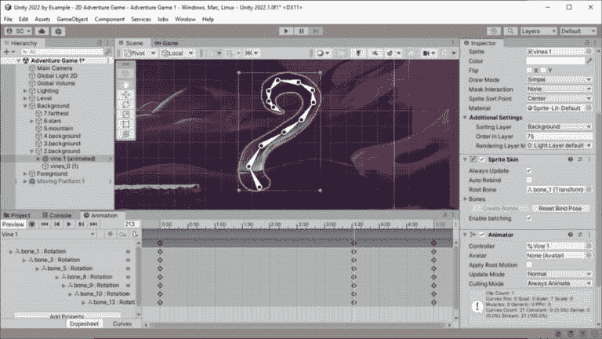

图 4.21 – 使用关键帧骨骼旋转动画藤蔓

额外阅读 | Unity 文档

*动画*：[`docs.unity3d.com/2022.3/Documentation/Manual/AnimationSection.xhtml`](https://docs.unity3d.com/2022.3/Documentation/Manual/AnimationSection.xhtml)

从这本书的静态图片中，您无法真正感受到这些藤蔓在动画中的恐怖样子！进入 **Play Mode** 亲自体验您自己的关卡设计，或者确保检查完成的项目代码或从 GitHub 仓库在线玩游戏。

让我们看看如何保持藤蔓动画在游戏中的性能。

#### Sprite Skin 性能

作为使用 Sprite Skin 提高动画性能的最后一步，安装 **Burst** 和 **Collections** 包以启用 **变形批处理**：

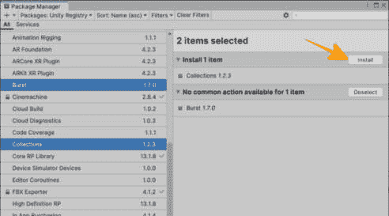

图 4.22 – 为优化安装 Burst 和 Collections

在继续性能优化主题之前，在我们开始导入并设置游戏中的玩家角色和敌人之前，让我们看看如何优化精灵绘制调用，以帮助保持我们的帧率不会下降到不可接受的水平。

## 优化绘制调用

我们可以做出的最具影响力的性能优化是解决绘制调用。这在*第二章*的“导入精灵”部分中简要讨论过，当时我们创建了一个**精灵图集**。不出所料，我们现在将做同样的事情。

### 精灵图集

使用`Assets/Sprites`文件夹，然后选择`Sprite Atlas`。请注意，我们不会添加任何 2D 精灵法线贴图，因为它们将以与**精灵编辑器**相同的方式在精灵图集中内部处理。

将`Assets/Sprites`文件夹中的单个精灵图像分配到`Assets/Sprites/Background` `Normal Maps`）。

当图像太多无法放入单个纹理中时，精灵图集将创建额外的纹理，并在**预览**窗口的标题栏中使用带有**#0**标签的下拉指示器来指示。在某些情况下（例如，较大的游戏），可能需要使用多个精灵图集，您将在运行时确定绑定哪个。

注意：出于兼容性原因，在使用**精灵形状**时，我们必须确保禁用**允许旋转**和**紧密包装**。

额外阅读 | Unity 文档

*精灵* *图集*：[`docs.unity3d.com/2022.3/Documentation/Manual/class-SpriteAtlas.xhtml`](https://docs.unity3d.com/2022.3/Documentation/Manual/class-SpriteAtlas.xhtml)

在本节中，我们通过添加透视背景效果和动画元素来润色了*外世界* 2D 冒险游戏的外观。然后，我们通过减少精灵绘制调用来保持游戏性能。

下载完成的游戏代码

记住，本书的示例代码可以从 GitHub 仓库在此处下载：[`github.com/PacktPublishing/Unity-2022-by-Example`](https://github.com/PacktPublishing/Unity-2022-by-Example)

# 摘要

本章首先介绍了游戏、关卡和环境设计，通过引入新的元素来扩展 GDD 的范围，以涵盖更大范围的冒险游戏，导入并准备用于 Unity 2D 功能的艺术作品，并引入一个新的关卡设计原则来引导玩家达到目标。

我们通过创建静态和移动平台来继续导入的艺术作品，以挑战玩家在他们的旅程中的表现。然后，我们通过设置透视背景和动画环境元素，让玩家沉浸在游戏世界中。

最后，我们使用精灵图集优化了定义所有关卡和环境元素的精灵的绘制调用。

在下一章中，我们将使用 PSD 导入器导入一个角色绑定，从而快速设置玩家角色以进行动画制作。我们还将学习如何通过实现 Unity 2022 新增的功能，以优化的方式添加一个能够发射弹体的玩家武器，并开始介绍玩家在前往栖息地站点的旅途中需要抵御的敌人角色。
