# 5

# 继续冒险游戏

在*第四章*中，我们通过扩展游戏的设计文档（**GDD**）来覆盖冒险游戏更广泛的范围，同时探索关卡和环境设计，并考虑新的原则来引导玩家。我们还导入并准备了艺术作品，以便与将游戏带入生命的额外 2D 工具一起使用。

我们还在关卡设计中探索并添加了移动平台和交互元素，通过在分层背景上的视差效果沉浸玩家，并优化精灵绘制调用以保持性能。

在游戏关卡和环境建立之后，我们现在可以继续使用 2D 动画包创建我们的玩家角色。

在本章中，我们将涵盖以下主要主题：

+   使用 PSD 导入器设置玩家角色

+   使用输入动作图

+   使用玩家控制器脚本移动玩家

+   使用 Mecanim 进行角色动画

到本章结束时，您将能够设置一个 2D 基于精灵的、为动画而设置的、由玩家输入驱动的角色。您还将能够为玩家的当前状态分配和切换所需的动画。

# 技术要求

要跟随本章内容并使用本书项目中创建的相同艺术作品，请从以下 GitHub 链接下载冒险游戏 2D 艺术资源：[`github.com/PacktPublishing/Unity-2022-by-Example/tree/main/ch5/Art-Assets`](https://github.com/PacktPublishing/Unity-2022-by-Example/tree/main/ch5/Art-Assets)。

要使用自己的艺术作品进行跟随，您需要使用 Adobe Photoshop 创建类似的艺术作品，或者使用可以导出分层 PSD/PSB 文件的图形程序（例如 Gimp、MediBang Paint、Krita 和 Affinity Photo）。

您可以从 GitHub 下载完整的项目，链接为[`github.com/PacktPublishing/Unity-2022-by-Example`](https://github.com/PacktPublishing/Unity-2022-by-Example)。

# 使用 PSD 导入器设置玩家角色

为 2D 冒险游戏创建我们的玩家角色将是一个多步骤的过程。在本节中，我们将介绍制作由玩家控制的动画 2D 角色所需的全部步骤。

我们将从导入艺术作品的设置开始，并设置允许我们进行动画的玩家角色骨骼。在导入艺术作品和资产的过程中，您将多次重复这些操作。**PSD 导入器**是一个资产导入器，它可以与多层的 PSB/PSD 文件一起工作，根据源图层创建基于源图层的精灵 Prefab。

导入选项允许 Unity 生成精灵图集和角色骨架，根据精灵的原始位置和图层顺序排列精灵，显著简化了基于精灵的动画角色的创建。

让我们继续导入玩家角色的艺术作品。在这里，我们将设置源文件，使其使用 PSD 导入器创建演员（基于多层 Photoshop 文件创建的预制件称为**演员**）：

1.  在`Assets/Sprites/Character`目录中创建一个新的文件夹。

1.  将`PlayerCharacter1.psd`导入到新创建的文件夹中。

1.  选择导入的文件，在**检查器**窗口中，在下拉列表中将**导入器**更改为**UnityEditor.U2D.PSD.PSDImporter**。

**PSD 导入器**提供了两个新选项，一旦选择为导入器，就会作为标签出现：

+   **设置**：这是您将设置文件导入属性的地方。**设置**下的字段与默认纹理导入器类似，增加了**层导入**（当**纹理类型**设置为**多个**）和**角色****绑定**部分

+   **层管理**：这是您可以自定义从 Photoshop 文件中导入哪些层的部分

使用默认的导入设置，我们已经处于良好的状态，可以继续进行玩家角色设置，因为我们将会使用所有层。导入器将保留 Photoshop 中的层位置和排序顺序，以便我们的角色精灵能够正确地排列在我们的演员上。

我们不需要在 Unity 中从构成角色的单个精灵中重新创建玩家角色——手臂、躯干、腿部、头部等等。因此，我们准备好进行下一步——通过添加骨骼来绑定角色。

额外阅读 | Unity 文档

准备和导入艺术作品：[`docs.unity3d.com/Packages/com.unity.2d.animation@9.0/manual/PreparingArtwork.xhtml`](https://docs.unity3d.com/Packages/com.unity.2d.animation@9.0/manual/PreparingArtwork.xhtml).

PSD 导入器检查器属性：[`docs.unity3d.com/Packages/com.unity.2d.psdimporter@8.0/manual/PSD-importer-properties.xhtml`](https://docs.unity3d.com/Packages/com.unity.2d.psdimporter@8.0/manual/PSD-importer-properties.xhtml).

## 绑定演员

在**项目**窗口中仍然选中演员（玩家角色 PSD 文件）的情况下，在**检查器**窗口中点击**打开精灵编辑器**按钮。默认视图是代表我们的 Photoshop 层的切片精灵形状。

别担心——正如我说的，我们不需要以分解的方式处理我们的角色，就像*图 5**.1*所示。:

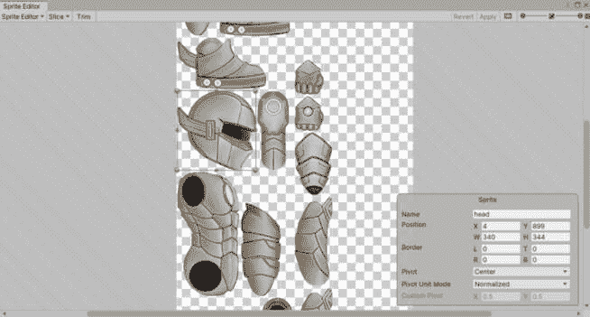

图 5.1 – 演员精灵图

如果艺术作品以代表 Photoshop 层的单独精灵显示，那么我们需要切换到**精灵皮肤编辑器**（2D 动画包的一部分），在那里我们将继续设置演员的动画绑定。

从**精灵编辑器**下拉菜单中选择**皮肤编辑器**——精灵现在应该代表角色，正如原始 Photoshop 源文件中看到的那样。太棒了！

设置演员以进行动画的整个工作流程看起来像这样：

1.  **创建一个骨架**：由单个骨骼组成的骨骼结构。

1.  **生成网格几何形状**：这将影响精灵的位置、旋转，以及可选的变形。

1.  **调整骨骼影响**：更改精灵的属性以指定哪些骨骼或骨骼影响它。

1.  **调整权重**：骨骼或骨骼对给定精灵（整个精灵或只是部分）的影响程度。

1.  **预览姿势**：测试，测试，再测试关于骨架和精灵骨骼、几何形状和权重分配，直到在移动或旋转骨骼时一切看起来和工作正常；这是一个循环过程。

1.  **反向运动学**（**IK**）：您可以将 IK 应用于一系列骨骼，以自动计算位置和旋转，这使得动画演员的肢体变得容易得多。

附加阅读 | 反向运动学（IK）

IK 是一种在计算机动画和机器人技术中使用的技巧，用于控制肢体位置和方向。它计算放置末端执行器在给定位置和方向所需的关节角度——例如手和脚这样的末端。这对于创建自然和逼真的人类动作非常有用，尤其是对于复杂的姿势。

您可以在[`docs.unity3d.com/Manual/InverseKinematics.xhtml`](https://docs.unity3d.com/Manual/InverseKinematics.xhtml)了解更多信息。

1.  **动画**：为演员的不同游戏状态创建动画，例如空闲、行走、跳跃和攻击。

游戏开发是一种多学科工艺，结合了技术和艺术技能。通过创建具有单个骨骼的骨架来影响单个精灵，结合了这两种技能集。幸运的是，绑定过程是非破坏性的，因此我们可以在任何时间返回并调整任何看起来工作不正常或看起来不正确的部分。

我们在创建骨架时将遵循的一般创建过程是从骨盆骨开始——这个骨骼将代表角色的**真实中心**。移动或旋转这个骨骼将影响骨架中的所有子骨骼，移动整个演员。

我们将要创建的第一个骨骼可以在*图 5*.2*中看到，它是位于角色骨盆区域向上指的小红色骨骼。在骨骼层次结构中（如图`bone_1`所示），它是根骨骼。

让我们创建我们的骨骼！按照以下步骤开发整个角色骨架：

1.  我们应该已经在**皮肤编辑器**中；如果不是，从**精灵****编辑器**下拉菜单中选择它。

1.  要查看正在创建的骨骼的层次结构（或管理您正在使用的精灵的可见性），请切换到**可见性**面板（窗口右上角，紧邻**还原**和**应用**）。

1.  现在，在**骨骼**部分（窗口的左侧），选择**创建骨骼**按钮——您的光标现在应该在尖端有一个红色圆点。

1.  从角色的骨盆开始，点击以开始创建根骨骼。在第一次点击点稍上方再次点击以创建一个小红色根骨骼——参见图 5.2.2 以了解大致大小和方向。

1.  通过再次点击来创建一个代表躯干下半部分的骨骼（黄色骨骼）和再次创建一个代表躯干上半部分的骨骼（绿色骨骼）；这将使我们能够弯曲角色的躯干（例如，向前或向后弯曲）。

1.  沿着脊柱向上移动，创建两个额外的骨骼——一个用于脖子的细小骨骼和另一个用于头部的骨骼（参见图 5.2.2）。

1.  右键点击或按*Esc*键停止创建骨骼。

我们的角色现在有了脊柱（如果你能原谅这个双关语）。创建肢体将遵循类似的过程，但创建肢体骨骼的关键区别是首先选择将作为肢体骨骼父级的骨骼。按照以下步骤操作：

1.  在仍然选择**创建骨骼**的情况下，点击上胸骨（绿色）。你现在应该看到一个半透明的骨骼从刚刚点击的骨骼延伸出来（这表示父级关系；你也可以在**可见性**窗口的**骨骼** **层次结构**视图中看到这一点）。

1.  我们将首先为角色的左臂（躯干后面的手臂）创建一个肢体，因此点击左肩关节应该放置骨骼的位置开始创建骨骼。

1.  注意，为了使放置在其他精灵后面的精灵更容易放置骨骼，你可以使用**可见性**面板关闭前面精灵的可见性。

1.  继续点击以创建上臂、下臂和手的骨骼（参见图 5.2.2）。

1.  右键点击或按*Esc*键停止创建骨骼。

1.  通过再次选择父骨骼来继续创建右臂和其他两条腿的其他肢体骨骼——对于腿，将父级设置为骨盆骨（我们从它开始创建绑定的红色根骨骼）。

你的角色的整个骨骼绑定应该看起来与图 5.2.2 中显示的绑定相似：

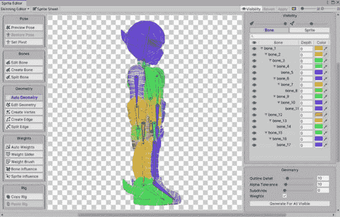

图 5.2 – 角色绑定和带权重的自动几何

如果你希望将骨骼命名得更有意义——以便于你更容易知道你正在处理哪块骨骼——你可以在使用 `bone_14` 到 `foot_right` 时轻松地重命名它们（注意，这个动作并不明显）。

创建绑定只是制作一个完全可动画角色的第一步。让我们通过将精灵的网格几何形状分配给绑定的骨骼来继续下一步——随着你继续与绑定工作，了解骨骼影响的精灵网格几何形状将与骨骼颜色相同可能会有所帮助。

## 生成精灵网格几何形状

执行以下步骤以创建精灵网格几何形状并应用默认骨骼权重，这将影响我们将要开始的精灵：

1.  首先，在棋盘格区域双击以取消选择所有精灵（请注意，这个动作并不明显）。

1.  在**几何形状**部分下选择**自动几何**按钮（窗口的左侧）。

1.  在窗口底部右侧的**几何**面板中，确保**权重**已启用；这将自动生成骨骼权重，与网格几何形状一起，节省了一步。

1.  最后，点击**为所有可见对象生成**按钮。

额外阅读 | Unity 文档

2D 动画 | 编辑工具和快捷键：[`docs.unity3d.com/Packages/com.unity.2d.animation@9.0/manual/SkinEdToolsShortcuts.xhtml`](https://docs.unity3d.com/Packages/com.unity.2d.animation@9.0/manual/SkinEdToolsShortcuts.xhtml)。

在几何图形上点击**为所有可见对象生成**按钮后，所有精灵都将从关联的骨骼中获取颜色。你会注意到它看起来不像*图 5.2*中看到的实色，因为生成的权重分布在相邻骨骼上；相反，着色将是相邻骨骼颜色的渐变。

这是因为重叠的精灵和 Unity 希望在骨骼之间混合精灵变形，这在某些情况下是期望的。我们将在*编辑精灵骨骼权重*部分中稍后解决此问题，针对胸和颈的精灵。对于其余的精灵，我们只想让一个骨骼影响一个精灵（用实色表示）来表示这个特定的角色。

我们将通过调整每个精灵的骨骼影响来解决这个问题。

## 调整骨骼影响

我们将要遵循的过程是在精灵的**骨影响**属性中移除或设置骨骼。这将确保我们的角色精灵在仅通过分配单个骨骼定位或旋转时不会变形或扭曲。

对于不同风格的字符，我们可能非常希望单个精灵被多个骨骼变形（正如我们将在胸和颈上做的那样），但这里构建的风格角色不是这样。

执行以下步骤以为所有精灵（再次，除了胸和颈）分配正确的骨骼影响：

1.  在**权重**部分下选择**骨影响**按钮（窗口的左侧）。

1.  双击一个精灵。例如，在*图 5.3*中，我们将双击右脚的*翅膀*。

    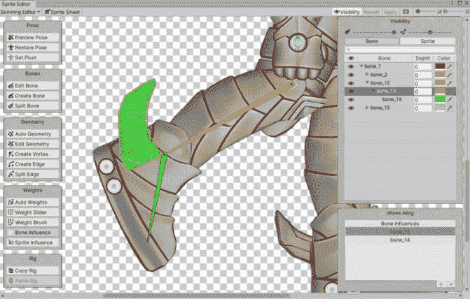

1.  由于我们只想让一个骨骼影响精灵，我们将在列表中选择`bone_13`（黄色骨骼），然后点击列表下方的小标签上的减号（**-**）按钮来删除它。

    精灵将变成与剩余分配的骨骼相同的颜色，在这个例子中是绿色，如*图 5.3*所示：

窗口右下角的面板现在将显示所选精灵及其影响的骨骼。

图 5.3 – 骨影响编辑

注意，如果有多个骨骼需要删除，你可以在点击的同时按住*Ctrl*/*Cmd*键，然后点击减号（**-**）按钮来选择多个骨骼。

这个工作流程是分配单个骨骼到精灵。接下来，我们将学习如何使用多个骨骼来影响精灵的变形。

## 编辑精灵骨骼权重

我们将使用两个权重工具来分配骨骼并调整每个骨骼对精灵的权重影响：**权重滑块**和**权重笔刷**。

我们将从**权重滑块**开始调整骨骼的整体影响，然后使用**权重笔刷**进行任何精细调整。

**自动权重**生成可能已经做得很好，但让我们检查结果并进行一些调整，从颈部精灵开始：

1.  双击颈部精灵（请注意，您可以使用鼠标滚轮放大精灵以进行操作）。

1.  **自动权重**为具有对颈部精灵影响的三个骨骼分配了权重，因此这个精灵应该有一个颜色渐变来表示三个骨骼的颜色：上躯干（绿色）、颈部（青色）和头部骨骼（蓝色）（见*图 5.4*）。

1.  在**权重**部分下选择**权重滑块**按钮（窗口的左侧）。

1.  在窗口右下角的**权重滑块**面板中，您现在可以调整所选骨骼对精灵的影响量；将**数量**滑块向左或向右拖动以增加或减少影响。

1.  通过旋转骨骼来预览权重变化的效果，以查看网格如何通过旋转骨骼变形：

    您可以通过简单地点击并拖动骨骼来旋转和移动它们（鼠标光标将显示旋转或移动图标，具体取决于您在骨骼上的悬停位置）。调整**权重滑块**的数值，直到得到整体令人满意的结果——这个操作更多的是艺术性的，而不是技术性的：

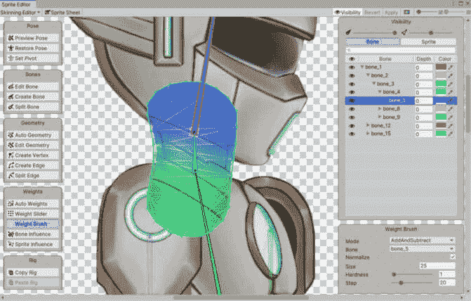

图 5.4 – 使用权重笔刷编辑权重

您可能会发现仅使用**权重滑块**难以获得良好的结果。在这种情况下，继续使用**权重笔刷**对任何问题区域进行精细调整，以调整骨骼的影响。

1.  在精灵仍然被选中的情况下，在窗口左侧的**权重**部分下选择**权重笔刷**按钮。

1.  点击您想要绘制权重的骨骼。

1.  您现在可以在窗口右下角的**权重笔刷**面板中调整**权重笔刷**的属性，或者开始绘制权重。当您绘制时，精灵网格几何形状将实时更新。

1.  通过将鼠标悬停在骨骼上以显示旋转图标来继续旋转骨骼。然后，点击并拖动以旋转骨骼以测试权重绘制并调整它，直到您达到期望的结果。

注意，您可以使用*Ctrl*/*Cmd* + *Z*撤销骨骼旋转。如果您已经进行了许多骨骼旋转并且不确定应用了多少影响，那么您可以使用**姿态**部分下的**重置姿态**按钮（窗口的左上角）重新开始。

继续重复此过程为演员的躯干。一旦完成躯干，这可能是考虑保存您的工作的绝佳时机。使用右侧工具栏上的**应用**按钮。

当你对骨骼权重相对满意并想看看事情进展如何时，你可以进行一些姿势测试！进行一些姿势测试可以让你测试运动范围并查看精灵是否仅与影响精灵权重的正确骨骼相关联，而不产生不希望的扭曲。这为你提供了关于角色在动画中可能看起来如何的第一个提示。

*图 5**.5*表示演员的一个测试姿势示例：

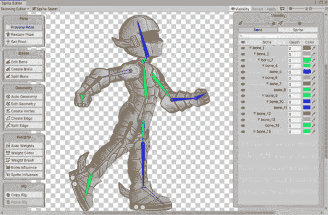

图 5.5 – 演员的姿势测试

能够摆出我们的角色姿势是很好的，但对于肢体来说，特别是通过单独旋转所有骨骼来获得良好的结果可能既耗时又具有挑战性。幸运的是，有一种更好的方法——使用**IK**。

## 设置反向运动学（IK）

我们现在已经完成了与**皮肤编辑器**的工作，并将继续在场景中与演员一起工作以添加 IK。因此，让我们从演员创建一个 Prefab 作为我们的玩家角色：

1.  将`PlayerCharacter1`资产从**项目**窗口拖动到**层次结构**窗口或**场景**视图（可选，您可以创建一个新的空场景进行工作）。

1.  将演员附加到一个新的空 GameObject 上，并将其命名为`Player`。

1.  然后，将 GameObject 拖动到`Assets/Prefabs`文件夹中创建 Prefab。

由于我们将使用 IK 设置来定位演员进行动画，因此我们希望更改演员的 rig，以便更好地摆姿势——特别是腿部。我们可以在最初创建演员的 rig 时这样做，但在实现 IK 时展示这种更改的原因更容易，并且这表明我们可以在任何时间返回并修改骨骼结构，并在必要时进行纠正。

接下来，我们将使用与创建演员完整骨骼 rig 相同的**创建骨骼**工作流程在 rig 中添加一个新的根骨骼：

1.  在演员的脚部开始一个新的骨骼，并将其命名为`root_bone`。

1.  将颜色更改为灰色（仅作为提示，表示没有精灵受到其影响）。

1.  现在，点击并拖动现有的 rig（`bone_1`）以将其父级设置为新的根骨骼，如图*图 5**.6*所示：

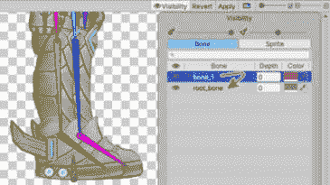

图 5.6 – 为 IK 添加 root_bone 以及父级现有 rig

对我耐心一点——当我们为腿部添加**IK 肢体求解器**时，所有这些都会变得有道理。

### 添加 IK 求解器

我们将为手臂和腿部创建 IK 约束肢体，从演员前面的右臂（演员前面的手臂）开始。

首先，让我们添加充当我们的 IK 效应器（IK 求解器解决的变换）的 GameObject，并与肢体求解器的目标协同工作：

1.  选择角色躯干前手臂的尺骨——在我的例子中是`bone_7`。

1.  在**检查器**窗口中右键单击它，然后单击**创建空对象**以添加子 GameObject——这将使新对象成为手骨的兄弟对象。

1.  将其重命名为`IK Effector`，然后将其放置在前臂骨的尖端。

1.  使用位置工具 gizmo 的红箭头，将其向下拖动，稍微超出手部。将效应器放置在精灵之外将使它们更明显，更容易点击来操作（这一步完全是个人偏好；你也可以将其留在前臂骨的尖端）。

1.  对其他手臂（演员后面的手臂）和两条腿重复这些步骤。

1.  在我们的效应器就位后，将`IK Manager 2D`组件添加到根骨上，并通过在选项卡中单击加号（**+**）按钮并选择**肢体**来开始为肢体添加**IK 求解器**。

我们进行这个选择是因为它专门用于摆姿势的关节，特别是手臂和腿部的关节（也称为**双骨求解器**）。

额外阅读 | Unity 文档

IK 求解器：[`docs.unity3d.com/Packages/com.unity.2d.animation@9.0/manual/2DIK.xhtml#ik-solvers`](https://docs.unity3d.com/Packages/com.unity.2d.animation@9.0/manual/2DIK.xhtml#ik-solvers)。

添加了`LimbSolver2D`组件。

执行以下步骤以完成前手臂的 IK 肢体设置：

1.  将`New LimbSovler2D`重命名为`Front Arm LimbSolver2D`并保持选中状态，以便在**检查器**窗口中可见`LimbSolver2D`组件。

1.  点击并拖动前臂的`IK Effector`对象到`LimbSolver2D`组件。

1.  一旦这个用于肢体求解器的`_Target`子 GameObject 现在可以在**场景视图**中操纵其位置来摆姿势肢体。

1.  点击并拖动现在出现在**场景视图**中**目标**变换上的圆形图标来测试 IK 肢体。

1.  注意，**翻转**的默认值是禁用的，这可能对目标的创建方式工作得很好，但如果你在拖动目标时肢体向后弯曲，则启用**翻转**以解决这个问题。

*图 5**.7*展示了这些步骤的结果：

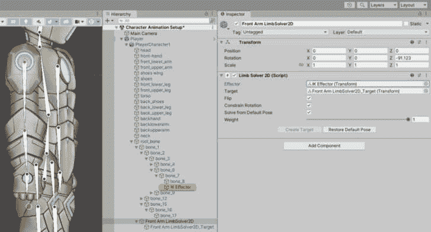

图 5.7 – IK 效应器和肢体求解器设置

在动画过程中，`Front Arm LimbSolver2D_Target`对象的变换位置是关键帧。

重要提示

一旦设置了 IK 求解器，我们就不能再使用**PSD 导入器**设置中的**每单位像素**值来缩放玩家角色——这是由于 IK 目标基于变换局部位置，当精灵的 PPU 缩放时，它们不会更新。相反，更改父对象**PlayerCharacter1**上的变换缩放。

现在你可以在需要为蒙皮演员骨架创建 IK 肢体时遵循这些步骤。现在就为后手臂和两条腿创建 IK 肢体。有了这些，我们就准备好动画了！

提醒

不要忘记将更改应用到**Player** Prefab！

其他资源 | 2D 角色

另一个在创建有骨架和动画的 2D 角色时取得先机的选项是使用 Unity 在 Asset Store 上提供的现有示例角色，这些角色来自 Dagon Crashers 或 Lost Crypt 样本项目：

Dragon Crashers：[`assetstore.unity.com/packages/essentials/tutorial-projects/dragon-crashers-2d-sample-project-190721`](https://assetstore.unity.com/packages/essentials/tutorial-projects/dragon-crashers-2d-sample-project-190721).

失落的密室：[`assetstore.unity.com/packages/essentials/tutorial-projects/lost-crypt-2d-sample-project-158673`](https://assetstore.unity.com/packages/essentials/tutorial-projects/lost-crypt-2d-sample-project-158673).

## 创建演员动画

**演员动画**是将演员的骨骼在不同时间在**动画**窗口的时间轴上重新定位或旋转的过程，这被记录为关键帧，并包含变换数据。在*第四章*中，当我们对藤蔓进行动画制作时，我们执行了这个过程的简化版本。

让我们开始对演员进行动画制作：

1.  首先，我们将通过转到**窗口** | **动画** | **动画**来打开**动画**窗口，制作一个空闲动画。

1.  在层次结构中选择`PlayerCharacter1`（不是根`Player`对象；我们想要动画化的是*图形*，这可以在以后用可能没有相同骨骼结构的不同演员替换）并点击**创建**按钮。

1.  这将创建一个动画资产文件（`.anim`），我们将命名为`Player Idle`并将其保存到`Assets/Animation`文件夹中。

现在，再次戴上你的动画师帽子，因为现在是时候进行动画制作了！

在使用 IK 肢体进行动画制作时，首先要注意的是为什么我们在*设置逆运动学（IK）*部分添加了新的根骨骼。选择`bone_1`，我们的*原始*根骨骼）。

你会注意到在骨骼（基座）的较大端出现了一个方形轮廓，将鼠标指针悬停在方形内部将显示移动图标。将鼠标指针悬停在方形之外的骨骼部分将显示旋转图标。在方形内点击并按住左键，然后慢慢向下拖动。

整个演员将开始向下移动，除了脚部——它们将坚定地保持在原地。没有 IK 和新增的根骨骼，这是不可能的。太好了！

在你开始创建空闲动画之前，还有一点需要注意关于 IK 肢体：你可以通过两种方式定位肢体：

+   通过在**场景**视图中点击并拖动 IK 圆形目标

+   通过在**层次结构**窗口中选择`… LimbSolver2D_Target`对象，并在**场景**视图中使用**移动**工具（或在**检查器**窗口中输入**变换**值）。

不要尝试在 IK 链中的单个骨骼、IK 效应对象或具有 `LimbSolver2D` 组件的对象上创建关键帧！通过以下步骤创建你的站立动画：

1.  点击红色记录按钮（**动画**窗口；**关键帧记录**模式）以开始记录关键帧（每当骨骼旋转或重新定位时，都会创建一个关键点）。

1.  将你的演员摆放到一个简单站立不动的起始位置。

1.  将时间轴向前拖动约 1.5 秒，然后通过降低躯干弯曲到膝盖、弯曲手臂和轻微倾斜头部来制作第二个姿势——类似这样。

1.  现在，为了在这两个姿势之间进行动画，点击并拖动一个矩形围绕起始帧的关键点——按 *Ctrl*/*Cmd* + *C* 复制这些关键点。

1.  将时间轴拖到 3 秒处，然后按 *Ctrl*/*Cmd* + *V* 粘贴这些关键点。

1.  再次点击红色记录按钮以停止记录，然后使用 **播放** 按钮检查结果。

你知道该怎么做——动画更多的是艺术而不是技术，所以调整姿势和时机，直到你得到满意的结果。*图 5*.8* 展示了一个完成的演员站立动画：

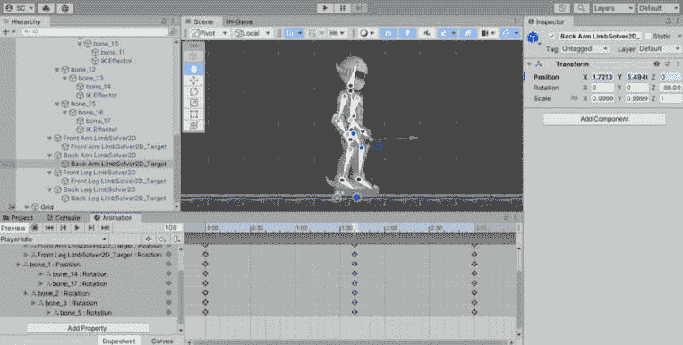

图 5.8 – 演员关键帧站立动画

注意，在 *图 5*.8* 中，我已经将 IK 求解器（`root_bone` 对象上的 `IKManager2D` 组件）的颜色更改，以给肢体骨骼赋予自己的颜色——这是组织构成演员的不同组件的另一种视觉方式，使其更容易处理。

在将基本站立动画添加到角色后，让我们看看如何通过玩家输入来驱动动画并将动作应用到我们的角色上。

# 使用输入动作图

我们将继续使用新安装的 `Input System` 包：

1.  通过访问 **窗口** | **包管理器** 来打开 **包管理器**。

1.  默认的 **包** 位置是 **项目内**，所以如果你在 **包 – Unity** 部分的列表中看到 **输入系统**，那么我们就准备好了！

1.  如果找不到 **输入系统**，则将 **包** 下拉菜单切换到 **Unity 注册表**，从列表中选择 **输入系统**，然后点击 **安装**（窗口的右下角）。参见 *第二章*，*新输入系统* 节以获取复习。

对于收集游戏，我们直接从 **输入设备** 接收输入；这次，我们将使用 **输入动作** 方法。为此，我们需要一个 **动作** **映射** 资产。

幸运的是，为玩家角色创建默认动作图相当简单——我们需要的键盘和游戏控制器的大部分设备输入已经准备好了！

按照以下步骤完成此操作：

1.  魔法是通过 `Player Input` 组件实现的。因此，通过在 **检查器** 窗口中使用 **添加组件** 按钮将其添加到 `Player` 预制件的根对象。

重要提示

您可以通过将其添加到场景或通过在 **项目** 窗口中双击 Prefab 直接在它上工作来使用 **玩家** Prefab。

1.  一旦添加了 `Player Input` 组件，点击下面的截图所示的 **创建动作…** 按钮。这将创建一组默认的 **输入动作映射**、**输入动作** 和 **输入绑定**：

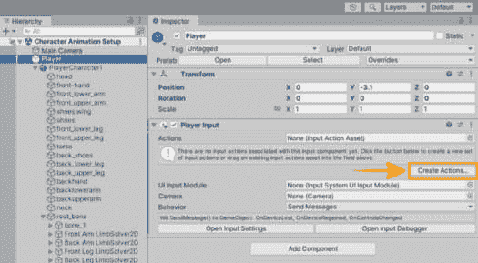

图 5.9 – 玩家输入 | 创建动作

1.  您将被提示保存新的 `.inputactions` 资产。选择 `Assets/Settings` 文件夹，并将其命名为 `Player Input`。然后，该资产将与 `Player Input` 组件连接，并打开 **输入** **动作编辑器**。

在这里，我们可以看到为玩家动作映射预先填充的所有动作，如图 *图 5.10* 所示 – 我们所需的一切以及更多！

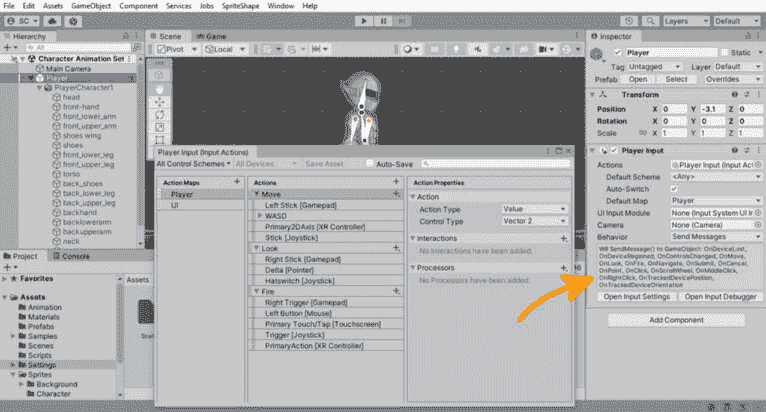

图 5.10 – 玩家输入动作映射（输入动作）

阅读更多 | Unity 文档

输入系统：[`docs.unity3d.com/Packages/com.unity.inputsystem%401.4/manual/QuickStartGuide.xhtml`](https://docs.unity3d.com/Packages/com.unity.inputsystem%401.4/manual/QuickStartGuide.xhtml).

编辑输入动作资产：[`docs.unity3d.com/Packages/com.unity.inputsystem%401.4/manual/ActionAssets.xhtml#editing-input-actionassets`](https://docs.unity3d.com/Packages/com.unity.inputsystem%401.4/manual/ActionAssets.xhtml#editing-input-actionassets).

`Player Input` 组件也为我们提供了响应玩家输入所需的一切。*图 5.10* 将 `SendMessage()` 设置在 `Player Input` 组件所属的 GameObject 上，调用添加到 GameObject 上的每个组件 (`MonoBehaviour`) 的名称。如图 *图 5.10* 所示，相关的方法名称将按照在 **行为** 字段下方方框中列出的顺序被调用。

阅读更多 | Unity 文档

通知行为：[`docs.unity3d.com/Packages/com.unity.inputsystem%401.4/manual/Components.xhtml#notification-behaviors`](https://docs.unity3d.com/Packages/com.unity.inputsystem%401.4/manual/Components.xhtml#notification-behaviors).

为了简化起见，我们将坚持使用 `SendMessage()`，因为它需要使用 **反射**，所以速度较慢。

反射 | C#

**SendMessage()** 严重依赖 **反射** 来在运行时找到要调用的方法。**反射** 慢（据说比直接调用方法慢 3 倍），因为它需要托管代码读取（搜索）其元数据以找到程序集。

在设置好输入并知道如何响应我们定义的输入后，我们就可以编写玩家控制器代码了！

# 使用玩家控制器脚本移动玩家

我们需要的不只是输入来移动玩家角色在关卡中的位置。我们还需要配置`Player`对象与**物理**系统协同工作，以便它与我们的关卡地面、平台和交互触发体积交互，并应用移动力。

在参考*图 5.11*的同时，配置`Player`预制件的根 GameObject 以下组件：

1.  通过按`1`添加`Rigidbody2D`组件。我们将为玩家的移动添加一些阻力，以提供额外的移动约束，帮助玩家感觉更加脚踏实地，而不是太飘。

1.  **约束** | **冻结旋转 Z**已启用：我们希望防止玩家旋转，并使他们始终垂直站立（垂直于地面平面）。

+   通过按**添加组件**按钮添加`CapsuleCollider2D`。使用**编辑边界体积**按钮并修改碰撞器的形状，直到它包围了演员。

    这代表玩家的击中区域，随着你进行游戏测试，可能需要调整：

    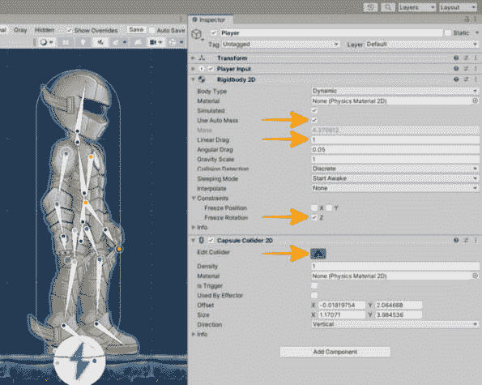

图 5.11 – 玩家物理设置

仅负责读取设备输入并调用分配的动作的`Player Input`组件。

## 处理玩家输入

尽管我们可以在*玩家控制器脚本*部分的*第二章*中使用设备输入，就像我们做的那样，但理解使用**输入动作映射**的价值是至关重要的。以下是一些示例：

+   可以同时配置多个设备输入，而无需更改输入处理代码。

+   可以根据当前所需的输入操作切换到不同的动作映射。

+   可以在不更改输入处理代码的情况下实现按键重绑定。

带着这些知识，你可以确定针对不同用例的最佳方法（你是在原型设计吗？你是在为商业游戏设计一个灵活的解决方案吗？）。

之前，我们在`Update()`循环中直接对输入设备上的`isPressed`键状态进行连续轮询，以控制玩家移动，如下所示：

```cs
void Update()
{
    if (keyboard.aKey.isPressed
        || keyboard.leftArrowKey.isPressed)
            _moveHorizontal = -1.0f;
    …
}
```

由于我们现在从`SendMessage()`接收输入处理，我们需要做一些更改。

任何有输入时都会调用`SendMessage()`。输入不是连续轮询的！它每次输入操作发生时都表现得像事件，这意味着对于*移动*操作，当按键按下和释放时，都会调用`OnMove()`。

调用用于定义输入操作的`SendMessage()`方法名称。

在*移动*的情况下，`SendMessage()`还将传递一个表示`Vector2`的`InputValue`参数，它包含水平和垂直输入值。

我们将使用水平（X 轴）值来确定是否按下了**移动左右**按钮，因为我们希望在按钮被按下时（或握住游戏控制器棒子朝某个方向时）移动我们的玩家。

我们的`move`方法（`OnMove()`）将在按下按钮时，使用`Vector2` X 轴值来表示水平输入，当输入为`-1`时表示向左，输入为`1`时表示向右，而当按钮释放时，值为`0`。

现在我们有了所有这些信息，我们可以开始编写我们的输入处理代码了！

## 创建 PlayerController 脚本

让我们从在`Assets/Scripts`文件夹中创建一个名为`PlayerController`的新 C#脚本开始。

我们现在可以添加我们的移动动作输入处理方法`OnMove()`，并将`InputValue`参数的`Vector2`值分配给名为`_movementInput`的私有成员变量。我们将在稍后使用它来计算应用于玩家`Rigidbody2D`速度的移动。

这是我们初始代码的样子：

```cs
public class PlayerController : MonoBehaviour
{
    private Vector2 _movementInput;
    void OnMove(InputValue value)
    {
        var move = value.Get<Vector2>();
        _movementInput = (move.x != 0f)
            ? new Vector2(move.x, 0f) : Vector2.zero;
    }
}
```

我们使用`value`参数变量的`Get()`方法读取输入值。我们在这里只对水平移动感兴趣，并将`_movementInput`值根据输入状态设置：按下或释放。

因此，如果`move.x`等于`0`，那么按钮键被释放（可以将其视为`IsPressed == false`）。然后，使用三元运算符（`?:`），我们将`Vector2.zero`赋值以确保忽略任何/所有输入。

当`move.x`不等于零时，我们有一个按钮按键输入值，它表示方向（`-1`：*左*，`1`：*右*），并将其分配给`_movementInput`，使用一个新的`Vector2`表示方向，没有垂直值：`new` `Vector2(move.x, 0f)`。

使用这种方法，我们仍然可以稍后响应垂直输入，例如喷射背包的输入！现在我们有了方向，我们可以应用力（以速度的形式）来移动玩家角色。

让我们添加以下代码来处理这种情况：

```cs
private Rigidbody2D _rb;
void Awake() => _rb = GetComponent<Rigidbody2D>();
void FixedUpdate() => UpdateVelocity();
private void UpdateVelocity()
{
    var velocity = _rb.velocity;
    velocity += Time.fixedDeltaTime * _movementInput;
    _rb.velocity = velocity;
}
```

让我们逐项分析这段代码：

+   `_rb`变量：这个私有成员变量将保存我们之前添加的`Rigidbody2D`组件的引用，并且我们将在这里设置速度以移动玩家。我们曾经将其设置为`public`字段，可以在**检查器**窗口中分配，但这次我们将保持它为私有以封装它。

+   `Awake()`方法（表达式体）：由于我们的`Rigidbody2D`变量是私有的，我们只使用这个 Unity 消息事件在运行时使用`GetComponent()`获取这个对象上的`Rigidbody2D`组件的引用。

额外阅读 | Unity 文档

**GameObject.GetComponent**: [`docs.unity3d.com/2022.3/Documentation/ScriptReference/GameObject.GetComponent.xhtml`](https://docs.unity3d.com/2022.3/Documentation/ScriptReference/GameObject.GetComponent.xhtml).

+   `FixedUpdate()`方法（表达式体）：这是 Unity 消息事件，在每次`UpdateVelocity()`方法调用时都会被调用。

+   `UpdateVelocity()`方法：此方法将计算并应用速度向量到玩家的`Rigidbody2D`组件。

    +   `var velocity`：这保存了我们将要修改并重新分配的`Rigidbody2D`组件当前速度的值。

    +   速度计算：这会将移动输入向量乘以`fixedDeltaTime`后添加到速度变量中。乘以`fixedDeltaTime`确保帧率无关性。

    +   `_rb.velocity`赋值：在这里，我们只是将计算出的速度重新赋值给`Rigidbody2D`组件，从而移动玩家。记住，`FixedUpdate`应该始终用于执行与物理相关的代码，特别是对`Rigidbody`组件应用力时！

作者注记

我阅读了关于是否需要在**FixedUpdate**中应用**deltaTime**的讨论，因为它的运行帧率是恒定的。无论如何，我倾向于知道**FixedUpdate**的间隔始终相对于游戏时间。此外，Unity 提供的示例代码总是包含**deltaTime**，保持一致地包含它将确保我们在所有设备上实现帧率无关性。

额外阅读 | Unity 文档

**Time.fixedDeltaTime**：[`docs.unity3d.com/2022.3/Documentation/ScriptReference/Time-fixedDeltaTime.xhtml`](https://docs.unity3d.com/2022.3/Documentation/ScriptReference/Time-fixedDeltaTime.xhtml)。

时间和帧率管理：[`docs.unity3d.com/2022.3/Documentation/Manual/TimeFrameManagement.xhtml`](https://docs.unity3d.com/2022.3/Documentation/Manual/TimeFrameManagement.xhtml)。

乘以零总是得到零，所以`Vector2.zero`与`_movementInput`一起将速度值赋为零，停止玩家的移动。

我们已经给玩家应用了速度，但不要过于兴奋。这很可能会对移动玩家没有净效果，因为速度值太小！让我们通过给速度应用一个加速度乘数来解决这个问题。

在`UpdateVelocity()`方法中添加以下成员变量，并按照以下所示进行更改：

```cs
[Header("Movement")]
[SerializeField] private float _acceleration = 0.0f;
[SerializeField] private float _speedMax = 0.0f;
private void UpdateVelocity()
{
    var velocity = _rb.velocity;
    velocity += _acceleration * Time.fixedDeltaTime
        * _movementInput;
    velocity.x = Mathf.Clamp(velocity.x,
        -_speedMax, _speedMax);
    _rb.velocity = velocity;
}
```

让我们分解这些更改：

+   我们添加了两个新变量`_acceleration`和`_speedMax`，我们将它们设置为私有，但通过`[SerializeField]`属性将其公开，我们告诉 Unity 序列化它并使其可用于赋值，`_acceleration`：这应用于我们的整体速度量（力），以确定我们达到最大速度值所需的时间。

+   `_speedMax`：玩家角色移动的最大速度。

+   在`UpdateVelocity()`方法中，我们进行了以下更改：

    +   我们通过乘以`_acceleration`值修改了增加速度向量的行。

    +   我们已经确保使用`Mathf.Clamp()`方法将`velocity.x`限制在最大速度值。

额外阅读 | Unity 文档

**SerializeField**：[`docs.unity3d.com/2022.3/Documentation/ScriptReference/SerializeField.xhtml`](https://docs.unity3d.com/2022.3/Documentation/ScriptReference/SerializeField.xhtml)。

现在，您可以将`PlayerController`脚本添加到`Player`预制件的根目录，将玩家添加到一个带有地面的场景中（别忘了添加碰撞器），并进行游戏测试。您可以使用*A*和*D*键、左右箭头键或游戏控制器的左摇杆来移动玩家。您可以调整加速度、最大速度以及**Rigidbody2D**属性的质量和线性阻力值。

PlayerController.cs 代码

要查看**PlayerController**类的完整代码，请访问以下 GitHub 仓库：[`github.com/PacktPublishing/Unity-2022-by-Example/tree/main/ch5/Unity%20Project/Assets/Scripts`](https://github.com/PacktPublishing/Unity-2022-by-Example/tree/main/ch5/Unity%20Project/Assets/Scripts)。

游戏测试意味着反复调整这些移动变量，直到您觉得玩家控制*感觉正确*。我目前将加速度设置为`30`，最大速度设置为`8`。随着您构建游戏，您将发现自己需要多次返回并调整这些值 – 游戏感觉对玩家满意度至关重要。

## 物理材质

在进行游戏测试时，您可能会注意到，当您释放按键（或控制器摇杆）时，玩家可能会滑动一小段时间。这可以通过在释放按键时将玩家冻结在原地来纠正，但我认为更好的方法是改变玩家当前站立地面的属性。通过调整地面的摩擦力，我们可以提供不同类型的地面，包括冰面，当玩家释放输入时，玩家会在冰面上滑动。

我们将在地面上添加一种**物理材质**以提供*更高的默认摩擦力*。这样，我们就可以在游戏后期拥有摩擦力较小的区域，以改变游戏玩法等。

按照以下步骤创建一个新的物理材质并将其应用于您关卡中的地面对象：

1.  在`Assets/Settings`文件夹中创建一个新的文件夹，并将其命名为`Physics Materials`。

1.  在新文件夹内右键单击，选择`Default Friction`。

1.  选择新创建的物理材质，在`10`（这，像所有其他游戏变量一样，可能会在游戏测试中改变）。

1.  现在，通过拖动它到`Collider`组件中，将物理材质分配给您的地面对象，如图所示：

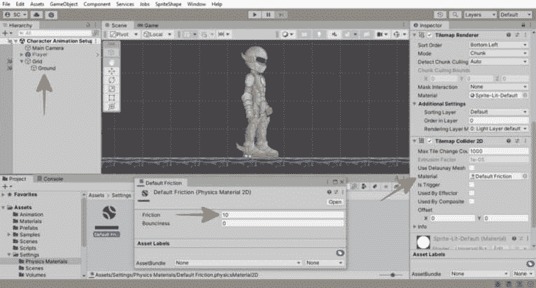

图 5.12 – 将物理材质分配给地面碰撞器

继续进行游戏测试并调整这些值。

接下来，我们将通过添加跑步动画并使玩家始终面向移动方向来完成初始玩家控制器的设置。

# 使用 Mecanim 动画角色

在*创建演员动画*部分，当我们为演员创建空闲动画时，我们添加了`PlayerCharacter1`对象。`Animator`组件允许我们将动画分配给**场景**视图中的 GameObject – 它是负责控制 Unity 的**Mecanim**动画系统（在演员或任何其他你想要动画化的 GameObject 上）的接口。

一个`Animator`组件。这个控制器资产定义了使用哪些动画以及何时以及如何过渡和混合它们。

额外阅读 | Unity 文档

Animator: [`docs.unity3d.com/2022.3/Documentation/Manual/class-Animator.xhtml`](https://docs.unity3d.com/2022.3/Documentation/Manual/class-Animator.xhtml).

要在`Animator`组件中继续设置，我们需要第二个动画，当我们的玩家角色移动或，比如说，跑步时过渡到。

按照以下步骤为演员创建额外的动画：

1.  在**场景**视图中打开`PlayerCharacter1`对象。

1.  现在，在**动画**窗口中，点击**动画剪辑**列表下拉菜单（窗口左上角，位于播放控制下方），然后点击**创建新剪辑…**，如图所示：

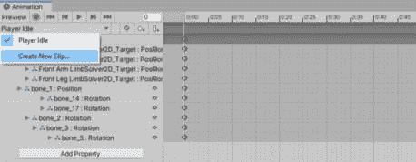

图 5.13 – 创建新剪辑…

1.  在`Assets/Animation`文件夹中将新剪辑保存为`Player Run`。

1.  动画跑步周期。你做到了！

说真的，动画是一项你需要逐渐掌握的技能。虽然我可以创建动画，但我仍然需要在这个领域进行大量练习才能变得更好（我可能会在本书的最终项目文件中使用熟练的角色动画师，这些动画将可供你使用和学习）。

额外资源 | 2D 角色动画

另一个快速入门角色动画的选项是与 Unity 在 Asset Store 上提供的现有示例角色一起工作，这些角色来自龙之冲击者或失落的密室示例项目。

龙之冲击者: [`assetstore.unity.com/packages/essentials/tutorial-projects/dragon-crashers-2d-sample-project-190721`](https://assetstore.unity.com/packages/essentials/tutorial-projects/dragon-crashers-2d-sample-project-190721).

失落的密室: [`assetstore.unity.com/packages/essentials/tutorial-projects/lost-crypt-2d-sample-project-158673`](https://assetstore.unity.com/packages/essentials/tutorial-projects/lost-crypt-2d-sample-project-158673).

现在，我们可以继续设置从*空闲到* *跑步*动画的过渡。

## 动画状态过渡

要在`PlayerCharacter1`对象上打开`Animator`组件或双击**项目**窗口中`Assets/Animation`文件夹中的`PlayerCharacter1`资产。

在打开**Animator**窗口（你可能希望将其停靠以便仍然可以清楚地看到所有编辑器窗口）时，你应该看到默认状态（**任何状态**、**进入**、**退出**）以及当前在演员上的动画剪辑状态（**玩家空闲**、**玩家跑步**）：

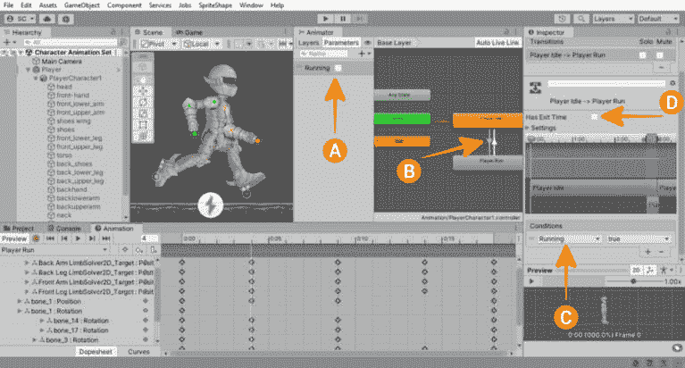

图 5.14 – 使用 Mecanim 的角色动画过渡

注意，你可以使用鼠标滚轮在**Animator**窗口中导航以放大/缩小视图，并使用*Alt* + 左键按钮/*Option* + 左键按钮快捷键来平移视图。点击并拖动任何状态节点以有序地重新定位它。

额外阅读 | Unity 文档

**Animator**窗口：[`docs.unity3d.com/2022.3/Documentation/Manual/AnimatorWindow.xhtml`](https://docs.unity3d.com/2022.3/Documentation/Manual/AnimatorWindow.xhtml)。

按照以下步骤从**玩家空闲**状态转换为**玩家跑步**状态创建一个**过渡**：

1.  首先，通过执行以下步骤创建一个布尔参数来表示我们是否在跑步：

    1.  首先，选择`Running` – 我们需要一个布尔参数来保存玩家是否跑步的状态（`true`表示跑步，`false`表示不跑步）。

1.  右键单击**玩家空闲**节点，从弹出菜单中选择**创建过渡**。

1.  将**过渡**箭头附加到鼠标指针上，然后单击**玩家跑步**节点。

1.  现在，单击新创建的过渡线（*图 5.14*中的*B*）以在**检查器**窗口中查看其属性。

1.  在`true`；意味着，当`true`时，过渡到指定的节点。

1.  返回到*步骤 2*并重复指令以将过渡回`false`。

1.  最后一步是禁用两个过渡的**Has Exit Time**（*图 5.14*中的*D*）。我们希望状态在条件满足时立即退出（动画停止），而不是等待动画播放完毕。

由于我们还没有将动画状态连接到玩家输入，你可以通过进入**播放模式**并同时在**游戏视图**和**Animator**窗口中切换**Running**参数来手动测试以确保过渡工作良好。每次切换参数时，玩家应该从*空闲*动画切换到*跑步*动画，然后再切换回来。太棒了！

现在，让我们根据玩家的输入来创建这个过渡。

## 使用代码更改动画状态

我们首先需要一个变量来保存对`Animator`组件的引用（在`Running`参数中可分配，当玩家停止移动角色时，我们将`Running`参数设置为`false`。我们将迅速完成这项工作，只用一行代码就能完成！）

将以下代码添加到`PlayerController`脚本中：

```cs
[Header("Actor")]
[SerializeField] private Animator _animator;
private void UpdateVelocity()
{
    …
    // Update animator.
    _animator.SetBool("Running", _movementInput.x != 0f);
}
```

`_animator`变量声明是我们对`Player`对象中`Animator`组件的引用。我们将其标记为`private`，以便没有其他类可以修改它，但用`[SerializeField]`属性装饰，以便在**Inspector**窗口中进行序列化和赋值。

在`UpdateVelocity()`方法中，我们添加了对`_animator.SetBool()`的调用，并传入`Running`字符串以标识我们想要设置的布尔参数。我们将传入`_movementInput.x != 0f`表达式的评估结果作为布尔值。

这意味着如果我们的玩家正在接收移动输入（值不为零），那么我们正在移动（`Running`等于`true`）；否则，（即`if _movementInput.x == 0f`），我们正静止不动（`Running`等于`false`）。

一旦添加并保存此代码，请使用**Editor**视图中的**Hierarchy**和**Inspector**窗口将子对象`PlayerCharacter1`拖动到`PlayerController`组件的**Animator**字段。

进入**Play Mode**，左右移动玩家以测试动画是否从空闲状态过渡到奔跑状态并返回。你可能会注意到，尽管动画正在过渡，但在向左移动时，演员的朝向是错误的！

我们将在下一部分处理完玩家移动。

## 翻转玩家角色

在**PlayerController**脚本中确保玩家始终面向移动方向。

打开`PlayerController`脚本，在`OnMove()`方法的末尾添加对新方法`UpdateDirection`的调用。使用以下代码创建`UpdateDirection()`方法：

```cs
void OnMove(InputValue value)
{
    …
    UpdateDirection();
}
private void UpdateDirection()
{
    if (_movementInput.x != 0f)
    {
        transform.localScale = Vector3.one;
        if (_movementInput.x < 0f)
            transform.localScale = new
                Vector3(-1f, 1f, 1f);
    }
}
```

我们用来翻转玩家角色朝向的简单技巧是将玩家对象的**Transform**的`localScale X`值设置为`-1`，如果移动输入值小于零（即表示向左移动的输入）。

`UpdateDirection()`中的第一个`if`语句检查是否有移动玩家的输入。记住，零值表示玩家释放了方向键（或游戏控制器摇杆）。

如果移动的输入水平值不为零，我们首先为面向右侧设置一个默认缩放（`X`值为`1`）。如果移动输入是面向左侧（`X`值为`-1`），则将`localScale`设置为具有 X 轴值为`-1`的`Vector3`。简单易行。

附加活动

基于本章学到的处理玩家输入的技术，通过**Rigidbody2D**组件移动玩家，并使用**Animator**在**PlayerController**脚本中为玩家动画添加功能，使玩家角色能够跳跃。不妨跳起来，大胆地跳吧！

我并不是真的让你在这里卡住。如果你在寻找解决问题的救命稻草，你可以通过访问以下 GitHub 链接查看完成这个跳跃奖励活动的说明：[`github.com/PacktPublishing/Unity-2022-by-Example/tree/main/ch5/Unity%20Project/Assets/Scripts/Jumping`](https://github.com/PacktPublishing/Unity-2022-by-Example/tree/main/ch5/Unity%20Project/Assets/Scripts/Jumping)

在本节中，你学习了如何创建动画并将其应用到玩家身上，以及如何使用代码进行动画转换和状态改变，所有这些都是在使用 Mecanim 的过程中完成的。我们最后学习了如何翻转玩家角色的面向方向。

# 摘要

本章带我们了解了如何完整设置一个动画 2D 玩家角色，包括通过 PSD 导入器导入艺术资源，设置可动画的绑定，配置 IK 求解器，以及使用 Mecanim 为玩家创建和应用动画。

我们继续通过使用新的输入系统中的 Input Action Map 资产添加玩家输入的移动能力，编写一个简单的玩家控制器脚本，处理输入，并根据当前玩家动作更改动画，同样使用 Mecanim。

在下一章中，我们将为玩家添加武器，以便他们能够高效地射击投射物。
