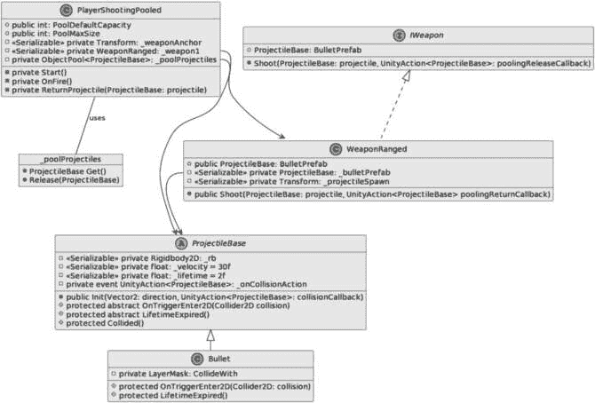
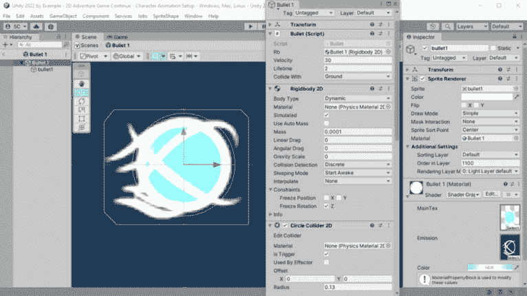
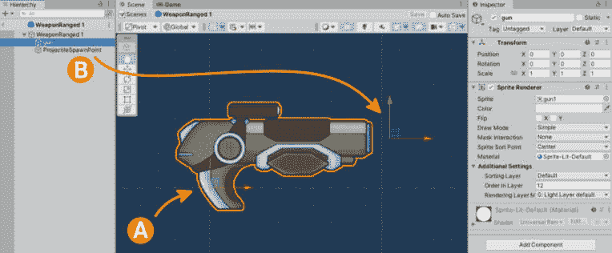
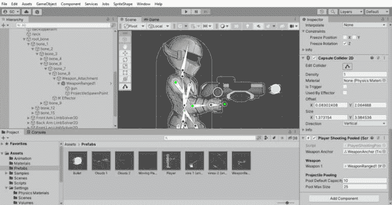
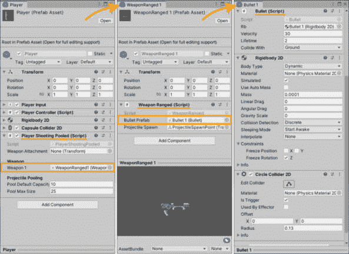

# 第六章：Unity 2022 中对象池的介绍

在*第五章*中，我们导入并准备了艺术作品以用于额外的 2D 动画工具，这使游戏栩栩如生。我们还使用新的输入系统通过输入动作映射处理玩家输入——而不是直接读取设备输入——并创建了一个`PlayerController`脚本来移动玩家。

我们深入研究了 Mecanim，学习了如何在动画之间进行转换，并从代码中驱动动画状态变化。

在本章中，我们将介绍对象池，同时我们将使用这种优化模式为玩家的射击机制，我们将使用 Unity 的对象池 API 来实现这一点。对象池软件设计将基于池化玩家射击模型 UML 图。

在本章中，我们将涵盖以下主要主题：

+   对象池模式

+   池化玩家射击模型

到本章结束时，你将能够为远程武器创建一个优化的射击机制。

# 技术要求

为了与书中为项目创建的相同艺术作品一起学习本章，请从以下 GitHub 链接下载资源：[`github.com/PacktPublishing/Unity-2022-by-Example/tree/main/ch6`](https://github.com/PacktPublishing/Unity-2022-by-Example/tree/main/ch6)。

为了使用你自己的艺术作品进行学习，你需要使用 Adobe Photoshop 或能够导出分层 Photoshop PSD/PSB 文件的图形程序（例如 Gimp、MediBang Paint、Krita 和 Affinity Photo）创建类似的艺术作品。

你可以在 GitHub 上下载完整的项目[`github.com/PacktPublishing/Unity-2022-by-Example`](https://github.com/PacktPublishing/Unity-2022-by-Example)。

# 对象池模式

**对象池**设计模式是一种**创建型**或**抽象工厂**设计模式，它使用栈来存储初始化的对象实例集合。它非常适合在需要大量需要生成或快速创建和销毁的对象的情况下使用。

由于我们将从武器中射击投射物——玩家可以以高频率执行此操作——因此这是一个应用对象池的绝佳地方，因为反复实例化和销毁对象会带来高昂的成本。在这种情况下，对象池提供了一种优化 CPU、内存和**垃圾回收**（**GC**）的方法。

而不是每次玩家需要射击时都直接创建一个新的投射物对象，我们将通过从池中的对象请求来重用已经实例化的投射物对象。因此，对象池提供了请求（获取）和返回（释放）对象的方法。例如，对于 10 个投射物对象的池，当玩家射击时，我们将一次从池中获取一个，并在它过期时（例如，击中某个物体）返回被射击的投射物。

如果您还记得我们**游戏设计文档**（**GDD**）中的第四章，特别是*表 4.1*，我们定义了射击能力，因此我们将使用对象池以高效和优化的方式实现这一机制，使用 Unity 的新**对象** **池** **API**。

## Unity 对象池 API

Unity 为引擎添加了一个新的命名空间 – `UnityEngine.Pool` – 其中包含几个新类以实现对象池模式。对于我们需要射击子弹的武器，我们将使用`ObjectPool<T0>`类。

额外阅读 | Unity 文档

**ObjectPool<T0>**: [`docs.unity3d.com/2022.3/Documentation/ScriptReference/Pool.ObjectPool_1.xhtml`](https://docs.unity3d.com/2022.3/Documentation/ScriptReference/Pool.ObjectPool_1.xhtml)

以下是我们工作时需要执行的一系列必要操作：

+   `Creating`（实例化）：在池中创建一个新的对象实例使其可用。

+   `Getting`（请求）：从池中检索一个可用的对象实例（如果需要更多，则创建并返回一个新的实例）。

+   `Releasing`（归还）：将一个活动的对象实例放回池中以供重用时使用。

+   `Destroying`（移除）：如果实例化对象的数量超过其大小限制，则完全从池中移除。

幸运的是，或者说是设计上的考虑，`ObjectPool<T0>`类提供了我们所需要的一切，例如创建池以及从池中取回和归还项目。现在，让我们为我们的弹道创建一个新的对象池。

## 创建新的对象池

让我们看看以下代码，它创建了一个新的`BulletPrefab`弹道对象池（类型为`ProjectileBase`；关于这一点，我们将在*创建池化玩家射击* *模型*部分稍后详细说明）：

```cs
private void Start()
{
    _poolProjectiles = new ObjectPool<ProjectileBase>(
        CreatePooledItem, OnGetFromPool,
        OnReturnToPool, OnDestroyPoolItem,
        collectionCheck: false,
        defaultCapacity: 10,
        maxSize: 25);
    ProjectileBase CreatePooledItem() =>
        Instantiate(_weapon1.BulletPrefab);
    void OnGetFromPool(ProjectileBase projectile) =>
        projectile.gameObject.SetActive(true);
    void OnReturnToPool (ProjectileBase projectile) =>
        projectile.gameObject.SetActive(false);
    void OnDestroyPoolItem(ProjectileBase projectile) =>
        Destroy(projectile.gameObject);
}
```

在前面的代码中，我们可以看到一个方法（在这种情况下是一个本地函数）被声明，对应于我们之前列出的每个必要的`ObjectPool`参数。

本地函数（C#）

新的**ObjectPool**创建代码使用本地函数而不是常见的使用 lambda（匿名委托）的方法，这样我们就可以避免不必要的内存分配。我们通过在已存在的方法体内声明一个方法来创建一个本地函数；这也限制了本地函数的作用域，使其只能在该方法内部被调用，这促进了封装，而不是使用私有成员方法（我们不需要在设置对象池的作用域之外使用这些方法，并且它们只需要被调用一次）。

当使用 lambda 时，必须创建一个委托，如果使用本地函数，这将是一个不必要的分配。避免捕获局部变量的分配，因为本地函数实际上只是函数；不需要委托。此外，调用本地函数的成本也更低，如果由编译器内联（消除调用链接开销），性能还可以进一步提高。

此外，局部函数看起来更好！它们提供了更好的代码可读性和详尽的参数名称——一个 lambda 匿名委托会隐藏每个参数类型！（你能看出我有点偏心吗？）

这里有一些关于此主题的额外阅读材料：[`docs.microsoft.com/en-us/dotnet/csharp/programming-guide/classes-and-structs/local-functions`](https://docs.microsoft.com/en-us/dotnet/csharp/programming-guide/classes-and-structs/local-functions)。

这里有一些关于在 C# 7 中添加局部函数时的有趣设计注释：[`github.com/dotnet/roslyn/issues/3911`](https://github.com/dotnet/roslyn/issues/3911)。

我在 `Start()` 方法中声明了以下局部函数：

+   `CreatePooledItem`: 当需要新项目时，这将实例化一个类型为 `ProjectileBase` 的对象。这是一个我们存储在玩家武器上的子弹 Prefab。

+   `OnGetFromPool`: 我们将使用 `_poolProjectiles.Get()` 来返回一个 `ProjectileBase` 对象实例，而此方法将调用 `gameObject.SetActive(true)` 来启用对象以供使用。

+   `OnReturnToPool`: 调用 `_poolProjectiles.Release(projectile)` 将在传入的对象实例上执行 `projectile.gameObject.SetActive(false)`，确保它在池中等待被检索时处于非活动（禁用）状态。

+   `OnDestroyPoolItem`: 当从池中移除项目时调用 `Destroy(projectile.gameObject)` 意味着该对象将不再存在于场景中。

为了阐明前面的某些操作，*实例化* 意味着一个对象被创建并存在于场景中。当实例化对象的活动状态为 `SetActive(true)` 时，它在场景中可见，并且代码将被执行。

将 GameObject 设置为 `SetActive(false)` 将确保它不在场景中显示，并且对于每个组件，`Update()` 方法将不再被调用。

## 影响对象池的额外参数

除了前面的操作方法之外，我们还有三个影响池功能的额外参数。它们如下：

+   `collectionCheck`: 如果我们将此参数设置为 `false`，我们可以节省一些 CPU 循环，因为它不会检查对象是否已经返回到池中（对此值要小心，因为它会在尝试释放池中已有的项目时引发错误）。

+   `defaultCapacity`: 您应该将此值设置为我们将同时在屏幕上需要显示的弹幕数量（您可以通过测试射击速率来确定此数值）。

+   `maxSize`: 此值将防止池变得过大而失控。任何超过此数值的实例都将被销毁而不是返回到池中（经常超过最大大小会触发不希望的垃圾回收，并且调整大小是一个昂贵的操作——更多的 CPU 循环——因此您也需要通过测试来微调此值）。

现在让我们通过实现射击机制，使用子弹弹幕池来充分利用我们的新对象池。

# 池化玩家射击模型

我们将对玩家射击设置使用 **OOP**（**面向对象编程**）设计方法，以便于未来轻松扩展新的武器和弹丸类型。

## 创建池化玩家射击模型

让我们考虑以下类图：



图 6.1 – 池化玩家射击 UML 类图

*图 6**.1* 展示了一个 UML 图。**UML** 代表 **统一建模语言**，它是一种在软件项目中指定和可视化工件关系的标准化方法。有几种类型的 UML 图，每种图都有其特定的用途。我们使用的类图显示了系统的静态结构，包括类、属性、方法和它们之间的关系。它是软件架构中最广泛使用的图之一。

额外阅读 | UML 图

UML: [`www.uml.org/what-is-uml.htm`](https://www.uml.org/what-is-uml.htm)

PlantUML 语言参考指南：[`plantuml.com/guide`](https://plantuml.com/guide)

PlantText UML 编辑器：[`www.planttext.com/`](https://www.planttext.com/)

好的，我们已经为游戏代码中池化玩家射击部分建模了系统，但这意味着什么呢？参考 *图 6**.1* 中的图，让我们用以下这些点来分解结构：

+   `PlayerShootingPooled` 类（*C*） – 对玩家输入的 `OnFire()` 事件的 `SendMessage()` 响应以射击武器的弹丸：

    +   这使用了 `_poolProjectiles` 对象，它代表实例化的 `ProjectileBase` 对象的堆栈（即 `Bullet`）

    +   它获取 `Bullet` (*C*) 对象预制件（从 `ProjectileBase` (*A*) 类类型派生而来）用于在 `_poolProjectiles`（`ObjectPool<ProjectileBase>` 类型）堆栈中：

    +   它有一个指向当前配备给玩家的远程武器（`WeaponRanged` (*C*) 类类型）的引用

+   `WeaponRanged` 类（*C*） – 表示我们可以为玩家配备的任何数量的远程武器类型：

    +   它实现了 `IWeapon` (*I*) 接口，这意味着我们必须声明相同的成员（就像一个合同）。因此，任何实现该接口的类都将具有相同的成员可用（这允许我们在不更改消耗接口成员的代码的情况下交换对象类型）。

+   `Bullet` 类（*C*）是我们添加到子弹预制件中的组件，并在检查器中分配给 `WeaponRanged` 序列化的 `_bulletPrefab` 字段。子弹预制件通过公共 `BulletPrefab` 属性（封装私有变量）检索，用于在 `PlayerShootingPooled` 类中消费：

    +   这扩展了继承的抽象类 `ProjectileBase`（使 `Bullet` 成为子类）；我们不能实例化声明为 `abstract` 的类，而必须使用派生类。然而，在 `base` 类中声明的成员在派生类中也是可用的。

重要提示

当我们说 *serializable* 时，我们是指我们将在检查器中做出分配——在大多数情况下是一个私有字段（在 C# 脚本中，私有字段用 **[****SerializeField]** 属性装饰）。

在阅读了前面的细节并审查了类图之后，你可能已经开始想象我们的代码应该是什么样子 `… … …`

好吧，你现在可以停止做白日梦了，因为代码如下。

在 `Assets/Scripts` 中创建一个新的 C# 脚本，命名为 `PlayerShootingPooled.cs`：

```cs
using UnityEngine.Pool;
public class PlayerShootingPooled : MonoBehaviour
{
    [SerializeField] private WeaponRanged _weapon1;
    public int PoolDefaultCapacity = 10;
    public int PoolMaxSize = 25;
    private ObjectPool<ProjectileBase> _poolProjectiles;
    private void Start() {}    // new ObjectPool<>();
    private void OnFire() =>
        _weapon1.Shoot(_poolProjectiles.Get(),
            ReturnProjectile);
    private void ReturnProjectile(
        ProjectileBase projectile) =>
            _poolProjectiles.Release(projectile);
}
```

我们已声明 `_weapon1` 变量，用于分配对玩家手中在编辑器（设计时）附加的 `WeaponRanged` 预制对象引用。我们还声明了公共变量 `PoolDefaultCapacity` 和 `PoolMaxSize`，分别具有默认值 `10` 和 `25`，用于我们私有 `ObjectPool` 的默认和最大大小，该 `ObjectPool` 声明为 `_poolProjectiles`。

然后，我们将使用上一节 *The Unity object pooling API* 中的 `Start()` 代码（不包括在之前的代码中）并声明一个 `OnFire()` 方法，当玩家按下 *fire* 按钮时，将通过 `PlayerInput SendMessage()` 调用它。在 `OnFire()` 方法中，我们将提供一个 `Bullet` 实例，该实例是通过调用 `_poolProjectiles.Get()` 返回的，用于射击。

最后，我们将声明 `ReturnProjectile()` 方法，因为它将在 `_weapon1.Shoot()` 回调中调用，当子弹完成…执行子弹应该做的事情时。

关于代码架构的说明

当我们创建池项目时，我们可以传递对 **_poolProjectiles** 的引用并直接对其调用 **Release()**，但如果我们将其作为一个 **事件**，我们可以提供 **ReturnProjectile()** 作为回调。此外，我们还有添加任何其他回调的选项。我目前没有立即的计划。不过，考虑这些选项以创建一个灵活的方法，而不必在以后重构代码以引入功能，并可能在这个过程中破坏功能/测试过的代码，总是好的。

现在，我们将在 `Assets/Scripts` 中创建一个新的 C# 脚本，命名为 `WeaponRanged.cs`：

```cs
using UnityEngine.Events;
public class WeaponRanged : MonoBehaviour, IWeapon
{
    [SerializeField] private ProjectileBase _bulletPrefab;
    public ProjectileBase BulletPrefab => _bulletPrefab;
    [SerializeField] private Transform _projectileSpawn;
    public void Shoot(ProjectileBase projectile,
        UnityAction<ProjectileBase> poolingReturnCallback)
    {
        projectile.transform.position =
            _projectileSpawn.position;
       projectile.Init(_projectileSpawn.right
            * transform.root.localScale.x,
                poolingReturnCallback);
    }
}
```

`WeaponRanged` 脚本是我们将在检查器中使用序列化的私有字段 `_bulletPrefab` 分配我们的子弹预制件的引用的地方——毕竟，射击武器需要射击的东西。

我们已将 `_bulletPrefab` 封装起来，然后只允许通过 `BulletPrefab` 公共属性进行读取（getter）访问引用。因此，这里的 *封装* 意味着我们不希望其他类访问设置子弹引用。武器将管理自己的弹丸（尽管我们还可以稍后添加功能，通过公共设置器方法，如 `WeaponRanged.SetBulletPrefab(GameObject)` 或类似的方法，来分配新的子弹预制件）。

`Transform` 变量 `_projectileSpawn` 提供了一个位置，我们将在这里生成从武器射出的子弹预制件——我们将在稍后的 `WeaponRanged 1` 预制件中设置它。

最后，`Shoot()` 方法将弹池提供的弹丸的位置设置为弹丸生成位置，然后调用其上的 `Init()` 方法（可能是为了通过对其施加一些力来正确发射）。

我们还将提供对 `poolingReturnCallback` 的引用，以便当子弹 Prefab 与另一个对象碰撞或其生命周期结束时，可以将其释放回池中。

现在，我们将在 `Assets/Scripts/Interfaces` 目录下创建一个新的 C# 脚本，命名为 `IWeapon.cs`：

```cs
using UnityEngine.Events;
internal interface IWeapon
{
    ProjectileBase BulletPrefab { get; }
    void Shoot(ProjectileBase projectile,
        UnityAction<ProjectileBase>
            poolingReleaseCallback);
}
```

`WeaponRanged` 类实现了 `IWeapon` 接口以满足契约，这意味着 `WeaponRanged` 必须实现 `IWeapon` 接口中声明的 `BulletPrefab` 属性和 `Shoot()` 方法。请注意，C# 中的接口成员默认是公共的！

类图中的武器和对象池部分现在已满足。让我们通过从武器发射的弹丸来完成类图实现。

按照以下方式在 `Assets/Scripts` 目录下创建一个新的 C# 脚本，命名为 `Bullet.cs`：

```cs
public class Bullet : ProjectileBase
{
    [SerializeField] private LayerMask CollideWith;
    protected override void
        OnTriggerEnter2D(Collider2D collision)
    {
        if ((CollideWith
            & (1 << collision.gameObject.layer)) != 0)
                base.Collided();
    }
    protected override void LifetimeExpired()
        => base.Collided();
}
```

`Bullet` 类扩展了 `ProjectileBase` 类，这意味着它将继承所有成员并/或需要 **重写** 成员。你可以在派生类中声明独特的属性，以区分它与其他派生类（面向对象设计中的 **继承** 原则之一）。

我们正在重写 `OnTriggerEnter2D()` 方法 – 我们必须这样做，因为它在继承的 `ProjectileBase` 类中被声明为 `abstract` – 以执行特定的子弹碰撞动作。

注意，我们还在继承的类中通过使用 `base` 关键字调用了 `Collided()` 方法。`Collided()` 被声明为 `virtual`，这意味着我们可以在派生类中重新定义它，同时也可以使用它来实现相同的基本/默认功能。

这段代码 – `((CollideWith & (1 << collision.gameObject.layer)) != 0)` – 在 `OnTriggerEnter2D()` 方法中评估了 `Bullet` 碰撞的 GameObject 是否包含在 `CollideWith LayerMask` 中选定的层中。例如，我们将选择 *Environment*、*Wall*、*Ground*、*Enemy* 等等，但不包括 *Player* 以便 `Bullet` 能够与之碰撞。

额外阅读 | Unity 文档

层掩码：[`docs.unity3d.com/2022.3/Documentation/ScriptReference/LayerMask.xhtml`](https://docs.unity3d.com/2022.3/Documentation/ScriptReference/LayerMask.xhtml)

位运算符和移位运算符：[`learn.microsoft.com/en-us/dotnet/csharp/language-reference/operators/bitwise-and-shift-operators#left-shift-operator-`](https://learn.microsoft.com/en-us/dotnet/csharp/language-reference/operators/bitwise-and-shift-operators#left-shift-operator-)。

我们已经看到了 `Bullet` 如何通过面向对象继承扩展了 `ProjectileBase` 类，现在让我们看看 `ProjectileBase` 类。

在 `Assets/Scripts` 目录下创建一个新的 C# 脚本，命名为 `ProjectileBase.cs`：

```cs
using UnityEngine.Events;
public abstract class ProjectileBase : MonoBehaviour
{
    [SerializeField] private Rigidbody2D _rb;
    [SerializeField] private float _velocity = 30f;
    [SerializeField] private float _lifetime = 2f;
    private event
        UnityAction<ProjectileBase> _onCollisionAction;
    public virtual void Init(Vector2 direction,
        UnityAction<ProjectileBase> collisionCallback)
    {
        _onCollisionAction = collisionCallback;
        _rb.velocity = direction * _velocity;
        Invoke(nameof(LifetimeExpired), _lifetime);
    }
    protected abstract void
        OnTriggerEnter2D(Collider2D collision);
    protected abstract void LifetimeExpired();
    protected virtual void Collided()
    {
        CancelInvoke();
        _onCollisionAction?.Invoke(this);
    }
}
```

在这里，我们可以看到我们的子弹投射物的默认属性和行为。通过将 `ProjectileBase` 声明为抽象基类，它不能被直接实例化（创建新实例），因此我们必须声明一个新的类，该类扩展或继承自它。

注意，任何派生类仍然可以通过它扩展的基类被引用（在面向对象编程中，这是 **多态** 原则）。派生类必须重写任何声明为抽象的成员，但可以选择重写声明为虚拟的成员（同时也能够调用基虚拟方法以实现默认行为）。

让我们分解代码的相关项：

+   `_rb`, `_velocity`, 和 `_lifetime` 变量的声明为投射物 Prefab 的 `RigidBody2D` 组件提供了引用，同时也为对象的速率和寿命提供了可配置的值。

+   当调用 `Init()` 时，传入的回调动作被分配给 `_onCollisionAction` 以供稍后调用，然后设置 `_rg.velocity` 的 `direction` 和 `_velocity` 的速率，将其发射到武器指向的方向。

+   然后，我们有两个抽象方法必须在派生类（例如，`Bullet`）中重写：

    +   `OnTriggerEnter2D()`: 当另一个对象与该对象发生碰撞时，Unity 的消息事件会被调用。

    +   `LifetimeExpired()`: 在 `Init()` 中，我们使用延迟调用此方法，使得投射物对象仅在场景中存在一定时间（将其释放回对象池以供重用）。在游戏测试期间，应调整 `_lifetime` 值，以确保武器的射程在游戏中表现良好。

+   最后，我们有 `Collided()` 方法，它首先取消在 `_lifetime` 值处调用 `LifetimeExpired()` 方法（例如，因为我们不希望在 `Collided()` 已经被碰撞事件调用后再次调用 `LifetimeExpired()`），然后调用 `_onCollisionAction` 回调（将对象释放回对象池）。

池化玩家射击模型代码

完整的上述池化玩家射击代码可以从以下 GitHub 仓库下载：[`github.com/PacktPublishing/Unity-2022-by-Example/tree/main/ch6/Unity%20Project/Assets/Scripts`](https://github.com/PacktPublishing/Unity-2022-by-Example/tree/main/ch6/Unity%20Project/Assets/Scripts)。

按照来自 *图 6**.1* 的 UML 类图的设计模型，我们现在已经完成了代码部分的编写，并准备好将其与玩家实现。

## 实现池化射击模型

现在，让我们看看我们如何通过创建所需的 Prefab（武器和投射物）来实现池化玩家射击模型，以便与玩家集成。我们需要以下 Prefab，以及创建它们的步骤如下：

1.  `子弹 1`：我们将从远程武器发射的第一个投射物 Prefab 资产：

    1.  从项目文件中导入 `bullet1` 美术资源到 `Assets/Sprites` 文件夹，并将 PPU 设置为 `1280`（为了将较大的子弹精灵设置为合适的游戏内大小，这可能会在稍后根据发射子弹的武器大小进行调整）。同时，为了优化，将其设置为 `64`，因为它是一个相对较小且移动速度较快的精灵。

    1.  在 `Bullet 1` 中创建一个空 GameObject。请记住，您可以将 `Rigidbody2D` 和 `CircleCollider2D` 组件轻松地作为父对象的孩子来启用 `Rigidbody2D` 组件，设置为 `0`，并启用 `CircleCollider2D` 组件，设置为 `0.13`），如图 *图 6**.2* 所示：



图 6.2 – 子弹 Prefab 设置

1.  现在，将 `Bullet` 脚本添加到父对象中，并通过点击并拖动 `Rigidbody2D` 部分标题到该字段来分配 `Rigidbody2D` 字段。

1.  将 **速度** 和 **生命周期** 设置为一些初始起始值，然后使用 **CollideWith** 字段分配子弹应与之碰撞的层（注意，在分配之前您可能需要添加一个新层）。

1.  最后，从 `Assets/Prefabs` 文件夹中拖动父 `Bullet 1` 对象。我们的子弹 Prefab 现在可以与我们将要创建的武器 Prefab 一起使用了。

1.  `WeaponRanged 1`：玩家将持有并从其中发射子弹弹射物的远程武器：

    1.  导入 `gun1` 武器艺术品，并在精灵编辑器中，在把手处设置一个自定义的枢轴（见 *图 6**.3* 中的 *A*），这样当它附加（或生成）到玩家时，它处于正确的位置并且可以在枢轴点上旋转（正如您可能期望的那样）。

枢轴 | Unity 文档

当与 GameObject 一起工作时，枢轴作为定位、旋转和缩放它的参考点。在 Unity 中，当使用 Transform 工具时，您可以在工具设置覆盖层之间切换 GameObject 的枢轴或中心。

定位 GameObjects | Gizmo 处理器位置切换：[`docs.unity3d.com/Manual/PositioningGameObjects.xhtml`](https://docs.unity3d.com/Manual/PositioningGameObjects.xhtml)

1.  将枪精灵拖动到 `WeaponRanged 1`。

1.  现在，添加一个新的空 GameObject，命名为 `ProjectileSpawnPoint`，作为枪精灵对象的同级对象，我们将使用它作为 **Transform** 位置来生成弹射物。将此 GameObject 定位于枪口前端（见 *图 6**.3* 中的 *B*）：



图 6.3 – 武器 Prefab 精灵和弹射点设置

1.  现在，将 `WeaponRanged` 作为组件添加到父 GameObject 中。

1.  在 `WeaponRanged` 组件上，我们只需要进行两项分配：将 `ProjectileSpawnPoint` 对象中的 `Bullet 1` 分配到 `Assets/Prefabs` 文件夹中的 `WeaponRanged 1` 对象。

我们的可回收玩家射击模型现在可以与玩家角色一起使用了。耶！

## 将池化射击添加到玩家角色中

我们将直接开始将武器添加到我们的玩家中。您要么确保玩家处于当前场景中，要么在**项目**窗口中双击`Player`预制体以将其打开到**预制体**模式。

我们将使用玩家的（演员的）骨骼来确保武器在动画时跟随角色的手。执行以下步骤将武器锚定到玩家的手中：

1.  在`root_bone`层次结构下找到手骨。在我们的例子中，它是`bone_8`，如图*图 6**.4*所示。

1.  将一个空 GameObject 作为`bone_8`的子对象添加，并命名为`Weapon_Attachment`；这将成为武器的附件点。将其与骨骼分开提供额外的定位/旋转选项。此外，使用`_Attachment`后缀命名意味着我们可以轻松搜索**层次结构**中作为附件点的任何/所有对象。

1.  现在，您可以继续将`WeaponRanged 1`预制体从`Weapon_Attachment`对象拖动出来（这变成了一个嵌套预制体，这意味着我们可以在任何时间配置其属性，而无需依赖于`Player`预制体）。

以下截图显示了我们的玩家设置，手持武器。在接下来的*图 6**.4*中，您可以看到我还临时拖入了一个`Bullet 1`预制体，以检查其与武器的比例（与玩家角色一起显示）：



图 6.4 – 添加到玩家中的武器预制体

作为最后一步，我们需要将`PlayerShootingPooled`脚本作为组件添加到我们的`Player`预制体的根对象中。然后，我们将从**层次结构**中将`WeaponRanged 1`对象拖动到组件上的**武器 1**字段（如图*图 6**.4*所示）。

这是我们的 Prefab 组件的外观，基于 UML 图中的类，在检查器中，所有相应的字段分配如下：



图 6.5 – 池化玩家射击设置的预制体配置

新增于 Unity 2022

这可能并不是 2022 年技术流特有的，但我相信这是一个值得提及的工作流程改进。您可以同时打开一个针对不同资产或 GameObject 的专注**检查器**窗口，而无需不断更改选择并使用检查器。首先，选择对象，然后右键单击并选择**属性…**（在底部）或按*Alt/Cmd +* *P*。

让我们继续测试我们努力的成果！

参考图 6**.4**，进入`PlayerCharacter1`对象，将带有武器附件的演员手臂摆放在射击位置 – 使用 IK `LimbSolver2D`目标使这变得轻而易举。

我们将为玩家添加一个适当的射击动画，使武器指向*第八章*中的方向，这样我们就可以针对那些讨厌的机器人敌人（不是他们的错！）进行瞄准。

本节教会了我们如何通过将武器附加到角色的肢体上，使用之前创建的预制件来为玩家添加远程武器。我无法强调理解和使用良好的预制件工作流程在项目中的重要性！

# 摘要

本章介绍了对象池的概念，并实现了玩家射击机制的对象池，使用了 Unity 的对象池 API，同时基于我们池化玩家射击模型的 UML 图进行软件设计。

我们通过将配置好的预制组件附加到玩家身上，完成了游戏。

在下一章中，我们将通过添加一些视觉效果来增强玩家角色的表现，创建一些敌人 NPC（非玩家角色），并通过状态模式介绍敌人的行为。
