# 抛光玩家的动作和敌人行为

在 *第六章* 中，我们以优化的方式使用 Unity 的新 **对象** **池化** **API** 添加了远程武器射击机制。

在本章中，我们将继续为玩家角色添加一些必要的视觉抛光，并使用视觉效果！我们还将创建一些敌人 **非玩家角色** (**NPC**) 变体，并通过状态模式介绍敌人行为，以结束本章。

在本章中，我们将涵盖以下主要主题：

+   使用 **Shader Graph** 和 **Trail Renderer** 进行抛光

+   敌人预制件和变体 – 使用 **可脚本化** **对象** (**SOs**) 进行配置

+   使用 **有限状态** **机** (**FSM**) 实现基本敌人行为

到本章结束时，你将能够快速使用自定义着色器和后处理效果为游戏精灵添加一些视觉抛光，并制作具有不同属性和简单基于状态行为的几个敌人变体。

# 技术要求

从以下 GitHub 链接下载资产，以跟随本章中的相同艺术品，该艺术品是为书中项目创建的。

要跟随自己的艺术品，你需要使用 Adobe Photoshop 或能够导出分层 Photoshop PSD/PSB 文件的图形程序（例如 Gimp、MediBang Paint、Krita 和 Affinity Photo）创建类似的艺术品。

你可以在 GitHub 上下载完整项目：[`github.com/PacktPublishing/Unity-2022-by-Example`](https://github.com/PacktPublishing/Unity-2022-by-Example)。

# 使用 Shader Graph 和 Trail Renderer 进行抛光

为了真正向玩家推销游戏体验，我们可以采用一些易于执行的视觉抛光。幸运的是，Unity 通过一些内置组件提供视觉效果功能，并将其作为其渲染管道的一部分包含在内。

在这里，我们将探讨为玩家、子弹弹道和整体视觉外观添加一些简单效果。

## 启用后处理

为了利用本节中我们将要实现的效果，我们首先需要启用 **后处理**，因为它适用于 **通用渲染管线** (**URP**)（提醒：这是我们正在工作的渲染管道）。

具体来说，我们将制作的效果将使用 **高动态范围** (**HDR**) 颜色值，这些值将与后处理泛光效果一起工作，使我们的 2D 灯光和精灵资产的部分发光。

HDR 颜色 | Unity 文档

HDR 颜色值提供了比标准颜色更宽的亮度范围，从而实现了对颜色和亮度的更准确描述，更鲜艳的颜色，改进了对泛光和发光效果的支持，以及减少了带状效应。

高动态范围：[`docs.unity3d.com/Manual/HDR.xhtml`](https://docs.unity3d.com/Manual/HDR.xhtml)

要查看接下来章节中将要展示的内容，如图 7.1 所示，我们将对屏幕应用**渐晕**，并添加**辉光**以使子弹精灵的白色部分发光（为了清晰起见，进行了夸张处理）。

注意，我们无法仅使用**辉光**使子弹发光，因此我们将介绍如何实现这一点，以及**渐晕**，在接下来的章节中：

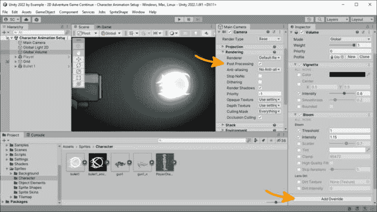

图 7.1 – 应用到场景的后期处理效果

注意事项

一些后期处理效果性能密集，并不适合所有分发平台（尤其是移动平台），因此在添加新效果时请注意您的**每秒帧数**（**FPS**）统计数据！

要在我们的游戏中启用后期处理，请按照以下步骤操作：

1.  对于当前场景中的相机，在**层次结构**中选择**主相机**。

1.  在**渲染**部分（参见图 7.1），启用**后期处理**。

1.  对于`Assets/Settings`文件夹，选择`UniversalRP`资产。

1.  在**质量**部分下，启用**HDR**。

现在我们已经启用了后期处理，我们可以开始添加**体积覆盖**，这些覆盖将与我们将添加到对象中的效果一起工作。为此，我们需要在我们的场景中添加一个体积，并按照以下步骤添加体积覆盖：

1.  从**场景层次结构**中，使用**创建**菜单并选择**体积** | **全局体积**。

1.  在选择`Global Volume`对象的情况下，在检查器中，在`Volume`组件的`Volume Profile`资产上。这将在一个与场景同名的子文件夹中创建一个名为`Global Volume Profile`的资产文件。

1.  分配了配置文件后，我们现在可以看到一个新的**添加覆盖**按钮（参见图 7.1）。点击它并选择**后期处理** | **渐晕**。

1.  点击**强度**左侧的复选框以启用它，然后提高数值以在**场景**和**游戏**视图中看到**屏幕边缘变暗**效果。

1.  现在，重复添加另一个覆盖，但这次选择`1` – 场景中亮度低于此值的像素将不会应用 URP 的效果。默认值是`0.9`（在大多数情况下都很棒），但我决定几乎让任何对象都有可能为整体外观贡献发光效果，所以我稍微提高了它。

1.  启用`1.15`以使事物看起来发光，作为一个初始的视觉检查，但我肯定会在稍后降低这个值。

额外阅读 | Unity 文档

后期处理和全屏效果：[`docs.unity3d.com/2022.3/Documentation/Manual/PostProcessingOverview.xhtml`](https://docs.unity3d.com/2022.3/Documentation/Manual/PostProcessingOverview.xhtml)

在通用渲染管线中的后期处理：[`docs.unity3d.com/Packages/com.unity.render-pipelines.universal%4015.0/manual/integration-with-post-processing.xhtml`](https://docs.unity3d.com/Packages/com.unity.render-pipelines.universal%4015.0/manual/integration-with-post-processing.xhtml)

现在事情看起来更电影化，并且有可能发出一些酷炫的光效，让我们最终设置我们的子弹 Prefab 精灵！

## 使用 Shader Graph 为子弹应用发光

您之前看到我们如何在*第四章*中为精灵添加二级纹理，当时我们添加了精灵法线图（为了给精灵提供伪 3D 效果）。

我们现在将使用一个`1`，这将通过使用 HDR 颜色值来实现）。

在*图 7**.2 中，您可以看到子弹的艺术作品以及子弹的**发射图**——一个黑白图像，其中白色区域定义了将发出光的部分：

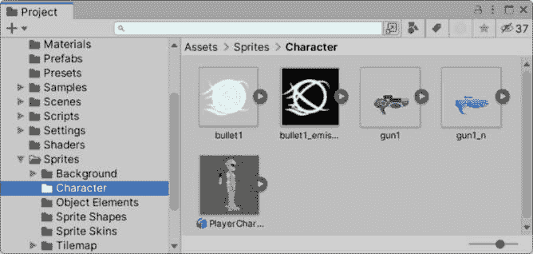

图 7.2 – 子弹精灵的发射图

如截图所示，我们创建了一个名为`bullet1_emission`的发射图，它仅代表子弹精灵的螺旋线条。回到`bullet 1`精灵，选择它，以便我们可以通过以下步骤将其作为二级纹理添加：

1.  在检查器中精灵的**导入选项**部分，点击**精灵编辑器**按钮。

1.  从**精灵编辑器**下拉菜单中选择**二级纹理**（窗口的左上角）。

1.  在**二级纹理**对话框中，点击加号（**+**）按钮以添加新的纹理。

1.  在**名称**字段中输入`_Emission`。

1.  将**bullet1_emission**精灵从**项目**窗口拖到**纹理**字段。

1.  点击**应用**按钮以保存更改（或者简单地关闭窗口并选择**保存**）。

作为复习，您可以参考*第四章*，*图 4**.2，以查看**二级****纹理**对话框的示例。

当我们的精灵准备就绪后，我们可以继续创建一个新的着色器来应用我们的效果。

## 创建新的 Shader Graph 2D 材质

创建自定义着色器过去通常是通过手动在特殊的着色器语言中编码来变得复杂，但**Shader Graph**允许通过基于节点的系统实时以可视化的方式创建自定义着色器，使这个过程对艺术家和开发者都更加易于访问。

我们将使用**Shader Graph**来创建和连接节点，以可视化的方式构建我们的发射着色器。请注意，这个着色器可以成为我们制作不同带有发射图的精灵所需的任何数量材料的基石！

附加阅读 | Unity 文档

Shader Graph 入门：[`docs.unity3d.com/Packages/com.unity.shadergraph%4014.0/manual/Getting-Started.xhtml`](https://docs.unity3d.com/Packages/com.unity.shadergraph%4014.0/manual/Getting-Started.xhtml)

让我们按照以下步骤创建这个发光着色器：

1.  首先，在`Assets/Shaders`中创建一个新的`root`文件夹。

1.  在新文件夹中使用`SpriteEmission_Unlit`创建一个着色器图。

1.  现在，通过在检查器中点击**打开着色器编辑器**按钮或双击资产来打开**着色器编辑器**。

我们将要创建的自定义精灵着色器实际上非常简单，只需要几个节点，如以下截图中的完成着色器所示：

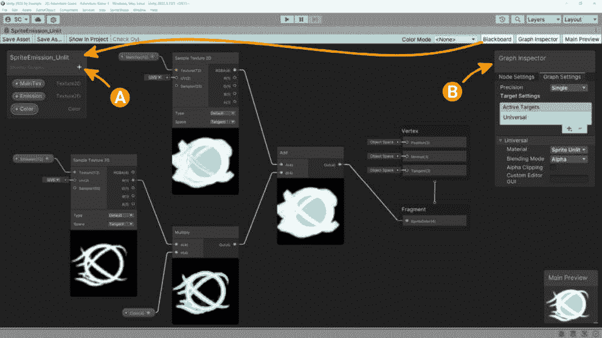

图 7.3 – 着色器图精灵发射着色器

让我们按照以下步骤构建这个着色器：

首先，从**黑板**（图 7.3 中的*A*）使用加号（**+**）按钮添加以下属性：

+   `主纹理` 和 `_MainTex`（这些字段在**图检器**中分配，如图 7.3 中的*B*所示），然后拖入子弹精灵作为**默认**纹理

+   注意，**参考**的拼写必须正确，因为这是着色器内部用于纹理引用的部分

+   `发射` 和 `_Emission`（注意这是我们之前在**精灵编辑器**中用作发射图次级纹理名称的部分），然后拖入**子弹发射图**作为**默认**纹理

+   `颜色` 和 `_Color`

这些属性将在**检查器**中公开，以便我们可以分配值。`_MainTex`和`_Emission`将从精灵中获取。

接下来，创建并连接构成这个简单着色器的节点：

1.  右键单击任何位置，从弹出菜单中选择**创建节点**（或者直接按空格键）。

1.  开始键入以搜索要添加的节点。在我们的例子中，开始键入`sample texture 2d`，并从**输入**|**纹理**下的列表中选择它。让我们添加两个这样的纹理节点——我们需要一个用于**主纹理**，一个用于**发射**（参考图 7.3）。

1.  让我们先完成**主纹理**路径。创建一个**加**节点，然后执行以下连接：

**主纹理(T2)** à **[采样纹理 2D] 纹理(T2)** | **RGBA(4)** à **[加] A(4)** | **输出(4)** à **[片段] 精灵颜色(4)**

重要提示

节点表示为**[节点**]，连接线通过à（在节点上的小圆圈上点击和拖动）显示，输入/输出通过|（输入在左侧，输出在右侧）显示。

1.  接下来，通过使用我们之前添加的第二个**采样纹理 2D**节点来完成**发射**路径。创建一个**乘**节点，并执行以下连接：

**发射(T2)** à **[采样纹理 2D] 纹理(T2)** | **R(1)** à **[乘] A(4)** | **输出(4)** à **[加] A(4)**

1.  最后，我们将通过连接**颜色**属性来完成着色器：

**颜色(4)** à **[乘] B(4)** | **输出(4)** à **[加] B(4)**

下载完成的着色器图

要查看完成的精灵发射着色器，请访问项目 GitHub 仓库：[`github.com/PacktPublishing/Unity-2022-by-Example/tree/main/ch5/Unity%20Project/Assets/Shaders`](https://github.com/PacktPublishing/Unity-2022-by-Example/tree/main/ch5/Unity%20Project/Assets/Shaders)

在我们能够将我们花哨的新发射着色器应用到子弹预制件之前，我们必须基于这个着色器创建一个新的**材质** – 这就是它的运作方式。在 Unity（以及大多数数字内容创建软件）中，渲染是通过材质、着色器和纹理来完成的，每个都为最终用户在屏幕上看到的图像贡献了它们的部分。

额外阅读 | Unity 文档

图形：[`docs.unity3d.com/2022.3/Documentation/Manual/Graphics.xhtml`](https://docs.unity3d.com/2022.3/Documentation/Manual/Graphics.xhtml)

通过在**项目**窗口的`Assets/Shaders`文件夹中名为`SpriteEmission_Unlit`的着色器资产上右键单击，创建一个基于我们刚刚创建的新着色器图的材质，然后按照以下步骤操作：

1.  前往`Bullet 1`。

1.  然后，在`Assets/Materials`中创建一个新的文件夹，并将材质移动到该文件夹中。

1.  通过首先打开`Bullet 1`预制件（无论是在场景中还是在**预制件模式**中）来将材质分配给子弹精灵。

1.  在场景视图中，当子弹精灵可见时，从**项目**窗口拖动`Bullet 1`材质到精灵上。Unity 在您释放鼠标按钮之前提供了一种视觉指示，以显示新材质应用于精灵后的外观（这是一个相当巧妙的技巧；这同样适用于将材质分配给 3D 对象）。

1.  现在，这里是魔法发生的地方。选择**层次**中的`bullet1`精灵以显示其检查器，展开底部的**材质**部分，然后点击颜色选择器（注意您应该退出**预制件模式**，因为在那里看不到后处理）。然后，执行以下操作：

    1.  将**颜色**字段设置为适当的发光颜色，然后提高**强度**值以达到所需的发光量（如图*图 7.4*所示，但请记住，后处理**光晕**效果的**强度**值也在这里起作用）。

这是我们的最终成果：

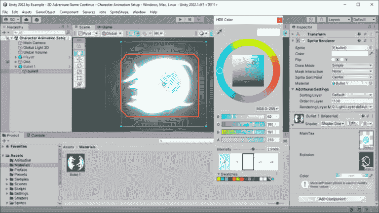

图 7.4 – 子弹材质 HDR 颜色设置

我们看起来不错 – 哈哈！

奖励活动

为玩家角色和武器添加基于**SpriteEmission_Unlit**着色器的材质！

如您从我们的简单着色器中看到的那样，在 Unity 中提升游戏视觉效果并不需要太多努力！为了在游戏视觉效果上取得另一个快速胜利，让我们为玩家角色添加一个微妙的光效，使其在环境中脱颖而出。

## 向玩家添加 2D 灯光

这是一个非常快速且简单的效果，但效果巨大。我们在这里要做的只是将**2D 灯光**作为**玩家**的子对象添加。当灯光与**玩家**相关联，并且位于**预制件****层次**中时，它将被**附加**到对象上。

使用以下步骤添加灯光：

1.  在场景中右键单击`Player`预制件的根对象。

与预制件一起工作

关于使用预制件的提醒：如果你在**预制模式**（通过在**项目**窗口中双击预制件）中添加**光**对象，你将无法可视化光设置的变化。然而，你可以通过在**场景**中点击**层次结构**窗口中的箭头图标（*>）进入**预制件隔离**模式，仍然能够可视化变化。最后，你可以在场景中直接修改预制件，但请记住应用**覆盖**以保存对预制件的更改。

1.  从菜单中选择**光** | **聚光灯 2D**。

1.  调整到您喜欢的值。参考*图 7**.5*，这是我使用的设置：

    +   将灯光放置在角色的胸部

    +   `0.6`

    +   `1.5`（*内*），`7`（*外*）

    +   `0.01`（在这里添加一点以对环境照明做出微小贡献）

    +   `3`（*距离*）

前后对比可以在*图 7**.5*中看到。注意玩家如何在右侧从环境中弹出，而左侧的东西看起来相当平坦：

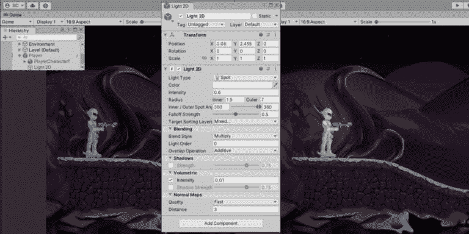

图 7.5 – 使用 2D 光使玩家突出显示

这很简单！让我们通过添加一个简单易加的额外视觉效果来获得另一个快速胜利！

## 使用尾迹渲染器进行抛光很容易

`Trail Renderer`组件创建了一个跟随移动对象的尾迹。这是一个为事物添加更多影响性移动的好方法，通过调整几个设置，它可以变得既微妙又夸张。

我们将直接进入正题。

### 为预制件添加尾迹

按照以下步骤为我们的子弹添加尾迹：

1.  打开**Bullet 1**预制件进行编辑。

1.  打开**创建**菜单，添加**效果** | **尾迹**（作为**bullet1**精灵的兄弟添加到根节点）。

1.  调整值以获得良好的尾迹效果！以下是我用作起始点的值：

    +   `(0.0, 0.2)`, `(0.5, 0.0)` – 使用此曲线将确保尾迹不会延伸得太长

    +   `0.2`

    +   `35`到`0`

    +   `Package/Universal RP/Runtime/Materials`)

    +   **照明** = **关闭**（投射阴影）

这些设置和结果可以在*图 7**.6*中看到：

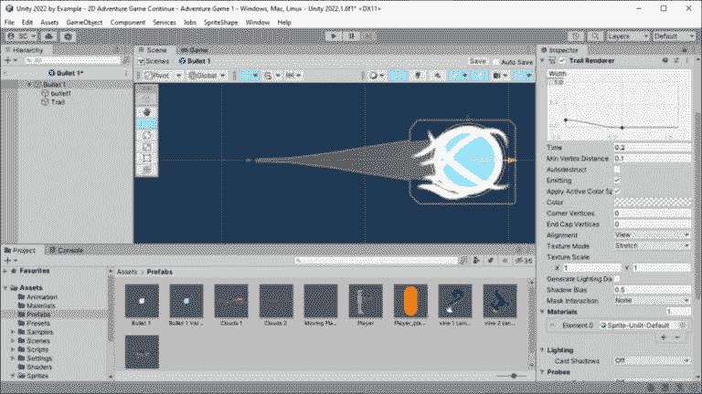

图 7.6 – 在子弹预制件上可视化尾迹渲染器组件

不要忘记你还需要设置`Bullet 1`预制件的精灵渲染器、地面以及前景/背景排序层。

### 清除池化预制件的尾迹

`Trail Renderer`组件在子弹 GameObject 后面创建了一个多边形尾迹（这就是尾迹渲染的方式），即使 GameObject 在场景中被停用，尾迹仍然存在。

这对我们来说是个问题，因为这正是我们使用对象池所做的事情：当 GameObject 项目返回池中时，将其停用。

幸运的是，`Trail Renderer` 组件提供了一个 `Clear()` 方法来清除轨迹。我们只需要在初始化弹道时调用此方法，voilà！问题解决。

将以下代码添加到 `ProjectileBase` 类中：

```cs
public virtual void Init(Vector2 direction,
    UnityAction<ProjectileBase> collisionCallback)
{
    // If there is a Trail Renderer component on
    // this GameObject then reset it.
    if (TryGetComponent<TrailRenderer>(out var tr))
        tr.Clear();
    …
}
```

在这里，我们只是使用 `TryGetComponent<TrailRenderer>()` 来检查是否已将 `TrailRenderer` 组件添加到 GameObject 中，并且只有在存在的情况下才返回其引用，使用 `out` 参数。如果组件不存在，则不会进行分配，这与 `GetComponent()` 不同。

我们使用 `if` 语句来评估 `TryGetComponent()` 的 `bool` 返回值，因此只有当弹道上有 `Trail Renderer` 组件时，才会调用 `Clear()` 方法（本质上，重置它）。

额外阅读 | Unity 文档

**Component.TryGetComponent**: [`docs.unity3d.com/2022.3/Documentation/ScriptReference/Component.TryGetComponent.xhtml`](https://docs.unity3d.com/2022.3/Documentation/ScriptReference/Component.TryGetComponent.xhtml)

在本节中，我们学习了如何启用后处理并添加如 **Vignette** 和 **Bloom** 这样的效果覆盖，使我们的子弹发光，玩家在光中脱颖而出。我们还完成了子弹上的简单轨迹效果！

接下来，我们将添加一个可配置的敌人角色及其变体。

# 敌人预制件和变体 – 使用 SO 配置

而不是必须存在于场景中的 GameObject，我们可以创建一个基于文件的资产，可以从任何 GameObject（包括预制件）引用，任何游戏中的任何地方，称为 SO。

由于这是一个单个资产引用，因此不需要额外的分配，无论场景中有多少对象引用它，都使用相同的值。非常酷！

SO（可脚本化对象）作为一个小型高效的数据容器，还允许将数据与其消耗数据的代码分离。数据可以从后端云系统中更新，而无需重新编译代码或构建整个游戏的新版本。

能够对生产中的游戏数据进行响应 – 在玩家可能需要快速解决问题的场合 – 是 SO 的一个优秀应用。

其他开发者已经使用 SO 用于中间件组件，甚至完全解耦的事件系统，这些系统对设计师友好，因为它们允许在编辑器中设计时进行配置（也就是说，开发者不需要在对象之间连接新事件等）。

Unity 还在其 *Open Projects* 开发计划中基于 SO 构建了完整的游戏架构。而且，如果不提一下 Ryan Hipple（Schell Games）在 2017 年 Unite Austin 上现在臭名昭著的 *使用 Scriptable Objects 构建游戏架构* 讲座，那就有些不完整了（在 *额外材料 – Unity 文档* 提示框中提供了链接），他在讲座中描述了如何使用 SO 构建更可扩展的系统和数据模式。

额外材料 | Unity 文档

ScriptableObject：[`docs.unity3d.com/2022.3/Documentation/Manual/class-ScriptableObject.xhtml`](https://docs.unity3d.com/2022.3/Documentation/Manual/class-ScriptableObject.xhtml)

打开项目：[`unity.com/open-projects`](https://unity.com/open-projects)

Unite Austin 2017 - 使用 Scriptable Objects 进行游戏架构：[`youtu.be/raQ3iHhE_Kk`](https://youtu.be/raQ3iHhE_Kk)

在这部分介绍完成之后，我们将继续创建我们的第一个 SO 并使用它来配置敌人的特性。

## 创建具有配置的敌人 Prefab

与`MonoBehaviour`脚本类似，SO 的创建方式有一些例外：

+   SO 必须继承自`ScriptableObject`而不是`MonoBehaviour`。

+   它不能附加到 GameObject（作为组件）。相反，它作为文件资产保存，并由组件作为在检查器中公开的字段引用。

+   它不会接收到与`MonoBehaviour`脚本相同的所有 Unity 消息事件（最明显的是缺少`Start()`、`Update()`和`FixedUpdate()`）。

+   它可以通过使用`CreateAssetMenu`创建基于`ScriptableObject`类的新自定义资产。相比之下，`MonoBehaviour`只能在场景中进行配置并保存为 Prefab（然后可以在**Prefab 模式**中编辑）。

新的敌人配置数据 SO 资产的**脚本模板**看起来像这样：

```cs
using UnityEngine;
[CreateAssetMenu(fileName = "New EnemyConfigData",
    menuName ="ScriptableObjects/EnemyConfigData")]
public class EnemyConfigData : ScriptableObject
{
    public float Speed, AttackRange,
        FireRange, FireCooldown;
    public bool CanJump;
    public float JumpForce;
}
```

这里，我们可以看到`[CreateAssetMenu()]`属性，它将在编辑器中创建一个新的菜单项，以便基于此`EnemyConfigData` SO 创建新的文件资产。

前往**项目**窗口并选择**创建** | **ScriptableObjects** | **EnemyConfigData**，我们可以创建多个敌人配置资产：

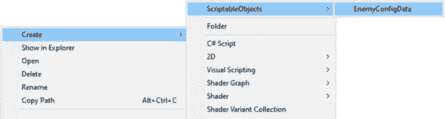

图 7.7 – 创建 ScriptableObjects 资产菜单

声明的`Speed`、`AttackRange`、`FireRange`等成员字段为不同类型的敌人提供了可配置的数据。在之前的代码中尚未定义，但您也可以创建方法（例如封装字段、返回计算、辅助方法和计时器）。

在新的`Assets/Scripts/Data`文件夹中使用前面的`ScriptableObject`模板创建一个名为`EnemyConfigData`的新脚本。

关于冒险游戏，并参考我们的**游戏设计文档**（**GDD**）中的*第四章*，*表 4.3*，我们将介绍两种敌人角色（包括无聊且无趣的*维护机器人*）。

在新的`Assets/Data`文件夹中创建两个名为`Enemy A Config`和`Enemy B Config`的敌人配置数据资产，并分配一些默认值，以赋予每个机器人独特的特征，如下面的截图所示：

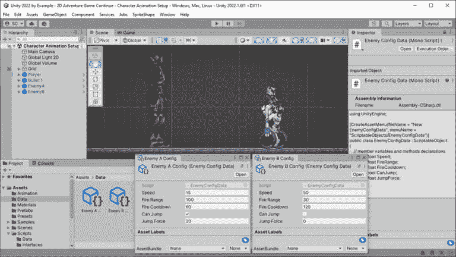

图 7.8 – 敌人配置的多个资产

您也可以从前面的截图中得出结论，邪恶的外星植物实体已经控制了维护机器人，它们现在处于其控制之下！不，不是那个确切的意思，但我已经导入并设置了我们将应用配置数据的敌人演员。

导入、绑定、创建预制件、添加**逆运动学**（**IK**）以及添加动画的过程与我们为玩家角色执行的工作流程相同。要回顾此工作流程，请返回到*第五章*中的*使用 PSD 导入器设置玩家角色*部分。

现在请创建两个敌人的预制件 – **Enemy A**和**Enemy B** – 使用 GitHub 项目仓库中提供的美工；创建自己的，或者作弊并从项目仓库中下载已经完成的敌人预制件（最好不选择最后一个选项，因为您需要练习）。

冒险游戏 2D 艺术资产

要跟随本章内容，请从以下项目 GitHub 仓库下载艺术资产：[`github.com/PacktPublishing/Unity-2022-by-Example/tree/main/ch5/Art-Assets`](https://github.com/PacktPublishing/Unity-2022-by-Example/tree/main/ch5/Art-Assets)

呼！现在我们有了敌人预制件，我们可以添加一个将利用敌人配置数据的组件。在`Assets/Scripts`文件夹中创建一个新的名为`EnemyController`的脚本 – 注意我们现在又回到了创建`MonoBehaviour`脚本：

```cs
Public class EnemyController : MonoBehaviour
{
    [SerializeField]
    private EnemyConfigData _config;
}
```

到现在为止，这个简单的脚本应该对您来说已经很有意义了。我们添加了一个名为`_config`的字段声明，类型为`EnemyConfigData`。我们为访问器提供了一个显式的保护关键字`private`，以便没有其他脚本可以访问它，但添加了`[SerializeField]`属性，这样我们就可以在检查器中进行赋值。

要实现以下截图中的配置，请将`EnemyConfigData`脚本拖动到`Enemy B`预制件（在根对象上），然后将`Assets/Data`文件夹中的`Enemy B Config ScriptableObject`资产拖动到`EnemyController`组件。我们刚刚为我们的敌人添加了变量配置数据！对`Enemy A`重复此操作：

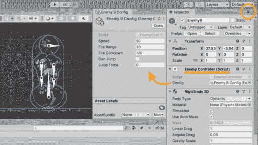

图 7.9 – **Enemy B**配置

要快速访问用于编辑值的`ScriptableObject`资产，请双击分配给**Config**字段的`ScriptableObject`资产引用。或者，您可以通过在**项目**窗口中右键单击资产并选择**属性**来打开**聚焦检查器**。

这样，您可以在工作时不改变检查器到其他选定的对象/资产的情况下查看和编辑数据（这种例子可以在*图 7.8*中看到，其中两个敌人配置都打开了）。

打开**聚焦检查器**也是锁定检查器到单个对象的另一种方法，您可以通过点击**检查器**窗口右上角的锁形图标来实现（如图 7.9 所示）。

既然我们已经有了敌人角色，让我们看看如何通过扩展这些基础预制体来使用预制体变体轻松添加一些变化！

## 创建用于替代敌人类型的敌人变体

当 Unity 最终添加了对 **嵌套预制体**（大约在 Unity 2018.3）的原生支持时，它还包含了一个名为 **预制体变体** 的出色新功能，这对于拥有基于相同基本预制体属性的唯一变体集非常有用。

基础预制体将包含对象所需的所有基本行为，然后可以创建几个变体来覆盖属性，以改变对象的行为或外观。

在我们的例子中，以敌人预制体为例，通过 `EnemyConfigData` 资产分配一组独特的配置值覆盖了基础预制体。这还可能包括颜色、艺术品或组件的变化。

我们通过为游戏中想要拥有的不同敌人特性创建额外的 `EnemyConfigData` 资产来改变配置数据。

额外阅读 | Unity 文档

*预制体变体*: [`docs.unity3d.com/2022.3/Documentation/Manual/PrefabVariants.xhtml`](https://docs.unity3d.com/2022.3/Documentation/Manual/PrefabVariants.xhtml)

## 创建预制体变体

让我们通过使其移动更快、射击更远以及通过缩短冷却时间来提高射速，为玩家创建一个 `Enemy B` 预制体的变体，以增加难度级别。

要做到这一点，让我们按照以下步骤操作：

1.  首先，我们将 `Assets/Data` 文件夹中的 `Enemy B Config EnemyConfigData` 资产文件进行复制：

    1.  点击 `Enemy B Config` 资产在 `Enemy B` 的 `Config Difficult` 中。

    1.  在新资产上，分别调整 `70`、`60` 和 `60` 的值）。

1.  现在，切换到 `Assets/Prefabs` 文件夹。

    1.  右键点击 `Enemy B` 预制体，然后选择 `Enemy B Difficult`。

    1.  在选择新变体并处于 `Assets/Data` 文件夹中时，将 `Enemy B Config Difficult` 资产拖动到 `EnemyController` 组件。

现在我们有一个 `Enemy B` 预制体，分配了不同的 SO 配置数据，但由于我们只覆盖了字段分配，所以敌人对象的其余部分完全相同。

*图 7.10* 展示了在编辑器中分配了困难敌人配置 SO 数据后我们的新敌人预制体变体看起来像什么：*A* 是困难敌人预制体，*B* 显示这个预制体有一个 `Base` 预制体，它是其变体，*C* 显示 SO **配置** 字段的重写分配：

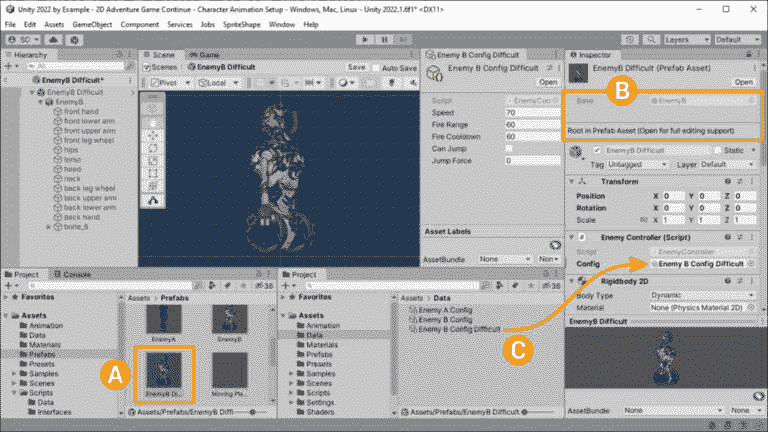

图 7.10 – 困难敌人 B 预制体变体设置

我们可以重复此过程来创建不同类型的敌人或任何其他类型的 Prefab，我们将在游戏中使用。想想看，维护机器人可能开始游戏时没有任何植物侵害，然后随着游戏的进行逐渐建立侵害。我们可以通过简单地覆盖艺术资产来使用 Prefab 变体实现不同阶段的变化。Prefab 变体可以使艺术上的渐进式变化变得容易实现！

通过使用 SO 来覆盖配置数据，我们将数据与 Prefab 资产（包括各种组件、艺术资产、声音、效果等）分离。SO 数据是一个小的对象，可以在不编辑 Prefab 的情况下进行更新，这使得设计师和非程序员更容易访问。

此外，如果只有数据需要更改，那么这只是一个微小的更新，可以在不推送整个 Prefab 资产的情况下推送到正在生产的游戏中。

从本节开始，拥有一组具有独特变化的敌人很好，但如果它们基于其配置数据具有一些行为那就更好了！

下一节将探讨为敌人机器人添加行为。

# 使用 FSM 实现基本敌人行为

在*第二章*中，我们简要介绍了状态模式，因此现在我们将探讨如何实现此设计模式以保持我们敌人角色的状态。具体来说，使用 FSM，我们可以声明敌人可以在任何给定时间处于的固定状态集（即有限）——FSM 只会做这些事情。

我们 FSM 的第一个实现可能不太符合 SOLID 原则，但它希望足够简单，以便在实践中有意义。我们还可以将其用作一个例子，指出该方法中的任何缺陷，并在以后将其重构为更好的东西。

我应该指出，也许我们以后不会重构它……有时候，简单的方法就足够了，仅仅为了重构而重构只是浪费了本可以更好地用于加强核心游戏机制的时间，例如。

额外阅读 | 编程模式

有限状态机解释：[`www.freecodecamp.org/news/finite-state-machines/`](https://www.freecodecamp.org/news/finite-state-machines/)

让我们先看看我们希望我们的敌人角色具有哪些状态或行为。

## 状态模型

回到我们的 GDD 在*第四章*中的*表 4.1*，其中我们大致定义了敌人与玩家交战时的行为，我们可以推导出以下所需的最小状态：**空闲**、**巡逻**、**攻击**、**死亡**。

现在，我们可以设计一个 UML 状态图来表示我们的敌人行为。确定何时在状态之间切换的条件也定义了：

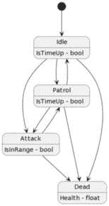

图 7.11 – 敌人行为状态模型

参考图示并使用条件来确定何时从一个状态转换到另一个状态，我们可以观察到以下情况：

+   默认的起始状态是**空闲**

+   当处于**空闲**状态时，当计时器到期时，我们将转换到**巡逻**状态

+   当处于**巡逻**状态时，当计时器到期时，我们将返回到**空闲**状态（例如，**空闲** --> **巡逻** --> **空闲** --> **巡逻**）

+   当处于**空闲**或**巡逻**状态时，当玩家在范围内时，我们将转换到**攻击**状态

+   当处于**攻击**状态时，当玩家移出范围时，我们将返回到**巡逻**状态

+   当健康值为零时，我们将从任何状态转换到**死亡**状态

现在我们知道了需要哪些状态以及哪些条件会改变状态，我们可以继续编写这个状态机了！

## 一个简单的状态机模式

我们将使用枚举来定义我们的有限状态，并在`EnemyController`类中编写状态转换逻辑，以创建我们的第一个状态机。这段代码与你在初学者项目中可能遇到的内容类似，因为它易于理解且易于操作（如前所述，可能只需这些）。

但它确实有一些限制和缺点。第一个是状态机是`EnemyController`类的一部分，违反了**单一职责原则**（**SRP**）。

让我们看看：

```cs
public class EnemyController : MonoBehaviour
{
    …
    public enum State { Idle, Patrol, Attack, Dead }
    private State _currentState;
    private void Start() => ChangeState(State.Idle);
    void Update()
    {
        switch (_currentState)
        {
            case State.Idle:
                // UNDONE: Do stuff --> change state?
                break;
            case State.Patrol:
                // UNDONE: Do stuff --> change state?
                break;
            // And so on.
        }
    }
    public void ChangeState(State state) =>
        _currentState = state;
}
```

如我们所见，我们在`public enum State {}`声明行中定义了我们的状态机状态。我们的状态机只能处于这些定义的状态之一。然后，我们将使用`_currentState`变量来跟踪我们的当前状态。

让我们跳到`ChangeState()`方法，在那里我们可以看到我们将通过传递一个`State`来调用它，将其设置为状态机的当前状态（即转换到不同的状态）。在`Start()`中，你可以看到我们如何调用`ChangeState(State.Idle)`来设置**敌人**的初始（默认）状态为**空闲**。

最后，在`Update()`方法（每帧更新时调用）中，有一个`switch`语句，为`State`枚举中声明的每个状态都有一个实现。当`_currentState`等于定义的枚举状态之一时，我们将执行一些操作——你可以将`switch`语句与一系列的`if`、`else if`、`else if`语句相关联（但当我们不需要测试值范围或条件时，它无疑更易于阅读）。

switch (C#)

**switch**语句是一种**选择控制**语句，它测试一个表达式（类似于**if**语句）并执行由 cases 定义的匹配代码块（并由**break**语句终止）。如果没有匹配的表达式，可以定义一个默认情况。

我并不一定反对这种对状态模式过于简化的方法，但`switch`语句很快就会变得丑陋。随着状态的增多，它可能会变得难以管理，正如我们开始向其中添加条件和行为时将会看到的那样，但至少它不依赖于任意数量的布尔变量来尝试并维护某种形式的状态（而且不需要同时处理两个变量变为真——天哪！）。

基于枚举的方法有一个问题，它破坏了 SOLID 原则中的*O*（`EnemyController`类，即对修改封闭）。我们更希望只更改受影响状态的代码，而不触及其他任何东西！

与状态无关的功能代码不需要重新测试（例如，验收和回归测试），或者在团队环境中，甚至在将状态修改提交到**版本控制系统**（VCS）时也不需要进行代码审查。

至少，这种基于枚举的方法提供了一个结构，使得代码比没有它时更易于阅读，并且在不首先编写状态机的样板代码的情况下，很容易包含状态模式。

你可能能想象我们如何通过将特定状态的所有行为（和数据）封装到一个单独的类中来扩展这个状态模式。如果可以，太好了！如果不可以，也没关系，因为稍后我们会在*第十三章*中处理这个 FSM 的重构！

好吧——现在我们已经排除了所有警告，让我们改变一些状态！

## 改变状态的行为

现在我们已经定义并编码了我们的简单有限状态机（FSM）模式中的有限状态集，你可能想知道我们如何添加改变状态的条件。不用担心——这很简单！

我们将首先添加所需的字段并分配默认值来评估前两个状态的条件。

### 空闲和巡逻行为

参考图 7.11 中的**状态模型**，让我们让敌人在一个特定时间保持空闲（静止）后，在两个位置之间巡逻路径（我们将在关卡中定义）。然后，在巡逻了特定时间后，我们的敌人将返回空闲状态，并在敌人没有攻击玩家或，嗯，死亡的情况下无限重复这个过程。

为了这个，我们首先向我们的`EnemyConfigData` SO 添加两个变量，将指定敌人空闲和巡逻的时间：

```cs
public class EnemyConfigData : ScriptableObject
{
    …
    [Header("Behavior Properties")]
    public float TimeIdle = 5f;
    public float TimePatrol = 15f;
}
```

不要忘记，你可以在编辑器中通过选择`Assets/Data`文件夹中的`Enemy B Config`资产来覆盖这些默认时间值。

现在，回到`EnemyController`类中，我们需要一种方法来跟踪我们何时进入状态，以便计算经过的时间：

```cs
private float _timeStateStart;
public void ChangeState(State state)
{
    _currentState = state;
    _timeStateStart = Time.time;
}
```

我们添加了`_timeStateStart`浮点变量，在`ChangeState()`方法（已从表达式主体更改为主体块）中将其设置为当前游戏时间。调用`ChangeState()`方法为我们提供了一种在进入状态时进行操作的方式，而不仅仅是直接将`_currentState`变量设置为我们要过渡到的新状态（这不会给我们提供选项）。

现在已经设置了所需的字段和分配的值，我们可以继续评估从/到**空闲**和**巡逻**状态的转换条件：

```cs
…
void Update()
{
    switch (_currentState)
    {
        case State.Idle:
            // UNDONE: Do stuff.
            // Change state?
            if (Time.time - _timeStateStart
                >= _config.TimeIdle)
                    ChangeState(State.Patrol);
            break;
        case State.Patrol:
            // UNDONE: Do stuff.
            if (Time.time - _timeStateStart
                >= _config.TimePatrol)
                    ChangeState(State.Idle);
            break;
        …
```

如前述代码所示，我们有一个新的`if`块，它评估当前时间`Time.time`减去我们进入当前状态的时间`_timeStateStart`。如果差异大于或等于我们配置的空闲时间`_config.TimeIdle`，则调用`ChangeState()`方法以过渡到**巡逻**状态。简单易懂！

同样，我们将评估从`_configTimePatrol`值（即敌人应该巡逻多长时间）过渡。现在，你可能想知道：我们如何让敌人角色真正巡逻？

### 实现行为

对于`EnemyController`类，但为了避免重复操作并远离单一职责原则，我们至少将行为抽象成它们自己的类。

因此，我们将通过接口定义行为，这样我们就可以在需要或想要更改它而不修改实现它的类的情况下替换行为代码。

因此，在`Assets/Scripts/Interfaces`文件夹中创建一个新的 C#脚本`IBehaviorPatrolWaypoints`，并为*巡逻* *航点行为*添加以下接口声明：

```cs
public interface IBehaviorPatrolWaypoints
{
    Transform WaypointPatrolLeft { get; }
    Transform WaypointPatrolRight { get; }
    void Init(Rigidbody2D rb, Vector2 direction,
        float acceleration, float speedMax);
    void TickPhysics();
}
```

在这里，我们可以看到我们在关卡中声明了两个点，将创建敌人巡逻路径的`WaypointPatrolLeft`和`WaypointPatrolRight`。我们将在关卡中的每个位置放置一个空 GameObject，并将它们的引用分配到检查器中的这些字段。

为了更好地可视化巡逻路径的概念，参考以下图表，点（蓝色）代表航点（即空 GameObject），虚线（橙色）代表由航点创建的巡逻路径：

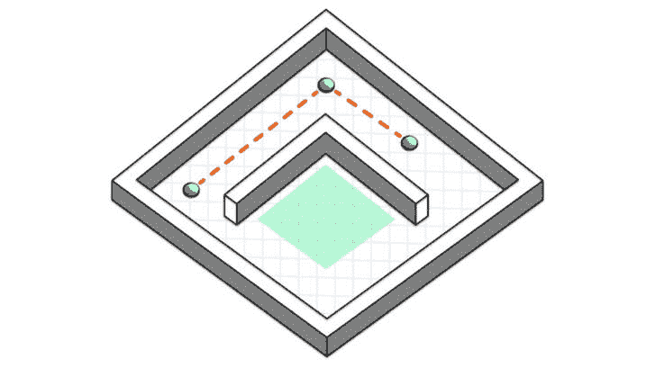

图 7.12 – 航点和巡逻路径

（剧透…玩家应该躲在墙南方的正方形区域（绿色）中，以避免巡逻代理的视线。小心！）

回到代码，我们接着有一个`Init()`方法，它将由实现类调用，并将传递（或者，可以说，*注入*）行为所需的功能参数。

最后是`TickPhysics()`方法的声明，该方法将由实现类的`FixedUpdate()`方法调用以执行在航点之间移动敌人的实际功能（使用物理）。

现在回到 `EnemyController` 类，让我们创建一个 `IBehaviorPatrolWaypoints` 类型的变量。我们将通过使用 `TryGetComponent()` 获取其实例的引用——它应该作为 `EnemyController` 对象上的兄弟组件存在。

```cs
// Implemented behaviors.
private IBehaviorPatrolWaypoints _behaviorPatrol;
private void Awake()
{
    …
    // Get behaviors and initialize.
    if (TryGetComponent<IBehaviorPatrolWaypoints>(
        out _behaviorPatrol))
    {
        _behaviorPatrol.Init(_rb, _movementDirection,
            _config.Acceleration, _config.SpeedMax);
    }
}
```

这就是我们如何在不修改实现类的情况下，用相同类型的其他行为替换行为。通过使用 Unity 的 `GetComponent()` 架构——它允许一种形式的 `MonoBehaviour` 实现 `IBehaviorPatrolWaypoints` 并通过接口获取组件实例。

组合（OOP）

**组合**通常被称为 *具有-关系*，是通过一个类使用实例变量（变量）来引用另一个对象（一个类或另一个类）来实现的。术语 *组合* 也用于描述面向对象编程（**OOP**）中的组合，因为它涉及到将多个对象组合在一起以实现一个结果。

由于 `IBehaviorPatrolWaypoints` 只是一个将对象在两个点之间移动的行为，并且它不必显式地用于敌人，因此它可以用于任何我们想要具有此行为的对象。

好的——在实现行为的最后部分，我们需要将 `TickPhysics()` 方法与 `EnemyController` 类的 `FixedUpdate()` 方法绑定，以便它能够执行其行为功能。我们这样做：

```cs
private void FixedUpdate()
{
    if (_currentState == State.Patrol)
        _behaviorPatrol?.TickPhysics();
    else
        _rb.velocity = Vector2.zero;
}
```

在这里，与 `Update()` 中的情况相同，是在调用当前行为的 `tick` 方法之前检查我们当前的状态（这意味着更多的代码异味，因为状态检查在类的多个地方发生）。

代码异味

**代码异味**指的是源代码中一个 *易于识别的指标*，表明代码库中可能存在更深层次或有趣的问题。这些不是错误也不是错误，而是违反基本原则的违规行为，这会降低代码库的质量。本质上，它们是不可量化的，并且取决于开发者的经验。

如果 `_currentState` 是 `Patrol`，则调用 `_behaviorPatrol?.TickPhysics()`。我们在行为变量（一个接口）上使用了 `null` 条件运算符 (`?.`)，以防敌人对象没有实现 `IBehaviorPatrolWaypoint` 组件。然而，你可能更喜欢不使用 `?.`，并在编辑器中进行游戏测试时让它抛出错误，以验证对象配置。如何工作取决于你（这通常被称为 *开发者风格*）。

空条件运算符 (?.) 和 Unity 对象

注意，空传播与 Unity 对象不兼容，因为 Unity 覆盖了空比较运算符（以正确返回已销毁但尚未垃圾回收的对象的 null）。当尝试在 Unity 对象上使用 **?.** 运算符时，你的 IDE 应该提供警告（如果没有，那么就换一个新的 IDE）。正确的方法是简单地使用空比较。例如：

NO

**_player?.Jump();**

YES

**if (_player !=** **null**)

**_player.Jump();**

完全实现行为的最后一步是创建一个实现 `IBehaviorPatrolWaypoints` 的类，并包含移动逻辑。我将在稍后的 *第十三章* 中展示完成后的代码，当我们重构和扩展敌人行为逻辑时，但现在，我要挑战你创建自己的脚本！

为了给你一个提示，看看我们是如何给玩家添加移动的（记住 – 使用物理；不要直接操作变换位置！）并从这个新组件脚本的类声明开始，命名为 `PatrolWaypoints`：

```cs
public class PatrolWaypoints
    : MonoBehaviour, IBehaviorPatrolWaypoints
{
     // Do move between waypoints stuff.
}
```

或者，你可以作弊。我的意思是，现在就看看 GitHub 项目文件中这本书的最终代码：[`github.com/PacktPublishing/Unity-2022-by-Example/tree/main/ch7/Unity%20Project/Assets/Scripts/Behaviors`](https://github.com/PacktPublishing/Unity-2022-by-Example/tree/main/ch7/Unity%20Project/Assets/Scripts/Behaviors)。

我们将以相同的方式实现每个其他行为，在每个需要处理当前状态的方法中添加一个新的状态条件检查，以及执行以下操作：

+   声明一个实例变量并使用 `GetComponent()` 获取引用

+   通过其 `Init()` 方法初始化行为实例并提供所需的依赖项

+   将对其 `TickPhysics()` 方法的调用添加到 `FixedUpdate()` 中以执行其功能

优化提示

在我们的基类 – **EnemyController**（在这种情况下）中实现行为，这意味着我们不需要为任何行为注册和调用其自己的 **FixedUpdate()** Unity 消息事件；因此，调用一个 **tick** 方法会更有效率，因为它减少了互操作开销（C# 代码从 C++ 引擎代码中调用）——如果我们有很多敌人，这肯定会有所增加！

然而，正如你所见，这实际上是通过基于枚举的状态模式变得有些丑陋了。现在，让我们继续设置过渡到 **攻击** 状态的条件。

### 攻击玩家的行为

我们需要一些额外的引用来为 **攻击** 行为提供 – 特别是玩家。毕竟，你无法攻击你看不见的东西。

在 *第四章* 中，我们在检查器中为我们的 `Player` 对象分配了 `Player` 标签，以确定是否是玩家与碰撞事件交互。嗯，我们现在将再次使用这个标签，但方式不同。

我们将使用标签作为 `FindWithTag()` 方法的参数，以获取场景中 `Player` 对象的引用。

额外阅读 | Unity 文档

**FindWithTag**: [`docs.unity3d.com/2022.3/Documentation/ScriptReference/GameObject.FindWithTag.xhtml`](https://docs.unity3d.com/2022.3/Documentation/ScriptReference/GameObject.FindWithTag.xhtml)

由于我们的敌人 Prefabs 可能会在运行时被实例化到场景中，因此我们需要动态地获取 `Player` 的引用，而不是将其分配给在检查器中公开的字段。因此，不可能进行这种分配（场景引用不能在基于文件的资产，如 Prefabs 和 SOs 中进行）。

仍然在 `EnemyController` 中，一旦我们获得了 `Player` 的引用，让我们检查与玩家的距离，如果玩家在我们的任意范围值内，则将状态更改为 **攻击**：

```cs
private GameObject _player;
private void Awake() =>
    _player = GameObject.FindWithTag(Tags.Player);
private bool IsPlayerInRange(float rangeAttack)
{
    var distance =
        Vector2.Distance(transform.position,
            _player.transform.position);
    return distance <= rangeAttack;
}
```

我们首先声明一个 `_player` 变量来保存 `Player` 对象的 GameObject 引用。然后，在 `Awake()` 中，我们使用 `FindWithTag()` 通过传递之前声明的字符串常量 `Tags.Player` 在场景中找到玩家。

优化说明

**FindWithTag()** 是一个慢速命令，但我们会在 **Awake()** 中执行它，以便在游戏统计信息之前获取玩家的引用（即缓存引用）。通常，你不会想在游戏过程中这样做，因为它很慢，更不用说在 **Update()** 中了，因为这是每帧都会调用的！

接下来，我们添加 `IsPlayerInRange()` 方法来计算到 `Player` 对象的距离，使用高级三角几何数学！不——你已经在之前的代码中看到，我们只是使用 `Vector2.Distance()` 方法，并传递 `Enemy` 和 `Player` 的当前位置来获取它们之间距离的浮点值。简单易懂！

之前，我们使用 `return` 关键字来停止方法中的代码执行。这里，我们做的是同样的事情（有点类似；在这种情况下，这是最后一个语句），但由于 `IsPlayerInRange()` 方法的签名被声明为 `bool` 而不是 `void`，我们需要返回一个布尔值，即 `Vector2.Distance()` 返回的距离小于或等于（`<=`）指定的 `rangeAttack` 值的结果。

问题

**EnemyController** 类是声明 **IsPlayerInRange()** 方法的最佳位置吗？这遵循 SRP 吗？如果我们需要更改计算玩家距离的逻辑，这会负面影响其他代码吗？

当你在思考这个问题时，我会把它留在 **EnemyController** 中（现在吗？）。

最后，随着我们的依赖项现在就位，让我们连接进入和退出 **攻击** 状态的条件：

```cs
void Update()
{
    switch (_currentState)
    {
        case State.Idle:
            // UNDONE: Do stuff.
            // Change state?
            if (IsPlayerInRange(_config.AttackRange))
                ChangeState(State.Attack);
            else if (Time.time - _timeStateStart
                >= _config.TimeIdle)
                    ChangeState(State.Patrol);
            break;
        …
        case State.Attack:
            // UNDONE: Do stuff.
            if (!IsPlayerInRange(_config.AttackRange))
                ChangeState(State.Patrol);
            break;
        …
```

如果我们回顾 `is [player] in range` 条件，并在满足条件时过渡到 **攻击** 状态。

我们将通过向我们的 `Change state?` `if` 块中添加 `IsPlayerInRange()` 并传递此敌人对象配置的 `AttackRange` 值来实现这一点。如果在范围内，那么：`ChangeState(State.Attack)`！

相反，在 `!`) 调用 `IsPlayerInRange()` 来反转结果（逻辑非运算符在结果为 `true` 时返回 `false`）——这改变了评估从 *玩家是否在范围内* 到 *玩家不在范围内*。

以下代码（为了简洁）未显示，但`IsPlayerInRange()`条件检查（正如我们的状态模型所说的那样）。

现在，让我们看看我们如何处理我们的状态模型中的最终状态：**死亡**状态（实际上，这确实是非常最终的）。

### 死亡状态

现在，敌人将能够在范围内攻击玩家——我们将在下一章中查看实现确切攻击行为，*第八章*，当玩家攻击并使感染机器人敌人失去行动能力时；然而，现在我们可以提供一个**死亡**状态来处理这种情况。

当我们切换到这个状态时，我们将简单地像这样销毁**敌人**GameObject：

```cs
void Update()
{
    switch (_currentState)
    {
        …
        case State.Dead:
            Destroy(gameObject);
            break;
    }
}
```

使用`Destroy()`这样是可以的，因为我们仍然可以使用敌人的`OnDestroy()` Unity 消息事件为其添加**死亡**效果。

额外阅读 | Unity 文档

**MonoBehaviour.OnDestroy**: [`docs.unity3d.com/2022.3/Documentation/ScriptReference/MonoBehaviour.OnDestroy.xhtml`](https://docs.unity3d.com/2022.3/Documentation/ScriptReference/MonoBehaviour.OnDestroy.xhtml)

然而，条件需要在`switch`语句之外进行检查，因为我们想要持续检查某些生命值变为零——无论当前状态如何。我们可以通过在`switch`语句之后添加一个`if`语句来实现这一点——`switch`部分只是为了处理当前状态！

```cs
void Update()
{
    switch (_currentState)
    …
    // Any state.
    if (_health <= 0)
    {
        ChangeState(State.Dead);
    }
}
```

目前不必太担心`_health`变量；我们将在*第八章*中实现生命值和伤害系统。正如您在前面的代码中所看到的，我们只是检查这个敌人的生命值是否等于或低于零，如果是，就将其更改为**死亡**状态。

本节向您介绍了状态模式、状态模型 UML 图，以及根据状态模型为我们的敌人角色设置简单的有限状态机（FSM）来管理不同状态。

# 摘要

在本章中，我们通过引入 URP 后处理、**着色器图**、2D 灯光和**轨迹渲染器**效果，为射击和玩家角色添加了一些润色。哇！有了 Unity 提供的这些功能，我们可以轻松地为我们的游戏添加视觉质量。

我们继续通过创建两个敌人 Prefab 并为每个通过 ScriptableObject 资产分配唯一的配置变量来向游戏中添加一些可配置的敌人角色。然后，通过实现状态模式并使用 FSM 引入基本行为以及评估状态间转换的条件，为敌人对象赋予行为。

在下一章中，我们将通过添加敌人生命值和伤害系统来完善冒险游戏，我们将这些敌人实例化到关卡中，实现带有额外武器类型的攻击机制，创建一个简单的任务系统来收集解决入口谜题的关键对象，并引入一个新的事件系统以保持我们的代码松散耦合。
