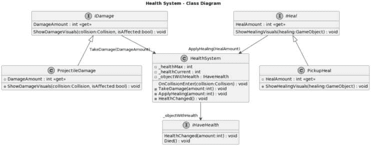
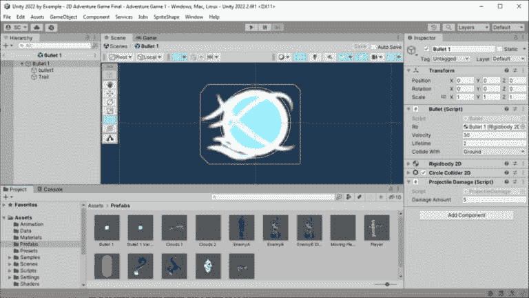
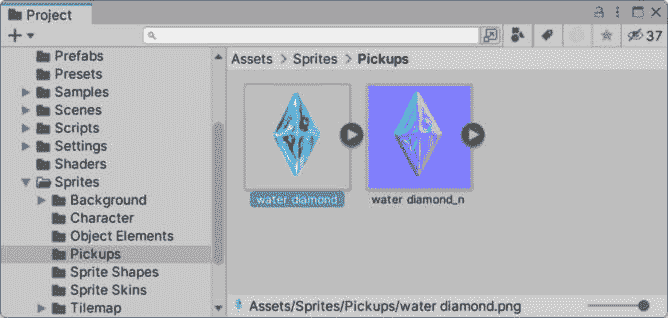
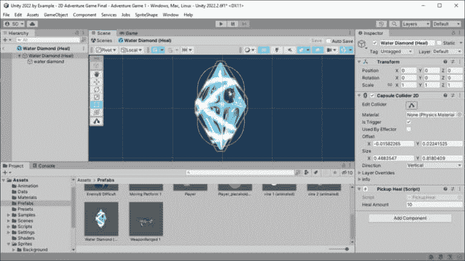
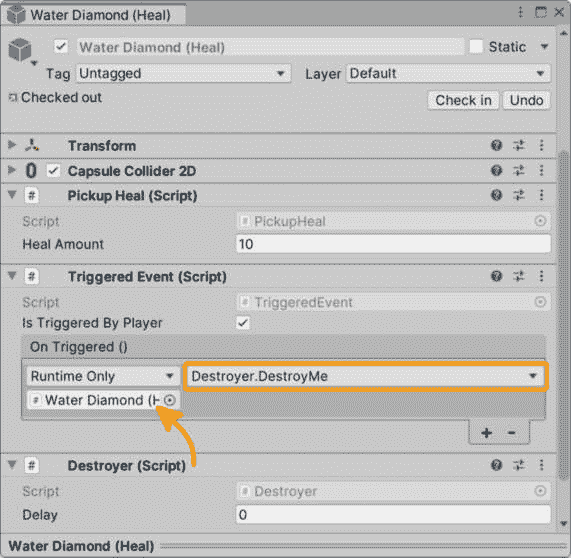
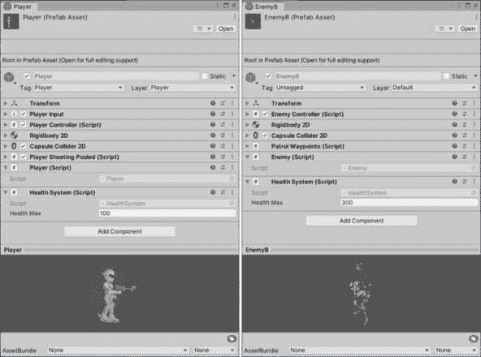
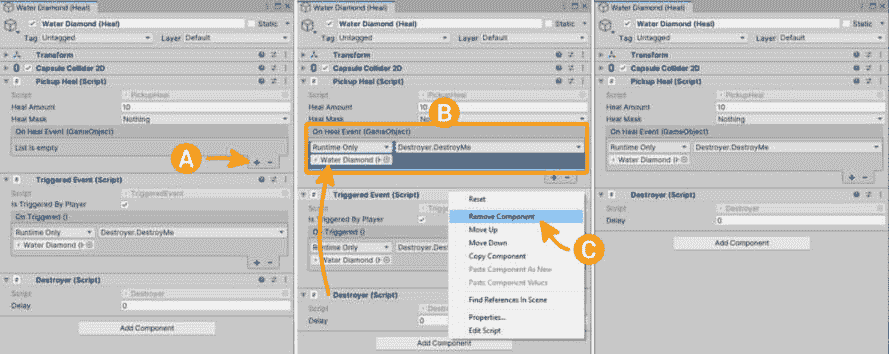
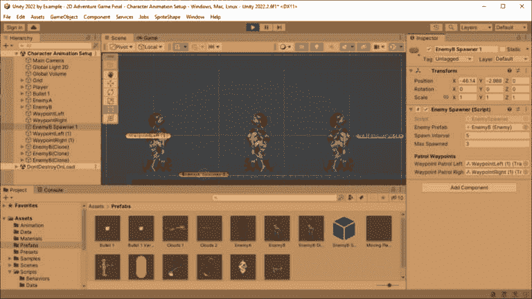
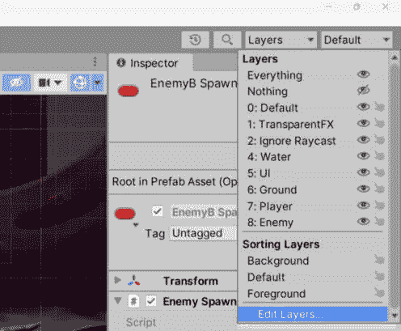
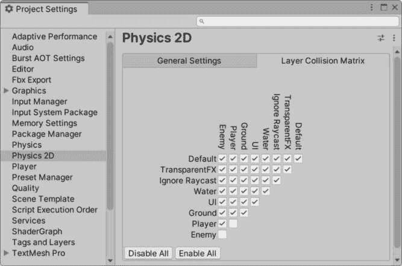

# 扩展冒险游戏

在*第七章*中，我们通过应用一些简单的 VFX（主要是 Bloom）使用通用 RP、Shader Graph 为自定义 2D 着色器制作发光特定部分的精灵、2D 灯光突出玩家，以及使用 Trail Renderer 组件在我们的子弹精灵上快速实现 VFX，从而为游戏添加了润色。

我们随后将注意力从玩家转移到游戏中急需关注的敌人 NPC 上，通过使用 ScriptableObject 架构创建可配置的敌人，并引入基于状态模式的变化行为，实现了简单的有限状态机（FSM）。

在可玩角色和敌人（行为设置主要是）的基础功能到位后，我们现在可以继续添加攻击玩家的敌人以及反之亦然的敌人，使用可重用的生命值和伤害系统。

在本章中，我们将涵盖以下主要主题：

+   生命值和造成伤害

+   更新玩家和敌人使用生命值

+   敌人波生成器

到本章结束时，你将能够生成具有简单生命值和伤害系统的敌人——这些系统也适用于游戏中的玩家或任何可伤害的对象！

# 技术要求

要跟随本章中为书中项目创建的相同艺术作品，请从以下 GitHub 仓库下载资源：

[`github.com/PacktPublishing/Unity-2022-by-Example`](https://github.com/PacktPublishing/Unity-2022-by-Example)

要跟随自己的艺术作品，你需要使用 Adobe Photoshop 或能够导出分层 Photoshop PSD/PSB 文件的图形程序（例如，Gimp、MediBang Paint、Krita 和 Affinity Photo）创建类似的艺术作品。

# 生命值和造成伤害

在我们的项目进行到这一点时，我们已经实现了我们在 GDD 中指定的许多内容（*第四章*，*表 4.1*）为我们玩家角色和敌人，但一个重要的系统仍然缺失——生命值和伤害。

在接下来的章节中，我们不仅将解决为玩家和敌人添加可重用组件以使用生命值，还将完成敌人的攻击行为，对玩家造成伤害。玩家已经可以发射能够发射弹丸的武器，因此我们将向之前在*第六章*中制作的`Bullet`对象添加功能，使其也能造成伤害。

## 生命值系统

我们将开发一个`HealthSystem`组件，为`Player`、敌人和其他对象（例如，在环境中——想想可破坏的箱子）创建一个可重用的组件。这个生命值系统将跟踪生命值，受到伤害和/或治疗，并且可以添加到任何对象。其余的设置将包括创建接口，将系统连接起来，并使整个系统以抽象的方式运行（即可重用、可扩展、可维护）。

如同之前一样，为了清楚地了解我们将如何创建健康系统，我们将利用基于我们前面段落中描述的概念的 UML 图。如果需要，我们始终可以参考此图。



图 8.1 – 健康系统类图

现在，让我们深入探讨！在`Assets/Scripts`文件夹中创建一个新的脚本，并将其命名为`HealthSystem`。由于它是 UML 图的核心，因此将成为我们为健康系统创建的最大的类，因为，嗯，它**确实是**健康系统！由于它将包含我们将在本节中编写的最多代码，我们将首先仅声明成员变量和一个 Unity 消息事件，然后随着我们构建系统的功能，逐步完善它：

```cs
using UnityEngine;
public class HealthSystem: MonoBehaviour
{
    [SerializeField] private int _healthMax;
    private int _healthCurrent;
    private void OnTriggerEnter2D(Collision collision)
    {
        // UNDONE: Test for a collision with a component
        // that can damage us.
        // UNDONE: HandleDamageCollision();
        // UNDONE: Test for a collision with a component
        // that can heal us.
        // UNDONE: HandleHealCollision();
    }
}
```

任务列表（IDE）

您无疑在先前的代码中看到了**// UNDONE:**，并可能想知道这是关于什么的。嗯，我们可以在我们的注释中使用一些标记，我们的 IDE 会识别它们，并基于它们生成任务列表！此功能帮助我们定位未完成的任务，并突出需要关注的事项。此外，您还可以创建自己的自定义标记，这对于您的特定需求可能非常有用（但您需要检查您的特定 IDE 是否支持）。

常见标记包括以下内容：

**//** **TODO:**

**//** **UNDONE:**

**//** **HACK:**

如您可能从我们迄今为止的代码中推断出的一样——如果您已经阅读了代码注释——`HealthSystem`通过与其他场景中的对象发生碰撞来工作，例如来自敌人的投射物或治疗拾取物。其他对象可以损坏或治疗带有`HealthSystem`组件的对象，这取决于对象继承的接口（从 UML 图中：`IDamage`和`IHeal`）。甚至地面作为一个对象，如果玩家的速度在碰撞时超过某个阈值，也可能对玩家造成潜在伤害。

以下是迄今为止添加的代码的分解，以及所需添加的内容：

+   变量声明将启用`HealthSystem`的核心功能：

    +   `_healthMax`将指定对象的最大健康值（即，通过添加`HealthSystem`组件赋予健康值的对象）。

    +   `_healthCurrent`将指定对象的当前健康值。当对象被损坏或治疗时，此值将相应地减少或增加。当对象在场景中创建时，我们应该将当前健康值设置为`_healthMax`值，我们现在将通过添加以下`Awake()` Unity 消息事件来完成此操作：

        ```cs
            private void Awake()
            {
                _healthCurrent = _healthMax;
            }
        ```

    +   注意，这里最大健康值（`_healthMax` 是序列化存储的值）将保存在 `Object with Health` 预制件中，但想象一下，你也可以使用 ScriptableObject、数据库、从云端获取的（JSON）数据，甚至 Unity 的 **Remote Config**（作为 **Unity Gaming Services** 的一部分），这样我们就可以动态地更改最大健康值（并且，使用这些方法中的某些，可以在任何时间进行更改，而不依赖于分发游戏的新版本）。

额外阅读 | Unity Gaming Services

远程配置：[`unity.com/products/remote-config`](https://unity.com/products/remote-config)

+   `OnTriggerEnter2D()` 是魔法发生的地方！与其他对象的碰撞驱动健康系统，因此我们将使用这个 Unity 消息事件来处理从物理系统触发的交互。

让我们先添加伤害和治疗方法，然后我们再添加调用这些方法的评估：

注意 | 物理交互

要使对象在碰撞时相互物理响应，请在没有启用 **IsTrigger** 的对象上使用 **Collider** 实例，并使用 **OnCollisionEnter2D()** Unity 消息事件来响应碰撞。要使对象在碰撞时没有物理响应，请使用具有启用 **IsTrigger** 字段的 **Collider** 实例，并使用 **OnTriggerEnter2D()** Unity 消息事件来响应碰撞。

+   `HandleDamageCollision()`，正如其名所示，处理当我们与可以伤害我们的另一个对象碰撞时的情况。我们将传递当调用 `OnTriggerEnter2D()` 时的碰撞参数，以及未来的添加，造成伤害的对象（该对象是从 `IDamage` 接口继承的）。

+   将以下方法添加到 `HealthSystem` 类中：

    ```cs
    internal void HandleDamageCollision
        (Collider2D collision, IDamage damage)
    {
        // UNDONE: TakeDamage(amount);
    }
    ```

+   好的，是的，我们在这里又添加了一个未完成的方法，我们将在稍后再次添加：`TakeDamage()`。我们正在保持方法简单，一次迈出一小步来构建健康系统。简单的 UML 图可能设定了一个期望，这将是容易的。嗯，是的，前提是我们一步一步地处理实现。

+   在接下来的 *Taking damage – IDamage interface* 部分中，当我们添加所需的 `IDamage` 接口时，我们的未来自我将再次处理实现 `TakeDamage()` 方法。

+   `HandleHealCollision()` 方法与处理伤害的方法类似。我们将添加一个用于处理对象治疗的方法。然而，这次我们将省略传递 `collision` 对象作为参数；我们将对治疗的处理与受到伤害的处理有所不同（正如你将在接下来的 *Healing – IHeal* 接口部分中看到的）。

+   将以下方法添加到 `HealthSystem` 类中：

    ```cs
    internal void HandleHealCollision(IHeal heal)
    {
        // UNDONE: ApplyHealing(amount);
    }
    ```

+   好的，我们正在不断增加要在这里实现的方法，对吧？！就像 `TakeDamage()` 方法一样，我们将有一个用于治疗和改变受影响对象健康值的方法。

这就是`HealthSystem`类核心内容的布局。让我们继续添加我们新的健康系统类所继承的必需接口，并使事物真正运行起来！

## 需要接口！

在我们将`HealthSystem`组件添加到任何 GameObject 之前，还有很多工作要做，所以让我们整理并评估这些伤害和治疗的碰撞。

我们首先需要接口来评估与具有健康（例如，添加了`HealthSystem`组件的`Player`或敌人对象）发生碰撞的对象。我们将确定碰撞对象是否可以造成伤害或治疗——我们正在替换任务列表中的第一个`UNDONE`标记：

```cs
    // UNDONE: Test for a collision with a component
    // that can damage us.
```

从 UML 图中，我们可以看到我们想要评估的对象要么是从`IDamage`或`IHeal`继承的。使用接口继承确保我们的类中存在提供预期功能所需成员（即，类必须满足接口的“契约”）。

标准的命名约定规定，在命名一个接口时，它应该以字母“*I*”开头，这为我们提供了一个机会，在命名上变得稍微聪明一点，甚至可以让人印象深刻，从而提高代码库的可读性。因此，对于一个可以损坏另一个对象的实体，我们将接口命名为`IDamage`——就像*I damage [an object]*。在*治疗 – IHeal 接口*部分，我们将添加额外的接口`IHaveHealth`和`IHeal`——看看我们在这里做了什么。并不是说我在这里非常聪明，因为`IDamage`、`IDamageable`和`ITakeDamage`对于游戏代码来说是非常常见的接口名称，原因相同的命名理由。

现在，让我们更新`OnTriggerEnter2D()`方法，添加以下包含接口的`if`语句（我们将在这一步之后创建这些接口）：

```cs
    private void OnTriggerEnter2D(Collision collision)
    {
        // Test for a collision with a component that can
        // damage us.
        if (collision.
            TryGetComponent<IDamage>(out var damage))
        {
            HandleDamageCollision(collision, damage);
        }
        // Test for a collision with a component that can
        // heal us.
        else if (collision.
            TryGetComponent<IHeal>(out var heal))
        {
            HandleHealCollision(heal);
        }
    }
```

让我们看看以下两个评估以及它们如何为我们的健康系统提供所需的功能：

+   `collision.TryGetComponent<IDamage>()`：如果你到现在还没有意识到，我是一个*try get component 模式*的粉丝——如果测试的对象上不存在该组件，我们可以优雅地失败。如果它存在，我们方便地有一个返回组件的`out`参数。简单！

优化提示

当使用**TryGetComponent**方法时，如果找不到组件，该方法不会在堆上分配内存。当它找到组件时，它只为返回值分配内存，而不是组件本身。这可以非常有益于提高性能和减少垃圾回收，与可以生成垃圾并分配更多内存的**GetComponent**方法相比——两者都会对性能产生负面影响。通过利用**TryGetComponent**，你可以避免不必要的内存分配，并保持游戏运行得像黄油一样顺滑。

因此，这里发生的情况是，如果我们碰撞的对象上有一个从 `IDamage` 继承的组件，即 *我伤害这个对象*，那么返回该组件并将其作为参数传递给 `HandleDamageCollision()`，同时传递碰撞对象本身。向前看一点并参考 UML 图，我们可以看到我们将实现一个 `ProjectileDamage` 组件（例如，在 `Bullet` 上），它继承自 `IDamage`。

+   `collision.TryGetComponent<IHeal>()`：这里也是一样。如果碰撞的组件上有一个从 `IHeal` 继承的组件，即 *我治疗这个对象*，那么返回该组件并将其传递给 `HandleHealCollision()`。再次参考 UML 图，我们可以看到我们将实现一个 `PickupHeal` 组件（例如，在 Water Diamond 上），它继承自 `IHeal`。

目前，如果碰撞的对象既不造成伤害也不治疗，那么我们只需忽略碰撞（当然，当与任何东西碰撞时，这里显然的选择是进行相机震动！）。

现在我们有了接口的实现，我们需要实际创建它们。这些接口不会自己编写，所以让我们从 `IDamage` 开始。

## 受伤 – IDamage 接口

我们已经看到了 UML 图（*图 8**.1*）和 `HandleDamageCollision()` 代码，其中实现了 `IDamage` 接口，但尚未定义。我上面也撒了谎：如果我们使用 IDE 的重构工具，它们可以（至少部分地）自己编写（在 `OnTriggerEnter2D()` 中，`IDamage` 将有一个红色的波浪线）。在单词上右键单击（或在其上单击并按 *Alt + Enter* 或 *Ctrl + .* 取决于您的 IDE）并选择 **在新的文件中生成接口`IDamage`** 将生成以下内容：

```cs
internal interface IDamage
{
}
```

如果您决定不使用重构工具（为什么不呢？），在 `Assets/Scripts/Interfaces` 文件夹中创建一个新的 C# 脚本，并将其命名为 `IDamage`。即使您使用了重构工具，您可能仍然需要将生成的脚本移动到 `Assets/Scripts/Interfaces` 文件夹中，以保持整洁。

现在，我们需要一个字段来指定从 `IDamage` 继承的对象对具有生命值的对象造成伤害的值，所以添加一个 `DamageAmount` 变量声明，如下所示：

```cs
    int DamageAmount { get; }
```

记住，接口的所有成员都是公共的，因此不需要添加访问器。我们将属性设置为只读属性；我们只想让其他类读取值（不允许在继承接口的类之外修改 – 所有这些都很好，符合我们的喜好）。

现在我们有了 `IDamage` 接口。我们可以用它来制作投射物，以及，嗯，几乎任何其他伤害玩家的对象，通过在对象与 `HealthSystem` 之间发生碰撞时减去生命值。

现在，让我们回到 `HealthSystem` 类中修复 `HandleDamageCollision()` 方法，通过移除 `// UNDONE:` 注释并使用 `DamageAmount` 作为参数：

```cs
    internal void HandleDamageCollision
        (Collider2D collision, IDamage damage)
    {
        TakeDamage(damage.DamageAmount);
    }
```

这样我们就为我们的 IDE 的重构工具生成 `TakeDamage()` 方法做好了准备，所以让我们继续这样做。你知道的：红色波浪线等，然后选择 **生成** **方法‘TakeDamage。’**。

现在我们就到了这里：

```cs
    private void TakeDamage(int amount)
    {
        // UNDONE: Subtract from current health.
        // UNDONE: HealthChanged();
    }
```

我非常抱歉，有更多的 *未完成* 注释！请不要担心；通过这个非常临时的指令，我们将立即修复代码。在方法中填写以下语句：

```cs
    private void TakeDamage(int amount)
    {
        _healthCurrent = Mathf.Max(_healthCurrent - amount,
            0);
        HealthChanged();
    }
```

我们首先做的事情是更新当前健康值，通过从 `_healthCurrent` 中减去 `amount` 来计算受到的伤害量。在这里，我们得到了 `Mathf.Max()` 函数的帮助，这样当前健康值永远不会低于零（保持正值）。

附加阅读 | Unity 文档

**Mathf.Max()**: [`docs.unity3d.com/2022.3/Documentation/ScriptReference/Mathf.Max.xhtml`](https://docs.unity3d.com/2022.3/Documentation/ScriptReference/Mathf.Max.xhtml)

让我们取消注释 `HealthChanged()` 方法的占位符。创建一个空的方法块，但完成此方法将是我们的未来自我在实际上有一些设置来执行健康变化时的任务：

```cs
    private void HealthChanged()
    {
        // UNDONE: If current health is greater than zero,
        // notify the object with health.
        // UNDONE: If current health is zero, the object
        // with health dies/is destroyed.
    }
```

当健康值发生变化时，我们将调用此方法，这样我们就可以评估对象的当前健康状态并根据情况执行操作 – 例如通知其他类关于对象健康值的变化或如果健康值达到零则死亡/销毁。

因此，现在让我们设置一个对象，该对象将对玩家造成伤害。

## 子弹伤害组件

在 `Assets/Scripts` 文件夹中创建一个新的脚本名为 `ProjectileDamage` – 这是我们将添加到 `Bullet` 预制体的组件。为了确保此组件将对我们的健康系统造成伤害，它将实现 `IDamage` 接口：

```cs
using UnityEngine;
public class ProjectileDamage : MonoBehaviour, IDamage
{
    public int DamageAmount => _damageAmount;
    [SerializeField] private int _damageAmount = 5;
}
```

公共 `DamageAmount int` 变量必须声明以满足 `IDamage` 接口合约 – 它对于健康系统获取此弹头造成的伤害量值也是必要的！`DamageAmount` 是一个公共属性，因为所有接口成员都是公共的，并且不能包含字段。由于 C# 属性不会被 Unity 序列化，为了在 `Bullet` 预制体中分配值，我们将封装一个私有 `_damageAmount` 变量，并用 `[SerializeField]` 属性装饰它。如果你还没有猜到，这就是我们将继续整本书的结构。

当你保存完脚本后，打开 `Bullet` 预制体中的 `ProjectileDamage` 到根 GameObject，如图所示：



图 8.2 – 子弹预制体中的 Bullet Prefab ProjectileDamage 组件

在前面的代码中声明 `_damageAmount` 时，我们将其默认值设置为 `5`，你已经在 **检查器** 窗口中看到的分配值中看到了这一点。

好的，我们现在可以伤害东西了；太棒了！但如果我们的玩家等对象没有机会治疗，那就真的不太公平了。

## 治疗 – IHeal 接口

我们已经处理了 UML 图（*图 8**.1*）的左侧，所以现在，类似于`IDamage`，我们需要定义`IHeal`接口来处理右侧。我们还将创建一个组件，可以添加到可以应用治疗的对象上。

现在回到`OnTriggerEnter2D()`方法中，让我们重复创建`IDamage`接口时执行的步骤，但这次是为`IHeal`：

1.  在`Assets/Scripts/Interfaces`文件夹中创建`IHeal`接口脚本（由您的 IDE 生成），并为指定治疗量添加`HealAmount`变量：

    ```cs
    internal interface IHeal
    {
        int HealAmount { get; }
    }
    ```

1.  更新占位符`HandlHealCollision()`方法，在调用`ApplyHealing()`时指定接口中的`HealAmount`值作为参数：

    ```cs
        private void HandleHealCollision(IHeal heal)
        {
            ApplyHealing(heal.HealAmount);
        }
    ```

1.  最后，创建`ApplyHealing()`方法：

    ```cs
        private void ApplyHealing(int amount)
        {
            _healthCurrent = Mathf.Min(_healthCurrent + amount,
                _healthMax);
            HealthChanged();
        }
    ```

我们首先更新当前健康值，通过将`amount`添加到`_healthCurrent`来增加治疗量。就像我们受到伤害时一样，我们再次从`Mathf`函数中获得一些帮助，但这次是`Mathf.Min()`，这样当前健康值就不会超过对象的最高健康值（没有作弊）。

附加阅读 | Unity 文档

**Mathf.Min**: [`docs.unity3d.com/2022.3/Documentation/ScriptReference/Mathf.Min.xhtml`](https://docs.unity3d.com/2022.3/Documentation/ScriptReference/Mathf.Min.xhtml)

然后，就像伤害一样，我们将创建一个治疗组件，当发生碰撞时将增加健康值。

### PickupHeal 组件

在`Assets/Scripts`文件夹中创建一个名为`PickupHeal`的新脚本：

```cs
using UnityEngine;
public class PickupHeal : MonoBehaviour, IHeal
{
    public int HealAmount => _healAmount;
    [SerializeField] private int _healAmount = 10;
}
```

与`ProjectileDamage`脚本类似，我们可以看到我们已从`IHeal`继承（以确保使用我们的健康系统进行治疗）并通过定义`HealAmount`实现了`IHeal`接口。我们还通过声明一个序列化的私有`_healAmount`变量来封装`HealAmount`，这样我们就可以在`10`处设置值）。

关于代码架构的说明

如果您发现自己需要许多不同类型的伤害或治疗组件，可以为每个创建一个新的基类，实现接口，这样您就不必重复事件和调用的方法和函数。当前的实现适合我们的当前需求，因此您也可以在这里停止，或者挑战自己创建一个**DamageBase**和**HealBase**抽象类，分别由**ProjectileDamage**和**PickupHeal**继承。

`PickupHeal`是一个我们将添加到…嗯…我们将添加到哪个对象上？让我们参考我们的 GDD（*第四章*，*表 4.2*）：

| **在冒险游戏中，玩家如何获得增益机制？** | 玩家将能够收集散布在环境中的能量碎片（水钻石），当收集到一定数量的碎片时，将使所有武器获得增强状态（增加造成的伤害）。 |
| --- | --- |

表 8.1 – 在 GDD 中添加增益

听起来不错。实际上，我认为我们可以做得更好。让我们修订；毕竟，GDD 是一个活文档：

| **在冒险游戏中，玩家如何获得增益机制？** | 玩家在探索游戏世界时可以收集能量碎片（水钻石）。玩家可以稍后使用收集到的能量来增强武器（增加造成的伤害）或治疗自己，为玩家在导航游戏挑战时提供更多策略选择。 |
| --- | --- |

表 8.2 – 修订 GDD 中的增益

更好！允许玩家在使用能量碎片为武器充电或治疗自己之间做出选择，这为游戏创造了一种风险与回报的策略。为了使这种机制对玩家有意义，游戏设计师必须仔细考虑这种方法，尤其是如果选择只有在某些时候才清晰的话！

目前，让我们只创建一个当拾取时将治疗玩家的对象。

### 创建水钻石拾取

让我们使用以下链接提供的艺术品中的水钻石：[`github.com/PacktPublishing/Unity-2022-by-Example/tree/main/ch8/Art-Assets`](https://github.com/PacktPublishing/Unity-2022-by-Example/tree/main/ch8/Art-Assets)。



图 8.3 – 水钻石艺术品

要根据水钻石的艺术作品创建我们的水钻石拾取预制件，并且作为一个提醒，请按照以下步骤操作：

1.  将艺术品导入到`Assets/Sprites/Pickups`文件夹。（顺便说一句，我喜欢这个水钻石艺术作品的效果；做得好，Nica！）

1.  在**项目**窗口中，选择水钻石精灵，并在**检查器**窗口中，使用**精灵编辑器**将提供的正常图设置为次级纹理。

1.  将水钻石精灵拖动到`Water Diamond (Heal)`（记住，你可以在**层次结构**窗口中通过右键单击它并选择**创建** **空父对象**来轻松地将 GameObject 设置为父对象）。

1.  将`CapsuleCollider2D`实例添加到父对象，以启用物理（确切地说，是碰撞检测）。

1.  使用**编辑碰撞器**按钮启用围绕钻石形状的碰撞器调整大小，如图所示。



图 8.4 – 水钻石治疗预制件

1.  将`PickupHeal`组件添加到预制件根目录（也见*图 8**.4*）。

1.  最后，从`Assets/Prefabs`文件夹中拖动父对象。

为了快速提升视觉效果，你可以稍微作弊一下（作为独立游戏开发者，我们可以在任何地方节省时间，所以作弊是关键）并重用我们在*第七章*中为子弹创建的材料。按照以下步骤操作：

1.  在`Assets/Materials`文件夹中，复制`Bullet 1`材质并将其重命名为`Water` `Diamond 1`。

1.  将水钻石精灵分配给`MainTex`通道，但保留`bullet1_emission`贴图。

1.  将此新材质分配给**Water Diamond 1**预制件的图形上的**Sprite Renderer Material**字段。

1.  调整 HDR 颜色和强度以获得所需的视觉效果。

我们的拾取预制件看起来不错。太棒了！

我们需要为这个预制件添加最后一点功能，使其成为玩家的拾取对象。它必须在“收集”后消失，我们可以通过回顾之前制作的现有可重用组件以及一个新的组件来实现这一点。

### 拾取行为组合

如前所述，能够将多个对象组合在一起以实现所需的行为或功能是一种**组合**形式。换一种说法，我们将结合两个或更多可重用组件，每个组件负责对象行为或外观的特定方面。这将允许我们在编辑器中直接创建新的行为，而无需引入新代码——这对你的团队中的设计师来说特别有价值，因为实验可以独立产生新的想法。

让我们从向`OnTriggered`事件的根`gameObject`添加`TriggeredEvent`组件开始，该事件在玩家与拾取对象碰撞时触发。我们想要销毁拾取对象，但没有内置的方法来做这件事。然而，这很容易解决。

### 销毁器组件

要销毁拾取对象，我们只需要一个额外的组件，作为单一用途但可重用的组件。这个组件将被添加到现有的拾取行为组合中。为了明确，我们需要通过调用`TriggeredEvent.OnTriggered`事件来销毁拾取对象。所以，首先，在`Assets/Scripts`文件夹中创建一个新的名为`Destroyer`的脚本：

```cs
using UnityEngine;
public class Destroyer : MonoBehaviour
{
    public float Delay = 0f;
    public void DestroyMe()
    {
        if (Delay > 0)
            Invoke(nameof(DestroyNow), Delay);
        else
            DestroyNow();
    }
    private void DestroyNow() => Destroy(gameObject);
}
```

简单。一个公开的方法，可以调用它来销毁对象——`DestroyMe()`。我添加了在销毁对象前设置延迟的选项——是的，我确信这是一个足够典型的用例，实际上只花了几秒钟就添加了，我将捍卫这不是违反 YAGNI 原则！

YAGNI | “你不需要它”

这个原则指出，程序员只有在必要时才应该添加功能。

我还喜欢的是**DRY**（**不要重复自己**），它简单地说就是减少重复（一个基本例子是如果你发现自己多次编写相同的代码，将其提取到方法或抽象中）。

继续将`Destroyer`添加到`Water Diamond (Heal)`预制件的根目录，这样我们就可以在**检查器**窗口中连接东西了：

1.  将执行状态下拉菜单设置为**仅运行时**。

1.  将`Destroyer`组件拖动到对象字段（使用其标题区域）。

1.  在函数选择下拉菜单中，选择**Destroyer** | **DestroyMe()**。

1.  我会为这个拾取物留 `0`，但对于其他行为，你可能需要调整（看，你有这个选项！）。而且，虽然 `Destroy()` 有一个用于延迟销毁对象的第二个参数，但 `Destroyer` 类作为一个引入执行延迟的通用示例。



图 8.5 – 将 DestroyMe 分配给 OnTriggered (UnityEvent)

好吧，那么让我们谈谈哪些对象可以影响其他对象的健康——现在，那里就像野西一样，任何东西都能伤害任何其他东西。我们不能让这种情况发生，所以让我们戴上掩码，开始让每个人都表现得体——这是一个 LayerMask。

## 控制哪些伤害/治疗哪些

我们必须解决的问题是找到一个简单的方法来指定哪些对象可以伤害其他对象——这对于加强游戏设计至关重要。我们之前通过使用 **标签** 和 **LayerMask** 解决了这个问题。我通常的偏好是仅在代码中比较单个类型的对象时使用标签，并使用 LayerMask 来区分几种不同类型的对象，LayerMask 的额外好处是它对设计师友好，因为分配是在 **检查器** 窗口中进行的。

### 什么造成伤害

评估对象的时间是在碰撞时，因此我们将相应地更新 `HealthSystem` 中的 `handle collision` 方法。但首先，我们需要在正确的位置定义 `LayerMask` 变量，从伤害开始。

在 `IDamage` 接口中添加 `DamageMask` 声明：

```cs
internal interface IDamage
{
    int DamageAmount { get; }
    LayerMask DamageMask { get; }
}
```

现在，添加以下变量，以便我们可以使用 `DamageMask` 并满足我们在 `ProjectileDamage` 中为接口实现所拥有的现有合约：

```cs
public class ProjectileDamage : MonoBehaviour, IDamage
{
    public LayerMask DamageMask => _damageMask;
    [SerializeField] private LayerMask _damageMask;
    …
```

这里是 `_damageMask` 变量的封装模式（告诉过你！）。

我们现在可以修订 `HealthSystem` 中的 `HandleDamageCollision()` 方法以实现掩码检查：

```cs
    internal void HandleDamageCollision
        (Collider2D collision, IDamage damage)
    {
        if (damage.DamageMask
            & (1 << gameObject.layer)) != 0)
        {
            TakeDamage(damage.DamageAmount);
        }
    }
```

这个 `if` 语句看起来有点熟悉；这是我们之前在 *第六章* 中用于我们的 `Bullet` 的相同的 *这个对象是否在 LayerMask 中？* 评估。所以，如果 `ProjectileDamage.DamageMask` 包含具有健康层的对象，那么才会调用 `TakeDamage()`。

伤害是坏事。治疗是好事。让我们为可以治疗的事物做同样的事情。

### 什么可以治疗

我们将重复我们为造成伤害所做的事情，所以将 `LayerMask` 变量 `HealMask` 添加到 `IHeal` 接口：

```cs
internal interface IHeal
{
    int HealAmount { get; }
    LayerMask HealMask { get; }
}
```

在 `PickupHeal` 中实现更新的 `IHeal` 接口合约 – 封装 `_healMask` 变量：

```cs
public class PickupHeal : MonoBehaviour, IHeal
{
    public LayerMask HealMask => _healMask;
    [SerializeField] private LayerMask _healMask;
    …
```

作为对在 `HandleDamageCollision()` 方法中重复我们的做法的例外，我们不要在这里重复自己，通过也将层掩码检查代码添加到 `HealthSystem.HandleHealCollision()`；相反，我们将层掩码评估提取到一个方法中，我们将给它一个非常好、易于理解的名字：`IsLayerInLayerMask()`（使用 `Is` 开头使它明显将返回一个布尔 `true` 或 `false` 值，不是吗？）：

```cs
    private bool IsLayerInLayerMask(
        int layer,
        LayerMask mask)
            => (mask & (1 << layer)) != 0;
```

实用方法（C#）

您可能会在其他类中需要这个 **IsLayerInLayerMask()** 检查，所以考虑创建一个新的静态类，用于此类实用方法，可以从代码库的任何地方使用。

或者，对于特定类型的操作，考虑添加一个 **扩展** **方法**：[`learn.microsoft.com/en-us/dotnet/csharp/programming-guide/classes-and-structs/extension-methods`](https://learn.microsoft.com/en-us/dotnet/csharp/programming-guide/classes-and-structs/extension-methods).

让我们更新 `HandleHealCollision()` 并使用我们新的实用工具层掩码检查方法：

```cs
        private void HandleHealCollision(IHeal heal)
        {
            if (IsLayerInLayerMask(
                gameObject.layer, heal.HealMask))
            {
                ApplyHealing(heal.HealAmount);
            }
        }
```

更好的可读性！别忘了回到 `HandleDamageCollision()` 方法，重构层掩码评估以使用新的 `IsLayerInLayerMask()` 方法！

优化笔记 | 物理二维

我们还可以通过指定由其层处理的碰撞来控制对象之间的物理交互（**编辑** | **项目设置** | **物理二维**，选择 **层碰撞** **矩阵** 选项卡）。

在本节中，我们创建了一个健康系统，任何游戏中的对象都可以使用它来接收伤害和恢复——它还提供了一个处理对象最终死亡/破坏的方法。您学习了如何通过不依赖于具体类引用的方式来使用接口以可扩展的方式将一切联系在一起。

我们还没有将我们的新 `HealthSystem` 添加到我们游戏的任何对象中。让我们在下一节中这样做，从玩家开始。

# 更新玩家和敌人以使用健康

不仅 `Player` 和敌人对象，任何对象都可以设置为使用 `HealthSystem`。这几乎不是什么不便；实际上，对象只需实现 `IHaveHealth` 接口。

## 分配具有健康的对象——IHaveHealth 接口

在健康系统 UML 图 (*图 8**.1*) 中，我们看到底部有一个具有健康的对象将实现 `IHaveHealth` 接口（在这里，一些有意义的命名）。在 `Assets/Scripts/Interfaces` 文件夹中创建一个名为 `IHaveHealth` 的新文件：

```cs
internal interface IHaveHealth
{
    void HealthChanged(int amount);
    void Died();
}
```

我们还没有为 `Player` 对象添加一个类，只有 `PlayerController`。我们不希望将健康添加到名为 `controller` 的东西上，因为这不符合单一职责原则——并且控制器的唯一关注点是移动。让我们现在通过在 `Assets/Scripts` 文件夹中创建一个名为 `Player` 的脚本来解决它：

```cs
using UnityEngine;
public class Player : MonoBehaviour, IHaveHealth
{
}
```

确保它实现了 `IHaveHealth`。您可以使用 IDE 的重构工具再次在这里。`IHaveHealth` 应该有那个非常有用的红色波浪下划线——所以，使用 IDE 重构在它上面 *实现接口*，您将得到以下内容：

```cs
public class Player : MonoBehaviour, IHaveHealth
{
    public void HealthChanged(int amount)
    {
        throw new System.NotImplementedException();
    }
    public void Died()
    {
        throw new System.NotImplementedException();
    }
}
```

在我们决定对这些方法执行什么操作之前，我们现在将其保持原样。您将在 `throw` 中收到提醒，表示在程序运行时发生了异常——在这种情况下，`NotImplementedException: The method or operation is` `not implemented`。

使用 throw 时的注意事项

然而，请注意：抛出这些异常将导致调用方法中的程序执行停止——这意味着在**HealthChanged()**之后的任何语句都不会被执行！如果不确定，可以将**throw**语句替换为类似**Debug.LogError("Player.HealthChanged() has not** **been implemented!");**的内容。

对于`Enemy`也做完全相同的操作：

1.  在`Assets/Scripts`文件夹中创建一个新的`Enemy`脚本。

1.  将`IHaveHealth`添加到类声明中。

1.  实现接口`IHaveHealth`的方法。

最后一步是将组件添加到相应的对象中：将`Player`添加到`Player`预制体中，将`Enemy`添加到所有敌人预制体中。当然，它们也都会添加`HealthSystem`，如图所示：



图 8.6 – 具有健康的玩家和敌人预制体

最大健康值的初始值只是测试的初始值。游戏测试将确定它们最终将落在什么值上，这取决于难度和平衡的游戏玩法。你做到了！

现在我们有了具有健康属性的对象，我们`HealthSystem`的最后一个部分也需要完成——处理健康变化。

## 处理健康变化

为了完成我们完全功能的`HealthSystem`，我们只需要处理具有健康属性的对象的健康变化。回到我们的`HealthSystem`类中，添加一个将持有具有健康属性的对象引用的变量，并在`Awake()`中使用`GetComponent()`调用获取对象引用：

```cs
public class HealthSystem : MonoBehaviour
{
    …
    private IHaveHealth _objectWithHealth;
    private void Awake()
    {
        …
        _objectWithHealth = GetComponent<IHaveHealth>();
    }
```

作为我们未来的自己，我们将重新审视`HealthChanged()`方法，并消除那些最后的残留`UNDONE`标记注释！如果 GameObject 上没有实现`IHaveHealth`接口的兄弟组件，我们将在控制台中发出警告（并使用`return`语句作为取消执行后续代码的一种方式），否则继续处理健康变化：

```cs
    private void HealthChanged()
    {
        if (_objectWithHealth == null)
        {
            Debug.LogWarning($"HealthSystem on " +
                $"'{gameObject.name}' requires a " +
                $"sibling component that inherits from " +
                $"IHaveHealth!", gameObject);
            return;
        }
        if (_healthCurrent > 0)
            _objectWithHealth.HealthChanged
                (_healthCurrent);
        else
            _objectWithHealth.Died();
    }
```

有了这些，我们的健康系统就完整了！它允许将健康添加到任何对象中，并赋予任何对象造成伤害或治愈的能力，而无需任何具体的类引用！接口获胜！

在创建健康系统时，我们覆盖了很多领域，并在几个类之间来回编写了很多代码，所以不要忘记，你始终可以参考书中 GitHub 仓库中本章的完整项目代码：[`github.com/PacktPublishing/Unity-2022-by-Example`](https://github.com/PacktPublishing/Unity-2022-by-Example)。

按照我们的组合模式，让我们快速看看我们如何设置在`HealthSystem`交互时轻松添加不同行为（即组件）的能力。

### 使用 UnityEvent 添加行为

我们之前已经使用过 `UnityEvent`，用于 *第四章* 中提到的 `TriggeredEvent` 组件（[B18347_04.xhtml#_idTextAnchor079]）。它是灵活的，因为监听器可以通过代码注册或分配在 **检查器** 窗口中（你知道我是个粉丝），所以它将是我们需求的完美用例。

仅需要添加几个 `UnityEvent` 实例，以便在处理 `IDamage` 和 `IHeal` 的碰撞时调用。让我们首先向接口添加一个方法声明：

```cs
internal interface IDamage
{
    …
    void DoDamage(Collider2D collision, bool isAffected);
}
internal interface IHeal
{
    …
    void DoHeal(GameObject healedObject);
}
```

正如你在声明中的差异所看到的，我们将在每个实现中稍作调整。`DoDamage()` 将传递两个参数，用于碰撞以及对象是否受到碰撞的影响（例如，它刚刚发生碰撞还是受到了伤害的影响？）。我们可以使用这个布尔值来改变诸如视觉效果（例如，小粒子效果与可观的粒子效果）等事物，而 `DoHeal()` 则只需传递正在被治愈的对象。

现在，让我们实现接口的更改，从 `ProjectileDamage` 类中的伤害开始。添加 `UnityEvent` 和 `DoDamage()` 方法：

```cs
public class ProjectileDamage : MonoBehaviour, IDamage
{
    …
    public UnityEvent<Collider2D, bool> OnDamageEvent;
    public void DoDamage(Collider2D collision,
        bool isAffected)
            => OnDamageEvent?.Invoke(collision,
                isAffected);
}
```

下面是前面代码片段中编写的实现的具体细节：

+   `OnDamageEvent`: 声明为一个具有两个参数的 `UnityEvent` 实例。`Collider2D` 用于获取对象之间的交点位置。`isAffected` 值表示是否由于碰撞而应用了伤害——这是来自层掩码评估的，我们将在下一分钟看到。

注意，我们在这里不会使用 `event` 关键字，因为它是一个 `UnityEvent` 实例——它不是一个委托类型，而是一个可序列化的类。否则，始终使用 `event` 关键字来强制事件模式，只有实现类应该调用！

+   `DoDamage()`: 这是一个在交互发生时由 `HandleDamageCollision()` 调用的公共方法，它的唯一责任是调用 `UnityEvent` 实例（传递参数）。

现在为 `PickupHeal` 也做同样的操作——使用接口实现更改。

```cs
public class PickupHeal : MonoBehaviour, IHeal
{
    …
    public UnityEvent<GameObject> OnHealEvent;
    public void DoHeal(GameObject healedObject)
        => OnHealEvent?.Invoke(healedObject);
}
```

下面是对这些代码更改的解释：

+   `OnHealEvent`: 声明为一个具有一个参数的 `UnityEvent` 实例。`GameObject` 实例只是受到治愈影响的对象。使用方法可以是简单地获取对象的变换位置以实例化对象或粒子效果。

+   `DoHeal()`: 就像伤害方法一样，这是一个在交互发生时由 `HandleHealCollision()` 调用的公共方法，它也仅负责调用 `UnityEvent` 实例（传递参数）。

最后一步是将公共的 `Do` 调用添加到 `HealthSystem.OnTriggerEnter2D()` 方法中。更新 `HandleDamageCollision()` 如下：

```cs
    internal void HandleDamageCollision
        (Collider2D collision, IDamage damage)
    {
        var isAffected = IsLayerInLayerMask(
            gameObject.layer, damage.DamageMask);
        damage.DoDamage(collision, isAffected);
        if (isAffected)
            TakeDamage(damage.DamageAmount);
    }
```

我们引入了一个局部布尔变量 `isAffected` 来获取 `IsLayerInLayerMask()` 的结果——然后我们可以使用这个变量代替多次调用 `IsLayerInLayerMask()`。

然后，我们只需调用`DoDamage()`，并且只有当对象受到伤害对象的影响时才调用`TakeDamage()`。

现在，像这样更新`HandleHealCollision()`：

```cs
    private void HandleHealCollision(IHeal heal)
    {
        if (IsLayerInLayerMask(gameObject.layer,
            heal.HealMask))
        {
            heal.DoHeal(gameObject);
            ApplyHealing(heal.HealAmount);
        }
    }
```

与伤害不同，我们不在乎伤害对象是否有影响。如果它在`HealMask`中，我们将处理治疗。我们只需要调用公共的`DoHeal()` - 传递正在被治疗的物体 - 我们就完成了！

现在我们已经在`ProjectileDamage`和`PickupHeal`组件上公开了一个事件，让我们重构一个早期的组合来破坏水钻石拾取。因此，我们有一个其用法的示例。

### 对破坏者进行重新组合

由于`PickupHeal`现在有一个在碰撞发生时触发的`UnityEvent`实例，我们可以改进收集水钻石对象时破坏其组合。我们之前使用了`TriggeredEvent`组件，但现在我们需要将`Destroyer.DestroyMe()`函数分配给`OnHealEvent`函数选择下拉菜单。



图 8.7 – 修改破坏者

参考图**8**.7，让我们来了解一下这个变化：

1.  (*A*) – 点击小`OnHealEvent`标签以向列表中添加一个新的监听器。

1.  (*B*) – 将`Destroyer`组件拖到对象字段（使用其标题区域）。

    +   在函数选择下拉菜单中，选择**破坏者 |** **DestroyMe( )**。

1.  (*C*) – 右键单击`TriggeredEvent`标题区域以弹出上下文菜单并选择**移除组件**。

你最终会得到一个**检查器**窗口，看起来像最右边的图像——你完成了。简单易懂。

此外，我们不再需要担心`TriggeredEvent`组件的`IsTriggeredByPlayer`，因为`DoHeal()`只有在`HealMask`检查满足时才会被调用。

在本节中，我们已经创建了一个完全实现的健康系统，这是一个游戏规则的改变（是的，这是一个糟糕的玩笑）。再次，你学习了接口的力量以及我们如何快速向现有系统添加功能。我们还通过重构一些可重用组件来练习组合，以探索破坏治疗拾取对象的不同方法。

在下一节中，让我们通过引入波生成器来让一些讨厌的敌人来测试健康系统。

# 敌人波生成器

**波生成器**听起来可能很吓人，但它只是一个简单的脚本。我们需要从一个给定的位置和固定（或随机）的时间间隔实例化一个新的敌人。我们还将通过限制生成的敌人数量来确保事情不会失控。

因此，考虑到这一点，让我们来看看我们的新`EnemySpawner`脚本 - 在`Assets/Scripts`文件夹中创建它 - 看看你是否能指出我刚才提到的几个要求在哪里得到了实现：

```cs
using UnityEngine;
public class EnemySpawner : MonoBehaviour
{
    [SerializeField] private Enemy _enemyPrefab;
    [SerializeField] private float _spawnInterval = 5f;
    [SerializeField] private int _maxSpawned = 3;
    private int _objectCount = 0;
    private void Start()
        => InvokeRepeating(
            nameof(SpawnEnemy), 0f, _spawnInterval);
    private void SpawnEnemy()
    {
        if (_objectCount < _maxSpawned)
        {
            var enemy = Instantiate(_enemyPrefab,
                transform.position, Quaternion.identity);
            enemy.Init(DestroyedCallback);
            _objectCount++;
        }
    }
    public void DestroyedCallback() => _objectCount--;
}
```

让我们分解这个类——现在大部分内容应该看起来很熟悉：

1.  声明一个用于将要生成的敌人 Prefab 的变量——我们在这里使用 `Enemy` 类型而不是 `GameObject`，因为我们稍后引用 `_enemyPrefab` 时，将直接引用 `Enemy` 类，而无需执行 `GetComponent()`。

1.  声明一个用于 `_spawnInterval` 的变量，它将是生成下一个敌人之前的延迟。

1.  声明一个用于 `_maxSpawned` 的变量，它将是屏幕上（从这个生成器）同时存在的敌人总数。

1.  声明一个用于 `_objectCount` 的变量，它跟踪当前已生成的敌人数量。

1.  创建 `Start()` 方法——在这里，我们将简单地使用 `InvokeRepeating()` 在指定的生成间隔（`_spawnInterval`）重复调用 `SpawnEnemy()`。

1.  创建 `SpawnEnemy()` 方法——我们首先检查是否已经实例化了 `_maxSpawned` 数量的敌人，如果没有，就使用 `Instantiate()` 创建一个新的 `Enemy`。

    1.  我们创建一个新的（使用 `var` 进行隐式声明的）局部 `enemy` 变量——从 `Instantiate()` 调用返回——这样我们就可以调用 `Init()` 并传入一个回调参数（作为伪构造函数）。这代替了通常的 C# 构造函数（使用 `new` 关键字创建的对象，如果你还记得，我们无法在 `MonoBehaviour` 中这样做）。

    1.  使用 `_objectCount++` 增加已生成对象的数量。

1.  定义传递给 `Enemy.Init()` 调用的 `DestroyedCallback()` 方法，以便在敌人对象被销毁时，可以减少当前生成的敌人数量——结果是在生成器实例化另一个敌人以保持 `_maxSpawned` 数量。

不要忘记对象池！

注意，如果我们有多个波次的敌人，我们确实希望通过引入对象池来优化这一点。请参阅 *第六章*。

我们必须将 `DestroyedCallback` 绑定到 `Enemy` 类，因为它是通过 `enemy.Init()` 调用传递给实例化敌人对象的。现在让我们添加所有支持这些功能的内容；这并不多，所以打开 `Enemy` 脚本并添加以下内容：

```cs
public class Enemy : MonoBehaviour, IHaveHealth
{
    private event UnityAction _onDestroyed;
    internal void Init(UnityAction destroyedCallback)
        => _onDestroyed = destroyedCallback;
    private void OnDestroy()
        => _onDestroyed?.Invoke();
    …
```

在这里，我们有一个 `UnityAction` 实例，我们将使用它来在敌人对象被销毁时调用回调——你之前已经见过所有这些。

我们只需要实际销毁敌人对象，我们会在对象死亡时这样做，正如由 `IhaveHealth` 接口实现的 `Died()` 方法所指示的：

```cs
    public void Died() => Destroy(gameObject);
```

关于 `DestroyedCallback` 和为什么在敌人被销毁时我们不必 *注销事件* 的说明：这里的责任是颠倒的，因为 `EnemySpawner` 没有持有实例化敌人对象的引用。你只需要从可能成为无效引用的事件中注销（或 `RemoveListener`）。

让我们设置一个可以重复使用的 Prefab，作为预配置的敌人生成器。

## 创建敌人生成器 Prefab

在 Unity 中，在你的当前打开的场景中，创建一个新的空游戏对象在`EnemyB Spawner 1`中——我们可以为不同的敌人生成行为有不同的预制件。确保将其放置在环境中的地面水平上，因为生成器的变换位置将被用作敌人实例化点。将`EnemySpawner`组件添加到`EnemyB Spawner 1`对象中，并将`Assets/Prefabs`文件夹中的`EnemyB`预制件拖到**敌人预制件**字段中，如图 8.8 所示。



图 8.8 – 敌人生成器设置

最后，将`Assets/Prefabs`文件夹中的`EnemyB Spawner 1`对象拖动到场景中。太棒了！

如果你现在进行敌人波次生成器的测试，它们将只是堆叠在一起，变得杂乱无章，并且无处可去——换句话说，根本不像机器人。让我们将生成与巡逻行为集成，以保持事物的有序性。

## 将生成与巡逻行为集成

如果你还没有注意到，因为我们从一开始就关注项目的代码结构并遵循良好的编程实践，维护和扩展代码以添加新功能一直很简单且直接。将我们的新波次生成器集成到现有的巡逻行为中也将是快速的工作。我们只需要添加一些东西来设置它。

首先，让我们看看实例化的`Enemy B`预制件是否有巡逻行为，如果有，则调用`SetWaypoints()`。为此，让我们修改`EnemySpawner`类中的`SpawnEnemy()`方法。在这里，我们可以看到我们再次使用`TryGetComponent()`来优雅地处理组件不存在的情况：

```cs
    private void SpawnEnemy()
    {
        if (_objectCount < _maxSpawned)
        {
            …
            if (enemy.TryGetComponent
                <IBehaviorPatrolWaypoints>(out var patrol))
                    patrol.SetWaypoints(
                        _waypointPatrolLeft,
                        _waypointPatrolRight);
        }
```

在`PatrolWaypoints`类中，添加以下`SetWaypoints()`方法（或者，再次使用 IDE 的重构工具生成它），以便外部设置左右航点的私有变量（封装在起作用）：

```cs
    public void SetWaypoints(
        Transform left,
        Transform right)
    {
        _waypointPatrolLeft = left;
        _waypointPatrolRight = right;
    }
```

此外，别忘了：我们需要在`IBehaviorPatrolWaypoints`接口中添加一个`SetWaypoints()`方法声明，以便它可以从`EnemySpawner`类中的引用访问：

```cs
public interface IBehaviorPatrolWaypoints
{
    …
    void SetWaypoints(Transform left, Transform right);
}
```

严肃地说，就是这样——三个简单的添加就将巡逻行为完全集成到我们的敌人生成器中。你只需要在场景中添加两个空的游戏对象作为这个敌人生成器的巡逻路径，一个用于左侧，一个用于右侧，并在**检查器**窗口中分配它们，如图 8.8 所示。

然而，你会注意到我们有一个问题（你进行了测试，对吧？）。敌人在巡逻时无法在航点之间相互穿过——这是一个简单的问题，可以通过移除它们之间的物理交互来解决。首先，我们需要一个层来设置敌人对象…比如说`Enemy`？

在**编辑器**窗口右上角的**层**下拉菜单中选择**编辑层…**。



图 8.9 – 添加敌人层

在“敌人”下添加它。

现在我们可以通过指定由它们的层处理的碰撞来控制敌人对象之间的物理交互。使用“敌人”层（取消选中**敌人/敌人**）：



图 8.10 – 物理二维层碰撞矩阵

当你现在在场景中测试敌人波生成器时，生成的敌人将会巡逻经过彼此。太棒了！

在本节中，我们创建了一个波生成器，以固定的时间间隔实例化新的敌人，并将其与现有的巡逻行为集成。我们通过解决敌人对象之间的物理交互来结束，使它们在巡逻时能够相互通过。

# 摘要

在本章中，我们介绍了实现一个任何游戏中的对象都可以使用的健康系统，该系统可以用来接收伤害、治疗以及处理对象的最终死亡/破坏。这个系统是通过使用接口设计的，以可扩展的方式将所有内容连接在一起，而不依赖于具体的类引用 – 接口的灵活性允许我们快速向现有代码中添加新功能。

我们继续创建了一个波生成器，它以固定的时间间隔实例化新的敌人，并将其与现有的巡逻行为集成。这允许添加更复杂的敌人行为，这为游戏增加了新的挑战。此外，我们还讨论了如何禁用对象之间的物理交互，这使得巡逻的敌人能够相互通过。

最后，我们进一步探索了组合，通过重构一些可重用组件来探索破坏治疗拾取对象的不同方法。通过这样的例子，强调了良好编程实践和利用接口构建灵活和可扩展系统的重要性。

在下一章中，我们将通过创建一个简单的任务系统来收集解决入口谜题的关键对象，以完成冒险游戏。我们还将引入一个新的事件系统，以保持我们的代码松散耦合。
