# 9

# 完成冒险游戏

在*第八章*中，我们首先创建了一个灵活的生命值系统，该系统可以被添加到任何对象中，使其具有生命值、受到伤害和恢复健康的功能。该系统是可扩展的，这意味着能够处理伤害和施加治疗的事物可以是任何东西，而无需修改`HealthSystem`类，因为我们使用了接口来实现行为（而不是具体的类类型）。现在对象能够受到伤害后，我们继续更新`Player`和敌人对象以使用生命值——因此，我们正在制作一个正在形成的真实游戏。

我们继续创建一个波次生成器，在固定的时间间隔实例化新的敌人，并与现有的巡逻行为集成。这使我们能够添加更复杂的敌人行为，从而为游戏增加新的挑战。

最后，我们通过重构一些可重用组件来进一步探索破坏治疗拾取对象的不同方法。通过示例强调了良好编程实践和接口在构建灵活和可扩展系统中的重要性。

在本章中，我们将通过创建一个简单的寻宝系统来收集关卡中解决位于星球表面栖息地站入口安全锁所需的钥匙来完成冒险游戏。我们还将引入一个新的全局事件系统，以保持我们的代码松散耦合。该事件系统将有效地管理代码库中各个寻宝系统组件之间的通信，因此我们首先处理这个问题。

在本章中，我们将涵盖以下主要主题：

+   使用 C#创建一个事件系统以松散地绑定事物

+   为收集钥匙任务创建寻宝系统

+   解决钥匙谜题并赢得游戏

到本章结束时，你将能够创建一个跨不同类集成的寻宝系统，同时保持松散耦合（即，通过不使用外部（具体）类引用来减少依赖），并通过使用我们将创建的新可重用全局事件系统来实现可扩展性。你还将能够集成和定制一个用于你自己的谜题系统。

# 技术要求

要在本章中使用与本书项目中创建的相同艺术作品，请从本节提供的 GitHub 链接下载资源。

要跟随自己的艺术作品，你需要使用 Adobe Photoshop 创建类似的艺术作品。或者，你需要一个能够导出分层 Photoshop PSD/PSB 文件的图形程序（例如，Gimp、MediBang Paint、Krita 和 Affinity Photo）。

你可以从 GitHub 下载完整项目，链接为[`github.com/PacktPublishing/Unity-2022-by-Example`](https://github.com/PacktPublishing/Unity-2022-by-Example)。

# 使用 C#创建一个事件系统以松散地绑定事物

在这里我们不需要 UML 图，因为设计相当简单。我们将使用 `Dictionary` 集合（一种特殊的 C# 集合）来存储我们分配的事件名称，并将事件回调处理程序添加到其中。当事件被触发时，所有添加的回调处理程序都将被调用。尽管我说这很简单，但我之前没有介绍它，因为还需要先介绍一些编程概念。

## 新的事件系统

由于 UML 图在这种情况下无法很好地说明 `EventSystem` 的功能，我决定创建以下图作为实现介绍的起点（见图 *9**.1*）：

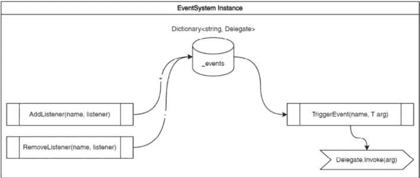

图 9.1 – EventSystem 图

在查看以下代码之前，先进行一下快速的心理练习，看看你是否能从这个图中想象出代码应该是什么样子。

根据这个图，这是构成我们新事件系统基础类的模板，省略了一些我们尚未覆盖的细节；它是否与你预期的相似？

```cs
using UnityEngine;
using UnityEngine.Events;
using System;
using System.Collections.Generic;
public class EventSystem : MonoBehaviour
{
    private Dictionary<string, Delegate> _events
        = new();
    public void AddListener<T>(
        string eventName, UnityAction<T> listener)
    {
        // UNDONE: Subscribe handler to event name.
    }
    public void RemoveListener<T>(
        string eventName, UnityAction<T> listener)
    {
        // UNDONE: Unsubscribe handler from event name.
    }
    public void TriggerEvent<T>(string eventName, T arg)
    {
        // UNDONE: Invoke handlers for event name.
    }
}
```

你可能不知道 `Dictionary` 的声明会是什么样子——我们还没有介绍它——但你至少知道我们需要为它声明，对吧？

在这里，我们还有一些额外的事情要解释，并介绍一些新的 C# 项目，包括 `Dictionary`、`Delegate` 和泛型类型（正如你可能注意到的，`<T>` 和 `T` 在代码中随处可见）：

+   `Dictionary<string, Delegate>`：C# 的 `Dictionary` 是一种包含 `List` 的集合类型，而 `List` 是一种包含单个列表的集合类型。

    让我们把这个问题用游戏开发术语来解释……C# 的 `Dictionary` 类似于一个魔法袋，你可以存储很多物品，只要它们有一个独特的名称，你就可以找到任何你想要的。你可以跟踪玩家在冒险中需要的所有酷炫物品，让你的游戏保持组织性和酷炫性！

    +   `string` 类型，表示字典中项的键类型。我们将键设置为通过名称标识特定事件，并将事件处理程序方法添加到其中。

    +   `Delegate` 类型，并且是存储在特定键项中的值。我们将值设置为可以添加方法处理器的委托类型，例如 `UnityAction`（注意，在这里，`delegate` 是 `UnityAction` 的基类型）。事件可以通过事件名称触发，调用所有分配的事件处理程序方法。简单！

    +   `Dictionary`，我们可以通过指定 `new` 关键字来分配一个新的空字典。这是 C# 在 Unity 2022.2 中的新特性，因为在之前，你不得不在这里再次明确地重述 `Dictionary` 以及键和值的类型——但你还必须为在 **Inspector** 视图中可序列化的变量做同样的事情！

字典（C#）

**字典**表示键值对的集合。它与**列表**集合类型具有相似的性质和方法。有关更多信息，请参阅[`learn.microsoft.com/en-us/dotnet/api/system.collections.generic.dictionary-2?view=net-8.0`](https://learn.microsoft.com/en-us/dotnet/api/system.collections.generic.dictionary-2?view=net-8.0)。

+   `AddListener()`: 当我们向`EventSystem`添加事件时，我们将调用此方法。方法签名具有以下参数：

    +   `<T>`: 在 C#中，有一个名为`T`的编程概念，它代表*任何类型*作为泛型类型参数。这允许你定义一个方法、类、参数或其他可以与调用代码指定的任何类型一起工作的东西，例如`string`、`int`、`float`、`Vector3`、`GameObject`等。这允许在不同的代码部分之间重用，而无需使用特定类型并重复相同的代码来支持这些类型。这听起来可能有点复杂，但希望通过前面的示例可以理解。

    +   我们使用泛型类型的用例是实现一个可以传递任何类型作为参数的事件委托。随着我们继续处理`EventSystem`的其余部分，这将会变得更加清晰。

    +   `eventName`: 一个`string`类型的字符串，用于唯一标识已与`EventSystem`注册的事件。这是我们向特定事件添加额外监听器以及我们知道要触发哪个事件的方式。

    +   `listener`: `UnityAction<T>`，这是事件委托。`UnityAction`应该很熟悉，因为它首次在*第三章*中介绍，作为一个用于更新 UI 的事件监听器。这里的区别在于我们添加了一个`T`类型的泛型参数，这意味着处理方法在调用时可以传递任何类型的单个参数。

+   `RemoveListener()`: 这用于从`EventSystem`中删除事件。方法签名与`AddListener()`的签名相同，因此我们在这里不需要重复。然而，将有一个明显不同的地方：我们将删除一个方法处理程序而不是添加一个。

+   `TriggerEvent()`: 当我们想要调用已通过`AddListeners()`添加方法处理程序作为监听器（当然）的特定事件时，我们将调用此方法。方法签名具有以下参数：

    +   `eventName`: 同样，这是我们将用于调用方法处理程序（即添加的监听器）的事件名称字符串。

    +   `T arg`: 我们将传递给被调用方法的参数值，以便它们可以接收和处理所需的数据。再次强调，由于`T`是一个通用类型，我们可以传递任何类型的参数（不错，对吧？）。

在前面的代码中，我说的是 *事件名称*，但我们不会在整个代码库中使用字符串字面量来表示事件名称，这样做太愚蠢了。相反，让我们创建一个 `EventConstants` 类，我们将使用它来表示事件名称。这就像我们在代码中通过添加 `Tags` 类来引用分配给游戏对象的标签时所做的（例如，`Player`）。

让我们通过创建以下 `EventConstants` 类来定义我们的第一个事件名称常量，该类保存在 `Assets/Scripts/Systems` 文件夹中：

```cs
public class EventConstants
{
    public const string MyFirstEvent = "MyFirstEvent";
}
```

事件名称将是 *常量*（在字面意义上和比喻意义上）将事物松散地联系在一起，所以我们不需要在观察和响应事件的类之间有具体的类引用。现在，我们可以独立测试我们的类——通过 `Player` 不需要指定对 `UIManager`、`Enemy` 等的引用。我们还可以将一个类移动到新的项目中，而不用担心引入不必要的类。

现在我们已经了解了事件系统模板以及我们将如何指定事件，让我们深入了解实现的方法的具体细节：`AddListener()`、`RemoveListener()` 和 `TriggerEvent()`。

### 事件管理方法

首先，让我们看看 `AddListener()` 方法。为了回顾，`AddListener()` 负责将事件添加到事件字典中（如果它尚未存在，即注册事件），并将监听器添加到事件的处理方法 `delegate` 中，如下所示：

```cs
    public void AddListener<T>(string eventName,
        UnityAction<T> listener)
    {
        if (!_events.ContainsKey(eventName))
            _events.Add(eventName, null);
        _events[eventName] = (UnityAction<T>)_events[eventName]
            + listener;
    }
```

让我们分析一下这里的代码：

+   `ContainsKey()`：在我们将事件添加到事件字典时，我们首先需要做的是查看是否已经注册了相同名称的事件（这很合乎逻辑，对吧？）。C# `Dictionary` 提供了几个方法来实现这一基本功能，这就像 C# `List` 一样，我们可以利用这些方法。

    具体来说，我们使用 `ContainsKey()` 并传入 `eventName`。如果键已经在字典中存在，这将返回一个布尔值 `true`，如果不存在则返回 `false`，因此我们可以使用 `if` 语句来评估并采取适当的行动。

+   `Add()`：通过处理 `ContainsKey()` 返回的结果，我们将使用 `Add()` 方法（再次，类似于 C# `List`）将事件——使用事件名称作为键——添加到字典中。

    注意，对于值参数——就像在 `Add(key, value)` 中——我们为委托指定了 `null`。这仅仅是因为我们将在下一行将监听器分配给委托，这时这个事件是否刚刚添加并不重要。

+   `_events[eventName]`：我们可以通过简单地指定方括号中的键来从 `_events` 字典中获取特定事件的值（这类似于我们通过指定方括号中的索引（`int`）来返回数组的值）。

+   `(UnityAction<T>)`: 在 C#中将一个类型放在另一个类型之前称为类型转换。由于`_events[eventName]`是一个`Delegate`类型，而`UnityAction`以委托为其基类型，我们可以通过类型转换（显式转换）将事件字典的值作为`UnityAction`来操作。在这里，`<T>`表示我们将使用一个泛型参数。

类型转换（C#）

C#是一种在编译时强类型（或静态类型）的语言，因此一旦声明了一个变量，就不能将其再次声明为不同类型。为了克服这一点，如果你需要将值复制到另一个类型的变量中，C#提供了各种类型转换操作，类型转换就是其中之一。

这里有一些额外的阅读材料：[`learn.microsoft.com/en-us/dotnet/csharp/programming-guide/types/casting-and-type-conversions`](https://learn.microsoft.com/en-us/dotnet/csharp/programming-guide/types/casting-and-type-conversions)。

+   `+ listener`: `UnityAction`允许你添加额外的监听器；使用`+`（添加）运算符将使我们能够做到这一点。

    注意，仅使用`+`运算符是向可能为`null`或已具有监听器的委托添加监听器的正确语法，与之前不同，一直追溯到*第三章*，在那里我们在订阅事件时使用`+=`运算符来添加事件处理方法。

现在，让我们看看相反的情况。对于`RemoveListener()`，当不再需要事件监听器时（特别是当对象被销毁时），我们想要移除事件监听器，这样我们就不尝试调用无效的处理方法引用。这通常只是良好的实践——对于某些监听器类型，如果不这样做可能会导致内存泄漏：

```cs
    public void RemoveListener<T>(string eventName,
        UnityAction<T> listener)
    {
        if (_events.ContainsKey(eventName))
            _events[eventName] =
                (UnityAction<T>)_events[eventName] - listener;
    }
```

我们在这里不需要再次分解代码，因为它基本上与`AddListener()`相同。主要区别如下：

+   如果事件不存在，我们不需要添加它；我们只关心它是否存在，以便我们可以移除一个监听处理方法。

+   我们使用`-`运算符代替`+`运算符来移除指定的监听器处理方法

最后，我们有`TriggerEvent()`方法。到目前为止，这些方法的命名已经足够直观，所以接下来应该不会令人惊讶。然而，我们在这里做了一些不同的事情，以检索字典中`eventName`键的值来调用添加的处理方法：

```cs
    public void TriggerEvent<T>(string eventName, T arg)
    {
        if (_events.TryGetValue(eventName, out Delegate del))
            (del as UnityAction<T>)?.Invoke(arg);
    }
```

这就是事情是如何工作的：

+   `_events.TryGetValue()`: 你可能会发现这个语法很熟悉，因为我们已经几次使用了`TryGetComponent()`。非常简单，我们尝试获取指定`eventName`键的值，如果存在，我们将值作为名为`del`的`out`参数返回。如果未找到，`if`评估将短路，因此只有当返回值时才会调用`Invoke()`。

+   `(del as UnityAction<T>)`：我们在这里引入了 `as` 操作符关键字。类似于我们使用 `()` 来进行类型转换，我们也可以使用 `as` 进行类型转换。特别是，当处理可空类型时，`as` 是一个好的选择，因为我们还使用空条件运算符 (`?.`)，这样我们就不会错误地尝试在空委托上调用 `Invoke()`。

as 操作符（C#）

**as** 操作符将对象转换为不同的类型，但如果转换失败则返回 **null**，而不是像其他类型转换技术那样抛出异常。

这里有一些额外的阅读材料：[`learn.microsoft.com/en-us/dotnet/csharp/language-reference/operators/type-testing-and-cast#as-operator`](https://learn.microsoft.com/en-us/dotnet/csharp/language-reference/operators/type-testing-and-cast#as-operator)。

+   `Invoke(arg)`：这是我们如何将监听器委托中由 `UnityAction<T>` 声明指定的泛型参数 `T` 连接到回的。最后一部分，形成一个完整的循环，将是接收参数的处理方法的签名。当我们到达 *创建收集钥匙任务的任务系统* 部分时，所有这些都应该都清楚，我保证！

接下来，为了我们不会忽略如何从需要处理事件的类中访问事件系统的一个基本细节，让我们将事件系统变成一个 Singleton - 一个真正的 Singleton！

### 强制单例实例

我们的 `EventSystem` 将是一个 **Singleton** 实例，这样我们就可以从代码的任何地方访问它。然而，我们还没有实现一个完整的 Singleton 模式，其中只能保证存在一个实例。我们将通过强制执行该模式并销毁任何想要成为重复项的实例来解决这个问题。

我们在 *第三章* 中看到了一个基本的实现，我们只是将实例设置为一个静态变量，甚至没有尝试寻找和销毁被引入的额外实例（不好的做法）。现在我们来了。添加以下 `Instance` 公共静态变量声明和新的 `Awake()` 方法代码：

```cs
public class EventSystem : MonoBehaviour
{
    public static EventSystem Instance { get; private set; }
    …
    private void Awake()
    {
        if (Instance == null)
            Instance = this;
        else
            Destroy(gameObject);
        DontDestroyOnLoad(gameObject);
    }
    …
```

魔法发生在 `Awake()` 方法中，我们之前只是这样做：

```cs
private void Awake() => Instance = this;
```

我们现在可以检查我们的静态 `Instance` 是否已经被分配；如果没有，就分配它。但是，如果 `Instance` 已经被分配，一个想要成为重复项的实例将被添加到我们的 **场景层次结构** 中。让我们立即销毁它！

我们的 `EventManager` 需要一直存在，以便在游戏的整个生命周期中，从任何类中随时响应注册和触发事件，因此我们需要一种方法来保持其持久性。

有时候，编码过程就像一场游戏：找到这个，摧毁那个，保留这个。所以，如果你不觉得有趣，你就做错了什么！

EventSystem | 完整代码

要查看本章中 **EventSystem** 类的完整代码以及所有与事件相关的代码，请访问本书的 GitHub 仓库：[`github.com/PacktPublishing/Unity-2022-by-Example/tree/main/ch9/`](https://github.com/PacktPublishing/Unity-2022-by-Example/tree/main/ch9/).

### 单例持久化

Unity 提供了一种方法来保持特定对象持久，无论当前场景如何，都能在加载新场景时存活下来，等等，这就是通过使用 `DontDestroyOnLoad`。只需调用它并传递你想要持久化的 `GameObject` 对象作为目标参数即可。在我们的情况下，在 `Awake()` 中，我们传递了 `gameObject`，它代表组件（脚本）附加到的当前对象。

额外阅读 | Unity 文档

**DontDestroyOnLoad**: [`docs.unity3d.com/2022.3/Documentation/ScriptReference/Object.DontDestroyOnLoad.xhtml`](https://docs.unity3d.com/2022.3/Documentation/ScriptReference/Object.DontDestroyOnLoad.xhtml).

## 系统 GameObject

被指定为 `DontDestroyOnLoad` 的对象必须位于 `EventSystem` 组件的根目录。我会把它放在场景层次结构的顶部，以保持一些可见的依赖关系顺序——这完全取决于你如何选择在这里组织事物。此外，记得你可以添加空对象，仅用于组织标题（别忘了将标签设置为 `EditorOnly`），正如在 *图 9.2* 中引用的 `Systems` 对象所示。2*：

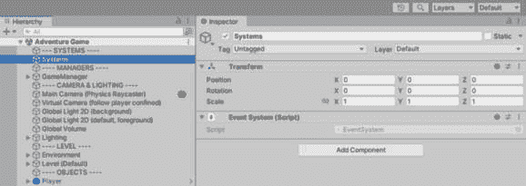

图 9.2 – 系统根 GameObject

在本节中，我们学习了如何创建一个全局事件系统，它允许我们的类保持松散耦合，因为我们不需要在另一个类中引用类型来响应触发动作。如果 `EventSystem` 组件的使用仍然不清楚，不要担心——在下一节中，我们将通过创建一个基于它的简单任务系统来立即提供一个示例。

# 为收集钥匙任务创建任务系统

现在我们有了我们的超级解耦的全局事件系统，我们将立即将其用于实际用途。再次参考我们的 GDD，我们知道玩家在某个时候必须收集一些关键的部件来解决谜题，以便他们可以前进：

| **冒险游戏中的次要游戏机制是什么？** | 玩家将在环境中寻找隐藏的钥匙部分。这些部件需要正确组合作为输入，以获得进入栖息地站的入口。 |
| --- | --- |

表 9.1 – GDD 任务参考

一个可以支持“收集一定数量的物品”的典型游戏系统是任务系统。一个可能更简化的方法，但也是一个基于系统的解决此问题的方法，可以是基本的库存系统。然而，任务系统将提供额外的机会来提供一个更完整的示例——特别是对于实现事件系统。

让我们快速看一下玩家在寻宝过程中将寻找什么，以及与它们互动以重新进入在星球上建造的栖息地站。Kryk’zylx 技术对我们来说是个谜，但 suffice it to say，他们在确保基地安全时喜欢挑战。邪恶植物实体散布的关键部件以及缺失部件的入口安全谜题锁都可以在以下图中看到：

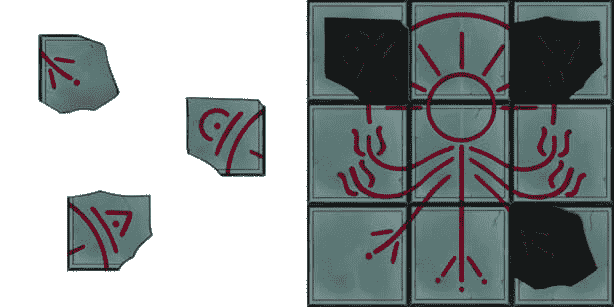

图 9.3 – 钥匙和安全谜题艺术

我们现在的任务是编写寻宝系统代码，并完善实现该系统所需的游戏机制。那么，让我们开始吧！

## 寻宝系统

我将提供一个`QuestSystem`类的代码模板，类似于介绍事件系统的方式。然而，这次我将提供完整的实现，因为你会发现它与`EventSystem`有相似的设计。这次我也不会提供图表。我将把它作为一个挑战留给你，在本节结束时自己创建一个。

在`Assets/Scripts/Systems`文件夹中创建一个名为`QuestSystem`的新脚本，并使用以下代码：

```cs
using UnityEngine;
using System.Collections.Generic;
public class QuestSystem : MonoBehaviour
{
    private Dictionary<string, bool> _quests = new();
    public void StartQuest(string questName)
    {
        if (!_quests.ContainsKey(questName))
            _quests.Add(questName, false);
    }
    public void CompleteQuest(string questName)
    {
        if (_quests.ContainsKey(questName))
            _quests[questName] = true;
    }
}
```

好的，不，你并没有经历似曾相识的感觉。`QuestSystem`代码的基本概念与`EventSystem`类似，其核心也是一个 C#的`Dictionary`。

这里是分解：

+   `Dictionary<string, bool>`: `_quests`字典的声明将包含一个用于识别寻宝任务名称（类似于事件名称）的`string`键，而条目的值将为`bool`类型，作为任务是否完成的指示（即`true`表示已完成）。

+   `StartQuest()`: 开始一个寻宝任务意味着如果它尚未添加，则将其添加到字典中。寻宝任务将通过作为唯一参数传入的`questName`来识别，简单明了。

+   `CompleteQuest()`: 如前所述，我们将使用`_quest`值作为任务完成的指示器，因此如果指定的任务存在于字典中，则将其值赋为`true`（`bool`的默认值为`false`，这就是为什么我们不需要在任何地方分配这个值）。

在这里，我们将再次重复如何访问`QuestSystem`，因为我们将再次使用 Singleton 模式。然而，主要的是，我们将尽可能通过全局事件系统解耦对`QuestSystem`的引用（即，没有紧密耦合的对象）。

将以下声明添加到`Awake()`方法中的公共静态`Instance`属性和*Singleton 管理代码*，如下所示：

```cs
    public static QuestSystem Instance { get; private set; }
    private void Awake()
    {
        if (Instance == null)
            Instance = this;
        else
            Destroy(gameObject);
        DontDestroyOnLoad(gameObject);
    }
```

使用 Singleton 模式解决了获取核心系统引用的大问题，但与更复杂的模式（例如服务定位器模式）相比，它也有一些缺点。在进一步进行之前，我们将解决这些缺点之一。

我们的系统存在一个潜在问题，因为我们要求在游戏开始时 `EventSystem` 实例对每个其他系统都是可用的——作为核心系统，松散耦合一切并保持良好。既然如此，我们必须确保它首先初始化。

## 脚本执行顺序

要设置脚本事件函数的执行顺序（例如，`Awake()` 消息事件），Unity 在 **项目设置** 中提供了 **脚本执行顺序** 赋值。简单来说，你可以为想要首先初始化的脚本设置一个较低的顺序号，并确保它在依赖于它初始化的其他脚本之前。

额外阅读 | Unity 文档

脚本执行顺序设置：[`docs.unity3d.com/2022.3/Documentation/Manual/class-MonoManager.xhtml`](https://docs.unity3d.com/2022.3/Documentation/Manual/class-MonoManager.xhtml)。

对于我们在这里的使用，我们需要 `EventSystem` 在 `QuestSystem` 之前运行。

1.  打开 **编辑** | **项目设置…** | **脚本** **执行顺序**。

1.  如果它们还没有在列表中，请使用右下角的加号（**+**）按钮将这两个脚本添加到列表中。

1.  然后，点击并拖动它们到指示的位置：

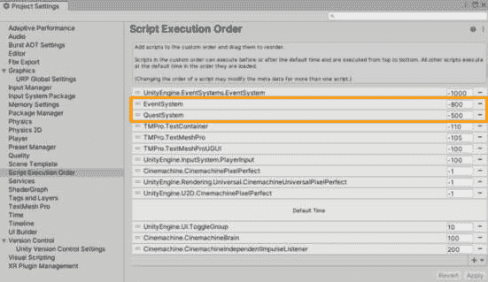

图 9.4 – 项目设置中的脚本执行顺序

1.  完成后，点击 **应用**。

额外阅读 | Unity 文档

Unity 还提供了一个使用属性指定脚本执行顺序的代码解决方案。该属性是 **[DefaultExecutionOrder(int)]**，你可以装饰类声明并设置顺序值。

例如，将此属性添加到 **QuestSystem** 类声明中的样子如下：

```cs
[DefaultExecutionOrder(-500)]
public class QuestSystem : MonoBehaviour
{ …
```

说到执行，确保将 `QuestSystem` 组件添加到 `EventSystem` 中）。

那么，没有任务的任务系统又是什么呢？！

## 任务

如果你选择接受这个任务，你的任务将是找到并收集解决栖息地入口安全谜锁所需的缺失部件。代表实际任务及其要求的任务对象可以说是任何任务系统的基本部分。正如你在 *脚本执行顺序* 部分所看到的，保持活动任务列表相当简单——我们向列表中添加一个任务，并在完成时将变量设置为 `true`。简单易懂。

我们将要介绍的下一个任务系统部分将是任务代码。在我们开始之前，我们将确保我们定义的任何任务都将有一个易于分配的唯一标识符（即使在 **检查器** 视图中）。

### 名称一致性

我们现在需要解决的问题是如何在不使用魔法字符串的情况下保证任务名称的一致性，从代码的不同部分引用任务名称，并在**检查器**视图中选择它们。

我们已经看到了如何使用 `enum`，现在类似地，但这次我们不是为 FSM 的状态使用它，而是要为唯一的任务名称标识符使用它；再次提醒，我们不会依赖于字符串字面量！这类似于我们之前如何使用字符串常量（例如，事件名称和标签），但作为一个 `enum` 类型而不是常量，我们有一些额外的优势，包括在 **检查器** 视图中从可用任务列表中进行选择时！

在 `Assets/Scripts/Quests` 文件夹中创建一个名为 *QuestNames* 的新脚本。将所有默认脚本模板代码替换为以下代码：

```cs
public enum QuestNames
{
    // Quest name, unique ID.
    CollectKeysQuest = 10
}
```

这是我们定义任何新任务的地方。我们已经填充了 `CollectKeysQuest` 名称，并给它分配了一个唯一的 ID `10`（这是一个尚未使用的任意数字）——确保在添加额外的任务名称时遵循此模式，分配名称和 ID。

我们将在继续我们的编码任务以完成这个任务系统时，看看任务名称是如何声明和引用的！

### 任务基类

是的，没错，另一个基类意味着我们在这里将使用更多的面向对象设计！而且因为我们已经在 *第二章* 中覆盖了这一点，所以对你来说这几乎不是什么不便，对吧？我们的特定任务将随后从我们将要编写的下一个新任务基类中派生出来，为实施任务提供一致性模板。

我们已经定义了任务名称。每个任务都需要包含任务名称，所以让我们首先设置我们任务的基础类。

在 `Assets/Scripts/Quests` 文件夹中创建一个名为 `QuestBase` 的新脚本：

```cs
using UnityEngine;
public abstract class QuestBase : MonoBehaviour
{
    public QuestNames QuestName => _questName;
    [SerializeField]
    private QuestNames _questName;
    …
```

首先要注意的是，`QuestBase` 类被声明为 `public abstract class`。这意味着我们无法直接使用这个类——我们无法在 `QuestBase` 中将抽象类添加到 `GameObject` 对象（即，这只是一个 *基础模板*）。

其次，我们可以看到 `QuestName` 的声明，它使用了我们之前编写的 `QuestNames` 枚举类型。我们封装了一个 `private _questName` 变量，并用 `[SerializeField]` 属性装饰它，以便可以在 **检查器** 视图中分配给枚举类型：

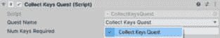

图 9.5 – 任务名称检查器视图的分配下拉菜单

`_questName` 值通过 `public QuestName` 属性对其他类可用——表达式体 (`=>`) 声明该属性仅为获取器（即，您无法分配值）。

到目前为止，一切顺利。然而，这只是一些复习，因为我们在这里覆盖的内容都不是新的。对于我们将为 `QuestBase` 抽象类声明的第一个两个方法也是如此。我们将对 `StartQuest()` 和 `QuestCompleted()` 使用 `virtual` 方法，因为继承的类可能需要覆盖提供的基本功能：

```cs
    …
    public virtual void StartQuest()
        => QuestSystem.Instance.StartQuest(QuestName.ToString());
    protected virtual void QuestCompleted(string questName)
        => Debug.Log($"Quest '{questName}' completed!");
    …
```

到目前为止，代码可能已经很直观了，但解释总是有帮助的。让我们来分解一下：

+   `public virtual void StartQuest()`: 这个方法有一个`public`访问器，因为它打算从外部类调用以触发任务的开始。我们调用任务系统的`StartQuest()`方法（通过其单例实例），并将唯一的任务标识符（即基于`enum`的任务名称）传递给它，以便将其添加到活动任务的`Dictionary`中，以便稍后参考。

    我们在方法签名中使用`virtual`，以防继承的类需要做更多的事情（比如，除了开始任务之外）。

+   `protected virtual QuestCompleted()`: 这个方法有一个`protected`访问器，因此它只能在类内部和派生类中调用——不能是外部类，因为确定任务完成逻辑应该基于特定任务的要求，而不是某些外部因素。

    再次强调，我们在方法签名中使用`virtual`，以防继承的类需要做其他事情（比如，为不同类型的任务实现不同的逻辑或行为，例如支线任务）。目前，我们只是将一条消息记录到控制台，表明任务已完成。

现在是时候享受乐趣了！我们将依赖事件系统来实现以下功能：监听任务何时完成。这也是为什么我们没有将`QuestCompleted()`方法声明为`public`的原因——`QuestCompleted()`是作为监听器传递给事件系统的处理方法：

```cs
    …
    private void OnEnable() => AddListeners();
    private void OnDisable() => RemoveListeners();
    protected virtual void AddListeners()
        => EventSystem.Instance.AddListener<string>(
            EventConstants.OnQuestCompleted, QuestCompleted);
    protected virtual void RemoveListeners()
        => EventSystem.Instance.RemoveListener<string>(
            EventConstants.OnQuestCompleted, QuestCompleted);
}
```

这里有一些需要解释的要点：

+   `OnEnable()`, `OnDisable()`: 我们分别添加和移除基类的事件系统监听器。如果派生类需要为特定任务添加额外的监听器，则可以覆盖`AddListeners()`和`RemoveListeners()`。

+   `AddListeners()`: 在这里，我们向事件系统添加一个监听器以监听任务完成事件。我们将使用一个字符串参数将任务名称作为参数传递给处理方法。

+   `RemoveListeners()`: 我们只需要移除在`AddListeners()`中添加的监听器——记住，移除事件监听器始终是良好的实践！

    注意，尽管简单地移除监听器不需要传递参数在逻辑上没有意义，但我们仍然需要它，因为委托定义必须与添加为监听器的处理方法的签名相匹配。

作为最后一步，将`EventConstants.OnQuestCompleted`的字符串常量添加到`EventConstants`脚本中。或者，在你的 IDE 中，*OnQuestCompleted*应该有一个红色的波浪线，表示定义未找到。接下来，使用你的 IDE 的重构工具生成变量（但确保它与其他事件名称常量保持一致）。

有了这些，`QuestBase`已经完成了！现在，准备创建一个从基类派生的特定任务类。

### 收集任务键

我们将需要收集的缺失的安全谜题关键部件称为“钥匙”，并且需要三个来完成我们的任务。这些是一个简单任务的基本要求，但我们仍然需要一种方法来不仅明确声明要求，还要评估和传达完成情况。

我们将首先在 `Assets/Scripts/Quests` 文件夹中创建一个新的脚本，名为 `CollectKeysQuest`，并从 `QuestBase` 继承，而不是从 `MonoBehaviour` 继承：

```cs
using UnityEngine;
public class CollectKeysQuest : QuestBase
{
    [SerializeField] private int _numKeysRequired = 3;
    private int _keysCollected = 0;
    …
```

我们还声明了完成这个任务所需的钥匙数量。`_numKeysRequired` 将是 `private` 的，这样就没有其他类可以访问它，但我们会使用 `[SerializeField]` 属性来设置这个值在 `3`))。

`_keysCollected` 将跟踪玩家收集的钥匙数量（`private` —— 这不是任何人的事），我们将通过事件系统（非常方便）来增加这个值：

```cs
    …
    protected override void AddListeners()
    {
        base.AddListeners();
        EventSystem.Instance.AddListener<bool>(
            EventConstants.OnKeyCollected, KeyCollected);
    }
    protected override void RemoveListeners()
    {
        base.RemoveListeners();
        EventSystem.Instance.RemoveListener<bool>(
            EventConstants.OnKeyCollected, KeyCollected);
    }
    private void KeyCollected(bool arg0)
    {
        _keysCollected++;
        // UNDONE: Evaluate quest completion.
    }
}
```

好的，这是一个熟悉的模式，但让我们还是澄清一下：

+   `override AddListeners()`: 对于这个特定的任务，我们需要监听玩家收集钥匙的时刻。使用事件系统，我们不需要了解任何关于 `Player` 对象或甚至收集钥匙所实现的脚本；我们观察到收集到了钥匙，并使用 `KeyCollected()` 方法进行处理。我们在这里使用 `override` 关键字，因为我们需要的功能比基类本身提供的更多：

    +   `base.AddListeners()`: 说到基类提供的内容，我们仍然需要它！我们仍然可以通过使用 `base` 关键字来确保覆盖基类的方法——在派生类中访问基类成员。

+   `override RemoveListeners()`: 你明白了——保持良好的习惯，移除之前添加的监听器：

    +   `base.RemoveListeners()`: 与 `base.AddListeners()` 相同

+   `KeyCollected()`: 我保证我们不会再次有要跟随的未完成的标记的面包屑路径！但，现在，当 `OnKeyCollected` 事件被触发时，我们只会增加 `_keysCollected` 变量：

    +   `bool arg0`: 我们的 `EventSystem` 要求我们传递一个带有处理事件的手柄参数。对于收集钥匙的事件，我们不需要传递任何参数，但我们必须声明点什么！布尔值是最小的类型，我觉得这是我们这里能做的最少的恶。

    +   `EventConstants.OnKeyCollected`: 一定要添加到 `EventConstants` 中以解决缺失定义的错误。

极好——我们有一个任务了！现在，如果只有我们能得到这个任务就好了！在我们的游戏中，没有那些站在街角、向任何经过的疲惫旅行者分发任务的刻薄 NPC，所以我们将利用我们已有的可重用组件来触发我们任务的开始。

#### 任务提供者 GameObject

我们不需要为给玩家分配任务编写新的脚本；我们只需要开始**收集钥匙任务**。我们可以通过在环境中创建一个触发体积，使用我们非常有用且可重复使用的`TriggerEvent`组件，并在`CollectKeysQuest`组件上简单地调用公开声明的`StartQuest()`方法来轻松完成它。

这是在**场景**视图和**检查器**视图中的样子：

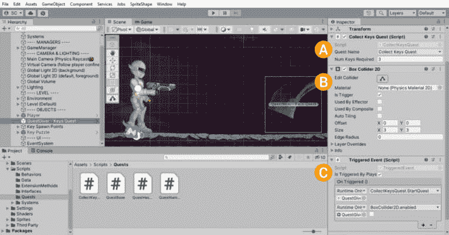

图 9.6 – 场景中的任务提供者对象

尝试构建组成**任务提供者**对象的对象和组件，并将其放置在玩家开始位置的附近。

你成功组装了吗？让我们回顾一下步骤：

1.  在场景中创建一个新的 GameObject，并将其命名为`Quest Giver – Keys Quest`，然后将其放置在玩家开始位置的附近（参考*图 9.6*以获取示例）。

1.  (*A*) 将`CollectKeysQuest`脚本添加到新对象中。在**任务名称**下拉菜单中选择**收集钥匙任务**，因为我们只有一个任务，并将所需钥匙数量设置为三。

1.  (*B*) 接下来添加一个`BoxCollider2D`组件（使用`true`，因为我们不希望玩家与这个 GameObject 进行物理交互；我们只想将其用作触发体积。调整碰撞体的尺寸以确保玩家会与之碰撞）。

1.  (*C*) 添加一个`TriggeredEvent`组件，并将当`OnTriggered()`被调用时调用的方法连接起来。

1.  点击小加号（将`CollectKeysQuest`组件拖到第一个事件字段，并从下拉列表中选择`CollectKeysQuest.StartQuest()`方法）。

1.  将`BoxCollider2D`拖到第二个事件字段，从下拉菜单中选择`BoxCollider2D.enabled`，并保持复选框未勾选（即设置为`false`；这将禁用碰撞体，防止触发**开始任务**额外的次数）。

1.  确保只有玩家可以触发任务开始，通过勾选`IsTriggeredByPlayer`。

+   作为最后一步，将`Prefab`对象保存在`Assets/Prefabs`文件夹中（通过从层次结构拖动到**项目**窗口）。这样，我们可以在以后快速将任务提供者放入场景中。

任务已接受！你不会开始一个不可能完成的任务，对吧？现在，让我们看看我们如何完成**收集钥匙任务**。

#### 任务完成

我们已经定义了一个特定的任务，我们已经给了玩家这个任务，现在我们必须在任务中取得进展以完成它。进展是在我们在游戏级别收集钥匙时取得的（你知道的，就像我们在本书的第一个项目中完成的收集游戏一样）。

在`CollectKeysQuest`类中，正如你所知，当`OnKeyCollected`事件被触发时，会调用`KeyCollected()`方法。我们只让它增加变量，以跟踪收集到的钥匙数量。现在让我们通过评估任务要求是否满足来完成这个任务。

通过添加`if`块来完成`KeyCollected`方法，如下所示：

```cs
    private void KeyCollected(int keyId)
    {
        _keysCollected++;
        if (_keysCollected >= _numKeysRequired)
        {
            QuestSystem.Instance.CompleteQuest(
                QuestName.ToString());
            EventSystem.Instance.TriggerEvent(
                EventConstants.OnQuestCompleted, QuestName);
        }
    }
```

一个非常简单的`if`语句检查增加后的`_keysCollected`变量是否大于或等于（`>=`）完成任务所需的钥匙数量，该数量由`_numKeysRequired`变量定义（在`then`中我们将执行以下操作：

+   在`QuestSystem`单例实例上调用`CompleteQuest()`并传入任务名称作为参数。我们需要在`QuestName`变量上使用`ToString()`，因为它是一个`enum`值，在内部，它被存储为`int`类型；我们需要一个`string`类型的参数。

+   通过`EventSystem`单例实例触发`OnQuestCompleted`事件，并且再次传入`QuestName`作为参数。这同样是一个`string`类型。

*未完成令牌任务*已完成。太好了！

#### 添加了任务事件常量

我们需要添加一些事件名称常量来支持我们刚刚为任务系统和*收集钥匙任务*添加的内容。作为一个回顾，以下是现在的`EventConstants`脚本应该看起来像什么。我为一些快速组织添加了一些注释，以保持事情整洁：

```cs
public class EventConstants
{
    public const string OnMyEvent = "OnMyEvent";
    // QuestSystem events.
    public const string OnQuestCompleted = "OnQuestCompleted";
    // Quests' events.
    public const string OnKeyCollected = "OnKeyCollected";
}
```

我们的任务系统已经很好地组合在一起，但我们仍然缺少一个最终的功能，那就是能够知道是否有一个已经开始的任务（即，添加到`_quests`字典中）已经完成（即，任务任务的要求已经满足，并且调用了`CompleteQuest()`）。

### 任务状态

要知道任务的状态，请继续在`QuestSystem`类中添加以下`IsQuestComplete()`方法：

```cs
    public bool IsQuestComplete(string questName)
    {
        if (_quests.TryGetValue(questName, out bool status))
            return status;
        return false;
    }
```

你应该在这里识别出一个熟悉的模式与`TryGetValue()`（作为`Dictionary`中可用的一种方法）——我们已经多次用`TryGetComponent()`覆盖了类似的模式。`TryGetValue()`如果`_quests`字典中存在值，将返回`true`。然后，将返回的值设置为`out`变量`status`，以便立即被下面的`if`块代码消费。这非常方便，正如我所说的，我是一个大粉丝（甚至在我的代码中复制了这个模式）。

我们将继续通过立即从`TryGetValue()`调用中返回任务的状态来短路方法。否则，我们返回`false`，表示任务默认未完成，因为它甚至不在字典中。

现在我们可以从我们的`QuestSystem`单例实例中查询特定任务的状态，我们可以创建一个可重用的组件，用于在我们的游戏中相应地做出反应。

### 任务完成组件

当玩家到达栖息地入口时，我们需要检查任务是否完成。这将允许我们显示安全谜题锁，如果任务已完成，或者如果没有完成，提供其他操作。

在`Assets/Scripts/Quests`文件夹中创建一个名为`QuestHasCompleted`的新脚本：

```cs
using UnityEngine;
using UnityEngine.Events;
public class QuestHasCompleted : MonoBehaviour
{
    public QuestNames QuestName;
    public UnityEvent OnQuestComplete;
    public UnityEvent OnQuestIncomplete;
    public void CheckQuestComplete()
    {
        if (QuestSystem.Instance.
            IsQuestComplete(QuestName.ToString()))
        {
            OnQuestComplete?.Invoke();
            return;
        }
        OnQuestIncomplete?.Invoke();
    }
}
```

这并不是我们之前没有见过的。`QuestName` 字段将允许我们在 `UnityEvent` 字段中指定我们想要知道完成状态的哪个任务。简单来说。

这是基于此新组件的对象在 **检查器** 视图中的外观：

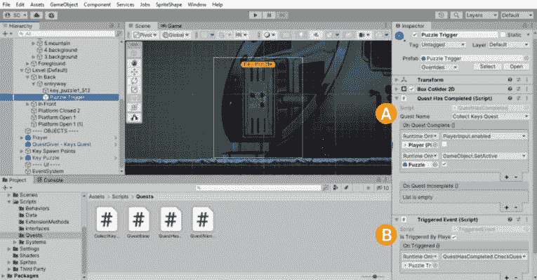

图 9.7 – 谜题触发器对象设置

现在让我们创建这个 *谜题触发器* 对象，并将其连接起来，以便当玩家进入触发体积时，如果 *收集钥匙任务* 已完成，它将禁用 `PlayerInput`（确保玩家不能再移动）并显示 **谜题**（解决入口安全谜题锁是玩家在这个关卡的目标）。

这是如何构建一个 *任务是否已完成？* 对象的：

1.  在 `Puzzle Trigger` 中创建一个新的空 GameObject，因为我们想在玩家到达栖息地入口时显示谜题。

1.  (*A*) 添加一个 `QuestHasCompleted` 组件，并从可用的任务名称下拉菜单中选择 **收集钥匙任务**。

1.  为 `OnQuestComplete()` 分配以下事件（点击加号，从下拉菜单中选择 `PlayerInput.enabled`，并取消勾选复选框。以这种方式禁用 `PlayerInput` 将意味着不会处理任何输入以与玩家执行操作 – 我们不希望玩家角色再移动，因为现在应该是解决谜题的时候了。

1.  以下分配是为了我们未来的自己；我们将使用对 **钥匙谜题** 对象的引用并将其激活（显示），以便玩家可以解决它 – **钥匙谜题** 将在本章的最后部分添加，那时我们将重新访问这个分配。

+   (*B*) 添加一个 `TriggeredEvent` 组件，并将 `QuestHasCompleted` 组件分配给 `OnTriggered` 事件，然后从下拉菜单中选择 `QuestHasCompleted.CheckQuestComplete()`。确保 **IsTriggeredByPlayer** 被勾选。*   不要忘记添加一个 `BoxCollider2D` 组件并将其设置为 `true`；大小将根据栖息地入口进行调整，以便玩家在到达时与之交互。

对于放置，如果您还没有将栖息地入口添加到您的关卡中，现在就是时候了！我们在将所有内容组合在一起时并没有探索您关卡设计的每一个细节 – 自然地，您一直在做您的关卡设计作业：

1.  将来自 `Assets/Sprites/Object Elements` 文件夹的栖息地入口精灵 *entryway* 放入环境中，并使用 `Background` **排序层**。您可以使用我们之前建立的 **Level (默认)** | **In** **Back** 结构在 **场景层次结构** 中对其进行组织。

1.  将 **谜题触发器** 对象放置在入口处，并相应地设置碰撞器大小（参考 *图 9**.7* 中的示例）。

正如我们在前面的代码和描述中看到的，`QuestHasCompleted` 组件有一个事件，当检查完成和不完整的任务状态时会被触发。我们已经填充了 `OnQuestComplete()` 事件，但还有一个 `OnQuestIncomplete()` 事件。现在我们不会在这里分配任何函数，但想象一下，我们可以向玩家显示一个对话框，说明任务的完成要求尚未满足，他们无法继续。

挑战 | 任务系统图

在使用图 9**.1** 中的事件系统图作为参考的同时，为任务系统创建一个基本对象引用图。不要过于关注你选择的代表每个部分的形状，但请保持一致，并使用相同的形状来表示相同的对象类型。如果你想进一步挑战自己，可以创建一个 UML 图！

我们已经准备好执行一个任务的生命周期了。现在，我们需要收集那些讨厌的关键部件！

## 收集钥匙

我们已经以几种不同的方式处理了玩家的可收集物品，所以可收集的关键物品将是一个熟悉的概念。唯一的区别是，我们现在将依赖于 `EventSystem` 来触发一个 *收集钥匙* 事件。正如我们已经知道的，`CollectKeysQuest` 任务正在监听 `OnKeyCollected` 被调用，所以这就是我们将实现触发它的地方。

如你可能也猜到的，我们将使用 `Prefab` 对象来制作谜题部件的钥匙（通过 **Prefab Variant**）。因此，这将需要一个组件来实现关键收集行为。

### KeyItem 组件

首先，让我们准备我们将用来制作可收集关键部件的艺术作品。为了视觉参考，以下是我们将用于创建关键部件和在栖息地入口门上的占位符安全谜题锁的内容（如果你感到紧张，试着忽略正在蔓延的植物实体的藤蔓）：

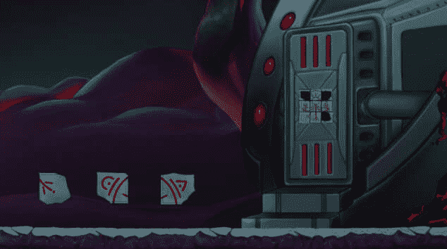

图 9.8 – 关键变体和入口安全谜题锁

艺术资产

为了使用与本项目创建相同的艺术作品进行跟随，请从本书的 GitHub 存储库下载资产：[`github.com/PacktPublishing/Unity-2022-by-Example/tree/main/ch9/Art-Assets`](https://github.com/PacktPublishing/Unity-2022-by-Example/tree/main/ch9/Art-Assets)。

将安全谜题锁、谜题占位符图像和单个钥匙部件的艺术资产导入到 `Assets/Sprites/Puzzle` 中。对于提供的钥匙部件艺术作品，我已设置了以下属性以实现所需的大小和位置：

+   `500`

+   `X` 和 `Y` 值，以便枢轴位于艺术品的中心：

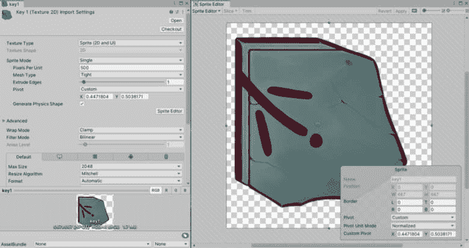

图 9.9 – 关键艺术品 – 导入设置

现在，让我们编写收集关键物品的代码，以便我们准备好组装每个关键部件的预制件。

在 `Assets/Scripts` 文件夹中创建一个名为 `KeyItem` 的新脚本，代码如下：

```cs
using UnityEngine;
[RequireComponent (typeof(Collider2D))]
public class KeyItem : MonoBehaviour
{
    private void OnTriggerEnter2D(Collider2D collision)
    {
        if (collision.CompareTag(Tags.Player))
        {
            EventSystem.Instance.TriggerEvent(
                EventConstants.OnKeyCollected, false);
            Destroy(gameObject);
        }
    }
}
```

最后，是的——这就是我们特别触发`OnKeyCollected`事件的地方！

这个收集物品的脚本可能比之前的脚本更简单。我们使用`OnTriggerEnter2D()`来检测玩家何时进入触发体积。这意味着我们需要在附加`KeyItem`脚本的 GameObject 上添加一个作为兄弟的碰撞组件吗？是的，没错——我们需要一个具有`CircleCollider2D`的`Collider2D`对象，保持它既高效又简洁。

此外，请注意，我们正在比较碰撞对象的标签——使用我们的`Tags.Player`常量——以确保只有玩家与触发体积交互。

让我们对事件系统的`TriggerEvent()`调用给予一些额外的关注，因为我们的事件系统需要一个额外的参数作为事件参数传入。我们必须传入*某些东西*。

正如在处理方法介绍时解释的那样，布尔值是 C#中最小的数据类型（1 字节）；我们将传入`false`作为类型的值——我们也可以自由地这样理解，“*是或否，我会为这个事件传递一个参数值吗？否。*”我们甚至不需要指定`bool`类型——例如`TriggerEvent<bool>()`——因为类型可以从参数值推断出来。

最后，我们将销毁键部件对象，因为我们已经收集了它，并且不再需要在关卡中使用它。我们在这里直接使用`Destroy(gameObject)`是为了简洁。不过，为了保持一致性，如果你愿意，现在你应该能够为自己连接可重用的`Destroyer`组件（挑战接受？）。

现在，是时候构建可收集的键物品预制件了！

### KeyItem 预制件和变体

在我们的项目中创建可重用物品的预制件现在已经成为一种本能。让我们快速浏览一下创建新的可收集键物品**预制件**的步骤；然后，我们将制作具有所有三个键部件及其各自艺术作品的**变体**：

1.  将之前导入的`key1` Sprite（位于`Assets/Sprites/Puzzle`文件夹中）从**项目**窗口拖动到**场景层次结构**中。

1.  双击它，使其在`(0, 0, 0)`处聚焦（如果不是，请在**检查器**视图中的**变换**选项中**重置**，以确保没有偏移被保存在预制件中）。

1.  将`key1`重命名为简单的`key`（在**检查器**视图顶部选中时，点击它第二次，或使用*F2*/*Enter*键）——当我们创建额外的键变体时，这将会变得有意义。

1.  右键单击它，选择`Key1`。

1.  将`CircleCollider2D`组件添加到`Key1`对象上，并启用**触发器**。设置**半径**值，使其击中框略大于拼图部件 Sprite（参见图 9.10）。

1.  将`KeyItem`脚本添加到父`Key1`对象上——没有需要配置的内容；所有行为都在代码中处理。

1.  将`Key1`从**项目**窗口中的`Assets/Prefabs`文件夹拖动到`Key1`对象，使其成为一个预制件。

现在，要创建额外的键件预制件作为 Prefab 变体，请按照以下步骤操作：

1.  在**层次结构**中选择`Key1`，然后按*Ctrl*/*Cmd* + *D*两次以创建它的两个副本。

1.  分别重命名副本`Key2`和`Key3`。

1.  对于`Key2`，在子键对象上更改`SpriteRenderer`的`key2`。然后，对`Key3`做同样的操作，并设置`key3`。

1.  从`Assets/Prefabs`文件夹中拖动`Key2`。然后，在`Key1`预制件中但覆盖`Key3`。

提示 | Prefab 编辑模式 | 变体

注意，当在**Prefab 编辑模式**中打开**Prefab 变体**时，所有覆盖项都由**检查器**视图左侧的蓝色指示器表示。

这里是我们刚刚创建的关键 Prefab 和变体：

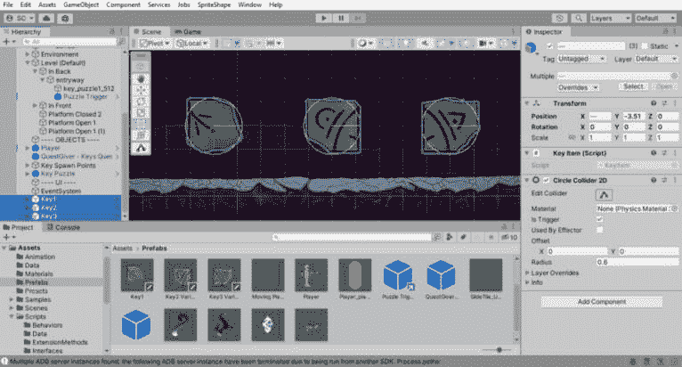

图 9.10 – 键项预制件

玩家现在可以收集键件以完成任务，但我们应该如何在关卡中放置它们？首先，从场景中删除`Key1`、`Key2`和`Key3`对象；我们将生成它们。

QuestSystem | 完整代码

要查看**QuestSystem**类以及本章中所有与任务相关的完整代码，请访问本书的 GitHub 仓库：[`github.com/PacktPublishing/Unity-2022-by-Example/tree/main/ch9/`](https://github.com/PacktPublishing/Unity-2022-by-Example/tree/main/ch9/)。

### 键生成器 – 随机性

让我们探索一种简单的方法来实现一些基本的随机实例化对象，以便每次游戏都不同 – 解决可重玩性对玩家参与度是有益的！

游戏设计中的随机性

在你的游戏开发之旅中，你将遇到游戏中的随机性主题 – 而不仅仅是纸牌游戏！随机性在游戏设计中的作用适用于整个章节 – 哎呀，整个书籍！所以，记住这一点，这将是你可以如何通过有效结果添加随机性到简单机制的最基本示例之一。在关卡设计中，我们将随机在由更多生成点标识的位置实例化三个键。

代码的结构将是接收一个`KeyItem`（对象）数组（即键件）和一个`Transform`（位置）数组（即放置在关卡中的点）作为输入，然后输出（即实例化）对象，按下一个随机选择的生成点顺序（确保不重复使用任何生成点）。

你想象过代码可能的样子吗？让我们看看。让我们一步步创建每个部分的代码。

首先，在`Assets/Scripts`文件夹中创建一个名为`KeyInstantiator`的新脚本。

我们首先声明包含键对象和生成点的数组：

```cs
using UnityEngine;
using System.Collections.Generic;
public class KeyInstantiator : MonoBehaviour
{
    [SerializeField] private KeyItem[] _keyPrefabs;
    [SerializeField] private Transform[] _spawnPoints;
    …
```

在这里，我们声明了两个数组：

+   `KeyItem[] _keyPrefabs`：由于以下原因，它已被序列化，以便可以在`KeyItem`中分配，而不是更通用的`GameObject`：

    +   我们只想将包含`KeyItem`组件的 Prefab 分配给数组。

    +   在引用集合中的项目时，我们将消耗项目作为`KeyItem`类型，并避免进行`GetComponent<KeyItem>()`调用。

+   `Transform[] _spawnPoints`; 这已经被序列化，以便可以在**检查器**视图中分配；我们将分配放置在关卡中关键部件可能生成的位置上的 GameObject。考虑到游戏设计，请确保在关卡中放置超过三个，这样我们就不只是随机化三个相同位置出现的关键部件 – 你的限制将是设计或你的关卡（并且我会确保在恰好有几个感染机器人巡逻的地方放置其中一个）。

数组（C#）

数组是一种用相对的方括号（**[]**）声明的类型，它表示该类型的项目集合。数组中的项目通过它们的索引值来标识，它从零开始（例如，**_spawnPoints[0]**是集合中存储的第一个**Transform**）。

这里有一些额外的阅读材料：[`learn.microsoft.com/en-us/dotnet/csharp/programming-guide/arrays/`](https://learn.microsoft.com/en-us/dotnet/csharp/programming-guide/arrays/)。

接下来，我们将向`Start()`方法的实现中添加一个`List`类型，以处理从`_spawnPoints`数组中当前可用的生成点。我们为什么要这样做？我们已经有了一个`array`类型，现在又有一个`List`类型？是的。在 C#中，如果我们想要调整大小（即删除一个项目），数组就不容易处理，但`List`类型可以。

声明以下`List`类型，并添加带有生成点分配的`Start()`方法：

```cs
    private List<Transform> _availablePoints;
    private void Start()
    {
        _availablePoints = new List<Transform>(_spawnPoints);
        …
```

我们声明了一个`List`类型，并在`Start()`中用`_spawnPoints`值初始化它：

+   `List<Transform> _availablePoints`: 这是一个`private`成员变量，因为我们只会在类内部处理这些点。我们将使用它来确定可以实例化关键点的点。

+   `Start()`: 游戏开始时，我们将把关键部件散布在整个关卡中……所以我们将使用 Unity 提供的`MonoBehaviour`消息事件`Start()`来做这件事，是的。

现在是时候添加随机位置实例化了 – 在`Start()`方法实现中添加以下`foreach`循环：

```cs
        foreach (var item in _keyPrefabs)
        {
            var randomIndex = Random.Range(
                0, _availablePoints.Count);
            Instantiate(item,
                _availablePoints[randomIndex].position,
                Quaternion.identity);
            _availablePoints.RemoveAt(randomIndex);
        }
    }
}
```

好吧，让我们分析这个最后的部分：

+   `foreach (var item in _keyPrefabs)`: 我们使用`foreach`来迭代在**检查器**视图中分配的可用`KeyItem` Prefabs（我们所有的三个关键 Prefab/变体部件）。

+   `Random.Range(0, _availablePoints.Count)`: 这是一种魔法吗？不，这是 Unity 的`int`值，然而，在我们的用例中；否则，当使用`float`值时，它是包含第二个数字的）。我们不希望使用`Count`值，因为数组索引是从零开始的（因此我们否则必须指定`Count - 1`）：

    注意，我们每次迭代都会获取`_availablePoints.Count`。那是因为，在下面两行中，我们将通过返回的`randomIndex`值从`List`中删除随机选择的点，因此它不会被再次使用。

额外阅读 | Unity 文档

**Random.Range()**: [`docs.unity3d.com/2022.3/Documentation/ScriptReference/Random.Range.xhtml`](https://docs.unity3d.com/2022.3/Documentation/ScriptReference/Random.Range.xhtml)。

+   `Instantiate()`: 我们将数组中的当前 `item` 在随机选择的出生点位置 `randomIndex` 处实例化到场景中，旋转为零（即 `Quaternion.Identity`）。

+   `RemoveAt(randomIndex)`: C# `List` 类型提供了一个删除方法，不仅可以从集合中删除一个项目，还可以调整其大小。因此，`Count` 属性反映了剩余项目的数量。

当这样分解时，听起来很多，但这只是一个简短而甜美的随机放置脚本。

最后一步当然是设置实例化器在我们的场景中，以便可以将关键部件放置在游戏关卡中。

#### 实例化器场景对象设置

这里我们要做的是在我们的场景中设置新的 `KeyInstantiator` 脚本，以便我们的钥匙可以随机生成供玩家寻找：

1.  创建一个 `KeyInstantiator` 组件。

1.  在 **Project** 窗口的 **Assets/Prefabs** 文件夹中到 **KeyPrefabs** 字段。

1.  然后，在关卡中放置 – 超过三个！ – 代表钥匙可能出生位置的 GameObject 之后，在 **Hierarchy** 中选择它们，并将它们拖到 **Inspector** 视图的 **SpawnPoints** 字段（别忘了你可以锁定 **Inspector** 窗口，这样在您选择要分配的对象时它不会改变）。

*图 9**.11* 展示了前面步骤的结果：

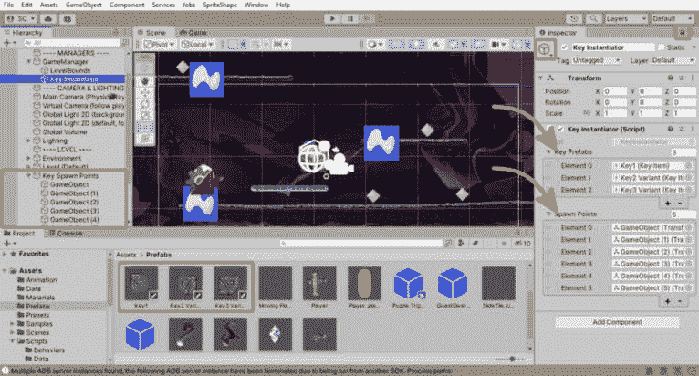

图 9.11 – 关键实例化对象设置

你可能已经注意到了前一个图中的粉色钻石。我已经将一个粉色钻石图标（可在 **Inspector** 视图的顶部分配）分配给关键出生点对象，以便我在进行关卡设计时在 **Scene** 视图中容易找到它们。我还将关键出生点分组在 **Hierarchy** 中的父 **Key Spawn Points** 对象下。

有了这个，现在当游戏开始时，我们的关卡中就有了随机放置的关键部件。接下来，我们将在解决钥匙谜题之前解决一个绘图问题！

#### 实例化精灵绘制顺序

关键部件将在 `Default` 的 `0` 处实例化，对于默认值。因为我们已经将环境设置为从“深度层的中心”起源的 *默认对象*，我们可以确信实例化的部件不会被遮挡。如果需要，这可以在实例化时进行补偿，但如果我们对环境布局稍加注意，就可以简单地避免这种情况。

在本节中，我们学习了如何创建一个任务系统，创建具有独特属性和完成要求的任务，将任务分配给玩家，并查询任务状态以推进游戏玩法。我们还看到了如何利用事件系统在其基础上构建其他系统。

在下一节中，我们将集成滑动拼图作为栖息地入口的安全锁系统，解决拼图即可赢得游戏。

# 解决关键谜题并赢得游戏

我们可以在这里花很多时间设计一个新颖的谜题用于安全锁系统。但这超出了本书的范围，也不会提供我想覆盖的学习机会 – 那就是在你游戏中使用第三方资产。这并不是说你不应该努力在你的游戏中引入新的原创想法 – 任何能让你区分游戏并给玩家带来独特体验的方法都是值得的！

我们将使用众所周知的滑动拼图作为栖息地入口的安全谜题锁。

## 滑动拼图

我之前只是简要提到了**Unity Asset Store**，但现在我想给它一些应得的关注。Unity Asset Store 包含了 Unity 和第三方提供的丰富资源。你可以找到几乎所有你为游戏所需的东西，包括预制的系统、框架、角色、动画、2D 和 3D 艺术资源、音乐和音效、VFX 等等，几乎涵盖了你能想象到的每一个类型和风格。

然而，整合来自不同供应商的解决方案和资源并不总是那么简单。本节将致力于利用现有预制资产的价值，并识别一些你可能需要解决的问题，以便它们能在你的项目中正常工作。你可能认为我暗示了第三方资产的质量水平，表明它们并不好 – 虽然在某些罕见情况下这可能确实如此（如往常一样，买者需谨慎），但问题可能完全与资产无关，而是与新技术版本发布带来的技术和进步有关。而不是继续在抽象层面上讨论，让我们继续前进，看看我将提供的具体例子。

作为参考，以下是我们将创建的滑动拼图，拼图块已经打乱（参见图*9.3*查看未打乱的版本）：

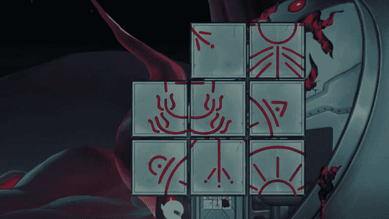

图 9.12 – 滑动拼图打乱后的拼图块

如前所述，我们将利用 Unity Asset Store 中的一个现有资产，快速整合滑动拼图功能，这将包括将图像切割成拼图块、打乱拼图块、响应用户滑动拼图的输入，以及计算何时拼图被解决。如果我们必须独立开发，所有这些要求都需要更多的时间来创建、编码、调试和测试。Unity Asset Store 的资产通常具有数十位（在某些情况下是数百位）开发者在其项目中使用这些资产并报告错误和差异给资产开发者的好处 – 你可以直接从他人的努力中受益。

不再拖延，我们将使用一个名为**滑动拼图游戏**的免费资源，由 Hyper Luminal Games 提供([`assetstore.unity.com/packages/templates/packs/sliding-tile-puzzle-game-41798`](https://assetstore.unity.com/packages/templates/packs/sliding-tile-puzzle-game-41798))：


图 9.13 – 滑动拼图游戏

由于**Unity 脚本 API**的变化，以及为了支持**通用渲染管线**（**URP**），即我们基于该项目的时间（早在 2016 年，Unity 5），我们需要执行几个步骤才能在 Unity 2022 项目中使用该资源。

让我们开始获取资源并将其导入到项目中。

### 导入滑动拼图资源

在完成购买资源或点击**添加到我的资源**的过程后，你可以在 Unity 资源商店中使用**在 Unity 中打开**按钮。或者，你可以在 Unity 编辑器中打开**包管理器**窗口，从**包**下拉菜单中选择**我的资源**，在列表中找到资源，点击**下载**，然后点击**导入**。

根据我的经验，大多数资源都是设计为导入到你的现有项目中的。然而，一些资源作为**完整项目**提供，因此不能直接导入到你的项目中。滑动拼图资源需要额外的步骤才能导入到你的项目中，因为它是一个完整项目，最好不要覆盖任何当前项目设置！

让我们一步步来操作；这不会花费太多时间：

1.  从**资源商店**页面或**包管理器**导入滑动拼图资源将产生以下**导入完整项目**警告对话框：

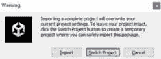

图 9.14 – 导入完整项目对话框

1.  点击**切换项目**按钮以创建一个临时项目，该资源将被导入其中。Unity 将自动生成一个临时项目名称。当我们从该项目中提取资源完成后，我们将删除该项目，所以请放心。

1.  当 Unity 打开并完成导入后，你将在**项目**窗口中找到`Assets/HyperLuminal`文件夹。

1.  右键点击`SlidingTilePuzzle`文件夹并选择**导出包…**。这将打开一个**导出包**对话框，在这里你可以更改导出内容。我们希望包含所有内容，所以点击右下角的**导出…**按钮。

1.  当文件保存窗口打开时，将`.unitypackage`文件名输入为`SlidingTilePuzzle`，并选择一个易于访问的文件夹；我们很快将从这个相同的文件夹导入。

1.  关闭 Unity。你将看到一个**保留项目？**对话框。你可以安全地点击**忘记**按钮，因为我们不再需要它：

    注意，即使你确认忘记了它，你仍然可能在 Unity Hub 中看到一个错误的项目，代表这个临时项目。如果是这样，请将其删除并删除项目文件夹。

1.  现在，回到我们的游戏项目中，让我们通过从我们之前保存的位置打开`SlidingTilePuzzle.unitypackage`来导入保存的`.unitypackage`文件：

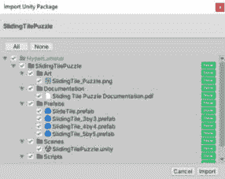

图 9.15 – 导入 Unity 包对话框

1.  所有项目都应标记为**新**，除非我们之前已导入该包。请继续点击**导入**，以便我们继续集成滑动拼图。

小贴士 | 项目组织

资产供应商会在项目文件夹结构中自行选择其资产的位置，因此导入许多第三方资产可能会变得有些杂乱无章。为了在项目文件中保持一定的理智，我建议将所有第三方资产放在这个**Assets/Third Party**文件夹下。

例如，在*图 9.15*中，你可以看到*SlidingTilePuzzle*，我们将将其导入到**Assets/HyperLuminal**文件夹。请创建一个新的**Assets/Third Party**文件夹，并将**HyperLuminal**文件夹作为其子文件夹。问题解决。

现在，让我们更新资产，使其符合我们的 Unity 2022 项目要求。

### 更新拼图瓷砖着色器

我们的首要任务是更新从内置的遗留渲染器到 URP 渲染器。在 Unity 5 中，我们只有内置的渲染器，因此我们需要将与此资产相关的渲染相关项目进行转换是有意义的。

如果你现在打开`Assets/Third Party/HyperLuminal/SlidingTilePuzzle/Scenes`文件夹中的`SlidingTilePuzzle`示例场景并进入**播放模式**，你会看到一个巨大的粉色方块。粉色（或洋红色）是 Unity 用来表示材质或着色器错误的颜色 – 除非你专门创建了一个这个颜色的对象，否则在**场景**或**游戏**视图中看到它通常不是什么好事。

该资产采用预制体方法来制作你想要的滑动拼图类型，并为`3x3`、`4x4`和`5x5`滑动拼图提供预制体 – 我们将制作一个 3x3 滑动拼图，并使用特定的`3x3`预制体。按照以下步骤更新渲染器特定问题：

1.  在`Assets/Third Party/HyperLuminal/SlidingTilePuzzle/Prefabs`文件夹中，复制`SlidingTile_3by3`预制体并将其重命名为`SlidingTile_3by3_URP`。

1.  双击`SlidingTile_3by3_URP`进入**预制体****编辑模式**。

1.  找到`ST_Puzzle Display`组件，将**拼图着色器**从`Mobile/Unlit`更改为`Packages/Universal RP/Shaders/2D/Sprite-Unlit-Default` – 你必须从`Packages`中拖动这个着色器。

1.  保存预制体。

我们还需要对渲染器问题进行一次更新，那就是拼图瓷砖本身，但首先，我们需要一个新的**Universal RP Sprite**材质。按照以下步骤更新资产：

1.  在 `Assets/Materials` 文件夹中创建一个新的 *材质*，命名为 `PuzzleTile 1` 并选择它。

1.  在 **检查器** 视图的顶部 **着色器** 下拉菜单中，选择 **通用渲染管线/2D/Sprite-Unlit-Default** 着色器。

1.  在 `Assets/Third Party/HyperLuminal/SlidingTilePuzzle/Prefabs` 文件夹中，我们还有一个 `SlideTile` 预制体。复制它并将其重命名为 `SlideTile_URP`。

1.  双击 `SlideTile_URP` 进入 **预制体编辑模式**。

1.  找到 `MeshRenderer` 组件并将 `Element 0` 更改为 `PuzzleTile 1`。

1.  保存预制体。

现在，`滑动拼图` 资产的渲染问题已经更新，我们可以在 **Lit 2D (URP)** 场景中工作了！

我们在更新中只有一个问题，那就是交互性——也就是说，能够根据玩家输入滑动拼图。

### 更新输入系统

新输入系统之所以被称为新，是因为……嗯，它是新的。Unity 5 只有一个传统的 `InputManager` 系统；当然，由于我们在项目中使用新的输入系统，我们需要进行一些更改以支持它。所有渲染器的更新都是在编辑器中完成的，但现在，我们得更改一些代码。

进行以下代码更改：

1.  在 `Assets/Third Party/HyperLuminal/SlidingTilePuzzle/Scripts` 文件夹中找到 `ST_PuzzleTile` 脚本，并在你的 IDE 中打开它。

1.  在脚本顶部添加一个新的 `using` 语句。我们需要这个 `UnityEngine` 命名空间来支持代码更改：

    ```cs
    using UnityEngine.EventSystems;
    ```

1.  将 `IPointerClickHandler` 接口添加到类定义中，以支持新输入系统的 `pointer` `click` 方法：

    ```cs
    public class ST_PuzzleTile : MonoBehaviour, IPointerClickHandler
    ```

1.  在脚本底部，将 `void OnMouseDown()` 替换为以下内容：

    ```cs
    public void OnPointerClick(PointerEventData eventData)
    ```

1.  保存脚本并返回到 Unity 编辑器；你完成了。

不幸的是，你不能再使用供应商的 `SlidingTilePuzzle` 示例场景来测试滑动拼图。

要测试更新以及每个你想使用滑动拼图的场景的最终更新要求，请按照以下步骤操作：

1.  创建一个新的场景（**文件** | **新建场景** 或 *Ctrl*/*Cmd* + *N*）并选择 **Lit 2D (URP)** 新场景模板。

1.  将 `PhysicsRaycaster` 组件添加到 **主摄像机**。

1.  将 `UI Event System` 添加到场景中。确保更新 `StandaloneInputModule` 组件以支持新输入系统。

1.  将 `SlidingTile_3by3_URP` 预制体添加到场景中。

1.  进入 **播放模式**。测试。享受。

这样就完成了对 *滑动拼图* 进行 URP 渲染和新输入系统现代化的所有更新要求。还不错。

正如你所见，Unity 资产商店是一个极好的资源，拥有许多才华横溢的资产发布者。它可以帮助你快速构建游戏原型、打磨你的游戏，并在早期创建垂直切片（以寻找你的项目出版商或投资者）。

然而，我们需要进行一个额外的更改，以便将滑动拼图集成到我们的游戏玩法中。那就是添加一个当安全拼图锁被解决时的事件，以便我们可以触发适当的动作 – 在这一点上，一个合理的动作是授予玩家进入栖息地站点的权限。芝麻开门！

### 添加完成事件

在这个任务中，我们不会涉及任何新的内容。我们已经以几种不同的方式添加了事件。这次我们的选择将是一个`UnityEvent`事件，这样我们就可以在**检查器**视图中设置触发处理程序。

在`Assets/Third Party/HyperLuminal/SlidingTilePuzzle/Scripts`文件夹中找到`ST_PuzzleDisplay`脚本，并在您的 IDE 中打开它。然后，通过以下添加修改脚本：

1.  在脚本顶部添加一个新的`using`语句，如需声明我们的事件：

    ```cs
    using UnityEngine.Events;
    ```

1.  添加一个在拼图完成时被触发的`public` `UnityEvent`事件：

    ```cs
    public class ST_PuzzleDisplay : MonoBehaviour
    {
        …
        public UnityEvent OnPuzzleComplete;
    ```

1.  通过在`if(Complete)`块内添加`OnPuzzleComplete`调用行来修改`CheckForComplete()`方法：

    ```cs
    public IEnumerator CheckForComplete()
    {
        …
        // if we are still complete then all the tiles are correct.
        if(Complete)
        {
            Debug.Log("Puzzle Complete!");
            OnPuzzleComplete?.Invoke();
        }
        …
    ```

我们现在有一个方便的方式来响应入口处安全拼图锁被解决/完成。

当我们在栖息地入口处设置`QuestHasCompleted`组件时，我们为我们的未来自己留下了未完成的事情。现在我们是我们的未来自己，因此我们可以完成`OnQuestComplete`事件分配，并向玩家展示我们的安全拼图锁。

### 设置新的拼图预制件

是的，没错 – 我们还需要另一个预制件来表示滑动拼图锁。我们现在将设置它，以便在收集到所有三把钥匙并到达栖息地入口时向玩家显示 – 使用我们的图像。

按照以下步骤创建新的预制件：

1.  将`SlidingTile_3by3_URP`预制件拖动到`(0, 0, 0)`。

1.  右键单击并选择`Key Puzzle Lock` – 你将得到实际的拼图作为子组件（是的，这是我们标准的预制件结构方法，如果你还不确定的话）。

1.  在`Assets/Sprites/Puzzle`文件夹中找到`key_puzzle1-complete_512`图像（这是我们在之前的*KeyItem 组件*部分中导入的图像之一），并在`512`中更改其导入设置

+   找到`ST_PuzzleDisplay`组件并分配以下内容：

    1.  *拼图图像*：`key_puzzle1-complete_512`

    1.  *拼图缩放*：`0.7`，`0.7`，`0.7`：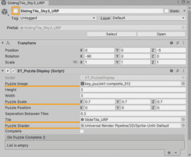

图 9.16 – 滑动拼图配置

1.  现在，禁用`SlidingTile_3by3_URP`对象。是的，你听到的没错；我们将禁用带有`ST_PuzzleDisplay`组件的对象，因为我们只想在玩家收集到所有三把钥匙并到达栖息地入口时显示拼图并执行其功能。

1.  将`Assets/Prefabs`文件夹拖动以创建拼图锁预制件。

现在我们已经准备好了定制的安全拼图锁！最终的设置确保它在需要时在栖息地入口处显示。

### 将拼图锁添加到入口处

我们已经在栖息地入口处设置了我们的**拼图触发器**。现在，让我们将其安全拼图锁添加到该位置，以便它在入口门处显示并可交互。由于一切都已经设置好并准备就绪，这是一个简单的两步过程：

1.  将**钥匙拼图锁**预制件放置在关卡中靠近、略微上方或正好在栖息地入口门处。您可以参考*图 9**.12*了解我放置的位置：在门上，正好在玩家角色头部上方。

1.  通过以下步骤显示由`QuestHasCompleted`组件的`OnQuestComplete()`事件触发的滑动拼图：

    1.  通过点击小加号（`SlidingTile_3by3_URP`是`GameObject`的子对象 | `SetActive(bool)`从函数下拉菜单，并勾选复选框以传递`true`），为`OnQuestComplete()`添加一个新条目作为`PlayerInput.enabled`的附加操作。

就这样！你现在可以完全测试任务生命周期了，收集散布在关卡中的三个钥匙以完成任务，触发已完成任务的的事件，并解决游戏中的滑动拼图。太棒了！

剩下的就是我们在解决入口拼图锁时需要做的事情——即胜利。

## 胜利

当安全拼图锁被解决后，我们就可以进入栖息地站。我们刚刚添加到`Sliding Tile Puzzle Game`代码中的`OnPuzzleComplete()` `UnityEvent`事件被触发，所以这是我们为胜利状态做些事情的机会。

我的游戏设计计划和本书项目的计划是在*第十章*中继续游戏玩法，在那里事情将开始变得更加深入。我并不是在比喻意义上说这个；下一章引入的项目将是一个 3D**第一人称射击**（**FPS**）游戏。现在，我们将实现一个漂亮的黑白电影淡入，以及*待续…*。但是，我们如何在不知道大量同步线性时间代码的情况下解决实现淡出和在屏幕上显示文本序列的问题呢？让我们看看。

## 时间线

**时间线**不是 Unity 2022 的新特性。它自 Unity 2017 以来就存在了，但我感觉它是一个被低估的核心特性，没有得到游戏开发者应有的关注。然而，对于电影内容创作者来说，它却是一个变革性的功能，因为时间线允许轻松创建影响场景中几乎所有对象的线性序列。

时间线基于两个协同工作的元素：一个基于**时间线**文件资产的资源和一个**可播放导演**组件。需要注意的是，时间线实例是场景相关的。

附加阅读 | Unity 文档

时间线：[`docs.unity3d.com/Packages/com.unity.timeline@1.8/manual/index.xhtml`](https://docs.unity3d.com/Packages/com.unity.timeline@1.8/manual/index.xhtml).

我们将利用时间线简单性的纯粹力量，线性地影响一组对象，以消除这个结束淡出。让我们首先创建我们的时间线实例：

1.  首先，在项目中创建一个位置来存储时间轴资产。创建一个名为`Assets/Timelines`的新文件夹。

1.  在`Ending Timeline`内通过右键单击并选择**创建** | **时间轴**。

1.  我们现在可以通过在**项目**窗口中双击**结束时间轴**资产来打开**时间轴**窗口。

1.  如果你习惯于在**帧**的时间尺度上工作，请使用**时间轴**窗口右上角的齿轮图标选择**秒**（如图 9.17.17 所示）。

1.  通过将**结束时间轴**资产拖动到**场景层次结构**中完成时间轴的创建，以创建基于场景的实例。

我们将使用两个 UI 小部件来实现淡出效果和标题，按照以下步骤操作：

1.  在`Image`组件的根组件中添加`Canvas`组件以填充屏幕。我们不需要特定的图像；默认的**背景**精灵就足够好了。

1.  右键单击`RectTransform`：`400`

1.  `TextMeshPro – Text (UI)`: `待续…`

最后，我们将这些 UI 小部件拖入时间轴以设置序列。按照以下步骤添加小部件并定义它们各自的序列：

1.  确保在**时间轴**窗口中可以看到**结束时间轴**。如果**时间轴**窗口没有打开，可以从**窗口** | **序列** | **时间轴**打开它，然后在层次结构中单击**Endling Timeline**实例。

1.  将`Image` `0`（透明）拖动到`255`（不透明）处，持续 1.5 秒：

    1.  点击红色**开始录制**圆形按钮（`000000`)，使用`0`设置第一个关键帧。

    1.  将`255`拖动以设置第二个关键帧。

    1.  停止录制。

1.  将**文本（TMP）**拖动到**时间轴**窗口的**轨道列表**部分，并在提示时选择**添加激活轨道**。

    我们希望文本在淡出完成后显示心跳，因此将**Active**剪辑在时间轴上拖动到 1.8 秒处。**Text (TMP)**绑定的 GameObject 将仅在时间轴剪辑的范围内活动，并在其外停用。文本部分完成。简单易懂。

要在**游戏**视图中预览时间轴序列的结果，请单击**播放**按钮或按空格键：

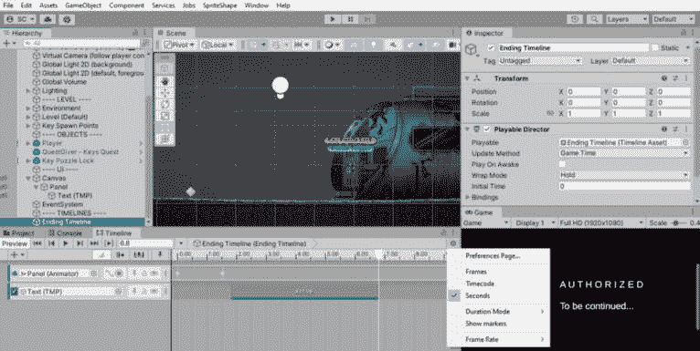

图 9.17 – 时间轴结束淡出标题

如果你输入`PlayableDirector`组件是在我们将它拖入场景时添加到时间轴实例的。

在**检查器**视图中选择`PlayableDirector`组件的值：

+   `PlayOnAwake` = `false`

+   `WrapMode` = `Hold`

我们还想要确保在编辑器的设计时间中 UI 小部件没有可见状态。这样，它们就不会在我们触发时间轴播放之前显示。对场景中的 UI 小部件值进行以下更改：

1.  对于 UI `Image` `0`。

1.  对于 UI **文本（TMP）**对象，停用对象（在**检查器**视图顶部取消勾选复选框）。

由于我们已经在时间线中记录了颜色值和活动状态，因此我们可以安全地在场景中设置这些值，而不会影响它们的序列行为。

现在唯一剩下的事情就是在滑动拼图完成时激活我们的结束序列。在层次结构中找到`SlidingTile_3by3_URP`对象，在`ST_PuzzleDisplay`组件上添加一个动作到`OnPuzzleComplete: Runtime Only`，`PlayableDirector.Play()`。

待续——或者第一幕的结束，由你决定。无论如何，这仅仅是对时间线的一个冰山一角介绍——它是一个极其强大的场景、电影和游戏或音频序列工具！

在本节中，你学习了如何从 Unity Asset Store 导入第三方资产，并将其更新为适用于 Unity 2022，同时通过扩展供应商提供的代码来触发事件。你还了解了 Unity 的 Timeline 功能，并创建了一个简单但有效的全黑电影淡出效果。

# 摘要

在本章中，你学习了如何创建一个高效且方便的全局事件系统，以灵活、可扩展和更易于维护的方式构建比直接耦合类更复杂的寻宝系统。你还学习了如何创建一个具有独特要求的特定寻宝任务，在将寻宝状态设置为完成之前需要满足这些要求，同时学习了如何引入随机性以收集所需物品。

我们继续学习如何从 Unity Asset Store 导入第三方滑动拼图资产，并升级它以兼容 Unity 2022 和 URP 渲染器，同时扩展代码以将其集成到我们的游戏代码中。我们完成了安全拼图锁的解决，并通过一个用于全黑淡出的电影时间线序列赢得了游戏。

在下一章中，我们将创建一个 3D FPS 游戏，以直接继续 2D 冒险游戏。我们将从上次离开的地方继续，进入室内栖息地环境，在那里我们将学习灰色拳击，以快速用**ProBuilder**完善可玩 3D 关卡设计。我们还将利用 Unity Asset Store 中的另一个资产——但这次是 Unity 直接提供的——用于我们的 FPS 角色控制器。我们还将通过将一些现有的 2D 组件转换为 3D 使用来查看代码重用。
