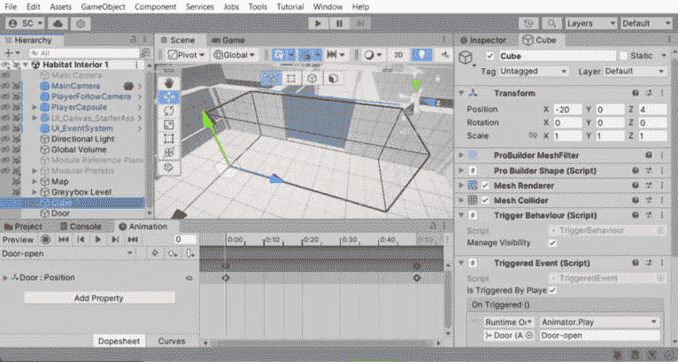

# 创建一个 3D 第一人称射击（FPS）游戏

在*第九章*中，我们创建了一个全局事件系统、一个任务系统以及一些松散耦合的组件，它们共同协作，为玩家提供多样化的任务。有了这些系统，我们迅速实现了收集物品以通知、更新和满足特定任务要求的功能。创建的组件是可扩展和可重用的，可以用于创建任意数量的任务。

我们随后导入并修复了**通用渲染管线**（**URP**）的渲染，并将第三方滑动拼图资产的重构代码作为一个示例，展示了如何利用 Unity Asset Store 为我们的游戏服务。我们通过在场景中设置拼图并使用新艺术作品，在拼图解决时触发事件，以淡入黑色序列结束关卡来完成。

本章将从上一章的 2D 冒险游戏结束的地方继续，通过引入我们刚刚进入的栖息地内部的 3D FPS 游戏。

在本章中，我们将涵盖以下主要主题：

+   在继续 GDD 的同时进行 3D 设计

+   使用 ProBuilder 和预制件灰盒化 3D 环境

+   使用 Unity Starter Asset 创建 FPS 玩家角色

+   将环境交互重构为 3D API 方法

+   实践中的代码重用——向玩家添加预制组件

到本章结束时，您将能够设计并构建一个由我们在 Unity 编辑器中制作的模块化部件组成的灰盒 3D 环境，快速添加 FPS 角色控制器，并重用和重构 2D 代码以用于 3D 项目。

# 技术要求

您可以在 GitHub 上下载完整项目：[`github.com/PacktPublishing/Unity-2022-by-Example`](https://github.com/PacktPublishing/Unity-2022-by-Example)。

# 在继续 GDD 的同时进行 3D 设计

2D 游戏的关卡设计更为直接，因为玩家只在两个维度中导航。相比之下，3D 游戏在游戏玩法中涉及额外的维度——深度，这导致了更复杂的关卡设计。在 2D 中，屏幕空间由**X**和**Y**坐标表示。在 3D 中，地面平面由**X**和**Z**（深度）表示，而**Y**仍然用于垂直轴——Unity 的 3D 坐标系统被定义为**Y-up 环境**。


图 10.1 – 2D 与 3D 坐标

正如我们从之前的 2D 工作中所知，Z 轴仍然存在，但通过相机直接表示——要么在前方，要么在后方——并且仅在场景中分层对象时适用某些情况。

接下来，我们将尝试使用模块化方法简化 3D 设计过程，但一切又从游戏设计开始。让我们回顾一下本章中引入的新 3D FPS 项目对 GDD 的游戏玩法变化。

现在是我们更新游戏玩法机制蓝图以反映我们对 *外世界* 3D FPS 游戏的演变愿景的机会。然后我们可以确保栖息地内部设计生产的各个方面都将与这一新体验保持一致。

在 *表 10.1* 中，你可以看到我已经更新了相关的游戏玩法部分：

| **描述游戏玩法、核心循环和** **进展** | 沿着中央控制系统前进，在角落和长长的走廊中窥视，同时处理需要沿途充电的损坏动力装甲，以恢复操作。小心那些徘徊的感染维护机器人！ |
| --- | --- |
| **什么是收集游戏的核心理念？** | 以第一人称视角，玩家将在环境中导航，为他们的动力装甲（健康）充电，并射击感染了维护机器人的目标。 |
| **需要实现哪些系统来支持** **游戏机制**？ | 玩家移动、具有弹药装填和射击能力的武器，以及具有收集（充电）和伤害能力的健康系统。 |

表 10.1 – 更新的相关游戏玩法部分

接下来，我们需要更新玩家角色和敌人的背景故事，使其相关，如 *表 10.2* 所述：

| **主要角色的** **挑战结构是什么？** | 居住站的环保控制系统已关闭，玩家角色的动力装甲由于损坏而失去了维持玩家的能力。玩家必须在战斗感染维护机器人的同时，在站内寻找 *充电* 来生存，直到到达中央系统。玩家将面对邪恶的植物实体 Boss。 |
| --- | --- |
| **敌人 B：****描述游戏中的第二个敌人及其如何推动故事。这位敌人是谁？** | 类型：维护机器人轮式背景：在殖民化前部署在栖息地维护和支持任务中的机器人。目标：维护、人员支持技能：快速充电弱点：移动性有限 |
| **Boss:** **Viridian Overmind****描述关卡 Boss 及其如何推动** **故事****这位 Boss 是谁？** | 一个有感知的植物实体感染了栖息站中央控制系统的中枢，迫使玩家面对邪恶的外星生物。 |

表 10.2 – 更新的角色和敌人背景

这是一个新的游戏关卡，因此也需要定义：

| **描述游戏发生的环境。它看起来如何，谁居住在那里，以及** **哪些是兴趣点**？ | 游戏发生在一个遥远星球表面的居住站内。栖息地欺骗性地很大，有许多小连接走廊。有维护机器人四处游荡，执行他们的自主任务。充电收集点方便地放置在整个站点的走廊交叉口。 |
| --- | --- |
| **描述游戏关卡** | 游戏关卡是一个模块化构建的栖息地站内部，有许多走廊和房间服务于不同的目的，以及一个中央控制系统房间。 |

表 10.3 – 环境和关卡定义

最后，我们需要更新输入控制方案，使其在 3D 空间中有效：

| **定义输入/控制** **方法动作** | 键盘：*W*，*A*，*S*，*D*键用于移动，鼠标用于瞄准，左鼠标按钮用于射击主要武器，*E*键用于交互。游戏手柄：左摇杆/方向键用于移动，右摇杆用于瞄准，右扳机或*Y*键用于射击，按钮*A*用于交互。 |
| --- | --- |

表 10.4 – 更新的输入/控制方法动作

通过对*外部世界*游戏 3D 概念设计和游戏玩法机制的 GDD 修订，我们为过渡到关卡设计阶段奠定了基础 – 确保关卡将与我们的整体概念保持一致，并提供预期的玩家体验。

# 使用 ProBuilder 和预制件进行灰色盒 3D 环境设计

在某些方面，创建 3D 环境与创建 2D 环境相似，因为您仍然需要有意义地放置事物以供游戏使用。当然，我们必须考虑额外的维度，并使用 3D 模型而不是 2D 图像资源。

在 Unity Hub 中，请创建一个新的`Unity 2022`项目，并使用**3D (URP) 核心**模板作为我们的起点。我们将继续使用来自先前 2D 项目的 URP 渲染器。这对于 3D 来说仍然是一个很好的选择，因为它将在最广泛的设备上表现出色，包括移动平台。有了这个，尽管听起来我们可能正在剥夺自己一些能力，但我们并没有，因为 URP 也非常擅长制作美丽的 3D 视觉效果。

额外阅读 | Unity 文档

URP 概述：[`docs.unity3d.com/Packages/com.unity.render-pipelines.universal%4014.0/manual/index.xhtml`](https://docs.unity3d.com/Packages/com.unity.render-pipelines.universal%4014.0/manual/index.xhtml)

我们将通过使用称为**灰色盒**（也可能被称为**屏蔽**）的技术来加快设计过程 – 这将使我们能够使用简单的几何形状来大致绘制关卡设计，而不会被细节所分散。我们还将能够早期进行关卡测试，并识别玩家在环境中导航和解决一般可玩性问题的任何潜在问题。

让我们先看看我们将要制作的内容。

## 栖息地内部关卡

像在早期章节中一样，我将提供一个示例关卡设计（再次让你承受我的草图，尽管这次更加精细），你可以跟随。关卡地图包括一个入口点 – 我们在上一款 2D 冒险游戏结束时进入的栖息地站 – 并通往一个中央控制系统，我们将面对邪恶的植物实体！


图 10.2 – 生态室内关卡地图草图

我们将采用模块化的方法来设计关卡，因此按照这个设置，我们将能够快速适应不同的布局。正如您所看到的，我已经添加了一个图例，用于标识打算使用的模块——这些将成为我们的可重复使用的组件，作为构建和构建关卡的大致框架。*充电*拾取点（绿色）、玩家的起始位置（**P**）以及 Boss 角色的位置也已被定义。

太好了！现在我们有一个可执行的计划。接下来，我们可以开始创建我们灰盒套件所需的 3D 模块。如果您在想，但我没有 3D 模型师/艺术家技能！不用担心，因为这将是一个基本的介绍——我也相信游戏开发者应该至少具备这些 3D 知识。

## 安装 ProBuilder

Unity 提供了更多内置工具，我们可以将其用于我们的灰盒过程，形式是一个简单的 3D 建模功能，称为 ProBuilder。像 Unity 的许多功能一样，我们将从 **包管理器** 安装 ProBuilder。在 Unity 2022 中，工具被收集到功能集中，因此打开 **窗口** | **包管理器**，选择 **3D 世界构建** 功能（包括 ProBuilder 和相关工具），然后安装它。

安装完功能后，我们还需要一个额外的步骤来完成 ProBuilder 的设置。我们使用的是 URP 渲染器，这需要安装支持用的着色器和材质：

1.  在 **包管理器** 中，找到并选择左侧列表中的 **ProBuilder**。

1.  在右侧，选择 **示例**，然后点击 **通用渲染管线** **支持** 项的 **导入** 按钮。

1.  导入完成后，转到 **编辑** | **首选项…** | **ProBuilder**，确保在 **网格设置** 下，**材质** 设置为 **ProBuilder 默认 URP**。

安装 ProBuilder 添加了一个新的顶部菜单项，名为 **工具**，允许打开 **ProBuilder** 窗口并访问其他功能，导出和调试日志首选项。对于我们的灰盒过程，我们将专注于 **ProBuilder** 窗口内的对象创建过程，但这并不意味着 ProBuilder 只限于创建简单的灰盒对象；它已经发展成为一个完整的 3D 建模和纹理产品，根据您游戏的风格，也可以用于最终资产创建。

额外阅读 | Unity 文档

ProBuilder: [`docs.unity3d.com/Packages/com.unity.probuilder@5.0/manual/index.xhtml`](https://docs.unity3d.com/Packages/com.unity.probuilder@5.0/manual/index.xhtml)

现在我们通过转到 **工具** | **ProBuilder** | **ProBuilder** 来打开 **ProBuilder** 窗口，我们将设置好从草图图例创建模块化构建块。

## 模块化部件、预制件和变体

与室外环境的关卡设计不同，室外环境的形状在放置和位置上具有有机性质，我们正在制作一个受控空间的室内环境。因此，我们将使用需要相互**吸附**的模块来构建（你知道，需要一个气密栖息地所需的精度）。这通常是用于任何在自然界中找不到的制造结构空间的通用方法。

Unity 通过提供一些辅助构建选项很好地处理了模块化设计。

### 网格吸附

Unity 提供了一个**网格吸附**系统，它与 ProBuilder 配合得非常好，可以简化我们进行模块吸附等任务的生活。网格吸附允许在 X、Y 或 Z 轴平面上精确定位 GameObject，并适用于移动、旋转或缩放操作。

转换 GameObject – 即实现移动、旋转和缩放操作 – 也可以在不与预定义的网格线吸附间距对齐的情况下以增量方式执行。可以通过在场景视图中使用对象变换 Gizmo 时按住 *Ctrl*/*Cmd* 键来执行增量吸附（**吸附增量**设置位于**网格吸附**设置右侧的按钮上，如*图 10.3*所示）。

额外阅读 | Unity 文档

网格吸附：[`docs.unity3d.com/2022.3/Documentation/Manual/GridSnapping.xhtml`](https://docs.unity3d.com/2022.3/Documentation/Manual/GridSnapping.xhtml)。

我们的关卡草图没有任何尺寸（我只是用网格来大致确定事物的一致大小），因此我们不受创意流动的限制；现在我们正在制作**精确**的模块化部件，我们需要引入一些计量单位来允许部件的吸附。如果我们不控制细节的大小，那么需要连接以创建封闭内部关卡设计的模块将会相当棘手。

为了设置网格吸附，我们首先需要激活**移动**工具，并确保在**工具设置**覆盖层中将句柄方向设置为**全局**（这是在场景视图中启用吸附的必要条件），如下面的截图所示：


图 10.3 – 网格吸附工具栏

注意，**变换**工具将选定的 GameObject(s) 沿着活动 Gizmo 轴吸附到网格上 – 使用**网格视觉**按钮，该按钮位于**网格吸附**设置左侧，如*图 10.3*所示，目前设置为**网格** **平面** Y 轴。

让我们确保网格吸附设置已设置好，以便我们开始创建栖息室内部的模块化部件。参照*图 10.3*，按照以下步骤设置吸附网格：

1.  从场景视图中的**工具栏**覆盖层中选择**移动**工具。

1.  在**工具设置**覆盖层中将句柄方向设置为**全局**。

1.  验证**网格视觉** | **网格平面** = **Y**。

1.  验证**网格吸附** = **启用**。

1.  设置**网格吸附** | **网格大小** = **2**（默认值为**1**）。

1.  设置**增量吸附** = **0.25**。

我有机械制图和 CAD 的经验，所以我喜欢知道我在使用什么尺寸——即使，是的，我们将吸附到我们刚刚定义的网格单位上。ProBuilder 的默认材质也包括一个网格纹理，但仍然可能很难在没有一些可见值的情况下确定所需的尺寸。因此，让我们使用我们将要构建的对象的视觉尺寸。从**文件**菜单，通过转到**工具** | **ProBuilder** | **尺寸**来设置**尺寸**覆盖层为**显示**。

网格吸附将非常有帮助——确保模块部分尺寸的一致性——但我们还可以通过一个简单的构建辅助工具再进一步。

### 建设平面

我们将放置一个参考平面以帮助创建模块。我决定标准模块尺寸将是 6 个单位（对于你想要与之一起工作的基座模块的大小来说，这相当任意；我觉得对于这个设计来说，使用较小的模块会更好），因此我们将所有尺寸——包括模块以及地图尺寸——都基于这个标准（以及它的可分割尺寸，即吸附单位大小为 2；所以，希望这一切都能顺利进行）。

让我们继续：

1.  在`Assets/Scenes`文件夹中，复制`SampleScene`并将其命名为`Habitat` `Interior 1`。

1.  现在，在**ProBuilder**窗口打开的情况下，选择**新建形状**，然后点击**创建形状**覆盖层中的**平面**选择图标。

1.  网格吸附和尺寸显示已启用，因此点击并拖出一个 6 x 6 单位的平面。


图 10.4 – ProBuilder 参考平面

1.  再次点击**新建形状**来停止创建形状。

1.  现在，让我们将平面位置重置为世界空间中的`(0, 0, 0)`。在平面被选中时，右键点击`(0, 0, 0)`的`Module` `Reference Plane`。

小贴士 | 最大化 Unity 窗口

要在 Unity 中最大化当前活动窗口，如*图 10.3*中场景视图窗口所示，您可以使用键盘快捷键*Shift* + *空格键*。

现在让我们制作第一个模块部分！

### 制作模块部分

我们将这些模块部分无缝地组合在一起，以形成我们需要的各种配置，从而制作出栖息地站级的复杂空间。因此，让我们开始制作我们环境的模块部分，从一个墙段开始：

1.  要制作一个墙段，点击**新建形状**，但这次点击**立方体**选择图标。

1.  从`(0, 0, 0)`开始，拖出一个长度为参考平面（6 个单位）且在**Z**方向（远离参考平面；蓝色辅助轴）上-2 个单位的形状。

1.  然后，向上移动（高度为`4`单位。

由于网格吸附的结果，看起来这个盒子有点太厚，无法代表一堵墙，所以让我们编辑形状并使其稍微薄一些：

1.  如*图 10.5*所示，旋转相机以查看墙的另一侧。我们可以在场景视图中通过按住*Alt*/*Option*键，然后点击并拖动鼠标指针来旋转。

1.  然后在**ProBuilder 选择**覆盖层中点击**面部选择**选项（*A*）。

1.  现在点击墙的正面将只选择面多边形。在按住*Ctrl*/*Cmd*键的同时，拖动移动变换操控器的 Z 轴手柄（蓝色），直到墙体厚度为 1 单位（*B*）。


图 10.5 – ProBuilder 增量表面对齐编辑

1.  完成编辑面后，返回到**对象选择**模式（*A*）。

灰盒化不一定意味着 100%没有所有细节；我通常喜欢在我的灰盒化组件部分中添加至少一些小元素，以传达一些设计美学，因此我们将在构建一些附加部分之前，在墙体段上添加一些细微的细节。

让我们在墙体段上添加一些几何细节：

1.  制作一个 2 x 2 单位的新立方体，高度为 4 单位。然后，使用`1.5` x `0.25` x `4`。将其放置在墙体段末端以提供端盖。

1.  复制**端盖**立方体，并将其放置在墙体段另一端（就像书签）。请注意，两端应位于参考平面内，因此将与墙体段相交（这是可以的——我们希望将部件限制在我们的参考尺寸内，以便像乐高积木一样对齐）。

1.  制作一个`6` x `2`单位的新立方体，高度为`2`单位，然后编辑其大小并将其定位，使其在墙体段长度上形成一种连接条。

我们 3D 建模的结果可以在以下屏幕截图中看到：


图 10.6 – 墙体截面细节添加

提示 | 照明

注意，场景中的光照阴影已被关闭，以便专注于建模任务。您可以通过在场景层次结构中选择**方向光**对象，然后在检查器中找到**阴影**部分，将**阴影类型**设置为**无阴影**来实现这一点。

我会说这个墙体部分现在对我们第一个模块化组件来说是完整的。因此，我们当然会想要将其制作成 Prefab，这样我们就可以在需要的地方重复使用它，并且如果我们需要修改它，场景中的所有引用都将更新。

按照以下步骤创建墙体 Prefab：

1.  添加一个新的空 GameObject，并将`(0, 0, 0)`重置。这将是我们父对象，并确保我们的模块化部分在它们的对齐点上保持一致性——构成模块的各个单独对象将通过这个锚点枢轴进行变换。

1.  选择并拖动墙体组件的所有部分，使其成为新空 GameObject 的子对象。

1.  现在，将父对象重命名为`Wall 1`，并将其拖动到新的`Assets/Prefabs`文件夹中，以创建 Prefab。

您现在拥有制作灰色盒子工具包所需的所有工具和知识。这很简单，太好了！

我们需要为我们的灰色盒子工具包准备哪些预制件才能从关卡中制作出完整的块？我们可以从地图图例（见*图 10.2*）中找到答案。只需要几个预制件即可制作——减去我们刚刚制作的那个墙：

| (A) | 墙 1 | 6 单位长度 |
| --- | --- | --- |
| (B) | 墙 2 | 12 单位长度 |
| (C) | 门口 | 18 单位长度（等长的墙、开放空间、墙） |
| (D) | 连接器 1 | 6 x 6 单位，带有地面平面 |
| (E) | 连接器 2 | 6 x 12 单位，带有地面平面 |

表 10.5 – 灰色盒子工具包部件

*连接器 1* (*D*) 将是房间之间相同类型的连接器，这样它就可以作为一个完成的模块创建，而无需在需要时从单个墙部件组装。*连接器 2* (*E*) 预制件也是如此，只是更长。在这里，我们可以看到所有模块化部件：


图 10.7 – 灰色盒子工具包预制件

现在继续创建额外的墙、门和连接器模块化部件；我会等着。只需确保始终从我们的建筑平面原点开始，以确保锚点枢轴位于`(0, 0, 0)`——通过在那里创建一个新的空 GameObject 并将其作为立方体的父对象——这样我们的工具包部件就能始终正确地定位。这些锚点枢轴指令基于*图 10.4*中所示，而不是*图 10.7*中所示，在那里墙部件在创建后被移动以获得更好的可见性。

我们的灰色盒子工具包完成后，我们现在可以开始绘制关卡。

## 灰色盒子关卡设计

我们有地图草图作为参考，但如果我们随意拖动工具包预制件来尝试填充它，这仍然会过于抽象。为了使过程更加流畅，我们可以使用 ProBuilder 平面根据我们的对齐网格来布置地图草图。这将确保添加工具包模块将变得简单快捷。

另一个绘图辅助工具（我们尽可能多地获取帮助）是将**网格视觉**设置的**不透明度**设置为最大值（如*图 10.7*所示），以便网格完全可见。

根据我们的草图和*表 10.5*中我们模块化工具包部件的大小，使用 ProBuilder 平面绘制关卡：墙壁、门和连接器。ProBuilder 默认将平面创建在**Y**，**0**处，这正是我们想要的位置（地面水平）。在绘制关卡时，锁定视图为俯视图将有所帮助。因此，使用场景 gizmo（场景视图右上角，*图 10.8*中的(*A*)），点击**Y**（绿色）手柄，点击中心立方体以设置视图为正交（无透视），然后点击小锁图标。

额外阅读 | Unity 文档

场景视图导航：[`docs.unity3d.com/2022.3/Documentation/Manual/SceneViewNavigation.xhtml`](https://docs.unity3d.com/2022.3/Documentation/Manual/SceneViewNavigation.xhtml)

这里是我们关卡地图的开始：


图 10.8 – 地图布局平面

正如您将注意到的（如图 *图 10*.8 所示），白色的 ProBuilder 平面有点发光。这是因为从我们复制 **SampleScene** 以来，后处理体积就在场景中。如果它是一个干扰因素，只需在层次结构中禁用 **全局体积** 对象，或者，在绘制关卡时，通过 **视图选项** 工具栏（*B*）关闭效果。

这里是完成后的关卡地图，入口位于位置 (*A*)，并前往位于位置 (*B*) 的中央控制系统室：


图 10.9 – 完成的地图布局

我在这里使用“极其重要”的定义来解释“中心”这个词，而不是“在某个东西的中间”的定义，只是为了澄清与房间布局的任何可能的混淆。

所有困难的事情都已经完成。我们现在要做的就是将我们的模块化工具包部件拖到绘制地板平面的边缘 - 我们确保的锚点枢轴位于模块的原点。我们已经确保一切应该能够正确吸附并相互连接。一旦你在场景中有一个模块化预制件，你可以使用 *Ctrl*/*Cmd* + *D* 快速复制它，然后移动和旋转到合适的位置。

注意，您可能需要旋转模块以封闭房间和走廊的周边。这就是锚点枢轴也发挥关键作用的地方 - 部件将在枢轴处旋转，确保保持正确的吸附。您可以在检查器中输入一个值或使用 **工具栏** 面板中的 **旋转变换** 工具（按住 *Ctrl*/*Cmd* 键以进行增量旋转并确保精确的 90 或 180 度旋转）来旋转部件。

如果我们在地图的房间和走廊的大小或间距上犯任何错误，我们会很快发现，但使用这种模块化方法快速进行更正是微不足道的。轻而易举。

这里是我将内部栖息地关卡与我们的模块化灰色盒子工具包结合起来的结果：


图 10.10 – 完成的栖息地内部灰色盒子

在本节中，我们学习了如何使用简单的 ProBuilder 模型预制件构建的 3D 环境，这些预制件用于创建简单的灰色盒子部件套件。然后我们发现了如何绘制关卡设计并使用 Unity 的网格吸附系统来快速轻松地使一切就位。

对于下一部分，我们需要测试我们所构建的内容。这次，我们不会从头开始编写玩家控制器，而是将利用 Unity 的 Starter Assets 快速构建玩家。

# 使用 Unity Starter Asset 创建 FPS 玩家角色

让我们快速看一下使用预构建资产（如 Unity 的**Starter Asset 角色控制器**）与自行编码相比的一些一般性好处：

+   它们节省时间和精力——构建复杂系统需要时间，并且需要解决过程中出现的任何问题。

+   它们经过测试和优化以提高性能，并且通常使用最佳实践——因为它们是由 Unity 提供的（他们对在引擎中创建组件有一些了解），并且被各个级别的游戏开发者广泛使用，这些资产将具有高性能并且不太可能出现错误。

+   这些资产基于 Unity 的`CharacterController`组件构建——这些资产是模块化构建的，确保与其它系统（如相机和战斗系统）和资产兼容；它们是 FPS 游戏的一个很好的起始基础。

+   它们提供了一个学习机会——预构建资产可以是一个很好的学习工具，因为你可以检查它们是如何工作的。

+   它们提供了丰富的自定义选项——Unity 为大多数玩家控制器使用提供了许多开箱即用的自定义选项（特别是对于这种情况下的 FPS，这对我们来说太棒了！）

这些优势非常显著，有助于快速解决问题，我们将充分利用它们。现在让我们安装 Unity Starter Assets。

## 安装 Unity Starter Assets

我们将使用 Unity 从 Asset Store 提供的（免费）`Starter Assets - FirstPerson CharacterController` | `URP`资产来构建我们的 3D 第一人称射击游戏。

Starter Assets - FirstPerson CharacterController | URP (Unity Technologies)

你可以在 Unity Asset Store 这里找到这个资产：[`assetstore.unity.com/packages/essentials/starter-assets-first-person-character-controller-urp-196525`](https://assetstore.unity.com/packages/essentials/starter-assets-first-person-character-controller-urp-196525)。

安装过程将非常直接，与我们已经从包管理器中安装资产的方式类似。然而，由于 Starter Assets 有一些必需的依赖项，安装过程中可能会有一些小插曲。不用担心；这只是一个小麻烦，正如你通过以下步骤很快就会看到的那样：

1.  如果你还没有保存场景，现在保存一下（*Ctrl*/*Cmd* + *S*）——你将在接下来的几步中看到原因。

1.  按照前面的 URL 打开 Unity Asset Store 中的资产。

1.  如果尚未登录，请登录。

1.  点击**添加到我的资产**按钮（接受**Asset Store 服务条款** **和 EULA**）。

1.  在 Unity 编辑器中打开项目后，点击浏览器窗口顶部的**在 Unity 中打开**按钮（你也可以在任何时候点击 Asset Store 页面上的**在 Unity 中打开**按钮），你会看到以下对话框：


图 10.11 – 在 Unity 中打开对话框

1.  点击**打开 Unity 编辑器**按钮将焦点设置到 Unity 编辑器，并打开包管理器，其中已预先选中**Starter Assets - FirstPerson CharacterController** | **URP**包（多么方便）。

1.  点击窗口右上角的**下载**按钮。

1.  下载完成后，点击**安装**按钮。

1.  Starter Assets 包需要新的`PackageChecker`脚本），我们将会收到提示，如下截图所示：


图 10.12 – Starter Assets 依赖警告

1.  当然，我们想要点击**安装/升级**，这样我们才能在我们的项目中实际使用 Starter Asset！如果你不小心跳过了这个步骤，你仍然可以通过包管理器安装新的**输入系统**包和**Cinemachine**包。然而，当**输入系统**依赖项安装完成后，我们将看到一个对话框来启用原生平台后端：


图 10.13 – 更新原生平台后端

1.  点击**是**，Unity 编辑器将重新启动（你不高兴我告诉你在*步骤 1*中保存场景吗？）。

1.  当 Unity 编辑器重新打开时，返回包管理器并再次点击**安装**按钮（有点烦人，但似乎在当前的依赖要求下是不可避免的）。这次，安装将顺利完成。

这样就完成了安装，让我们看看 Starter Assets 提供了什么。

## Starter Assets 游乐场场景

我们可以通过打开提供的游乐场场景来快速测试第一人称角色控制器。前往`Assets/StarterAssets/FirstPersonController/Scenes`以找到**游乐场**场景。在**游乐场**场景中，我们有第一人称角色控制器所需的所有对象，以及一个我们可以测试角色控制器的简单环境。

然而，你可以通过将它们使用网格顶点吸附在一起来快速操作游乐场环境，以提供一些额外的测试几何形状。而不是试图确定吸附网格设置。要使用顶点吸附对象，请使用**移动**工具选择你想要转换的网格，然后按住*V*键以激活顶点吸附。移动到你想要使用的顶点——通常是网格的角点——然后点击并拖动到另一个对象的任何其他顶点上。简单且非常有帮助！

额外阅读 | Unity 文档

定位游戏对象和顶点吸附：[`docs.unity3d.com/Manual/PositioningGameObjects.xhtml`](https://docs.unity3d.com/Manual/PositioningGameObjects.xhtml)

特别值得注意的是，你还可以使用顶点吸附来将对象精确地放置在另一个对象的表面上。为了完成这个操作，在已经按住 *V* 键的同时，在移动到想要吸附的表面时按住 *Shift* + *Ctrl*/*Cmd* 键。

不要忘记，你可以在场景视图窗口中随时使用 *F* 键来重新聚焦当前选定的对象 – 这将围绕该对象设置环绕、平移和缩放。

好的，让我们看看如何使用我们将用于游戏的第一个视角角色控制器进行移动。

## 移动方式

首先，进入播放模式。现在，你可以使用鼠标四处查看，用 *W*、*A*、*S*、*D* 键移动玩家，按住 *Shift* 进行冲刺，并按 *空格键* 跳跃。键盘/鼠标和游戏手柄输入的 *移动*、*查看*、*跳跃* 和 *冲刺* 动作由位于 `Assets/StarterAssets/InputSystem` 文件夹中的 `StarterAssets` 输入动作资产（输入动作）建立。

如以下截图中的场景**层次结构**窗口所示，我们拥有组成 Starter Assets 第一人称角色控制器的对象：


图 10.14 – 标准资产游乐场场景层次结构

`PlayerCapsule` 对象是主要对象（Prefab），它包含提供第一人称角色控制器行为的模块化组件。从 `PlayerCapsule` 开始，组件的过程流程 – 从输入到变换操作 – 看起来是这样的：

`PlayerCapsule` à [`StarterAssets` (输入动作资产 / 输入动作)] `Player` à `PlayerInput` [发送消息] à `StarterAssetsInputs` à `FirstPersonController` à `CharacterController`

我鼓励你查看每个组件，以熟悉事物是如何连接起来提供这种功能的。我们实际上不需要深入研究这些组件来使事物工作，所以不会涉及。然而，当需要时，我们将扩展 Starter Assets 提供的基本功能。

然而，通过这个简要概述，我们应该了解将第一人称角色控制器引入我们的灰色盒子栖息地级别所需的内容。

## 将第一人称控制器添加到我们的级别

现在你已经在 Starter Assets `Playground` 场景中玩得开心之后，让我们回到我们的栖息地内部场景，添加玩家，以便我们可以进一步推进我们的游戏。正如我们在 `Playground` 场景层次结构中看到的那样，几个 Prefab 一起工作以提供第一人称角色控制器功能。因此，我们也会使用这些 Prefab。

使用提供的嵌套 Prefab，将控制器设置引入场景变得简单。以下是我们将遵循的步骤来将控制器设置引入场景：

1.  在`Assets/StarterAssets/FirstPersonController/Prefabs`文件夹中，找到`NestedParent_Unpack` Prefab。正如其名所示，这是一个嵌套 Prefab，包含了我们设置玩家所需的所有内容。

1.  将`NestedParent_Unpack`拖放到场景层次结构中。

1.  如其名称所示，我们想要解包这个嵌套预制件，以便我们只有子预制件。右键单击`NestedParent_Unpack`，然后选择**Prefab** | **Unpack**。

1.  现在预制件已经解包，将子对象拖动到**层次结构**窗口的根目录。

1.  您现在可以删除`NestedParent_Unpack`，我们就可以出发了！

如您在层次结构中的`UI_Canvas_StarterAssetsInputs_Joysticks`预制件对象中看到的。


图 10.15 – Starter Assets 移动控制

我认为 Unity 决定在 Starter Assets 中包含移动支持是非常棒的；再次强调，如果我们想快速将移动游戏上线，这将节省我们大量的时间——以及之前提到的所有好处。

我们现在准备好对这个级别进行试玩测试了！

## 级别试玩测试

为了开始，我们必须将`PlayerCapsule`对象移动到我们的级别地图的起始位置，假设我们在解决了入口谜题后刚刚进入栖息地站。您可以在*图 10.15*中看到一个放置示例。

ProBuilder 模型包括用于绘制级别地面的**碰撞器**和平面，以及用于制作模块化墙壁预制件的立方体，因此级别已经设置好了！进入游戏模式并四处看看。

额外阅读 | Starter Assets 文档

Starter Assets 包的额外详细信息可以在包中包含的文档中找到。文档为 PDF 格式，可在**Assets/StarterAssets**文件夹中找到。

在本节中，我们学习了如何通过利用 Unity Starter Assets 快速将第一人称角色控制器添加到我们的游戏级别。

在下一节中，我们将回顾一些 2D 游戏项目中的可重用组件，以用于我们的 3D FPS 游戏项目。

# 将环境交互重构为 3D API 方法

从之前的 2D 游戏项目中，我们已经建立了一个小的组件库，但它们是 2D 的，我们现在处于 3D 状态，因此我们需要进行一些重构才能使用它们。让我们首先回顾一下在*第四章*中创建的`TriggeredEvent`组件。

## 回顾`TriggeredEvent`组件

我们用于`TriggeredEvent`组件的 Physics 2D API 方法是`OnTriggerEnter2D()`。它的 3D 对应物简单地省略了*2D*部分，因此它只是`OnTriggerEnter()`（Unity 底层是 3D，因此只有特定的 2D 方法被这样标记是有意义的）。

现在，考虑到上述内容，让我们看看我们将如何更新`TriggeredEvent`代码。假设您已经从之前的 2D 项目中复制了`Assets/Scripts/TriggeredEvent.cs`文件，只需进行少量更改。否则，您可以先回顾书中的早期代码，甚至可以从 GitHub 项目仓库中下载 2D 版本的脚本：[`github.com/PacktPublishing/Unity-2022-by-Example/tree/main/ch4/Unity%20Project/Assets/Scripts`](https://github.com/PacktPublishing/Unity-2022-by-Example/tree/main/ch4/Unity%20Project/Assets/Scripts).

这里是我们将进行的更改：

1.  来自此处的 Unity 物理消息事件如下，但我们将进行更改：

    ```cs
    private void OnTriggerEnter2D(Collider2D collision)
    ```

    改变之后，它看起来是这样的：

    ```cs
    private void OnTriggerEnter(Collider collision)
    ```

1.  更新原始的`[RequiredComponent]`属性，看起来像这样：

    ```cs
    [RequireComponent(typeof(Collider2D))]
    [RequireComponent(typeof(Collider))]
    ```

    我认为这一点是显而易见的——我们不需要将碰撞体设置为`Collider2D`类型。

如果您现在保存脚本，您可能会在控制台窗口中注意到显示了一个错误，表明找不到`Tags`类型：`Tags.Player`）。

我们可以通过再次从 2D 项目复制`Assets/Scripts/Tags.cs`文件、手动创建`Tags.cs`文件并输入常量变量声明，或者使用 IDE 的重构工具生成`Tags.cs`来解决这个错误。无论如何，我们最终都会得到以下内容：

```cs
internal class Tags
{
    // Ensure all tags are spelled correctly!
    public const string Player = "Player";
}
```

关于我们的`Player`标签，Unity Starter Assets 中的`PlayerCapsule`对象已经被标记为`Player`。多么方便啊！

在`TriggeredEvent`脚本全部整理好之后，让我们现在通过向内部栖息地关卡添加触发交互来实现它。

## 在我们的关卡设计中实现 TriggeredEvent

我们已经看到如何利用编辑器工具和可重用组件来构建环境，并为我们的游戏添加行为或功能。当前的实现将不会例外。所以，让我们看看我们如何使用 ProBuilder 和`TriggeredEvent`组件向关卡设计中添加一个门，当玩家靠近时它会自动打开：

1.  我们将首先创建一个触发体积，使用 ProBuilder 立方体。以*图 10.16*为参考，在玩家开始房间的前门前面画出一个立方体——别忘了你的*网格吸附*！

1.  一旦创建了立方体，选择它，然后在 ProBuilder 的`OnTriggerEnter()`消息事件将被触发。

这样，我们在设计时快速创建了一个可见的触发体积，但在运行时是隐藏的——这是 ProBuilder 提供的另一个优秀功能。

让我们继续添加重构后的`TriggeredEvent`组件到我们的触发体积 ProBuilder 立方体对象中。现在我们可以使用`TriggeredEvent`组件来连接并触发一个动画。

## 门打开的动画

现在我们有一个`UnityEvent`，当玩家进入门口的触发体积时可以触发，让我们添加一个关闭的门，它会动画打开。

首先，我们将按照以下步骤创建门：

1.  创建一个新的 ProBuilder 立方体。

1.  使用面编辑和增量吸附来使立方体变薄（你知道，就像一扇门）。

1.  将立方体放置在门口以阻挡入口（就像它关闭了一样）。

1.  重命名对象`Door`。

1.  通过分配颜色，我们可以快速区分门网格和我们的灰色盒子组件。我们可以使用 ProBuilder 窗口中的**Vertex Colors**命令来完成此操作。选择**Door**对象后，点击**Vertex Colors**将打开一个显示默认颜色调板的窗口。点击颜色相关的**Apply**按钮将为对象设置新颜色。简单易行。（哦……就像在*图 10**.16*中看到的那样，我选择了蓝色。）

我们现在可以向门添加一个可以由`TriggeredEvent`组件触发的动画。

使用`.anim`)，我们将命名为`Door-idle`并将其保存到新的`Assets/Animation`文件夹。在相关的**Animator**中，这会将空闲动画设置为默认状态。由于我们不想在空闲状态下让门做任何事情，所以我们已经完成了。现在，我们想要创建开门的动画。

现在，按照以下步骤创建开门动画：

1.  在**Animation**窗口中，选择**Door**对象，点击**Animation Clip**下拉菜单（当前设置为**Door-idle**），然后选择**Create** **New Clip…**。

1.  当提示时，保存新的动画剪辑并将其命名为`Door-open`。

1.  点击红色`0.5`秒。

1.  使用**Move**工具，将**Door**移动到打开的位置（或更改检查器中的**Transform**位置值以改变打开方向轴）足够宽，以便玩家可以通过。这将创建时间线上的两个关键帧：一个在开始处，一个在当前时间。

1.  再次点击**Record**按钮以停止动画。

1.  现在，通过转到**Window** | **Animation** | **Animator**打开**Animator**窗口。你会看到已经存在的**Door-idle**和**Door-open**节点（动画），以及从**Entry**到**Door-idle**的**Default State Transition**线——这正是我们想要的。我们不希望门在游戏开始时做任何事情。

1.  双击**Door-open**动画，然后在检查器中取消选中**Loop Time**。我们希望门打开并停止播放动画，而不是连续循环并重复执行。

最后一件要做的事情是在`TriggeredEvent`组件上连接`UnityEvent`：

1.  选择`TriggeredEvent`组件，点击小加号（**+**）图标以添加新的事件监听器。

1.  将**Door**拖到**Object**字段。

1.  在函数选择下拉菜单中，在提供的字段中选择`Door-open`，并确保拼写正确！这里的拼写必须与**Animator**中动画节点的名称匹配。

以下截图显示了前面的`TriggeredEvent`监听器分配、**Door-open**动画时间线、蓝色**Door**对象以及 ProBuilder**Cube**触发体积对象：



图 10.16 – 触发门开启动画

让我们的触发/动画门作为最终步骤成为一个 Prefab：

1.  通过选择两个对象，将层次结构中的**Cube**和**Door**对象设置为一个新的空 GameObject。

1.  然后右键点击并选择**创建** **空父对象**。

1.  将新的 GameObject 命名为`Door_Triggered`。

1.  然后从层次结构拖动它到`Assets/Prefabs`文件夹。

注意，您可能需要修复**门开启**动画，因为**门**对象现在是一个子 GameObject，其局部位置相对于父对象偏移。如果是这样，选择**门**，打开**动画**窗口，并从下拉菜单中选择**门开启**动画。现在您可以手动重置时间轴上每个关键帧的值。使用**预览**按钮播放动画并相应地调整，直到解决问题（您能行）。

现在，您可以在场景中复制`Door_Triggered` Prefab（*Ctrl*/*Cmd* + *D*），从**项目**窗口拖动它，并将其放置在适合所需游戏玩法的地方。例如，有一个巡逻敌人躲在关闭的门后总是很有趣。

在本节中，我们学习了如何轻松重构 2D API 方法以重用一些现有代码，并继续使用它，通过使用 ProBuilder 快速创建 3D 对象来为关卡实现新功能。接下来，我们将探讨更多的代码重用。

# 实践中的代码重用 – 向玩家添加预制组件

除了重构一些现有代码以在新项目中工作外，我们还可以引入现有的系统代码——这可以被认为是预制组件，随时可以使用。因此，现在回到 GDD，我们将使用 2D 冒险游戏项目中的`HealthSystem`来减少和充电玩家的动力装甲（即健康）。

如果您还没有本地 2D 冒险游戏脚本，您可以从 GitHub 仓库下载项目源代码：[`github.com/PacktPublishing/Unity-2022-by-Example`](https://github.com/PacktPublishing/Unity-2022-by-Example)

现在，从 2D 冒险游戏项目，将以下文件复制到 3D FPS 游戏项目（在相同的位置）：

+   从`Assets/Scripts/Systems`

    +   `HealthSystem.cs`

+   从`Assets/Scripts/Interfaces`

    +   `IHeal.cs`

    +   `IDamage.cs`

    +   `IHaveHealth.cs`

现在健康系统已经添加到项目中，首先要做的是重构任何 2D API 方法和类型到非 2D 对应物，就像我们在上一节中做的那样，*重构环境交互到 3D API 方法*。这包括将所有`OnTriggerEnter2D`的引用更改为`OnTriggerEnter`，将`Collider2D`更改为`Collider`。

现在，让我们继续添加`HealthSystem`作为**PlayerCapsule** Prefab（再次提醒，在 Unity Starter Assets 第一人称角色控制器中，这是**玩家**对象）的组件。

为了满足降低玩家动力装甲等级（健康值）的 GDD 要求，让我们编写一些代码，扩展现有的 `HealthSystem` 代码，以在指定的速率缓慢减少健康值。我们将确保在检查器中公开减少健康值的数量和减少速率的字段。

## 持续伤害脚本

在 `Assets/Scripts` 文件夹中创建一个新的 C# 脚本名为 `ConstantDamage` 并打开它进行编辑。我们将用以下代码替换脚本模板代码，这个代码应该看起来很熟悉，因为我们将实现 `IDamage` 接口。区别在于，我们不会像之前的 `ProjectileDamage` 类那样从对象碰撞中触发伤害。相反，我们将直接在一段时间内对 `HealthSystem` 施加伤害。

让我们从 `IDamage` 的必需实现开始：

```cs
using UnityEngine;
using System.Collections;
public class ConstantDamage : MonoBehaviour, IDamage
{
    public LayerMask DamageMask => _damageMask;
    [SerializeField] private LayerMask _damageMask;
    public int DamageAmount => _damageAmount;
    [SerializeField] private int _damageAmount = 1;
    public void DoDamage
        (Collider2D collision, bool isAffected) {}
}
```

代码的快速概述如下：

+   `ConstantDamage : MonoBehaviour, IDamage`: 这个类继承自 `IDamage` 接口，这意味着我们必须实现定义的属性和方法（合同）：`DamageMask`、`DamageAmount` 和 `DoDamage()`。

+   `_damageMask`: 这是一个封装的私有变量，可以在检查器中进行序列化和赋值，并通过 `public DamageMask` 获取器（以满足接口合同）被 `HealthSystem` 引用。

    `_damageMask` 是一个 `LayerMask`，它决定了哪些对象 **层** 可以被这个脚本造成的伤害。

+   `_damageAmount`: 这是一个封装的私有变量，可以在检查器中进行序列化和赋值，并通过 `public DamageAmount` 获取器（以满足接口合同）被 `HealthSystem.TakeDamage()` 引用。

    这决定了将在一段时间内应用于对象的伤害量（通过 **协程**）。

现在，我们将添加在设定的时间间隔内施加伤害的代码：

```cs
    [SerializeField] private float _damageInterval = 5f;
    private void Start()
        => StartCoroutine(ApplyDamageOverTime());
    private IEnumerator ApplyDamageOverTime()
    {
        var healthSystem = GetComponent<HealthSystem>();
        while (true)
        {
            healthSystem.HandleDamageCollision(null, this);
            yield return new
                WaitForSeconds(_damageInterval);
        }
    }
```

以下是前面代码的快速概述：

+   `_damageInterval`: 这是一个序列化和可赋值的私有成员变量。

    它确定了将应用于对象的伤害量（伤害速率）的时间间隔。

+   `StartCoroutine(ApplyDamageOverTime())`: 这是我们在 `Start()` Unity 消息事件中启动协程的方式，它将立即开始对玩家施加伤害。

+   `ApplyDamageOverTime()`: 这是一个 `IEnumerator` 协程方法，它使用 `while (true)` 无限循环，然后调用 `HandleDamageCollision()`，并通过 `WaitForSeconds()` 延迟 5 秒后再次循环。

    +   `HandleDamageCollision(null…`: 在这里，我们为 `Collider` 参数传递了一个 `null` 值，因为，嗯，我们没有发生碰撞。我们只需确保执行 `DoDamage()`。

+   `DoDamage()`: 这个声明是必需的，用于接口实现（以满足合同），但现在我们不会使用它。

呼，这让人感觉我们为了仅仅十几行代码就要做这么多！这正是重点。我们将良好的架构、模式和最佳实践引入我们的项目中，以更少的代码完成更多的工作。

将 `ConstantDamage` 作为组件添加到 `PlayerCapsule` 对象上（这将是一个与 `HealthSystem` 相同的兄弟组件）——这样玩家的健康值就会不断减少。在我们测试之前，可以在检查器中将以下值分配给字段：

+   `Player`（你可能需要首先将 `Player` 添加到项目的图层列表中，使用层次结构中的 `PlayerCapsule` 对象到 `Player` 图层）

+   `1`

+   `5`（秒）

现在你可以保存（*Ctrl*/*Cmd* + *S*）并在 `Player` 标题下输入 `PlayerCapsule` `FirstPersonController` 值，直到在关卡中感觉移动是正确的。

目前可能很难看到任何正在发生的事情，因为我们场景中没有任何视觉指示器，并且当前健康值变量在检查器中不可见。不用担心，Unity 有解决方案。

## 检查器调试

Unity 检查器有一个调试模式，可以查看我们的组件代码，并将私有成员变量字段作为只读值公开。在仍然处于播放模式时，点击垂直省略号（**⋮**）**更多项目**菜单（也称为咖喱菜单）按钮（*A*），然后点击**调试**以从**正常**模式切换，如以下截图所示。


图 10.17 - 对玩家施加伤害

现在，我们可以看到 `_healthCurrent` 私有变量字段作为 `HealthSystem` 组件，根据我们的 `ConstantDamage` 分配，每 `5` 秒将 `_healthCurrent` 减少 `1` 的值。确保在检查完值后切换检查器回正常模式（你通常不需要看到所有额外的调试信息）。

附加阅读 | Unity 文档

了解更多关于在检查器中工作的信息：[`docs.unity3d.com/Manual/InspectorOptions.xhtml`](https://docs.unity3d.com/Manual/InspectorOptions.xhtml)。

还在 *图 10*.17 中看到，**控制台**警告信息是（*C*）：**PlayerCapsule 上的 HealthSystem 需要一个继承自 IHaveHealth 的兄弟组件**！

这个控制台输出是由我们在原始 `HealthSystem` 代码中实现的空值检查产生的，当调用 `HealthChanged()` 方法时。它只是确保在调用 `HealthChanged()` 或 `Died()` 方法之前，存在一个实现 `IHaveHealth` 接口的对象，如下所示：

```cs
    private void HealthChanged()
    {
        if (_objectWithHealth == null)
        {
            Debug.LogWarning(…
            return;
        …
```

这样就处理了玩家不断减少的健康值。现在，我们该如何为这个 Kryk’zylx 力量战服充电呢？

## 充电即治疗

我们将创建一个可以充电（治疗）玩家的拾取物，这可能是我们向游戏中添加新功能最快的方式！这是因为我们又将使用之前编写的代码和类似的方法来处理我们已经制作过的事物。

从之前的 2D 冒险游戏项目复制 `PickupHeal.cs` 和 `Destroyer.cs` 脚本。我们将在整个级别中放置用于为玩家充电/治疗的拾取物——这是我们之前制作过的，所以也许你可以先自己尝试制作？唯一的区别是，现在我们将创建一个 ProBuilder 对象作为 3D 拾取物，而不是我们之前制作的 2D 精灵拾取物。

别担心；我们仍然会按照以下步骤进行，以便你可以对照检查你的工作。所以，让我们开始吧。要将一个 3D 对象作为治疗拾取物，请遵循以下步骤：

1.  创建一个 ProBuilder 对象作为拾取物（一个立方体、球体、圆锥体等）。启用网格吸附后，你将想要使用增量吸附（按住 *Ctrl*/*Cmd*）来使其大小与玩家相匹配。

1.  在你为拾取物创建的新对象上，将 **MeshCollider** 设置为 **凸面**，将 **IsTrigger** 设置为 **启用**（不要使用 ProBuilder 中的 **SetTrigger** 选项，因为我们希望网格保持可见）。

1.  使用 ProBuilder 的 **顶点颜色** 为拾取对象设置新的颜色。

1.  在 ProBuilder 对象上添加 `PickupHeal` 和 `Destroyer` 作为组件。

    1.  将 `Player` 作为 `Destroyer.DestroyMe` 的监听器分配给 `OnHealEvent`（确保设置为 **仅运行时** 而不是 **关闭**）。

1.  将对象重命名为 `Heal Pickup`（或 `Recharge Pickup`），并将其从层次结构拖动到 `Assets/Prefabs` 文件夹以使其成为可重用的 Prefab。

你自己做得怎么样？随着我们的治疗拾取物 Prefab 完成，我们现在可以以战略方式将它们散布在整个级别中，为玩家创造良好的、具有挑战性的游戏体验。现在进入游戏模式，并在检查器中的 **调试模式** 中验证，当拾取物被收集时，当前的健康值是否已恢复。一如既往，你将继续进行游戏测试——或者更好的是，在观察的同时让其他人进行游戏测试——并调整数值以提供最佳的玩家体验！

在本节中，我们学习了如何重用现有组件以快速向玩家添加健康系统功能，并通过添加一个应用恒定伤害的新组件来扩展功能。我们还学习了如何在检查器中查看和调试私有成员组件值，然后通过更多的代码重用来快速创建一个为玩家恢复健康的 3D 拾取物对象。

# 摘要

本章首先对我们的 GDD 进行了快速补充，以添加我们新 3D 第一人称射击游戏的具体内容，包括 3D 级别设计的考虑。我们使用更新的 GDD 从模块化部件的灰色盒子套件中构建内部栖息地级别环境，绘制出级别地图，所有这些操作都使用 Unity ProBuilder 完成。

我们继续学习如何通过利用 Unity Starter Assets 中的第一人称角色控制器快速将 FPS 玩家角色添加到我们的游戏中。我们还通过代码复用为玩家添加了健康系统和治疗拾取的行为。代码复用和将 2D 组件重构为 3D API 方法对应者，也使我们能够快速制作一个当玩家触发时开启的动画门。

在下一章中，我们将继续环境级别的设计，通过用艺术资源替换模块化灰盒套件 Prefabs，并使用更多 Unity 提供的工具进行装饰：Polybrush 和 Decals。然后，我们将通过烘焙 3D 环境照明来最终确定环境设计过程，以确保高性能渲染，同时将其与实时照明进行比较，以评估各自的优缺点。
