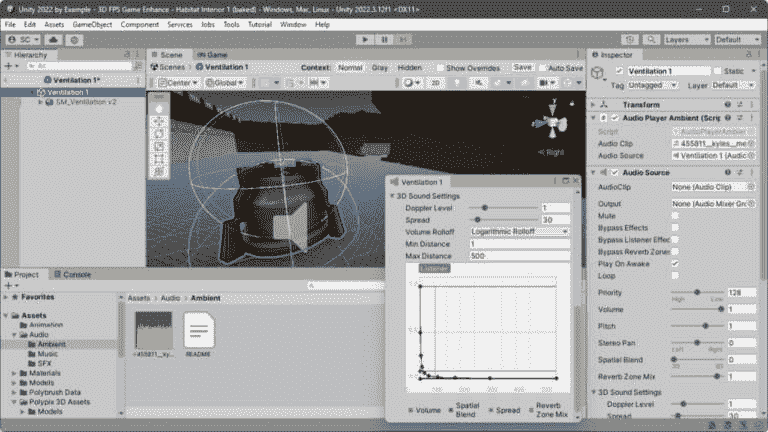
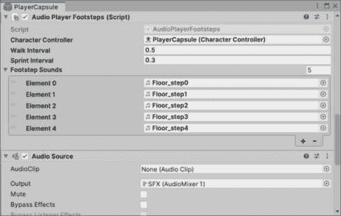

# 使用音频增强 FPS 游戏

在*第十一章*中，我们通过用高质量的 3D 模型替换模块化预制体、在预制体模式下保留具有额外行为的预制体以及应用新材料，将一个灰盒原型环境进行了转换。我们还通过绘制预制体添加了环境中的对象，通过放置磨损贴图讲述表面故事，并实现了实时和烘焙光照的灯光和阴影设置。

为了提升玩家体验，我们必须关注我们游戏的声音设计方面。到目前为止，我们并没有过多关注音频和**声音效果**（**SFX**）。现在让我们通过开发音频管理器和可重用的音频播放组件系统来改变这一点。这将使我们能够轻松地将音频和 SFX 添加到我们的游戏中，即使对于可能没有太多编码经验的设计师和艺术家来说也是如此。

在本章中，我们将涵盖以下主要主题：

+   使用音频混音器添加音频

+   使用音乐、音效和氛围构建沉浸式声音景观

+   使用脚步声和混响区域增强音频体验

+   深入的 SOLID 重构

到本章结束时，您将能够编写音频管理器和其组件的代码，通过音频混音器播放游戏音乐和音效。您还将了解播放 2D 和 3D 声音之间的差异以及如何重用音频播放组件来创建新的声音行为，例如脚步声。此外，您还将学习如何为游戏关卡添加效果区域。

# 技术要求

您可以在 GitHub 上下载完整项目[`github.com/PacktPublishing/Unity-2022-by-Example`](https://github.com/PacktPublishing/Unity-2022-by-Example)。

# 使用音频混音器添加音频

在任何交互式体验中，声音在将玩家包围在游戏世界中起着至关重要的作用。本节将介绍使用 Unity 的音频工具播放音频的不同方法。您将学习如何通过有效利用音乐、2D 和 3D 音效、环境噪声和混响区域来提升您游戏音频体验。

让我们从定义声音设计是什么开始。

## 游戏声音设计 101

优秀的声音设计可以显著增强玩家的游戏体验和沉浸感。玩您最喜欢的游戏，但关闭声音，您会很快发现体验完全不同！

几个音频概念结合在一起，构成了在创建沉浸式世界氛围时声音设计的基石。虽然我将介绍声音设计组件，但请知道这更多的是艺术而非技术，将所有概念结合在一起——这是声音设计师的工作！

我们将实现音频脚本，使我们能够添加以下声音设计元素：

+   **音乐/背景音乐**：用音乐设定氛围！此外，在游戏玩法中的正确时刻改变音乐对玩家可能产生重大影响。

+   **SFX**：每当玩家挥舞剑、捡起硬币、撞到箱子或击败敌人时，SFX 对于玩家的沉浸感和增强游戏体验至关重要。

+   **环境或氛围**：你听到的环境声音，或背景噪音，它设定了场景，让你知道你在一个真实的居住地。通常，3D 音频会根据玩家在环境中的位置和朝向音频源的变化而变化，这可以极大地增强沉浸感。

+   **角色对话**：是的，对话也是声音设计的一部分。他们的声音风格可以进一步定义一个角色。声音也可以用来推动以故事驱动的叙事。

+   **UI 反馈**：当玩家与 UI 交互时，按钮按下和变化的*点击声*、*嘟嘟声*和*哔哔声*提供了一个令人满意的反馈体验，你不想从整体声音设计中省略。

将所有先前的声音设计元素汇集在一起，为游戏体验创建一个连贯的音频声音景观，这是声音设计师完成的另一项工作，这被称为音频混音。**音频混音**允许进一步工程化音频体验，并可以包括额外的音频工具，如过滤器、效果和混响区域。

额外阅读 | Unity 文档

当涉及到音频时，有许多因素需要考虑，例如格式、文件大小、压缩质量、循环能力和运行时性能——仅举几个例子。虽然深入探讨不同音频格式的技术细节超出了本章的范围，但请放心，我将在接下来的部分中 wherever necessary 指出关键格式细节。

你可以在这里了解更多关于音频的信息：[`docs.unity3d.com/2022.3/Documentation/Manual/Audio.xhtml`](https://docs.unity3d.com/2022.3/Documentation/Manual/Audio.xhtml)。

现在我们已经了解了声音设计，我们将戴上**音频开发者**的帽子，并将音频添加到我们的 3D 第一人称射击游戏中。

## 添加游戏音频

我们将首先添加一个音频混音器。尽管我在上一节中最后提到了音频混音，但我们将首先添加混合游戏音频的能力，并将每个音频组件都通过它进行连接。

### 使用音频混音器

**音频混音器**资产将使我们能够独立地为每个定义的声音元素设置音量级别——定制我们游戏的声音景观。它还允许我们在游戏过程中根据需要更改音量，并为玩家提供了一个方便的通过 UI 控件调整音量的方式。

额外阅读 | Unity 文档

你可以在这里了解更多关于音频混音器的信息：[`docs.unity3d.com/2022.3/Documentation/Manual/class-AudioMixer.xhtml`](https://docs.unity3d.com/2022.3/Documentation/Manual/class-AudioMixer.xhtml)。

要添加音频混音器，我们首先必须确保我们在 Unity 中打开了我们的项目，并且打开了来自*第十章*的栖息地内部级别设计场景（例如，`Habitat` `Interior 1`）。

现在，我们可以在新的`Assets/Audio`文件夹中创建一个新的`AudioMixer 1`（使用**创建** | **音频混合器**菜单）。一旦创建了**AudioMixer 1**，双击它（在**项目**窗口中）将打开**音频混合器**窗口，如图所示：


图 12.1 – 音频混合器设置

在打开**音频混合器**窗口的情况下，我们现在可以为我们将要混合级别的音频通道添加组。

通过点击**组**标题右侧的大加号（**+**）添加以下组（参见*图 12.1*以供参考）。请注意，当组首次出现时，字段会被高亮显示，这样你就可以立即给它命名：

+   **音乐**：游戏音乐播放的级别是通过这个组设置的

+   **SFX**：游戏的 SFX 级别将通过这个组设置

+   **环境音**[声音]：所有环境音和噪音将通过这个组设置

小贴士

在**播放模式**中，**音频混合器**窗口中有一个名为**在播放模式下编辑**的切换按钮。当启用此切换时，它允许我们在游戏测试时调整或混合音频级别。

在*图 12.1*中，你可以看到我将所有级别都设置为零，除了`-16`，以查看在游戏过程中这个级别听起来有多响——它应该更低，以免盖过 SFX。

好的，这很简单！我们将在接下来的章节中继续编码，创建具有播放不同声音元素组件的音频系统。一切从音频管理类开始。

### 创建一个简单的音频管理器

根据本书此阶段应能识别的代码架构，在*第二章*中介绍了 SOLID 原则和设计模式，我们将遵循 SOLID 原则创建一个音频管理类。具体来说，我们将依赖 SOLID **开闭原则**（**OCP**）和多态性，并为负责在游戏中播放不同类型声音的不同类型的音频播放器组件引入一个接口。

现在，让我们在新的`Assets/Scripts/Audio`文件夹中创建一个名为`AudioManager`的 C#脚本。我们将从添加必要的变量声明开始：

```cs
using UnityEngine.Audio;
public class AudioManager : MonoBehaviour
{
    [SerializeField] private AudioMixerGroup _groupMusic;
    [SerializeField] private AudioMixerGroup _groupSFX;
    [SerializeField] private AudioMixerGroup _groupAmbient;
    private AudioSource _audioSource2D, _audioSourceMusic;
}
```

在这里，我们可以看到实现我们在上一节中配置的音频混合器组的准备工作。我们还声明了一些`AudioSource`变量用于声音播放——这些将在我们添加代码并实现以下*构建具有音乐、SFX 和* *环境音* *的沉浸式声音景观* *子节中的播放音频功能时进行解释。

重要提示

我现在假设你已经知道，如果我们有一个从**MonoBehaviour**继承的类，我们需要在 C#脚本顶部添加一个**using UnityEngine;**语句。正如你也应该知道的，这个**using**语句已经存在于默认脚本模板中。 :)

再次强调，`AudioManager`类将为我们处理的关键功能之一是设置我们想要播放的音频类型的音频混音器组。这将确保声音设计师可以使用音频混音器来设置游戏（即，设计声音景观）的初始音频播放级别。

现在，将以下代码添加到`AudioManager`类中：

```cs
public enum AudioType { Music, SFX, Ambient };
private AudioMixerGroup
    GetAudioMixerGroup(AudioType audioType)
        => audioType switch
    {
        AudioType.SFX => _groupSFX,
        AudioType.Music => _groupMusic,
        AudioType.Ambient => _groupAmbient,
    };
```

switch 表达式（C#）

你可以在这里了解更多关于使用**switch**关键字进行模式匹配表达式的信息：[`learn.microsoft.com/en-us/dotnet/csharp/language-reference/operators/switch-expression`](https://learn.microsoft.com/en-us/dotnet/csharp/language-reference/operators/switch-expression)。

在这里，我们创建了一个`AudioType`枚举，我们将使用它将音频播放器组件映射到音频混音器组。我们已经添加了`GetAudioMixerGroup()`方法，通过使用`switch`表达式并传递一个`AudioType`枚举来获取适当的音频混音器组。所有这些将在我们创建第一个音频播放器组件的下一节中变得更加清晰。

抛弃（C#）

注意，如果前面代码中的 switch 表达式没有处理所有可能的输入值，编译器将生成一个警告。在这种情况下，我们可以使用以下抛弃模式来处理所有可能的输入值，从而避免控制台警告：_ => throw new ArgumentOutOfRangeException(nameof(AudioType), $"Not expected audioType value: {audioType}"),

下划线（**_**）是一个占位符变量，它不会保留任何值，也不打算使用。

你可以在这里了解更多关于抛弃的信息：[`learn.microsoft.com/en-us/dotnet/csharp/fundamentals/functional/discards`](https://learn.microsoft.com/en-us/dotnet/csharp/fundamentals/functional/discards)。

在我们现在编写的`AudioManager`类中，我们准备开始制作音频播放器组件！但在我们这样做之前，我们需要一种方法来访问`AudioManager`以调用其方法。所以，我们将继续使用 Singleton 模式来处理我们的管理器 – 现在就添加所需的代码吧。

作为提醒，这里就是：

```cs
public static AudioManager Instance { get; private set; }
private void Awake()
{
    if (Instance == null)
        Instance = this;
    else
        Destroy(gameObject);
    DontDestroyOnLoad(gameObject);
}
```

要将`AudioManager`脚本添加到我们的项目中，创建一个新的名为`AudioManager`的 GameObject，并在`AudioManager`脚本中将其添加到该 GameObject 中。

现在我们可以通过点击和拖动从**音频混音器**窗口或使用字段的**对象选择器**窗口（字段右侧的小圆圈图标）来分配`AudioMixerGroup`字段，使用*图 12**.2*作为指南。


图 12.2 – `AudioManager`混音组分配

完成！嗯，实际上我们还没有在我们的音频管理器中添加任何播放声音的方法……

游戏的音频管理器基础已经就绪，因此我们现在可以开始编写单个组件来播放游戏中需要的不同类型的音频。

# 使用音乐、SFX 和氛围构建沉浸式声音景观

我们将涵盖为我认为最常见场景编写的音频播放器组件。我们将有播放音乐、音效和环绕声的组件。我们还将介绍在 2D 或 3D 空间中播放声音，根据需要或愿望，为每种类型的音频播放器组件。

在 Unity 中播放声音的所有内容都需要一个 `AudioSource` 组件（将其视为扬声器，您可以有多个），场景需要一个单独的 `AudioListener`（将其视为麦克风）。默认情况下，场景中的主相机已经添加了 `AudioListener` 组件——所以没问题；那里没有其他需要做的事情。

额外阅读 | Unity 文档

您可以在此处了解更多关于音频监听器的信息：[`docs.unity3d.com/2022.3/Documentation/Manual/class-AudioListener.xhtml`](https://docs.unity3d.com/2022.3/Documentation/Manual/class-AudioListener.xhtml).

如在 `AudioManager` 实现中所示，请注意，我们确保所有音频播放器组件都通过 `AudioManager` 进行音频播放，以便使用正确的音频混音器组。这种设计是有意为之的，因此任何添加音频播放器组件的人（开发者、设计师、艺术家等）都不必记住为特定组件类型设置正确的混音器组。这将非常简单，因为——您猜对了——我们将使用一个接口（正如我们将在编写音频播放器组件时很快看到的）。

项目音频文件

下文将使用的音频文件都是公共领域或**Creative Commons Zero**（**CC0**）([`creativecommons.org/publicdomain/zero/1.0/deed.en`](https://creativecommons.org/publicdomain/zero/1.0/deed.en))，并且可以从 GitHub 仓库中的**Audio-Assets**文件夹、单个 Unity 项目资源文件夹或相应部分提供的原始下载链接中获取。

本章 GitHub 仓库中的音频资源可以在这里找到：[`github.com/PacktPublishing/Unity-2022-by-Example/tree/main/ch12/Audio-Assets`](https://github.com/PacktPublishing/Unity-2022-by-Example/tree/main/ch12/Audio-Assets).

好的，接下来是我们的第一个音频播放器组件。是时候播放一些美妙的音乐了！

## 播放音乐

我们将深入研究将音乐融入您游戏的技术方面。音乐作曲家负责创建与您的观众产生共鸣并成为您游戏身份象征的音轨。因此，我强烈建议您与作曲家合作，以实现这一级别的质量。

然而，如果您正在寻找一个更经济实惠的选项，您可以使用来源音乐，作曲家为不同流派创建预制的配乐，这些配乐可以购买并在您的项目中使用（有时，就像我们在这里的情况一样，甚至可以免费使用）。

但是，在我们可以将任何音乐片段分配给音频播放器组件之前，我们首先必须创建一个。

警告！

下一个将要介绍的 **AudioPlayerMusic** 类不会遵循 SOLID OCP。这是故意的。我们将最初编写的这种方法作为示例，用于重构其余的音频播放组件。希望这能作为一个强化学习的机会，以巩固知识。

我们从播放音乐开始，因此在一个新的 `Assets/Scripts/Audio` 文件夹中创建一个名为 `AudioPlayerMusic` 的新 C# 脚本，并声明以下字段和方法：

```cs
public class AudioPlayerMusic : MonoBehaviour
{
    [SerializeField] private AudioClip _musicClip;
    [SerializeField] private bool _playOnStart = true;
    private void Start()
    {
        if (_playOnStart)
            Play();
    }
    private void Play()
        => AudioManager.Instance.PlayMusic(_musicClip);
}
```

现在，让我们看看我们在这里做了什么：

+   `_musicClip`：音频剪辑包含要播放的声音的音频数据，它支持许多流行的音频文件格式（`.wav`、`.mp3` 和 `.ogg` 是最常用的）。在 **Inspector** 窗口中，这个变量将被分配一个从 **Project** 窗口文件夹中音频文件资产的引用，用于播放我们游戏的音乐。

额外阅读 | Unity 文档

你可以在这里了解更多关于音频剪辑的信息：[`docs.unity3d.com/2022.3/Documentation/Manual/class-AudioClip.xhtml`](https://docs.unity3d.com/2022.3/Documentation/Manual/class-AudioClip.xhtml)。

+   `_playOnStart`：这个变量是一个简单的布尔标志，我们将在 **Inspector** 中设置，以告诉这个音频播放组件在游戏开始时开始播放或不播放。

+   `Start()`：我们在 `Start()` Unity 事件方法中评估 `_playOnStart` 的值，如果为 `true` 则调用 `Play()`。很简单。

+   `Play()`：这是魔法发生的地方，我们告诉 `AudioManager` 开始播放我们可爱的音乐音频剪辑。

如您所见，我们在 `AudioManager` 单例实例中调用了一个 `PlayMusic()` 方法。然而，这个方法还不存在。让我们现在修复它以完成播放音乐的功能。

### 将 PlayMusic() 方法添加到 AudioManager

现在，将 `PlayMusic()` 方法添加到 `AudioManager` 类中，如下所示：

```cs
public void PlayMusic(AudioClip clip)
{
    if (_audioSourceMusic == null)
        _audioSourceMusic =
            gameObject.AddComponent<AudioSource>();
    _audioSourceMusic.outputAudioMixerGroup = _groupMusic;
    _audioSourceMusic.clip = clip;
    _audioSourceMusic.spatialBlend = 0f; // 2D
    _audioSourceMusic.loop = true;
    _audioSourceMusic.Play();
}
```

`AudioManager` 将直接通过向其所在的 GameObject 添加 `AudioSource` 来播放音乐：

```cs
gameObject.AddComponent<AudioSource>();
```

然后，根据我们建立的架构，设置适当的混音组，将作为参数传入 `_audioSourceMusic` 音频源的音剪辑，其余属性设置音乐在 2D 空间和无限循环中播放。

`_audioSourceMusic` 播放音乐的属性如下：

+   `spatialBlend = 0f`：基于玩家在环境中的位置，我们不想让音乐被听到不同的效果，因此将空间混合属性设置为 `0f` 使其成为全 2D 声音。

提示

当向场景添加 2D 音频源时，请注意，它们在全局空间中的变换位置无关紧要；音频监听器总是听到它们。

+   `loop = true`：这个很简单——`loop` 是否等于 `true`？是的。那么就循环播放音频剪辑，永远循环！否则，只播放一次。

`AudioSource` 组件的其余属性将设置为它们的默认值，这对于背景音乐来说都很好。

额外阅读 | Unity 文档

您可以在此处了解更多关于 **AudioSource** 的信息：[`docs.unity3d.com/2022.3/Documentation/Manual/class-AudioSource.xhtml`](https://docs.unity3d.com/2022.3/Documentation/Manual/class-AudioSource.xhtml)。

最后，使用 `_audioSourceMusic` 上的 `Play()` 方法播放音乐。要让音乐在我们的游戏中播放，我们只需将 `AudioPlayerMusic` 添加到场景中即可。

### 实现 AudioPlayerMusic

实现我们的音乐音频播放器组件意味着将 `AudioPlayerMusic` 脚本添加到我们的场景中（这里没有惊喜）。

在 `AudioPlayerMusic` 作为 `AudioManager` 对象上的 `AudioManager` 组件的兄弟组件。*图 12.3* 展示了我们的最终音乐音频播放器组件设置。


图 12.3 – 将 AudioPlayerMusic 添加到 AudioManager 对象

我们可以在前面的图中看到，音乐音频片段已经分配给我们的项目中的 `Arpent` 音频文件，并完成该分配。

如果您尚未从项目 GitHub 仓库导入音频资源，请参阅 *使用音乐、SFX 和氛围构建沉浸式声音景观* 部分，并现在执行该操作。我们接下来需要音频文件以及以下部分。

我们将在游戏中使用的音乐文件是 `Arpent.mp3`，来自 FreePD ([`freepd.com/music/Arpent.mp3`](https://freepd.com/music/Arpent.mp3))。音乐受 CC0 许可，这意味着我们可以免费使用。

确保将 `Arpent.mp3` 文件导入到 `Assets/Audio/Music` 文件夹中。然后，在 **项目** 窗口中选中该文件，让我们在 **检查器** 窗口中调整导入设置，以适应通常较长的音乐片段——您可以在以下图中的 **检查器** 窗口中看到音乐文件几乎有三分钟长（确切地说为 **2:42.064**）。


图 12.4 – 音频片段导入检查器设置

重要提示

到现在为止，您可能已经注意到，当我们选择 **项目** 窗口中的资源时，**检查器** 会根据所选资源的类型进行调整，因此导入设置看起来会有所不同。

我们在此处更改的设置如下：

+   **后台加载**：对于较长的或高质量的音乐文件，启用在后台加载音频文件可以确保游戏运行顺畅，因为异步加载（即不阻塞主线程）消除了帧降和卡顿的可能性

+   **加载类型**：对于较长的音乐文件，建议将其设置为 **流式传输**，这样所有音频数据就不会一次性加载到内存中

+   `70`% 通常对于音乐来说是一个良好的平衡点——文件大小与质量

音频片段导入设置 | Unity 文档

你可以在这里了解更多关于音频剪辑**检查器**选项的信息：[`docs.unity3d.com/2022.3/Documentation/Manual/class-AudioClip.xhtml`](https://docs.unity3d.com/2022.3/Documentation/Manual/class-AudioClip.xhtml)。

当你完成这些更改后，通过选择`AudioManager`对象并将`Arpent`音乐文件中的`AudioPlayerMusic`组件拖到**音乐剪辑**字段，我们就完成了！

保存你的场景并进入播放模式，以在游戏开始时听到音乐播放。如果你什么也听不到，你可能需要切换**游戏**视图中的**静音音频**图标，如下所示：


图 12.5 – 游戏静音音频切换

我们已经在 Unity 中开始了音频沉浸和探索之旅！听到音乐播放是一种很好的方式，可以确立游戏氛围并为我们的游戏设定舞台。游戏音效设计师会仔细选择音乐曲目，以创造所需的情感和主题基调，唤起惊奇、神秘或未知，从而营造一种广阔而引人入胜的氛围。当我听到*Arpent*音乐曲目时，我意识到它非常适合科幻环境和玩家在这个关卡中对栖息站进行探索。

但尽管播放音乐很棒，我相信你已经知道，没有音效的游戏什么都不是！

## 播放 SFX

告诉我，一部特定的科幻电影系列（设定在遥远的星系中）如果没有其标志性的激光剑嗡嗡声和切割空气以及碰撞的声音会完整吗？答案是肯定的……不会的。

SFX 是游戏开发中的无名英雄——没有它们，游戏只有 50%是完整的（不，你不能争辩这一点）。那么，我们还在等什么呢……这些 SFX 不会自己播放！

### 使用 IPlaySound 接口进行 SOLID 重构

现在，我们将根据 SOLID 原则进行重构。具体来说，`AudioManager`将关闭修改，遵循 OCP 原则。对于**开放**部分，我们将传入音频播放器对象的类型——这也是多态的部分——每个都有其自己的实现（即修改）来播放声音，并且音频播放器类型实现了一个接口：`IPlaySound`。该接口确保我们有一个一致的公共方法可以调用我们实现的每个不同的音频播放器对象类型。

我们通过允许使用`AudioType`枚举来对**关闭修改**原则进行例外处理。这个决定是基于让开发者和设计师更容易添加音频播放器组件。通过简化流程并防止潜在的错误，我们旨在节省时间并消除手动分配音频组的需求。权衡是，每次添加新的混音组时，我们都需要修改`AudioManager`，但我对此表示接受。

在解释清楚这一切之后，让我们来看看`IPlaySound`接口。在`Assets/Scripts/Audio`文件夹中创建一个新的 C#脚本，命名为`IPlaySound`，代码如下：

```cs
using AudioType = AudioManager.AudioType;
public interface IPlaySound
{
    AudioType PlayAudioType { get; }
    void PlaySound(AudioSource source);
}
```

下面是界面声明的分解：

+   `using AudioType`: 有时，我们必须区分跨命名空间共享的类型名称。我们定义了`AudioManger.AudioType`和`AudioType`存在于`UnityEngine`中。因此，我们需要告诉脚本我们想要哪一个。为此，我们使用别名：`using AudioType =` `AudioManager.AudioType;`。

using 别名 (C#)

你可以在这里了解更多关于**using**别名的信息：[`learn.microsoft.com/en-us/dotnet/csharp/language-reference/keywords/using-directive#usingalias`](https://learn.microsoft.com/en-us/dotnet/csharp/language-reference/keywords/using-directive#usingalias)

+   `PlayAudioType`: 此属性将获取我们从`AudioType`枚举分配的默认值。我们将根据此值设置`AudioMixerGroup`，以针对我们制作的特定类型的音频播放组件——并在**检查器**中避免任何分配错误。

+   `PlaySound()`: 正如其名所示，实现类将使用此方法来播放音频剪辑。

那就是我们所需要的接口。现在，我们的音频管理类可以通过接口类型传递每个不同的音频播放类而不做任何修改，遵循 SOLID OCP 原则。通过接口类型传递每个不同的音频播放类，实现接口的音频播放类将提供独特的播放功能。

让我们通过编写播放 SFX 组件的示例来看看。在`Assets/Scripts/Audio`文件夹中创建一个名为`AudioPlayerSFX`的新脚本，并使用以下代码：

```cs
using AudioType = AudioManager.AudioType;
public class AudioPlayerSFX : MonoBehaviour, IPlaySound
{
    [SerializeField] private AudioClip _audioClip;
    [Range(0f, 1f)]
    [SerializeField] private float _volume = 1f;
    public void Play() =>
        AudioManager.Instance.PlayAudio(this);
}
```

首先，我们在`AudioPlayerSFX`类声明中添加了`IPlaySound`接口，以符合我们的音频播放组件设计。

接下来，我们有这些核心变量和方法，它们将适用于所有音频播放组件，因为它们都被认为是播放声音所必需的：

+   `_audioClip`: 每个音频播放组件都需要一个剪辑来播放。此变量指的是通过**检查器**分配并播放的音频剪辑。

+   `_volume`: 并非每个音频文件在播放时都会拥有相同的音量级别，或者，对于游戏中的一些声音，它们可能通过降低音量来满足音效设计；通过此变量在**检查器**中设置。

+   `Play()`: 我们将调用的公共方法，用于使用`AudioManager`单例实例的`PlayAudio()`方法（我们将在下一节中添加）开始播放分配的音频剪辑。

当调用音频管理器的`PlayAudio()`方法时，请注意我们传递的是`this`作为参数。`this`关键字指的是当前类实例——在这种情况下，`AudioPlayerSFX`，但我们将使用的参数类型用于声明`PlayAudio()`将是`IPlaySound`。这就是多态的魔力。我们将`this`作为类型参数传递，代表任何数量的不同类，以实现独特的音频播放功能，但所有这些都可以作为`IPlaySound`访问。

this (C#)

你可以在这里了解更多关于`this`关键字的用法：[`learn.microsoft.com/en-us/dotnet/csharp/language-reference/keywords/this`](https://learn.microsoft.com/en-us/dotnet/csharp/language-reference/keywords/this)

现在，实现`IPlaySound`接口的公共属性和方法（记住，接口声明必须是`public`）：

```cs
    public AudioType PlayAudioType => AudioType.SFX;
    public void PlaySound(AudioSource source)
        => source.PlayOneShot(_audioClip, _volume);
```

在这里不再重复接口的细节，让我们深入了解分配：

+   `PlayAudioType`: 这里是我们为想要使用的音频混音组预分配`AudioType`值的地方，以便这个音频播放器组件使用。

+   `PlaySound()`: 这里是我们实际上使用针对此类音频播放器组件的特定音频播放代码以及引用的音频源来播放声音的地方。在音效的情况下，我们将使用`PlayOneShot()`方法，因为它允许在单个`AudioSource`组件上播放多个声音。

注意这里传递的`AudioSource`组件将被添加到用于 2D 音效的`AudioManager`对象中。因此，没有必要在添加了此音频播放器组件的对象上添加`AudioSource`组件。你将在下一节中看到它是如何工作的，当我们向`AudioManager`添加内容时。

额外阅读 | Unity 文档

你可以在这里了解更多关于**PlayOneShot()**的信息：[`docs.unity3d.com/2022.3/Documentation/ScriptReference/AudioSource.PlayOneShot.xhtml`](https://docs.unity3d.com/2022.3/Documentation/ScriptReference/AudioSource.PlayOneShot.xhtml)

为了提供一些关于这个架构的额外清晰度，既然你已经看到了代码和方法调用是如何设置的，让我们看看`AudioPlayerSFX`和`AudioManager`之间的关系：


图 12.6 – 音频架构 UML 类图

代码调用音频管理器 – `AudioManager.PlayAudio()` – 来分配正确的音频混音组。然后它使用接口调用回其特定的播放声音功能（带有负责播放声音的音频源） – `IPlaySound.PlaySound()`。随着我们在后续章节中实现额外的音频播放器组件，每个组件都有独特的播放声音功能来播放 3D 音效和环境声音，这会变得更加清晰。

这完成了我们的 SFX 播放音频播放器组件，但还没有完成，因为如果没有`AudioManager`的`PlayAudio()`方法，它将无法播放任何声音。让我们现在通过更新我们的音频管理器来解决这个问题。

### 更新 AudioManager

现在将所有这些放在一起，我们正在添加`AudioManager.PlayAudio()`方法来设置分配的混音组，并回调到传递的组件的特定`PlaySound()`功能来播放音频 – 在这种情况下，是音效。

现在，打开`AudioManager`脚本并添加以下方法：

```cs
    public void PlayAudio(
        IPlaySound player,
        AudioSource source = null)
    {
        if (source == null)
            source = AudioSourcePlaySFX;
        source.outputAudioMixerGroup =
            GetAudioMixerGroup(player.PlayAudioType);
        player.PlaySound(source);
    }
```

`PlayAudio()`将关闭修改，因此其结构适合任何数量的实现`IPlaySound`接口的音频播放组件。因此，我们在方法签名中的第二个参数`source`具有默认值`null`。

对于播放 2D 声音，我们不会要求场景中每个将要播放声音的对象都附加`AudioSource`组件。场景中过多的`AudioSource`组件可能会导致与内存使用、处理开销和音频削波相关的性能问题，如果同时播放太多的这些音频源（请参阅随后的*优化注意事项*信息，因为 Unity 限制了可以同时播放的音频源数量）。

对于具有`null`值的音频源，我们首先假设它是一个将要播放的 2D 声音 - 3D 声音将会有自己的音频源传入。我们将使用一个`private`属性来获取播放音频片段的`AudioSource`实例（使用属性获取器）而不是使用`private`方法来返回（即`get`）类中所需的`AudioSource`引用。

让我们继续添加`AudioSourcePlaySFX`属性到`AudioManager`中，这样我们就有了一个有效的音频源组件添加到场景中用于播放我们的 2D 声音：

```cs
private AudioSource AudioSourcePlaySFX
{
    get
    {
        if (_audioSource2D == null)
        {
            _audioSource2D = new
                GameObject().AddComponent<AudioSource>();
            _audioSource2D.spatialBlend = 0f; // 2D
        }
        return _audioSource2D;
    }
}
```

对于这个属性，我们可以看到我们定义了一个获取器。它评估了`private`成员`_audioSource2D`（之前已添加）以查看它是否已经分配了一个`AudioSource`组件，如果没有，则使用`AddComponent()`方法将一个组件添加到场景中（作为与`AudioManager`相同的 GameObject 的兄弟节点）。

然后它将`spatialBlend`值设置为确保声音的 2D 播放，并返回新的`AudioSource`以便为其分配混音组，然后将其传递回音频播放组件以播放声音。哇！

优化注意事项

注意，对于播放 SFX 声音的**AudioSource**组件，我们对可以同时播放的音频片段数量有限制。**AudioSource**支持 32 个声音，每个音频片段播放需要 2 个声音。使用**PlayOneShot()**方法，我们可以播放多达这个限制的音频片段，此时它将开始削波。你可能已经猜到了，我们可以通过通过**AudioManager**组件对象池化**AudioSource**对象来支持更多的音频片段。请参阅*第六章*。

太好了，到目前为止，我们根据我们的架构满足了所有的音频播放需求。现在让我们看看如何在添加额外的音频播放组件之前，在我们的场景中实现播放 SFX。

### 实现 AudioPlaySFX – Unity 事件

要将我们的第一个 SFX 添加到游戏中，让我们回顾一下您已经熟悉的内容：我们的健康恢复。在跟随前几章（例如 *第十章*，*充电即恢复* 部分）之后，您应该在场景中已经有了它。找到并选择它。现在，让我们将 `AudioPlayerSFX` 组件添加到根 GameObject。如图所示，它被添加在 `Destroyer (Script)` 组件的下方。


图 12.7 – 健康恢复 SFX

将 `AudioPlayerSFX` 分配为在从前面的 `PickupHeal` 组件触发 `OnHealEvent` 时播放声音。

1.  在 `PickupHeal (Script)` 组件上，点击加号（`UnityEvent` 字段）。

1.  点击并拖动 `AudioPlayerSFX` 组件（通过其标题栏）到新条目。

1.  在函数选择下拉菜单中，选择 **AudioPlayerSFX** | **Play()**。

好的，所有线路都已经连接好了，但我们还缺少一些东西……我们将播放什么声音？!

### 分配音频剪辑

我们将用于健康恢复的声音文件是 `item-pickup-v1.wav`。它来自 Freesound 网站（https://freesound.org/people/DeltaCode/sounds/678384/），并受 CC0 许可，这意味着我们可以免费使用它。

确保 `item-pickup-v1.wav` 文件已导入到 `Assets/Audio/SFX` 文件夹。与音乐音频文件不同，我们将为此声音文件使用默认的导入设置值。返回到健康恢复的 `AudioPlayerSFX` 组件，然后点击并拖动 `item-pickup-v1` 文件到 **Audio Clip** 字段。在 **Inspector** 的顶部，点击 **Prefab** | **Overrides** 下拉菜单中的 **Apply All**，以确保关卡中所有健康恢复实例都更新为包含播放 SFX。

测试关卡，根据需要调整 `AudioPlayerSFX` 组件，并注意 2D 声音播放。接下来，我们将在 3D 空间中播放 SFX，以便您能听到区别。

播放 UI 反馈 SFX

将 SFX 添加到按钮点击也是游戏声音设计的一个重要方面。它显著提升了游戏的整体品质并提高了玩家的满意度。这看似是一个小细节，但它可以极大地影响玩家对您的游戏 UI 的感知和交互。对于 UI 按钮，使用 **AudioPlayerSFX** 组件，并将 **Play()** 方法连接到 **Inspector** 中的按钮的 **On Click()** 事件。

现在我们已经使用重构方法创建了一个音频播放器组件，其余部分将遵循相同的设置，所以我们只需完成剩下的部分。

## 玩转 SFX 3D

与 `AudioPlayerSFX` 组件不同，我们没有为播放 2D 声音的 GameObject 添加 `AudioSource` 组件，这里我们将添加一个，因为我们想要一个“3D 空间中的扬声器”来发出声音。玩家将通过 `Player` 对象上的 `AudioListener` 组件听到声音，就像在现实世界中自然听到的那样——无论哪个“耳朵”朝向声音源，都会听到。在 3D 空间中听声音进一步增强了玩家对游戏世界的沉浸感，所以我们肯定想利用 3D 音频！

注意到关于 `AudioSource` 的先前信息，我们将确保添加“播放 3D 音效”组件到对象的开发者/设计师配置了用于此声音的音频源，通过要求添加 `AudioSource` 组件作为兄弟组件。

现在，在 `Assets/Scripts/Audio` 文件夹中创建一个名为 `AudioPlayerSFX3D` 的新脚本，并从以下音频源要求代码开始：

```cs
using AudioType = AudioManager.AudioType;
[RequireComponent(typeof(AudioSource))]
public class AudioPlayerSFX3D : MonoBehaviour, IPlaySound
{
    [SerializeField] private AudioSource _audioSource;
    private void OnValidate()
        => _audioSource = GetComponent<AudioSource>();
}
```

这就是我们在这里所做的工作：

+   `[RequireComponent]`：通过将此属性装饰到类上，我们要求在此 GameObject 上存在一个兄弟组件。具体来说，我们需要一个 `AudioSource` 组件，因为这将是一个 3D 声音。

+   `OnValidate()`：我们可以使用这个 Unity 消息事件来预先分配 `_audioSource` 变量，该变量由 `RequireComponent` 属性添加的 `AudioSource` 实例。`OnValidate()` 只在编辑器中运行，当脚本被加载或值发生变化时在 **Inspector** 中调用。

+   `IPlaySound`：别忘了添加接口！我们需要为所有音频播放器组件实现接口。

额外阅读 | Unity 文档

你可以在这里了解更多关于 **OnValidate()** 的信息：[`docs.unity3d.com/2022.3/Documentation/ScriptReference/MonoBehaviour.OnValidate.xhtml`](https://docs.unity3d.com/2022.3/Documentation/ScriptReference/MonoBehaviour.OnValidate.xhtml)

让我们继续借鉴 `AudioPlayerSFX` 类；我们还将有 `_audioClip` 和 `_volume` 序列化的私有成员变量。对于这些，我们将添加一个额外的字段来分配 2D 到 3D 声音比率的 `_blend2Dto3D` 变量（我们将用它来分配给 `AudioSource.spatialBlend` 属性）。

因此，添加以下代码：

```cs
public class AudioPlayerSFX3D : MonoBehaviour, IPlaySound
{
    …
    [SerializeField] private AudioClip _audioClip;
    [Range(0f, 1f)]
    [SerializeField] private float _volume = 1f;
    [Tooltip("0 = 2D, 1 = 3D"), Range(0f, 1f)]
    [SerializeField] private float _blend2Dto3D;
    …
    public void Play() =>
        AudioManager.Instance.PlayAudio
            (this, _audioSource);
}
```

这里 `Play()` 方法与之前 `AudioPlayerSFX` 实现的 `Play()` 方法略有不同，我们现在将音频源引用传递给 `AudioManager`。提醒一下，我们需要这样做，因为我们想在播放声音之前将播放分配给正确的音频混音组。

说到播放声音，现在，实现 `IPlaySound` 接口的公共属性和方法：

```cs
public class AudioPlayerSFX3D : MonoBehaviour, IPlaySound
{
    public AudioType PlayAudioType => AudioType.SFX;
    …
    public void PlaySound(AudioSource source)
    {
        source.spatialBlend = _blend2Dto3D;
        source.PlayOneShot(_audioClip, _volume);
    }
}
```

我们将 `PlayAudioType` 设置为使用 SFX 混音组播放声音，而 `PlaySound()` 方法保持基本不变——除了我们在使用 `PlayOneShot()` 播放音频剪辑之前，设置了 `source.spatialBlend` 的值，以在对象的变换位置（在 3D 空间）和设定的音量级别播放音频。

PlayClipAtPoint() | Unity 文档

对于熟悉 Unity 脚本 API 的你来说，可能会 wonder 为什么我没有直接使用 **AudioSource.PlayClipAtPoint(_audioClip, transform.position, _volume)** 静态方法。

好吧，原因归结于实现 **AudioManager** 类的主要目标——那就是确保音频混音组被用于所有不同的音频播放组件。虽然 **PlayClipAtPoint()** 方法确实可以在 3D 世界空间中的某个位置播放音频剪辑，但它不与音频混音器协同工作，因此排除了这个选项。

你可以在这里了解更多关于 **AudioSource.PlayClipAtPoint()** 的信息：[`docs.unity3d.com/2022.3/Documentation/ScriptReference/AudioSource.PlayClipAtPoint.xhtml`](https://docs.unity3d.com/2022.3/Documentation/ScriptReference/AudioSource.PlayClipAtPoint.xhtml)

`AudioPlayerSFX3D.Play()` 现在调用 `AudioManager.Instance.PlayAudio()` 并添加 `_audioSource` 参数。传入的音频源在 `AudioManager` 中被修改，并传递回实现 `PlaySound()` 方法的接口，以使用音频播放组件的特定功能来播放声音。

关于代码架构的说明

由于我们使用接口而不是在 **AudioManager** 中实现播放声音，因此 **AudioManager** 和 **AudioPlayerSFX3D** 类之间的关系可能看起来是循环的。在这里，我认为这种架构上的权衡是可以接受的，因为我优先考虑了组合、易用性和消除 Unity 中 **Inspector** 分配的错误。在 Unity 中做事有时意味着开发新颖的方法和妥协，以适应其他“标准方法”的 C# OOP 软件开发。我早就接受了这一点。 :)

现在，我们将通过再次查看实现来跟进新的 3D 音频播放组件。

### 实现 AudioPlaySFX3D – 动画事件

就像我们回顾了之前创建用于播放 SFX 的对象（健康恢复）一样，我们在这里也会做同样的事情，并将 3D SFX 添加到我们在 *第十章* 中创建的开门动画中。以下图显示了滑动门 Prefab——我们将在它滑动打开时添加 3D 声效。


图 12.8 – 滑动门 3D 特效

由于门没有具有公开 `UnityEvent` 的组件被调用，就像健康恢复一样，我们必须以不同的方式触发声音播放。我们仍然会使用一个事件，但这个事件是我们将直接添加到开门动画中的。

按照以下步骤将 3D SFX 添加到滑动门动画中：

1.  打开 `Door_Triggered` Prefab 进行编辑。

1.  将 **AudioPlayerSFX3D** 组件添加到与 **Animator** 组件相同的对象上。如图 *12**.8 所示，它被添加在 `Sliding_Door_01` 子对象上的 `Animator` 组件下方。

1.  现在，在 **Hierarchy** 窗口中仍然选择 `Sliding_Door_01`，通过转到 **Window** | **Animation** | **Animation**（或按 *Ctrl*/*Cmd* + *6*）打开 **Animation** 窗口。

1.  使用以下 **Animation** 窗口图作为参考，将时间轴向前滚动一帧或两帧，然后点击 **Add Event** 按钮。这将向时间轴添加一个 **Animation Event** 复选标记并选择它（当选中时为蓝色，未选中时为白色）。


图 12.9 – 添加动画事件

当选择 **Animation Event** 时，**Inspector** 窗口将显示一个 **Function** 下拉菜单，以便我们可以选择用于事件的调用方法。

1.  在 **Function** 下拉菜单中选择 **AudioPlayerSFX3D** | **Methods** | **Play()**。

动画事件 | Unity 文档

**AudioPlaySFX3D** 组件必须与 **Animator** 组件位于同一对象上，才能在 **Animation** 时间轴的 **Function** 下拉菜单中选择 **Play()**。

额外阅读 | *使用动画事件*: [`docs.unity3d.com/2022.3/Documentation/Manual/script-AnimationWindowEvent.xhtml`](https://docs.unity3d.com/2022.3/Documentation/Manual/script-AnimationWindowEvent.xhtml)

1.  保存 Prefab（或应用覆盖），因为我们已经完成了滑动门播放 3D SFX 的接线！

等一下，不要急于跳过并开始进入 Play 模式来测试它……我们还需要分配门滑动打开时将播放的声音！

### 分配音频剪辑

我不知为何想要抓取 *《星际迷航：下一代》* 企业号 NCC-1701-D 的滑动门开启声音，但好吧，版权法和其他一切。 ;)

不必担心，Freesound 再次伸出援手！我们将用于滑动门的音频文件是 `cua-ien-tu-mo.wav`（在越南语中，*của điện tử mở* 或“打开电子”），您可以从这里下载：https://freesound.org/people/SieuAmThanh/sounds/511540/。它也获得了 CC0 许可。

确保 `cua-ien-tu-mo.wav` 文件已导入到 `Assets/Audio/SFX` 文件夹，然后通过再次打开 `Door_Triggered` Prefab 返回到 `AudioPlayerSFX3D` 组件。点击并拖动 `cua-ien-tu-mo` 文件到 **Audio Clip** 字段，然后点击 **Save**。

测试关卡，根据需要调整 **AudioPlayerSFX3D** 组件，并注意 3D 声音播放。

3D Sound Settings | Unity 文档

使用 **AudioSource** 组件的 **3D Sound Settings** 部分来调整声音，以实现所需的空間效果。本节中的参数按比例应用于 **Spatial** **Blend** 参数。

你可以在这里了解更多关于音频源属性的信息：[`docs.unity3d.com/2022.3/Documentation/Manual/class-AudioSource.xhtml`](https://docs.unity3d.com/2022.3/Documentation/Manual/class-AudioSource.xhtml)。

我们将要处理的下一个音频播放器组件也是用于 3D 声音——在下一节中，让我们制作一个用于环境声音的音频播放器。

## 播放环境声音

在游戏环境中添加环境 3D 声音对于定义场景、使其生动起来以及增强玩家的感官体验至关重要。在向我们的环境中添加环境声音时，让我们记住，匹配声音与场景至关重要，分层不同的声音元素以创建声音景观，并改变或变化声音——无论是交互式还是非交互式。

我们首先需要我们的环境音频播放器组件来开始向我们的级别添加环境声音。因为环境声音本质上是 3D 的，所以我们再次采取与我们的 3D SFX 相同的方法，并依赖于添加到我们的对象中的音频源来产生其声音。

我们这次将直接在`AudioSource`组件上使用`Play()`方法，因为其他方法，如`PlayOneShot()`，无法触发循环声音。然而，使用`AudioSource.Play()`也有一些限制。它只允许一个音频剪辑与音频源同时播放。在已经播放的音频源上调用`Play()`将停止音频源并重新开始剪辑。但我们对在环境中播放环境声音的循环播放能力更感兴趣，所以这些限制在这里不是问题。

让我们立即处理设置`AudioSource`组件。在`Assets/Scripts/Audio`文件夹中创建一个新的脚本名为`AudioPlayerAmbient`，并添加以下代码：

```cs
[RequireComponent(typeof(AudioSource))]
public class AudioPlayerAmbient : MonoBehaviour, IPlaySound
{
    [SerializeField] private AudioSource _audioSource;
    private void OnValidate()
        => _audioSource = GetComponent<AudioSource>();
}
```

接下来，我们需要**检查器**字段来分配音频剪辑，以便在这个对象上播放环境声音以及所需的播放方法。添加以下代码：

```cs
public class AudioPlayerAmbient : MonoBehaviour, IPlaySound
{
    …
    [SerializeField] private AudioClip _audioClip;
    private void Start() => Play();
    public void Play() =>
        AudioManager.Instance.PlayAudio(this, _audioSource);
}
```

与添加环境声音相关的方法的具体细节如下：

+   `Start()`：环境声音总是播放！（这是我刚刚制定的一条规则。）因此，当级别开始时，我们将开始播放环境声音。请注意，因为这是一个 3D 声音，并且配置了特定的音频源附加到环境中的 3D 对象，所以玩家只有在范围内才能听到它。

+   `Play()`：与之前所做类似，我们调用音频管理器的`PlayAudio()`方法，并传入环境声音的`AudioSource`组件来修改它，并分配正确的音频混音组进行播放。

再次，实现`IPlaySound`接口的公共属性和方法，以便音频管理器知道使用哪个音频混音组：

```cs
using AudioType = AudioManager.AudioType;
…
public class AudioPlayerAmbient : MonoBehaviour, IPlaySound
{
    public AudioType PlayAudioType => AudioType.Ambient;
    …
    public void PlaySound(AudioSource source)
    {
        source.clip = _audioClip;
        source.spatialBlend = 1f;   // 3D
        source.loop = true;
        source.Play();
    }
}
```

这是一个环境声音，因此我们必须将`PlayAudioType`设置为`Ambient`，然后无限期地播放音频剪辑，以便为这个音频播放器组件的特定`PlaySound()`方法功能，如下所示：

1.  将`source.clip`设置为`_audioClip`值（在**检查器**中设置）。

1.  将 `spatialBlend` 设置为 `1f`，就像我们在 `AudioPlayerMusic` 组件中强制音乐在 2D 中播放（`0f`）一样。在这里，我们将强制音频以完全 3D 声音播放。

1.  将 `source.loop` 设置为 `true`。这是因为环境声音会无限循环！

1.  使用 `source.Play()` 播放声音，因为我们不能为循环声音使用 `PlayOneShot()`。

好的，这些各种音频播放组件真的已经整合在一起了！在下一节中，我们将继续为每个组件提供示例实现，包括环境声音。

### 实现 PlayAmbientSound

首先，我们需要在我们的环境中识别一些内容，用作示例环境声音实现的例子。让我们看看 Polypix 工作室提供的模型以获得答案……我看到我们有一个名为 **通风 1** 的 3D 模型预制件资产被导入到 `Assets/Polypix 3D Assets/Prefabs` 文件夹中。

让我们在我们的场景中某个位置使用这个作为通风管道入口。这类事物通常会有一些东西在运行——制造噪音——这会拉动并循环空气。这是一个完美的环境音频添加！

艺术资源

本节中使用的艺术资源可以从 GitHub 项目文件仓库获取。特别是，**通风 1** 预制件可以从包含在 **3DArtwork.zip** 文件中的 **Art-Assets** 文件夹（或直接从 Unity 项目文件中）获取：[`github.com/PacktPublishing/Unity-2022-by-Example/tree/main/ch11/Art-Assets`](https://github.com/PacktPublishing/Unity-2022-by-Example/tree/main/ch11/Art-Assets)。

将 `Assets/Polypix 3D Assets/Prefabs` 文件夹中的 **通风 1** 预制件拖放到场景中的某个位置，以给居住站的一个房间增添一些氛围。在 *图 12*.10 中，我已经将它添加到一个看起来相当空旷的房间中，需要一些趣味性。



图 12.10 – 通风环境声音

在场景中添加通风管道入口后，让我们添加环境 3D 声音音频播放器组件。

1.  在预制件编辑模式下打开 `Ventilation 1` 预制件。

1.  使用您首选的方法将 `AudioPlayerAmbient` 组件添加到根对象。

1.  当我们添加音频播放器组件时，会自动添加 `AudioSource` 组件（由于 `RequireComponent` 属性）。

1.  与之前提供的音频播放器组件不同，我们为 `AudioSource` 组件提供了字段，以根据其位置的环境音频效果调整声音。

在我们继续配置音频源之前，有一个可以播放的声音会很有帮助，这样我们就可以做出适当的调整。

我们将用于通风管道入口的声音文件是 `metro-subway-hallway-corner-noise-heavy-ventilation-rumble.flac`（不，我没有命名它！）它来自 Freesound ([`freesound.org/people/kyles/sounds/455811/`](https://freesound.org/people/kyles/sounds/455811/))，并授权 CC0（仍然可以免费使用）。

确保将`metro-subway-hallway-corner-noise-heavy-ventilation-rumble.flac`文件导入到`Assets/Audio/Ambient`文件夹。我们将为此声音文件调整一些导入设置值。

参考图 12.4 的导入设置，设置以下内容：

+   **强制单声道** = true，**归一化** = true：忽略声音文件的 L/R 立体声通道（将它们合并）并将音频级别设置为归一化值。

+   **在后台加载** = true：加载较大的音频文件而不会导致主线程延迟。一旦文件加载（可能不在加载的场景开始时），声音就会开始播放。

+   **加载类型** = **流式传输**：从磁盘以最小内存使用量解码音频，并使用单独的 CPU 线程。

+   `30`：通过调整压缩滑块来平衡播放质量和文件大小，以压缩剪辑。为了分发而保持文件小，同时保持播放质量。

返回通风管道入口处的`AudioPlayerAmbient`组件，然后点击并拖动`metro-subway-hallway-corner-noise-heavy-ventilation-rumble`文件到`Ventilation 1`预制件（在预制件编辑模式中点击**保存**，或在**检查器**顶部，在**预制件** | **覆盖**下拉菜单中点击**应用所有**）。

在我们播放带有环境声音的关卡测试之前，让我们回顾一下影响环境声音在环境中听到的 3D 声音设置。

### 3D 环境声音设置

是时候戴上我们的声音设计师帽子了！当我们向通风管道入口预制件添加音频播放组件时，我提到我们将直接使用音频源属性来调整声音。

参考图 12.4 中的`270`来影响声音在 3D 空间中的分布。较低的值创建更多方向性声音（仅在源前方听到），而较高的值产生更多全向声音（可以从更宽的角度听到）。`360`的值会使声音似乎从听众周围的所有方向传来。

小贴士 | 打开属性窗口

在**检查器**中，右键单击**AudioSource**组件标题，然后单击**属性…**将在浮动**属性**窗口中打开它。您可以在 Unity 编辑器的大多数窗口中为此执行对象、组件和文件资产。

播放测试关卡，根据需要调整音频源的**扩散**值，并注意环境声音的播放。

在本节中，我们学习了如何创建组件以播放不同的听觉体验，并将它们应用于我们环境中的对象。在下一节中，我们将通过为玩家添加脚步声来增强环境的沉浸感。

# 通过脚步声和混响区域增强音频体验

创建一个沉浸式和令人愉悦的游戏体验需要密切关注音效设计。即使是看似简单的元素，如脚步音效，也在将角色定位在环境中以及传达一种物理感和存在感方面发挥着重要作用。

尤其是在脚步声中，拥有多种脚步音效以随机化它们，并根据玩家的速度调整节奏或拍子，以防止听觉疲劳和重复（你甚至可以进一步到为玩家行走的每种表面类型提供不同的声音）。

优化连续随机播放的音效剪辑也是确保这个过程不会对游戏性能产生负面影响的关键。

通过我们的脚步音效实现，我们将解决所有这些因素。考虑到我们已经编写的音频播放器组件和管理器代码，实现起来比你想象的要简单。

## 重复使用音频播放器代码

没有什么比从我们现有的音频播放器组件开始播放脚步音效更简单了！所以，我们将依赖`AudioPlayerSFX`来处理脚步音效，而不是通过新的`IPlaySound`接口的直接实现来创建脚步音效。我的意思是，我们可以这样做，但那只会重复`AudioPlayerSFX`已经提供的功能。对于那些跟踪的人来说，这里的牌是代码重用、**不要重复自己**（**DRY**）、**保持简单，傻瓜**（**KISS**），我们还可以声称单责任牌。

这次，我们不会要求使用 Unity 游戏引擎提供的内置组件，而是要求将我们自己的`AudioPlayerSFX`组件添加到我们添加新播放脚步音效组件的 GameObject 中。

让我们通过在`Assets/Scripts/Audio`文件夹中创建一个新的`AudioPlayerFootsteps`脚本来查看这个实现，以下是其初始代码：

```cs
[RequireComponent(typeof(AudioPlayerSFX))]
public class AudioPlayerFootsteps : MonoBehaviour
{
    [SerializeField]
    private float _walkInterval = 0.5f;
    private AudioPlayerSFX _playerSFX;
    private float _timerStep;
    private void OnValidate()
        => _playerSFX = GetComponent<AudioPlayerSFX>();
    private void Start()
        => _timerStep = _walkInterval;
}
```

记住，`RequireComponent`属性通过组合组件来强制执行组合模式，以实现所需的功能。因此，正如之前提到的，我们已经要求了`AudioPlayerSFX`组件，并在`OnValidate()`方法中预先分配了`_playerSFX`变量的引用。

我们还声明了以下变量：

+   `_walkInterval`：这个变量的值应该与玩家的步伐或速度相匹配——换句话说，就是脚步音效播放之间的时间

+   `_timerStep`：这个变量将保存播放脚步音效的当前间隔（剧透：我们将根据玩家是行走还是冲刺来分配不同的值）

好的，我们已经有了基本的模板代码。现在让我们添加我们的脚步音效剪辑列表变量和一个更新循环，以便在指定的时间间隔内从列表中播放一个随机的脚步音效：

```cs
public class AudioPlayerFootsteps : MonoBehaviour
{
    …
    [SerializeField]
    private AudioClip[] _footstepSounds;
    …
    private void Update()
    {
        float currentStepInterval = _walkInterval;
        _timerStep -= Time.deltaTime;
        if (_timerStep <= 0)
        {
            _playerSFX.Play(_footstepSounds[
                Random.Range(0, _footstepSounds.Length)]);
            _timerStep = currentStepInterval;
        }
    }
}
```

在这里，我们正好做了需要做的事情：

+   `_footstepSounds`：在这里，我们有我们的脚步声文件资源`AudioClip[]`数组，这些声音将在设定的时间间隔内随机选择并播放。参考*图 12**.11*查看此**检查器**分配的预览。

+   `Update()`：更新循环将保持我们的`_timeStep`变量与新的时间同步。然后，我们将评估`_timeStep`是否已过期以播放下一个随机选择的剪辑。最后，我们将重置`_timeStep`以在间隔中延迟下一次播放。

看起来不错！可选地，我们可以通过快速重构将获取随机脚步声的代码提取到本地函数中，如下所示：

```cs
    AudioClip GetRandomFootstepClip()
        => _footstepSounds[
            Random.Range(0, _footstepSounds.Count)];
```

播放 SFX 的代码行现在看起来是这样的：

```cs
    if (_timerStep <= 0)
    {
        _playerSFX.Play(GetRandomFootstepClip());
```

这又是一个快速的可选重构，它不会改变功能。然而，它使代码可读性更好——任何有助于代码可读性的东西都值得花一点额外的工作来提高清晰度（无论是别人查看你的代码还是六个月后的你自己），如果需要更多，可以添加代码注释！

音频播放组件的完整代码

不要忘记，在任何时候，如果你需要查看这些部分的完成代码，你可以在 GitHub 仓库中找到它：[`github.com/PacktPublishing/Unity-2022-by-Example/tree/main/ch12/Unity-Project/Assets/Scripts/Audio`](https://github.com/PacktPublishing/Unity-2022-by-Example/tree/main/ch12/Unity-Project/Assets/Scripts/Audio)

`AudioPlayerFootsteps`组件本身不播放声音。正如我们所知，它使用`PlaySoundSFX.Play()`并将音频剪辑作为参数传递。唯一的问题是`Play()`目前不接受参数！现在让我们通过添加方法重载来修复这个问题。

## 为 AudioPlayerSFX 添加方法重载

因此，现在，我们将重载`AudioPlayerSFX`中的`Play()`方法，为当前要播放的脚步声添加所需的`AudioClip`参数（好吧，那是我们随机选择来播放的）。

在`AudioPlayerSFX`中添加以下方法和其代码：

```cs
    public void Play(AudioClip clip)
    {
        _audioClip = clip;
        AudioManager.Instance.PlayAudio(this);
    }
```

我们已经有了不带参数的`Play()`方法，所以现在我们通过声明另一个具有相同方法名但不同方法签名的`Play()`方法来重载`Play()`方法（因为我们已经添加了`AudioClip`参数）。现在，当调用`Play()`时，匹配方法签名的将是执行的具体方法——要么是带有传入的音频剪辑，要么不带。

提示

避免频繁更改剪辑：重要的是要记住，反复更改**AudioSource**剪辑可能不如使用多个音频源或**AudioSource.PlayOneShot()**方法高效。在这种情况下，建议使用**PlayOneShot()**方法，因为它允许你播放剪辑而不更改音频源的主要剪辑。

我们现在可以继续到下一节，为我们的玩家角色添加脚步声。

## 实现 AudioPlayerFootsteps

好的，这将是我们第五次实现音频播放组件，所以没有必要拖延。让我们直接添加到 `PlayerCapsule`。由于在下一节中我们将需要 `PlayerCapsule` 对象上的一些其他组件（例如 `CharacterController` 和 `PlayerInput`），我们希望将 `AudioPlayerFootsteps` 直接添加到该对象的根目录。

现在我们已经添加了 `AudioPlayerFootsteps`，你应该已经看到了由于 `RequireComponent` 属性的添加，`AudioPLayerSFX` 也被添加了，这样就可以通过 SFX 音频混音器通道播放声音。剩下要做的就是将声音文件添加到 **检查器** 中的 `_footstepSounds` 数组。

我们这次使用的声音文件来自 Unity 资产商店。我们将使用 Matthew Anett 的 `Classic Footstep SFX (Free)` ([`assetstore.unity.com/packages/audio/sound-fx/classic-footstep-sfx-173668`](https://assetstore.unity.com/packages/audio/sound-fx/classic-footstep-sfx-173668))。从其名称中，你可以看出我们可以在我们的项目中自由使用它。太好了！

确保将 `Classic Footstep SFX (Free)` 软件包导入到你的项目中。默认情况下，这将是在 `Assets/Classic Footstep SFX` 文件夹。与其他音频文件不同，由于这是一个软件包，导入设置已经由作者设置好了，所以我们已经准备好开始使用它们。

按照以下步骤将提供的脚步声文件分配给 `AudioPlayerFootsteps` 组件的 `_footstepSounds` 数组字段：

1.  返回到 `PlayerCapsule` 上的 `AudioPlayerFootsteps` 组件，并锁定 **检查器** 窗口（使用 **检查器** 标签右上角的那个小 *锁* 图标）。通过锁定窗口，无论我们选择什么，**检查器** 都将保持在当前窗口，这对于在 **项目** 窗口中选择多个对象以分配给组件字段是至关重要的。

1.  在 **项目** 窗口中的 `Assets/Classic Footstep SFX/Floor` 文件夹。

1.  在 `Floor_step0` 内时，然后按住 *Shift* 键并点击最后一个声音文件，或者选择任何文件范围。

1.  选择声音文件后，点击并拖动（从选择中的任何位置）到 **脚步声** 字段标签，你会看到鼠标光标从箭头变为带有框和加号的箭头。在悬停于字段名称上释放鼠标按钮，将填充数组中的所有选择的声音文件。

1.  你现在可以解锁 **检查器** 窗口，通过展开数组（在 **脚步声** 字段标签左侧的箭头）来检查声音文件的分配，如图 *图 12*.11* 所示。请注意，为了简洁起见，我在图中只展示了五个分配的例子。



图 12.11 – AudioPlayerFootsteps 组件分配

如果你尝试使用现在的 `AudioPlayerFootsteps` 代码，你将一直听到脚步声，因为没有条件语句告诉我们何时不应该播放脚步声！这样是不行的，所以让我们通过条件检查来修改 `AudioPlayerFootsteps`。

首先，我们需要一个对玩家角色控制器的引用……因此，在 `AudioPlayerFootsteps` 中添加一个新的字段来保存这个引用（你将不得不手动在 **Inspector** 中设置这个字段的引用，所以别忘了——我知道我肯定会忘记）：

```cs
    [SerializeField]
    private CharacterController _characterController;
```

我们现在可以通过添加以下 `if` 语句来评估“玩家是否在地面上或正在移动？”：

```cs
    private void Update()
    {
        if (!_characterController.isGrounded
            || _characterController.velocity.magnitude <= 0)
            return;
        …
```

使用 `return`，我们短路 `Update()` 方法，使其不会继续执行，因此不会播放任何脚步声。太棒了。

在这个阶段，测试游戏将只在行走时给我们脚步声。然而，我们也可以让玩家在向前移动时按住 *Shift* 键来冲刺。我们目前面临的问题是脚步声的间隔是一致的，导致冲刺听起来和行走一样。我们可以通过添加一个条件来快速解决这个问题，特别是为冲刺添加第二个间隔。

## 实现冲刺

好吧，这个设置听起来好像会很困难。其实并不难。这几乎只是不方便，因为我们将直接访问 **Player** **Input** 功能。

当我们提供输入——通过按键或使用游戏手柄——输入系统会通过 **Player Input** 组件处理这些键，该组件反过来会发送消息事件。所以，我们只需要添加一个方法处理程序（即监听器）来处理当玩家想要开始冲刺时发送的那个。在 *图 12**.12 中，那是 **OnSprint**，我们可以看到它在 **Player Input** 组件的 **Behavior** 下方的小框中列出。


图 12.12 – 向 GameObject 列表发送 Player Input SendMessage()

添加对玩家冲刺的响应能力现在只是更新 `AudioPlayerFootsteps` 类所需的代码。添加以下内容：

```cs
using UnityEngine.InputSystem;
public class AudioPlayerFootsteps : MonoBehaviour
{
    …
    [SerializeField] private float _sprintInterval = 0.3f;
    private bool _isSprinting;
    …
    public void OnSprint(InputValue value)
        => _isSprinting = value.isPressed;
}
```

我们在 `_sprintInterval` 中添加一个新的变量来分配冲刺的时间间隔，并添加一个相关的布尔变量来评估玩家是否正在冲刺，即 `_isSprinting`。然后，`OnSprint()` 将根据从输入系统传入的 `value.isPressed` 将 `_isSprinting` 设置为 `true` 或 `false`。

现在我们需要做的只是将适当的步进间隔分配给 `_currentStepInterval` 变量，该变量将与 `_timerStep` 变量一起用于在正确的时间间隔播放脚步声。通过修改 `Update()` 方法来实现这一点：

```cs
    private void Update()
    {
        if (!_characterController.isGrounded
            || _characterController.velocity.magnitude <= 0)
            return;
        float currentStepInterval =
            _isSprinting ? _sprintInterval : _walkInterval;
        …
```

这样就完成了脚步声的设置！现在进行测试应该会产生与玩家行走或冲刺时匹配的脚步声。这正是将您的游戏与其他游戏区分开来的细致入微之处——玩家会注意到并欣赏独立开发者在这类事情上的努力。

在您的关卡中，您可以通过快速添加混响区域来增加沉浸式声音细节，从而提高游戏声音景观的制作价值，下一节将展示添加混响区域的简单步骤。

## 添加混响区域

混响区域模拟不同空间中声音的声学特性，无论是大仓库中的回声还是小储藏室中的衰减，都能为声音景观增添深度，并在玩家在关卡的不同区域移动时增强游戏氛围。

此外，模拟声学特性可以帮助叙事并微妙地引导玩家的情绪和期望，这是游戏设计师可以利用的另一个工具，以构建更沉浸和逼真的游戏体验。

在您的关卡中找到一些关键区域，您觉得声学特性会受到空间规模的影响。使用*图 12*.13，我们将以下示例添加到关卡中较大的房间之一：

1.  在场景中添加一个空的游戏对象并将其放置在大房间中央。

1.  将游戏对象重命名为`混响区域`（可选，将其作为父对象以组织**层次结构**中的所有区域）。

1.  将一个`AudioReverbZone`组件添加到`混响``区域`对象中。

额外的阅读 | Unity 文档

您可以在此处了解更多关于混响区域的信息：[`docs.unity3d.com/2022.3/Documentation/Manual/class-AudioReverbZone.xhtml`](https://docs.unity3d.com/2022.3/Documentation/Manual/class-AudioReverbZone.xhtml)

1.  选择一个合适的**混响预设**选项。或者，选择**用户**并自定义下方的属性滑块以达到您想要的效果。在下面的图中，你可以看到我选择了**机库**预设。


图 12.13 – 混响区域放置和设置

这就是添加混响区域到我们关卡所需的所有内容——进行测试并调整区域属性以符合您的喜好。然而，我们希望确保音乐播放不受混响区域的影响（音乐受到环境变化的影响似乎并不合理，对吧？）。

我们可以在代码中非常容易地做到这一点——我们必须这样做，因为我们场景中没有驻留的`AudioSource`位于游戏对象上以播放音乐；我们是通过代码添加的。

因此，在我们的`AudioManager`脚本中，在`PlayMusic()`方法中，只需将此行添加到我们分配给音频源音乐设置的列表中即可：

```cs
_audioSourceMusic.bypassReverbZones = true;
```

就这样！我们的音乐播放将不再受混响区域的影响，而剩余的播放声音，尤其是脚步声，将会受到影响。

这就带我们来到了为游戏添加音频的结束。在本节中，我们学习了如何创建不同的音频播放组件，这些组件通过音频管理类路由，以建立如何使用此系统播放声音的规则。

现在我们有一个音频工具集，可以处理游戏所需的多种类型的音频播放用例。你现在可以回顾书中早些时候的项目，添加你自己的声音设计，并提升玩家的游戏体验。戴着你的声音设计师帽子，享受乐趣吧！

接下来，我们将快速查看我们如何重构我们的音频播放组件，以更好地遵循 SOLID 原则。

# 更深入的 SOLID 重构

我们可以通过使用所有音频播放类都从中派生的抽象基类来进一步扩展 SOLID 原则中的 OCP（开闭原则）。这可以添加更多必需的实现和默认行为，然后将成为一个经典的**面向对象编程**（**OOP**）继承示例。

OOP SOLID 原则提醒

在 OOP 中，派生类继承所有基类成员，也可以添加自己的成员。然而，在使用派生类时，必须牢记 SOLID 原则中的*Liskov 替换*原则。L 原则指出，基类的对象应该可以用派生类的对象替换，而不会改变程序的正确性。用简单的话说，任何使用基类引用的程序都应该能够使用任何派生类，而无需知道它。对于 OOP，这是多态，它允许我们编写更通用的代码，该代码可以与任何音频播放类一起工作。

让我们看看我们如何编写一个抽象基类，我们的项目中的音频播放类可以从中继承：

```cs
using AudioType = AudioManager.AudioType;
public abstract class AudioPlayerBase : MonoBehaviour, IPlaySound
{
    [SerializeField] protected AudioClip _audioClip;
    public abstract AudioType PlayAudioType { get; }
    public virtual void PlaySound(AudioSource source)
        => source.PlayOneShot(_audioClip);
    public virtual void Play()
        => AudioManager.Instance.PlayAudio(this);
}
```

这里是我们所做的事情：

+   `_audioClip`: 该字段被标记为受保护的，这意味着继承类可以访问它。这使得事情变得相当简单，对吧？

+   `abstract PlayAudioType`（属性）：这个抽象属性确保每个派生类都将定义自己的`AudioType`值。这是一个很好的使用抽象属性的方式，因为它强制每个音频播放类指定自己的`AudioType`值。

+   `PlaySound()`: 该方法为播放声音提供了一个默认实现，所有继承类都可以共享。因为我们包括了方法签名中的`virtual`关键字，如果派生类需要不同的行为，它可以覆盖此方法。我们还必须定义`PlaySound()`和`PlayAudioType`，因为我们必须实现`IPlaySound`接口！

+   `Play()`: 该方法提供了一种播放指定`AudioClip`的方式。在这里，我们将播放功能委托给`AudioManager`实例，遵循我们的模式，并根据`AudioType`值分配相应的`AudioMixerGroup`组。注意它也是`virtual`的，因此如果需要不同的行为，继承类可以覆盖它。

`AudioPlayerBase`抽象基类为创建特定音频播放类提供了一个良好的基础——需要多少种就创建多少种。我们为我们的类强制执行了一致的接口，以提供行为默认实现，同时允许继承类进行定制。太棒了！

现在你已经看到了我们如何处理所有音频播放类都可以从中派生的抽象基类，那么就自己动手尝试重构吧！GitHub 链接上的项目代码已经提供了一个重构后的`AudioPlayerSFX3D_Derived`组件示例，该组件继承自`AudioPlayerBase`抽象基类，你可以将其作为参考（诚实地尝试，不要偷看）。

AudioPlayerBase 完整代码

要查看`AudioPlayerBase`类的完整代码和一个继承类示例，请访问以下 GitHub 仓库：[`github.com/PacktPublishing/Unity-2022-by-Example/tree/main/ch12/Unity-Project/Assets/Scripts/Audio`](https://github.com/PacktPublishing/Unity-2022-by-Example/tree/main/ch12/Unity-Project/Assets/Scripts/Audio)

在本节中，我们学习了如何重构我们的代码以更符合 SOLID 编程原则。虽然我们的代码已经相当完整了（我相信总有人会想到更多类型的音频播放器组件来扩展），但这次重构使得在无需修改管理器类的情况下扩展代码以添加额外的音频播放器组件类型变得更加容易。

# 摘要

在这个“音频章节”中，我们详细介绍了通过引入音频管理器和可重用的音频播放器组件来为我们的游戏添加音频。我们使用音频管理器作为对设计师和开发者都适用的错误预防实现，以便为目标游戏声音场景设置播放级别选择合适的混音组。

我们继续编写单个音频组件，用于播放大多数游戏中常见的不同类型音频——音乐、音效（SFX）和环境声音。我们遵循 SOLID 编程原则创建了这些可重用的音频播放器组件，这样我们就可以在不修改管理器类的情况下扩展额外的音频组件类型。我们以脚步声示例结束，展示了如何为简单实现组合组件，以及如何快速添加带有混响区域的环保音频效果。

在下一章中，我们将继续完善游戏，通过添加一个智能非玩家角色（NPC）来实现。我们将通过再次重构我们之前的 2D 代码以适应 3D 使用，以及引入利用传感器、行为树和机器学习（AI）技术的尖端技术来动态生成敌人。
