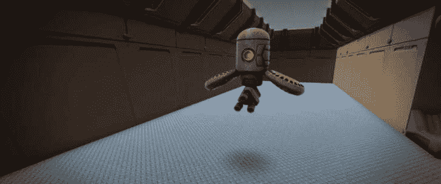
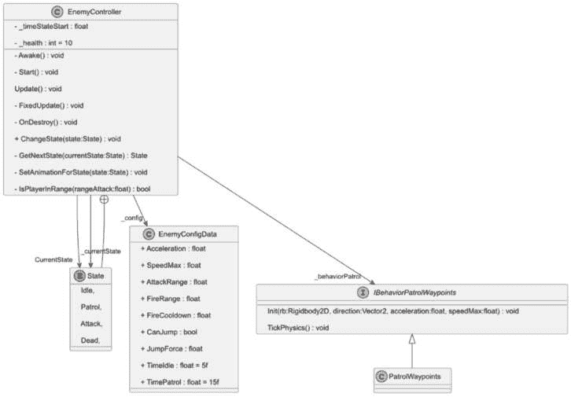
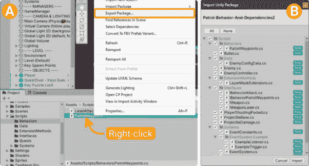
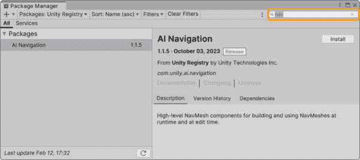
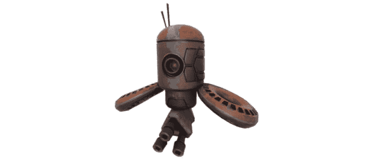
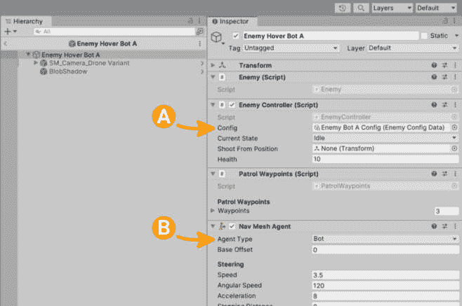
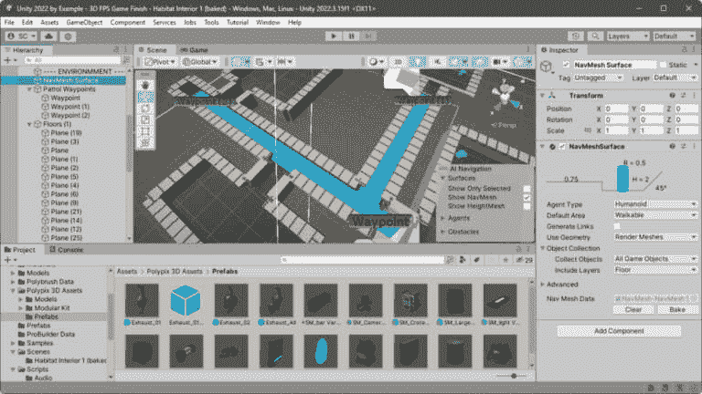
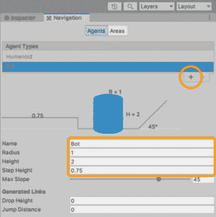
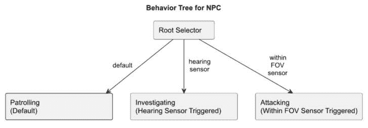
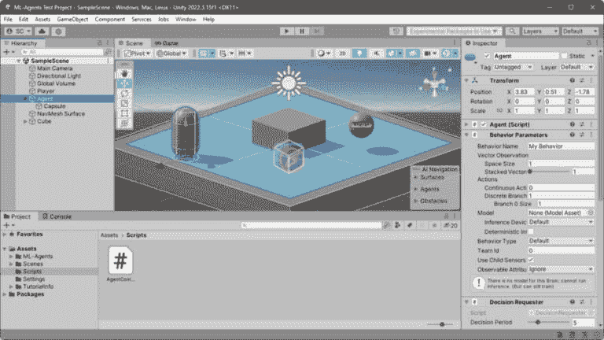

# 13

# 使用传感器、行为树和 ML-Agents 实现 AI

在*第十二章*中，我们深入探讨了添加音频到游戏所需的所有细节。我们通过引入音频管理器和可重用的音频播放器组件来实现这一点，以便设计师和开发者可以轻松地添加不同类型的游戏音频，从而为玩家创造一个包含所有玩家的声音体验。我们强调了良好的编码实践，以确保我们编写的代码易于维护，并注重可重用性和可扩展性，以简化我们日常游戏开发者生活中的挑战。

现在我们已经解决了游戏的声音设计问题，我们可以继续完成 FPS 游戏关卡中敌人的**非玩家角色**（NPC）机制，通过实现一些基本的**人工智能**（AI）。我们将通过重用和重构先前的 2D 组件和代码到 3D 来实现简单的 AI 导航。我们将继续讨论 NPC 系统的提升和复杂化，使用**行为树**和**机器学习**（ML）工具。

在本章中，我们将涵盖以下主要主题。

+   使用 NavMesh 重构 2D 敌人系统到 3D

+   带有传感器和行为树的动态敌人

+   通过 ML-Agents 引入机器学习

到本章结束时，您将通过实现基于 AI 与 NPC 的交互、无缝导航关卡环境以及执行一系列自主行为，为您的玩家创造一个令人难忘的游戏体验。您将更好地理解 2D 和 3D 实现之间的差异，因为我们将在改进过程中重新审视 2D 方法并将其重构为 3D。

# 技术要求

您可以从 GitHub 下载完整项目：[`github.com/PacktPublishing/Unity-2022-by-Example`](https://github.com/PacktPublishing/Unity-2022-by-Example)。

# 使用 NavMesh 重构 2D 敌人系统到 3D

本章的目标是指导您完成将这个悬浮对手激活的综合过程，它被邪恶的植物实体入侵我们的系统而对我们产生敌意。它的任务是巡逻栖息地站的走廊，以防止玩家根除感染并恢复 Kryk’zylx 的正常状态（无论那是什么）。



图 13.1 – 巡逻的敌人悬浮机器人

在*第八章*中，为了我们的 2D 游戏，我们通过使用简单的巡逻航点行为来解决敌人 NPC 导航问题，其中敌人机器人在 2D 空间中的两个航点之间移动——一个向左和一个向右。

好吧，我们在这里要做的是类似的事情。然而，因为我们现在在 3D 空间中工作，并且有一个更复杂的楼层平面需要导航，我们仍然会使用航点设置巡逻路径。不过，我们现在将使用 Unity 的**AI 导航**包及其**NavMesh**组件来完成在它们之间导航的任务。NPC 导航对于创建沉浸式游戏环境至关重要，Unity 在 2022.3 版本中引入的更新 3D NavMesh 系统提供了一个高效的解决方案。

额外阅读 | Unity 文档

关于 AI 导航包的信息可以在这里找到：[`docs.unity3d.com/Packages/com.unity.ai.navigation%401.1/manual/`](https://docs.unity3d.com/Packages/com.unity.ai.navigation%401.1/manual/)

修订和重构先前编写的组件以节省开发时间是我们自从 3D FPS 项目开始以来已经讨论过几次的事情，这次也不会例外。每次从头开始都没有意义；让我们依靠我们工具箱中已有的资产，并在需要的地方进行修订（最终，这会丰富我们的工具箱）。

我们需要复习一下基本组件结构，以便理解在 3D 相关修订中，特别是对于 NavMesh 重构，需要在哪里进行。所以，让我们开始吧。让我们回顾以下代表 2D 项目中 NPC 移动行为的**统一建模语言**（**UML**）图：



图 13.2 – 2D 巡逻航点参考 UML

趣味的是，我们将重用前面图中大约 96%的内容（不，我没有做数学计算；不要对我这个百分比太苛刻）。主要需要修订的是`PatrolWaypoints`类，因为它实现了`IBehaviorPatrolWaypoints`接口，实际上是在航点之间移动敌人 NPC。我们只需要为 NavMesh 提供一个行为实现即可——因为我们事先按照良好的编程实践进行了工作，以扩展功能而不修改实现类。

首先，让我们收集 2D 脚本以供重用。

## 从 2D 项目中导入脚本

我们目前需要从之前的 2D 冒险游戏项目中获取脚本。这一次我们需要几个文件，而不同于我们在*第十章*的“将环境交互重构为 3D API 方法”部分中重用和重构 2D 组件用于 3D 的情况，那时我们只需要几个文件。因此，对于 3D FPS 项目所需的脚本，让我们使用 Unity 包导出器来获取脚本及其依赖项。

下载脚本

或者，从本书的 GitHub 仓库[`github.com/PacktPublishing/Unity-2022-by-Example/tree/main/ch13/Script-Assets`](https://github.com/PacktPublishing/Unity-2022-by-Example/tree/main/ch13/Script-Assets)下载**patrol-behavior-and-dependencies.zip**，其中包含已导出的脚本和所需的依赖项。

为了回顾这个过程，您可以重新访问*第九章*，其中我们导出了滑动拼图游戏资源。这个过程当然不是开发游戏中最有趣的部分之一，但您会发现您时不时地会做这些类型的事情。让我们开始吧。

现在在 Unity 中打开之前的 2D 冒险游戏项目，并按照以下步骤操作：

1.  在**项目**窗口中转到`Assets/Scripts/Behaviors`文件夹。

1.  右键单击`PatrolWaypoints.cs`文件，并选择**导出包…**，如图*图* *13**.3* (*A*)所示。

2D 巡逻路径行为是我们希望在 3D FPS 游戏中重用敌对 NPC 的基础，因此我们将以此为基础进行导出，并在过程中获取其依赖项和其他相关脚本。不用担心——在下一步中，我已经整理好了我们需要的脚本，以节省您自己找出这些脚本的时间和压力。

1.  确保在`Assets/Scripts/`目录下已选择以下文件：

    +   `Bullet.cs`

    +   `Enemy.cs`

    +   `EnemyController.cs`

    +   `PlayerShootingPooled.cs`

    +   `ProjectileBase.cs`

    +   `ProjectileDamage.cs`

    +   `WeaponRanged.cs`

1.  `Assets/Scripts/Behaviors/`:

    +   `PatrolWaypoints.cs`

1.  `Assets/Scripts/Data/`:

    +   `EnemyConfigData.cs`

1.  `Assets/Scripts/ExtensionMethods/`:

    +   `LayerMaskExtensions.cs`

1.  `Assets/Scripts/Interfaces/`:

    +   `IBehaviorAttack.cs`

    +   `IBehaviorPatrolWaypoints.cs`

1.  `IWeapon.cs`:

    +   `IWeaponLaser.cs`

1.  `Assets/Scripts/Systems/`:

    +   `EventSystem Example/`:

    +   `ExampleListener.cs`

    +   `ExampleTrigger.cs`

    +   `EventSystem.cs`

您可以从选定的依赖项列表中看到，我们将使用其中一些来快速实现弹射射击和事件。

1.  一旦选择了文件，点击**导出…**按钮，并将导出的包文件（您可以选择任何名称）保存到我们可以轻松找到的位置，以便导入到当前的 3D FPS 项目中。

1.  现在，如果尚未打开，请打开 3D FPS 项目，以便我们可以导入文件。

如*图 13**.3* (*B*)所示，当我们从系统文件管理器中将导出的包拖放到 3D FPS 游戏的**项目**窗口时，会弹出**导入 Unity 包**对话框。

1.  点击**导入**。



图 13.3 – 2D 项目导出和 3D 项目导入

导入完成后，您可能会立即注意到控制台错误：

```cs
Assets\Scripts\ProjectileDamage.cs(4,48): error CS0535: 'ProjectileDamage' does not implement interface member 'IDamage.DoDamage(Collider, bool)'
```

我们首先——快速且容易地——修复这个编译器错误，而其余的更改将集中在 2D 到 3D 功能的重构上。所以，为了修复错误，我们只需要将`Collider2D`在`ProjectileDamage`类的`DoDamage()`方法签名中更改为`Collider`，以正确实现在此 3D 项目中定义的`IDamage`接口。

在你的 IDE 中打开`Assets/Scripts/ProjectileDamage.cs`，并将`UnityEvent`声明和`DoDamage()`方法签名更改为以下内容：

```cs
public UnityEvent<Collider, bool> OnDamageEvent;
public void DoDamage(Collider collision, bool isAffected)
    => OnDamageEvent?.Invoke(collision, isAffected);
```

简单。

继续进行剩余的重构需要额外一步来确保我们可以引用所需的 3D 导航类型。这仅仅意味着我们必须首先将**AI 导航**包添加到我们的项目中。

在搜索框中输入`nav`以过滤可用的包，并从列表视图中选择**AI 导航**。完成时，点击**安装**按钮。



图 13.4 – 安装 AI 导航包

好的，现在我们可以继续更新我们的代码重用，以使用 NavMesh 组件。

## 为 NavMesh 重构 PatrolWaypoints 类

Unity 的 NavMesh 系统极大地简化了设置复杂的 3D 航点导航，其中 NPC 可以更自然地移动并以可信的方式进行交互，这有助于增强玩家对游戏的沉浸感。我们坚持的模块化、可适应的代码设计（即 SOLID 原则和组合）也使得在 2D 和 3D 之间切换以及添加或交换组件变得容易。这就是为什么我们能够快速地对现有的 2D 组件进行少量更新，从而使 3D 第一人称射击游戏能够运行起来，并配备巡逻的敌方机器人 NPC！

主要的，如之前在 UML 图中所示，最重要的修改将是巡逻航点行为类。实际上，我们将替换掉大部分内容，所以现在在你的 IDE 中打开新导入的`Assets/Scripts/Behaviors/PatrolWaypoints`脚本，这样我们就可以开始了。我们首先开始的工作——从脚本顶部开始，向下工作——是航点变量。

### 更新航点变量

我们将简单地用以下单个航点变换声明替换旧的`WaypointPatrolLeft`和`WaypointPatrolRight`变量声明——使用`[SerializeField]`属性序列化，以便在检查器中可分配：

```cs
[Header("Patrol Waypoints")]
[SerializeField] private List<Transform> _waypoints;
```

好的，我们已经有一个良好的开始；现在我们将能够为敌方机器人 NPC 导航添加任意数量的航点到`_waypoints`列表中。接下来，我们将处理剩余的变量。

我们将用以下两个私有成员变量替换与移动相关的私有成员变量 – `_waypointCurrentIndex` 和 `_navMeshAgent` – 以保持对 `NavMeshAgent` 的引用，并跟踪代理将从我们添加到前面 `_waypoints` 列表中的变换列表中前往的当前航点。现在移除这两个 2D 私有成员变量，并用以下内容替换：

```cs
private int _waypointCurrentIndex = 0;
private NavMeshAgent _navMeshAgent;
```

由于 `_navMeshAgent` 变量将持有用于移动我们的敌人 NPC 的 `NavMeshAgent` 的引用（其访问器是私有的且未序列化），我们必须确保它通过使用 Unity 的 `Awake()` 生命周期消息事件来分配。现在通过向 `PatrolWaypoints` 类添加以下方法来完成此操作：

```cs
private void Awake()
{
    _navMeshAgent = GetComponent<NavMeshAgent>();
    Debug.Assert(_navMeshAgent != null,
        $"[{nameof(PatrolWaypoints)} NavMesh agent is null!]",
            gameObject);
}
```

当我们在 *配置敌人 NavMesh Agent (Prefab)* 部分设置其 Prefab 时，我们将添加 `NavMeshAgent` 组件到我们的敌人巡逻机器人。所以，如果我们忘记添加组件，`GetComponent()` 将返回一个 `null` 分配给 `_navMeshAgent` 变量，这绝对不行！为了让我们意识到这种潜在的疏忽，我们将使用 `Debug.Assert()` 语句——如果条件不满足，错误信息将被记录到 Unity 控制台。

额外阅读 | Unity 文档

关于 **Debug.Assert** 的信息可以在以下位置找到：[`docs.unity3d.com/2022.3/Documentation/ScriptReference/Debug.Assert.xhtml`](https://docs.unity3d.com/2022.3/Documentation/ScriptReference/Debug.Assert.xhtml)。

这样就处理好了变量！现在我们可以继续到我们的第一个更新方法，这个方法涉及到为新巡逻行为设置好一切。

### 初始化巡逻行为

现在，让我们看看 `Init()` 方法。首先，我们将更改方法签名，特别是参数，因为我们不再需要刚体值或方向，因为 `NavMeshAgent` 将现在负责这些。我们只是保留 `acceleration` 和 `speed` 参数，因为它们仍然适用。

将 `Init()` 方法签名修改为以下内容：

```cs
public void Init(float acceleration, float speed) { }
```

对于 `Init()` 方法的具体内容，我们将移除所有之前的移动代码，并用以下内容替换——用于处理 `NavMeshAgent`：

```cs
public void Init(float acceleration, float speedMax)
{
    _navMeshAgent.acceleration = acceleration;
    _navMeshAgent.speed = speedMax;
    if (_waypoints.Count > 0)
    {
        _navMeshAgent.SetDestination(_waypoints[0].position);
    }
    _waypointCurrentIndex = 0;
}
```

代码的快速概述如下：

+   `_navMeshAgent.acceleration`: 我们将敌人配置数据中传入的加速度赋值，以确定代理达到最大速度的快慢。

+   `_navMeshAgent.speed`: 我们将敌人配置数据中传入的速度赋值给设置代理在其路径上移动的最大速度。

+   `_waypoints.Count > 0`: 在尝试获取一个航点的位置之前，进行一个快速的保险检查，以确保我们确实有一个航点列表可以工作。

+   `_navMeshAgent.SetDestination`: 当行为初始化时，NavMesh Agent 将前往哪个航点？就是这一个。索引值 `0` 指的是添加到 `_waypoints` 列表中的第一个航点。

+   `_waypointCurrentIndex`：再次指定 `_waypoints` 列表中的第一个航点，通过其索引值 `0` 作为当前航点，代理将前往。

为了快速总结我们在这里所做的工作，就像在 2D 代码中一样，`Init()` 方法用于初始化 NavMesh Agent 的运动参数。它专门设计用于启动航点之间的导航，作为实现敌对 NPC 巡逻行为的一部分。

`NavMeshAgent` 参数可以是游戏平衡的重要部分。它们允许开发者调整 NPC 行为和游戏难度以匹配设计——创建挑战区域或引导游戏体验。提示：在游戏关卡测试过程中，你将调整这些值。

在完成行为初始化后，我们可以进一步向下移动到类中，以修订所需的方法。

### 修订更新方法

`UpdateDirection()` 方法在先前的 2D 实现中并非技术层面上负责移动对象（这个责任由 `UpdateVelocity()` 方法承担）。尽管如此，为了保持逻辑命名的统一性，我决定在这里重用它。

之前的 `UpdateDirection()` 代码仅负责将巡逻精灵对象朝向移动方向（翻转）——由于 2D 游戏是侧视图，我们实际上没有旋转。好吧，在一个 3D 视角游戏中，我们当然有要处理的物体旋转。幸运的是，`NavMeshAgent` 组件将在路径查找过程中自动计算并应用物体旋转。

小贴士

要对代理的旋转有更多控制，你必须手动管理它。记住，如果你选择这样做，你需要通过设置 **_navMeshAgent.updateRotation =** **false** 来禁用 NavMesh Agent 的自动旋转。

让我们看看新的 `UpdateDirection()` 方法现在是什么样子。用以下代码替换原有代码：

```cs
private void UpdateDirection()
{
    if (!_navMeshAgent.pathPending
        && _navMeshAgent.remainingDistance
            <= _navMeshAgent.stoppingDistance)
    {
        MoveToNextWaypoint();
    }
}
```

正如我们所见，对于 `UpdateDirection()` 方法，我们现在直接处理 `NavMeshAgent`。我们正在使用代理当前航向的 `pathPending` 和 `remainingDistance` 属性来评估进度值。确切地说，我们将执行对 `MoveToNextWaypoint()` 的调用，当代理的当前剩余距离小于停止距离时，设置移动到下一个航点。

重要提示

在这个示例中，我们依赖于 **NavMeshAgent** 组件的默认值，包括其停止距离、障碍物避让和路径查找值。

正如你所见，我们添加了一个新方法来处理从可用航点列表中设置下一个航点，当代理到达当前指定的航点时。如果你直接跟随代码，你可以自动使用你的 IDE 的重构工具来生成新的 `MoveToNextWaypoint()` 方法。无论如何，在创建新方法后，向其中添加以下代码：

```cs
private void MoveToNextWaypoint()
{
    if (_waypoints == null
        || _waypoints.Count == 0)
            return;
    _waypointCurrentIndex =
        (_waypointCurrentIndex + 1) % _waypoints.Count;
    _navMeshAgent.SetDestination
        (_waypoints[_waypointCurrentIndex].position);
}
```

这里没有发生什么太复杂的事情；它只是一个简单的*空值检查*和遍历航点。即便如此，这些行的简单分解如下：

+   `if (_waypoints == null || _waypoints.Count == 0)`: 在这里对列表中可用的航点进行双重检查，我们确保在继续执行为代理分配下一个要前往的航点的语句之前，它不是`null`，并且列表中航点的数量不是`0`（零）。

+   `_(_waypointCurrentIndex + 1) % _waypoints.Count`: 模数运算符（或余数运算符）确保当`_waypointsCurrentIndex`值等于列表计数时，我们回绕到*列表开头*的索引。

+   `_navMeshAgent.SetDestination`: 这是`NavMeshAgent`方法，我们调用它来告诉代理开始向传入的位置移动——即前一行分配的索引。

模数或余数运算符 % (C#)

使用模数运算符的典型简写方式是确保通过确保当前项目索引线性地遍历每个列表项，并在达到列表末尾时仅回绕到**0**，以保证列表项的无缝无限循环。

更多阅读资料请见此处：[`learn.microsoft.com/en-us/dotnet/csharp/language-reference/operators/arithmetic-operators`](https://learn.microsoft.com/en-us/dotnet/csharp/language-reference/operators/arithmetic-operators)。

在本节中，我们已经整理了更新方法以与新的 NavMesh 系统一起工作。接下来，我们仍然会使用方法，但不是修订，而是移除不再需要的那些。

### 清理未使用的方法

仍然在`PatrolWaypoints`类中工作，我们有一些不再需要的方法。而不是仅仅将它们留在类中，让我们通过移除它们来清理它们——这样，如果我们以后需要重新访问该类，就不会被零引用的方法所困惑。

现在从`PatrolWaypoints`类中删除以下方法：

+   `UpdateVelocity()`: 速度现在由`NavMeshAgent`内部计算。

+   `SetWaypoints(Transform left, Transform right)`: 在这个例子中，我们不会生成巡逻的敌人 NPC NavMesh 代理。请将此视为将来向您的游戏中添加巡逻敌人生成器的机会！

+   哦，并且通过移除现在已无效的`UpdateVelocity()`方法的调用，快速修复“更新`TickPhysics()`”：

    ```cs
    public void TickPhysics() => UpdateDirection();
    ```

已删除的方法；检查！要比较您的修订与完成的`PatrolWaypoints`类，您可以在以下位置找到它：[`github.com/PacktPublishing/Unity-2022-by-Example/blob/main/ch13/Unity-Project/Assets/Scripts/Behaviors/PatrolWaypoints.cs`](https://github.com/PacktPublishing/Unity-2022-by-Example/blob/main/ch13/Unity-Project/Assets/Scripts/Behaviors/PatrolWaypoints.cs)。

更新了行为接口？下一个重构项目检查！

### 更新行为接口

这将是一个简短的部分（非常简短）。我们需要对`IBehaviorPatrolWaypoints`接口进行的唯一更改——你可能已经注意到了从`PatrolWaypoints`类保存前一个更改时出现的错误——与实现类的更改直接相关。

将`IBehaviorPatrolWaypoints`代码更新为以下内容以解决问题：

```cs
public interface IBehaviorPatrolWaypoints
{
    void Init(float acceleration, float speedMax);
    void TickPhysics();
}
```

最后，除了我们刚刚解决的错误之外，我们还有一些额外的错误需要清理，才能完全完成这个过程。

### 解决剩余的控制台错误

对于 2D 代码重构的最后一点家务事，当我们更改`PatrolWaypoints`类中`PatrolWaypoints.Init()`方法签名时，我们在实现类中引起了错误。因此，我们将简单地删除不必要的参数变量以修复它。

打开`EnemyController.cs`脚本并更新以下`if`块主体的部分：

```cs
private void Awake()
{
    …
    // Get behaviors and initialize.
    if (TryGetComponent<IBehaviorPatrolWaypoints>(
        out _behaviorPatrol))
    {
        _behaviorPatrol.Init(
            _config.Acceleration,
            _config.SpeedMax);
    }
    …
```

对于`_behaviorPatrol.Init()`调用，我们现在必须传递的唯一`config`变量是加速度和速度值。简单易懂。

完成的 2D 到 3D 重构代码

虽然变化并不多，但当我们逐个检查每个更改并触及多个脚本时，可能会给人一种很多变化的感觉。如果你对代码的最终状态感到有些模糊，可以参考 GitHub 仓库中的完成脚本：[`github.com/PacktPublishing/Unity-2022-by-Example/tree/main/ch13/Unity-Project/Assets/Scripts`](https://github.com/PacktPublishing/Unity-2022-by-Example/tree/main/ch13/Unity-Project/Assets/Scripts)。

此外，由于我们不再使用刚体在航点之间移动敌人 NPC，我们可以从`EnemyController`类中删除所有对`Rigidbody2D`的引用，包括删除以下行：

```cs
// In class EnemyController, delete:
  private Rigidbody2D _rb;
// In Awake(), delete:
  _rb = GetComponent<Rigidbody2D>();
// In FixedUpdate(), delete:
  else
      _rb.velocity = Vector2.zero;
```

呼，我们完成了！在这个部分中，我们甚至没有在完成所有 2D 到 3D 重构时出汗，对吧？我们几乎可以测试游戏的新 NavMesh 设置，用于 3D FPS 敌人的巡逻。剩下两个步骤，包括配置巡逻敌人 Prefab，这对我们来说也不是什么难事。

## 配置敌人 NavMesh 代理（Prefab）

在 Unity 编辑器中设置用于航点巡逻的 NavMesh 代理需要技术和视觉设置，以及仔细考虑机器人的行为以获得最佳的玩家体验——这些都是我们以前做过的。但是，由于这个过程涉及多个步骤，让我们首先将其分解为高级任务：

1.  **设计敌人机器人**：我们将选择用于 NavMesh 代理的 3D 模型并创建 Prefab 资产。

1.  **添加敌人基地类型和控制器组件**：我们将添加所需组件以赋予敌人对象属性和状态。

1.  **配置巡逻行为**：我们将添加实现巡逻航点的行为组件。

1.  **调整环境中的 NavMesh 代理**：我们将设置敌人机器人的 NavMesh 代理类型和属性。

1.  **测试和调整设置**：我们将进行游戏测试并调整所需的游戏值。

还不错，只有五步！现在，让我们开始，先完成第一步。

### 设计敌方机器人

这将非常简单，因为我们将利用更多 Polypix Studios 提供的 3D 模型，这些模型可用于我们的游戏。我们有一个可爱的悬浮摄像头无人机（装备了一些类型的武器）可用，我们之前将其添加到 3D FPS 项目中，在*第十一章*，这将非常适合巡逻敌人！



图 13.5 – 巡逻悬浮机器人报到！

我们将遵循以下步骤来构建敌方巡逻机器人。在完成以下步骤时，请使用*图 13**.6*作为对象层次结构参考：

1.  在层次结构中创建一个空的游戏对象，重置其变换，并将其重命名为`Enemy Hover Bot A`。

1.  在`Assets/Polypix 3D Assets/Prefabs`文件夹中，找到`SM_Camera_Drone Variant`预制件，并将其设置为新的`Enemy Hover Bot A`对象的父对象 – 如*图 13**.5*所示。

记住，始终建议将图形作为根对象的子对象，以便在需要时轻松进行更改。

1.  将以下变换值设置为`(0,` `0, 0)`

1.  `(1.5,` `1.5, 1.5)`

1.  然后，对于子`SM_Camera_Drone`对象，将其 Y 位置值设置为`0.6`，使其离地面有一定高度 – 这是一个悬浮巡逻机器人！我们更改子网格对象，因为我们希望父对象锚点保持其当前位置。

1.  回到`Enemy Hover Bot A`根对象，向其中添加以下组件：

    +   `Enemy`

    +   `EnemyController`

    +   `PatrolWaypoints`

    +   `NavMeshAgent`

额外阅读 | Unity 文档

更多关于 NavMesh Agent 的信息可以在这里找到：[`docs.unity3d.com/Packages/com.unity.ai.navigation%401.1/manual/NavMeshAgent.xhtml`](https://docs.unity3d.com/Packages/com.unity.ai.navigation%401.1/manual/NavMeshAgent.xhtml)。

1.  现在，通过将`Enemy Hover Bot A`从层次结构拖动到`Assets/Prefabs`文件夹来创建一个预制件。

这些设置步骤的结果可以在*图 13**.6*中看到。注意，在将航点分配给`PatrolWaypoints`组件时，我们将在*添加航点到关卡和测试*部分中添加航点。



图 13.6 – 敌方悬浮机器人设置

这只是第一步。设置的第二步需要我们分配给`EnemyController`组件的**Config**字段的敌方配置数据，如图 13**.6*中的(*A*)所示。

### 配置敌方机器人属性

如果你还记得，在*第七章*中，我们使用一个`ScriptableObject`资产来保存不同的配置以拥有不同的属性值（例如，更改敌人的难度）。

按照这些步骤，我们将创建一个新的敌方配置资产以立即分配：

1.  在 **项目** 窗口中创建一个新的 `Assets/Data` 文件夹。

1.  在新文件夹内，使用 **创建** 菜单并选择 **ScriptableObjects** | **EnemyConfigData**。

1.  将新创建的文件资产重命名为 `Enemy Bot` `A Config`。

1.  设置以下起始值：

    +   `10`

    +   `4`

    +   `0`（正确，我们不会让巡逻机器人闲置）

    +   `Infinity`（是的，**infinity** 是一个有效的浮点值！）

1.  最后，将 `Enemy Bot A Config` 资产分配给 `Enemy Bot A` 预制件的 `Enemy` 组件的 **Config** 字段并保存。

奖励活动

将一个阴影投射器添加到敌方机器人上，并将光照探针添加到机器人巡逻的关卡区域的场景中。这将保持游戏的高质量视觉保真度。你可以参考 *第十一章* 作为如何实现这些功能的提醒。

这样就完成了创建 NavMesh 代理敌方巡逻机器人预制件的所有工作！只剩下两个任务需要完成，才能让机器人开始巡逻：定义导航表面和设置航点。

### 烘焙 NavMesh 表面

现在，我们的 NavMesh 代理敌方机器人预制件已经准备好并配备了所有必要的组件，下一步是仅烘焙所需的巡逻区域。我们通过 NavMesh Surface 组件来完成这个任务。通过在游戏关卡中选择性定义巡逻区域，我们可以影响关卡设计，以实现更具有战略性的游戏玩法。

附加阅读 | Unity 文档

更多关于 NavMesh Surface 的信息可以在这里找到：[`docs.unity3d.com/Packages/com.unity.ai.navigation%401.1/manual/NavMeshSurface.xhtml`](https://docs.unity3d.com/Packages/com.unity.ai.navigation%401.1/manual/NavMeshSurface.xhtml)。

以 *图 13**.7* 为参考，你可以看到我决定让敌方悬浮机器人巡逻主要走廊，这些走廊由蓝色表面指示，连接了栖息站的两个主要区域。我们使用层来实现选择性烘焙 NavMesh 表面。相比之下，我们之前在物理环境中使用层来识别和限制交互，所以，层在 Unity 中的用途不同。



图 13.7 – 烘焙后的 NavMesh 表面和添加了航点

我们首先需要添加一个新层来选择特定的表面进行 NavMesh 烘焙。使用第一个可用的编号 **用户** **层** 字段中的 `Floor`。

接下来，通过在检查器的 `NavMeshSurface` 组件中选择它，选择 `Floor` 层中的连续走廊地板部分。

### 配置 NavMesh Surface

在将地板部分分配到指定的层后，我们就可以添加 `NavMeshSurface` 组件并烘焙表面了——这就像嵌入无形路径，这些路径决定了代理的运动。这个烘焙过程将赋予我们设置的代理以速度和准确性导航简单和复杂路径的能力，确保我们的巡逻敌方悬浮机器人实现无缝的 AI 导航！

要现在烘焙 NavMesh 楼层表面，请按照以下步骤操作：

1.  在`NavMesh Surface`中添加一个新的空游戏对象。

您可以将它放在组织对象“`----` `ENVIRONMENT ----`”下的任意位置。

小贴士

在**场景**层次结构中组织对象上的**仅编辑器**标签，以便这些对象不包含在构建中，节省一些资源。

1.  将`NavMeshSurface`组件添加到`NavMesh` `Surface`游戏对象中：

    +   为了确保只有我们希望敌方机器人巡逻的楼层部分被烘焙，在**对象收集** | **包含图层**下拉菜单中，首先选择**无**，然后选择**楼层**。

    +   点击**烘焙**按钮。现在选定的楼层部分应该显示一个蓝色网格，代表烘焙的导航表面，如图 13.7 所示。

那就是设置我们的 NavMesh 代理导航表面的全部内容了。确保在每次更改并重新烘焙时都重新访问`NavMeshSurface`组件。在添加航点并测试之前，我们将通过**代理类型**进行最后的调整。

### 配置代理类型

在烘焙 NavMesh 表面时，我们还将考虑的一个额外因素是调整代理的大小，以确保其能力与我们的需求相匹配。我随意决定我们不希望机器人在从航点找到航点的过程中太靠近走廊的侧面。

在参考*图 13**.8*的同时，按照以下步骤创建一个新的导航代理类型：

1.  通过访问**窗口** | **AI** | **导航**来打开**导航**窗口。

1.  点击**代理类型**列表右下角的加号（**+**）图标以添加新类型。

1.  在`Bot`。

1.  在`1`以给机器人更多的走廊墙壁边缘的余地。

1.  在`0.75`。



图 13.8 – 指定机器人代理类型

小贴士

您还可以通过在**代理类型**下拉菜单中选择**打开代理设置…**从**NavMeshSurface**组件访问**导航**窗口。

现在我们有了与我们的导航网格表面一起使用的特定机器人代理类型，返回到以下两个组件以设置`Bot`：

+   `NavMeshSurface`组件：在**场景**层次结构中的`NavMesh Surface`对象上。

+   `NavMeshAgent`组件：在`Enemy Hover Bot A`预设件上（如图 13**.6**中的*（B*）所示）。

`NavMeshSurface`和`NavMeshAgent`使用相同的代理类型是 AI 导航系统的要求——如果它们不使用相同的代理类型，您将在控制台中收到奇特的*设置目的地*相关的问题，并且烘焙将无法工作！

在选择不同的代理类型后，我们将必须再次点击**烘焙**按钮来计算新的导航网格表面——确保在调整**代理类型**值时需要时返回重新烘焙。

我们只是触及了表面

对不起，我忍不住要打趣一下！Unity AI 导航系统的能力远不止我们在这里提到的。我鼓励您探索文档，并尝试将更多功能集成到您的游戏中，以进一步提升玩家体验：

[`docs.unity3d.com/Packages/com.unity.ai.navigation%401.1/manual/`](https://docs.unity3d.com/Packages/com.unity.ai.navigation%401.1/manual/).

现在我们已经烘焙了导航表面，我们最终可以添加航点，让机器人边走边巡逻！

## 添加航点到关卡并测试

NPC 巡逻增强了游戏体验，使环境感觉生动，增加了玩家的沉浸感和挑战性。虽然让 NPC 巡逻一组航点本身可能不被视为 **自发的行为**，但遭遇仍然可能显得不可预测，保持游戏乐趣并测试玩家的适应性。

自发行为

自发游戏体验指的是由简单游戏机制在视频和桌面卡牌游戏中实施可能出现的复杂情况。

我们已经配置了添加敌人机器人巡逻能力的所有要求；现在我们只需要定义具体的巡逻点。因此，按照以下步骤将我们的航点添加到我们制作的导航网格表面内的特定位置：

1.  在 **场景** 层次结构中添加一个名为 `Patrol Waypoints` 的空 GameObject，以将航点对象分组。

在添加对象后，别忘了将变换位置重置为 `(0, 0, 0)`。

1.  添加三个 GameObject，每个走廊的末端各一个——其变换位置代表实际的航点位置；参见 *图 13*.7* 作为位置参考。

1.  选择航点对象后，使用检查器分配一个图标以便在 **场景** 视图中快速识别——*图 13*.7* 显示了一个选中的绿色标签图标。

现在我们已经在场景中添加了航点，我们可以将它们分配给 **场景** 层次结构中的 `PatrolWaypoints` 行为组件的 `Enemy Bot A` 对象，然后锁定检查器。现在，选择我们刚刚创建的所有三个航点对象，并将它们拖到 **航点** 字段中，一次性添加它们。如果我们没有锁定检查器，它会在我们多选层次结构中的航点对象时改变，从而阻止分配。或者，如果没有锁定检查器，您可以一次拖动一个航点来分配它们（真麻烦）。

强制保存提醒

您一直在定期按 *Ctrl/Cmd* + *S* 保存您的场景，对吧？现在就把它作为一个提醒去做这件事。航点分配到 **Enemy Bot A** 预制件是场景级别的保存；它们不会与基于文件的预制件资产一起保存。

测试导航航点。进入**播放模式**，切换回**场景视图**，调整视图，并观察机器人按照航点列表中出现的顺序导航路径——对加速度、速度或导航代理类型半径等**配置**值进行任何调整。根据需要重复进行测试，以使初始敌人机器人以良好的巡逻方式巡逻。

在本节中，我们学习了如何使用 Unity 的 NavMesh 系统将 2D 巡逻航点行为重构为其 3D 等效版本。接下来，让我们让敌人机器人具有检测或感知玩家的能力，并做出适当的反应。

# 带有传感器和行为树的动态敌人

在视频游戏中，传感器在创建交互性和动态 AI 行为中可以发挥关键作用。它们使 NPC 能够*感知*周围环境，使他们能够以*更真实*的方式对玩家以及其他环境因素做出反应。例如，在潜行游戏如**合金装备固体**中，敌人通常配备有**视野**（**FOV**）传感器，当玩家进入他们的视线时可以检测到玩家。同样，**最后一人**等游戏结合了音频传感器，使敌人能够根据玩家发出的噪音来检测玩家。这些类型的传感器通过使玩家更仔细地改变移动和行动策略，为游戏增加了深度。

简而言之，传感器是我们对象中添加的能力，使它们能够感知周围环境和其他对象——特别是对于敌人 NPC 和玩家来说更是如此！

在本节中，我们将查看一些代码，这些代码可以用来实现我们刚刚识别出的两种传感器类型：基于 FOV 检测玩家和基于音频检测玩家——例如玩家的脚步声。

## 创建感官行为

我们将要查看的第一个传感器代码是用于检测巡逻的敌人 NPC 视野内的玩家。我们将使其成为一个基于事件类的类，不继承自`MonoBehaviour`。这样，我们就可以通过简单地创建一个新实例，直接在实现类`EnemyController`中使用它。这将非常直接。

首先，查看我们的传感器类的代码模板：

```cs
using UnityEngine;
using UnityEngine.Events;
public class SensorTemplate
{
    private readonly MonoBehaviour _context;
    public event UnityAction OnSensorDetected;
    public SensorTemplate(MonoBehaviour context)
    {
        _context = context;
    }
    public void Tick()
    {
        // Invoke only if detection occurred.
        OnSensorDetected?.Invoke();
    }
}
```

让我们将其分解：

+   `class SensorTemplate`：请注意，我们不是一个派生类，并且由于我们不会将此类用作 Inspector 中的组件，因此没有从`MonoBehaviour`继承。我们将在实现类中使用`new`关键字创建传感器类的实例（记住，我们也不能用`new`与`MonoBehaviour`一起使用）。

+   `MonoBehaviour _context`：说到`MonoBehaviour`……我们可能仍然需要访问它来运行协程或获取实现类的`Transform`值或 GameObject。我们将使用类构造函数来分配此变量。

构造函数（C#）

每次创建一个类或结构的实例时，都会调用其构造函数。更多信息可以在这里找到：[`learn.microsoft.com/en-us/dotnet/csharp/programming-guide/classes-and-structs/constructors`](https://learn.microsoft.com/en-us/dotnet/csharp/programming-guide/classes-and-structs/constructors)。

+   `event UnityAction OnSensorDetected`: 我提到传感器类将是基于事件的，所以这就是它。这是当传感器检测到我们设计它去检测的东西时我们将调用的`UnityAction`事件。`event`关键字强制只有声明类可以调用它。

+   `SensorTemplate(MonoBehaviour context)`: 这里是我们的类的构造函数。与类名相同的方法是构造函数。我们在创建类实例时添加了一个参数来设置`_context`成员变量。

+   `void Tick()`: 这里是魔法发生的地方。通常，`Tick()`将从实现类的`Update()`方法中调用，以执行每个传感器所需进行的检测工作。我们仅在检测发生时调用`OnSensorDetected`事件。

现在，在继续查看我提供的两个传感器示例之前，让我们看看传感器类在实现类中的使用方式。我们将使用`EnemyController`作为这个例子，其中我们之前只是使用了一个简单的成员方法，`IsPlayerInRange()`。你可以看到我们如何使用传感器类作为构建 NPC 能力的一种方式，如下面的代码所示：

```cs
public class EnemyController : MonoBehaviour
{
    private SensorTemplate _sensor;
    private void Start()
    {
        _sensor = new SensorTemplate(this);
        _sensor.OnSensorDetected += HandleSensor_Detected;
    }
    private void HandleSensor_Detected()
    {
        Debug.Log("Sensor triggered!");
        ChangeState(State.Detected);
    }
    private void Update()
    {
        _sensor.Tick();
    }
}
```

这里是对实现的一个快速概述：

+   `private SensorTemplate _sensor`: 这个变量将持有我们创建的传感器类的实例，以便在整个类的实现中引用。

+   `_sensor = new SensorTemplate(this)`: 使用`new`关键字，我们创建了一个新的传感器类实例以供使用，传递了`this`关键字，它代表`EnemyController`类（从`MonoBehaviour`基类派生）。

this (C#)

`this`关键字指的是类的当前实例。更多信息可以在这里找到：[`learn.microsoft.com/en-us/dotnet/csharp/language-reference/keywords/this`](https://learn.microsoft.com/en-us/dotnet/csharp/language-reference/keywords/this)。

+   `_sensor.OnSensorDetected += HandleSensor_Detected`: 添加处理方法以监听传感器检测到某物时的情况。

在这个模板示例中，`HandleSensor_Detected()`方法简单地改变到另一个状态，控制器将根据传感器的检测采取行动。别忘了我们也可以通过事件将参数传递给处理方法；只需将事件类型声明更改为类似`UnityAction<float>`的形式。

+   `void Update()`: 我们将在传感器类中每帧运行`Update()`方法，以便执行其检测工作负载。

这就是为 NPC 添加感知能力而实现自定义类实例的全部内容。如果你想进一步巩固传感器类的架构，你可以使用一个基抽象类或一个接口。把这看作是你使用这些模式之一重构传感器模板代码的挑战！

抽象类或接口？

抽象类可以提供一个起点，提供一些预定义的做事方式，而接口只是声明必须遵循的要求。想象一下，你有一个已经定义了一些颜色的蜡笔盒——那就是抽象类。而一本有轮廓图的彩色书，你必须在这个轮廓内涂色——那就是接口。

在接下来的两个小节中，我提供了两个传感器类的代码示例，可以将它们添加到任何控制器类中，以检测 FOV 内的目标以及检测任何附近正在播放的玩家的音频源。

### 在 FOV 传感器内检测玩家

想象一下，有一副眼镜可以帮助你在捉迷藏游戏中找到你的朋友。这些眼镜在视频游戏中与 FOV 传感器中的玩家工作方式类似，你有一个有限的视距和视野范围，需要朝正确的方向看以识别你的朋友。如果玩家在视野角度和距离内且没有被遮挡，传感器就会检测到他们并触发警报。在视频游戏中使用这种类型的传感器，NPC 可以检测或感知玩家，就像眼镜在捉迷藏游戏中帮助一样。

我已经在可下载的 3D FPS 游戏项目代码中提供了完整的`SensorTargetInFOV`类，以及其在`EnemyController`类中的初始实现。脚本位于此处：`Assets/Scripts/Sensors/SensorTargetInFOV.cs`。

下载完整的传感器代码

所有示例传感器代码可以在 GitHub 仓库中找到：[`github.com/PacktPublishing/Unity-2022-by-Example/tree/main/ch13/Unity-Project/Assets/Scripts/Sensors/`](https://github.com/PacktPublishing/Unity-2022-by-Example/tree/main/ch13/Unity-Project/Assets/Scripts/Sensors/)。

类构造函数增加了额外的参数，用于指定 FOV 角度和视觉范围：

```cs
public SensorTargetInFOV(MonoBehaviour context,
    float fovAngle, float fovRange)
{
    _context = context;
    _fovAngle = fovAngle;
    _fovRange = fovRange;
}
```

这些额外的值随后被用于传感器在其每帧调用`IsTargetInsideFOV()`方法时的检测计算，该方法执行以下操作：

1.  计算指定目标对象的方位。

在调用`Tick()`之前，通过调用`SetTarget()`设置目标对象。

1.  如果目标角度的方向在指定的`fovAngle`内，它就会计算到目标的位置。

1.  如果到目标的位置距离在`fovRange`内，我们最终会进行一次物理**射线投射**来检测玩家目标对象。

额外阅读 | Unity 文档

在游戏开发中，*射线投射*是一种常见的检测对象的方法。它涉及在指定方向上投射一个不可见的激光束，以报告它与任何相交的对象。

更多关于**Physics.Raycast**的信息可以在以下链接找到：[`docs.unity3d.com/2022.3/Documentation/ScriptReference/Physics.Raycast.xhtml`](https://docs.unity3d.com/2022.3/Documentation/ScriptReference/Physics.Raycast.xhtml)。

1.  如果射线投射的击中对象是玩家——通过比较其标签确定——我们调用*目标* *检测*事件。

探索并发现传感器代码及其实现，以进一步巩固你对我们可以创建代码架构的不同方式的了解。现在，我们将查看第二个传感器示例，即听觉传感器。

### 检测玩家的音频传感器

在视频游戏中，听觉传感器使你的 NPC 能够用超敏感的耳朵识别周围环境中的声音。这种类型的传感器可以帮助 NPC 根据它们发出的声音定位和识别对象，即使对象对 NPC 不可见。我最喜欢的例子是恐怖游戏**Alien: Isolation**，其中外星 NPC 使用复杂的听觉传感器不仅能够听到玩家发出的噪音，还能识别其严重性——声音在生存恐怖体验中扮演着至关重要的角色。

在你的游戏中使用听觉型传感器可能令人恐惧，也可能不会，但它无论如何都会提升游戏体验。我已经在可下载的 3D FPS 游戏项目代码中提供了完整的`SensorHearing`类示例，以及其在`EnemyController`类中的初始实现。脚本位于此处：`Assets/Scripts/Sensors/SensorHearing.cs`。

类构造函数增加了额外的参数，用于指定听觉范围和更新频率（检查音频源的频率）：

```cs
public SensorHearing(MonoBehaviour context,
    float hearingRange, float updateFrequency)
{
    _context = context;
    _hearingRange = hearingRange;
    _updateFrequency = updateFrequency;
    _context.StartCoroutine(
        PeriodicallyUpdateAudioSources());
    …
```

这些额外的值随后被用于传感器在其每帧调用`IsAudioDetected()`方法中的检测计算。此外，我们使用传入的`MonoBehaviour`上下文来启动一个协程：协程需要`MonoBehaviour`对象来运行——定期更新场景中音频源列表（对于我们的 3D FPS 游戏来说并不特别有用，但对于玩家会进入和退出游戏的多玩家游戏来说尤其相关）。

音频检测方法`IsAudioDetected()`执行以下操作：

1.  我们将简单地通过遍历场景中找到的音频源列表开始。

1.  如果有音频源正在播放并且我们能听到音频源，则调用*目标* *检测*事件。

`CanHearAudioSource()`用于确定当前播放的音频源是否在`hearingRange`内，并对其播放音量进行调整。

玩家脚步 3D 音频源

注意，对于我们的玩家脚步声音频，我们使用 **AudioPlayerSFX** 组件实现了二维声音。对于敌人 NPC 感知玩家的脚步声，我们需要使用 **SensorHearing** 类，此时应使用 **AudioPlayerSFX3D** 组件。如果您想重构玩家脚步声以支持音频感知行为，请参阅 *第十二章*。

类似地，对于这个传感器，探索并了解传感器代码及其实现，以进一步巩固您对我们能以何种不同方式创建代码架构的理解。

在本节中，我们学习了在游戏开发术语中什么是传感器，以及如何使用不继承自 `MonoBehaviour` 的类来实现 NPC 的感知能力。接下来，我们将看到行为树如何帮助管理 NPC 的 AI 复杂性。

## 使用行为树管理行为

**行为树**（**BT**）是实现多种 AI 驱动的 NPC 的强大且灵活的工具，因为它能够实现比传统的 **有限状态机**（**FSM**）更复杂的分层决策，后者只是简单地保持当前状态。BT 与预定义的传感器配合得非常好，例如我们讨论过的 *玩家视野内传感器* 和 *听到玩家音频* 传感器，因为这些传感器可以作为图中的自定义节点集成到 BT 中。这种传感器集成将允许 NPC 根据感官输入条件做出决策，从而有利于增强敌对 NPC 的游戏行为。

由于 BT 是基于图的，包含序列、动作和其他节点，它们提供了一种更易于管理的可视化方式来展示正在实现的 AI 行为之间的关系。然而，BT 不是可视化脚本（尽管一些 BT 框架确实提供了跨入可能被视为可视化脚本的功能）。条件节点允许由 BT 驱动的 NPC 动态地响应玩家的动作，例如将 NPC 的行为从巡逻改为调查噪音或发现玩家。

这里是一个简单的 UML 图，展示了一个巡逻 NPC 的 BT，它可以感知玩家在其视野内或听到玩家，其中子节点代表触发传感器的结果状态：



图 13.9 – 一个简单的 BT 图

如您所见，BT 的分层结构提供了设计 AI 行为的清晰且易于管理的方式。Unity Asset Store 中的工具，如 **Behavior Designer**、**Node Canvas** 和 **Schema**，提供了创建 BT 的框架，大多数情况下无需编写任何代码。它们提供了直观的编辑器、许多预构建的节点，以及它们自己的自定义动作和针对 Unity 脚本 API 的特定动作。

BT 工具旨在使 Unity 开发者更容易为他们的 NPC 实现复杂的行为。它们还更容易集成自定义条件节点（例如，传感器），允许快速迭代配置以获得所需的行为。

免费行为树资产 | Unity 资产商店

**模式**被描述为“*一个快速、简单的平台，用于使用行为树构建人工智能。无需编写任何代码，即可为您的游戏创建复杂和智能的行为。AAA 工作室广泛使用行为树将逼真的行为引入其人工智能中。*”

这是它的资产商店链接：[`assetstore.unity.com/packages/tools/behavior-ai/schema-200876`](https://assetstore.unity.com/packages/tools/behavior-ai/schema-200876)。

我已经提前将 Schema 行为树资产添加到书中 GitHub 仓库（*技术要求*部分中的链接）的 3D 第一人称射击（FPS）项目文件中，供您探索和实验。您可以使用 Schema 图形编辑器为上一节*创建感官行为*中创建的传感器创建自定义节点，并将它们应用于敌方悬浮机器人 NPC。

Unity Muse AI 工具 – 行为

**Muse 行为**是 Unity 内置的基于图形的行为树（BT）工具，具有直观的流程图和动作节点故事，适用于 AI 设计师。它目前处于预发布阶段，但看起来将成为 AI NPC 设计的全功能 BT 解决方案——包括使用文本输入生成式 AI 快速创建节点动作的能力。

这是 Muse 行为教程项目的链接：[`assetstore.unity.com/packages/templates/tutorials/muse-behavior-tutorial-project-269570`](https://assetstore.unity.com/packages/templates/tutorials/muse-behavior-tutorial-project-269570)。

作为游戏开发者，你可能会倾向于某些技术而远离其他技术，并随着时间的推移，要么只采用代码方法，要么在技能集中添加一些可视化工具。最后，记住，关键在于有效地克服挑战，以实现项目范围内的所有功能，尤其是完成游戏！

在本节中，我们学习了创建传感器以增加 NPC 的检测能力，以及使用行为树作为可视化工具来创建、管理和设置动态 AI 驱动的 NPC 行为的价值。接下来，我们将通过调查 Unity 的机器学习工具来进一步探讨 AI 驱动的行为。

# 介绍 ML 与 ML-Agents

开发视频游戏的许多部分都涉及可能单独填满整本书的技术，机器学习（ML）无疑是其中之一！Unity 拥有自己的机器学习工具，特别适合游戏开发，它被称为**ML-Agents**。

ML-Agents 是一个为 Unity 开发者提供的 **AI 工具包**，帮助他们使用机器学习技术在其游戏和模拟中创建高级和复杂的行为。与依赖于手工编写的规则集的 BT 不同，ML-Agents 利用机器学习使非玩家角色（NPC）能够通过与环境交互来 **学习** 和调整其行为。这是通过使用诸如 **强化学习**、**模仿学习** 或其他自定义方法等机器学习技术训练智能体来实现的。这个过程使得经过训练的智能体 NPC 能够独立地确定最佳行动方案，不断变化并让你惊喜，希望是难以预测的游戏玩法。我之前简要提到了 **涌现游戏玩法**，这就是它！

Unity ML-Agents 适用于各种场景，从简单的游戏到更复杂的模拟。以下是 ML-Agents 工具包提供的总结列表：

+   **不同的训练环境**：你可以创建与现实世界一样简单或复杂的环境来训练智能体。

+   **多种训练算法**：这也与工具包的灵活性相关，它支持各种针对当前智能体训练任务可定制的先进机器学习算法。

+   **Unity 集成**：ML-Agents 设计为专门与 Unity 一起工作，这使得它对 Unity 游戏开发者来说非常易于访问。

Unity 还提供了丰富的资源来学习 ML-Agents，包括 **ML-Agents: Hummingbirds** 项目，这是一个包含大约 10 小时内容的综合示例项目！

额外的阅读材料 | Unity 文档

更多关于 ML-Agents 的信息可以在这里找到：[`unity.com/products/machine-learning-agents`](https://unity.com/products/machine-learning-agents)。

更多关于 ML-Agents 工具包的信息可以在这里找到：[`github.com/Unity-Technologies/ml-agents/tree/latest_release`](https://github.com/Unity-Technologies/ml-agents/tree/latest_release)。

更多关于 ML-Agents: Hummingbirds 的信息可以在这里找到：[`learn.unity.com/course/ml-agents-hummingbirds/?tab=overview`](https://learn.unity.com/course/ml-agents-hummingbirds/?tab=overview)。

ML-Agents 如何为 Unity 游戏**工作**有三个基本步骤：

1.  **集成**：这一步骤涉及将 Unity ML-Agents 包集成到为训练设计的 Unity 项目中。

1.  **训练智能体**：这一步骤涉及将 Unity 项目连接起来，以训练智能体学习所需的行为。

1.  **嵌入**：这一最终步骤涉及将训练好的智能体模型嵌入到你的游戏项目中。

让我们记住这个简化的、高级的三步流程，并在此基础上构建我们之前使用 Unity AI 导航包的工作。这样，我们可以使用 NavMesh 智能体来优化 ML-Agents 智能体训练的效率，使其专注于行为训练而不是导航。

## 使用 NavMesh 提高训练效率

当使用 ML-Agents 开发游戏时，我们可以使用 `NavMeshAgent` 组件来处理代理导航的任务，同时将 ML-Agents 训练集中在更高层次的决策过程，如巡逻、调查和攻击玩家角色。

这种将智能 AI 行为与既定的导航设置相结合的方法，导致训练结果更加流畅和有效。以下图显示了具有 NavMesh Surface 设置的简单训练场景：



图 13.10 – 示例 ML-Agents 训练场景

注意到此效率后，让我们看看下一个通用 ML-Agents 训练设置的样子。

## 检查 ML-Agents 设置

下面是我们在 Unity 中设置 ML-Agents 训练和实现的典型步骤的更详细分解：

1.  ML-Agents 包及其依赖项。

最新安装说明可在 ML-Agents GitHub 仓库中找到：[`github.com/Unity-Technologies/ml-agents/blob/latest_release/docs/Installation.md`](https://github.com/Unity-Technologies/ml-agents/blob/latest_release/docs/Installation.md)：

1.  我建议通过 GitHub URL 使用包管理器安装最新版本：git+[`github.com/Unity-Technologies/ml-agents.git?path=com.unity.ml-agents#release_21`](https://github.com/Unity-Technologies/ml-agents.git?path=com.unity.ml-agents#release_21)。

1.  依赖项包括 ML-Agents 扩展、`mlagents` Python 包、**PyTorch**（Windows）、**Visual C++ Redistributable**和**Unity Sentis**。

1.  Unity 项目设置：

    1.  创建一个新的 Unity 项目，选择一个**3D** **Core**模板。

    1.  使用烘焙的 NavMesh Surface 设计环境，并在场景中添加代表玩家角色和应观察玩家的 NPC 对象。请参阅*图 13.10*以获取简单的训练场景表示。

1.  设置代理：

    1.  将 `NavMeshAgent` 和 ML-Agents `Agent` 组件附加到 NPC 对象上。

    1.  配置 `NavMeshAgent` 属性，如速度、角速度和加速度。

1.  实现代理方法：

    1.  创建一个新的类，从 `Unity.MLAgents.Agent` 继承，例如命名为 `AgentController`。

    1.  覆盖 `Agent.CollectObservations()` 方法，向代理提供有关环境或玩家数据的传感器信息：

    ```cs
    public override void CollectObservations(VectorSensor sensor)
    {
        // TODO: Implementation of sensor observations.
    }
    ```

    1.  覆盖 `Agent.OnActionReceived()` 方法以应用 NPC 动作，例如为 NavMesh Agent 设置目的地或转向面对玩家：

    ```cs
    public override void OnActionReceived(ActionBuffers actionBuffers)
    {
        // TODO: Implementation of actions.
    }
    ```

1.  定义奖励和训练：

    1.  在 `OnActionReceived()` 方法中定义奖励：

        1.  `SetReward()` 方法并传入一个正浮点值，例如成功到达巡逻点或面对玩家。请注意，此函数替换了在当前步骤期间给予代理的任何奖励。您也可以使用 `AddReward()` 来逐步更改奖励而不是覆盖。

        1.  使用 `SetReward()` 方法并传入一个负浮点值，以传递不希望的行为，例如撞墙或失去对玩家的视线：

    ```cs
    public override void OnActionReceived(ActionBuffers actionBuffers)
    {
        …
        SetReward(0.1f); // Positive reward.
        SetReward(-1);   // Negative reward.
    }
    ```

    1.  创建一个训练配置文件（即 `trainer_config.yaml`），在其中定义指定的训练算法（例如，强化学习算法）及其配置。

    1.  在玩家对象代理上配置一个 `BehaviorParameters` 和 `DecisionRequestor` 组件，用于观察和决策设置。

1.  运行训练过程：

    1.  使用命令提示符或终端导航到您的 Unity 项目文件夹，运行训练命令（例如，`mlagents-learn trainer_config.yaml --run-id=firstNPCPatrol` – 这里，`run-id` 是会话的任何唯一名称），并使用 **TensorBoard** 监控代理的训练过程。

1.  集成训练结果：

    1.  训练完成后，推理模型将保存为 `.nn` 文件。将其导入到您的 Unity 项目中的一个文件夹中。

    1.  在代理上，将模型分配给 `BehaviorParameters` 组件的 **Model** 属性，并将 **Behavior Type** 设置为 **Inference Only** 以在场景中测试行为。

1.  进行游戏测试和设计迭代：

    1.  在 Unity 中播放场景并观察 NPC 代理的行为（例如，在巡逻、感知或检测玩家时）。

    1.  根据需要调整奖励并重新运行训练，以逐步细化 NPC 行为。

通过遵循这些步骤，您可以设置一个使用 NavMesh Agent 进行路径查找的训练环境。同时，ML-Agents 只负责训练复杂的 NPC 行为，例如在我们的示例中的巡逻和玩家检测。

ML-Agents 样例环境

**ML-Agents 工具包**的 GitHub 仓库包含一系列示例环境，这些环境展示了工具包的各种功能。这些环境也可以用作新环境的起始基础或测试新机器学习算法的预定义设置。

一些示例学习环境可以在以下位置找到：[`github.com/Unity-Technologies/ml-agents/blob/latest_release/docs/Learning-Environment-Examples.md`](https://github.com/Unity-Technologies/ml-agents/blob/latest_release/docs/Learning-Environment-Examples.md)。

如果您希望为玩家创造真正卓越的游戏体验，请考虑使用 ML 和 ML-Agents。这是一个强大的工具，可以帮助您取得显著成果！

Unity Muse | 额外阅读

在 Unity 2022 技术流发布过程中，Unity 在 **Unity Muse** 的名称下为开发者发布了新的 AI 工具。这些工具目前作为订阅服务提供，包括免费试用期。

关于 Unity Muse AI 工具的更多信息，请参阅以下链接：[`unity.com/products/muse`](https://unity.com/products/muse)。

在本节中，我们探讨了如何使用 Unity 的 ML-Agents 工具包通过机器学习算法训练 NPC。结果是拥有可适应行为的 NPC，这些行为超出了我们为 AI 预先编写的脚本（例如，使用 BT）。我们还进一步了解了在 Unity 项目中使用 ML-Agents 所需的知识，以通过自适应 NPC 行为提升玩家体验。

# 摘要

在本章中，我们在保持使用航点的同时，将我们的游戏敌人 NPC 从 2D 环境重构到 3D 环境，并利用 Unity 的 NavMesh 系统进行 AI 导航。我们还通过使 NPC 能够通过使用传感器更真实地与玩家和环境互动来提高 NPC 的行为复杂性——这种效果使得玩家在挑战中更加投入。

我们通过将传感器作为 BT 中的条件来整合，继续讨论动态敌人行为。我们通过介绍 Unity 的 ML-Agents 来结束高级 AI 讨论，使 NPC 能够学习和进化，使我们能够将基于高级 AI 的游戏玩法集成到我们的游戏中，为玩家带来非凡的体验。

在下一章中，我们将通过创建一个经典的混合现实（**MR**）中的**混合现实**老板房间战斗来结束 3D FPS 游戏。此外，你将学习如何通过应用之前学习到的所有开发游戏系统的课程，快速设计一个具有挑战性的老板房间及其机制。
