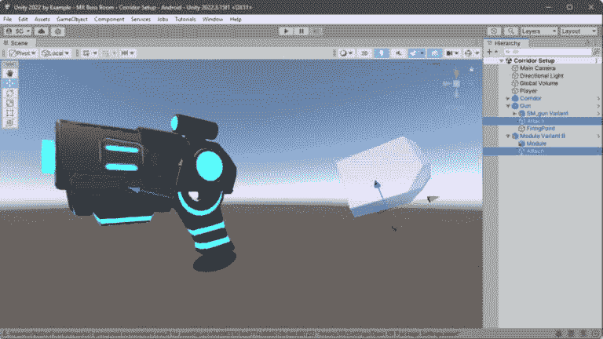
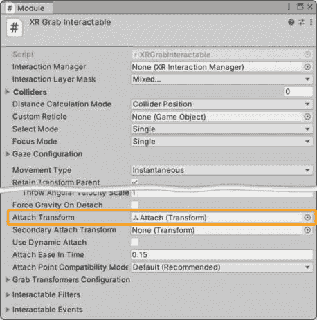

# 第十四章：使用 XR Interaction Toolkit 进入混合现实

在*第十三章*中，我们对 3D FPS 游戏的敌人 NPC 进行了一些修改。我们将它们从 2D 组件升级到 3D 组件，同时仍然使用航点进行导航，但利用 Unity 的 NavMesh 系统快速实现巡逻行为。我们还通过添加传感器增强了 NPC 行为的复杂性，这些传感器允许它们以更真实的方式与玩家和环境交互。

我们继续讨论如何使用我们的传感器作为行为树中的条件来创建动态敌人行为。然后，我们通过介绍使用 Unity 的 ML-Agents 的**机器学习**（**ML**）来完成我们的 AI 讨论，这使得 NPC 能够学习和进化。通过集成基于高级 AI 的游戏玩法，我们可以为我们的玩家创造惊人的体验！

在本章中，我们将通过创建**混合现实**（**MR**）中的最终老板房间遭遇战来完成从 3D FPS 游戏开始的旅程。我们将通过使用**Unity XR Interaction Toolkit**以及从先前努力中积累的资产、可重用组件和系统来实现这一点，所有这些都将汇集在一起，在你的房间里创造一场战斗！

在本章中，我们将涵盖以下主要主题：

+   混合现实和开发框架简介

+   设计老板房间

+   与 AR 飞机（AR Foundation）合作

+   在世界中放置可交互对象

+   实现老板房间机制

到本章结束时，你将能够制作一个融合玩家物理空间（如墙壁、地板和桌子）的 MR 游戏或体验，为玩家创造新颖的体验。你还将学习如何创建可交互对象并管理它们的实例化，特别是关于定义物理空间边界和对象的检测表面平面。本章完成了制作游戏时快速构建功能和行为的知识积累。

# 技术要求

要跟随本章内容，你需要一个 Meta Quest 2 或 3 头戴式设备以及一根 USB-C 线缆来将其连接到你的电脑。这条线缆让你可以将 Unity 项目构建推送到你的设备，并在 Unity 编辑器的播放模式下直接测试一些功能。

如果你没有 MR 头戴式设备

即使没有 MR 头戴式设备，你也可以跟随本章内容——通过使用从 Unity Asset Store 提供的 Meta XR Simulator：[`assetstore.unity.com/packages/tools/integration/meta-xr-simulator-266732`](https://assetstore.unity.com/packages/tools/integration/meta-xr-simulator-266732)。

你可以从 GitHub 下载完整项目：[`github.com/PacktPublishing/Unity-2022-by-Example`](https://github.com/PacktPublishing/Unity-2022-by-Example)。

# 混合现实和开发框架简介

**混合现实**最近才成为可能，利用最新的**头戴式显示器**（**HMDs**）创造物理世界和虚拟世界融合的环境，使数字和物理对象共存，并看起来相互交互。混合现实游戏、教育、医疗保健或工业应用结合了**虚拟现实**（**VR**）和**增强现实**（**AR**）的方面，提供一种沉浸式体验，其中虚拟内容锚定在现实世界中。

只需看看像**Skyrim VR**或**Resident Evil VR**这样的流行 PC 游戏 VR 改编，就能理解基于 VR 的技术对未来虚拟娱乐的强大前景。此外，像**Minecraft VR**和**Roblox VR**这样的游戏，尽管玩家基数巨大且参与度高，也能提供沉浸式体验，将原本静态的环境转变为动态的世界，以前所未有的方式允许互动和探索。

原始 VR 游戏标题**Beat Saber**的突破性成功也展示了该平台多样化的潜力，不仅限于娱乐，还包括身体参与的玩法。VR、AR 和 MR 的未来将继续吸引我们的兴趣，因此让我们确保我们拥有在这个领域取得成功的工具。

在本节中，我们将回顾我们将用于构建我们的 BOSS 房间游戏的技术。技术栈包括 Unity **XR Interaction Toolkit**、**AR Foundation**框架和**OpenXR** Meta 包。这些技术本身很强大，但结合在一起，就能创造出新的东西。它们使开发者能够更快地创建令人印象深刻的 MR 体验。

让我们对每个部分进行简要概述，看看它们是如何协调一致的。

## XR Interaction Toolkit (XRI)

Unity 的 XRI 是一个适用于 VR/AR 的多功能交互系统，它简化并加速了跨平台创作。它为各种交互提供了通用框架，例如戳、注视（即射线）和抓取控制器和手。它还包括虚拟手、触觉反馈以及使用缩放、动画甚至混合形状进行选择时的响应。

额外阅读 | XR Interaction Toolkit (XRI)

XRI: [`docs.unity3d.com/Packages/com.unity.xr.interaction.toolkit%402.5/manual/index.xhtml`](https://docs.unity3d.com/Packages/com.unity.xr.interaction.toolkit%402.5/manual/index.xhtml).

XRI 示例: [`github.com/Unity-Technologies/XR-Interaction-Toolkit-Examples`](https://github.com/Unity-Technologies/XR-Interaction-Toolkit-Examples).

XR: [`docs.unity3d.com/Manual/XR.xhtml`](https://docs.unity3d.com/Manual/XR.xhtml).

XRI 工具包通过提供一套全面的交互组件和系统，极大地简化了开发交互式 VR 和 AR 体验的过程，降低了开发者进入这一领域的门槛。它允许轻松实现常见的功能，如头部跟踪、移动（即运动）、对象交互以及虚拟空间内的用户界面。该工具包也是灵活和模块化的，为创建 MR 游戏提供了一个优秀的基础。

特别针对 Unity 2022，Unity 为 Meta Quest HMDs 提供的跨平台 MR 开发工具已从实验预览状态转移到 2022 LTS 版本中的完全支持状态！

XRI 提供了交互部分；现在，让我们看看这些技术的环境部分。

## AR Foundation

Unity 的 AR Foundation 是一个跨平台框架，它提供了一个统一的 API，用于简化为移动和头戴式 AR/MR 设备构建应用程序。该包旨在与 XRI（以及 XR Hands）原生工作，显著降低开发者访问特定设备功能以支持构建 AR 应用程序的障碍。

额外阅读 | AR Foundation

AR Foundation: [`unity.com/unity/features/arfoundation`](https://unity.com/unity/features/arfoundation)

Unity 文档：[`docs.unity3d.com/Packages/com.unity.xr.arfoundation%405.1/manual/index.xhtml`](https://docs.unity3d.com/Packages/com.unity.xr.arfoundation%405.1/manual/index.xhtml)

更具体地说，AR Foundation 是统一**ARCore**（谷歌）和**ARKit**（苹果）API 的层，将其整合为一个单一的更高层次的 API。这个单一的 API 允许开发者编写一次代码，而底层平台的特定功能实现则自动处理。

AR Foundation 简化了将空间感知构建到应用程序中的过程，使数字对象看起来可以与真实世界交互。这对于创建无缝融合虚拟世界和真实世界的 MR 体验至关重要。

我们将专门针对**Meta Quest HMD**平台进行工作。我们的老板房间游戏将与 Quest 2 和 Quest 3 设备兼容。AR Foundation 对 Meta Quest 的支持是使用一个熟悉的行业采用的标准接口来构建的，这个接口被称为**OpenXR**。

AR Foundation 提供了视觉部分；现在，让我们看看这些技术的平台支持部分。

## OpenXR：Meta 包

**OpenXR**是一个开放且无需支付版税的标准，它通过统一的界面，在多个 AR 和 VR 硬件和软件平台及设备上实现高性能访问，这些平台和设备统称为 XR。

使用 OpenXR 进行开发简化了开发过程，因为它允许开发者针对任何支持 OpenXR 的系统进行开发，无需担心特定平台的具体细节。自 Unity 2022.3.11.f1 版本以来，Meta 包（包含**Meta 特定的 OpenXR 扩展**和 Meta 为其 Quest 设备提供的**AR Foundation 提供插件**）确保了软件和硬件之间的兼容性和互操作性，以支持其特定的输入设备、头戴式显示器和其他外围设备。

额外阅读 | OpenXR

Kronos Group: OpenXR: [`www.khronos.org/openxr/`](https://www.khronos.org/openxr/)

总结来说，OpenXR 是连接交互和视觉系统与任何支持硬件设备的粘合剂——特别是那些具有更好图形性能和传感器的全新设备。这三项技术的结合使用，使开发者能够快速创建原型并部署生产就绪的 MR 游戏和体验——XRI 为交互元素提供基础，AR Foundation 建立在融合数字和物理世界视觉的能力之上，而 OpenXR 确保了体验可以在不同设备上访问。


图 14.1 – Unity XR 技术堆栈

在本节中，我们学习了 Unity MR 技术有哪些可供我们使用，以及这种基于 MR 技术的组合不仅简化了开发过程，而且能够创建复杂、引人入胜的 MR 应用程序，从而拥有广泛的终端用户覆盖范围。这直接引出了下一节，我们将着手设计我们的 MR 老板房间。

# 设计老板房间

设计老板房间遭遇战是游戏制作的关键部分，它结合了叙事、机械和环境考虑因素，为玩家创造一个引人入胜且具有挑战性的体验。

设计老板房间遭遇战时需要考虑几个关键区域，我们将简要探讨其中几个：

+   **叙事元素**：遭遇战应该感觉像是一个自然的进展，甚至是故事的高潮。

+   **老板机制**：玩家与老板元素的战斗应该是一个独特的体验，与玩家主要使用的机制分开，要求玩家调整策略以克服攻击模式和其它行为。

+   **环境设计**：老板房间的布局应该与正在实施的叙事和机制相辅相成。这对于 MR 来说是一个特殊的考虑因素，因为我们将在玩家自己的房间（即他们的物理空间）中构建游戏环境并放置交互元素，为每位玩家创造一个新颖的挑战。

+   **平衡**：老板遭遇战提出的挑战应该是具有挑战性的，同时感觉相当平衡，以避免不必要的挫败感，同时仍然为玩家提供一个可解决的挑战。

通过将这些元素纳入我们的 Boss 房间，我们旨在为玩家提供一段愉快且难忘的体验。克服 Boss 挑战将给他们带来满足感和成就感。此外，在我们的案例中加入 MR，体验变得更加非凡和有回报。

让我们暂时回顾一下我们的 GDD，以获取关于即将添加的 Boss 房间战斗的快速更新，这将为我们设置场景提供上下文。

| **什么是栖息地内部的 Boss 遭遇？** | 在游戏的高潮部分，玩家必须潜入一个严密守卫的中心控制室，重新启动被邪恶的外星植物实体关闭的反应堆——其晶体模块已被弹出。这场战斗的结果将决定这个星球上 Kryk’zylx 种族的未来。 |
| --- | --- |

表 14.1 – GDD 片段设置 Boss 战斗场景

很好。上下文已经设定，我们有一些关于 Boss 战斗目的的故事背景。你不是来自拖车公园的某个孩子；你是一名 Kryk’zylx 侦察兵！因此，你装备了最先进的基于能量的武器，比如这把激光手枪：砰砰！


图 14.2 – XR 交互式枪

让我们先定义我们的物理空间，然后继续创建 Unity 项目并测试我们的 MR 设置。

## 设置物理空间

在设备上正确定义 MR 游戏的物理空间设置至关重要，因为它直接影响沉浸式体验的可能性。它无缝融合了虚拟内容，例如为墙壁、地板、天花板、桌子、座椅定义的水平 AR 表面平面，以及如门和窗户这样的垂直 AR 表面平面。这些虚拟表面对象与它们的现实世界对应物相匹配，增强了游戏玩法，确保了安全，并最大化了玩家的参与度。物理空间环境设置还充当了游戏开发者讲述故事和探索的互动画布。

对于 Meta Quest 3，头戴式设备包括一个深度传感器来扫描你的房间环境并检测地板、墙壁和天花板，以建立你的物理空间设置的起点。一旦完成房间扫描，你可以手动确认墙壁并添加家具。

对于 Meta Quest 2，你必须完全手动设置你的物理空间。

Meta Quest 房间设置

为了确保 Meta Quest 设备上的平面检测功能正常工作，你必须首先在 Quest 头戴式设备上的**设置** | **物理空间** | **空间设置**中完成新的**房间设置**功能，然后再进入 MR 游戏。为了确保最佳性能，还建议至少包含一件带有水平表面的家具，例如桌子。

请注意，我们将创建的 MR 游戏依赖于提供由物理扫描或手动空间设置建立的不同的表面平面示例。您必须确保您的房间至少有四面墙和一张桌子。

您可以在运行 MR 游戏或体验之前随时进行房间设置，因此您可以随时进行。但就目前而言，我们将继续创建和设置我们的 Unity 项目，以开始我们的老板房间战斗。

## 创建 Unity 项目

如果您还没有安装，请安装最新的 Unity 2022.3 LTS 版本——这样我们才能在 **Unity Hub** 中访问新的 VR 和 MR 模板。我们还需要确保 **Android Build Support** 模块可用，因此请确保您已安装该模块，以及 **OpenJDK** 和 **Android SDK & NDK Tools** 模块。


图 14.3 – 安装 Android Build Support 模块

现在已安装所需的最小 Unity 编辑器版本和 Android 依赖模块，我们可以使用 Unity 的新 **混合现实**（核心）模板快速设置我们的 MR 老板房间项目。它基于 *MR 和开发框架简介* 部分中概述的核心 MR 技术。多么方便啊！

MR 模板项目通过简化高级功能的实现（如平面检测、设备穿透和空间 UI 创建）以及设计友好的 XR 可交互组件，简化了 XR 开发。它预配置了必要的包，如 XRI、AR Foundation、Unity OpenXR Meta 和 XR Hands，使得项目设置和包管理变得轻松。这种 MR 项目模板方法针对 MR 创作者对更丰富内容的需求，并减少了开发者访问高级 MR 功能的摩擦。

额外阅读 | Unity MR 模板

混合现实模板快速入门指南：[`docs.unity3d.com/Packages/com.unity.template.mixed-reality%401.0/manual/index.xhtml`](https://docs.unity3d.com/Packages/com.unity.template.mixed-reality%401.0/manual/index.xhtml)

在 Meta Quest 3 上探索跨平台 MR 开发：[`blog.unity.com/engine-platform/cross-platform-mixed-reality-development-on-meta-quest-3`](https://blog.unity.com/engine-platform/cross-platform-mixed-reality-development-on-meta-quest-3)

打开 Unity Hub 并点击右上角的 **新建项目** 按钮，以创建一个新项目。然后，参照 *图 14.4*，按照以下步骤操作。

1.  确保在顶部的 **编辑器版本** 下拉菜单中选择了之前安装的 Unity 2022.3 LTS 版本。

1.  在中间的模板列表中，向下滚动并选择 **混合现实**（核心）。

1.  在右侧面板中，如果您看到 **下载模板** 按钮，请点击以下载模板。

1.  一旦模板下载完成，提供以下选项：

    +   `MR` `Boss Room`。

    +   **位置**：选择存储项目文件的文件夹路径。

    +   **Unity 云组织**: 您必须选择此项目所属的组织。当您创建一个新的 Unity ID 账户时，Unity 会为您生成一个与您的用户名和 ID 关联的组织。Unity 组织提供的基本功能是组织您的项目、服务和许可证。

    +   **连接到 Unity 云**: 只有当您希望利用游戏服务来支持您的项目时（通常，您会希望这样做）才启用此选项。

    +   **使用 Unity 版本控制**: 如果您想使用 Unity Cloud 的**版本控制系统**（**VCS**）将项目备份到云中，并允许其他团队成员协作，请启用此选项（我们将在*第十五章*中介绍 Unity 版本控制）。


图 14.4 – 从模板创建的新混合现实项目

1.  要开始创建项目，请点击**创建项目**按钮，并放松几分钟。

一旦项目在 Unity 编辑器中打开，让我们完成一些基本设置步骤。

打开**文件** | **构建设置…**，按照以下步骤配置平台以支持构建到我们的 Meta Quest 设备：

1.  在**平台**列表中选择**Android**。

1.  在**纹理压缩**下拉菜单中选择**ASTC**。

1.  点击**切换平台**按钮。

完成！

ASTC

**可伸缩纹理压缩**（**ASTC**）是一种使用可变块大小而不是单个固定大小的纹理压缩方法，它取代了旧格式，同时也提供了额外的功能。

现在，您可以打开位于`Assets/Scenes`文件夹中的`SampleScene`场景，以检查场景设置，包括以下负责管理 XR 功能（包括控制器和手部追踪、与 UI 和虚拟对象的交互以及 AR 功能，如表面平面检测和透视）的 GameObject：**MR 交互设置**、**UI**和**环境**。

通用 RP 渲染器设置

请注意，Meta Quest 头显对 Unity 渲染器设置的正确配置非常敏感。因此，我建议将 URP 渲染器和质量设置保持在 MR 项目模板提供的默认值（除非您真的知道自己在做什么）。

还请注意，独立 VR 硬件，如 Quest，需要额外的性能优化考虑，以维持最低 FPS（通常，不低于 72 FPS）：这是为了防止视觉运动（当身体静止时的视觉感知），这可能会让人感到恶心。

将您的 Quest 头显通过 USB-C 线缆连接到系统后，您可以通过选择**Android**平台，在**运行设备**字段中，点击当前显示**默认设备**的下拉菜单，来验证 Unity 是否识别了该设备。您的 Meta/Oculus Quest 3（或 2）设备应该列在那里。

使用 Quest Link 在播放模式中进行测试

为了彻底测试和玩我们的游戏，我们必须在设备上构建，因为当在 Unity 编辑器中进入播放模式时，Quest Link 目前不支持平面检测和 passthrough。我仍然建议利用 Quest Link 来快速迭代设置对象交互，独立于游戏玩法，然后构建到设备上进行完整游戏测试。

要使用 Quest Link，请确保你用 USB-C 线缆连接到你的系统，并且 Oculus 应用（Meta Quest Link）正在运行，然后点击 Quest 头戴设备的**快速设置**菜单中的 Quest Link 按钮。一旦建立连接，你就可以在 Unity 中进入播放模式来测试你的场景。

现在，仍然在**构建设置**窗口中，点击**构建并运行**，或者按*Ctrl/Cmd* + *B*，然后戴上头戴设备！

小贴士

当你开始 MR 环境时重新居中或重置你的方向至关重要。这确保了虚拟对象被正确地放置在你的当前位置和面向方向周围。这样做将增强你的体验，尤其是在设备方向检测技术持续改进的情况下。

MR 模板配置为使用控制器或双手。不过，我们仍将专注于使用控制器进行我们的游戏，所以我建议你在示例项目中尝试使用控制器作为输入。

这验证了你的 Quest 头戴设备和 Unity MR 项目设置已准备好进行 XR 开发。那么，让我们开始构建老板房间吧！

## 布局老板房间场景

根据我们的 GDD，我们必须清除中央控制系统中的邪恶植物实体感染。因此，为了做到这一点，我们需要为受损的控制台供电并重启反应堆（是的，相信我，这会起作用）。因此，老板房间的布局需要在我们的场景中包含与此相关的对象。

这里是我们为老板房间设置所需的对象：

+   **控制台**：维护居住站所有主要系统的状态，包括主反应堆。它有三个晶体模块插槽来为系统供电。

+   **反应堆**：为中央系统提供电力，特别是负责环境控制和清除外来实体的系统。

+   **走廊**：居住站由几个房间和连接走廊组成——这应该已经从 3D FPS 项目中熟悉了。

这些是我们场景中所需的主要对象，再次强调，这是你的房间，为老板遭遇提供背景。我们将构建布局，使控制台靠近玩家，并从房间中心延伸出虚拟走廊，为动作提供一个中心焦点。

在这个布局的考虑下，在下面的截图中——来自一个带有 passthrough 可见的 Quest 3——我们可以看到以这种方式实例化的对象在现实世界房间中的样子。


图 14.5 – 在物理空间中孵化的虚拟对象

让我们先复制提供的 MR 模板示例场景，开始设置场景：

1.  在 `Assets/Scenes` 文件夹中找到 `SampleScene` 场景。

1.  通过选择并按 *Crtl/Cmd* + *D* 复制它。

1.  将其重命名为 `Boss Room`。

现在，打开场景，我们将关闭场景中提供的某些示例内容，这些内容我们不会使用。选择并关闭以下对象（使用位于对象名称左侧的检查框）：

1.  禁用 `MR` `交互设置` 的这两个子对象：

    +   `目标管理器`

    +   `对象孵化器`

1.  禁用 `UI` 的这两个子对象：

    +   `教练界面`

    +   `手` `菜单设置`

1.  保存场景。

我们完成了！我们现在有一个空场景，所有 XR 设置都已准备好供我们创建我们的 MR 游戏。简单易行。

在本节中，我们介绍了设计老板房的基本原则和设置我们物理空间所需的步骤。此外，我们还学习了如何使用 Unity 的 MR 模板创建基本起始项目，并对其进行配置以供我们使用。

当创建构建我们老板房间的虚拟对象时，我们使用代表我们物理空间中真实世界对象的 AR 表面平面来动态地孵化它们。接下来，让我们探索如何使用检测到的 AR 平面孵化虚拟对象。

# 与 AR 平面（AR 基础）一起工作

AR 平面是代表水平和平面表面的虚拟表示，无论是水平还是垂直，由尺寸和边界点表示，并由 AR 基础技术检测。这些平面为准确放置数字对象和与表面交互提供了基础。

如前所述，这些平面代表墙壁、地板和天花板、桌子等，我们将在这个示例老板房中特别使用墙壁、地板和桌子，以无缝地将游戏玩法与玩家的物理环境融合在一起。

小贴士

**AR Plane Manager** 允许您指定用于平面可视化的预制件。由 MR 模板提供的 **AR Plane** 预制件使用一个着色器，它会遮挡分配了透明材料的对象，因此如果您想要在 AR 平面之后可以看到的对象，请确保您不使用透明材料。

现在，让我们开始处理我们的第一个水平平面类型，即桌子，看看我们如何检测平面类型并使用其属性来孵化一个对象。

## 使用 AR Plane Manager 在飞机上孵化

位于 `XR Origin (XR Rig)` 对象上作为 `MR Interaction Setup` 根对象的子对象的 `AR Plane Manager` 组件负责检测物理空间中的水平和垂直表面，并创建我们的虚拟内容可以放置和与之交互的虚拟平面对象（`AR Plane` 预制件）。

优化提示

使用**AR Plane Manager**，除了指定**AR Plane** Prefab 外，您还可以在**检测模式**中选择水平、垂直或两者都选。如果您只需要检测水平平面，建议关闭垂直平面检测。

我们首先必须做的一件事是启用`AR Plane Manager`组件，因为它在 MR 示例场景中默认未激活。我们将通过我们的第一个脚本，即游戏管理器来完成此操作。

在`Assets/Scripts`文件夹中创建一个名为`GameManager`的新脚本，并从以下代码开始：

```cs
using UnityEngine.XR.ARFoundation;
public class GameManager : MonoBehaviour
{
    [SerializeField]
    private ARPlaneManager _planeManager;
    private IEnumerator Start()
    {
        yield return new WaitForSeconds(2f);
        EnablePlaneManager();
    }
    public void EnablePlaneManager()
        => _planeManager.enabled = true;
}
```

现在，在场景中创建一个 GameObject，并将此脚本附加到它上。如您所见，我们已经将`Start()`方法的签名更改为`IEnumerator`（是的，您可以这样做），并且我们延迟了`EnablePlaneManager()`方法调用的执行 2 秒钟（以便给 XR 组件初始化时间）。

通过将`XR Origin (XR Rig)`对象拖入`GameManager`组件的字段中，在检查器中分配`_planeManager`。我们像这样在`EnablePlaneManager()`方法中启用组件：

```cs
    _planeManager.enabled = true;
```

您现在可以通过确保场景已添加到**构建设置**窗口中的**构建场景**，通过 USB-C 线缆将您的 Quest 设备连接到系统，并点击**构建并运行**（*Ctrl/Cmd* + *B*，即*构建* *并运行*）来测试老板房间场景。

您应该看到以下类似的图像，其中墙壁、地板和天花板以及任何水平表面（如桌子）都有淡化的虚线材质。请注意，我已经手动添加了洋红色线条以更好地显示平面表面（包括桌子、墙壁和地板）。


图 14.6 – 房间中检测到的表面平面

现在我们已经验证了我们可以使用平面，让我们开始为老板房间实例化我们的虚拟对象。

## 在桌面上实例化

哇，等等……我们需要将对象放入房间中。我们可以再次感谢**Polypix Studios**为这些资源提供 3D 艺术：控制台、模块、反应器、走廊、枪和悬浮机器人。

老板房间虚拟对象

您可以从本书的 GitHub 仓库中下载**VirtualObjects-start.zip**：[`github.com/PacktPublishing/Unity-2022-by-Example/tree/main/ch14/Art-Assets`](https://github.com/PacktPublishing/Unity-2022-by-Example/tree/main/ch14/Art-Assets)。

解压文件以获取`**.unitypackage**`文件，并将其导入到您的项目中 – 您可以通过将文件从系统文件管理器拖放到 Unity 的**项目**窗口中来实现这一点。

我们将要处理的第一个资源是作为`Reactor` Prefab 导入到`Assets/Prefabs`文件夹中的反应器模型，如下截图所示：


图 14.7 – 老板房间 3D 资产 Prefab

然后，我们将`Reactor` Prefab 实例化到房间中检测到的第一个桌子上。

`AR Plane Manager`提供了一个`planesChanged`事件，我们将订阅它，当`PlaneClassification`是`Table`类型时，我们知道我们应该生成反应堆。所以，让我们在我们的`GameManager`类中添加监听器和处理生成对象的处理方法：

```cs
public void EnablePlaneManager()
{
    _planeManager.enabled = true;
    _planeManager.planesChanged += OnPlanesChanged;
}
```

不要忘记在`OnDisable()`或`OnDestroy()`中取消订阅监听器。

现在，添加处理方法：

```cs
private void OnPlanesChanged(ARPlanesChangedEventArgs args)
{
    foreach (var plane in args.added)
    {
        switch (plane.classification)
        {
            case PlaneClassification.Table:
                if (!_hasSpawnedPrefab_Reactor)
                {
                    SpawnPrefab(plane, _prefabReactor);
                    _hasSpawnedPrefab_Reactor = true;
                }
                break;
        }
    }
}
```

在这里，你可以看到我们使用`foreach`语句遍历处理程序的`args`参数提供的所有检测到的平面（`ARPlane`类型）。然后，`switch`语句允许我们根据我们的需求处理特定的平面分类，这再次是`Table`。我们使用一个辅助的`SpawnPrefab()`方法，该方法执行实例化——传递特定的平面和 Prefab：

```cs
private void SpawnPrefab(ARPlane plane, GameObject prefab)
{
    Instantiate(prefab,
        plane.transform.position,
        plane.transform.rotation);
}
```

你可以看到我们正在使用常规的`Instantiate()`方法和平面的`position`和`rotation`值作为实例化的点。

为了确保场景中只生成一个反应堆，如果物理空间定义了多个桌面表面，我们将使用`_hasSpawnedPrefab_Reactor`布尔值将其限制为一个，并调用`SpawnPrefab()`方法，指定`ARPlane`和`Reactor` Prefab 作为参数。在调用生成方法后，将`_hasSpawnedPrefab_Reactor`设置为`true`确保只生成一个 Prefab。

你必须确保你已经声明了变量来分配`Reactor` Prefab 和`has spawned`布尔值。然后，从检查器中的`GameManager`字段分配`Reactor` Prefab。

如果你现在在你的设备上构建并运行项目，你应该会在你的桌子上看到反应堆出现！


图 14.8 – 在桌子上生成的反应堆 Prefab

启用穿透

如果你想要暂时跳过，看看虚拟对象坐在你的真实世界环境中的样子，我们需要切换穿透以使其可见。在*使用 XR 输入切换 MR 视觉效果部分*，我们将添加切换穿透可见性的功能。

这就完成了如何在桌子上实例化对象的演示。接下来，让我们继续在地面平面上生成对象。

## 使用地面平面实例化

与反应堆的放置不同，我们将优先考虑控制器控制台对象相对于玩家前向方向（当检测到平面时）的朝向，以确保玩家可以立即进行交互。

流程基本上是相同的，只是方向不同。所以，我们首先将`switch (plane.classification)`块添加到我们的代码中，以处理`Floor`分类：

```cs
    case PlaneClassification.Floor:
        if (!_hasSpawnedPrefab_Console)
        {
            SpawnPrefab(plane,
                _prefabConsole,
                new Vector3(-1f, 0f, 0f));
            _hasSpawnedPrefab_Console = true;
        }
        break;
```

我们有一个类似的布尔检查，以确保我们不会在房间中通过`_hasSpawnedPrefab_Console`变量生成多个控制台，并且为`SpawnPrefab()`方法提供了一个方法重载。新的生成方法签名增加了一个额外的参数用于偏移量——我们将假设这个偏移量是从玩家位置开始的。

带有偏移的新 spawner 方法如下——将其添加到`GameManager`类中：

```cs
private void SpawnPrefab(
    ARPlane plane, GameObject prefab, Vector3 playerOffset)
{
    var playerTransform = Camera.main.transform;
    playerTransform.position = new Vector3(
        playerTransform.position.x,
        plane.transform.position.y,
        playerTransform.position.z);
    var worldOffset =
        playerTransform.TransformDirection(playerOffset);
    var spawnPosition = playerTransform.position
        + worldOffset;
    var directionToPlayer =
        (playerTransform.position
            - spawnPosition).normalized;
    var spawnRotation =
        Quaternion.LookRotation(-directionToPlayer,
            Vector3.up);
    Instantiate(prefab, spawnPosition, spawnRotation);
}
```

新的 spawn 方法中的重点如下：

+   `playerTransform`: 我们从主相机中获取玩家的当前位置，该相机连接到`XR Origin (XR Rig)`以表示玩家的头部。

+   `playerTransform.position`: 我们将新的`Vector3` Y 值应用到`playerTransform`上，以便将实例化的模型锚定到地板平面上（其 Y 值）。

+   `worldOffset`: 我们接收玩家偏移值并使用`TransformDirection()`方法来确保玩家偏移将在适当的世界空间坐标中应用——因为我们无法知道传递给 spawn 方法的坐标，因为它是相对于玩家当前位置的。

+   `spawnRotation`: 我们希望确保实例化时控制台面向玩家，所以我们使用`Quaternion.LookRotation()`来实现这一点。

我们通过调用`Instantiate()`方法来完成，就像之前一样。添加所需的变量并执行检查器分配。然后，保存你的更改，继续进行另一个*构建和运行*，以查看你房间中的控制台。*图 14*.5 中可以看到控制台放置的示例。

好的，我们在老板房间布局上取得了很大的进展！最后要进入我们房间的环境对象是走廊，它将虚拟扩展房间的现实，并为我们的敌人悬浮机器人与玩家交战设定舞台。

## 使用墙平面实例化

我们最后一个 AR 检测到的平面实例化示例将与前两个相对相似，但现在我们必须考虑相对于垂直表面实例化对象。这将在定位时需要一些额外的注意，因为平面锚点位于平面表面对象的中心。

幸运的是，我们可以访问所有基本的`Bounds`属性，例如`extents`，但我们仍然需要表面范围和方向。所以，让我们首先向我们的`switch (plane.classification)`块添加代码来处理`Wall`分类：

```cs
    case PlaneClassification.Wall:
        if (!_hasSpawnedPrefab_Corridor)
        {
            SpawnPrefabAtWallBase(
                plane, _prefabCorridorDoorway);
            _hasSpawnedPrefab_Corridor = true;
        }
        break;
```

你可以在这里看到与之前相同的模式，使用布尔值来确定我们是否已经实例化了走廊 Prefab，并调用 spawn Prefab 方法，这次只传递了平面和 Prefab。

`SpawnPrefabAtWallBase()`方法看起来如下：

```cs
private void SpawnPrefabAtWallBase(
    ARPlane plane, GameObject prefab)
{
    var planeCenter = plane.transform.position;
    var heightOffset = plane.extents.y;
    var basePosition =
        new Vector3(planeCenter.x, planeCenter.y
            - heightOffset, planeCenter.z);
    var prefabRotation =
        Quaternion.LookRotation(-plane.normal, Vector3.up);
    Instantiate(prefab, basePosition, prefabRotation);
}
```

这里需要做一点额外的计算，以确保我们将 Prefab 的实例化点锚定到表面平面的垂直底部——与地板相同的 Y 值——通过使用`plane.extents`并从平面的变换位置（平面的中心）中减去。

对于生成的 Prefab 的旋转，我们再次使用`LookRotation()`，但这次，我们不会使用**玩家方向**向量，而是使用平面的表面法线向量。平面的表面法线指向房间的中心，因此我们想要将其反转以实例化走廊 Prefab，该 Prefab 的前进方向朝向走廊（对于你自己的 3D 模型，你可以反转法线向量或旋转枢轴的前进方向以获得正确的方向）。

再次，添加所需的脚本变量，保存脚本，将走廊 Prefab 分配到`GameManager`的字段上，保存你的场景，然后构建并运行应用程序以测试走廊添加到 Boss 房间中的位置。

现在我们已经完成了 Boss 房间的布局，包含了所有战斗所需的元素，让我们看看我们如何与 MR 视觉效果合作，在不显示 AR 平面和启用透传的情况下设置合适的游戏体验。

## 使用 XR 输入切换 MR 视觉效果

你知道我对在游戏中构建功能的同时也便于设计师使用的可重用组件有多大的热情。所以，让我们通过添加一个依赖于`InputAction`输入信号的**按钮按下**组件来以类似的方式从我们的 XR 控制器处理输入。

你可以从 GitHub 仓库中获取`OnButtonPress`脚本文件：[`github.com/PacktPublishing/Unity-2022-by-Example/tree/main/ch14/Code-Assets`](https://github.com/PacktPublishing/Unity-2022-by-Example/tree/main/ch14/Code-Assets)，然后将其导入到你的项目中`Assets/Scripts/Interaction`文件夹。

我们将为以下游戏内动作设置按钮：

+   右控制器，主要按钮（**A**）→ 切换透传可见性。

+   右控制器，次要按钮（**B**）→ 切换 AR 平面表面。

+   左控制器，主要按钮（**X**）→ 开始游戏。

让我们看看 Unity 的**XR 输入**映射的 Oculus 控制器按钮在以下图中是什么样子。


图 14.9 – Oculus XR 控制器按钮映射

额外阅读 | XR 输入

Unity XR 输入映射：[`docs.unity3d.com/Manual/xr_input.xhtml#XRInputMappings`](https://docs.unity3d.com/Manual/xr_input.xhtml#XRInputMappings)

好的，很简单。让我们先为按下**A**按钮时设置透传可见性切换。

### 切换透传

MR 模板展示了在虚拟环境和设备透传之间切换的能力。这是通过在环境网格上使用简单的淡入淡出过渡来实现的。网格使用一个**ShaderGraph**着色器，它具有一个可以平滑过渡的 alpha 属性。

我们甚至不需要编写脚本来实现淡入淡出过渡。MR 模板的`Environment`预制件已经包含了一个`FadeMaterial`组件，该组件提供了一个公开的方法用于淡入淡出！

因此，让我们快速进入并切换淡入淡出效果，首先在`Assets/Scripts`文件夹中创建一个新的控制器脚本，命名为`SceneController`，并使用以下代码：

```cs
using UnityEngine.Events;
using UnityEngine.XR.ARFoundation;
public class SceneController : MonoBehaviour
{
    [Header("Triggered Events")]
    public UnityEvent<bool> OnTogglePassthrough;
}
```

保存脚本并将其添加到`GameManager`对象中。如您所见，我们将使用`UnityEvent`来分配对`FadeMaterial`函数的引用，传递一个表示要淡入可见状态的布尔参数。

让我们在检查器中分配`OnTogglePassthrough(Boolean)`回调，然后完成添加切换逻辑代码。所以，首先点击**+**图标以添加新的事件回调条目。然后，使用*图 14.10*作为参考，在场景层次结构中找到**UI** | **Environment**对象，并将其拖到**对象**字段。

现在，在事件被调用时，在`UnityEvent`的`bool`参数中选择顶部的`FadeMaterial.FadeSkybox`函数。


图 14.10 – SceneController 组件设置

剩下的就是当玩家按下右侧控制器的主按钮时调用`OnTogglePassthrough`事件（对于该事件，`SceneController`类）：

```cs
public void TogglePassthrough()
{
    _isPassthroughVisible = !_isPassthroughVisible;
    SetPassthroughVisible(_isPassthroughVisible);
}
public void SetPassthroughVisible(bool visible)
{
    _isPassthroughVisible = visible;
    OnTogglePassthrough.Invoke(_isPassthroughVisible);
}
```

直观、单一职责且命名良好的方法。添加私有成员变量`_isPassthroughVisible`以跟踪当前的切换状态，默认为`false`，这是正确的默认透视状态。

最后，参考*图 14.10*中的这些步骤，当控制器按钮被按下时接收玩家输入，让我们使用`OnButtonPress`组件，并配置输入动作以用于**A**按钮：

1.  将`OnButtonPress`组件添加到`SceneController`。

1.  点击**+**下拉菜单，然后选择**添加绑定**。

1.  双击**<无绑定>**。

1.  在**路径**下拉菜单中，选择**XR 控制器** | **XR 控制器（右手）** | **可选控件** | **primaryButton**。

或者，输入以下文本（点击`<XRController>{RightHand}/primaryButton.`）

1.  最后，将`OnPress()` `UnityEvent`函数分配给`SceneController.TogglePassthrough`。

现在执行*构建和运行*到您的设备上，您可以通过按下右侧控制器上的**A**按钮来切换透视可见性。这将是你第一次看到在真实世界空间中生成的老板房间的数字对象——非常酷，对吧？

支持透视的相机设置

MR 模板的主相机已经预配置为启用设备透视，但提一下设置。相机的背景类型是**纯色**，背景颜色设置为黑色，**0**透明度。**AR Camera Manager**组件也被明确包含以控制 Meta Quest 设备上的透视。

Passthrough，检查！现在，让我们看看当按下 **B** 按钮时如何切换 AR 飞机可见性。

### 切换 AR 飞机可见性

我们将模仿 passthrough 切换设置，这并不令人惊讶。我们已经看到了如何引用和使用 `AR Plane Manager` 来为不同的飞机分类生成虚拟对象。嗯，我们还会在这里再次使用它来访问当前的 **trackables** 集合。

可追踪组件是一个表示在真实世界中检测到的 AR 对象的组件。例如包括飞机（你已经熟悉这些了）、点云、锚点、环境探测、面部、身体、图像和 3D 对象。

可追踪组件（AR 基础）

可追踪组件和可追踪管理器：[`docs.unity3d.com/Packages/com.unity.xr.arfoundation%405.1/manual/architecture/managers.xhtml#trackables-and-trackable-managers`](https://docs.unity3d.com/Packages/com.unity.xr.arfoundation%405.1/manual/architecture/managers.xhtml#trackables-and-trackable-managers)

让我们从向 `SceneController` 类添加以下切换代码开始，用于控制飞机可见性：

```cs
[SerializeField]
private ARPlaneManager _planeManager;
public void TogglePlaneVisibility()
{
    _arePlanesVisible = !_arePlanesVisible;
    SetPlaneVisible(_arePlanesVisible);
}
public void SetPlaneVisible(bool visible)
{
    _arePlanesVisible = visible;
    foreach (var plane in _planeManager.trackables)
    {
        if (plane.gameObject.
            TryGetComponent<FadePlaneMaterial>(
                out var planeFader))
        {
            planeFader.FadePlane(_arePlanesVisible);
        }
    }
}
```

`SetPlaneVisible()` 方法中的 `foreach` 循环负责在迭代可追踪集合时根据找到的 `FadePlaneMaterial` 组件实现飞机的淡入。如果找到，我们只需调用该飞机的 `FadePlane()` 方法。`FadePlaneMaterial` 组件为我们提供了 MR 模板的 `AR Plane` 预制件。简单易懂。

现在让我们将其连接到控制器按钮按下操作——这将是对应右侧控制器的次要按钮（**B**）：

1.  向 `GameManager` 对象添加另一个 `OnButtonPress` 组件（位于之前的 `OnButtonPress` 组件下方）。

1.  点击 **+** 下拉菜单，然后 **添加绑定**。

1.  双击 **<****No Binding>**。

1.  在 **路径** 下拉菜单中，选择 **XR Controller** | **XR Controller (Right Hand)** | **Optional Controls** | **secondaryButton**。

或者，输入以下文本（点击 `<XRController>{RightHand}/secondaryButton.`）

1.  最后，将 `OnPress()` `UnityEvent` 函数分配给 `SceneController` 的 `TogglePlaneVisibility`。

现在执行 *构建和运行* 到你的设备上，你可以通过按下右侧控制器上的 **B** 按钮来切换 AR 飞机可见性。切换飞机可见性将主要用于调试；如果对象以意外的方式生成，你可以验证物理空间中检测到的飞机（任何检测到的都可能表明你需要重新检查 Quest 头盔的 **Room** **Setup** 配置）。

混合现实模板脚本修复！

在撰写本文时，**/Assets/MRTemplateAssets/Scripts/FadePlaneMaterial.cs** 脚本中存在一个与 **FadePlane()** 方法的错误，必须纠正，以便在第一次在 **Awake()** 方法中调用后，飞机能够正确地淡入淡出。

在第 *91* 行，在 **FadeAlpha()** 方法内，将 **k_DotViewRadius** 变量替换为 **k_Alpha**。现在该行应读作：**rend.material.SetFloat(k_Alpha, alphaValue);**。

注意，我们在开始游戏时将关闭飞机的可见性。说到……现在让我们连接开始游戏的功能。

### 开始游戏

提供玩家通过按钮或菜单选择开始游戏的选择，可以创造一种控制和期待感。相比之下，对于 MR 甚至 VR，自动开始游戏可能会让人感到迷失方向，或者更糟，令人震惊。嗯，除非你想要敌对，并且没有警告就将玩家直接投入无法原谅的行动中（嗯哼，*黑暗灵魂*，我看到你了）。

如前所述，我们不会如此残忍，将为玩家提供一个按钮按下以进入 MR 环境开始游戏。考虑到这一点，我们需要对`GameManager`类做一些补充。让我们添加以下代码：

```cs
private SceneController _sceneController;
private void Awake()
    => _sceneController = GetComponent<SceneController>();
```

在这里，我们只是获取`SceneController`兄弟组件的引用。请继续添加一个`[RequireComponent]`属性给`SceneController`组件。

这是我们将从按钮按下时调用的`StartGame()`方法：

```cs
public void StartGame()
{
    EnablePlaneManager();
    StartCoroutine(DelayStartGame());
    IEnumerator DelayStartGame()
    {
        yield return new WaitForSeconds(1.5f);
        _sceneController.SetPlaneVisible(false);
        _sceneController.SetPassthroughVisible(true);
    }
}
```

我们将使用`EnablePlaneManager()`调用首先启用平面管理器来生成构成我们 Boss 房间游戏的虚拟对象。然后，我们将使用协程延迟调用本地`DelayStartGame()`函数 1.5 秒，设置飞机不可见，穿透可见——这将确保我们在真实世界空间中看到虚拟对象时不受阻碍。

移除`IEnumerator Start()`方法

不要忘记，我们将在之前“使用 AR Plane Manager 的平面生成”部分中设置的**Start()**方法移除。我们现在将等待玩家按下按钮开始游戏，以启用虚拟对象的生成。

好的，让我们通过以下步骤再次完成事情，但这次简化一下——你做到了：

1.  将另一个`OnButtonPress`组件添加到`GameManager`对象中。

1.  为 XR 左手控制器的主要按钮分配输入动作绑定（`<XRController>{LeftHand}/primaryButton`）。

1.  将`OnPress()`函数分配给`GameManager.StartGame`。

这次，当你*构建并运行*时，你将看到自己在空旷的虚拟环境中，直到你按下**X**按钮开始游戏并进入 Boss 房间战斗！

在本节中，我们学习了如何使用生成的 AR 平面在我们的房间中生成对象，以及它们的变换位置和旋转。我们还学习了如何访问 AR 系统和使用预制的组件（由 MR 模板提供）来切换穿透和 AR 平面的视觉状态。

现在我们已经处理好了 Boss 房间环境，并且游戏已经开始，但还没有我们能够做或与之交互的东西。我们将通过添加 XRI 交互对象来解决这个问题的现在。

# 在世界中放置交互对象

在 MR 游戏设计中，交互对象对于连接虚拟世界和现实世界至关重要。交互对象被设计为响应用户输入，即使是基本的手（或控制器）移动，这也允许自然直观的交互，如推动、抓取、投掷，甚至复杂的双手操作（例如，旋转和缩放对象）。它们确实有助于营造环境的现实感，因此，它们显著增强了玩家的参与度和整体游戏体验。

为了我们游戏的目的，我们将有简单的抓取和放置交互的示例，以及使用枪的次要交互事件动作进行射击。请注意，尽管许多 MR 游戏 和体验是为使用双手（手部追踪）而构建的，但我们的老板房间示例游戏将使用控制器。

让我们先配置抓取模块 – 这些模块随后将被配置以插入到控制台上的插槽中（参考 *设计一个房间* 部分的 GDD）。

## 将对象制作成 XR 交互对象

我们将首先处理的第一个可抓取对象是水晶模块。玩家必须能够抓取模块并将其插入控制台，因此我们将打开提供的 `模块` 预制资产在预制模式中（在 `XR 捕捉交互` 组件中双击它到根目录。

如以下截图所示，可抓取对象应有一个定位和适当旋转的变换，以便以正确的方向抓取物品，以便正确使用 – 这里，我们看到 `模块` 和 `枪` 资产都定位和旋转得很好，以便于良好的抓取。



图 14.11 – 配置 XR 捕捉附着变换

从截图注意，`附着` 变换的前向方向（Z 轴，蓝色箭头）是指向持有物体的玩家远离的方向。可能需要进行一些实验以达到所需的抓取位置。

现在，我们只需要将 `附着` 对象分配给 `XR 捕捉交互` **附着变换** 字段，以确保它被正确地附着到玩家的控制器上。您可以在交互组件提供的许多选项中找到隐藏的 **附着变换** 字段。



图 14.12 – XR 捕捉交互可附着变换分配

阅读更多 | 便利性系统

XRI 便利性系统在与物体交互时提供视觉颜色和音频反馈提示，尤其是在使用双手时触觉不可用的情况下，使用带有交互源的可交互便利性状态提供器组件。示例在 XRI 示例项目中提供。

便利性系统：[`docs.unity3d.com/Packages/com.unity.xr.interaction.toolkit%402.5/manual/affordance-system.xhtml`](https://docs.unity3d.com/Packages/com.unity.xr.interaction.toolkit%402.5/manual/affordance-system.xhtml)

保存模块并将其临时添加到您的`Boss Room`场景中，靠近`MR Interaction Setup`对象。进入播放模式并测试使用控制器（通过使用控制器侧面的握把按钮，用您的中指）抓取模块并在周围移动它。注意这次我说的是*进入播放模式*，而不是*构建和运行*。这是因为我们希望更快地迭代更改，如抓取点附件位置。有关详细信息，请参阅*创建 Unity* *项目*部分的 Quest Link 提示。

完成的交互对象

所有完成后的 XR 交互对象都包含在本书 GitHub 仓库中该章节的完成 Unity 项目文件中：[`github.com/PacktPublishing/Unity-2022-by-Example/tree/main/ch14/XR-Assets`](https://github.com/PacktPublishing/Unity-2022-by-Example/tree/main/ch14/XR-Assets)。

在 XR 中使一个物体可交互的全部内容就是这些。XRI 使得获取游戏和体验所需的最小交互变得非常容易，例如在游戏中进行抓取。我们看到了如何在世界中动态放置其他数字对象；让我们为模块做同样的事情，但有所变化。

## 将模块放置在房间中

在我们的 Boss 房间战斗中，我们的主要目标，除了保持生存之外，就是收集水晶模块以恢复控制台的功能并给反应堆供电，以驱逐邪恶的植物实体。所以，这里又有一场收集和管理模块的挑战！然而，让我们增加收集和管理模块的挑战性。

在 MR 游戏中，通过让这些物体在房间内移动，可以使收集物体变得更加有趣。玩家将需要依靠他们的空间意识和时间技巧，这引入了一个更具动态性和新颖性的挑战，要求他们探索房间。由于物体不仅对玩家的动作做出反应，还对空间的物理性做出反应，这也加深了 MR 游戏体验的沉浸感。

如果收藏品能够以某种方式漂浮，模块也可以为游戏的故事或美学主题做出贡献。事实上，水晶模块具有一种奇特的异世界属性——重力不会影响它们，但力会。 ¯\_(ツ)_/¯

在设定了这样的背景之后，让我们首先创建三个所需的模块，然后在游戏开始时将它们实例化到房间中。

### 创建独特的模块变体

我们将创建的三个`模块`预制件变体可以在*图 14**.7*中看到，并且每个都将有一个唯一的标识符——模块的 ID 将在我们配置控制台插槽时发挥作用。

创建预制件变体有多种方法，但这次，我们将使用以下步骤来创建每个独特的模块：

1.  通过在**项目**窗口中右键单击`Module`并选择**创建** | **预制件变体**来创建`Module`的预制件变体。

1.  将其命名为`Module Variant A`（后续的变体将是`B`和`C`）。

1.  双击`Module Variant A`以在预制件模式中打开它。

1.  在`Module`组件中，将其设置为`A`（随后是`B`和`C`）。（`Module`脚本作为导入的基本资产的一部分提供。）

1.  从`Assets/Materials`文件夹中分配`Module_A`材质。你可以通过将材质从**项目**窗口拖动到**场景**视图中可见的模型上轻松完成此操作。

1.  在`Rigidbody`组件上设置为`false`。

重复这些步骤为模块`B`和`C`创建变体。记住，你对预制件变体所做的任何编辑，例如修改属性值或添加/删除组件，都将成为基本预制件的覆盖，因此你不希望应用这些覆盖，否则你将应用它们到基本预制件资产，而我们不希望那样！

XR 交互所需组件

将**XR 抓取交互**组件添加到我们的对象中将自动添加一个具有默认值的**刚体**组件。

三种独特的模块，检查！现在，我们可以添加必要的代码到我们的游戏管理器中，在游戏开始时生成模块。

### 生成模块以使事物开始移动

重新发明轮子来产生另一个预制件进入场景是没有意义的；我们可以依赖我们已经编码的工作（我们应该通常这样做）。然而，我们将稍微改变生成过程，因为我们不希望在平面对象周围实例化对象。我们希望在世界中有一个更随意的位置，但仍然与玩家位置相关。

打开`GameManager`脚本进行编辑。让我们首先创建一个序列化的私有成员变量，我们可以将所有需要生成到场景中的模块变体分配到检查器中：

```cs
[SerializeField]
private GameObject[] _prefabModules;
```

现在，我们可以为`SpawnPrefab()`方法创建另一个方法重载：

```cs
private void SpawnPrefab(GameObject[] prefabs,
    Vector3 playerOffset,
    Vector3 forceDirection, float force)
{
    var playerTransform = Camera.main.transform;
    var spawnPosition = new Vector3(
        playerTransform.position.x
            + (playerTransform.right * playerOffset.x).x,
        playerTransform.position.y
            + (playerTransform.up * playerOffset.y).y,
        playerTransform.position.z
            + (playerTransform.forward * playerOffset.z).z
    );
    foreach (var item in prefabs)
    {
        var module = Instantiate(item,
            spawnPosition, Quaternion.identity);
    }
}
```

在方法签名中，我们将`prefabs`参数改为数组，`GameObject[] prefabs`，以接受任何数量的预制件进行生成，然后添加了`forceDirection`和`force`参数，我们将使用这些参数在实例化后对对象施加力。

与这种预制件生成方法的主要区别在于，我们使用`foreach`语句迭代预制件数组，以确保每个都实例化。

现在，我们可以将`SpawnPrefab()`的调用添加到模块生成中。为了简单起见，我们将将其附加到控制台生成。在`switch`语句的地面平面分类`case`语句中添加以下对`SpawnPrefab()`的调用：

```cs
    case PlaneClassification.Floor:
        if (!_hasSpawnedPrefab_Console)
        {
            …
            SpawnPrefab(_prefabModules,
                new Vector3(0f, 1.5f, 0.8f),
                Vector3.up, 0.05f);
        }
        break;
```

传入一个新的向量位置作为从玩家位置（世界空间）的偏移量，`Vector3.up`是力的方向，`0.05f`是实例化模块时施加到模块上的力。很简单。

好的，我们已经讨论了向水晶模块添加力以使它们在房间内漂浮的话题……现在是时候实现它了！将以下行添加到`SpawnPrefab()`方法的这个迭代中：

```cs
    // Existing line in foreach body.
    var module = Instantiate(item,
        spawnPosition, Quaternion.identity);
    // Added lines.
    if (forceDirection != Vector3.zero || force != 0)
    {
        if (module.TryGetComponent<Rigidbody>(out var rb))
        {
            ApplyForce(rb);
        }
    }
```

如果在`SpawnPrefab()`调用中传递了非零的力方向和数量参数，我们尝试获取实例化预制体的`Rigidbody`组件。如果成功检索到`Rigidbody`组件引用，我们调用`ApplyForce()`并将它传递进去。

剩下的就是将`ApplyForce()`方法作为局部函数添加，以发挥其物理魔法：

```cs
    void ApplyForce(Rigidbody rb)
    {
        rb.AddForce(forceDirection * force, ForceMode.Impulse);
        var torqueMultiplier = 3f;
        var randomRotation = new Vector3(
            Random.Range(-1f, 1f),
            Random.Range(-1f, 1f),
            Random.Range(-1f, 1f)).normalized
                * (force * torqueMultiplier);
        rb.AddTorque(randomRotation, ForceMode.Impulse);
    }
```

我们在这里利用的物理 API 方法是`rb.AddForce()`和`rb.AddTorque()`，使用`Impulse`力模式施加力。

额外阅读 | Unity 文档

**Rigidbody.AddForce**: [`docs.unity3d.com/2022.3/Documentation/ScriptReference/Rigidbody.AddForce.xhtml`](https://docs.unity3d.com/2022.3/Documentation/ScriptReference/Rigidbody.AddForce.xhtml)

**Rigidbody.AddTorque**: [`docs.unity3d.com/2022.3/Documentation/ScriptReference/Rigidbody.AddTorque.xhtml`](https://docs.unity3d.com/2022.3/Documentation/ScriptReference/Rigidbody.AddTorque.xhtml)

保存脚本并将所有水晶模块预制体变体分配给`GameManager`的**Prefab Modules**字段。进行游戏测试并调整模块的生成位置，直到满意。享受追逐它们的乐趣！

应用冲击力

提供的**模块**预制体中已添加了一个**ImpactApplyForce**脚本，当模块与任何具有碰撞器的其他对象发生碰撞时，该脚本将对模块施加相反的力。结合分配给碰撞器的非常弹性的物理材料，这试图使模块在房间内持续移动。

在本节中，我们将晶模块悬浮在房间周围，为 Boss 房间战斗机制添加了第一个挑战。模块挑战的第二部分与将它们正确插入控制台插槽有关。在下一节中，我们将执行必要的 XR 交互配置。

## 使模块插槽可交互

为了拥有能够协同工作以创建一个直观的系统，该系统模仿现实世界中事物的工作方式，我们使用了一个`XR Grab Interactable`对象和一个`XR Socket Interactor`对象——我们有一个*交互对象*和一个*交互者*。抓取交互者允许玩家拾取并与对象交互，而插座交互者提供了放置对象的位置。这两个组件之间的握手使得用户与对象交互更加容易，并在虚拟或 MR 环境中提供了更加流畅和沉浸式的体验。

这意味着我们将为每个控制台槽位配置一个插槽交互器。请从`Assets/Prefabs`文件夹中打开`Console` Prefab，并在预制模式中操作。为`ConsoleSlots`对象下的`Slot A`、`Slot B`和`Slot C`对象添加`XR Socket Interactor`组件。对象层次结构可以在以下屏幕截图中看到：


图 14.13 – 控制台槽位配置

在前面的屏幕截图中还可以看到一个*附加*变换对象；每个槽位都有一个与其关联的对象，命名为`Socket Attach`。对于添加到槽位对象的每个插槽交互器，将*附加*对象分配给交互器的**附加变换**字段（就像我们对抓取交互器所做的那样）。

我们还希望确保只有模块被插入到控制台上的槽位中；我们可以对此采取措施。我们可以使用`XR Grab Interactable`和`XR Socket Interactor`的`Interaction Layer Mask`属性。

无论从哪里开始都无关紧要，但首先添加一个`Module`交互层是至关重要的。您可以通过点击下拉菜单并选择**添加层…**（在底部），然后返回组件并选择**无**，然后为每个选择**模块**，从任何**交互层掩码**字段中完成此操作。

使用资产设置交互层

或者，找到交互层资产在**Assets/XRI/Settings/Resources/InteractionLayerSettings**，添加**模块**层，然后返回到组件并设置层。

槽位配置的最后部分是槽位已经配置了`ConsoleSlot`组件，类似于我们配置模块的`Module`组件；确保`A`、`B`和`C`再次正确配置。

谈到`ConsoleSlot`组件，让我们更深入地看看代码。它不仅仅是槽位 ID——它还能检测模块的插入或移除。这使得它能够通知父控制台控制器何时与特定槽位交互，然后相应地做出反应：

```cs
public class ConsoleSlot : MonoBehaviour
{
    [SerializeField] private char _slotID;
    private ConsoleController _controller;
    private XRSocketInteractor _socketInteractor;
    private void Awake()
    {
        _controller =
            GetComponentInParent<ConsoleController>();
        _socketInteractor = GetComponent<XRSocketInteractor>();
        _socketInteractor.selectEntered.
            AddListener(HandleModuleInserted);
        _socketInteractor.selectExited.
            AddListener(HandleModuleRemoved);
    }
}
```

然后，在`Awake()`中声明我们的变量，一旦我们有了所需组件的引用，我们注册监听器以响应插槽交互器的`selectEntered`和`selectExited`事件，分别处理插入和移除模块。

这里是处理方法声明：

```cs
private char _moduleID;
private void HandleModuleInserted(SelectEnterEventArgs arg)
{
    _moduleID = arg.interactableObject.transform.
        GetComponent<Module>().ModuleID;
    if (!char.IsWhiteSpace(_moduleID))
    {
        _controller.InsertModule(_slotID, _moduleID);
    }
}
private void HandleModuleRemoved(SelectExitEventArgs arg)
    => _controller.ResetSlots();
```

我们首先获取插入模块的 ID（记住，由于交互层的掩码分配，只有模块可以插入）。然后，当模块被移除时，我们调用`ConsoleController`实例的方法，对于正在插入的模块，调用`InsertModule()`，或者简单地重置槽位，调用`ResetSlots()`。

您可能正在考虑让 `ConsoleController` 订阅一个公开的 `ConsoleSlot` 事件。由于有三个插槽，让每个插槽处理自己的交互（对象应负责自己的状态）并通知控制器（通过传递其 ID 和模块的 ID）会更有效率。这是一种更简化的方法。

奖励活动

随意 *翻转脚本* 并尝试使用控制台控制器监听所有三个插槽的事件，以比较所需的代码差异。

现在，您应该能够通过拿起一个晶体模块并将其放入任何插槽来测试控制台插槽交互。有趣！

还有更多乐趣等着我们……让我们配置那把激光手枪，为我们提供一些对抗潜入悬浮机器人的保护。

## 配置激光枪

可交互枪对象的配置基本上与晶体模块相同；我们已经在 *图 14.11* 中看到了如何配置附加变换。但现在，我们将添加一个当拉动扳机时的射击二级动作。

### 使用 XR 交互事件实现射击

我们只想在我们实际抓住枪时触发射击，所以这次我们不会依赖于可重用的 `OnButtonPress` 组件。相反，我们将使用 `XR Grab Interactable` 组件，特别是 `Activated`。`Activated` 在选择交互对象的交互者发送命令以激活交互对象时被调用——这正是我们所需要的。

额外阅读 | 捕捉交互对象

XRI 示例中提供了捕捉交互的基本和高级示例：[`github.com/Unity-Technologies/XR-Interaction-Toolkit-Examples/blob/main/Documentation/GrabInteractables.md`](https://github.com/Unity-Technologies/XR-Interaction-Toolkit-Examples/blob/main/Documentation/GrabInteractables.md)。

要设置 `Gun` 预制件，请按照以下步骤操作：

1.  可以直接修改提供的 `Gun` 预制件，或者创建一个预制件变体以与之配合使用。

1.  在 **预制件模式** 下打开预制件。

1.  在根对象上添加 `XR Grab Interactable` 组件。

    1.  将 `Attach` 对象分配给 `Activated`，分配 `Gun.Shoot` 函数。


图 14.14 – XR 捕捉交互事件激活分配

1.  对于 `Rigidbody` 组件，使用以下属性值（枪将在玩家松开握把的空中漂浮；Kryk’zylx 军事技术确实先进！）：

    +   `false`

    +   `true`

只需进行这些配置，就可以将 `Gun` 预制件设置为可交互对象，玩家可以拿起并射击。砰砰！

枪声音效

我们还添加了射击的音效 FX，由**AudioManager**和**AudioPlayerSFX3D**音频播放组件提供。因此，将音频管理器添加到 Boss 房间场景中，创建音频混音器和所需的混音器组，然后将混音器组分配给音频管理器。为了复习，请访问第十二章。

所有负责在调用`Shoot()`方法时使枪发射激光束的代码都完全包含在`Gun`类中。它针对这个游戏中特定用例的单职责，代码简单直接，所以我感觉没有必要在这里过度复杂化架构。

代码架构哲学

“**当你有一把锤子时，一切看起来都像钉子**”是一个我们可以应用到软件开发中常见陷阱的隐喻。人们可能会使用他们最喜欢的方案来解决他们遇到的每一个问题，无意中导致代码过度复杂和低效。为每个问题或情况选择最合适的解决方案很重要，而不是仅仅依赖于软件教条。

有时候，你只需要拥抱简单。知道何时以及何时不这样做被称为经验。

当你检查`Gun`脚本时，你会看到我们只是使用`Physics.Raycast()`和`LineRenderer`，两个用于绘制线的点设置为射击点和枪的射击范围末端，或者射线击中可损坏对象的点（通过使用**层掩码**过滤）。

小贴士

Unity 提供了一个专门的**XRLineRenderer**组件，用于生成与常规**LineRenderer**组件相比优化的 XR 线渲染。它还能够在非常低成本的发光效果，这对于激光束来说太棒了！

XR 线渲染器：[`github.com/Unity-Technologies/XRLineRenderer`](https://github.com/Unity-Technologies/XRLineRenderer)

如果射线投射击中了一个可损坏的对象，我们将在调用`TakeDamage()`时传递`_damageAmount`中指定的伤害量。这是我们如何在我们的健康系统中工作的方式，从第八章（是的，可重用系统是胜利的关键！），到对具有健康（即添加了`HealthSystem`组件）的对象造成伤害。

现在我们已经有一个功能性的自卫武器，让我们把它放到玩家的手中。

### 生成枪的位置

好吧，这将会是一件小菜一碟！我们已经擅长将虚拟对象生成到房间中。我们将重用大部分已经用于生成对象的部分，因为我们将在玩家附近生成枪，在他们右手边（抱歉，左撇子们）。

首先，打开`GameManager`脚本，并添加一个序列化私有变量的声明，`_prefabGun`，以保存对`Gun` Prefab 的引用：

```cs
[SerializeField] private GameObject _prefabGun;
```

我们已经使用`Console` Prefab 的生成部分来生成其他对象，所以让我们将枪的实例化添加到它上面：

```cs
    case PlaneClassification.Floor:
        if (!_hasSpawnedPrefab_Console)
        {
            …
            SpawnPrefab(_prefabGun,
                new Vector3(0.5f, 1.2f, 0.15f));
        }
        break;
```

注意这次，当我们调用`SpawnPrefab()`时，我们有一个另一个新的方法签名。这非常类似于我们用来生成模块的方法重载，除了我们将生成单个 Prefab，并且不会在指定方向上对其应用任何物理力。

在这个版本中，让我们为生成单个 Prefab 创建一个新的方法重载。这个方法将简单地传递值到我们之前的`SpawnPrefab()`方法，该方法需要一个 Prefab 数组。因此，我们首先需要将单个 Prefab 添加到一个*单个项目* *数组*中：

```cs
private void SpawnPrefab(GameObject prefab, Vector3 playerOffset)
    => SpawnPrefab(new GameObject[] { prefab },
        playerOffset, Vector3.zero, 0f);
```

注意，我们预设了`forceDirection`和`force`参数值为零，以确保不会对生成的对象应用任何物理力。

保存脚本，将`Gun`分配给`GameManager`的**Prefab Gun**字段，保存场景，并使用所有元素进行游戏测试，以开始我们的游戏。

在本节中，我们学习了如何为玩家创建可交互的 Prefab 变体，并将模块收集并放置到控制台上的插槽中，从而增强玩家在环境中的参与度。我们还学习了如何实现枪械的射击作为玩家持有的对象的次要激活动作。现在，随着射击能力的加入，让我们看看我们如何将所有这些元素与游戏玩法机制结合起来。

# 实现 Boss 房间机制

在我们高潮的 Boss 房间战斗中，玩家将在防御虚拟敌人——被邪恶植物实体如此粗鲁感染的巡逻悬浮机器人——的同时收集晶体模块谜题碎片。凭借 MR 技术提供的物理空间探索和与数字对象的交互式游戏玩法，我们的玩家将面临战略思考的挑战，同时进行身体上的努力。这种创新且新颖的 Boss 房间机制方法推动了传统视频游戏设计的界限，我非常期待看到这项技术继续成熟并打破更多界限！

本章致力于介绍 Unity 技术，这些技术使游戏开发者和创作者能够快速制作出令人兴奋且沉浸式的 MR 体验，供玩家热情消费和享受。因此，Boss 房间机制的概念将在更广泛的意义上讨论，我们只会在需要额外说明的地方深入细节。

在本节中，我们将通过实现解决谜题所需的逻辑来最终确定谜题机制，并激活控制台。我们还将设置敌人机器人以生成并向玩家移动，以及它们的射击行为。最后，我们将通过更新游戏状态来完成游戏循环。

因此，首先，关于晶体模块，让我们来处理解决控制台谜题的问题。

## 解决晶体模块谜题

如前所述，必须收集晶体模块并将它们放回控制台。每个控制台槽位和模块都有相应的 ID，但它们必须放置的顺序对我们来说并不明显——控制台只显示一些乱码。让我们看看控制台控制器脚本，以设置模块的正确组合并确定它们何时成功插入。

要成功完成恢复控制台和重新激活反应堆的任务，模块必须按正确顺序插入，从第一个开始——你不能随意放置它们以得到正确的顺序（这正是这项技术的工作方式；我不认为你应该为此责怪我）。这使得谜题对玩家更具挑战性，因为你必须在解决这个问题的同时抵御敌人悬浮机器人！

检查`ConsoleController`脚本，我们首先看到解决方案代码作为一个序列化的私有`string`变量`_consoleCode`，因此我们可以在检查器中随时检查和设置它：

```cs
public class ConsoleController : MonoBehaviour
{
    [SerializeField] private string _consoleCode = "CBA";
    …
    public void InsertModule(char slotID, char moduleID)
    {
        // TODO: Solve module sequence logic.
        ConsoleEnergized();
    }
}
```

`InsertModule()`代码将有效地处理按特定顺序插入的模块，对错误放置提供反馈，并对正确序列发出成功信号。模块插入和解决逻辑应按以下方式执行：

1.  使用当前的槽位索引，从零开始，检查槽位顺序与插入的模块是否一致。

1.  当提供下一个正确的模块 ID 时，增加槽位索引；否则，重置槽位（索引恢复为零）。

1.  检查代码完成情况并相应更新 UI 或触发事件。

奖励挑战

在**ConsoleController**类中，根据上述步骤，首先使用`InsertModule(_slotID, _moduleID)**方法自己编写解决谜题的逻辑，以正确顺序将模块插入控制台。

你可以从 GitHub 仓库的**ConsoleController**脚本中获取完成的控制台谜题代码：[`github.com/PacktPublishing/Unity-2022-by-Example/tree/main/ch14/Code-Assets`](https://github.com/PacktPublishing/Unity-2022-by-Example/tree/main/ch14/Code-Assets)。

这些步骤旨在确保模块按正确顺序插入，并且模块的 ID 与当前槽位索引预期的 ID 相匹配。如果所有模块都正确插入，则激活控制台，进度在控制台屏幕（UI）上显示。

世界空间 UI

对于上述控制台屏幕（UI）中提到的步骤 3 的*更新 UI*，控制台 Prefab 包括一个世界空间**uGUI Canvas**。世界空间 UI 是一种用户界面，它出现在游戏的 3D 世界中，而不是作为屏幕叠加。它被渲染在一个可以定位、旋转和缩放的画布上，就像场景中的任何其他 3D 对象一样。开发者使用它们在游戏世界中创建交互式元素，例如控制面板、信息显示或交互式菜单。

```cs
TextMeshProUGUI and .text = "string"; either approach is acceptable (i.e., developer style).
```

当玩家恢复控制台后，我们可以通过事件通知反应堆激活它。还有什么比我们自己的全局事件系统更好的实现方式呢？请参阅*第九章*以刷新事件系统的设置和使用（只需确保在场景中某处添加`EventSystem`组件）。但你可以看到我们如何在`ConsoleEnergized()`方法中触发此事件：

```cs
public void ConsoleEnergized()
{
    _consoleScreen.SetText(MSG_SOLVED);
    EventSystem.Instance.TriggerEvent(
        EventConstants.OnConsoleEnergized, true);
}
```

然后，在`Reactor`脚本中，我们通过简单地交换网格渲染器的材质到一个具有发射属性的材料来响应事件，以视觉上指示它已经被激活（这可以不仅仅是简单的材质变化；想想粒子系统、**VFX 图形**或自定义的**着色器图形**）：

```cs
public class Reactor : MonoBehaviour
{
    …
    private void OnEnable()
        => EventSystem.Instance.AddListener<bool>(
            EventConstants.OnConsoleEnergized, Energize);
    public void Energize(bool energize)
        => _renderer.material = _matEnergized;
}
```

现在问题已经解决，可以实施谜题机制，让我们继续到生成悬浮机器人敌人的波次……因为它们应该挡住我们的路，使解决谜题变得更加具有挑战性！

## 生成敌人

我们有一个挑战。现在，让我们让玩家更加困难！在 Boss 房间遭遇中生成敌人的波次大大增加了玩家的挑战性，并提升了游戏体验的强度。生成无数敌人的方法不仅提高了克服挑战的兴奋感和满足感，而且加深了玩家对战斗机制的参与度。

Boss 房间起始资产包中提供的`Corridor`预制体包括用于生成器和走廊末端门口目标位置的的游戏对象，悬浮机器人将前往那里。因此，让我们通过添加`EnemySpawner`组件并配置其属性来完成设置。


图 14.15 – 敌人生成组件值

关于提供的起始资产的说明

提供的起始资产包中包含的已导入的资产已经使用前几章中的技术创建。你会发现设计模式、代码架构以及所有使用的组件都将很熟悉。因此，我们不会再次涵盖所有内容。然而，我建议花些时间检查用于配置这些预制体的组件，特别是**敌人悬浮机器人 A 射击 1**，因为它提供了最显著的例子。

你可能已经能够处理添加生成器组件并配置它。如果是这样，恭喜！不过，仅供参考，以下是我们可以遵循的配置步骤：

1.  在预制模式中，打开`Assets/Prefabs`文件夹中的`Corridor`预制体。

1.  将`EnemySpawner`脚本添加到`SpawnerLocation`子对象中。我们在这里添加脚本是因为我们将使用对象的变换前向作为生成悬浮机器人的移动方向。

1.  分配组件的字段值：

    +   `2`（起始值 – 这是检查当前实例化的机器人是否被销毁的时间间隔）。

    +   `(2, 6)`（从实例化机器人到将其送入走廊的时间段）。

1.  退出预制件模式并保存更改。

现在，当我们进行*构建和运行*练习时，我们将看到敌人悬浮机器人被摧毁后会反复生成，以威胁的方式向我们移动，当它们进入射程时，它们将开始射击（当然使用我们的池化射击设置）。

我们还必须确保一些配置仍然正确，因为从`'.unitypackage'`导入资产并不等同于拥有一个起始 Unity 项目。例如，**层**和**标签**、**AI 导航**设置和**构建设置**并不会随着导入的资产一起导入。

确保以下层被添加到项目中（`投射物`，`可伤害的`）。

现在，在`Assets/Prefabs`文件夹中，对以下预制件对象进行以下分配：

+   `等离子球`预制件：选择它，在检查器中，使用`投射物`。

此外，在`编辑` | `项目设置…` | `物理`设置页面的底部使用**层碰撞矩阵**来禁用**可放置表面**和**投射物**之间的碰撞——我们不希望两者之间有物理交互。

+   `枪械`预制件：选择它，在检查器中，对于`枪械`组件，设置`可伤害的`。

+   `敌人悬浮机器人 A 射击 1`：选择它，在检查器中，设置`可伤害的`。你可能会认出这种层分配与前面枪械的伤害掩码分配的相关性。

完整代码

为了参考，本节完整的代码和项目设置可以在本书 GitHub 仓库中提供的 Unity 项目文件中找到：[`github.com/PacktPublishing/Unity-2022-by-Example/tree/main/ch14/Unity-Project`](https://github.com/PacktPublishing/Unity-2022-by-Example/tree/main/ch14/Unity-Project)。

这次，玩游戏将会有交互对象和虚拟房间表面之间的适当交互，枪械会损坏并摧毁悬浮机器人，而机器人的投射武器，等离子球，会完全接近玩家——你。剩下要做的就是完成胜利和失败条件的游戏循环……使其成为一个真正的游戏挑战。

## 完成游戏循环

在游戏设计中，完成一个具有明确胜利或失败条件的游戏循环是基本的。胜利条件通常以克服最终挑战（如我们的 Boss 房间）结束，并为获胜的玩家带来巨大的成就感，而失败条件，如健康值耗尽，则增加了游戏的挑战性。这些条件之间脆弱的平衡对于确保体验引人入胜、有奖励且公平（就玩家在游戏中的投入时间而言）至关重要。

我不会宣称我已经在创建的 Boss 战房间战斗中实现了完美的，甚至接近完美的游戏平衡。这仅仅是创建一个沉浸式、吸引人、有趣的 MR 游戏体验的基础。

让我们通过查看如何将创建的游戏中的胜利和失败条件结合起来来完成 Boss 战房间 MR 游戏的开发，先从失败开始。

### 失败战斗

当谈到玩电子游戏时，失败与胜利一样常见——任何玩过电子游戏的人都有过失败的经历。对于我们的 MRBoss 战房间战斗，当敌方悬浮机器人向我们射击时，明显的游戏失败场景是我们健康值耗尽，无法继续游戏。所以，这就是我们要做的。

为了在我们的场景中完成设置以支持玩家健康值耗尽导致的失败，我们首先需要确保场景中有一个`Player`对象——一个标记为`Player`的 GameObject，并添加了`Player`脚本。按照以下步骤完成玩家设置：

1.  将`Player`预制体添加为`MR`交互设置的子对象。

1.  确保它被标记为`Player`。如果还没有添加，现在就添加`Player`标记。

1.  确保玩家对象（`Player`）的层级设置为`Damageable`。

`Player`实现了健康系统接口`IHaveHealth`，因此也要确保敌人的`PlasmaBall`预制体的`ProjectileDamage`组件将**Damage Mask**设置为`Damageable`。

在`Player`类中，当玩家在遭受过多来自敌方悬浮机器人的等离子球打击后健康值完全耗尽时，会触发一个事件系统事件：

```cs
public class Player : MonoBehaviour, IHaveHealth
{
    …
    public void Died()
        => EventSystem.Instance.TriggerEvent(
            EventConstants.OnPlayerDied, true);
}
```

我们的`GameManager`类将监听事件，并通过设置用于失败的`_isConditionMetLose`条件变量来相应地做出反应。当事件传递的布尔值为`true`时，我们使用它来设置条件：

```cs
private void OnEnable()
{
    EventSystem.Instance.AddListener<bool>(
        EventConstants.OnPlayerDied, SetLoseCondition);}
}
private void SetLoseCondition(bool value)
    => _isConditionMetLose = value;
```

我们可以使用单个事件来更新 UI，关闭穿透，或变为全黑。然而，`GameManager`将根据条件变化来结束游戏：

```cs
private void Update()
{
    switch (_currentState)
    {
        case State.Playing:
            if (_isConditionMetLose || _isConditionMetWin)
                ChangeState(State.GameOver);
            break;
    }
}
```

状态机（FSM）重构

跟踪我们的游戏状态的最佳解决方案当然是状态模式。我们之前在**EnemyController**类中使用了一个简单的**有限状态机（FSM**）；你也可以在这里找到它。基于枚举的 FSM 的重构超出了我为本书计划的范围，所以我将重构留给了你，但提供了一个使用 GitHub 上可用的**UnityHFSM（Unity 分层有限状态机**）包的示例：[`github.com/Inspiaaa/UnityHFSM?tab=readme-ov-file#simple-state-machine`](https://github.com/Inspiaaa/UnityHFSM?tab=readme-ov-file#simple-state-machine)。

在书中 GitHub 仓库提供的项目文件中，检查并评估重构后的**Assets/Scripts/Refactored/GameManager_HFSM**脚本，与**GameManager**中的基于枚举的**switch**语句进行比较，并在你的项目中实现它。

失败的战斗并不有趣，但如果你不成功……有句俗语说“*尝试，尝试再尝试*？”我相信如果你这样做，你将会赢。让我们看看胜利条件是如何连接的；它实际上就像失败条件一样——全局事件系统真的让这件事变得简单。

### 赢得战斗

对于我们的 MR 老板房间战斗，以敌方悬浮机器人为主要对手，胜利的情景显然是击败所有波次的敌人，对吧？不。这里我们并没有为此打下基础；正如你所知，当我们解决控制台插槽的谜题并重新激活反应堆时，我们才赢得游戏。

由于一切都已经就绪，可以通过全局事件系统事件重新激活反应堆，我们只需向`GameManager`中的`OnConsoleEnergized`事件添加另一个监听器来设置胜利条件变量，就像我们为失败所做的那样：

```cs
private void OnEnable()
{
    …
    EventSystem.Instance.AddListener<bool>(
        EventConstants.OnConsoleEnergized, SetWinCondition);
}
private void SetWinCondition(bool value)
    => _isConditionMetWin = value;
```

就这样！将游戏状态设置为`State.GameOver`处理其余部分！

通过精心设置游戏状态并定义清晰的胜利路径，我们创造了一个有奖的游戏循环，挑战玩家制定策略来克服游戏挑战，并在他们的 MR 老板房间战斗中最终取得成功。

在本节中，我们探讨了 MR 游戏中老板房间的基本机制。我们学习了如何集成和解决玩家在压力下必须解决的谜题机制，并介绍了如何生成装备有投射武器敌人的波次。了解玩家的激光手枪配置允许对悬浮机器人造成伤害并摧毁它们。然后，我们进一步了解了如何将游戏管理器状态机中的胜利和失败条件连接起来，以完成游戏设计，强调了解决谜题和生存之间的战略平衡。

# 概述

在本章中，我们探讨了 Unity MR 技术，这些技术简化了开发过程，并赋予开发者创建沉浸式 MR 体验的能力。我们深入研究了制作吸引人的老板房间的设计原则，同时使用 Quest 设备设置我们的物理空间，并配置 Unity 的 MR 模板以满足我们的需求。此外，我们还了解了如何利用 AR 平面和组件来操纵 AR 视觉元素，并在我们的环境中动态生成虚拟对象。

此外，我们磨练了创建交互式 Prefab 变体和集成射击机制以支持核心游戏玩法的能力。通过允许玩家收集并将模块放入控制台插槽中，我们加深了游戏世界的 XR 交互潜力。将所有各种 MR 元素结合起来，我们制作了一个引人入胜的 MR 游戏体验。

在下一章中，我们将通过探索“游戏即服务”（Games as a Service）、包括 Unity DevOps 和 LiveOps，了解运营已发布游戏的意义。我们将探讨如何通过强大的源代码管理和吸引玩家参与游戏经济的策略来保护你在项目中的投资，并简要介绍平台分发的要点。这个概述将为你提供管理和维护、扩展以及分发你完成的游戏所需的工具和知识。
