# 第一章. 核心 UI – 消息、菜单、得分和计时器

在本章中，我们将涵盖：

+   显示 "Hello World" UI 文本消息

+   显示数字时钟

+   显示数字倒计时计时器

+   创建渐隐的消息

+   显示透视 3D 文本消息

+   显示图像

+   创建 UI 按钮，在场景间切换

+   在面板内组织图像并通过按钮更改面板深度

+   显示交互式 UI 滑块的值

+   使用 UI 滑块图形化显示倒计时计时器

+   显示雷达以指示对象的相对位置

+   使用 Fungus 开源对话框系统创建 UI

+   设置自定义鼠标光标图像

+   文本输入字段组件

+   通过切换组使用切换和单选按钮

# 简介

对大多数游戏娱乐和享受贡献关键要素的是视觉体验的质量，而这其中重要的部分是**用户界面**（**UI**）。UI 元素包括用户与游戏交互的方式（例如按钮、光标、文本框等），以及游戏向用户展示最新信息的方式（例如剩余时间、当前生命值、得分、剩余生命或敌人位置）。本章充满了 UI 烹饪配方，为你提供一系列创建游戏 UI 的示例和想法。

## 整体概念

每个游戏都不同，因此本章试图完成两个关键角色。第一个目标是提供创建各种 **Unity 5** UI 元素的逐步说明，并在适当的地方将它们与代码中的游戏变量关联。第二个目标是提供丰富的说明，说明 UI 元素可以用于各种目的，以便你可以获得关于如何使 Unity 5 UI 控件集为正在开发的游戏提供特定视觉体验和交互的灵感。

基本 UI 元素可以提供静态图像和文本，仅使屏幕看起来更有趣。通过使用脚本，我们可以更改这些图像和文本对象的内容，以便更新玩家的分数，或者我们可以显示棍人图像来指示玩家剩余的生命，等等。其他 UI 元素是交互式的，允许用户点击按钮、选择选项、输入文本等。更复杂的 UI 类型可能涉及收集和计算有关游戏的数据（例如剩余时间的百分比或敌人击中伤害；或场景中关键 GameObjects 的位置和类型，以及它们与玩家位置和朝向的关系），然后以自然、图形化的方式显示这些值（例如进度条或雷达屏幕）。

与 Unity UI 开发相关的核心 GameObjects、组件和概念包括：

+   **Canvas**：每个 UI 元素都是**Canvas**的子对象。一个场景中可以有多个**Canvas** GameObjects。如果还没有**Canvas**，则在创建新的 UI GameObject 时，会自动创建一个，并且该 UI 对象将成为新**Canvas** GameObject 的子对象。

+   **EventSystem**：需要一个**EventSystem** GameObject 来管理 UI 控件的交互事件。第一个 UI 元素创建时，会自动创建一个。

+   **面板**：UI 对象可以通过 UI **面板**（逻辑上和物理上）组合在一起。**面板**可以扮演多个角色，包括为相关控制组在**层次结构**中提供一个 GameObject 父对象。它们可以提供视觉背景图像，以图形化地关联屏幕上的控件，并且如果需要，还可以添加脚本化的调整大小和拖动交互。

+   **视觉 UI**控件：可见的 UI 控件包括**按钮**、**图像**、**文本**、**切换**等。

+   **交互 UI**控件：这些是非可见组件，被添加到 GameObject 中；例如包括输入字段和切换组。

+   **Rect Transform**组件：UI GameObjects 可以存在于与 2D 和 3D 场景渲染的相机不同的空间中。因此，UI GameObjects 都具有特殊的**Rect Transform**组件，它具有与场景的 GameObject **Transform**组件（具有直接的 *X*/*Y*/*Z* 位置、旋转和缩放属性）不同的属性。与**Rect Transforms**相关联的是枢轴点（缩放、调整大小和旋转的参考点）和锚点。下面将详细介绍这些核心功能。

+   **兄弟深度**：UI 元素的从下到上的显示顺序（什么在什么上面显示）最初由它们在**层次结构**中的顺序决定。在设计时，可以通过将 GameObject 拖动到**层次结构**中所需的顺序来手动设置。在运行时，我们可以向 GameObject 的**Rect Transforms**发送消息以动态更改它们的**层次结构**位置（因此，显示顺序），以满足游戏或用户交互的需求。这在本章的*在面板内组织图像并通过按钮更改面板深度*食谱中得到了说明。

下图显示了有四个主要的 UI 控件类别，每个类别都在一个**画布**GameObject 中，并通过一个**事件系统**GameObject 进行交互。UI 控件可以有自己的**画布**，或者多个 UI 控件可以位于同一个**画布**中。这四个类别是：静态（仅显示）和交互式 UI 控件、不可见组件（例如用于分组一组互斥的单选按钮）以及 C#脚本类，通过程序代码中编写的逻辑来管理 UI 控件的行为。请注意，不是**画布**的子控件或后代控件将无法正常工作，如果缺少**事件系统**，交互式 UI 控件也无法正常工作。**画布**和**事件系统**GameObject 都会在将第一个 UIGameObject 添加到场景时自动添加到层次结构中。

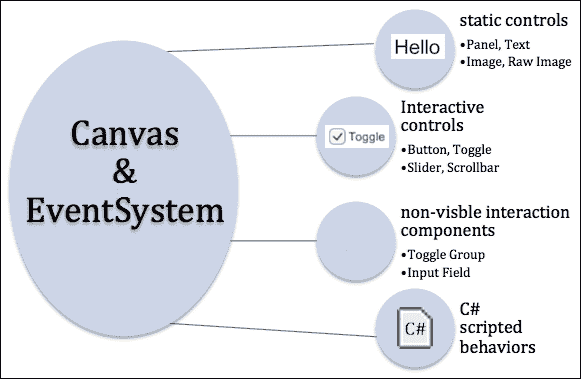

UI **矩形变换**表示一个矩形区域，而不是一个单独的点，这与场景 GameObject **变换**的情况不同。**矩形变换**描述了 UI 元素相对于其父元素应该如何定位和调整大小。**矩形变换**具有可以更改的宽度和高度，而不会影响组件的局部缩放。当对 UI 元素的**矩形变换**进行缩放时，这也会缩放切片图像上的字体大小和边框等。如果所有四个锚点都位于同一点，那么调整**画布**大小将不会拉伸**矩形变换**。它只会影响其位置。在这种情况下，我们将看到**X 位置**和**Y 位置**属性，以及矩形的**宽度**和**高度**。然而，如果锚点不在同一点，那么**画布**大小的调整将导致元素矩形的拉伸。因此，我们将看到**左**和**右**的值——矩形的水平边相对于**画布**边的位置，其中**宽度**将取决于实际的**画布**宽度（对于**上/下/高度**也是如此）。

Unity 提供了一套预设值用于旋转中心和锚点，使得最常见的值可以非常快速和容易地分配给元素的**矩形变换**。以下截图显示了 3 x 3 网格，它允许你快速选择左、右、上、下、中间、水平和垂直值。此外，右侧的额外列提供了水平拉伸预设，底部额外的行提供了垂直拉伸预设。使用*SHIFT*和*ALT*键在点击预设时设置旋转中心和锚点。

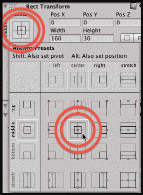

Unity 手册提供了对**矩形变换**的非常好的介绍。此外，Ray Wenderlich 的两个部分 Unity UI 网络教程也展示了**矩形变换**、旋转中心和锚点的概述。Wenderlich 教程的两个部分都很好地使用了动画 GIF 来展示旋转中心和锚点不同值的效应：

+   [Unity3D 官方文档 - UI 基本布局](http://docs.unity3d.com/Manual/UIBasicLayout.html)

+   [Unity 新 GUI 教程第一部分](http://www.raywenderlich.com/78675/unity-new-gui-part-1)

有三种**画布**渲染模式：

+   **屏幕空间 - 覆盖**：在此模式下，UI 元素显示时不参考任何摄像机（场景中不需要任何**摄像机**）。UI 元素在场景内容的任何类型的摄像机显示之前（覆盖）呈现。

+   **屏幕空间 - 摄像机**：在此模式下，**画布**被视为**摄像机**场景视锥体（观察空间）中的一个平面——其中此平面始终面向摄像机。因此，位于此平面之前的所有场景对象都将渲染在**画布**上的 UI 元素之前。如果屏幕大小、分辨率或摄像机设置发生变化，**画布**将自动调整大小。

+   **世界空间**：在此模式下，**画布**作为**摄像机**场景视锥体（观察空间）中的一个平面——但该平面不是始终面向**摄像机**。**画布**的显示方式与场景中的任何其他对象一样，相对于摄像机观察视锥体中（如果有的话）**画布**平面的位置和方向。

在本章中，我们专注于**屏幕空间 - 覆盖**模式。但所有这些配方同样可以用于其他两种模式。

发挥创意！本章旨在作为想法、技术和可重用**C#**脚本的发射台，用于您的项目。了解 Unity UI 元素的范畴，并尝试聪明地工作。通常，一个 UI 元素具有您可能需要的几乎所有组件，但您可能需要对其进行某种调整。一个例子可以在使 UI 滑块不可交互的配方中看到，而不是使用它来显示倒计时计时器的红色-绿色进度条。请参阅*使用 UI 滑块图形显示倒计时计时器*配方。

# 显示“Hello World”UI 文本消息

使用一种新的计算技术要解决的第一个传统问题通常是显示*Hello World*消息。在本配方中，你将学习如何创建一个简单的 UI Text 对象，其中包含此消息，以大号白色文本和选定的字体显示，并在屏幕中央。


## 准备工作

对于这个配方，我们在`1362_01_01`文件夹中的`Fonts`文件夹中准备了您需要的字体。

## 如何操作...

要显示**Hello World**文本消息，请按照以下步骤操作：

1.  创建一个新的 Unity 2D 项目。

1.  导入提供的`Fonts`文件夹。

1.  在**层次**面板中，将一个**UI** | **文本**GameObject 添加到场景中 - 选择菜单：**GameObject** | **UI** | **文本**。将此 GameObject 命名为**Text-hello**。

    ### 注意

    或者，使用位于**层次**标签下面的**创建**菜单，选择菜单：**创建** | **UI** | **文本**。

1.  确保在**层次结构**面板中选中您的新**Text-hello**GameObject。现在，在**检查器**中，确保以下属性已设置：

    +   **文本**设置为读取`Hello World`

    +   **字体**设置为`Xolonium-Bold`

    +   **字体大小**根据您的需求设置（大——这取决于您的屏幕——尝试`50`或`100`）

    +   **对齐**设置为水平和垂直居中

    +   **水平**和**垂直溢出**设置为`Overflow`

    +   **颜色**设置为白色

    以下截图显示了具有这些设置的**检查器**面板：

    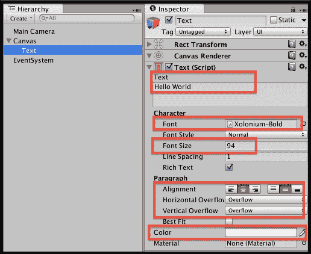

1.  现在，在**Rect Transform**中，单击**锚点预设**方框图标，这将导致出现几行几列的预设位置方块。按住*SHIFT*和*ALT*并单击中心一个（行**中间**和列**中心**）。

1.  您的**Hello World**文本现在将出现在**游戏**面板中，居中显示。

## 工作原理...

您已将一个新的**Text-hello**GameObject 添加到场景中。还会自动创建一个父**Canvas**和 UI **EventSystem**。

您设置文本内容和展示属性，并使用**Rect Transform**锚点预设来确保无论屏幕如何调整大小，文本都将保持水平和垂直居中。

## 更多内容...

这里有一些您不想错过的更多细节。

### 使用富文本样式子字符串

每个单独的 UI **文本**组件都可以有自己的颜色、大小、粗体样式等。然而，如果您希望快速向要显示给用户的字符串的一部分添加一些突出显示样式，以下是一些不需要创建单独 UI **文本**对象的 HTML 样式标记示例：

+   使用"`b`"标记加粗文本：`I am <b>bold</b>`

+   使用"`i`"标记斜体文本：`I am <i>italic</i>`

+   使用十六进制值或颜色名称设置文本颜色：`I am <color=green>green text</color>，但我现在是 <color=#FF0000>红色</color>`

    ### 注意

    在 Unity 在线手册的**富文本**页面了解更多信息：[`docs.unity3d.com/Manual/StyledText.html`](http://docs.unity3d.com/Manual/StyledText.html)。

# 显示数字时钟

不论是现实世界的时间，还是游戏中的倒计时时钟，许多游戏都通过某种形式的时钟或计时器显示得到了增强。要显示的最直接的时钟类型是由小时、分钟和秒的整数组成的字符串，这就是我们在本菜谱中要创建的内容。

以下截图显示了我们将在这个菜谱中创建的时钟类型：


## 准备中

对于这个菜谱，我们在`1362_01_01`文件夹中的`Fonts`文件夹中准备了您需要的字体。

## 如何操作...

要创建一个数字时钟，请按照以下步骤操作：

1.  创建一个新的 Unity 2D 项目。

1.  导入提供的`Fonts`文件夹。

1.  在**层次结构**面板中，将一个**UI** | **文本**游戏对象添加到场景中，命名为**Text-clock**。

1.  确保在**层次结构**面板中选择 GameObject **Text-clock**。现在，在**检查器**中，确保以下属性已设置：

    +   **文本**设置为读取为`time goes here`（此占位文本将在场景运行时被时间替换。）

    +   **字体类型**设置为`Xolonium Bold`

    +   **字体大小**设置为`20`

    +   **对齐**设置为水平和垂直居中

    +   **水平**和**垂直溢出**设置设置为**溢出**

    +   **颜色**设置为白色

1.  现在，在**矩形变换**中，单击**锚点预设**方图标，这将导致出现几行几列的预设位置方块。按住*SHIFT*和*ALT*，然后单击**顶部**和**列中心**行。

1.  创建一个名为`Scripts`的文件夹，并在该新文件夹中创建一个名为`ClockDigital`的 C#脚本类：

    ```cs
    using UnityEngine;
    using System.Collections;

    using UnityEngine.UI;
    using System;

    public class ClockDigital : MonoBehaviour {
      private Text textClock;

      void Start (){
        textClock = GetComponent<Text>();
      }

      void Update (){
        DateTime time = DateTime.Now;
        string hour = LeadingZero( time.Hour );
        string minute = LeadingZero( time.Minute );
        string second = LeadingZero( time.Second );

        textClock.text = hour + ":" + minute + ":" + second;
      }

      string LeadingZero (int n){
        return n.ToString().PadLeft(2, '0');
      }
    }
    ```

1.  在**层次结构**面板中选择 GameObject **Text-clock**，将您的`ClockDigital`脚本拖放到它上面，以将此脚本类的实例作为组件添加到 GameObject **Text-clock**中，如图所示：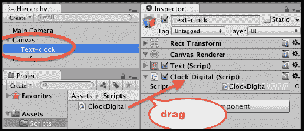

1.  当您运行场景时，您现在将看到一个数字时钟，显示在屏幕的顶部中央部分，显示小时、分钟和秒。

## 它是如何工作的...

您已将一个**文本**GameObject 添加到场景中。您已将该 GameObject 添加了`ClockDigital` C#脚本类的一个实例。

注意，除了默认为每个新脚本编写的标准两个 C#包（`UnityEngine`和`System.Collections`）之外，您还添加了两个额外的 C#脚本包的`using`语句，即`UnityEngine.UI`和`System`。UI 包是必需的，因为我们的代码使用了 UI `Text`对象；而`System`包也是必需的，因为它包含我们需要的`DateTime`类，以便访问运行游戏的计算机上的时钟。

有一个变量`textClock`，它将是一个对`Text`组件的引用，我们希望在每个帧中用当前的小时、分钟和秒更新其文本内容。

当场景开始时执行的`Start()`方法将`textClock`变量设置为对 GameObject 中`Text`组件的引用，该组件已添加到我们的脚本对象中。

### 注意

注意，另一种方法是将`textClock`设置为`public`变量。这将允许我们在**检查器**面板中通过拖放来分配它。

`Update()`方法在每一帧执行。当前时间存储在`time`变量中，并通过为变量`time`的小时、分钟和秒属性添加前导零来创建字符串。

此方法最终更新`text`属性（即用户看到的字母和数字）为字符串，通过冒号分隔符连接小时、分钟和秒。

`LeadingZero(…)`方法接受一个整数作为输入，并返回一个字符串，如果该值小于 10，则在左侧添加前导零。

## 还有更多...

有一些细节你不希望错过。

### Unity 教程：如何为模拟时钟动画

Unity 发布了一个关于如何创建 3D 对象并通过 C#脚本动画它们以显示模拟时钟的精彩教程，请参阅[`unity3d.com/learn/tutorials/modules/beginner/scripting/simple-clock`](https://unity3d.com/learn/tutorials/modules/beginner/scripting/simple-clock)。

# 显示数字倒计时计时器

这个食谱将向你展示如何显示这里所示的数字倒计时时钟：


## 准备工作

这个食谱是对之前的食谱的改编。因此，请复制之前食谱的项目，并在此基础上进行工作。

对于这个食谱，我们在`1362_01_03`文件夹下的`Scripts`文件夹中准备了你需要的脚本。

## 如何操作...

要创建一个数字倒计时计时器，请按照以下步骤操作：

1.  在**检查器**面板中，从 GameObject **Text-clock**中移除脚本组件`ClockDigital`。

1.  创建一个包含以下代码的`DigitalCountdown` C#脚本类，并将其作为脚本组件添加到 GameObject **Text-clock**中：

    ```cs
    using UnityEngine;
    using System.Collections;
    using UnityEngine.UI;
    using System;

    public class DigitalCountdown : MonoBehaviour {
      private Text textClock;

      private float countdownTimerDuration;
      private float countdownTimerStartTime;

      void Start (){
        textClock = GetComponent<Text>();
        CountdownTimerReset(30);
      }

      void Update (){
        // default - timer finished
        string timerMessage = "countdown has finished";
        int timeLeft = (int)CountdownTimerSecondsRemaining();

        if(timeLeft > 0)
          timerMessage = "Countdown seconds remaining = " + LeadingZero( timeLeft );

        textClock.text = timerMessage;
      }

      private void CountdownTimerReset (float delayInSeconds){
        countdownTimerDuration = delayInSeconds;
        countdownTimerStartTime = Time.time;
      }

      private float CountdownTimerSecondsRemaining (){
        float elapsedSeconds = Time.time - countdownTimerStartTime;
        float timeLeft = countdownTimerDuration - elapsedSeconds;
        return timeLeft;
      }

      private string LeadingZero (int n){
        return n.ToString().PadLeft(2, '0');
      }
    }
    ```

1.  当你运行场景时，你现在将看到一个从 30 开始的数字时钟倒计时。当倒计时达到零时，将显示消息**倒计时已完成**。

## 它是如何工作的...

你已经向场景中添加了一个**Text** GameObject。你已向该 GameObject 添加了`DigitalCountdown` C#脚本类的实例。

有一个变量`textClock`，它将是一个对`Text`组件的引用，我们希望在每个帧中用剩余时间消息（或计时器完成消息）更新其文本内容。然后调用`CountdownTimerReset(…)`方法，传递一个初始值为 30 秒的值。

`Start()`方法（在场景开始时执行）将`textClock`变量设置为在添加脚本对象的游戏对象中查找`Text`组件。

`Update()`方法在每一帧执行。该方法最初将`timerMessage`变量设置为一条消息，表明计时器已完成（默认要显示的消息）。然后检查剩余秒数是否大于零。如果是这样，则将消息变量的内容更改为显示倒计时剩余的整数（整个）秒数——从`CountdownTimerSecondsRemaining()`方法中检索。该方法最后更新`text`属性（即用户看到的字母和数字）为包含关于剩余秒数消息的字符串。

`CountdownTimerReset(…)`方法记录提供的秒数和调用该方法的时间。

`CountdownTimerSecondsRemaining()`方法返回剩余秒数的整数值。

# 创建一个渐隐的消息

有时，我们希望消息只显示一段时间，然后渐隐并消失，这将在下面的屏幕截图中显示：


## 准备工作

这个食谱改编了本章的第一个食谱，所以请复制那个项目来为这个食谱工作。

对于这个食谱，我们在`1362_01_04`文件夹中的`Scripts`文件夹里准备了一个你需要使用的脚本。

## 如何操作...

要显示渐隐的文本消息，请按照以下步骤操作：

1.  导入提供的名为`CountdownTimer`的 C#脚本类。

1.  确保在**层次结构**选项卡中选择 GameObject **Text-hello**。然后，将`CountdownTimer` C#脚本类的实例作为此 GameObject 的组件附加。

1.  创建一个包含以下代码的 C#脚本类`FadeAway`，并将其作为脚本组件添加到 GameObject **Text-hello**中：

    ```cs
    using UnityEngine;
    using System.Collections;
    using UnityEngine.UI;

    public class FadeAway : MonoBehaviour {
      private CountdownTimer countdownTimer;
      private Text textUI;
      private int fadeDuration = 5;
      private bool fading = false;

      void Start (){
        textUI = GetComponent<Text>();
        countdownTimer = GetComponent<CountdownTimer>();

        StartFading(fadeDuration);
      }

      void Update () {
        if(fading){
          float alphaRemaining = countdownTimer.GetProportionTimeRemaining();
          print (alphaRemaining);
          Color c = textUI.material.color;
          c.a = alphaRemaining;
          textUI.material.color = c;

          // stop fading when very small number
          if(alphaRemaining < 0.01)
            fading = false;
        }
      }

      public void StartFading (int timerTotal){
        countdownTimer.ResetTimer(timerTotal);
        fading = true;
      }
    }
    ```

1.  当你运行场景时，你现在会看到屏幕上的消息会慢慢渐隐，5 秒后消失。

## 工作原理...

将提供的`CountdownTimer`脚本类的实例添加为**Text-hello** GameObject 的组件。

你向 GameObject **Text-hello**添加了`FadeAway`脚本类的实例。`Start()`方法将`Text`和`CountdownTimer`组件的引用缓存到`countdownTimer`和`textUI`变量中。然后，它调用`StartFading(…)`方法，传入数字 5，这样消息将在 5 秒后变为不可见。

`StartFading(…)`方法启动这个计时器脚本组件，倒计时到指定的秒数。它还设置`fading`布尔标志变量为`true`。

`Update()`方法在每个帧中测试`fading`变量是否为`true`。如果是，则将**Text-hello**对象的颜色的 alpha（透明度）组件设置为介于 0.0 和 1.0 之间的值，基于`CountdownTimer`对象剩余时间的比例。最后，如果剩余时间的比例小于一个非常小的值（0.01），则将`fading`变量设置为`false`（以节省处理工作，因为文本现在不可见）。

# 显示透视 3D 文本消息

Unity 提供了一个通过`TextMesh`组件显示 3D 文本的替代方法。虽然这非常适合场景中的文本（如广告牌、路标以及通常在可能近距离看到的 3D 物体旁边的文字），但它创建起来很快，是创建有趣菜单或指令场景等的一种方式。

在这个食谱中，你将学习如何创建一个滚动的 3D 文字，模拟电影**星球大战**著名的开场字幕，看起来就像这样：

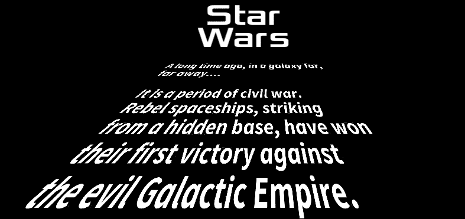

## 准备工作

对于这个食谱，我们在`1362_01_04`文件夹中的`Fonts`文件夹里准备了你需要使用的字体，以及`Text`文件夹里你需要使用的文本文件。

## 如何操作...

要显示透视 3D 文本，请按照以下步骤操作：

1.  创建一个新的 Unity 3D 项目（这确保我们从一个**透视**摄像机开始，适合我们想要创建的 3D 效果）。

    ### 注意

    如果你需要在项目中混合 2D 和 3D 场景，你总是可以通过**检查器**面板手动设置任何摄像机的**相机投影**属性为**透视**或**正交**。

1.  在**层次结构**面板中，选择**主摄像机**项，并在**检查器**面板中设置其属性如下：**相机清除标志**为**纯色**，**视野**为**150**。还将**背景颜色**设置为黑色。

1.  导入提供的`Fonts`文件夹。

1.  在**层次结构**面板中，将一个**UI** | **文本**游戏对象添加到场景中 - 选择菜单：**GameObject** | **UI** | **Text**。将此 GameObject 命名为`Text-star-wars`。将其**文本内容**设置为星球大战（每个单词占一行）。然后，将其**字体**设置为`Xolonium Bold`，其**字体大小**为`50`。使用**Rect Transform**中的预设锚点将此 UI **文本**对象定位在屏幕顶部中央。

1.  在**层次结构**面板中，将一个**3D 文本**游戏对象添加到场景中 - 选择菜单：**GameObject** | **3D Object** | **3D Text**。将此 GameObject 命名为`Text-crawler`。

1.  在**检查器**面板中，设置 GameObject **Text-crawler**的**变换**属性如下：**位置** (`0`, `-300`, `-20`), **旋转** (`15`, `0`, `0`)。

1.  在**检查器**面板中，将 GameObject **Text-crawler**的**文本网格**属性设置如下：

    +   将提供的文本文件`star_wars.txt`的内容粘贴到**文本**中。

    +   设置**偏移 Z** = `20`，**行间距** = `0.8`，和**锚点** = 中间中心

    +   设置**字体大小** = `200`，**字体** = `SourceSansPro-BoldIt`

1.  当场景运行时，星球大战的故事文本现在将很好地以 3D 透视形式出现在屏幕上。

## 它是如何工作的...

你已经模拟了电影《星球大战》的开场屏幕，屏幕顶部有一个平面的 UI **文本**对象标题，以及 3D **文本网格**，其设置看起来像是随着 3D 透视而消失在地平线上。

## 更多内容...

有一些细节你不应该错过。

### 我们必须让这段文字像电影中那样滚动

通过几行代码，我们可以让这段文字在水平方向上滚动，就像电影中那样。将以下 C#脚本类`ScrollZ`作为组件添加到 GameObject **Text-crawler**：

```cs
using UnityEngine;
using System.Collections;

public class ScrollZ : MonoBehaviour {
  public float scrollSpeed = 20;

  void Update () {
    Vector3 pos = transform.position;
    Vector3 localVectorUp = transform.TransformDirection(0,1,0);
    pos += localVectorUp * scrollSpeed * Time.deltaTime;
    transform.position = pos;
  }
}
```

在每一帧通过`Update()`方法，将 3D 文本对象的位置移动到该 GameObject 的局部向上方向。

### 更多信息在哪里

在 Unity 在线手册中了解更多关于 3D 文本和文本网格的信息，请访问[`docs.unity3d.com/Manual/class-TextMesh.html`](http://docs.unity3d.com/Manual/class-TextMesh.html)。

### 注意

注意：实现类似这种透视文本的另一种方法是将 Canvas 与世界空间渲染模式一起使用。

# 显示图像

有许多情况我们希望在屏幕上显示图像，包括标志、地图、图标、启动图形等。在这个菜谱中，我们将在屏幕顶部显示一个图像，并使其拉伸以适应屏幕调整后的任何宽度。

以下截图显示了 Unity 显示的图像：


## 准备工作

对于这个菜谱，我们在`1362_01_06`文件夹中的`Images`文件夹中准备了您需要的图像。

## 如何操作...

要显示拉伸的图像，请按照以下步骤操作：

1.  创建一个新的 Unity 3D 项目。

    ### 注意

    默认情况下，3D 项目将图像导入为**纹理**，2D 项目将图像导入为**精灵（2D 和 UI）**。由于我们将使用**原始图像**UI 组件，我们需要将图像导入为纹理。

1.  将游戏面板设置为 400 x 300 的大小。通过菜单：**编辑** | **项目设置** | **玩家**。确保**分辨率** | **默认为全屏**设置未勾选，宽度和高度设置为 400 x 300。然后，在**游戏**面板中，选择**独立（400 x 300）**。这将允许我们测试图像拉伸至 400 像素的宽度。

1.  导入提供的文件夹，该文件夹名为`Images`。在**检查器**选项卡中，确保`unity5_learn`图像的**纹理类型**设置为**纹理**。如果没有，则从下拉列表中选择**纹理**，并单击**应用**按钮。以下截图显示了带有**纹理**设置的**检查器**选项卡：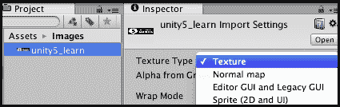

1.  在**层次结构**面板中，向场景添加一个名为**RawImage-unity5**的**UI** | **原始图像**游戏对象。

    ### 注意

    如果您希望**防止**图像的扭曲和拉伸，则使用 UI **精灵**游戏对象，并确保在**检查器**面板中其**图像（脚本）**组件中勾选**保留纵横比**选项。

1.  确保在**层次结构**面板中选择**RawImage-unity5**游戏对象。从您的**项目**文件夹（`Images`），将`unity5_learn`图像拖动到**原始图像（脚本）**公共属性**纹理**。单击**设置原生大小**按钮，在拉伸之前预览图像，如图所示：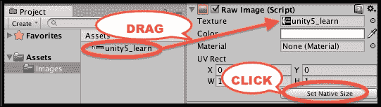

1.  现在，在**矩形变换**中，单击**锚点预设**方形图标，这将导致出现几行几列的预设位置方块。按住*SHIFT*和*ALT*，然后单击**顶部行**和**拉伸列**。

1.  现在图像将被整齐地放置在**游戏**面板的顶部，并拉伸至 400 像素的全宽。

## 工作原理...

您已确保图像的**纹理类型**设置为**纹理**。您已向场景添加了一个**UI 原始图像**控件。**原始图像**控件被设置为显示`unity5_learn`图像文件。

图像已定位在**游戏**面板的顶部，并使用锚点和预设的枢轴，使图像拉伸以填充整个宽度，我们通过**玩家**设置将其设置为 400 像素。

## 还有更多...

有一些细节你不希望错过：

### 与 Sprite 和 UI Image 组件一起工作

如果你只想显示非动画图像，那么**纹理**图像和 UI **RawImage**控件就是你的选择。然而，如果你想有更多关于如何显示图像的选项（例如平铺和动画），那么应该使用 UI **Sprite**控件。这个控件需要将图像文件导入为**Sprite（2D 和 UI）类型**。

一旦图像文件被拖动到 UI **Image**控件的**Sprite**属性中，将提供额外的属性，例如**图像类型**、保留宽高比等选项。

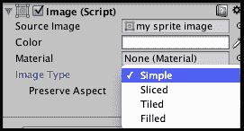

## 参见

在第二章中，*通过改变平铺图像的大小来显示多个对象拾取的图标*的配方中可以找到一个平铺 Sprite 图像的例子，*库存 GUI*。

# 创建 UI 按钮在场景间切换

除了玩家玩游戏时的场景，大多数游戏都会有菜单屏幕，这些屏幕向用户显示有关说明、高分、他们已经达到的水平等信息。Unity 提供了 UI **按钮**，以便用户可以轻松地在这些屏幕上表示他们的选择。

在这个配方中，我们将创建一个非常简单的游戏，包含两个屏幕，每个屏幕都有一个按钮来加载另一个屏幕，类似于以下截图：

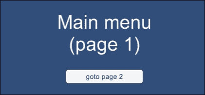

## 如何操作...

要创建一个按钮可导航的多场景游戏，请按照以下步骤操作：

1.  创建一个新的 Unity 2D 项目。

1.  保存当前（空）场景，命名为**page1**。

1.  在场景顶部中心位置添加一个 UI **文本**对象，包含文本`主菜单 / (page 1)`，字体大小较大。

1.  在屏幕中间中心位置添加一个 UI **按钮**。在**层次结构**面板中，点击显示子项三角形以显示此按钮 GameObject 的 UI **文本**子项。选择**文本**按钮子项 GameObject，并在**检查器**面板中，对于**文本（脚本）**组件的**文本**属性，输入按钮文本`goto page 2`，如图所示：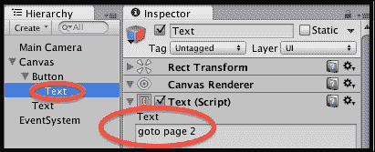

1.  将当前场景添加到构建中，选择菜单：**文件** | **构建设置…**。然后，点击**添加当前**按钮，使**page1**场景成为**构建中的场景**列表中的第一个场景。

    ### 注意

    我们不能告诉 Unity 加载尚未添加到构建场景列表中的场景。我们使用`Application.LoadLevel(…)`代码告诉 Unity 加载提供的场景名称（或数字索引）。

1.  创建一个包含以下代码的 C#脚本类`MenuActions`，并将其作为脚本组件添加到**主相机**：

    ```cs
    using UnityEngine;
    using System.Collections;

    public class MenuActions : MonoBehaviour {
      public void MENU_ACTION_GotoPage(string sceneName){
        Application.LoadLevel(sceneName);
      }
    }
    ```

1.  确保在**层次结构**中选择了**按钮**，然后在**Inspector 视图**中点击**按钮（脚本）**组件底部的加号“**+**”按钮，为该按钮创建一个新的**OnClick**事件处理器。

1.  将**主相机**从**层次结构**拖到**对象**槽中——位于说**仅运行时**的菜单下方。这意味着当**按钮**接收到**OnClick**事件时，我们可以从**主相机**内部的脚本对象中调用一个公共方法。

1.  现在，从**MenuActions**下拉列表中选择**MENU_ACTION_GotoPage()**方法（最初显示**No Function**）。在方法下拉菜单下面的文本框中输入`page2`（当此按钮被点击时我们想要加载的场景的名称）。当按钮接收到**OnClick**事件消息时，此**page2**字符串将被传递给方法，如图所示：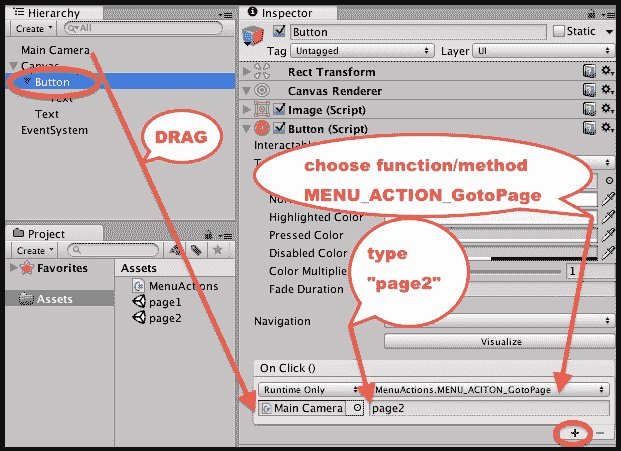

1.  保存当前场景，创建一个新的空场景，然后将这个新场景保存为**page2**。

1.  按照类似的步骤进行此场景。添加一个显示**Instructions / (page 2)**文本的**UI Text**游戏对象，字体大小要大。添加一个显示**goto page 1 text**的 UI **按钮**。

1.  将当前场景添加到构建中（因此现在，**page1**和**page2**都将列在构建中）。

1.  将`MenuActions`脚本类的一个实例添加到**主相机**。

1.  在**层次结构**面板中选择**按钮**，并添加一个**On Click**事件处理器，该处理器将传递字符串**page1**（当此按钮被点击时我们想要加载的场景的名称）给`MENU_ACTION_GotoPage()**方法。

1.  保存场景。

1.  当你运行**page1 场景**时，你会看到你的**主菜单**文本和一个按钮，当点击此按钮时，游戏将加载**page2 场景**。在场景**page2**中，你将有一个按钮可以带你回到**page1**。

## 它是如何工作的...

你已经创建了两个场景，并将它们都添加到了游戏构建中。每个场景都有一个按钮，当点击（当游戏正在播放时），Unity 将加载（命名）其他场景。这是可能的，因为当每个按钮被点击时，它会运行位于**主相机**内部的脚本`MenuActions`组件中的`MENU_ACTION_GotoPage(…)`方法。此方法输入要加载的场景的文本字符串名称，因此**page1 场景**中的按钮给出**page2**的字符串名称作为要加载的场景，反之亦然。

当一个 UI **按钮**被添加到**层次结构**面板时，一个子 UI **文本**对象也会自动创建，并且这个 UI **文本**子对象的**文本**属性内容是用户在按钮上看到的文本。

## 还有更多...

有些细节你不希望错过。

### 按钮鼠标悬停的视觉动画

有几种方式可以让我们在用户将鼠标光标移到按钮上时，从视觉上告知按钮是交互式的。最简单的是添加一个颜色渐变，当鼠标悬停在按钮上时会出现——这是默认的**Transition**。在**Hierarchy**中选择**Button**后，在**Inspector**选项卡中为**Button (Script)**组件的**Highlighted Color**属性选择一个渐变颜色（例如，红色），如图所示：

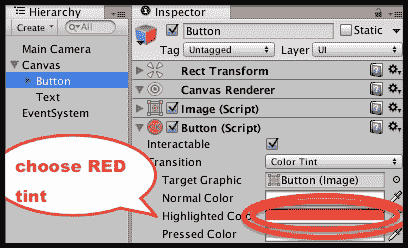

另一种通知用户按钮处于活动状态的可视**Transition**形式是**Sprite Swap**。在这种情况下，**Inspector**选项卡中提供了**Targeted**/**Highlighted**/**Pressed**/**Disabled**不同图像的属性。默认的**Targeted Graphic**是内置的 Unity **Button (image)** – 这是当 GameObject 按钮创建时的灰色圆角矩形默认值。将一个看起来非常不同的图像拖入**Highlighted Sprite**是一个有效的替代方案来设置颜色提示。我们为这个配方提供了项目中的`rainbow.png`图像，可用于**Button**鼠标悬停时的**Highlighted Sprite**。以下截图显示了具有这种彩虹背景图像的按钮：

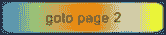

### 在鼠标悬停时动画化按钮属性

最后，可以为动态突出显示按钮给用户创建动画，例如，当鼠标悬停在按钮上时，按钮可能会变大，然后当鼠标指针移开时，它可能会缩小回原始大小。这些效果是通过为**Transition**属性的**Animation**选项选择，并创建一个具有**Normal**、**Highlighted**、**Pressed**和**Disabled**状态触发器的动画控制器来实现的。要为鼠标悬停时（高亮状态）的按钮动画放大，请执行以下操作：

1.  创建一个新的 Unity 2D 项目。

1.  创建一个按钮。

1.  在**Inspector Button (Script)**组件中，将**Transition**属性设置为**Animation**。

1.  点击**Button (Script)**组件中（位于**Disabled Trigger**属性下方）的**Auto Generate Animation**按钮，如图所示：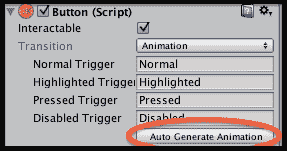

1.  通过命名为**button-animation-controller**保存新的控制器。

1.  确保在**Hierarchy**中选择了**Button**GameObject。然后，在**Animation**面板中，从下拉菜单中选择**Highlighted**剪辑，如图所示：

1.  在**Animation**面板中，点击红色的**record**圆形按钮，然后点击**Add Property**按钮，选择记录对**Rect Transform** | **Scale**属性的更改。

1.  将会创建两个关键帧，删除第二个在**1:00**（因为我们不希望有一个“弹跳”按钮），如下面的截图所示。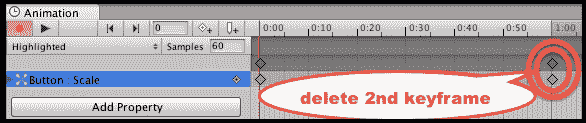

1.  选择**0:00**的第一个关键帧（现在只有一个！）然后，在**检查器**视图中，将**Rect Transform**组件的**X**和**Y**缩放属性设置为（`1.2`，`1.2`）。

1.  最后，再次点击红色**记录**圆形按钮以结束动画更改的录制。

1.  保存并运行你的场景，你会看到当鼠标悬停在按钮上时，按钮会平滑地放大，当鼠标移开时，它会平滑地恢复到原始大小。

以下网页提供了关于 UI 动画的视频和基于网页的教程：

+   Unity 按钮过渡教程可在以下位置找到：

    [Unity 3D 教程](http://unity3d.com/learn/tutorials/modules/beginner/ui/ui-transitions)

+   Ray Wenderlich 的教程（第二部分），包括按钮动画，可在以下位置找到：

    [Unity 新 GUI 教程第二部分](http://www.raywenderlich.com/79031/unity-new-gui-tutorial-part-2)

# 通过按钮在面板内组织图像并更改面板深度

Unity 提供了 UI **面板**，允许将 UI 控件分组并一起移动，并且还可以（如果需要）通过**图像**背景视觉分组。**兄弟深度**决定了哪些 UI 元素将出现在其他元素之上或之下。我们可以在**层次结构**中明确看到兄弟深度，因为**层次结构**中 UI GameObjects 的从上到下的顺序设置了兄弟深度。因此，第一个项目的深度为 1，第二个项目的深度为 2，依此类推。具有较大兄弟深度（在**层次结构**中更靠下）的 UI GameObjects 会出现在具有较小兄弟深度（在**层次结构**中更靠上）的 UI GameObjects 之上。

在这个菜谱中，我们将创建三个 UI 面板，每个面板显示不同的扑克牌图像。我们还将添加四个三角形排列按钮来更改显示顺序（移到底部，移到顶部，上移一个，下移一个）。

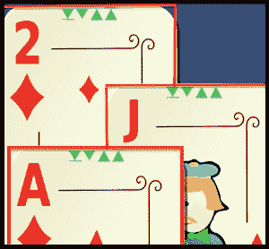

## 准备工作

对于这个菜谱，我们在 `1362_01_08` 文件夹中的 `Images` 文件夹中准备了所需的图像。

## 如何做到这一点...

要创建用户可以通过点击按钮更改层级的 UI **面板**，请按照以下步骤操作：

1.  创建一个新的 Unity 2D 项目。

1.  创建一个新的 UI **面板**，命名为 `Panel-jack-diamonds`。将其放置在屏幕中间部分，宽度为 200 像素，高度为 300 像素。取消选中此面板的**图像（脚本）**组件（因为我们不想看到面板的默认半透明灰色矩形背景图像）。

1.  创建一个新的 UI **图像**，并将此图像作为子项添加到 **Panel-jack-diamonds**。

1.  将**Panel-jack-diamonds**图像定位在中心中间，并调整其大小为 200 x 300。将**Jack-of-diamonds**扑克牌图像拖入**源图像**属性，用于**图像（脚本）**组件在**检查器**选项卡中。

1.  创建一个名为**Button-move-to-front**的 UI**按钮**。将此按钮作为子项添加到**Panel-jack-diamonds**。删除此按钮的**Text**子 GameObject（因为我们将使用图标来指示此按钮的功能）。

1.  将**Button-move-to-front**按钮的大小调整为 16 x 16，并将其定位在玩家卡片图像的顶部中心，以便在扑克牌的顶部可以看到它。将`icon_move_to_front`排列三角形图标图像拖入**源图像**属性，用于**图像（脚本）**组件，在**检查器**视图中。

1.  确保在**层级**中选择**Button-move-to-front**按钮。然后，在**检查器**视图中的**Button (Script)**组件底部点击加号（**+**）以为此按钮创建一个新的**OnClick**事件处理程序。

1.  将**Panel-jack-diamonds**从**层级**拖到**对象**槽位（位于说**仅限运行时**的菜单下方）。

1.  现在，从下拉函数列表中选择**RectTransform.SetAsLastSibling**方法（最初显示为**无函数**）。

    ### 注意

    这意味着当**按钮**接收到**OnClick**事件时，**Panel**的**RectTransform**将收到**SetAsLastSibling**消息——这将把**Panel**移到**Canvas**中 GameObject 的底部，因此将这个**Panel**移到**Canvas**中所有其他 GameObject 的前面。

    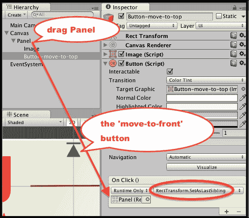

1.  重复*步骤 2*；创建一个带有移至最前按钮的第二个**面板**。将这个第二个面板命名为**Panel-2-diamonds**，然后将其移动并稍微向**Panel-jack-diamonds**的右侧定位，以便两个移至最前按钮都能被看到。

1.  保存你的场景并运行游戏。你将能够点击任意一张卡片上的“移至最前”按钮，将那张卡片的面板移至最前。如果你以未最大化的游戏面板运行游戏，你实际上会看到面板在**层级**中**Canvas**的子项列表中的顺序发生变化。

## 它是如何工作的...

你已经创建了两个 UI**面板**，每个面板都包含一张扑克牌的图片和一个按钮，该按钮的动作会使其父面板移至最前。按钮的动作说明了**OnClick**函数不必是调用对象脚本组件的公共方法，但它可以向目标 GameObject 的组件发送消息——在这个例子中，我们向**Panel**中的**RectTransform**发送了**SetAsLastSibling**消息。

## 还有更多...

有一些细节你不希望错过。

### 使用脚本方法仅通过上下移动一个位置

虽然 **Rect Transform** 提供了有用的 **SetAsLastSibling**（移动到前面）和 **SetAsFirstSibling**（移动到后面），以及 **SetSiblingIndex**（如果我们知道确切的位置），但在 **层次** 面板中并没有内置的方法来使元素上下移动，只有一个在 GameObject 序列中的单个位置。然而，我们可以用 C# 编写两个简单的方法来实现这一点，并且我们可以添加按钮来调用这些方法，从而提供对屏幕上 UI 控件从上到下排列的完全控制。要实现四个按钮（移动到前面/移动到后面/上移一个/下移一个），请执行以下操作：

1.  创建一个名为 `ArrangeActions` 的 C# 脚本类，包含以下代码，并将其作为脚本组件添加到每个 **面板** 上：

    ```cs
    using UnityEngine;
    using UnityEngine.UI;
    using UnityEngine.EventSystems;
    using System.Collections;

    public class ArrangeActions : MonoBehaviour {
      private RectTransform panelRectTransform;

      void Start(){
        panelRectTransform = GetComponent<RectTransform>();
      }

      public void MoveDownOne(){
        print ("(before change) " + GameObject.name +  " sibling index = " + panelRectTransform.GetSiblingIndex());

        int currentSiblingIndex = panelRectTransform.GetSiblingIndex();
        panelRectTransform.SetSiblingIndex( currentSiblingIndex - 1 );

        print ("(after change) " + GameObject.name +  " sibling index = " + panelRectTransform.GetSiblingIndex());
      }

      public void MoveUpOne(){
        print ("(before change) " + GameObject.name +  " sibling index = " + panelRectTransform.GetSiblingIndex());

        int currentSiblingIndex = panelRectTransform.GetSiblingIndex();
        panelRectTransform.SetSiblingIndex( currentSiblingIndex + 1 );

        print ("(after change) " + GameObject.name +  " sibling index = " + panelRectTransform.GetSiblingIndex());
      }
    }
    ```

1.  在每个卡片面板上添加第二个按钮，这次使用名为 `icon_move_to_front` 的排列三角形图标图像，并将这些按钮的 **OnClick** 事件函数设置为 **SetAsFirstSibling**。

1.  在每个卡片面板上添加两个带有上下三角形图标图像的按钮：`icon_down_one` 和 `icon_up_one`。将下移一个按钮的 **OnClick** 事件处理函数设置为调用 `MoveDownOne()` 方法，并将上移一个按钮的函数设置为调用 `MoveUpOne()` 方法。

1.  复制一个面板以创建第三个卡片（这次显示方块 A）。排列三个卡片，以便至少可以看到两张卡片的所有四个按钮，即使这些卡片在底部（参见本食谱开头的截图）。

1.  保存场景并运行你的游戏。现在你将完全控制三个卡片面板的分层。

# 显示交互式 UI 滑块的值

本示例说明如何创建一个交互式 UI **滑块**，并在用户更改 **滑块值** 时执行 C# 方法。


## 如何操作...

要创建一个 UI 滑块并在屏幕上显示其值，请按照以下步骤操作：

1.  创建一个新的 2D 项目。

1.  在场景中添加一个 UI 文本 GameObject，字体大小为 `30`，占位文本为 `slider value here`（当场景开始时，此文本将被滑块值替换）。

1.  在 **层次** 面板中，将一个 **UI** | **滑块** 游戏对象添加到场景中——选择菜单：**GameObject** | **UI** | **滑块**。

1.  在 **检查器** 选项卡中，修改 **Rect Transform** 的设置以将滑块放置在屏幕的顶部中间部分，并将文本放置在其下方。

1.  在 **检查器** 选项卡中，将滑块的 **最小值** 设置为 `0`，**最大值** 设置为 `20`，并勾选 **整数** 复选框，如图所示：

1.  创建一个名为 `SliderValueToText` 的 C# 脚本类，包含以下代码，并将其作为脚本组件添加到名为 **Text** 的 GameObject 上：

    ```cs
    using UnityEngine;
    using System.Collections;
    using UnityEngine.UI;

    public class SliderValueToText : MonoBehaviour {
      public Slider sliderUI;
      private Text textSliderValue;

      void Start (){
        textSliderValue = GetComponent<Text>();
        ShowSliderValue();
      }

      public void ShowSliderValue () {
        string sliderMessage = "Slider value = " + sliderUI.value;
        textSliderValue.text = sliderMessage;
      }
    }
    ```

1.  确保在**层次结构**中选择了**文本**GameObject。然后，在**检查器**视图中，将**滑块**GameObject 拖动到`Slider Value To Text (Script)`脚本组件的公共**Slider UI**变量槽中，如图所示：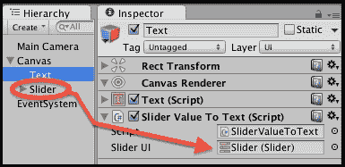

1.  确保在**层次结构**中选择了**滑块**GameObject。然后，在**检查器**视图中，将**文本**GameObject 拖动到**滑块（脚本）**脚本组件的公共**None (Object)**槽中，位于**On Value Changed (Single)**部分。

    ### 注意

    你现在已经告诉 Unity 每次滑块改变时应该向哪个对象发送消息。

    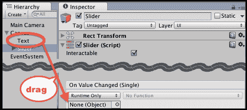

1.  从下拉菜单中选择**SliderValueToText**和`ShowSliderValue()`方法，如图所示。这意味着每次滑块更新时，脚本对象中的`ShowSliderValue()`方法，在 GameObject **文本**中将被执行。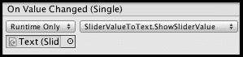

1.  当你运行场景时，你现在会看到一个滑块。在其下方，你会看到一个`Slider value = <n>`形式的文本消息。

1.  每次移动滑块时，显示的文本值将（几乎）立即更新。值应从`0`（滑块的左侧）到`20`（滑块的右侧）。

    ### 注意

    屏幕上文本值的更新可能不会立即发生，就像滑块值移动时发生的那样，因为滑块在决定需要触发**On Value Changed**事件消息时涉及一些计算，然后查找已注册为该事件处理程序的对象的任何方法。然后，需要按顺序执行对象方法中的语句。然而，这一切都应该在几毫秒内完成，并且应该足够快，以便为用户界面操作如改变和移动此滑块提供令人满意的响应性 UI。

## 工作原理...

你已经为**文本**GameObject 添加了`SliderValueToText`类的脚本实例。

当场景首次运行时，会执行`Start()`方法，将变量设置为对**滑块**项内**文本**组件的引用。接下来，会调用`ShowSliderValue()`方法，以确保场景开始时显示正确（显示初始滑块值）。

这包含`ShowSliderValue()`方法，它获取滑块的值。它更新显示的文本，使其成为以下形式的消息：`Slider value = <n>`。

你创建了一个**UI 滑块**GameObject，并将其设置为 0-20 范围内的整数。

你已经将`SliderValueToText`脚本组件的`ShowSliderValue()`方法添加到**UI 滑块**GameObject 的**On Value Changed**事件监听器列表中。因此，每次滑块值改变时，它会发送一个消息来调用`ShowSliderValue()`方法，因此新的值会在屏幕上更新。

# 使用 UI 滑块图形显示倒计时器

有许多情况，我们希望通知玩家剩余时间的比例，或在某个时间点的某些值完成时，例如，加载进度条，剩余时间或健康与起始最大值的比较，玩家从青春之泉中填充了多少水壶，等等。在此配方中，我们将说明如何移除**UI 滑块**的交互式'手柄'，并更改其组件的大小和颜色，以便我们有一个易于使用的通用进度/比例条。在此配方中，我们将使用修改后的滑块以图形方式向用户展示倒计时器剩余的时间。

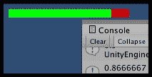

## 准备工作

此配方基于之前的配方进行修改。因此，请复制之前配方中的项目，并在此基础上工作以遵循此配方。

对于此配方，我们在`1362_01_10`文件夹中的`Scripts`和`Images`文件夹中准备了所需的脚本和图像。

## 如何操作...

要创建一个带有图形显示的数字倒计时器，请按照以下步骤操作：

1.  删除**文本**GameObject。

1.  将`CountdownTimer`脚本和`red_square`、`green_square`图像导入到项目中。

1.  确保在**层次结构**标签中选择了**滑块**GameObject。

1.  禁用**手柄滑动区域**子 GameObject（通过取消选中它）

1.  你会在**游戏**面板中看到“拖动圆圈”消失（用户不会拖动滑块，因为我们希望这个滑块仅用于显示），如下面的截图所示：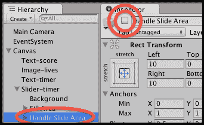

1.  选择**背景**子项：

    +   将`red_square`图像拖动到**图像（脚本）组件**的**源图像**属性中，该组件位于**检查器**视图中

1.  选择**填充**子项：

    +   将`green_square`图像拖动到**图像（脚本）组件**的**源图像**属性中，该组件位于**检查器**标签页

1.  选择**填充区域**子项：

    +   在**矩形变换**组件中，使用**锚点**预设位置为**左中**

    +   将**宽度**设置为 155，将**高度**设置为 12，如图所示：

    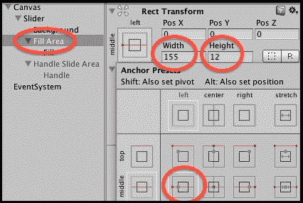

1.  确保在**层次结构**中选择了**滑块**GameObject。然后，将名为`CountdownTimer`的 C#脚本类实例作为组件附加到此 GameObject。

1.  创建一个名为`SliderTimerDisplay`的 C#脚本类，包含以下代码，并将其作为脚本组件添加到**滑块**GameObject 中：

    ```cs
    using UnityEngine;
    using System.Collections;
    using UnityEngine.UI;

    public class SliderTimerDisplay : MonoBehaviour {
      private CountdownTimer countdownTimer;
      private Slider sliderUI;
      private int startSeconds = 30;

      void Start (){
        SetupSlider();
        SetupTimer();
      }

      void Update () {
        sliderUI.value = countdownTimer.GetProportionTimeRemaining();
        print (countdownTimer.GetProportionTimeRemaining());
      }

      private void SetupSlider (){
        sliderUI = GetComponent<Slider>();
        sliderUI.minValue = 0;
        sliderUI.maxValue = 1;
        sliderUI.wholeNumbers = false;
      }

      private void SetupTimer (){
        countdownTimer = GetComponent<CountdownTimer>();
        countdownTimer.ResetTimer(startSeconds);
      }
    }
    ```

1.  运行你的游戏，你会看到滑块每秒移动，逐渐显示更多的红色背景，以此表示剩余时间。

## 工作原理...

你隐藏了**Handle Slide Area**子组件，使得**Slider**仅用于显示，用户无法与之交互。**Slider**的**背景**颜色设置为红色，因此，随着计数器的下降，越来越多的红色被揭示——警告用户时间正在流逝。**Slider**的**填充**设置为绿色，以便剩余的比例以绿色显示（绿色越多，滑块/计时器的值就越大）。

将提供的`CountdownTimer`脚本类的一个实例添加为滑块的组件。`ResetTimer(…)`方法记录提供的秒数和方法被调用的时间。`GetProportionRemaining()`方法返回一个 0.0-1.0 之间的值，表示剩余秒数的比例（1.0 代表所有秒数，0.5 代表一半秒数，0.0 表示没有剩余秒数）。

你在**Slider**GameObject 中添加了`SliderTimerDisplay`脚本类的一个实例。`Start()`方法调用`SetupSlider()`和`SetupTimer()`方法。

`SetupSlider()`方法将`sliderUI`变量设置为对**Slider**组件的引用，并设置此滑块映射到 0.0 和 1.0 之间的浮点（小数）值。

`SetupTimer()`方法将`countdownTimer`变量设置为**CountdownTimer**组件的引用，并启动此计时器脚本组件从 30 秒开始倒计时。

在每一帧中，`Update()`方法将滑块值设置为从运行计时器中调用`GetProportionRemaining()`方法返回的浮点数。

### 注意

**尽可能在 0.0-1.0 之间使用浮点数。**

整数也可以使用，将滑块的最低值设置为 0，最高值设置为 30（代表 30 秒）。然而，改变总秒数时，也需要相应地更改滑块的设置。在大多数情况下，使用 0.0 到 1.0 之间的浮点比例是更通用和可重用的方法。

# 显示雷达以指示物体的相对位置

雷达显示其他物体相对于玩家的位置，通常基于圆形显示，其中中心代表玩家，每个图形“亮点”表示物体距离玩家有多远以及相对方向。复杂的雷达显示将以不同颜色或形状的“亮点”图标显示不同类别的物体。

在屏幕截图中，我们可以看到 2 个红色的正方形“亮点”，指示玩家附近的 2 个标记为`Cube`的红色立方体 GameObject 的相对位置，以及一个黄色的圆形“亮点”指示标记为`Sphere`的黄色球体 GameObject 的相对位置。绿色的圆形雷达背景图像给人一种飞机控制塔雷达或类似的感觉。

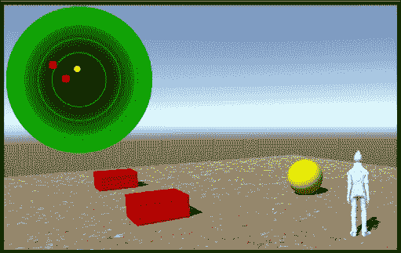

## 准备工作

对于这个食谱，我们在`1362_01_11`目录下的`Images`文件夹中准备了所需的图像。

## 如何操作...

要创建一个雷达以显示对象的相对位置，请按照以下步骤操作：

1.  通过导入以下标准资产创建一个新的 3D 项目：

    +   **环境**

    +   **角色**

    +   **相机**

1.  通过导航到**创建** | **3D 对象** | **地形**菜单创建地形。

1.  将地形设置为 20 x 20，放置在(-10, 0, -10)的位置——这样其中心就在(0, 0, 0)，如图所示：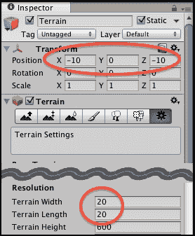

1.  使用**SandAlbedo**选项对地形进行纹理绘制，如图所示：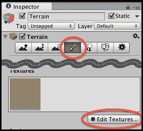

1.  从**项目**面板中的**标准资产**文件夹，将预制件**ThirdPersonController**拖动到场景中，并将其放置在(0, 1, 0)的位置。

1.  标记名为**Player**的**ThirdPersonController** GameObject。

1.  删除**主相机** GameObject。

1.  从**项目**面板中的**标准资产**文件夹，将预制件**Multi-PurposeCameraRig**拖动到场景中。

1.  在**层次**面板中选择**Multi-PurposeCameraRig**，将**ThirdPersonController** GameObject 拖动到**检查器**选项卡中**Auto Cam (Script)**公共变量的**目标**属性中，如图所示：

1.  导入提供的名为`Images`的文件夹。

1.  在**层次**面板中，将名为**RawImage-radar**的**UI** | **原始图像** GameObject 添加到场景中。

1.  确保在**层次**面板中选择了**RawImage-radar** GameObject。从你的**项目** `Images` 文件夹中，将 `radarBackground` 图像拖动到**原始图像（脚本）**公共属性**纹理**中。

1.  现在，使用**锚点预设**项将**Rect Transform**中的**RawImage-radar**放置在左上角。然后设置宽度和高度为 200 像素。

1.  创建另一个新的 UI **原始图像**，命名为**RawImage-blip**。分配 `yellowCircleBlackBorder` 纹理。标记**Blip** GameObject。

1.  在**项目**面板中，创建一个名为**blip-sphere**的新空预制件，并将**RawImage-blip** GameObject 拖动到这个预制件中以存储所有其属性。

1.  现在，将**RawImage-blip**的纹理更改为`redSquareBlackBorder`。

1.  在**项目**面板中，创建一个名为**blip-cube**的新空预制件，并将**RawImage-blip** GameObject 拖动到这个预制件中以存储所有其属性。

1.  从**层次**面板中删除**RawImage-blip** GameObject。

1.  创建一个名为`Radar`的 C#脚本类，包含以下代码，并将其作为脚本组件添加到**RawImage-radar** GameObject 中：

    ```cs
    using UnityEngine;
    using System.Collections;
    using UnityEngine.UI;

    public class Radar : MonoBehaviour{
      public float insideRadarDistance = 20;
      public float blipSizePercentage = 5;

      public GameObject rawImageBlipCube;
      public GameObject rawImageBlipSphere;

      private RawImage rawImageRadarBackground;
      private Transform playerTransform;
      private float radarWidth;
      private float radarHeight;
      private float blipHeight;
      private float blipWidth;

      void Start (){
        playerTransform = GameObject.FindGameObjectWithTag("Player").transform;
        rawImageRadarBackground = GetComponent<RawImage>();

        radarWidth = rawImageRadarBackground.rectTransform.rect.width;
        radarHeight = rawImageRadarBackground.rectTransform.rect.height;

        blipHeight = radarHeight * blipSizePercentage/100;
        blipWidth = radarWidth * blipSizePercentage/100;
      }

      void Update (){
        RemoveAllBlips();
        FindAndDisplayBlipsForTag("Cube", rawImageBlipCube);
        FindAndDisplayBlipsForTag("Sphere", rawImageBlipSphere);
      }

      private void FindAndDisplayBlipsForTag(string tag, GameObject prefabBlip){
        Vector3 playerPos = playerTransform.position;
        GameObject[] targets = GameObject.FindGameObjectsWithTag(tag);

        foreach (GameObject target in targets) {
          Vector3 targetPos = target.transform.position;
          float distanceToTarget = Vector3.Distance(targetPos, playerPos);
          if( (distanceToTarget <= insideRadarDistance) ){
            Vector3 normalisedTargetPosiiton = NormalisedPosition(playerPos, targetPos);
            Vector2 blipPosition = CalculateBlipPosition(normalisedTargetPosiiton);
            DrawBlip(blipPosition, prefabBlip);
          }
        }
      }

      private void RemoveAllBlips(){
        GameObject[] blips = GameObject.FindGameObjectsWithTag("Blip");
        foreach (GameObject blip in blips)
          Destroy(blip);
      }

      private Vector3 NormalisedPosition(Vector3 playerPos, Vector3 targetPos){
      float normalisedyTargetX = (targetPos.x - playerPos.x)/insideRadarDistance;
        float normalisedyTargetZ = (targetPos.z - playerPos.z)/insideRadarDistance;
        return new Vector3(normalisedyTargetX, 0, normalisedyTargetZ);
      }

      private Vector2 CalculateBlipPosition(Vector3 targetPos){
        // find angle from player to target
        float angleToTarget = Mathf.Atan2(targetPos.x, targetPos.z) * Mathf.Rad2Deg;

        // direction player facing
        float anglePlayer = playerTransform.eulerAngles.y;

        // subtract player angle, to get relative angle to object
        // subtract 90
        // (so 0 degrees (same direction as player) is UP)
        float angleRadarDegrees =  angleToTarget - anglePlayer - 90;

        // calculate (x,y) position given angle and distance
        float normalisedDistanceToTarget = targetPos.magnitude;
        float angleRadians = angleRadarDegrees * Mathf.Deg2Rad;
        float blipX = normalisedDistanceToTarget * Mathf.Cos(angleRadians);
        float blipY = normalisedDistanceToTarget * Mathf.Sin(angleRadians);

        // scale blip position according to radar size
        blipX *= radarWidth/2;
        blipY *= radarHeight/2;

        // offset blip position relative to radar center
        blipX += radarWidth/2;
        blipY += radarHeight/2;

        return new Vector2(blipX, blipY);
      }

      private void DrawBlip(Vector2 pos, GameObject blipPrefab){
        GameObject blipGO = (GameObject)Instantiate(blipPrefab);
        blipGO.transform.SetParent(transform.parent);
        RectTransform rt = blipGO.GetComponent<RectTransform>();
        rt.SetInsetAndSizeFromParentEdge(RectTransform.Edge.Left, pos.x, blipWidth);
        rt.SetInsetAndSizeFromParentEdge(RectTransform.Edge.Top, pos.y, blipHeight);
      }
    }
    ```

1.  创建两个标记为**Cube**的立方体，使用名为**icon32_square_red**的红色图像进行纹理处理。将每个立方体放置在玩家角色的远离位置。

1.  创建一个标记为**Sphere**的球体，使用名为**icon32_square_yellow**的红色图像进行纹理处理。将这个球体放置在立方体和玩家角色的远离位置。

1.  运行你的游戏。你将在雷达上看到两个红色方块和一个黄色圆圈，显示红色立方体和黄色球体的相对位置。如果你移动得太远，那么这些标记将会消失。

    ### 注意

    这个雷达脚本扫描玩家周围 360 度的所有区域，并且只考虑 X-Z 平面的直线距离。因此，这个雷达中的距离不受玩家和目标 GameObject 之间任何高度差异的影响。该脚本可以被修改以忽略高度超过玩家高度阈值的目标。此外，正如所展示的，这个雷达配方*可以看到*一切，即使玩家和目标之间存在障碍。该配方可以通过使用射线投射技术来扩展，以不显示被遮挡的目标。有关射线投射的更多详细信息，请参阅 Unity 脚本参考[`docs.unity3d.com/ScriptReference/Physics.Raycast.html`](http://docs.unity3d.com/ScriptReference/Physics.Raycast.html)。

## 它是如何工作的...

在屏幕上显示雷达背景。这个圆形图像的中心代表玩家角色的位置。你已经创建了两个预制体；一个用于代表雷达距离内找到的每个红色立方体的红色方形图像，另一个用于代表黄色球体的黄色圆形 GameObject。

`Radar` C# 脚本类已被添加到雷达 UI Image GameObject 中。这个类定义了四个公共变量：

+   `insideRadarDistance`：此值定义了一个对象可能离玩家的最大距离，仍然可以包含在雷达上（距离超过此距离的对象将不会在雷达上显示）。

+   `blipSizePercentage`：这个公共变量允许开发者决定每个'标记'的大小，作为雷达图像的比例。

+   `rawImageBlipCube` 和 `rawImageBlipSphere`：这些是对要用于在雷达上视觉表示立方体和球体相对距离和位置的预制 UI **RawImages** 的引用。

由于这个配方中的代码有很多操作，每个方法将在自己的部分中进行描述。

### Start() 方法

`Start()` 方法缓存了玩家角色（标记为 **Player**）的 **Transform** 组件的引用。这允许脚本对象知道玩家角色在每个帧中的位置。接下来，缓存雷达图像的宽度和高度——因此，可以根据这个背景雷达图像的大小计算'标记'的相对位置。最后，使用 `blipSizePercentage` 公共变量计算每个标记的大小（宽度和高度）。

### Update() 方法

`Update()` 方法调用 `RemoveAllBlips()` 方法，该方法移除任何可能当前显示的立方体和球体的旧 **RawImage** UI GameObjects。

接下来，调用`FindAndDisplayBlipsForTag(…)`方法两次。首先，为了在雷达上用`rawImageBlipCube`预制体表示的标签为**Cube**的对象，然后再次为标签为**Sphere**的对象，用`rawImageBlipSphere`预制体在雷达上表示。正如你所预期的那样，雷达的大部分工作将由`FindAndDisplayBlipsForTag(…)`方法来完成。

### `FindAndDisplayBlipsForTag(…)`方法

此方法输入两个参数：要搜索的对象的字符串标签；以及要在雷达上显示的**RawImage**预制体的引用，用于任何此类标签对象在范围内。

首先，从缓存的玩家变换变量中检索玩家角色的当前位置。接下来，构建一个数组，引用场景中所有具有提供标签的 GameObject。这个 GameObject 数组被遍历，并对每个 GameObject 执行以下操作：

+   获取目标 GameObject 的位置

+   计算从目标位置到玩家位置的距离，如果这个距离在范围内（小于或等于`insideRadarDistance`），那么现在需要三个步骤来使此对象的 blip 出现在雷达上：

    +   通过调用`NormalisedPosition(…)`计算目标的标准化位置

    +   然后通过调用`CalculateBlipPosition(…)`从这个标准化位置计算出雷达上 blip 的位置

    +   最后，通过调用`DrawBlip(…)`并传递 blip 位置以及要创建的**RawImage**预制体的引用来显示**RawImage** blip

### `NormalisedPosition(…)`方法

`NormalisedPosition(…)`方法输入玩家的角色位置和目标 GameObject 的位置。它的目标是输出目标相对于玩家的相对位置，返回一个包含*X*、*Y*和*Z*值的 Vector3 对象。请注意，由于雷达是 2D 的，我们忽略目标 GameObject 的*Y*值。因此，此方法返回的 Vector3 对象的*Y*值始终为 0。例如，如果目标与玩家位于完全相同的位置，返回的*X*、*Y*、*Z* Vector3 对象将是(0, 0, 0)。

由于我们知道目标 GameObject 距离玩家角色不超过`insideRadarDistance`，我们可以通过找到每个轴上从目标到玩家的距离，然后除以`insideRadarDistance`来计算*X*和*Z*轴的-1…0…+1 范围内的值。*X*值为-1 表示目标完全在玩家的左侧（距离等于`insideRadarDistance`），+1 表示它完全在右侧。0 值表示目标具有与玩家角色相同的*X*位置。同样，对于*Z 轴*的-1…0…+1 值（这个轴表示一个物体在我们前方或后方有多远，这将在我们的雷达中映射到垂直轴）。

最后，这个方法构建并返回一个新的 Vector3 对象，包含计算出的*X*和*Z*归一化值，以及*Y*值为零。

### 注意

**归一化位置**

一个*归一化*的值是指以某种方式简化过的值，因此上下文已经被抽象化。在这个菜谱中，我们感兴趣的是对象相对于玩家的位置。因此，我们的常规做法是获取目标在-1 到+1 范围内的每个轴的*X*和*Z*位置值。由于我们只考虑`insideRadarDistance`值内的 GameObject，我们可以直接将这些归一化的目标位置映射到 UI 中雷达图像的位置。

### `CalculateBlipPosition(…)`方法

首先，我们计算`angleToTarget`：从(0, 0, 0)到我们的归一化目标位置的角度。

接下来，我们计算`anglePlayer`：玩家角色面向的角度。这个菜谱使用了旋转的**偏航**角度，这是围绕*Y 轴*的旋转——也就是说，角色控制器面向的方向。这可以在 GameObject 的 transform 组件的`eulerAngles`组件的*Y*分量中找到。你可以想象从上方向下看角色控制器，看看他们面向的方向——这正是我们试图用指南针图形显示的内容。

我们期望的雷达角度（`angleRadarDegrees`变量）是通过从目标与玩家之间的角度中减去玩家的方向角度来计算的，因为雷达显示的是玩家面向的方向与目标对象之间的相对角度。在数学上，零角度表示*东方*方向。为了纠正这一点，我们还需要从角度中减去 90 度。

角度随后被转换为弧度，因为这是 Unity 三角函数方法所必需的。然后我们将`Sin()`和`Cos()`的结果乘以我们的归一化距离，分别计算出*X*和*Y*值（见下图）：


我们最终的定位值需要以像素长度表示，相对于雷达的中心。因此，我们将 `blipX` 和 `blipY` 值乘以雷达宽度的一半和高度的一半；注意我们只乘以宽度的一半，因为这些值是相对于雷达中心的。

### 注意

注意：在此图中，alpha 是玩家与目标对象之间的角度，'a' 是邻边，'h' 是斜边，'o' 是对边。

然后，我们将雷达图像宽度的一半和高度的一半添加到 `blipX`/`Y` 值中。因此，这些值现在是相对于中心的定位。

最后创建了一个新的 **Vector2** 对象并返回，传递回这些最终计算出的 *X* 和 *Y* 像素值，用于我们 blip 图标的定位。

### `DrawBlip()` 方法

`DrawBlip()` 方法接受 blip 定位（作为一个 `Vector2` *X*，*Y* 对）的输入参数，以及要在雷达上该位置创建的 **RawImage** 预制件的引用。

从预制件创建一个新的 GameObject，并将其作为父对象添加到雷达 GameObject（其中脚本对象也是一个组件）。检索到为 'blip' 创建的新 **RawImage** GameObject 的 **Rect Transform** 引用。调用 Unity **RectTransform** 方法 `SetInsetAndSizeFromParentEdge(…)`，结果是将 blip GameObject 定位在雷达图像上提供的水平和垂直位置，无论背景雷达图像在 **游戏** 面板中的位置如何。

# 使用 Fungus 开源对话框系统创建 UI

而不是每次都从头开始构建自己的 UI 和交互，Unity 中有很多 UI 和对话框系统可供选择。一个强大、免费且开源的对话框系统叫做 **Fungus**，它使用可视流程图方法进行对话框设计。

在这个菜谱中，我们将创建一个非常简单的、两句话的对话，以说明 Fungus 的基本原理。以下截图显示了 Fungus 生成的第一句话（'**你好，你好吗**'）和用户点击以进入下一部分对话的交互按钮（一个圆圈内的三角形）（位于矩形的右下角）。


## 如何操作...

要使用 Fungus 创建两句话的对话，请按照以下步骤操作：

1.  从 FungusGames 网站下载 Fungus 的最新版本 **unitypackage** [`www.fungusgames.com/`](http://www.fungusgames.com/)。

1.  创建一个新的 Unity 2D 项目。

1.  通过导航到 **资产** | **导入包** | **自定义包...** 导入 Fungus **unitypackage**，然后导航到您下载的文件位置。

1.  通过选择菜单：**工具** | **Fungus** | **创建** | **流程图**来创建一个新的 Fungus **流程图**GameObject。

1.  通过选择菜单：**工具** | **Fungus** | **流程图窗口**来显示和停靠 Fungus **流程图**窗口面板。

1.  在**流程图窗口**中会有一个块。点击此块以选择它（块周围出现绿色边框以指示已选择），然后在**检查器**面板中，将此块的名字改为**Start**，如图所示：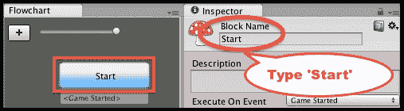

1.  流程图中的每个**块**都遵循一系列命令。因此，我们现在将创建一系列命令，以便在游戏运行时向用户显示两句话。

    ### 注意

    **块**中的**命令**序列

    流程图中的每个**块**都遵循一系列**命令**，所以当游戏运行时向用户显示两句话，我们需要在**检查器**面板的**块**属性中创建两个**说**命令的序列。

1.  确保在**流程图**面板中仍然选择了**Start**块。现在，点击**检查器**面板底部部分的加号**+**按钮以显示**命令**菜单，并选择**叙事**|**说**命令，如图所示：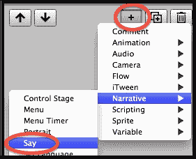

1.  由于我们只为这个块有一个命令，因此该命令将自动在**检查器**视图的上半部分选中（高亮绿色）。**检查器**视图的下半部分显示当前选定的**命令**的属性，如图所示。在**检查器**视图的下半部分，对于**故事文本**属性，输入你想展示给用户的文本：`你今天怎么样？`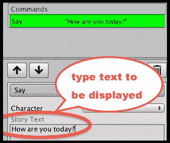

1.  现在，创建另一个**说命令**，并在其**故事文本**属性中输入以下内容：`非常好，谢谢。`

1.  当你运行游戏时，用户首先会看到**你今天怎么样？**的文本（随着每个字母在屏幕上**输入**时，会听到点击声）。在用户点击对话框窗口右下角的'继续'三角形按钮后，他们将会看到第二句话：**非常好，谢谢**。

## 它是如何工作的...

你已经创建了一个新的 Unity 项目，并导入了 Fungus 资产包，其中包含 Fungus Unity 菜单、窗口和命令，以及示例项目。

你已经将一个名为**Start**的单个**Fungus 流程图**添加到场景中。当游戏开始时，你的块开始执行（因为第一个块的默认行为是在接收到**游戏开始**事件时执行）。

在**Start**块中，你添加了一系列两个**说命令**。每个命令向用户展示一句话，然后等待用户点击继续按钮，然后再进行到下一个**命令**。

如所示，Fungus 系统处理创建一个用户界面良好的面板的工作，显示所需的文本和继续按钮。Fungus 提供许多其他功能，包括菜单、动画、声音和音乐的控件等，更多详细信息可以通过探索他们提供的示例项目和网站找到：

+   [`fungusgames.com/`](http://fungusgames.com/)

+   [`github.com/FungusGames/Fungus`](https://github.com/FungusGames/Fungus)

# 设置自定义鼠标光标图像

光标图标通常用于指示可以使用鼠标进行的交互性质。例如，缩放可能通过放大镜来表示。另一方面，射击通常由一个风格化的靶子表示。在本教程中，我们将学习如何实现自定义鼠标光标图标，以更好地说明您的游戏玩法——或者只是逃离 Windows、OSX 和 Linux 的默认 GUI。以下截图显示了当用户的鼠标指针悬停在**按钮**上时，自定义放大镜鼠标光标：

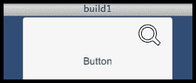

## 准备工作

对于这个教程，我们在`1362_01_13`文件夹中的`IconsCursors`文件夹中准备了您需要的图像。

## 如何操作...

要在鼠标悬停在 GameObject 上时显示自定义光标，请按照以下步骤操作：

1.  创建一个新的 Unity 2D 项目。

1.  通过导航到**创建** | **灯光** | **方向光**，向场景中添加一个**方向光**项目。

1.  向场景中添加一个缩放为(5, 5, 5)的 3D**Cube**。由于它是一个 2D 项目创建的，立方体将在**游戏**面板中显示为一个灰色正方形（2D 项目具有正交相机，因此我们不会看到透视效果）。

1.  导入名为`IconsCursors`的提供文件夹。

    ### 小贴士

    确保这个文件夹中的每个图像都已导入为**纹理类型光标**。如果不是，则为每个图像选择此类型，并在**检查器**视图中单击**应用**按钮。

1.  创建一个名为`CustomCursorPointer`的 C#脚本类，包含以下代码，并将其作为脚本组件添加到**Cube**GameObject 实例中：

    ```cs
    using UnityEngine;
    using System.Collections;

    public class CustomCursorPointer : MonoBehaviour {
      public Texture2D cursorTexture2D;

      private CursorMode cursorMode = CursorMode.Auto;
      private Vector2 hotSpot = Vector2.zero;

      public void OnMouseEnter() {
        SetCustomCursor(cursorTexture2D);
      }

      public void OnMouseExit() {
        SetCustomCursor(null);
      }

      private void SetCustomCursor(Texture2D curText){
        Cursor.SetCursor(curText, hotSpot, cursorMode);
      }
    }
    ```

    ### 注意

    故事方法`OnMouseEnter()`和`OnMouseExit()`已被故意声明为`public`。这将允许这些方法在它们接收到`OnPointerEnterExit`事件时也能从 UI GameObject 中被调用。

1.  在**层次**面板中选择**Cube**项目，将`CursorTarget`图像拖动到**检查器**面板中**Customer Cursor Pointer (Script)**组件的公共**Cursor Texture 2D**变量槽中。

1.  保存当前场景，并将其添加到**构建**中。

    ### 小贴士

    您在 Unity 编辑器中看不到自定义光标。您必须构建您的游戏应用程序，当您运行构建的应用程序时，您将看到自定义光标。

1.  构建您的项目。现在，运行您构建的应用程序，当鼠标指针移动到**Cube**的灰色正方形上时，它将更改为您选择的自定义`CursorTarget`图像。

## 它是如何工作的...

您已将一个脚本对象添加到一个立方体上，这将告诉 Unity 在接收到**OnMouseEnter**消息时更改鼠标指针——也就是说，当用户的鼠标指针移动到正在渲染立方体的屏幕部分时。当接收到**OnMouseExit**事件（用户的鼠标指针不再位于屏幕的立方体部分）时，系统会被告知返回到操作系统默认光标。此事件应在用户鼠标从碰撞器退出后的几毫秒内接收到。

## 还有更多...

有些细节您不容错过。

### 鼠标悬停在 UI 控件上的自定义光标

Unity 5 UI 控件不接收**OnMouseEnter**和**OnMouseExit**事件。它们可以响应**PointerEnter/Exit**事件，但这需要添加**事件触发器**组件。要更改鼠标指针在鼠标悬停在 UI 元素上时，请执行以下操作：

1.  将一个 UI**按钮**添加到场景中。

1.  将名为`CustomCursorPointer`的 C#脚本类的一个实例添加到按钮中。

1.  在**层次结构面板**中选择**按钮**，将`CursorZoom`图像拖放到**检查器**面板中**Customer Cursor Pointer (Script)**组件的公共**Cursor Texture 2D**变量槽中。

1.  在**检查器**视图中，将一个**事件触发器**组件添加到**按钮**上。选择菜单：**添加组件** | **事件** | **事件触发器**。

1.  在您的**事件触发器**组件中添加一个**指针进入**事件，点击加号（**+**）按钮以添加事件处理器槽，并将**按钮**游戏对象拖放到**对象**槽中。

1.  从**函数**下拉菜单中选择**CustomCursorPointer**，然后选择**OnMouseEnter**方法。

    ### 注意

    我们已添加一个事件处理器，以便当**按钮**接收到**指针进入**（鼠标悬停）事件时，它将执行**按钮**内部**CustomCursorPointer**脚本对象的**OnMouseEnter()**方法。

1.  在您的**事件触发器**组件中添加一个**指针退出**事件，并在接收到此事件时调用**CustomCursorPointer**中的`OnMouseExit()`方法。

1.  保存当前场景。

1.  构建您的项目。现在，运行您构建的应用程序，当鼠标指针移动到**按钮**上时，它将更改为您选择的自定义`CursorZoom`图像。

# 文本输入字段组件

虽然很多时候我们只想向用户显示非交互式文本消息，但有时（如输入高分时的名字）我们希望用户能够将文本或数字输入到我们的游戏中。Unity 提供了**输入字段**UI 组件来实现此目的。在本配方中，我们将通过使用默认按钮图像和文本游戏对象来创建一个简单的文本输入 UI，并将添加一个脚本以响应输入字段的每个新值。

### 注意

当然，您可以通过选择菜单：**创建 | UI | 输入字段**来更快地创建一个工作的文本输入，这将创建一个包含输入字段组件、子文本和占位符游戏对象的 GameObject，如图下截图所示。然而，通过遵循本食谱中的步骤，您将了解不同界面元素之间的相互关系，因为您将手动从 UI 按钮游戏对象的拆解部分创建这些连接。

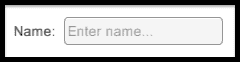

## 如何操作...

要为用户创建一个带有淡色占位符文本的推广文本输入框，请按照以下步骤操作：

1.  创建一个新的 Unity 2D 项目。

1.  在**检查器**视图中，将**主摄像机**的背景更改为纯白色。

1.  向场景中添加一个**UI 按钮**。删除**按钮**GameObject 的**按钮（脚本）**组件（因为它将不是一个按钮，在我们完成它的时候，它将是一个交互式文本输入！）。

1.  将**按钮**组件的**文本**子 GameObject 重命名为**文本占位符**。取消选择**富文本**选项，将文本更改为**输入名称…**，在**左**和**顶**中更改**对齐**，并在**矩形变换**中设置**左**为`4`和**顶**为`7`。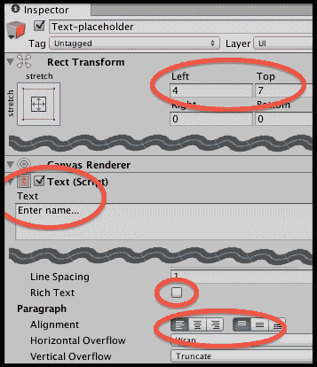

1.  通过命名副本为**文本提示**来复制**文本占位符**。将此 GameObject 的**文本**更改为**名称**，并将其**左**位置设置为`-50`。

1.  再次复制**文本占位符**，将新副本命名为**文本输入**。删除此新 GameObject 的**文本**属性中的所有内容。

1.  在**层次结构**中选择**文本占位符**，现在我们将占位符文本设置为大部分透明。将此 GameObject 的**文本（脚本）**组件的**A（alpha）颜色**值设置为最大值的约四分之一（例如，64）。

1.  在**层次结构**中选择**文本输入**，并通过选择菜单：**添加组件** | **UI** | **输入字段**来添加一个**输入字段**组件。

1.  将**文本输入**GameObject 拖动到**输入字段**的**文本组件**属性中，并将**文本占位符**GameObject 拖动到**占位符**属性中。

1.  保存并运行您的场景。现在您有一个为用户工作的文本输入 UI。当没有文本内容时，将显示淡色占位符文本。一旦输入了任何字符，占位符将被隐藏，输入的字符将以黑色文本显示。然后，如果删除所有字符，占位符将再次出现。

## 它是如何工作的...

Unity 中交互式文本输入的核心责任在于 **Input Field** 组件。这需要一个对 UI **Text** GameObject 的引用。为了更容易地看到可以输入文本的位置，我们使用了 Unity 在创建 **Button** GameObject 时提供的默认圆角矩形图像。**Buttons** 具有图像组件和 **Text** 子 GameObject。因此，通过创建一个新的 **Button** 并简单地移除 **Button (Script)** 组件，我们可以非常容易地获得所需的两个项目。

通常涉及三个 **Text** GameObject 与用户文本输入相关：静态提示文本（例如，在我们的配方中，**Name:** 文本）；然后是微弱的占位符文本，提醒用户在哪里以及应该输入什么；最后是实际显示给用户的文本对象（具有字体和颜色设置等），显示用户输入的字符。

在运行时，会创建一个 **Text-Input Input Caret** GameObject——显示闪烁的垂直线以告知用户下一个字母将被输入的位置。请注意，在 **Inspector** 中的 **Input Field (Script)** 的 **Content Type** 可以设置为几种特定的文本输入类型，包括电子邮件地址、仅整数或小数，或密码文本（每个输入字符都会显示一个星号）。

## 还有更多...

有一些细节你不希望错过。

### 执行 C# 方法以响应用户更改输入文本内容

除非我们能检索到用户输入的文本以用于游戏逻辑，否则屏幕上的交互式文本并没有太大的用处，我们可能还需要知道每次用户更改文本内容时的情况，并据此采取行动。

要添加代码和事件以响应用户每次更改文本内容的情况，请执行以下操作：

1.  将名为 `DisplayChangedTextContent` 的 C# 脚本类实例添加到 **Text-input** GameObject 中：

    ```cs
    using UnityEngine;
    using System.Collections;
    using UnityEngine.UI;

    public class DisplayChangedTextContent : MonoBehaviour {
      private InputField inputField;

      void Start(){
        inputField = GetComponent<InputField>();
      }

      public void PrintNewValue (){
        string msg = "new content = '" + inputField.text + "'";
        print (msg);
    }
    }
    ```

1.  将 **End Edit (String)** 事件添加到 **Input Field (Script)** 组件的事件处理程序列表中。点击加号 (**+**) 按钮以添加事件处理程序槽位，并将 **Text-input** GameObject 拖动到 **Object** 槽位中。

1.  从 **Function** 下拉菜单中选择 **DisplayChangedTextContent**，然后选择 **PrintNewValue** 方法。

1.  保存并运行场景。每次用户输入新文本然后按下 *Tab* 或 *Enter* 键时，**End Edit** 事件将被触发，你将看到我们的脚本在 **Console** 窗口中打印出新的内容文本消息，如下面的截图所示：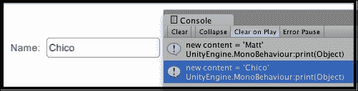

# 通过 Toggle Groups 使用开关和单选按钮

用户做出选择，通常这些选择要么是两个可用选项之一（例如，声音开或关），有时则是从几个可能性中选择一个（例如，难度级别简单/中等/困难）。Unity UI **Toggle**允许用户开启或关闭选项；当与**Toggle Groups**结合使用时，它们将选择限制在项目组中的一个。在本食谱中，我们将首先探索基本的**Toggle**，以及一个响应值变化的脚本。然后在*更多内容*部分，我们将扩展示例以说明**Toggle Groups**，并使用圆形图像进行样式化，使其看起来更像传统的单选按钮。

以下截图显示了当场景运行时，按钮状态变化在**控制台**面板中的记录情况：

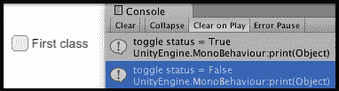

## 准备工作

对于这个食谱，我们在`1362_01_15`文件夹中的`UI Demo Textures`文件夹中准备了你需要使用的图像。

## 如何操作...

要向用户显示开/关 UI Toggle，请按照以下步骤操作：

1.  创建一个新的 Unity 2D 项目。

1.  在**检查器**面板中，将**主摄像机**的**背景**颜色更改为白色。

1.  将**UI Toggle**添加到场景中。

1.  将**Toggle** GameObject 的**Label**子 GameObject 的**文本**设置为`First Class`。

1.  将名为`ToggleChangeManager`的 C#脚本类实例添加到**Toggle** GameObject 中：

    ```cs
    using UnityEngine;
    using System.Collections;
    using UnityEngine.UI;

    public class ToggleChangeManager : MonoBehaviour {
      private Toggle toggle;

      void Start () {
        toggle = GetComponent<Toggle>();	
      }

      public void PrintNewToggleValue(){
        bool status = toggle.isOn;
        print ("toggle status = " + status);
      }
    }
    ```

1.  选择**Toggle** GameObject 后，将**On Value Changed**事件添加到**Toggle (Script)**组件的事件处理器列表中，点击加号（+）按钮添加事件处理器槽位，并将**Toggle**拖入**对象**槽位。

1.  从**功能**下拉菜单中选择**ToggleChangeManager**，然后选择**PrintNewToggleValue**方法。

1.  保存并运行场景。每次检查或取消检查**Toggle** GameObject 时，**On Value Changed**事件都会触发，你将看到我们的脚本在控制台窗口中打印出新的布尔值（true/false）的文本消息。

## 工作原理...

当你创建一个 Unity UI **Toggle** GameObject 时，它将自动包含几个子 GameObject——**背景**、**勾选标记**和文本**标签**。除非我们需要以特殊方式样式化**Toggle**的外观，否则只需要简单地编辑文本**标签**，以便用户知道这个**Toggle**将要开启/关闭哪个选项或功能。

被称为`ToggleChangeManager`的 C#脚本类的方法`Start()`获取位于脚本实例所在游戏对象的**Toggle**组件的引用。当游戏运行时，每次用户点击**Toggle**以更改其值时，都会触发一个**On Value Changed**事件。我们随后注册`PrintNewToggleValue()`方法，该方法将在此类事件发生时执行。此方法检索，然后打印到**Console**面板的**Toggle**的新布尔值（真/假）。

## 还有更多...

有些细节你不应该错过。

### 添加更多 Toggle 和一个 Toggle Group 以实现互斥单选按钮

Unity UI **Toggle**也是基础组件，如果我们希望以单选按钮的风格实现一组互斥选项，可以这样做：

1.  将`UI Demo Textures`文件夹导入到项目中。

1.  从**Toggle**游戏对象中移除 C#脚本类`ToggleChangeManager`组件。

1.  将**Toggle**游戏对象重命名为**Toggle-easy**。

1.  将**Label**文本更改为**Easy**，并给这个游戏对象添加一个名为**Easy**的新标签。

1.  选择**Toggle-easy**的**Background**子游戏对象，在**Image (Script)**组件中，将`UIToggleBG`图像拖动到**Source Image**属性。

1.  确保**Toggle (Script)**组件的**Is On**属性被勾选，然后选择**Toggle-easy**的**Checkmark**子游戏对象。在**Image (Script)**组件中，将`UIToggleButton`图像拖动到**Source Image**属性。

    ### 注意

    在我们提供给用户的三个选项（简单、中等和困难）中，我们将简单选项设置为默认选中项。因此，我们需要将其**Is On**属性勾选，这将导致其“勾选”图像显示。

    为了使这些**Toggle**看起来更像单选按钮，每个的背景都设置为`UIToggleBG`的圆形图像，而勾选标记（显示开启的**Toggle**）则填充了名为`UIToggleButton`的圆形图像。

1.  复制**Toggle-easy**游戏对象，将副本命名为**Toggle-medium**。将其**Rect Transform**属性的**Pos Y**设置为`-25`（这样副本就会位于简单选项下方），并取消勾选**Toggle (Script)**组件的**Is On**属性。给这个副本添加一个名为**Medium**的新标签。

1.  复制**Toggle-medium**游戏对象，将副本命名为**Toggle-hard**。将其**Rect Transform**属性的**Pos Y**设置为`-50`（这样副本就会位于中等选项下方）。给这个副本添加一个名为**Hard**的新标签。

1.  将名为`RadioButtonManager`的 C#脚本类实例添加到**Canvas**游戏对象：

    ```cs
    using UnityEngine;
    using System.Collections;
    using UnityEngine.UI;

    public class RadioButtonManager : MonoBehaviour {
      private string currentDifficulty = "Easy";

      public void PrintNewGroupValue(Toggle sender){
        // only take notice from Toggle just swtiched to On
        if(sender.isOn){
          currentDifficulty = sender.tag;
          print ("option changed to = " + currentDifficulty);
        }
      }
    }
    ```

1.  在选择**Toggle-easy** GameObject 后，将**On Value Changed**事件添加到**Toggle (Script)**组件的事件处理器列表中。点击加号（**+**）按钮添加事件处理器槽，并将**Canvas** GameObject 拖入对象槽中。

1.  从**功能**下拉菜单中选择**RadioButtonManager**，然后选择**PrintNewGroupValue**方法。在**Toggle**参数槽中，最初为`None (Toggle)`，拖入**Toggle-easy** GameObject。

1.  对**Toggle-medium**和**Toggle-hard** GameObject 执行相同的操作——这样每个**Toggle**对象都会调用**Canvas** GameObject 中名为`RadioButtonManager`的 C#脚本组件的`PrintNewGroupValue(…)`方法，并将自身作为参数传递。

1.  保存并运行场景。每次您检查三个单选按钮中的任何一个时，**On Value Changed**事件都会触发，您会看到我们的脚本在**控制台**窗口中打印出一条新的文本消息，指出刚刚设置为 true（**开启**）的**Toggle**（单选按钮）的标签。

1.  以下截图显示了当场景运行时，对应于所选单选按钮的值如何记录到**控制台**面板中：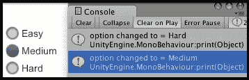

# 结论

在本章中，我们介绍了各种 Unity 5 UI 组件的食谱，并说明了相同的组件可以以不同的方式使用（例如，使用交互式滑块来显示倒计时计时器的状态）。许多游戏中的一组 UI 组件是那些向用户传达他们所携带的内容（或尚未拾取的内容）的组件。我们在本书中专门用另一章介绍了第二章中的库存，*库存 GUI*，它提供了许多库存食谱和额外的 UI 控件，例如添加交互式滚动条。

这里有一些进一步阅读、教程和资源的建议，以帮助您继续在 Unity 中学习 UI 开发：

+   在[`docs.unity3d.com/Manual/UISystem.html`](http://docs.unity3d.com/Manual/UISystem.html)的手册页面上了解更多关于 Unity UI 的信息。

+   在[`unity3d.com/learn/tutorials/topics/user-interface-ui`](https://unity3d.com/learn/tutorials/topics/user-interface-ui)上观看 Unity UI 教程视频。

+   Ray Wenderlich 关于 Unity UI 开发的优秀教程，请访问[`www.raywenderlich.com/78675/unity-new-gui-part-1`](http://www.raywenderlich.com/78675/unity-new-gui-part-1)。

+   Unity 关于为多分辨率设计 UI 的文档页面：[`docs.unity3d.com/Manual/HOWTO-UIMultiResolution.html`](http://docs.unity3d.com/Manual/HOWTO-UIMultiResolution.html)。

游戏需要与游戏玩法和主题相匹配的字体。以下是一些适合许多游戏的免费个人/商业字体的来源：

+   FontSquirrel 上的所有字体均可 100%免费用于商业用途。它们可在[`www.fontsquirrel.com/`](http://www.fontsquirrel.com/)找到。

+   在 DaFont 网站上查看每个字体的单独许可。如果用于商业目的，许多人会要求捐赠。更多信息，请查看[`www.dafont.com/xolonium.font`](http://www.dafont.com/xolonium.font)。

+   在[`naldzgraphics.net/textures/`](http://naldzgraphics.net/textures/)的 Naldz Graphics 博客上查看每个字体的单独许可。

+   1001 Free Fonts (for personal use) are available at [`www.1001freefonts.com/index.php`](http://www.1001freefonts.com/index.php).
