# 第四章：创建地图和材质

在本章中，我们将涵盖以下主题：

+   使用标准着色器（镜面设置）创建基本材质

+   将基本材质从镜面设置调整为金属

+   将法线图应用于材质

+   将透明度和发射地图添加到材质中

+   鼠标悬停时突出显示材质

+   将细节地图添加到材质中

+   渐变材质的透明度

+   在场景内播放视频

# 简介

Unity 5 引入了新的**基于物理的着色器**。基于物理的渲染是一种技术，它根据光线与材质（更具体地说，材质由其制成的**物质**）在现实世界中的反应来模拟材质的外观。这种技术可以实现更真实和一致的材质。因此，您在 Unity 中的创作应该比以往任何时候都要好。在 Unity 中创建材质也变得更加高效。一旦您在可用的工作流程（**金属**或**镜面设置**；我们稍后会回到这一点）之间做出选择，就不再需要浏览下拉菜单以查找特定功能，因为 Unity 会为创建的材质优化着色器，一旦材质设置完成并且纹理图已分配，就会删除未使用的属性的冗余代码。

对于对基于物理的渲染的深入了解，我们建议您查看由 Allegorithmic 的 Wes McDermott 撰写的《全面 PBR 指南》，可在[`www.allegorithmic.com/pbr-guide`](http://www.allegorithmic.com/pbr-guide)免费获取两卷。Allegorithmic 的指南包含有关 PBR 理论和技术的宝贵信息，是本章的基本参考。我们还推荐您查看由 Renaldas Zioma（Unity）、Erland Körner（Unity）和 Wes McDermott（Allegorithmic）合著的《Unity 5 精通基于物理的着色》，可在[`www.slideshare.net/RenaldasZioma/unite2014-mastering-physically-based-shading-in-unity-5`](http://www.slideshare.net/RenaldasZioma/unite2014-mastering-physically-based-shading-in-unity-5)找到。

另一个资源是 Aras Pranckevičius（Unity）所著的《Unity 中的基于物理的着色》，可在[`aras-p.info/texts/files/201403-GDC_UnityPhysicallyBasedShading_notes.pdf`](http://aras-p.info/texts/files/201403-GDC_UnityPhysicallyBasedShading_notes.pdf)找到。

## 创建和保存纹理图

材质的可视方面可以通过使用纹理进行修改。为了创建和编辑图像文件，您需要一个图像编辑器，例如 Adobe Photoshop（行业标准，并且其原生格式由 Unity 支持），GIMP 等。为了遵循本章中的食谱，强烈建议您能够访问这些软件中的一两件。

当保存纹理图时，尤其是带有 Alpha 通道的纹理图，你可能需要选择一个合适的文件格式。**PSD**，Photoshop 的本地格式，对于保留多层原始艺术品来说非常实用。PNG 格式也是一个很好的选择，但请注意，Photoshop 不会独立于透明度处理 PNG 的 Alpha 通道，这可能会影响材质的外观。此外，PNG 文件不支持图层。对于本章，我们将经常使用 TIF 格式，主要有三个原因：(a) 它对不使用 Photoshop 的用户开放；(b) 它使用图层；(c) 它保留了 Alpha 通道信息。文件大小显著大于 PSD 和 PNG，所以如果你有 Photoshop，可以随意保存你的工作为 PSD 格式；如果你不需要图层，或者在使用 Photoshop 时不需要 Alpha 通道，可以保存为 PNG 格式。

最后，一些建议——虽然我们可以通过使用传统的图像编辑软件手动创建材质的纹理图，但新的工具，如 Allegorthmic 的 Substance Painter 和 Bitmap2Material，使这项工作变得更加高效、完整和直观，补充了传统的纹理制作过程，甚至完全取代了它——类似于 zBrush 和 Mudbox 对 3D 建模所做的那样。对于设计专业人士，我们强烈建议至少尝试这样的工具。然而，请注意，Allegorithmic 的产品不会使用 Unity 的标准着色器，而是依赖于**substance**文件（这些文件由 Unity 原生支持）。

## 整体情况

要理解新的标准着色器，了解工作流程、它们的属性以及它们如何影响材质的外观是很好的主意。然而，有许多可能的方法可以与材质一起工作——例如，纹理图要求可能从引擎到引擎，或从一种工具到另一种工具而有所不同。目前，Unity 支持两种不同的工作流程：一种基于镜面，另一种基于金属值。尽管两种工作流程具有相似的性质（如法线、高度、遮挡和发射），但它们在设置漫反射颜色和反射特性方面有所不同。

### 镜面工作流程

Unity 的标准着色器（镜面设置）使用 Albedo 和 Specular/Smoothness 图，将它们结合起来创建材质的一些特性——主要是其颜色和反射特性。以下展示了 Albedo 和 Smoothness 图之间的区别：

+   **反照率**: 这是指材料的漫反射颜色。简单来说，这就是你通常描述材料外观的方式（英国的国旗是红、白、蓝；法拉利的标志是一个黑色马匹在黄色背景上；一些太阳镜的镜片是半透明的渐变，等等）。然而，这种描述可能会误导。纯金属物体（如铝、铬、金等）的漫反射颜色应该是黑色。我们感知到的颜色实际上来源于它们的镜面通道。另一方面，非金属物体（如塑料、木材，甚至是涂漆或生锈的金属）确实具有非常明显的漫反射颜色。Albedo 属性纹理图具有 RGB 通道用于颜色，以及（可选）用于透明度的 Alpha 通道。

+   **镜面/光滑度**: 这指的是材料的亮度。纹理图使用 RGB 通道表示镜面颜色（提供色调和强度信息），以及 Alpha 通道表示光滑度/光泽（暗值用于较不光滑的表面和模糊的反射；亮/白色值用于光滑、镜面般的外观）。重要的是要注意，非金属物体具有中性、非常暗的镜面颜色（例如，对于塑料，你应该使用大约 59 的灰色值）。另一方面，金属物体具有非常亮的值，并且在色调上也有点黄色。

为了说明这些概念，我们创建了一个电池对象（如下所示），具有磨砂金属盖和塑料外壳。观察每个纹理图如何贡献最终结果：

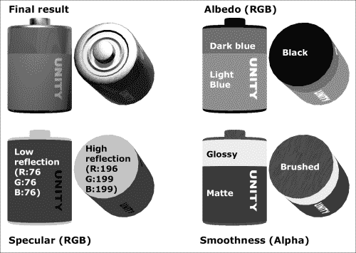

### 金属工作流程

Unity 的默认标准着色器将 Albedo 和 Metallic/Glossiness 纹理图结合以创建材料的颜色和反射特性。以下是一些区别：

+   **反照率**: 与镜面工作流程一样，这是材料的漫反射颜色；你如何描述材料。然而，金属工作流程的反照率纹理图应该以略不同于镜面工作流程的方式配置。这次，金属材料的感知漫反射颜色（铁为灰色，金色为黄色/橙色等）必须出现在反照率纹理图中。同样，反照率纹理图具有 RGB 通道用于颜色，以及（可选）用于透明度的 Alpha 通道。

+   **金属/光滑度**: 这指的是材料看起来有多金属。金属纹理图使用红色通道表示金属值（非金属为黑色，未涂漆或未生锈的金属为白色）和 Alpha 通道表示光滑度（与镜面工作流程类似）。请注意，金属纹理图不包含任何关于色调的信息，在这些情况下，金属光泽的黄色性质应该应用于反照率纹理图中。

要使用金属工作流程重现说明镜面工作流程的电池，需要按照以下方式重新创建纹理：

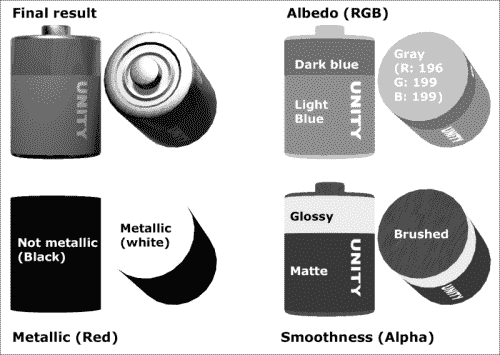

### 注意

你可能已经注意到我们使用了白色来传达金属物体。技术上，由于只有红色通道相关，我们也可以使用红色（R: 255, G: 0, B: 0）、黄色（R: 255, G: 255, B: 0）或任何具有 255 红色值的颜色。

### 其他材质属性

值得注意的是，Unity 的标准着色器支持其他图，例如：

+   **法线图（Normal maps）**：法线图将详细的凹凸效果添加到材质中，模拟更复杂的几何形状。例如，电池正极（顶部）节点上的内部环在 3D 对象的几何形状中未建模，而是通过一个简单的法线图创建的。

+   **遮挡图（Occlusion maps）**：使用灰度图来模拟在环境光下的物体暗部区域。通常，它用于强调关节、褶皱和其他几何形状的细节。

+   **高度图（Height maps）**：这些图添加了一个位移效果，给人一种深度感，而不需要复杂的几何形状。

+   **发射图（Emission maps）**：这些图增加了材质发出的颜色，就像自发光一样，例如荧光表面或液晶显示屏。发射图的纹理具有 RGB 通道用于颜色。

### Unity 样本和文档

在开始之前，阅读 Unity 关于纹理的文档可能是个好主意。它可以在网上找到，地址是[`unity3d.com/support/documentation/Manual/Textures.html`](http://unity3d.com/support/documentation/Manual/Textures.html)。

最后，Unity 为那些寻找如何为各种材质设置图的指南的人准备了一个很好的资源：**着色器校准场景（Shader Calibration Scene）**，可以从 Unity Asset Store 免费下载。这是一个出色的集合，包括木材、金属、橡胶、塑料、玻璃、皮肤、泥土等样本材质（金属和镜面设置）。

# 使用标准着色器（镜面设置）创建基本材质

在这个配方中，我们将学习如何使用新的标准着色器（镜面设置）、一个阿尔贝多图（Albedo map）和一个镜面/光滑度图（Specular/Smoothness map）来创建一个基本材质。这个材质将包含金属和非金属部分，以及不同的光滑度级别。

## 准备工作

已经准备了两个文件来支持这个配方：一个电池的 3D 模型（FBX 格式），以及一个 UVW 模板纹理（PNG 格式），用于在创建漫反射纹理图时指导我们。3D 模型和 UVW 模板可以使用 3D 建模软件创建，例如 3DS MAX、Maya 或 Blender。所有必要的文件都可在`1362_04_01`文件夹中找到。

## 如何操作...

要创建一个基本材质，请按照以下步骤操作：

1.  将`battery.FBX`和`uvw_template.png`文件导入到你的项目中。

1.  通过从**项目**视图中的**资产**文件夹拖动到**场景**视图，将**电池**模型放置在场景中。在**场景**视图中选择它，并通过**检查器**视图中的**变换**组件确保它位于**X: 0**、**Y: 0**、**Z: 0**。

1.  现在，让我们为我们的对象创建一个高光/平滑度图。在您的图像编辑器中打开名为`uvw_template.png`的图像文件（我们将使用 Adobe Photoshop 来说明下一步）。请注意，该图像文件只有一个图层，大部分是透明的，包含我们将用作高光图指南的 UVW 映射模板。

1.  创建一个新图层并将其放置在带有辅助线的图层下方。用深灰色（**R: 56**，**G: 56**，**B: 56**）填充新图层。辅助线将在实心黑色填充的顶部可见：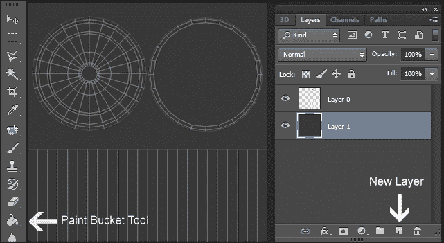

1.  创建一个新图层并选择图像的上部区域（带有圆圈的区域）。然后，用略带色调的浅灰色（**R: 196**，**G: 199**，**B: 199**）填充该区域：

    ### 注意

    我们的高光图 RGB 值不是随意的：基于物理的着色从映射过程中去除了大部分猜测，用参考研究取而代之。在我们的例子中，我们使用了基于铁（略带色调的浅灰色）和塑料（深灰色）的反射值。查看本章结论以获取参考列表。

1.  使用白色文本元素为电池主体添加品牌、尺寸和正负指示器。然后，隐藏辅助线图层：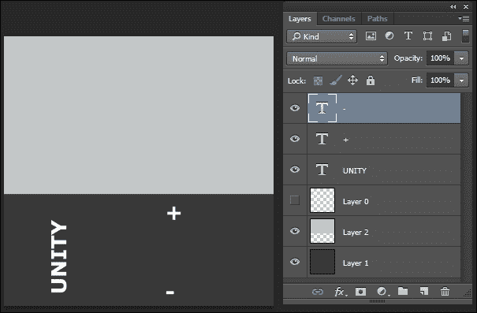

1.  选择所有图层并将它们组织到一个组中（在 Photoshop 中，可以通过点击**图层**窗口中的下拉菜单并导航到**窗口** | **从图层新建组…**）来做到这一点。将新组命名为`高光度**：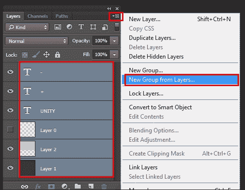

1.  复制`高光度**组**（在**图层**窗口中，右键单击组名并选择**复制组…**）。将复制的组命名为`平滑度**。

1.  隐藏`平滑度`组。然后，展开`高光度**组**并隐藏所有文本图层：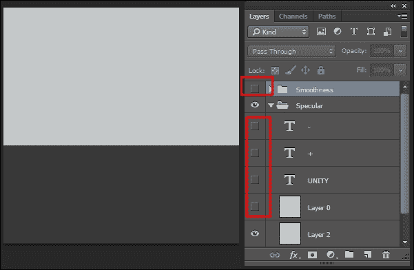

1.  显示`平滑度`组，并隐藏`高光度**组**。选择深灰色图层。然后，在电池主体的上部区域周围创建一个区域选择，并用浅灰色（**R: 220**，**G: 220**，**B: 220**）填充。如有必要，重新调整和排列**文本**图层：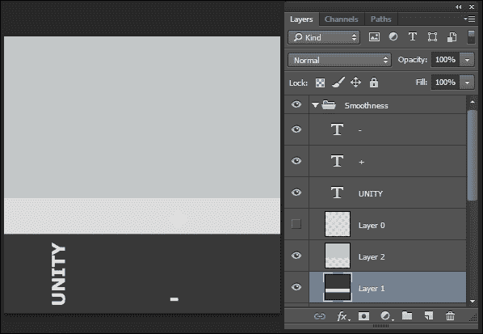

1.  复制包含图像上部区域灰色填充的图层（覆盖圆圈的图层）。

1.  要给这个材质添加刷过的质感，向复制的图层添加**噪声**滤镜（在 Photoshop 中，可以通过导航到**滤镜** | **噪声** | **添加噪声...**）来实现）。将**数量**设置为**50%**，并将**单色**设置为`true`。然后，使用**30 像素**作为**距离**应用**运动模糊**滤镜（**滤镜** | **模糊** | **运动模糊...**）。

1.  复制`平滑度`组。然后，选择复制的组并将其合并为单个图层（在**图层**窗口中，右键单击组名并选择**合并组**）。

1.  选择合并层，使用*CTRL* + *A*键组合选择整个图像，并使用*CTRL* + *C*键复制它：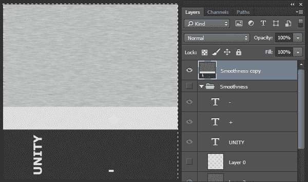

1.  隐藏合并层和`平滑度`组。然后，取消隐藏`镜面反射`组。

1.  在您的图像编辑器中，访问图像通道窗口（在 Photoshop 中，可以通过导航到**窗口** | **通道**）。创建一个**新通道**。这将是我们**Alpha**通道。

1.  将您之前复制的图像（从合并层）粘贴到**Alpha**通道中。然后，将所有通道设置为`可见`：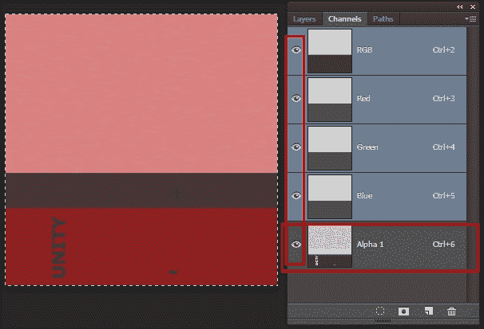

1.  将您的图像保存到项目的**资产**文件夹中，命名为`Battery_specular`，可以是 Photoshop 格式（PSD）或 TIF 格式。

1.  现在，让我们处理反照率图。将`Battery_specular`的副本保存为`Battery_albedo`。然后，从**通道**窗口，删除**Alpha**通道。

1.  从**图层**窗口，隐藏`平滑度副本`合并层，取消隐藏`平滑度`组。最后，展开`平滑度`组，并隐藏应用了**噪点**滤镜的图层：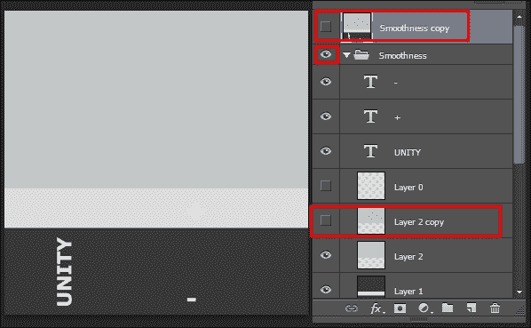

1.  将上方的矩形颜色更改为黑色。然后，将浅灰色区域更改为深红色（**R: 204**, **G: 0**, **B: 0**），将深灰色更改为红色（**R: 255**, **G: 0**, **B: 0**）。将组重命名为`Albedo`并保存文件：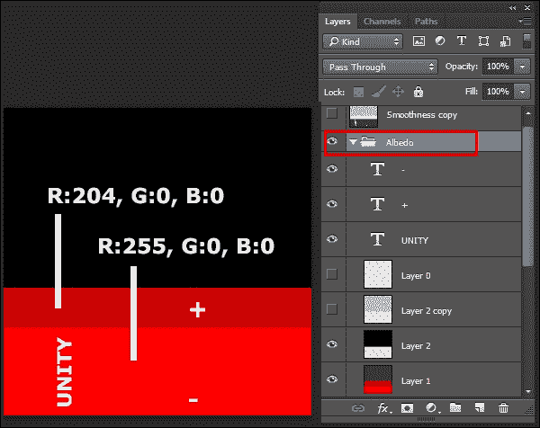

1.  返回 Unity，确保两个文件都已导入。然后，从**项目**视图，创建一个新的**材质**。将其命名为`Battery_MAT`。

    ### 小贴士

    创建新材质的一个简单方法是访问**项目**视图，点击**创建**下拉菜单，然后选择**材质**。

1.  选择`Battery_MAT`。从**检查器**视图，将着色器更改为**标准（镜面反射设置）**，并确保渲染模式设置为**不透明**。

1.  将`Battery_specular`设置为**镜面反射**图，将`Battery_albedo`设置为`Battery_MAT`的**反照率**图。

1.  将`Battery_MAT`材质从**项目**视图拖动到**层次结构**视图中的**电池**对象：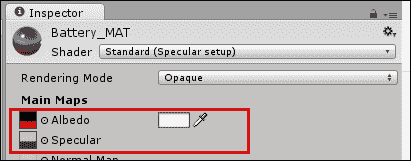

1.  将`Battery_MAT`材质从**项目**视图拖动，在**层次结构**视图中将其拖放到**电池**对象：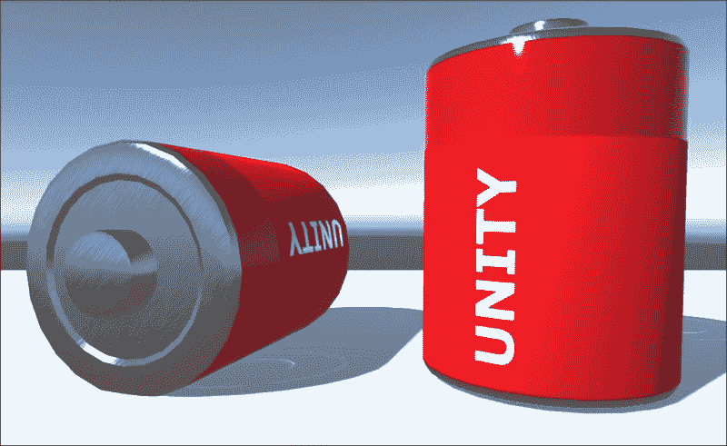

## 它是如何工作的...

最终，电池的视觉外观是其材质的三个属性的组合：镜面反射、平滑度和反照率。

例如，为了组成塑料体的深红色部分，我们混合了以下内容：

+   **镜面反射**图（RGB）：非常暗的灰色镜面反射（表示非金属外观）

+   **平滑度**（镜面反射图的 Alpha 通道）：浅灰色（表示光泽外观）

+   **反照率**图：深红色（表示深红色）

另一方面，浅红色部分结合了以下内容：

+   **镜面反射**图（RGB）：相同的暗灰色镜面反射

+   **平滑度**（镜面反射图的 Alpha 通道）：深灰色（表示哑光外观）

+   **Albedo**图：红色（用于红色）

最后，用于顶部和底部盖子的刷漆金属结合了以下特点：

+   **Specular**图（RGB）：浅灰色（用于金属效果）

+   **平滑度**（镜面图的 Alpha 通道）：一种模糊的灰色噪声图案（用于刷漆效果）

+   **Albedo**图：黑色（用于红色）

关于图像层的结构，将层组织成以它们相关的属性命名的组是个好习惯。随着纹理图的多样化，保留一个包含所有图的文件以供快速参考和一致性是个好主意。

## 更多内容...

在使用 Albedo 图时，您应该考虑以下几点。

### 设置图像文件的纹理类型

由于图像文件可以在 Unity 中用于多种目的（纹理图、GUI 纹理、光标等），检查是否已为您的文件分配了正确的**纹理类型**是个好主意。这可以通过在**项目**视图中选择图像文件，并在**检查器**视图中使用下拉菜单选择正确的**纹理类型**（在这种情况下，`Texture`）来完成。请注意，还可以调整其他设置，例如**包裹模式**、**过滤模式**和**最大尺寸**。最后一个参数如果您想保持纹理图在游戏中的尺寸较小，同时仍然能够以全尺寸编辑它们，非常有用。

### 将图与颜色结合

在编辑材质时，如果**Albedo**图槽右侧的**检查器**视图中没有纹理图，可以使用颜色选择器选择材质的颜色。如果正在使用纹理图，所选颜色将乘以图像，从而在材质的颜色色调上产生变化。

# 将从**镜面设置**到**金属**的基本材料进行适配

为了更好地理解金属和非金属工作流程之间的差异，我们将修改在镜面设置材质上使用的 Albedo 和 Specular/Smoothness 图，以便将它们适配到金属工作流程。要生成的材质将具有金属和非金属部分，以及不同的平滑度级别。

## 准备工作

对于这个配方，我们准备了一个包含电池模型及其原始材质（使用标准着色器——镜面设置）的 Unity 包。该包包括两个图像文件，用于原始的 Albedo 和 Specular/Smoothness 图，在整个配方中，应将它们适配以用于金属设置。该包位于`1362_04_02`文件夹中。

## 如何操作...

要创建基本材质，请按照以下步骤操作：

1.  将`battery_prefab` Unity 包导入到新项目中。

1.  从**项目**视图中选择**battery_prefab**元素。然后，从**检查器**中访问其材质（命名为**Battery_MAT**）并将其**着色器**更改为**标准**（与当前着色器——**标准（镜面设置）**相反）。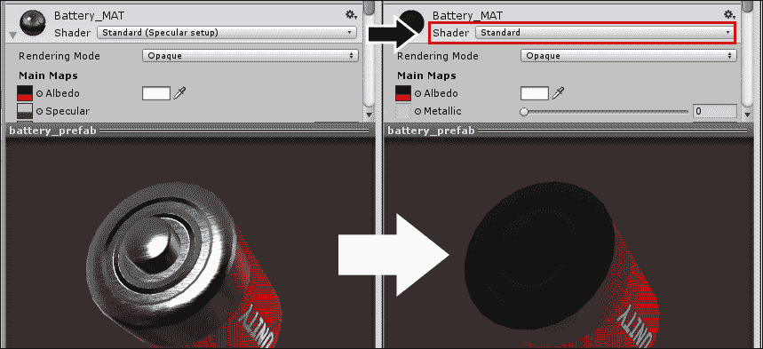

1.  从**项目**视图，找到`Battery_specular`贴图并将其重命名为`Battery_metallic`。在您的图像编辑器中打开它（以下步骤我们将使用 Adobe Photoshop 进行说明）。

1.  找到名为**Specular**的图层组并将其重命名为**Metallic**。然后，将浅灰色层（在**Metallic**组中命名为**层 2**）填充为白色（**R：255**，**G：255**，**B：255**），并将深灰色层（在**Metallic**组中命名为**层 1**）填充为黑色（**R：0**，**G：0**，**B：0**）。保存文件：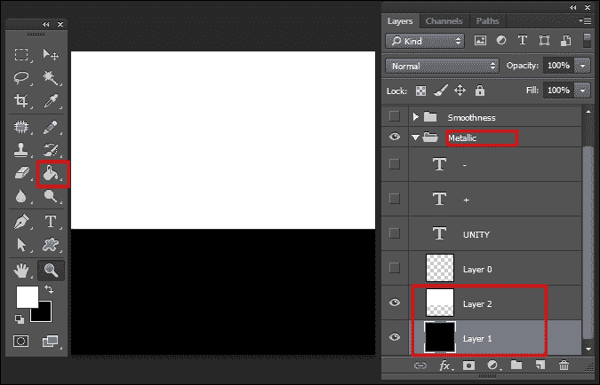

1.  返回 Unity。从**检查器**视图，将修改后的**Battery_metallic**贴图设置为**Battery_MAT**材料的**金属**贴图。同时，将那个材料的**反照率**贴图设置为**无**。这将给您一个关于材料进展的思路：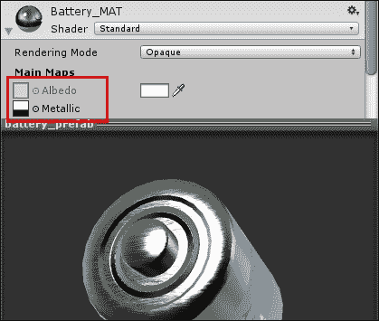

1.  现在，让我们调整反照率纹理贴图。从**项目**视图，定位`Battery_albedo`贴图并在您的图像编辑器中打开它。然后，使用**油漆桶**工具将**反照率**组中**层 2**的黑色区域填充为浅灰色（R：`196`，G：`199`，B：`199`）。保存文件：

1.  返回 Unity。从**检查器**视图，将修改后的**Battery_albedo**贴图设置为**Battery_MAT**材料的**反照率**贴图。

您的材料已经准备好，结合了您编辑和分配的不同贴图所基于的视觉属性。

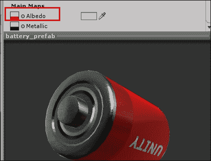

## 它是如何工作的...

电池的视觉外观是其材料三个属性的组合：金属、光滑度和反照率。

例如，要组成塑料体的深红色部分，我们混合了以下成分：

+   **金属**贴图（RGB）：黑色（用于非金属外观）

+   **光滑度**（金属贴图的 Alpha 通道）：浅灰色（用于光泽外观）

+   **反照率**贴图：深红色（用于深红色）

另一方面，浅红色部分结合了以下成分：

+   **金属**贴图（RGB）：黑色

+   **光滑度**（金属贴图的 Alpha 通道）：深灰色（用于哑光外观）

+   **反照率**贴图：红色（用于红色）

最后，用于顶部和底部盖子的刷漆金属结合了以下成分：

+   **金属**贴图（RGB）：白色（用于金属外观）

+   **光滑度**（金属贴图的 Alpha 通道）：模糊的灰色噪点图案（用于刷漆外观）

+   **反照率**贴图：浅灰色（用于类似铁的外观）

记得将图层组织成以它们相关的属性命名的组。

# 将法线贴图应用于材料

法线图通常用于模拟在游戏运行时用 3D 多边形实际表示过于昂贵的复杂几何形状。简单来说，法线图在低分辨率 3D 网格上伪造复杂几何形状。这些图可以通过将高分辨率 3D 网格投影到低多边形网格上（通常称为*烘焙*技术）生成，或者，如本菜谱所示，从另一个纹理图中生成。

## 准备工作

对于这道菜谱，我们将准备两个纹理贴图：**高度图**和**法线图**。前者将使用图像编辑器中的简单形状制作。后者将自动从高度图中处理。尽管有许多工具可以用来生成法线图（参见本章的*更多内容*部分以获取资源列表），但我们将使用一个免费在线工具，兼容 Windows 和 Mac，来生成我们的纹理。由 Christian Petry 开发，**NormalMap Online**功能可以在[`cpetry.github.io/NormalMap-Online/`](http://cpetry.github.io/NormalMap-Online/)访问。

为了帮助您制作这道菜谱，已经提供了一个 Unity 包，其中包含由 3D 对象及其材质组成的预制件；还有一个 UVW 模板纹理（PNG 格式），用于指导您在创建漫反射纹理贴图时的操作。所有文件都位于`1362_04_03`文件夹中。

## 如何操作...

要将法线图应用于材质，请按照以下步骤操作：

1.  将`1362_04_03.unitypackage`文件导入到您的项目中。在**项目**视图中，从**资产** | `1362_04_03`文件夹中选择`batteryPrefab`对象。在比较了一些参考照片后，了解应该通过法线图复制的特征：（**A**）顶部有一个凹凸的环；以及（**B**）底部有一些圆形的褶皱，如图所示：

1.  在图像编辑器中打开`uvw_template.png`。创建一个新图层，用灰色（RGB：128）填充，并将其放置在现有图层下方，如图所示：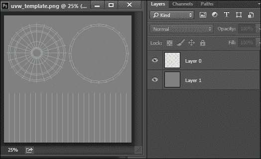

1.  在一个单独的图层上，以电池顶部为中心绘制一个白色圆圈。然后，在另一个图层上，以电池底部为中心绘制一个黑色圆圈，如下所示：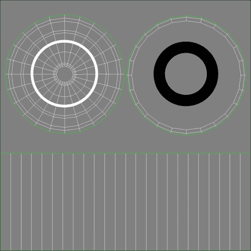

1.  如果您已经使用矢量形状制作了圆圈，请将它们的图层进行光栅化（在 Adobe Photoshop 中，右键单击图层名称，从上下文菜单中选择**光栅化图层**选项）。

1.  在 Photoshop 中，通过导航到**滤镜** | **模糊** | **高斯模糊...**来模糊白色圆圈。使用**4,0**像素作为**半径**。

1.  隐藏 UVW 模板图层，并将图像保存为`Battery_height.png`。

1.  如果您想直接从 Unity 转换 Heightmap，将其导入到您的项目中。从**项目**视图中选择它，然后从**检查器**视图中，将其**纹理类型**更改为**法线图**。勾选**从灰度创建**选项，根据需要调整**凹凸度**和**过滤**，然后点击**应用**以保存更改：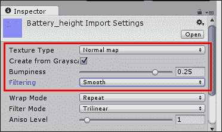

1.  要外部转换您的 Heightmap，访问网站 [`cpetry.github.io/NormalMap-Online/`](http://cpetry.github.io/NormalMap-Online/)。然后，将 `HEIGHT_battery.png` 文件拖到相应的图像槽中。您可以随意调整**强度**、**级别**和**模糊/锐化**参数：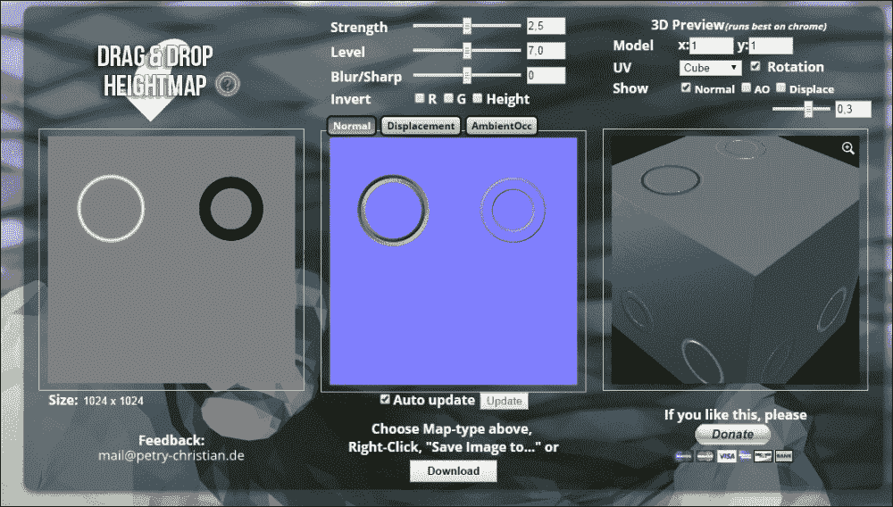

1.  将生成的法线图保存为 `Battery_normal.jpg` 并将其添加到您的 Unity 项目中。

1.  在 Unity 中，从**项目**视图中选择 `Battery_normal`。然后，从**检查器**视图中，将其**纹理类型**更改为**正常**，并确保**从灰度创建**框未被勾选。点击**应用**以保存更改：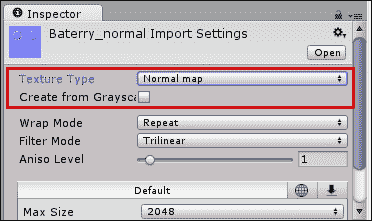

1.  在**项目**视图中选择 `batteryPrefab`。然后，在**检查器**视图中，滚动到**材质**组件，并将 `Battery_normal` 分配给**法线图**槽。要调整其强度和方向，将其值更改为 `-0.35`：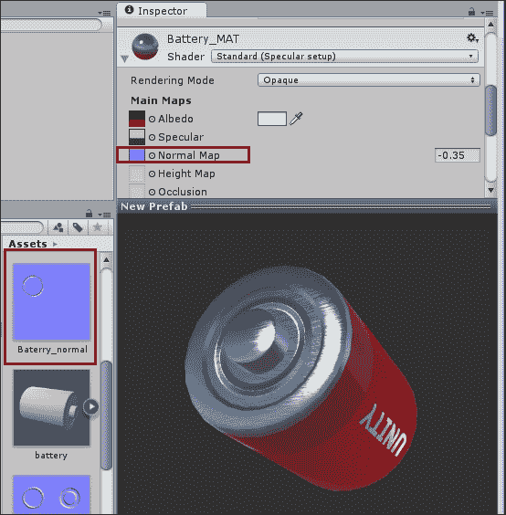

## 它是如何工作的...

**法线图**是从**高度图**上的灰度值计算得出的，其中较亮的色调被解释为凹槽（应用于电池顶部），较暗的色调被解释为凸起（应用于电池底部）。由于所需的输出实际上是相反的，因此需要将法线图调整到负值（`-0.35`）。解决此问题的另一个可能方案是重新绘制高度图并交换白色和黑色圆圈的颜色。

## 还有更多...

如果您想探索 Normal mapping 超出 NormalMap Online 的限制，有一个不断增长的软件列表，可以生成法线图（以及更多）。以下是一些您可能想要查看的资源：

+   *CrazyBump* 是适用于 Windows 和 Mac 的独立工具，可在 [`www.crazybump.com`](http://www.crazybump.com) 获取。

+   *nDo* 是 Quixel 的 Photoshop 插件（仅限 Windows），可在 [`quixel.se/ndo`](http://quixel.se/ndo) 获取。

+   *GIMP normalmap 插件*，仅适用于 Windows，可在 [`code.google.com/p/gimp-normalmap/`](http://code.google.com/p/gimp-normalmap/) 获取。

+   *NVIDIA Texture Tools for Adobe Photoshop*，仅适用于 Windows，可在 [`developer.nvidia.com/nvidia-texture-tools-adobe-photoshop`](http://developer.nvidia.com/nvidia-texture-tools-adobe-photoshop) 获取。

+   *Bitmap2Material* 是来自 Allegorithmic 的一个惊人的纹理生成工具，可在 [`www.allegorithmic.com/`](http://www.allegorithmic.com/) 获取。

# 向材质添加透明度和发射图

**Emission** 属性可以用来模拟各种自发光物体，从移动显示器的 LED 到未来派的 Tron 服装。另一方面，**透明度**可以使材料的漫反射颜色更明显或更不明显。在这个配方中，你将学习如何配置这些属性来制作一个具有塑料外壳和发光文字的玩具纸盒包装。

## 准备工作

对于这个配方，我们准备了一个包含由 3D 对象、其材质及其相应的漫反射纹理图（PNG 格式）组成的预制件的 Unity 包。所有文件都在 `1362_04_04` 文件夹中。

## 如何操作...

要向材质添加透明度和颜色发射，请按照以下步骤操作：

1.  将 `TransparencyEmission.unitypackage` 导入到你的项目中。从 **Assets** 文件夹中，在 **Project** 视图中选择 `DIFF_package` 纹理。然后，在您的图像编辑器中打开它。

1.  首先，我们将通过删除包装（和悬挂孔）周围的白色区域来为图像添加透明度。选择这些区域（在 Photoshop 中，可以使用 **Magic Wand** 工具完成）。

1.  确保通过单击图层名称左侧的锁图标解锁 **Background** 层，如下所示：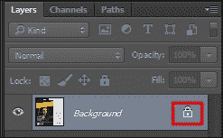

1.  删除之前所做的选择（在 Photoshop 中可以通过按 *Delete* 键完成）。图像的背景应该是透明的，如下所示。保存文件：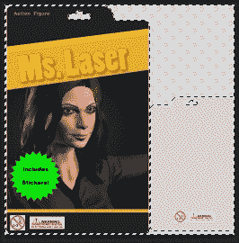

1.  回到 Unity，在 **Assets** 文件夹中，展开 **packagePrefab** 列表并选择 **PackageCard** 对象。现在，在 **Inspector** 视图中，向下滚动到 **Material** 组件，将其 **Rendering Mode** 更改为 **Cutout**，并将其 **Alpha Cutoff** 调整为 `0.9`：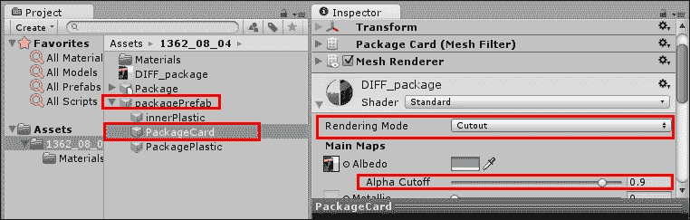

    ### 小贴士

    选择 **Cutout** 意味着你的材质可以是完全不可见或完全可见的，不允许半透明。**Alpha Cutoff** 用于去除透明边缘周围的不想要的像素。

1.  从扩展的 **packagePrefab** 中选择 **PackagePlastic** 对象。在 **Inspector** 视图中，向下滚动到 **Material** 组件，将其 **Rendering Mode** 更改为 **Transparent**。然后，使用 **Diffuse** 颜色选择器将颜色的 **RGB** 值更改为 `56`，并将 **Alpha** 更改为 `25`。此外，将 **Smoothness** 级别更改为 `0.9`：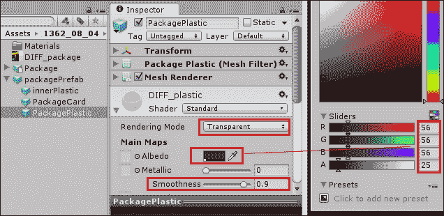

1.  现在我们已经处理好了透明度需求，我们需要处理 **Emission** 纹理。从 **Assets** 文件夹中，复制 `DIFF_package` 纹理，重命名为 `EMI_package`，并在您的图像编辑器中打开它。

1.  选择 **Ms. Laser** 标记和绿色星星上的所有字符（在 Photoshop 中，可以通过使用带有按住 *Shift* 键的多区域选择的魔棒工具来完成）。

1.  将你的选择复制并粘贴到一个新图层中。然后，选择它并应用一个噪声滤镜（在 Photoshop 中，可以通过导航到**滤镜** | **噪声** | **添加噪声...**）来执行此操作。使用**50%**作为值。

1.  创建一个新图层，并使用如**油漆桶工具**之类的工具将其填充为黑色（R: `0`，G: `0`，B: `0`）。将这个黑色图层放置在带有彩色元素的图层下方。

1.  扁平化你的图像（在 Photoshop 中，可以通过导航到**图层** | **合并图层**）并保存你的文件：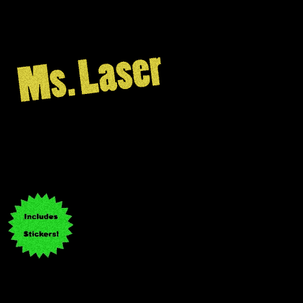

1.  回到 Unity 中，在**资产**文件夹中，展开**packagePrefab**并选择**PackageCard**对象。现在，在**检查器**视图中，向下滚动到**材质**组件并将`EMI_package`纹理分配给其**发射**槽。然后，将**发射**颜色槽更改为白色（**R**: `255`，**G**: `255`，**B**: `255`），并将强度降低到`0.25`，如以下截图所示。同时，将其**全局光照**选项更改为**无**，这样它的光芒就不会添加到光照贴图中或影响实时照明：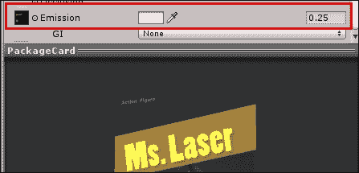

1.  在你的场景中放置一个**packagePrefab**实例，并查看结果。你的材质已经准备好了：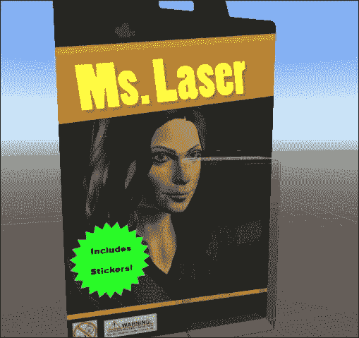

## 它是如何工作的...

Unity 能够读取纹理贴图的四个通道：R（红色）、G（绿色）、B（蓝色）和 A（Alpha）。当设置为`透明`或剪裁时，漫反射纹理贴图的 Alpha 通道根据每个像素的亮度级别设置材质的透明度（**剪裁**模式不会渲染半透明——只有完全可见或不可见的像素）。你可能已经注意到我们没有添加 Alpha 通道——这是因为 Photoshop 根据其透明度导出 PNG 的 Alpha 贴图。为了帮助你可视化 Alpha 贴图，`1362_04_04`文件夹中包含一个`DIFF_packageFinal.TIF`文件，它包含一个 Alpha 贴图，其工作方式与我们所生成的 PNG 文件完全相同：

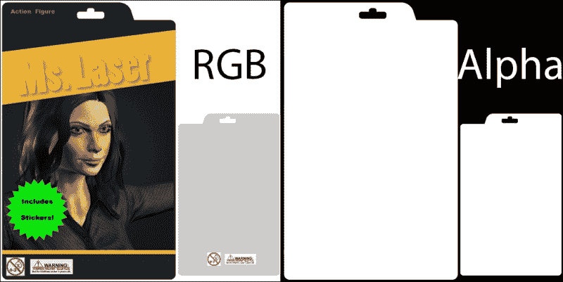

关于发射纹理贴图，Unity 将其 RGB 颜色分配给材质，与适当的选择颜色槽结合，并允许调整该发射的强度。

## 更多内容...

让我们看看关于透明度和发射的更多信息。

### 使用透明模式的纹理贴图

请注意，你可以在**透明**渲染模式下使用位图纹理作为**漫反射**贴图。在这种情况下，RGB 值将被解释为漫反射颜色，而 Alpha 值将用于确定该像素的透明度（在这种情况下，允许半透明材质）。

### 避免半透明对象的问题

您可能已经注意到塑料外壳是由两个对象（**PackagePlastic**和**innerPlastic**）组成的。这样做是为了避免 z 排序问题，即当面应该在后面时，却渲染在了其他几何体前面。使用多个网格而不是单个网格可以正确排序这些面以便渲染。在`Cutout`模式下的材质不受此问题影响。

### 在其他物体上发射光线

当使用 Lightmaps 时，可以使用**发射**值来计算材料在其它物体上的光照投影。

# 鼠标悬停时突出显示材料

在运行时更改物体的颜色可以是一个非常有效的方法，让玩家知道他们可以与之交互。这在许多游戏**类型**中非常有用，例如益智游戏和点击冒险游戏，也可以用来创建 3D 用户界面。

## 准备工作

对于这个配方，我们将使用直接在 Unity 中创建的对象。或者，您可以使用您喜欢的任何 3D 模型。

## 如何操作...

要在鼠标悬停时突出显示材料，请按照以下步骤操作：

1.  创建一个新的 3D 项目，并将一个**Cube**添加到场景中（从**层次结构**视图，导航到**创建** | **3D 对象** | **Cube**）。

1.  从**项目**视图，点击**创建**下拉菜单并选择**材质**。将其命名为`HighlightMaterial`。

1.  选择**HighlightMaterial**，从**检查器**视图中将其**Albedo**颜色更改为灰色（R: `135`，G: `135`，B: `135`），其**发射**强度设置为`1`，如以下截图所示，并将**发射**颜色设置为 R: `1`，G: `1`，**B:** `1`：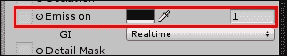

1.  将**HighlightMaterial**分配给您之前创建的**Cube**。

1.  从**项目**视图，点击**创建**下拉菜单并选择**C# 脚本**。将其重命名为`HighlightObject`并在您的编辑器中打开它。

1.  将以下代码替换所有内容：

    ```cs
    using UnityEngine;
    using System.Collections;
    public class HighlightObject : MonoBehaviour{
      private Color initialColor;
      public bool noEmissionAtStart = true;
      public Color highlightColor = Color.red;
      public Color mousedownColor = Color.green;

      private bool mouseon = false;
      private Renderer myRenderer;

      void Start() {
        myRenderer = GetComponent<Renderer>();
        if (noEmissionAtStart)
        initialColor = Color.black;
        else
        initialColor = myRenderer.material.GetColor("_EmissionColor");
      }

      void OnMouseEnter(){
        mouseon = true;
        myRenderer.material.SetColor("_EmissionColor", highlightColor);
      }

      void OnMouseExit(){
        mouseon = false;
        myRenderer.material.SetColor("_EmissionColor",initialColor);
      }

      void OnMouseDown(){
        myRenderer.material.SetColor("_EmissionColor", mousedownColor);
      }

      void OnMouseUp(){
        if (mouseon)
        myRenderer.material.SetColor("_EmissionColor", highlightColor);
        else
        myRenderer.material.SetColor("_EmissionColor", initialColor);
      }
    }
    ```

1.  保存您的脚本并将其附加到**Cube**。

1.  选择**Cube**，在**检查器**视图中设置您想要的**突出显示颜色**和**鼠标按下颜色**值：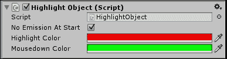

1.  如果您使用的是自己的导入的 3D 网格，请确保为您的对象添加一个**Collider**组件。

1.  测试场景。当鼠标悬停在**Cube**上时，它将被突出显示为红色（点击时为绿色）。

## 它是如何工作的...

当用户将鼠标指针移动到屏幕上立方体可见的部分上方和移开时，立方体会自动接收到鼠标的进入/退出/按下/抬起事件。当检测到这些事件时，我们的脚本会给立方体添加一个行为。`Start()` 方法获取脚本已添加到 GameObject 的 `Renderer` 组件的引用，并将其存储在变量 `myRenderer` 中（注意，在 Unity 中 'renderer' 已经有了一个含义，因此不适合作为此脚本的私有变量名）。布尔变量 `mouseon` 记录鼠标指针是否当前位于对象上。当鼠标按钮释放时，我们使用 `mouseon` 变量来决定是否将立方体变回其初始颜色（`mouseon` 为 FALSE，表示鼠标指针远离立方体），或者变回其高亮颜色（`mouseon` 为 TRUE，表示鼠标指针位于立方体上）。

我们需要将材质的原始 **Emission** 颜色更改为超深灰色，原因在于如果保持黑色，Unity 会通过从材质中移除 **Emission** 属性来优化 Shader。如果发生这种情况，我们的脚本将无法工作。

## 更多内容...

通过更改材质的其他属性（例如，将 `_EmissionColor` 脚本更改为 `_Color` 或 `"_SpecularColor"），你可以实现其他有趣的结果。要查看属性的全列表，选择你的材质，然后在 **Inspector** 视图中，点击 **Shader** 下拉菜单旁边的 **Edit** 按钮。

# 将细节贴图添加到材质中

当创建一个大型对象时，不仅希望整体对其进行纹理处理，还希望添加可以在近距离看起来更好的细节。为了克服对巨大纹理贴图的需求，使用细节贴图可以真正地产生影响。在这个配方中，我们将通过应用细节蒙版和细节法线贴图来为火箭玩具添加细节贴图。在我们的例子中，我们希望为绿色塑料添加纹理质感（和条纹图案），除了电池仓和玩具标志的区域：

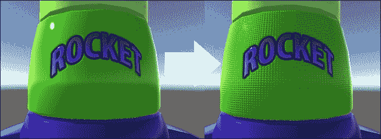

## 准备工作

对于这个配方，我们准备了一个 Unity 包，其中包含一个火箭玩具的预制件。预制件包括 3D 模型和材质，具有漫反射贴图和法线贴图（由高度图生成）。该文件位于 `1362_04_06` 文件夹中。

## 如何操作...

要将细节贴图添加到你的对象中，请按照以下步骤操作：

1.  将 `rocket.unitypackage` 文件导入到你的项目中。然后，在 **Project** 视图中的 **Assets** 文件夹中，选择名为 `rocketToy` 的预制件，并将其放置到你的场景中。

1.  从**层次**视图中展开**rocketToy** GameObject，并选择其名为**rocketLevel1**的子项。然后，在**检查器**视图中向下滚动到**材质**组件。观察它使用`DIFF_ship`纹理作为**漫反射**贴图。复制此文件，并将新副本重命名为`COPY_ship`。

1.  在你的图像编辑器中打开`COPY_ship`。选择围绕标志和电池仓周围的实心绿色像素（在 Photoshop 中，这可以通过按下*Shift*键同时选择多个区域使用魔棒工具完成）：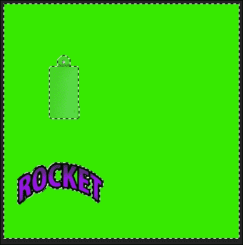

1.  保持选择活动状态，访问图像**通道**窗口（在 Photoshop 中，这可以通过导航到**窗口** | **通道**完成）。点击**新建通道**。这将是我们**Alpha**通道：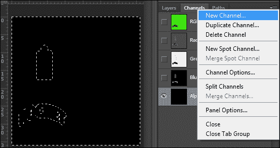

1.  隐藏**红色**、**绿色**和**蓝色**通道。选择**Alpha**通道，并将选择区域涂成白色。然后，选择电池仓区域，将其涂成灰色（R、G 和 B：`100`）：

1.  将其保存为 TIFF 格式，文件名为`MASK_ship.TIF`，在`Assets`文件夹中。确保包含**Alpha 通道**：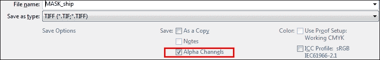

1.  现在我们有了面具，让我们为我们的细节创建一个漫反射图。在你的图像编辑器中，创建一个具有以下尺寸的新图像：**宽度**：`64`，和**高度**：`64`。

1.  将新图像填充为灰色（R、G 和 B：`128`）。然后，使用形状或矩形填充创建一个深灰色（R、G 和 B：`100`）的水平线，高度约为 16 像素：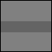

1.  将图像保存为`DIFF_detail.PNG`在`Assets`文件夹中。

1.  创建一个新的 64 x 64 图像。使用**渐变**工具创建一个黑白**径向渐变**（在 Photoshop 中，这可以通过在**径向**模式下使用**渐变**工具完成）：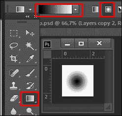

1.  将图像保存为`HEIGHT_detail.PNG`在`Assets`文件夹中。

1.  返回 Unity。从`Assets`文件夹中，选择`HEIGHT_detail`。然后，从**检查器**视图中，更改其**纹理类型**为**法线贴图**，勾选**从灰度创建**选项，调整**凹凸度**到`0.25`，并将**过滤**设置为`平滑`。点击**应用**以保存更改：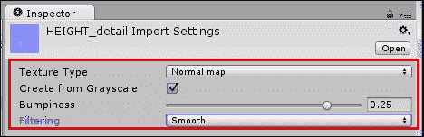

1.  从**层次**视图中展开**rocketToy** GameObject，并选择其名为**rocketLevel1**的子项。然后，在**检查器**视图中向下滚动到**材质**组件。将`MASK_ship`分配给**细节遮罩**槽位；将`DIFF_detail`作为**次级贴图** | **细节漫反射 x 2**；将`HEIGHT_detail`作为**次级贴图** | **法线贴图**。同时，将**法线贴图**强度降低到`0.6`。

1.  在**次级贴图**部分，将**平铺**值更改为**X**：`200`，和**Y**：`50`。您可能会注意到图案不是无缝的。这是因为我们正在使用与**漫反射**纹理相同的**UV 集**。然而，物体已被分配到两个不同的**UV 通道**（在建模时）。虽然 UV 通道 1 包含我们的**漫反射**贴图的映射，但 UV 通道 2 使用基本的圆柱映射。我们需要将**次级贴图**部分的**UV 集**从**UV0**更改为**UV1**。您的材质的细节贴图已准备好：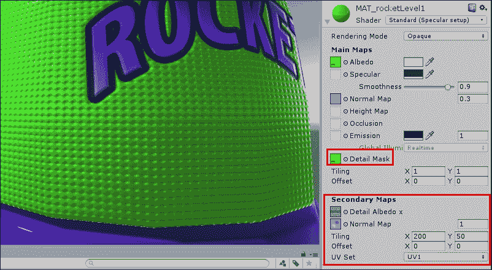

## 它是如何工作的...

在使用时，**次级贴图**会被混合到材质的**漫反射**和**法线**主贴图上（这就是为什么即使应用了**细节漫反射**，我们的物体仍然是绿色的：灰色色调叠加在原始的**漫反射**纹理上）。通过使用**细节遮罩**，艺术家可以定义物体的哪些区域应该受到次级贴图的影响。这对于定制来说非常好，也可以用来创建细微差别（如我们示例中的半凸电池仓）。

另一个有用的功能是使用单独的 UV 通道来处理细节贴图和平铺。除了为纹理映射增加变化外，这还允许我们绘制即使在非常近的距离也能感知到的细节，从而显著提高我们物体的视觉质量。

# 淡入材质的透明度

在这个菜谱中，我们将创建一个对象，一旦点击，就会淡出并消失。但是，脚本将足够灵活，允许我们调整初始和最终的不透明度值。此外，我们还将有选项使物体在不可见时自我销毁。

## 如何操作...

按照以下步骤操作：

1.  通过访问**游戏对象** | **3D 对象** | **球体**菜单将**球体**添加到您的场景中。

1.  选择**球体**并确保它有一个碰撞器（如果您正在使用自定义 3D 对象，您可能需要通过**组件 | 物理**菜单添加碰撞器）。

1.  创建一个新的材质。最简单的方法是访问**项目**视图，点击**创建**下拉菜单，然后选择**材质**。

1.  重命名您的新材质。在这个例子中，让我们称它为`Fade_MAT`。

1.  选择您的材质。从**检查器**视图，使用下拉菜单将其**渲染模式**更改为**淡入**：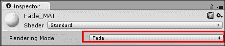

    ### 小贴士

    **淡入**渲染模式专门设计用于这种情况。其他渲染模式，如透明，会淡入使 Albedo 颜色透明，但不会影响高光或反射，在这种情况下，物体仍然可见。

1.  将**FadeMaterial**应用到**球体**上，通过从**项目**视图将其拖动到**层次结构**视图中的**球体**游戏对象名称。

1.  从**项目**视图，点击**创建**下拉菜单并选择**C# 脚本**。将其重命名为`FadeMaterial`并在您的编辑器中打开它。

1.  用以下代码替换你的脚本：

    ```cs
    using UnityEngine;
    using System.Collections;
    public class FadeMaterial : MonoBehaviour {
      public float fadeDuration = 1.0f;
      public bool useMaterialAlpha = false;
      public float alphaStart = 1.0f;
      public float alphaEnd = 0.0f;
      public bool destroyInvisibleObject = true;
      private bool isFading = false;
      private float alphaDiff;
      private float startTime;
      private Renderer rend;
      private Color fadeColor;

      void Start () {
        rend = GetComponent<Renderer>();
        fadeColor = rend.material.color;

        if (!useMaterialAlpha) {
          fadeColor.a = alphaStart;
        } else {
          alphaStart = fadeColor.a;
        }

        rend.material.color = fadeColor;
        alphaDiff = alphaStart - alphaEnd;
      }

      void Update () {
        if(isFading){
          var elapsedTime = Time.time - startTime;

          if(elapsedTime <= fadeDuration){
            var fadeProgress = elapsedTime / fadeDuration;
            var alphaChange = fadeProgress * alphaDiff;
            fadeColor.a = alphaStart - alphaChange;
            rend.material.color = fadeColor;
            } else {
            fadeColor.a = alphaEnd;
            rend.material.color = fadeColor;

            if(destroyInvisibleObject)
              Destroy (gameObject);
            isFading = false;  
          }
        }
      }

      void OnMouseUp(){
        FadeAlpha();
      }

      public void FadeAlpha(){
        isFading = true;
        startTime = Time.time;
      }
    }
    ```

1.  保存你的脚本并将其应用到**球体**游戏上。

1.  播放你的场景并点击**球体**以查看它淡出并自我销毁。

## 它是如何工作的...

由于使用透明着色器时材料的透明度由其主要颜色的 alpha 值决定，因此我们为了淡入淡出只需要改变这个值在一定时间内。这种转换在我们的脚本中以下代码行中表示：

```cs
var fadeProgress = elapsedTime / fadeDuration;
var alphaChange = fadeProgress * alphaDiff;
fadeColor.a = alphaStart - alphaChange;
rend.material.color = fadeColor;
```

## 还有更多...

你可以在其他情况下调用`FadeAlpha`函数（例如，在`Rigidbody`碰撞时）。实际上，你甚至可以通过使用`GetComponent`命令从另一个游戏对象的脚本中调用它。脚本可能如下所示：

```cs
GameObject.Find("Sphere").GetComponent<FadeMaterial>().FadeAlpha();
```

# 在场景中播放视频

电视、投影仪、显示器……如果你想在你的级别中添加复杂动画材质，你可以播放视频文件作为纹理图。在本教程中，我们将学习如何将视频纹理应用到立方体上。我们还将实现一个简单的控制方案，当点击该立方体时播放或暂停视频。

## 准备工作

Unity 通过 Apple Quicktime 导入视频文件。如果你没有安装在你的机器上，请从[`www.apple.com/quicktime/download/`](http://www.apple.com/quicktime/download/)下载它。

此外，如果你需要视频文件来遵循此教程，请使用文件夹`1632_04_08`中包含的`videoTexture.mov`。

## 如何操作...

按照以下步骤操作：

1.  通过**游戏对象** | **3D 对象** | **立方体**菜单将一个立方体添加到场景中。

1.  导入提供的`videoTexture.mov`文件。

1.  从**项目**视图，使用**创建**下拉菜单创建一个新的**材质**。将其重命名为`Video_MAT`，并在**检查器**视图中将其**着色器**更改为**Unlit/Texture**：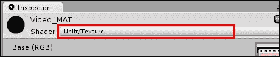

1.  通过从**项目**视图拖动到适当的槽位，将`videoTexture`应用到`Video_MAT`的纹理槽位。

1.  将`Video_MAT`应用到之前创建的**立方体**上。

1.  在**项目**视图中展开`videoTexture`以显示其对应的**音频剪辑**。然后，将那个音频剪辑应用到**立方体**上（你可以通过从**项目**视图拖动它到**层次结构**视图中的**立方体**，或者**场景**视图中来完成）。

1.  选择**立方体**。确保从**检查器**视图中可以看到一个可见的**Collider**组件。如果没有，可以通过**组件** | **物理** | **箱体碰撞器**菜单添加它。碰撞器用于鼠标碰撞检测。

1.  现在我们需要创建一个控制电影纹理和相关音频剪辑的脚本。从**项目**视图，使用**创建**下拉菜单添加一个**C#脚本**。将其命名为`PlayVideo`。

1.  打开脚本并将其替换为以下代码：

    ```cs
    using UnityEngine;
    using System.Collections;

    [RequireComponent(typeof(AudioSource))]

    public class PlayVideo : MonoBehaviour {

      public bool loop = true;
      public bool playFromStart = true;
      public MovieTexture video;
        public AudioClip audioClip;
      private AudioSource audio;

      void Start () {
        audio = GetComponent<AudioSource> ();

        if (!video)
          video = GetComponent<Renderer>().material.mainTexture as MovieTexture;

        if (!audioClip)
            audioClip = audio.clip;

        video.Stop ();
        audio.Stop ();
        video.loop = loop;
        audio.loop = loop;

        if(playFromStart)
          ControlMovie();
      }

      void OnMouseUp(){
        ControlMovie();
      }

      public void ControlMovie(){

        if(video.isPlaying){
          video.Pause();
          audio.Pause();
        } else {
          video.Play();
          audio.Play();
        }
      }
    }
    ```

1.  保存你的脚本并将其附加到**立方体**上。

1.  测试你的场景。你应该能够看到在立方体面上播放的电影，并且通过点击它来暂停/播放。

## 它是如何工作的...

默认情况下，我们的脚本使电影纹理以循环模式播放。然而，有一个布尔变量可以通过**检查器**面板进行更改，在那里它由一个复选框表示。同样，还有一个复选框可以用来防止在关卡开始时播放电影。

## 还有更多...

还有一些其他电影纹理命令和参数可以进行调整。别忘了查看 Unity 的脚本指南：[`docs.unity3d.com/Documentation/ScriptReference/MovieTexture.html`](http://docs.unity3d.com/Documentation/ScriptReference/MovieTexture.html)。

# 结论

本章介绍了用于创建纹理图的技术，这些纹理图通常手动创建，有时自动创建，能够为材料提供独特的特征。希望您现在对使用 Unity 的新基于物理着色更有信心，它能够理解不同工作流程之间的差异，了解每个材料属性的作用，并准备好为您的游戏制作更美观的材料。我们还探讨了通过脚本访问对象的材质来在运行时更改材料属性的方法。

## 资源

基于物理渲染是一个复杂（且当前）的话题，因此熟悉其背后的工具和概念，对其进行一些研究是个好主意。为了帮助您完成这项任务，我们下面提供了一份非详尽的资源列表，您应该查看一下。

### 参考文献

这里有一份关于基于物理渲染（Unity 内部和外部）的有趣、详细的材料列表：

+   *《全面 PBR 指南第 1 卷和第 2 卷》*，由 Wes McDermott（Allegorithmic）撰写，可在[`www.allegorithmic.com/pbr-guide`](http://www.allegorithmic.com/pbr-guide)找到。本指南深入探讨了 PBR 的实践和理论方面，包括对可能的工作流程的精彩分析。

+   *Unity 5 中掌握基于物理着色*，由 Renaldas Zioma（Unity）、Erland Körner（Unity）和 Wes McDermott（Allegorithmic）合著，可在[`www.slideshare.net/RenaldasZioma/unite2014-mastering-physically-based-shading-in-unity-5`](http://www.slideshare.net/RenaldasZioma/unite2014-mastering-physically-based-shading-in-unity-5)找到。这是一份关于在 Unity 中使用 PBS 的详细演示文稿。最初在 Unite 2014 会议上展示，其中包含一些过时的信息，但无论如何，它仍然值得一看。

+   *Unity 5 中的基于物理着色*，由 Unity 的 Aras Pranckevičius 撰写，可在[`aras-p.info/texts/talks.html`](http://aras-p.info/texts/talks.html)找到。关于该主题的演示文稿的幻灯片和笔记在 GDC 上提供。

+   Joe "EarthQuake" Wilson 的教程《**基于物理渲染，你也可以做到**！》可在[`www.marmoset.co/toolbag/learn/pbr-practice`](http://www.marmoset.co/toolbag/learn/pbr-practice)找到。这是来自**Marmoset Toolbag**和**Skyshop**制作团队的精彩概述。

+   *Polycount PBR Wiki*，可在[`wiki.polycount.com/wiki/PBR`](http://wiki.polycount.com/wiki/PBR)找到，是由 Polycount 社区整理的资源列表。

### 工具

这是一代新的纹理软件，供您查看，以防您还没有看过：

+   *Substance Painter* 是来自 Allegorithmic 的 3D 绘画应用程序。它可在[`www.allegorithmic.com/products/substance-painter`](http://www.allegorithmic.com/products/substance-painter)找到。再次值得一提的是，Allegorithmic 的产品不会使用 Unity 的标准着色器，而是依赖 Unity 原生支持的 substance 文件。

+   *Bitmap2Material* 可以从单个位图图像创建全功能的材质（包括法线图、高光图等）。此外，它也来自 Allegorithmic，可在[`www.allegorithmic.com/products/bitmap2material`](http://www.allegorithmic.com/products/bitmap2material)找到。

+   *Quixel DDO* 是一个用于在 Adobe Photoshop 中创建 PBR 准备纹理的插件。从 Quixel 获取，可在[`www.quixel.se/ddo`](http://www.quixel.se/ddo)找到。

+   *Quixel NDO* 是一个用于在 Adobe Photoshop 中创建法线图的插件。从 Quixel 获取，可在[`www.quixel.se/ndo`](http://www.quixel.se/ndo)找到。

+   *Mari* 是来自 The Foundry 的 3D 绘画工具。它可在[`www.thefoundry.co.uk/products/mari/`](http://www.thefoundry.co.uk/products/mari/)找到。
