# 第五章。使用相机

在本章中，我们将涵盖：

+   创建画中画效果

+   在多个相机之间切换

+   从屏幕内容创建纹理

+   调整望远镜相机的缩放

+   显示迷你地图

+   创建游戏中的监控相机

# 简介

作为开发者，我们永远不应该忘记关注相机。毕竟，它们是我们玩家看到我们游戏窗口。在本章中，我们将探讨一些有趣的使用相机的方法，这些方法可以增强玩家的体验。

## 整体情况

相机可以通过多种方式自定义：

+   它们可以排除特定图层上的对象以进行渲染

+   它们可以被设置为以**正交**模式（即没有透视）进行渲染

+   它们的**视野**（**FOV**）可以被操作以模拟广角镜头

+   它们可以渲染在其他相机之上或屏幕的特定区域

+   它们可以被渲染到纹理上

列表还在继续。

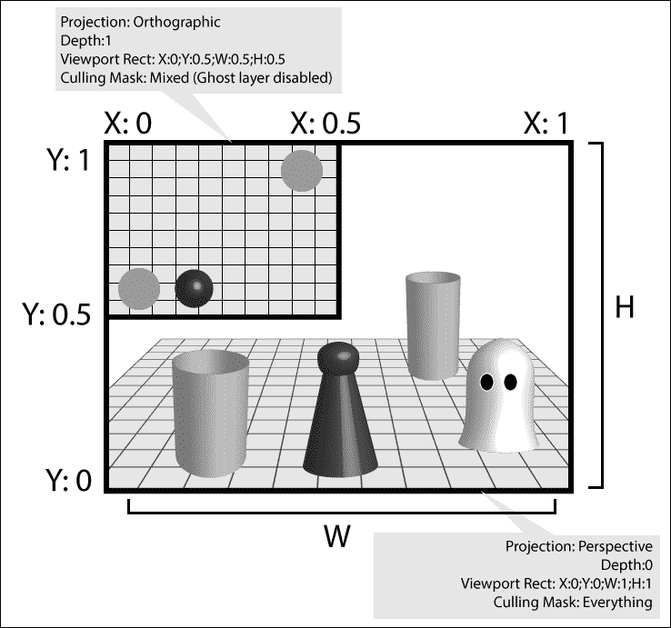

两个同时的相机视图

注意，在本章中，您将注意到一些配方具有一个跟随玩家第三人称角色的相机装置。这个装置是**多功能相机装置**，最初来自 Unity 的示例资产，可以通过导航到**资产** | **导入包** | **相机**将其导入到项目中。为了使事情更容易，我们将包含它的 `MultipurposeCamera` Unity 包作为一个预制件组织起来，该预制件可以在 `1362_05_codes` 文件夹中找到。

# 创建画中画效果

在许多情况下，显示多个视口可能很有用。例如，您可能希望显示在不同位置同时发生的事件，或者您可能希望为热座多人游戏设置一个单独的窗口。虽然您可以通过调整相机上的**归一化视口矩形**参数手动完成此操作，但此配方包含一系列额外的首选项，使其更多地独立于用户的显示配置。

## 准备工作

对于这个配方，我们已准备了 `BasicScene` Unity 包，其中包含一个名为 `BasicScene` 的场景。该包位于 `1362_05_codes` 文件夹中。

## 如何操作...

要创建画中画显示，只需按照以下步骤操作：

1.  将 `BasicScene` 包导入到您的 Unity 项目中。

1.  从**项目**视图打开**BasicScene**级别。这是一个包含动画角色和一些额外几何形状的基本场景。

1.  通过在**层次**视图顶部的**创建**下拉菜单中添加一个新的**相机**（**创建** | **相机**）来将场景中的新相机。

1.  选择您创建的相机，从**检查器**视图，将其**深度**更改为**1**，如图下截图所示：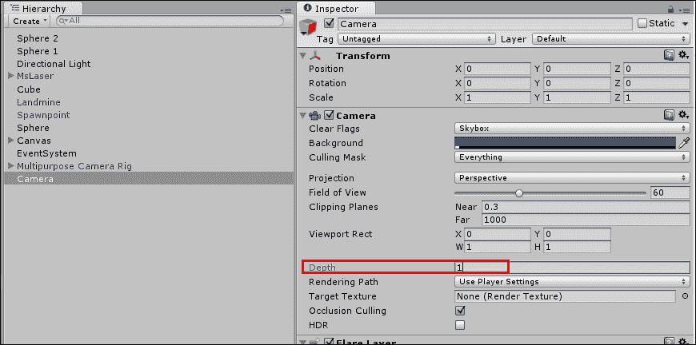

1.  从**项目**视图创建一个新的**C# 脚本**文件，并将其重命名为 `PictureInPicture`。

1.  打开您的脚本，并用以下代码替换所有内容：

    ```cs
    using UnityEngine;

    public class PictureInPicture: MonoBehaviour {
      public enum hAlignment{left, center, right};
      public enum vAlignment{top, middle, bottom};
      public hAlignment horAlign = hAlignment.left;
      public vAlignment verAlign = vAlignment.top;
      public enum UnitsIn{pixels, screen_percentage};
      public UnitsIn unit = UnitsIn.pixels;
      public int width = 50;
      public int height= 50;
      public int xOffset = 0;
      public int yOffset = 0;
      public bool  update = true;
      private int hsize, vsize, hloc, vloc;

      void Start (){
        AdjustCamera ();
      }

      void Update (){
        if(update)
        AdjustCamera ();
      }

      void AdjustCamera(){
        int sw = Screen.width;
        int sh = Screen.height;
        float swPercent = sw * 0.01f;
        float shPercent = sh * 0.01f;
        float xOffPercent = xOffset * swPercent;
        float yOffPercent = yOffset * shPercent;
        int xOff;
        int yOff;
        if(unit == UnitsIn.screen_percentage){
          hsize = width * (int)swPercent;
          vsize = height * (int)shPercent;
          xOff = (int)xOffPercent;
          yOff = (int)yOffPercent;
        } else {
          hsize = width;
          vsize = height;
          xOff = xOffset;
          yOff = yOffset;
        }

        switch (horAlign) {
          case hAlignment.left:
          hloc = xOff;
          break;
          case hAlignment.right:
          int justfiedRight = (sw - hsize);
          hloc = (justfiedRight - xOff);
          break;
          case hAlignment.center:
          float justifiedCenter = (sw * 0.5f) - (hsize * 0.5f);
          hloc = (int)(justifiedCenter - xOff);
          break;
        }

        switch (verAlign) {
          case vAlignment.top:
          int justifiedTop = sh - vsize;
          vloc = (justifiedTop - (yOff));
          break;
          case vAlignment.bottom:
          vloc = yOff;
          break;
          case vAlignment.middle:
          float justifiedMiddle = (sh * 0.5f) - (vsize * 0.5f);
          vloc = (int)(justifiedMiddle - yOff);
          break;
        }

        GetComponent<Camera>().pixelRect = new Rect(hloc,vloc,hsize,vsize);
      }
    }
    ```

    ### 注意

    如果你没有注意到，我们不是通过将数字除以 100 来获得百分比，而是将它们乘以 0.01。这样做的原因是计算机处理器在乘法上比除法更快。

1.  保存你的脚本并将其附加到之前创建的相机上。

1.  取消选中新相机的**音频监听器**组件，并更改一些**画中画**参数：将**水平对齐**改为`right`，**垂直对齐**改为`top`，并将**单位**改为`pixels`。将**X 偏移**和**Y 偏移**保留为`0`，将**宽度**改为`400`，将**高度**改为`200`，如下所示：

1.  播放你的场景。新的相机的视口应该显示在屏幕的右上角，如下所示：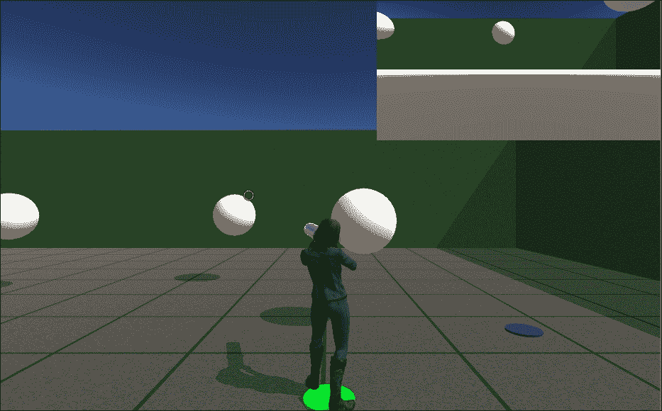

## 它是如何工作的...

在这个例子中，我们添加了第二个相机，以便从不同的视角显示场景。第二个相机的相对视口最初放置在**主相机**视口的上方，因此占据了整个屏幕空间。

`PictureInPicture`脚本更改相机的**标准化视口矩形**，从而根据用户的偏好调整视口的大小和位置。

首先，它读取组件的用户偏好设置（PiP 视口的尺寸、对齐和偏移）并将屏幕百分比的尺寸转换为像素。

后来，从`if(unit == UnitsIn.screen_percentage){`条件语句中，脚本根据用户的选取计算两个视口矩形参数（宽度和高度）。

之后，使用**switch**语句调整其他两个视口矩形参数（水平和垂直位置）根据总屏幕尺寸、PiP 视口尺寸、垂直/水平对齐和偏移。

最后，一行代码告诉相机更改相机的**视口矩形**的位置和尺寸：

```cs
GetComponent<Camera>().pixelRect = new Rect(hloc,vloc,hsize,vsize);
```

## 还有更多...

以下是你可能想要更改的画中画的一些方面：

### 使画中画与屏幕大小成比例

如果你将**单位**选项更改为`screen_percentage`，视口大小将基于实际屏幕的尺寸而不是像素。

### 更改画中画的位置

**垂直对齐**和**水平对齐**选项可以用来更改视口的垂直和水平对齐。使用它们将其放置到你希望的位置。

### 防止画中画在每一帧更新

如果你计划在运行模式下不更改视口位置，请取消选中**更新**选项。同时，在测试时保留选中状态，一旦位置确定并设置好，再取消选中。

## 参见

+   本章中显示*迷你地图*的配方

# 在多个相机之间切换

在多种摄像机中选择是许多流派中常见的功能：赛车、体育、大亨/策略，等等。在这个菜谱中，你将学习如何通过使用键盘让玩家能够从许多摄像机中选择。

## 准备工作

对于这个菜谱，我们准备了一个包含名为`BasicScene`的场景的`BasicScene` Unity 包。该包位于`1362_05_codes`文件夹中。

## 如何做到这一点...

要实现可切换的摄像机，请按照以下步骤操作：

1.  将`BasicScene`包导入新的**项目**。

1.  从**项目**视图，打开**BasicScene**级别。这是一个包含动画角色和一些额外几何形状的基本场景。

1.  通过**层次**视图顶部的**创建**下拉菜单（**创建** | **摄像机**）向场景添加两个更多摄像机。将它们重命名为`cam1`和`cam2`。

1.  修改`cam2`摄像机的位置和旋转，使其不会与`cam1`完全相同。

1.  通过导航到**层次**视图顶部的**创建**下拉菜单（**创建** | **创建空对象**）创建一个**空对象**。然后，将其重命名为`Switchboard`。

1.  从**检查器**视图，禁用`cam1`和`cam2`的**摄像机**和**音频监听器**组件。同时，将它们的**标签**设置为**主摄像机**，如图所示：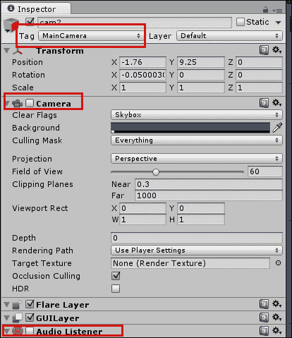

1.  从**项目**视图，创建一个新的**C# 脚本**文件。将其重命名为`CameraSwitch`并在你的编辑器中打开它。

1.  打开你的脚本，将所有内容替换为以下代码：

    ```cs
    using UnityEngine;

    public class CameraSwitch : MonoBehaviour {
      public GameObject[] cameras;
      public string[] shortcuts;
      public bool  changeAudioListener = true;
      void  Update (){
        if (Input.anyKeyDown) {
          for (int i=0; i<cameras.Length; i++) {
            if (Input.GetKeyDown (shortcuts [i]))
              SwitchCamera (i);
          }
        }
      }

    void  SwitchCamera (int indexToSelect){
      for (int i = 0; i<cameras.Length; i++){
        // test whether current array index matches camera to make active
          bool cameraActive = (i == indexToSelect);
          cameras[i].GetComponent<Camera>().enabled = cameraActive;

        if (changeAudioListener)
              cameras[i].GetComponent<AudioListener>().enabled = cameraActive;
          }
        }
    }
    ```

1.  将`CameraSwitch`附加到`Switchboard`游戏对象。

1.  从**检查器**视图，将**摄像机**和**快捷方式**的大小设置为`3`。然后，将场景中的摄像机（包括**多功能摄像机装置**中的**主摄像机** | **枢轴**游戏对象）拖放到**摄像机**插槽中。然后，在**快捷方式**文本字段中输入`1`、`2`和`3`，如图所示：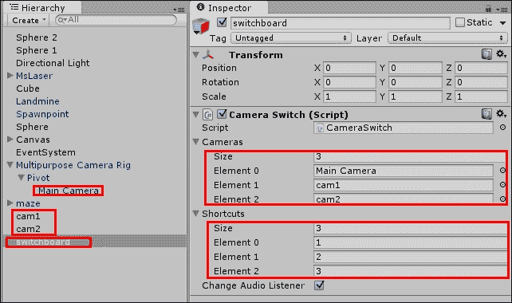

1.  播放你的场景，并通过按键盘上的*1*、*2*和*3*来测试你的摄像机。

## 它是如何工作的...

脚本非常简单。首先，它将按下的键与快捷方式列表进行比较。如果键确实包含在快捷方式列表中，它将被传递到`SwitchCamera`函数，该函数随后遍历摄像机列表，启用与接收到的快捷方式关联的摄像机，并启用其**音频监听器**，如果已勾选**更改音频监听器**选项。

## 还有更多...

这里有一些关于你可以如何尝试稍微改变这个菜谱的想法。

### 使用单启用摄像机

解决这个问题的另一种方法是将所有辅助摄像机保持禁用状态，并通过脚本将它们的位置和旋转分配给主摄像机（如果你想要保存其**变换**设置，你需要复制主摄像机并将其添加到列表中）。

### 通过其他事件触发开关

此外，您可以通过使用如下所示的代码行从其他 GameObject 的脚本中更改您的相机：

```cs
GameObject.Find("Switchboard").GetComponent("CameraSwitch").SwitchCamera(1);
```

## 参见

+   本章中关于**创建游戏内监控摄像头**的配方

# 从屏幕内容创建纹理

如果您想让您的游戏或玩家在游戏中捕捉快照并将其作为纹理应用，这个配方将向您展示如何操作。如果您计划实现游戏中的照片库或在关卡结束时显示过去关键时刻的快照（赛车游戏和特技模拟大量使用此功能），这将非常有用。对于这个特定的例子，我们将从屏幕的框架区域内捕捉快照，并将其打印在显示器的右上角。

## 准备工作

对于这个配方，我们已准备了`BasicScene`Unity 包，其中包含一个名为`BasicScene`的场景。该包位于`1362_05_codes`文件夹中。

## 如何操作...

要从屏幕内容创建纹理，请按照以下步骤操作：

1.  将`BasicScene`包导入一个新的**项目**。

1.  从**项目**视图，打开**BasicScene**关卡。这是一个包含动画角色和一些额外几何形状的基本场景。它还包含用于 UI 元素的**Canvas**。

1.  从**创建**下拉菜单中的**层次结构**视图（**创建** | **UI** | **图像**）创建一个**UI 图像**GameObject。请注意，它将作为**Canvas**GameObject 的子项创建。然后，将其重命名为`frame`。

1.  从**检查器**视图，找到**frame**GameObject 的**图像（脚本）**组件，并将其**源图像**设置为`InputFieldBackground`。这是一个与 Unity 捆绑的精灵，并且已经切片以进行缩放。

1.  现在，从**检查器**视图，将**矩形变换**更改为以下值：**锚点** | **最小值** | **X**：`0.25`，**Y**：`0.25`；**锚点** | **最大值** | **X**：`0.75`，**Y**：`0.75`；**锚点** | **X**：`0.5`，**Y**：`0.5`；**左**：`0`；**上**：`0`；**位置 Z**：`0`；**右**：`0`；**下**：`0`。

1.  从**图像（脚本）**组件中，取消选中**填充中心**选项，如下所示：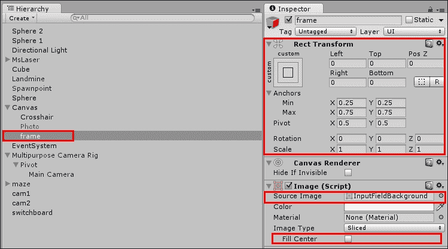

1.  从**创建**下拉菜单中的**层次结构**视图（**创建** | **UI** | **原始图像**）创建一个**UI 原始图像**GameObject。请注意，它将作为**Canvas**GameObject 的子项创建。然后，将其重命名为`Photo`。

1.  从**检查器**视图，找到**Photo**GameObject 的**原始图像（脚本）**组件，并将其**纹理**设置为`None`。同时，从**检查器**视图的顶部，通过取消选中其名称旁边的框来禁用**Photo**GameObject。

1.  现在，从**检查器**视图，将**矩形变换**更改为以下值：**宽度**：`1`；**高度**：`1`；**锚点** | **最小值** | **X**：`0`，**Y**：`1`；**锚点** | **最大值** | **X**：`0`，**Y**：`1`；**锚点** | **X**：`0`，**Y**：`1`；**Pivot** | **X**：`0`，**Y**：`1`；**位置 X**：`0`；**位置 Y**：`0`；**位置 Z**：`0`，如下截图所示：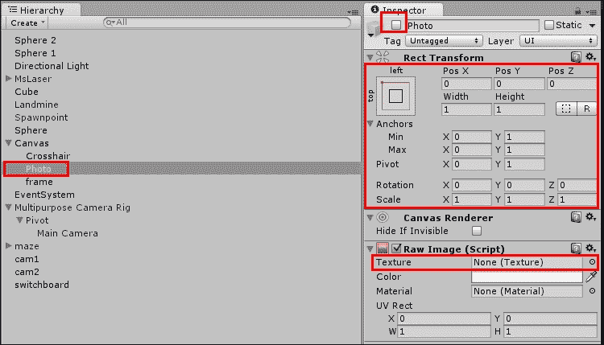

1.  我们需要创建一个脚本。在**项目**视图中，点击**创建**下拉菜单并选择**C# 脚本**。将其重命名为`ScreenTexture`并在您的编辑器中打开它。

1.  打开您的脚本并替换以下代码：

    ```cs
    using UnityEngine;
    using UnityEngine.UI;
    using System.Collections;

    public class ScreenTexture : MonoBehaviour {
      public GameObject photoGUI;
      public GameObject frameGUI;
      public float ratio = 0.25f;

      void  Update (){
        if (Input.GetKeyUp (KeyCode.Mouse0))
          StartCoroutine(CaptureScreen());
      }

      IEnumerator  CaptureScreen (){
        photoGUI.SetActive (false);
        int sw = Screen.width;
        int sh = Screen.height;
        RectTransform frameTransform = frameGUI.GetComponent<RectTransform> ();
        Rect framing = frameTransform.rect;
        Vector2 pivot = frameTransform.pivot;
        Vector2 origin = frameTransform.anchorMin;
        origin.x *= sw;
        origin.y *= sh;
        float xOffset = pivot.x * framing.width;
        origin.x += xOffset;
        float yOffset = pivot.y * framing.height;
        origin.y += yOffset;
        framing.x += origin.x;
        framing.y += origin.y;
        int textWidth = (int)framing.width;
        int textHeight = (int)framing.height;
        Texture2D texture = new Texture2D(textWidth,textHeight);
        yield return new WaitForEndOfFrame();
        texture.ReadPixels(framing, 0, 0);
        texture.Apply();
        photoGUI.SetActive (true);
        Vector3 photoScale = new Vector3 (framing.width * ratio, framing.height * ratio, 1);
        photoGUI.GetComponent<RectTransform> ().localScale = photoScale;
        photoGUI.GetComponent<RawImage>().texture = texture;
      }
    }
    ```

1.  保存您的脚本并将其应用到**主相机**GameObject 中的**多功能相机装置** | **枢轴**GameObject。

1.  在**检查器**视图中，找到**屏幕纹理**组件，并将**Photo GUI**和**Frame GUI**字段分别填充为**Photo**和**frame** GameObject：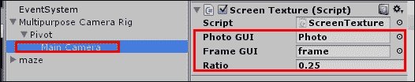

1.  播放场景。您可以通过单击鼠标按钮来捕获屏幕截图（并将其显示在左上角，大小为原始大小的四分之一），如图下所示：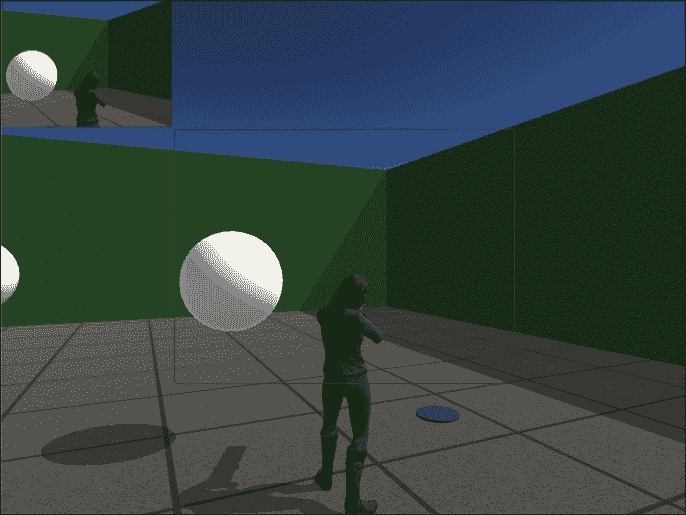

## 它是如何工作的...

首先，我们创建了一个 GUI 框架来截图，以及一个 GUI 元素来应用纹理。然后，我们将脚本应用于**主相机**以捕获屏幕内容并应用新的纹理。

脚本创建了一个新的纹理，并捕获了左鼠标按钮被按下，随后它启动一个协程来计算一个 Rect 区域，从该区域复制屏幕像素，并将它们应用到要由**photo** GUI 元素显示的纹理上，该元素的大小也调整为适合纹理。

Rect 的大小是根据屏幕的尺寸和框架的**Rect Transform**设置计算的，特别是其枢轴、锚点、宽度和高度。然后，通过`ReadPixels()`命令捕获屏幕像素，并将其应用到纹理上，然后将该纹理应用到**原始图像**photo 上，该 photo 的大小调整为满足照片大小与原始像素之间的期望比例。

## 更多...

除了将纹理作为 GUI 元素显示外，您还可以以其他方式使用它。

### 将您的纹理应用到材质上

您可以通过在`CaptureScreen`函数末尾添加类似`GameObject.Find("MyObject").renderer.material.mainTexture = texture;`的行，将您的纹理应用到现有对象的材质上。

### 使用您的纹理作为截图

您可以将您的纹理编码为 PNG 图像文件并保存。请查看 Unity 关于此功能的文档[`docs.unity3d.com/Documentation/ScriptReference/Texture2D.EncodeToPNG.html`](http://docs.unity3d.com/Documentation/ScriptReference/Texture2D.EncodeToPNG.html)。

## 参见

+   第十章，使用外部资源文件和设备中的游戏截图配方

# 缩放望远镜相机

在本配方中，我们将创建一个在按下左鼠标按钮时缩放的望远镜相机。这非常有用，例如，如果我们游戏中有一个狙击手。

## 准备工作...

对于本配方，我们已准备了`BasicScene` Unity 包，其中包含一个名为`BasicScene`的场景。该包位于`1362_05_codes`文件夹中。

## 如何操作...

要创建一个望远镜相机，请按照以下步骤操作：

1.  将`BasicScene`包导入一个新的**项目**。

1.  从**项目**视图中打开**BasicScene**级别。这是一个包含动画角色和一些额外几何形状的基本场景。

1.  通过导航到**资产** | **导入包** | **Effects**导入 Unity 的**效果**包。

1.  在**多功能相机装置** | **枢轴**游戏对象内选择**主摄像机**游戏对象，并应用**Vignette**图像效果（通过导航到**组件** | **图像效果** | **摄像机** | **Vignette and Chromatic Aberration**）。

1.  我们需要创建一个脚本。在**项目**视图中，点击**创建**下拉菜单并选择**C# 脚本**。将其重命名为`TelescopicView`并在您的编辑器中打开它。

1.  打开您的脚本，并用以下代码替换所有内容：

    ```cs
    using UnityEngine;
    using System.Collections;
    using UnityStandardAssets.ImageEffects;

    public class TelescopicView : MonoBehaviour{
      public float zoom = 2.0f;
      public float speedIn = 100.0f;
      public float speedOut = 100.0f;
      private float initFov;
      private float currFov;
      private float minFov;
      private float addFov;
      private VignetteAndChromaticAberration v;
      public float vMax = 10.0f;

      void Start(){
        initFov = Camera.main.fieldOfView;
        minFov = initFov / zoom;
        v = this.GetComponent<VignetteAndChromaticAberration>() as VignetteAndChromaticAberration;
      }
      void Update(){
        if (Input.GetKey(KeyCode.Mouse0))
          ZoomView();
        else
          ZoomOut();
        float currDistance = currFov - initFov;
        float totalDistance = minFov - initFov;
        float vMultiplier = currDistance / totalDistance;
        float vAmount = vMax * vMultiplier;
        vAmount = Mathf.Clamp (vAmount,0,vMax);
        v.intensity = vAmount;
      }

      void ZoomView(){
        currFov = Camera.main.fieldOfView;
        addFov = speedIn * Time.deltaTime;

        if (Mathf.Abs(currFov - minFov) < 0.5f)
          currFov = minFov;
        else if (currFov - addFov >= minFov)
          currFov -= addFov;

        Camera.main.fieldOfView = currFov;
      }

      void ZoomOut(){
        currFov = Camera.main.fieldOfView;
        addFov = speedOut * Time.deltaTime;

        if (Mathf.Abs(currFov - initFov) < 0.5f)
          currFov = initFov;
        else if (currFov + addFov <= initFov)
          currFov += addFov;

        Camera.main.fieldOfView = currFov;
      }
    }
    ```

1.  保存您的脚本并将其应用到**多功能相机装置** | **枢轴**游戏对象内的**主摄像机**游戏对象。

1.  播放级别。您应该会看到一个动画的晕影效果以及缩放效果：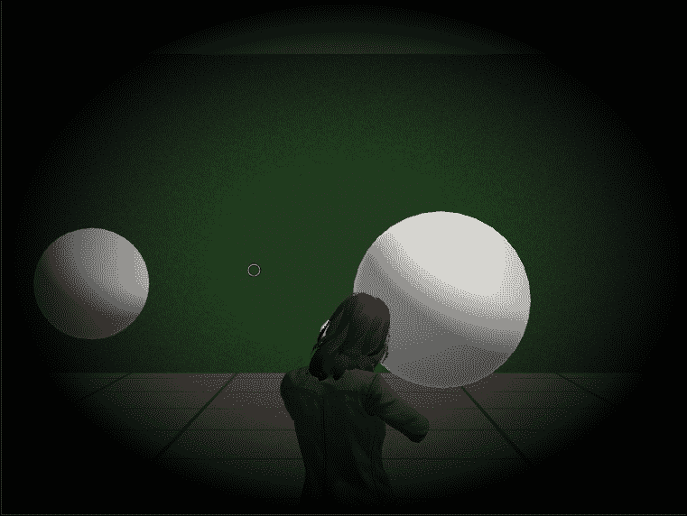

## 它是如何工作的...

缩放效果实际上是由摄像机**视野**（**FOV**）属性值的改变引起的；较小的值会导致较小区域的更近距离视图，而较大的值会扩大 FOV。

当按下鼠标左键时，`TelescopicView`脚本会通过从它减去值来改变摄像机的视野。当鼠标按钮没有被按下时，它会将值添加到 FOV 中，直到达到原始值。

FOV 的缩放限制可以从代码`minFov = initFov / zoom;`中推断出来。这意味着 FOV 的最小值等于其原始值除以缩放量。例如，如果我们的摄像机原本的 FOV 为`60`，我们将**望远镜视图缩放**设置为`2.0`，则允许的最小 FOV 将是`60/2 = 30`。差异在以下两个屏幕截图中显示：

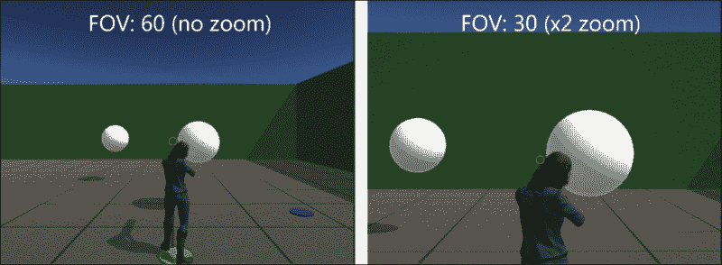

## 更多内容...

您还可以添加一个变量来控制**Vignette**图像效果的**模糊晕影**级别。

# 显示迷你地图

在许多游戏中，更宽的视野对于导航和信息非常有价值。迷你地图对于在第一人称或第三人称模式下提供玩家所需的额外视角非常有用。

## 准备工作...

对于这个食谱，我们准备了`BasicScene` Unity 包，其中包含一个名为`BasicScene`的场景。您还需要导入三个名为`Compass.png, compassMarker.png`和`compassMask.png`的图像文件。所有文件都位于`1362_05_05`文件夹中。

## 如何做...

要创建迷你地图，请按照以下步骤操作：

1.  将`BasicScene`包导入一个新的**项目**。同时，导入提供的`png`文件。打开**BasicScene**级别。

1.  从**项目**视图中，选择`Compass`、`compassMarker`和`compassMask`纹理文件。然后，从**检查器**中，将它们的**纹理类型**更改为**精灵（2D 和 UI）**，保留**精灵模式**为**单个**，并将**锚点**设置为**中心**。单击**应用**以确认更改，如图所示：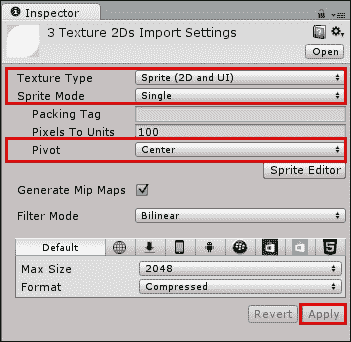

1.  从**层次**视图中创建一个新的**UI 面板**对象（**创建** | **UI** | **面板**）。它将作为 UI **Canvas**游戏对象的子对象创建。将其重命名为`MiniMap`。然后，从**检查器**视图中，将其对齐设置为**顶部/右侧**，将**宽度**和**高度**都更改为`256`，并将其**X 位置**和**Y 位置**字段设置为`-128`。此外，在**图像**组件中，将**compassMask**精灵填充到**源图像**字段中，通过将**Alpha**值提高到`255`来调整**颜色**字段，如图所示：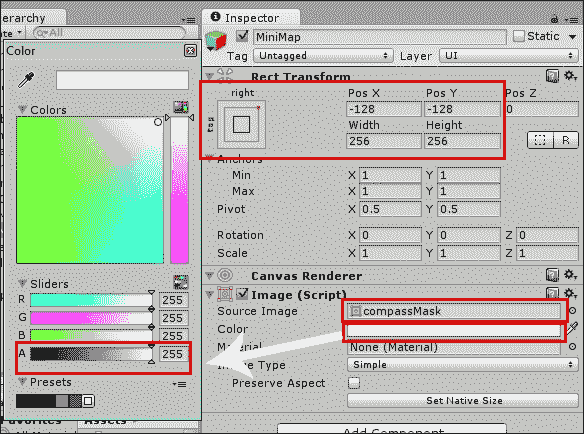

1.  向**MiniMap**添加一个**遮罩**组件（从主菜单中选择**组件** | **UI** | **遮罩**）。然后，从**检查器**视图中，找到**遮罩**组件并取消选中**显示遮罩图形**（它将变为不可见，作为迷你地图的遮罩使用）。

1.  选择**MsLaser**游戏对象（即玩家的角色），然后从**检查器**视图的顶部访问**层**下拉菜单。选择**添加层…**然后命名一个**用户层**`Player`，如图所示：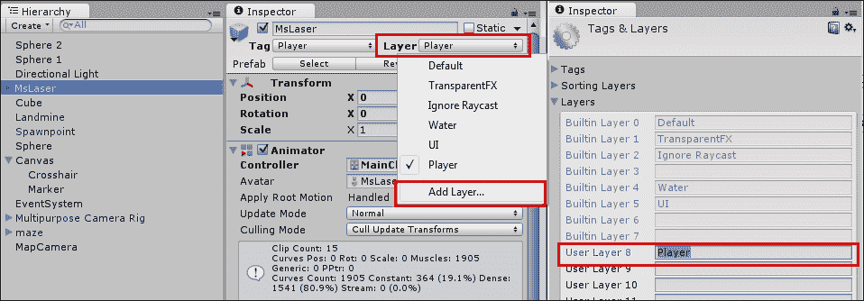

1.  再次选择**MsLaser**角色，然后从**层**下拉菜单中选择**玩家**：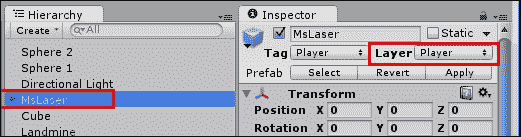

1.  从**项目**视图中创建一个新的**渲染纹理**并将其命名为`Map_Render`。然后，从**检查器**中，将其大小更改为`256 x 256`。

1.  从**层次**视图中创建一个新的相机（**创建** | **相机**）并将其重命名为`MapCamera`。从**检查器**视图中，按照以下参数更改其设置（如图所示）：

    +   **清除标志**：`仅深度`

    +   **剔除遮罩**：`混合…`（取消选择**玩家**）

    +   **投影**：`正交`

    +   **深度**：`1`（或更高）

    +   **目标纹理**：`Map_Render`

    +   此外，取消选中相机的**音频监听器**组件

    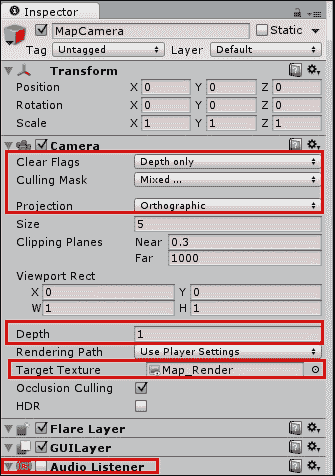

1.  在**层次**视图中，右键单击**MiniMap**并导航到**UI** | **原始图像**以创建一个子 UI 元素。将其命名为`MapTexture`。然后，从**检查器**视图中，将`Map_Render`纹理填充到**纹理**字段中，并单击**设置原生大小**按钮，如图所示：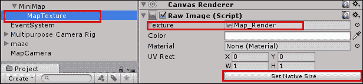

1.  现在，右键单击**MiniMap**并导航到**UI** | **图像**以创建另一个子元素。将其命名为`Compass`。然后，从**检查器**视图中，将`Compass`图像填充到**源图像**字段中，并单击**设置原生大小**按钮。

1.  再次右键单击**迷你地图**并导航到**UI** | **图像**以添加另一个子元素。将其命名为`Marker`。然后，从**检查器**视图，将**源图像**字段填充为`compassMarker`图像，并单击**设置原生大小**按钮。

1.  从**项目**视图，创建一个新的**C# 脚本**并将其命名为`MiniMap`。打开它并将所有内容替换为以下代码：

    ```cs
    using UnityEngine;
    using UnityEngine.UI;
    using System.Collections;

    public class MiniMap : MonoBehaviour
    {
      public Transform target;
      public GameObject marker;
      public GameObject mapGUI;
      public float height = 10.0f;
      public float distance = 10.0f;
      public bool rotate = true;
      private Vector3 camAngle;
      private Vector3 camPos;
      private Vector3 targetAngle;
      private Vector3 targetPos;
      private Camera cam;

      void Start(){
        cam = GetComponent<Camera> ();
        camAngle = transform.eulerAngles;
        targetAngle = target.transform.eulerAngles;
        camAngle.x = 90;
        camAngle.y = targetAngle.y;
        transform.eulerAngles = camAngle;
      }

      void Update(){
        targetPos = target.transform.position;
        camPos = targetPos;
        camPos.y += height;
        transform.position = camPos;
        cam.orthographicSize = distance;
        Vector3 compassAngle = new Vector3();
        compassAngle.z = target.transform.eulerAngles.y;

        if (rotate) {
          mapGUI.transform.eulerAngles = compassAngle;
          marker.transform.eulerAngles = new Vector3();
        } else {
          marker.transform.eulerAngles = -compassAngle;
        }

      }
    }
    ```

1.  保存脚本并将其附加到**MapCamera**。然后，从**检查器**视图，按照以下方式更改**迷你地图**组件的参数（如随后的截图所示）：

    +   **目标**：`MsLaser`

    +   **标记**：`Marker`（之前创建的 UI 元素）

    +   **地图 GUI**：`MiniMap`（之前创建的 UI 面板）

    +   **高度**：`10`

    +   **距离**：`10`

    +   **旋转**：勾选

    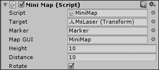

1.  播放场景。您应该能够在屏幕右上角看到迷你地图正在工作：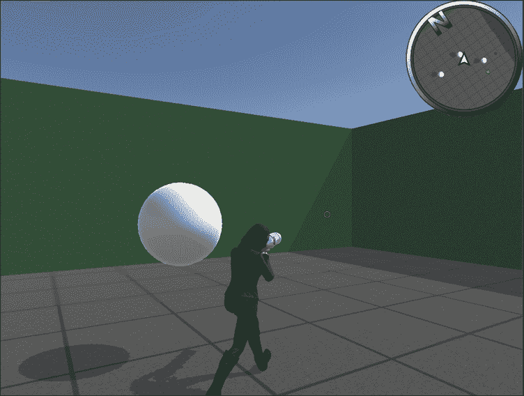

## 它是如何工作的...

迷你地图的主要元素是一个纹理，用作 GUI 元素，从正交相机渲染，从俯视角度跟随玩家。对**MapCamera**进行了一些必要的调整：

+   将其**投影**模式更改为**正交**（以使其成为二维）

+   从其**剔除遮罩**中排除**玩家**标签（以使角色模型对相机不可见）

+   禁用其**音频监听器**（以免与主相机冲突）

迷你地图装饰了一个指南针框架和一个指示玩家位置的标记。所有这些 GUI 元素都由一个**面板**作为父元素，该面板还充当视觉元素的**遮罩**。最后，创建了一个脚本，具有三个作用：配置**相机**（如覆盖区域）的偏好设置，在运行时根据玩家的变换设置重新定位**相机**，并旋转适当的 UI 元素。

## 还有更多...

如果您想对您的迷你地图进行更多实验，请继续阅读。

### 覆盖更宽或更窄的区域

迷你地图的范围由**距离**参数给出。更高的值将导致更广泛的区域覆盖，因为**迷你地图**类使用与正交相机视口大小相同的值。

### 改变地图的方向

默认情况下，迷你地图设置为随着玩家改变方向而旋转。如果您希望它保持静态，取消勾选**旋转**选项，使**标记**旋转。

### 将您的迷你地图适配到其他风格

您可以轻松修改此配方以制作赛车游戏电路地图的俯视图或等距视图。只需手动定位相机并防止其跟随角色。

# 创建游戏中的监控摄像头

虽然在许多情况下使用第二个视口可能很有用，但有时您需要在运行时将摄像头渲染的图像输出到纹理。为了说明这一点，在这个食谱中，我们将使用**渲染纹理**创建一个将视频传输到监视器的游戏内监控摄像头。

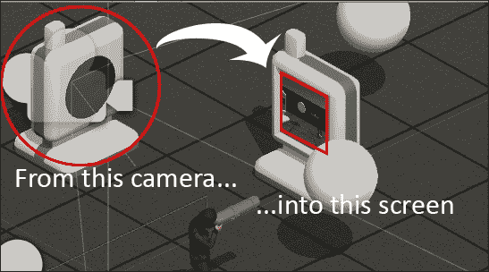

游戏内监控摄像头

## 准备工作

对于这个食谱，我们已准备好`BasicScene`Unity 包，其中包含一个名为`BasicScene`的场景，以及两个用于监视器和摄像头对象的 FBX 3D 模型。该包位于`1362_05_codes`文件夹中，3D 模型位于`1362_05_06`文件夹中。

## 如何操作...

要创建画中画显示，只需按照以下步骤操作：

1.  将`BasicScene`包和`monitor`以及`camera`模型导入到您的 Unity 项目中。

1.  从**项目**视图，打开**BasicScene**级别。这是一个包含动画角色和一些额外几何形状的基本场景。

1.  从**项目**视图，通过将它们拖入**层次结构**面板将**监视器**和**摄像头**对象放置到场景中。它们的**变换**设置应如下（如图下截图所示）：**监视器**：**位置**：**X**：`0`；**Y**：`0.09`；**Z**：`4`。**旋转**：**X**：`0`；**Y**：`180`；**Z**：`0`。**摄像头**：**位置**：**X**：`-3`；**Y**：`0.06`；**Z**：`4`。**旋转**：**X**：`0`；**Y**：`90`；**Z**：`0`：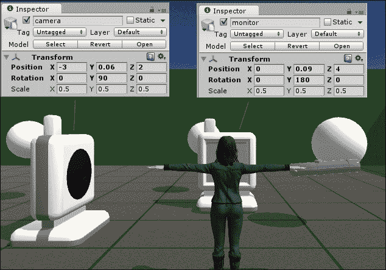

1.  从**项目**视图创建一个新的**渲染纹理**，并将其重命名为`screen`。然后，从**检查器**视图，将其**大小**更改为`512` x `512`。

1.  通过**层次结构**视图顶部的**创建**下拉菜单（**创建** | **摄像头**）向场景中添加一个新的**摄像头**。然后，从**检查器**视图，将其命名为`Surveillance`并使其成为**摄像头**GameObject 的子对象。然后，将其**变换**设置更改为以下内容：**位置**：**X**：`0`；**Y**：`2`；**Z**：`0`，和**旋转**：**X**：`0`；**Y**：`0`；**Z**：`0`。

1.  选择您创建的`Surveillance`摄像头，并从**检查器**视图，将其**裁剪平面** | **近面**更改为`0.6`。同时，将**目标纹理**槽位填充为**渲染纹理**屏幕，并禁用摄像头的**音频监听器**组件，如图下截图所示：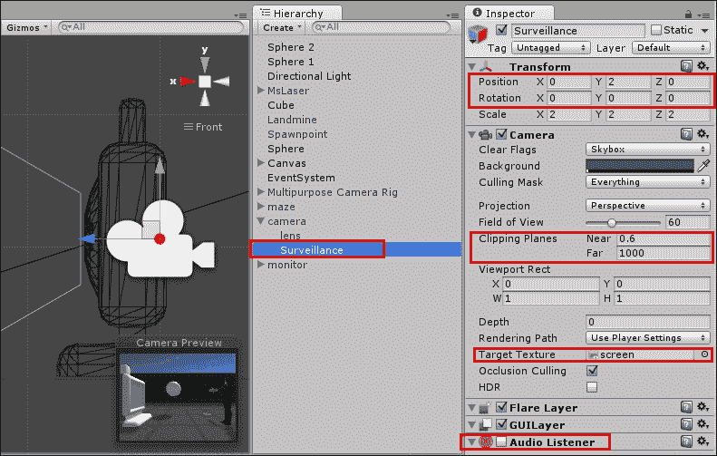

1.  从**层次结构**视图，展开**监视器**对象并选择其**屏幕**子对象。然后，从**检查器**中找到其材质（命名为**Desert**），并在**着色器**下拉菜单中将其更改为**Unlit/Texture**。最后，将**屏幕**纹理设置为基本纹理，如图下截图所示：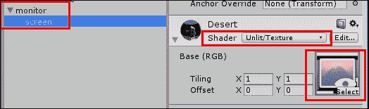

1.  现在是时候向纹理添加一些后期处理效果了。从主菜单，导入**效果**包（**资产** | **导入包** | **效果**）。

1.  从**层次结构**视图中选择`Surveillance`摄像头。然后，从主菜单中，添加**灰度**图像效果组件（**组件** | **图像效果** | **颜色调整** | **灰度**）。同时，添加**噪点和颗粒**图像效果（**组件** | **图像效果** | **噪声** | **噪点和颗粒（电影风格）**）。最后，从**检查器**视图中，将**噪点和颗粒**的**强度乘数**设置为`4`。

1.  播放你的场景。你应该能够在监视器的屏幕上实时看到你的操作，如图所示：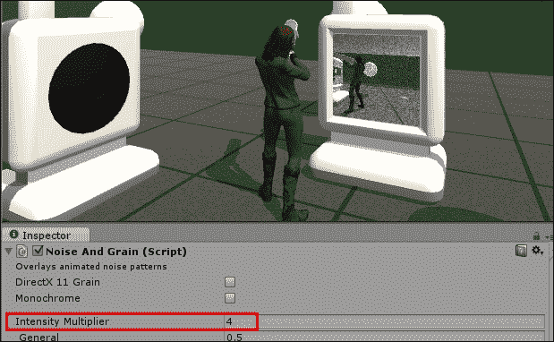

## 它是如何工作的...

我们通过将监控摄像头作为应用到**屏幕**上的**渲染纹理**的来源，实现了最终效果。为了便于重新定位，摄像头被设置为摄像头的 3D 模型的子对象。此外，其**近裁剪面**被重新调整，以避免显示摄像头 3D 模型几何形状的一部分，并且禁用了其**音频源**组件，以免与主摄像头的组件冲突。

除了设置监控摄像头外，还向其中添加了两个**图像效果**：**噪点和颗粒**和**灰度**。这些效果共同作用，应该使**渲染纹理**看起来更像廉价显示器的屏幕。

最后，我们的**屏幕**渲染纹理被应用到屏幕的 3D 对象的材质上（其着色器被更改为**Unlit/texture**，以便在低/无光条件下可见，就像真实的显示器一样）。
