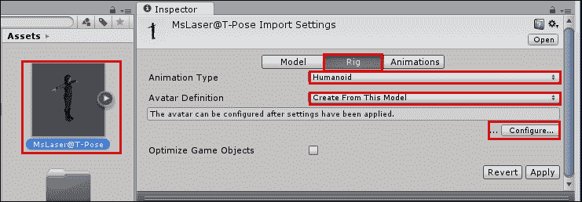
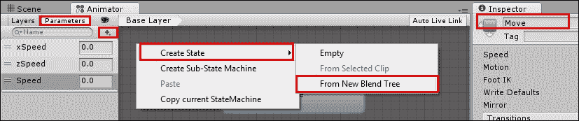
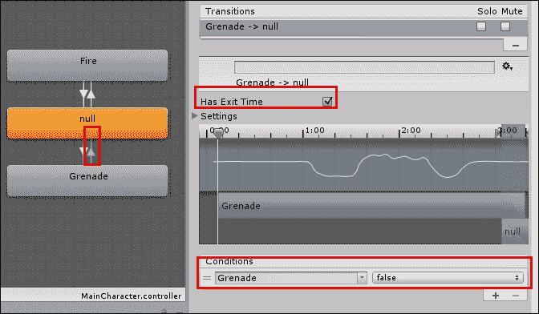

# 第七章。控制 3D 动画

在本章中，我们将介绍：

+   配置角色的 Avatar 和空闲动画

+   使用根运动和混合树移动你的角色

+   使用层和遮罩混合动画

+   将状态组织到子状态机中

+   通过脚本转换角色控制器

+   将刚体道具添加到动画角色上

+   使用动画事件抛掷一个对象

+   将 Ragdoll 物理应用到角色上

+   旋转角色的躯干以瞄准武器

# 简介

**Mecanim** 动画系统彻底改变了在 Unity 中对角色进行动画和控制的模式。在本章中，我们将学习如何利用其灵活性、强大功能和友好且高度可视化的界面。

## 整体图景

使用 Mecanim 系统控制可玩角色可能看起来是一个复杂的任务，但实际上非常直接。


希望到本章结束时，你至少能对 Mecanim 系统有一个基本的了解。为了更全面地了解这个主题，可以考虑阅读 Jamie Dean 的 *Unity Character Animation with Mecanim*，这本书也由 Packt Publishing 出版。

附加说明——所有的配方都将使用 **Mixamo** 动作包。Mixamo 是一个完整的角色制作、绑定和动画解决方案。实际上，正在使用的角色是用 Mixamo 的角色创建软件 **Fuse** 设计的，并使用 Mixamo 的 **Auto-rigger** 进行绑定。你可以在 Unity 的 Asset Store ([`www.assetstore.unity3d.com/en/#!/publisher/150`](https://www.assetstore.unity3d.com/en/#!/publisher/150)) 或他们的网站 [`www.mixamo.com/`](https://www.mixamo.com/) 上了解更多关于 Mixamo 和他们的产品。

请注意，尽管 Mixamo 提供了 Mecanim 准备好的角色和动画片段，但我们在本章的配方中将使用未准备的动画片段。这样做的原因是让你在处理通过其他方法和来源获得的资产时更有信心。

# 配置角色的 Avatar 和空闲动画

使 Mecanim 非常灵活和强大的一个特性是能够快速将动画片段从一个角色重新分配到另一个角色。这是通过使用 **Avatar** 实现的，它基本上是在你的角色的原始骨架和 Unity 的 **Animator** 系统之间的一层。

在这个配方中，我们将学习如何在绑定的角色上配置 Avatar 骨架。

## 准备工作

对于这个配方，你需要 `MsLaser@T-Pose.fbx` 和 `Swat@rifle_aiming_idle.fbx` 文件，这些文件包含在 `1362_07_code/character_and_clips/` 文件夹中。

## 如何做到这一点...

要配置一个 Avatar 骨架，请按照以下步骤操作：

1.  将 `MsLaser@T-Pose.fbx` 和 `Swat@rifle_aiming_idle.fbx` 文件导入到你的项目中。

1.  从 **项目** 视图中选择 `MsLaser@T-Pose` 模型。

1.  在**检查器**视图中，在**MsLaser@T-Pose 导入设置**下，激活**骨架**部分。将**动画类型**更改为**人类**。然后，将**Avatar 定义**保留为**从此模型创建**。最后，点击**配置…**按钮。

1.  **检查器**视图将显示新创建的 Avatar。观察 Unity 如何正确地将我们角色的骨骼映射到其结构中，例如，将**mixamoRig:LeftForeArm**骨骼分配为 Avatar 的**下臂**。当然，如果需要，我们可以重新分配骨骼。现在，只需点击**完成**按钮关闭视图。

1.  现在我们已经准备好了我们的 Avatar，让我们为**空闲**状态配置动画。从**项目**视图中，选择**Swat@rifle_aiming_idle**文件。

1.  激活**骨架**部分，将**动画类型**更改为**人类**，并将**Avatar 定义**更改为**从此模型创建**。通过点击**应用**来确认更改。

1.  激活**动画**部分（位于**骨架**右侧）。从**剪辑**列表中选择**rifle_aiming_idle**剪辑。**预览区域**（检查器底部的底部）将显示消息**没有模型可用于预览。请** **将模型拖动到此预览区域**。将**MsLaser@T-Pose**拖动到**预览**区域以纠正此问题。

1.  从**剪辑**列表中选择**rifle_aiming_idle**，勾选**循环时间**和**循环姿态**选项。同时，点击**限制范围**按钮调整时间线到动画剪辑的实际时间。然后，在**根变换旋转**下，勾选**烘焙到姿态**，并选择**基于** | **原始**。在**根变换位置（Y）**下，勾选**烘焙到姿态**，并选择**基于（在开始时）** | **原始**。在**根变换位置（XZ）**下，不勾选**烘焙到姿态**，并选择**基于（在开始时）** | **质心**。最后，点击**应用**以确认更改。

1.  为了访问动画剪辑并播放它们，我们需要创建一个控制器。通过从**项目**视图点击**创建**按钮，然后选择**动画控制器**选项来完成此操作。将其命名为`MainCharacter`。

1.  双击**动画控制器**以打开**动画器**视图。

1.  从**动画器**视图，在网格上右键单击以打开上下文菜单。然后，选择**创建状态** | **空**选项**。**一个名为**新状态**的新框将出现。它将呈橙色，表示它是默认状态。

1.  选择**新状态**，在**检查器**视图中，将其名称更改为`Idle`。此外，在**运动**字段中，通过从列表中选择或从**项目**视图拖动来选择**rifle_aiming_idle**。

1.  将`MsLaser@T-Pose`模型从**项目**视图拖到**层次结构**视图，并将其放置在场景中。

1.  从**层次结构**视图中选择**MsLaser@T-Pose**，并在**检查器**视图中观察其**动画器**组件。然后，将新创建的**MainCharacter 控制器**分配给其**控制器**字段。

1.  播放你的场景以查看角色正确地进行了动画处理。

## 它是如何工作的...

为角色制作动画需要许多步骤。首先，我们根据角色模型的原始骨骼结构创建了它的**虚拟形象**。然后，我们使用它自己的虚拟形象设置了**动画片段**（作为角色网格，存储在`.fbx`文件中），调整了动画片段，固定其大小并使其循环。我们还烘焙了其**根变换旋转**以遵守原始文件的方向。最后，创建了一个**动画控制器**，并将编辑后的动画片段设置为默认的**动画状态**。

虚拟形象的概念使得 Mecanim 非常灵活。一旦你有了**控制器**，你就可以将其应用于其他类人角色，只要它们有虚拟形象身体蒙版。如果你想亲自尝试，导入`mascot.fbx`文件，它也位于`charater_and_clips`文件夹内，将步骤 3 和 4 应用到这个角色上，将其放置在场景中，并在**动画器**组件中将**MainCharacter**设置为它的**控制器**。然后，播放场景以查看吉祥物正在播放**rifle_aiming_idle**动画片段。

## 更多内容...

要了解更多关于动画控制器的信息，请查看 Unity 的文档[`docs.unity3d.com/Manual/class-AnimatorController.html`](http://docs.unity3d.com/Manual/class-AnimatorController.html)。

# 使用根运动和混合树移动你的角色

Mecanim 动画系统能够将根运动应用于角色。换句话说，它**实际上**根据动画片段移动角色，而不是在播放原地动画循环时任意转换角色模型。这使得大多数 Mixamo 动画片段非常适合与 Mecanim 一起使用。

动画系统的另一个功能是**混合树**，它可以平滑且容易地混合动画片段。在这个配方中，我们将利用这些功能使我们的角色向前和向后行走/奔跑，并在不同速度下向右和向左横移。

## 准备工作

对于这个配方，我们准备了一个名为`Character_02`的 Unity 包，其中包含一个角色和一个基本的动画控制器。该包位于`1362_07_02`文件夹中，包括必要的动画片段的`.fbx`文件。

## 如何操作...

要使用**混合树**将根运动应用于你的角色，请按照以下步骤操作：

1.  将`Character_02.unityPackage`导入到新项目中。同时导入`Swat@rifle_run, Swat@run_backwards, Swat@strafe, Swat@strafe_2, Swat@strafe_left, Swat@strafe_right, Swat@walking`, `和 Swat@walking_backwards .fbx`文件。

1.  我们需要配置我们的动画剪辑。从**Project**视图下，选择**Swat@rifle_run**。

1.  激活**Rig**部分。将**Animation Type**更改为**Humanoid**，将**Avatar Definition**更改为**Create From this Model**。通过点击**Apply**进行确认。

1.  现在，激活**Animations**部分（位于**Rig**右侧）。从**Clips**列表中选择**rifle_run**剪辑。在**Inspector**视图底部的**Preview area**将显示消息**No model is available for preview. Please drag a model into this Preview area**。将**MsLaser@T-Pose**拖动到**Preview**区域以纠正此问题。

1.  在**Clips**列表中选择**rifle_run**后，选择**rifle_run**剪辑（从**Clips**列表中），并勾选**Loop Time**和**Loop Pose**选项。同时，点击**Clamp Range**按钮以调整时间线到动画剪辑的实际时间。

1.  然后，在**Root Transform Rotation**下，勾选**Bake Into Pose**，并选择**Baked Upon (at Start)** | **Original**。在**Root Transform Position (Y)**下，勾选**Bake Into Pose**，并选择**Baked Upon** | **Original**。在**Root Transform Position (XZ)**下，不勾选**Bake Into Pose**，并选择**Baked Upon (at Start)** | **Center of Mass**。最后，点击**Apply**以确认更改。

1.  对以下每个动画剪辑重复步骤 3 到 6：**Swat@run_backwards**，**Swat@strafe**，**Swat@strafe_2**，**Swat@strafe_left**，**Swat@strafe_right**，**Swat@walking**，和**Swat@walking_backwards**。

1.  从**Project**视图下，选择**MsLaser**预制体并将其拖动到**Hierarchy**视图，放置到场景中。

1.  从**Hierarchy**视图下，选择**MsLaser**GameObject，并为其附加一个**Character Controller**组件（**menu Component** | **Physics** | **Character Controller**）。然后，将其**Skin Width**设置为`0.0001`，其**Center**设置为**X**: **0**，**Y**: **0.9**，**Z**: **0**；同时将其**Radius**更改为**0.34**，其**Height**更改为**1.79**。

1.  在**Project**视图下，打开**MainCharacter**控制器。

1.  在**Animator**视图的右上角，激活**Parameters**部分，并使用**+**符号创建三个新的**Parameters (Float)**，分别命名为`xSpeed`，`zSpeed`和`Speed`。

1.  我们确实为我们的角色提供了一个**Idle**状态，但我们需要新的状态。在网格区域上右键单击，从上下文菜单中导航到**Create State** | **From New Blend Tree**。从**Inspector**视图更改其名称为`Move`。

1.  双击**移动**状态。你会看到你创建的空混合树。选择它，在**检查器**视图中将其重命名为`Move`。然后，将其**混合类型**更改为**2D 自由形式方向**，也在**参数**选项卡中设置**xSpeed**和**zSpeed**。最后，使用**Motion**列表底部的**+**号添加九个新的**运动字段**。

1.  现在，将以下运动剪辑及其相应的**Pos X**和**Pos Y**值填充到**Motion**列表中：**run_backwards**，`0`，`-1`；**walking_backwards**，`0`，`-0.5`；**rifle_aiming_idle**，`0`，`0`；**walking**，`0`，`0.5`；**rifle_run**，`0`，`1`；**strafe**，`-1`，`0`；**strafe_left**，`-0.5`，`0`；**strafe_right**，`0.5`，`0`；**strafe_2**，`1`，`0`。你可以通过从列表中选择它来填充**Motion**列表，或者如果有多个具有相同名称的剪辑，你可以将其从**项目视图**拖动到槽位（通过展开相应的模型图标）上。

1.  双击网格区域，从**移动**混合树回到**基础层**。

1.  由于我们在**移动**混合树中有`rifle_aiming_idle`运动剪辑，我们可以删除原始的**空闲**状态。右键单击**空闲**状态框，从菜单中选择**删除**。**移动**混合状态将成为新的默认状态，变为橙色。

1.  现在，我们必须创建一个脚本，将玩家的输入转换为创建来控制动画的变量。

1.  从**项目视图**创建一个新的**C# 脚本**，并将其命名为`BasicController`。

1.  打开你的脚本，将其替换为以下代码：

    ```cs
    using UnityEngine;
    using System.Collections;

    public class BasicController: MonoBehaviour {
      private Animator anim;
      private CharacterController controller;
      public float transitionTime = .25f;
      private float speedLimit = 1.0f;
      public bool moveDiagonally = true;
      public bool mouseRotate = true;
      public bool keyboardRotate = false;

      void Start () {
        controller = GetComponent<CharacterController>();
        anim = GetComponent<Animator>();
      }

      void Update () {
        if(controller.isGrounded){
          if (Input.GetKey (KeyCode.RightShift) ||Input.GetKey (KeyCode.LeftShift))
            speedLimit = 0.5f;
          else
            speedLimit = 1.0f;

          float h = Input.GetAxis("Horizontal");
          float v = Input.GetAxis("Vertical");
          float xSpeed = h * speedLimit;
          float zSpeed = v * speedLimit;
          float speed = Mathf.Sqrt(h*h+v*v);

          if(v!=0 && !moveDiagonally)
            xSpeed = 0;

          if(v!=0 && keyboardRotate)
            this.transform.Rotate(Vector3.up * h, Space.World);

          if(mouseRotate)
            this.transform.Rotate(Vector3.up * (Input.GetAxis("Mouse X")) * Mathf.Sign(v), Space.World);

          anim.SetFloat("zSpeed", zSpeed, transitionTime, Time.deltaTime);
          anim.SetFloat("xSpeed", xSpeed, transitionTime, Time.deltaTime);
          anim.SetFloat("Speed", speed, transitionTime, Time.deltaTime);
        }
      }
    }
    ```

1.  保存你的脚本并将其附加到**MsLaser**游戏对象上，在**层次结构**视图中。然后，添加**平面**（菜单选项**GameObject** | **3D Object** | **Plane**），并将其放置在角色下方。

1.  演示你的场景并测试游戏。你可以使用箭头键（或*WASD*键）来控制你的角色。按住*Shift*键会减慢速度。

## 它是如何工作的...

当`BasicController`脚本检测到任何方向键被使用时，它会将**Animator**状态的`Speed`变量设置为大于 0 的值，将**Animator**状态从**空闲**变为**移动**。**移动**状态反过来会根据`xSpeed`（从**水平轴**输入获取，通常是*A*和*D*键）和`zSpeed`（从**垂直轴**输入获取，通常是*W*和*S*键）的输入值混合它所填充的运动剪辑。由于 Mecanim 能够将根运动应用于角色，我们的角色实际上会沿着结果方向移动。

例如，如果按下*W*和*D*键，`xSpeed`和`zSpeed`值将增加到 1.0。从**检查器**视图可以看到，这种组合将导致名为**rifle_run**和**strafe_2**的运动剪辑之间的混合，使角色以对角线（前+右）的方式奔跑。


我们的**BasicController**包括三个复选框以提供更多选项：**对角移动**—默认设置为**true**，允许在向前/向后和向左/向右剪辑之间进行混合；**鼠标旋转**—默认设置为**true**，允许使用鼠标旋转角色，在移动时改变方向；**键盘旋转**—默认设置为**false**，允许通过同时使用左右和向前/向后方向键来旋转角色。

## 更多内容...

我们使用的混合树使用了**2D 自由形式方向混合类型**。然而，如果我们只有四个动画剪辑（向前、向后、向左和向右），**2D 简单方向**将是一个更好的选择。更多信息请查看以下链接：

+   在 Unity 文档中了解更多关于混合树和 2D 混合的信息，请访问：[`docs.unity3d.com/Manual/BlendTree-2DBlending.html`](http://docs.unity3d.com/Manual/BlendTree-2DBlending.html)。

+   此外，如果您想了解更多关于 Mecanim 动画系统，有一些链接您可以查看，例如 Unity 的文档：[`docs.unity3d.com/Manual/AnimationOverview.html`](http://docs.unity3d.com/Manual/AnimationOverview.html)。

+   Mecanim 示例场景可在 Unity Asset Store 中找到：[`www.assetstore.unity3d.com/en/#!/content/5328`](https://www.assetstore.unity3d.com/en/#!/content/5328)。

+   Mecanim 视频教程可在：[`unity3d.com/pt/learn/tutorials/topics/animation`](http://unity3d.com/pt/learn/tutorials/topics/animation)找到。

# 使用层和遮罩混合动画

混合动画是向您的动画角色添加复杂性的好方法，而无需大量动画剪辑。使用**层**和**遮罩**，我们可以通过播放特定身体部分的特定剪辑来组合不同的动画。在这个菜谱中，我们将应用这种技术到我们的动画角色上，触发发射步枪和投掷手榴弹的动画剪辑，同时根据玩家的输入保持下半身移动或空闲。

## 准备工作

对于这个菜谱，我们准备了一个名为`Mixing`的 Unity 包，其中包含一个具有动画角色的基本场景。该包位于`1362_07_03`文件夹中，包括名为`Swat@firing_rifle.fbx`和`Swat@toss_grenade.fbx`的动画剪辑。

## 如何操作...

要使用层和遮罩混合动画，请按照以下步骤操作：

1.  创建一个新的项目并导入`Mixing`Unity 包。然后，从**项目视图**中打开**mecanimPlayground**级别。

1.  将`Swat@firing_rifle.fbx`和`Swat@toss_grenade.fbx`文件导入到项目中。

1.  我们需要配置动画剪辑。从**项目视图**，选择**Swat@firing_rifle**动画剪辑。

1.  激活**绑定**部分。将**动画类型**更改为**人类**，并将**头像定义**更改为**从此模型创建**。通过点击**应用**来确认更改。

1.  现在，激活**动画**部分。从**剪辑**列表中选择**firing_rifle**剪辑，点击**限制范围**按钮调整时间轴，并勾选**循环时间**和**循环姿态**选项。在**根变换旋转**下，勾选**烘焙到姿态**，并选择**烘焙于**|**原始**。在**根变换位置（Y）**下，勾选**烘焙到姿态**，并选择**烘焙于（起始处）**|**原始**。在**根变换位置（XZ）**下，取消勾选**烘焙到姿态**。点击**应用**以确认更改。

1.  选择**Swat@toss_grenade**动画剪辑。激活**绑定**部分。然后，将**动画类型**更改为**人类**，并将**头像定义**更改为**从此模型创建**。通过点击**应用**来确认更改。

1.  现在，激活**动画**部分。从**剪辑**列表中选择**toss_grenade**剪辑，点击**限制范围**按钮调整时间轴，并取消选中**循环时间**和**循环姿态**选项。在**根变换旋转**下，勾选**烘焙到姿态**，并选择**烘焙于（起始处）**|**原始**。在**根变换位置（Y）**下，勾选**烘焙到姿态**，并选择**烘焙于（起始处）**|**原始**）。在**根变换位置（XZ）**下，取消勾选**烘焙到姿态**。点击**应用**以确认更改。

1.  让我们创建一个面具。从**项目**视图，点击**创建**按钮，并将**头像面具**添加到项目中。将其命名为**BodyMask**。

1.  选择**BodyMask**选项卡，并在**检查器**视图中展开**人类**部分以取消选择角色的腿部、基础和**IK**点，使它们的轮廓变红。

1.  从**层次结构**视图，选择**MsLaser**角色。然后，从**检查器**视图中的**动画器**组件，双击**MainCharacter**控制器以打开它。

1.  在**动画器**视图中，通过点击左上角的**+**号在**图层**选项卡上创建一个新图层，位于**基础图层**上方。

1.  将新图层命名为**UpperBody**，并点击齿轮图标进行设置。然后，将其**权重**更改为`1`，并在**遮罩**槽中选择**BodyMask**。此外，将混合模式更改为**加法**。

1.  现在，在**动画器**视图中，选择**UpperBody**层，创建三个新的空状态（通过右键点击网格区域并从菜单中选择**创建状态** | **空**）。将默认（橙色）状态命名为**null**，其他两个命名为**Fire**和**Grenade**。

1.  现在，访问**参数**选项卡并添加两个布尔类型的新的参数：`Fire`和`Grenade`。

1.  选择**Fire**状态，并在**检查器**视图中将**firing_rifle**动画片段添加到**运动**字段。

1.  现在，选择**Grenade**状态，并在**检查器**视图中，将**toss_grenade**动画片段添加到**运动**字段。

1.  右键点击**null**状态框，然后从菜单中选择**创建转换**。接着，将白色箭头拖动到**Fire**框上。

1.  选择箭头（它将变为蓝色）。从**检查器**视图中取消勾选**Has Exit Time**选项。然后，访问**条件**列表，点击加号**+**添加一个新条件，并将其设置为**Fire**和**true**。

1.  现在，从**null**到**Grenade**创建转换。选择箭头（它将变为蓝色）。从**检查器**视图中取消勾选**Has Exit Time**选项。然后，访问**条件**列表，点击加号**+**添加一个新条件，并将其设置为**Grenade**和**true**。

1.  现在，从**Fire**到**null**，以及从**Grenade**到**null**创建转换。然后，选择从**Fire**到**null**的箭头，并在**条件**框中选择**Fire**和**false**选项。保留**Has Exit Time**选项的勾选状态。

1.  最后，选择从**Grenade**到**null**的箭头。在**条件**框中，选择**Grenade**和**false**选项。保留**Has Exit Time**选项的勾选状态。

1.  从**层次**视图中，选择**MsLaser**角色。在**检查器**视图中找到**基本控制器**组件并打开其脚本。

1.  在`Update()`函数结束前立即添加以下代码：

    ```cs
      if(Input.GetKeyDown(KeyCode.F)){
        anim.SetBool("Grenade", true);
      } else {
        anim.SetBool("Grenade", false);
      }
      if(Input.GetButtonDown("Fire1")){
        anim.SetBool("Fire", true);
      }
      if(Input.GetButtonUp("Fire1")){
        anim.SetBool("Fire", false);
      }
    ```

1.  保存脚本并播放场景。您可以通过点击**fire**按钮并按*F*键来触发**firing_rifle**和**toss_grenade**动画。观察角色的腿部仍然对**Move**动画状态做出反应。

## 它是如何工作的...

一旦创建了 Avatar 面具，它可以用作过滤实际播放特定层动画状态的身体部分的方式。在我们的例子中，我们将**fire_rifle**和**toss_grenade**动画片段限制在角色的上半身，使下半身可以自由播放与运动相关的动画片段，例如行走、跑步和侧滑。

## 还有更多...

你可能已经注意到 **UpperBody** 层有一个名为 **Blending** 的参数，我们将其设置为 **Additive**。这意味着该层的动画状态将添加到下层的状态中。如果将其更改为 **Override**，则当播放时，该层的动画将覆盖下层的动画状态。在我们的例子中，**Additive** 有助于在跑步时保持瞄准稳定。

更多关于 **Animation Layers** 和 **Avatar Body Masks** 的信息，请查看 Unity 的文档，链接为 [`docs.unity3d.com/Manual/AnimationLayers.html`](http://docs.unity3d.com/Manual/AnimationLayers.html) 和 [`docs.unity3d.com/Manual/class-AvatarMask.html`](http://docs.unity3d.com/Manual/class-AvatarMask.html)。

# 将状态组织到子状态机中

当动画区域变得过于杂乱时，你总是可以考虑将你的动画状态组织到子状态机中。在这个食谱中，我们将使用这种技术来组织角色的转向动画状态。此外，由于提供的动画剪辑不包括根运动，我们将利用这个机会通过脚本说明如何克服根运动的不足，使用它使角色向左和向右转动 45 度。


## 准备工作

对于这个食谱，我们准备了一个名为 `Turning` 的 Unity 包，其中包含一个具有动画角色的基本场景。该包位于 `1362_07_04` 文件夹中，还包括名为 `Swat@turn_right_45_degrees.fbx` 和 `Swat@turn_left.fbx` 的动画剪辑。

## 如何操作...

要通过脚本应用根运动，请按照以下步骤操作：

1.  创建一个新的项目并导入 `Turning` Unity 包。然后，从 **Project** 视图打开 **mecanimPlayground** 级别。

1.  在项目中导入 `Swat@turn_right_45_degrees.fbx` 和 `Swat@turn_left.fbx` 文件。

1.  我们需要配置我们的动画剪辑。从 **Project** 视图中选择 **Swat@turn_left** 文件。

1.  激活 **Rig** 部分。将 **Animation Type** 更改为 **Humanoid**，并将 **Avatar Definition** 更改为 **Create From this Model**。通过点击 **Apply** 来确认。

1.  现在，激活 **Animations** 部分。从 **Clips** 列表中选择 **turn_left** 剪辑，点击 **Clamp Range** 按钮调整时间线，并勾选 **Loop Time** 选项。在 **Root Transform Rotation** 下，勾选 **Bake Into Pose**，并导航到 **Baked Upon (at Start)** | **Original**。在 **Root Transform Position (Y)** 下，勾选 **Bake Into Pose**，并选择 **Baked Upon (at Start)** | **Original**。在 **Root Transform Position (XZ)** 下，不勾选 **Bake Into Pose**。点击 **Apply** 以确认更改。

1.  对于 **Swat@turning_right_45_degrees**，重复步骤 4 和 5。

1.  从 **Hierarchy** 视图中选择 **MsLaser** 角色。然后，从 **Inspector** 视图中的 **Animator** 组件打开 **MainCharacter** 控制器。

1.  从**动画器**视图的左上角激活**参数**部分，并使用**+**符号创建两个新的**参数（布尔值**）命名为`TurnLeft`和`TurnRight`。

1.  右键单击网格区域。从上下文菜单中选择**创建子状态机**。在**检查器**视图中，将其重命名为`Turn`。

1.  双击**向右转**子状态机。在网格区域上右键单击，选择**创建状态** | **空**，并添加一个新状态。将其重命名为`向左转`。然后，添加另一个名为`向右转`的状态。

1.  在**检查器**视图中，将`Turn Left`填充为**turn_left**动作剪辑。然后，将`Turn Right`填充为**turning_right_45_degrees**。

1.  从**向右转**子状态机退出回到**基础层**。通过在每个状态上右键单击并选择**创建转换**选项，在**移动**和**向左转**，以及**移动**和**向右转**之间创建转换。

1.  进入**向右转**子状态机。然后，从**向左转**和**向右转**创建到**移动**状态的转换。

1.  选择从**向右转**到**（向上）基础层**的箭头。它将变为蓝色。从**检查器**视图中取消选中**具有退出时间**选项。然后，访问**条件**列表，点击**+**符号添加一个新条件，并将其设置为**向右转**和**false**。

1.  选择从**（向上）基础层**到**向右转**的箭头。在**检查器**视图中，取消选中**具有退出时间**选项。然后，访问**条件**列表，点击**+**符号添加一个新条件，并将其设置为**向右转**和**true**。

1.  使用**向左转**作为条件，重复步骤 14 和 15，使用**（向上）基础层**和**向左转**之间的箭头。

1.  在**层次结构**视图中，选择**MsLaser**角色。然后，从**检查器**视图中打开**BasicController**组件的脚本。

1.  在`if(controller.isGrounded){`行之后立即添加：

    ```cs
    if(Input.GetKey(KeyCode.Q)){
      anim.SetBool("TurnLeft", true);
      transform.Rotate(Vector3.up * (Time.deltaTime * -45.0f), Space.World);
    }  else {
      anim.SetBool("TurnLeft", false);
    }
    if(Input.GetKey(KeyCode.E)){
      anim.SetBool("TurnRight", true);
      transform.Rotate(Vector3.up * (Time.deltaTime * 45.0f), Space.World);
    } else {
      anim.SetBool("TurnRight", false);
    }
    ```

1.  保存您的脚本。然后，选择**MsLaser**角色，并从**检查器**视图中访问**基本控制器**组件。取消选中**对角移动**和**鼠标旋转**选项。同时，保留**键盘旋转**选项选中。最后，播放场景。您可以使用**Q**键向左转，使用**E**键向右转。

## 它是如何工作的...

如从配方中可以清楚地看出，子状态机的工作方式与组或文件夹类似，允许您将一系列状态机封装成一个单一实体，以便更容易引用。子状态机中的状态可以从外部状态转换，在我们的例子中，是**移动**状态，甚至可以从不同的子状态机转换。

关于角色的旋转，我们通过使用`transform.Rotate(Vector3.up * (Time.deltaTime * -45.0f), Space.World);`命令来克服根运动的不足，使角色在按下*Q*和*E*键时实际上能够转身。这个命令与`animator.SetBool("TurnLeft", true);`一起使用，触发正确的动画剪辑。

# 通过脚本转换角色控制器

将**Root Motion**应用于你的角色可能是一种非常实用且准确的方式来动画化它。然而，时不时地，你可能需要手动控制角色运动的一两个方面。也许你只有原地动画可以操作，或者你可能想让角色的运动受到其他变量的影响。在这些情况下，你需要通过脚本覆盖根运动。

为了说明这个问题，这个配方使用了一个跳跃动画剪辑，它最初只沿 Y 轴移动角色。为了让她在跳跃时向前或向后移动，我们将学习如何通过脚本访问角色的速度来通知跳跃的方向。


## 准备工作

对于这个配方，我们准备了一个名为`Jumping`的 Unity 包，其中包含一个具有动画角色的基本场景。该包位于`1362_07_05`文件夹中，包括名为`Swat@rifle_jump`的动画剪辑。

## 如何做到这一点...

要通过脚本应用根运动，请按照以下步骤操作：

1.  创建一个新的项目并导入`Jumping` Unity 包。然后，从**Project**视图中打开**mecanimPlayground**级别。

1.  将`Swat@rifle_jump.fbx`文件导入到项目中。

1.  我们需要配置我们的动画剪辑。从**Project**视图中选择**Swat@rifle_jump**文件。

1.  激活**Rig**部分。将**Animation Type**更改为**Humanoid**，并将**Avatar Definition**设置为**Create From this Model**。通过点击**Apply**来确认这一设置。

1.  现在，激活**Animations**部分。从**Clips**列表中选择**rifle_jump**剪辑，点击**Clamp Range**按钮调整时间轴，并检查**Loop Time**和**Loop Pose**选项。在**Root Transform Rotation**下，检查**Bake Into Pose**，并选择**Baked Upon (at Start)** | **Original**。在**Root Transform Position (Y)**下，不勾选**Bake into Pose**，并选择**Baked Upon (at Start)** | **Original**。在**Root Transform Position (XZ)**下，不勾选**Bake Into Pose**。点击**Apply**以确认更改。

1.  从**Hierarchy**视图中选择**MsLaser**角色。然后，从**Inspector**视图中的**Animator**组件，打开**MainCharacter**控制器。

1.  从**Animator**视图的左上角，激活**Parameters**部分，并使用**+**符号创建一个新的**Parameters (Boolean)**名为`Jump`。

1.  右键单击网格区域，从上下文菜单中选择**创建状态** | **空**。从**检查器**视图更改其名称为`跳跃`。

1.  选择**跳跃**状态。然后，从**检查器**视图填充它，使用**rifle_jump**运动剪辑。

1.  找到并右键单击**任何状态**。然后，从**检查器**视图中选择**创建转换**选项，从**任何状态**到**跳跃**创建一个转换。选择转换，取消选中**有退出时间**，并使用**跳跃**变量作为条件（**true**）。

1.  现在，从**跳跃**到**移动**创建一个转换。

1.  配置**跳跃**和**移动**之间的转换，保留**有退出时间**选中，并使用**跳跃**变量作为条件（**false**）。

1.  从**层次结构**视图中选择**MsLaser**角色。然后，从**检查器**视图打开**BasicController**组件的脚本。

1.  在`Start()`函数之前立即添加以下代码：

    ```cs
    public float jumpHeight = 3f;
    private float verticalSpeed = 0f;
    private float xVelocity = 0f;
    private float zVelocity = 0f;
    ```

1.  在`Update()`函数内部，找到包含以下代码的行：

    ```cs
    if(controller.isGrounded){
    ```

    然后在它之后立即添加以下行：

    ```cs
    if (Input.GetKey (KeyCode.Space)) {
      anim.SetBool ("Jump", true);
      verticalSpeed = jumpHeight;
    }
    ```

1.  最后，在代码的最后一个`}`之前立即添加一个新函数：

    ```cs
      void OnAnimatorMove(){
        Vector3 deltaPosition = anim.deltaPosition;
        if (controller.isGrounded) {
          xVelocity = controller.velocity.x;
          zVelocity = controller.velocity.z;
        } else {
          deltaPosition.x = xVelocity * Time.deltaTime;
          deltaPosition.z = zVelocity * Time.deltaTime;
          anim.SetBool ("Jump", false);
        }
        deltaPosition.y = verticalSpeed * Time.deltaTime;
        controller.Move (deltaPosition);
        verticalSpeed += Physics.gravity.y * Time.deltaTime;
        if ((controller.collisionFlags & CollisionFlags.Below) != 0) {
          verticalSpeed = 0;
        }
      }
    ```

1.  保存你的脚本并播放场景。你将能够使用*空格*键跳跃。观察角色的速度如何影响跳跃的方向。

## 工作原理...

注意，一旦将此函数添加到脚本中，**Animator**组件中的**应用根运动**字段将从勾选框变为**由脚本处理**。原因是，为了覆盖动画剪辑的原始运动，我们在 Unity 的`OnAnimatorMove()`函数中放置了一系列命令来移动我们的角色控制器，使其在跳跃时移动。代码行：`controller.Move (deltaPosition);`基本上用`deltaPosition` 3D 向量替换了跳跃的方向，该向量由跳跃前的瞬间角色的速度（*x*和*z*-轴）以及`jumpHeight`变量和重力力的计算（*y*-轴）组成。

# 将刚体属性添加到动画角色中

如果你在建模和动画化角色时没有包含足够多的属性，你可能希望给她在运行时收集新属性的机会。在这个菜谱中，我们将学习如何实例化一个 GameObject 并将其分配给一个角色，同时尊重动画层次结构。

## 准备工作

对于这个菜谱，我们准备了一个名为`Props`的 Unity 包，其中包含一个基本场景，该场景包含一个动画角色和一个名为**徽章**的预制件。该包位于`1362_07_06`文件夹中。

## 如何操作...

要在运行时将刚体属性添加到动画角色中，请按照以下步骤操作：

1.  创建一个新的项目并导入`Props` Unity 包。然后，从**项目**视图打开**mecanimPlayground**级别。

1.  从**项目**视图，通过将其拖放到**层次结构**视图来将**徽章**道具添加到场景中。然后，将其设置为**mixamorig:Spine2**变换的子对象（使用**层次结构**树导航到**MsLaser** | **mixamorig:Hips** | **mixamorig:Spine** | **mixamorig:Spine1** | **mixamorig:Spine2**）。然后，通过将**变换位置**更改为**X**：`-0.08`，**Y**：`0`，**Z**：`0.15`；以及**旋转**更改为**X**：`0.29`，**Y**：`0.14`，**Z**：`-13.29`，使**徽章**对象在角色的胸部上方可见。

1.  记录**位置**和**旋转**值，并从场景中删除**徽章**对象。

1.  在场景中添加一个新的**立方体**（下拉**创建** | **3D 对象** | **立方体**），重命名为**PropTrigger**，并将其位置更改为**X**：`0`，**Y**：`0.5`，**Z**：`2`。

1.  从**检查器**视图的**盒子碰撞器**组件中，勾选**是触发器**选项。

1.  从**项目**视图创建一个新的**C# 脚本**，命名为`AddProp.cs`。

1.  打开脚本并添加以下代码：

    ```cs
    using UnityEngine;
    using System.Collections;

    public class AddProp : MonoBehaviour {
      public GameObject prop;
      public Transform targetBone;
      public Vector3 positionOffset;
      public Vector3 rotationOffset;
      public bool  destroyTrigger = true;

      void  OnTriggerEnter ( Collider collision  ){

        if (targetBone.IsChildOf(collision.transform)){
          bool  checkProp = false;
          foreach(Transform child in targetBone){
            if (child.name == prop.name)
              checkProp = true;
          }

          if(!checkProp){
            GameObject newprop;
            newprop = Instantiate(prop, targetBone.position, targetBone.rotation) as GameObject;
            newprop.name = prop.name;
            newprop.transform.parent = targetBone;
            newprop.transform.localPosition += positionOffset;
            newprop.transform.localEulerAngles += rotationOffset;
            if(destroyTrigger)
              Destroy(gameObject);
          }
        }
      }
    }
    ```

1.  保存并关闭脚本。

1.  将**AddProp.cs**脚本附加到**PropTrigger**游戏对象。

1.  选择**PropTrigger**文本框并查看其**添加道具**组件。首先，将**道具**字段填充为**徽章**预制体。然后，将**目标骨骼**填充为**mixamorig:Spine2**变换。最后，将我们之前记录的**位置**和**旋转**值分别分配给**位置偏移**和**旋转偏移**字段（**位置偏移**：**X**：`-0.08`，**Y**：`0`，**Z**：`0.15`；**旋转偏移**：**X**：`0.29`，**Y**：`0.14`，**Z**：`-13.29`）。

1.  演示场景。使用“WASD”键盘控制方案，将角色引导到**PropTrigger**文本框。与之碰撞将为角色添加徽章。

## 它是如何工作的...

一旦被角色触发，附加到**PropTrigger**的脚本将实例化指定的预制体，使其成为放置其中的骨骼的子对象。**位置偏移**和**旋转偏移**可用于微调道具的确切位置（相对于其父变换）。当道具成为动画角色的骨骼的父对象时，它们将跟随并尊重其层次结构和动画。请注意，脚本在实例化新对象之前会检查是否存在同名的前置道具。

## 更多...

你可以创建一个类似的脚本以移除道具。在这种情况下，`OnTriggerEnter`函数将只包含以下代码：

```cs
if (targetBone.IsChildOf(collision.transform)){
   foreach(Transform child in targetBone){
      if (child.name == prop.name)
        Destroy (child.gameObject);
    }
}
```

# 使用动画事件抛出对象

现在动画角色已经准备好了，你可能想协调她的一些动作与她的动画状态。在这个配方中，我们将通过使角色在适当的动画剪辑达到正确的时间时扔一个对象来举例说明这一点。为此，我们将利用**动画事件**，它基本上会从动画剪辑的时间线中触发一个函数。这个功能是最近添加到**Mecanim**系统中的，对于那些熟悉经典**动画**面板的**添加事件**功能的用户来说应该很熟悉。


## 准备工作

对于这个配方，我们准备了一个名为`Throwing`的 Unity 包，其中包含一个基本场景，包含一个动画角色和一个名为**EasterEgg**的预制件。该包位于`1362_07_07`文件夹中。

## 如何操作...

要使动画角色扔一个复活节彩蛋(!)，请按照以下步骤操作：

1.  创建一个新的项目并导入`Throwing`Unity 包。然后，从**项目**视图中，打开**mecanimPlayground**关卡。

1.  播放关卡并按键盘上的*F*键。角色将像用右手扔东西一样移动。

1.  从**项目**视图中，创建一个新的**C#脚本**，命名为`ThrowObject.cs`。

1.  打开脚本并添加以下代码：

    ```cs
    using UnityEngine;
    using System.Collections;

    public class ThrowObject : MonoBehaviour {
      public GameObject prop;
      private GameObject proj;
      public Vector3 posOffset;
      public Vector3 force;
      public Transform hand;
      public float compensationYAngle = 0f;

      public void Prepare () {

        proj = Instantiate(prop, hand.position, hand.rotation) as GameObject;
        if(proj.GetComponent<Rigidbody>())
          Destroy(proj.GetComponent<Rigidbody>());
        proj.GetComponent<SphereCollider>().enabled = false;
        proj.name = "projectile";
        proj.transform.parent = hand;
        proj.transform.localPosition = posOffset;
        proj.transform.localEulerAngles = Vector3.zero;
      }

      public void Throw () {

        Vector3 dir = transform.rotation.eulerAngles;
        dir.y += compensationYAngle;
        proj.transform.rotation = Quaternion.Euler(dir);
        proj.transform.parent = null;
        proj.GetComponent<SphereCollider>().enabled = true;
        Rigidbody rig = proj.AddComponent<Rigidbody>();
        Collider projCollider = proj.GetComponent<Collider> ();
        Collider col = GetComponent<Collider> ();
        Physics.IgnoreCollision(projCollider, col);
        rig.AddRelativeForce(force);
      }
    }
    ```

1.  保存并关闭脚本。

1.  将**ThrowObject.cs**脚本附加到名为**MsLaser**的角色 GameObject 上。

1.  选择**MsLaser**对象。从**检查器**视图中，检查其**投掷对象**组件。然后，将名为**EasterEgg**的预制件填充到**道具**字段中。将**手**设置为**mixamorig:RightHand**。此外，将**位置偏移**更改为**X**：`0`；**Y**：`0.07`；**Z**：`0.04`。最后，将**力**更改为**X**：`0`；**Y**：`200`；**Z**：`500`。

1.  从**项目**视图中，选择**Swat@toss_grenade**文件。然后，从**检查器**视图中，访问**动画**部分并滚动到**事件**部分。

1.  展开**事件**部分。将播放头拖动到大约**0:17 (017.9%)**的动画时间轴上。然后，点击带有*marker +* 图标的按钮以添加一个**动画事件**。从**编辑动画事件**窗口，将**函数**设置为`Prepare`。关闭窗口。

1.  在动画时间轴的大约**1:24 (057.1%)**处添加一个新的动画事件。这次，从**编辑动画事件**窗口，将**函数**设置为`Throw`。关闭窗口。

1.  点击**应用**按钮以保存更改。

1.  播放你的场景。现在，当你按下*F*键时，角色将能够扔一个复活节彩蛋。

## 它是如何工作的...

当**toss_grenade**动画达到我们设置的事件时刻时，将调用`Prepare()`和`throw()`函数。前者将一个预制体实例化，现在命名为**projectile**，放置到角色的手中（使用**Projectile Offset**值来微调其位置），同时也使其尊重角色的层次结构。此外，它禁用了预制体的碰撞器并销毁了其`Rigidbody`组件（如果有的话）。后者函数启用了 projectile 的碰撞器，并为其添加了一个`Rigidbody`组件，使其独立于角色的手。最后，它向 projectile 的`Rigidbody`组件添加了一个相对力，使其表现得像被角色投掷出去。**Compensation YAngle**可以用来调整手榴弹的方向，如果需要的话。

# 将 Ragdoll 物理应用于角色

动作游戏通常利用**ragdoll 物理**来模拟角色在受到打击或爆炸无意识影响下的身体反应。在本教程中，我们将学习如何设置并激活 ragdoll 物理，以便角色在踏入地雷物体时触发。我们还将利用这个机会在事件发生后几秒钟重置角色的位置和动画。

## 准备工作

对于这个教程，我们准备了一个名为`Ragdoll`的 Unity 包，其中包含一个基本场景，包含一个动画角色和两个预制体，已经放置在场景中，分别命名为**Landmine**和**Spawnpoint**。该包位于`1362_07_08`文件夹中。

## 如何操作...

要将 Ragdoll 物理应用于你的角色，请按照以下步骤操作：

1.  创建一个新的项目并导入`Ragdoll`Unity 包。然后，从**项目**视图中打开**mecanimPlayground**级别。

1.  你将看到动画的 MsLaser 角色和两个圆盘：**Landmine**和**Spawnpoint**。

1.  首先，让我们设置我们的**Ragdoll**。访问**游戏对象** | **3D 对象** | **Ragdoll...**菜单，**Ragdoll 向导**将弹出。

1.  按以下方式分配变换：

    +   **骨盆**：mixamorig:Hips

    +   **左臀**：mixamorig:LeftUpLeg

    +   **左膝**：mixamorig:LeftLeg

    +   **左脚**：mixamorig:LeftFoot

    +   **右臀**：mixamorig:RightUpLeg

    +   **右膝**：mixamorig:RightLeg

    +   **右脚**：mixamorig:RightFoot

    +   **左臂**：mixamorig:LeftArm

    +   **左肘**：mixamorig:LeftForeArm

    +   **右臂**：mixamorig:RightArm

    +   **右肘**：mixamorig:RightForeArm

    +   **中脊**：mixamorig:Spine1

    +   **头部**：mixamorig:Head

    +   **总质量**：20

    +   **力量**：50

    

1.  从**项目**视图中，创建一个新的**C# 脚本**，命名为`RagdollCharacter.cs`。

1.  打开脚本并添加以下代码：

    ```cs
    using UnityEngine;
    using System.Collections;

    public class RagdollCharacter : MonoBehaviour {

      void Start () {
          DeactivateRagdoll();
        }

        public void ActivateRagdoll(){
        gameObject.GetComponent<CharacterController> ().enabled = false;
        gameObject.GetComponent<BasicController> ().enabled = false;
        gameObject.GetComponent<Animator> ().enabled = false;
        foreach (Rigidbody bone in GetComponentsInChildren<Rigidbody>()) {
            bone.isKinematic = false;
            bone.detectCollisions = true;
        }
        foreach (Collider col in GetComponentsInChildren<Collider>()) {
            col.enabled = true;
        }
        StartCoroutine (Restore ());

        }
      public void DeactivateRagdoll(){

        gameObject.GetComponent<BasicController>().enabled = true;
        gameObject.GetComponent<Animator>().enabled = true;
        transform.position = GameObject.Find("Spawnpoint").transform.position;
        transform.rotation = GameObject.Find("Spawnpoint").transform.rotation;
        foreach(Rigidbody bone in GetComponentsInChildren<Rigidbody>()){
            bone.isKinematic = true;
              bone.detectCollisions = false;
          }
        foreach (CharacterJoint joint in GetComponentsInChildren<CharacterJoint>()) {
          joint.enableProjection = true;
        }
        foreach(Collider col in GetComponentsInChildren<Collider>()){
          col.enabled = false;
        }
      gameObject.GetComponent<CharacterController>().enabled= true;

        }

      IEnumerator Restore(){
        yield return new WaitForSeconds(5);
        DeactivateRagdoll();
      }
    }
    ```

1.  保存并关闭脚本。

1.  将**RagdollCharacter.cs**脚本附加到**MsLaser**游戏对象上。然后，选择**MsLaser**角色，从**检查器**视图的顶部，将其标签更改为**Player**。

1.  从**项目**视图中，创建一个新的**C# 脚本**，命名为`Landmine.cs`。

1.  打开脚本并添加以下代码：

    ```cs
    using UnityEngine;
    using System.Collections;

    public class Landmine : MonoBehaviour {
      public float range = 2f;
      public float force = 2f;
      public float up = 4f;
      private bool active = true;

      void  OnTriggerEnter ( Collider collision  ){
        if(collision.gameObject.tag == "Player" && active){
          active = false;
          StartCoroutine(Reactivate());
          collision.gameObject.GetComponent<RagdollCharacter>().ActivateRagdoll();
          Vector3 explosionPos = transform.position;
                Collider[] colliders = Physics.OverlapSphere(explosionPos, range);
              foreach (Collider hit in colliders) {
            if (hit.GetComponent<Rigidbody>())
                      hit.GetComponent<Rigidbody>().AddExplosionForce(force, explosionPos, range, up);
                 }
            }
        }
      IEnumerator Reactivate(){
        yield return new WaitForSeconds(2);
        active = true;
      }
    }
    ```

1.  保存并关闭脚本。

1.  将脚本附加到 **Landmine** GameObject。

1.  演示场景。使用 *WASD* 键盘控制方案，将角色引导至 **Landmine** GameObject。与之碰撞将激活角色的 Ragdoll 物理效果，并对其施加爆炸力。因此，角色将被抛出相当远的距离，并且将不再受其身体运动的控制，就像一个 Ragdoll。

## 它是如何工作的...

Unity 的 **Ragdoll Wizard** 将 `Collider`、`Rigidbody` 和 `Character Joint` 组件分配给选定的变换。这些组件共同作用，使得 Ragdoll 物理成为可能。然而，当我们想要我们的角色被动画化和由玩家控制时，这些组件必须被禁用。在我们的例子中，我们使用 `RagdollCharacter` 脚本及其两个函数：`ActivateRagdoll()` 和 `DeactivateRagdoll()` 来开关这些组件，后者包括将我们的角色重新生成到适当位置的指令。

为了测试目的，我们还创建了一个 `Landmine` 脚本，该脚本调用 `RagdollCharacter` 脚本中的 `ActivateRagdoll()` 函数。它还将爆炸力应用到我们的 Ragdoll 角色上，将其抛出爆炸现场。

## 还有更多...

而不是重置角色的变换设置，你可以销毁其 GameObject，并在重生点使用 **Tags** 实例化一个新的 GameObject。有关此主题的更多信息，请参阅 Unity 的文档：[`docs.unity3d.com/ScriptReference/GameObject.FindGameObjectsWithTag.html`](http://docs.unity3d.com/ScriptReference/GameObject.FindGameObjectsWithTag.html)。

# 将角色的躯干旋转以瞄准武器

当扮演第三人称角色时，你可能希望她瞄准她前方不直接的目标，而不改变她的方向。在这些情况下，你需要应用所谓的 *过程动画*，它不依赖于预制的动画剪辑，而是依赖于对其他数据的处理，例如玩家输入，以动画化角色。在这个菜谱中，我们将使用这种技术通过移动鼠标来旋转角色的脊柱，从而调整角色的瞄准。我们还将利用这个机会从角色的武器发射一条射线，并在目标上最近的对象上显示一个准星。请注意，这种方法适用于站在第三人称控制角色背后的摄像机。

## 准备中

对于这个菜谱，我们准备了一个名为 `AimPointer` 的 Unity 包，其中包含一个基本场景，场景中有一个装备激光指示器的角色。该包还包括用作瞄准准星的 `crossAim` 精灵，可以在 `1362_07_09` 文件夹中找到。

## 如何实现...

1.  创建一个新的项目并导入`AimPointer` Unity 包。然后，从**项目**视图打开**mecanimPlayground**级别。你会看到一个名为**MsLaser**的动画角色，它手持**pointerPrefab**对象。

1.  从**项目**视图创建一个新的**C# 脚本**，命名为`MouseAim.cs`。

1.  打开脚本并添加以下代码：

    ```cs
    using UnityEngine;
    using System.Collections;

    public class MouseAim : MonoBehaviour {

      public Transform spine;
      private float xAxis = 0f;
      private float yAxis = 0f;
      public Vector2 xLimit = new Vector2(-30f,30f);
      public Vector2 yLimit= new Vector2(-30f,30f);
      public Transform weapon;
      public GameObject crosshair;
      private Vector2 aimLoc;

      public void LateUpdate(){

        yAxis += Input.GetAxis ("Mouse X");
        yAxis = Mathf.Clamp (yAxis, yLimit.x, yLimit.y);
        xAxis -= Input.GetAxis ("Mouse Y");
        xAxis = Mathf.Clamp (xAxis, xLimit.x, xLimit.y);
        Vector3 corr = new Vector3(xAxis,yAxis, spine.localEulerAngles.z);
        spine.localEulerAngles = corr;
        RaycastHit hit;
        Vector3 fwd = weapon.TransformDirection(Vector3.forward);
        if (Physics.Raycast (weapon.position, fwd, out hit)) {
          print (hit.transform.gameObject.name);
          aimLoc =  Camera.main.WorldToScreenPoint(hit.point);
          crosshair.SetActive(true);
          crosshair.transform.position = aimLoc;
        } else {
         crosshair.SetActive(false);
        }
        Debug.DrawRay (weapon.position, fwd, Color.red);
      }
    }
    ```

1.  保存并关闭脚本。

1.  从**层次结构**视图创建一个新的**UI** | **Image**游戏对象。然后，从**检查器**视图，将其名称更改为`crosshair`。在**矩形** **变换**中，将**宽度**和**高度**设置为`16`，并在**源图像**字段中填充**crossAim**精灵。

1.  将`MouseAim.cs`脚本附加到**MsLaser**游戏对象上。

1.  选择**MsLaser**游戏对象，并从**检查器**视图的**鼠标瞄准**组件中，将**脊柱**字段填充为**mixamorig:Spine**；将**武器**字段填充为**pointerPrefab**；将**十字准线**字段填充为**crosshair** UI 游戏对象。

1.  播放场景。现在，你可以通过移动鼠标来旋转角色的躯干。更好的是，十字准线 GUI 纹理将显示在指针所指向的对象顶部。

## 它是如何工作的...

你可能已经注意到，所有旋转角色脊柱的代码都在`LateUpdate`函数内部，而不是更常见的`Update`函数中。这样做的原因是为了确保所有的变换操作都会在原始动画剪辑播放之后执行，从而覆盖它。

关于脊柱旋转，我们的脚本将鼠标的水平速度和垂直速度添加到`xAxis`和`yAxis`浮点变量中。然后，这些变量被限制在指定的范围内，避免对角色模型的扭曲。最后，将`spine`对象变换旋转的*x*和*y*轴分别设置为`xAxis`和`yAxis`。*z*轴保留原始动画剪辑中的原始旋转。

此外，我们的脚本使用`Raycast`命令来检测武器瞄准范围内是否有任何对象的碰撞器，在这种情况下，屏幕上会绘制一个十字准线。

## 还有更多...

由于这个菜谱的脚本是为站在第三人称控制角色背后的摄像机定制的，因此我们为这个问题提供了一个更通用的解决方案——实际上，与*Unity 4.x Cookbook*，*Packt Publishing*中提出的方法类似。一个名为`MouseAimLokkAt`的替代脚本，可以在`1362_07_09`文件夹中找到，它首先将我们的二维鼠标光标屏幕坐标转换为三维世界空间坐标（存储在一个`point`变量中）。然后，它使用`LookAt()`命令将角色的躯干旋转到*point*位置。此外，它确保脊柱不会外推`minY`和`maxY`角度，否则会导致角色模型变形。另外，我们还包含了一个`Compensation YAngle`变量，使我们能够微调角色与鼠标光标的对齐。另一个新增功能是冻结 X 轴旋转，以防你只想让角色横向旋转躯干，而不向上或向下看。同样，这个脚本使用`Raycast`命令来检测武器瞄准前的物体，当它们存在时在屏幕上绘制一个十字准星。
