# 第十一章.通过额外功能和优化改进游戏

在本章中，我们将涵盖以下主题：

+   暂停游戏

+   实现慢动作

+   防止你的游戏在未知服务器上运行

+   状态驱动行为 Do-It-Yourself 状态

+   使用状态设计模式实现状态驱动行为

+   通过在死亡时间销毁对象来减少对象数量

+   通过尽可能禁用对象来减少启用对象的数量

+   通过尽可能使对象无效来减少活动对象的数量

+   通过使用委托和事件以及避免 SendMessage!来提高效率

+   使用协程定期执行方法，但与帧率无关

+   使用协程将长时间计算分散到几个帧上

+   通过测量最大和最小帧率（FPS）来评估性能

+   使用 Unity 性能分析器识别性能瓶颈

+   使用 Do-It-Yourself 性能分析识别性能瓶颈

+   缓存 GameObject 和组件引用以避免昂贵的查找

+   使用 LOD 组提高性能

+   通过设计批处理绘制调用以减少绘制调用次数来提高性能

# 简介

本章前三个食谱提供了一些为你的游戏添加额外功能（暂停、慢动作和确保在线游戏安全）的想法。接下来的两个食谱然后展示了通过管理状态及其转换来管理游戏复杂性的方法。

本章剩余的食谱提供了如何调查和改进游戏效率和性能的示例。每个优化食谱都首先陈述一个它所体现的优化原则。

## 整体情况

在继续食谱之前，让我们退后一步，思考 Unity 游戏的不同部分以及它们的构建和运行时行为如何影响游戏性能。

游戏由几种不同类型的组件组成：

+   音频资源

+   2D 和 3D 图形资源

+   文本和其他文件资源

+   脚本

当游戏运行时，CPU 和 GPU 有许多相互竞争的处理需求，包括：

+   音频处理

+   脚本处理

+   2D 物理处理

+   3D 物理处理

+   图形渲染

+   GPU 处理

减少图形计算复杂度并提高帧率的办法之一是在可能的情况下使用更简单的模型——这就是**细节级别**（**LOD**）的降低。一般策略是识别那些使用更简单模型不会降低用户体验的情况。通常，这些情况包括模型只占据屏幕的一小部分（因此模型中的细节较少不会改变用户所看到的内容），当物体在屏幕上快速移动时（因此用户不太可能有时间注意到细节较少），或者我们确信用户的视觉焦点在其他地方（例如，在赛车游戏中，用户不会关注树木的质量，而是关注前方的道路）。我们在本章中提供了一个 LOD 食谱，*使用 LOD 组提高性能*。

Unity 的绘制调用批处理可能实际上比您或您的团队的三维建模师在减少三角形/顶点几何形状方面更有效率。因此，可能的情况是，通过手动简化三维模型，您已经移除了 Unity 应用其高度有效的顶点减少算法的机会；然后，对于小模型，几何复杂性可能比大模型更大，因此小模型可能导致游戏性能降低！一个食谱提供了从多个来源收集的建议和辅助不同策略的工具位置，以尝试减少绘制调用并提高图形性能。

我们将介绍几个食谱，让您能够分析实际的处理时间和帧率，以便您可以收集数据以确认您的设计决策是否带来了预期的效率提升。

|   | *"你的 CPU 预算有限，你必须接受这一点"* |   |
| --- | --- | --- |
|   | --*约阿希姆·安特，Unite-07* |

最后，您特定的游戏项目的最佳启发式策略平衡只能通过投入时间和辛勤工作，以及某种形式的性能分析调查来发现。某些策略（如缓存以减少组件反射查找）可能应该是所有项目的标准做法，而其他策略可能需要针对每个独特的游戏和级别进行调整，以找到哪些方法有效地提高了效率、帧率和，最重要的是，游戏时的用户体验。

> *"过早优化是万恶之源"*
> 
> *唐纳德·克努特，《使用 goto 语句的结构化编程》。计算机调查，第 6 卷，第 4 期，1974 年 12 月*

也许，从本章中可以吸取的核心策略是，游戏中的许多部分都是可能的优化候选者，您应该根据对特定游戏性能的分析所获得的数据来驱动您最终实施的优化。

# 暂停游戏

尽管你的下一款游戏将非常吸引人，但你应该始终允许玩家短暂暂停游戏。在这个菜谱中，我们将实现一个简单而有效的暂停屏幕，包括用于更改显示质量设置的控件。

## 准备工作

对于这个菜谱，我们准备了一个名为`BallGame`的包，其中包含一个可玩场景。该包位于`1362_11_01`文件夹中。

## 如何操作...

要在按下*Esc*键时暂停游戏，请按照以下步骤操作：

1.  将`BallGame`包导入到你的项目中，并从**项目**视图打开名为`BallGame_01`的关卡。

1.  在**检查器**中，创建一个新的标签**球**，将此标签应用到“预制体”文件夹中的`ball`预制体上，并保存场景。

1.  从**层次结构**视图，使用**创建**下拉菜单向 UI 添加一个**面板**（**创建** | **UI** | **面板**）。注意，它将自动将其添加到场景中的当前**Canvas**。将面板重命名为`QualityPanel`。

1.  现在使用**创建**下拉菜单向 UI 添加一个**滑动条**（**创建** | **UI** | **滑动条**）。将其重命名为`QualitySlider`。

1.  最后，使用**创建**下拉菜单向 UI 添加一个**文本**（**创建** | **UI** | **文本**）。将其重命名为`QualityLabel`。此外，从**检查器**视图中的**Rect Transform**，将**Pos Y**更改为**-25**。

1.  将以下 C#脚本**PauseGame**添加到**第一人称控制器**：

    ```cs
    using UnityEngine;
    using UnityEngine.UI;
    using System.Collections;

    public class PauseGame : MonoBehaviour {
      public GameObject qPanel;
      public GameObject qSlider;
      public GameObject qLabel;
      public bool expensiveQualitySettings = true;
      private bool isPaused = false;

      void Start () {
        Cursor.visible = isPaused;
        Slider slider = qSlider.GetComponent<Slider> ();
        slider.maxValue = QualitySettings.names.Length;
        slider.value = QualitySettings.GetQualityLevel ();
        qPanel.SetActive(false);
      }

      void Update () {
        if (Input.GetKeyDown(KeyCode.Escape)) {
          isPaused = !isPaused;
          SetPause ();
        }
      }

      private void SetPause(){
        float timeScale = !isPaused ? 1f : 0f;
        Time.timeScale = timeScale;
        Cursor.visible = isPaused;
        GetComponent<MouseLook> ().enabled = !isPaused;
        qPanel.SetActive (isPaused);
      }

      public void SetQuality(float qs){
        int qsi = Mathf.RoundToInt (qs);
        QualitySettings.SetQualityLevel (qsi);
        Text label = qLabel.GetComponent<Text> ();
        label.text = QualitySettings.names [qsi];
      }
    }
    ```

1.  从**层次结构**视图中选择**第一人称控制器**。然后，从**检查器**中访问**暂停游戏**组件，并将游戏对象**QualityPanel**、**QualitySlider**和**QualityLabel**分别填充到**QPanel**、**QSlider**和**QLabel**字段中，如图所示：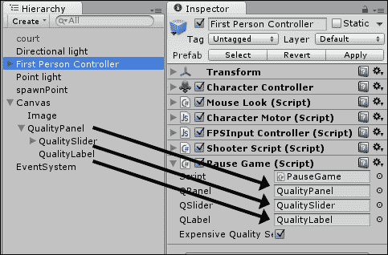

1.  从**层次结构**视图中选择**QualitySlider**。然后，从**检查器**视图中的**滑动条**组件，找到名为**On Value Changed (Single)**的列表，并点击**+**符号添加一个命令。

1.  将**第一人称控制器**从**层次结构**视图拖动到新命令的游戏对象字段中。然后，使用函数选择器在**Dynamic float**下的**SetQuality**函数（**无函数** | **PauseGame** | **Dynamic float** | **SetQuality**）中找到，如图所示：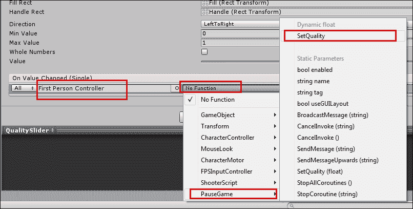

1.  当你播放场景时，你应该能够通过按下*Esc*键暂停/恢复游戏，同时激活一个控制游戏质量设置的滑动条。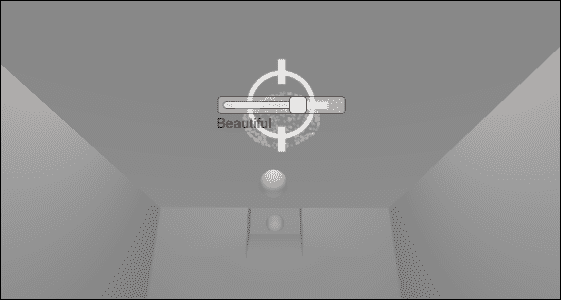

## 它是如何工作的...

在 Unity 中暂停游戏实际上是一个简单直接的任务：我们只需要将游戏的时间缩放设置为`0`（并将它设置回`1`以继续）。在我们的代码中，我们已经在`SetPause()`函数中包含了这样的命令，该函数在玩家按下*Esc*键时被调用，同时也切换`isPaused`变量。为了使功能更加完善，我们还包括了一个**GUI 面板**，其中包含一个*质量设置*滑块，当游戏暂停时被激活。

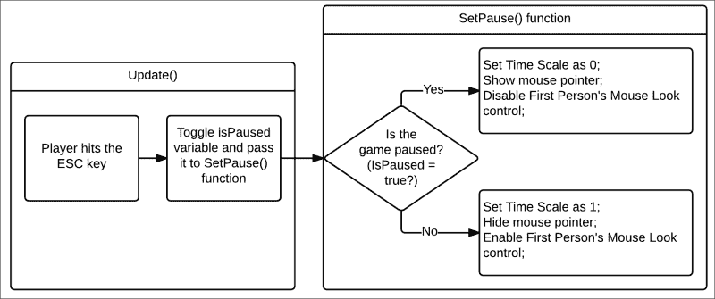

关于质量设置滑块和文本的行为，它们的参数在游戏开始时根据游戏的各种质量设置、它们的名称及其当前状态进行调整。然后，滑块值的更改重新定义了质量设置，并相应地更新标签文本。

## 更多内容...

你总是可以通过显示音量控制、保存/加载按钮等来为*暂停屏幕*添加更多功能。

### 了解更多关于质量设置的信息

我们更改质量设置的代码是对 Unity 文档中给出的示例的轻微修改。如果你想了解更多关于这个主题的信息，请查看[`docs.unity3d.com/ScriptReference/QualitySettings.html`](http://docs.unity3d.com/ScriptReference/QualitySettings.html)。

## 相关内容

参考本章中的*实现慢动作*配方以获取更多信息。

# 实现慢动作

自从 Remedy Entertainment 的*Max Payne*以来，慢动作或子弹时间成为游戏中的一个流行特性。例如， Criterion 的*Burnout*系列成功探索了赛车类别中的慢动作效果。在这个配方中，我们将实现一个通过按下鼠标右键触发的慢动作效果。

## 准备工作

对于这个配方，我们将使用与上一个配方相同的包，即`1362_11_02`文件夹中的`BallGame`。

## 如何做到这一点...

要实现慢动作，请按照以下步骤操作：

1.  将`BallGame`包导入到你的项目中，并从**项目**视图打开名为`BallGame_01`的场景。

1.  在**检查器**中，创建一个新的标签**球**，将此标签应用于“预制体”文件夹中的`ball`预制体，并保存场景。

1.  将以下 C#脚本**BulletTime**添加到**第一人称控制器**：

    ```cs
    using UnityEngine;
    using UnityEngine.UI;
    using System.Collections;

    public class BulletTime : MonoBehaviour
    {
        public float sloSpeed = 0.1f;
        public float totalTime = 10f;
        public float recoveryRate = 0.5f;
        public Slider EnergyBar;
        private float elapsed = 0f;
        private bool isSlow = false;

        void Update ()
        {

            if (Input.GetButtonDown ("Fire2") && elapsed < totalTime)
                SetSpeed (sloSpeed);

            if (Input.GetButtonUp ("Fire2"))
                SetSpeed (1f);

            if (isSlow) {
                elapsed += Time.deltaTime / sloSpeed;
                if (elapsed >= totalTime) {
                    SetSpeed (1f);
                }

            } else {
                elapsed -= Time.deltaTime * recoveryRate;
                elapsed = Mathf.Clamp (elapsed, 0, totalTime);
            }
            float remainingTime = (totalTime - elapsed) / totalTime;
            EnergyBar.value = remainingTime;
        }

        private void SetSpeed (float speed)
        {
            Time.timeScale = speed;
            Time.fixedDeltaTime = 0.02f * speed;
            isSlow = !(speed >= 1.0f);
        }
    }
    ```

1.  从**层次结构**视图，使用**创建**下拉菜单向 UI 添加一个**滑块**（**创建** | **UI** | **滑块**）。请注意，它将被创建为现有**画布**对象的子对象。将其重命名为`EnergySlider`。

1.  选择**EnergySlider**，从**检查器**视图中的**矩形变换**组件，设置其位置如下：**左：0**；**Y 位置：0**；**Z 位置：0**；**右：0**；**高度：50**。然后，展开**锚点**设置，并将其更改为：**最小 X：0**；**Y：1**；**最大 X：0.5**；**Y：1**；**中心 X：0**；**Y：1**，如以下截图所示：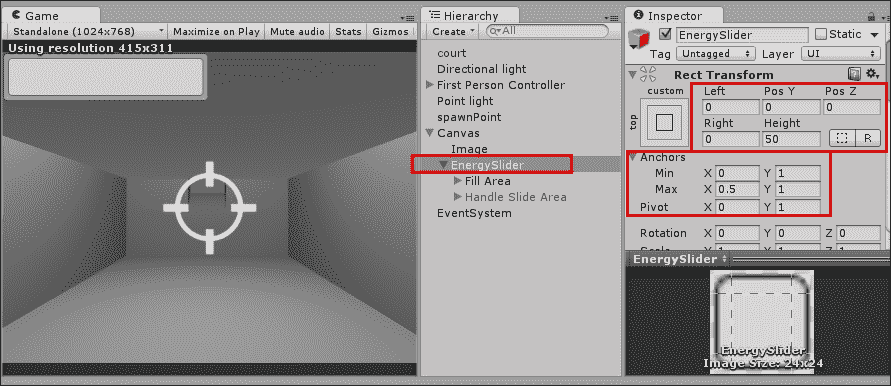

1.  还选择**滑块手柄区域**子项，并在**检查器**视图中将其禁用，如图所示：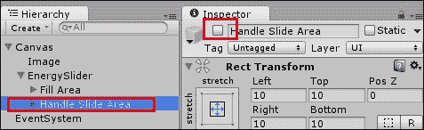

1.  最后，从**层级**视图中选择**第一人称控制器**，找到**子弹时间**组件，并将**能量滑块**从**层级**视图拖动到其**能量栏**槽中，如图所示：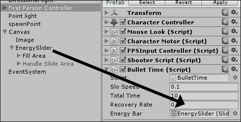

1.  播放您的游戏。您应该能够通过按住右鼠标按钮（或您为**输入**轴**Fire2**设置的任何替代选项）来激活慢动作。滑块将充当进度条，缓慢缩小，指示您剩余的*子弹时间*。

## 它是如何工作的...

基本上，要实现慢动作效果，我们只需要降低`Time.timeScale`变量。在我们的脚本中，我们通过使用`sloSpeed`变量来实现这一点。请注意，我们还需要调整`Time.fixedDeltaTime`变量，更新我们游戏的物理模拟。

为了使体验更具挑战性，我们还实现了一种**能量栏**，以指示玩家剩余的子弹时间（初始值由`totalTime`变量给出，以秒为单位）。当玩家不使用子弹时间时，他的配额根据`recoveryRate`变量填充。

关于**GUI 滑块**，我们使用了**矩形变换**设置将其放置在屏幕左上角，并设置其尺寸为屏幕宽度的一半和 50 像素高。此外，我们还隐藏了**滑块手柄区域**，使其更类似于传统的能量栏。最后，我们不是允许玩家直接与滑块交互，而是使用了`BulletTime`脚本来改变滑块的值。

## 还有更多...

以下是一些建议，帮助您进一步提升慢动作效果。

### 自定义滑块

不要忘记，您可以通过创建自己的精灵或根据滑块的值更改滑块的**填充**颜色来自定义滑块的外观。尝试将以下代码行添加到`Update`函数的末尾：

```cs
GameObject fill = GameObject.Find("Fill").gameObject;
Color sliderColor = Color.Lerp(Color.red, Color.green, remainingTime);
fill.GetComponent<Image> ().color = sliderColor;
```

### 添加运动模糊

**运动模糊**是一种常与慢动作相关的图像效果。一旦附加到相机，它可以根据`speed`浮点值启用或禁用。有关运动模糊图像效果的更多信息，请参阅[`docs.unity3d.com/Manual/script-MotionBlur.html`](http://docs.unity3d.com/Manual/script-MotionBlur.html)。

### 创建音效氛围

《马克斯·佩恩》著名地使用了强烈、沉重的心跳声作为音效氛围。您也可以尝试降低音效音量，以传达在慢动作时角色的专注。此外，在相机上使用音频过滤器可能是一个有趣的选择。

## 参见

请参阅本章中的“暂停游戏”配方以获取更多信息。

# 防止您的游戏在未知服务器上运行

在您完成所有艰苦的工作以完成您的网络游戏项目之后，如果它最终在别人的网站上产生流量和收入，那就太不公平了。在这个食谱中，我们将创建一个脚本，以防止除非它由授权服务器托管，否则主游戏菜单显示。

## 准备工作

要测试这个食谱，您需要访问一个可以托管游戏的网络空间提供商。

## 如何操作...

为了防止您的网络游戏被盗版，请按照以下步骤操作：

1.  从**层次结构**视图，使用**创建**下拉菜单创建一个**UI Text**游戏对象（**创建** | **UI** | **文本**）。将其命名为`Text – warning`。然后，从**检查器**中的**文本**组件，将**文本**字段更改为`Getting Info. Please wait`。

1.  将以下 C#脚本添加到`Text – warning`游戏对象：

    ```cs
    using UnityEngine;
    using System.Collections;
    using UnityEngine.UI;

    public class BlockAccess : MonoBehaviour {
      public bool checkDomain = true;
      public bool fullURL = true;
      public string[] domainList;
      public string warning;

      private void Start(){
        Text scoreText = GetComponent<Text>();
        bool illegalCopy = true;

        if (Application.isEditor)
          illegalCopy = false;

        if (Application.isWebPlayer && checkDomain){
          for (int i = 0; i < domainList.Length; i++){
            if (Application.absoluteURL == domainList[i]){
              illegalCopy = false;
            }else if (Application.absoluteURL.Contains(domainList[i]) && !fullURL){
              illegalCopy = false;
            }
          }
        }

        if (illegalCopy)
          scoreText.text = warning;
        else
          Application.LoadLevel(Application.loadedLevel + 1);
      }
    }
    ```

1.  从**检查器**视图，保留**检查域名**和**完整 URL**选项的勾选，并将**域名列表**的**大小**增加到`1`，并在**元素 0**中填写您游戏的完整 URL。在**消息**字段中输入句子`This is not a valid copy of the game`，如以下截图所示。您可能需要将段落的**水平溢出**更改为**溢出**。

    ### 注意

    注意：请记住在 URL 中包含 Unity 3D 文件名和扩展名，而不是它嵌入的 HTML。

    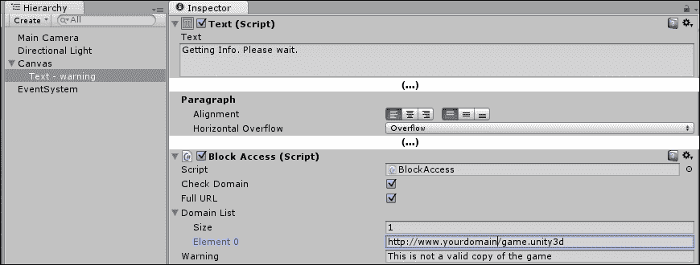

1.  将场景保存为`menu`。

1.  创建一个新的场景，并将其**主摄像机**的背景颜色更改为黑色。将此场景保存为`nextLevel`。

1.  让我们构建游戏。转到**文件 | 构建设置…**菜单，并按顺序将场景**menu**和**nextLevel**包含在构建列表中（**构建**中的**场景**）。此外，选择**Web Player**作为您的平台，然后点击**构建**。

## 它是如何工作的...

一旦场景开始，脚本就会将`.unity3d`文件的实际 URL 与`Block Access`组件中列出的 URL 进行比较。如果不匹配，则构建中的下一级不会加载，并在屏幕上显示消息。如果它们匹配，则代码行`Application.LoadLevel(Application.loadedLevel + 1)`将加载构建列表中的下一场景。

## 更多...

这里有一些关于如何微调和自定义这个食谱的信息。

### 通过在域名列表中使用完整 URL 提高安全性

如果您在域名列表中填写完整的 URL（例如 [`www.myDomain.com/unitygame/game.unity3d`](http://www.myDomain.com/unitygame/game.unity3d)），您的游戏将更加安全。实际上，建议您选择**完整 URL**选项，这样您的游戏就不会被盗版并在类似`www.stolenGames.com/yourgame.html?www.myDomain.com`的 URL 下发布。

### 允许更多域的重新分发

如果您想让游戏从多个不同的域运行，请增加**大小**并填写更多 URL。此外，您可以通过不勾选**检查域名**选项来完全取消保护您的游戏。

# 状态驱动行为 DIY 状态

整个游戏以及单个对象或角色通常可以被视为（或建模为）通过不同的**状态**或**模式**。建模状态和状态的变化（由于**事件**或游戏条件）是管理游戏和游戏组件复杂性的非常常见方式。在这个菜谱中，我们使用单个`GameManager`类创建一个简单的三状态游戏（游戏进行/游戏胜利/游戏失败）。

## 如何操作...

要使用状态来管理对象行为，请按照以下步骤操作：

1.  在屏幕顶部中间创建两个 UI 按钮。将一个命名为**Button-win**，并编辑其文本为**Win Game**。将第二个命名为**Button-lose**，并编辑其文本为**Lose Game**。

1.  在屏幕顶部左侧创建一个 UI 文本对象。将此命名为**Text-state-messages**，并将其**Rect Transform**高度属性设置为**300**，其**Text (Script) Paragraph Vertical Overflow**属性设置为**Overflow**。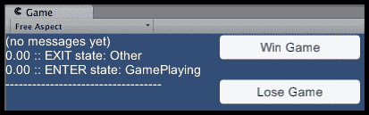

1.  将以下 C# 脚本类 `GameManager` 添加到**Main Camera**：

    ```cs
    using UnityEngine;
    using System.Collections;
    using System;
    using UnityEngine.UI;

    public class GameManager : MonoBehaviour {
      public Text textStateMessages;
      public Button buttonWinGame;
      public Button buttonLoseGame;

      private enum GameStateType {
        Other,
        GamePlaying,
        GameWon,
        GameLost,
      }

      private GameStateType currentState = GameStateType.Other;
      private float timeGamePlayingStarted;
      private float timeToPressAButton = 5;

      void Start () {
        NewGameState( GameStateType.GamePlaying );
      }

      private void NewGameState(GameStateType newState) {
        // (1) state EXIT actions
        OnMyStateExit(currentState);

        // (2) change current state
        currentState = newState;

        // (3) state ENTER actions
        OnMyStateEnter(currentState);

        PostMessageDivider();
      }

      public void PostMessageDivider(){
        string newLine = "\n";
        string divider = "--------------------------------";
        textStateMessages.text += newLine + divider;
      }

      public void PostMessage(string message){
        string newLine = "\n";
        string timeTo2DecimalPlaces = String.Format("{0:0.00}", Time.time);
        textStateMessages.text += newLine + timeTo2DecimalPlaces + " :: " + message;
      }

      public void BUTTON_CLICK_ACTION_WIN_GAME(){
        string message = "Win Game BUTTON clicked";
        PostMessage(message);
        NewGameState( GameStateType.GameWon );
      }

      public void BUTTON_CLICK_ACTION_LOSE_GAME(){
        string message = "Lose Game BUTTON clicked";
        PostMessage(message);
        NewGameState( GameStateType.GameLost );
      }

      private void DestroyButtons(){
        Destroy (buttonWinGame.gameObject);
        Destroy (buttonLoseGame.gameObject);
      }

      //--------- OnMyStateEnter[ S ] - state specific actions
      private void OnMyStateEnter(GameStateType state){
        string enterMessage = "ENTER state: " + state.ToString();
        PostMessage(enterMessage);

        switch (state){
        case GameStateType.GamePlaying:
          OnMyStateEnterGamePlaying();
          break;
        case GameStateType.GameWon:
          // do nothing
          break;
        case GameStateType.GameLost:
          // do nothing
          break;
        }
      }

      private void OnMyStateEnterGamePlaying(){
        // record time we enter state
        timeGamePlayingStarted = Time.time;
      }

      //--------- OnMyStateExit[ S ] - state specific actions
      private void OnMyStateExit(GameStateType state){
        string exitMessage = "EXIT state: " + state.ToString();
        PostMessage(exitMessage);

        switch (state){
        case GameStateType.GamePlaying:
          OnMyStateExitGamePlaying();
          break;
        case GameStateType.GameWon:
          // do nothing
          break;
        case GameStateType.GameLost:
          // do nothing
          break;
        case GameStateType.Other:
          // cope with game starting in state 'Other'
          // do nothing
          break;
        }
      }

      private void OnMyStateExitGamePlaying(){
    // if leaving gamePlaying state then destroy the 2 buttons
        DestroyButtons();
      }

      //--------- Update[ S ] - state specific actions
      void Update () {
        switch (currentState){
        case GameStateType.GamePlaying:
          UpdateStateGamePlaying();
          break;
        case GameStateType.GameWon:
          // do nothing
          break;
        case GameStateType.GameLost:
          // do nothing
          break;
        }
      }

      private void UpdateStateGamePlaying(){
        float timeSinceGamePlayingStarted = Time.time - timeGamePlayingStarted;
        if(timeSinceGamePlayingStarted > timeToPressAButton){
          string message = "User waited too long - automatically going to Game LOST state";
          PostMessage(message);
          NewGameState(GameStateType.GameLost);
        }
      }
    }
    ```

1.  在**层次结构**中，选择**Button-win**按钮，并为它的**Button (Script)**组件添加一个`OnClick`动作，以从**Main Camera** GameObject 中的**GameManager**组件调用`BUTTON_CLICK_ACTION_WIN_GAME()`方法。

1.  在**层次结构**中，选择**Button-lose**按钮，并为它的**Button (Script)**组件添加一个`OnClick`动作，以从**Main Camera** GameObject 中的**GameManager**组件调用`BUTTON_CLICK_ACTION_LOSE_GAME()`方法。

1.  在**层次结构**中，选择**Main Camera** GameObject。接下来，将其拖入**Inspector**以确保所有三个**GameManager (Script)**公共变量、**Text State Messages**、**Button Win Game**和**Button Lose Game**都有相应的 Canvas GameObjects 拖入其中（两个按钮和 UI 文本 GameObject）。

## 如何工作...

如以下状态图所示，这个菜谱模拟了一个简单的游戏，它从**GAME PLAYING**状态开始；然后，根据用户点击的按钮，游戏要么移动到**GAME WON**状态或**GAME LOST**状态。此外，如果用户等待太长时间才点击按钮，游戏将移动到**GAME LOST**状态。

系统的可能状态由枚举类型`GameStateType`定义，而系统在任何时间点的当前状态存储在`currentState`变量中。

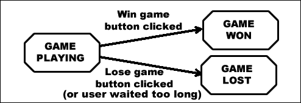

定义了第四个状态（`Other`），以便我们可以在`Start()`方法中显式设置所需的`GamePlaying`状态。当我们希望游戏状态改变时，我们调用`NewGameState(…)`方法，传递游戏要改变到的新的状态。`NewGameState(…)`方法首先调用带有当前状态的`OnMyStateExit(…)`方法，因为当退出特定状态时可能需要执行某些操作；例如，当退出`GamePlaying`状态时，它销毁两个按钮。接下来，`NewGameState(…)`方法将`currentState`变量设置为分配给新状态。然后，调用`OnMyStateEnter(…)`方法，因为当进入新状态时可能需要立即执行某些操作。最后，向 UI 文本框发布一个消息分隔符，调用`PostMessageDivider()`方法。

当`GameManager`对象接收到消息（例如，每帧的`Update()`）时，其行为必须适合当前状态。因此，我们在这个方法中看到一个`Switch`语句，它调用特定状态的方法。例如，如果当前状态是`GamePlaying`，那么当接收到`Update()`消息时，将调用`UpdateStateGamePlaying()`方法。

如果对应的按钮已被点击，将执行`BUTTON_CLICK_ACTION_WIN_GAME()`和`BUTTON_CLICK_ACTION_LOSE_GAME()`方法。它们将游戏移动到相应的**WIN**或**LOSE**状态。

逻辑已编写在`UpdateStateGamePlaying()`方法中，因此一旦`GameManager`处于`GamePlaying`状态超过一定时间（由变量`timeToPressAButton`定义），游戏将自动切换到`GameLost`状态。

因此，对于每个状态，我们可能需要编写状态退出、状态进入和更新事件的相应方法，以及每个事件的主方法，其中包含一个`Switch`语句来决定应该调用哪个状态方法（或不应调用）。正如可以想象的那样，随着更多状态和更复杂的游戏逻辑的需求增加，我们的方法和`GameManager`类中的方法数量将显著增加。下一节将采用更复杂的方法来处理状态驱动游戏，其中每个状态都有自己的类。

## 参见

参考本章下一节以获取更多关于如何管理具有类继承和状态设计模式的状态复杂性的信息。

# 使用状态设计模式实现状态驱动行为

之前的模式不仅说明了建模游戏状态的有用性，还说明了游戏管理类如何增长并变得难以管理。为了管理许多状态和状态的复杂行为的复杂性，软件开发社区提出了状态模式。设计模式是一般目的的软件组件架构，经过尝试和测试，被证明是解决常见软件系统特征的优秀解决方案。状态模式的关键特性是每个状态都由其自己的类进行建模，并且所有状态都继承（子类化）自单个父状态类。为了告诉游戏管理器更改当前状态，状态之间需要相互了解。这是为了将整体游戏行为的复杂性分解为单独的状态类而付出的微小代价。

### 注意

注意：非常感谢 Bryan Griffiths 的贡献，这有助于改进这个配方。

## 准备工作

这个配方基于之前的配方。因此，复制那个项目，打开它，然后按照这个配方的步骤进行。

## 如何操作...

使用状态模式架构来管理对象的行为，请执行以下步骤：

1.  用以下内容替换 C#脚本类`GameManager`的内容：

    ```cs
    using UnityEngine;
    using System.Collections;
    using UnityEngine.UI;

    public class GameManager : MonoBehaviour {
      public Text textGameStateName;
      public Button buttonWinGame;
      public Button buttonLoseGame;

      public StateGamePlaying stateGamePlaying{get; set;}
      public StateGameWon stateGameWon{get; set;}
      public StateGameLost stateGameLost{get; set;}

      private GameState currentState;

      private void Awake () {
        stateGamePlaying = new StateGamePlaying(this);
        stateGameWon = new StateGameWon(this);
        stateGameLost = new StateGameLost(this);
      }

      private void Start () {
        NewGameState( stateGamePlaying );
      }

      private void Update () {
        if (currentState != null)
          currentState.StateUpdate();
      }

      public void NewGameState(GameState newState)
      {
        if( null != currentState)
          currentState.OnMyStateExit();

        currentState = newState;
        currentState.OnMyStateEntered();
      }

      public void DisplayStateEnteredMessage(string stateEnteredMessage){
        textGameStateName.text = stateEnteredMessage;
      }

      public void BUTTON_CLICK_ACTION_WIN_GAME(){
        if( null != currentState){
    currentState.OnButtonClick(GameState.ButtonType.ButtonWinGame);
          DestroyButtons();
        }
      }

      public void BUTTON_CLICK_ACTION_LOSE_GAME(){
        if( null != currentState){
    currentState.OnButtonClick(GameState.ButtonType.ButtonLoseGame);
          DestroyButtons();
        }
      }

      private void DestroyButtons(){
        Destroy (buttonWinGame.gameObject);
        Destroy (buttonLoseGame.gameObject);
      }
    }
    ```

1.  创建一个新的 C#脚本类，命名为`GameState`：

    ```cs
    using UnityEngine;
    using System.Collections;

    public abstract class GameState {
      public enum ButtonType {
        ButtonWinGame,
        ButtonLoseGame
      }

      protected GameManager gameManager;
      public GameState(GameManager manager) {
        gameManager = manager;
      }

      public abstract void OnMyStateEntered();
      public abstract void OnMyStateExit();
      public abstract void StateUpdate();
      public abstract void OnButtonClick(ButtonType button);
    }
    ```

1.  创建一个新的 C#脚本类，命名为`StateGamePlaying`：

    ```cs
    using UnityEngine;
    using System.Collections;

    public class StateGamePlaying : GameState {
      public StateGamePlaying(GameManager manager):base(manager){}

      public override void OnMyStateEntered(){
        string stateEnteredMessage = "ENTER state: StateGamePlaying";
        gameManager.DisplayStateEnteredMessage(stateEnteredMessage);
        Debug.Log(stateEnteredMessage);
      }
      public override void OnMyStateExit(){}
      public override void StateUpdate() {}

      public override void OnButtonClick(ButtonType button){
        if( ButtonType.ButtonWinGame == button )
          gameManager.NewGameState(gameManager.stateGameWon);

        if( ButtonType.ButtonLoseGame == button )
          gameManager.NewGameState(gameManager.stateGameLost);
      }
    }
    ```

1.  创建一个新的 C#脚本类，命名为`StateGameWon`：

    ```cs
    using UnityEngine;
    using System.Collections;

    public class StateGameWon : GameState {
      public StateGameWon(GameManager manager):base(manager){}

      public override void OnMyStateEntered(){
        string stateEnteredMessage = "ENTER state: StateGameWon";
    gameManager.DisplayStateEnteredMessage(stateEnteredMessage);
        Debug.Log(stateEnteredMessage);
      }
      public override void OnMyStateExit(){}
      public override void StateUpdate() {}
      public override void OnButtonClick(ButtonType button){}
    }
    ```

1.  创建一个新的 C#脚本类，命名为`StateGameLost`：

    ```cs
    using UnityEngine;
    using System.Collections;

    public class StateGameLost : GameState {
      public StateGameLost(GameManager manager):base(manager){}

      public override void OnMyStateEntered(){
        string stateEnteredMessage = "ENTER state: StateGameLost";
    gameManager.DisplayStateEnteredMessage(stateEnteredMessage);
        Debug.Log(stateEnteredMessage);
      }
      public override void OnMyStateExit(){}
      public override void StateUpdate() {}
      public override void OnButtonClick(ButtonType button){}
    }
    ```

1.  在**层次结构**中，选择**Button-win**按钮，并为它的**Button (Script)**组件添加一个`OnClick`动作，调用**主摄像机**GameObject 中的**GameManager**组件的`BUTTON_CLICK_ACTION_WIN_GAME()`方法。

1.  在**层次结构**中，选择**Button-lose**按钮，并为它的**Button (Script)**组件添加一个`OnClick`动作，调用**主摄像机**GameObject 中的**GameManager**组件的`BUTTON_CLICK_ACTION_LOSE_GAME()`方法。

1.  在**层次结构**中，选择**主摄像机**GameObject。接下来，将其拖入**检查器**中，以确保所有三个**GameManager (Script)**公共变量、**文本状态消息**、**胜利游戏按钮**和**失败游戏按钮**都有相应的 Canvas GameObject 拖入其中（两个按钮和 UI 文本 GameObject）。

## 工作原理...

对于这个配方来说，场景非常直接。有一个单独的**主摄像机**GameObject，它附加了`GameManager`脚本对象组件。

为游戏需要管理的每个状态定义一个 C#脚本类——对于这个例子，有三个状态`StateGamePlaying`、`StateGameWon`和`StateGameLost`。这些状态类都是`GameState`的子类。`GameState`定义了所有子类状态将拥有的属性和方法：

+   一个枚举类型`ButtonType`，它定义了游戏可能生成的两种可能的按钮点击：`ButtonWinGame`和`ButtonLoseGame`。

+   `gameManager` 变量：以便每个状态对象都有一个指向游戏管理器的链接。

+   接受 `GameManager` 引用的构造函数方法：这将自动使 `gameManager` 变量指向传入的 `GameManager` 对象。

+   四个抽象方法 `OnMyStateEntered()`、`OnMyStateExit()`、`OnButtonClick(…)` 和 `StateUpdate()`。请注意，抽象方法必须为每个子类有自己的实现。

当 `GameManager` 类的 `Awake()` 方法执行时，将创建三个状态对象，每个对应于 playing/win/lose 类。这些状态对象存储在其相应的变量中：`stateGamePlaying`、`stateGameWon` 和 `stateGameLost`。

`GameManager` 类有一个名为 `currentState` 的变量，它是对当前状态对象的引用，在游戏运行期间任何时刻都有效（最初，它将是 `null`）。由于它是 `GameState` 类（所有状态类的父类）的实例，它可以引用任何不同的状态对象。

在 `Awake()` 之后，`GameManager` 将接收到一个 `Start()` 消息。此方法将 `currentState` 初始化为 `stateGamePlaying` 对象。

对于每一帧，`GameManager` 将接收到 `Update()` 消息。在接收到这些消息后，`GameManager` 将向 `currentState` 对象发送 `StateUpdate()` 消息。因此，对于每一帧，当前游戏状态的对象将执行这些方法。例如，当 `currentState` 设置为游戏进行时，对于每一帧，`gamePlayingObject` 将调用其（在这种情况下，为空的）`StateUpdate()` 方法。

`StateGamePlaying` 类在其 `OnButtonClick()` 方法中实现了语句，以便当用户点击按钮时，`gamePlayingObject` 将调用 `GameManager` 实例的 `NewState()` 方法，并传递对应新状态的对象。因此，如果用户点击 **Button-win** 按钮，`NewState()` 方法将传递给 `gameManager.stateGameWon`。

# 通过在死亡时销毁对象来减少对象数量

**优化原则 1**：最小化场景中活跃和启用的对象数量。

减少活跃对象数量的方法之一是在它们不再需要时销毁对象。一旦对象不再需要，就应该销毁它；这样可以节省内存和处理资源，因为 Unity 不再需要发送对象如 `Update()` 和 `FixedUpdate()` 等消息，或者考虑对象碰撞或物理等。

然而，有时我们可能希望不是立即销毁一个对象，而是在未来的某个已知点。例如，在声音播放完毕后（参见第九章中的配方 *在自动销毁对象前等待音频播放结束*，*播放和操作声音*），玩家只有一定时间收集奖励对象，或者可能显示给玩家的对象在一段时间后应该消失。

本配方演示了如何告诉对象 *开始死亡*，然后在给定延迟过后自动销毁它们。

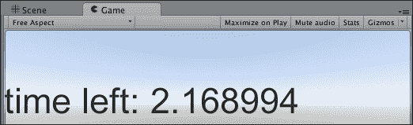

## 如何操作...

要在指定时间后销毁对象，请按照以下步骤操作：

1.  创建一个新的 2D 项目。

1.  创建一个名为 **Click Me** 的 UI **按钮**，并使其填充整个窗口。

1.  在 **Inspector** 中，将按钮的 **Text child** 设置为左对齐和大号文本。

1.  将以下脚本类 `DeathTimeExample.cs` 添加到 **Button Click Me**：

    ```cs
    using UnityEngine;
    using System.Collections;
    using UnityEngine.UI;

    public class DeathTimeExample : MonoBehaviour {
      public void BUTTON_ACTION_StartDying() {
        deathTime = Time.time + deathDelay;
      }

      public float deathDelay = 4f;
      private float deathTime = -1;

      public Text buttonText;

      void Update(){
        if(deathTime > 0){
          UpdateTimeDisplay();
          CheckDeath();
        }
      }

      private void UpdateTimeDisplay(){
        float timeLeft = deathTime - Time.time;
        string timeMessage = "time left: " + timeLeft;
        buttonText.text = timeMessage;
      }

      private void CheckDeath(){
        if(Time.time > deathTime) Destroy( gameObject );
      }
    }
    ```

1.  将 **Button Click Me** 的 **Text** 子对象拖动到脚本的公共变量 **Button Text** 中，这样脚本就能更改按钮文本以显示倒计时。

1.  在 **Hierarchy** 中选择 **Button Click Me**，为此按钮添加一个新的 **On Click()** 事件，将按钮本身作为目标 GameObject，并选择公共函数 `BUTTON_ACTION_StartDying()`，如以下截图所示：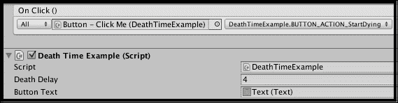

1.  现在，运行场景；一旦点击按钮，按钮的文本应该显示倒计时。一旦倒计时到达零，**Button Click Me** 将被销毁（包括所有子对象，在这种情况下，只是 GameObject **Text**）。

## 它是如何工作的...

浮点变量 `deathDelay` 存储对象在决定开始死亡后等待销毁自己的秒数。浮点变量 `deathTime` 要么是 `-1`（尚未设置死亡时间），要么是一个非负值，这是我们希望对象销毁自己的时间。

当按钮被点击时，会调用 `BUTTON_ACTION_StartDying()` 方法。此方法将 `deathTime` 变量设置为当前时间加上 `deathDelay` 中设置的任何值。这个新的 `deathTime` 值将是一个正数，这意味着从这一点开始，`Update()` 方法中的 `IF` 语句将会触发。

每一帧方法 `Update()` 检查 `deathTime` 是否大于零（即已设置死亡时间），如果是，则调用 `UpdateTimeDisplay()` 和 `CheckDeath()` 方法。

`UpdateTimeDisplay()` 方法创建一个字符串消息，说明还剩下多少秒，并将 **Button Text** 更新以显示此消息。

`CheckDeath()` 方法测试当前时间是否已经超过了 `deathTime`。如果死亡时间已过，则父 `gameObject` 将立即被销毁。

当您运行场景时，您将看到一旦达到其死亡时间，**Button** 就会从 **Hierarchy** 中移除。

## 参见

有关更多信息，请参阅本章中的以下配方：

+   通过在可能的情况下禁用对象来减少启用对象的数量

+   通过在可能的情况下使对象不活跃来减少活动对象的数量

# 通过在可能的情况下禁用对象来减少启用对象的数量

**优化原则 1**：最小化场景中活动对象和启用对象的数量。

有时，我们可能不想完全删除一个对象，但我们可以确定何时可以安全地禁用对象的脚本组件。如果一个 `MonoBehaviour` 脚本被禁用，那么 Unity 就不再需要为每个帧发送对象消息，例如 `Update()` 和 `FixedUpdate()`。

例如，如果一个**非玩家角色**（**NPC**）只有在玩家可以看到该角色时才应该展示某些行为，那么我们只需要在 NPC 可见时执行行为逻辑——其余时间，我们可以安全地禁用脚本组件。

Unity 提供了非常有用的事件 `OnBecameInvisible()` 和 `OnBecameVisible()`，它们会在对象从场景中的一个或多个摄像机的可见区域移出和进入时通知对象。

这个配方说明了以下经验法则：如果一个对象在不可见时没有理由执行动作，那么我们应该在它不可见时禁用该对象。

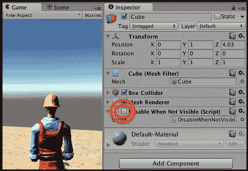

## 准备工作

对于这个配方，我们准备了一个名为 `unity4_assets_handyman_goodDirt` 的包，其中包含 `3rdPersonController` handyman 和地形材质 `goodDirt`。该包位于 `1362_11_07` 文件夹中。

## 如何操作...

要禁用对象以减少计算机处理工作负载的要求，请按照以下步骤操作：

1.  创建一个新的 Unity 项目，导入提供的 Unity 包 `unity4_assets_handyman_goodDirt`。

1.  创建一个新的 **Terrain**（大小 **20 x 20**，位于 **-10, 0, -10**），并用 **GoodDirt**（您可以在从 **Terrain Assets** 包导入的 **Standard Assets** 文件夹中找到）进行纹理绘制。

1.  在（**0, 1, 0**）位置添加一个**3rdPersonController**。

1.  在您的 **3rdPersonController** 前创建一个新的 **Cube**（这样当您开始运行游戏时，它在 **Game** 面板中是可见的）。

1.  将以下 C# 脚本类 `DisableWhenNotVisible` 添加到您的 **Cube**：

    ```cs
    using UnityEngine;
    using System.Collections;

    public class DisableWhenNotVisible : MonoBehaviour {
      private GameObject player;

      void Start(){
        player = GameObject.FindGameObjectWithTag("Player");
      }

      void OnBecameVisible() {
        enabled = true;
        print ("cube became visible again");
      }

      void OnBecameInvisible() {
        enabled = false;
        print ("cube became invisible");
      }

      void Update(){
        //do something, so we know when this script is NOT doing something!
        float d = Vector3.Distance( transform.position, player.transform.position);
        print(Time.time + ": distance from player to cube = " + d);
      }
    }
    ```

## 它是如何工作的...

当可见时，**立方体**的脚本`DisableWhenNotVisible`组件会重新计算并通过`Update()`方法中的`player`变量显示其自身到**3rdPersonController**对象变换的距离，每帧进行一次。然而，当此对象接收到`OnBecameInvisible()`消息时，对象将其`enabled`属性设置为`false`。这导致 Unity 不再向`GameObject`发送`Update()`消息，因此`Update()`中的距离计算不再执行；从而减少了游戏的处理工作量。接收到`OnBecameVisible()`消息后，`enabled`属性被设置回`true`，并且对象将接收每帧的`Update()`消息。请注意，如果你在运行游戏时在**层次结构**中选择**立方体**，你可以通过看到其**检查器**中的蓝色*勾选*消失来看到脚本组件被禁用。

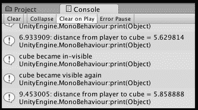

上一张截图显示了我们的**控制台**文本输出，记录了用户在游戏开始后 6.9 秒转向立方体的情况（因此立方体不再可见）；然后，在 9.4 秒时，用户转向以便再次看到立方体，导致它被重新启用。

## 还有更多...

一些你不希望错过的细节：

### 注意 – 在场景面板中可见仍然算作可见！

注意，即使**游戏**面板没有显示（渲染）对象，如果对象在**场景**面板中可见，那么它仍然会被视为可见。因此，建议你在测试此菜谱时隐藏/关闭**场景**面板，否则可能的情况是对象仅在游戏停止运行时才变为不可见。

### 另一种常见情况 – 仅在 OnTrigger()之后启用

另一种常见情况是我们只想在玩家角色附近（在某个最小距离内）激活脚本组件。在这些情况下，可以在要禁用/启用的对象上设置一个球体碰撞器（勾选**Is Trigger**），例如在我们的**立方体**上。脚本组件只能在玩家角色进入该球体时启用。这可以通过将`OnBecameInvisible()`和`OnBecameVisible()`方法替换为`OnTriggerEnter()`和`OnTriggerExit()`方法来实现，如下所示：

```cs
void OnTriggerEnter(Collider hitObjectCollider) {
  if (hitObjectCollider.CompareTag("Player")){
    print ("cube close to Player again");
    enabled = true;
  }
}

void OnTriggerExit(Collider hitObjectCollider) {
  if (hitObjectCollider.CompareTag("Player")){
    print ("cube away from Player");
    enabled = false;
  }
}
```

以下截图说明了在立方体周围创建了一个大球体碰撞器，并且其**触发器**已启用：

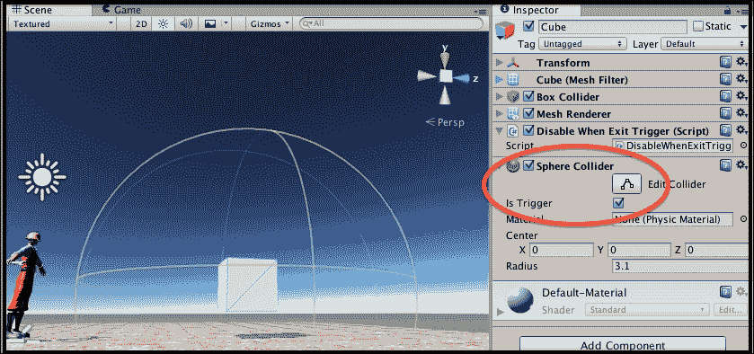

许多计算机游戏（如*半条命*）使用环境设计，如走廊，通过加载和卸载环境的不同部分来优化内存使用。例如，当玩家触发走廊触发器时，环境对象会加载和卸载。有关此类技术的更多信息，请参阅以下内容：

+   [`gamearchitect.net/Articles/StreamingBestiary.html`](http://gamearchitect.net/Articles/StreamingBestiary.html)

+   [`cie.acm.org/articles/level-design-optimization-guidelines-for-game-artists-using-the-epic-games/`](http://cie.acm.org/articles/level-design-optimization-guidelines-for-game-artists-using-the-epic-games/)

+   [`gamedev.stackexchange.com/questions/33016/how-does-3d-games-work-so-fluent-provided-that-each-meshs-size-is-so-big`](http://gamedev.stackexchange.com/questions/33016/how-does-3d-games-work-so-fluent-provided-that-each-meshs-size-is-so-big)

## 参见

参考本章中的以下配方以获取更多信息：

+   *在死亡时间销毁对象以减少对象数量*

+   *尽可能使对象不活跃以减少活跃对象的数量*

# 通过尽可能使对象不活跃以减少活跃对象的数量

**优化原则 1**：最小化场景中活跃和启用的对象数量。

有时，我们可能不想完全删除一个对象，但可以通过使包含脚本组件的父`GameObject`不活跃来比禁用脚本组件更进一步。这就像在**检查器**中取消选中`GameObject`旁边的复选框一样，如图所示：

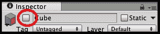

## 如何操作...

要通过在对象变得不可见时使其不活跃来减少计算机处理*工作量*要求，请按照以下步骤操作：

1.  复制上一个配方。

1.  从您的**立方体**中移除脚本组件`DisableWhenNotVisible`，并改为向**立方体**添加以下 C#脚本类`InactiveWhenNotVisible`：

    ```cs
    using UnityEngine;
    using System.Collections;
    using UnityEngine.UI;

    public class InactiveWhenNotVisible : MonoBehaviour {
      // button action
      public void BUTTON_ACTION_MakeActive(){
        gameObject.SetActive(true);
        makeActiveAgainButton.SetActive(false);
      }

      public GameObject makeActiveAgainButton;

      private GameObject player;

      void Start(){
        player = GameObject.FindGameObjectWithTag("Player");
      }

      void OnBecameInvisible() {
        makeActiveAgainButton.SetActive(true);
        print ("cube became invisible");
        gameObject.SetActive(false);
      }

      void Update(){
        float d = Vector3.Distance( transform.position, player.transform.position);
        print(Time.time + ": distance from player to cube = " + d);
      }
    }
    ```

1.  创建一个新的**按钮**，包含文本`Make Cube Active Again`，并将按钮放置在**游戏**面板的顶部，使其占据**游戏**面板的整个宽度，如图所示：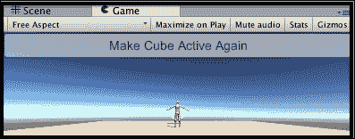

1.  在**层次结构**中选择**按钮**后，为此按钮添加一个新的**On Click()**事件，将**立方体**作为目标 GameObject，并选择公共函数`BUTTON_ACTION_makeCubeActiveAgain()`。

1.  在**检查器**中取消选中**按钮**名称旁边的活动复选框（换句话说，手动停用此**按钮**，这样在场景首次运行时我们就看不到**按钮**）。

1.  在**检查器**中选择**立方体**，并将**按钮**拖动到其脚本组件`InactiveWhenNotVisible`的`MakeActiveAgainButton`变量槽中，如图所示：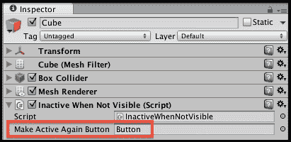

## 它是如何工作的...

初始时，**立方体**是可见的，而**按钮**是不可用的（因此对用户不可见）。当**立方体**接收到`OnBecameInvisible`事件消息时，其`OnBecameInvisible()`方法将执行。此方法执行两个动作：

+   它首先启用（因此使其可见）`按钮`。

+   然后使脚本的父级 `gameObject`（即 `Cube` GameObject）失效。

当 **按钮** 被点击时，它会再次激活 **Cube** 对象，并再次使 **按钮** 失效。因此，在任何时候，只有 **Cube** 和 **按钮** 对象中的一个处于活动状态，并且当另一个对象处于活动状态时，每个对象都会使自身失效。

注意，一个失效的 `GameObject` 不会接收任何消息，因此它不会接收到 `OnBecameVisible()` 消息，这可能不适合每个在摄像机视线之外的物体。然而，当使对象失效是合适的时候，与简单地禁用 `GameObject` 的单个脚本 `Monobehaviour` 组件相比，可以节省更多的性能。

激活失效对象的唯一方法是将 `GameObject` 组件的激活属性设置回 `true`。在本食谱中，是 `Button` GameObject，当点击时，运行 `BUTTON_ACTION_makeCubeActiveAgain()` 方法，允许我们的游戏再次激活 **Cube**。

## 参考内容

有关更多信息，请参阅本章中的以下食谱：

+   *通过在死亡时间销毁对象来减少对象数量*

+   *通过在可能的情况下禁用对象来减少启用对象的数量*

# 使用委托和事件提高效率并避免使用 SendMessage！

**优化原则 2**：最小化需要 Unity 对对象进行“反射”操作和搜索所有当前场景对象的动作。

当事件可以根据可见性、距离或碰撞来触发时，我们可以使用如 `OnTriggerExit` 和 `OnBecomeInvisible` 这样的事件，正如在前面的一些食谱中所描述的。当事件可以根据时间段来触发时，我们可以使用协程，正如本章其他食谱中所描述的。然而，某些事件是每个游戏情况独有的，C# 提供了多种方法将用户定义的事件消息广播到脚本对象。一种方法是 `SendMessage(…)` 方法，当发送到 `GameObject` 时，将检查每个 `Monobehaviour` 脚本组件，如果其参数匹配，则执行命名方法。然而，这涉及一种称为 **反射** 的低效技术。如果性能很重要，应避免使用 `SendMessage(…)`，因为这意味着 Unity 必须分析每个脚本对象（对对象进行 **反射**）以查看是否存在与发送的消息相对应的公共方法；这比使用委托和事件慢得多。

委托和事件实现了**发布-订阅设计模式**（**pubsub**）。这也被称为**观察者**设计模式。对象可以将它们的方法之一订阅到接收特定发布者特定类型的事件消息。在这个菜谱中，我们将有一个管理类，当 UI 按钮被点击时，它将发布新的事件。我们将创建一些 UI 对象，其中一些对象**订阅**颜色更改事件，以便每次发布颜色更改事件时，订阅的 UI 对象都会接收到事件消息并相应地更改它们的颜色。C#发布者对象不必担心在任何时候有多少对象订阅它们（可能是没有或 1000 个！）；这被称为**松耦合**，因为它允许独立编写（和维护）不同的代码组件，并且是面向对象代码的一个理想特性。

## 如何操作...

要实现委托和事件，请按照以下步骤操作：

1.  创建一个新的 2D 项目。

1.  将以下 C#脚本类**ColorManager**添加到**主相机**：

    ```cs
    using UnityEngine;
    using System.Collections;

    public class ColorManager : MonoBehaviour {
      public void BUTTON_ACTION_make_green(){
        PublishColorEvent(Color.green);
      }

      public void BUTTON_ACTION_make_blue(){
        PublishColorEvent(Color.blue);
      }

      public void BUTTON_ACTION_make_red(){
        PublishColorEvent(Color.red);
      }

      public delegate void ColorChangeHandler(Color newColor);
      public static event ColorChangeHandler onChangeColor;

      private void PublishColorEvent(Color newColor){
        // if there is at least one listener to this delegate
        if(onChangeColor != null){
          // broadcast change color event
          onChangeColor(newColor);
        }
      }
    }
    ```

1.  创建两个 UI**图像**对象和两个 UI**文本**对象。将一个**图像**和**文本**对象定位在屏幕的左下角，将另一个定位在屏幕的右下角。使左下角的文本读作**未监听**，使屏幕右边的文本读作**我在监听**。为了保险起见，在屏幕右上角添加一个**滑块**UI 对象。

1.  在屏幕左上角创建三个 UI 按钮，分别命名为**Button-GREEN**、**Button-BLUE**和**Button-RED**，对应的文本分别为`make things <color=green>GREEN</color>`、`make things <color=blue>BLUE</color>`和`make things <color=red>RED</color>`。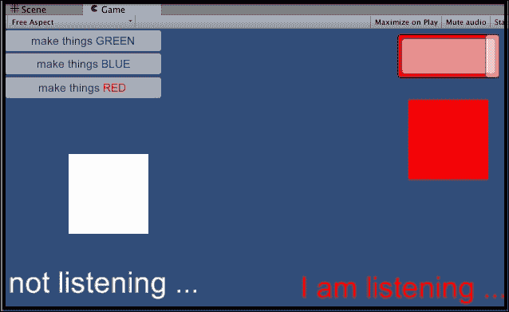

1.  将以下 C#脚本类`ColorChangeListenerImage`附加到右下角的**图像**和**滑块**：

    ```cs
    using UnityEngine;
    using System.Collections;
    using UnityEngine.UI;

    public class ColorChangeListenerImage : MonoBehaviour {
      void OnEnable() {
        ColorManager.onChangeColor += ChangeColorEvent;
      }

      private void OnDisable(){
        ColorManager.onChangeColor -= ChangeColorEvent;
      }

      void ChangeColorEvent(Color newColor){
        GetComponent<Image>().color = newColor;
      }
    }
    ```

1.  将以下 C#脚本类`ColorChangeListenerText`附加到**我在监听 Text** UI 对象：

    ```cs
    using UnityEngine;
    using System.Collections;
    using UnityEngine.UI;

    public class ColorChangeListenerText : MonoBehaviour {
      void OnEnable() {
        ColorManager.onChangeColor += ChangeColorEvent;
      }

      private void OnDisable(){
        ColorManager.onChangeColor -= ChangeColorEvent;
      }

      void ChangeColorEvent(Color newColor){
        GetComponent<Text>().color = newColor;
      }
    }
    ```

1.  在**层次结构**中选择**绿色**按钮，为该按钮添加一个新的**点击()**事件，将**主相机**作为目标 GameObject，并选择公共函数`BUTTON_ACTION_make_green()`。对**蓝色**和**红色**按钮分别使用函数`BUTTON_ACTION_make_blue()`和`BUTTON_ACTION_make_red()`执行相同的操作。

1.  运行游戏。当你点击更改颜色按钮时，屏幕右侧的三个 UI 对象会显示所有对应颜色的更改，而屏幕左下角的两个 UI 对象将保持默认的**白色**颜色。

## 它是如何工作的...

首先，让我们考虑我们想要发生的事情——我们希望右侧的**图像**、**滑块**和**文本**对象在接收到带有新颜色参数的事件消息`OnChangeColor()`时改变它们的颜色。

这是通过每个对象都有一个适当的`ColorChangeListener`类的实例来实现的，该实例将它们的`OnChangeColor()`方法订阅到监听从`ColorManager`类发布的颜色更改事件。由于**Image**和**Slider**对象都有一个颜色会改变的形象组件，因此它们有我们 C#类的脚本组件`ColorChangeListenerImage`，而**Text**对象需要一个不同的类，因为要改变颜色的是文本组件的颜色（因此我们在**Text** UI 对象中添加了一个 C#脚本组件`ColorChangeListenerText`）。所以，正如我们所看到的，不同的对象可能会以适合每个不同对象的方式响应接收相同的事件消息。

由于我们的脚本对象可能在不同的时间启用和禁用，因此每次脚本`ColorChangeListener`对象被启用（例如，当其 GameObject 父对象被实例化时），其`OnChangeColor()`方法就会被添加到订阅监听颜色更改事件的列表中（同样，每次`ColorChangeListenerImage/Text`对象被禁用时，这些方法就会从事件订阅者列表中移除）。

当`ColorChangeListenerImage/Text`对象接收到颜色更改消息时，其订阅的`OnChangeColor()`方法将被执行，并且相应组件的颜色将更改为接收到的`Color`值（`green`/`red`/`blue`）。

`ColorManager`类有一个公共类（静态）变量`changeColorEvent`，它定义了一个*事件*，Unity 维护一个动态列表，其中包含所有订阅的对象方法。`ColorChangeListenerImage/Text`对象就是向这个事件注册或注销它们的方法的。

`ColorManager`类向用户显示三个按钮，以将所有监听对象更改为特定颜色：绿色、红色和蓝色。当点击按钮时，`changeColorEvent`会被告知发布一个新的事件，并将相应的`Color`参数传递给所有订阅的对象方法。

`ColorManager`类声明了一个名为`ColorChangeHandler`的*委托*。委托定义了可以委托（订阅）到事件的方法的返回类型（在这种情况下，`void`）和参数*签名*。在这种情况下，方法必须具有单个参数类型为`Color`的参数签名。我们类`ColorChangeListenerImage/Text`中的`OnChangeColor()`方法与这个参数签名相匹配，因此可以订阅`ColorManager`类中的`changeColorEvent`。

### 注意

注意：您可以在[`www.youtube.com/watch?v=N2zdwKIsXJs`](http://www.youtube.com/watch?v=N2zdwKIsXJs)找到关于 Unity 委托和事件的简单易懂的视频。

## 参见

在本章中，有关更多信息，请参阅*缓存 GameObject 和组件引用以避免昂贵的查找*配方。

# 使用协程定期执行方法，但与帧率无关

**优化原则 3**：尽可能少地调用方法。

虽然将逻辑放入`Update()`并使其为每个帧定期执行非常简单，但我们可以通过尽可能少地执行逻辑来提高游戏性能。所以，如果我们能够每 5 秒只检查一次情况，那么就可以通过将逻辑移出`Update()`来节省大量性能。

**协程**是一个可以暂停其执行直到`yield`动作完成的函数。一种 yield 动作简单地等待给定数量的秒数。在这个菜谱中，我们使用协程和 yield 来展示一个方法如何每 5 秒只执行一次；这可能对 NPC 决定是否随机*醒来*或选择一个新的位置开始移动很有用。

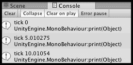

## 如何做...

要在帧率独立的情况下定期执行方法，请遵循以下步骤：

1.  将以下 C#脚本类`TimedMethod`添加到**主相机**：

    ```cs
    using UnityEngine;
    using System.Collections;

    public class TimedMethod : MonoBehaviour {
      private void Start() {
        StartCoroutine(Tick());
      }

      private IEnumerator Tick() {
        float delaySeconds = 5.0F;
        while (true) {
          print("tick " + Time.time);
          yield return new WaitForSeconds(delaySeconds);
        }
      }
    }
    ```

## 它是如何工作的...

当接收到`Start()`消息时，`Tick()`方法以协程的形式启动。`Tick()`方法将执行之间的延迟（变量`delaySeconds`）设置为 5 秒。然后启动一个无限循环，其中方法执行其操作（在这种情况下，只是打印出时间）；最后，执行一个`yield`指令，这会导致方法暂停执行 5 秒。在`yield`指令完成后，循环将再次继续执行，依此类推。在处理协程时，重要的是要理解方法将从它 yield 的相同状态恢复执行。

你可能已经注意到*根本没有任何*`Update()`或`FixedUpdate()`方法。所以，尽管我们的游戏有定期执行的逻辑，但在本例中，没有必须每帧执行的逻辑——太棒了！

## 还有更多...

一些你不希望错过的细节：

### 让不同的动作在不同的间隔发生

协程可用于在不同的常规间隔执行不同类型的逻辑。因此，需要逐帧执行的逻辑放入`Update()`，而每秒或每两秒执行一次即可的逻辑可能放入一个延迟为 0.5 秒的协程中；可以更少地偶尔更新的逻辑可以放入另一个延迟为 2 秒或 5 秒的协程中，依此类推。通过仔细分析（并测试）不同的游戏逻辑，可以找到仍然可接受的*最不频繁执行*，从而找到有效和明显的性能提升。

## 参见

参考下一道菜谱以获取更多信息。

# 使用协程在多个帧上分散长计算

**优化原则 3**：尽可能少地调用方法。

协程允许我们编写异步代码——我们可以要求一个方法去计算某件事，而游戏的其他部分可以继续运行，无需等待该计算结束。或者，我们可以在`Update()`方法中调用协程方法，并组织每次调用时完成复杂计算的一部分。

注意，协程不是**线程**，但它们非常方便，因为每个协程都可以在每个帧上进一步推进。它还允许我们编写不需要等待某些方法完成就可以开始另一个方法的代码。

当游戏开始需要复杂的计算，例如人工智能推理时，在尝试在一个帧内完成所有计算时，可能无法维持可接受的游戏性能——这就是协程可以成为优秀解决方案的地方。

这个示例说明了一个复杂计算如何被结构化为几个部分，每个部分一次完成一个帧。

### 注意

注意：关于协程（以及其他 Unity 主题）的出色描述可以在 Ray Pendergraph 的 wikidot 网站上找到 [`raypendergraph.wikidot.com/unity-developer-s-notes#toc6`](http://raypendergraph.wikidot.com/unity-developer-s-notes#toc6)。

## 如何做...

要将计算分散到几个帧上，请按照以下步骤操作：

1.  将以下脚本类`SegmentedCalculation`添加到**主摄像机**：

    ```cs
    using UnityEngine;
    using System.Collections;

    public class SegmentedCalculation : MonoBehaviour {
      private const int ARRAY_SIZE = 50;
      private const int SEGMENT_SIZE = 10;
      private int[] randomNumbers;

      private void Awake(){
        randomNumbers = new int[ARRAY_SIZE];
        for(int i=0; i<ARRAY_SIZE; i++){
          randomNumbers[i] = Random.Range(0, 1000);
        }

        StartCoroutine( FindMinMax() );
      }

      private IEnumerator FindMinMax() {
        int min = int.MaxValue;
        int max = int.MinValue

        for(int i=0; i<ARRAY_SIZE; i++){
          if(i % SEGMENT_SIZE == 0){
            print("frame: " + Time.frameCount + ", i:" + i + ", min:" + min + ", max:" + max);

            // suspend for 1 frame since we've completed another segment
            yield return null;
          }

          if(randomNumbers[i] > max){
            max = randomNumbers[i];
          } else if(randomNumbers[i] < min){
            min = randomNumbers[i];
          }
        }

        // disable this scripted component
        print("** completed - disabling scripted component");
        enabled = false;
      }
    }
    ```

1.  运行游戏，你会看到数组中最高和最低值的搜索是如何逐步进行的，避免了每个新帧之间的不希望出现的延迟。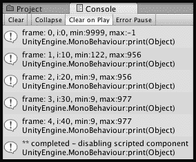

## 它是如何工作的...

随机整数数组`randomNumbers`在`Awake()`中创建。然后，`FindMinMax()`方法以协程的方式启动。数组的大小由常量`ARRAY_SIZE`定义，每帧要处理的元素数量由`SEGMENT_SIZE`定义。

`FindMinMax()`方法为`min`和`max`设置初始值，并开始遍历数组。如果当前索引可以被`SEGMENT_SIZE`整除（余数为 0），则我们让该方法显示当前帧号和变量值，并使用`yield null`语句暂停执行一个帧。对于每个循环，当前数组索引的值与`min`和`max`进行比较，如果找到新的最小值或最大值，则更新这些值。当循环完成后，脚本组件会禁用自己。

## 还有更多...

一些您不想错过的细节：

### 从您的系统中检索完整的 Unity 日志文本文件

除了在**控制台**面板中查看日志文本外，您还可以按照以下方式访问 Unity 编辑器日志文本文件：

+   Mac:

    +   `~/Library/Logs/Unity/Editor.log`

    +   通过标准控制台应用程序访问

+   Windows:

    +   `C:\Users\username\AppData\Local\Unity\Editor\Editor.log`

+   移动设备（请参阅 Unity 文档以访问设备日志数据）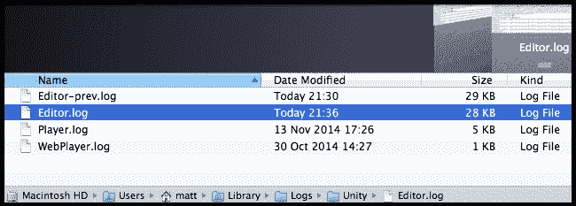

有关 Unity 日志文件的更多信息，请参阅在线手册 [`docs.unity3d.com/Manual/LogFiles.html`](http://docs.unity3d.com/Manual/LogFiles.html)。

## 相关内容

有关本章中 *定期执行但与帧率无关的方法* 菜谱的更多信息，请参阅。

# 通过测量最大和最小帧率（FPS）来评估性能

**优化原则 4**：使用性能数据来驱动设计和编码决策。

游戏性能的一个有用的原始测量是游戏某部分的最高和最低帧率。在这个菜谱中，我们使用 Creative Commons 的 **每秒帧数**（**FPS**）计算脚本来记录进行每帧数学计算的游戏的最高和最低帧率。

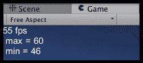

## 准备工作

对于这个菜谱，我们在 `1362_11_12` 文件夹中提供了 C# 脚本 `FPSCounter.cs`。这是我们修改过的文件，它包括了基于 Annop "Nargus" Prapasapong 的 **Do-It-Yourself**（**DIY**）帧率计算脚本的最高和最低值，该脚本已友好地发布在 Creative Commons 下的 Unify wiki 上 [`wiki.unity3d.com/index.php?title=FramesPerSecond`](http://wiki.unity3d.com/index.php?title=FramesPerSecond)。

## 如何操作...

要计算和记录最大和最小 FPS，请按照以下步骤操作：

1.  开始一个新的项目，并导入 `FPSCounter.cs` 脚本。

1.  将 `FPSCounter` 脚本类添加到 **主相机**。

1.  将以下 C# 脚本类 `SomeCalculations` 添加到 **主相机**：

    ```cs
    using UnityEngine;
    using System.Collections;

    public class SomeCalculations : MonoBehaviour {
      public int outerLoopIterations = 20;
      public int innerLoopMaxIterations = 100;

      void Update(){
        for(int i = 0; i < outerLoopIterations; i++){
          int innerLoopIterations = Random.Range(2,innerLoopMaxIterations);
          for(int j = 0; j < innerLoopIterations; j++){
            float n = Random.Range(-1000f, 1000f);
          }
        }
      }
    }
    ```

1.  运行游戏 20 到 30 秒。在屏幕上，你应该能看到当前的平均帧率以及最大和最小帧率显示。

1.  停止游戏运行。你现在应该在 **控制台** 中看到一个总结信息，显示每秒最大和最小帧数，如下截图所示：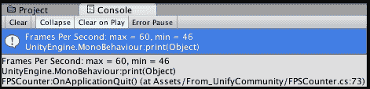

## 它是如何工作的...

`SomeCalculations` 脚本确保我们让 Unity 为每一帧做些事情，它在每一帧调用 `Update()` 方法时执行大量计算。有一个外循环（循环计数器 `i`）是公共变量 `outerLoopIterations` 的迭代次数（我们将其设置为 `20`），还有一个内循环（循环计数器 `j`），它是介于 2 和公共变量 `innerLoopMaxIterations`（我们将其设置为 `100`）之间的随机迭代次数。

计算平均 **每秒帧数**（**FPS**）的工作由 `FPSCounter` 脚本执行，该脚本在选择的频率下运行协程方法 `FPS()`（我们可以在 **检查器** 中更改）。每次 `FPS()` 方法执行时，它都会重新计算平均每秒帧数，如果适当的话，更新最大和最小值，如果勾选了 **运行时显示** 复选框，那么屏幕上的 **GUIText** 对象会更新为平均、最大和最小 FPS 的消息。

最后，当游戏结束时，脚本类`FPSCounter`中的`OnApplicationQuit()`方法会被执行，并将最大/最小 FPS 摘要信息打印到控制台。

## 更多内容...

一些你不希望错过的细节：

### 关闭运行时显示以减少 FPS 处理

我们添加了一个选项，允许你关闭运行时显示，这将减少 FPS 计算所需的处理。你只需在**检查器**中取消选中**运行时显示**复选框即可。

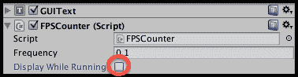

## 参见

参考本章中的以下食谱以获取更多信息：

+   *使用 Unity 性能分析器识别性能瓶颈*

+   *使用 Do-It-Yourself 性能分析器识别性能瓶颈*

# 使用 Unity 性能分析器识别性能瓶颈

**优化原则 4**：使用性能数据来驱动设计和编码决策。

除了遵循一般的资源和代码设计原则，我们知道这些原则应该能提高性能之外，我们还应该意识到每个游戏都是不同的，而在现实中，唯一知道哪些设计决策对性能影响最大的是收集和分析运行时性能数据。虽然原始的**每秒帧数**（**FPS**）测量是有用的，但在选择不同的决策时，了解每个帧的渲染和代码执行的处理需求是极其宝贵的。

Unity 5 **性能分析器**提供了代码和渲染处理需求的详细分解，以及 GPU、音频以及 2D 和 3D 物理所需的处理。也许最有用的一点是，它允许程序员明确记录命名代码段的数据。我们将命名我们的配置文件为`MATT_SomeCalculations`，并记录和检查我们计算每帧的处理需求。

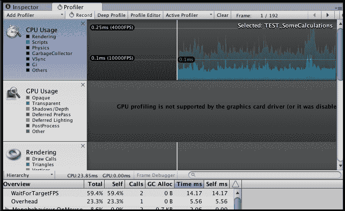

## 如何操作...

要使用 Unity **性能分析器**记录处理需求，请按照以下步骤操作：

1.  开始一个新的 2D 项目。

1.  从**窗口**菜单打开**性能分析器**窗口，确保已选中**记录**选项，并且正在收集**脚本**性能数据，如下截图所示：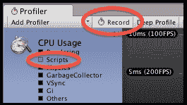

1.  将以下 C#脚本类`ProfileCalculations`添加到**主摄像机**：

    ```cs
    using UnityEngine;
    using System.Collections;

    public class ProfileCalculations : MonoBehaviour {
      public int outerLoopIterations = 20;
      public int innerLoopMaxIterations = 100;

      void Update(){
        Profiler.BeginSample("MATT_calculations");

        for(int i = 0; i < outerLoopIterations; i++){
          int innerLoopIterations = Random.Range(2,innerLoopMaxIterations);
          for(int j = 0; j < innerLoopIterations; j++){
            float n = Random.Range(-1000f, 1000f);
          }
        }

        Profiler.EndSample();
      }
    }
    ```

1.  运行游戏 20 到 30 秒。

1.  停止运行的游戏。你现在应该在**性能分析器**面板中看到所选帧所需处理细节的分解——**性能分析器**面板右上角的每一条锯齿形线条代表一个帧收集的数据。

1.  通过拖动白色线条到不同的水平位置来查看不同帧的数据——当前帧和总帧数显示在右上角，形式为**帧：frame / totalFrames**。

1.  由于我们给代码配置样本命名，并以**MATT**为前缀，我们可以限制只显示包含该单词的样本数据。在搜索文本框（位于小放大镜旁边）中输入`MATT`，你现在应该只看到一行关于我们的样本**MATT_calculations**的配置数据。我们可以看到，在第 83 帧，我们的代码占用了该帧处理时间的 1.2%。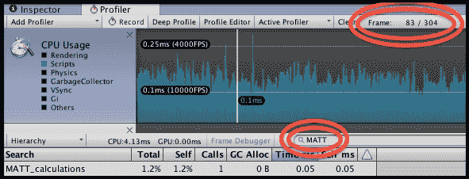

## 它是如何工作的...

`ProfileCalculations`脚本确保 Unity 为每一帧执行一些操作；它使用内循环和外循环进行大量计算，就像在之前的 FPS 食谱中一样。

两个重要的语句是标记要记录和展示在**Profiler**中的命名代码样本的开始和结束。`Profiler.BeginSample("MATT_calculations")`语句开始我们的命名配置，它通过`EndSample()`语句结束。

使用引人注目的前缀，我们可以轻松地隔离我们的命名代码配置以进行分析，使用**Profiler**面板中的搜索文本框。

## 参考信息

参考本章中的以下食谱以获取更多信息：

+   *通过测量最大和最小帧率（FPS）来评估性能*

+   *使用 Do-It-Yourself 性能配置识别性能瓶颈*

# 使用 Do-It-Yourself 性能配置识别性能“瓶颈”

**优化原则 4**：使用性能数据来驱动设计和编码决策。

Unity 5 性能配置器很棒，但有时我们可能希望对正在运行的代码以及它如何显示或记录数据有完全的控制。在这个食谱中，我们探讨了如何使用一个免费可用的脚本进行 DIY 性能配置。虽然它不像 Unity 性能配置器的图形和详细配置那样花哨，但它仍然提供了关于脚本命名部分所需时间的低级数据，这对于做出改进游戏性能的代码设计决策是足够的。

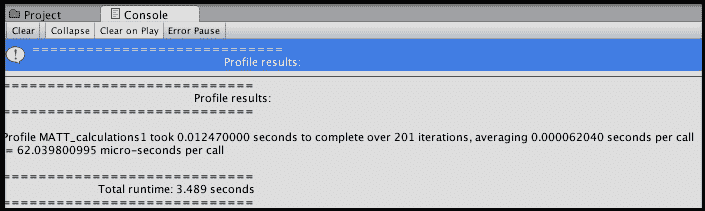

## 准备工作

对于这个食谱，我们在`1362_11_14`文件夹中提供了 C#脚本`Profile.cs`。这是 Michael Garforth 的 DIY 配置脚本，他友好地将其发布在 Unify Wiki 上的*Creative Commons*下，网址为[`wiki.unity3d.com/index.php/Profiler`](http://wiki.unity3d.com/index.php/Profiler)。

## 如何操作...

要使用 Do-It-Yourself 代码配置来记录处理需求，请按照以下步骤操作：

1.  开始一个新项目，并导入`Profile.cs`脚本。

1.  将以下 C#脚本类`DIYProfiling`添加到**主摄像机**：

    ```cs
    using UnityEngine;
    using System.Collections;

    public class DIYProfiling : MonoBehaviour {
      public int outerLoopIterations = 20;
      public int innerLoopMaxIterations = 100;

      void Update(){
        string profileName = "MATT_calculations";
        Profile.StartProfile(profileName);

        for (int i = 0; i < outerLoopIterations; i++){
          int innerLoopIterations = Random.Range(2,innerLoopMaxIterations);
          for (int j = 0; j < innerLoopIterations; j++){
            float n = Random.Range(-1000f, 1000f);
          }
        }

        Profile.EndProfile(profileName);
      }

      private void OnApplicationQuit() {
        Profile.PrintResults();
      }
    }
    ```

1.  运行游戏几秒钟。

1.  停止游戏运行。你现在应该在**控制台**中看到一个总结消息，说明我们命名配置的总处理时间、平均时间和迭代次数，以及游戏运行的总时间。

## 它是如何工作的...

如您所见，脚本几乎与之前配方中使用的 Unity 性能分析脚本相同。我们不是调用 Unity 的 **Profiler**，而是调用 Michael Garforth 的 `Profile` 类的静态（类）方法。

我们使用 `Profile` 类方法 `StartProfile(…)` 和 `EndProfile(…)`，并传入要分析内容的字符串名称（在本例中为 `MATT_calculations`）。

最后，当游戏终止时，会执行 `OnApplicationQuit()` 方法，调用 `Profile` 类的 `PrintResults()` 方法，该方法将性能摘要信息打印到控制台。

`Profile` 类记录每个命名配置文件被调用的次数以及从开始到结束之间的持续时间，当调用 `PrintResults()` 时，输出关于这些执行的摘要信息。

## 参见

有关更多信息，请参阅本章以下配方：

+   *通过测量最大和最小帧率（FPS）来评估性能*

+   *使用 Unity 性能分析器识别性能瓶颈*

# 缓存 GameObject 和组件引用以避免昂贵的查找

**优化原则 2**：最小化需要 Unity 对对象进行“反射”操作和搜索所有当前场景对象的动作。

反射是指在运行时，Unity 必须分析对象以查看它们是否包含与对象接收到的“消息”相对应的方法 - 例如 `SendMessage()`。Unity 在场景中搜索所有活动对象的简单而有用但速度较慢的 `FindObjectsByTag()` 是一个示例。每次我们使用 `GetComponent()` 查找对象的组件时，都会减慢 Unity 的速度。

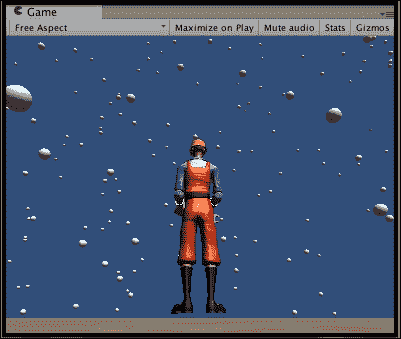

在过去，对于许多组件，Unity 提供了诸如 `.audio` 这样的 *快速组件属性获取器*，以引用脚本父 **GameObject** 的 `AudioSource` 组件，`rigidbody` 以引用 **RigidBody** 组件，等等。然而，这并不是一个一致的规则，在其他情况下，您必须使用 `GetComponent()`。在 Unity 5 中，所有这些 *快速组件属性获取器* 都已被移除（除了 `.transform`，它被自动缓存，因此使用时没有性能成本）。为了帮助游戏开发者更新他们的脚本以与 Unity 5 兼容，他们引入了 *自动脚本更新*，其中（在适当警告并在继续之前备份文件之后！）Unity 会遍历脚本，将 *快速组件属性获取器* 代码替换为标准化的 `GetComponent<ComponentType>()` 代码模式，例如 `GetComponent<Rigidbody>()` 和 `GetComponent<AudioSource>()`。然而，尽管脚本更新使事物保持一致，并明确所有这些 `GetComponent()` 反射语句，但每次 `GetComponent()` 执行都会消耗宝贵的处理资源。

### 注意

您可以在以下 2014 年 6 月的博客文章和手册页面中了解更多关于 Unity 这样做的原因（以及他们拒绝的替代方案*Extension Methods*；真遗憾——我认为我们将在 Unity 的后续版本中看到它们，因为这是一种优雅地解决这种编码情况的方法）：

+   [`blogs.unity3d.com/2014/06/23/unity5-api-changes-automatic-script-updating/`](http://blogs.unity3d.com/2014/06/23/unity5-api-changes-automatic-script-updating/)

+   [`unity3d.com/learn/tutorials/modules/intermediate/scripting/extension-methods`](http://unity3d.com/learn/tutorials/modules/intermediate/scripting/extension-methods)

在这个菜谱中，我们将逐步重构一个方法，通过移除反射和组件查找操作，使其在每一步都变得更加高效。我们将改进的方法是找到场景中标记为`Player`（一个**3rd Person Controller**）的**GameObject**和场景中标记为`Respawn`的 1,000 个其他**GameObject**之间的一半距离。

## 准备工作

对于这个菜谱，我们准备了一个名为`unity4_assets_handyman_goodDirt`的包，包含 3rdPersonController handyman 和地形材质`goodDirt`。该包位于文件夹`1362_11_15`。

## 如何操作...

为了通过缓存组件查找来提高代码性能，请按照以下步骤操作：

1.  创建一个新的 3D 项目，导入提供的 Unity 包`unity4_assets_handyman_goodDirt`。

1.  创建一个新的**地形**（大小为**200 x 200**，位于**-100, 0, -100**），并使用**GoodDirt**进行纹理绘制。

1.  在地形的中心添加一个**3rdPersonController**（即**0, 1, 0**）。请注意，这已经标记为**Player**。

1.  创建一个新的**球体**，并给它添加**Respawn**标签。

1.  在**Project**面板中，创建一个新的空预制件，命名为**prefab_sphere**，并将**球体**从**Hierarchy**面板拖动到**Project**面板中的预制件中。

1.  现在，从**Hierarchy**面板中删除**球体**（因为所有属性都已复制到我们的预制件中）。

1.  将以下 C#脚本类`SphereBuilder`添加到**主相机**：

    ```cs
    using UnityEngine;
    using System.Collections;

    public class SphereBuilder : MonoBehaviour
    {
      public const int NUM_SPHERES = 1000;
      public GameObject spherePrefab;

      void Awake(){
        List<Vector3> randomPositions = BuildVector3Collection(NUM_SPHERES);
        for(int i=0; i < NUM_SPHERES; i++){
          Vector3 pos = randomPositions[i];
          Instantiate(spherePrefab, pos, Quaternion.identity);
        }
      }

      public List<Vector3> BuildVector3Collection(int numPositions){
        List<Vector3> positionArrayList = new List<Vector3>();
        for(int i=0; i < numPositions; i++) {
          float x = Random.Range(-100, 100);
          float y = Random.Range(1, 100);
          float z = Random.Range(-100, 100);
          Vector3 pos = new Vector3(x,y,z);
          positionArrayList.Add (pos);
        }

        return positionArrayList;
      }
    }
    ```

1.  在**Hierarchy**中选择**主相机**，从**Inspector**中的**Project**面板拖动**prefab_sphere**到公共变量`Sphere Prefab`，如以下截图所示：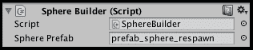

1.  将以下 C#脚本类`SimpleMath`添加到**主相机**：

    ```cs
    using UnityEngine;
    using System.Collections;

    public class SimpleMath : MonoBehaviour {
      public float Halve(float n){
        return n / 2;
      }
    }
    ```

### 方法 1 – 平均距离计算

按照以下步骤操作：

1.  将以下 C#脚本类`AverageDistance`添加到**主相机**：

    ```cs
    using UnityEngine;
    using System.Collections;
    using System;

    public class AverageDistance : MonoBehaviour
    {
      void Update(){
        // method1 - basic
        Profiler.BeginSample("TESTING_method1");
        GameObject[] sphereArray = GameObject.FindGameObjectsWithTag("Respawn");
        for (int i=0; i < SphereBuilder.NUM_SPHERES; i++){
          HalfDistanceBasic(sphereArray[i].transform);
        }
        Profiler.EndSample();
      }

      // basic
      private void HalfDistanceBasic(Transform sphereGOTransform){
        Transform playerTransform = GameObject.FindGameObjectWithTag("Player").transform;
        Vector3 pos1 = playerTransform.position;
        Vector3 pos2 = sphereGOTransform.position;

        float distance = Vector3.Distance(pos1, pos2);

        SimpleMath mathObject = GetComponent<SimpleMath>();
        float halfDistance = mathObject.Halve(distance);
      }
    }
    ```

1.  打开**Profiler**面板，确保已选择**record**，并且正在记录脚本处理负载。

1.  运行游戏 10 到 20 秒。

1.  在**Profiler**面板中，仅限制列出的结果为以`TEST`开头的样本。对于您选择的任何帧，您应该看到**TESTING_method1**的 CPU 负载百分比和所需的毫秒数。

### 方法 2 – 缓存 Respawn 对象变换数组

按照以下步骤操作：

1.  `FindGameObjectWithTag()`很慢，所以让我们修复搜索带有`Respawn`标记的对象的问题。首先，在 C#脚本类`AverageDistance`中添加一个名为`sphereTransformArrayCache`的私有`Transform`数组变量：

    ```cs
    private Transform[] sphereTransformArrayCache;
    ```

1.  现在，添加`Start()`方法，该语句将存储在这个数组中，指向所有带有`Respawn`标记对象的`Transform`组件的引用：

    ```cs
    private void Start(){
      GameObject[] sphereGOArray = GameObject.FindGameObjectsWithTag("Respawn");
      sphereTransformArrayCache = new Transform[SphereBuilder.NUM_SPHERES];
      for (int i=0; i < SphereBuilder.NUM_SPHERES; i++){
        sphereTransformArrayCache[i] = sphereGOArray[i].transform;
      }
    }
    ```

1.  现在，在`Update()`方法中，开始一个新的名为**TESTING_method2**的**Profiler**样本，它使用我们缓存的带有`Respawn`标记的游戏对象数组：

    ```cs
    // method2 - use cached sphere ('Respawn' array)
    Profiler.BeginSample("TESTING_method2");
    for (int i=0; i < SphereBuilder.NUM_SPHERES; i++){
      HalfDistanceBasic(sphereTransformArrayCache[i]);
    }
    Profiler.EndSample();
    ```

1.  再次运行游戏 10 到 20 秒，并将**Profiler**面板设置为仅列出以`TEST`开头的样本。对于你选择的任何帧，你应该看到**TESTING_method1**和**TESTING_method2**的 CPU 负载百分比和所需的毫秒数。

### 方法 3 – 缓存玩家变换引用

这样应该会更快。但是等等！让我们再进一步改进。让我们利用缓存的`Cube-Player`组件的变换引用，完全避免缓慢的对象标记反射查找。按照以下步骤操作：

1.  首先，在`Start()`方法中添加一个新的私有变量和一个语句，将`Player`对象的变换分配到这个变量`playerTransformCache`中：

    ```cs
    private Transform playerTransformCache;
    private Transform[] sphereTransformArrayCache;

    private void Start(){
      GameObject[] sphereGOArray = GameObject.FindGameObjectsWithTag("Respawn");
      sphereTransformArrayCache = new Transform[SphereBuilder.NUM_SPHERES];
      for (int i=0; i < SphereBuilder.NUM_SPHERES; i++){
        sphereTransformArrayCache[i] = sphereGOArray[i].transform;
      }

      playerTransformCache = GameObject.FindGameObjectWithTag("Player").transform;
    }
    ```

1.  现在，在`Update()`中添加以下代码以启动一个新的名为**TESTING_method3**的**Profiler**样本：

    ```cs
    // method3 - use cached playerTransform
    Profiler.BeginSample("TESTING_method3");
    for (int i=0; i < SphereBuilder.NUM_SPHERES; i++){
    HalfDistanceCachePlayerTransform(sphereTransformArrayCache[i]);
    }
    Profiler.EndSample();
    ```

1.  最后，我们需要编写一个新的方法，该方法利用我们设置的缓存的玩家变换变量来计算半距离。所以，添加这个新方法，`HalfDistanceCachePlayerTransform(sphereTransformArrayCache[i])`：

    ```cs
    // playerTransform cached
    private void HalfDistanceCachePlayerTransform(Transform sphereGOTransform){
      Vector3 pos1 = playerTransformCache.position;
      Vector3 pos2 = sphereGOTransform.position;
      float distance = Vector3.Distance(pos1, pos2);
      SimpleMath mathObject = GetComponent<SimpleMath>();
      float halfDistance = mathObject.Halve(distance);
    }
    ```

### 方法 4 – 缓存玩家的 Vector3 位置

让我们再进一步改进。如果我们假设对于我们的特定游戏，玩家角色不会移动，那么我们可以缓存玩家的**位置**一次，而不是每次帧都检索它。

按照以下步骤操作：

1.  目前，为了找到`pos1`，我们每次在`Update()`方法调用时都让 Unity 找到`playerTransform`中的`Vector3`位置值。让我们使用`Start()`中的变量和语句将这个`Vector3`位置缓存起来，如下所示：

    ```cs
    private Vector3 pos1Cache;

    private void Start(){
    ...
    pos1Cache = playerTransformCache.position;
    }
    ```

1.  现在，编写一个新的半距离方法，利用这个缓存的**位置**：

    ```cs
    // player position cached
    private void HalfDistanceCachePlayer1Position(Transform sphereGOTransform){
      Vector3 pos1 = pos1Cache;
      Vector3 pos2 = sphereGOTransform.position;
      float distance = Vector3.Distance(pos1, pos2);
      SimpleMath mathObject = GetComponent<SimpleMath>();
      float halfDistance = mathObject.Halve(distance);
    }
    ```

1.  现在，在`Update()`方法中添加以下代码，以便为我们创建一个新的样本，并调用我们新的半距离方法：

    ```cs
    // method4 - use cached playerTransform.position
    Profiler.BeginSample("TESTING_method4");
    for (int i=0; i < SphereBuilder.NUM_SPHERES; i++){
      HalfDistanceCachePlayer1Position(sphereTransformArrayCache[i]);
    }
    Profiler.EndSample();
    ```

### 方法 5 – 缓存 SimpleMath 组件引用

这样应该再次改进。但我们还可以进一步改进——你会在我们最新的半距离方法中注意到，我们有一个显式的`GetComponent()`调用，用于获取我们的`mathObject`的引用；这将*每次方法被调用时*执行。按照以下步骤操作：

1.  让我们将这个脚本组件引用也缓存起来，以节省每次迭代的`GetComponent()`反射。我们将声明一个变量`mathObjectCache`，并在`Awake()`中将其设置为指向我们的`SimpleMath`脚本组件：

    ```cs
    private SimpleMath mathObjectCache;

    private void Awake(){
      mathObjectCache = GetComponent<SimpleMath>();
    }
    ```

1.  让我们编写一个新的半距离方法，该方法使用这个缓存的数学组件引用`HalfDistanceCacheMathComponent(i)`：

    ```cs
    // math Component cache
    private void HalfDistanceCacheMathComponent(Transform sphereGOTransform){
      Vector3 pos1 = pos1Cache;
      Vector3 pos2 = sphereGOTransform.position;
      float distance = Vector3.Distance(pos1, pos2);
      SimpleMath mathObject = mathObjectCache;
      float halfDistance = mathObject.Halve(distance);
    }
    ```

1.  现在，在`Update()`方法中添加以下代码，以便为我们的*method5*创建一个新的样本并调用我们新的半距离方法：

    ```cs
    // method5 - use cached math component
    Profiler.BeginSample("TESTING_method5");
    for (int i=0; i < SphereBuilder.NUM_SPHERES; i++){
      HalfDistanceCacheMathComponent(sphereTransformArrayCache[i]);
    }
    Profiler.EndSample();
    ```

### 方法 6 – 缓存球体 Vector3 位置数组

我们已经改进了很多，但仍然有一个明显的机会可以通过缓存来改进我们的代码（如果我们假设球体不会移动，这在示例中似乎是合理的）。目前，在半距离计算方法中的每一帧和每个球体，我们都要求 Unity 检索当前球体变换中的`Vector3`位置属性值（这是我们变量`pos2`），这个位置用于计算当前球体与`Player`的距离。让我们创建一个包含所有这些`Vector3`位置的数组，这样我们就可以将当前的值传递给我们的半距离计算方法，并节省多次检索它的工作。

按照以下步骤操作：

1.  首先，在`Start()`方法中添加一个新的私有变量和一条语句，将每个球体的`Vector3`变换位置分配到数组`spherePositionArrayCache`中：

    ```cs
    private Vector3[] spherePositionArrayCache = new Vector3[SphereBuilder.NUM_SPHERES];

    private void Start(){
      GameObject[] sphereGOArray = GameObject.FindGameObjectsWithTag("Respawn");
      sphereTransformArrayCache = new Transform[SphereBuilder.NUM_SPHERES];
      for (int i=0; i < SphereBuilder.NUM_SPHERES; i++){
        sphereTransformArrayCache[i] = sphereGOArray[i].transform;
        spherePositionArrayCache[i] = sphereGOArray[i].transform.position;
      }

      playerTransformCache = GameObject.FindGameObjectWithTag("Player").transform;
      pos1Cache = playerTransformCache.position;
    }
    ```

1.  让我们编写一个新的半距离方法，该方法使用这个缓存的位位置数组：

    ```cs
    // sphere position cache
    private void HalfDistanceCacheSpherePositions(Transform sphereGOTransform, Vector3 pos2){
      Vector3 pos1 = pos1Cache;
      float distance = Vector3.Distance(pos1, pos2);
      SimpleMath mathObject = mathObjectCache;
      float halfDistance = mathObject.Halve(distance);
    }
    ```

1.  现在，在`Update()`方法中添加以下代码，以便为我们的*method6*创建一个新的样本并调用我们新的半距离方法：

    ```cs
    // method6 - use cached array of sphere positions
    Profiler.BeginSample("TESTING_method6");
    for (int i=0; i < SphereBuilder.NUM_SPHERES; i++){
    HalfDistanceCacheSpherePositions(sphereTransformArrayCache[i], spherePositionArrayCache[i]);
    }
    Profiler.EndSample();
    ```

1.  打开**Profiler**面板并确保**record**被选中，正在记录脚本处理负载。

1.  运行游戏 10 到 20 秒。

1.  在**Profiler**面板中，仅限制列出的结果为以`TEST`开头的样本。对于您选择的任何帧，您应该看到每个方法的 CPU 负载百分比和所需毫秒数（这两个值都越低越好！）。对于几乎每一帧，您都应该看到通过缓存改进的每个方法是如何/是否减少了 CPU 负载。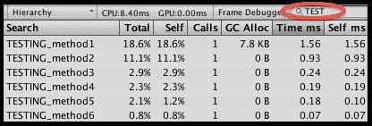

## 它是如何工作的...

这个配方说明了我们如何尝试在迭代之前一次性缓存不会改变的变量的引用，例如`GameObjects`及其组件的引用，以及在这个示例中，标记为`Player`和`Respawn`的对象的`Transform`组件和`Vector3`位置。当然，与所有事情一样，缓存也有“成本”，这个成本就是存储所有这些引用所需的内存需求。这被称为**时空权衡**。您可以在[`en.wikipedia.org/wiki/Space%E2%80%93time_tradeoff`](https://en.wikipedia.org/wiki/Space%E2%80%93time_tradeoff)了解更多关于这个经典的计算机科学速度与内存权衡。

在需要多次执行的方法中，这种移除隐式和显式组件和对象查找可能提供可测量的性能改进。

### 注意

注意：了解 Unity 性能优化技术的两个好地方是 Unity 脚本参考中的*性能优化*网页以及 Unity 的 Jonas Echterhoff 和 Kim Steen Riber Unite2012 演示*Unity 性能优化技巧和窍门*。本章中的许多配方都源于以下来源的建议：

+   [`docs.unity3d.com/410/Documentation/ScriptReference/index.Performance_Optimization.html`](http://docs.unity3d.com/410/Documentation/ScriptReference/index.Performance_Optimization.html)

+   [`unity3d.com/unite/archive/2012`](http://unity3d.com/unite/archive/2012)

## 相关内容

参考本章中的以下配方以获取更多信息：

+   *使用委托和事件提高效率并避免 SendMessage!*

+   *使用 Unity 性能分析器识别性能瓶颈*

+   *使用 Do-It-Yourself 性能分析识别性能瓶颈*

# 使用 LOD 组提高性能

**优化原则 5**：最小化绘制调用次数。

精细几何和高分辨率纹理图可以是一把双刃剑：它们可以提供更好的视觉体验，但它们可能会对游戏性能产生负面影响。**LOD 组**通过在对象占据屏幕的必要部分小于高质量版本能产生显著差异时，用简化版本替换高质量对象来解决这个问题。

在这个配方中，我们将使用**LOD 组**来创建一个具有两个不同细节级别的游戏对象：当对象占据屏幕超过 50%时的高质量版本，以及占据少于该数量的低质量版本。我们想感谢 Unity 的 Carl Callewaert，他为 LOD Group 功能进行了演示，这在许多方面为这个配方提供了信息。

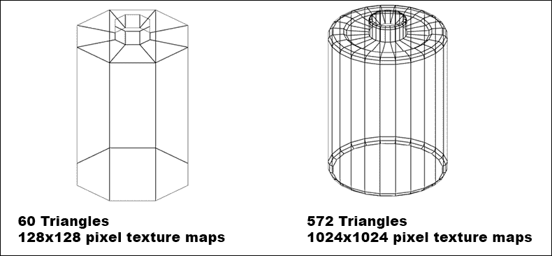

## 准备工作

对于这个配方，我们为游戏对象的高质量和低质量版本准备了两个预制件。它们具有相同的尺寸和变换设置（位置、旋转和缩放），以便它们可以无缝替换。这两个预制件都包含在名为`LODGroup`的包中，位于`1362_11_16`文件夹内。

## 如何操作...

要创建一个 LOD 组，请按照以下步骤操作：

1.  将**LODGroup**包导入到您的项目中。

1.  从**Project**视图，在**LOD**文件夹内，将**batt-high**预制件拖放到**Hierarchy**视图。然后，对**batt-low**预制件做同样的操作。确保它们放置在相同的**位置**（**X**：**0**；**Y**：**0**；**Z**：**0**）。

1.  从**Hierarchy**视图中的**Create**下拉菜单创建一个新的空游戏对象（**Create** | **Create Empty**）。将其重命名为`battLOD`。

1.  将**LODGroup**组件添加到**battLOD**（菜单**Component** | **Rendering** | **LODGroup**）。

1.  选择**battLOD**对象，并在**检查器**视图中的**LODGroup**组件上，右键点击**LOD 2**并删除它（因为我们将只有两个不同的 LOD：**LOD 0**和**LOD 1**），如下截图所示：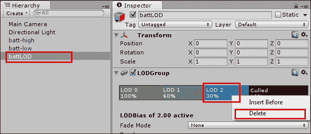

1.  选择**LOD 0**区域，点击**添加**按钮，并从列表中选择**batt-high**游戏对象。会出现关于重新父化对象的消息。选择**是，重新父化**。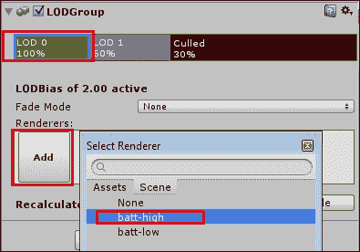

1.  选择**LOD 1**部分，点击**添加**，并选择**batt-low**对象。再次，当提示时选择**是，重新父化**。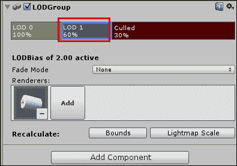

1.  拖动 LOD 渲染器的限制以将其设置为：**LOD 0：100**%，**LOD 1**：**50**%，**裁剪：1**%。这样，当**bat-high**占据屏幕空间的 51%到 100%时，Unity 将渲染它；当占据 2%到 50%时，将渲染**batt-low**；如果占据 1%或更少，则不会渲染任何内容。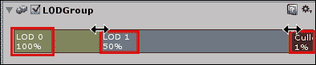

1.  将场景的摄像机移向**battLOD**对象并返回。你会注意到 Unity 如何根据对象占据屏幕空间的多少在高清和低清 LOD 渲染器之间切换。

## 它是如何工作的...

一旦我们用适当的模型填充了 LOD 渲染器，**LODGroup**组件将根据对象占据屏幕百分比的大小选择并显示正确的渲染器，甚至可以完全不显示。

## 还有更多...

一些你不应该错过的细节：

### 添加更多 LOD 渲染器

你可以通过在现有的 LOD 渲染器上右键点击并从上下文菜单中选择**插入之前**来添加更多 LOD 渲染器。

### LOD 过渡淡入

如果你想最小化渲染器交换时发生的**闪烁**，你可以尝试将参数**淡入模式**从**无**更改为**百分比**或**交叉淡入**。

## 相关内容

参考本章下一节以获取更多信息

# 通过设计绘制调用批处理来提高性能

**优化原则 5**：最小化绘制调用次数。

减少绘制调用的一种方法是通过优先考虑设计决策，使对象符合 Unity 的**静态**和**动态绘制调用批处理**资格。

更 CPU 高效的批处理方法是 Unity 的**静态批处理**。它允许减少任何尺寸几何形状的绘制调用次数。如果这不可能，那么最好的选择是**动态批处理**，它再次允许 Unity 在单个绘制调用中处理多个移动对象。

注意，这里有一个成本——批处理使用内存，静态批处理比动态内存使用更多。因此，你可以通过批处理来提高性能，但你会增加场景的内存“足迹”。像往常一样，使用内存和性能分析来评估哪种技术最适合你的游戏及其目标部署设备。

## 如何操作...

在本节中，我们将学习如何实现 **静态批处理** 和 **动态批处理**。

### 静态批处理

要使 Unity 的 **静态批处理** 成为可能，你需要执行以下操作：

1.  确保模型共享相同的材质。

1.  标记模型为 **静态**，如图所示：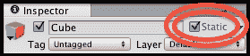

可以安全标记为 **静态** 的对象包括那些不会移动或缩放的环境对象。

可以使用许多技术来确保模型共享相同的材质，包括：

+   避免通过直接绘制模型的顶点来使用纹理（有关此内容的链接在 *还有更多…* 部分提供）

+   增加使用完全相同纹理的纹理对象的数量

+   通过将多个纹理组合成一个来人工启用对象共享相同的纹理（纹理图集）

+   最大化使用 `Renderer.sharedMaterial` 而不是 `Renderer.material`（因为使用 `Render.material` 会涉及复制材质，因此该 GameObejct 将无法进行批处理）

事实上，静态和动态批处理都仅适用于使用相同材质的对象，因此上述所有方法同样适用于使动态批处理成为可能。

### 动态批处理

要使 Unity 的 **动态批处理** 成为可能，你需要执行以下操作：

1.  确保模型共享相同的材质。

1.  将每个网格的 **顶点属性** 数量保持在 900 以下。

1.  要使对象组符合动态批处理条件，需要使用相同的变换缩放（尽管非均匀缩放的模型仍然可以批处理）。

1.  如果可能，让动态光照映射对象指向相同的光照贴图位置，以方便动态批处理。

1.  如果可能，避免使用多通道着色器和实时阴影，因为这两者都会阻止动态批处理。

要计算 **顶点属性** 的数量，你需要将顶点数乘以 **Shader** 使用的属性数。例如，对于使用三个属性（顶点位置、法线和 UV）的 **Shader**，这意味着模型必须少于 300 个顶点，以保持属性总数低于 900，从而符合动态批处理的条件。

## 还有更多...

一些你不希望错过的细节：

### 通过顶点绘制减少对纹理的需求

有关此主题的更多信息，请参阅以下内容：

+   Blender：

    [`wiki.blender.org/index.php/Doc:2.6/Manual/Materials/Special_Effects/Vertex_Paint`](http://wiki.blender.org/index.php/Doc:2.6/Manual/Materials/Special_Effects/Vertex_Paint)

+   3D Studio Max：

    [`3dmax-tutorials.com/Vertex_Paint_Modifier.html`](http://3dmax-tutorials.com/Vertex_Paint_Modifier.html)

+   Maya：免费的 Vertex Chameleon 插件

    [`renderheads.com/portfolio/VertexChameleon/`](http://renderheads.com/portfolio/VertexChameleon/)

### 关于减少纹理和材质的信息来源

有关此主题的更多信息，请参阅以下内容：

+   Unity 手册页面关于 Draw Call Batching：

    [`docs.unity3d.com/Manual/DrawCallBatching.html`](http://docs.unity3d.com/Manual/DrawCallBatching.html)

+   Paladin Studios：

    [`www.paladinstudios.com/2012/07/30/4-ways-to-increase-performance-of-your-unity-game/`](http://www.paladinstudios.com/2012/07/30/4-ways-to-increase-performance-of-your-unity-game/)

+   Nvidia 关于纹理图集以增加绘制调用批处理机会的白色论文：

    [`http.download.nvidia.com/developer/NVTextureSuite/Atlas_Tools/Texture_Atlas_Whitepaper.pdf`](http://http.download.nvidia.com/developer/NVTextureSuite/Atlas_Tools/Texture_Atlas_Whitepaper.pdf)

+   Nvidia 免费纹理工具和 Photoshop 插件：

    [`www.nvidia.com/object/texture_atlas_tools.html`](http://www.nvidia.com/object/texture_atlas_tools.html)

## 参考以下内容

参考本章中的“使用 LOD 组提高性能”配方以获取更多信息

# 结论

在本章中，我们介绍了一些额外功能以及一系列提高游戏性能和收集性能数据进行分析的方法。

本章的前三个配方提供了一些为您的游戏添加额外功能（暂停、慢动作和确保在线游戏安全）的想法。本章的其余配方提供了如何调查和改进游戏效率与性能的示例。

## 更多内容...

正如游戏中有很多组件一样，游戏中有许多部分可能会发现处理**瓶颈**并需要解决以提升整体游戏性能。现在提供了一些额外的建议和进一步参考资料，以提供一个起点，以便您进一步探索优化和性能问题，因为这些问题可能需要整本书来讨论，而不仅仅是一章。

### 游戏音频优化

移动设备相较于游戏机、桌面或笔记本电脑，内存和处理资源都相对较少，因此在游戏音频方面常常面临最大的挑战。例如，iPhone 一次只能解压缩一个音频剪辑，因此游戏可能会因为音频解压缩问题而出现处理峰值（即降低游戏帧率）。

Paladin Studios 推荐以下音频文件压缩策略用于移动游戏：

+   **短剪辑**：原生（无压缩）

+   **长剪辑**（或循环的剪辑）：在内存中压缩

+   **音乐**：从光盘流式传输

+   **持续引起 CPU 峰值波动的文件**：加载时解压缩

关于此主题的更多信息，请参阅以下链接：

+   Unity 手册音频：

    [`docs.unity3d.com/Manual/AudioFiles.html`](http://docs.unity3d.com/Manual/AudioFiles.html)

+   Paladin Studios：

    [`www.paladinstudios.com/2012/07/30/4-ways-to-increase-performance-of-your-unity-game/`](http://www.paladinstudios.com/2012/07/30/4-ways-to-increase-performance-of-your-unity-game/)

+   Apple 开发者音频页面：

    [`developer.apple.com/library/ios/documentation/AudioVideo/Conceptual/MultimediaPG/UsingAudio/UsingAudio.html`](https://developer.apple.com/library/ios/documentation/AudioVideo/Conceptual/MultimediaPG/UsingAudio/UsingAudio.html)

### 物理引擎优化

对于一些与物理相关的策略，你可能需要考虑以下方法来提高性能：

+   如果可能，使用**几何原语碰撞体**（2D 盒子/2D 圆形/3D 盒子/3D 球体/3D 圆柱体）：

    +   你可以有多个原语碰撞体

+   你也可以在子对象上使用原语碰撞体：

    +   只要对象层次结构中的根对象上有刚体

+   避免使用**2D 多边形**和**3D 网格**碰撞体：

    +   这些操作对处理器的需求更大

+   尝试增加每次`FixedUpdate()`方法调用之间的延迟，以减少物理计算：

    +   虽然不会降低用户体验或游戏行为到不可接受的质量水平！

+   在可能的情况下，将刚体设置为睡眠模式（这样它们在代码唤醒或碰撞之前不需要物理处理）。有关使对象进入睡眠和唤醒的 Unity 脚本参考页面如下：

    +   [`docs.unity3d.com/ScriptReference/Rigidbody.Sleep.html`](http://docs.unity3d.com/ScriptReference/Rigidbody.Sleep.html)

    +   [`docs.unity3d.com/ScriptReference/Rigidbody.WakeUp.html`](http://docs.unity3d.com/ScriptReference/Rigidbody.WakeUp.html)

    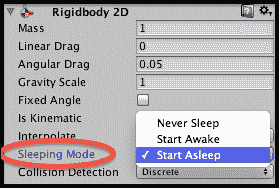

### 提高脚本效率的更多技巧

你可以考虑以下一些代码策略来提高性能：

+   使用**结构体**而不是**类**来提高处理速度。

+   在可能的情况下，使用简单的原始类型数组而不是**ArrayLists**、**Dictionaries**或更复杂的集合类。关于在 Unity 中选择最合适的集合类型的好文章可以在[`wiki.unity3d.com/index.php/Choosing_the_right_collection_type`](http://wiki.unity3d.com/index.php/Choosing_the_right_collection_type)找到。

+   光线投射较慢，因此避免每帧都进行光线投射，例如，可以使用协程仅在每 3 帧或第 10 帧进行光线投射。

+   查找对象较慢，因此避免在`Update()`或内部循环中查找对象，并且你可以让对象设置一个`public static`变量以允许快速实例检索，而不是使用`Find(…)`方法。或者你可以使用 Singleton 设计模式。

+   避免使用`OnGUI()`，因为它与`Update()`一样，每帧都会被调用；现在使用新的 Unity 5 UI 系统更容易避免。

### 更多关于优化的智慧来源

这里有一些其他来源，你可能想要探索以了解更多关于游戏优化主题的信息：

+   Unity 通用移动优化页面：

    [`docs.unity3d.com/Manual/MobileOptimisation.html`](http://docs.unity3d.com/Manual/MobileOptimisation.html)

+   X-team Unity 最佳实践：

    [`x-team.com/2014/03/unity-3d-optimisation-and-best-practices-part-1/`](http://x-team.com/2014/03/unity-3d-optimisation-and-best-practices-part-1/)

+   代码项目：

    [`www.codeproject.com/Articles/804021/Unity-and-Csharp-Performance-Optimisation-tips`](http://www.codeproject.com/Articles/804021/Unity-and-Csharp-Performance-Optimisation-tips)

+   通用图形优化：

    [`docs.unity3d.com/Manual/OptimizingGraphicsPerformance.html`](http://docs.unity3d.com/Manual/OptimizingGraphicsPerformance.html)

+   在 Unity 的 iPhone 优化物理页面了解更多关于移动物理的信息：

    [`docs.unity3d.com/Manual/iphone-Optimizing-Physics.html`](http://docs.unity3d.com/Manual/iphone-Optimizing-Physics.html)

### 讨论过早优化的文章

这里有一些讨论唐纳德·克努特关于过早优化是“邪恶”的著名引言的文章：

+   乔·达菲的博客：

    [`joeduffyblog.com/2010/09/06/the-premature-optimization-is-evil-myth/`](http://joeduffyblog.com/2010/09/06/the-premature-optimization-is-evil-myth/)

+   "何时优化是过早的？" Stack Overflow：

    [`stackoverflow.com/questions/385506/when-is-optimisation-premature`](http://stackoverflow.com/questions/385506/when-is-optimisation-premature)

+   *过早优化的谬误*，兰德尔·海德（由 ACM 出版），来源：Ubiquity 第 10 卷，第 3 期，2009：

    [`ubiquity.acm.org/article.cfm?id=1513451`](http://ubiquity.acm.org/article.cfm?id=1513451)

### 关于游戏管理器和状态模式的更多信息来源

从以下网站了解更多关于在 Unity 中实现状态模式和游戏管理器的信息：

+   [`rusticode.com/2013/12/11/creating-game-manager-using-state-machine-and-singleton-pattern-in-unity3d/`](http://rusticode.com/2013/12/11/creating-game-manager-using-state-machine-and-singleton-pattern-in-unity3d/)

+   [`github.com/thefuntastic/Unity3d-Finite-State-Machine`](https://github.com/thefuntastic/Unity3d-Finite-State-Machine)
