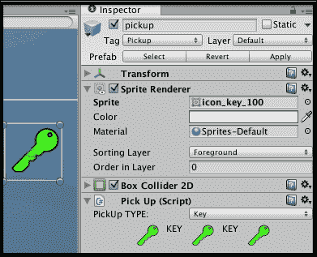
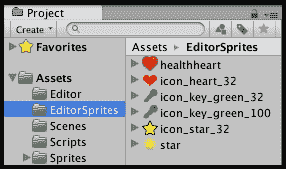
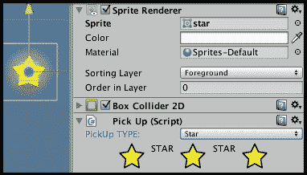
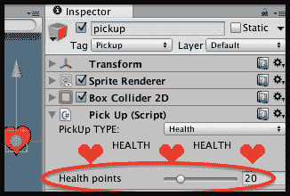
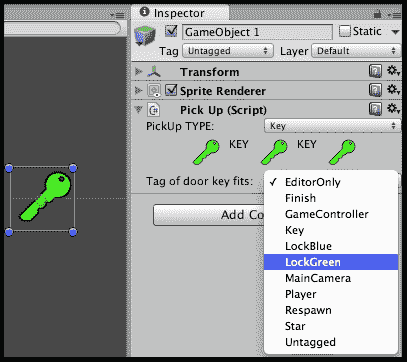
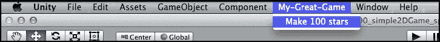
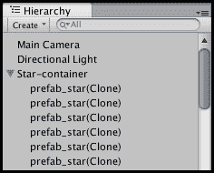
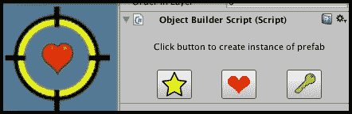
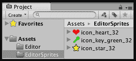

# 第十二章。编辑器扩展

在本章中，我们将涵盖以下主题：

+   一个编辑器扩展，允许在设计时通过自定义检查器 UI 更改拾取类型（和参数）

+   一个编辑器扩展，通过一个菜单点击添加 100 个随机位置的预制体副本

+   一个进度条来显示编辑器扩展处理完成的百分比

+   一个编辑器扩展，拥有一个对象创建器 GameObject，带有按钮在场景中十字准星对象位置实例化不同的拾取

# 简介

游戏开发的一般方面（以及在本章中作为特定例子的库存）的一个方面是关于*何时*我们进行活动的区分。**运行时**是游戏运行时（以及我们所有的软件和 UI 选择生效时）。然而，**设计时**是我们游戏设计团队的不同成员在构建各种游戏组件的时间，包括脚本、音频和视觉资产，以及构建每个游戏关卡（或 Unity 中的“场景”）的过程。

在本章中，我们将介绍几个使用 Unity 编辑器扩展的食谱；这些是脚本和多媒体组件，使游戏软件工程师能够使设计时工作更容易，更不容易出错。编辑器扩展允许工作流程改进，从而让设计师更快、更轻松地实现目标；例如，通过菜单选择在场景中生成许多随机位置的库存拾取时，无需任何脚本知识，或者编辑在关卡中不同位置手动放置的拾取的类型或属性。

虽然编辑器扩展是一个相当高级的话题，但如果你团队中有能够编写自定义编辑器组件的人，例如我们展示的那些，可以大大提高只有一两个成员且对脚本有信心的小型团队的效率。

# 一个编辑器扩展，允许在设计时通过自定义检查器 UI 更改拾取类型（和参数）

在检查器面板中使用**枚举**和相应的下拉菜单来限制更改到有限集中的一个，通常效果不错（例如，拾取对象的拾取类型）。然而，这种方法的麻烦在于，当两个或多个属性相关且需要一起更改时，存在更改一个属性的风险，例如，将拾取类型从**心形**更改为**钥匙**，但忘记更改相应的属性；例如，让**精灵渲染器**组件仍然显示**心形精灵**。这种不匹配既会搞乱预期的关卡设计，当然，当玩家与显示一个拾取图像但实际添加到库存中的拾取类型不同时，也会让玩家感到沮丧！

如果 GameObject 有一个或多个相关的属性或组件，并且所有这些都需要一起更改，那么一个很好的策略是使用 Unity 编辑器扩展，每次从显示定义的枚举选择集的下拉菜单中选择不同的选项时，都执行所有相关的更改。

在这个菜谱中，我们介绍了一个用于 GameObject 的 PickUp 组件的编辑器扩展。



## 准备工作

本菜谱假设您从第二章中第一个菜谱设置的`Simple2Dgame_SpaceGirl`项目开始，该项目的设置在*库存 GUI*中。在`1362_12_01`文件夹中提供了一个 Unity 项目的副本，文件夹名为`unityProject_spaceGirlMiniGame`。

## 如何操作...

要创建一个编辑器扩展，允许在设计时通过自定义检查器 UI 更改拾取类型（和参数），请按照以下步骤操作：

1.  从迷你游戏`Simple2Dgame_SpaceGirl`的新副本开始。

1.  在**项目**面板中，创建一个名为`EditorSprites`的新文件夹。将以下图像从`Sprites`文件夹移动到这个新文件夹：`star`、`healthheart`、`icon_key_green_100`、`icon_key_green_32`、`icon_star_32`和`icon_heart_32`。

1.  在**层次结构**面板中，将 GameObject `star`重命名为`pickup`。

1.  编辑标签，将标签**Star**更改为**Pickup**。确保`pickup` GameObject 现在具有标签**Pickup**。

1.  将以下 C#脚本`PickUp`添加到`pickup` GameObject 的**层次结构**中：

    ```cs
    using UnityEngine;
    using System;
    using System.Collections;

    public class PickUp : MonoBehaviour {
      public enum PickUpType {
        Star, Health, Key
      }

      [SerializeField]
      public PickUpType type;

      public void SetSprite(Sprite newSprite){
        SpriteRenderer spriteRenderer = GetComponent<SpriteRenderer>();
        spriteRenderer.sprite = newSprite;
      }
    }
    ```

1.  在**项目**面板中，创建一个名为`Editor`的新文件夹。在此新文件夹中，创建一个名为`PickUpEditor`的新 C#脚本类，代码如下：

    ```cs
    using UnityEngine;
    using System.Collections;
    using System;
    using UnityEditor;
    using System.Collections.Generic;

    [CanEditMultipleObjects]
    [CustomEditor(typeof(PickUp))]
    public class PickUpEditor : Editor
    {
      public Texture iconHealth;
      public Texture iconKey;
      public Texture iconStar;

      public Sprite spriteHealth100;
      public Sprite spriteKey100;
      public Sprite spriteStar100;

      UnityEditor.SerializedProperty pickUpType;

      private Sprite sprite;
      private PickUp pickupObject;

      void OnEnable () {
        iconHealth = AssetDatabase.LoadAssetAtPath("Assets/EditorSprites/icon_heart_32.png", typeof(Texture)) as Texture;
        iconKey = AssetDatabase.LoadAssetAtPath("Assets/EditorSprites/icon_key_32.png", typeof(Texture)) as Texture;
        iconStar = AssetDatabase.LoadAssetAtPath("Assets/EditorSprites/icon_star_32.png", typeof(Texture)) as Texture;

        spriteHealth100 = AssetDatabase.LoadAssetAtPath("Assets/EditorSprites/healthheart.png", typeof(Sprite)) as Sprite;
        spriteKey100 = AssetDatabase.LoadAssetAtPath("Assets/EditorSprites/icon_key_100.png", typeof(Sprite)) as Sprite;
        spriteStar100 = AssetDatabase.LoadAssetAtPath("Assets/EditorSprites/star.png", typeof(Sprite)) as Sprite;

        pickupObject = (PickUp)target;
        pickUpType = serializedObject.FindProperty ("type");
      }

      public override void OnInspectorGUI()
      {
        serializedObject.Update ();

        string[] pickUpCategories = TypesToStringArray();
        pickUpType.enumValueIndex = EditorGUILayout.Popup("PickUp TYPE: ", pickUpType.enumValueIndex, pickUpCategories);

        PickUp.PickUpType type = (PickUp.PickUpType)pickUpType.enumValueIndex;
        switch(type)
        {
        case PickUp.PickUpType.Health:
          InspectorGUI_HEALTH();
          break;

        case PickUp.PickUpType.Key:
          InspectorGUI_KEY();
          break;

        case PickUp.PickUpType.Star:
        default:
          InspectorGUI_STAR();
          break;
        }

        serializedObject.ApplyModifiedProperties ();
      }

      private void InspectorGUI_HEALTH()
      {
        GUILayout.BeginHorizontal();
        GUILayout.FlexibleSpace();
        GUILayout.Label(iconHealth);
        GUILayout.Label("HEALTH");
        GUILayout.Label(iconHealth);
        GUILayout.Label("HEALTH");
        GUILayout.Label(iconHealth);
        GUILayout.FlexibleSpace();
        GUILayout.EndHorizontal();

        pickupObject.SetSprite(spriteHealth100);
      }

      private void InspectorGUI_KEY()
      {
        GUILayout.BeginHorizontal();
        GUILayout.FlexibleSpace();
        GUILayout.Label(iconKey);
        GUILayout.Label("KEY");
        GUILayout.Label(iconKey);
        GUILayout.Label("KEY");
        GUILayout.Label(iconKey);
        GUILayout.FlexibleSpace();
        GUILayout.EndHorizontal();

        pickupObject.SetSprite(spriteKey100);
      }

      private void InspectorGUI_STAR()
      {
        GUILayout.BeginHorizontal();
        GUILayout.FlexibleSpace();
        GUILayout.Label(iconStar);
        GUILayout.Label("STAR");
        GUILayout.Label(iconStar);
        GUILayout.Label("STAR");
        GUILayout.Label(iconStar);
        GUILayout.FlexibleSpace();
        GUILayout.EndHorizontal();

        pickupObject.SetSprite(spriteStar100);
      }
      private string[] TypesToStringArray(){
        var pickupValues = (PickUp.PickUpType[])Enum.GetValues(typeof(PickUp.PickUpType));

        List<string> stringList = new List<string>();

        foreach(PickUp.PickUpType pickupValue in pickupValues){
          string stringName = pickupValue.ToString();
          stringList.Add(stringName);
        }

        return stringList.ToArray();
      }
    }
    ```

1.  在**检查器**面板中，选择 GameObject `pickup`并选择**拾取类型**下拉菜单的不同值。你应该在**检查器**的**拾取（脚本）**组件中的图像和图标中看到相应的更改（三个带有类型名称的图标）。此 GameObject 的**Sprite Renderer**组件的**Sprite**属性应该更改。此外，在**场景**面板中，你会看到场景中的图像更改为你选择的拾取类型的适当图像。

## 工作原理...

我们的脚本类`PickUp`有一个枚举`PickUpType`，包含三个值：`Star`、`Health`和`Key`。此外，还有一个变量`type`，用于存储父 GameObject 的类型。最后，有一个`SetSprite(…)`方法，用于将父 GameObject 的**Sprite Renderer**组件设置为提供的`Sprite`参数。每次从编辑器脚本中调用此方法时，都会更改拾取类型，并传递对应新类型的相应精灵。

这个菜谱的大部分工作都由脚本类 `PickUpEditor` 负责。虽然这个脚本中有很多内容，但其工作相对简单：对于每一帧，通过 `OnInspectorGUI()` 方法，向用户展示一个 `PickUpType` 值的下拉列表。根据从下拉列表中选择的值，执行三种方法之一：`InspectorGUI_HEALTH()`、`InspectorGUI_KEY()`、`InspectorGUI_STAR()`。这些方法在每个方法中都在下拉菜单下方显示三个图标和类型名称，并在最后调用正在编辑的 GameObject 的 `SetSprite(…)` 方法来更新父 GameObject 的 **Sprite Renderer** 组件。

在我们的类声明之前出现的 C# 属性 `[CustomEditor(typeof(PickUp))]` 告诉 Unity 使用这个特殊的编辑脚本来显示 GameObject 的 **Inspector** 面板中的组件属性，而不是 Unity 的默认 **Inspector**，后者显示此类脚本组件的公共变量。

在 `OnInspectorGUI()` 方法的主要工作之前和之后，首先确保与检查器中正在编辑的对象相关的任何变量都已更新——`serializedObject.Update()`。这个方法中的最后一条语句相应地确保将编辑脚本中变量的任何更改复制回正在编辑的 GameObject——`serializedObject.ApplyModifiedProperties()`。

脚本类 `PickUpEditor` 的 `OnEnable()` 方法加载三个小图标（用于在 **Inspector** 中显示）和三个较大的精灵图像（用于更新在 **Scene/Game** 面板中显示的 **Sprite Renderer**）。`pickupObject` 变量被设置为对 `PickUp` 脚本组件的引用，允许我们调用 `SetSprite(…)` 方法。`pickUpType` 变量被设置为与 `PickUp` 脚本组件的类型变量链接，该组件的特殊 **Inspector** 编辑器视图使此脚本成为可能——`serializedObject.FindProperty ("type")`。

## 还有更多...

这里有一些细节你不希望错过。

### 通过检查器提供拾取参数的自定义编辑

许多拾取项具有额外的属性，而不仅仅是携带的物品。例如，一个健康拾取项可能向玩家的角色添加“点数”，一个硬币拾取项可能向角色的银行余额添加“点数”，等等。因此，让我们在我们的 `PickUp` 类中添加一个整数 `points` 变量，并允许用户通过我们的自定义检查器编辑器中的 GUI 滑块轻松编辑此点数值。



要为我们的 `PickUp` 对象添加可编辑的点属性，请按照以下步骤操作：

1.  将以下额外行添加到 C# 脚本 `PickUp` 中，以创建我们新的整数 `points` 变量：

    ```cs
    public int points;
    ```

1.  在 C#脚本`PickUpEditor`中添加以下额外行，以处理我们新的整数`points`变量：

    ```cs
    UnityEditor.SerializedProperty points;
    ```

1.  在 C#脚本`PickUpEditor`中的`OnEnable()`方法中添加以下额外行，以将我们的新`points`变量与其对应的 GameObject 的`PickUp`脚本组件中的值关联起来：

    ```cs
    void OnEnable () {
      points = serializedObject.FindProperty ("points");
      pickUpType = serializedObject.FindProperty ("type");
      // rest of method as before…
    ```

1.  现在我们可以为不同类型的 PickUp 添加额外的行到每个 GUI 方法中。例如，我们可以添加一个语句向用户显示一个**IntSlider**，以便他们能够查看和修改**Health PickUp**对象的点值。我们在 C#脚本`PickUpEditor`中的`InspectorGUI_HEALTH()`方法末尾添加了一个新的语句，如下所示，以显示一个可修改的**IntSlider**，代表我们新的`points`变量：

    ```cs
    private void InspectorGUI_HEALTH(){
      // beginning of method just as before…

      pickupObject.SetSprite(spriteHealth100);

    // now display Int Slider for points
      points.intValue = EditorGUILayout.IntSlider ("Health points", points.intValue, 0, 100);
    }
    ```

我们向`IntSlider(…)`方法提供了四个参数。第一个是用户将在滑块旁边看到的文本标签。第二个是滑块显示的初始值。最后两个是最大值和最小值。在我们的例子中，我们允许从 0 到 100 的值，但如果健康拾取只提供一、二或三个健康点，那么我们只需调用`EditorGUILayout.IntSlider ("Health points", points.intValue, 1, 5)`。此方法返回一个基于滑块位置的新整数值，并将此新值存储回我们的`SerializedProperty`变量`points`的整数部分。

注意，从 GameObject 中的脚本组件和我们的编辑器脚本中加载和保存值，都是我们调用`OnInspectorGUI()`方法中的`Update()`方法和`ApplyModifiedProperties()`方法在序列化对象上执行的工作的一部分。

注意，由于对于某些拾取（例如钥匙）点数可能没有任何意义，因此当用户正在编辑该类型的**PickUp**对象时，我们不会在 GUI Inspector 编辑器中显示任何滑块。

### 为关键拾取通过 Inspector 提供标签下拉列表

虽然对于钥匙拾取，“点数”可能没有意义，但给定钥匙适合的锁的类型肯定是我们希望在游戏中实现的东西。由于 Unity 为我们提供了任何 GameObject 的字符串标签的（定义和可编辑）列表，通常通过标签表示与钥匙对应的锁或门类型是足够简单和直接的。例如，绿色钥匙可能适合所有标记为**LockGreen**的对象等等。



因此，能够为关键拾取的字符串属性提供一个自定义的 Inspector 编辑器，以存储可以打开的锁的标签，是非常有用的。这个任务结合了几个动作，包括使用 C#从 Unity 编辑器检索一个标签数组，然后构建并提供一个包含这些标签的下拉列表给用户，当前值已在此列表中选中。

要为适合锁的标记添加一个可选择的字符串列表，请按照以下步骤操作：

1.  在 C#脚本`PickUp`中添加以下额外行以创建我们的新整数`fitsLockTag`变量：

    ```cs
    public string fitsLockTag;
    ```

1.  在 C#脚本`PickUpEditor`中添加以下额外行以处理我们的新整数`fitsLockTag`变量：

    ```cs
    UnityEditor.SerializedProperty fitsLockTag;
    ```

1.  在 C#脚本`PickUpEditor`的`OnEnable()`方法中添加以下额外行，以将我们的新`fitsLockTag`变量与其对应的 GameObject 正在编辑的拾取脚本组件中的值关联起来：

    ```cs
    void OnEnable () {
      fitsLockTag = serializedObject.FindProperty ("fitsLockTag");
      points = serializedObject.FindProperty ("points");
      pickUpType = serializedObject.FindProperty ("type");
      // rest of method as before…
    ```

1.  现在我们需要在用于关键拾取的 GUI 方法中添加一些额外的代码行。我们需要在 C#脚本`PickUpEditor`中的`InspectorGUI_KEY()`方法末尾添加几个语句来设置并显示一个可选择的弹出下拉列表，表示我们的新`fitsLockTag`变量，如下所示。用以下代码替换`InspectorGUI_KEY()`方法：

    ```cs
    private void InspectorGUI_KEY() {
      GUILayout.BeginHorizontal();
      GUILayout.FlexibleSpace();
      GUILayout.Label(iconKey);
      GUILayout.Label("KEY");
      GUILayout.Label(iconKey);
      GUILayout.Label("KEY");
      GUILayout.Label(iconKey);
      GUILayout.FlexibleSpace();
      GUILayout.EndHorizontal();

      pickupObject.SetSprite(spriteKey100);

      string[] tags = UnityEditorInternal.InternalEditorUtility.tags;
      Array.Sort(tags);
      int selectedTagIndex = Array.BinarySearch(tags, fitsLockTag.stringValue);
      if(selectedTagIndex < 0)  selectedTagIndex = 0;
      selectedTagIndex = EditorGUILayout.Popup("Tag of door key fits: ", selectedTagIndex, tags);

      fitsLockTag.stringValue = tags[selectedTagIndex];
    }
    ```

我们已经在这个方法的末尾添加了几个语句。首先创建了一个字符串数组`tags`（并排序），包含当前游戏在 Unity 编辑器中可用的标记列表。然后我们尝试在数组中找到`fitsLockTag`当前值的定位——由于我们已经按字母顺序排序了数组（这也使得用户更容易导航），我们可以使用内置脚本类`Array`的`BinarySearch(…)`方法。如果`fitsLockTag`中的字符串在`tags`数组中找不到，则默认选择第一个项目（索引 0）。

然后用户通过`GUILayout`方法的`EditorGUILayout.Popup(…)`看到下拉列表，此方法返回所选项目的索引。所选索引存储到`selectedTagIndex`中，方法中的最后一个语句提取相应的字符串并将其存储到`fitsLockTag`变量中。

### 注意

注意：而不是显示所有可能的标记，进一步的改进可能移除数组'tags'中所有没有前缀'Lock'的项目。因此，用户只会看到像'LockBlue'和'LockGreen'这样的标记，等等。

### 基于 fitsLockTag 打开门的逻辑

在我们的玩家碰撞逻辑中，我们现在可以搜索我们的库存，看看是否有任何钥匙物品适合我们与之碰撞的锁。例如，如果与绿色门发生碰撞，并且玩家携带的钥匙可以打开这样的门，那么该物品应该从库存`List<>`中移除，并且门应该被打开。

为了实现这一点，你需要在`OnTriggerEnter()`方法中添加一个`if`测试来检测与标记为`Door`的物品的碰撞，然后添加逻辑来尝试打开门，如果失败，则执行适当的动作（例如，播放声音）来通知玩家他们现在还不能打开门（我们假设我们已经编写了一个门动画控制器，当门要打开时，它会播放适当的动画和声音）：

```cs
if("Door" == hitCollider.tag){
  if(!OpenDoor(hitCollider.gameObject))
    DoorNotOpenedAction();
}
```

`OpenDoor()` 方法需要识别库存中哪些项目（如果有的话）可以打开这样的门，如果找到，则应该从 `List<>` 中移除该物品，并通过适当的方法打开门：

```cs
private bool OpenDoor(GameObject doorGO){
  // search for key to open the tag of doorGO
  int colorKeyIndex = FindItemIndex(doorGO.tag);
  if( colorKeyIndex > -1 ){
    // remove key item from inventory List<>
    inventory.RemoveAt( colorKeyIndex );

    // now open the door...
    DoorAnimationController doorAnimationController = doorGO.GetComponent<>(DoorAnimationController);
    doorAnimationController.OpenDoor();

    return true;
  }

  return false;
}
```

以下是一个查找适合门标签的库存列表关键项目的代码方法：

```cs
private int FindItemIndex(string doorTag){
  for (int i = 0; i < inventory.Count; i++){
    PickUp item = inventory[i];
    if( (PickUp.PickUpType.Key == item.type) && (item.fitsLockTag == doorTag))
      return i;
  }

  // not found
return -1;
}
```

### 需要在私有属性中添加 [SerializeField]

注意，如果我们希望创建用于处理私有变量的编辑器扩展，那么我们需要在编辑器脚本将要更改的变量所在行的前面显式添加 `[SerializeField]`。在 Unity 中，公共变量默认会进行序列化，因此对于脚本类 `PickUp` 中的公共 `type` 变量来说，这并不是必需的，尽管将所有可以通过编辑器扩展更改的变量以这种方式标记为良好实践。

### 从 Unity 文档中了解更多信息

Unity 提供了有关编辑器脚本的文档页面，位于 [`docs.unity3d.com/ScriptReference/Editor.html`](http://docs.unity3d.com/ScriptReference/Editor.html)。

# 通过一次菜单点击添加 100 个随机位置预制件的编辑器扩展

有时我们希望在场景中随机创建“大量”拾取物品。而不是手动这样做，我们可以在 Unity 编辑器中添加一个自定义菜单和项目，当选择它时，将执行一个脚本。在这个菜谱中，我们创建了一个调用脚本的菜单项，该脚本在场景中创建 100 个随机位置的天星拾取预制件。



## 准备工作

此配方假设您是从本章第一道菜谱中设置的 `Simple2Dgame_SpaceGirl` 项目开始的。

## 如何做到这一点...

要创建一个通过一次菜单点击添加 100 个随机位置预制件的编辑器扩展，请按照以下步骤操作：

1.  从新的副本开始 mini-game `Simple2Dgame_SpaceGirl`。

1.  在 **项目** 面板中，创建一个名为 `Prefabs` 的新文件夹。在这个新文件夹内，创建一个名为 `prefab`_`star` 的新空预制件。通过将 **层次结构** 面板中的 GameObject `star` 拖动到 **项目** 面板中的 `prefab`_`star` 上来填充这个预制件。现在预制件应该变成蓝色，并包含 GameObject star 的所有属性和组件的副本。

1.  从 **层次结构** 中删除 GameObject `star`。

1.  在 **项目** 面板中，创建一个名为 `Editor` 的新文件夹。在这个新文件夹内，创建一个名为 `MyGreatGameEditor` 的新 C# 脚本类，代码如下：

    ```cs
    using UnityEngine;
    using UnityEditor;
    using System.Collections;
    using System;
    public class MyGreatGameEditor : MonoBehaviour {
      const float X_MAX = 10f;
      const float Y_MAX = 10f;

      static GameObject starPrefab;

      [MenuItem("My-Great-Game/Make 100 stars")]
      static void PlacePrefabs(){
        string assetPath = "Assets/Prefabs/prefab_star.prefab";
        starPrefab = (GameObject)AssetDatabase.LoadMainAssetAtPath(assetPath);

        int total = 100;
        for(int i = 0; i < total; i++){
          CreateRandomInstance();
        }
      }

      static void CreateRandomInstance(){
        float x = UnityEngine.Random.Range(-X_MAX, X_MAX);
        float y = UnityEngine.Random.Range(-Y_MAX, Y_MAX);
        float z = 0;
        Vector3 randomPosition = new Vector3(x,y,z);

        Instantiate(starPrefab, randomPosition, Quaternion.identity);
      }
    }
    ```

1.  根据您电脑的速度，大约 20 到 30 秒后，您应该会看到一个新菜单出现，**我的伟大游戏**，其中有一个菜单项，**制作 100 颗星星**。选择此菜单项，就像魔法一样，您现在应该会看到 100 个新的 **prefab_star(Clone)** GameObjects 出现在场景中！！如何做到这一点...

## 它是如何工作的...

这个菜谱的核心目的是添加一个新的菜单，其中包含一个将执行我们所需操作的菜单项。C# 属性 `[MenuItem("<menuName>/<menuItemName>")]` 声明了菜单名称和菜单项名称，Unity 将在代码列表中执行每次用户选择菜单项时跟在后面的静态方法。

在这个菜谱中，`[MenuItem("My-Great-Game/Make 100 stars")]` 语句声明了菜单名称为 `My-Great-Game`，菜单项为 `Make 100 stars`。紧随此属性之后的方法是 `PlacePrefabs()` 方法。当此方法执行时，它使 `starPrefab` 变量成为通过 `Assets/Prefabs/prefab_star.prefab` 路径找到的预制体的引用。然后，执行一个循环 100 次，每次调用 `CreateRandomInstance()` 方法。

`CreateRandomInstance()` 方法创建一个 Vector3 `randomPosition` 变量，使用 `X_MAX` 和 `Y_MAX` 常量。然后使用内置方法 `Instantiate(...)` 在场景中创建一个新的 GameObject，创建预制体的副本并将其定位在由 `randomPosition` 定义的位

## 还有更多...

一些你不希望错过的细节：

### 将每个新的 GameObject 子对象链接到单个父对象，以避免在 Hierarchy 中填充 100 多个新对象

为了避免让我们的 **Hierarchy** 面板充满数百个新对象克隆，一个好的方法是有一个空的 "父" GameObject，并将相关的一组 GameObjects 作为其子对象。让我们在 **Hierarchy** 中有一个名为 **Star-container** 的 GameObject，并将所有新的星星子对象链接到这个对象。



我们需要一个变量，它将是我们容器对象的引用，`starContainerGO`。我们还需要一个新的方法，`CreateStarContainerGO()`，它将找到 GameObject **star-container** 的引用，如果已经存在这样的对象，它将被删除，然后该方法将创建一个新的空 GameObject 并给它这个名称。将以下变量和方法添加到我们的脚本类中：

```cs
static GameObject starContainerGO;

static void CreateStarContainerGO() {
  string containerName = "Star-container";
  starContainerGO = GameObject.Find(containerName);
  if (null != starContainerGO) 
    DestroyImmediate(starContainerGO);
  starContainerGO = new GameObject(containerName);
}
```

在我们创建预制体克隆之前，我们首先需要确保我们已经创建了我们的星容器 GameObject。因此，我们需要在执行 `PlacePrefabs()` 方法时首先调用我们的新方法，所以请在 `PlacePrefabs()` 方法的开始处添加一个调用此方法的语句：

```cs
static void PlacePrefabs(){
  CreateStarContainerGO();

  // rest of method as before ...
}
```

现在我们需要修改 `CreateRandomInstance()` 方法，使其能够获取它刚刚创建的新 GameObject 的引用，然后可以将这个新对象作为我们的 **star-container** GameObject 变量 `starContainerGO` 的子对象。修改 `CreateRandomInstance()` 方法，使其看起来如下所示：

```cs
static void CreateRandomInstance() {
  float x = UnityEngine.Random.Range(-X_MAX, X_MAX);
  float y = UnityEngine.Random.Range(-Y_MAX, Y_MAX);
  float z = 0;
  Vector3 randomPosition = new Vector3(x,y,z);

  GameObject newStarGO = (GameObject)Instantiate(starPrefab, randomPosition, Quaternion.identity);
  newStarGO.transform.parent = starContainerGO.transform;
}
```

# 一个进度条来显示编辑器扩展处理的完成比例

如果编辑器任务需要超过半秒或更长时间，那么我们应该通过进度条向用户显示进度完成/剩余情况，以便他们了解实际上正在发生某些事情，并且应用程序没有崩溃和冻结。


## 准备工作

这个菜谱在先前的菜谱基础上进行了扩展，所以请复制那个项目文件夹，并使用该副本来完成这个菜谱的工作。

## 如何操作...

要在循环期间添加进度条（然后在循环完成后将其移除），将`PlacePrefabs()`方法替换为以下代码：

```cs
static void PlacePrefabs(){
  string assetPath = "Assets/Prefabs/prefab_star.prefab";
  starPrefab = (GameObject)AssetDatabase.LoadMainAssetAtPath(assetPath);

  int total = 100;
  for(int i = 0; i < total; i++){
    CreateRandomInstance();
    EditorUtility.DisplayProgressBar("Creating your starfield", i + "%", i/100f);
  }

  EditorUtility.ClearProgressBar();
}
```

## 它是如何工作的...

如所示，在`for`循环内部，我们调用`EditorUtility.DisplayProgressBar(...)`方法，传递三个参数。第一个是进度条对话框窗口的字符串标题，第二个是在条形本身下方显示的字符串（通常百分比就足够了），最后一个参数是介于 0.0 和 1.0 之间的值，表示要显示的完成百分比。

由于我们有一个从 1 到 100 的循环变量`i`，我们可以显示这个整数，然后跟一个百分号作为第二个参数，并将这个数字除以 100 以得到所需的十进制值，以指定进度条应该显示多少已完成的进度。如果循环运行的是其他数字，我们只需将循环计数器除以循环总数以获得我们的十进制进度值。最后，在循环完成后，我们使用语句`EditorUtility.ClearProgressBar()`移除进度条。

# 一个编辑器扩展，用于创建一个对象创建器 GameObject，带有按钮，可以在场景中十字准星对象位置实例化不同的拾取物

如果关卡设计师希望手动“逐个”放置每个拾取物，我们仍然可以使这个过程比手动从**项目**面板拖动预制件副本更容易。在这个菜谱中，我们提供了一个“十字准星”GameObject，在检查器中有按钮，允许游戏设计师通过点击适当的按钮，当十字准星的中心位于所需位置时，在精确位置创建三种不同类型的预制件的实例。

Unity 编辑器扩展是这个菜谱的核心，展示了这样的扩展如何允许游戏开发团队中不太技术的人员在 Unity 编辑器中积极参与关卡创建。



## 准备工作

这个菜谱假设你是从第二章中第一个菜谱设置的`Simple2Dgame_SpaceGirl`项目开始的，*库存 GUI*。

对于这个菜谱，我们在`1362_12_04`文件夹中的`Sprites`文件夹中准备了所需的十字准星图像。

## 如何操作...

要创建一个对象创建器 GameObject，请按照以下步骤操作：

1.  从新的迷你游戏 `Simple2Dgame_SpaceGirl` 的副本开始。

1.  在 **Project** 面板中，将 GameObject `star` 重命名为 `pickup`。

1.  在 **Project** 面板中，创建一个名为 `Prefabs` 的新文件夹。在这个新文件夹中，创建三个新的空预制件，分别命名为 `star`、`heart` 和 `key`。

1.  通过将 **Hierarchy** 面板中的 GameObject `pickup` 拖动到 **Project** 面板中的 `star` 上，来填充 `star` 预制件。现在，预制件应该变成蓝色，并复制了星形 GameObject 的所有属性和组件。

1.  在检查器中添加一个新的标签 `Heart`。在 **Hierarchy** 面板中选择 GameObject `pickup`，并分配标签 `Heart`。此外，从 **Project** 面板（文件夹 `Sprites`）将 **healthheart** 图像拖动到 GameObject `pickup` 的 Sprite 属性中，以便玩家在屏幕上看到这个拾取物品的心形图像。

1.  通过将 **Hierarchy** 面板中的 GameObject `pickup` 拖动到 **Project** 面板中的 `Prefabs` 文件夹下的 `heart` 上，来填充 `heart` 预制件。现在，预制件应该变成蓝色，并复制了拾取 GameObject 的所有属性和组件。

1.  在检查器中添加一个新的标签 `Key`。在 **Hierarchy** 面板中选择 GameObject 的 `pickup`，并分配这个标签 `Key`。此外，从 **Project** 面板（文件夹 `Sprites`）将图像 **icon_key_green_100** 拖动到 GameObject 的 `pickup` 的 Sprite 属性中，以便玩家在屏幕上看到这个拾取物品的钥匙图像。

1.  通过将 **Hierarchy** 面板中的 GameObject `pickup` 拖动到 **Project** 面板中的 **Prefabs** 文件夹下的 `key` 上，来填充 `key` 预制件。现在，预制件应该变成蓝色，并复制了拾取 GameObject 的所有属性和组件。

1.  从 **Hierarchy** 中删除 GameObject 的 `pickup`。

1.  在 **Project** 面板中，创建一个名为 `Editor` 的新文件夹。在这个新文件夹中，创建一个名为 `ObjectBuilderEditor` 的新 C# 脚本类，代码如下：

    ```cs
    using UnityEngine;
    using System.Collections;
    using UnityEditor;

    [CustomEditor(typeof(ObjectBuilderScript))]
    public class ObjectBuilderEditor : Editor{
      private Texture iconStar;
      private Texture iconHeart;
      private Texture iconKey;

      private GameObject prefabHeart;
      private GameObject prefabStar;
      private GameObject prefabKey;

      void OnEnable () {
        iconStar = Resources.LoadAssetAtPath("Assets/EditorSprites/icon_star_32.png", typeof(Texture)) as Texture;
        iconHeart = Resources.LoadAssetAtPath("Assets/EditorSprites/icon_heart_32.png", typeof(Texture)) as Texture;
        iconKey = Resources.LoadAssetAtPath("Assets/EditorSprites/icon_key_green_32.png", typeof(Texture)) as Texture;

        prefabStar = Resources.LoadAssetAtPath("Assets/Prefabs/star.prefab", typeof(GameObject)) as GameObject;
        prefabHeart = Resources.LoadAssetAtPath("Assets/Prefabs/heart.prefab", typeof(GameObject)) as GameObject;
        prefabKey = Resources.LoadAssetAtPath("Assets/Prefabs/key.prefab", typeof(GameObject)) as GameObject;
      }

      public override void OnInspectorGUI(){
        ObjectBuilderScript myScript = (ObjectBuilderScript)target;

        GUILayout.Label("");
        GUILayout.BeginHorizontal();
        GUILayout.FlexibleSpace();
        GUILayout.Label("Click button to create instance of prefab");
        GUILayout.FlexibleSpace();
        GUILayout.EndHorizontal();
        GUILayout.Label("");

        GUILayout.BeginHorizontal();
        GUILayout.FlexibleSpace();
        if(GUILayout.Button(iconStar)) myScript.AddObjectToScene(prefabStar);
        GUILayout.FlexibleSpace();
        if(GUILayout.Button(iconHeart)) myScript.AddObjectToScene(prefabHeart);
        GUILayout.FlexibleSpace();
        if(GUILayout.Button(iconKey)) myScript.AddObjectToScene(prefabKey);
        GUILayout.FlexibleSpace();
        GUILayout.EndHorizontal();

      }
    }
    ```

1.  我们的编辑器脚本期望在名为 `EditorSprites` 的文件夹中找到三个图标，所以让我们这样做。首先创建一个名为 `EditorSprites` 的新文件夹。接下来，将三个 32 x 32 像素的图标从 `Sprites` 文件夹拖动到这个新的 `EditorSprites` 文件夹中。现在，我们的编辑器脚本应该能够加载这些图标，用于在检查器中绘制的基于图像的按钮，用户可以通过这些按钮选择要克隆到场景中的拾取预制对象。

1.  从 **Project** 面板中，将精灵 **cross_hairs.fw** 拖动到 **Scene** 中。将这个 gameObject 重命名为 `object-creator-cross-hairs`，并在 **Inspector** 中的其 **Sprite Renderer** 组件中，将 **Sorting Layer** 设置为 **Foreground**。

1.  将以下 C# 脚本附加到 GameObject `object-creator-cross-hairs` 上：

    ```cs
    using UnityEngine;
    using System.Collections;

    public class ObjectBuilderScript : MonoBehaviour {
      void Awake(){
        gameObject.SetActive(false);
      }

      public void AddObjectToScene(GameObject prefabToCreateInScene){
        GameObject newGO = (GameObject)Instantiate(prefabToCreateInScene, transform.position, Quaternion.identity);
        newGO.name = prefabToCreateInScene.name;
      }
    }
    ```

1.  选择 **Rect Tool**（快捷键 *T*），当你拖动 gameObject `object-creator-cross-hairs` 并在 **Inspector** 中点击所需的图标时，新的拾取 GameObject 将被添加到场景的 **Hierarchy** 中。

## 它是如何工作的...

脚本类`ObjectBuilderScript`只有两个方法，其中一个方法只有一个语句——`Awake()`方法简单地将这个 GameObject 在游戏运行时变为非活动状态（因为我们不希望用户在游戏过程中看到我们创建的工具十字准星）。`AddObjectToScene(…)`方法接收一个预制体的引用作为参数，并在该时刻在 GameObject `object-creator-cross-hairs`的位置在场景中实例化预制体的新克隆。

脚本类`ObjectBuilderEditor`在类声明之前立即有一个 C#属性`[CustomEditor(typeof(ObjectBuilderScript))]`，告诉 Unity 使用这个类来控制`ObjectBuilderScript` GameObject 的属性和组件在**检查器**中如何显示给用户。

有六个变量，三个用于在检查器中形成按钮的图标纹理，以及三个 GameObject 引用，这些引用将创建实例的预制体。`OnEnable()`方法使用内置方法`Resources.LoadAssetAtPath()`将这些六个变量赋值，从**项目**文件夹`EditorSprites`中检索图标，并从**项目**文件夹`Prefabs`中获取预制体的引用。

`OnInspectorGUI()`方法有一个变量`myScript`，它被设置为指向 GameObject `object-creator-cross-hairs`中脚本组件`ObjectBuilderScript`的实例（这样我们就可以在选择了预制体时调用其方法）。然后，该方法显示了一些空文本`Labels`（为了获得一些垂直间距）和`FlexibleSpace`（为了获得一些水平间距和居中对齐），并向用户显示三个带有星星、心形和钥匙图标的按钮。Unity 自定义**检查器**GUI 的脚本 GUI 技术将一个`if`语句包裹在每个按钮周围，当用户点击按钮时，`if`语句的代码块将被执行。当点击任意一个按钮时，都会调用脚本组件`ObjectBuilderScript`的`AddObjectToScene(…)`方法，传递与被点击按钮对应的预制体。

# 结论

在本章中，我们介绍了展示一些 Unity 编辑器扩展脚本的食谱，说明了我们如何通过限制和控制对象的属性以及它们如何通过**检查器**被选择或更改，使事情变得更简单、更少依赖于脚本，并减少出错的可能性。

在编辑器扩展食谱中提出了序列化的概念，我们需要记住，当我们正在检查器中编辑项目属性时，每次更改都需要保存到磁盘，以确保下次使用或编辑该项目时更新的属性是正确的。这是通过在`OnInspectorGUI()`方法中首先调用`serializedObject.Update()`方法，然后在检查器中完成所有更改后，最终调用`serializedObject.ApplyModifiedProperties()`方法来实现的。有关更多信息和示例，以下是一些自定义编辑器扩展的资源：

+   更多关于 Ryan Meier 博客中自定义 Unity 编辑器的信息，请参阅[`www.ryan-meier.com/blog/?p=72`](http://www.ryan-meier.com/blog/?p=72)

+   更多自定义 Unity 编辑器脚本/教程，包括网格和颜色选择器，请参阅[`code.tutsplus.com/tutorials/how-to-add-your-own-tools-to-unitys-editor--active-10047`](http://code.tutsplus.com/tutorials/how-to-add-your-own-tools-to-unitys-editor--active-10047)
