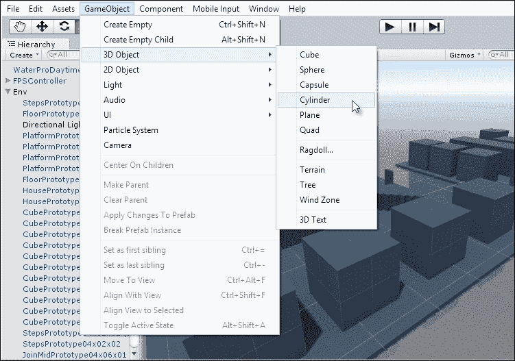

# 第一章. 收集硬币游戏 – 第一部分

本章开始我们列表中的第一个项目，这将是一个有趣的游戏收集游戏。记住，即使你以前从未使用过 Unity，也没有关系。我们将一步一步地完成所有必要的步骤。到下一章结束时，你将拼凑出一个简单但完整且功能齐全的游戏。这是实现的一个重要目标，因为你会熟悉从头到尾的游戏开发工作流程。本章将演示以下主题：

+   游戏设计

+   项目和文件夹

+   资产导入和配置

+   关卡设计

+   游戏对象

+   层级

# 游戏设计

让我们制作一个收集硬币的游戏。在这里，玩家应该以第一人称模式控制一个角色，他必须在时间限制结束前在关卡中收集所有硬币。如果计时器耗尽，游戏失败。另一方面，如果在计时器到期前收集了所有硬币，游戏胜利。第一人称控制将使用默认的 WASD 键盘布局，其中 *W* 向前移动，*A* 和 *S* 向左和向右移动，*D* 向后移动。头部移动由鼠标控制，硬币通过简单地走进它们来收集。见 *图 1.1*，展示了在 Unity 编辑器中实际运行的收集硬币游戏。制作这个游戏的巨大好处是它展示了所有核心的 Unity 功能，我们不需要依赖任何外部软件来制作资产，例如纹理、网格和材质。

图 1.1：准备收集硬币的游戏（完成后的游戏）

### 注意

本章和下一章中讨论的完成后的 `CollectionGame` 项目可以在书籍配套文件中的 `Chapter01/CollectionGame` 文件夹中找到。

# 入门 – Unity 和项目

每次你想制作一个新的 Unity 游戏，包括收集硬币游戏，你都需要创建**新项目**。一般来说，Unity 使用术语**项目**来表示**游戏**。制作新项目有两种主要方式，实际上你选择哪一种都无关紧要，因为两者最终都会到达同一个地方。如果你已经在 Unity 界面中，正在查看现有的场景或关卡，你可以从应用程序菜单中选择**文件** | **新项目**。见 *图 1.2*。它可能会询问你是否想要保存当前打开项目的更改，你应该根据需要选择**是**或**否**。选择**新项目**选项后，Unity 会带你进入项目创建向导：

图 1.2：通过主菜单创建新项目

或者，如果你是第一次使用 Unity，你可能会从欢迎对话框开始。见 *图 1.3*。从这里，你可以通过选择**新项目**按钮来访问新项目创建向导：

图 1.3：Unity 欢迎界面

当达到 **新建项目** 向导时，Unity 可以根据一些基本设置为您生成一个新项目。只需填写您项目的名称（例如 `CollectionGame`），然后选择一个文件夹来包含将自动生成的项目文件。最后，点击 **3D** 按钮以表示我们将创建一个 3D 游戏，而不是 **2D** 游戏，然后点击 **创建项目** 按钮以完成项目生成过程。见图 1.4*：

图 1.4：创建新项目

# 项目和项目文件夹

Unity 现在创建了一个空白、新且空的项目。这代表任何游戏开发项目的起点，也是开发开始的地方。新创建的项目最初不包含任何内容：没有网格、纹理或任何其他 **资源**。您可以通过简单地检查编辑器界面底部的 **项目** 面板区域来确认这一点。此面板显示项目文件夹的完整内容，对应于项目向导之前在您的本地驱动器上创建的实际文件夹。此文件夹应该是空的。见图 1.5*。此面板将随后填充更多项目，我们都可以使用这些项目来构建游戏。

图 1.5：Unity 项目面板停靠在界面底部

### 注意

如果您的界面在布局和排列方面与 *图 1.5* 有显著不同，那么您可以重置 UI 布局为默认设置。为此，请从编辑器界面的右上角点击 **布局** 下拉菜单，并选择 **默认**。见图 1.6*。

图 1.6：切换到默认界面布局

您可以直接通过 Windows 资源管理器或 Mac Finder 查看项目文件夹的内容，通过在 **Unity 编辑器** 的 **项目** 面板中右键单击鼠标以显示上下文菜单，然后从那里选择 **在资源管理器中显示**（Windows）或 **在 Finder 中显示**（Mac）选项。见图 1.7：

图 1.7：通过项目面板显示项目文件夹

点击 **在资源管理器中显示** 将文件夹内容显示在默认的系统文件浏览器中。见图 1.8*。此视图用于检查文件、计数或备份文件。然而，请不要通过这种方式手动更改文件夹内容，即通过资源管理器或 Finder。具体来说，不要从这里移动、重命名或删除文件，因为这样做可能会永久损坏您的 Unity 项目。相反，在 **Unity 编辑器** 的 **项目** 面板中需要的地方删除和移动文件。这样，Unity 会根据需要更新其元数据，确保您的项目继续正常工作。

图 1.8：从操作系统文件浏览器查看项目面板

### 注意

在操作系统文件浏览器中查看项目文件夹将显示在 **项目** 面板中不可见的额外文件和文件夹，例如 `Library` 和 `ProjectSettings`，以及可能的一个 `Temp` 文件夹。这些一起被称为项目元数据。这本身并不是你的项目的一部分，但它包含 Unity 正常工作所需的额外设置和首选项。这些文件夹及其文件不应被编辑或更改。

# 导入资产

资产是游戏的原材料——它们是由这些材料构建的基石。`Assets` 包括网格（或 3D 模型），例如角色、道具、树木、房屋等；纹理，这些是图像文件，如 JPEG 和 PNG（这些决定了网格表面的外观）；音乐和音效以增强游戏的真实感和氛围，最后是场景，这些是网格、纹理、声音和音乐存在并作为一个单一系统整体协同工作的 3D 空间或世界。因此，没有资产的游戏无法存在——否则它们将看起来完全空旷和毫无生气。因此，我们需要资产来制作我们正在努力制作的收集硬币游戏。毕竟，我们需要一个可以行走的环境和可以收集的硬币！

然而，Unity 是一个 *游戏引擎*，而不是 *资产创建* 程序。这意味着像角色和道具这样的资产通常首先由艺术家在外部第三方软件中制作。然后，它们被导出并准备好转移到 Unity 中，Unity 负责将这些资产在可以玩的游戏中生动呈现。第三方资产创建程序包括 **Blender**（免费），**Maya** 或 **3DS Max** 用于制作 3D 模型，**Photoshop** 或 **GIMP**（免费）用于创建纹理，以及 **Audacity**（免费）用于生成音频。还有许多其他选项。这些程序的详细信息超出了本书的范围。无论如何，Unity 假设你已经有了可以导入以构建游戏的资产。对于收集硬币的游戏，我们将使用 Unity 附带资产。所以让我们将这些导入到我们的项目中。为此，从应用程序菜单中选择 **Assets** | **Import Package**。然后选择 **Characters**、**ParticleSystems**、**Environment** 和 **Prototyping**。参见 *图 1.9*：

图 1.9：通过导入包菜单导入资产

每次你从菜单中导入一个包时，都会弹出一个 **导入** 对话框。只需保留所有设置在默认值，然后点击 **导入**。参见 *图 1.10*：

图 1.10：选择要导入的资产

默认情况下，Unity 将包（资源库）中的所有文件解压缩到当前项目中。导入后，许多不同的资源和数据将被添加到**项目**中，准备使用。这些文件是原始文件的副本。因此，对导入文件所做的任何更改都不会影响或使原始文件无效，Unity 会内部维护这些原始文件。文件包括模型、声音、纹理等。这些在**Unity 编辑器**的**项目**面板中列出。参见以下截图：

图 1.11：从项目面板浏览导入的资源

### 小贴士

当您从应用程序菜单中选择**资源** | **导入**时，如果您没有看到所有或任何资源包列出，您可以从 Unity 网站[`unity3d.com/`](https://unity3d.com/)分别下载和安装它们。从下载页面，选择**附加下载**选项，然后选择**标准资源**包。参见*图 1.12*。

图 1.12：下载标准资源包

导入的资源在我们的游戏中还不存在。它们不会出现在屏幕上，也不会做任何事情！相反，它们只是被添加到**项目**面板中，该面板作为一个资源库或存储库，我们可以从中挑选和选择来构建游戏。到目前为止导入的资源已内置到 Unity 中，我们将在后续部分中不断使用它们来制作一个功能性的收集游戏。要获取每个资源的更多信息，您可以单击鼠标选择资源，然后在**Unity 编辑器**的**检查器**右侧显示资源特定详细信息。**检查器**是一个属性表编辑器，它出现在界面的右侧。它是上下文相关的，并且始终更改以显示选中对象的属性。参见*图 1.13*。

图 1.13：检查器显示当前选中对象的全部属性

# 开始一个关卡

我们现在创建了一个 Unity 项目，并通过**Unity 标准资源**包导入了一个大型资源库，包括墙壁、地板、天花板和楼梯的建筑网格。这意味着我们现在可以使用这些资源来构建第一个关卡！记住，在 Unity 中，场景意味着关卡。这里的场景和关卡可以互换使用。它们仅仅指的是一个 3D 空间，即游戏世界的时空——事物存在的地方。由于所有游戏都发生在时空之中，我们需要一个场景来制作收集游戏。要创建一个新的场景，从应用程序菜单中选择**文件** | **新建场景**，或者按键盘上的*Ctrl* + *N*。当您这样做时，将创建一个新的空场景。您可以通过**场景**标签查看场景的可视化或预览，该标签占据了 Unity 界面的大部分区域。参见*图 1.14*。

图 1.14：场景标签显示 3D 世界的预览

### 小贴士

如*图 1.14*所示，在 Unity 中，除了场景标签之外，还有其他可见和可用的标签。这些包括**游戏**标签和**动画**标签；在某些情况下，可能还有更多。目前，我们可以忽略除了**场景**标签之外的所有标签。**场景**标签是为了在构建过程中快速轻松地预览一个关卡而设计的。

每个新的场景开始时都是空的；嗯，几乎是这样。默认情况下，每个新的场景开始时包含两个对象。具体来说，一个**灯光**用于照亮添加的任何其他对象，一个**相机**用于从特定的视角显示和渲染场景的内容。您可以使用**层次结构**面板查看场景中存在的所有对象的完整列表，该面板停靠在 Unity 界面的左侧。见*图 1.15*。此面板显示场景中每个**GameObject**的名称。在 Unity 中，**GameObject**一词简单地指代场景中存在的单个、独立且独特的事物，无论是否可见：网格、灯光、相机、道具等等。因此，**层次结构**面板告诉我们关于**场景**中的所有内容。

图 1.15：层次结构面板

### 小贴士

您甚至可以通过在**层次结构**面板中点击它们的名称来选择场景中的对象。

接下来，让我们向场景中添加一个地板。毕竟，玩家需要站立的地方！我们可以使用 Maya、3DS Max 或 Blender 等第三方建模软件从头开始构建地板网格。然而，之前导入的 Unity 标准资产包中包含我们可以使用的地板网格。这非常方便。这些网格是`原型设计`包的一部分。要通过**项目**面板访问它们，双击`Standard Assets`文件夹，然后访问`原型设计` | `预制体`文件夹。从这里，您可以选择对象并在**检查器**中预览它们。见*图 1.16*。

### 小贴士

您也可以通过从应用程序菜单中选择**GameObject** | **3D Object** | **Plane**来快速向场景中添加一个地板。然而，这仅仅添加了一个单调的灰色地板，并不很有趣。当然，您可以改变它的外观。正如我们稍后将要看到的，Unity 允许您这样做。然而，对于这个教程，我们将通过**项目**面板中的`Standard Assets`包使用一个特别建模的地板网格。

图 1.16：Standard Assets/原型设计包包含许多用于快速场景构建的网格

命名为`FloorPrototype64x01x64`（如图 1.16 所示）的网格适合作为地面。要将此网格添加到场景中，只需将对象从**项目**面板拖放到**场景**视图中，然后释放鼠标。见图 1.17。当你这样做时，请注意**场景**视图如何改变以显示新添加的网格在 3D 空间中的位置，并且网格名称也作为列表出现在**层次结构**面板中：

图 1.17：将网格资源从项目面板拖放到场景视图中，将它们添加到场景中

来自**项目**面板的地面网格资源现在已作为场景中的**GameObject**实例化。这意味着基于**项目**面板中的原始网格资产的一个副本或克隆已作为单独的**GameObject**添加到场景中。场景中地面的**实例**（或**GameObject**）仍然依赖于**项目**面板中的地面资产。然而，资产并不依赖于实例。这意味着通过删除场景中的地面，你不会删除资产。但是，如果你删除了资产，你将使**GameObject**无效。如果你想要在**场景**中创建更多地面，也可以通过多次从**项目**面板拖放地面资产到**场景**视图中来实现。每次，场景中都会创建一个新的地面实例作为单独且唯一的**GameObject**，尽管所有添加的实例仍然依赖于**项目**面板中的单个地面资产。见图 1.18：

图 1.18：将多个地面网格实例添加到场景中

实际上我们并不需要重复的地面块。所以让我们删除它们。只需在**场景**视图中单击重复项，然后在键盘上按*删除*键来删除它们。记住，你还可以通过在**层次结构**面板中单击它们的名称并按*删除*键来选择和删除对象。无论如何，这都让我们只剩下一个地面块，并且为构建我们的场景提供了一个坚实的开始。然而，还有一个问题，那就是地面及其名称。通过仔细查看**层次结构**面板，我们可以看到地面的名称是`FloorPrototype64x01x64`。这个名字很长、晦涩、难以操作。我们应该将其更改为更易于管理和有意义的名称。这虽然在技术上不是必需的，但保持我们的工作整洁和有序是良好的实践。有许多方法可以重命名一个对象。一种方法是在**对象检查器**中的名称字段中首先选择它并输入新名称。我将将其重命名为`WorldFloor`。见图 1.19：

图 1.19：重命名地面网格

# 变换和导航

已经建立了一个带有地板网格的场景，但仅此而已并不有趣。我们需要添加更多内容，例如建筑、楼梯、柱子，也许还有更多的楼层部件。否则，玩家将没有世界可以探索。然而，在我们继续构建之前，让我们确保现有的楼层部件已经居中于世界原点。场景内的每个点和位置都由一个坐标唯一标识，该坐标是从世界中心（**原点**）测量的（*X*，*Y*，*Z*）偏移量。所选对象的当前位置始终可以从**对象检查器**中看到。实际上，对象的**位置**、**旋转**和**缩放**被组合在一起，在称为**变换**的（**组件**）类别下。**位置**表示对象应从世界中心沿三个轴移动多远。**旋转**表示对象应围绕其中心轴旋转或旋转多少。**缩放**表示对象应缩小或放大到更小或更大的尺寸。默认的**缩放**为 1 表示对象应以正常大小出现，2 表示两倍大小，0.5 表示一半大小，依此类推。对象的位置、旋转和缩放共同构成了其变换。要更改所选对象的位置，您只需在**位置**的**X**、**Y**和**Z**字段中输入新值。要将对象移动到世界中心，只需输入（`0`，`0`，`0`），如*图 1.20*所示：

图 1.20：将对象居中到世界原点

通过输入数值设置对象的位置，就像我们在这里所做的那样，是可接受且适合指定精确位置的。然而，使用基于鼠标的控制来移动对象通常更直观。为此，让我们添加一个第二层的部件并将其放置在第一个实例之外。从**项目**面板在**场景**中拖动并放置一个楼层部件以创建第二个楼层**游戏对象**。然后点击新的楼层部件以选择它并切换到**平移**工具。为此，按键盘上的*W*键或点击编辑器界面顶部的工具栏中的平移工具图标。平移工具允许你在**场景**中重新定位对象。参见*图 1.21*：

图 1.21：访问翻译工具

当平移工具处于活动状态且选中了一个对象时，一个** Gizmo** 将出现在对象中心（在**场景**选项卡中可见三个彩色轴）。平移 Gizmo 显示为三个彩色的垂直轴：红色、绿色和蓝色分别对应于*X*、*Y*和*Z*。要移动一个对象，将光标悬停在三个轴之一（或轴之间的平面）上，然后点击并按住鼠标，同时移动鼠标以在该方向上滑动对象。您可以根据需要重复此过程，以确保对象位于所需的位置。使用平移工具将二楼部件移离一楼。参见*图 1.22*：

图 1.22：使用平移 Gizmo 平移对象

您还可以像平移一样使用鼠标旋转和缩放对象。按*E*键访问旋转工具或按*R*键访问缩放工具，或者您可以从编辑器顶部的工具栏图标激活这些工具。当这些工具被激活时，一个 Gizmo 将出现在对象中心，您可以通过点击并拖动鼠标在每个特定的轴上旋转或缩放对象，以满足需要。参见*图 1.23*：

图 1.23：访问旋转和缩放工具

在 Unity 中工作时，能够通过鼠标和键盘的组合快速进行平移、旋转和缩放对象非常重要。因此，将使用键盘快捷键养成习惯，而不是不断地从工具栏中访问工具。然而，除了移动、旋转和缩放对象之外，您还经常需要在**场景**视图中移动自己，以便从不同的位置、角度和视角查看世界。这意味着您将经常需要重新定位场景预览相机在世界中的位置。您可能需要放大和缩小世界，以更好地查看对象并更改您的观看角度，以查看对象如何正确对齐和配合。为此，您需要同时大量使用键盘和鼠标。

要从您正在查看的对象更近或更远地缩放，只需上下滚动鼠标滚轮——向上缩放，向下缩放。参见*图 1.24*：

图 1.24：缩放

要在**场景**视图中左右或上下平移，请按住鼠标中键，同时将鼠标移动到适当的方向。或者，您可以从应用程序工具栏中访问平移工具（或按键盘上的*Q*键），然后当工具处于活动状态时，在**场景**视图中单击并拖动。平移不会缩放或放大；它只是将相机左右或上下滑动。

图 1.25：访问平移工具

有时候，在构建关卡时，你可能会完全看不到你需要的对象。例如，你的视口相机可能正聚焦在一个与你要点击或查看的对象完全不同的地方。在这种情况下，你通常会想要自动调整视口相机以聚焦于那个特定的对象。具体来说，你需要根据需要重新定位和旋转视口，将所需的对象移至视图中心。为此，通过在**层次**面板中点击其名称来选择要聚焦的对象（或框架）。然后，按键盘上的 *F* 键。或者，你也可以在**层次**面板中双击其名称。见图 1.26：

图 1.26：框架选定的对象

在框架一个对象之后，你通常会想要围绕它旋转，以便快速轻松地从所有重要的角度观察它。为了实现这一点，按住键盘上的 *Alt* 键，同时点击并拖动鼠标来旋转视图。见图 1.27：

图 1.27：围绕框架对象旋转

最后，使用第一人称控制导航**场景**视图是有帮助的，即模仿第一人称游戏如何玩控制的。这有助于你以更个人化和沉浸式的水平体验场景。为此，按住鼠标右键，并（在按钮按下时）使用键盘上的 WASD 键来控制前进、后退和侧移。鼠标移动控制头部方向。你还可以在移动时按住 *Shift* 键以增加移动速度。见图 1.28：

图 1.28：使用第一人称控制

学习多功能的转换和导航控制的好处在于，一旦理解了它们，你就可以以任何方式移动和定位几乎任何对象，你还可以从几乎任何位置和角度移动和观察世界。能够做到这一点对于快速构建高质量关卡至关重要。所有这些控制，以及我们很快就会看到的其他一些控制，将在这本书的整个过程中被频繁使用，以创建场景并在 Unity 中进行一般工作。

# 场景构建

现在我们已经看到了如何成功转换对象和导航场景视口，让我们继续完成收集金币游戏的第一个关卡。让我们在空间中将两个地板网格分开，在它们之间留出一段间隙，我们将通过创建一座桥梁来修复这个间隙，玩家将能够穿越桥梁，在地板空间之间移动，就像岛屿一样。我们可以使用平移工具（*W*）来移动对象。见图 1.29：

图 1.29：将地板网格分开成岛屿

### 小贴士

如果你想创建更多的楼层对象，你可以使用我们之前看到的方法，通过在**场景**视图中**项目**面板中拖放网格资产来实现。或者，你也可以通过在键盘上按*Ctrl* + *D*来在视图中复制选定的对象。这两种方法会产生相同的结果。

接下来，我们将向场景添加一些道具和障碍物。将一些房子对象拖放到地板上。房子对象（`HousePrototype16x16x24`）位于`Assets` | `Standard Assets` | `Prototyping` | `Prefabs`文件夹中。参见*图 1.30*：

图 1.30：向场景添加房子道具

在场景中拖放房子时，它可能很好地与地板对齐，底部紧贴地板，也可能不会这样对齐。如果它这样对齐，那真是太棒了，运气真好！然而，我们不应该每次都依赖运气，因为我们专业的游戏开发者！幸运的是，我们可以使用顶点捕捉在 Unity 中轻松地将任何两个网格对象对齐。该功能通过在场景中将两个对象的位置对齐，并在特定和公共点上重叠它们的顶点来实现。

例如，考虑*图 1.31*。在这里，一个房子对象尴尬地悬浮在地板上方，我们自然希望它与地板对齐，并且可能对齐到地板的角落。为了实现这一点，首先选择房子对象（点击它或从**层次结构**面板中选择它）。要选择的对象是应该*移动*以对齐的对象，而不是目的地（即地板），它应该保持原位。

图 1.31：使用顶点捕捉将未对齐的对象对齐到位置

接下来，激活平移工具（*W*）并按住*V*键以启用顶点捕捉。按住*V*键，移动光标并观察 Gizmo 光标如何粘附到所选网格最近的顶点上。参见*图 1.32*。Unity 要求你选择一个用于捕捉的源顶点：

图 1.32：按住 V 以激活顶点捕捉

按住*V*键，将光标移动到房子的底部角落，然后从角落开始点击并拖动到地板网格的角落。然后房子将精确地与地板对齐，角落对角落。以这种方式对齐后，释放*V*键，两个网格将精确地对齐在顶点上。参见*图 1.33*：

图 1.33：通过顶点对齐两个网格

现在你可以使用包含在`Prototyping`包中的网格资产来组装一个完整的场景。将道具拖放到场景中，并使用平移、旋转和缩放来重新定位、重新对齐和旋转这些对象；使用顶点捕捉，你可以将它们对齐到你需要的任何位置。多加练习。参见*图 1.34*，这是我仅使用这些工具和资产制作的场景布局：

图 1.34：构建完整的关卡

# 照明和天空

在建筑模型和布局方面，基本关卡已经创建完成；这是通过仅使用几个网格资产和一些基本工具实现的。尽管如此，这些工具功能强大，为我们提供了多种组合和选项，以在游戏世界中创造丰富的多样性和逼真度。然而，我们缺少一个重要的成分。这个成分是照明。你会从*图 1.34*中注意到，一切看起来相对平坦，没有高光、阴影或明暗区域。这是因为场景照明没有正确配置以获得最佳效果，尽管我们已经在场景中有一个光，这是最初默认创建的。

让我们通过启用天空来开始设置硬币收集游戏的场景，如果尚未启用的话。为此，点击**场景**视图中顶部工具栏的**额外**下拉菜单。从上下文菜单中选择**天空盒**以启用**天空盒**查看。**天空盒**简单来说是指围绕整个场景的一个大立方体。每个内部侧面都应用了连续的纹理（图像）来模拟周围天空的外观。因此，点击**天空盒**选项会在**场景**视图中显示默认的天空。参见*图 1.35*：

图 1.35：启用天空

现在，尽管**天空盒**已经启用，场景看起来比以前好，但它仍然没有得到适当的照明——物体缺少阴影和高光。为了解决这个问题，确保通过在**场景**视图中顶部切换照明图标来启用场景的照明。参见*图 1.36*。此设置仅用于显示目的。它只影响是否在**场景**视图中显示照明效果，并不影响最终游戏是否真正启用了照明。

图 1.36：在场景视图中启用场景照明

启用视口中的照明显示将导致场景外观的一些差异，而且，场景应该比以前看起来更好。你可以通过从**层次**面板中选择**方向光**并旋转它来确认场景照明正在生效。这样做可以控制一天中的时间，旋转光周期在白天和夜晚之间变化，并改变光强度和氛围。这会改变场景的渲染方式。参见*图 1.37*：

图 1.37：旋转场景方向光改变一天中的时间

按下键盘上的 *Ctrl* + *Z* 来撤销对**方向光**的任何旋转。为了准备最终和最优化的照明，场景中所有不可移动的物体（如墙壁、地板、椅子、桌子、天花板、草地、山丘、塔楼等）应标记为**静态**。这向 Unity 表明，无论游戏过程中发生什么，这些物体都不会移动。通过提前标记不可移动的物体，你可以帮助 Unity 优化渲染和照明的场景。要将物体标记为**静态**，只需选择所有不可移动的物体（实际上到目前为止几乎包括整个关卡），然后通过**对象检查器**启用**静态**复选框。请注意，您不需要为每个对象单独启用**静态**设置。在选择对象时按住 *Shift* 键，您可以一起选择多个对象，通过**对象检查器**批量调整它们的属性。参见 *图 1.38*：

图 1.38：为多个不可移动对象启用静态选项可改善照明和性能

当您为几何体启用**静态**复选框时，Unity 会自动在后台计算场景照明——如阴影、间接照明等效果。它生成了一组称为**全局光照缓存（GI Cache**）的数据，其中包含**光照传播路径**，它指导 Unity 如何使光线在场景中反弹和移动，以实现更高的真实感。即便如此，像我们这样启用**静态**复选框仍然不会为对象产生阴影，这严重影响了真实感。这是因为大多数网格对象都禁用了**投射阴影**选项。为了解决这个问题，选择场景中的所有网格。然后，从**对象检查器**中，点击**网格渲染器**组件中的**投射阴影**复选框，并从上下文菜单中选择**开启**选项。当你这样做时，所有网格对象都应该投射阴影。参见 *图 1.39*：

图 1.39：启用从网格渲染器组件投射阴影

哇！你的网格现在可以投射阴影了。做得好：到目前为止，你已经创建了一个新项目，用网格填充了一个场景，并成功地用方向光照亮了它们。这很棒。然而，如果我们能在第一人称模式下探索我们的环境会更好。我们将在下一节中看到如何做到这一点。

# 游戏测试和游戏选项卡

到目前为止为收集金币游戏创建的环境仅使用原生 `原型设计` 包中包含的网格资产组装而成。我的环境，如图 *图 1.40* 所示，有两个主要楼层岛屿和房屋，岛屿本身通过一块步石桥连接在一起。你的版本可能略有不同，这是正常的。

图 1.40：到目前为止创建的场景包含两个岛屿区域

总体来说，场景制作得很好。非常值得保存。要保存场景，请按键盘上的 *Ctrl* + *S* 或者在应用程序菜单中选择 **文件** | **保存场景**。见 *图 1.41*。如果你是第一次保存场景，Unity 会显示一个弹出 **保存** 对话框，提示你以描述性的名称命名场景（我将其命名为 `Level_01`）。

图 1.41：保存场景

保存场景后，它成为项目的场景资产，并出现在 **项目** 面板中。见 *图 1.42*。这意味着场景现在已经成为项目的真正和不可或缺的部分，而不再是之前的那种临时工作状态。*注意*，保存场景在概念上与保存项目是不同的。例如，应用程序菜单中有 **保存场景** 和 **保存项目** 的条目。请记住，**项目** 是文件和文件夹的集合，包括资产和场景。相比之下，场景是项目中的一个资产，代表一个完整的 3D 地图，可能包含其他资产，如网格、纹理和声音。因此，保存项目会保存文件和资产之间的配置，包括场景。相比之下，保存场景只是保留指定场景中的级别更改。

图 1.42：保存的场景作为项目中的资源添加

### 小贴士

从 *图 1.42* 可以看出，我已经将我的场景保存在名为 `Scenes` 的文件夹中。您可以通过在 **项目** 面板中的任何空白区域右键单击并从上下文菜单中选择 **新建文件夹**，或者从应用程序菜单中选择 **资产** | **创建** | **文件夹** 来在项目中创建文件夹。您可以通过简单地拖放它们来轻松移动和重新排列文件夹中的资源。

现在，这个级别目前实际上没有任何可玩的内容。它只是一个使用 **编辑器** 工具制作的静态、无生命力和非交互式的 3D 环境。让我们通过使场景可玩来纠正这一点，允许玩家以第一人称模式四处游荡并探索世界，使用键盘上的标准 WASD 键进行控制。为了实现这一点，我们将向场景添加一个第一人称角色控制器。这是一个包含在 Unity 中的现成资源，它包含创建快速有效的第一人称控制所需的一切。打开 `Standard Assets` | `Characters` | `FirstPersonCharacter` | `Prefabs` 文件夹。然后从场景的 **项目** 面板中拖放 **FPSController** 资产。见 *图 1.43*：

图 1.43：将 FPSController 添加到场景中

添加第一人称控制器后，点击 Unity 工具栏中的播放按钮以以第一人称模式测试游戏。见 *图 1.44*：

图 1.44：通过点击工具栏中的播放按钮可以测试 Unity 场景

点击播放后，Unity 通常会从**场景**选项卡切换到**游戏**选项卡。正如我们所见，**场景**选项卡是**导演视角**的活跃场景；这是编辑、制作和设计场景的地方。相比之下，**游戏**选项卡是从玩家的视角播放和测试活跃场景的地方。从这个视角来看，场景通过主游戏摄像头显示。在播放模式激活时，如果您将**游戏**选项卡置于**焦点**，您可以使用默认的游戏控制来测试您的游戏。第一人称控制器使用键盘上的 WASD 键和鼠标移动控制头部方向。请参阅*图 1.45*：

图 1.45：在游戏选项卡中测试关卡

### 小贴士

在播放模式下，您可以切换回**场景**选项卡。您甚至可以在那里编辑场景，更改、移动和删除对象！然而，在播放模式下进行的任何场景更改在播放模式结束时都会自动恢复到其原始设置。这种行为是有意为之的。它让您可以在游戏过程中编辑属性以观察其效果，并调试任何问题，而不会永久更改场景。

恭喜！你的关卡现在应该可以在第一人称模式下行走。完成之后，你可以通过再次点击播放按钮或按键盘上的 *Ctrl* + *P* 来轻松停止播放。这样做会将你返回到**场景**选项卡。

### 小贴士

Unity 还提供了一个**切换暂停**按钮来暂停和恢复游戏。

你应该注意，在用第一人称控制器玩关卡时，你会在**控制台**窗口中看到一个信息消息。默认情况下，此窗口位于**Unity 编辑器**底部，停靠在**项目**面板旁边。您也可以通过应用程序菜单手动访问此窗口，**窗口** | **控制台**。**控制台**窗口是显示所有遇到错误或警告以及信息消息的地方。错误以红色打印，警告以黄色打印，信息消息以默认灰色显示。有时，消息只会出现一次，有时会反复多次出现。请参阅*图 1.46*：

图 1.46：控制台输出信息、警告和错误

如前所述，**控制台**窗口输出三种不同类型的信息：信息、警告和错误。信息消息通常是 Unity 根据你的项目当前工作情况提出最佳实践建议或建议的方式。警告稍微严重一些，代表你的代码或场景中存在的问题，如果不纠正，可能会导致意外的行为和次优性能。最后，错误描述了场景或代码中需要仔细和立即注意的区域。有时，错误甚至可能完全阻止游戏运行，有时错误发生在运行时，可能导致游戏崩溃或冻结。因此，**控制台**窗口非常有用，因为它帮助我们调试和解决游戏中的问题。*图 1.46*已经识别了一个关于重复的*音频监听器*的问题。

音频监听器是一个附加到相机对象上的组件。具体来说，每个相机默认情况下都有一个音频监听器组件附加。这代表了一个*耳朵点*，即从相机的位置在场景中听到声音的能力。不幸的是，Unity 不支持同一场景中的多个活动音频监听器，这意味着你一次只能从一个地方听到音频。这个问题发生是因为我们的场景现在包含两个相机，一个是在创建场景时自动添加的，另一个包含在第一人称控制器中。为了确认这一点，在**层次结构**面板中选择第一人称控制器对象，并点击其名称旁边的三角形图标以揭示下面的更多对象，这些对象是第一人称控制器的一部分。参见*图 1.47*：

图 1.47：在第一人称控制器上找到相机

选择`FirstPersonCharacter`对象，它在`FPSController`对象之下（如*图 1.47*所示）。`FirstPersonCharacter`对象是`FPSController`的子对象，`FPSController`是父对象。这是因为`FPSController`在**层次结构**面板中包含或包围了`FirstPersonCharacter`对象。子对象继承其父对象的变换。这意味着当父对象移动和旋转时，所有变换都会向下级联到所有子对象。从**对象检查器**中，你可以看到该对象有一个**音频监听器**组件。参见*图 1.48*：

图 1.48：FirstPersonController 对象包含一个 AudioListener 组件

我们可以从`FPSController`中移除**音频监听器**组件，但这将阻止玩家以第一人称视角听到声音。因此，我们将会删除场景中默认创建的原始相机。为此，在层级中选择原始相机对象，然后在键盘上按*Delete*键。参见*图 1.49*。这将消除游戏过程中的**控制台**中的**音频监听器**警告。现在给游戏进行一次试玩测试！

图 1.49：删除相机对象

# 添加水面

收集游戏进展顺利。我们现在有了一些可玩的内容，我们可以以第一人称模式在环境中四处走动和探索。然而，环境可以从额外的润色中受益。例如，目前地板网格看起来悬浮在空中，下面没有任何支撑物。参见*图 1.50*。此外，有可能走到边缘并掉入无限深渊。因此，让我们在地板下添加一些水面，以补充场景作为一个完整的环境。

图 1.50：世界地板看起来悬浮且没有支撑

要添加水面，我们可以在**项目**面板中使用另一个现成的 Unity 资源。打开`标准资源` | `环境` | `水面` | `水面` | `预制体`文件夹。然后从场景中的**项目**面板中拖放`WaterProDaytime`资源。参见*图 1.51*。它显示为一个圆形对象，最初比所需的要小。

图 1.51：向环境中添加水面

添加`Water`预制体后，将其放置在地板水平以下，并使用缩放工具（R）增加其平面尺寸（*X*，*Z*）以向外填充环境直至远处的地平线。这营造出地板网格是位于广阔水域中的小岛屿的感觉。参见*图 1.52*：

图 1.52：缩放和调整环境中的水面大小

现在，让我们在**游戏**标签页中进行另一次测试运行。在工具栏上按播放，以第一人称模式导航角色。参见*图 1.53*。你应该在关卡中看到水面。当然，你不能在水面上行走！你也不能在水下游泳或潜水。如果你尝试在水面上行走，你将直接穿过它，仿佛水从未存在过一样，无限地下降。目前，水面是一个完全的装饰性特征，但它使场景看起来好多了。

在 FPS 模式下测试带有水面的环境

水实际上是一种无形的、空灵的对象，玩家可以轻易通过。Unity 不将其识别为实体或半实体对象。正如我们稍后将要更详细地看到的，你可以通过将**盒子碰撞体**组件附加到对象上来非常快速地使其成为实体。从第三章，“项目 B – 空间射击者”开始，更深入地介绍了碰撞体和物理。现在，我们可以通过首先从**层次结构**面板（或在**场景**视图中）选择`Water`对象，然后从应用程序菜单中选择**组件** | **物理** | **盒子碰撞体**来给水添加实体性。参见*图 1.54*。将组件附加到选定的对象会改变对象本身；它会改变其行为方式。本质上，组件为对象添加行为和功能，使其以不同的方式表现。即便如此，不要在没有理由和认为它们会使对象更灵活或更强大的观点下，随意给对象添加很多组件。最好让对象上的组件尽可能少。这种偏好相关简单性的策略可以使你的工作流程更整洁、更简单、更优化。

图 1.54：将盒子碰撞体附加到水面对象

当向水面添加**盒子碰撞体**时，会出现一个周围的绿色笼子或网格。这近似了`Water`对象的体积和形状，并代表其物理体积，即 Unity 识别为实体的对象体积。参见*图 1.55*：

图 1.55：盒子碰撞体近似物理体积

如果你现在玩游戏，你的角色将能在水面上行走而不是穿过。诚然，角色应该能够正确游泳，但行走可能比坠落更好。要实现完整的游泳行为需要做大量的工作，这里没有涉及。如果你想移除**盒子碰撞体**功能并将水恢复到其原始的空灵状态，那么选择`Water`对象，点击**盒子碰撞体**组件上的齿轮图标，然后从上下文菜单中选择**移除组件**。参见*图 1.56*：

图 1.56：移除组件

# 添加一枚硬币进行收集

到目前为止，我们的游戏已经具有许多功能，即一个完整的环境、第一人称控制器和水。然而，我们本应制作一个收集硬币的游戏，但目前还没有硬币供玩家收集。现在，为了实现完全可收集的硬币，我们需要编写一些 C# 脚本，这将在本书的下一章中介绍。然而，我们至少可以开始创建硬币对象本身。为此，我们将使用一个缩放成硬币形状的 **圆柱体** 原始形状。要创建圆柱体，从应用程序菜单中选择 **GameObject** | **3D Object** | **Cylinder**：

图 1.57：创建圆柱体

初始时，圆柱体看起来根本不像硬币。然而，通过在 *Z* 轴上非均匀缩放使其变薄，可以轻松地改变这一点。切换到缩放工具（R），然后缩放 **圆柱体** 向内。参见 *图 1.58*：

图 1.58：缩放圆柱体以制作可收集的硬币

在重新缩放硬币后，其碰撞体不再代表其体积。它看起来比应有的要大得多（参见 *图 1.58*）。默认情况下，**圆柱体** 是创建时带有 **胶囊碰撞体** 而不是 **盒子碰撞体**。当选择硬币时，可以通过调整 **对象检查器** 中的 **半径** 字段来更改 **胶囊碰撞体** 组件的大小。将 **半径** 字段降低以缩小碰撞体到更具有代表性的尺寸和体积。参见 *图 1.59*。或者，您可以完全移除 **胶囊碰撞体** 并添加 **盒子碰撞体**。两种方式都行；通常在可能的情况下选择更简单的形状。在下一章的脚本中，将使用这些碰撞体来检测玩家何时与硬币碰撞以收集它们：

图 1.59：调整硬币的胶囊碰撞体

到这里我们就完成了！我们现在有了硬币的基本形状和结构。当然，我们将在下一章中从许多方面仔细和批判性地改进它。例如，我们将使其可收集，并分配一个材质使其看起来闪亮。然而，在这里，仅使用基本的 Unity 原始形状和缩放工具，我们就能生成一个真正类似于硬币的形状。

# 摘要

恭喜！到达这个阶段，你已经为下一章将完成的、功能齐全的收集游戏打下了基础。在这里，我们学习了如何从头创建一个 Unity 项目，并填充它，例如网格、纹理和场景等资源。此外，我们还了解了如何为我们的游戏创建场景，并使用一系列资源来填充它，这些资源是 Unity 引擎自带的有用功能，例如水、第一人称控制器和环境原型资源。在下一章中，我们将从这里结束的地方继续工作，制作一个可收集的硬币，并建立一套游戏规则和逻辑，使得游戏能够实现赢和输。
