# 第四章：继续太空射击游戏

本章从上一章继续讲述创建双摇杆太空射击游戏。目前，我们有一个可以工作的游戏。至少，玩家可以使用两个轴来控制一艘太空船：移动和旋转。键盘上的 WASD 键控制移动（上、下、左、右），鼠标光标控制旋转——太空船总是旋转以面对光标。除了玩家控制外，关卡还包含在固定间隔内生成的敌人角色，它们在关卡中飞行，并带着敌意向玩家移动。最后，玩家和敌人都支持健康组件，这意味着它们都容易受到伤害，可以被摧毁。然而，目前玩家缺少两个重要功能：不能开火和不能增加分数。本章将解决这些问题以及其他更多问题。正如我们将看到的，开火武器代表了一个特别有趣的问题。总体而言，本章涵盖了以下主题：

+   武器和弹药生成

+   内存管理和池化

+   声音和音频

+   得分

+   调试和测试

+   构建和分发

### 注意

到目前为止的完整项目可以在书的配套文件中的`Chapter04/Start`文件夹中找到。如果您还没有自己的项目，可以从这里开始，并跟随本章进行。

# 枪械和枪塔

让我们详细地解决武器问题。具体来说，关卡包含一个玩家和敌人飞船。玩家必须射击敌人，但现在还不能这样做。参见*图 4.1*。仔细思考武器后，我们确定了三个主要的概念或需要开发的事物。首先，有一个生成器或生成器——当按下开火按钮时，在场景中实际发射弹药的对象。其次，有弹药本身，一旦生成，就会在关卡中自行移动。第三，弹药能够与其他对象碰撞并造成伤害。

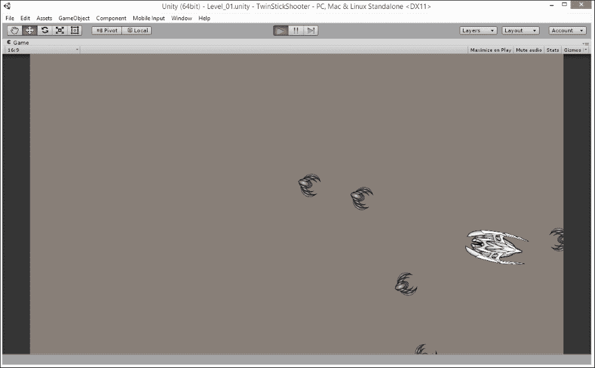

图 4.1：到目前为止的游戏

按顺序解决每个区域，我们首先从炮塔开始——子弹生成和发射的点。对于这个游戏，玩家将只有一个炮塔，但理想情况下，游戏应该支持添加更多，如果需要的话，允许玩家进行双发射或更多！要创建第一个炮塔，从应用程序菜单中选择**GameObject** | **Create Empty**，在场景中添加一个新的空游戏对象。将其命名为`Turret`。然后，将`Turret`对象定位在太空船的前面，确保蓝色前向向量箭头指向弹药将被发射的方向。最后，通过拖放它到**Hierarchy**面板中，使炮塔成为太空船的子对象。参见*图 4.2*：

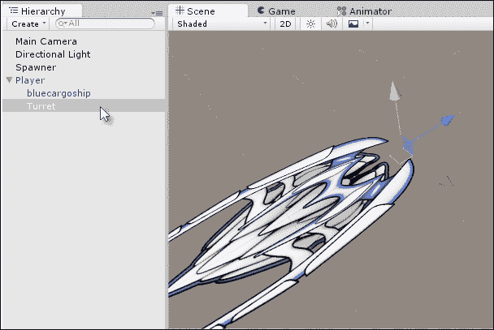

图 4.2：将炮塔对象作为太空船的子对象定位

为弹药创建一个作为生成位置的 `Turret` 对象是一个很好的开始，但为了实际发射弹药，我们需要一个弹药对象。具体来说，我们将创建一个 `Ammo` 预制件，在需要时可以实例化为弹药。我们将在下一步进行操作。

# 弹药预制件

当玩家按下射击按钮时，宇宙飞船应该在场景中发射弹药对象。这些对象将基于一个 `Ammo` 预制件。现在让我们创建这个预制件。首先，我们将配置用作弹药图形的纹理。在**项目**面板中打开 `Textures` 文件夹，并选择 `Ammo` 纹理。这个纹理展示了几个不同版本的弹药精灵，并排排列。参见*图 4.3*。当发射弹药时，我们不想显示完整的纹理；相反，我们只想显示其中的一张图片或图片作为动画序列逐帧播放。

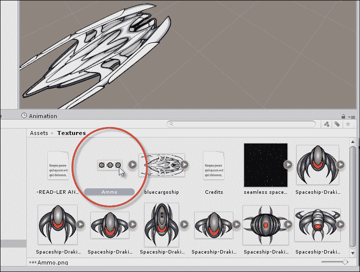

图 4.3：准备创建弹药预制件

目前，Unity 将纹理（以及每个弹药元素）识别为一个完整的单元。然而，我们可以使用精灵编辑器来分离每个部分。为此，在项目中选择**纹理**（如果尚未选择），然后（从**对象检查器**）将**精灵模式**下拉菜单从**单个**更改为**多个**。这表示纹理空间中包含多个精灵。参见*图 4.4*：

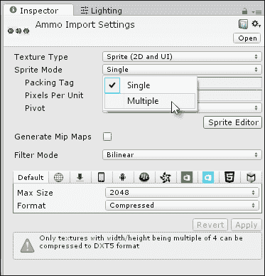

图 4.4：选择具有多个精灵的纹理中的多个精灵

点击**应用**按钮，然后从**对象检查器**中点击**精灵编辑器**按钮。这会打开精灵编辑器，允许您分离每个精灵。为此，点击并拖动鼠标选择每个精灵，确保**锚点**与对象**中心**对齐。参见*图 4.5*。然后，点击**应用**以接受更改。

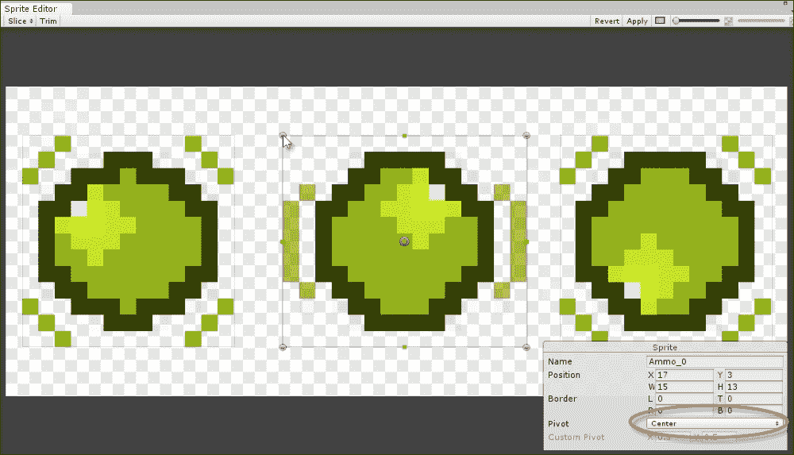

图 4.5：在精灵编辑器中分离多个精灵

在接受精灵编辑器中的更改后，Unity 会自动将相关的精灵切割成单独的单位，每个单位现在都可以在**项目**面板中作为一个单独的对象选择。点击纹理旁边的右箭头，纹理内的所有精灵都会向外展开。参见*图 4.6*：

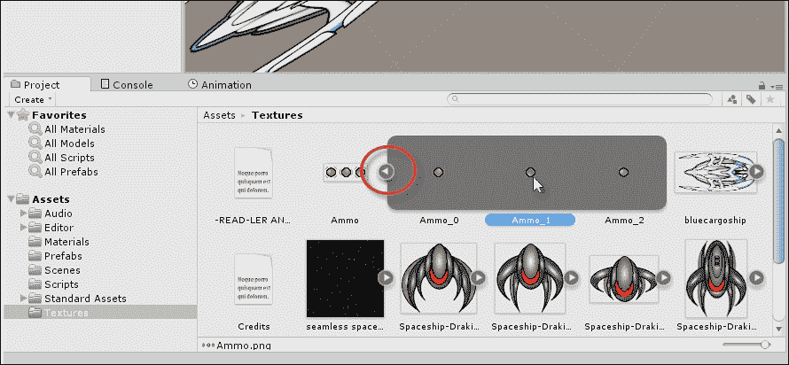

图 4.6：展开纹理内的所有精灵

现在，将**项目**面板中的一个精灵拖放到**场景**中，通过**层次结构**面板进行。这样做后，它将被添加为一个精灵对象。精灵本身可能最初没有面向游戏摄像头向上。如果是这样，旋转精灵 90 度直到它看起来正确。参见*图 4.7*：

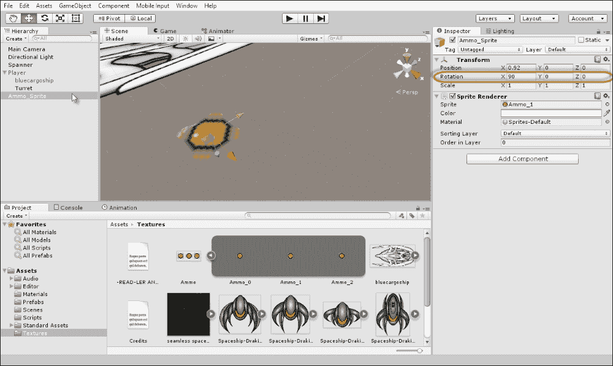

图 4.7：对齐弹药精灵

现在在场景中创建一个新的空游戏对象（从应用程序菜单 **GameObject** | **Create Empty**），并将其重命名为 `Ammo`。使这个新对象成为 `Ammo_Sprite` 的父对象，并确保其局部前进向量指向弹药应该移动的方向。我们将很快在弹药上重用上一章中创建的 `Mover` 脚本，使其移动。

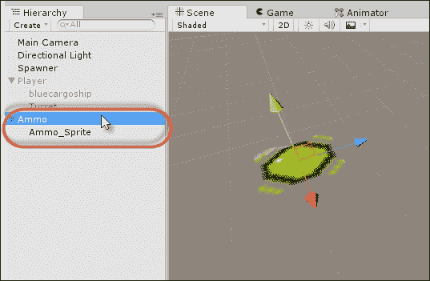

图 4.8：构建弹药对象

将 **项目** 面板中的 `Mover.cs` 脚本拖放到 **层次** 面板中的 `Ammo` 父对象，以将其添加为组件。然后，选择 `Ammo` 对象，从 **对象检查器** 中，将 **移动器** 组件中的弹药 **最大速度** 更改为 `7`。最后，向对象添加一个 **盒子碰撞器** 以近似其体积（从应用程序菜单 **组件** | **物理** | **盒子碰撞器**），然后在视口中通过按工具栏上的播放按钮测试所有这些。`Ammo` 对象应该向前射击，就像是从武器中发射出来的一样。如果它向上或向下移动不正确，那么请确保父对象已旋转，使其蓝色前进向量真正指向前方。参见 *图 4.9*：

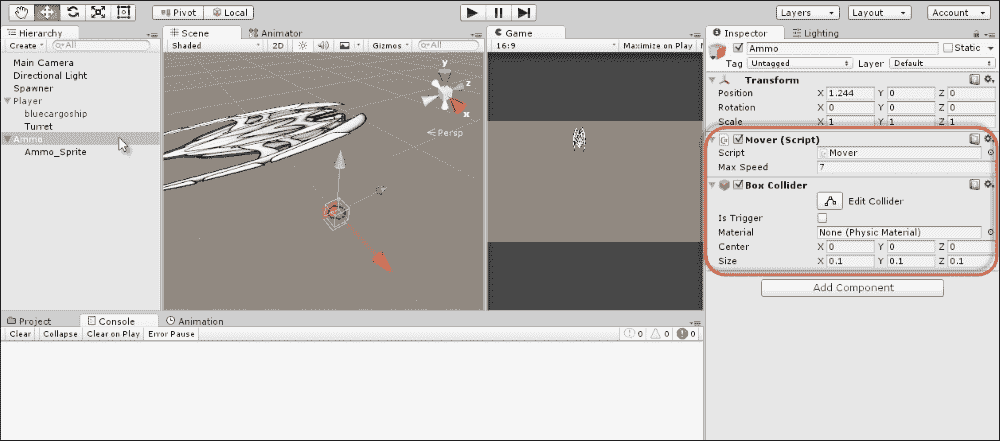

图 4.9：使用弹药预制件（移动器和碰撞器）前进

接下来，将一个**刚体**组件添加到弹药中，使其成为 Unity 物理系统的一部分。为此，选择 `Ammo` 对象，从应用程序菜单导航到 **组件** | **物理** | **刚体**。然后，在 **检查器**中的 **刚体** 组件中，取消选中 **使用重力** 复选框，以防止弹药在游戏过程中掉落到地面。就我们的目的而言，重力不需要作用于弹药，因为它应该简单地沿着路径移动，最终被销毁。这突出了游戏开发中的一般重要观点：现实世界的物理不一定需要精确地应用于每个对象。我们只需要足够的物理效果，使对象在玩家看来是正确的。参见 *图 4.10*：

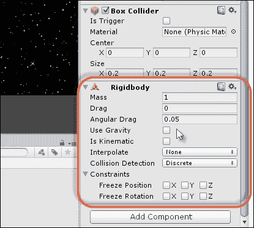

图 4.10：从弹药对象中移除重力

除了添加 `Mover` 脚本和物理组件外，我们还需要弹药具有独特的表现。具体来说，它应该损坏与它碰撞的对象，并且在碰撞时应该销毁或禁用自己。为了实现这一点，必须创建一个新的脚本文件，`Ammo.cs`。整个代码包含在 *代码示例 4.1* 中，如下所示：

```cs
//------------------------------
using UnityEngine;
using System.Collections;
//------------------------------
public class Ammo : MonoBehaviour
{
  public float Damage = 100f;
  public float LifeTime = 2f;
  //------------------------------
  void OnEnable()
  {
    CancelInvoke();
    Invoke("Die", LifeTime);
  }
  //------------------------------
  // Update is called once per frame
  void OnTriggerEnter(Collider Col)
  {
    //Get health component
      Health H = Col.gameObject.GetComponent<Health>();

    if(H == null)return;

    H.HealthPoints -= Damage;
  }
  //------------------------------
  void Die()
  {
    gameObject.SetActive(false);
  }

  //------------------------------
}
//------------------------------
```

## 代码示例 4-1

以下要点总结了代码示例：

+   `Ammo` 类应该附加到 `Ammo` 预制件对象上，并将为所有创建的弹药对象实例化。其主要目的是损坏与它碰撞的任何对象。

+   当弹药进入一个连接到可移动单位（如玩家或敌人）的触发器时，会调用`OnTriggerEnter`函数。具体来说，它会检索对象上附加的`Health`组件（如果有的话），并减少其健康值。`Health`组件是在上一章中创建的。

+   注意，每个弹药对象都将有一个生命周期。这代表弹药在发射并生成到场景中后应该保持活跃的时间（以秒为单位）。生命周期结束后，弹药应该被完全销毁或停用（关于这一点稍后会有更多说明）。

+   使用`Invoke`函数在`LifeTime`间隔后停用弹药对象。这发生在`OnEnable`事件期间。Unity 会在每次对象被激活时自动调用这个函数（即，从禁用状态变为启用状态）。

现在，将`Ammo`脚本文件从**项目**面板中的`Scripts`文件夹拖放到`Ammo`对象上，然后最后，将整个`Ammo`对象从**场景**面板拖放到`Prefabs`文件夹中的**项目**面板，以创建一个新的`Ammo`预制体。参见*图 4.11*：

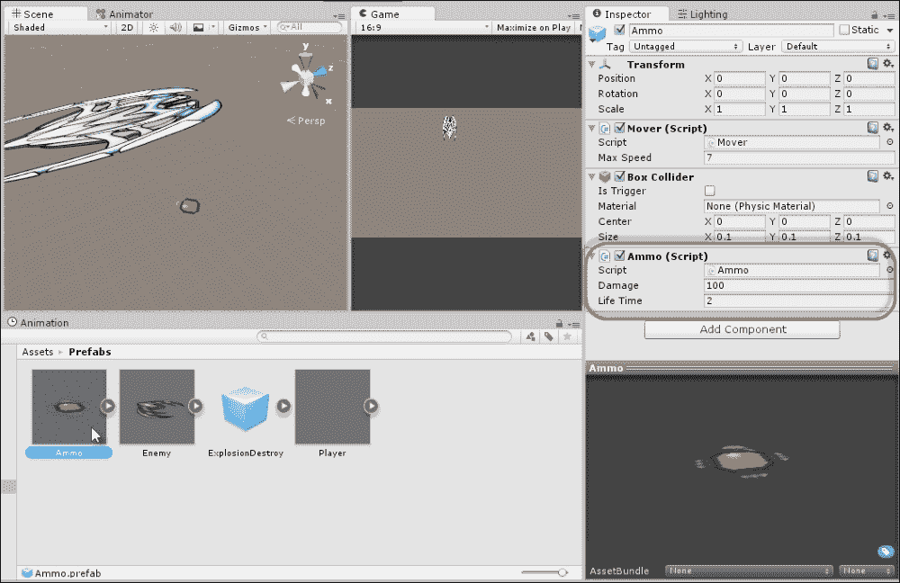

图 4.11：创建弹药预制体

恭喜！你现在已经创建了一个`Ammo`预制体，可以从武器点生成以直接攻击敌人。这是好的，但我们还没有处理生成过程本身，我们将在下一部分解决这个问题。

# 弹药生成

到目前为止创建的`Ammo`预制体给我们带来了一个技术问题，如果这个问题不被认真对待，可能会对我们的游戏造成一些严重的性能惩罚。具体来说，当太空船武器发射时，我们需要生成弹药，使其进入场景并在碰撞时摧毁敌人。这在一般情况下是可以的，但问题是玩家可能会连续多次按下射击按钮，甚至可能长时间按住射击按钮，从而产生可能成百上千的弹药预制体。当然，我们可以使用之前看到的`Instantiate`函数动态生成这些预制体，但这样做是有问题的，因为实例化在计算上很昂贵。当连续生成许多物品时，它通常会导致令人难以忍受的减速，将帧数降低到不可接受的水平。我们需要避免这种情况！

这种解决方案被称为**池化**、**对象池化**或**对象缓存**。本质上，这意味着我们必须在关卡启动时（一个对象池）生成大量可回收的弹药对象，最初它们是隐藏的或停用的，我们只需在需要时激活对象（当玩家开火时）。当弹药与敌人碰撞或其生命周期结束时，我们不会完全销毁对象，而是再次停用它，如果需要的话，将其返回池中以供以后重用。这样，我们就避免了所有对`Instantiate`的调用，并简单地回收我们拥有的所有弹药对象。为了开始编写此功能，我们将创建一个`AmmoManager`类。这个类将负责两个功能：首先，在场景启动时生成弹药对象池，其次，在需要时（例如在武器开火时）从池中提供一个有效且可用的弹药对象。以下是一个`AmmoManager` *代码示例 4.2*，以实现这一目标：

```cs
//------------------------------
using UnityEngine;
using System.Collections;
using System.Collections.Generic;
//------------------------------
public class AmmoManager : MonoBehaviour
{
  //------------------------------
  //Reference to ammo prefab
  public GameObject AmmoPrefab = null;

  //Ammo pool count
  public int PoolSize = 100;

  public Queue<Transform> AmmoQueue = new Queue<Transform>();

  //Array of ammo objects to generate
  private GameObject[] AmmoArray;

  public static AmmoManager AmmoManagerSingleton = null;
  //------------------------------
  // Use this for initialization
  void Awake ()
  {
    if(AmmoManagerSingleton != null)
    {
      Destroy(GetComponent<AmmoManager>());
      return;
    }

    AmmoManagerSingleton = this;
    AmmoArray = new GameObject[PoolSize];

    for(int i=0; i<PoolSize; i++)
    {
      AmmoArray[i] = Instantiate(AmmoPrefab, Vector3.zero, Quaternion.identity) as GameObject;
      Transform ObjTransform = AmmoArray[i].GetComponent<Transform>();
      ObjTransform.parent = GetComponent<Transform>();
      AmmoQueue.Enqueue(ObjTransform);
      AmmoArray[i].SetActive(false);
    }
  }
  //------------------------------
  public static Transform SpawnAmmo(Vector3 Position, Quaternion Rotation)
  {
    //Get ammo
    Transform SpawnedAmmo = AmmoManagerSingleton.AmmoQueue.Dequeue();

    SpawnedAmmo.gameObject.SetActive(true);
    SpawnedAmmo.position = Position;
    SpawnedAmmo.localRotation = Rotation;

    //Add to queue end
    AmmoManagerSingleton.AmmoQueue.Enqueue(SpawnedAmmo);

    //Return ammo
    return SpawnedAmmo;
  }
  //------------------------------
}
//------------------------------
```

## 代码示例 4.2

以下要点总结了代码示例：

+   `AmmoManager`具有一个`AmmoArray`成员变量，它保存了在启动时（在`Awake`事件期间）要生成的所有弹药对象的完整列表（引用的顺序数组）。

+   `AmmoArray`的大小将设置为`PoolSize`。这指的是要生成的弹药对象的总数。`Awake`函数在关卡开始时生成弹药对象，并使用`Enqueue`将它们添加到队列中。

+   一旦生成，每个弹药对象都会通过`SetActive(false)`被停用，并保留在池中，直到需要时使用。

+   `AmmoManager`使用来自`Mono`库的`Queue`类来管理在按下射击键时如何从池中选择特定的弹药对象进行激活。队列作为一个**先进先出**（**FIFO**）对象工作。也就是说，弹药对象逐个添加到队列中，并在被选中激活时移除。从队列中移除的对象总是位于队列前端的对象。有关`Queue`类的更多信息，可以在网上找到，链接为[`msdn.microsoft.com/en-us/library/7977ey2c%28v=vs.110%29.aspx`](https://msdn.microsoft.com/en-us/library/7977ey2c%28v=vs.110%29.aspx)。

+   在`Queue`对象中，`Enqueue`函数在`Awake`阶段被调用，用于逐个将生成的对象最初添加到队列中。

+   应该调用`SpawnAmmo`函数来在场景中生成新的弹药项目。此函数不依赖于`Instantiate`函数，而是使用`Queue`对象。它从队列中移除第一个弹药对象，激活它，然后将其再次添加到队列的末尾，位于所有其他弹药对象之后。这样，就发生了一个生成和再生的循环，允许所有弹药对象得到回收。

+   `AmmoManager` 被编码为一个单例对象，这意味着在任何时候场景中都应该只有一个此类对象实例。这种功能是通过静态成员 `AmmoManagerSingleton` 实现的。有关单例对象的更多信息，请参阅 *Packt Publishing* 出版的 *Mastering Unity Scripting*（[`www.packtpub.com/game-development/mastering-unity-5x-scripting`](https://www.packtpub.com/game-development/mastering-unity-5x-scripting)）。

要使用此类，在场景中创建一个新的 `GameObject`，命名为 `AmmoManager`，通过从应用程序菜单中选择 **GameObject** | **Create Empty** 来实现。然后，从 **Project** 面板拖放 `AmmoManager` 脚本到场景中的对象上。一旦创建，将 `Prefabs` 文件夹中的 `Ammo` 预制体拖放到 **Object Inspector** 中的 **Ammo Manager** 组件的 **Ammo Prefab** 槽中。参见 *图 4.12*：

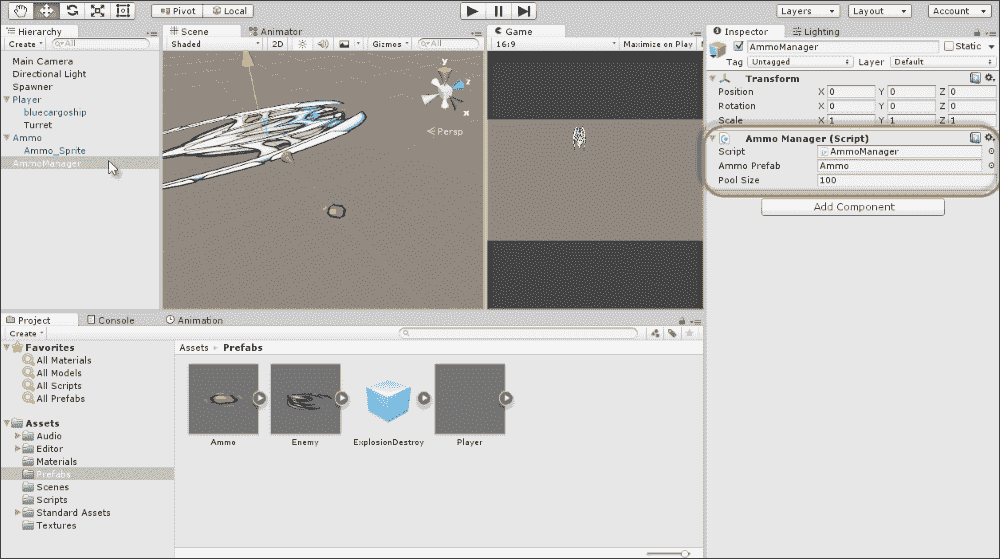

图 4.12：将弹药管理器添加到对象中

现在，场景中有一个 `AmmoManager` 对象来存储弹药池，它位于屏幕外且不可见。然而，关于我们现有的功能实际上并没有将玩家的射击按钮按下与场景中弹药生成连接起来。也就是说，我们没有代码来使弹药变得可见并工作！这种连接现在应该通过我们在上一章中开始的 `PlayerController` 脚本来实现。这个类现在应该修改以处理弹药生成。修改后的 `PlayerController` 类包含在下面的 *代码示例 4.3* 中。修改内容已突出显示：

```cs
//------------------------------
using UnityEngine;
using System.Collections;
//------------------------------
public class PlayerController : MonoBehaviour
{
  //------------------------------
  private Rigidbody ThisBody = null;
  private Transform ThisTransform = null;

  public bool MouseLook = true;
  public string HorzAxis = "Horizontal";
  public string VertAxis = "Vertical";
  public string FireAxis = "Fire1";

  public float MaxSpeed = 5f;
  public float ReloadDelay = 0.3f;
  public bool CanFire = true;

  public Transform[] TurretTransforms;
  //------------------------------
  // Use this for initialization
  void Awake ()
  {
    ThisBody = GetComponent<Rigidbody>();
    ThisTransform = GetComponent<Transform>();
  }
  //------------------------------
  // Update is called once per frame
  void FixedUpdate ()
  {
    //Update movement
    float Horz = Input.GetAxis(HorzAxis);
    float Vert = Input.GetAxis(VertAxis);
    Vector3 MoveDirection = new Vector3(Horz, 0.0f, Vert);
    ThisBody.AddForce(MoveDirection.normalized * MaxSpeed);

    //Clamp speed
    ThisBody.velocity = new Vector3(Mathf.Clamp(ThisBody.velocity.x, -MaxSpeed, MaxSpeed),
    Mathf.Clamp(ThisBody.velocity.y, -MaxSpeed, MaxSpeed),
    Mathf.Clamp(ThisBody.velocity.z, -MaxSpeed, MaxSpeed));

    //Should look with mouse?
    if(MouseLook)
    {
      //Update rotation - turn to face mouse pointer
      Vector3 MousePosWorld = Camera.main.ScreenToWorldPoint(new Vector3(Input.mousePosition.x, Input.mousePosition.y, 0.0f));
      MousePosWorld = new Vector3(MousePosWorld.x, 0.0f, MousePosWorld.z);

      //Get direction to cursor
      Vector3 LookDirection = MousePosWorld - ThisTransform.position;

      //FixedUpdate rotation
      ThisTransform.localRotation = Quaternion.LookRotation(LookDirection.normalized,Vector3.up);
    }

    //Check fire control
    if(Input.GetButtonDown(FireAxis) && CanFire)
    {
      foreach(Transform T in TurretTransforms)
        AmmoManager.SpawnAmmo(T.position, T.rotation);

      CanFire = false;
      Invoke ("EnableFire", ReloadDelay);
    }
  }
  //------------------------------
  void EnableFire()
  {
    CanFire = true;
  }
  //------------------------------
  public void Die()
  {
    Destroy(gameObject);
  }
}
//------------------------------
```

## 代码示例 4.3

以下要点总结了代码示例：

+   `PlayerController` 现在具有一个 `TurretTransform` 数组变量，列出了所有用作炮塔生成位置的子空对象。

+   在 `Update` 函数期间，`PlayerController` 检查射击按钮的按下。如果检测到，代码将遍历所有炮塔并在每个炮塔位置生成一个弹药对象。

+   一旦发射了弹药，`ReloadDelay` 就会被激活（设置为 `true`）。这意味着在再次发射新弹药之前，必须首先等待延迟时间结束。

在将此代码添加到 `PlayerController` 之后，选择场景中的 `Player` 对象，然后将 `Turret` 空对象拖放到 `TurretTransform` 槽中。此示例仅使用一个炮塔，但如果需要，可以添加更多。参见 *图 4.13*：

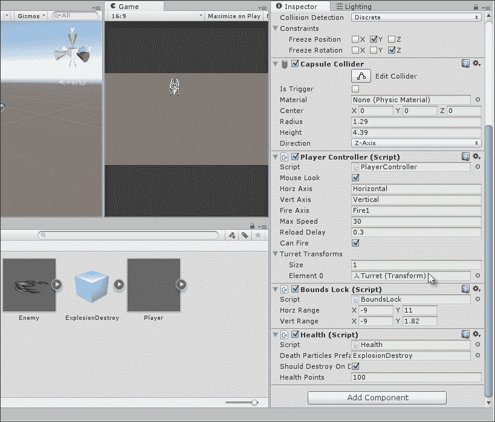

图 4.13：配置 TurretTransform 以生成弹药

现在你可以进行游戏测试并发射弹药。通过播放场景并按键盘或鼠标（左键）的射击按钮，将生成弹药。太棒了！然而，在测试时，你可能注意到两个主要问题。首先，弹药看起来太大或太小。其次，弹药有时会弹跳、翻转或对玩家的宇宙飞船做出反应。让我们依次修复这些问题。

如果弹药看起来大小不正确，您可以简单地更改预制体的缩放比例。在**项目**面板中选择`Ammo`预制体，然后从**对象检查器**中在**变换**组件中输入新的缩放比例。参见*图 4.14*：

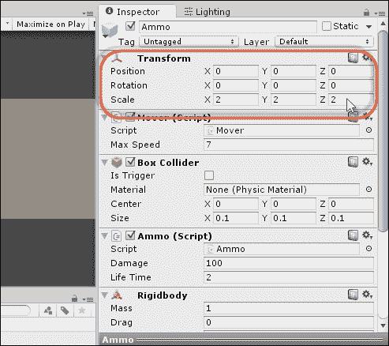

图 4.14：更改弹药预制体的缩放比例

如果弹药看起来会弹跳或对玩家飞船做出反应，那么我们需要使弹药对玩家免疫或不敏感。为了实现这一点，我们可以使用物理层。简而言之，玩家飞船和弹药应该被添加到单个层中，并且该层上的所有对象在物理反应方面都应定义为相互免疫。首先，在场景中选择`Player`对象。然后，从**对象检查器**中点击**层**下拉菜单，并在上下文菜单中选择**添加层**。参见*图 4.15*：

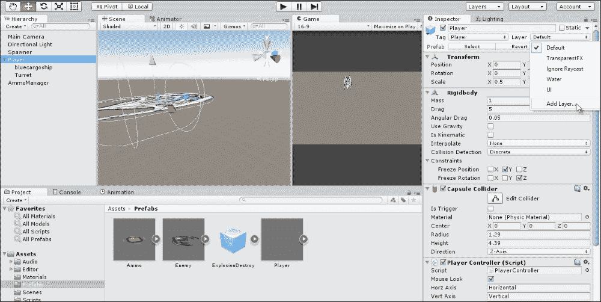

图 4.15：为物理排除创建新层

将层命名为`Player`。这是为了表明所有附加到该层的对象都与`Player`相关联。参见*图 4.16*：

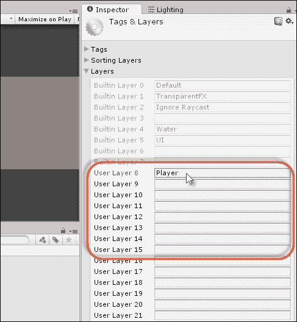

图 4.16：创建层

现在，将场景中的`Player`对象和**项目**面板中的`Ammo`预制体分配到新创建的**玩家**层。选择每个对象，然后简单地点击**层**下拉菜单，选择**玩家**选项。参见*图 4.17*。如果出现弹出对话框，请选择更改子对象。这确保了所有子对象也与父对象的相同**层**相关联。

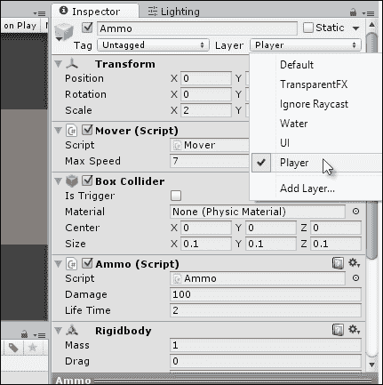

图 4.17：将玩家和弹药分配到玩家层

现在**玩家**和**弹药**已经被分配到相同的层。从这里，我们可以使同一层上的所有对象在**物理**方面相互免疫。要做到这一点，从应用程序菜单导航到**编辑** | **项目设置** | **物理**。参见*图 4.18*：

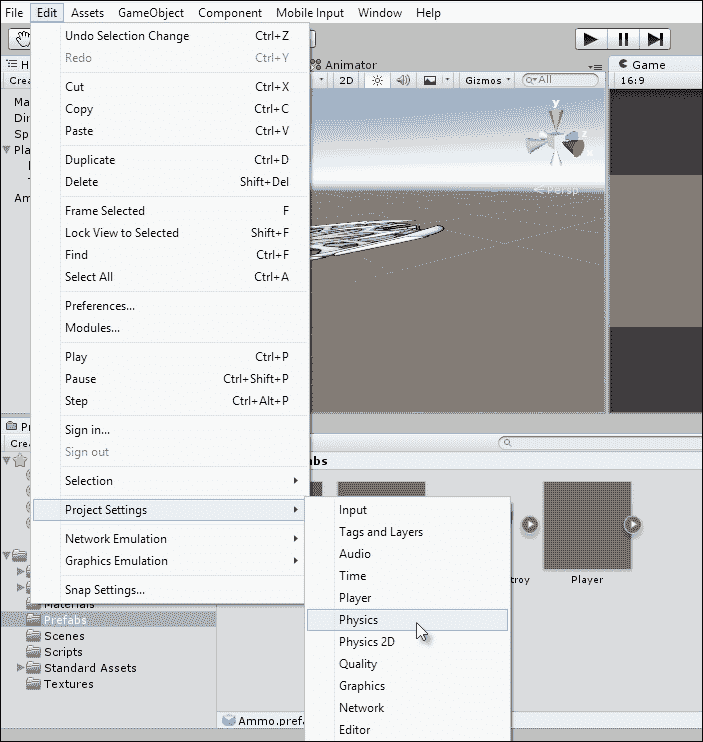

图 4.18：访问物理选项

全局**物理**设置显示在**对象检查器**中。在**检查器**底部，**层** **碰撞矩阵**显示层如何相互影响。带有勾选标记的交叉层可以并且将相互影响。因此，取消**玩家**层的勾选标记以防止该层上的对象之间发生碰撞。参见*图 4.19*：


图 4.19：设置层碰撞矩阵以改善碰撞

通过从**对象检查器**设置**层碰撞矩阵**，按工具栏上的播放按钮测试运行到目前为止的游戏。当你这样做并按射击键时，弹药将从炮塔中发射出来，并且不再对玩家飞船做出反应。然而，弹药应该会与敌人碰撞并摧毁它们。参见*图 4.20*：

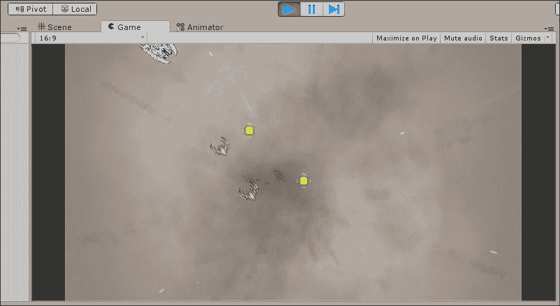

图 4.20：通过射击枪支摧毁敌人！

优秀的工作！我们现在有一个可以发射武器并摧毁敌人的宇宙飞船，物理效果也如预期。也许您想稍微自定义玩家控制，或者可能想使用游戏手柄。下一节将进一步探讨这个问题。

# 用户控制

也许您不喜欢默认的控件和与输入轴关联的默认按键组合——**水平**、**垂直**和**Fire1**。也许您想更改它们。这些输入轴是通过`Input.GetAxis`函数（之前已展示）读取的，并且由可读名称指定，但并不立即清楚 Unity 如何将特定的输入按钮和设备映射到这些虚拟轴。在这里，我们将简要介绍如何自定义这些设置。要开始，让我们通过从应用程序菜单导航到**编辑** | **项目设置** | **输入**来访问**输入**设置。请参阅*图 4.21*：

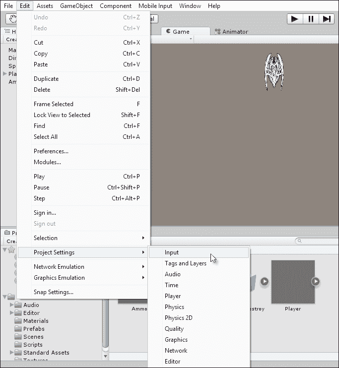

图 4.21：访问输入菜单

选择此选项后，一系列自定义定义的输入轴将作为列表出现在**对象检查器**中。请参阅*图 4.22*。这定义了输入系统使用的所有轴。**水平**和**垂直**轴应列在这里。

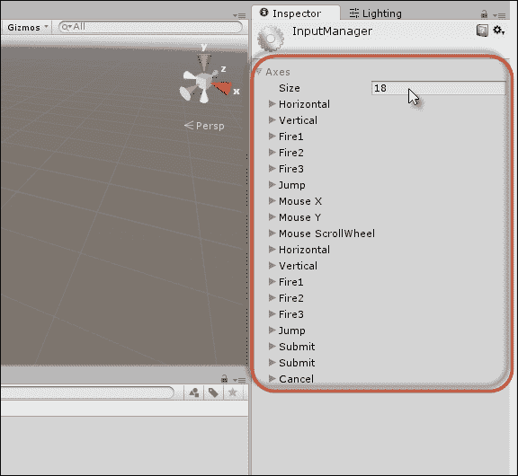

图 4.22：探索输入轴

通过在**对象检查器**中展开每个轴，您可以轻松地自定义用户输入的映射方式，即特定的键和硬件设备上的控件（如键盘和鼠标）如何映射到轴。例如，**水平**轴被定义了两次。对于第一个定义，**水平**被映射到键盘上的`左`、`右`和*A*和*D*键。右和*D*被映射为**正按钮**，因为当按下时，它们从`Input.GetAxis`函数产生正的浮点值（0-1）。左和*A*被映射为**负按钮**，因为当按下时，它们对`Input.GetAxis`产生负的浮点值。这使得使用负数和正数轻松地左右移动对象变得容易。请参阅*图 4.23*：

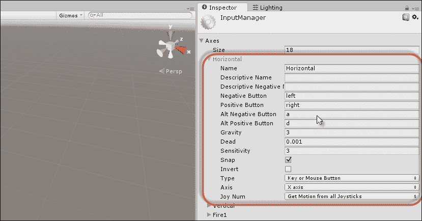

图 4.23：配置输入轴

注意，在**对象检查器**中**水平**被定义了两次——一次在列表顶部附近，一次在底部附近。这两个定义是累积的，而不是矛盾的——它们堆叠在一起。这允许您将多个设备映射到同一个轴，从而让您能够跨平台和多设备控制您的游戏。默认情况下，**水平**在第一个定义中被映射到键盘上的`左`、`右`、*A*和*D*键，在第二个定义中，被映射到操纵杆运动。这两个定义都是有效的，并且可以一起工作。您可以为同一个轴定义尽可能多的定义，具体取决于您需要支持的控件。请参阅*图 4.24*：

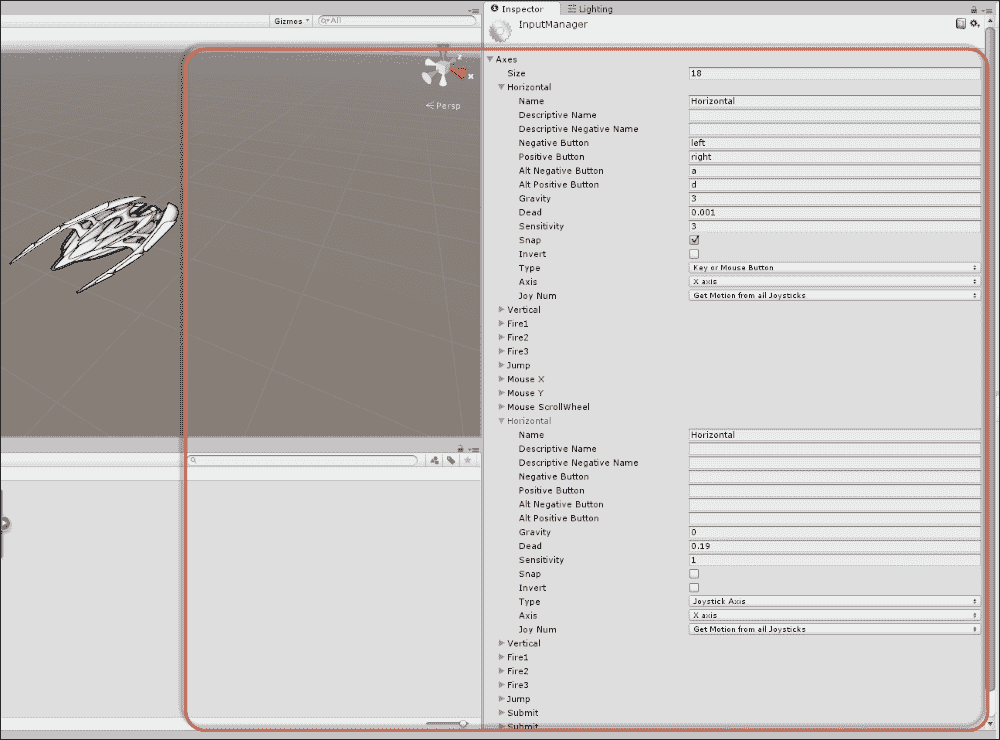

图 4.24：定义两个水平轴

对于这个项目，控制将保持默认设置，但如果您想支持不同的配置，请继续更改或添加额外的控制。有关玩家输入和自定义控制的更多信息，请参阅在线 Unity 文档中的[`docs.unity3d.com/Manual/class-InputManager.html`](http://docs.unity3d.com/Manual/class-InputManager.html)。

# 得分和计分 – UI 和文本对象

让我们继续讨论计分系统，在创建这个系统时，我们将创建`GameController`。`GameController`只是一个管理整个游戏和全局行为的脚本或类。这包括得分，因为在这个游戏中，得分指的是代表玩家成就和进度的单个和全局数字。在开始实现之前，首先创建一个简单的 GUI 来显示游戏得分。GUI 是图形用户界面的缩写，这指的是位于游戏窗口上方并提供给玩家的所有 2D 图形元素。为此，从应用程序菜单中选择**GameObject** | **UI** | **Canvas**来创建一个新的 GUI 画布对象。参见*图 4.25*。有关 GUI 的更多详细信息，请参阅下一章。

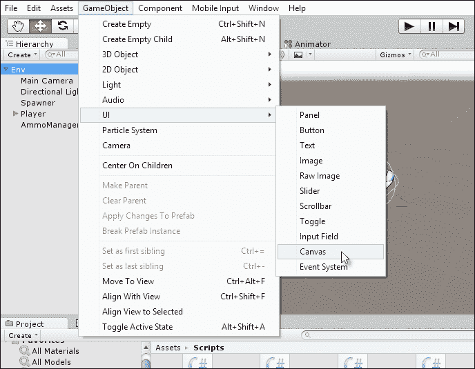

图 4.25：将 Canvas 对象添加到场景中

`Canvas`对象定义了 GUI 存在的总面积或区域，包括所有按钮、文本和其他小部件。在场景中生成后，`Canvas`也出现在**层次结构**面板中。最初，`Canvas`对象可能太大或太小，在视图中看不清楚，因此请在**层次结构**面板中选择`Canvas`对象，然后在键盘上按*F*键以聚焦对象。它应该显示为一个大的垂直对齐矩形。参见*图 4.26*：

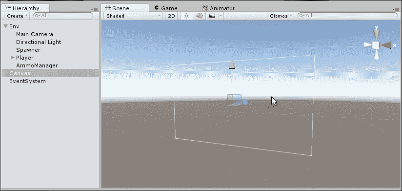

图 4.26：在视图中检查 Canvas 对象

在**游戏**选项卡中，`Canvas`对象本身是不可见的。它仅仅作为一个容器。即便如此，它对包含的对象在屏幕上的大小、位置和缩放方式有强烈的影响。因此，在添加对象和细化界面设计之前，首先配置您的`Canvas`对象是有帮助的。为此，在场景中选择`Canvas`对象，然后从**对象检查器**中，点击**Canvas Scaler**组件中的**UI 缩放模式**下拉选项。从下拉列表中，选择**随屏幕大小缩放**选项，并在**参考分辨率**字段中输入高清分辨率，即对于**X**字段指定`1920`，对于**Y**字段指定`1080`。参见*图 4.27*：

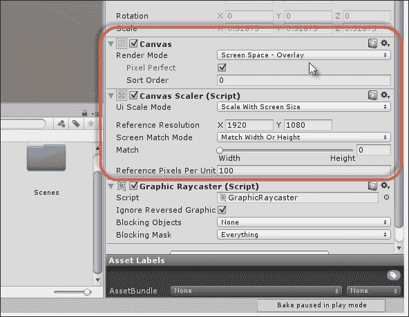

图 4.27：调整 Canvas Scaler 组件

通过将**画布缩放器**调整为**与屏幕大小缩放**，游戏的用户界面将自动拉伸和收缩（向上和向下缩放），以适应目标分辨率，确保每个元素按相同比例缩放，保持整体外观和感觉。这是一个快速简单的方法，一次创建 UI，然后调整大小以适应几乎任何分辨率。这可能不是始终是保持最高质量图形保真度的最佳解决方案，但它功能性强，在许多情况下都适用。在任何情况下，在进行 UI 设计之前，在界面中（或如果你有多个显示器配置，则跨两个显示器）并排查看**场景**视口和**游戏**标签都是很有帮助的。这允许我们在**场景**视口中构建界面，然后在**游戏**标签中预览其效果。你可以通过在**Unity 编辑器**中将**游戏**标签拖放到**场景**标签旁边来重新排列**场景**和**游戏**标签。参见*图 4.28*：

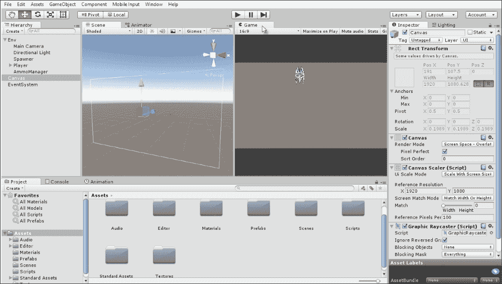

图 4.28：将场景和游戏标签并排停靠

接下来，让我们将文本小部件添加到 GUI 中以显示游戏得分。为此，在**层次结构**面板中选择`画布`对象，然后在该对象上（在**层次结构**面板中）右键单击以显示上下文菜单。从这里，选择**UI** | **文本**。这将在`画布`对象下创建一个新的文本对象，而不是一个没有父对象的顶层对象。参见*图 4.29*。`文本`对象用于在屏幕上绘制具有特定颜色、大小和字体设置的文本。

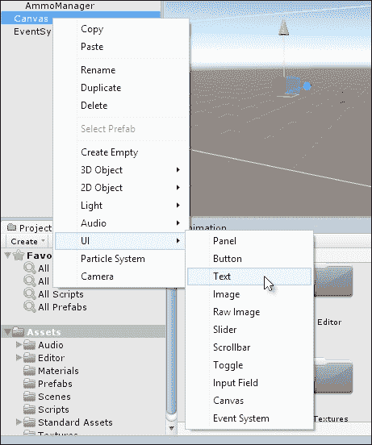

图 4.29：为 UI 创建文本对象

默认情况下，`文本`对象可能最初在场景或视图中不可见，尽管它在**层次结构**面板中被列为一个对象。然而，仔细观察**场景**，你可能会看到非常小且暗淡的文本，这些文本出现在**画布**和**游戏**标签中。参见*图 4.30*。默认情况下，新文本对象具有黑色文本和较小的字体大小。对于这个项目，这些设置需要更改。

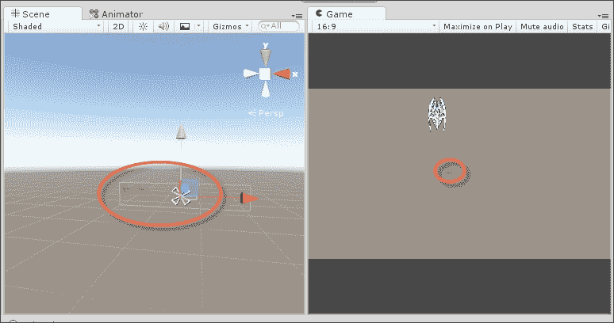

图 4.30：新创建的文本对象有时难以看到

如果尚未选择，请在**层次结构**面板中选择`文本`对象，然后从**对象检查器**（在**文本**组件中），将文本**颜色**更改为白色，并将**字体大小**更改为`20`。参见*图 4.31*：

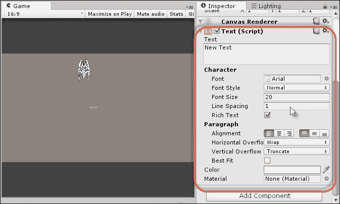

图 4.31：更改文本大小和颜色

然而，即使更改了大小，文本仍然显得太小。但是，如果你进一步增加大小，文本可能会从视图中消失。这是因为每个`Text`对象都有一个定义其边界的矩形边界，当字体大小增加到超出边界能容纳的范围时，文本会自动完全隐藏。为了解决这个问题，我们将增加文本边界。为此，使用 *T* 键切换到**矩形变换**工具或从工具栏中选择该工具。参见*图 4.32*：

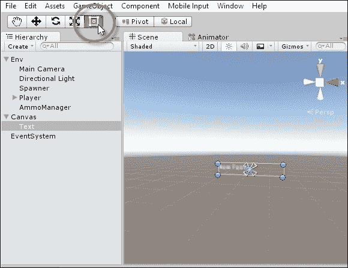

图 4.32：选择矩形变换工具

激活**矩形变换**工具后，将在**场景**视图中围绕选定的`Text`对象绘制一个清晰定义的边界，指示其矩形范围。让我们增加边界大小以适应更大的文本。为此，只需用鼠标点击并拖动边界边缘，按需扩展它们。参见*图 4.33*。这将增加边界大小，现在你可以增加**字体大小**以提高文本可读性。

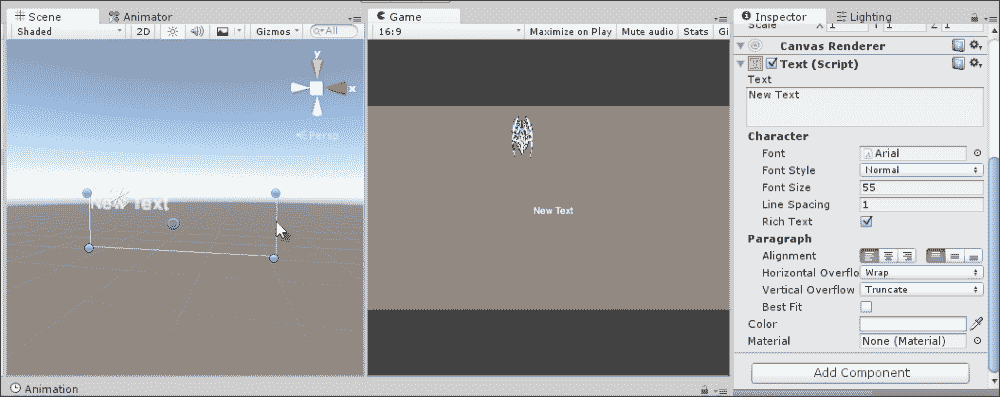

图 4.33：调整文本矩形以支持更大的字体大小

除了设置文本边界大小外，文本还可以垂直对齐到边界中心。只需单击垂直组的中心对齐按钮。对于水平对齐，文本应保持左对齐，以便显示得分。参见*图 4.34*：

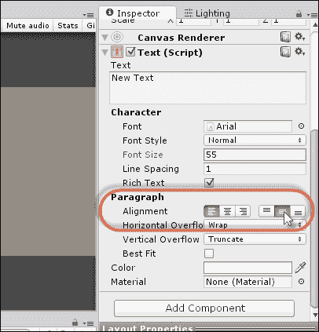

图 4.34：在边界内对齐文本

虽然文本现在在其包含边界内垂直对齐，但我们仍需要将其整体对齐到画布容器，以确保即使在**游戏**窗口调整大小和重新对齐时，它也保持在屏幕上的相同位置和方向。为此，我们将使用**锚点**。首先，使用变换工具(*W*)将`Text`对象重新定位到屏幕右上角，即**得分**应该出现的位置。对象将自动在二维平面上移动，而不是在三维空间中。当你将`Text`对象在**场景**视图中移动时，检查**游戏**标签中的外观，以确保它看起来正确且合适。参见*图 4.35*：

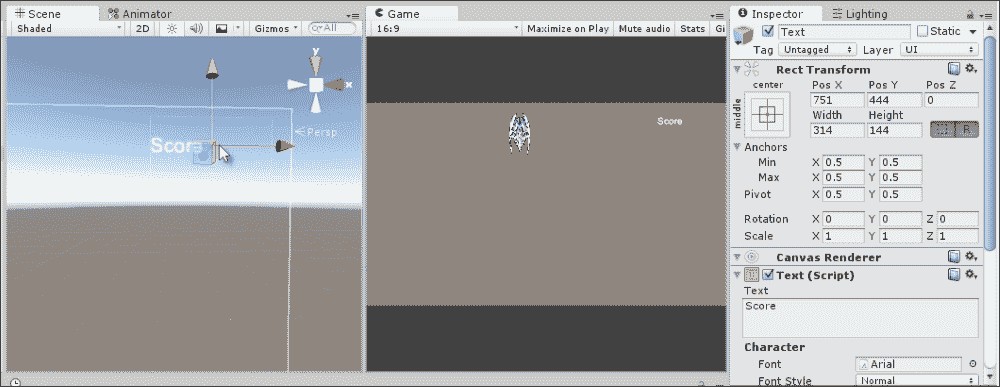

图 4.35：在游戏标签中定位得分文本

为了确保 `Text` 对象在屏幕上的位置（防止它滑动或移动），即使用户调整了 **Game** 选项卡的大小，我们也可以将对象的锚点位置设置为屏幕的右上角。这确保了文本始终以恒定的、成比例的偏移量从其锚点定位。为此，在 **Object Inspector** 中的 **Rect Transform** 组件上的 **Anchor Presets** 按钮上单击。当你这样做时，一个预设菜单会出现，你可以从中选择一系列对齐位置。每个预设都通过一个小图表示图形化展示，包括一个位于锚点对齐位置的红点。选择右上角的预设。参见 *图 4.36*：

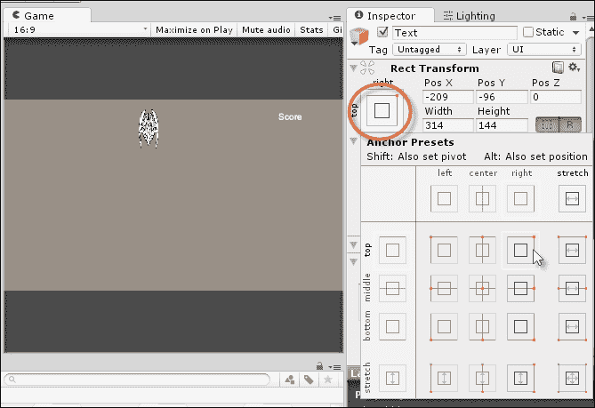

图 4.36：将文本对象对齐到屏幕

优秀的作品！现在 `Text` 对象已经创建并准备好使用。当然，在播放模式下，文本保持不变，不会显示真实的得分。这是因为我们需要添加一些代码。然而，总的来说，`Text` 对象已经到位，我们可以继续前进。

# 与得分一起工作 - 使用文本脚本

要在 GUI 中显示得分，我们首先需要得分功能，即创建得分系统的代码。本质上，得分功能将被添加到一个通用的、全面的 `GameController` 类中，该类负责所有游戏逻辑和功能。`GameController` 及其得分功能集的代码包含在 *代码示例 4.4* 中，如下所示。此文件应添加到项目的 `Scripts` 文件夹中。

```cs
using UnityEngine;
using System.Collections;
using UnityEngine.UI;
//------------------------------
public class GameController : MonoBehaviour
{
  //Game score
  public static int Score;

  //Prefix
  public string ScorePrefix = string.Empty;

  //Score text object
  public Text ScoreText = null;

  //Game over text
  public Text GameOverText = null;

  public static GameController ThisInstance = null;
  //------------------------------
  void Awake()
  {
    ThisInstance = this;
  }
  //------------------------------
  void Update()
  {
    //Update score text
    if(ScoreText!=null)
      ScoreText.text = ScorePrefix + Score.ToString();
  }
  //------------------------------
  public static void GameOver()
  {
    if(ThisInstance.GameOverText!=null)
    ThisInstance.GameOverText.gameObject.SetActive(true);
  }
  //------------------------------
}
```

## 代码示例 4.4

以下要点总结了代码示例：

+   `GameController` 类使用 `UnityEngine.ui` 命名空间。这很重要，因为它包括了访问 Unity 中所有 UI 类和对象的方法。如果你没有在你的源文件中包含这个命名空间，那么你将无法从该脚本中使用 UI 对象。

+   `GameController` 类有两个公共文本成员，即 `ScoreText` 和 `GameOverText`。这些成员在 `GameController` 代码中是可选的，因为即使成员为空，代码也能正常工作。`ScoreText` 是一个指向用于显示得分文本的文本 GUI 对象的引用，而 `GameOverText` 用于在游戏结束条件发生时显示任何消息。

要使用 `GameController` 代码，在场景中创建一个新的空对象，命名为 `GameController`。然后，将 `GameController` 脚本文件拖放到该对象上。一旦添加，将 `ScoreText` 对象拖放到 **Object Inspector** 中的 `GameController` 的 **Score Text** 字段。参见 *图 4.37*。在 **Score Prefix** 字段中，输入应加在 `Score` 前面的文本。得分本身只是一个数字（如 1,000）。前缀允许你在得分前面添加文本，向玩家说明这些数字的含义。

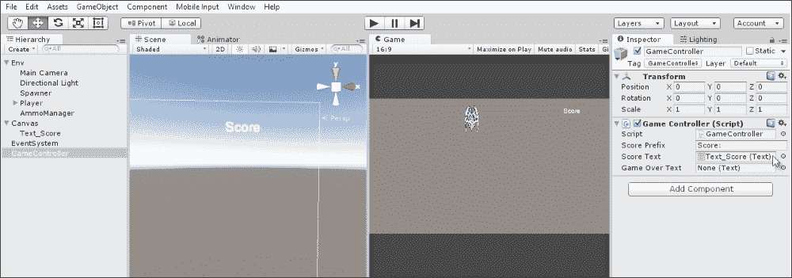

图 4.37：创建一个用于维护游戏得分的 GameController

现在，进行游戏测试运行，你会在**游戏**标签页的右上角看到使用 GUI 文本对象显示的分数。这是可以的，但现在分数总是保持在`0`。这是因为我们还没有编写增加分数的代码。对于我们的游戏，当`敌人`对象被销毁时，分数应该增加。为了实现这一点，我们将创建一个新的脚本文件，`ScoreOnDestroy`。这包含在*代码示例 4.5*中，如下所示：

```cs
using UnityEngine;
using System.Collections;
//------------------------------
public class ScoreOnDestroy : MonoBehaviour
{
  //------------------------------
  public int ScoreValue = 50;
  //------------------------------
  void OnDestroy()
  {
    GameController.Score += ScoreValue;
  }
  //------------------------------
}
//------------------------------
```

脚本应该附加到任何在销毁时为你分配分数的对象上，例如敌人。分配的分数总数由`ScoreValue`指定。要将脚本附加到敌人预制体上，在**项目**面板中选择`预制体`，然后在**对象检查器**中点击**添加组件**按钮。然后在搜索字段中输入`ScoreOnDestroy`以将组件添加到预制体。一旦添加，指定销毁敌人时要分配的总分数。对于这个游戏，分配了 50 分的值。见*图 4.38*：

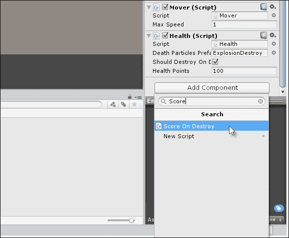

图 4.38：向敌人预制体添加分数组件

干得好！你现在有了可破坏的敌人，它们在销毁时为你分配分数。这意味着你终于可以拥有游戏中的分数，甚至可以扩展游戏以包括高分功能和排行榜。这也意味着我们的游戏几乎完成，准备构建。接下来，我们将添加一些最后的修饰。

# 磨光

在本节中，我们将为游戏添加最后的修饰。首先，我们要解决游戏背景的问题！到目前为止，背景只是简单地显示了与游戏摄像机关联的默认背景颜色。然而，由于游戏设定在太空中，我们应该显示太空背景。为此，在**场景**中创建一个新的**四边形**对象，该对象将显示太空图像。从菜单中选择**游戏对象** | **3D 对象** | **四边形**。然后旋转对象并向下移动，使其显示一个平坦的、垂直对齐的背景。你可能需要调整对象的大小以使其看起来正确。见*图 4.39*：

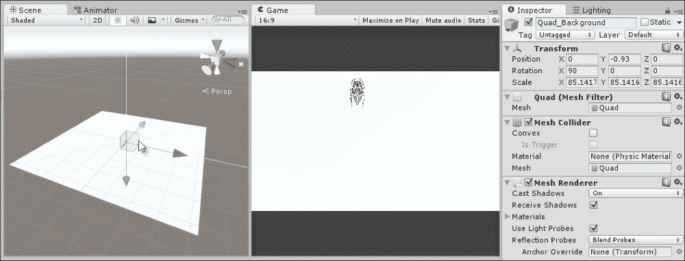

图 4.39：为关卡创建背景并构建四边形

现在，将**项目**面板中的太空纹理拖放到**场景**中的**四边形**上，将其作为材质应用。一旦分配，选择**四边形**，并在**对象检查器**中的材质属性中更改**平铺**设置。将**X**和**Y**平铺增加到`3`。见*图 4.40*：

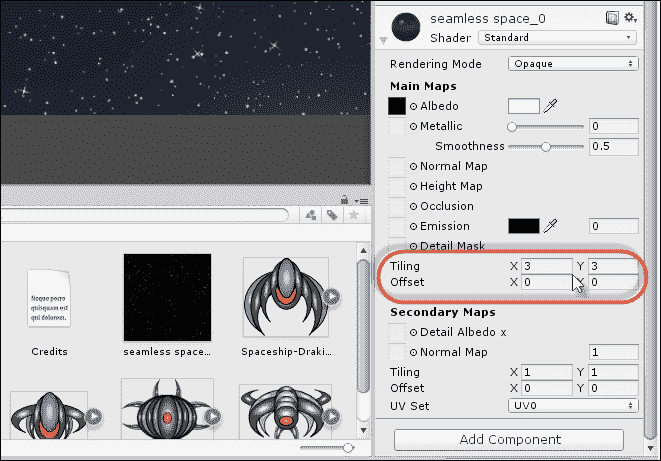

图 4.40：配置纹理平铺

如果纹理平铺看起来有问题，那么请务必检查纹理导入设置。为此，在**项目**面板中选择纹理，然后在**对象检查器**中，确保**纹理类型**设置为**纹理**，**包裹模式**设置为**重复**。见*图 4.41*：

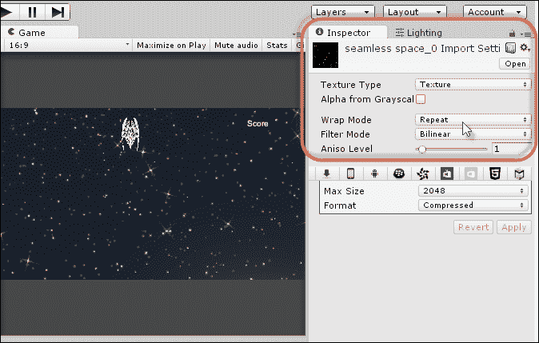

图 4.41：配置纹理以实现无缝平铺

现在关卡有了合适的背景。让我们添加一些背景音乐，它将循环播放。为此，首先在`音频`文件夹中的**项目**面板中选择音乐轨道。选择后，确保从**对象检查器**中设置音乐的**加载类型**为**流式传输**，并且禁用**预加载音频数据**。参见*图 4.42*。这提高了加载时间，因为 Unity 不需要在场景开始时将所有音乐数据加载到内存中。

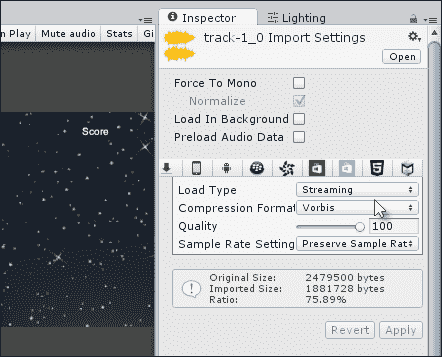

图 4.42：配置音频数据以准备播放

接下来，在场景中创建一个新的、空的**GameObject**，命名为`Music`，然后将`Music`轨道从**项目**面板拖放到`Music`对象中，添加它作为**音频源**组件。**音频源**组件播放声音效果和音乐。参见*图 4.43*：

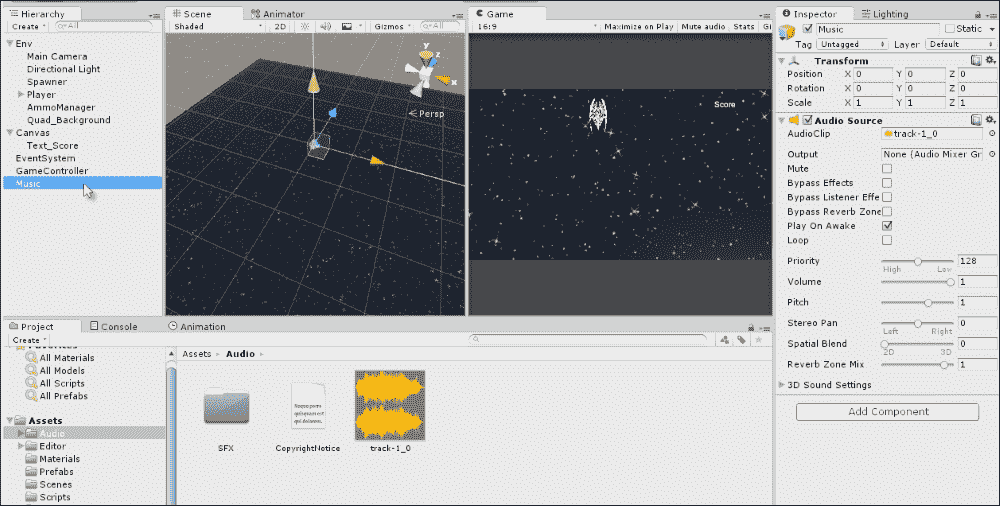

图 4.43：创建具有音频源组件的 GameObject

从**对象检查器**中的**音频源**组件，启用**播放唤醒**和**循环**复选框，以确保音乐从关卡开始播放并且无限循环，直到游戏运行结束。**空间混合**字段应设置为`0`，表示 2D。简而言之，2D 声音在整个关卡中保持一致的音量，不受玩家位置的影响。这是因为 2D 声音没有空间定位。相比之下，3D 声音用于枪声、脚步声、爆炸声和其他存在于 3D 空间中的声音，其音量应根据玩家在播放时距离它们的远近而变化。参见*图 4.44*：

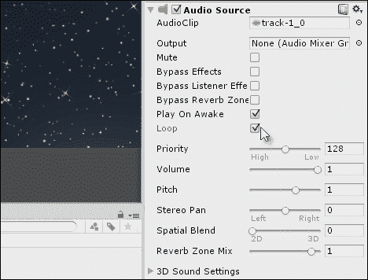

图 4.44：循环音乐轨道

现在，让我们对游戏进行测试运行！点击工具栏上的播放按钮并测试它。如果音乐没有播放，请检查**游戏**标签页上的**静音音频**按钮是否未启用。参见*图 4.45*：

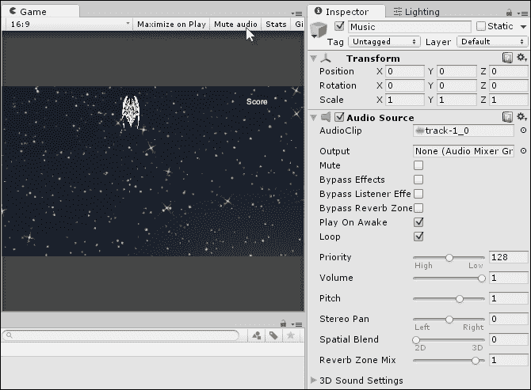

图 4.45：玩游戏 – 如有必要，禁用静音音频

# 测试和诊断

对于几乎所有游戏，你需要花费相当多的时间进行测试和调试，以尽可能减少错误和漏洞。使用这个示例程序，你需要进行的调试和测试非常少，但这并不是因为游戏很简单。这是因为我在将材料呈现给你之前，已经预先检查和测试了大部分代码和功能，确保你获得流畅的学习体验。然而，对于你自己的项目，你将需要进行大量的测试。一种开始的方式是使用**统计**面板。要打开它，点击**游戏**标签页上的**统计**按钮。参见*图 4.46*：

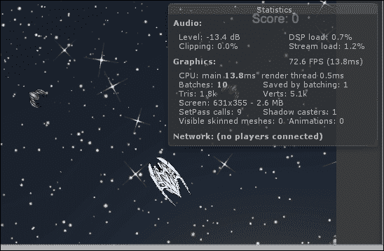

图 4.46：通过统计面板查看游戏性能信息

关于**统计信息**面板的更多细节包含在本书的第二章，*项目 A – 收藏品游戏的继续*中，更多信息可以在 Unity 文档的[`docs.unity3d.com/Manual/RenderingStatistics.html`](http://docs.unity3d.com/Manual/RenderingStatistics.html)在线找到。

另一个调试工具是**分析器**。当**统计信息**面板已经帮助你识别了一个一般问题，例如低帧率，而你想要进一步挖掘以找到问题可能所在的位置时，这很有用。关于**分析器**的更多细节将在第六章，*继续 2D 冒险*中介绍，但在这里简要介绍是值得的。要访问**分析器**工具，从应用程序菜单中选择**窗口** | **分析器**。这会显示**分析器**窗口。见*图 4.47*：

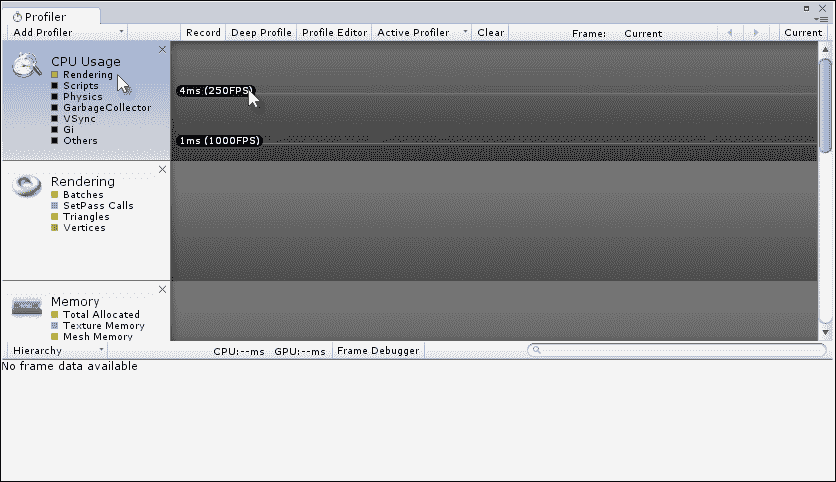

图 4.47：访问分析器窗口

在打开**分析器**窗口的情况下，点击工具栏上的播放按钮来测试你的游戏。当你这样做时，**分析器**窗口会填充上色编码的性能数据图表。见*图 4.48*。绿色代表渲染（图形）数据的性能。阅读和理解图表需要一些经验，但一般来说，要注意图表中的山峰和顶峰，即注意图表中的急剧波动（急剧上升和下降），因为这可能表明存在问题，尤其是在帧率下降时。

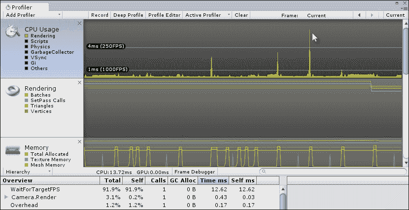

图 4.48：在游戏过程中，分析器窗口会填充数据

如果你想进一步调查，只需暂停游戏，然后在图表中点击。水平轴（*X* 轴）代表最近的帧，垂直轴代表工作量。当你点击图表时，会添加一个线标记来指示正在调查的帧。在图表下方，列出了该帧的所有主要进程，通常按工作量的轻重和占帧时间的比例从上到下排序。较重的进程列在顶部。见*图 4.49*：

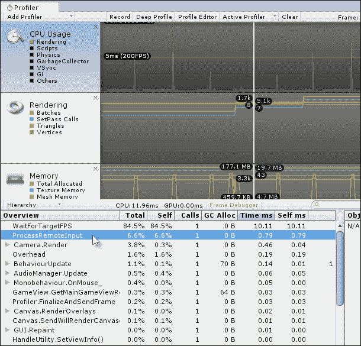

图 4.49：使用分析器调查性能数据

### 注意

关于**分析器**的更多信息可以在 Unity 在线文档的[`docs.unity3d.com/Manual/Profiler.html`](http://docs.unity3d.com/Manual/Profiler.html)找到。

# 构建

现在，最后，我们终于准备好将我们的游戏构建成独立的形式，准备发送给朋友、家人和测试人员！执行此操作的过程与第二章中详细描述的相同，*项目 A – 收集游戏继续*，以构建收集游戏。从应用程序菜单中选择**文件** | **构建设置**。从构建对话框中，通过简单地点击**添加当前**按钮将我们的关卡添加到关卡列表中。否则，从**项目**面板拖放关卡到关卡列表中。见*图 4.50*：

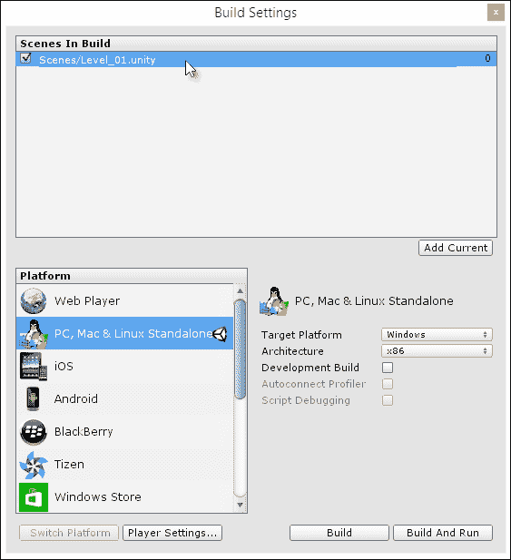

图 4.50：准备构建太空射击游戏

对于这个游戏，目标平台将是 Windows。因此，如果尚未选择，请从**平台**列表中选择**PC, Mac & Linux Standalone**选项。如果**切换平台**按钮（在左下角）未禁用，那么您需要按下此按钮，向 Unity 确认它应该为所选平台构建，而不是其他平台。然后，点击**构建并运行**按钮。点击此按钮后，Unity 会提示您选择一个文件夹，构建文件将输出并保存到该文件夹中。一旦生成，双击可执行文件以运行并测试。见*图 4.51*：

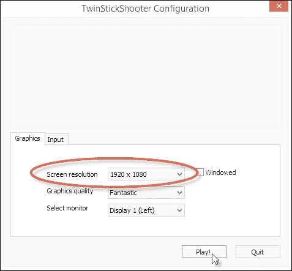

图 4.51：以标准 Windows 可执行文件运行游戏的测试

# 摘要

太棒了！我们现在真的在一条好路上，已经完成了两个坚实的 Unity 项目。第一个项目是一个收集游戏，第二个是一个双摇杆射击游戏。从本质上讲，这两个游戏都很简单，因为它们不依赖于高级机制或展示复杂的功能。然而，即使是非常复杂的游戏，当简化到其基本成分时，也可以发现它们建立在类似的基础概念之上，就像我们到目前为止所涵盖的那些。这就是为什么我们的项目对于深入理解 Unity 至关重要。接下来，我们将继续创建一个更注重 2D 的游戏，考虑界面、精灵和物理，以及更多内容！
