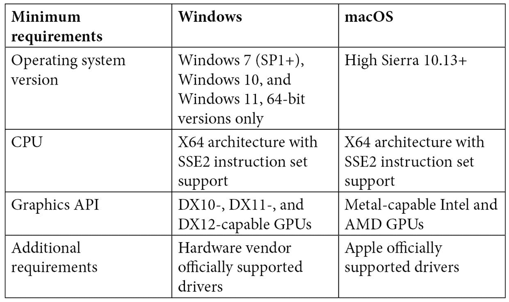

# 前言

*Unity 认证程序员：考试指南 – 第二版*将从一个基本的面向对象程序员开始，通过贯穿整个书籍的创意项目，介绍 Unity，实现考试的核心目标，这些目标可以用于 Unity 自己的官方程序员考试。

本书将带你（程序员）讨论考试本身，分解每个目标，以及你需要达到通过考试的标准。从那里，我们将讨论的一切都将与你从考试中可能遇到的问题有关。因此，我们将立即开始，并参考常见设计模式的概述以及所有程序员都需要了解的更多常见 SOLID 原则。在我们接触 Unity 之前，我们将先通过我们的游戏设计简报和自定义框架进行讨论。

安装 Unity 后，你将开始构建横版射击游戏的第一个步骤，并且在每个章节的开始，都会提醒你我们将要覆盖的核心目标以支持你。在几个章节之后，你还将通过一个迷你模拟考试来测试你的进展情况。

到本书结束时，你将创建一个可以在独立 PC 和/或支持键盘和触摸屏控制的 Android 设备上玩的游戏，你将驾驶宇宙飞船来对抗迎面而来的敌人。

早在*第二章*，*添加和操作对象*，你将已经编写了游戏的大部分代码，接下来我们将逐步介绍的章节将向你介绍 Unity 的工具和组件，例如专为电视/电影行业和游戏中的场景设计的 Timeline。你将涵盖粒子效果、应用于游戏对象的不同材质以使它们对光线做出反应、通过脚本操作音频混音器来淡入淡出声音、暂停游戏、在自定义脚本对象中存储值以及更多更多。

即使你没有参加 Unity 认证程序员考试，你也将制作一个可以继续开发、游玩和学习的游戏。

# 本书面向的对象

这本 Unity 引擎书籍是为游戏开发者、软件开发者、移动应用开发者和希望在其职业生涯中取得进步并获得游戏行业认证的 Unity 开发者所写。本书假设读者具备基本的 C#编程和 Unity 引擎知识。

# 本书涵盖的内容

*第一章**，设置和构建我们的项目*，介绍了考试中对你的期望，讨论了 SOLID 原则，并概述了设计模式。你还将通过查看其框架和版本控制来了解我们如何创建我们的游戏。

*第二章*，*添加和操作对象*，将帮助你开始编码和导入 3D 资产，以获得游戏基本功能的基础。

*第三章*，*管理脚本和进行模拟测试*，将游戏扩展到菜单屏幕，添加声音，添加评分系统，并以第一次模拟考试结束。

*第四章*，*应用艺术、动画和粒子*，专注于理解材质、动画纹理以及创建粒子系统。

*第五章*，*为我们的游戏创建商店场景*，介绍了商店场景以及如何使用 Unity 的射线投射系统，该系统发射不可见的射线以帮助识别游戏对象，并探讨了各种可脚本化对象的使用，以填充内容。

*第六章*，*购买游戏内物品和广告*，涵盖了使商店场景具有工作状态的游戏内平衡，以便购买升级，并介绍用户观看广告以获得额外的游戏内积分。到本章结束时，玩家将能够使用新武器进行射击，并从购买的盾牌中承受额外的敌人攻击。

*第七章*，*创建游戏循环和模拟测试*，涵盖了在屏幕间移动直到游戏循环回到开始以创建游戏循环，并以一个包含对已学材料的模拟测试问题的模拟测试结束。

*第八章*，*添加自定义字体和 UI*，使您更熟悉 Unity 的 2D 画布，通过应用图像组件和自定义字体以及动画每个级别的标题来为每个屏幕添加润色。

*第九章*，*创建 2D 商店界面和游戏内 HUD*，将商店场景从看起来更像原型转变为更加精致和功能化的界面，以支持各种屏幕宽高比。本章还介绍了游戏内的生命、地图和评分系统。

*第十章*，*暂停游戏、更改音效和模拟测试*，涵盖了为游戏每个级别创建暂停屏幕，这将提供更改游戏音量控制选项，以及退出和恢复游戏，之后是一个模拟测试，以检查您对本章知识的掌握。

*第十一章*，*存储数据和音频混音器*，利用 Unity 自带的 PlayerPrefs，并将其与 JSON 以及使用远程设置在云端存储数据进行比较。

*第十二章*，*NavMesh、时间轴和模拟测试*，介绍了一种新敌人，它试图使用 AI 逃离玩家，并探讨了使用 Unity 的动画工具时间轴将 Boss 动画引入场景，并扩展其功能以动画闪烁的灯光。本章末尾还有一个模拟测试，以查看事情进展得如何。

*第十三章*，*效果、测试、性能和替代控制*，讨论了利用碰撞体、`rigidbody`属性、视觉效果后处理、全局照明和反射探针。本章还探讨了进一步的游戏功能以支持移动控制，以及如何在 PC 和移动设备上构建和测试游戏。

*第十四章*，*完整的 Unity 程序员模拟考试*，包含超过 90 个问题，用于测试您从所有 13 章中学到的内容。答案可以在附录中找到。

# 为了充分利用本书

对 Unity 有一定的了解会有帮助，但不是必需的。需要具备 C#或任何其他面向对象编程知识的基本理解。在撰写本书时，Unity 考试基于 Unity 2020 LTS 版本。我们将在*第一章*，*设置和构建我们的项目*中介绍下载和安装软件的流程。如果你出于任何原因使用 Unity 的较新版本，那不应该有问题，除非本书提到版本之间可能存在差异。

# 系统要求

以下表格列出了 Unity 在您的系统上运行的要求。有关系统要求的更多信息，请查看以下链接：[`docs.unity3d.com/Manual/system-requirements.html`](https://docs.unity3d.com/Manual/system-requirements.html)。



# 下载示例代码文件

您可以从 GitHub 下载本书的示例代码文件，网址为[`github.com/PacktPublishing/Unity-Certified-Programmer-Exam-Guide-Second-Edition`](https://github.com/PacktPublishing/Unity-Certified-Programmer-Exam-Guide-Second-Edition)。如果代码有更新，它将在 GitHub 仓库中更新。

我们还提供了来自我们丰富的书籍和视频目录中的其他代码包，可在[`github.com/PacktPublishing/`](https://github.com/PacktPublishing/)找到。查看它们吧！

# 代码实战

本书的相关代码实战视频可以在[`bit.ly/3LslyB0`](https://bit.ly/3LslyB0)查看。

# 下载彩色图像

我们还提供了一份包含本书中使用的截图和图表的彩色图像 PDF 文件。您可以从这里下载：[`static.packt-cdn.com/downloads/9781803246215_ColorImages.pdf`](https://static.packt-cdn.com/downloads/9781803246215_ColorImages.pdf)。

# 使用的约定

本书使用了多种文本约定。

`CodeInText:` 表示文本中的代码单词、数据库表名、文件夹名、文件名、文件扩展名、路径名、虚拟 URL、用户输入和 Twitter 昵称。以下是一个示例：“Unity 包是一个包含各种可以在 Unity 中使用的资源的单个文件，其方式类似于`.zip`文件。”

代码块设置如下：

```cs
void Start()
{
       this.transform.localPosition = Vector3.zero; startPos   = transform.position;
       Distance();
}
```

从**层次结构**窗口中选择`GameManager`游戏对象，然后转到**检查器**窗口。

小贴士或重要注意事项

看起来像这样。

# 联系我们

我们始终欢迎读者的反馈。

**一般反馈**：如果您对本书的任何方面有疑问，请通过电子邮件联系我们 customercare@packtpub.com，并在邮件主题中提及书名。

**勘误**：尽管我们已经尽一切努力确保内容的准确性，但错误仍然可能发生。如果您在这本书中发现了错误，我们将不胜感激，如果您能向我们报告，我们将不胜感激。请访问 [www.packtpub.com/support/errata](http://www.packtpub.com/support/errata) 并填写表格。

**盗版**：如果您在互联网上遇到我们作品的任何形式的非法副本，我们将不胜感激，如果您能提供位置地址或网站名称，我们将不胜感激。请通过电子邮件联系我们 copyright@packt.com 并附上材料的链接。

**如果您有兴趣成为作者**：如果您在某个领域有专业知识，并且您有兴趣撰写或为书籍做出贡献，请访问[authors.packtpub.com](http://authors.packtpub.com)。

# 分享您的想法

一旦您阅读了 *Unity Certified Programmer Exam Guide Second Edition*，我们很乐意听到您的想法！请[点击此处直接进入此书的 Amazon 评论](https://packt.link/r/1-803-24621-9)页面并分享您的反馈。

您的评论对我们和科技社区都很重要，并将帮助我们确保我们提供高质量的内容。
