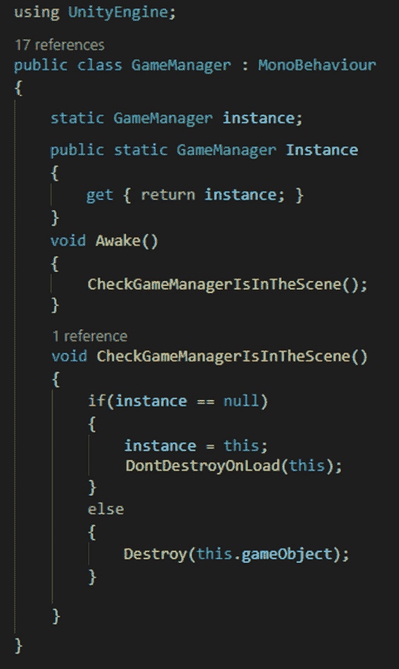
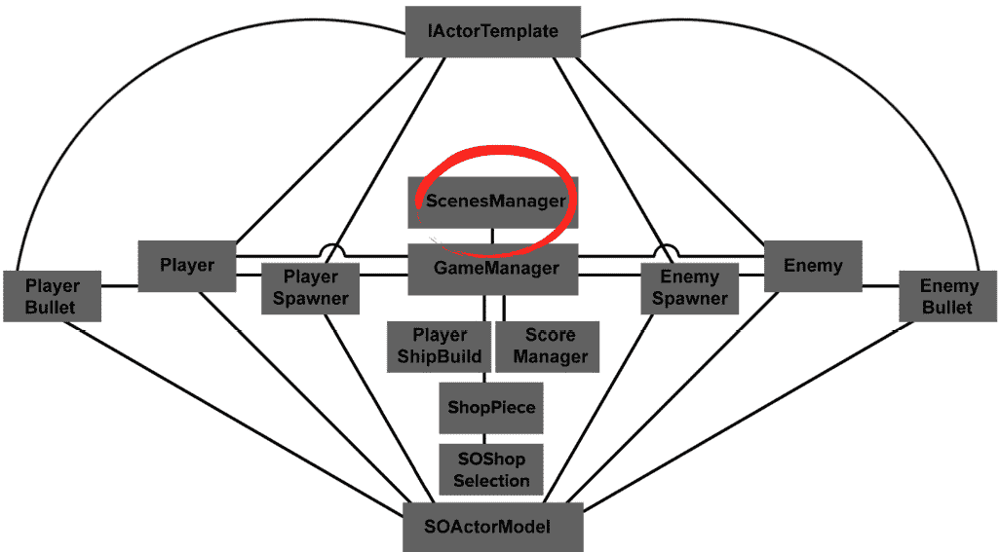
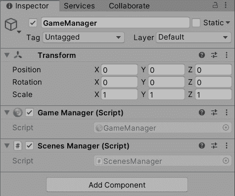
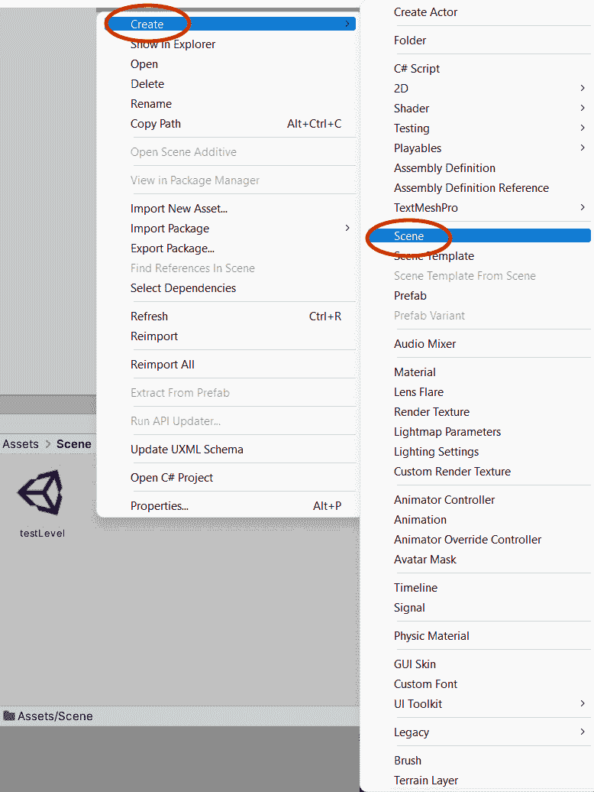
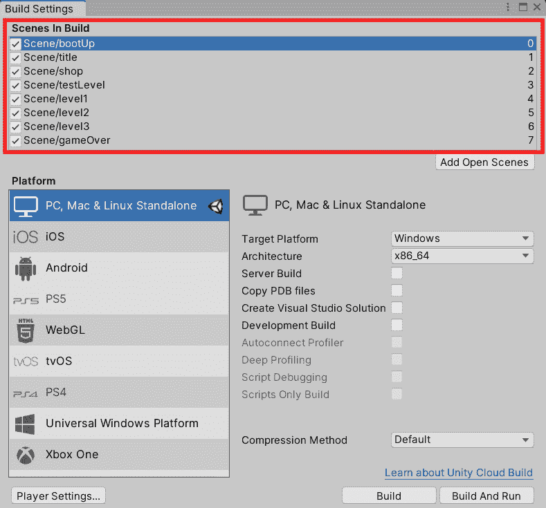
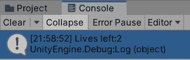
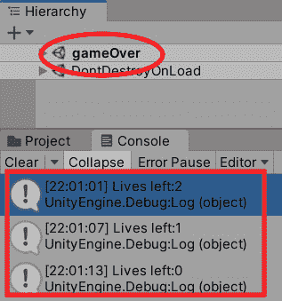
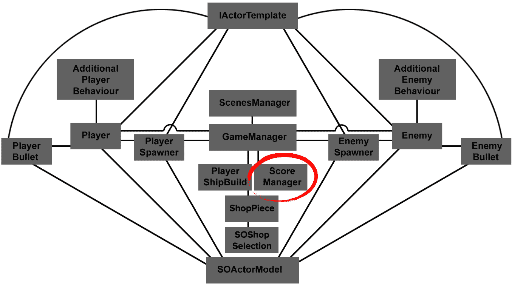
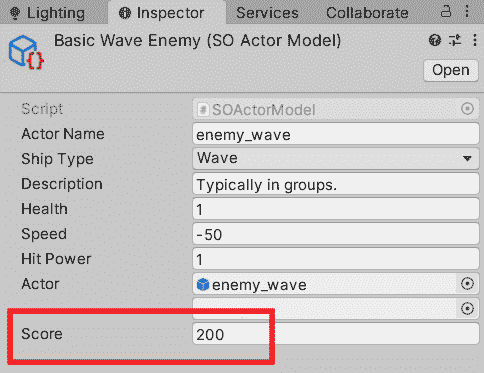
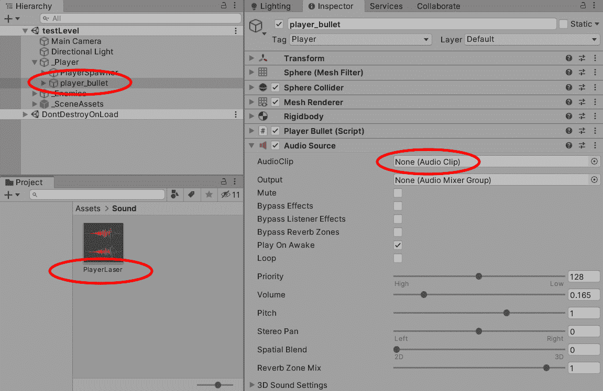

# 第三章：*第三章*：管理脚本和进行模拟测试

在本章中，我们将通过将 Singleton 设计模式应用到我们的`GameManager`脚本中来继续构建我们的游戏。这将允许我们的游戏在保持脚本管理器功能的同时进入另一个场景，并防止它们被清除（从而保留我们的数据）。然后我们将开始处理脚本的其他细节，并观察信息（如玩家的生命值）是如何通过游戏框架传递的。如果玩家死亡，生命值将减少。如果玩家失去所有生命值，将触发游戏结束场景。

我们将扩展我们的原始代码，并引入敌人得分点，这样当我们用子弹击中敌人时，敌人将像往常一样消失，同时也会生成得分。这种得分机制将由我们创建的新得分管理器来处理。

我们还将为玩家的子弹添加声音，这是一个简单的任务。这将使我们了解扩展和调整音频源，我们将在后面的章节中继续这一过程。

最后，我们将通过几个适合本书主题的问题来测试自己，为考试做准备。这些问题将涵盖我们已经学到的内容，如果你一直跟随本书学习，你将有很大机会通过考试。

到本章结束时，我们将扩展我们的游戏框架，为我们的游戏添加更多功能，并通过一些 Unity 考试问题来测试我们的知识。

在本章中，我们将涵盖以下主题：

+   添加**Singleton**设计模式

+   设置我们的`ScenesManager`脚本

+   为玩家创建生命值

+   记录敌人击中得分

+   为玩家的子弹创建声音

+   模拟测试

下一节将介绍本章涵盖的核心考试技巧。

# 本章涵盖的核心考试技巧

*编程核心交互*：

+   实现和配置游戏对象行为和物理

*编程场景和环境设计*：

+   确定实现音频资源的脚本

+   识别实现游戏对象实例化、销毁和管理的方法

*在专业软件开发团队中工作*：

+   认识到结构脚本以实现模块化、可读性和可重用性的技术

# 技术要求

本章的项目内容可以在[`github.com/PacktPublishing/Unity-Certified-Programmer-Exam-Guide-Second-Edition/tree/main/Chapter_03`](https://github.com/PacktPublishing/Unity-Certified-Programmer-Exam-Guide-Second-Edition/tree/main/Chapter_03)找到。

您可以下载每个章节的项目文件的全部内容，请访问[`github.com/PacktPublishing/Unity-Certified-Programmer-Exam-Guide-Second-Edition`](https://github.com/PacktPublishing/Unity-Certified-Programmer-Exam-Guide-Second-Edition)。

本章的所有内容都保存在章节的`unitypackage`文件中，包括一个包含我们在本章中将要执行的所有工作的`Complete`文件夹。

查看以下视频以查看*代码执行情况*：[`bit.ly/3xW4Zte`](https://bit.ly/3xW4Zte)。

# 添加单例设计模式

如您所回忆的，在*第一章，设置和构建我们的项目*中，我们讨论了设计模式及其对我们代码维护的有用性。我们简要介绍的设计模式之一是单例模式。我们不重复自己，单例模式为我们提供了全局访问代码的能力，然后我们可以在游戏中的某个点获取这些代码。那么，我们可以在哪里看到使用单例设计模式的益处呢？嗯，我们可以用它来确保 Unity 始终保持某些脚本的可访问性，无论我们处于哪个场景。我们已经为我们的游戏框架添加了很多结构，我们仍然需要添加几个管理脚本，例如`ScoreManager`和`ScenesManager`。

现在是给所有管理脚本提供对游戏中所有其他脚本的全局访问权限的好时机。管理脚本提供了对正在发生的事情的概述，并指导游戏需要走向何方，而不会陷入游戏过程中运行的脚本细节。

在我们的当前设置中，当我们运行`testLevel`场景时，我们的`GameManager`对象位于`GameManager`脚本中，它设置了场景的相机和灯光，现在不再存在。

为了防止我们的`GameManager`游戏对象和脚本被清除，我们将添加一个单例设计模式，这样我们的`GameManager`脚本将始终存在于场景中。这种设计模式还将确保只有一个`GameManager`脚本（这也是这种设计模式得名的原因）。

在以下说明中，我们将扩展我们的原始`GameManager`代码，使其作为一个单例脚本工作。双击`GameManager`脚本，让我们开始吧：

1.  在课程开始时，我们需要添加一个`static`变量和一个`public static`属性，它们都指向我们的`GameManager`脚本：

    ```cs
    static GameManager instance;
    public static GameManager Instance
    {
      get { return instance; }
    }
    ```

我们这样做的原因是`static`意味着只有一个类型的游戏管理器。这正是我们想要的；我们不希望有相同管理器的多个实例。

1.  接下来，我们需要在脚本开始时的`Awake`函数中检查并分配我们的`instance`变量到`GameManager`类。

`Awake`函数以 Unity 函数`DontDestroyOnLoad`结束。这将确保包含我们的`GameManager`类的游戏对象在场景改变时不会被销毁。

小贴士

如果玩家死亡并失去所有生命，我们可以从当前所在的关卡场景移动到`gameOver`场景，但不会从场景中清除`GameManager`游戏对象，因为这个对象包含了运行游戏的主要核心方法。

1.  添加一个`else`循环以防止出现任何可能的重复`GameManager`游戏对象。我们可以在以下代码块中看到这两个步骤：

    ```cs
      void Awake()
      {
        if(instance == null)
        {
          instance = this;
          DontDestroyOnLoad(this);
        }
        else
        {
          Destroy(this.gameObject);
        }

      }
    ```

1.  为了使我们的代码更容易识别，我们将刚刚输入的代码包裹在`Awake`函数中，并将其放入一个名为`CheckGameManagerIsInTheScene`的方法中。

1.  从`Awake`函数中调用该方法。

    提示

    与`DontDestroyOnLoad`类似的方法是`MoveGameObjectToScene`，它可以用来将单个游戏对象携带到另一个场景。这可以用于将玩家从一个场景移动到另一个场景：[`docs.unity3d.com/ScriptReference/SceneManagement.SceneManager.MoveGameObjectToScene.html`](https://docs.unity3d.com/ScriptReference/SceneManagement.SceneManager.MoveGameObjectToScene.html)。

就这样，我们的单例设计模式就完成了！以下截图显示了我们的`GameManager`脚本应该看起来像什么：

![图 3.1 – 在我们的 GameManager 脚本中的单例代码模式]



图 3.1 – 在我们的 GameManager 脚本中的单例代码模式

1.  最后，保存`GameManager`脚本。

我们创建了一个单例设计模式，它不会在我们游戏中的场景之间切换时被清除，无论我们在哪个场景中，都能给我们提供全局控制游戏的能力。

现在，我们可以开始添加`ScenesManager`脚本并将其附加到与`GameManager`相同的游戏对象（在其**检查器**窗口中）。

设置我们的场景管理器脚本

通过创建另一个管理脚本，我们将从`GameManager`脚本中分担一些责任，使其与它持有的数据和方法的保持一致性。`ScenesManager`将接收和发送信息到`GameManager`。以下图表显示了当只与`GameManager`通信时，我们的`ScenesManager`脚本在框架中与`GameManager`的接近程度：

![图 3.2 – ScenesManager 在 Killer Wave UML 中的位置]



图 3.2 – ScenesManager 在 Killer Wave UML 中的位置

`ScenesManager`的目的，除了减轻`GameManager`的工作负担外，还包括处理与创建或更改场景相关的任何内容。这并不意味着我们只关注添加和删除游戏关卡；一个场景还可以包括启动标志、标题屏幕、菜单和游戏结束屏幕，所有这些都是`ScenesManager`脚本责任的一部分。

在本节中，我们将设置一个场景模板和两个方法。第一个方法将负责在玩家死亡时重置关卡（`ResetScene()`）；第二个方法将是游戏结束屏幕（`GameOver()`）。

让我们以与*第二章**,* *添加和操作对象*相同的方式开始，创建一个新的脚本。按照以下步骤操作：

1.  将脚本命名为`ScenesManager`。

1.  将脚本添加到`GameManager`游戏对象中。如果您需要有关将脚本添加到游戏对象的更多详细信息，请查看上一章的*将我们的脚本添加到游戏对象*部分。

1.  从`GameManager`和`ScenesManager`脚本中选择`GameManager`游戏对象，如图下所示：





让我们打开`ScenesManager`脚本并开始编码：

1.  因为我们显然将要关闭和加载场景，所以我们需要在我们的`ScenesManager`脚本中导入一个额外的库来支持这些操作：

    ```cs
    using UnityEngine.SceneManagement;
    using UnityEngine;
    ```

1.  在我们的脚本中，我们将有一个公共类，后面跟着通常继承的`MonoBehaviour`：

    ```cs
    public class ScenesManager : MonoBehaviour
    {
    ```

现在，我们需要创建一个场景引用列表，正如之前提到的。我目前有以下场景标记：

+   `bootUp`：游戏信用

+   `title`：游戏名称，带有开始指令

+   `shop`：在开始游戏前购买升级

+   `level1`：第一级

+   `level2`：第二级

+   `level3`：最终级

+   `gameOver`：游戏结束—延迟直到返回标题场景

我们将把这些场景标记为枚举（在 C#语言中用`enum`表示）。这些值保持一致。

提示

如果您想了解更多关于枚举的信息，请查看[`docs.microsoft.com/en-us/dotnet/csharp/language-reference/keywords/enum`](https://docs.microsoft.com/en-us/dotnet/csharp/language-reference/keywords/enum)。

1.  将以下代码输入到`ScenesManager`脚本中：

    ```cs
      Scenes scenes;
      public enum Scenes
      {
        bootUp,
        title,
        shop,
        level1,
        level2,
        level3,
        gameOver
      }
    ```

我们将在本书后面的 Unity 编辑器中按顺序创建并添加这些场景。在我们这样做之前，让我们添加两个方法，从`ResetScene()`方法开始，这通常用于玩家死亡并且当前关卡重新加载时。另一个方法`GameOver()`通常在玩家失去所有生命或游戏完成时调用。

## 添加`ResetScene()`方法

当玩家失去一条生命但仍有剩余时，将会调用`ResetScene()`方法。在这个简短的方法中，我们将将其可访问性设置为`public`，并且它不返回任何内容（`void`）。

在这个方法中，我们将引用 Unity 的`SceneManager`脚本（不要与我们的`ScenesManager`类混淆），然后是 Unity 的`LoadScene`方法。我们现在需要提供一个参数来告诉`LoadScene`我们将加载哪个场景。

我们再次使用 Unity 的`SceneManager`脚本，但这次我们使用`GetActiveScene().buildIndex`，这基本上意味着获取场景的值编号。我们将这个场景编号发送到`SceneManager`以重新加载场景（`LoadScene`）：

```cs
  public void ResetScene()
  {
    SceneManager.LoadScene(SceneManager.GetActiveScene().    buildIndex);
  }
```

这是一个小巧但有效的方法，可以在我们需要场景重置时随时调用。现在，让我们继续到`GameOver()`方法。

## 添加`GameOver()`方法

如您所预期的那样，这个方法在玩家失去所有生命并且游戏结束时被调用，这意味着我们需要将玩家移动到另一个场景。

在这个方法中，我们继续向`ScenesManager`脚本中添加内容：

```cs
  public void GameOver()
  {
    SceneManager.LoadScene("gameOver");
  }
}
```

与之前的方法类似，我们将此方法称为 `public` 并具有 `void return` 返回类型。在方法内部，我们调用相同的 Unity 函数 `SceneManager.LoadScene`，但这次我们调用 `SceneManager` Unity 函数，然后通过名称调用我们想要加载的场景（在这种情况下，`gameOver`）。

更多信息

`SceneManager.LoadScene` 还提供了一个 `LoadSceneMode` 函数，它为我们提供了使用两个属性之一的选择。默认情况下，第一个属性是 `Single`，它关闭所有场景并加载我们想要的场景。第二个属性是 `Additive`，它将下一个场景添加到当前场景旁边。这在交换场景时可能很有用，例如加载屏幕，或者保持前一个场景的设置。有关 `LoadScene` 的更多信息，请参阅 [`docs.unity3d.com/ScriptReference/SceneManagement.LoadSceneMode.html`](https://docs.unity3d.com/ScriptReference/SceneManagement.LoadSceneMode.html)。

我们的 `GameOver()` 方法已经制作完成，并且当以与我们的 `ResetScene()` 方法相同的方式使用时，它可以全局调用。`GameOver()` 不仅可以在玩家失去所有生命时调用，也可以在用户完成游戏时调用。如果游戏意外崩溃，它也可以用作默认的重置，我们将进入 `gameOver` 场景。

接下来要添加到 `ScenesManager` 脚本中的方法是 `BeginGame()`。当我们需要开始玩游戏时，将调用此方法。

## 添加 `BeginGame()` 方法

在本节中，我们将向 `ScenesManager` 脚本添加 `BeginGame()` 方法，因为这将在我们访问 `shop` 场景后调用，我们将在 *第五章**，* *为我们的游戏创建商店场景* 中介绍。

在上一节中仍然打开的 `ScenesManager` 脚本中，添加以下方法：

```cs
   public void BeginGame()
  {
    SceneManager.LoadScene("testLevel");
  }
```

我们刚刚输入的代码直接调用以运行 `testLevel` 场景，这是我们玩游戏的地方。然而，随着我们的游戏开始增长，我们将使用多个场景。

下一步是创建我们的场景并将它们添加到 Unity 构建菜单中，所以让我们继续这样做。记得在返回 Unity 编辑器之前保存 `ScenesManager` 脚本。

将场景添加到我们的构建设置窗口

我们的游戏将包含多个场景，玩家需要在这些场景中导航，然后才能通过关卡飞行他们的宇宙飞船。这将导致他们死亡或完成每个关卡和游戏，然后被带回到 `title` 场景。这也被称为游戏循环。让我们回到 Unity，在项目窗口中创建和添加我们的新场景。按照以下步骤操作：

1.  前往我们在上一章开头创建的 `Assets/Scene` 文件夹。

1.  在 **Scene** 文件夹内部，在空白区域右键单击，以便出现下拉菜单，然后点击 **Create**，接着点击 **Scene**，如以下截图所示：



图 3.4 – 在 Unity 编辑器中创建一个空场景

1.  将出现一个场景文件。将其重命名为`bootUp`。

1.  对`shop`、`level1`、`level2`、`level3`、`gameOver`和`title`场景文件重复此过程。

一旦我们制作了所有场景，我们需要让 Unity 知道我们希望这些场景被识别并应用于项目构建顺序。这与我们在上一章中向**构建设置**窗口添加`testLevel`时的过程类似。要将其他场景应用到列表中，请执行以下操作：

1.  从 Unity 编辑器的顶部，点击**文件** | **构建设置**。

1.  列表中已经有`testLevel`。如果没有，请不要担心，我们将在**场景在构建**列表中添加所有我们的场景。

1.  从**项目**窗口，点击并拖动每个场景到**构建设置 | 场景** **在** **构建**开放空间中。

一旦我们添加了所有场景，按照以下顺序排列它们：

+   `bootUp`

+   `title`

+   `shop`

+   `testLevel`

+   `level1`

+   `level2`

+   `level3`

+   `gameOver`

    提示

    注意，每个场景默认在其**层次**窗口中都有一个相机和一盏灯。这很好，我们将在本书的后面部分对其进行自定义。

**构建设置**窗口现在应该如下所示：



图 3.5 – 构建设置当前场景在构建列表中的顺序

我们将场景按此顺序放置的原因是为了使层级之间有一个逻辑上的递进。如图 3.4 中所示，您可以看到每个场景的右侧，场景是按增量计算的。因此，第一个要加载的场景将是`bootUp`场景。

现在我们已经为游戏添加了多个场景，我们可以考虑这样一个事实：我们可能不希望我们的`GameManager`方法中的相机和灯光设置方法在游戏的每个场景中运行。让我们简要回顾一下我们的`GameManager`脚本，并更新我们的`LightSetup`和`CameraSetup`方法，以及一些其他内容。

#### 更新我们的`GameManager`脚本

在本节中，我们将回到`GameManager`脚本，并使其在控制我们的宇宙飞船时调用`CameraSetup`和`LightSetup`方法。

为了更新我们的`GameManager`脚本以支持各种场景的灯光和相机，我们需要执行以下操作：

1.  在 Unity 编辑器中，从**项目**窗口导航到`Assets/Script`。

1.  在`GameManager`脚本中，向下滚动到`Start`函数，并移除`LightSetup();`和`CameraSetup();`方法。

1.  接下来，我们将在`GameManager`脚本的顶部输入两个静态全局变量，与其它全局变量一起：

    ```cs
    public static int currentScene = 0;
    public static int gameLevelScene = 3;
    bool died = false;
    public bool Died
    {
     get {return died;}
     set {died = value;}
    }
    ```

`currentScene`是一个整数，它将保持当前场景的编号，我们将在以下方法中使用它。第二个变量`gameLevelScene`将保存我们玩的第一级，我们将在本章后面使用它。

1.  仍然在 `GameManager` 脚本中，创建一个 `Awake` 函数并输入以下代码：

    ```cs
    void Awake()
    { 
        CheckGameManagerIsInTheScene();
        currentScene = UnityEngine.SceneManagement.SceneManager.
            GetActiveScene().buildIndex;
        LightAndCameraSetup(currentScene);
    }
    ```

在我们刚刚输入的代码中，我们将 `buildIndex` 数字（上一节中从我们的 Build Settings 窗口中每个场景右侧的数字）存储在 `currentScene` 变量中。然后我们将 `currentScene` 的值发送到我们新的 `LightandCameraSetup` 方法。

1.  我们需要添加到 `GameManager` 脚本中的最后一部分代码是 `LightandCameraSetup` 方法，它接受一个整型参数：

    ```cs
      void LightAndCameraSetup(int sceneNumber)
      {
        switch (sceneNumber)
        {
          //testLevel, Level1, Level2, Level3
          case 3 : case 4 :case 5: case 6:
          {
            LightSetup();
            CameraSetup();
            break;
          }
        }
      }
    ```

在我们刚刚编写的代码中，我们运行了一个 `switch` 语句来检查 `sceneNumber` 变量的值，如果它落入 `3`、`4`、`5` 或 `6` 的值，我们将运行 `LightSetup` 和 `CameraSetup`。

1.  保存 `GameManager` 脚本。

反思这一部分，我们创建了一个空场景的结构，每个场景都将在我们游戏中发挥其作用。我们还创建了一个 `ScenesManager` 脚本，当玩家获胜或死亡时，它将重置场景，或者移动到游戏结束场景。

现在我们已经设置了场景并构建了 `ScenesManager` 脚本的开始，我们可以专注于玩家的生命系统。

# 为玩家创建生命

在本节中，我们将使玩家拥有一定数量的生命。如果玩家与敌人碰撞，玩家将死亡，场景将重置，并从玩家那里扣除一条生命。当所有生命都耗尽时，我们将引入游戏结束场景。

在本节中，我们将使用以下脚本：

+   `GameManager`

+   `SceneManager`

+   `Player`

让我们先回顾一下 `GameManager` 脚本，并设置给予和扣除玩家生命的功能：

1.  打开 `GameManager` 脚本并输入以下代码：

    ```cs
    public static int playerLives = 3;
    ```

在脚本顶部，在输入类和继承之后，输入一个 `static`（意味着只有一个）整型变量 `playerLives`，并赋予其值 `3`。

接下来，我们需要为 `GameManager` 脚本创建一个新的方法，以确保玩家失去一条生命。在我们创建这个新方法之后，`Player` 脚本将在与敌人接触时调用它。

让我们继续我们的 `GameManager` 脚本。

1.  要创建 `LifeLost` 方法，在我们的 `GameManager` 类中输入以下代码：

    ```cs
     public void LifeLost()
    {
    ```

我们需要这个方法是一个 `public` 方法，以便可以从脚本外部访问。它被设置为 `void`，意味着该方法不返回任何内容，并且后面跟着方法名，括号内为空，因为它不接受任何参数。

1.  因此，在 `LifeLost()` 方法中，我们将使用以下代码的 `if` 语句检查玩家的生命值：

    ```cs
        //lose life
        if (playerLives >= 1)
        {
          playerLives--;
          Debug.Log("Lives left: "+playerLives);
          GetComponent<ScenesManager>().ResetScene();
        }
    ```

在审查了我们输入的`if`语句代码后，我们将通过添加注释来开始，以便让我们或其他开发者知道这个条件正在做什么（`//lose life`）。然后我们将添加`if`语句条件，检查玩家是否剩下至少一条生命。如果玩家确实还有一条或多条生命，我们将使用`--`运算符从玩家的生命值中减去 1，这仅仅是一种更快地说`playerLives = playerLives - 1;`的方式。

在扣除玩家生命值之后的代码行是不必要的，但它将在 Unity 编辑器的**控制台**窗口中通知我们，通过一个信息框告诉我们玩家剩余多少生命（用于调试目的），如下面的截图所示：



图 3.6 – 控制台窗口显示玩家剩余的生命数

在`ScenesManager`脚本中显示玩家剩余生命数之后，该脚本附加到`GameManager`游戏对象。我们可以使用`GetComponent`来访问`ScenesManager`脚本的`ResetScene`方法，这将重置我们的场景。

1.  我们现在将进入`else`条件，这表示玩家已经死亡：

    ```cs
        else
        {
          playerLives = 3;
          GetComponent<ScenesManager>().GameOver();
        }
    }
    ```

如果我们的玩家没有剩余生命，这意味着`if`语句条件没有满足，因此我们可以提供一个`else`条件。在我们的`else`语句范围内，我们将玩家的生命值重置为`3`。

我们然后从`ScenesManager`类中访问`GameOver()`方法，这将带我们从当前场景跳转到`gameOver`场景。

最后，我们现在需要做的是让我们的`Player`脚本在玩家与敌人或敌人的子弹碰撞时调用`LifeLost`方法：

1.  保存`GameManager`脚本。

1.  从`Player`脚本（`Assets/Script`）开始。

1.  滚动到其`Die`方法。

1.  从`Destroy(this.gameObject);`这一行开始，输入以下代码：

    ```cs
    GameManager.Instance.LifeLost();
    ```

注意，我们可以直接通过使用`GetComponent`等代码调用`GameManager`脚本，而无需在场景中找到游戏对象来获取脚本。这是使用 Singleton 设计模式的强大之处，可以直接调用`LifeLost`方法。

1.  保存`Player`脚本。

1.  在 Unity 编辑器中按**Play**键并碰撞敌人。

在`testLevel`中将等级重置为`gameOver`的消息。

以下截图显示了从`testLevel`到`gameOver`场景的转换：



图 3.7 – 玩家生命值减少和加载游戏结束场景

通过最少的代码，我们现在让我们的玩家拥有一定数量的生命。我们向游戏框架中引入了一个`ScenesManager`脚本，该脚本直接与`GameManager`通信，无论重启和更改场景。

作为旁注，您可能已经注意到，当我们切换到`gameOver`场景时，我们的`GameManager`游戏对象被带到了`gameOver`场景中。如果您还记得*添加 Singleton 设计模式*部分，我们设置了`CheckGameManagerIsInTheScene`方法，该方法在`Awake`函数中被调用。这意味着仅仅因为我们处于不同的场景，并不意味着`Awake`函数会被再次调用。

信息

记住，`Awake`函数只有在脚本激活时才会运行，并且只会运行一次，即使脚本附加到游戏对象并通过场景传递。

这是因为我们的`gameOver`场景只把`GameManager`游戏对象带到了`gameOver`场景中。它没有被激活，这意味着`Awake`函数没有被调用。

我们有我们基本的生命和场景结构，并且我们也使用了**控制台**窗口来帮助我们确认变化。

在我们继续之前，您可能会注意到，当玩家死亡时，场景中的灯光会变暗。以下截图展示了我的意思：


图 3.8 – 游戏中的灯光变暗

如您在前面的截图中所见，左边是我们开始时的场景，右边是玩家死亡时的场景。为了解决这个问题，我们只需要手动生成我们的灯光，而不是让 Unity 自动生成。

为了防止我们的灯光在场景之间变暗，我们需要做以下事情：

1.  在 Unity 编辑器的顶部，点击**窗口** | **灯光** | **设置**。

1.  **灯光设置**窗口将出现。在窗口底部，取消选中**自动生成**，然后点击旁边的按钮，**生成灯光**。以下截图供您参考：


图 3.9 – 未选中的自动生成框和生成灯光按钮

1.  这将需要一点时间，因为 Unity 将设置新的灯光设置。一旦完成，保存 Unity 项目，应该就能解决这个问题。

注意，我们可能需要在本书后面的其他场景中手动设置灯光，例如其他关卡和`shop`场景。

让我们现在将注意力转向敌人，并添加一些功能，以便当它被玩家摧毁时，我们可以将分数添加到`ScoreManager`中，这是一个我们将要制作的新的脚本。

# 记分敌人击中

就像大多数游戏一样，我们需要一个计分系统来显示玩家在游戏结束时的表现。通常，在侧滚动射击游戏中，玩家每击杀一次都会得到奖励。如果我们转向我们的游戏框架图，我们可以看到`ScoreManager`与`GameManager`连接，就像`ScenesManager`一样：



图 3.10 – 杀手波 UML

我们添加评分系统的代码将再次是最小的。我们还想保持灵活性，以便不同的敌人有不同的得分。我们还希望，当我们向游戏中添加具有不同得分点的另一个敌人时，我们可以避免每次都更改我们的代码。

在本节中，我们将使用以下脚本：

+   `EnemyWave`

+   `ScoreManager`

+   `ScenesManager`

+   `SOActorModel`

由于评分系统是我们游戏的一个关键因素，因此向 `SOActorModel` 添加一个简单的整数，将其常用值注入到我们的游戏对象中是有意义的。这种趋势将继续应用到其他脚本中。在我们引入 `ScoreManager` 之前，让我们先在我们的已制作脚本中添加一些代码。

## 准备 `ScoreManager` 脚本的代码

如果你还记得 *第一章*，*设置和构建我们的项目*，我们讨论了 SOLID 原则以及将代码添加而不是更改的重要性，否则我们可能会出错，我们的代码可能会开始变异，最终变得不再适合使用。为了准备，我们将向已经制作的脚本中添加代码，以便将 `ScoreManager` 脚本放置到位。让我们首先从 `SOActorModel` 开始。按照以下步骤操作：

1.  从 **项目** 窗口中打开 `SOActorModel` 脚本。

1.  在 `SOActorModel` 脚本中的变量列表中的任何位置，添加以下代码，该代码将用于包含敌人的分数：

    ```cs
    public int score;
    ```

1.  保存 `SOActorModel` 脚本。

在我们向其他脚本添加更多代码以将 `ScoreManager` 放入游戏之前，我们需要承认我们已经更改了我们的 `ScriptableObject` 模板。

让我们在 Unity 编辑器中检查我们的 `BasicWave Enemy` 可脚本对象。按照以下步骤操作：

1.  从 `Assets/ScriptableObject` 文件夹。

1.  在 **BasicWave Enemy** 上单击一次，你将看到 **检查器** 窗口有一个 **Score** 输入字段。

1.  给 `BasicWave Enemy` 赋予你选择的值。我给它赋值为 `200`。只要它大于 `0`，你赋予什么值都无关紧要。以下截图显示了带有更新后的 **Score** 值的 **BasicWave Enemy** 部分：



图 3.11 – 添加了敌人波分的属性和值

我们已经更新了 `BasicWave Enemy` 可脚本对象。现在我们需要关注 `EnemyWave` 脚本来创建和接收这个新变量。

1.  打开 `EnemyWave` 脚本。

1.  在脚本顶部，我们有 `health`、`travelSpeed` 和其他全局变量，向列表中添加一个额外的变量：

    ```cs
    int score;
    ```

我们现在需要更新 `score` 变量，从 `ScriptableObject` 值中获取。

1.  在 `EnemyWave` 脚本中，向下滚动直到找到 `ActorStats` 方法，然后添加以下额外的代码行：

    ```cs
    score = actorModel.score;
    ```

`EnemyWave` 脚本现在有一个 `score` 变量，其值由 `SOActorModel` 给定。我们需要做的最后一件事是在敌人因玩家的行动而死亡时将分数值发送到 `ScoreManager`。在我们这样做之前，让我们创建并编写我们的 `ScoreManager` 脚本。

## 设置我们的 ScoreManager 脚本

`ScoreManager` 脚本的目的是在玩家游戏过程中累计分数，直到他们到达 `gameOver` 场景。我们也可以给 `ScoreManager` 脚本添加其他与分数相关的功能，例如将我们的分数数据存储在玩游戏设备上，或者将分数数据发送到服务器以创建在线排行榜。现在，我们将保持简单，只收集玩家的分数。

我们可以创建并添加我们的 `ScoreManager` 脚本到游戏框架中，如下所示：

1.  创建并附加一个名为 `ScoreManager` 的脚本到 `GameManager` 游戏对象，类似于我们之前对 `ScenesManager` 所做的那样。

如果你不记得如何做这个，那么请查看本章的 *设置我们的 ScenesManager 脚本* 部分。以下截图显示了 `ScoreManager` 在 **检查器** 窗口中附加到 `GameManager` 游戏对象：

![Figure 3.12 – 将 ScoreManager 脚本添加到 GameManager 游戏对象]

![img/Figure_3.12_B18381.jpg]

Figure 3.12 – 将 ScoreManager 脚本添加到 GameManager 游戏对象

接下来，我们将打开 `ScoreManager` 脚本并添加代码来保存和发送分数数据。打开 `ScoreManager` 脚本并输入以下代码：

```cs
using UnityEngine;
```

如前所述，默认情况下，我们需要 `UnityEngine` 库。

1.  继续通过检查并输入班级名称：

    ```cs
    public class ScoreManager : MonoBehaviour
    {
    ```

这是一个公开的类，`ScoreManager` 继承自 `MonoBehaviour` 以增加脚本的函数性。

1.  接下来，我们在脚本中添加我们的变量和属性。我们唯一关心的值是 `playerScore`，它是脚本私有的（因为我们不希望其他类访问它）。这个变量也被设置为 `static`，这意味着我们不需要对这个变量的重复引用。

在此基础上，我们添加我们的 `public` 属性，它允许外部类访问 `playerScore` 变量。正如你将注意到的，`PlayerScore` 属性返回一个整数。在这个属性中，我们使用 `get` 访问器返回我们的私有 `playerScore` 整数。保持我们的变量私有是一个好习惯，否则你可能会将你的代码暴露给其他类，这可能导致错误。以下代码显示了如何完成此步骤：

```cs
    static int playerScore;
    public int PlayersScore 
    {
        get
        {
            return playerScore;
        }
    }
```

访问器

要了解更多关于访问器的信息，请查看[`docs.microsoft.com/en-us/dotnet/csharp/language-reference/keywords/get`](https://docs.microsoft.com/en-us/dotnet/csharp/language-reference/keywords/get)。

1.  现在我们将转到`SetScore`方法；它是一个公共方法，不返回任何值（`void`），`SetScore`名称接受一个名为`incomingScore`的整数参数。在此方法中，我们使用`incomingScore`将`playerScore`脚本（作为其总分）相加：

    ```cs
      public void SetScore(int incomingScore)
        {
            playerScore += incomingScore;
        }
    ```

1.  最后要添加的方法是`ResetScore`方法。输入以下代码：

    ```cs
     public void ResetScore()
      {
        playerScore = 00000000;
      }
    }
    ```

我们可以在游戏开始或结束时调用此方法，以防止分数延续到下一场游戏。

1.  保存脚本。

如前所述，我们现在可以回到`EnemyWave`脚本，将敌人的分数点值发送到`ScoreManagers`方法的`SetScore`，从而将其添加到玩家的总分数中：

1.  从 Unity 函数`OnTriggerEnter`打开`EnemyWave`脚本。

1.  在标记为`if (health <= 0)`的`if`语句的作用域内，在其作用域顶部输入以下代码行：

    ```cs
    GameManager.Instance.GetComponent<ScoreManager>().SetScore(score);
    ```

当这个特定的敌人因玩家而死时，此代码行将直接将敌人的`score`值发送到`playerScore`变量，并增加其总分数，直到玩家失去所有生命。

1.  最后，为了确认分数是否正确累加，让我们像之前在`GameManager`脚本的`LifeLost`方法中对`playerLives`整数所做的那样操作，并在**控制台**窗口中添加一个`Debug.Log`消息。

1.  在`ScenesManager`脚本下的`GameOver()`方法中，在其作用域顶部添加以下代码行：

    ```cs
    Debug.Log("ENDSCORE: " +
      GameManager.Instance.GetComponent<ScoreManager>
         ().PlayersScore);
    ```

此代码将告诉我们玩家得分多少，因为它直接访问`ScoreManager`并在游戏结束时获取`PlayerScore`属性。以下截图显示了总分的一个示例：

![Figure 3.13 – Game over score value displayed in the Console window]

![img/Figure_3.13_B18381.jpg]

图 3.13 – 在控制台窗口中显示的游戏结束分数值

1.  最后，保存所有脚本。

在本节中，我们介绍了`ScoreManager`脚本及其基本工作结构，用于汇总我们的最终分数并在**控制台**窗口中显示最终计数。我们还向一些脚本添加了更多代码，而没有删除或更改它们的内容。接下来，我们将做一些不同的事情，这不需要任何编码，但会使我们更熟悉 Unity 的声音组件。

# 为玩家的子弹创建声音

到目前为止，我们的游戏一直是静音的，但声音是任何游戏中的重要因素。在本节中，我们将介绍我们的第一个声音组件。我们将从为玩家开火时创建声音效果开始。

如果您愿意，可以添加您自己的子弹声音类型。您可以通过以下方式为玩家的标准子弹添加声音：

1.  在 Unity 编辑器中，导航到`Resources`文件夹。将新文件夹命名为`Sound`。

1.  将**项目**面板中的`Player_Bullet`预制体拖放到**层次**面板中。

1.  在选择`Player_Bullet`的情况下，点击**添加组件**按钮在**检查器**面板中。

1.  在下拉菜单中开始键入（并选择）`音频源`。

1.  将`PlayerLaser.mp3`文件拖放到选中的`Player_Bullet`中。左下角的音频文件需要拖放到右侧的**音频源**组件中：

![图 3.14 – 在检查器窗口中将音频文件添加到 Player_Bullet 的音频源游戏对象]

检查器窗口



图 3.14 – 在检查器窗口中将音频文件添加到 Player_Bullet 的音频源游戏对象

1.  当`Player_Bullet`被实例化时，声音将播放。

1.  如果音量太高，只需在**检查器**窗口的**音频源**组件中将其降低。

    信息

    除了**音频源**组件中的**音量**选项外，还有**音调**来改变子弹的声音，以及**立体声平衡**来使声音在左或右扬声器中更加突出。最后，因为这是一个二维游戏，我们不希望声音受到我们的摄像头与子弹距离的影响。因此，我们将**空间混合**切换滑到最左边，以确保它不会受到其距离的影响。

1.  最后，点击`Player_Bullet`预制体，并在**层次结构**窗口中移除子弹。

1.  播放场景并开始射击。你会听到激光声，在场景视图中，你会看到现在附加到玩家子弹的扬声器符号。

这就结束了关于音频的简短部分，但在这本书中我们还会更多地涉及音频。别忘了，如果你在任何地方遇到困难，请检查本章的`Complete`文件夹，比较场景和代码，以确保没有遗漏。

# 摘要

在本章中，我们通过扩展`GameManager`脚本来扩展和加强我们的游戏框架结构，通过扩展其代码。这意味着无论场景如何变化，它都不会被删除。我们还引入了得分和场景管理器，这些最初都计划在我们的游戏框架中。这两个额外的管理器从游戏管理器那里接管了责任，并为你的游戏添加了额外的功能。我们确保这些脚本不会破坏我们的原始代码（删除、溢出或补偿我们的游戏管理器）。现在你的游戏有一个工作得分系统，以及多个可以重新启动和更改的场景，而且代码非常少。我们还引入了声音，我们将在后面的章节中更详细地实现。

在下一章中，我们将减少对代码密集型内容的关注，而是关注游戏的艺术。尽管我们是程序员，但我们需要了解如何使用 Unity 的 API 操作资源以及如何进行动画。只需一点点的编码，这将使我们能够理解编辑器和我们的脚本之间的联系。我们还将涉及一些粒子效果。

干得好——你已经做了很多。在我们继续之前，尝试以下问题。这些问题类似于你将在程序员考试中遇到的问题。

# 模拟测试

这是您的第一次迷你模拟测试。这些测试代表了您的最终 Unity 考试的各个部分。这次迷你模拟测试只包含五个问题。稍后在这本书中，我们将介绍包含更多问题的更多迷你模拟测试。

幸运的是，您将只会被测试到我们迄今为止所覆盖的内容：

1.  您被要求开发一款恐怖生存游戏，其中玩家依赖口袋手电筒。以下是您迄今为止编写的代码：

    ```cs
    void Start()
    {
        Light playersTorch = GetComponent<Light>();
        playersTorch.lightMapBakeType = LightMapBakeType.    Mixed;
        playersTorch.type = LightType.Area;
        playersTorch.shadows = LightShadows.Soft;
        playersTorch.range = 5f;
    }
    ```

您会注意到，玩家的手电筒没有投射任何光线或阴影。您应该更改哪些代码才能使其按预期工作？

1.  将`playersTorch.lightBakeType`设置为`LightmapBakeType.Realtime`。

1.  将`playersTorch.range`设置为`10`。

1.  将`playersTorch.shadows`设置为`LightShadows.Hard`。

1.  将`playersTorch.type`设置为`LightType.Point`。

1.  您已经开始创建您的第一款独立游戏，超级摩托车赛车 64。您已经编写了代码以使操纵杆工作，并开始测试您的摩托车在弯道上的表现。您已经注意到，在绕过第一个弯道后，即使您已经松开了操纵杆，摩托车仍然继续转弯。

您检查了您的代码和操纵杆，它们似乎都运行良好，这表明问题出在输入管理器上。

您应该在输入管理器中做出什么更改？

1.  增加重力。

1.  将`Snap`设置为`true`。

1.  增加`Deadzone`。

1.  减少`Sensitivity`。

1.  您已经开始使用纸笔制作游戏框架的模板。您已经绘制了几个将导致创建单个`GameManager`脚本的经理脚本。您只需要一个`GameManager`脚本，它将始终存在于您的场景中。

哪种设计模式适合在持久实例角色中使用`GameManager`脚本？

1.  原型

1.  抽象工厂

1.  单例

1.  构建者

1.  您已被要求创建一个侧滚动游戏的原型，其中玩家向敌人投掷石头。游戏运行良好，摄像头从左向右移动，直到关卡结束。要投掷石头，您的代码实例化一个石头的预制体，然后给予一个力（`Rigidbody.AddForce`）以使石头飞出，从而产生石头被投掷的错觉。

您的主开发人员表示，您的方法在内存性能上花费太多，并希望您使用设计模式在石头数组中存储最多 10 块石头。一旦石头被使用，而不是被销毁，它应该返回到数组中。

开发人员指的是哪种设计模式？

1.  抽象工厂

1.  对象池

1.  依赖注入

1.  构建者

这就是你的第一次迷你模拟测试的结束。要检查你的答案，请参考本书后面的*附录*部分。你做得怎么样？为了复习任何错误的答案，我建议你翻回到最后几章的相关部分，并在需要的地方刷新你的记忆。遗憾的是，考试可能有点像记忆力游戏。每个人的记忆力都不同，而且大多数通过这些考试的人在通过之前都曾在某些部分失败过。

无论哪种方式，你完成这些测试越多，你在这些测试上的能力就会越强。只需保持专注，你就能顺利通过！
