# *第四章*: 应用艺术、动画和粒子

在本章中，我们将将几个艺术效果应用到玩家飞船和我们在*第二章**中导入的场景上，即*添加和管理对象*。我们将使用几个围绕玩家飞船包裹的地图，为它增添科幻主题，包括一些漂亮的粒子效果，我们将添加到我们的霓虹蓝喷气式飞机上。我们还将引入一个太空背景，它也将由粒子效果构建。然后，您将亲自动手设置自己的 Unity 动画控制器，我们可以用它来操纵我们在场景中创建的粒子，以产生玩家飞船以光速穿越太空的印象，然后在敌人进攻前减速。最后，我们将在我们的脚本中为敌人应用一些动画。

本章的大部分内容是关于熟悉 Unity 作为编辑器能做什么，以及我们在编辑器中学到的绝大多数内容也可以通过代码实现。这就是为什么作为一个程序员，了解我们可以在项目中操作的内容非常重要。

简而言之，我们将涵盖以下主题：

+   为玩家飞船添加视觉效果

+   创建粒子效果

+   导入并动画化场景

+   使用脚本动画三维敌人

那么，让我们开始改变玩家飞船的外观吧。

# 本章涵盖的核心考试技能

*我们将探讨编程核心交互*：

+   实现和配置游戏对象行为和物理

*我们还将探讨在艺术管道中工作*：

+   理解材质、纹理和着色器，并编写与 Unity 渲染 API 交互的脚本

+   理解光照并编写与 Unity 光照 API 交互的脚本

+   理解二维和三维动画，并编写与 Unity 动画 API 交互的脚本

+   理解粒子系统和效果，并编写与 Unity 粒子系统 API 交互的脚本

*我们将涵盖场景和环境设计的编程*：

+   识别实现游戏对象实例化、销毁和管理的方法

*最后，我们将涵盖在专业软件开发团队中工作*：

+   识别构建脚本以实现模块化、可读性和可重用性的技术

# 技术要求

本章的项目内容可以在[`github.com/PacktPublishing/Unity-Certified-Programmer-Exam-Guide-Second-Edition/tree/main/Chapter_04`](https://github.com/PacktPublishing/Unity-Certified-Programmer-Exam-Guide-Second-Edition/tree/main/Chapter_04)找到。

您可以下载每个章节的项目文件完整版，链接为[`github.com/PacktPublishing/Unity-Certified-Programmer-Exam-Guide-Second-Edition`](https://github.com/PacktPublishing/Unity-Certified-Programmer-Exam-Guide-Second-Edition)。

本章的所有内容都包含在章节的`unitypackage`文件中，包括一个`Complete`文件夹，其中包含我们在本章中将要完成的所有工作。

查看以下视频，了解*代码的实际应用*：[`bit.ly/3OHV4xi`](https://bit.ly/3OHV4xi)。

# 为玩家飞船预制件添加视觉效果

在本节中，我们将专注于玩家飞船。我们将创建一系列不同的视觉艺术技巧，使我们的飞船看起来具有未来感，而无需物理改变其几何形状。我们将为我们的飞船创建并应用一种材料，这种材料用作外壳来存储和显示多个地图。这些地图负责针对玩家飞船上的特定通道。因为这本书是专门为程序员编写的，所以我创建了几张这样的地图，您可以将其拖放到位于**检查器**窗口中的材料组件中。

通常情况下，如果一个三维模型，如玩家飞船，被应用了纹理，该模型需要经过一种称为**展开**的方法。展开就像剥去模型的表面并将其平铺开来，以便可以应用纹理。然后，未剥去的表面被重新包裹在三维模型周围。如果我们不先展开模型就应用纹理，飞船的纹理将会混乱，因为它不知道应该在何处正确显示纹理。我们不需要深入探讨展开的细节，因为这超出了本书的范围，但请记住，玩家的飞船模型必须进行展开。

以下截图显示了玩家飞船的三维模型在左侧，以及其展开版本，右侧带有纹理：

![图 4.1 – 玩家飞船 3D 模型及其 UV 图]

![img/Figure_4.01_B18381.jpg]

图 4.1 – 玩家飞船 3D 模型及其 UV 图

我们还将向飞船投射彩色光线，但只允许其某些部分发出光线，并确保光线不会照到任何其他使用 Unity 层系统的游戏对象。我们将涵盖 Unity 的另一个重要部分是粒子系统；我们将创建自己的粒子喷气式推进器，它将从飞船的尾部动画。

以下截图显示了玩家飞船当前的外观，位于左侧。在本节结束时，我们将拥有一个具有动画喷气式推进器的科幻外观飞船，显示在截图的右侧：

![图 4.2 – 在本章中，玩家飞船将被纹理化，并携带自己的推进器粒子效果]

![img/Figure_4.02_B18381.jpg]

图 4.2 – 在本章中，玩家飞船将被纹理化，并携带自己的推进器粒子效果

现在我们继续创建一个可以用来存储本章`unitypackage`下载中地图的材料。

## 为玩家飞船预制件创建材料

目前，我们的玩家飞船已经应用了一个默认材质，我们无法在 Unity 编辑器中编辑它。为了能够更改飞船的颜色并应用多个贴图，我们首先需要创建一个材质，然后将其应用到玩家的飞船上。为此，请按照以下步骤操作：

1.  在`Assets/Material/Player`中右键单击空白区域。

1.  在顶部单击**创建**。

1.  然后，单击**材质**。

1.  将出现一个材质图标，以蓝色突出显示。将此材质重命名为`PlayerShip`。

    小贴士

    要在不选择材质的情况下重命名材质，请双击图标下方的文本以将蓝色突出显示恢复。然后，输入一个名称——在我们的例子中，是`PlayerShip`。对于 Mac，在选定的材质上按*Enter*键并开始键入其名称以重命名它。

以下截图显示了材质的创建过程：

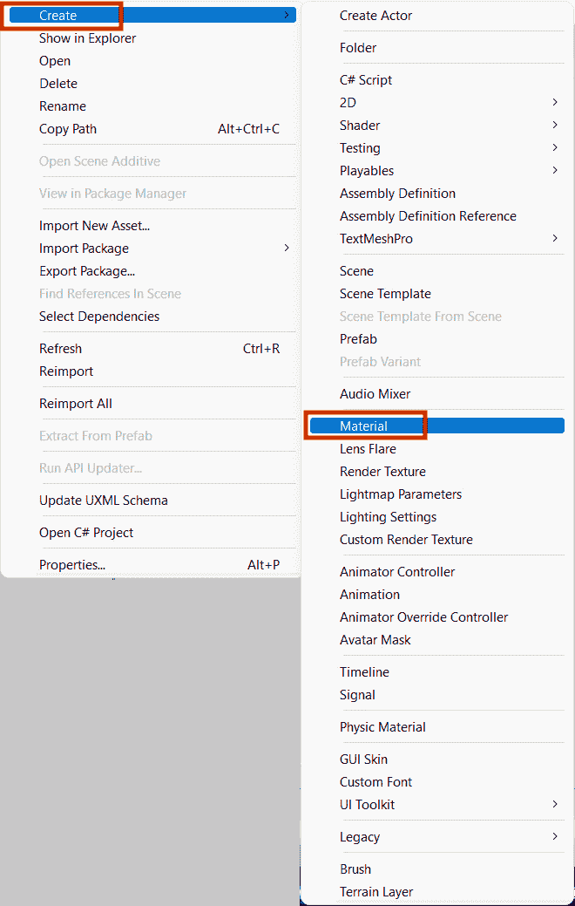

图 4.3 – 在 Unity 编辑器中创建材质

有两种方法可以将材质应用到飞船上。第一种也是最简单的方法是将材质拖放到**场景**视图中的`PlayerShip`模型上。

小贴士

可以通过`Renderer.material`属性在脚本中创建和更新材质。查看[`docs.unity3d.com/ScriptReference/Renderer-material.html`](https://docs.unity3d.com/ScriptReference/Renderer-material.html)以获取更多信息。

第二种方法——可能也是更好的方法，因为它是一种更受控的更新材质的方法——是在其预制文件夹中选择`PlayerShip`。然后，在**检查器**窗口中执行以下操作：

1.  在**网格渲染器**组件旁边是**材质**下拉箭头。单击箭头，使其指向下方。

1.  在组件内部需要关注的两个主要点是以下内容：

    +   `1`。

    +   `Default-Material`。

1.  要么点击`Default-Material`（或 whatever the material is called）右侧的小按钮，如图所示，要么将我们刚刚创建的`PlayerShip`材质拖放到与`Default-Material`相同的位置。

以下截图显示了位于**检查器**窗口中的**网格渲染器**组件的位置：

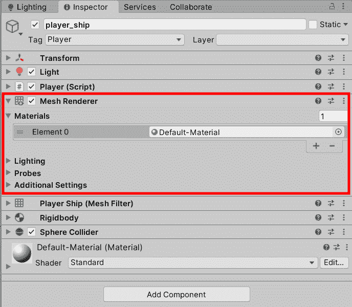

图 4.4 – player_ship Mesh Renderer 位置在检查器窗口中

完成后，`PlayerShip`、`1`和位于`PlayerShip`底部（或 whatever you named the material）的`Default-Material`。

小贴士

`Default-Material`不能被编辑，因为它通常与新的**网格渲染器**游戏对象共享。

现在，我们需要更新飞船的预制件（在 *第一章*，*设置和构建我们的项目*）中提到的预制件。如果 `PlayerShip` 模型仍然被选中，转到 `Prefab` 文件夹中的 `PlayerShip`，这将是必要的，因为我们已经直接更新了预制件。在下一节中，我们将分解我们现在可以应用于材质的各种地图。

## 将地图应用于我们的玩家飞船材质

我们为 `PlayerShip` 预制件创建的新材质现在可以容纳各种地图。我们的材质将为每个地图留出空槽；这些地图将为玩家的飞船添加细节，从颜色到假细节，如切割、凹痕和凹槽，这些细节并未物理建模到玩家的飞船中。我们还可以强调玩家飞船将吸收光的地方。

这里是我们将应用于 `PlayerShip` 预制件的一些地图选择：

+   `playerShip_diff`): 反照率图包含图像的颜色，类似于漫反射图，但没有光和阴影。以下截图显示了我们的反照率图：

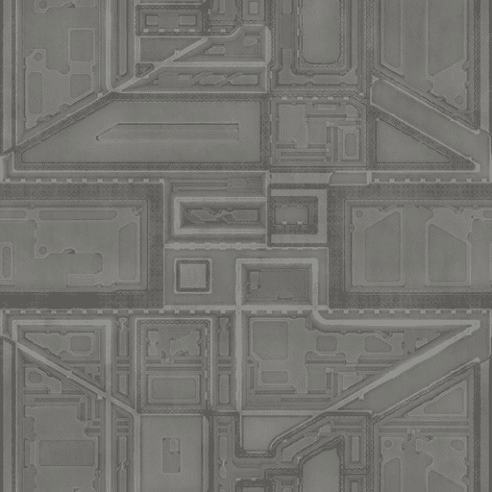

图 4.5 – 玩家飞船反照率图

+   `playerShip_met`): 金属图专注于表面的反射性和光。以下截图显示了我们的金属图：

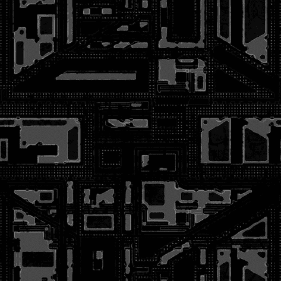

图 4.6 – 玩家飞船金属图

+   `playerShip_em`): 发射图不接受光线，非常适合发光效果（自发光）。以下截图显示了我们的发射图：

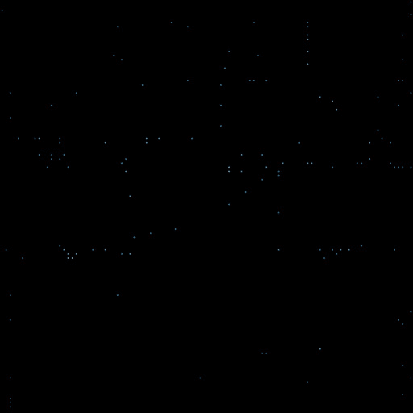

图 4.7 – 玩家飞船发射图

+   `playerShip_nrm`): 法线图存储每个像素的方向。此图的通用用途是保持高分辨率细节，给网格带来更多多边形的错觉。以下截图显示了我们的法线图：

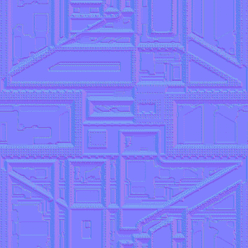

图 4.8 – 玩家飞船法线图

+   `playerShip_oc`): 遮挡图提供有关模型哪些区域接收光的信息。以下截图显示了我们的遮挡图：

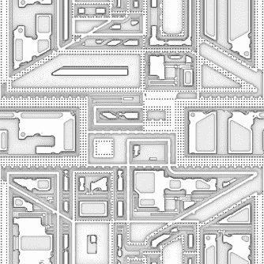

图 4.9 – 玩家飞船遮挡图

现在，我们将通过以下步骤将这些地图应用于 `PlayerShip` 模型：

1.  选择 `player_ship` 游戏对象，该对象可以在 `Assets/Prefab/Player` 文件路径位置中选择）。

1.  为了在将我们的地图应用于 `player_ship` 材料槽时更容易操作，锁定位于 **检查器** 窗口顶部的 `player_ship` 选择，如图所示（确保在完成拖放文件后解锁 **检查器** 窗口）：

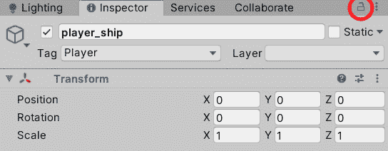

图 4.10 – 锁定检查器窗口

1.  在 `Texture` 文件夹中，将地图拖放到 `PlayerShip` 材料组件槽中。

在我们将文件拖放到指定的框中之前，请确保您的法线和发射贴图已正确设置。让我们从法线贴图开始。

当涉及到应用法线贴图时，有一些额外的步骤需要处理。首先，Unity 可能不会识别 **Normal Map** 作为法线贴图文件。当我们将法线贴图文件拖放到 **Material** 组件中的槽位，如图中所示，**Inspector** 窗口下的 **Normal Map** 槽位会出现一个信息框。这个信息框包含一条消息（**This texture is not marked as a normal map**）和一个 **Fix Now** 按钮。点击此按钮，以便正确配置法线贴图。以下截图显示了信息框的外观：

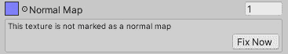

图 4.11 – 修复法线贴图

另一种修复法线贴图问题的方法是执行以下操作：

1.  在 **Project** 窗口中选择法线贴图文件。

1.  然后，在 **Inspector** 窗口中，我们有一个显示法线贴图的 **Import Settings** 选项的面板。

1.  在选项区域的顶部，点击 **Texture Type** 旁边的下拉菜单，确保它被选为 **Normal Map**。

1.  最后，点击 **Inspector** 窗口右下角的 **Apply** 按钮。

以下截图显示了从 **Texture Type** 下拉菜单中选择法线贴图文件，并在下拉菜单中选择 **Normal map**：

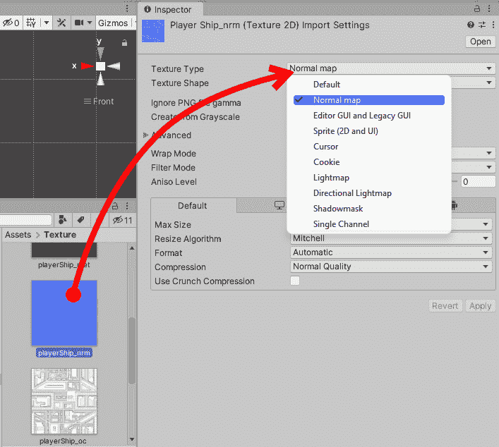

图 4.12 – 将纹理类型设置为法线贴图

将地图拖放到 **Material** 组件时，另一个潜在问题是需要检查 **Emission** 槽旁边的框，才能接受地图。以下截图突出显示了 **Emission** 槽，并显示了需要检查的框：

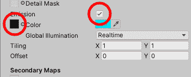

图 4.13 – Emission 检查框已勾选

很好，现在我们知道了可能的问题，我们可以将文件拖放到指定的框中。

导航到 `Assets/Texture` 文件夹，将每个文件拖放到正确的槽位中：

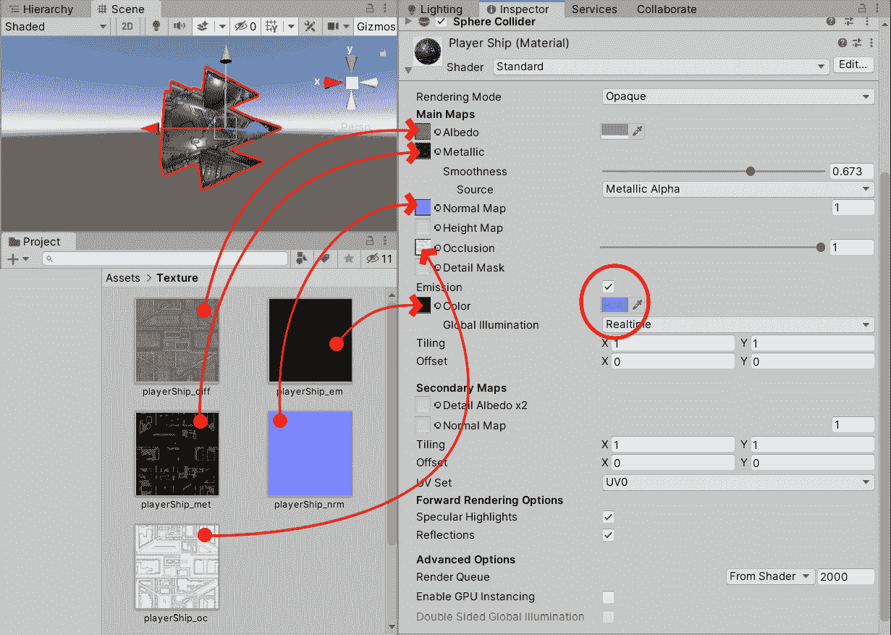

图 4.14 – 将地图拖放到玩家飞船材质的正确槽位

更多信息

材质属性，如发射颜色，可以通过使用 `SetColor` 属性通过脚本创建和修改。有关更改材质颜色或发射颜色的更多信息，请参阅 [`docs.unity3d.com/ScriptReference/Material.SetColor.html`](https://docs.unity3d.com/ScriptReference/Material.SetColor.html)。

一旦我们将所有地图拖放到指定的槽位，我们的 `player_ship` 模型应该看起来不同，因为它现在具有金属光泽。然而，我们还没有完成。接下来，我们需要在飞船上添加一些霓虹灯。

## 向我们的`PlayerShip`预制体添加霓虹灯

我们目前的船看起来像金属，稍微有点暗淡，上面有一些科幻风格的图案。这不是艺术考试，我们的初步任务不是让这艘船看起来很棒，而是要了解我们添加到它上面的地图和效果。如前一小节简要提到的，我们可以在船上添加一些光线，这些光线也会对船的地图做出反应。以下截图显示了应用所有地图后我们的船目前的样子；你的可能很闪亮，但这并不重要：


图 4.15 – 应用所有地图的`Player Ship

接下来，我们将使船的部分区域以科幻霓虹蓝光点亮，结合**点光源**和发射图。

要在我们的船上添加灯光，我们需要做以下几步：

1.  从`Assets/Prefab/Player`。

1.  选择`player_ship`并将其拖动到**层次结构**窗口。

1.  在下拉菜单中点击`Light`。

1.  当你在**层次结构**窗口中看到`player_ship`时，将鼠标悬停在**场景**窗口中，然后按键盘上的*F*键来放大。

这个**点光源**将作为船周围的发光效果，只影响玩家的船和发射图，通过 Unity 的层系统。但首先，我们将关注**灯光**组件在**检查器**窗口中的设置：


图 4.16 – `player_ship`的灯光组件属性值

从**层次结构**窗口中选择**点光源**，我们可以在**检查器**窗口中更改我们的新灯光设置：

+   `player_ship`还将有一个黄色的小工具围绕它，以表示光的大小，如下面的截图所示：


图 4.17 – 围绕`player_ship`的光线小工具

提示

小工具是一个在**场景**窗口中出现的指示器，你在**游戏**窗口中是看不到的。小工具作为指导显示，以显示某物的位置和/或比例。

+   `50`): 范围会增加/减少黄色球体的大小，使光线向外扩展更多。我觉得设置为`50`已经足够覆盖整个船了。

+   `0080FFFF`。（这将设置红色、绿色、蓝色和 alpha 设置。）

+   `10`): 光的强度。

+   `0`): 光线弹射到其他物体上。对于**点光源**，不支持实时间接弹射阴影。

+   **渲染模式**（**重要**）：确保灯光始终开启，不会因为性能下降而关闭。

+   `PlayerShip`): 我们将在下一节讨论这个问题。我们使用蓝色光（以我的情况为例）给船上的地图添加霓虹灯效果。我们理想情况下不希望光线扩散到其他资产上，如果它们靠近玩家的船。

    重要提示

    在**光**组件上玩玩；不需要它与我的颜色或强度完全相同。

一旦这些设置（除了剔除掩码）在我们的**检查器**窗口中更新，我们的飞船应该在各个区域点亮霓虹灯。在下面的截图中，我在玩家飞船模型后面放置了八个球体。注意现在我们的新霓虹灯光与球体发生了冲突。我将在下一部分解释我们如何解决灯光与游戏中的其他对象冲突的问题：

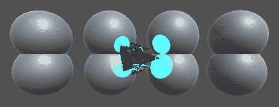

Figure 4.18 – 玩家飞船的光线与近 3D 对象的冲突

通过使用剔除掩码可以解决这个问题，因为我们可以使蓝色光线仅通过具有特定层掩码的玩家飞船显示。

要创建一个新层，我们需要进入**标签 & 层**部分，这可以通过两种方式访问：

1.  第一种方法是点击屏幕右上角工具栏中的**层**选项卡。会出现一个包含可用层的下拉菜单。点击底部选项，**编辑层...**。

1.  第二种方法是在**层次结构**窗口中选择任何游戏对象，然后点击**层**旁边的选项卡。然后，点击底部选项，**添加层...**：

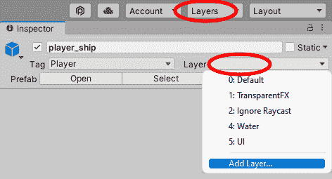

Figure 4.19 – 添加新层

`31`因为它有编辑器的内部用途。

1.  层`8`到`30`可以使用。我将把`PlayerShip`输入到**用户层 8**字段中，如下面的截图所示：

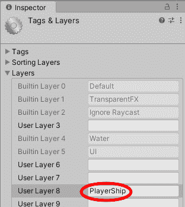

Figure 4.20 – 添加名为 PlayerShip 的层

1.  现在，在场景中或`Prefab`文件夹内点击`player_ship` GameObject，并将它的点光源**剔除掩码**选项从**所有内容**更改为**PlayerShip**：

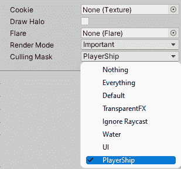

Figure 4.21 – PlayerShip 层在下拉列表中

1.  然后，从**层次结构**中选择`player_ship`模型。

1.  在`player_ship` `PlayerShip`中。因为我们添加了一个`player_ship`模型。

1.  点击**是，更改子对象**，如下面的截图所示。这将把**点**光源层更改为**PlayerShip**：

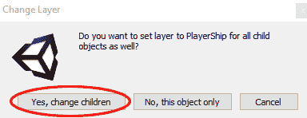

Figure 4.22 – 确认更改所有子游戏对象

提示

一旦你将某物放入`player_ship`预制件，它将始终由`PlayerSpawner`实例化。

最终结果给我们一个酷炫的、霓虹般闪亮的蓝色飞船，它不会影响周围的任何游戏对象，如下面的截图所示（您的可能与这个不同）：

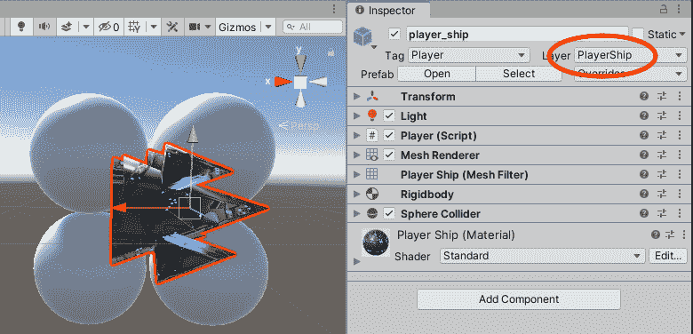

Figure 4.23 – 我们的玩家飞船现在有霓虹发射灯

现在，让我们继续为玩家飞船添加粒子。

## 向我们的 PlayerShip 预制件添加粒子

在本节中，我们将创建一个粒子效果，给飞船的推进器带来运动的错觉。粒子系统本身分为不同的组件类别，这将影响粒子的行为。我们将关注放置、方向和粒子效果的寿命周期，这是一项可以转移到其他效果（如火焰、烟雾、水泄漏等）的技能。以下截图显示了我们的玩家飞船带有动画的粒子效果，这是我们接下来要创建的：

![Figure 4.24 – 带有粒子效果的玩家飞船]

![Figure_4.24_B18381.jpg]

Figure 4.24 – 带有粒子效果的玩家飞船

因此，让我们创建一个空的游戏对象来包含粒子系统：

1.  在**层次**窗口的空白区域右键单击。

1.  从出现的下拉菜单中选择**创建空对象**。

1.  将空游戏对象命名为类似`playerJet`的名称。

1.  我们希望这个效果跟随玩家的飞船，所以将`player_ship`对象拖放到`playerJet`上，放置在`player_ship`游戏对象上。

1.  最后，我们需要将`playerJet`移动到我们的`player_ship`对象后面，直到粒子开始发射的位置。我将我的移动到其`0.5`。

以下截图显示了粒子开始的位置和`playerJet`变换设置：

![Figure 4.25 – playerJet 游戏对象位于玩家飞船后面]

![Figure_4.25_B18381.jpg]

Figure 4.25 – playerJet 游戏对象位于玩家飞船后面

这样，我们的空游戏对象就创建好了，并且放置在玩家飞船模型后面。现在，我们可以在下一节中将粒子效果添加到空游戏对象中。

# 创建粒子效果

在本节中，我们将从上一节中的空游戏对象开始创建我们的粒子效果；类似于我们之前几节所做的那样，我们需要将所有粒子系统设置为`playerJet`游戏对象的子对象：

1.  在`playerJet`中。

1.  从下拉菜单中选择**效果**，然后选择**粒子效果**。

1.  重命名`thruster`。

我们现在应该看到一个粒子系统，它以默认的粒子喷雾直接指向我们，如下面的截图所示：

![Figure 4.26 – 默认粒子系统]

![Figure_4.26_B18381.jpg]

Figure 4.26 – 默认粒子系统

接下来，我们需要调整粒子系统的大小并旋转到正确的方向，确保它以正确的方向喷射。

在**检查器**窗口中，选择我们的`thruster`对象，将其**变换**组件设置更改为以下内容：

+   `0`，`0`，和`0`

+   `0`，`90`，和`0`

+   `0.3`，`0.3`，和`0.3`

有时，我们的**粒子系统**对象可能不会更新，或者在我们更改或撤销其设置时，它可能会在**场景**窗口中消失。

要尝试在**场景**窗口中重启**粒子系统**使其激活或动画化，请在**层次**窗口中选择**粒子系统**。您将在**场景**视图的右下角注意到一个**粒子效果**弹出窗口。然后，执行以下步骤：

1.  点击**停止**以停止**粒子系统**对象的发射。

1.  点击**重启**。

以下截图显示了位于**场景**窗口右下角的**粒子效果**菜单：

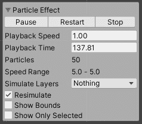

图 4.27 – 粒子效果菜单

希望如此，如果粒子系统之前未激活，现在应该是激活的。如果它仍然没有激活，请尝试在**层次**窗口中选择不同的游戏对象，然后回到粒子系统并再次重复停止/启动方法。

在**层次**窗口中仍然选中我们的`thruster`粒子系统后，在**检查器**窗口中点击下拉按钮，如下截图所示：

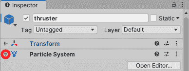

图 4.28 – 粒子系统属性下拉按钮

现在，我们在**检查器**窗口中看到了一个可能看起来令人不知所措的选项列表，但我们只会更改几个选项，以使我们的粒子系统达到预期的效果。大多数 Unity 属性都有它们自己的**工具提示**选项。如果您不知道这些是什么，请选择 Unity 编辑器的顶部栏，将鼠标悬停在粒子系统属性上。几秒钟后，将出现一个描述这些属性的说明。

我们需要更改的粒子系统选项如下：

+   `0.05`：

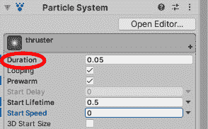

图 4.29 – 持续时间属性

+   **预加热**：当播放时，预加热的系统将处于仿佛已经发射了一个循环周期的状态。只有当系统循环时才能使用。此选项应勾选。

+   `0`。此选项应设置为`0.5`。

+   `0`。

+   **3D 起始大小**：这是粒子的起始大小。

+   `1`，`2`。

要获取更多字段的选项，请执行以下操作：

1.  点击选项右侧的下箭头。

1.  从下拉菜单中，点击**在两个常量之间随机**，如下截图所示：

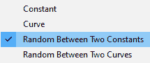

图 4.30 – 选择在两个常量之间随机

信息

代价最低的曲线是**常量**，因为它只需要一个值。

+   **3D 起始旋转**：如果启用，我们可以分别对每个轴进行旋转控制。此选项应勾选。要获取更多字段的选项，请执行以下操作：

    1.  点击选项右侧的下箭头。

    1.  从下拉菜单中，点击**在两个常量之间随机**并输入以下矢量旋转：

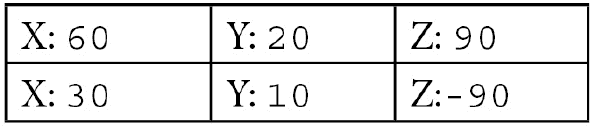

+   `00FFD5B7`。

+   `4`。

以下截图提供了应设置的设置参考：

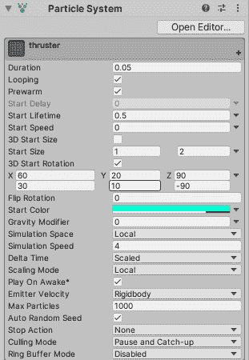

图 4.31 – 整体粒子系统属性值

我们在这里更改了很多设置。总结一下，我们创建了一群出现后很快就会消失的粒子。如果它们存在时间过长，我们的`推进器`对象就会穿越屏幕（你可能希望也可能不希望这样）。我们消除了它的方向，因为我们将在稍后将其改为一个将粒子推向大致方向的力，从而形成一个不太可预测的模式。

小贴士

记住，屏幕上同时显示的粒子越多，场景的需求就越高。为了尽可能保持流畅，我们让粒子保持它们所需的时间（即，它们有较短的寿命），并且我们将每个粒子的大小保持尽可能小，而不是很大。

以下截图显示了我们现在闪烁的粒子系统：

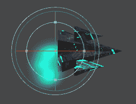

图 4.32 – 当前粒子系统状态

现在我们继续在**检查器**窗口中浏览**粒子系统**设置。

## 设置粒子系统的发射部分

在本节中，我们将控制粒子系统的粒子速率；在每个标题下，我将显示一个信息框，显示该部分的提示描述。你可以通过将鼠标移至部分名称上查看提示信息。这同样适用于**检查器**窗口中的某些值。以下截图显示了提示信息的示例：

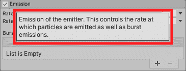

图 4.33 – 发射提示信息

`thruster`粒子系统的下一个子设置是`50`。

如前所述，如果有疑问，可以将设置调整到最大或最小，以查看是否有任何即时的视觉反馈来了解属性的作用。你总是可以撤销设置。作为额外的预防措施，在更改任何设置之前，你总是可以保存你的工作：

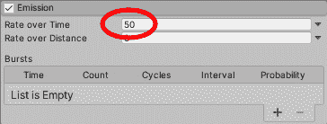

图 4.34 – 发射速率随时间设置为 50

在这里我们并没有做任何激进的事情，只是稍微减少了粒子数量。在本章的后面部分，出于性能考虑，可能需要进一步降低变量，具体取决于这款游戏要移植到哪个平台。

在下一节中，我们将设置粒子如何进入场景。

## 设置粒子系统的形状部分

在我们粒子系统设置的下一部分，我们可以更改**形状**设置及其属性。

信息

**形状**的提示信息描述是**发射体积的形状，它控制了粒子的发射位置及其初始方向**。

在**形状**部分，我们将调整粒子发出的起始点。我们将更改的设置如下：

+   **形状**：定义了粒子可以从中发射的体积形状以及起始速度的方向。将此选项设置为**球体**。

+   `0.02`.

我们需要关注的只是粒子发出的点。以下是需要设置的设置截图：

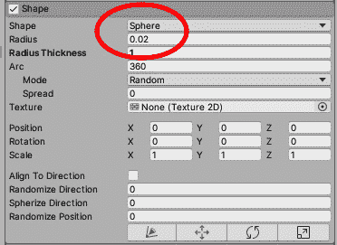

图 4.35 – 更新形状为球体及其半径为 0.02

我们玩家的飞船推进器现在显示更多的集中光：

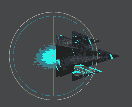

图 4.36 – 我们玩家的飞船光现在更集中

如前所述，我们在第一个部分就停止了粒子系统的方向，在下一部分，我们将使用**Force over Lifetime**来大致指示粒子将去哪里。

## 设置粒子系统的**Force over Lifetime**部分

在这个简短的部分，我们将改变我们想要粒子去的地方的力。回顾之前的截图，我们可以看到我们的飞船有一个光，现在只需要稍微推回一点，以产生旅行的错觉。

信息

**Force over Lifetime**提示描述是**控制粒子在其生命周期内的力**。

与其他属性不同，这个属性需要通过选择其名称左侧的复选框来打开。

一旦激活，我们唯一需要调整的设置是设置`10`，如下面的截图所示：

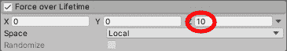

图 4.37 – 生命周期内力值更新

小贴士

如前所述，在设置上要勇于尝试。意外和突破极限可以创造出可能对游戏其他部分和未来项目有用的新效果。

因此，现在我们的粒子看起来被拉伸了，类似于推进器，如下面的截图所示：

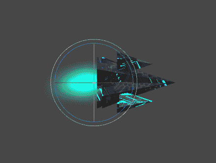

图 4.38 – 粒子系统现在略微拉伸

现在我们来改变纹理，看看我们是否可以为粒子添加更多细节。

## 设置粒子系统的**Renderer**部分

**Renderer**部分控制每个粒子的视觉效果。这是我们应用自己的材质的地方。在材质中有一个自定义纹理。

信息

**Renderer**提示描述是**指定粒子如何渲染**。

我们将更新**Particle System**材质，使其显示精灵图集，我们将在下一节中使用它进行动画。

信息

什么是精灵图集？它是一系列图像，通常以网格形式排列，用于动画。

将`thruster`材质文件拖放到**Renderer**部分的**Material**字段中，位置在`Assets/Material`文件路径，如下面的截图所示。

`player_ship` 对象现在分配了新的 `thruster` 粒子系统材质，看起来是点状的。在下面的截图中，`thruster` 材质的缩略图被拖放到 **渲染器** 部分的 **材质** 字段中：

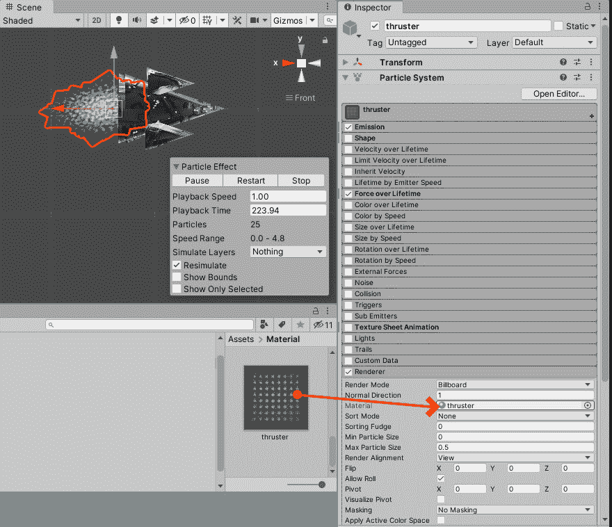

图 4.39 – 将推进器材质拖放到渲染器/材质槽中

在应用了材质和纹理之后，我们现在在船尾发光的地方看到了很多点。我们已经做对了所有的事情，但是由于这个纹理表现得像动画，我们需要更新其 **纹理图集动画** 设置。

## 设置粒子系统的纹理图集动画部分

创建粒子效果的最后一步是让 Unity 正确地动画化精灵图集。在我们设置这个之前，让我们先看看我们输入到粒子系统中的纹理。

信息

**纹理图集动画** 工具提示描述是 **粒子 UV 动画。这允许我们指定一个纹理图集（具有多个瓦片/子帧的纹理）并按每个粒子进行动画或随机化**。

以下截图来自我们的 `thruster` 材质：

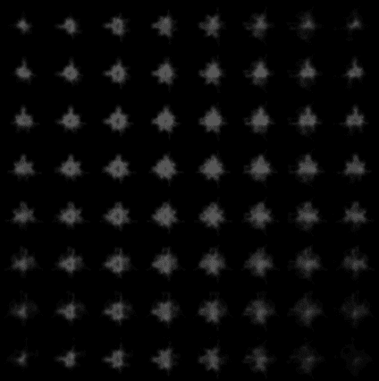

图 4.40 – 精灵图集

上一张截图包含一个 8 x 8 网格中的 64 张图片。这个纹理不需要额外的设置。如果有多余的图片数量，我们就必须使用 Unity 的精灵编辑器逐个裁剪每张图片，这可能会变得很繁琐。

更多信息

更多关于精灵编辑器的信息可以在 [`docs.unity3d.com/Manual/SpriteEditor.html`](https://docs.unity3d.com/Manual/SpriteEditor.html) 找到。

幸运的是，我们不需要担心做这件事。让我们更仔细地看看材质。

在以下截图中，我们可以看到 **着色器** 选项（截图顶部）设置为 **粒子/添加** 类别（理想的发光效果着色器），这是用于粒子系统中最常用的着色器之一。

在 `Assets/Material` 文件位置，我们有我们的 `thruster` 材质文件。点击文件会在 **检查器** 窗口中显示其属性：

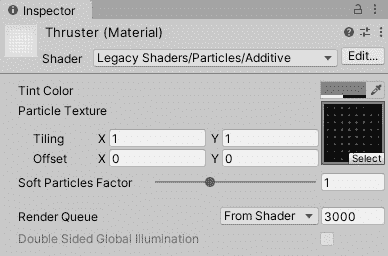

图 4.41 – 推进器材质属性

我们可以通过改变其 **着色** 亮度值来改变粒子的强度，就像之前的截图所示。请随意进行自己的更改。我将保持我的设置不变。

回到 `8` 和 `8`。

信息

如您所回忆的，在上一个部分中，我们的粒子看起来是点状的。这是因为我们在一个粒子中显示了纹理图集中的所有 64 张图片。有了纹理动画图集，我们将这 64 张图片分成了单个图片，这些图片将动画化到每个粒子上。

以下截图显示了带有 **纹理表动画** 设置的粒子系统的延续：

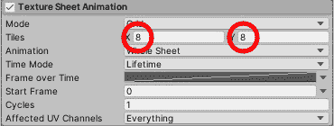

图 4.42 – 更新纹理表动画瓦片值

这就是我们的最终结果：

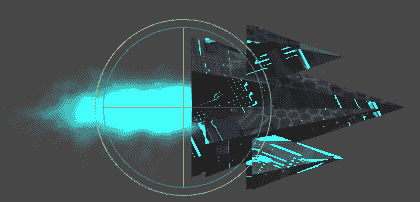

图 4.43 – 我们玩家的推进器

如果你对自己的最终结果满意，在保存我们的 `player_ship` 预制件之前，我们需要采取最后一步。因为我们已经在 `PlayerSpawner` 脚本中改变了 `player_ship` 的比例，所以我们也需要对我们的 `thruster` 游戏对象做同样的操作。

要更改 `thruster` 游戏对象的 `localScale` 设置，我们需要执行以下操作：

1.  在 `Assets/Script`。

1.  双击 `PlayerSpawner` 脚本，并向下滚动到以下代码行：

    ```cs
    playerShip.transform.localScale = new Vector3(60,60,60);
    ```

1.  在上一行代码下方，添加以下代码以调整 `thruster` 游戏对象的大小：

    ```cs
    playerShip.GetComponentInChildren<ParticleSystem> 
       ().transform.localScale = new Vector3(25,25,25);
    ```

上述代码访问玩家的船的 `ParticleSystem` 组件，并将其在所有轴上的比例缩放设置为 `25`。

1.  保存 `PlayerSpawner` 脚本。

1.  在 Unity 编辑器中，选择 **层次** 窗口中的 `player_ship` 对象，然后在 **检查器** 窗口中点击 **覆盖 | 应用全部** 按钮。

如前所述，对粒子系统要大胆；如果你不熟悉它们，请使用工具提示，并尝试调整设置——你很快就会习惯的。你可以复制并粘贴 `thruster` 游戏对象，并更改其颜色、排放、力、比例等。混合不同的元素以创建不同类型的推进器。

这是我用七个粒子系统制作的一个例子：

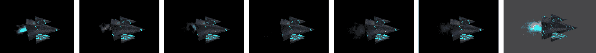

图 4.44 – 添加到玩家船上的各种粒子

**粒子系统** 也可以通过脚本进行操作，这就是为什么作为 Unity 程序员，我们熟悉属性，但并不擅长掌握技术。在 Unity 程序员考试中，你可能会被问到粒子系统的属性以及粒子系统在创建效果时有什么好处。尽管我们没有在本节中涵盖所有属性，但了解每个属性的作用是很好的实践——例如，了解 **Size over LifeTime** 属性只是随着时间的推移缩小粒子。

我们使用的粒子系统属性之一是 **Texture Sheet Animation**，我们提供了一个预先制作的纹理表来分割我们的单个图像以创建动画。

信息

当创建粒子系统时，它会生成一个可预测的模式。这被称为**程序模式**；这种模式的优点是 Unity 知道粒子在过去和未来的位置。当例如相机远离粒子系统时，这也帮助提高了性能；然后，它可以被裁剪。然而，如果粒子系统被修改，例如将其模拟空间更改为**世界空间**，粒子系统将变得不可预测和非程序化，这将使其无法提高性能。

想了解更多关于**程序模式**的信息，请查看以下链接：[`blogs.unity3d.com/2016/12/20/unitytips-particlesystem-performance-culling`](https://blogs.unity3d.com/2016/12/20/unitytips-particlesystem-performance-culling)/。

在下一节中，我们还将使用粒子系统，但这次是为了背景创建星星，使其看起来在我们身边飞驰。我们还将使用 Unity 的动画控制器以不同的速度动画化星星。

# 导入和动画化背景

在本节中，我们将熟悉 Unity 的动画控制器。我们将通过在关卡开始时创建一个快速移动的星星和粒子背景（是的，没错，更多的粒子）来让我们的玩家飞船以光速（好吧，至少给人一种这样的印象）移动，然后当前方出现敌人时，我们将放慢一切。

在我们以“光速”开始动画之前，我们需要准备**层次结构**窗口：

1.  在**层次结构**窗口中，在空白区域右键单击。

1.  从下拉菜单中选择**创建空**。

1.  点击新游戏对象并将其重命名为`GameSpeed`。

1.  再次这样做，并将第二个游戏对象命名为`_SceneAssets`。

1.  将`GameSpeed`拖放到`_SceneAssets`游戏对象上。

1.  确保两个游戏对象的**变换**属性值都设置为**重置**。

1.  最后，将`_SceneAssets`游戏对象从`Assets/Prefab` **项目**窗口拖动。

    小贴士

    记住，除了定期保存场景和项目外，我们还需要确保我们创建的预制件将位于场景中并经常使用，以存储游戏对象及其组件的设置。

这是已经设置好的 **层次结构** 窗口，准备添加一些额外的游戏对象到我们的场景中。观察我们如何为游戏创建一个活跃的动画场景，我们可以用两种方法来处理侧滚动射击游戏。一种方法是有一个大型的静态背景，移动玩家和摄像机通过关卡，对抗敌人。另一种方法是保持摄像机静止，当我们在设定的时间触发敌人进入场景时，让背景移动或动画通过摄像机。为什么我们会选择第二种方法？因为当我们制作游戏时，作为一个程序员，我们需要关注对我们来说重要的事情——在这种情况下，玩家是最重要的。此外，玩家被限制在屏幕比例内。可以说，开发并调试一个移动的固定比例摄像机会更尴尬，迫使玩家穿越一个包含其他游戏对象的场景。我们还可以考虑物理因素，如碎片和更多游戏对象之间的碰撞，这可能会引起潜在的问题。作为一个程序员，我发现寻找最简单的选项总是最好的。

话虽如此，让我们继续制作我们的背景：

1.  在 **层次结构** 窗口中右键点击 `GameSpeed`。

1.  从下拉菜单中选择 **创建空对象**。

1.  点击新的游戏对象并将其重命名为 `ScreenBackground`。

`ScreenBackground` 游戏对象将容纳星星粒子系统。我们将带入场景的粒子系统是预先制作的；我认为没有必要继续制作更多粒子，因为我们已经为玩家的飞船制作了一个。

从 `Assets/Particle` `warpStars_pe` 预制件到 **层次结构** 窗口中的 `GameSpeed` 游戏对象，使其成为子对象。

在本节中我们做出的更改，**层次结构** 窗口的内容应该类似于以下截图：

![图 4.45 – 当前层次结构布局

![img/Figure_4.45_B18381.jpg]

图 4.45 – 当前层次结构布局

我们已经更新了 **层次结构** 窗口，为这一章添加了第二个粒子系统。这改善了结构并增加了清晰度，因为我们的游戏开始扩展到更多功能。现在让我们继续关注粒子系统及其在场景中的放置：

1.  在 `warpStars_pe` 中如果没有被选中。

1.  将注意力转移到 **检查器** 窗口中，将其 **变换** 设置调整为以下内容：![img/Table_02.jpg]

在我们的粒子系统设置在正确的位置后，我们现在可以专注于为游戏背景添加另一层，这将是一个大四边形上的 `ScreenBackground` 纹理。

让我们继续向 `ScreenBackground` 游戏对象添加更多功能：

1.  在 `ScreenBackground`。

1.  在 **检查器** 窗口中，点击 **添加组件** 按钮。

1.  从出现的下拉菜单中，开始输入 `网格过滤器` 直到它出现在可点击的列表中。

以下截图显示了 `ScreenBackground`，配备了三维 **四边形** 多边形网格：

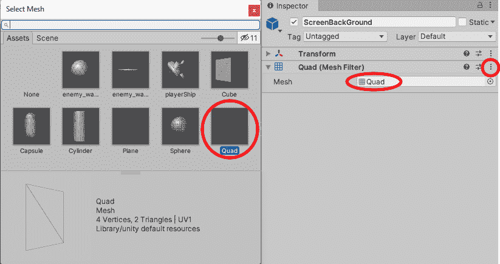

图 4.46 – 从网格下拉菜单中选择四边形网格过滤器

使用创建的 **四边形** 网格，我们需要通过 **网格渲染器** 组件使其在我们的 **场景** 和 **游戏** 窗口中可见。

1.  在 **层次结构** 窗口中选择 `ScreenBackground` 游戏对象，并在 **检查器** 窗口中，点击 **添加组件** 按钮。

1.  在下拉菜单中，开始输入 `Mesh Renderer`，直到你在列表中看到它，然后点击它。

与我们对 `player_ship` 预制件和之前的粒子系统所做的一样，我们需要为 `ScreenBackground` 对象创建并应用一个材料：

1.  在 `Assets/Material` 文件位置的空白区域右键单击。

1.  从下拉菜单中选择 **创建**。

1.  然后，点击 **材料**。

1.  在选择了新的材料后，将其重命名为 `backGround_Wallpaper`。

因为我们的 `ScreenBackground` 游戏对象现在有一个 `MeshRenderer` 对象，并且我们已经为它创建了一个材料，我们现在需要应用它：

1.  在 `ScreenBackground`。

1.  将 `backGround_Wallpaper` 材料从 **项目** 窗口拖放到 **网格渲染器** 部分，放入 **材料** 子部分的 **元素 0** 插槽中，如下截图所示：

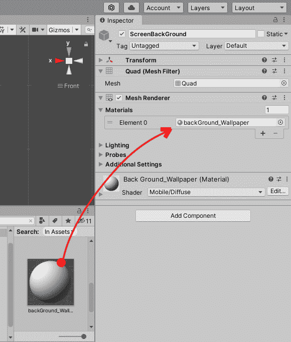

图 4.47 – 将 backGround_wallpaper 材料拖放到元素 0

让我们回顾一下到目前为止在本节中完成的工作。我们已经将游戏对象放置在 `backGround_Wallpaper` 的正确位置。

现在，我们将设置材料以使其变得相当基础。它不需要很多复杂的着色器，所以一个简单的低资源移动着色器就足够了。

信息

着色器通常是数学脚本，告诉我们的材料其图形和光照如何表现。

确保在 **层次结构** 窗口中仍然选择了 `ScreenBackground`。

在 **检查器** 窗口中，向下滚动到 **材料** 组件：

1.  如果 **材料** 组件没有展开，请点击白色球体旁边的箭头。

1.  当 **材料** 组件展开时，我们可以看到许多我们不需要的映射，所以让我们将着色器更改为更基础的类型。

1.  点击 **着色器** 字段的选择下拉菜单。通常，**标准** 将是默认着色器。

1.  从下拉菜单中，点击 **移动**。

1.  然后，点击 **漫反射**。

以下截图显示了此过程：

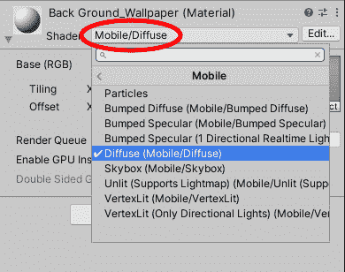

图 4.48 – 为我们的材料选择移动漫反射着色器

这将我们的 **材料** 属性简化到最小需求，如下截图所示：

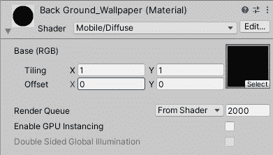

图 4.49 – backGround_wallpaper 材料当前状态

在这个 **材质** 组件中，我们真正关心的是我们将要提供给它的 **纹理** 和其 **偏移量** 值。

信息

什么是偏移量？**偏移量** 是我们的纹理在 UV 图上应用的位置。例如，如果我们增加 **偏移量** 属性的 **X** 位置，应用到材质上的纹理将重叠并出现在四边形的另一侧。

我们现在将继续处理我们的背景 `ScreenBackground` 纹理：

1.  在仍然位于 **检查器** 窗口的 **材质** 组件中，右上角有一个大正方形，称为 **无（纹理）**。点击 **选择**（参考前面的截图）。

1.  出现了一个下拉菜单。开始输入 `spaceBackground`，直到出现选项，然后点击它。

我们应该有一个名为 `ScreenBackground` 的四边形，其颜色为黑色，上面有白色的小点，如下面的截图所示：

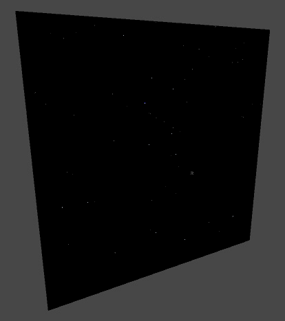

图 4.50 – 我们的 quad spaceBackground

在我们开始动画这个纹理之前，我们需要做与我们为粒子系统所做的一样，更新其 `ScreenBackground` 以覆盖摄像机的视锥角，并在 **变换** 更新后显示我们的图像。

1.  在 `ScreenBackground` 游戏对象中。

1.  在 **检查器** 窗口中，使用以下设置更新其 **变换** 组件：

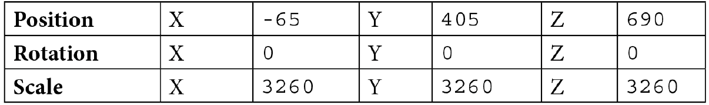

下面的截图显示了我们的当前场景视图：

+   我们有一个非常大的四边形，上面有空间纹理。

+   我们有一个白色的网格状相机视图。

+   玩家的飞船位于摄像机和四边形之间。

+   右下角显示了用户看到的最终结果：

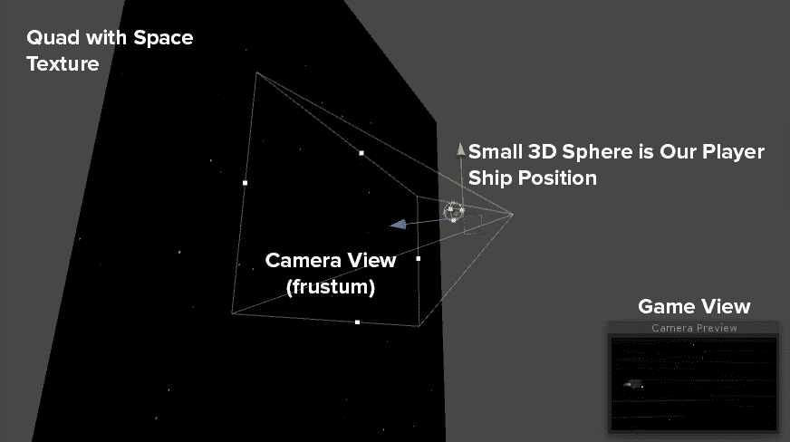

图 4.51 – 我们当前的游戏场景环境设置

我们已经更新了我们的 **层次结构** 窗口以包含两个背景层。第一层显示通过星星，第二层是我们从本章下载文件中添加的第二个粒子系统。第二层是一个包含纹理的四边形游戏对象。现在让我们继续为我们的背景和空间扭曲粒子创建动画控制器。

## 添加动画控制器

使用动画控制器是一种控制动画状态的方法。我们的玩家飞船将以光速行驶几秒钟，然后在我们玩家被敌人攻击之前，我们将放慢速度。

以下截图中的左侧飞船比右侧的飞船有更多的拖尾粒子。星系背景在左侧也比在右侧移动得快（在这些静态截图中你几乎看不到）：

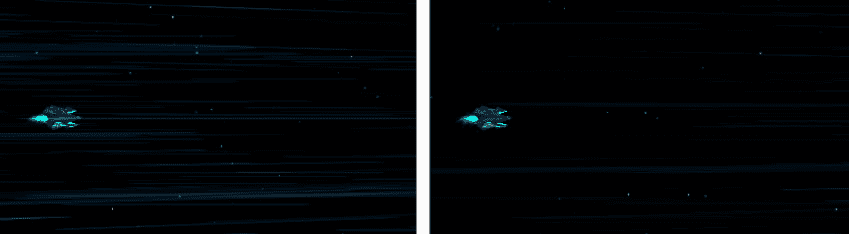

图 4.52 – 下一步将动画背景中的星星

因此，让我们创建并将 Animator 附加到`ScreenBackground`对象和粒子系统的父对象上。

小贴士

使用 Animator Controller，如果您同时动画化多个游戏对象，请确保您的 Animator Controller 是这些游戏对象的父对象。不能有子对象动画化其父对象（**父对象**指的是**Hierarchy**窗口中对象上方的游戏对象）。

查看`GameSpeed`游戏对象。如信息框中所述，Animator Controller 会动画化所有子对象，但它不能动画化父对象。因此，让我们添加 Animator Controller：

1.  在`GameSpeed`游戏对象中。

1.  在**Inspector**窗口中，点击**Add Component**按钮。

1.  在下拉菜单中，开始输入`Animator`，直到它出现，然后点击它。

以下截图显示了`GameSpeed`游戏对象：

![Figure 4.53 – Select the Animator from the dropdown

![img/Figure_4.53_B18381.jpg]

图 4.53 – 从下拉菜单中选择 Animator

现在我们有了`GameSpeed`游戏对象。接下来要做的就是创建并附加 Animator Controller 到**Controller**字段。以下截图显示了**Animator**组件的设置：

![Figure 4.54 – The Animator Controller component

![img/Figure_4.54_B18381.jpg]

图 4.54 – The Animator Controller component

在进行之前，我们需要创建一个`Animator`文件夹。在`Assets`文件夹中创建一个空文件夹。命名为`Animator`。

进入`Animator`文件夹，继续创建 Animator Controller：

1.  在**Project**窗口的空白区域右键点击。

1.  点击**Create**。

1.  点击**Animator Controller**（参考以下截图的左侧）。

1.  重命名新的`GameSpeed_Controller`。

1.  最后，将此 Animator Controller 拖放到其**Inspector**窗口中的`GameSpeed` Animator Controller 上（参考以下截图的右侧）。

以下截图显示了 Animator Controller 的创建以及如何将其应用到**Animator**组件中：

![Figure 4.55 – Drag and drop the GameSpeed_Controller into the Animator Controller slot

![img/Figure_4.55_B18381.jpg]

图 4.55 – 将 GameSpeed_Controller 拖放到 Animator Controller 槽中

在本节中，我们创建并应用了`GameSpeed`游戏对象。在下一节中，我们将查看 Animator Controller 中的动画状态。

## 在 Animator Controller 中创建状态

在本节中，我们将使用 Animator Controller 创建一个用于快速动画背景场景和粒子的状态；接着是第二个状态，将背景和粒子减速以表示玩家飞船以较慢的速度行驶（这也有助于使我们的游戏不那么分散注意力）。让我们创建第一个状态。

要创建一个状态，请按照以下说明操作：

1.  双击放置在`GameSpeed` **Animator**组件中的`GameSpeed_Controller`对象。

1.  **动画器**窗口将打开并显示一些默认状态：**进入**、**任何状态**和**退出**。

1.  在**动画器**窗口内的空白区域右键单击。

1.  将会出现一个下拉菜单。点击**创建状态**。

1.  然后，点击**空**：

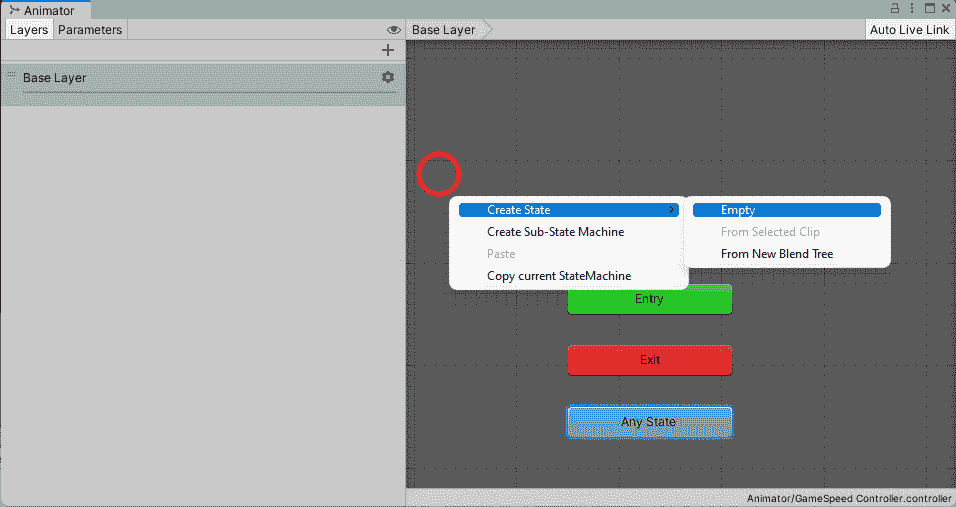

图 4.56 – 创建一个空动画状态

如您所猜，我们刚刚创建了一个空状态。

1.  重复此过程以创建第二个状态。

    更多信息

    Unity 的动画控制器还提供了与我们的动画的分层。例如，我们可以为一个可以跑步、跳跃和射击的玩家进行动画处理。我们可能希望同时播放几个这样的动画，我们可以通过**层**（参见上一张截图的左上角）来实现。我们可以改变每个动画的影响，或**权重**，在 Unity 中被称为，并且我们可以使用**覆盖**（其他层的将忽略信息）或**叠加**（添加到另一个动画之上）设置来在动画之间混合。

    如果您想了解更多关于动画层的信息，请访问 [`docs.unity3d.com/Manual/AnimationLayers.html`](https://docs.unity3d.com/Manual/AnimationLayers.html)。

一旦我们创建了第二个状态，让我们做一些整理：

1.  点击并拖动**退出**和**任何状态**到一边。我们不会使用这些。**进入**将自动附加到我们创建的第一个状态。

现在让我们重命名我们的状态。

1.  点击名为**New State**的橙色状态。

1.  在**检查器**窗口中，点击右上角标有**新建状态**的位置。

1.  删除此状态并将其重命名为`BackGround_Intro_Speed`。

1.  在键盘上按**Enter**键以确保保存名称。如果您点击离开，有时它不会保存更改。

1.  现在，将我们创建的另一个状态重命名为`New State 0`，将其重命名为`BackGround_InGame_Speed`。

    小贴士

    您可以使用鼠标滚轮放大和缩小**动画器**窗口。

    要放大，滚动鼠标滚轮向上。

    要缩小，滚动鼠标滚轮向下。

    要平移，按住鼠标中键。

不要担心状态的精确位置；这更多是一个外观问题。我们只需要有一个`BackGround_Intro_Speed`状态，一个`BackGround_InGame_Speed`状态靠近它。

以下截图显示了我们应该关注的三个状态：

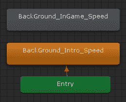

图 4.57 – 动画控制器状态

这三个动画状态最终将连接到每个状态上的一些线条；这些线条允许创建一个条件（例如`if`语句；更多信息请参见 [`docs.microsoft.com/en-us/dotnet/csharp/language-reference/keywords/if-else`](https://docs.microsoft.com/en-us/dotnet/csharp/language-reference/keywords/if-else)）以便一个状态可以移动到另一个状态。

在我们查看这个之前，我们还需要意识到每个状态可以以不同的速度运行。我们将调整状态的速度，使其与它们所包含的动画速度相匹配。要更改我们状态中的动画速度，请执行以下操作：

1.  在 `BackGround_InGame_Speed` 状态中。

1.  在其 `1` 到 `0.1`。

另一个状态将保持不变。

当场景开始时，第一个状态是 `BackGround_Intro_Speed`，然后一旦该动画连接到它（我们目前还没有这样做），接下来将播放 `BackGround_InGame_Speed`。我们需要连接最后一个状态，以便它可以在之后播放。

要连接一个状态，请执行以下操作：

1.  在 `BackGround_Intro_Speed` 状态中。

1.  从下拉菜单中，点击 **Make Transition**。

1.  然后，点击 `BackGround_InGame_Speed`。

我们现在应该有一个状态连接到另一个状态。

在本节中，我们更深入地探讨了 Animator Controller，创建了我们的开场和游戏动画状态。我们设置了状态的速度，最后，连接了过渡线，以便我们知道动画状态流。所有这些额外游戏对象、Animator Controller 和状态的结构意味着我们现在已经到了可以开始动画化场景的阶段。

## 动画

最后，我们实际上要动画化一些东西。我们只会覆盖一个基本的动画，但它将帮助我们理解动画设置，这将支持我们在考试和未来的项目中。

因此，让我们直接进入并动画化背景以及我们的背景粒子：

1.  在 `Assets/Animator` 文件夹位置。

1.  在空白区域右键单击，并从下拉菜单中选择 **Create**。

1.  然后，点击 **Animation**。

1.  将新动画命名为 `BackGround_InGame_Speed`。

1.  重复此过程，并将新动画命名为 `BackGround_Intro_Speed`。

以下截图显示了创建 **Animation** 文件的过程：

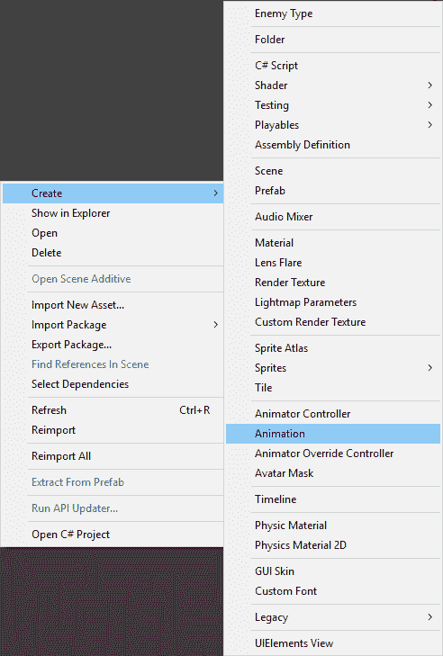

图 4.58 – 在 Unity 编辑器中创建动画文件

开场动画将播放一次，因为它将是一阵星星的爆发，然后第二个动画将循环播放，连续播放以产生永不结束的星星和粒子星星穿过 **Game** 窗口的错觉。

话虽如此，在 `BackGround_InGame_Speed` 动画文件中，并在 **Inspector** 窗口中，勾选 **Loop Time** 旁边的框。

我们现在需要在 **Animator** 窗口中将我们的两个 **Animation** 文件应用到它们的动画状态中。

要连接这些新的 **Animation** 文件，请执行以下操作：

1.  在 `GameSpeed` 游戏对象中。

1.  双击 `GameSpeed_Controller`。

1.  **Animator** 窗口打开。在动画控制器中选中我们创建的两个动画状态之一。

1.  将我们刚刚创建的 **Animation** 文件拖放到 **Inspector** 选项卡的 **Motion** 字段中（参见图示）。

1.  选择我们创建的另一个状态，并使用另一个匹配的 **Animation** 文件重复拖放过程。

我们现在有两个 Animator Controller 状态，应用了空动画剪辑。

以下截图显示我们的`BackGround_Intro_Speed`动画文件被拖放到**动画状态** | **运动**字段中：

![图 4.59 – 将 BackGround_Intro_Speed 文件拖放到运动槽中]

![图 4.59 – 图 4.59_B18381.jpg]

图 4.59 – 将 BackGround_Intro_Speed 文件拖放到运动槽中

更多信息

您还可以在 Animator Controller 中创建混合树。混合树专门用于将一系列动画混合成一种形式。在混合树中，有不同的类型：**1D**，一系列**2D**，和**直接**。

混合树可以用来将动画从行走改为跑步（**1D**）或用于更复杂的动画，如面部表情（**直接**）。

要了解更多关于混合树的信息，请查看[`docs.unity3d.com/Manual/class-BlendTree.html`](https://docs.unity3d.com/Manual/class-BlendTree.html)。

让我们专注于我们的**动画**文件，并开始对场景进行动画制作。

首先，我们需要打开**动画**窗口：

1.  在 Unity 编辑器窗口顶部，点击**窗口**。

1.  然后，点击**动画**，或者可以使用*Ctrl*（或在 macOS 上为*command*）+ *6* 快捷键。

1.  接下来，回到我们的`BackGround_Intro_Speed`动画文件（这应该位于`Assets/Animator`文件夹结构中）。这将更新窗口内的**动画**名称（请参考以下截图）：

![图 4.60 – 动画窗口，已选择 BackGround_Intro_Speed 动画]

![图 4.60 – 图 4.60_B18381.jpg]

图 4.60 – 动画窗口，已选择 BackGround_Intro_Speed 动画

小贴士

如同 Unity 中的大多数窗口，我们可以锁定窗口，使其不更新到另一个游戏对象或，在这种情况下，动画。

要锁定窗口，点击**动画**窗口右上角的锁形符号。

在此阶段，锁定动画可能是个好主意，因为我们将在**层次结构**和**检查器**窗口中点击不同的游戏对象。

我们首先将动画`spaceBackground`纹理：

1.  保持`GameSpeed`游戏对象在**层次结构**中选中。如果我们选择其他对象，我们将在**动画**窗口中失去动画功能。

1.  在**动画**窗口中，点击圆形红色录音按钮（位于**动画**文件名上方）。注意**动画**窗口部分变红，这告诉我们我们处于录音模式。

1.  然后，在`ScreenBackground`。

1.  现在，在`backGround_Wallpaper`材质设置中。

1.  同时，确保我们的**动画**白色指示线完全在左侧，如图所示。

1.  接下来，将`0`改为`-10`。注意字段变红，因为在**动画**窗口中有提示。

1.  现在，点击并按住**动画**窗口中的白色线，将其移动到右侧，使其不位于刚刚制作的动画上方：

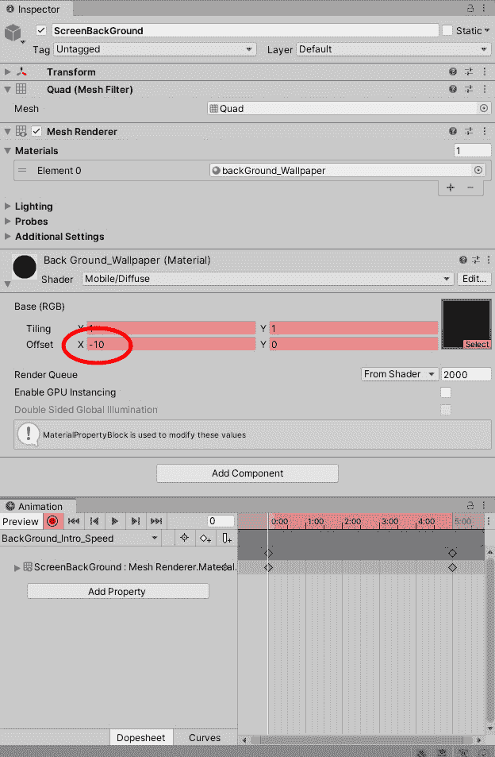

图 4.61 – 动画背景壁纸材质属性的偏移值

1.  将`-10`更改为`1`。注意，在以下截图中的`300`（5 分钟）：

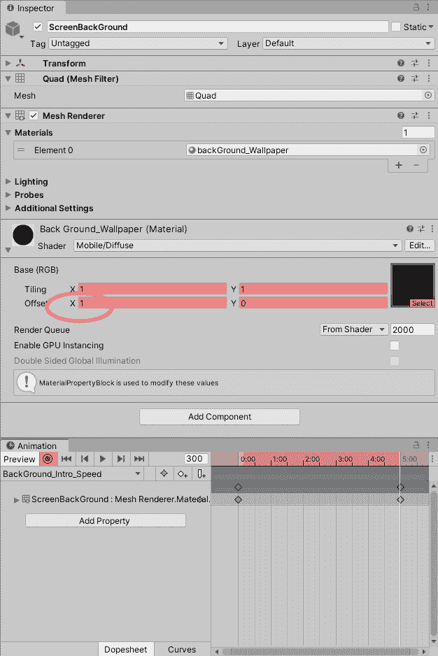

图 4.62 – 添加第二个关键帧并更改背景壁纸偏移值

1.  在我们的两个动画点之间前后移动白色线条（动画师称此为**scrub**）。注意四边形上的星星是如何移动的。

现在，让我们对`warpStars_pe`粒子系统做类似的事情：

1.  确保动画窗口仍然锁定并记录。

1.  将动画指示线完全移回到左侧，到另一个动画关键帧的开始处。

1.  从`warpStars_pe`。

在**检查器**标签页的**变换**部分，进行以下更改：

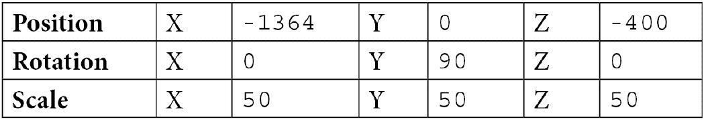

然后，将白色线条移动到与星形背景关键帧完全相同的点。

小贴士

我们可以在**动画**窗口中点击**下一帧**按钮跳转到下一个关键帧（位于**播放**按钮右侧的按钮，而不是编辑器播放按钮）。

在**层次结构**窗口中仍然选择`warpStars_pe`游戏对象，并在**检查器**窗口中更新其**变换**设置，如下所示：

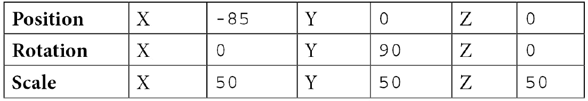

1.  在**动画**窗口中尝试前后拖动，以查看在**场景**视图中看起来如何。你应该看到粒子从右向左移动。

1.  在**动画**窗口中，关闭记录设置。

这样一个动画就完成了，还有一个要完成。下一个过程与我们已经做过的类似，但稍微快一点。

在**层次结构**窗口中仍然选择**warpStarts_pe**，并且动画窗口仍然打开，执行以下操作：

1.  按照以下截图所示，使用鼠标单击并拖动选择所有关键帧：

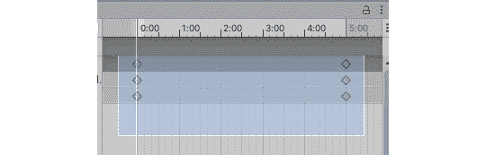

图 4.63 – 选择所有关键帧

1.  释放鼠标并按*Ctrl*（或在 macOS 上为*Command*）+ *C*复制关键帧。

1.  现在，通过单击当前动画的名称并选择另一个，切换到`BackGround_InGame_Speed`动画，如图所示：

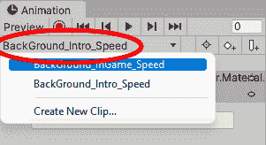

图 4.64 – 在动画窗口中选择我们的第二个动画文件，BackGround_InGame_Speed

1.  注意名称如何更改以反映我们所在的动画。

1.  现在，在图表区域单击并使用*Ctrl*（或在 macOS 上为*command*）+ *V*键盘命令。

1.  现在，我们应该已经将之前的动画粘贴到这个动画中。我们可以在窗口内操作结果，如图所示：

    小贴士

    如果您在**动画**窗口中看不到所有关键帧，请选择窗口内的一个开放区域，并在键盘上按下*F*键。这将自动调整所有关键帧。

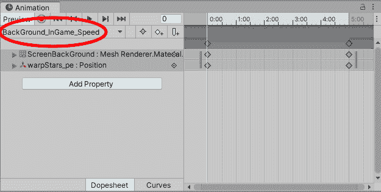

图 4.65 – BackGround_InGame_Speed 动画文件及其在动画窗口中粘贴的关键帧

最后，我们可以操作关键帧：

1.  点击**动画**窗口以开始录制。

1.  从`ScreenBackground`。

1.  从`backGround_Wallpaper` `-10`到`1`。

1.  点击`1`到`2`。

1.  接下来，我们在最左侧的`warpStars_pe`关键帧中修改`warpStars_pe`动画，并在键盘上按下*Delete*键。现在，将最后一个关键帧从末尾移动到开头。

在停止录制之前，我们需要停止动画的渐出（在动画末尾减速）。

要使我们的`backGround_Wallpaper`设置在固定的动画速度上，我们需要做以下操作：

1.  在**动画**窗口中，点击并拖动以选择所有键。

1.  右键单击，从下拉菜单中选择**两个切线** | **线性**。

1.  停止录制。

让我们回顾一下到目前为止我们所做的工作。我们取了`1`，使其回到其**X**值**偏移**的起始位置。

在第一个动画中，我们将粒子从左到右移动；在第二个动画中，我们保持粒子在右侧，以避免场景过于杂乱，并显示我们并没有移动得那么快。

我们现在处于动画的最后步骤；其余工作在 Animator Controller 中进行。从 Animator Controller 中，我们可以声明需要循环的内容以及我们的动画如何相互关联。

在本章的最后，让我们访问动画控制器，并开始从一种状态到另一种状态的拼接：

1.  从`GameSpeed`游戏对象。

1.  然后，在`GameSpeed_Controller`。

1.  现在，点击`BackGround_Intro_Speed`和`BackGround_InGame_Speed`之间的过渡线（以下参考截图所示）。

关于动画之间的过渡，以下截图通过两个蓝色条设置这些状态示例。选择以下设置：

+   **具有退出时间**：已勾选。

**具有退出时间**提示信息显示**过渡具有固定的退出时间**。

+   `0.1`

**退出时间**提示信息显示**退出时间是当前状态的标准时间**。

+   **固定持续时间**：已勾选。

**固定持续时间**提示信息显示**过渡持续时间与状态长度无关**。

+   `2.5`

**过渡持续时间（秒）**提示信息显示**过渡持续时间为秒**。

+   `0.1`

**过渡偏移**提示信息显示**下一个状态的标准开始时间**。

+   **中断源**：**无**

**中断源**提示信息显示**可以被以下过渡中断**：

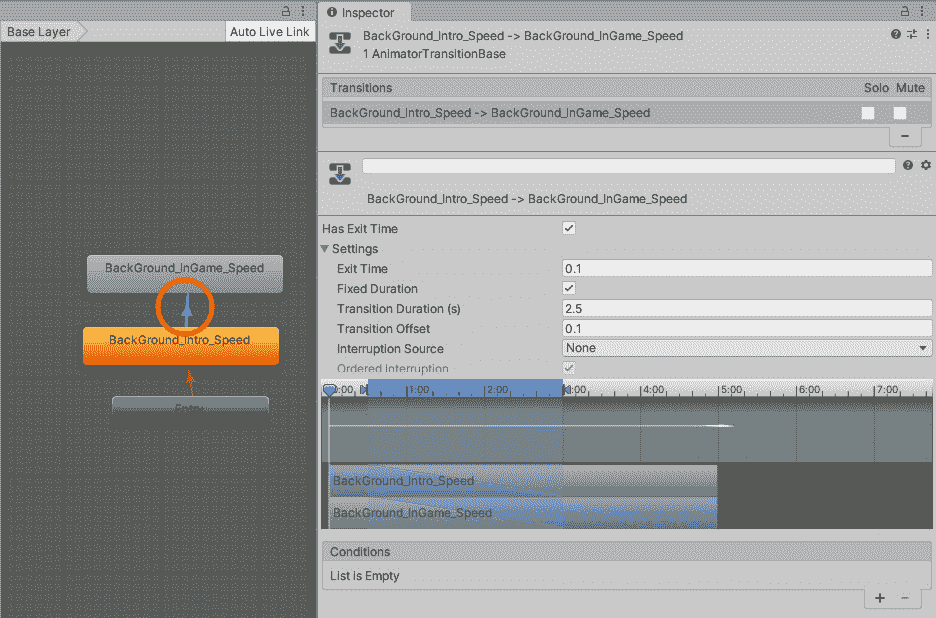

图 4.66 – 在检查器窗口中更新过渡值

这个过渡的图形比较粗糙。对于动画来说，输入完美的图形也很不自然。我建议从场景中移除任何敌人。点击**播放**按钮并调整图上的选择条。每次选择改变时，动画都会再次播放。注意 Animator Controller；你会看到一个进度条开始和结束。这将有助于动画拼接的时间安排。

信息

动画过渡可以帮助将一个动画平滑地过渡到另一个。例如，如果我们想在精确的时间框架内将一个动画移动到另一个，我们会关注**固定持续时间**和**过渡持续时间**参数（如前一张截图所示）。

关于动画过渡的更多信息，请查看[`docs.unity3d.com/Manual/class-Transition.html`](https://docs.unity3d.com/Manual/class-Transition.html)。

我得到的结果非常平滑且效果良好，但我建议忘记图形。将编辑器置于**播放**模式，并拖动选择条直到得到适合你的拼接点。

那就是 Animator Controller 设置的结束。这是那种解释起来需要很长时间但一旦知道了怎么做就非常快的事情。

你可能迫不及待地想要回到编码，因为我们主要一直在使用 Unity 的编辑器工具。那么，让我们回到 IDE，开始看看如何进行动画制作。

# 动画我们的三维敌人

这里有一个非常简单、快速的动画脚本，用于你的敌人。目前，敌人只是以波浪模式上下移动。然而，单位本身是静态的。

让我们用一些代码给我们的敌人增加一点额外的生命力：

1.  在`Assets/Prefab/Enemies`。

1.  双击`enemy_wave`预制体，并在**层次结构**窗口中选择`enemy_wave_ring`。

1.  在**检查器**窗口中，点击**添加组件**按钮。

1.  在下拉菜单底部点击**新建脚本**。

1.  将新的 C#脚本命名为`BasicEnemyRotate`。

1.  然后，输入以下代码：

    ```cs
    using UnityEngine;
    public class BasicEnemyRotate : MonoBehaviour 
    {
     [SerializeField]
     float speed = 0;
    void Update ()
      {
       transform.Rotate(Vector3.left*Time.deltaTime*speed);
      }
    }
    ```

这是一个微小的脚本，用于动画化我们的敌人部分。有两件事需要仔细查看：

+   变量是一个名为`speed`的私有浮点数，具有`SerializeField`属性，因此可以在**检查器**窗口中看到。更多关于此属性的信息可以在[`docs.unity3d.com/ScriptReference/SerializeField.html`](https://docs.unity3d.com/ScriptReference/SerializeField.html)找到。

+   在我们的`Update`函数中，我们根据设定的速度随时间旋转游戏对象。我在**检查器**中将敌人的旋转速度设置为`200`。

一旦你通过`enemy_wave`预制体创建了、添加并更新了你的脚本新内容。

1.  要更新预制体，请点击**层次结构**窗口左上角的左箭头，如图下所示：

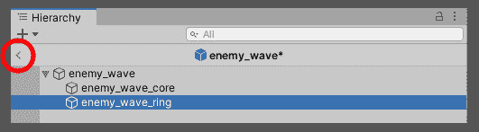

图 4.67：更新预制内容

1.  将出现一个弹出窗口以确认新的更改，只需点击**保存**。

1.  现在你已经知道如何更新预制体，再次从**项目**窗口中选择`enemy_wave`预制体，像之前一样双击它。

接下来，我们将按照以下步骤更新其视觉效果：

1.  在`enemy_wave_core`中展开`enemy_wave`游戏对象。

1.  在**检查器**窗口下，选择**元素 0**参数右侧的小型圆形遥控按钮。

1.  选择`basicEnemyShip_Inner`材质。

1.  从**层次结构**窗口中选择`enemy_wave_ring`。

1.  从`basicEnemyShip_Outer`。

1.  最后，像之前一样更新预制体，通过点击**层次结构**窗口左上角的箭头，然后在弹出的窗口中点击**保存**。

1.  在编辑器顶部点击**播放**，我们现在应该看到我们的敌人正在旋转并着色：

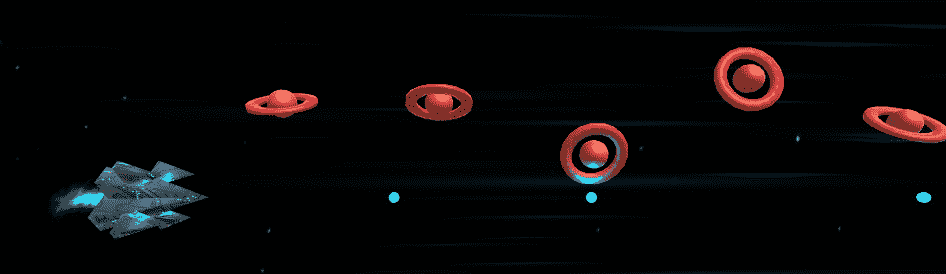

图 4.67 – 正在向玩家移动的旋转敌人

最后，将所有新脚本移动到`Script`文件夹中。

之后，我们可以根据玩家的技能水平加快敌人的旋转速度，使其看起来更具侵略性。

这是一章很长的内容，但我们涵盖了粒子和动画，这些对于考试来说很重要。通过更多的实践和理解，我们所学的益处将真正开始显现。现在是熟悉这两种技能的好时机，因为它们通常被忽视。正是这些技能让你与众不同。

# 摘要

在本章中，我们进入了艺术世界。我们让玩家的飞船栩栩如生，给它配备了一系列地图和灯光。然后，我们转向 Unity 的粒子系统，创建了一个带有扩展选项的`推进器`对象。接着，我们进入了动画制作，动手制作场景背景和动画粒子扭曲星。我们讨论了状态和转换，然后通过为敌人编写一些动画代码来平息一切。

这已经很多了！如果你再次回顾这一章，你会更快地完成它，因为你会发现，如果你还没有这样做，你可以复制和粘贴动画关键帧，复制和粘贴粒子系统，并对其进行调整。

在下一章中，我们将查看一个新的场景，在该场景开始之前，我们将通过引入商店来升级玩家的飞船。我们还将介绍流行的**免费游玩游戏**概念，这在移动游戏中很常见，游戏可以免费下载，用户可以选择通过观看广告来获得游戏内积分。

干得好！你所学的所有内容都将有助于你的考试和未来的项目。
