# 第五章：*第五章*：为我们的游戏创建商店场景

在本章中，我们将整合并扩展在上一章中大量帮助制作玩家和敌舰的可脚本化对象。我们将定制一个新的商店场景，其中我们将使用可脚本化对象为玩家的飞船添加新的升级。

我们还将探讨射线投射的常见用途；如果你不熟悉它们，它们最好被描述为从一个点到另一个点的无形激光：

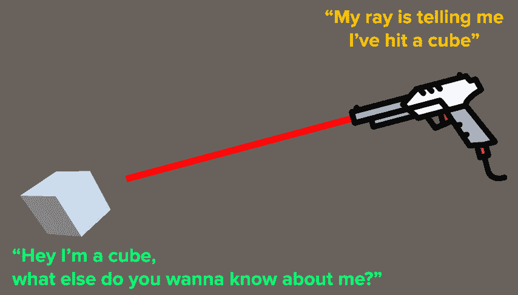

图 5.1 – 使用射线投射识别游戏对象

当射线击中具有碰撞器的游戏对象时，它可以检索有关该对象的信息，然后我们可以进一步操作我们击中的对象。例如，我们可以向一个立方体游戏对象投射射线，射线将确认它是一个立方体。因为我们有立方体的引用，我们可以改变它的颜色或缩放，或位置或销毁它 – 我们几乎可以对其做任何我们想做的事情。在这里，我们将使用这个射线投射系统，在我们点击或触摸屏幕时，从摄像机的位置向三维空间中的按钮发射一个点。

在本章中，我们将涵盖以下主题：

+   介绍我们的商店脚本

+   定制我们的商店选择

+   使用射线投射选择游戏对象

+   向我们的描述面板添加信息

到本章结束时，我们将能够轻松地将一件艺术品添加功能，使其更有用。脚本化对象是我们的朋友，在本章中我们将更多地使用它们 – 添加属性和值，以便我们的商店中的每个选项都可以持有精灵、价格和描述。商店按钮将是 3D 的，并通过我们的无形激光（射线投射系统）进行选择。

# 本章涵盖的核心考试技能

*我们将涵盖编程核心交互*：

+   实现和配置游戏对象的行为和物理

+   实现和配置输入和控制

*我们还将涵盖在艺术管道中工作*：

+   理解材质、纹理和着色器，并编写与 Unity 渲染 API 交互的脚本

*本章还涵盖开发应用程序系统*：

+   解释用于应用程序界面流程的脚本，如菜单系统、UI 导航和应用设置

+   解释用户自定义脚本，如角色创建器、库存、店面和内购

+   分析用于用户进度功能的脚本，如得分、等级和游戏内经济，利用 Unity Analytics 和 PlayerPrefs 等技术

+   分析用于二维叠加的脚本，如**抬头显示**（**HUDs**）、小地图和广告

*我们还将涵盖编程场景和环境设计*：

+   介绍实现游戏对象实例化、销毁和管理的方法

*最后，我们将涵盖在专业软件开发团队中工作*：

+   识别用于结构化脚本的模块化、可读性和可重用性技术

# 技术要求

本章的项目内容可在 [`github.com/PacktPublishing/Unity-Certified-Programmer-Exam-Guide-Second-Edition/tree/main/Chapter_05`](https://github.com/PacktPublishing/Unity-Certified-Programmer-Exam-Guide-Second-Edition/tree/main/Chapter_05) 找到。

您可以下载每个章节的项目文件的全部内容，在 [`github.com/PacktPublishing/Unity-Certified-Programmer-Exam-Guide-Second-Edition`](https://github.com/PacktPublishing/Unity-Certified-Programmer-Exam-Guide-Second-Edition)。

本章的所有内容都存储在章节的 `unitypackage` 文件中，包括一个 `Complete` 文件夹，其中包含我们在本章中将要完成的所有工作。

查看以下视频以查看 *代码的实际应用*：[`bit.ly/3klZZ9q`](https://bit.ly/3klZZ9q)。

# 介绍我们的商店脚本

在本节中，我们将创建一些新的可脚本化对象，就像我们创建玩家的飞船设置（健康、速度、火力等）时做的那样。您可以参考 *第二章* 的 *介绍我们的脚本化对象* (`SOActorModel`) 部分，以提醒如何完成此操作。我们不会改变敌人的或玩家的飞船，而是将操纵商店的选择（带有选择网格）以添加玩家可以选择的自己的飞船升级。这些升级然后将转移到玩家的飞船上，这将从视觉上得到识别，并且其中两个升级将对游戏玩法进行修改。

在我们进一步详细介绍之前，让我们回顾一下商店脚本在我们介绍的 *第一章，设置和构建我们的项目* 中的游戏框架中的位置。

以下图表显示了商店脚本的位置：

![Figure 5.2 – Killer Wave's UML

![img/Figure_5.02_B18381.jpg]

图 5.2 – 杀手波浪的 UML

我们的三种商店脚本（`PlayerShipBuild`、`ShopPiece` 和 `SOShopSelection`）从 `PlayerShipBuild` 连接到主中心 `GameManager` 脚本相互连接。简而言之，每个脚本在商店场景中的职责如下：

+   `PlayerShipBuild` 是商店的整体功能，包括广告和在游戏中的信用控制。此脚本可以分解为更多脚本，但为了尽量保持我们的框架最小化，对于演示来说是可以的。

+   `ShopPiece` 处理玩家飞船升级选择的内 容。

+   `SOShopSelection` 是一个可脚本化的对象，它包含将在我们的商店场景中的每个选择网格中使用的数据类型。

让我们看看我们将要创建的场景，并开始将其应用于商店脚本，如下所示：

1.  从 `Scene` 文件夹。

1.  双击 `shop` 场景。

1.  从 `Assets/Prefab` 中拖放 `ShopManager` 预制体。

1.  选择 `0`、`0` 和 `0`。

1.  如果你想有不同的背景颜色，在**层次结构**窗口中仍然选择**摄像机**，将**清除标志**属性从**天空盒**更改为**纯色**。

    信息

    确保摄像机保持与我们之前在*第二章*中设置的相同屏幕比例（即 1920 x 1080）。以下截图供参考。

以下场景分为四个部分：


图 5.3 – 我们的商店布局

看一下之前的截图，让我们逐一过一下编号的点：

+   从`testLevel`场景开始（这是我们之前四章一直在工作的场景）。

+   在左上角（**2**），我们有玩家飞船的视觉表示。我们可以看到如果他们购买升级，它将看起来像我们的玩家飞船。

+   在玩家飞船下方（**3**）有一个小矩形，将显示游戏中的信用余额。

+   在右上角（**4**），一个更大的矩形将包含关于我们选定的升级的信息。它还将包含一个按钮，如果玩家有足够的信用分且/或尚未购买该物品，将给他们提供购买升级的选项。

我们可以从选择网格（商店的按钮行）开始。为了节省时间，我已经为这个场景提供了一些模板艺术，因为我们将在下一章创建自己的 UI 时替换它。

要开始我们的商店选择网格中的第一个按钮，我们需要进入 Unity 编辑器的**层次结构**窗口并执行以下操作：

1.  在以下截图所示的`upgrade`的右上角：


图 5.4 – 在层次结构窗口中寻找包含单词"upgrade"的游戏对象

1.  现在，选择标题为`UPGRADE_00`的顶级游戏对象。

    信息

    注意，除了 Unity 编辑器中**层次结构**窗口中选定的游戏对象外，**场景**窗口的内容都是灰色的。这是为了帮助我们定位正在寻找的游戏对象。

1.  点击搜索栏右侧的圆形**x**符号。这将使我们的**层次结构**内容返回并展开父游戏对象，如下截图所示：

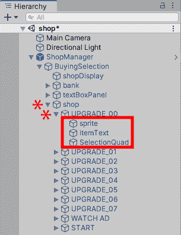

图 5.5 – UPGRADE_00 的子对象

1.  按住键盘上的*Ctrl*（或在 macOS 上按*command*）并选择三个游戏对象：

    +   `sprite`

    +   `itemText`

    +   `SelectionQuad`

1.  在选择了这三个对象后，选择**检查器**窗口中的左上角的复选框以使这些对象激活。复选框的位置在以下截图中有显示：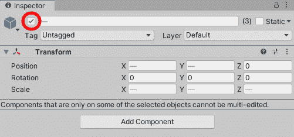

图 5.6 – 使用复选框显示和隐藏游戏对象

我们的网络应该现在显示其第一个选择，如下面的截图所示：

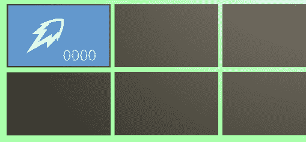

图 5.7 – 我们的第一个商店按钮

我们的商店已经开始成形。在设置第一个选择后，我们可以在下一节通过代码自定义这些选择。

## 导入和校准我们的精灵游戏对象

我标记为`sprite`的游戏对象将接收并显示一个将在选择网格中显示的船升级图像。为了了解这个精灵如何正确显示，我们可以查看当其游戏对象在**层次结构**窗口中被选中时的属性。

`sprite`游戏对象附有一个**精灵渲染器**组件：

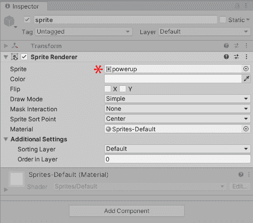

图 5.8 – 精灵渲染器组件

我将`sprite`游戏对象属性灰显，这是我们为`powerup`属性提供哪种对象类型，这将在**场景**窗口中给我们一个类似火焰的图标。

让我们检查`powerup`属性，以确保我们对其数据类型和它在 Unity 编辑器中的识别有把握。

要查看精灵的数据类型，请按照以下步骤操作：

1.  在**精灵渲染器**部分的**检查器**窗口中，当`sprite`游戏对象仍然被选中时。

1.  当从**精灵渲染器**组件中选择时，`powerup`精灵的位置将在`powerup`精灵位置 ping 中出现：


图 5.9 – 我们'powerup'精灵在项目窗口中的位置

1.  接下来，点击`powerup`精灵导入设置中`powerup`属性的父级。

大多数信息不需要更改，但主要关注点是确保**纹理类型**设置为**精灵**，以便文件与**精灵渲染器**组件兼容。

以下截图显示了我们的`powerup`文件被识别为精灵，窗口底部有图像预览：

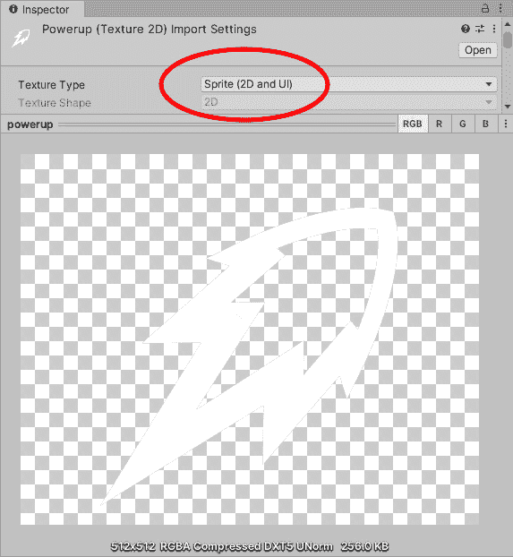

图 5.10 – 我们的'powerup'文件将在纹理类型字段中设置为精灵

有可能当精灵，如前一个截图中的`powerup`纹理，被导入 Unity 时，它可能不会被识别为精灵，并将被赋予`Default`类型。这是因为`Default`是纹理最常见的选项，尤其是在三维模型中。`Default`还提供了更多关于纹理属性的选项。

更多信息

如果你想了解更多关于纹理类型的信息，请查看[`docs.unity3d.com/Manual/TextureTypes.html`](https://docs.unity3d.com/Manual/TextureTypes.html)。

关于我们的`powerup`纹理，我们不需要将其更改为`默认`。当我们添加另一个选择时，应该执行相同的检查图像类型的原理。现在让我们继续到`UPGRADE_00`游戏对象的第二个游戏对象`itemText`。

## 在我们的`itemText`游戏对象上显示信用信息

`UPGRADE_00`的第二个子游戏对象是`itemText`。这个游戏对象中的文本包含一个`SOLD`。

以下截图显示了**Text Mesh**组件与**场景**窗口中文本之间的连接：

![Figure 5.11 – Text Mesh text set to '0000']

![img/Figure_5.11_B18381.jpg]

图 5.11 – 将 Text Mesh 文本设置为'0000'

现在让我们继续到最后一个`UPGRADE_00`层次结构的子游戏对象，即`SelectionQuad`。

## 在创建 SelectionQuad 时进行项目文件诊断

在本节中，我将简要解释商店选择网格是如何准备的。

`SelectionQuad`是`UPGRADE_00`游戏对象的第三个子游戏对象，如下截图所示：

![Figure 5.12 – The SelectionQuad game object in the Hierarchy window]

![img/Figure_5.12_B18381.jpg]

![Figure 5.12 – The SelectionQuad game object in the Hierarchy window]

这个游戏对象仅仅用来向玩家显示他们已经做出了选择。它由一个四边形网格组成，这是一个在 Unity 中可以创建的标准原语（通过在**层次结构**窗口中右键单击并选择**3D 对象 | 四边形**）。我们现在将改变其外观，通过操作其材质值使其看起来更有趣；请按照以下步骤操作：

1.  一旦将`Quad`对象移动到位置，将其**材质**属性从**不透明**渲染模式更改为**透明**（**1**）。

1.  然后，点击`64`、`152`、`255`和`140`。以下截图显示了`SelectionQuad`材质所做的颜色属性更改：

![Figure 5.13 – Rendering Mode set to Transparent and the RGBA values modified to a light blue color]

![img/Figure_5.13_B18381.jpg]

图 5.13 – 渲染模式设置为透明，并将 RGBA 值修改为浅蓝色

1.  那就是我们的`UPGRADE_00`选择的全貌。然后，将每个游戏对象复制并粘贴到两个更多的黑色矩形上，并将它们重命名为`UPGRADE_01`和`UPGRADE_02`。

以下截图显示了三个游戏对象：

![Figure 5.14 – Duplicating the game objects]

![img/Figure_5.14_B18381.jpg]

图 5.14 – 复制游戏对象

为了本章的目的，我们将使用这三个游戏对象来操作并将信息从一个场景传递到另一个场景。在我们开始为这些选择编写脚本之前，我想向您展示一些将被添加到网格最右侧两个略大的按钮上的文本：

1.  在`WATCH AD`和`START`中向下滚动。这两个游戏对象将承担以下责任：

    +   当玩家选择此按钮时使用`WATCH AD`；将播放广告。广告结束后，玩家将获得积分奖励。这些积分可以用来购买更多升级。

    +   当玩家完成商店操作时使用`START`。他们可以通过按下**START**按钮继续前进。

1.  通过点击每个对象左侧的箭头来展开`WATCH AD`和`START`。

1.  点击每个游戏对象，并在**检查器**窗口中使它们处于活动状态，就像我们在*介绍我们的商店脚本*部分中做的那样。

在每个展开的游戏对象中，我们都有一个标签游戏对象；这个对象包含一个**文本网格**组件，我们已经在本节中介绍过，用于显示按钮文本。

以下截图显示了**层次结构**窗口中展开的`WATCH AD`和`START`对象：

![图 5.15 – `WATCH AD`和`START`按钮的位置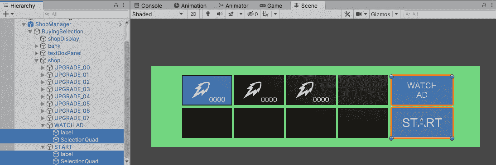

图 5.15 – `WATCH AD`和`START`按钮的位置

到目前为止，我们了解到我们将有一个包含我们飞船升级的可脚本化对象的商店场景；我们也知道观看广告以获得积分是免费游戏中的一个流行机制。

这就是我们选择网格所需的所有内容。现在我们可以开始考虑如何在下一节中开启和关闭按钮，更改每个升级的图标，以及更多操作。

# 自定义我们的商店选择

在本节中，我们将使用可脚本化对象来定制每个选择。我们已经在*第二章*，*添加和管理对象*中使用了可脚本化对象。这次，我们将使用类似的方法，但针对我们的选择网格；希望这能让你欣赏到可脚本化对象如何在游戏中扩展和使用。

如*第二章*中所述，*添加和管理对象*，我习惯于使用`SO`前缀初始化可脚本化对象，以便于识别。让我们创建一个`SOShopSelection`脚本：

1.  在 Unity 编辑器中，转到`Assets/Script`。

1.  创建一个脚本（使用与*第二章**,* *添加和管理对象*)相同的方法）并命名为`SOShopSelection`。

这个`SOShopSelection`脚本将为我们的资产文件（与我们的玩家和敌舰相同）创建数据类型模板。这些资产文件将附加到每个玩家飞船的升级上。

网格中的单个选择将包含四种属性类型，如下所示：

+   `icon`：选择图片。

+   `iconName`：标识选择的内容。

+   `description`：用于描述在场景右上角的大选择框中升级的内容。

+   `cost`：计算升级值，以便在选择的积分值中显示。

让我们打开`SOShopSelection`脚本并开始编码：

1.  在脚本顶部，确保我们已导入以下库：

    ```cs
    using UnityEngine;
    ```

与 Unity 中大多数脚本一样，我们需要 `UnityEngine` 库，以便我们可以使用 `ScriptableObject` 功能。

1.  为了能够从可脚本对象中创建资产，我们在类名上方输入以下属性：

    ```cs
    [CreateAssetMenu(fileName = "Create Shop Piece", menuName = 
       "Create Shop Piece")]
    ```

1.  输入以下代码以将 `ScriptableObject` 继承到 `SOShopSelection` 脚本中。这将为我们提供创建模板资产文件的功能：

    ```cs
    public class SOShopSelection : ScriptableObject
    {
    ```

1.  输入以下代码以保存特定的变量：

    ```cs
      public Sprite icon;
      public string iconName;
      public string description;
      public string cost;
    }
    ```

1.  保存脚本。

我们已经编写了脚本以保存网格中每个潜在选择的资料。如前所述，我们之前已经创建了这些类型的脚本 – 我们只是在这里使用它们来定制按钮，而不是宇宙飞船。

现在，我们可以在 Unity 编辑器中自定义我们的三个 `UPGRADE` 游戏对象 – 让我们接下来这么做。

## 创建选择模板

在最后一节中，我们创建了一个可脚本对象，允许我们创建一个包含自定义参数和值的资产文件。这些资产及其属性可以由不具备编程知识的用户创建，这对于设计师和程序员来说是非常理想的。

我们有三个选择要添加到我们的选择网格中：

+   **武器升级**：赋予玩家飞船更强的武器

+   **健康升级**：允许玩家的飞船被敌人对象击中两次

+   **原子弹**：清除所有可见的敌人

因此，让我们回到 Unity 编辑器，并为我们的选择网格创建一些资产模板：

1.  从 `Assets/ScriptableObject`。

1.  在 **项目** 窗口的空白区域右键单击，然后从出现的下拉菜单中选择 **创建**，然后选择 **创建 Shop Piece**，如图下所示截图：


图 5.16 – 创建 'Shop Piece'

1.  将新的 `Create Shop Piece` 文件重命名为 `Shot_PowerUp`。

1.  当 `Shot_PowerUp` 仍然被选中时，导航到 **检查器** 窗口，在那里我们有可以输入的数据类型。

以下截图显示了我们将要更改的 `Shot_PowerUp` 属性：

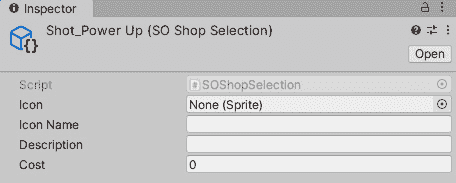

图 5.17 – 射击 _ 增强属性

1.  我们将通过点击其字段右侧的小圆圈，将我们的 `powerup` 精灵图标应用到 **图标** 数据类型。

1.  在 `powerup` 精灵中向下滚动，然后双击，如图下所示截图：

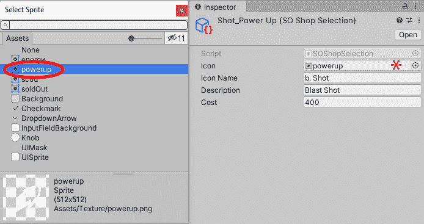

图 5.18 – 更新商店按钮图标

1.  现在，输入以下属性名称以及我们将赋予它们的值：

    +   `b. 射击`

    +   `Blast Shot`

    +   `400`

1.  如同之前所做的那样，创建另一个 `ShopPiece` 资产。

1.  这次，将资产名称从 `Create Shop Piece` 更改为 `Health_Level1`，并给出以下截图中的详细信息：

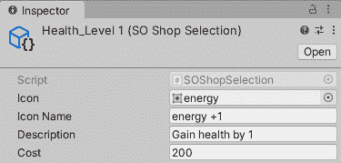

图 5.19 – 健康按钮属性

1.  现在，让我们制作第三个资产文件，使用与最后两个资产完全相同的流程，但这次将其命名为`Bomb_Cluster`并给出以下详细信息：

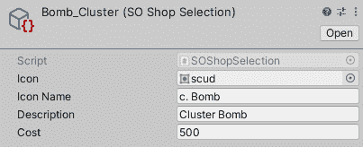

图 5.20 – 炸弹集群按钮属性

我们已经制作了可脚本对象并为其飞船的升级进行了配置。现在让我们制作第二个主要脚本，即`ShopPiece`。此脚本将包含我们刚刚制作的每个资产文件，并在商店的网格场景周围显示其内容。

## 定制我们的玩家飞船升级选择

此脚本的目的是将信息发送到我们商店场景中的每个选择按钮。对于三个`UPGRADE`游戏对象中的每一个，我们将创建并附加一个脚本，该脚本引用`SOShopSelection`可脚本对象（我们在上一节中制作的三个资产文件）并将它们分配给每个玩家飞船的升级按钮。

要创建`ShopPiece`脚本，请执行以下操作：

1.  让我们从**项目**窗口导航到`Assets/Script`开始。

1.  以与在*定制我们的商店选择*部分开始时相同的方式创建脚本，并将脚本命名为`ShopPiece`。

1.  打开脚本并开始编写代码，从脚本顶部的`UnityEngine`库开始：

    ```cs
    using UnityEngine;
    ```

由于我们正在使用 Unity 的元素并将`ShopPiece`脚本附加到 Unity 编辑器中，因此此脚本将需要`UnityEngine`库。

1.  检查并输入以下代码以声明类名和继承：

    ```cs
    public class ShopPiece : MonoBehaviour 
    {
    ```

默认情况下，我们的脚本应该自动命名，并继承`Monobehaviour`。

1.  输入以下代码以允许更新`shopSelection`实例：

    ```cs
    [SerializeField]
      SOShopSelection shopSelection;
      public SOShopSelection ShopSelection
      {
        get {return shopSelection; }
        set {shopSelection = value; }
      }
    ```

我们添加了对上一节中制作的`SOShopSelection`脚本的引用。此引用是私有的（因为它没有标记为`public`），但我们通过其上方的`[SerializeField]`函数将其暴露给 Unity 编辑器。这意味着我们可以将每个可脚本资产文件拖放到 Unity 编辑器中的字段。如果另一个脚本需要访问私有的`shopSelection`变量，我们可以引用将接收和发送其数据的`ShopSelection`属性（`get`和`set`）。

1.  输入以下代码以更新`shopSelection`精灵：

    ```cs
    void Awake()
      {
       //icon slot
       if (GetComponentInChildren<SpriteRenderer>() != null)
      {
       GetComponentInChildren<SpriteRenderer>().sprite = 
         shopSelection.icon;
      }
    ```

当此脚本首次激活并运行时，它将运行其`Awake`函数。在函数内部有两个`if`语句；第一个检查其任何子游戏对象中是否有`SpriteRenderer`组件。如果有，则从其`shopSelection`资产文件中获取引用并将其图标精灵应用到按钮上显示。

1.  输入以下代码以更新成本值：

    ```cs
       //selection value
        if(transform.Find("itemText"))
        {
          GetComponentInChildren<TextMesh>().text =     shopSelection.cost;
        }
      }
    ```

替代`if`语句检查此类的任何子游戏对象是否有一个名为`itemText`的游戏对象。

如果有一个名为`itemText`的游戏对象，我们将其`TextMesh`组件的`text`值更新为`shopSelection`成本值。

1.  保存脚本。

回到 Unity 编辑器，我们可以附加 `ShopPiece` 脚本，以及我们在上一节中制作的每个资产脚本。

要将每个 `ShopPiece` 脚本附加到每个 `UPGRADE` 游戏对象文件，请按照以下步骤操作：

1.  从 `UPGRADE_00` 游戏对象。

1.  您可以从 `Assets /Script` 中拖放 `ShopPiece` 脚本，或者在 **检查器** 窗口中点击 **添加组件** 并在下拉搜索中输入脚本的名称。

1.  `UPGRADE_00` 将是我们的武器升级按钮，因此对于 `Assets /ScriptableObject` 或点击 `Shot_PowerUp` 右侧的小圆圈，使用以下截图作为参考，以查看您的 **检查器** 窗口应如何显示：

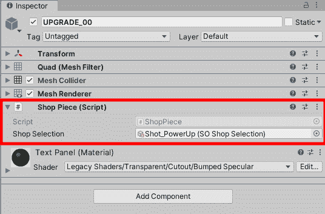

图 5.21 – 包含 'Shop_PowerUp' 可脚本对象的 'Shop Piece' 脚本

1.  现在，重复此过程为 `UPGRADE_01`，给游戏对象添加 `ShopPiece` 脚本，并在其 `ShopPiece` 组件中使用 `Health_Level1` 资产为 `UPGRADE_01`：


图 5.22 – 包含 'Health_Level1' 可脚本对象的 'Shop Piece' 脚本

1.  最后，为 `UPGRADE_02` 完成相同的程序，添加 `ShopPiece` 脚本，并将 `Bomb_Cluster` 应用到 `ShopPiece` 脚本中：


图 5.23 – 包含 'Bomb_Cluster' 可脚本对象的 'Shop Piece' 脚本

1.  要测试三个选择组件是否在选择网格中正常工作，请保存当前场景，并在 Unity 编辑器中点击 **播放** 按钮。

我们的选择网格应从顶部三个具有相同图像和相同值（不在播放模式中）的按钮开始，到每个图像和值都不同（在播放模式中）：

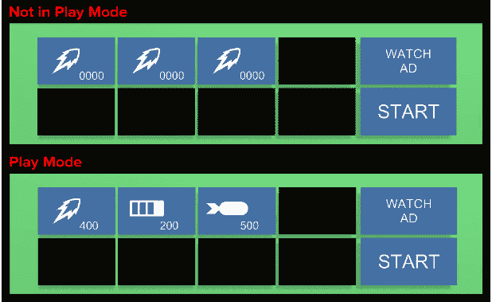

图 5.24 – 在播放模式中更新价格的商店按钮

如果您还记得，我们的资产文件有名称和描述数据；当在商店场景中提供有关物品的信息时，我们可以使用这些数据。此外，我们还需要更新玩家的飞船视觉效果，以显示在飞船上购买的外观，以及一些其他事情。在下一节中，我们将创建一个脚本，允许玩家从选择网格中按按钮。

# 使用射线投射选择游戏对象

在本节中，我们将创建最终的商店脚本 `PlayerShipBuild`。此脚本包含选择选择网格中的任何按钮、运行广告、与现有的游戏框架脚本通信、启动游戏进行播放以及其他我们将要介绍的一些功能。

你在 Unity 程序员考试中可能会遇到的一个主题，以及在 Unity 中开发游戏/应用程序时，是发射不可见的激光，这些激光用于射击枪、在三维空间中进行选择等。在本节中，我们将创建一个按钮，当玩家按下它时，选择网格上的按钮会亮起蓝色，以便让他们知道它已被选中。我们已经在每个按钮上设置了永久开启的蓝色矩形。因此，我们现在需要做的只是当场景变得活跃时关闭它们，并在射线（不可见激光）与它们接触时打开任何按钮。

以下截图显示了玩家看到的 2D 选择屏幕（**选择 2D**）以及从角度看到的相同场景，以便我们可以看到主摄像机的裁剪平面（**选择 3D**）。当玩家按下选择网格上的按钮时，一条不可见的线（射线）将穿过它。如果这条线接触到附加了碰撞器的游戏对象，我们可以从该游戏对象获取信息：

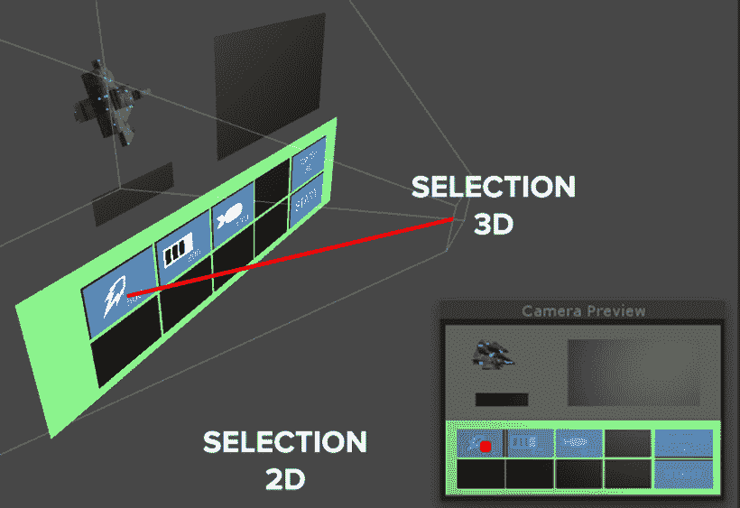

图 5.25 – 从我们的摄像机位置发射射线以选择商店中的按钮

因此，对于这个选择，我们将开始创建一个`PlayerShipBuild`脚本，并赋予它发射射线的能力，这将改变按钮的颜色。

让我们从在常规`Assets/Script`目录中创建一个名为`PlayerShipBuild`的脚本开始。你现在应该知道如何创建脚本，因为我们已经在之前的*自定义我们的玩家飞船升级选择*部分中这样做过了。

要创建射线选择，打开`PlayerShipBuild`脚本并按照以下步骤操作：

1.  默认情况下，我们要求使用 Unity 引擎库，如前所述：

    ```cs
    using UnityEngine;
    ```

1.  输入以下代码以声明我们的类：

    ```cs
    public class PlayerShipBuild : MonoBehaviour 
    {
    ```

我们的脚本有一个`public`访问修饰符，并且与`PlayerShipBuild`文件同名。

此脚本继承自`MonoBehaviour`，因此在编辑器中附加到游戏对象时会被识别。

1.  输入以下代码以保持每个`shopButtons`：

    ```cs
      [SerializeField]
      GameObject[] shopButtons;
    ```

我们有一个`private`变量，在编辑器中通过`[SerializeField]`暴露（因此我们可以查看和编辑它），它将保存选择网格上所有 10 个游戏对象按钮的数组。

1.  输入以下代码以保持两个用于射线的游戏对象：

    ```cs
      GameObject target;
      GameObject tmpSelection;
    ```

`tmpSelection`变量用于存储射线选择，以便我们可以检查我们接触到了什么。目标变量将在脚本中稍后使用。

`tmpSelection`将在选择过程结束时使用，用于打开游戏对象。

1.  在`Start`函数中输入以下代码以运行我们的方法：

    ```cs
      void Start()
      {
        TurnOffSelectionHighlights();
      }
    ```

当此脚本变得活跃时，Unity 的`Start`函数将是首先被调用的。

1.  接下来，我们将输入以下代码以创建 `TurnOffSelectionHighlights` 方法：

    ```cs
      void TurnOffSelectionHighlights()
      {
        for (int i = 0; i < shopButtons.Length; i++)
        {
          shopButtons[i].SetActive(false);
        }
      }
    ```

在 `TurnOffSelectionHighlights` 方法中，我们运行一个 `for` 循环以确保所有按钮的蓝色矩形都被关闭。

1.  将以下代码输入到每帧调用的 `Update` 函数中：

    ```cs
      void Update()
      {
        AttemptSelection();
      }
    ```

`AttemptSelection` 方法负责接收玩家对按钮选择的输入。当涉及到这一点时，我们将详细讨论这个方法的内容。

1.  将以下代码输入以创建我们的 `ReturnClickedObject` 方法：

    ```cs
      GameObject ReturnClickedObject (out RaycastHit hit)
      {
        GameObject target = null;
        Ray ray = Camera.main.ScreenPointToRay (Input.mousePosition);
        if (Physics.Raycast (ray.origin, ray.direction * 100, out hit)) 
        {
          target = hit.collider.gameObject;
        }
        return target;
      }
    ```

`ReturnClickedObject` 方法也接受一个 `out` 射线投射命中的参数，该参数将包含射线接触到的碰撞器的信息。

在此方法中，我们将 `target` 游戏对象重置以删除任何以前的数据。然后，我们从相机获取玩家在屏幕上触摸或点击鼠标的位置，并将结果以射线的形式存储。

更多信息

关于 `ScreenPointToRay` 的更多信息可以在 Unity 的脚本参考中找到，链接为 [`docs.unity3d.com/ScriptReference/Camera.ScreenPointToRay.html`](https://docs.unity3d.com/ScriptReference/Camera.ScreenPointToRay.html)。

然后，我们检查从我们发射射线的地方，相机的原点和方向是否与碰撞器（在 100 个世界空间米内）接触。

如果我们与碰撞器接触，`if` 语句被认可为 `true`；然后我们获取它所击中的游戏对象的引用并将其存储在 `target` 游戏对象中。

最后，我们发送出（`return`）射线接触到的 `target` 游戏对象。

如果你还记得，我们在 `Update` 函数中之前提到了一个 `AttemptSelection` 方法。`AttemptSelection` 方法将检查当玩家通过触摸屏幕或点击鼠标按钮在我们的商店场景中接触时是否满足条件。

1.  将以下代码输入以编写 `AttemptSelection` 方法：

    ```cs
    void AttemptSelection()
    {
        if (Input.GetMouseButtonDown (0)) 
        {
          RaycastHit hitInfo;
          target = ReturnClickedObject (out hitInfo);
          if (target != null)
          {
            if (target.transform.Find("itemText"))
            { 
              TurnOffSelectionHighlights();
              Select();
            }
          }
        }
     }
    ```

如果玩家按下了鼠标按钮或触摸了触摸屏，我们将发射射线并将所有 `RaycastHit` 对象发送到我们在上一节代码中提到的 `ReturnClickedObject` 方法。`ReturnClickedObject` 方法的返回结果将返回到我们在脚本开头创建的 `target` 游戏对象。

然后，我们检查这个 `target` 游戏对象是否存在。如果它确实存在，我们接着检查这个 `target` 游戏对象是否持有名为 `itemText` 的游戏对象。如果它确实有一个名为此的游戏对象，我们将通过关闭所有蓝色四边形并调用名为 `Select` 的方法来刷新选择网格，这是我们接下来要讨论的内容。

我们最终深入到脚本中的最后一段，在那里我们找到了 `SelectionQuad` 游戏对象的名称，并将其打开以给玩家提供他们所做选择的视觉反馈。

1.  在我们的代码中输入以下方法；这将使玩家的按钮选择变为活动状态：

    ```cs
      void Select()
      {
        tmpSelection =  target.transform.Find
           ("SelectionQuad").gameObject;
        tmpSelection.SetActive(true);
      }
    ```

`Select` 方法不需要使用 `if` 语句检查任何条件，因为大部分工作已经由之前的代码为我们完成。我们将执行对 `SelectionQuad` 的搜索，并将其引用存储为 `tmpSelection`。

最后，我们将 `tmpSelection` 游戏对象的活动设置为 `true`，以便在 `shop` **场景**窗口中可见。

1.  保存脚本并返回到 Unity 编辑器。

我们现在可以将 `PlayerShipBuild` 脚本附加到我们的商店游戏对象上（使用本章前面为 `ShopPiece` 使用的相同附加方法），这是选择网格中所有按钮的父对象，如下面的截图所示：

![图 5.26 – 包含 'Player Ship Build' 脚本和突出显示的 'Shop Buttons' 数量的 'shop'（0）

![img/Figure_5.26_B18381.jpg]

图 5.26 – 包含 'Player Ship Build' 脚本和突出显示的 'Shop Buttons' 数量的 'shop'（0）

此外，如果您记得在 `PlayerShipBuild` 脚本的开始部分，我们添加了一个游戏对象变量，该变量将接受一个 `shopButtons` 数组。我们可以在脚本开始时使用 `for` 循环自动添加每个 `UPGRADE` 游戏对象，但如果将来我们想要考虑使用游戏手柄或键盘来引导我们通过选择网格，我们将对知道哪个按钮分配给每个数组编号有更多的控制。这也是一种不依赖代码的编程方式，因为 Unity 是一个基于组件的引擎。其他控制器输入和交互是我们将在 *第十三章*，*效果、测试、性能和替代控制*）中讨论的内容，我们将开始考虑将游戏移植到其他平台。

在后续课程中更新我们的控制功能，以下是您应该在 Unity 编辑器中将游戏对象附加到 `shopButtons` 数组的方法：

1.  在 **Hierarchy** 窗口中仍然选择商店游戏对象时，此时锁定 **Inspector** 窗口可能是最好的选择（正如我们在 *第四章*，*应用艺术、动画和粒子*）中做的），因为我们将要选择和拖动不同的游戏对象。

1.  在 **Inspector** 窗口中将商店按钮的大小从 `0` 更改为 `10`。

现在，我们将为每个 `SelectionQuad` 游戏对象获得一系列空的游戏对象字段。

1.  接下来，为了使事情更加简单，点击商店游戏对象下每个游戏对象左侧的箭头以展开每个子游戏对象。这将揭示我们需要拖动的 `SelectionQuad` 游戏对象。

以下截图显示了包含空游戏对象列表的 **Inspector** 窗口和展开的 **Hierarchy** 窗口游戏对象：

![图 5.27 – 将每个 SelectionQuad 游戏对象从 Hierarchy 窗口拖放到 Inspector 窗口中的正确字段]

![图 5.27 – Figure_5.27_B18381.jpg]

图 5.27 – 将 Hierarchy 窗口中的每个 SelectionQuad 游戏对象拖放到 Inspector 窗口的正确字段中

我们还在之前的屏幕截图上添加了箭头条纹，以显示哪些`SelectionQuad`对象需要放入**Inspector**窗口的哪个游戏对象字段。

1.  保存场景。如果你锁定了**Inspector**窗口，别忘了解锁它。

1.  在编辑器中按下**播放**按钮。

现在，当场景开始时，所有的蓝色选择四边形都会消失，但如果你点击任何一个，它将根据按下的哪个按钮而亮起。

以下截图显示了当鼠标在游戏窗口中点击它时选择的原子弹按钮。这也适用于触摸屏设备：

![图 5.28 – 选择的原子弹按钮

![图 5.28 – Figure_5.28_B18381.jpg]

图 5.28 – 选择的原子弹按钮

这就涵盖了使用射线投射，这是一种可转移的技能，可以用于任何涉及射击以从另一个游戏对象中获取信息的情况，前提是它附有碰撞器。

让我们现在继续更新描述面板，以便当从网格中选择一个选项时，我们能够从存储在相同可脚本对象中的信息获取大暗矩形上的文本，这些可脚本对象为每个玩家升级按钮提供信息。

# 向我们的描述面板添加信息

当在商店场景中选择一个选项时，我们可以从选择的脚本对象资产文件中获取信息，并在其`textBoxPanel`游戏对象内显示其详细信息。

让我们看看**Hierarchy**窗口中的`textBoxPanel`对象：

![图 5.29 – Hierarchy 窗口中的我们的'textBoxPanel'内容

![图 5.29 – Figure_5.29_B18381.jpg]

图 5.29 – Hierarchy 窗口中的我们的'textBoxPanel'内容

`textBoxPanel`游戏对象包含一个用于其背景的黑色四边形。它还包含其他四个游戏对象，如下所示：

+   `name`：此游戏对象包含一个`iconName`可脚本对象变量。

+   `desc`：此游戏对象还包含一个`description`可脚本对象变量。

+   `backPanel`：此游戏对象作为选择网格的背景。

+   `BUY?`：当我们要确认购买所选项目时，将在稍后讨论此游戏对象。

以下截图标识了从我们本章早期制作的`Health_Level1`资产文件中获取的两个脚本对象数据类型。这个大矩形上的信息将根据所选按钮而改变：

![图 5.30 – 在矩形框中选择的按钮的描述

![图 5.30 – Figure_5.30_B18381.jpg]

图 5.30 – 在矩形框中选择的按钮的描述

让我们现在回到`PlayerShipBuild`脚本，并添加一些代码来更新描述面板（`textBoxPanel`游戏对象）：

1.  重新打开`PlayerShipBuild`脚本，并将以下变量添加到脚本顶部，与其他变量一起：

    ```cs
    GameObject textBoxPanel;
    ```

这个游戏对象变量将保存对场景中 `textBoxPanel` 游戏对象的引用。接下来，我们需要从 **层次结构** 窗口中获取并引用这个游戏对象。

1.  滚动到 `Start` 函数，并输入以下代码行以将 `textBoxPanel` 游戏对象作为引用存储：

    ```cs
    textBoxPanel = GameObject.Find("textBoxPanel");
    ```

现在，滚动到 `AttemptSelection` 的内容。

1.  滚动到以下 `if` 语句，并将 `UpdateDescriptionBox();` 添加到该语句的内容中：

    ```cs
            if (target.transform.Find("itemText"))
            { 
              TurnOffSelectionHighlights();
              Select();
              UpdateDescriptionBox();
            }        
    ```

`UpdateDescriptionBox` 方法将获取所选按钮的两个资产。这些资产（`iconName` 和 `description`）随后被应用到 `textboxPanel` 的每个 `TextMesh` `text` 组件上。

1.  现在我们用以下代码进入这个方法的正文：

    ```cs
    void UpdateDescriptionBox()
    {
                   textBoxPanel.transform.Find("name").gameObject.GetComponent
       <TextMesh>().text = tmpSelection.GetComponentInParent
          <ShopPiece>().ShopSelection.iconName;
        textBoxPanel.transform.Find("desc").gameObject.GetComponent
       <TextMesh>().text = tmpSelection.GetComponentInParent
          <ShopPiece>().ShopSelection.description;
     }
    ```

`UpdateDescriptionBox` 方法将获取所选商店按钮的引用名称和描述，并将字符串值应用到商店的黑色公告板上（`textBoxPanel`）。

1.  保存脚本。

1.  通过在 Unity 编辑器中按 **播放** 测试结果。

以下截图显示了第一个选择网格被选中，并显示了描述面板的详细信息：


图 5.31 – 选择‘爆破射击’武器时显示的描述

用少量的代码，描述面板就会亮起并显示所选任何物品的信息。这很有用，因为我们如果想要通过添加更多物品来扩展选择网格，我们就不需要膨胀我们的代码来补偿每个选择。

现在我们有一个显示可购买内容和每个物品描述的商店场景。让我们总结一下本章我们学到了什么。

# 摘要

在本章中，我们开始创建一个包含由三维多边形创建的各种按钮和面板的商店场景。然后我们创建了自己的脚本，用图像、值、名称和描述填充场景，这些资产可以用虚拟信用购买。

我们还利用可脚本化的对象创建了一个代码模板，这样它就可以通过添加各种游戏内增强功能来补充，而不会膨胀我们的游戏框架。我们还使其可互换，如果需要更换、替换或删除武器，我们只需简单地删除模板，而不会影响游戏框架中的其他代码。

本章我们学到的另一课是意识到我们可以创建免费下载的游戏，同时也要知道如何通过货币化游戏设计创建收入形式。

在下一章中，我们将继续我们的商店场景，通过向玩家的飞船添加内容，更多地关注每个按钮的内容和商店的整体功能。我们还将探讨游戏广告作为玩家升级飞船的一种货币形式。
