# *第七章*：创建游戏循环和模拟测试

在上一章中，我们从`testLevel`场景（我们在这里控制玩家飞船）移动到`shop`场景（购买和校准玩家的飞船）。在本章中，我们将遵循类似趋势，扩展到`Scene`文件夹中的其他游戏场景（位于`Assets`文件夹中）。

作为场景管理的一部分，我们玩的所有游戏都有一种称为“游戏循环”的东西——如果你不熟悉这个术语，它基本上意味着我们的游戏将有多条替代路线。每条路线将加载特定的场景。我们需要在每个游戏阶段为每种结果做好准备。

最终，所有游戏循环都会回到接近开始的地方。以下图像显示了在本章结束时我们的游戏循环将看起来是什么样子：

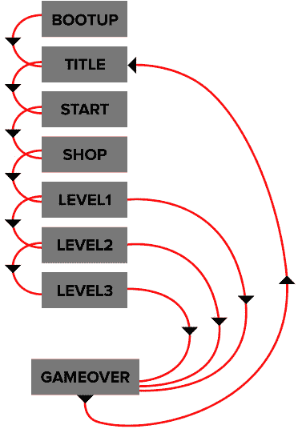

图 7.1 – Killer Wave 的游戏循环

仍然参考游戏循环图像，每个矩形框中的每个名称都代表 Unity 中我们`Scene`文件夹内的一个场景。每个场景的流程都沿着一个整体方向进行，从顶部的**BOOTUP**开始。这是游戏首次启动时。流程将穿过每个场景，直到玩家击败所有三个级别或死亡。无论如何，他们最终都会到达**GAMEOVER**场景，然后循环回到**TITLE**场景以创建循环。

到本章结束时，我们将能够从`bootUp`场景运行我们的游戏，它将自动移动到`title`场景。从那里，玩家将按下射击按钮或轻触屏幕，然后加载`shop`场景，这是可以进行购买的地方。

一旦玩家按下`shop`场景，第一级（`level1`）将开始。如果玩家死亡，该级别将重新启动，而如果玩家完成该级别，他们将继续到下一级。

最终的结果将是，如果玩家死亡三次，他们将被带回到`title`场景，而如果玩家完成`level3`场景，则游戏结束，玩家将被带到`gameOver`场景。

最后，我们将涵盖一些与我们迄今为止所涵盖内容相关的模拟测试问题。

在本章中，我们将涵盖以下主题：

+   转换我们的玩家飞船

+   扩展我们的`ScenesManager`脚本

+   准备循环我们的游戏

+   模拟测试

# 本章涵盖的核心考试技能

以下是在本章中将涵盖的核心考试技能：

*编程核心交互：*

+   实现和配置游戏对象行为和物理

+   实现和配置摄像机视图和移动

*在艺术管道中工作：*

+   理解材质、纹理和着色器，并编写与 Unity 渲染 API 交互的脚本

+   理解 2D 和 3D 动画，并编写与 Unity 动画 API 交互的脚本

*场景和环境设计的编程：*

+   识别实现游戏对象实例化、销毁和管理的方法。

+   识别用于构建模块化、可读性和可重用性脚本的技巧。

# 技术要求。

本章的项目内容可以在[`github.com/PacktPublishing/Unity-Certified-Programmer-Exam-Guide-Second-Edition/tree/main/Chapter_07`](https://github.com/PacktPublishing/Unity-Certified-Programmer-Exam-Guide-Second-Edition/tree/main/Chapter_07)找到。

您可以下载每个章节的项目文件的全部内容，链接为[`github.com/PacktPublishing/Unity-Certified-Programmer-Exam-Guide-Second-Edition`](https://github.com/PacktPublishing/Unity-Certified-Programmer-Exam-Guide-Second-Edition)。

本章的所有内容都包含在本章的`unitypackage`文件中，包括一个`Complete`文件夹，其中包含本章我们将执行的所有工作。

查看以下视频以查看*代码执行情况*：[`bit.ly/37Rie3B`](https://bit.ly/37Rie3B)。

# 转换我们的玩家飞船。

目前，我们的关卡只能在玩家死亡、关卡重新开始或玩家失去所有三个生命时完成。只有在这种情况下，我们才会被带到游戏结束屏幕。我们现在需要开始思考玩家如何开始和结束关卡。目前，玩家只是在关卡开始时出现。

在本节中，我们将编写一些代码，将我们的玩家动画化到场景中，并在关卡完成时，我们将让玩家飞船退出摄像机视图。

因此，让我们像创建所有其他脚本一样创建一个脚本（*第二章**，添加和管理对象*，如果您需要参考）。将脚本命名为`PlayerTransition`并确保我们在 Unity 编辑器的**项目**窗口中的`Script`文件夹中有该文件。

现在，我们需要将`PlayerTransition`脚本附加到我们的`player_ship`预制体上：

1.  从**项目**窗口中加载`testLevel`场景到`Assets/Scene`。

1.  然后，导航到`Assets/Prefab/Player`文件夹，并选择`player_ship`预制体。

1.  最后，将`PlayerTransition`脚本拖放到`player_ship`的`PlayerTransition`组件的空区域，`player_ship`的`PlayerTransition`组件将开始动画化`shop`场景中的`player_ship`。

现在我们已经创建了脚本并将其附加，我们可以进入它并开始设置以下代码：

+   向我们的`PlayerTransition`脚本添加变量。

+   向我们的`PlayerTransition`脚本添加方法/函数。

+   添加`if`语句检查。

+   向`PlayerMovement IEnumerator`添加内容。

+   将玩家飞船移出屏幕。

让我们来看看。

## 向我们的`PlayerTransition`脚本添加变量。

在本节中，我们将从设置我们的`PlayerTransition`脚本开始。我们将通过添加全局变量来实现这一点，以便可以使用这些变量来定位玩家飞船。

要开始添加我们的全局变量，请按照以下步骤操作：

1.  打开我们新创建的 `PlayerTransition` 脚本。

1.  在脚本顶部，确保我们添加了以下库：

    ```cs
    using UnityEngine;using System.Collections;
    ```

默认情况下，我们的脚本应该自动命名，并与其默认继承的 `MonoBehaviour` 一起使用，因为这是关于 Unity 编辑器和其他功能的要求。我们将使用 `System.Collections` 库来执行我们的 `StartCoroutine`。没有这个库，我们无法创建协程；我们将在编写代码时进一步解释这一点。

1.  检查/输入以下代码用于我们的 `PlayerTransition` 脚本，它保留了脚本的默认名称和 `MonoBeaviour` 继承以添加功能：

    ```cs
    public class PlayerTransition : MonoBehaviour 
{
    ```

1.  在 `PlayerTransition` 类中，输入以下全局 `Vector3` 变量：

    ```cs
        Vector3 transitionToEnd = new Vector3(-100,0,0);    Vector3 transitionToCompleteGame = new Vector3(7000,0,0);    Vector3 readyPos = new Vector3(900,0,0);    Vector3 startPos;
    ```

`startPos` 和 `readyPos` 变量用于测量我们的玩家飞船当前位置与我们希望其前往的位置之间的距离。

提示

在这一点上，请确保 `_Player` 游戏对象的 **Transform Position** 属性值在 **Inspector** 窗口中设置为 X、Y 和 Z 轴上的零。否则，玩家飞船在进入关卡时可能会动画到错误的位置。

`transitionToEnd` 变量将被用作我们希望在关卡开始时我们的玩家游戏对象飞船要前往的坐标，以及当玩家的飞船即将离开关卡时。`transitionToCompleteGame` 仅在玩家完成第三级和最终级时使用，用于改变玩家的结束动画。

1.  继续在我们的 `PlayerTransition` 脚本中输入以下 `float` 变量：

    ```cs
      float distCovered;  float journeyLength;
    ```

`distCovered` 将持有时间数据，这些数据将被用于稍后测量两个 `Vector3` 点（我们将在制作 `PlayerMovement` 为 `IEnumerator` 时详细讨论这一点）。

`journeyLength` 将持有之前提到的两个 `Vector3` 点（`startPos` 和 `readyPos`）之间的距离。

1.  最后的一组变量是要添加到我们的 `PlayerTransition` 脚本中的 `bool`。

    ```cs
     bool levelStarted = true; bool speedOff = false; bool levelEnds = false; bool gameCompleted = false; public bool LevelEnds  {    get {return levelEnds;}    set {levelEnds = value;} } public bool GameCompleted  {    get {return gameCompleted;}    set {gameCompleted = value;} }
    ```

`levelStarted` 是唯一被设置为 `true` 的 `bool`，因为它确认了关卡已经开始，并且只有在玩家动画过渡完成后才会被设置为 `false`。`speedOff` 将在我们要让玩家的飞船离开关卡时设置为 `true`。

当关卡结束时，`levelEnds` 被设置为 `true`，此时玩家飞船将移动到其出口位置。最后一个 `bool` 用于整个游戏完成时。这用于改变结束动画。这两个属性用于从脚本外部访问 `levelEnds` 和 `gameCompleted` 变量。

那就是添加到我们脚本中的变量。现在，让我们继续到 `PlayerTransition` 的方法和函数。

## 向我们的 `PlayerTransition` 脚本添加方法/函数

在我们继续 `PlayerTransition` 脚本的过程中，我们将添加 Unity 的 `Start` 函数并创建我们自己的 `Distance` 方法来定位玩家的飞船到正确的位置：

1.  从`Start`函数开始，继续为我们的`PlayerTransition`脚本输入以下代码：

    ```cs
        void Start()    {        this.transform.localPosition = Vector3.zero;        startPos = transform.position;        Distance();    }
    ```

`Start`函数在脚本启用后立即被调用。在这个函数中，我们将玩家飞船的位置重置为其父游戏对象，即`PlayerSpawner`游戏对象。

我们将把玩家飞船的初始世界空间位置分配给我们在此节中较早创建的一个向量（`startPos`）。我们将在`Distance`方法中使用这个向量，我们将在下一节中讨论它。

1.  在`PlayerTransition`类中输入`Distance`方法及其内容：

    ```cs
        void Distance()    {        journeyLength = Vector3.Distance(startPos, readyPos);    }
    ```

`Vector3.Distance`是 Unity 的一个现成函数，它将测量两个向量点之间的距离，并以`float`形式给出答案，我们将将其存储在`journeyLength`中。这样做的原因是我们将想知道玩家飞船当前位置和它需要到达的位置之间的距离（我们将在本章稍后讨论）。

在下一节中，我们将进入 Unity 的`Update`函数，检查关卡何时结束，以便我们可以将玩家飞船移出屏幕。

## 添加 if 语句检查

在本节中，我们将利用 Unity 的帧更新函数`Update`，以便我们可以运行检查以查看游戏在关卡中的状态。

在我们的`Update`函数中，我们将有三个`if`语句。`levelStarted`是从我们在此节较早介绍的一个布尔变量中来的，它已经设置为`true`。因此，这个`if`语句将立即被调用。让我们看看：

1.  让我们从`PlayerTransition`脚本中的`Update`函数的第一个`if`语句开始：

    ```cs
        void Update()    {        if (levelStarted)        {            PlayerMovement(transitionToEnd, 10);         }
    ```

在第一个`if`语句中有一个名为`PlayerMovement`的方法，它也接受两个参数。关于这个方法的作用，我们将在覆盖完整个`Update`函数后对其进行回顾。

现在，让我们继续处理`Update`函数中的第二个`if`语句。

这个`if`语句检查`levelEnds`变量是否为`true`，如您所记得，我们将其默认设置为`false`。这个布尔值在`PlayerTransition`类外部访问，我们将在稍后讨论，但就目前而言，我们只需要知道它在关卡结束时变为`true`。

在`if`语句内部，有几行代码为玩家飞船准备开始结束关卡，首先是通过将`Player`脚本的`enabled`布尔设置设置为`false`来禁用`Player`脚本。这将使玩家失去控制，以便我们可以将玩家飞船动画化到关卡结束的位置。

接下来，我们禁用玩家飞船的`SphereCollider`，这样如果敌人或其子弹与玩家飞船接触，在准备结束关卡时，它不会摧毁飞船。

1.  在`PlayerTransition` `Update`函数内部输入第二个`if`语句：

    ```cs
    if (levelEnds)  {    GetComponent<Player>().enabled = false;    GetComponent<SphereCollider>().enabled = false;    Distance();    PlayerMovement(transitionToEnd, 200);  }
    ```

然后，我们使用`Distance`方法来测量玩家飞船在关卡开始时的位置和它需要到达的位置之间的距离。

最后，在`if`语句中，我们有我们之前提到的方法，唯一的区别是参数值设置为`200`。这些值将在第四个`if`语句之后的这个`Update`函数中解释。

当我们仍然在`Update`函数内部时，我们可以进入覆盖玩家完成第三和最后一个级别的`if`语句：

```cs
  if (gameCompleted)    {      GetComponent<Player>().enabled = false;      GetComponent<SphereCollider>().enabled = false;      PlayerMovement(transitionToCompleteGame, 200);    }
```

如果`gameCompleted` `bool`为`true`，我们将进入`if`语句的条件。在内部，我们关闭`Player`脚本以禁用玩家的控制。第二行禁用玩家的碰撞器，以避免与任何与敌人相关的游戏对象发生碰撞，而第三行使玩家飞船从当前位置移动到`transitionToCompleteGame`的值。

1.  进入我们的`PlayerTransition` `Update`函数中的第四个`if`语句：

    ```cs
     if (speedOff)    {       Invoke("SpeedOff",1f);    }}
    ```

在第四个`if`语句中，我们运行一个检查以查看`speedOff` `bool`是否持有`true`的值。如果是这样，我们运行 Unity 自己的`Invoke`函数，该函数将`SpeedOff`方法的执行延迟 1 秒。

更多信息

更多关于`Invoke`的信息可以在 Unity 脚本参考网站上找到：[`docs.unity3d.com/ScriptReference/MonoBehaviour.Invoke.html`](https://docs.unity3d.com/ScriptReference/MonoBehaviour.Invoke.html)。

在下一节中，我们将编写一些代码，以便将玩家从他们所在的位置移动到他们需要到达的位置。需要实现这种情况的两个案例如下：

+   当玩家开始游戏时，我们将动画化他们进入场景。

+   当玩家完成关卡后，他们需要移动到一个位置以离开关卡。

我们将介绍两个新的 Unity 函数（`Mathf.Round`和`Vector3.Lerp`）。

## 向`PlayerMovement`方法添加内容

`PlayerMovement`方法负责在屏幕近中心处动画化我们的玩家飞船，以便它可以从一个位置开始并退出关卡。

让我们更详细地了解这一点：

1.  为我们的`PlayerMovement`方法及其两个参数输入以下代码：

    ```cs
     void PlayerMovement(Vector3 point, float transitionSpeed)    { 
    ```

如前所述，我们的`PlayerMovement`方法接受两个参数：一个带有参考名称`point`的`Vector3`和一个带有参考名称`transitionSpeed`的`float`。正如你可以想象的那样，`transitionSpeed`是玩家飞船从一个点到另一个点移动的速度。

如果我们回溯到`point`的值，它来自一个我们已经在脚本开头初始化的变量，即`transitionToStart`，其值为`(-100,0,0)`的`Vector3`。

因此，实际上 `transitionToStart` 和 `point` 是相同的——它们只是名称不同，为了保持它们的引用独立。无论如何，回到 `point`，这个值是我们玩家飞船的位置。以下截图显示了我们的玩家飞船，位置为 `-100,0,0`：

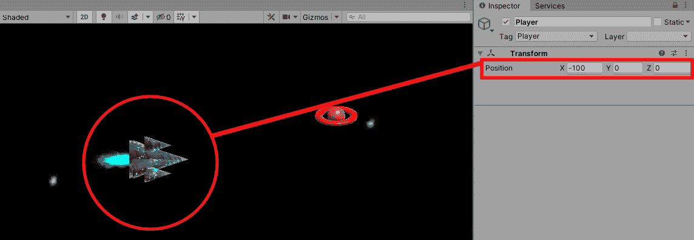

图 7.2 – 玩家飞船的位置

因此，当关卡开始时，我们的玩家飞船将位于屏幕的左侧边缘，并且会动画过渡到之前截图中所标记的位置。

继续使用 `PlayerMovement` 方法，我们从一个 `if` 语句开始，该语句检查一系列条件是否满足。

1.  输入以下 `if` 语句及其四个条件：

    ```cs
       if (Mathf.Round(transform.localPosition.x) >= readyPos.x -5 &&               Mathf.Round(transform.localPosition.x) <= readyPos.x +5 &&               Mathf.Round(transform.localPosition.y) >= -5f &&                         Mathf.Round(transform.localPosition.y) <= +5f)                        {
    ```

在之前的代码中，我们已经四次检查了玩家是否处于正确的位置，然后再执行其余的代码。每一行代码都会检查以下内容：

+   如果玩家飞船的 X 位置大于或等于存储在 `readyPos` 变量 X 位置的值，减去 5。

+   如果玩家飞船的 X 位置小于或等于存储在 `readyPos` 变量 X 位置的值，加上 5。

+   如果玩家飞船的 Y 位置大于或等于存储在 `readyPos` 变量 Y 位置的值，减去 5。

+   如果玩家飞船的 Y 位置小于或等于存储在 `readyPos` 变量 Y 位置的值，加上 5。

1.  仍然在 `PlayerMovement` 方法中，并且在之前的 `if` 语句内，输入以下两个 `if` 语句：

    ```cs
       if (levelEnds)    {      levelEnds = false;      speedOff = true;    }   if (levelStarted)     {       levelStarted = false;       distCovered = 0;       GetComponent<Player>().enabled = true;      }   }
    ```

在之前的代码块中，我们有两个 `if` 语句（`levelEnds` 和 `levelStarted`），它们检查每个 `bool` 条件是否为 `true`。让我们来看看它们的内容：

+   `levelEnds`：如果 `levelEnds` 变为 `true`，我们将 `levelEnds` 的 `bool` 设置为 `false`，并将 `speedOff` 的 `bool` 设置为 `true`。

+   `levelStarted`：如果 `levelStarted` 被赋予 `true` 的值，我们将 `levelStarted` 的 `bool` 设置为 `false`，将 `distCovered` 的 `float` 设置为 `0`，并将 `Player` 脚本设置为 `true`。

1.  最后，在我们的 `PlayerMovement` 方法中，输入以下位于主 `if` 语句之外的 `else` 条件：

    ```cs
       else      {       distCovered += Time.deltaTime * transitionSpeed;       float fractionOfJourney = distCovered /     journeyLength;       transform.position = Vector3.Lerp(transform.    position, point,         fractionOfJourney);      }   }
    ```

查看之前的 `else` 条件代码块，我们添加时间并将其乘以 `transitionSpeed`，如您所记得的，这是此方法接受的两个参数之一。确保此 `else` 语句与 `Mathf.Round` 语句相关，而不是检查两个 `bool` 的语句。

然后，我们将 `distCovered` 变量除以 `journeyLength` 变量，如您所记得的，这是两点之间的测量值。我们将除法的结果存储在一个名为 `fractionOfJourney` 的 `float` 变量中。

在此 `else` 条件中我们最后做的事情是使用 Unity 的预制函数之一 `Lerp`，它将我们的玩家飞船在两点之间进行线性插值。`Lerp` 接受三个参数：点 A、点 B 和它将在两点之间移动的时间比例。`transform.position` 是我们的玩家飞船，第二个是 `Vector3` 点，这是我们带到 `IEnumerator` 中的另一个变量，第三个是活动的 `float` `fractionOfJourney`。

信息

还可以使用 `Material.Lerp` 在一段时间内渐变颜色。有关将一种颜色渐变为另一种颜色的更多信息，请参阅[`docs.unity3d.com/ScriptReference/Material.Lerp.html`](https://docs.unity3d.com/ScriptReference/Material.Lerp.html)。

我们现在需要在 `PlayerSpawner` 脚本中添加一行代码，在玩家离开商店场景后启用 `PlayerTransition` 脚本。如本章前面所述，如果 `PlayerTransition` 在商店场景中保持开启状态，`player_ship` 将在屏幕上动画化。

因此，为了在 `level1` 场景的开始时开启 `PlayerTransition` 脚本，我们需要做以下操作：

1.  在 `Assets/Script` 中打开 `PlayerSpawner` 脚本。

1.  滚动到以下代码行：

    ```cs
    playerShip.transform.position = Vector3.zero;
    ```

1.  在此之后输入以下代码行：

    ```cs
    playerShip.GetComponent<PlayerTransition>().enabled = true;
    ```

这行代码将使我们的玩家飞船动画化进入 `level1` 场景。

我们需要在 `PlayerSpawner` 脚本中做的最后一个更改是移除在 `PlayerSpawner Start` 函数中启用 `Player` 脚本的能力，我们将在 `ScenesManager` 脚本中启用它。

1.  在 `PlayerSpawner` 脚本中，从 `Start` 函数中删除以下行：

    ```cs
    GetComponentInChildren<Player>().enabled = true;
    ```

1.  保存 `PlayerSpawner` 脚本。

现在，让我们继续到最后一段代码，我们将在这里移动玩家飞船，使其在关卡结束时离开屏幕。

## 将玩家飞船移出屏幕

我们需要在 `PlayerTransition` 脚本中覆盖的最后一个方法是 `SpeedOff` 方法。此方法简单地将我们的玩家飞船喷射出屏幕，当关卡完成时。让我们看看：

1.  在我们的 `PlayerTransition` 脚本中输入以下代码：

    ```cs
     void SpeedOff() { transform.Translate(Vector3.left * Time.deltaTime*800); }
    ```

此代码块使用 Unity 的预制 `Translate` 函数，它接受 `Vector3.left` 乘以时间，其中 `800` 用于使玩家飞船移动得更快。

1.  保存脚本。

这就是 `PlayerTransition` 脚本的结束。现在，我们的游戏为玩家飞船添加了开场和结尾。最初，我们的玩家将在关卡开始时出现，当它被标记为完成时，将加载下一关卡。我们还技术性地覆盖了三个新函数，如下所示：

+   `Vector3.Distance`，用于测量两个 `Vector3` 点之间的距离

+   `Vector3.Lerp`，用于移动玩家飞船，在两个 `Vector3` 点之间平滑移动

+   `MathF.Round`，用于四舍五入一个数字

我们将这些新技能结合起来，使我们的玩家飞船进入位置以开始关卡，完成后，无论玩家在屏幕上的位置如何，我们都将他们移动到正确的位置。最后，我们的玩家从屏幕上飞走。

在下一节中，我们将重新访问`ScenesManager`脚本并应用一些代码，以便有一个时间限制，倒计时到关卡结束。

# 扩展`ScenesManager`脚本

在本节中，我们将使我们的`ScenesManager`脚本识别`scenes`文件夹（`Assets/Scene`）中的 2 级和 3 级关卡。然后我们将这些关卡添加到游戏循环中。此外，我们还将为每个关卡添加一个游戏计时器。当计时器达到其限制时，我们可以通过播放一个动画来触发玩家离开关卡。最后，我们将添加一些常见的方法来将游戏推进到下一级。

让我们从打开`ScenesManager`脚本（`Assets/Script/Scenesmanager.cs`）并添加一些变量开始，以帮助我们讨论的内容。按照以下步骤操作：

1.  在`ScenesManager`脚本顶部添加以下变量：

    ```cs
      float gameTimer = 0;  float[] endLevelTimer = {30,30,45};  int currentSceneNumber = 0;  bool gameEnding = false;
    ```

`gameTimer`变量计时器将用作我们的当前计数器，以计时关卡剩余的时间直到结束。以下变量是一个数组，它保存了每个关卡结束前的时间。因此，我们总共有三个关卡，但问题是，我们希望每个关卡持续多长时间？我们需要输入一个表示关卡结束前秒数的值，所以我选择了 1 级和 2 级的`30`秒。然而，3 级关卡将持续`45`秒。这是因为我们将在这个章节中构建一个特殊的关卡，*NavMesh, Timeline, and a Mock Test*。我们将在这个章节中详细介绍这一点。

如您所想象，`currentSceneNumber`将保存表示玩家当前所在场景的数字。最后，我们有`gameEnding`布尔值，它将用于触发玩家飞船关卡动画的结束。我们将在本节稍后更详细地介绍这些变量，让我们从`currentSceneNumber`开始。

在我们刚刚设置的全球变量之后，让我们确保`ScenesManager`脚本在整个游戏过程中始终知道玩家所在的是哪个场景。这将帮助我们的代码知道玩家当前所在场景以及他们将要进入的场景。

1.  添加`Update`函数，它将在每一帧被调用以检查我们处于哪个场景。请在`ScenesManager`脚本中输入以下代码：

    ```cs
      void Update()  {    if (currentSceneNumber !=       SceneManager.GetActiveScene().buildIndex)    {      currentSceneNumber = SceneManager.GetActiveScene().buildIndex;      GetScene();    }    GameTimer();  }
    ```

在`Update`函数内部，我们使用一个`if`条件来检查`currentSceneNumber`变量是否不等于我们从活动场景中获取的`buildIndex`。

如果不相等，我们将使用当前场景的`buildIndex`更新`currentSceneNumber`，然后调用`GetScene`方法。`GetScene`方法是一个小的方法，现在就介绍它比以后介绍更好，因为它与我们刚刚讨论的所有内容都相关。

在 `GetScene` 方法中，有一行代码用于更新场景的变量。这是一个来自 `Scenes` 枚举的实例，它包含我们游戏中每个场景的名称。此外，`GetScene` 方法中的代码将 `currentSceneNumber` 强制转换为枚举，这就是为什么 `Scenes` 类型放在括号中的原因。更多关于强制转换的信息可以在 [`docs.microsoft.com/en-us/dotnet/csharp/programming-guide/types/casting-and-type-conversions`](https://docs.microsoft.com/en-us/dotnet/csharp/programming-guide/types/casting-and-type-conversions) 找到。

1.  为我们的 `ScenesManager` 脚本输入以下代码：

    ```cs
      void GetScene()  {    scenes = (Scenes)currentSceneNumber;  }
    ```

我们可以在 `ScenesManager` 类中的任何地方放置 `GetScene` 方法，只要它不在另一个方法内部。

回到 `Update` 函数，在调用 `GetScene` 方法之后，我们关闭 `if` 条件的括号。在关闭 `Update` 函数之前，我们最后要做的事情是运行 `GameTimer` 方法，这个方法将跟踪我们游戏的时间，并设置一些基本方法，这些方法将开始、重置和结束我们的游戏关卡。

在接下来的部分，我们将涵盖以下主题：

+   为每个游戏关卡添加计时器。当计时器结束时，这会通知玩家已经完成了关卡。

+   让 `ScenesManager` 脚本知道关卡完成后要做什么；也就是说，加载关卡，哪个关卡，等等。

让我们开始吧。

## 添加游戏关卡计时器

在 `ScenesManager` 脚本中，我们将设置一个负责确认关卡结束的方法。`GameTimer` 方法的作用是为 `gameTimer` 变量添加时间，并检查它是否达到了其限制，这取决于它比较的 `endLevelTimer`。最后，如果游戏被触发结束玩家飞船的动画，它将被设置为开始，并在 `4` 秒后加载下一关卡。

在你的 `ScenesManager` 脚本仍然打开的情况下，将以下方法添加到你的代码中：

```cs
void GameTimer() {   switch (scenes)   {     case Scenes.level1 : case Scenes.level2 : case Scenes.level3 :     {         if (gameTimer < endLevelTimer[currentSceneNumber-3])        {           //if level has not completed            gameTimer += Time.deltaTime;         }         else          {         //if level is completed          if (!gameEnding)         {            gameEnding = true;            if (SceneManager.GetActiveScene().name != "level3")          {            GameObject.FindGameObjectWithTag("Player").    GetComponent                 <PlayerTransition>().LevelEnds = true;          }          else           {            GameObject.FindGameObjectWithTag("Player").    GetComponent                <PlayerTransition> ().GameCompleted = true;                                                                                                                     }             Invoke("NextLevel",4);         }       }      break;     }    } }
```

在 `GameTimer` 方法中，我们运行一个包含 `scenes` 实例的 `switch` 语句，该实例将包含每个级别的所有枚举名称。我们对三个可能的案例进行检查：`level1`、`level2` 和 `level3`。如果 `scenes` 实例设置为这三个可能性中的任何一个，我们就会进入一个 `if` 条件，然后比较 `gameTimer` 变量是否小于 `endLevelTimer` 数组已设置的限制。

我们只需要知道关卡 1、2 和 3 的构建索引号。因此，为了避免前三个场景，我们必须减去 `3`。

以下截图显示了 **构建设置** 窗口（**文件** | **构建设置**），其中包含你的项目右侧的场景及其构建编号：


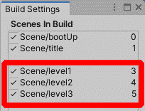

Figure 7.3 – Build Settings – scene order

如果 `gameTimer` 小于 `levelTimer`，我们将使用 Unity 为我们预先制作的 `Time.deltaTime` 固定函数继续增加 `gameTimer`。有关 `Time.deltaTime` 的更多信息，请参阅此处：[`docs.unity3d.com/ScriptReference/Time-deltaTime.html`](https://docs.unity3d.com/ScriptReference/Time-deltaTime.html)。

如果 `gameTimer` 等于或大于 `levelTimer`，我们将进入 `else` 条件，该条件检查 `gameEnding` `bool` 的 `if` 语句条件是否为 `false`。如果条件为 `false`，我们将进入 `if` 语句的内容，首先将 `gameEnding` `bool` 设置为 `true`。这将阻止 `if` 语句在 `Update` 函数的帧周期中重复。

最后的 `if` 语句检查游戏处于哪个关卡。如果不是 `"level3"`，我们在 `PlayerTransition` 脚本中将 `LevelEnds` 属性设置为 `true`。否则，我们必须已经完成了游戏。因此，在 `else` 条件中，我们在 `PlayerTransition` 脚本中将 `GameComplete` 属性设置为 `true`。

在本节中，我们在 `ScenesManager` 脚本中创建了一个方法，使我们的游戏知道每个关卡将持续多长时间，然后将其视为已完成。

我们现在将继续在 `ScenesManager` 脚本中添加方法，这些方法将在 `GameTimer` 方法触发时开始、重置并将玩家移动到下一个关卡。

## 开始、重置和跳过关卡

`ScenesManager` 将负责开始一个关卡，当玩家死亡时重置它，并在当前关卡完成后移动到下一个关卡。幸运的是，由于 Unity 的 `SceneManagement` 库，这些工作需要的工作量很小。

让我们从回顾我们已经开始的 `ResetScene` 方法开始，但现在，我们将进一步简化它：

1.  在我们的 `ScenesManager` 脚本中，用以下代码替换 `ResetScene` 方法中的内容：

    ```cs
      public void ResetScene()  {    gameTimer = 0;    SceneManager.LoadScene(GameManager.currentScene);  }
    ```

在 `ResetScene` 方法内部，我们将 `gameTimer` 变量重置为零，然后将其参数从当前的 `SceneManager.LoadScene` `buildIndex` 替换为 `GameManager.currentScene`，这是我们回到 *第三章*，*管理脚本和进行模拟测试* 时编写的。这基本上就是将当前构建索引作为一个 `static` 整数保持下来，以便任何脚本都可以访问它。

更新 `ResetScene` 后，我们现在可以继续进行下一个方法，这个方法与我们刚刚做的非常相似，但它与 `ResetScene` 分开，以便支持我们代码的扩展。

当玩家完成一个关卡时，`NextLevel` 方法会运行，这将重置 `gameTimer` 变量。`gameTimer` `bool` 将被设置为 `false`，并使用相同的 `SceneManager.LoadScene` 命令将 `GameManager` `currentScene` 整数增加 `1`。

1.  在 `ScenesManager` 脚本中输入以下方法：

    ```cs
      void NextLevel()  {    gameEnding = false;    gameTimer = 0;    SceneManager.LoadScene(GameManager.currentScene+1);  }
    ```

我们在`ScenesManager`脚本中需要更改的最后一个方法是`BeginGame`方法，当玩家在`shop`场景中并按下`"START"`按钮时将被调用。

1.  为我们的`ScenesManager`脚本输入以下代码：

    ```cs
     public void BeginGame(int gameLevel) {   SceneManager.LoadScene(gameLevel); }}
    ```

`BeginGame`方法将接受一个名为`gameLevel`的整数参数。在这个方法内部，我们有之前已经使用过的`SceneManager.LoadScene`，但这次，它将加载我们提供的`gameLevel`整数。

1.  保存脚本。

如果你记得，在上一章中，我们将`PlayerSpawner`脚本临时设置为调用`GameManager.Instance.CameraSetup()`；

这个调用不再需要，现在可以删除。让我们删除它

1.  在`Assets/Script`。

1.  加载`PlayerSpawner`脚本并从`Start`函数中删除`GameManager.Instance.CameraSetup();`这一行。

1.  保存脚本。

由于我们将`BeginGame`方法改为现在接受一个参数，我们必须更新我们的`PlayerShipBuild`脚本，该脚本有一个`StartGame`方法，它运行`BeginGame`方法，目前没有参数值。为了更新`PlayerShipBuild`的`StartGame`方法，我们需要做以下几步：

1.  在 Unity 编辑器中，导航到**项目**窗口中的`Assets/Script/PlayerShipBuild.cs`文件夹并打开它。

1.  滚动到`StartGame`方法并找到以下代码行：

    ```cs
    UnityEngine.SceneManagement.SceneManager.LoadScene("testLevel");
    ```

1.  现在，将前面的代码行改为以下内容：

    ```cs
    GameManager.Instance.GetComponent<ScenesManager>   ().BeginGame(GameManager.gameLevelScene);
    ```

这个代码更改现在将直接调用`level1`场景。

有了这些，我们就到达了本节的结尾。到目前为止，我们已经涵盖了以下内容：

+   我们的游戏现在知道一个级别需要多长时间才能被归类为完成。

+   `ScenesManager`脚本现在可以调用将启动、重置并将玩家移动到下一级的方法。

我们的大多数代码都是使用`switch`语句和`enum`来调用，当场景需要改变时使用。为了加载场景本身，我们使用了 Unity 自带的`SceneManager`类，这是在 Unity 项目中加载任何场景的基础。

在下一节中，我们将准备项目中不是游戏级别的其余场景（`bootUp`场景、`title`场景和`gameOver`场景）。

# 准备循环我们的游戏

在本节中，我们将从`testLevel`场景移开，并介绍三个其他级别（`level1`、`level2`和`level3`），以演示游戏循环。

到本节结束时，我们的游戏循环将完成。我们将能够从`bootUp`场景开始我们的游戏。从那里，我们将能够通过每个场景进行进度。

让我们先从 Unity 编辑器中删除占位符级别开始。转到`Assets/Scene`位置。按照以下步骤操作：

1.  确保你的`player_ship`已保存（`testLevel`场景）。然后，删除`level1`、`level2`和`level3`。

1.  选择`testLevel`，在键盘上按住*左 Ctrl* *(Mac 上的 Command*)键，然后按*D*两次。我们现在应该有三个`testLevel`实例。

1.  将`testLevel`重命名为`level1`。

1.  将`testLevel 1`重命名为`level2`。

1.  将 `testLevel 2` 重命名为 `level3`。

我们现在需要检查 **构建设置** 窗口以查看场景的顺序。

1.  在 Unity 编辑器的顶部，点击 **文件** | **构建设置**。

我们应该看到的顺序如下面的截图所示。如果不是这样，请通过在 **构建设置** 窗口中点击并拖动场景以及选择并删除列表中的任何额外场景来选择并移动场景到正确的位置：


图 7.4 – 构建设置 – 完整场景顺序

我们已经将第一个关卡复制了两次，以测试我们的关卡是否可以完成并继续前进。接下来，我们将回到项目列表中的第一个场景，并设置它以便它可以像启动场景一样运行。

由于我们已删除 `testLevel` 场景，我们需要更新 `GameManager` 脚本中的 `LightandCameraSetup` 方法，以保持其 `Switch` 语句与我们需要照亮的关卡同步，以及设置我们的相机。

为了确保我们的相机和灯光为每个场景正确工作，我们需要执行以下操作：

1.  在 `Assets/Script` 文件夹中。

双击 `GameManager` 脚本。

1.  滚动到 `LightandCameraSetup` 方法的具体内容，并确保每个案例编号遵循以下模式：

    ```cs
    case 3 : case 4 : case 5:
    ```

每个案例代表玩家将要玩的游戏关卡。

1.  保存脚本。

在接下来的几节中，我们将为每个非关卡场景（基本但信息丰富）自定义一个占位符外观。这些场景如下：

+   `bootUp`

+   `title`

+   `gameOver`

这些场景也将需要基本的编码，以便玩家可以按按钮继续，或者发出一个计时器。这个计时器将倒计时，直到加载下一个场景。

## 设置启动场景

当我们运行游戏时，通常游戏不会立即开始 - 通常有一个启动屏幕来显示谁开发了/发布了游戏。有时，它用作加载屏幕，但对我们来说，它将用于启动我们的游戏。在本节中，我们将移除典型的 Unity 天空背景，并用一个中性灰色背景替换它，并在背景上显示一个文本标题，说明已加载哪个屏幕。

让我们开始，并在 Unity 编辑器中打开 `bootUp` 场景：

1.  通过访问 `Assets/Scene` 中的 `level1` 场景。

1.  如果尚未打开，请双击 `prefab` 文件夹。

1.  接下来，双击从 `Assets/Scene` 中打开的 `bootUp` 场景文件。

1.  将 `Assets/Prefab` 中的 `GameManager` 预制体拖放到 **层次结构** 窗口中。

1.  在 **层次结构** 窗口中创建一个空的游戏对象。如果您忘记了如何做，请参阅 *第二章*，*添加和操作对象*。

1.  将新创建的游戏对象命名为 `BootUpText`。

1.  如前所述，创建另一个空的游戏对象并命名为 `BootUpComponent`。

以下截图显示了 **层次结构** 窗口左侧的组件。这些组件如下：

+   **主相机**

+   **方向光**

+   **游戏管理器**

+   **BootUpComponent**

+   **BootUp Text**

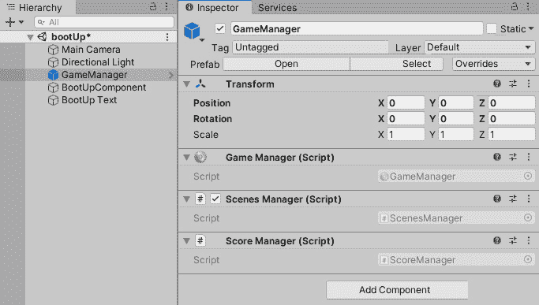

图 7.5 – 游戏对象层次结构窗口顺序

在前面的截图右侧，我们选定了 `GameManager` 游戏对象，显示了其三个主要组件脚本：

+   游戏管理器

+   场景管理器

+   分数管理器

如您所忆，我们的 `GameManager` 脚本将始终保留在场景中，即使场景被另一个场景替换，因此我们必须在游戏管理器预制件中拥有这些组件。

接下来，我们将把背景从天空更改为灰色，如之前所述。为此，从 **层次结构** 窗口中选择 **主相机**。现在，按照以下步骤操作：

1.  在 **检查器** 窗口中，点击 **清除标志** 选择项，并将其从 **天空盒** 更改为 **纯色**。

1.  在 `32323200` 下方。

1.  这将把 RGB 值更改为 `50`,`50`,`50`，并设置透明度为 `零`。

使用以下截图作为 **清除标志**、**背景** 和 **十六进制颜色** 位置的参考：

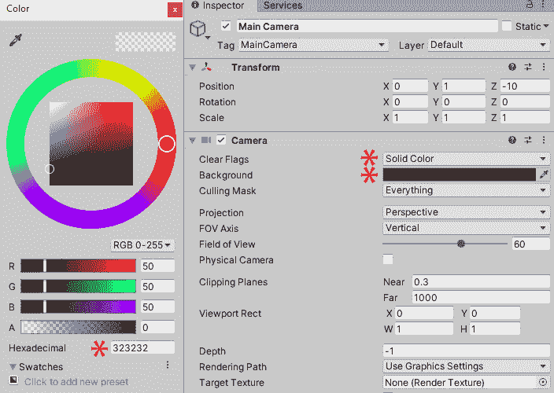

图 7.6 – 更改场景的背景颜色

这将把 **游戏** 窗口中的背景更改为灰色。

接下来，我们将选择 `BootUpText` 并添加一个位于屏幕底部中央的 **文本网格**。按照以下步骤操作：

1.  在 **层次结构** 窗口中选中 `BootUpText` 游戏对象。

1.  然后，在 **检查器** 窗口中，点击 **添加组件** 按钮。

1.  在下拉菜单中输入 `Text Mes`h，直到你在下拉列表中看到它。

1.  从下拉菜单中选择 **文本网格**。

在仍然选中 `BootUp Text` 游戏对象的情况下，将其 **变换** 位置更改为以下内容：

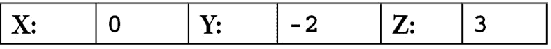

现在我们已经将文本放置在正确的位置，我们需要在 **检查器** 中填写 **文本网格** 组件。按照以下步骤操作：

1.  在 `BootUp`。

1.  将 **锚点** 设置为 **居中**。

1.  将 **对齐** 设置为 **居中**。

1.  打开 **游戏** 窗口（快捷键：*Ctrl (command* 在 Mac 上) + 2*）。现在，我们应该有一个灰色屏幕和白色文本，这样我们就可以轻松地识别我们所在的场景。以下截图显示了 “**BootUp**” 文本的设置，以及其 **检查器** 属性供参考：

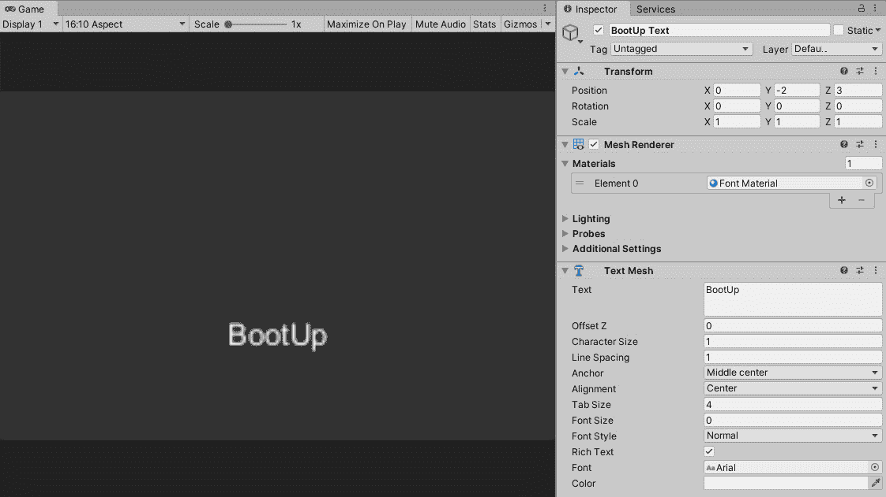

图 7.7 – 基本的 'BootUp' 场景

对于这个 `bootUp` 场景，我们最后需要做的就是让它像大多数 `bootUp` 屏幕一样工作。

当 `bootUp` 屏幕出现时，它会停留几秒钟，然后转到下一个场景。

要使 `bootUp` 屏幕在几秒钟后加载到下一个屏幕，我们需要创建一个脚本并将其添加到 `BootUpComponent` 游戏对象中。

1.  当我们创建脚本时，需要将其存储在我们其他脚本所在的`Assets/Script`文件夹中。

如果你忘记了如何创建脚本，请查看*第二章*中关于*通过脚本更新相机属性*的部分，*添加和操作对象*。

1.  将脚本命名为`LoadSceneComponent`。

以下截图显示了在**层次结构**窗口中选择`BootUpComponent`游戏对象时应看起来是什么样子：

![图 7.8 – `'BootUpComponent'`游戏对象和脚本![图 7.8 – `'BootUpComponent'`游戏对象和脚本图 7.8 – `'BootUpComponent'`游戏对象和脚本 1.  双击**检查器**窗口中灰色的`LoadSceneComponent`字段以打开文件。以下代码与我们之前为加载关卡输入的代码类似，只是形式更简短。基本原理是我们通过`UnityEngine.SceneManagement`加载以继承 Unity 的`SceneManager`类。在脚本开始时，我们的游戏分数将被重置，以防止之前的分数被携带过来。然后，我们创建一个计时器，并在 Unity 的`Update`函数中递增时间。一旦计时器超过`3`秒，`SceneManager`将加载我们在`loadThisScene`公共变量中放入的内容，在我们的例子中是`"title"`。以下截图显示了**检查器**中的`LoadSceneComponent`脚本，其中有一个我们可以输入要加载的场景的字段：![图 7.9 – `Load Scene Component`将加载'title'场景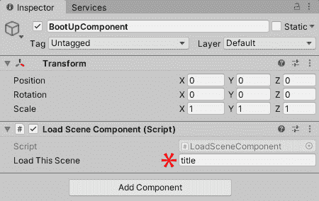

图 7.9 – `Load Scene Component`将加载'title'场景

如此简单 – 我们不需要担心其他任何事情，因为`bootUp`场景不是游戏循环的一部分。`bootUp`场景仅在游戏开始时播放一次。

1.  将以下代码输入到`LoadSceneComponent`：

    ```cs
    using UnityEngine.SceneManagement;using UnityEngine;public class LoadSceneComponent : MonoBehaviour { float timer = 0; public string loadThisScene; void Start(){  GameManager.Instance.GetComponentInChildren      <ScoreManager>().ResetScore();} void Update() {     timer += Time.deltaTime;     if (timer > 3)     {         SceneManager.LoadScene(loadThisScene);     } }}
    ```

1.  完成后，保存脚本。

1.  返回 Unity 编辑器，并在**检查器**窗口的`loadThisScene`变量字段中输入`title`，如前一个截图所示。

1.  保存`bootUp`场景并按`bootUp`，场景应该加载，然后`3`秒后加载`title`场景。

我们现在可以重复在`bootUp`场景中做的多数操作，并将这些操作复制到`title`和`gameOver`场景中。我们将在下一步进行操作。

## 设置标题和游戏结束场景

我们在上一节中设置`bootUp`场景的方式与我们想要在添加任何新艺术和自定义功能之前`title`和`gameOver`场景看起来和表现的方式相似。

幸运的是，使用 Unity，我们不需要从头开始重复创建这两个场景的整个过程。我们可以复制、粘贴并重命名在`bootUp`场景中已经创建的游戏对象。

要复制灰色背景和白色`bootUp`场景，请执行以下操作：

1.  在 Unity 编辑器中，当`bootUp`场景仍然处于活动状态时，从**层次结构**窗口中选择所有`5`个游戏对象（点击列表的顶部或底部，按住*Shift*，然后点击列表的任一端以选择所有对象）。

1.  按*左 Ctrl* (*Mac 上的 Command*) *+ C* 复制这些`5`个游戏对象。

1.  从`Assets/Scene`打开`title`场景。

1.  在**层次结构**窗口中选择并删除所有游戏对象。

1.  在`bootUp`游戏对象的开放空间中点击任何位置。

1.  在`TitleText`中选择`BootUpText`。

1.  当`TitleText`游戏对象仍然被选中时，更改`Title`。

1.  在`TitleComponent`中选择`BootUpComponent`。

1.  在**检查器**窗口中，仍然选择`TitleComponent`游戏对象，点击**LoadSceneComponent**（**脚本**）旁边的三个小点。

1.  将出现一个下拉菜单；从中点击**移除组件**。

现在，我们需要为`TitleComponent`游戏对象编写一个脚本，以便当玩家轻触或点击鼠标按钮时，将加载下一个场景`shop`。

1.  重复与`BootUpComponent`相同的步骤来创建和附加脚本，但这次，将脚本命名为`TitleComponent`（同样，与`TitleComponent`脚本一样，确保将其移动到`Assets/Script`中的正确文件夹）并粘贴以下代码：

    ```cs
    using UnityEngine.SceneManagement;using UnityEngine;public class TitleComponent : MonoBehaviour { void Update() {     if (Input.GetButtonDown("Fire1"))     {         SceneManager.LoadScene("shop");     } }  void Start()  {    GameManager.playerLives = 3;  }}
    ```

与之前的`BootUpComponent`脚本相比，`TitleComponent`脚本的区别在于，当在`BootUpComponent`中按下并释放鼠标按钮（或在触摸屏上用手指触摸）时，`TitleComponent`将进入下一个场景（`shop`场景），这依赖于计时器将过去的`3`秒增加到加载下一个场景，其安全措施是在玩家完成游戏时重置游戏分数。

1.  保存`TitleComponent`脚本和`title`场景。

以下截图显示了在 Unity 编辑器中`title`场景应该看起来是什么样子：

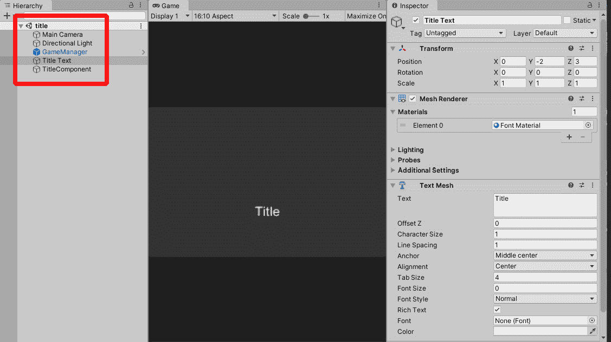

图 7.10 – 'title'场景游戏对象层次结构顺序

现在，我们需要对`gameOver`场景重复完全相同的步骤。

从`Assets/Scene`打开`gameOver`场景并重复粘贴和重命名游戏对象的步骤。执行以下操作：

1.  在`BootUpComponent`游戏对象到`GameOver`。

1.  仍然在`BootUpText`到`GameOverText`。

1.  在`LoadSceneComponent`组件中选择`GameOver`组件，直到我们在列表中看到它。然后，如果我们还没有添加该组件，就选择它。

以下截图显示了具有相同`LoadSceneComponent`脚本的`GameOver`组件，我在`loadThisScene`变量字段中添加了`"title"`：

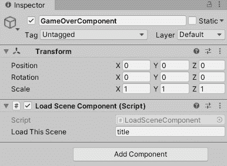

图 7.11 – 加载场景组件正在加载'title'场景

1.  保存`gameOver`场景。

我们的 Unity 项目现在已准备好运行其完整游戏循环。我们将在下一节中更详细地讨论游戏循环。

## 展示游戏循环已完成

在本节的最后，我们将确认在本章中我们取得了什么成果。我们的游戏现在有一个游戏循环，所以如果我们加载`启动`场景并在 Unity 编辑器中按下**播放**，序列将如下所示：

+   `启动`: 场景运行`3`秒后移动到`标题`场景。

+   `标题`: 如果玩家按下鼠标按钮，将加载`商店`场景。

+   `商店`: 玩家按下`level1`。

+   `level1`: 玩家在`30`秒后（`level3`为`45`秒）完成关卡或死亡。如果玩家死亡超过`3`次，他们将看到`游戏结束`场景。

+   `level2`: 应用与`level1`相同的规则。

+   `level3`: 应用与`level1`相同的规则，但如果玩家完成关卡，他们将看到`游戏结束`场景。

+   `游戏结束`: 场景运行`3`秒后移动到`标题`场景。

以下图像显示了我们的游戏循环在各个场景之间移动的过程，然后回到`标题`场景：

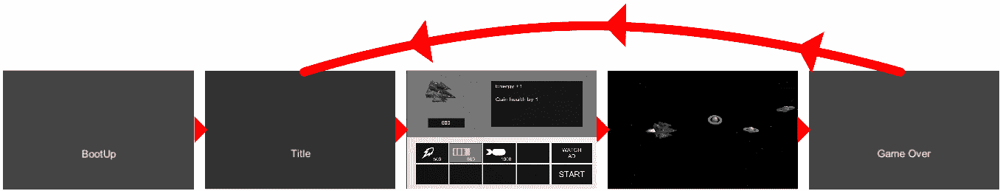

图 7.12 – Killer Wave 的游戏循环

小贴士

记住，如果我们的任何场景看起来比平时暗，我们需要手动烘焙其灯光，就像我们在*第三章*中做的那样，*管理脚本和进行模拟测试*。

通过这种方式，我们创建了一系列承担各自职责的场景。当一个场景结束时，无论是由于自身选择还是玩家提示，下一个场景将加载。最终，玩家要么完成所有三个级别，要么失去所有生命，我们的游戏将进入`游戏结束`场景。从`游戏结束`场景，我们将玩家送回到`标题`场景。这是我们游戏循环，这也是每个游戏都会有的。游戏循环是游戏开发的基本要求，而且这也可能在考试中提到。

这部分和这一章的内容到此结束，我们创建并管理了场景以创建游戏循环。

# 摘要

在本章中，我们创建了一个游戏循环；这些是游戏开发的基础，有时也是应用开发的基础。为了为我们的项目创建游戏循环，我们需要多个具有各自目的的场景。我们还需要知道场景何时开始以及何时结束。场景在玩家按下按钮继续时结束，例如`7`场景，或者当`启动`标题在经过几秒钟后自动移动到下一个场景。

除了创建我们的游戏循环之外，我们还学习了一些新的矢量数学组件，包括`Mathf.round`，用于四舍五入`Vector3.distance`，用于测量两个`Vector3`点之间的距离；以及`Vector3.lerp`，用于在两个`Vector3`点之间进行插值。

这些是游戏开发中有用的组件，也可能会在考试中提到。

在下一章中，我们将通过自定义字体、创建自己的图像和在 Unity 编辑器中应用一些 UI 动画来为我们的占位符场景添加一些润色。

# 模拟测试

1.  从程序员的角度来看，但同时又不会干扰艺术家在同一工作流程中工作的最佳方式是什么？

    1.  确保每个 UI 组件都有自己的类，这样任何艺术上的更改都不会影响结果。

    1.  给每个 UI 组件分配一个单独的材料，以便任何代码更改都将被隔离。

    1.  为每个 UI 组件使用预制件，以便任何艺术家都可以单独修改它们。

    1.  有一个单独的脚本遍历所有 UI 组件，检查所做的任何更改，以便让每个人都知道。

1.  一个**Image**组件在其**Source Image**参数中有一个精灵，其**Image Type**设置为**Filled**。**Filled**的作用是什么？

    1.  填充精灵中的开放空间。

    1.  提供了多种填充精灵的方法。

    1.  确保没有其他精灵可以覆盖它。

    1.  反转精灵的颜色。

1.  `CrossPlatformInputManager`替换了哪个组件？

    1.  `anyKey`

    1.  `Input`

    1.  `mousePosition`

    1.  `acceleration`

1.  当测试你刚刚开发的上向下射击游戏时，你希望控制具有“街机”感。为了使控制能够在移动玩家时自动对齐位置，哪个属性有助于创建所需的效果？

    1.  `GetAxisRaw`

    1.  `GetJoystickNames`

    1.  `InputString`

    1.  `gyro`

1.  编写代码时，例如变量名，应该使用哪种命名规范？

    1.  帕斯卡命名法

    1.  小写

    1.  蛋糕命名法

    1.  骆驼命名法

1.  你正在与一个团队一起创建一个用于军事的逼真模拟，该模拟包括一系列爆炸。你被要求接替之前开发者的工作，他到目前为止已经创建了一个从预制件库中发出一系列爆炸的框架。这些预制件由团队中的艺术家定期更新。尽管看起来很令人印象深刻，但程序已经变得相当庞大，艺术家将需要有权更新、替换、替换和从框架中删除预制件。

你能为团队提供什么解决方案，以防止该框架违反 SOLID 原则，并且对团队中的艺术家来说是可访问的？

1.  创建一系列预制件，这些预制件包含一个预制件簇，每次在 Unity 场景中使用时都会随机化。

1.  创建一个可脚本化的对象，该对象包含一个预制件数组，该数组引用了任意的脚本。

1.  创建一个非过程式的粒子系统，使其能够生成自己的爆炸效果。

1.  在运行时将场景中的所有爆炸保留在摄像机之外，然后使用随机选择脚本引入所需的爆炸。

1.  哪个碰撞器对 Unity 物理系统来说计算速度最快？

    1.  轴承

    1.  球体

    1.  网格

    1.  矩形

1.  哪个 MinMaxCurve 是最便宜的？

    1.  优化曲线

    1.  在两个常量之间随机选择

    1.  在两个曲线之间随机选择

    1.  常量

1.  哪个属性需要通过代码访问以创建夜总会场景的闪烁效果？

    1.  `color.a`

    1.  `spotAngle`

    1.  `range`

    1.  `intensity`
