# 第八章：*第八章*：添加自定义字体和 UI

在本章中，我们将把上一章为我们的游戏循环创建的场景拿来进行各种定制，重点关注文本、图像和动画。

Unity 程序员考试的要求不仅是要对自己的 C#编程技能有信心，还要熟悉 Unity 编辑器在组件和工具方面提供的功能。因此，在本章中，我们将不进行编程，而是专注于我们的**用户界面**（**UI**），它由**图像**和**文本**组件组成。还值得一提的是，我们将使我们的 UI 根据屏幕的比率大小进行扩展和收缩，这是仅使用 3D 资产无法实现的（请参阅上一章以获取更多详细信息）。在学习我们的**文本**组件的同时，我们还将导入并应用我们自己的自定义字体。最后，我们将使用**动画器**对 UI 进行动画处理，并利用**动画控制器**，这涉及到创建我们自己的状态。

以下截图显示了本章结束时我们的标题屏幕应该看起来像什么：

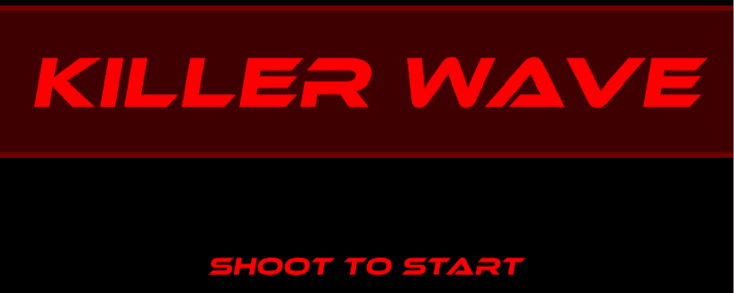

图 8.1 – Killer Wave 标题屏幕

本章我们将涵盖以下主题：

+   介绍 Canvas 和 UI

+   将文本和图像应用到我们的场景中

到本章结束时，你将更有信心地将**文本**和**图像**组件结合起来，并对 UI 进行动画处理。

# 本章涵盖的核心考试技能

*编程核心交互*：

+   实现和配置游戏对象的行为和物理。

*在艺术管道中工作*：

+   理解材质、纹理和着色器，并编写与 Unity 渲染 API 交互的脚本。

+   理解 2D 和 3D 动画，并编写与 Unity 动画 API 交互的脚本。

*开发应用程序系统*：

+   解释应用界面流程的脚本，例如菜单系统、UI 导航和应用设置。

# 技术要求

本章的项目内容可在[`github.com/PacktPublishing/Unity-Certified-Programmer-Exam-Guide-Second-Edition/tree/main/Chapter_08`](https://github.com/PacktPublishing/Unity-Certified-Programmer-Exam-Guide-Second-Edition/tree/main/Chapter_08)找到。

你可以在[`github.com/PacktPublishing/Unity-Certified-Programmer-Exam-Guide-Second-Edition`](https://github.com/PacktPublishing/Unity-Certified-Programmer-Exam-Guide-Second-Edition)下载每个章节的项目文件。

本章的所有内容都包含在章节的`unitypackage`文件中，包括一个包含本章我们将执行的所有工作的`Complete`文件夹。

查看以下视频以查看*代码的实际应用*：[`bit.ly/3kqIi8k`](https://bit.ly/3kqIi8k)。

# 介绍 Canvas 和 UI

画布的目的通常是持有图像和文本的 2D 世界。其主要目的是允许用户与事物交互，例如点击按钮、推动音量滑块和旋转旋钮，这通常被称为 UI。

Unity（相当令人困惑地）使得 2D 画布也共享与 3D 世界相同的空间。因此，在我们的场景中，我们通常会有一个大的画布区域，包含 UI；然后，在屏幕的左下角，我们将有我们的 3D 世界。

以下屏幕截图显示了具有实现 **Canvas** 组件的 Unity 场景示例，以及一个立方体和一个 UI 按钮：

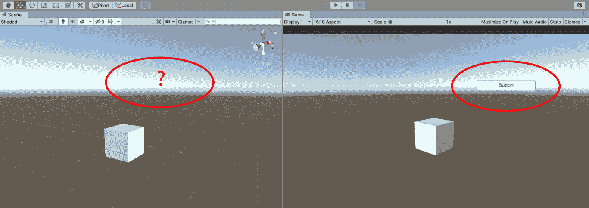

图 8.2 – 我们的按钮的可见性不同于 2D 画布空间和 3D 世界空间

如前一个屏幕截图所示，在右侧，我们有 **Game** 视图显示一个 3D 立方体和 UI **按钮**。在左侧，我们有 **Scene** 视图显示相同的立方体，但缺少 **按钮**。这是因为，在 **Scene** 窗口中，包含 UI 按钮的画布位于其自己的 2D 空间中。为了解决这个问题，我们需要从 **Scene** 视图中缩放出来，我们将看到 UI 按钮的位置。此外，我们还将看到代表屏幕比率的白色大矩形轮廓。

注意，由于我们放大了很多，3D 立方体实际上非常小。在下面的屏幕截图中，我们甚至看不到立方体，左侧用圆形轮廓标记。一开始理解起来有点复杂，但可以将其视为两个项目共享同一空间：

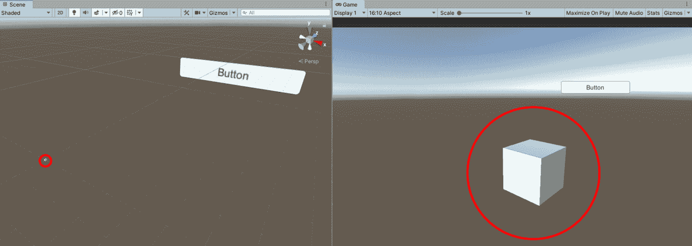

图 8.3 – 左侧的画布包含我们的按钮，右侧显示其在游戏窗口中的位置

通过这个简短的例子，我们可以看到画布如何与 3D 空间共享空间，接下来让我们进入下一节，我们将开始使用画布并添加一些文本和图像。

# 将文本和图像应用到我们的场景中

在本节中，我们将更改以下场景：

+   灰色的背景

+   白色的 **TextMesh**（3D 文本，不需要画布）

我们将用以下场景替换那些场景：

+   黑色的背景

+   自定义红色 **Text**（2D 文本，需要画布）

如介绍中所述，这样做的好处是文本的大小将保持不变，无论屏幕的比率或分辨率如何。

以下屏幕截图显示了左侧的当前 `BootUp` 场景和右侧在做出更改后应该看起来像什么：

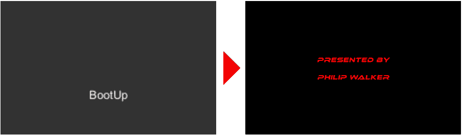

图 8.4 – 我们将改进 BootUp 场景的视觉效果

如果你还没有在 Unity 编辑器中打开场景，请从 `Assets/Scene` 跳转到 `bootUp` 场景。

让我们从将背景颜色从灰色更改为黑色开始。如果您忘记了如何操作，请按照以下步骤进行：

1.  在 **Hierarchy** 窗口中选择 **Main Camera**。

1.  使用 `0,0,0,255`，如下截图所示：

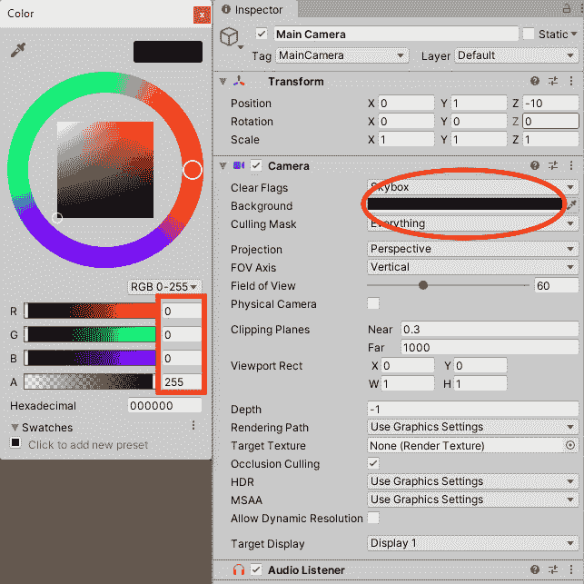

图 8.5 – 将我们的 bootUp 场景背景更改为黑色

将 `BootUp` 文本替换为我们的新 2D 文本。

1.  从 **Hierarchy** 窗口中选择 `BootUpText` 并删除它。

我们现在将向场景中添加 Canvas 和 2D 文本。

1.  在 **Hierarchy** 窗口的空白区域右键单击，选择 **UI** | **Text**，如下截图所示：

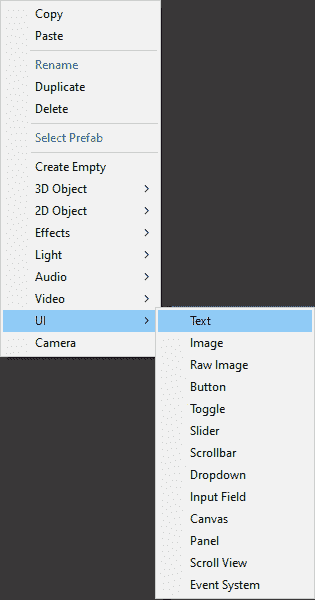

图 8.6 – 在 Unity 编辑器中创建 2D 文本

由于我们添加了 2D 文本，Unity 会自动将 Canvas 和 EventSystem 添加到场景中。以下截图显示了 `bootUp` `Text` 游戏对象：

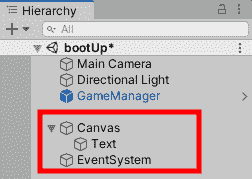

图 8.7 – 我们显示 Canvas、Text 和 EventSystem 的层次结构

1.  右键单击 `Text` 游戏对象并将其重命名为 `presented`。

在 **Hierarchy** 窗口中仍然选择 `presented`，注意 **Inspector** 窗口，因为我们需要更新其 **Text** 组件。

1.  在 **Text** 字段中，将默认输入从 **New Text** 更改为 **presented by**。

让我们继续修改 `presented` 游戏对象的 **Text** 组件设置。

我们将更改字体，从典型的 `Assets/Font/ethnocentric rg it`。我们可以从我们的 `presented` 游戏对象中选择此字体。

1.  点击下拉列表中 `ethnocentric rg it` 右侧出现的圆形小圈。

1.  更改 `0`。

到目前为止，我们的字体已从 **Scene** 窗口中消失。这是因为 **矩形工具** 不够大，我们需要调整其大小。我们将在下一步进行此操作。

信息提示

矩形工具是图像或文本放置的区域。将其视为与变换组件类似的一个工具，我们在此输入游戏对象的 Position、Rotation 和 Scale 的 Vector3 值，这是我们自 *第二章*，*添加和操作对象* 以来一直在更改的。

1.  在仍然选中的 `presented` 游戏对象中，确保选择 **矩形工具**，如下截图所示：

图 8.8 – 矩形工具按钮位置

1.  确保我们处于 2D 模式（并且 **Gizmos** 在条形上已开启），因为我们调整 2D 文本时不需要关心 3D 空间。可以在键盘上按 *2* 或点击以下按钮：

](img/Figure_8.09_B18381.jpg)

](img/Figure_8.09_B18381.jpg)

图 8.9 – 2D 按钮位置

1.  此外，检查**游戏**窗口的比例是否设置为**1080 (1920x1080)**（这是我们*第二章*，*添加和操作对象*中设置的屏幕比例）。您可以使用**游戏**标签下面的下拉列表来完成此操作，如下面的截图所示：

![图 8.10 – 将我们的游戏窗口宽高比更改为 1080]

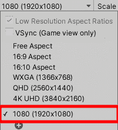

图 8.10 – 将我们的游戏窗口宽高比更改为 1080

1.  点击并拖动**矩形工具**的外边缘到最左侧，直到它剪切到外边缘，如下面的截图所示：

![图 8.11 – 点击并拖动我们的矩形工具边缘（箭头所在位置）到最左边的外边缘（*符号）]

图 8.11 – 点击并拖动我们的矩形工具边缘（箭头所在位置）到最左边的外边缘（*符号）

1.  完成后，将**矩形工具**的右边缘拖到外边缘的右侧。

1.  现在，将**矩形工具**的顶部和底部边缘加宽。这样，高度大约是白色外矩形四分之一。我们现在应该能看到文本重新出现，我们的**矩形工具**比例应该与以下截图中的类似：

![图 8.12 – 按照此处类似的方式，点击并拖动矩形工具的顶部和底部边缘]

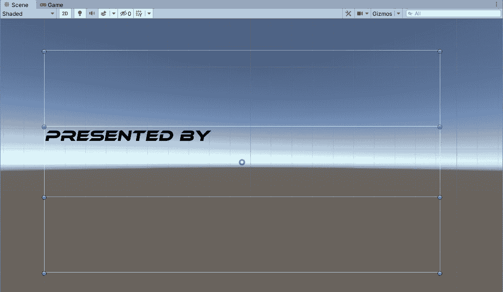

图 8.12 – 按照此处类似的方式，点击并拖动矩形工具的顶部和底部边缘

现在我们已经设置了**矩形工具**的间距，我们需要设置**锚点**，以确保文本无论屏幕比例或分辨率如何都能保持正确的尺寸。

在画布屏幕的中心，我们应该能看到四个指向彼此的箭头（以下截图的左侧用红色圈出了这四个箭头）。

要将**锚点**设置在四个蓝色圆圈相同的位置，请执行以下步骤：

1.  逐个点击并拖动每个白色箭头到每个蓝色圆圈的位置：

![图 8.13 – 点击并拖动每个白色轮廓箭头到其远角的蓝色圆圈]

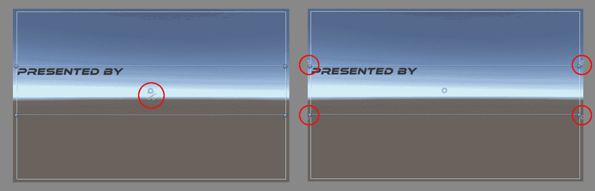

图 8.13 – 点击并拖动每个白色轮廓箭头到其远角的蓝色圆圈

现在既然我们的**锚点**大致位于**矩形工具**上方，该工具由蓝色圆圈表示，我们可以确保**位置**和**锚点**都对齐。

1.  要将**矩形变换**设置到位，请在**左**、**顶**、**Pos Z**、**右**和**底**位置输入值为 0。以下截图（左侧）显示了我们的突出显示值。您的可能不会相同，因为我们之前手动定位了**矩形工具**：

![图 8.14 – 将所有突出显示的矩形变换值重置为 0]

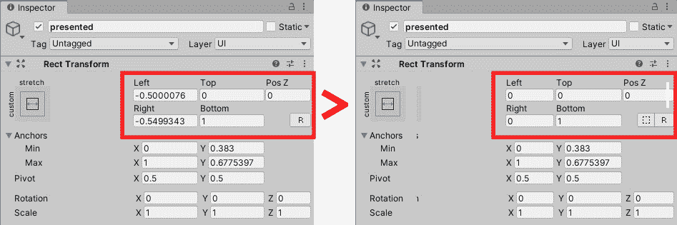

图 8.14 – 将所有突出显示的矩形变换值重置为 0

现在，我们可以继续在**检查器**窗口中的**文本**组件中设置文本的颜色和位置。

1.  要在**文本**组件中居中**由**文本，选择**对齐**部分中的两个中间按钮，如下一个截图所示：

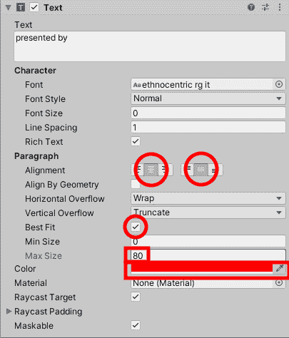

图 8.15 – 更新每个文本组件属性值

1.  打开**最佳拟合**框。这将确保我们的文本可以动态地缩放以支持屏幕的比率。

1.  使用`0`和`80`。

1.  通过点击**颜色**字段并选择红色来更改颜色，如前一个截图所示。

我们现在已经完全运行了我们之前拥有的`bootUp`**TextMesh**。

以下截图显示了我们的自定义文本、颜色、大小和对齐方式：

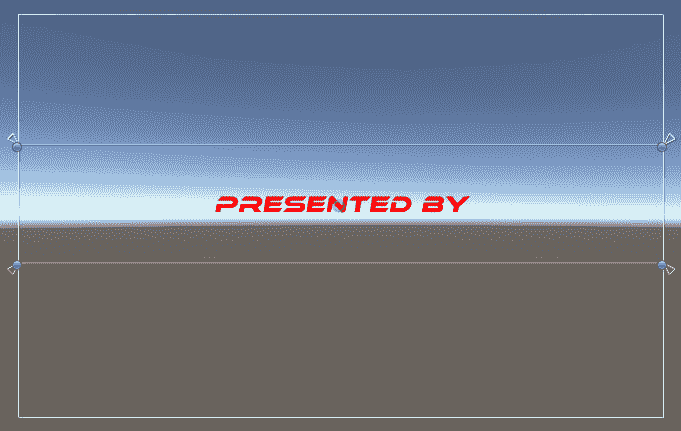

图 8.16 – 我们的新字体现在居中并具有风格

如你所想，我们还没有完全完成，因为我们还需要在**由**文本下面显示名字或公司名称。幸运的是，我们只需要重复我们刚刚完成的工作的四分之一左右。而且，正如你可能猜到的——是的——我们可以复制并粘贴这段文本。

要设置自己的名字或公司名字在**由**下面，请执行以下步骤：

1.  从**层次结构**窗口中选择`presented`游戏对象。

1.  按*Ctrl*（在 Mac 上为*command*）和*D*键复制游戏对象。

1.  按*T*键切换到**移动工具**：

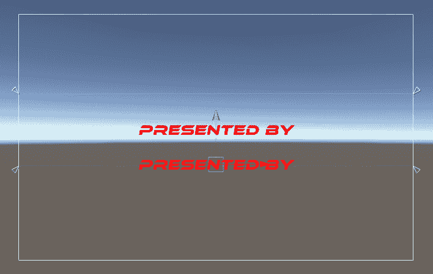

图 8.17 – 复制文本的第二行

1.  现在点击并拖动绿色*y 轴*箭头向下（如前一个截图所示），大致位于原始**由**文本的**矩形工具**所在的白色线上。

1.  接下来我们需要做的就是点击并拖动**锚点**的四个白色箭头轮廓向下，以适应我们新创建的游戏对象，如下一个截图所示：

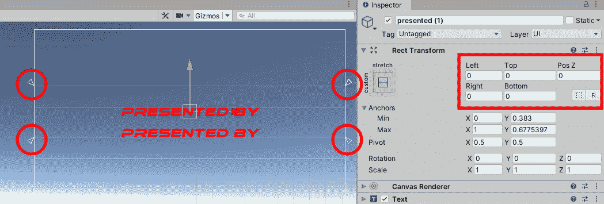

图 8.18 – 整理我们复制的文本的 Rect Transform 边界

1.  如果你已经移动了`0`。

因此，我们的新文本已经到位。我们现在需要做的就是更改输入的内容。

1.  我们知道如何做到这一点：只需滚动到**文本**组件并输入你的名字、公司名字、宠物的名字或任何名字——对于本教程的目的来说，这都不重要。

1.  一旦你输入了你的名字，不要忘记将`presented(1)`游戏对象重命名为`yourName`。

1.  点击**游戏**选项卡窗口查看其外观。这就是我们的样子：

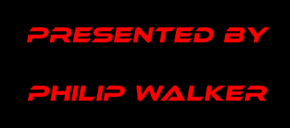

图 8.19 – 我们的启动文本已完成

1.  保存场景。

我们已经介绍了**Canvas**组件的基本知识以及如何应用 2D 文本。接下来，我们将重复类似的程序并使用**图像**组件。这相当于我们在*第五章*中用于商店场景按钮的**Sprite Renderer**，即*为我们的游戏创建商店场景*。然而，在这里，**图像**组件用于 2D 空间。

从这一点到本章的结尾，我们将按顺序浏览一系列子章节，以便润色和生动化我们的场景。我们将涵盖以下内容：

+   从我们的标题场景开始，我们将通过创建和应用**文本**和**图像**组件来改进其视觉效果。

+   我们将使用自定义字体，因为我们能这样做，这将使我们的游戏看起来比 Unity 附带的标准字体更好。从那里，我们将能够进一步自定义`title`场景的外观，使其更适合我们的游戏。

+   然后，我们将把应用到`title`场景中的内容复制并粘贴到其他场景中。从那里，我们将稍微更改文本内容和位置。

+   最后，我们将设置我们的**动画器**和**动画控制器**状态，并动画化我们的 UI 以介绍每个游戏级别。

让我们继续润色我们的`title`场景。

## 改善我们的标题场景

在本节中，我们将重复我们在上一节中学到的程序，但不会深入探讨，因为我们已经知道如何创建 Canvas、添加自定义文本和执行复制。在本节中，我们还将利用 Unity 的**图像**组件。

以下截图显示了我们将要经历的转换，从左侧的当前标题场景开始，使用我们在上一节中应用的技术，以及添加**图像**组件，以创建右侧的红色条纹：

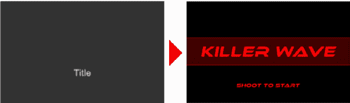

图 8.20 – 左侧的旧标题屏幕；我们将用右侧的内容替换它

如前所述，我们不会深入所有细节；然而，如果你在任何时候遇到困难，请参考上一节以指导你了解你应该知道的内容。让我们开始吧：

1.  让我们从从`Assets/Scene`加载我们的`title`场景开始。

1.  将`255`更改为。

1.  从**层次结构**窗口中删除`TitleText`游戏对象。

1.  在**层次结构**窗口中仅创建一个`Canvas`游戏对象。以下截图作为参考：

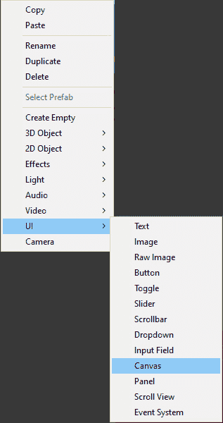

图 8.21 – 创建 Canvas

现在，我们将创建一个空的游戏对象。在这个游戏对象内部，我们将存储我们的**文本**和**图像**组件：

1.  通过在**层次结构**窗口的底部空白区域右键单击，然后从下拉列表中选择**创建空对象**来创建一个空的游戏对象。

1.  新的空游戏对象将默认命名为`GameObject`。

1.  右键单击此游戏对象并选择`标题`。

1.  将`标题`游戏对象移动到`画布`游戏对象中，使其成为子对象。

通常，当创建一个新的游戏对象时，它将自动获得一个**变换**组件，该组件包含游戏对象在 3D 空间中的**位置**、**旋转**和**缩放**。在本节中，我们的重点是 2D 空间，因此我们需要将此游戏对象从**变换**组件更改为**矩形变换**组件。

要将`标题`游戏对象从**变换**更改为**矩形变换**，请按照以下步骤操作：

1.  在**层次结构**窗口中选择`标题`游戏对象后，在**检查器**窗口中单击**添加组件**按钮。

1.  将出现一个下拉列表。在搜索栏中输入`rect transform`，直到可以从列表中选择它，如下面的屏幕截图所示：

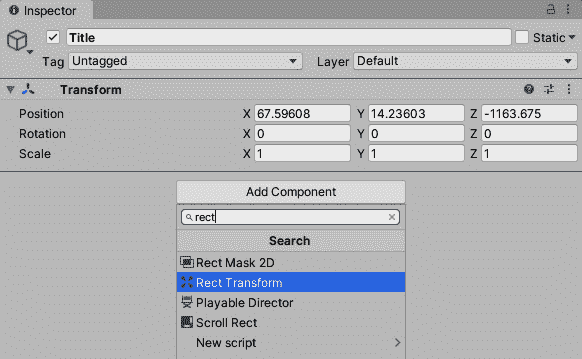

图 8.22 – 从下拉菜单选择矩形变换

我们现在将设置我们的`标题`游戏对象的`标题`游戏对象的**锚点**。

我已将我的`标题`游戏对象的**矩形变换**组件设置为以下设置：

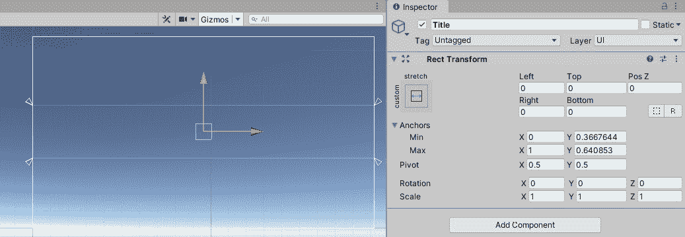

图 8.23 – 更新锚点最小和最大值

如您所见，在前面的屏幕截图中，`标题`游戏对象位于画布的白色框轮廓中央。此外，请注意，**矩形变换**组件的**左**、**上**、**Z 位置**、**右**和**下**位置都设置为 0 的值。

下一步将在`标题`游戏对象内添加一个红色透明条带。要添加**图像**组件，请按照以下说明操作：

1.  在**层次结构**窗口中创建一个新的游戏对象。

1.  将游戏对象命名为`mainCol`。

1.  将`mainCol`游戏对象拖放到`标题`游戏对象上方，使`mainCol`成为`标题`的子对象。请参考以下屏幕截图以获取参考：

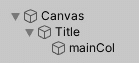

图 8.24 – 从层次结构窗口查看画布子对象顺序

1.  在选择`mainCol`游戏对象的情况下，我们希望其`标题`游戏对象保持原样，因为它是我们的`mainCol`游戏对象的父对象。以下屏幕截图是关于我们的`mainCol` **矩形变换**属性的参考：

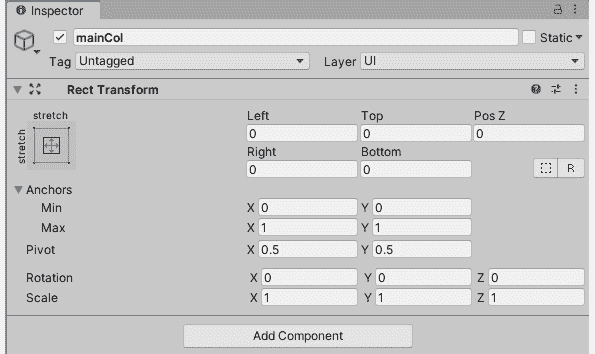

图 8.25 – 将 mainCol 锚点设置为全尺寸

1.  在选择`mainCol`游戏对象的情况下，将`图像`选择到下拉列表中，直到它出现。当它出现时，选择它。请参考以下屏幕截图：

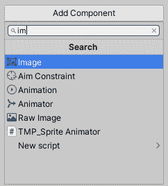

图 8.26 – 从下拉菜单添加图像组件

我们现在已添加了`mainCol`图像。

1.  接下来，我们将调整`mainCol`图像反应的颜色变化（表示为**3**）：

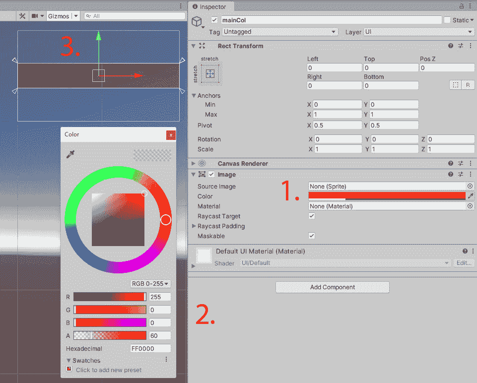

图 8.27 – 更新图像组件的颜色设置为显示的值

更多信息

如果我们在参数中添加了精灵而不是仅仅改变颜色，使用**图像**组件，我们还将有改变其**图像类型**的能力。可以使用的一种类型称为**填充**。这可以给你一种精灵正在填充的印象，这对于加载条或倒计时的时间限制将很有用。

如果你想了解更多关于**图像**组件及其其他用途的信息，请查看[`docs.unity3d.com/2017.3/Documentation/Manual/script-Image.html`](https://docs.unity3d.com/2017.3/Documentation/Manual/script-Image.html)的文档。

接下来，我们将使用包含**图像**组件的另一个游戏对象添加一个条带到我们刚刚制作好的图像顶部。为此，我们将重复我们之前的方法，但使用更紧、更薄的条带。按照以下步骤操作：

1.  在`mainCol`仍然被选中时，按键盘上的*Ctrl* (*Mac 上的*command*) 和 *D* 来复制游戏对象。

1.  将新游戏对象`trim00`重命名。

1.  将`trim00`游戏对象的`trim00`游戏对象在顶部：

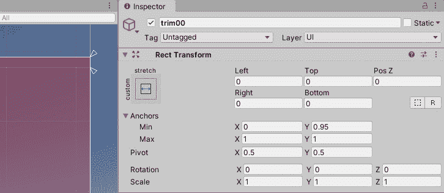

图 8.28 – trim00 锚点最小和最大值

对于我们的 trim 集，我们不需要改变颜色，因为它从`mainCol`游戏对象中复制而来。我们现在需要重复这个过程来处理`mainCol`图像的底部部分。

我们需要完成以下步骤来复制另一个 trim 游戏对象：

1.  复制`trim00`游戏对象，并将其重命名为`trim01`。

1.  将`trim01`游戏对象的**矩形变换**设置设置为以下截图所示的相同设置：

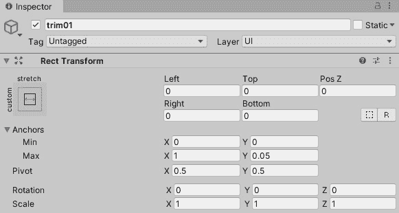

图 8.29 – trim01 锚点最小和最大值

现在是时候按照以下说明输入我们的主标题文本`KILLER WAVE`了：

1.  在**层次结构**窗口中创建另一个空的游戏对象。

1.  给新的空游戏对象命名为`TitleText`。

1.  在`TitleText`游戏对象内部的`Title`游戏对象中。这样`TitleText`就变成了`Title`的子对象。

1.  在`TitleText`仍然被选中时，在**检查器**窗口中点击**添加组件**，然后从下拉列表中选择**矩形变换**，就像之前一样。

1.  将`TitleText` **矩形变换**设置设置为以下值：

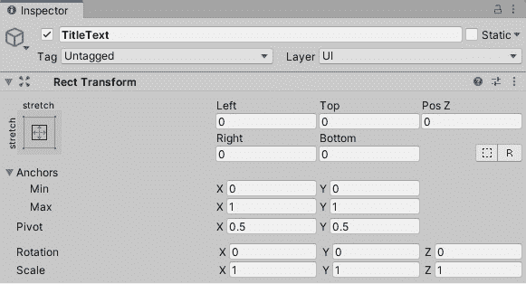

图 8.30 – TitleText 锚点最小和最大值

这将填充我们的`TitleText` `Title`）。

我们`TitleText`游戏对象的最后几步是给它添加一个**文本**组件，并在**检查器**窗口中设置其值：

1.  在`text`中选择`TitleText`游戏对象（如果它不在那里），然后从下拉列表中选择，就像之前一样。

1.  在`killer wave`中。

1.  点击`bootUp`场景右侧的小圆圈（`ethnocentric rg it`）。

1.  设置**对齐**按钮为中心和中间。

1.  打开**最佳拟合**。这将让 Unity 根据其比例尝试调整文本。

1.  设置`140`。这将给我们一个相当大的标题。

1.  在**颜色**字段中选择鲜艳的红色。

我们已经设置了标题。在这个场景中，我们最后需要做的是在屏幕底部设置一条消息，提示玩家开始游戏。

与我们在`bootUp`场景中所做的一样，我们可以复制我们的`TitleText`游戏对象。然而，这次，我们将把复制的游戏对象移动到其父**矩形变换**的限制之外。我们将显示的最后文本将是一条提示玩家点击屏幕或射击以开始游戏的短信。

要输入`SHOOT TO START`文本，请按照以下说明操作：

1.  在**层次结构**窗口中选择`TitleText`游戏对象。

1.  按*Ctrl*（在 Mac 上为*command*）和*D*来复制它。

1.  将复制的游戏对象重命名为`shootToStart`。

1.  在`shootToStart`仍然被选中的情况下，在**检查器**窗口中更改其`SHOOT TO START`。

1.  设置`50`。

如前所述，我们将把**文本**选择从其当前区域移动到其父对象之外。

1.  按*Ctrl*（在 Mac 上为*command*）并点击其上的任意一个白色箭头。然后，将**矩形工具**向下拉，使其完全位于其父**矩形变换**之外，如以下截图所示：

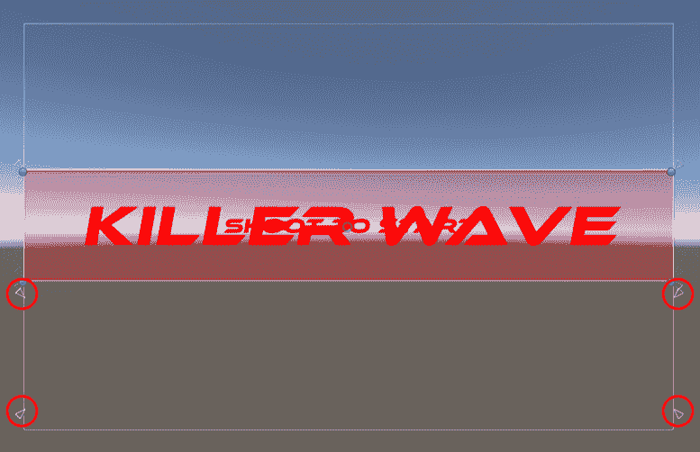

图 8.31 – 将 shootToStart 锚点移动到高亮位置

将`SHOOT TO START`文本移至白色箭头所在的位置。以下截图显示了文本的放置以及其**矩形变换**属性值：

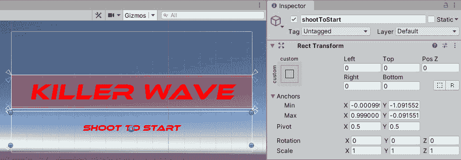

图 8.32 – shootToStart 锚点的最小和最大值

我们不需要更改场景的任何功能，因为我们已经设置了这一点。

1.  保存场景。

以下截图显示了我们的`title`场景现在的样子：

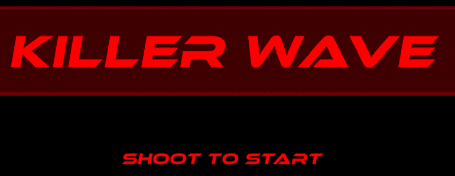

图 8.33 – 杀手浪标题屏幕

到目前为止，我们已经通过复制、修改和将其移动到其父**矩形工具**游戏对象之外来进一步处理我们的文本。我们还引入了图像，并以类似的方式使用它们来处理 2D 文本。

我们现在将继续并开始下一个场景：`gameOver`。

## 复制我们的游戏对象

在本节中，我们将改进`gameOver`场景，从其灰色背景和块状白色文本，替换为与`title`场景相同的图像和文本。然而，这次，我们不会重复之前章节中的相同步骤来重现相同的结果。

我们将复制、粘贴并调整游戏对象以节省时间和精力，而不是重复我们在标题场景中已经实现的内容。

作为概述，以下是我们`gameOver` UI 游戏对象将包含的内容和功能：

+   `Canvas`：这是所有 UI 游戏对象的父对象。

+   `GameOverTitle`：这包含与**文本**和**图像**组件相关的所有单个游戏对象。

+   `mainCol`：中心的主要红色条纹（包含**图像**组件）。

+   `trim00`：顶部的红线（包含**图像**组件）。

+   `trim01`：底部的红线（包含**图像**组件）。

+   `GameOverText`：主要的**GAME OVER**文本（包含**文本**组件）。

幸运的是，我们实际上不必太担心它们的角色是什么，因为我们已经在上一节中建立了这一点。要复制我们的游戏对象并将它们从`title`场景移动到`gameOver`，请执行以下步骤：

1.  在我们仍然处于`title`场景时，按住键盘上的*Ctrl*（在 Mac 上为*command*）并选择**主相机**和**Canvas**。

1.  我们的两个对象都将被突出显示。右键单击其中的任何一个，然后从下拉列表中选择**复制**。

1.  打开`gameOver`场景。

1.  在`GameOverText`中。我们将用我们复制的游戏对象替换这些内容。

1.  在**层次结构**窗口的空白区域右键单击并选择**粘贴**。

1.  在`Title`游戏对象旁边的`Canvas`游戏对象旁边点击箭头，然后从下拉列表中选择**重命名**。

1.  将游戏对象重命名为`GameOverTitle`。

1.  点击`GameOverTitle`旁边的箭头，将`TitleText`游戏对象重命名为`GameOverText`。

1.  选择`shootToStart`游戏对象，然后在键盘上按*Delete*键。

为了确认我们到目前为止所做的工作，以下截图显示了`gameOver`场景：

![图 8.34 – 带有序列游戏对象的层次结构窗口

![img/Figure_8.34_B18381.jpg]

图 8.34 – 带有序列游戏对象的层次结构窗口

1.  在`GameOverText`仍然被选择的情况下，将其`killer wave`更改为`game over`。

1.  保存场景。

这是我们`gameOver`场景应该看起来像的：

![图 8.35 – 游戏结束屏幕

![img/Figure_8.35_B18381.jpg]

图 8.35 – 游戏结束屏幕

在本节中，我们发现我们可以在同一个 Unity 项目中简单地复制和粘贴游戏对象，只要我们在同一个场景中工作。这节省了时间和精力，并使我们的游戏看起来与场景的其他部分保持一致。

在下一节中，我们将学习如何对 UI 游戏对象进行动画处理。

## 准备对 UI 游戏对象进行动画处理

在本节中，我们将使用我们已经介绍过的多种技术，因此不会深入到相同的程度。一旦我们复制并更改了游戏对象，我们还将添加动画元素，使我们的 2D 视觉效果不那么静态。

我们将使用与`gameOver`场景类似的方法，通过复制我们之前场景的`Canvas`及其子游戏对象（不是`gameOver`场景，因为它包含我们需要的元素。这只需要在进入动画阶段之前进行一些修改）。

要设置`level1`场景，执行以下步骤：

1.  确保我们的`gameOver`场景仍在 Unity 编辑器中打开。这是因为我们将要复制一些游戏对象到`level1`场景中。

1.  在`Canvas`游戏对象中，从下拉列表中选择**复制**。

1.  从**项目**窗口打开`level1`场景。

1.  在我们的`level1`场景中的`Canvas`上右键单击。

1.  接下来，我们将重命名两个游戏对象以适应我们的`level1`场景。

1.  在`GameOverTitle`游戏对象中扩展`Canvas`游戏对象。右键单击它，从下拉列表中选择**重命名**。

1.  将游戏对象重命名为`LevelTitle`。

1.  在**层次结构**窗口中展开`LevelTitle`游戏对象。

1.  在`Level`中选择`GameOverText`。

这就是我们需要在`LEVEL 1`的`Canvas`游戏对象上做的所有事情。

在选择`Level`游戏对象的同时，移除`LEVEL 1`，如下面的屏幕截图所示：

![Figure 8.36 – Level 1 text typed out]

![img/Figure_8.36_B18381.jpg]

图 8.36 – Level 1 text typed out

我们现在可以开始对 UI 2D 文本及其图像进行动画处理了。我们将要动画化的所有游戏对象都位于`LevelTitle`游戏对象内。

要设置我们的动画，我们需要执行以下操作：

1.  当你仍然在`level1`场景中时，在**层次结构**窗口中，选择**Canvas**游戏对象下的`LevelTitle`。

1.  在`LevelTitle`中，点击底部的**添加组件**按钮。

1.  输入`Animator`直到你看到单词**Animator**出现，然后选择它。

我们的`LevelTitle`游戏对象现在有一个`LevelTitle`游戏对象。要这样做，请遵循以下步骤：

1.  在`Assets/Animator`。

1.  在**项目**窗口的空白区域右键单击，然后从下拉列表中选择**创建**，接着选择**Animator Controller**。

1.  更改新的`LevelTitle`的名称。

我们现在需要将新的`LevelTitle` **Animator Controller**附加到我们的**Animator**组件上。

1.  在`LevelTitle`游戏对象中，点击旁边的小圆形圆圈（在以下屏幕截图中被标记为远程，用箭头表示）从下拉列表中选择。

以下屏幕截图显示了已选择`LevelTitle`控制器的`LevelTitle`游戏对象：

![Figure 8.37 – LevelTitle game object with an Animator component and a LevelTitle Animator Controller]

![img/Figure_8.37_B18381.jpg]

图 8.37 – 带有 Animator 组件和 LevelTitle Animator 控制器的 LevelTitle 游戏对象

接下来，我们需要创建一个动画，以便我们可以将其添加到**Animator Controller**：

1.  在`Assets/Animator`位置，在空白区域右键单击。选择**创建** | **动画**。

1.  将`levelTitle_A`重命名。

现在让我们打开`levelTitle_A`片段。

1.  在 Unity 编辑器的顶部，点击**窗口**然后选择**动画器**。

这将打开**动画器**窗口。

1.  在**层次结构**窗口中选择`LevelTitle`游戏对象。**动画器**的内容将出现，包括其三个状态（**任何状态**、**进入**和**退出**）。

以下截图显示了**动画器**窗口及其三个默认状态，以及所选**动画控制器**的位置引用：

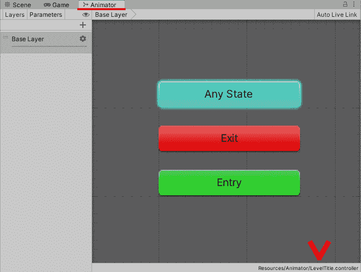

图 8.38 – 包含动画控制器文件位置名称的动画器窗口

在我们将动画片段拖入之前，在片段播放前有一个小的时间延迟对我们是有益的；否则，动画可能会播放得太早。为了解决这个问题，我们可以创建一个有时间限制的空状态。我们可以设置这个`levelTitle_A`）。

要创建一个**空闲**状态并将其连接到目标动画片段，请按照以下步骤操作：

1.  在**动画器**窗口的空白部分右键单击，并选择**创建状态** | **空**。以下截图显示了我们应该期望的下拉列表：

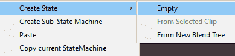

图 8.39 – 创建一个空状态

1.  选择**新状态**，然后在**检查器**窗口中，将**新状态**名称更改为**空闲**。然后，按键盘上的*Enter*键。

1.  现在我们可以将`levelTitle_A`从**项目**窗口拖动到**动画器**窗口。

1.  我们现在需要将我们的`Idle`游戏状态与`levelTitle_A`状态之间的转换连接起来。

1.  在**空闲**状态上右键单击，并从下拉列表中选择**创建转换**。

1.  选择**levelTitle_A**以在两个状态之间建立连接。

以下截图显示了我们的状态现在应该看起来是什么样子：

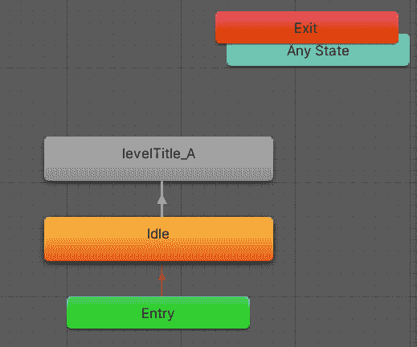

图 8.40 – 我们的动画状态从 Entry > Idle > levelTitle_A 转换

动画完成后，可能不需要使用**动画器**窗口，我们可能需要调整延迟。然而，为此，我们需要使用**动画**窗口，因此最好将其放在屏幕底部。为此，请执行以下步骤：

1.  在**项目**窗口中，从下拉列表中点击**添加标签**按钮。

1.  点击**动画**。

以下截图与前面的编号项目一致：

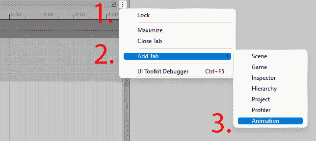

图 8.41 – 显示动画窗口

在本节中，我们引入了 **GAME OVER** UI 艺术并将其文本从其 **Text** 组件中替换；我们还带来了其精灵（横幅和修剪）和 **Image** 组件，以给出我们当前所在级别的表示。然后我们使用 **Animator Controller** 和其状态准备游戏对象进行动画，随后创建了一个空的 **动画** 片段。

我们现在可以开始动画化下一节中我们的 **LEVEL 1** UI 艺术的进入和退出。

## 动画我们的 UI 级别标题

我们将要动画化两个游戏对象：`level1` 场景中的级别标题和主要条形栏。在前一节中，我们在 Unity 编辑器底部设置了 **动画** 窗口。以下截图显示了我们的当前窗口布局设置，可能有助于参考：

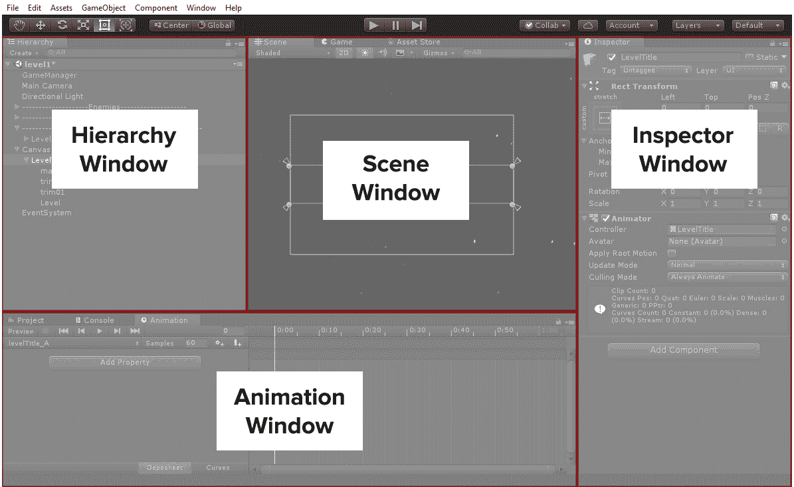

图 8.42 – 推荐的 Unity 编辑器窗口布局

关于动画本身，我们将动画化以下内容：

+   移动到屏幕上的级别文本。

+   主要中心条将变红。

+   将退出屏幕的文本。

以下截图显示了这一点：

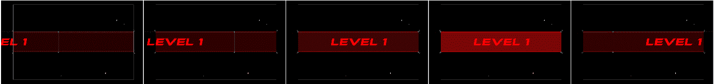

图 8.43 – 第 1 级的 UI 动画序列

因此，需要动画化的四个主要元素是包含 Level 游戏对象的 `Level` 游戏对象，它首先包含 2D `mainCol`、`trim00` 和 `trim01` 游戏对象。

### 动画 2D 文本组件

在本节中，我们将从左到右动画化文本，它将暂停以便玩家有时间阅读，然后它将移出屏幕：

1.  在 `Canvas` 游戏对象中展开其内容，如果尚未展开的话。

1.  点击 `LevelTitle` 旁边的箭头执行相同的操作。

1.  选择 `Level` 游戏对象。

1.  在 **动画** 窗口中，点击记录按钮，如下截图所示：

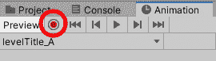

图 8.44 – 动画记录按钮

通过以下操作，我们将动画轨迹线刮擦（注意刮擦是动画术语，用于拖动我们的时间轴指示器）到 `Level` 游戏对象，从 Canvas 的中心到 **场景** 视图中的左侧。

1.  在 `-2000` 和 `2000` 属性字段中选择并拖动 `Level` 游戏对象，以将我们的 2D `LEVEL 1` 文本从 **Canvas** 视图中移出，如下截图所示：

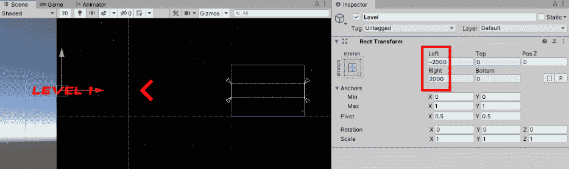

图 8.45 – 定位 Level 游戏对象 Rect Transform 属性值

现在，我们的 `LEVEL 1` 2D 文本已经被推到一边，我们可以将动画线向前刮擦。

1.  在时间轴数字内点击并拖动，如下截图所示：

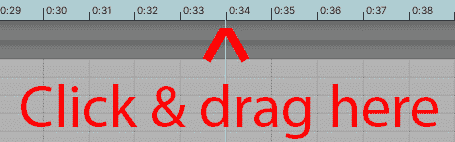

图 8.46 – 调整时间轴的显示

1.  在**动画**窗口中，将白色垂直线从**0:00**拖动到**0:34**。

1.  在`Level`游戏对象的**Rect Transform** **Left**和**Right**属性设置为 0。

字段将变为红色以显示更改已被记录。动画窗口中的动画时间轴将从 2D 文本的运动中获得关键帧。

以下截图显示了时间轴上的更改：

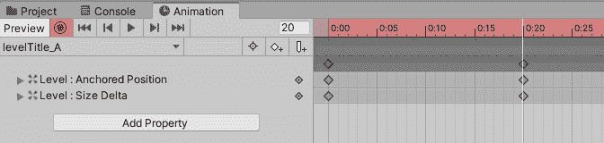

图 8.47 – 带有记录区域的动画时间轴

我们显然希望`LEVEL 1`文本在再次离开屏幕之前停留在原地几秒钟。为了使文本在移动前暂停在中心，请按照以下步骤操作：

1.  在**动画**窗口中，将白色线条从**0:34**移动到**1:25**。

1.  点击**添加关键帧**按钮。

以下截图显示了时间轴在**1:25**，在点击记录按钮时添加了新的关键帧：

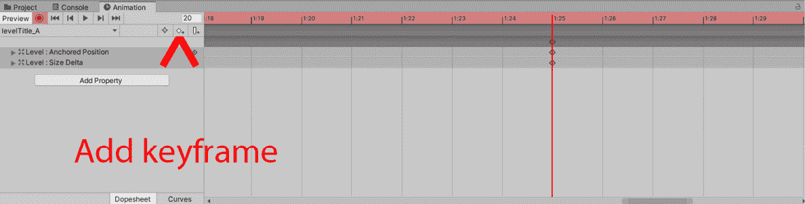

图 8.48 – 添加关键帧按钮

1.  对于我们的下一个关键帧点，将白色线条拖动到**1:50**。

现在我们已经到了想要将 UI 文本从其中心位置移动到摄像机视图中不可见的位置的阶段。

1.  选择`Level`游戏对象。

1.  在`2000`

1.  `-2000`

这将使`LEVEL 1`文本从摄像机视图中移出，如下面的截图所示：

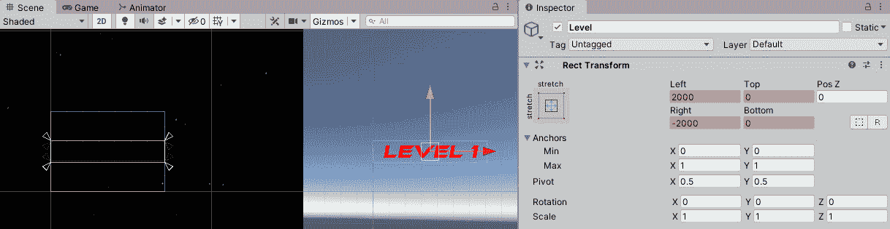

图 8.49 – 级别游戏对象 Rect Transform 记录的属性值

1.  将鼠标光标向下移动到时间轴**动画**窗口。然后，点击并按键盘上的*F*键。这将显示我们刚刚完成的总动画的所有关键帧。

1.  在**动画**窗口的时间轴上点击**记录**按钮以停止记录，并前后滚动以查看我们的 2D 文本动画进入、暂停然后移出屏幕。

我们通过使用 Unity 的**动画**系统，在`Canvas`中动画化了`Level 1`文本，开始了我们的尝试。

我们的 UI 文本从最左边开始（在摄像机视图中不可见），动画进入中心，暂停，然后动画移出视图。

现在我们可以继续动画化 UI，并将我们的重点从定位转移到在下一节中更改 UI 的颜色（R、G、B、A）到发光的红色。这将表明我们的动画不仅应用于一个组件，而是通过一系列组件共享。我们将接下来动画化**图像**组件。

### 动画图像组件的中心条

动画阶段的第二部分是使级别标题的中心条发光红色然后消失。为此，将使用**检查器**窗口中的`mainCol`、`trim00`和`trim01`游戏对象的**图像**组件的**颜色**设置来操作所有动画。

让我们开始动画化所有三个游戏对象的**图像**组件：

1.  在`mainCol`、`trim00`和`trim01`中。这些是我们将要动画化的游戏对象。

1.  在**动画**窗口中，将线条条完全移回**0:00**。

1.  在**动画**窗口中点击**记录**按钮。

1.  在所有三个游戏对象仍然被选中的情况下，点击`255`、`0`、`0`和`0`。参见图示：

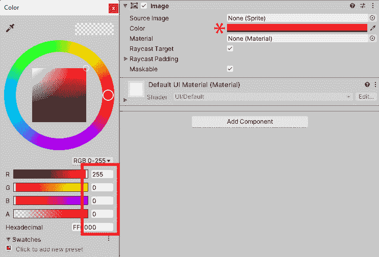

我们的`mainCol`、`trim00`和`trim01`**图像**组件的透明度颜色属性（注意，透明度是**R**、**G**、**B**和**A**中的**A**）。**透明度**设置将改变图像的透明度：

图 8.51 – 动画窗口中的图像组件关键帧

从基本术语来说，三个游戏对象在**场景**窗口的动画开始时是不可见的。接下来，我们需要让图像从透明阶段出来并变红。为此，我们现在需要将时间轴指示器移动到**0:55**并执行以下步骤：

1.  在仍然选择三个游戏对象的情况下，将`255`、`0`、`0`和`120`更改为如下截图所示：

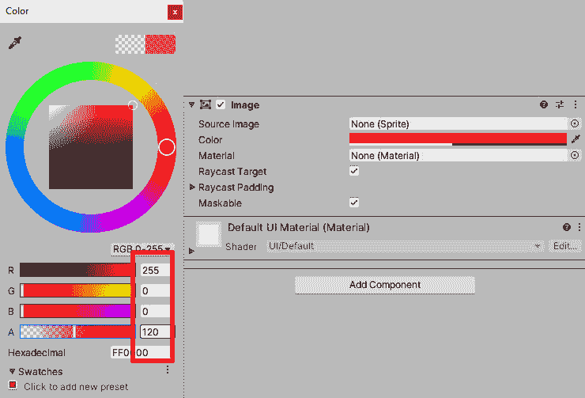

我们三个游戏对象现在在**场景**视图中再次可见。动画的最后一部分是让三个游戏对象再次变为不可见。我们不需要回到**颜色**值设置中，我们可以简单地复制并粘贴我们在时间轴上**0:00**处创建的键。要复制我们的关键帧，请执行以下操作：

1.  在**动画**窗口中，仍然选择三个游戏对象和记录按钮，将时间轴指示器移回**0:00**。

1.  在**动画**窗口中，选择所有三个`Image.Color.a`更改，如图示：

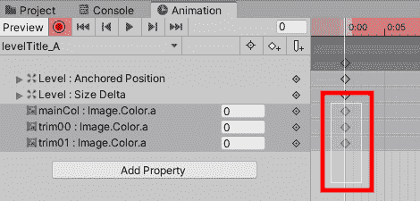

1.  按*Ctrl*（在 Mac 上为*Command*）和*C*复制关键帧。

1.  在**动画**窗口中点击记录按钮以停止录制动画。

1.  滚动到**1:50**并按键盘上的*Ctrl*（在 Mac 上为*Command*）和*V*粘贴。

1.  将鼠标光标移至**动画**窗口。点击并按键盘上的*F*键以获得时间轴的全视图。移动光标来回查看级别文本如何动画进入场景以及中心条变红。

当我们的第 1 级场景开始时，我们会看到动画前的标题和红色条，这是我们不想看到的。因此，我们需要将第 1 级文本和红色条设置为与我们的动画第一帧相同的值：

1.  选择`mainCol`游戏对象并设置`0`。

1.  设置`trim00`为`0`。

1.  设置`trim01`为`0`。

1.  设置`-2000`和`2000`。

以下截图显示了之前步骤的默认位置和 alpha 设置：

![图 8.54 – 我们关卡标题 UI 的默认位置和颜色]

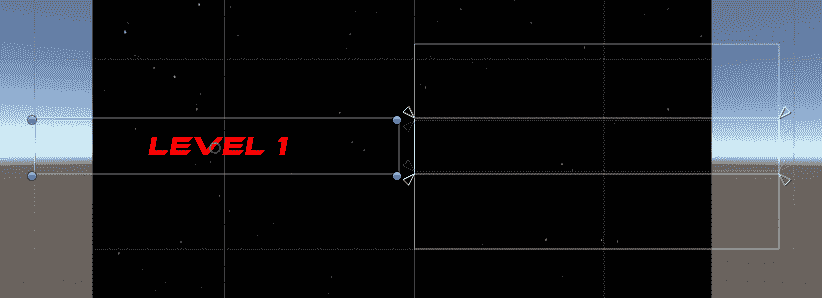

图 8.54 – 我们关卡标题 UI 的默认位置和颜色

1.  保存场景。

在我们继续到最后一个部分之前，让我们简要回顾一下我们已经覆盖的内容。我们取出了`mainCol`、`trim00`和`trim01`游戏对象，并使用动画时间线在一系列关键帧上更改了它们的**图像**组件的**颜色**alpha 值。

现在，让我们进入下一节，我们将复制我们的艺术作品、文本，在某些情况下，还将复制动画到其他场景中。从那里，我们将调整组件以适应每个场景。

### 将艺术作品、文本和动画复制粘贴到其他场景中

最后，我们可以复制`level1`场景（包括其动画）的所有辛勤工作，并将其粘贴到`level2`和`level3`场景中，并修改每个关卡编号。为此，请按照以下步骤操作：

1.  在**层次结构**窗口中，选择**Canvas**，然后按键盘上的*Ctrl* (*Mac 上的*Command*) 和 *C*。

1.  在`Assets/Scene`中的`level2`。

1.  在`level1`场景的`Canvas`游戏对象的一个开放空间中点击，并选择所有内容。

1.  在`Canvas`和`LevelTitle`中选择`Level`游戏对象。

1.  将`Level 1`改为`Level 2`。

1.  保存场景。

1.  对`level3`场景重复此过程。

![图 8.55 – 复制并编辑关卡标题编号]

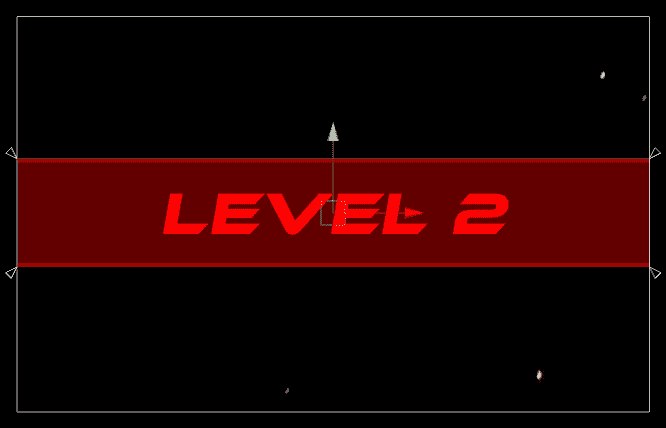

图 8.55 – 复制并编辑关卡标题编号

干得好！另一个大章节已经被征服。我们已经开始用我们自己制作的精美艺术作品让我们的游戏发光。让我们回顾一下我们已经取得的成就。

我们将一些普通的灰色场景变得更有吸引力，并与我们的科幻游戏更匹配。这一切都归功于 Unity 编辑器，因为我们能够不使用脚本就实现这一点。我们涵盖的主要组件如下：

+   **文本**: 我们导入了一个自定义字体，并在组件内部调整了它。

+   **图像**: 对于任何精灵，我们设置颜色以创建一系列带有透明度的红色条纹。

+   **动画控制器**: 当**图像**和**文本**组件需要动画时的保持状态。

+   **动画**: 每个组件混合的关键帧都在单个时间线动画中设置。

最后，我们不需要通过再次添加 UI 的文本、图像和动画来重复本章开头创建的 UI 过程。我们主要从场景（杀手波浪标题屏幕）中提取了这些游戏对象和组件，并将游戏对象粘贴到现有场景（关卡标题和游戏结束）中，作为游戏主题的模板。一旦这些组件就位，我们只需修改文本字段（将文本从杀手波浪改为关卡 1 等）。

这使得使用 Unity 变得快速且用户友好。我们不需要每次从头开始为新 UI 场景工作。随着我们的 UI 视觉上得到改善，你可能会希望开始觉得我们的项目正变得更加精致。

# 摘要

本章是关于对我们的游戏项目进行润色，使其现有内容与现有 UI 保持一致。这也要求你在 Unity 程序员考试中理解我们有哪些工具和组件可以帮助我们根据“在艺术管道中工作”的核心考试技能来创建游戏。

我们还取用了 **文本** 和 **图像** 组件，并从多个游戏对象中创建了一个动画。这些动画是通过 **动画控制器** 状态机调用的。

在你的未来项目中，你将有机会在构建游戏循环的同时保持你的 UI 令人印象深刻。

在下一章中，我们将通过使我们的 `商店` 场景具有多种屏幕比例来扩展我们当前的 UI 技能。此外，我们还将创建一个位于游戏关卡底部的 UI。
