# *第九章*：创建 2D 商店界面和游戏内 HUD

在本章中，我们将关注我们的商店界面以及我们如何从视觉和功能上改进它。当前的商店运行良好，但我们可以使它支持多种屏幕比例。我们还可以引入 Unity 的 Event 系统和 Button 组件，以及一些其他新功能。

本章我们将访问的另一个区域是游戏内的**抬头显示**（**HUD**）。这在游戏中很常见，我们在屏幕的特定位置显示游戏信息。我们将显示玩家的生命值和得分以及迷你地图来显示敌人的位置。这可以在以下截图中看到：

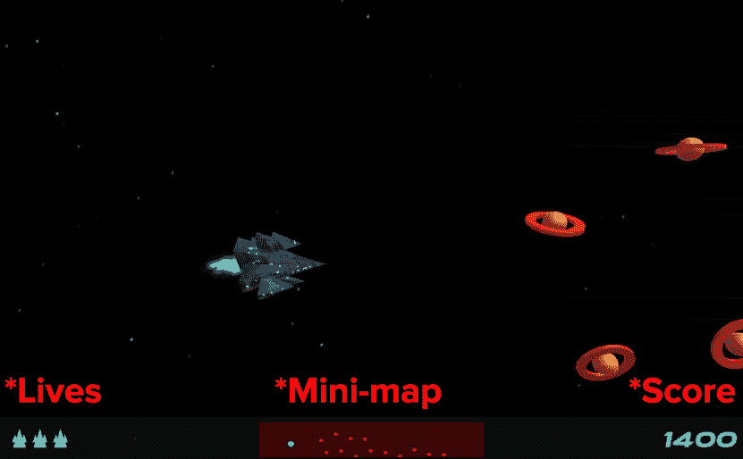

图 9.1 – 我们游戏内的 HUD

本章的另一部分将关于改进我们的商店场景的 2D 视觉，以便在我们可以购买升级方面有选择，并且我们还可以动态地扩展商店的大小。此外，您的商店场景将支持任何横幅比例，与之前不同。以下截图显示了我们的商店在不同比例大小下的样子：

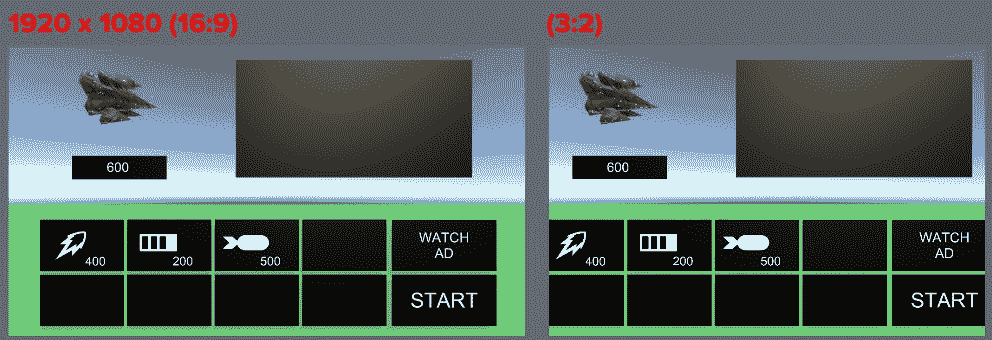

图 9.2 – 左侧显示所有按钮；右侧裁剪了按钮边缘

在前面的截图中，请注意，**3:2** 的屏幕比例相对于我们的 **1920 x 1080 (16:9)** 屏幕比例会裁剪掉一些屏幕（您将特别注意到每个屏幕的选择网格间距）。到本章结束时，我们的商店场景将看起来像以下截图所示，无论我们的游戏处于何种横幅比例：

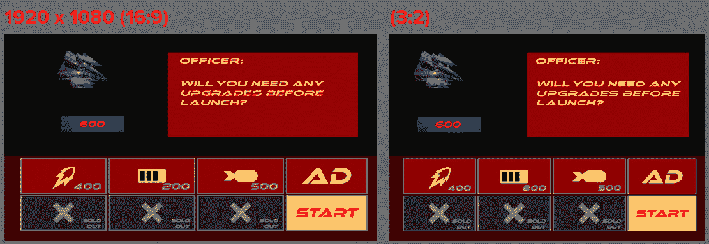

图 9.3 – 我们游戏内的商店具有灵活的 UI 显示（无裁剪）

在本章中，我们将涵盖以下主题：

+   设置我们的 HUD

+   使我们的 `shop` 场景支持替代屏幕比例

+   应用和修改我们的 `shop` 脚本

让我们从回顾本章将涵盖的核心考试技能开始。

# 本章涵盖的核心考试技能

以下是在本章中将涵盖的核心考试技能：

+   *在艺术管道中工作*：

    +   理解材质、纹理和着色器，并编写与 Unity 渲染 API 交互的脚本。

+   *开发应用程序系统*：

    +   解释应用程序界面流程的脚本，例如菜单系统、UI 导航和应用设置。

    +   解释用户控制的定制脚本，如角色创建器、库存、店面和在应用内购买。

    +   分析使用 Unity Analytics 和 PlayerPrefs 等技术实现的用户进度功能，如评分、等级和游戏内经济。

    +   分析 2D 悬浮层脚本，如 HUD、小地图和广告。

    +   识别用于保存和检索应用程序和用户数据的脚本。

+   *为场景和环境设计编程*：

    +   确定实现游戏对象实例化、销毁和管理的方案。

+   *针对性能和平台进行优化*：

    +   识别针对特定构建平台和/或硬件配置的要求的优化。

    +   确定适用于 XR 平台的常见 UI 功能和优化。

+   *在专业软件开发团队中工作*：

    +   识别用于构建模块化、可读性和可重用性的脚本结构技术。

# 技术要求

本章的项目内容可在[`github.com/PacktPublishing/Unity-Certified-Programmer-Exam-Guide-Second-Edition/tree/main/Chapter_09`](https://github.com/PacktPublishing/Unity-Certified-Programmer-Exam-Guide-Second-Edition/tree/main/Chapter_09)找到

您可以下载每个章节的项目文件的全部内容，在[`github.com/PacktPublishing/Unity-Certified-Programmer-Exam-Guide-Second-Edition`](https://github.com/PacktPublishing/Unity-Certified-Programmer-Exam-Guide-Second-Edition)。

本章的所有内容都包含在本章的`unitypackage`文件中，包括一个包含本章我们将执行的所有工作的`Complete`文件夹。

查看以下视频以查看*代码执行情况*：[`bit.ly/3LsxDWC`](https://bit.ly/3LsxDWC)。

# 设置我们的 HUD

在侧滚动射击游戏中，我们通常会有一些形式的记录，比如玩家有多少生命值，他们的分数是多少，时间限制，升级等。我们将应用一个典型的 HUD 来显示一组类似的信息。了解 HUD 是 Unity 程序员考试的要求之一。

到本节结束时，我们将为我们的游戏创建一个包含以下内容的 HUD：

+   生命值

+   小地图

+   分数

在我们添加我们的 HUD 之前，我们需要决定它将位于我们的游戏屏幕的哪个位置。作为一个例子，我们将选择一个游戏，这样我们可以简要研究其 HUD 信息是如何显示的。

我们将研究一个名为**Super R-Type**的游戏，可以在[`github.com/PacktPublishing/Unity-Certified-Programmer-Exam-Guide-Second-Edition/blob/main/Chapter_09/superRtype.jpg`](https://github.com/PacktPublishing/Unity-Certified-Programmer-Exam-Guide-Second-Edition/blob/main/Chapter_09/superRtype.jpg)找到。在这里，屏幕底部我们可以看到其 HUD 由以下四个部分组成：

+   技能水平

+   生命值

+   力量条

+   分数

在这些细节的后面是一个黑色背景，这样在读取 HUD 时场景就不会干扰。

因此，在本节中，我们将首先声明 HUD 空间并为其设置深色背景。为此，请按照以下说明操作：

1.  在 Unity 编辑器中，导航到**项目**窗口中的`Assets/Scene`。

1.  打开`level1`场景。

1.  加载`level1`后，转到`Canvas`游戏对象，并选择**UI** | **Image**。

1.  在`Canvas`游戏对象中会出现一个名为`Image`的游戏对象。

从上一章，我们应该知道包含`Canvas`的游戏对象。

1.  右键点击`Image`游戏对象并选择`background`。

到目前为止，我们已经创建了一个包含**图像**组件的游戏对象。

现在，让我们继续并缩放这个游戏对象到正确的位置，使其可以作为 HUD 的背景使用。按照以下步骤操作：

1.  在我们的`background`游戏对象仍然被选中时，在**检查器**窗口中更改**矩形变换**设置如下：

t

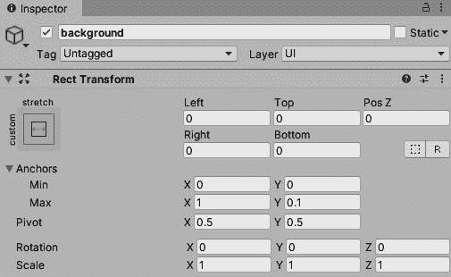

图 9.4 – 背景矩形变换属性设置

我们的`background`游戏对象应该缩放到与屏幕底部白色条相同的比例并居中，如下面的截图所示：

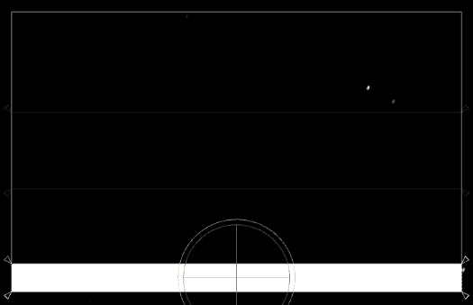

图 9.5 – 显示我们背景游戏对象位置的游戏窗口

现在，让我们将这个`background`游戏对象变暗，使其与我们的游戏融合。

1.  在我们的`background`游戏对象仍然被选中时，在`12`，`13`，`13`，`210`，如下面的截图所示：

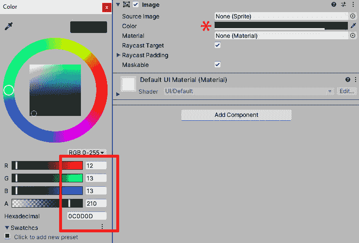

图 9.6 – 背景颜色和 alpha 值

`background`游戏对象的颜色已从默认的白色变为深色，略带透明。

HUD 的区域已经设置。以下小节将逐一介绍我们的 HUD 的每个部分，并解释如何创建以下内容：

+   `GameManager`脚本。每个生命值将被整齐地分组。

+   **显示分数**：脚本已经跟踪了玩家的分数，所以我们只需要使用一个**文本**组件来保持信息更新。

+   **迷你地图**：迷你地图将视觉上类似于雷达，玩家将能够看到接近他们的敌人对手的波浪。这个迷你地图将使用一个更宽角度的第二个摄像头，并且只显示彩色点而不是实际的船只本身。

现在，我们可以开始用我们在脚本中已经制作的数据填充 HUD，从玩家的生命值开始。

## 显示玩家的生命值

玩家开始游戏时有三个生命值。向玩家显示生命值有两种典型方式：显示数字计数或显示每个生命值的小图标。让我们选择后者，因为我们可以使用一些我们之前没有使用过的 Unity 组件。

本节还将包括一些额外的代码，这些代码将被放入我们的`GameManager`脚本中。此代码将运行检查以查看玩家有多少生命值。对于找到的每个生命值，将创建一个包含图像的游戏对象。

### 向我们的游戏对象添加水平布局组组件

将创建的所有游戏对象生命值将存储在一个名为`lives`的游戏对象中。让我们继续工作在 HUD 上并添加`lives`游戏对象：

1.  

在本节中，我们将创建一个游戏对象，该对象将包含一个**图像**组件，它将成为玩家飞船的象征。我们还将专门调整其大小，使其与其他生命值保持一致。

](img/Figure_9.08_B18381.jpg)

图 9.7 – lives Rect Transform 属性设置

创建表示生命值的图像

1.  在选择`lives`游戏对象的情况下，点击**检查器**窗口中的**添加组件**按钮。

1.  在`Canvas`游戏对象中，选择**UI**然后从下拉列表中选择**图像**。

*图 9.8*显示了`lives`游戏对象。我们需要调整每个`life`图像的一些值，以便它们不要太大了。

1.  将**水平布局组**属性值更改为以下截图所示（您可能需要单击**填充**旁边的箭头以展开其内容）：

创建表示生命值的图像

选择游戏对象，右键单击它，然后从下拉列表中选择**重命名**。

图 9.8 – Horizontal Layout Group 属性值

到目前为止，我们已经创建了一个名为`lives`的游戏对象，用于存储和自动排序每个玩家的飞船图像。

在下一节中，我们将创建一个游戏对象，用于存放每个玩家的飞船图像。作为下一两节将要介绍内容的示例，以下截图展示了我们的`lives`游戏对象如何存放每个`life`游戏对象：

![图 9.09 – 三条生命值均匀分布且比例正确![图 9.09 – lives Rect Transform 属性设置![图 9.07 – 三条生命值均匀分布且比例正确现在，让我们继续制作一个名为`life`的游戏对象，用于存储飞船图标。### **水平布局组**组件将把每个飞船图像按堆叠顺序排列。要添加此组件，请按照以下步骤操作：找到**水平布局组**，直到它在列表中。找到后，选择它。让我们先创建一个包含**图像**组件的游戏对象：1.  我们需要对`lives`游戏对象做的最后一件事是给它添加一个**水平布局组**组件。此组件将确保当我们创建代表玩家生命的图像时，我们将显示飞船图像。1.  ![图 9.08 – Horizontal Layout Group 属性值 1.  将新创建的游戏对象重命名为`life`。1.  在**图像**组件中添加图像和颜色，如图下截图所示：![图 9.10 – 点击远程按钮以访问用于图像组件的源图像![图 9.08 – Horizontal Layout Group 属性值图 9.10 – 点击远程按钮以访问用于图像组件的源图像 1.  要将源图像添加到`life`游戏对象中，请点击**远程**按钮，该按钮位于**源图像**旁边（如前一张截图中的箭头所示）。1.  在下拉列表中开始输入`life`，直到您看到它出现，然后点击它。我们飞船图标应该看起来像下面截图所示的那样。如果它不是这样，它可能有一个**默认**纹理类型，需要将其更改为**精灵**。我们已经在*第五章*，*为我们的游戏创建商店场景*中介绍了如何更改这一点：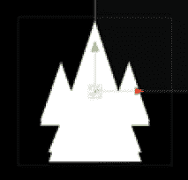


Figure 9.11 – Our ship sprite life

我将稍微改变图标的颜色，因为它可能对玩家来说有点分散注意力。

1.  在选择`life`游戏对象的情况下，点击`153`、`177`、`177`、`255`。

1.  确保在**图像**组件中勾选**保留纵横比**框，以便我们的生命值不会失去其比例。

这就是我们的`life`游戏对象创建完成。我们需要对它做的最后一件事是将它转换成一个预制体。作为提醒，预制体的好处是我们可以创建一个包含其组件、首选项和设置的完整游戏对象。预制体将允许我们创建所需数量的克隆。

要将此`life`游戏对象转换为预制体，请执行以下操作：

1.  在`Assets/Resources`文件夹中。

1.  从`Prefab`文件夹中拖动`life`游戏对象到场景中。这就是我们创建的预制体。

我们现在可以在**层次结构**窗口中删除`life`游戏对象，因为我们将在下一节中用代码创建这个游戏对象。

### 编写我们的 UI 生命计数器代码

在本节中，我们将重新访问`GameManager`脚本，获取玩家的生命计数信息，并以我们的 UI 系统形式显示。

以下截图显示了`level1`场景的`Canvas`游戏对象的一部分。在`Canvas`中，顶部是 HUD 的`background`游戏对象，然后是`lives`游戏对象。最后，通过我们的代码（我们将在下面编写），我们在`lives`游戏对象内部创建了三个`life`游戏对象：

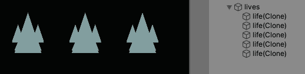


Figure 9.12 – Our Hierarchy containing a lives game object and its life children

要实例化`life`游戏对象，使它们显示与玩家生命值相同数量的对象，请执行以下操作：

1.  在`Assets/Script`文件夹中。

1.  双击文件以打开`GameManager`。

`GameManager`脚本已经有一个`Awake()`函数，这是脚本一旦激活就会尝试激活的第一个函数。我们目前没有的是在`Awake()`之后被调用的`Start()`函数。

我们可以在`GameManager`中创建一个`Start()`函数，并让它调用我们即将创建的方法，即`SetLivesDisplay`，并将我们的`playerLives`变量发送给它，这是玩家生命值的计数。

就像任何函数一样，我们可以在类内的任何位置放置它，只要它不在另一个方法/函数内部。我通常将 `Awake()` 和 `Start()` 方法放在 `GameManager` 类的顶部附近。要在 `Start()` 方法中调用自定义方法，请执行以下操作。

1.  在 `GameManager` 脚本中输入以下代码：

    ```cs
       void Start()
       {
         SetLivesDisplay(playerLives);
       }
    ```

现在，我们将填充 `SetLivesDisplay` 方法的具体内容。

我已经将 `SetLivesDisplay` 方法放置在 `GameManager` 脚本的底部附近，但就像 `Start` 和 `Awake` 方法一样，您可以在 `GameManager` 脚本中的任何位置放置它们。

1.  输入以下代码：

    ```cs
    public void SetLivesDisplay(int players)
        {
    ```

此方法设置为 `public`，因为我们的 `ScenesManager` 脚本将需要访问它来加载玩家所在的任何关卡。我们将 `SetLivesDisplay` 方法设置为 `void`，因为我们在这个方法中不返回任何内容。如我之前所述，我们接受 `playerLives` 整数，但在方法中我们将将其称为 `players`。

让我们继续，在 `SetLivesDisplay` 方法内部添加一些代码。这里我们将检查、添加，并在玩家死亡时视觉上移除生命值。

1.  在 `SetLivesDisplay` 方法内部输入以下代码：

    ```cs
    if (GameObject.Find("lives"))
        {
          GameObject lives = GameObject.Find("lives");
          if (lives.transform.childCount < 1)
          {
            for (int i = 0; i < 5; i++)
            {
              GameObject life = GameObject.Instantiate(Resources
                .Load ("life")) as GameObject;
              life.transform.SetParent(lives.transform);
            } 
          }
    ```

在前面的代码中，我们运行了一个检查以找到名为 `lives` 的游戏对象。如果我们找到游戏对象，我们将将其引用存储在名为 `lives` 的游戏对象中。然后我们运行了一个检查以查看我们的 `lives` 游戏对象是否持有任何游戏对象。如果 `lives` 没有持有任何游戏对象，我们假设这是关卡开始，并且我们需要创建一些生命值。在 `if` 语句内部，我们运行了一个限制为 `5` 次数的 `for` 循环。在这个 `for` 循环内部，我们实例化我们的 `life` 预制件，并让它位于 `lives` 游戏对象内部。

1.  继续在 `SetLivesDisplay` 方法内部编写，这是管理每个 `life` 预制件计数的部分，并显示玩家实际拥有的生命值数量：

    ```cs
          //set visual lives
          for (int i = 0; i < lives.transform.childCount; i++)
          {
            lives.transform.GetChild(i).localScale = new Vector3(1,1,1);
          }
          //remove visual lives
          for (int i = 0; i < (lives.transform.childCount - players); i++)
          {
            lives.transform.GetChild(lives.transform.childCount - i
                -1).localScale = Vector3.zero;
          }
        }
      }
    ```

我们刚刚编写的代码有两个主要部分。第一个 `for` 循环是根据 `lives` 游戏对象下的游戏对象数量设置的。每个在 `lives` 下的游戏对象都会缩放到 `1`。

第二个 `for` 循环从 `lives` 下的游戏对象计数中减去，与传入此方法参数的玩家的 `int` 变量相减。在这个第二个 `for` 循环中——根据玩家 `int` 变量的大小——每个 `life` 预制件都会缩小到 0。将 `life` 预制件缩放到 0 不会影响生命值计数，使其不会根据显示的生命值数量波动。

1.  保存脚本。

`GameManager` 现在能够在 `level1` 场景的底部创建生命计。我们现在需要添加一些功能，以便 `ScenesManager` 在加载关卡时加载生命值数量。

要在关卡开始或玩家死亡时加载玩家的生命值，请执行以下操作：

1.  在 `ScenesManager` 脚本中，`Assets/Script`。

1.  双击 `ScenesManager` 脚本以开始编码。

1.  在`ScenesManager`脚本中，我们将添加一个`Start()`函数，该函数将包含一个已知的 Unity 委托`sceneLoaded`，它由 Unity 的`SceneManager`调用。此委托将订阅我们的游戏场景变化时的情况。有关`sceneLoaded`委托的更多信息，请访问[`docs.unity3d.com/ScriptReference/SceneManagement.SceneManager-sceneLoaded.html`](https://docs.unity3d.com/ScriptReference/SceneManagement.SceneManager-sceneLoaded.html)。

1.  在`ScenesManager`脚本中，输入`Start`函数，以及我们要挂钩到委托的函数名称：

    ```cs
      void Start()
       {
           SceneManager.sceneLoaded += OnSceneLoaded;
       }
    ```

仍然在`ScenesManager`脚本中，我们将添加 Unity 识别的函数，即使我们不会对`Scene`和`LoadSceneMode`类型做任何事情，它也会自动获取这些类型。

在函数内部，我们调用`GameManager`脚本的`SetLivesDisplay`，以及玩家拥有的生命值数量。

1.  在`ScenesManager`中输入我们刚才讨论的以下代码：

    ```cs
    private void OnSceneLoaded(Scene aScene, LoadSceneMode aMode)
    {
        GetComponent<GameManager>().SetLivesDisplay(GameManager.playerLives); 
    }
    ```

1.  保存脚本。

让我们检查我们做了什么：

1.  在仍然处于我们正在工作的场景（`level1`）的同时，返回 Unity 编辑器。

1.  按**Play** – 应该显示三个生命值。如果玩家死亡，生命值计数将降至两个。

以下截图显示了正在进行的游戏，以及玩家生命值位于左下角：

![Figure 9.13 – Screenshot of our game currently with its lives counter]

![img/Figure_9.13_B18381.jpg]

Figure 9.13 – Screenshot of our game currently with its lives counter

在本节中，我们已经将玩家的生命值连接起来，以便它们可以在 HUD 的左下角显示。我们已应用了如**Horizontal Layout Group**和**Layout Element**等组件，以设置玩家生命图像的均匀顺序和大小。我们还确保代码在场景加载时应用并更新玩家的生命值。

接下来，我们将关注 HUD 的另一侧并显示玩家的分数。

## 显示玩家的分数

在本节中，我们将把玩家的分数应用到 HUD 的右侧，我们目前正在用有关玩家的信息填充 HUD。

我们将继续在`Canvas`游戏对象中工作，并添加另一个名为`score`的游戏对象。在这里，我们将添加`ScenesManager`代码以加载分数显示。让我们开始吧：

1.  在仍然处于`level1`场景的情况下，在**Hierarchy**窗口中右击`Canvas`游戏对象。

1.  从下拉列表中选择**UI** | **Text**。

1.  右击新的`Text`游戏对象，从下拉列表中选择**Rename**。

1.  重命名游戏对象`score`。

将`score`游戏对象重命名并放置在`Canvas`游戏对象内部后，接下来我们需要做的是调整`score`游戏对象的大小并将其移动到合适的位置。

1.  在仍然选择`score`游戏对象的情况下，在**Inspector**窗口中修改其**Rect Transform**属性，使其看起来像以下截图所示：

![Figure 9.14 – score Rect Transform property settings]

](img/Figure_9.14_B18381.jpg)

图 9.14 – 分数矩形变换属性设置

当`score`游戏对象处于正确的位置和缩放时，我们现在可以自定义其**文本**组件设置。

当`score`游戏对象仍然被选中时，在**检查器**窗口中对其**文本**组件进行以下更改：

1.  更改`00000000`。**文本**字段中的零的数量将帮助我们指定板的大小。

1.  如以下截图所示，我们选择了与游戏关卡场景标题相同的自定义文本。点击**字体**字段右侧的**远程**按钮，从下拉列表中选择**ethnocentric rg it**。

1.  将**对齐**按钮设置为**右对齐**和**居中**。这将定位文本并最小化其右侧的空间。

1.  `score`文本字体大小将自动设置。

1.  将`0`和`60`更改。这将设置**最佳拟合**文本的界限。

最后要更改的属性是文本的**颜色**属性。我们将将其设置为与玩家的生命值相同的颜色。

1.  点击`153`、`177`、`178`、`255`。

以下截图显示了我们的**文本**组件属性已被设置为何：

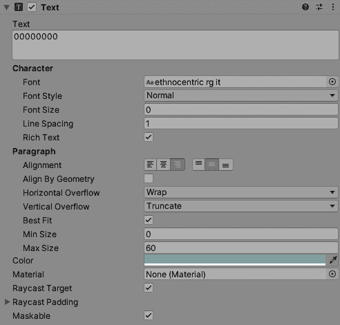

图 9.15 – 分数文本组件属性设置

如果我们检查**游戏**窗口，我们应该看到右上角的分数大小合适，如下面的截图所示：


图 9.16 – 我们的游戏内 HUD 现在显示分数

我们`score`游戏对象的最终阶段是更新我们的`ScenesManager`脚本，通过添加一个`if`语句来检查`score`游戏对象是否在场景中。

要更新`ScenesManager`脚本以支持我们新的分数游戏对象，请执行以下操作：

1.  在`Assets`文件夹中。

1.  双击`ScenesManager`脚本并向下滚动到我们输入了`OnSceneLoaded`函数的位置。

1.  在`OnSceneLoaded`函数内部，输入以下代码：

    ```cs
     if (GameObject.Find("score"))
     {
     GameObject.Find("score").GetComponent<Text>().text =
        GetComponent<ScoreManager>().PlayersScore.ToString();
     } 
    ```

如新添加的代码简要提到的，我们正在检查`score`游戏对象是否在场景中。如果`score`存在于场景中，那么我们获取其`Text`组件，并从`ScoreManager`脚本中将玩家的分数整数应用到它上。同时确保你在脚本顶部有`using UnityEngine.UI`以访问`Text`组件。

1.  保存脚本。

说到`ScoreManager`脚本，我们需要重新加载此脚本，以便其`ResetMethod`可以在每场比赛的开始/结束时重置`score` UI。按照以下步骤操作：

1.  在`Assets/Script`中找到`ScoreManager`脚本并打开文件。

在脚本内部，我们需要引入`UnityEngine.UI`库，以便我们可以更改游戏的可视分数。

1.  在`ScoreManager`脚本的最顶部输入以下代码：

    ```cs
    using UnityEngine.UI;
    ```

1.  在`ResetScore`方法中，添加一个`if`语句，检查`score` UI 游戏对象是否在场景中并更新。以下代码显示了`ScoreManager`脚本中的完整`ResetScore`方法：

    ```cs
    public void ResetScore()
     {
         playerScore = 00000000;
         UpdateScore();
     }
    ```

1.  我们还需要将`UpdateScore`方法应用到我们的`SetScore`函数上。按照以下代码进行应用：

    ```cs
    public void SetScore(int incomingScore)
    {
             playerScore += incomingScore; 

             UpdateScore();
    }
    ```

1.  我们现在需要将`ScoreManager`脚本中的`UpdateScore`方法移动到`UpdateScore`方法内。为此，添加以下新方法以在得分设置或重置时更新我们的得分：

    ```cs
    void UpdateScore()
    {
    if (GameObject.Find("score"))
            {     GameObject.Find("score").GetComponent<Text>().text = playerScore.ToString();
            }
    }
    ```

1.  保存脚本。

1.  返回 Unity 编辑器并点击`level1`。

当我们摧毁敌人时，我们的`score`游戏对象将更新，如下面的截图所示：

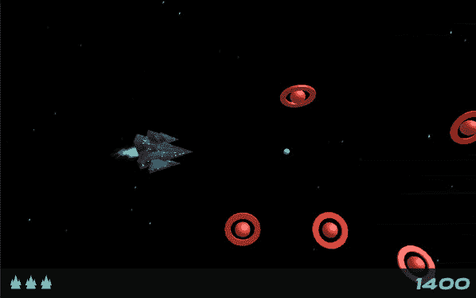

图 9.17 – 游戏得分总计的屏幕截图

在本节中，我们将原本显示玩家得分的现有`ScoreManager`代码改造成一个`score`变量，用于`level1`场景中的新 HUD 得分，当敌人被摧毁时，得分将更新。

我们需要为 HUD 创建的最后一件东西是迷你地图，这将给我们一个在我们关卡中敌人的视觉。

## 创建迷你地图

在本节中，我们将在 HUD 显示中嵌入一个迷你地图，以显示更大范围的关卡。这将以雷达风格显示玩家以及附近的敌人。以下截图显示了 HUD 中间的雷达，代表玩家及其周围的敌人以及其他即将进入玩家屏幕的敌人：

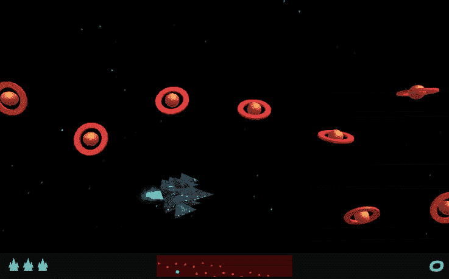

图 9.18 – 显示迷你地图的游戏截图

我们将迷你地图分为三个部分：

+   **雷达相机**：场景中的第二个相机。

+   **层**：这使得第二个相机只能识别特定的一组游戏对象。

+   **渲染纹理**：在 HUD 上以动画图像的形式显示最终结果。

让我们先创建一个额外的层，以便我们可以将某些游戏对象暴露给我们的雷达相机。

### 创建并添加层到我们的玩家和敌人游戏对象

在本节中，我们将向玩家和敌人游戏对象添加一个额外的游戏对象，以便我们的第二个相机只能看到附加的精灵。这些将看起来像雷达上的亮点。

要将雷达亮点添加到游戏对象中，请执行以下操作：

1.  在 Unity 编辑器的右上角，点击**层**按钮，然后点击**编辑层...**，如下面的截图所示：

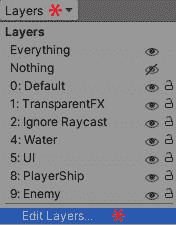

图 9.19 – 编辑层…将允许我们为游戏添加另一个层

1.  **检查器**窗口将改变并显示**标签和层**属性。从这里，我们可以点击展开**层**选项卡。

1.  点击顶部附近的一个可用图层，输入`Radar`，如下截图所示：![Figure 9.20 – 扩展我们的图层列表并添加一个新图层

    ![Figure 9.20_B18381.jpg]

Figure 9.20 – 扩展我们的图层列表并添加一个新图层

现在，我们可以向玩家和敌人添加雷达点。让我们先从将玩家带入场景并更新其预制开始，使其能被雷达摄像机识别。为此，请按照以下说明操作：

1.  在`Assets/Prefab/Player`文件夹中。

1.  将`player_ship`拖放到**层次结构**窗口底部的空白区域。

1.  在`player_ship`中，选择**创建空对象**。

1.  右键点击游戏对象，从下拉菜单中选择**重命名**。

1.  将游戏对象重命名为`radarPoint`。

1.  在选择`radarPoint`的情况下，点击`Sprite Renderer`直到它在组件下拉菜单中显示。接下来，点击其位于**检查器**窗口顶部的图层，并从下拉列表中选择**雷达**，如下截图所示。我们还可以将我们的**变换**属性设置为与以下图像中的相同：

![Figure 9.21 – radarPoint 游戏对象及其雷达图层

![Figure 9.21_B18381.jpg]

Figure 9.21 – radarPoint 游戏对象及其雷达图层

设置了**变换**属性后，我们现在可以将雷达点精灵拖入**精灵**字段并更改其颜色：

1.  点击**Sprite Renderer**组件中**精灵**字段右侧的**远程**按钮。

1.  在下拉列表中开始输入`knob`，直到你可以看到它并选择它，如下截图所示：

![Figure 9.22 – 访问和选择默认旋钮精灵

![Figure 9.22_B18381.jpg]

Figure 9.22 – 访问和选择默认旋钮精灵

1.  我们现在可以通过点击`0`，`245`，`255`，`255`来更改精灵的颜色。

1.  在`player_ship`游戏对象的预制设置中选择`player_ship`。

1.  在**层次结构**窗口中选择`player_ship`游戏对象，并在键盘上按**Delete**键。

我们现在已设置玩家飞船，使其准备好被雷达摄像机检测。

下一步是重复相同的步骤为敌人操作，敌人位于`Assets/Prefab/Enemies`。

1.  不经过相同的说明，以下截图显示了我们的敌人`radarPoint`游戏对象具有明亮的红色颜色值（`255`，`0`，`0`，`0`）。如果你遇到困难，只需遵循与玩家飞船的`radarPoint`相同的步骤：

![Figure 9.23 – radarPoint 属性设置

![Figure 9.23_B18381.jpg]

Figure 9.23 – radarPoint 属性设置

提示

在**检查器**窗口中，在你完成对预制更改后，点击**覆盖 | 应用全部**。

一旦我们完成更改并将它们应用到预制中，我们就不再需要`enemy_wave`游戏对象，因为我们已经将其详细信息保存在预制中。

1.  从**层次结构**窗口中删除`enemy_wave`。

我们已经有效地创建了一个追踪器（`radarPoint`），并将其附加到我们的关卡中的玩家和敌人上。

下一步是添加一个**渲染****纹理**，它将与场景中的第二个摄像头一起工作。第二个摄像头的信号将被输入到一个**渲染纹理**中。然后，这个**渲染纹理**将被放置在屏幕的底部中间，并显示玩家和敌人的位置。

### 添加和自定义我们的渲染纹理

**渲染纹理**通常用于在**播放模式**（运行时）中保持移动图像。我们将使用这个**渲染纹理**来存储第二个摄像头的信号。这将像我们 HUD 中央的小电视屏幕一样工作。

要创建和自定义**渲染纹理**，我们将执行以下操作：

1.  在`Texture`文件夹中，即`Assets/Texture`。

1.  在一个空白区域右键点击，从下拉列表中选择**创建**，然后选择**渲染纹理**，如图所示：

![Figure 9.24 – Creating a Render Texture

![img/Figure_9.24_B18381.jpg]

图 9.24 – 创建渲染纹理

提示

如果你没有空白区域可以右键点击，如*步骤 2*建议的，你可以通过调整图标大小来获得空间。

使用**项目**窗口右下角的滑块调整你的图标大小。

1.  慢慢点击文件名两次，将其重命名为`雷达`。

1.  在选择`雷达`**渲染纹理**后，我们需要将其大小调整为适合 HUD 的大小，并理想情况下使其更清晰。

1.  在`256`，`256`到`236`，`46`。

1.  将**滤波模式**从**双线性**更改为**点**。

设置**渲染纹理**的最后一步是将它放置到 HUD 中。按照以下步骤操作：

1.  仍然在`level1`场景中，在**层次结构**窗口中右键点击`Canvas`游戏对象，并选择**创建空对象**。

1.  在**层次结构**窗口中选择新的空游戏对象，右键点击它，并从下拉列表中选择**重命名**。

1.  将游戏对象重命名为`雷达`。

`雷达`游戏对象将作为任何与游戏对象相关内容的容器。

1.  此游戏对象现在需要在 HUD 中定位和调整大小。为此，在**检查器**窗口中更改`雷达`游戏对象的**矩形变换**属性，如图所示：

![Figure 9.25 – radar Rect Transform property settings

![img/Figure_9.25_B18381.jpg]

图 9.25 – radar Rect Transform property settings

移动和调整`雷达`游戏对象的大小将为我们提供一个信封窗口，以便**渲染纹理**可以放置其中，如图所示：

![Figure 9.26 – Our radar game object's placement in the Game window

![img/Figure_9.26_B18381.jpg]

图 9.26 – 我们雷达游戏对象在游戏窗口中的位置

我们现在可以添加另一个游戏对象，它将成为我们刚才创建的`雷达`游戏对象的子对象。此游戏对象将存储**渲染纹理**：

1.  在**层次结构**窗口中右键点击`雷达`游戏对象。从下拉列表中选择**UI**，然后选择**原始图像**。

1.  右键点击名为 `radarImage` 的新游戏对象。

1.  在仍然选择 `radarImage` 游戏对象的情况下，将其 **矩形变换** 设置更改为以下截图所示的 **检查器** 窗口中的设置：

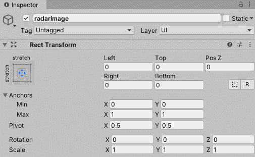

图 9.27 – radarImage 矩形变换属性设置

接下来，我们需要将 **雷达渲染纹理** 应用到 **Raw Image** 的 **纹理** 字段：

1.  在仍然选择 `radarImage` 游戏对象的情况下，在 **层次** 窗口中，点击 **Raw Image** 组件中 **纹理** 字段旁边的 **远程** 按钮。

1.  在新窗口顶部的搜索栏中开始输入 `radar`，直到出现 **radar** **渲染纹理** 并选择它。

这样，我们的 **渲染纹理** 就制作并设置了。现在，我们可以将其传递到第二个相机。但在我们这样做之前，我们需要添加相机！

### 添加和自定义第二个相机

在本节中，我们将添加第二个相机，这样我们就只能看到 `radarPoint` 游戏对象。

让我们从在 `level1` 场景中设置第二个相机开始：

1.  在 **层次** 窗口中，在空白区域右键点击，从下拉菜单中选择 **相机**。

1.  右键点击新创建的 `RadarCam`。

1.  在仍然选择 `RadarCam` 的情况下，在 **检查器** 窗口中将其 **变换** 设置更改为以下截图所示：

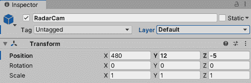

图 9.28 – radarCam 变换属性设置

仍然在 `RadarCam` 选择的情况下，我们需要将其 **相机** 组件设置更改为以下：

+   **清除标志**：**纯色**。对于第二个相机，我们不需要背景中的任何东西，因此像纯色这样的基本设置就足够了。

+   `255`，`0`，`0`，`50`。这将给我们的雷达一个红色调。

+   **剔除遮罩**：点击标有 **一切** 的参数字段。执行以下操作：

    +   从下拉列表中选择 **无** 以删除所有层。

    +   再次选择该字段，并选择 **雷达**（如图 9.27 所示的截图）。通过这样做，我们的相机将只能看到与该层相关的游戏对象：

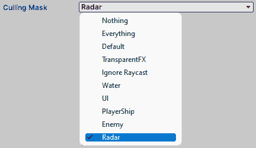

图 9.29 – 从剔除遮罩中选择雷达

+   **投影**：**正交投影**。雷达相机是 2D 的，因此不需要透视视图。

+   `150`。我们的相机视图大小将大于玩家所在的主视图。

+   将 `RadarCam` 添加到雷达的 **渲染纹理**。

1.  我们的 `RadarCam` 不需要看到 **雷达** 层。从 **层次** 窗口中选择 **主相机**，并从其 **剔除遮罩** 中取消选择 **雷达** 层。

1.  此外，在仍然选择 `RadarCam` 的情况下，点击其 **音频监听器** 组件旁边的三个点，并删除它。我们已经在场景中有一个监听音频的相机了。

1.  最后，我们需要确保 `RadarCam` 是 `RadarCam` 在 **层次** 窗口中的子项。

1.  在**检查器**窗口中点击**覆盖 | 应用全部**以更新**主摄像机**预设并保存场景。

现在，如果我们点击 Unity 编辑器中的**播放**，我们将看到 HUD 中的雷达，其红色色调显示红色点表示敌人，霓虹蓝色表示玩家，如下面的截图所示：

![Figure 9.30 – Our mini-map detecting the player and its enemies

![img/Figure_9.30_B18381.jpg]

图 9.30 – 我们的小地图检测玩家及其敌人

这个小地图没有使用任何代码创建，并使用了两个新组件：**渲染纹理**，它将保存第二摄像机的输入，以及一个**原始图像**组件，它将显示最终输出。

在本节中，我们创建了一个功能齐全的 HUD，它包含三个主要部分：玩家的生命值、小地图和玩家的得分。我们使用了 Unity 提供的两个基本 UI 工具来创建 UI 显示。然而，我们还引入了三个新组件，如下所示：

+   **水平分组布局**：平均分配玩家的生命值

+   **渲染纹理**：传输第二摄像机的输入

+   **原始图像**：显示渲染纹理的输入

以下截图显示了最终的 HUD：

![Figure 9.31 – Our HUD is complete

![img/Figure_9.31_B18381.jpg]

图 9.31 – 我们的 HUD 已完整

由于我们已更新了`level1`场景，我们需要更新`level2`和`level3`。最快的方法是删除`level2`和`level3`并复制`level1`，就像我们之前做的那样，这将使我们只需更新`Text`组件中的级别数字。我们在上一章的结尾做了这件事，所以如果你需要一些指导，请查看。

现在，我们将继续改进现有的`shop`场景，通过移除 UI 组件的预制多边形。这将使我们接触到使用 UI 事件触发器，并使我们的代码更小、更高效。

# 使我们的商店场景支持替代屏幕比率

在本节中，我们将对我们的当前`shop`场景进行修改，使其兼容各种屏幕比率。目前，我们的商店视觉效果由多边形组成，看起来不错，但例如，屏幕底部的按钮选择网格有被边缘裁剪的风险。我们还可以通过使用 Unity 的**按钮**组件来改变选择按钮的方式，该组件在**画布**中工作。

![Figure 9.32 – There is a wide range of ratios in what a game is displayed in

![img/Figure_9.32_B18381.jpg]

图 9.32 – 游戏显示的比率范围很广

由于这些 UI 更改，这将减少我们的代码并使其更高效，因为我们将会依赖点击事件。我们将在本节后面讨论这些内容。

让我们从替换`shop`场景底部的选择网格开始。

## 升级我们的商店选择

在本节中，我们将移除所有的商店按钮，并用一个具有自己射线投射系统的`button`替换它们。这个射线投射系统将为我们添加和自定义按钮提供更简单的方法，尤其是在添加或从选择网格中提取按钮时。

在下一节中，我们将通过移除我们的 3D 资产来支持这一变化，以便我们可以用 Unity 自带的 2D 按钮替换它们。

### 准备我们的商店场景进入 2D 模式

让我们先移除底部的旧选择网格和我们的`BUY ?`按钮，因为它们与我们的`shop`场景中的样式相同：

1.  如果您还没有加载`shop`场景，请定位到`Assets/Scene`。

1.  双击`shop`场景。

1.  在**层次结构**窗口中，按住键盘上的*Ctrl*（在 Mac 上为*command*）并选择以下截图所示的所示所有游戏对象：

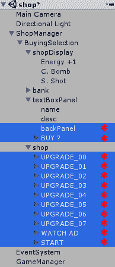

图 9.33 – 从商店场景层次结构中选择这些游戏对象

如果出现打开预制件的窗口，请按键盘上的*Delete*键。打开它并重复此过程。一旦删除，请按`Canvas`左上角的返回按钮。

要创建具有自己背景的`Canvas`，请执行以下操作：

1.  在**层次结构**窗口的下半部分，右键单击，然后从下拉列表中选择**UI**，接着选择**Canvas**。

1.  在**层次结构**窗口中右键单击`Canvas`游戏对象，然后从下拉列表中选择**UI**，接着选择**图像**。

1.  右键单击名为`Image`的新游戏对象，并从下拉列表中选择**重命名**。

1.  将`Image`重命名为`backGround`。

1.  在仍然选择`backGround`游戏对象的情况下，将其**矩形变换**属性更改为以下截图所示：


图 9.34 – `backGround`矩形变换属性设置

1.  我们现在可以给`backGround`添加一些颜色。在仍然选择`backGround`游戏对象的情况下，点击`255`，`0`，`0`，`63`。

以下截图显示了带有红色色调的`backGround`游戏对象的位置和缩放：

![图 9.35 – 游戏窗口中的`backGround`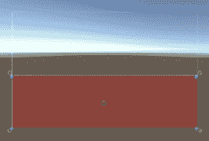

图 9.35 – 游戏窗口中的`backGround`

我们现在可以继续到下一节，我们将添加三个游戏对象，它们将控制按钮游戏对象的位置和缩放。

### 添加布局组组件

在本节中，我们将添加支持我们添加到网格中的按钮间隔的游戏对象。这样做的好处是我们可以控制每个按钮部分的属性，如下面的图所示：

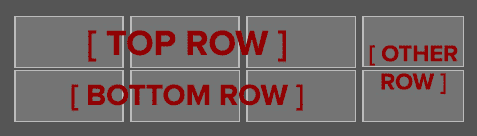

图 9.36 – 按照计划设计的我们的商店场景按钮布局

接下来，我们将创建一个空的游戏对象，并向其添加一个**水平布局组**，这将保持我们的顶部按钮行顺序：

1.  右键点击`Canvas`游戏对象，从下拉列表中选择**Create Empty**。

1.  将新游戏对象重命名为`gridTop`。

1.  在`gridTop`仍然被选中的情况下，将其**Rect Transform**属性更改为以下截图所示的设置：

![Figure 9.37 – gridTop Rect Transform 属性设置

![img/Figure_9.37_B18381.jpg]

Figure 9.37 – gridTop Rect Transform 属性设置

现在由于我们的`gridTop`已经正确定位，我们可以向其添加一个**Horizontal Layout Group**：

1.  在`gridTop`游戏对象仍然被选中的情况下，点击下拉列表顶部的搜索栏中的`Horizontal Layout Group`，直到你看到**Horizontal Layout Group**。当这个组出现在列表中时，选择它。

1.  给**Horizontal Layout Group**以下设置：

![Figure 9.38 – Horizontal Layout Group 属性值

![img/Figure_9.38_B18381.jpg]

图 9.38 – 水平布局组属性值

`gridTop`现在将自动排列升级按钮的顶部行。

我们现在需要重复这个过程，但不需要重复整个程序。按照`gridTop`的相同步骤进行，但进行以下更改：

1.  将下一个游戏对象命名为`gridBottom`。

1.  给游戏对象设置以下**Rect Transform**属性：

![Figure 9.39 – gridBottom Rect Transform 属性设置

![img/Figure_9.39_B18381.jpg]

Figure 9.39 – gridBottom Rect Transform 属性设置

1.  然后，像之前一样，我们需要添加一个`gridTop`。

1.  我们然后重复此过程，但这次，对于我们的"AD"和"START"按钮，我们将添加一个**Vertical Layout Group**组件。

1.  如前所述，创建一个空的游戏对象并将其存储在`Canvas`游戏对象中。

1.  命名一个新的游戏对象为`gridOther`。

1.  给`gridOther`的**Rect Transform**以下设置：

![Figure 9.40 – gridOther Rect Transform 属性设置

![img/Figure_9.40_B18381.jpg]

Figure 9.40 – gridOther Rect Transform 属性设置

1.  如前所述，我们将添加一个`gridOther`游戏对象并给它以下设置：

![Figure 9.41 – 垂直布局组属性值

![img/Figure_9.41_B18381.jpg]

Figure 9.41 – 垂直布局组属性值

我们新的、重新设计的选择网格现在支持创建多个自缩放按钮。在下一节中，我们将演示如何创建多个按钮，这些按钮会自动缩放以适应选择网格。

### 添加 UI 按钮

在本节中，我们将创建一个不需要进行任何尺寸更改的按钮，因为我们之前放置的布局组将处理这个问题。

要在**Hierarchy**窗口中创建一个`gridTop`游戏对象并执行以下操作：

1.  从下拉列表中选择**UI**然后**Button**。

1.  右键点击新创建的`Button`游戏对象，并将其命名为`00`。

我们将得到一个将被拉伸并放置不正确的按钮，但不用担心 – 这是正常的。稍后，当我们向这一行和其他行添加更多按钮时，按钮将自动对齐并缩放大小。

默认情况下，按钮附带一个**图像**组件，边缘为圆角。出于美观目的，这不符合我们的场景。我们可以通过以下步骤移除它：

1.  点击**图像**组件右上角的三个点图标。

1.  从下拉列表中选择**移除组件**。

按钮不再有任何颜色。

接下来，我们将在这个游戏对象中填充五个游戏对象。简要来说，它们的名称和属性如下：

+   `轮廓`：为按钮添加边框

+   `backPanel`：按钮未选中时的颜色

+   `selection`：按钮选中时的颜色

+   `powerUpimage`：按钮上的图片

+   `itemText`：成本或售罄信息

以下截图显示了所有这些游戏对象组合在一起创建我们的新商店按钮：


图 9.42 – 一个商店按钮

小贴士

另一种改变按钮状态的方法是使用 Unity 的`Button`脚本，请参阅[`docs.unity3d.com/2017.3/Documentation/Manual/script-Button.html`](https://docs.unity3d.com/2017.3/Documentation/Manual/script-Button.html)。

#### 添加轮廓游戏对象

让我们先为我们的新商店按钮添加一个`轮廓`游戏对象：

1.  在**层次结构**窗口中右键单击`00`游戏对象，并从下拉菜单中选择**UI** | **图像**。

1.  选择`Image`游戏对象，在`outline`中右键单击它。

1.  在**层次结构**窗口中选择`outline`，并更新其**矩形变换**和**图像****颜色**字段到以下：

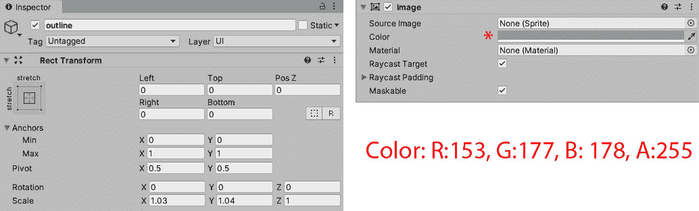

图 9.43 – 轮廓矩形变换属性设置和图像组件颜色和透明度值

商店按钮现在将有一个彩色的`轮廓`。现在，让我们继续并看看按钮的`backPanel`。

#### 添加 backPanel 游戏对象

让我们将`backPanel`添加到`00`游戏对象中：

1.  在`00`游戏对象中，从下拉菜单中选择**UI** | **图像**。

1.  右键单击新创建的`Image`游戏对象，并将其命名为`backPanel`。

1.  在选择`backPanel`的情况下，在**检查器**窗口中更改其**矩形变换**，使其具有以下值：


图 9.44 – backPanel 矩形变换属性设置

在选择`backPanel`游戏对象的情况下，我们可以将`backPanel`游戏对象的设置更改为`40`，`39`，`36`，`255`。这是我们应用的第二个游戏对象，它给出了我们的默认颜色。

我们将在下一个步骤中将`selection`游戏对象添加到`00`游戏对象中。

#### 添加选择游戏对象

要创建`选择`按钮，遵循上一节中提供的相同步骤。然而，请注意有三个不同之处：

1.  将此游戏对象命名为`选择`。

1.  给出`144`，`0`，`0`，`255`。

1.  创建并应用一个`Selection`。

    信息

    我们在 *第二章* 中介绍了创建和应用标签，*添加和操作对象*。

以下截图显示了 `selection` 游戏对象的 **Tag** 和 **Rect Transform** 属性值：

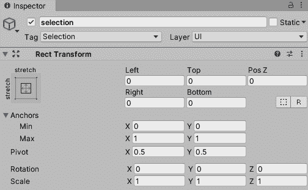

图 9.45 – selection Rect Transform 属性设置

那是我们应用到 `00` 游戏对象上的第三个游戏对象。我们的按钮将在购买或按下不同按钮之前保持红色并亮起。我们将在下一个步骤中将 `powerUpImage` 游戏对象添加到 `00` 游戏对象中。

#### 添加 powerUpImage 游戏对象

要创建 `powerUpImage` 按钮，按照上一节中提供的相同步骤操作，但需要进行以下三个更改：

1.  将此游戏对象命名为 `powerUpImage`。

1.  将 `powerup` 精灵拖放到 **Image** 组件的 **Source Image** 字段中。

1.  打勾 **Preserve Aspect** 复选框。

那是我们用于显示每个按钮图标的第四个游戏对象。

我们将在下一个步骤中将 `itemText` 游戏对象添加到 `00` 游戏对象中。

#### 添加 itemText 游戏对象

要将 `itemText` 游戏对象添加到我们的 `00` 游戏对象中，请按照以下步骤操作：

1.  在 `00` 游戏对象中，从下拉列表中选择 **UI**，然后选择 **Text**。

1.  右键单击新创建的 `Text` 游戏对象，并将其命名为 `itemText`。

1.  在 `itemText` 仍然被选中的情况下，在 `Inspector` 窗口中更改其 **Rect Transform** 和 **Text** 组件，使其具有以下属性：

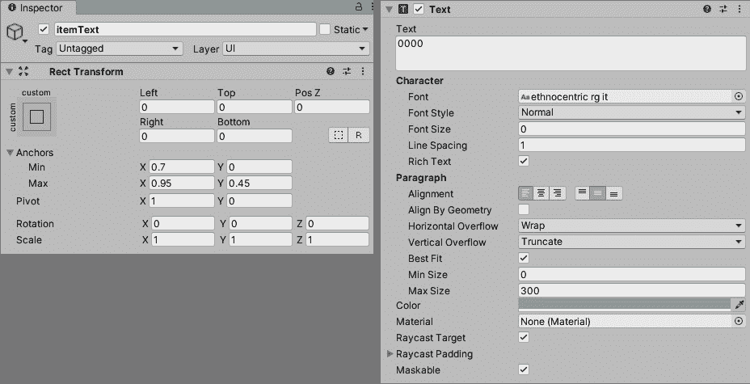

图 9.46 – itemText Rect Transform 属性设置和 Text 组件值

那是我们需要添加到武器升级按钮中的第五个也是最后一个游戏对象。

在 `00` 游戏对象中，应按照以下截图中的顺序排列。如果顺序不同，只需单击并拖动其中一个到正确位置：


图 9.47 – 00 游戏对象及其在 Hierarchy 窗口中的子对象

在本节中，我们移除了旧的 `shop` 场景设置，其中我们使用射线投射系统在商店中选择物品。我们用带有 **Button** 组件的 2D 界面替换了旧的选择网格。这些按钮与 Unity 的水平 **Vertical Layout Group** 组件分组。这两个组的好处是，如果我们向网格中添加更多或更少的按钮，按钮将自动重新组织其位置和缩放。

我们需要对原本附加到每个游戏对象按钮上的 `ShopPiece` 脚本进行一些细微的修改。

一旦应用并修改了脚本，我们将检查按钮在新选择网格中的外观。

# 应用和修改我们的商店脚本

让我们简要回顾一下`ShopPiece`脚本的目的。选择网格中的每个按钮都将从脚本化对象中获取信息，以自定义按钮的名称、描述、价值和图像。由于按钮已从 3D 资产变为 2D，我们需要修改和添加一些代码以使其工作。

要修改`ShopPiece`以使其与我们的新 2D 按钮兼容，请执行以下操作：

1.  在`Assets/Script`文件夹中。

1.  双击`ShopPiece`脚本以打开文件。

第一行代码将允许我们的新代码从`00`游戏对象中获取引用。

1.  在`ShopPiece`脚本的顶部输入以下代码块：

    ```cs
    using UnityEngine.UI;
    ```

需要进行的第二次修改是替换`Awake`函数的内容。原始代码访问`SpriteRenderer`，用于访问每个多边形按钮上的精灵。我们正在替换的另一段代码应用于`TextMesh`组件，该组件用于显示 3D 文本。

1.  要更新我们的`Awake`函数，选择`Awake()`函数内的代码并将其删除。我们的`Awake()`函数应如下所示：

    ```cs
    void Awake()
    {
    }
    ```

我们现在可以进入第一个`if`语句，该语句将我们的可脚本化对象图标图像应用到按钮的图像上。

1.  在`Awake()`函数中，添加以下`if`语句：

    ```cs
        if (transform.GetChild(3).GetComponent<Image>() !=        null)
        {
          transform.GetChild(3).GetComponent<Image>().      sprite=shopSelection.icon;
    }
    ```

`if`语句从`00`按钮的第二个子对象中获取引用，并检查它是否具有**Image**组件。如果它有（应该是有的），我们将脚本化对象图标应用到它上。

1.  另一个`if`语句更新了按钮的文本。在`Awake()`函数中，紧接第一个`if`语句之后，添加以下代码块：

    ```cs
     if(transform.Find("itemText"))
     {
     GetComponentInChildren<Text>().text = shopSelection.cost.ToString();
     }
    ```

`if`语句确保`00`按钮有`itemText`（应该是有的）。当找到`itemText`游戏对象时，其**Text**组件将接收武器脚本化对象的价格。

1.  保存脚本。

1.  在 Unity 编辑器中，选择**层次结构**中的`00`游戏对象，并点击**添加组件**按钮。

1.  在下拉列表中开始键入`ShopPiece`，直到你看到它。当你看到它时，选择它。

1.  在`ShopPiece`组件中，仍然选择`00`游戏对象。

1.  从列表中选择任何武器升级脚本化对象。

以下截图显示了应用了脚本化对象的`ShopPiece`脚本：

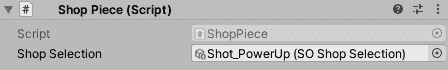

图 9.48 – ShopPiece 脚本，在其 Shop Selection 字段中持有 Shot_PowerUp 可脚本化对象

我们现在可以检查我们的按钮在应用了四个游戏对象及其修改后的`ShopPiece`脚本后的样子。

在接下来的几节中，我们将复制一系列新的商店按钮。这些商店按钮将自动适应我们放置的分配的游戏对象空间。然后，我们将清理任何旧的 UI 并用我们的新界面替换它。最后，我们将从代码中注释掉旧的射线投射系统并添加我们的新界面代码。

## 检查按钮的结果

在本节中，我们将审查 `gridTop` 游戏对象中的新 `00` 按钮。按钮太大，横跨了大多数 **Canvas**，如下面的截图所示：

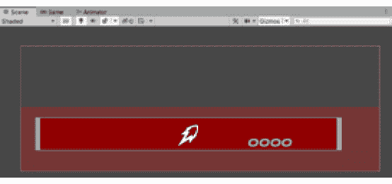

图 9.49 – 00 游戏对象目前位于 gridTop 游戏对象中

但如果在 **层次结构** 窗口中选择 `00` 游戏对象并按 *Ctrl* (*Mac 上的*command*) 和 *D* 几次复制游戏对象，按钮将平均分割，如下面的截图所示：

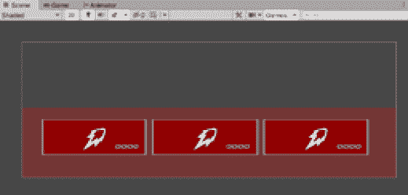

图 9.50 – 三个 00 游戏对象看起来不那么拉伸

按钮可以很好地分割，并且可以在（**Play Mode**）之外重复多次以填充顶部和底部网格。要填充并命名网格，请执行以下操作：

1.  在 `00` 游戏对象中，按 *Ctrl* (*Mac 上的*command*) 和 *D* 三次。

1.  分别将三个新复制的游戏对象重命名为 `01`、`02` 和 `03`。

1.  在 **检查器** 窗口中，选择 `01`。

1.  从列表中选择不同的可脚本对象来更改武器升级。

1.  在 `ShopPiece` 组件中，选择游戏对象 `02` 并选择不同的武器。

现在，我们需要用按钮填充底部行。为此，请按照以下步骤操作：

1.  从 `gridBottom` 游戏对象中点击并拖动 `03` 游戏对象。

1.  在选择 `03` 的情况下，按 *Ctrl* (*Mac 上的*command*) 和 *D* 两次。

1.  将我们新创建的游戏对象重命名为 `04` 和 `05`。

以下截图显示了填充了顶部和底部的行：

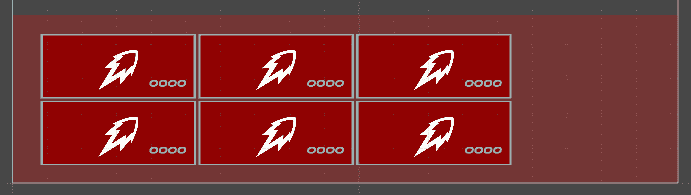

图 9.51 – 六个商店按钮

由于我们商店中再也没有可售物品，所以底部三个按钮看起来很奇怪，因此让我们用一些售罄标志来替换这些按钮。这可以通过我们的可脚本对象资源轻松实现。

要为商店底部的行创建一个售罄标志，我们需要执行以下操作：

1.  在 `Assets/ScriptableObject` 中，在空白区域右键单击，然后选择 **创建** | **创建商店物品**。

1.  将 `Create Shop Piece` 文件重命名为 `SoldOut`。

1.  选择 `SoldOut` 并赋予以下属性值：

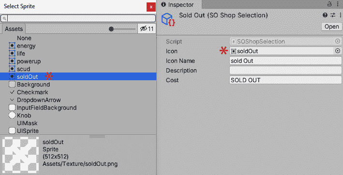

图 9.52 – SoldOut 可脚本对象及其输入的值以及售罄精灵

最后，在**检查器**窗口的`Shop Piece`组件字段的**Shop Selection**中应用`SoldOut`文件到游戏对象`03`、`04`和`05`。

现在，我们需要为我们的广告和开始按钮重复执行类似的过程。

### 创建广告和开始按钮

要重新创建广告按钮，在**层次结构**窗口中选择我们复制的任一按钮，并执行以下操作：

1.  按 *Ctrl* (*Mac 上的 command*) 和 *D* 复制另一个按钮，并将其拖动到**层次结构**窗口中的`gridOther`游戏对象中。

1.  将复制的游戏对象重命名为`AD`。

1.  因为`AD`游戏对象不需要`powerUpImage`，我们可以删除它。

1.  通过单击`itemText`按钮名称左侧的箭头展开`AD`游戏对象。

1.  在**检查器**窗口中将以下设置应用于**文本**组件：

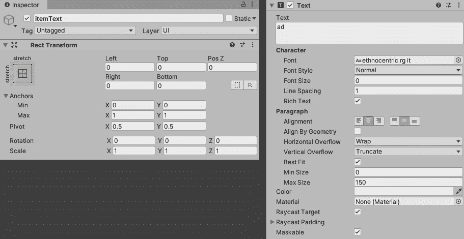

图 9.53 – itemText 矩形变换属性设置和文本组件值

1.  重复执行类似的过程，为`itemText`和`selection`游戏对象组件（`selection`十六进制颜色：`FFC300FF`）执行以下操作，如图所示：


图 9.54 – itemText 文本组件值和选择图像组件属性值

以下截图显示了`gridOther`游戏对象及其内容，包括两个按钮：

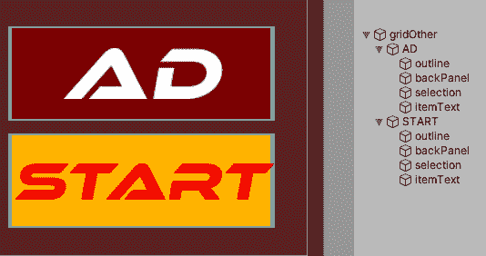

图 9.55 – 在层次结构窗口中包含 AD 和 START 按钮及其子对象的 gridOther 游戏对象

现在我们完成了选择网格视觉效果，我们可以继续到描述面板，并将其部分从 3D 转换为 2D。

### 添加 BUY? 按钮

要将 2D `BUY?` 按钮添加到描述面板，请执行以下操作：

1.  在**层次结构**面板中右键单击`Canvas`游戏对象，然后从下拉列表中选择**UI**，接着选择**按钮**。

1.  右键单击新创建的`Button`游戏对象，并从下拉列表中选择**重命名**。

1.  将`Button`游戏对象重命名为`BUY?`。

1.  在**层次结构**窗口中仍然选中`BUY?`按钮，将其**矩形变换**属性设置为以下截图所示：

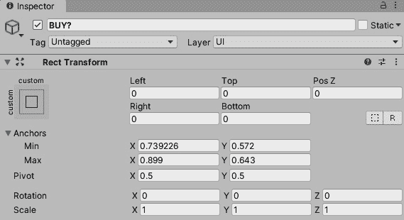

图 9.56 – BUY? 矩形变换属性设置

现在，`BUY?`按钮已经就位并且缩放正确，我们可以改变**图像**和**按钮**组件的美观。在**图像**组件中，选择**远程**按钮作为**源图像**字段，并从列表中选择**无**以移除按钮的曲线边缘。

接下来，我们将使`BUY?`按钮在**按钮**组件中高亮显示和按下时改变颜色。按照以下步骤操作：

1.  在 `255`, `0`, `0`, `255`。

1.  选择 `255`, `195`, `0`, `255`。

1.  当光标移到 `BUY?` 按钮上时，它将变成黄色，按下时将变成红色。

最后，对于 `BUY?` 按钮，我们需要修改其 **Text** 组件，如下所示：

1.  在 `BUY?` 按钮中展开它。

1.  然后，选择 `BUY?` 游戏对象的子对象，称为 `Text`。

1.  在 **Inspector** 窗口中，为 `Text` 游戏对象的 **Text** 组件输入以下值：

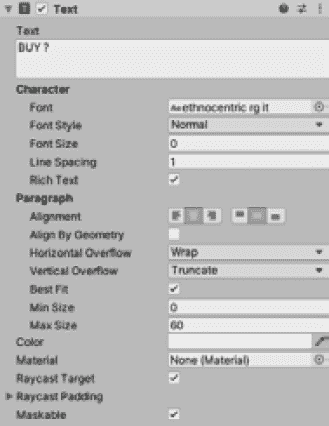

图 9.57 – BUY? 游戏对象的 Text 组件属性值

以下截图显示了我们的 **BUY ?** 按钮的位置和样式：

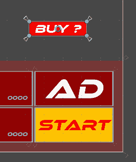

图 9.58 – 现在，BUY? 游戏对象应该看起来像这个截图中的样子

在本节中，我们为我们的按钮应用了 Unity 的不同状态设置，而没有添加任何额外的代码。接下来，我们将添加一个简单的矩形图像来替换多边形四边形。

### 替换我们的 textBoxPanel 游戏对象

在上一节中，我们将我们的 `BUY ?` 按钮改为 2D，并且 `BUY ?` 按钮的一部分现在将被移动、缩放并调整到屏幕的比率，而不是保持静态。因此，我们面临的风险是 `BUY ?` 按钮可能会移动到它所在的静态 `textBoxPanel` 之外，如下面的截图所示：

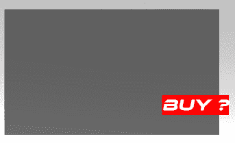

图 9.59 – 解决 textBoxPanel 游戏对象与 BUY ? 按钮对齐的问题

此外，`PlayerShipBuild` 脚本有一个对 `textBoxPanel` 的引用，因此我们不能在不更改代码的情况下删除游戏对象。为了解决这个困境，我们可以移除 `textBoxPanel` 的 3D 组件，使其成为一个空的游戏对象，以容纳其中的其他游戏对象。

要从 `textBoxPanel` 游戏对象中移除组件，请执行以下操作：

1.  在搜索栏中的 `textBoxPanel` 中搜索，直到它出现。

1.  选择 `textBoxPanel` 并在 **Inspector** 窗口中通过选择并点击三个点，选择 **移除组件** 来移除 **Quad (Mesh Filter)** 和 **Mesh Renderer** 这两个组件。

1.  要在 **Hierarchy** 窗口中恢复完整游戏对象的内容，请点击其窗口顶部的十字，位于搜索栏的右侧。

以下截图显示了两个三点图标的位置：

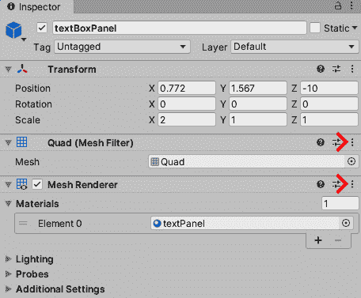

图 9.60 – Quad 和 Mesh Renderer 组件的远程按钮位置

现在，我们可以创建一个 2D 面板游戏对象来替换 `textBoxPanel` 游戏对象的视觉效果，如下所示：

1.  在 `Canvas` 游戏对象中，选择 **UI**，然后从下拉列表中选择 **Image**。

1.  选择新创建的游戏对象，右键单击它，并从下拉列表中选择**重命名**。

1.  将游戏对象重命名为 `panel`。

1.  将 `BUY?` 游戏对象移至面板游戏对象下方，在 **Scene** 窗口中，`BUY?` 按钮位于 `panel` 顶部。以下截图显示了两个游戏对象的顺序：

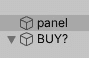

图 9.61 – 在 Hierarchy 窗口中放置 BUY? 游戏对象

1.  在选择 `panel` 游戏对象的情况下，在 **Inspector** 窗口中为其 **Rect Transform** 设置以下值：

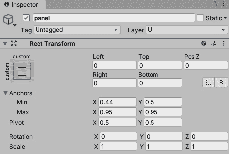

图 9.62 – 面板 Rect Transform 属性设置

我们可以通过在 **Inspector** 窗口中点击 `panel` 游戏对象的 **Image** 组件内的 **颜色** 字段，并给出以下截图中的突出显示值来更改 `panel` 游戏对象的颜色：

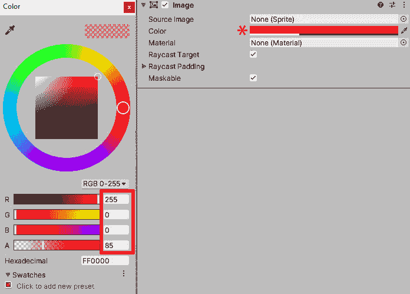

图 9.63 – 将面板游戏对象 Image 组件颜色值更改为此截图中的值

最后，我们可以修改我们的 `textBoxPanel` 和 `bank` 余额字体，使它们与商店按钮相匹配。

要修改我们的银行余额，我们需要执行以下操作：

1.  在 `bankText` 游戏对象中。

1.  选择 `bankText`，在 **Inspector** 窗口中更新其 **Text Mesh** 组件，使 **字体** 字段采用我们新的 **ethnocentric rg it** 字体。

1.  将 `255`, `0`, `0`, `255` 更改为）。

1.  在**文本**字段中添加几个数字以检查结果，如图下截图所示：

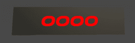

图 9.64 – bank 游戏对象字体更新

要更改我们的 `textBoxPanel`，我们需要做类似的事情。在这里，我们将选择其 `name` 和 `desc` 下的两个子游戏对象，并更新它们的 **Text Mesh** 组件如下：

1.  添加 `name` 和 `desc` 游戏对象的 **Text Mesh** **字体**字段。

1.  给它们一个白色 **颜色**。

1.  在 `name` 游戏对象的 **Text Mesh** **Text** 字段中添加以下内容：

    ```cs
    officer:
    ```

1.  将相同的更改应用到 `desc` 游戏对象，但在 **Text** 字段中添加以下文本：

    ```cs
    will you need any
    upgrades before
    launch?
    ```

以下截图显示了 **Game** 窗口及其更新的字体：

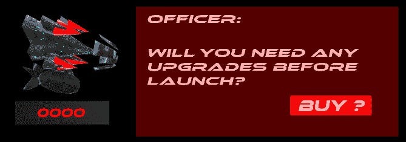

图 9.65 – 我们的 textBoxPanel 游戏对象及其内容更新

现在，我们商店的所有视觉元素都已更新，并将支持各种屏幕比例。通过这样做，我们还引入了 Unity 自带的 **Button** 组件。

我们现在已经到达了可以打开 `PlayerShipBuild` 模板脚本的程度，该脚本位于我们章节的项目文件文件夹中。这个脚本将是当前我们一直在制作的 `PlayerShipBuild` 脚本的复制品，但我们将添加突出显示的代码以支持我们的 `shop` 场景的功能。

### 升级 PlayerShipBuild 脚本

在本节中，我们将用本章项目文件文件夹中的脚本替换当前的`PlayerShipBuild`脚本。替换脚本将包含与当前脚本相同的代码，但会包含逐步添加和删除的代码。

在我们开始编写新的替换脚本之前，让我们将当前的`PlayerShipBuild`脚本重命名为其他名称。要重命名当前的`PlayerShipBuild`脚本，请执行以下操作：

1.  在`Assets/Script`文件夹中。

1.  双击`PlayerShipBuild`脚本。

1.  在打开`PlayerShipBuild`脚本的情况下，将脚本顶部附近的名字从`PlayerShipBuild`重命名为`PlayerShipBuild_OLD`。

1.  保存脚本并返回到**项目**窗口中的`Assets/Script`文件夹。

1.  慢慢点击两次`PlayerShipBuild`脚本，以便提供重命名文件名的选项。

1.  将文件名更改为`PlayerShipBuild_OLD`。

现在，我们需要将`PlayerShipBuild_OLD`脚本从`shop`游戏对象中断开连接。

1.  在搜索栏中输入`shop`，直到你看到`shop`游戏对象。当你看到时，选择它。

1.  在选择`shop`游戏对象的情况下，点击`PlayerShipBuild_OLD`组件（不是**变换**）中的三个点。

1.  从下拉列表中选择**移除组件**。

这样，我们就已重命名并从场景中断开了脚本。现在，我们可以从本章的项目文件文件夹中引入新的副本`PlayerShipBuild`脚本。

要将项目文件文件夹中的新副本`PlayerShipBuild`脚本连接起来，请执行以下操作：

1.  在`Assets/`文件夹中。

1.  从文件夹中选择`PlayerShipBuild_NEW.txt`脚本并将其拖到`Assets/Script`文件夹中。重命名它及其文件格式从`.txt`到`.cs`。这将用以下截图所示的`PlayerShipBuild.cs`替换一些我们旧的具有相同名称的射线脚本：

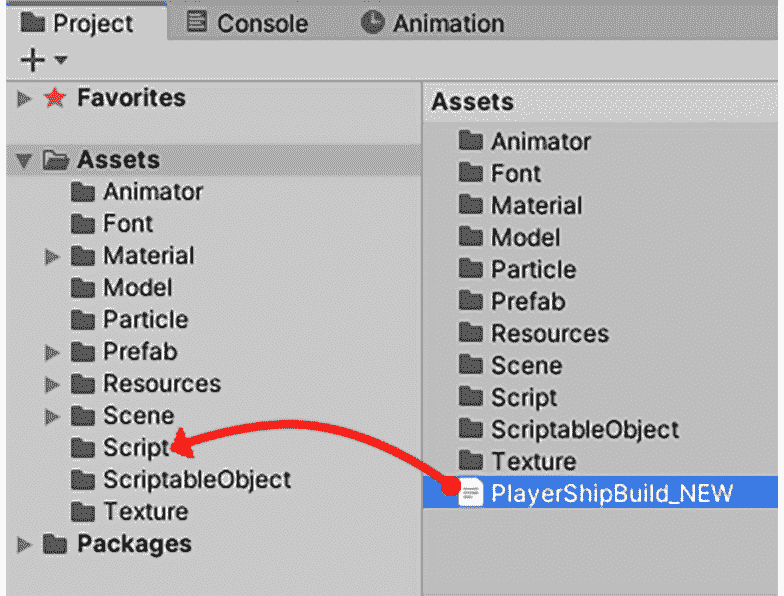

图 9.66 – 将 PlayerShipBuild_NEW 重命名为项目 Assets/Script 文件夹

我们现在可以将这个副本脚本应用到场景中的`shop`游戏对象上。让我们开始吧：

1.  在**层次结构**窗口中选择`shop`游戏对象，就像我们之前做的那样。

1.  点击`PlayerShipBuild`。当你看到`PlayerShipBuild`脚本时，从下拉列表中选择它。

1.  在`shop`游戏对象仍然被选中的情况下，我们现在可以配置附加的`PlayerShipBuild`脚本。

1.  要配置脚本，设置`3`，点击每个字段右侧的每个**远程**按钮，并从**层次结构**窗口中添加以下高亮显示的内容：

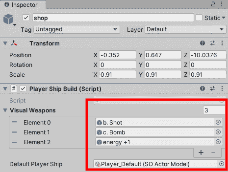

图 9.67 – 将以下三个游戏对象添加到 PlayerShipBuild 脚本的字段

我们的新 `PlayerShipBuild` 脚本现在已经就位。这意味着我们现在可以打开脚本，检查并揭示代码的新部分，同时解释旧代码移除的基本部分。

每个以下 **移除旧…** 子部分将执行以下操作：

+   **//REMOVE(number)**：指代我们正在讨论的代码部分。

+   `PlayerShipBuild` 脚本及其代码已被移除。

+   **替换**：之前代码被替换的内容。

#### 移除旧商店场景的代码

在本节中，我们将遍历新安装的 `PlayerShipBuild` 脚本，并审查我已注释掉的部分代码，这样在 Unity 编译和执行时就不会被认可。

我们将关闭射线投射 3D 对象的能力，这是我们在 *第五章* 中编写的，*为我们的游戏创建商店场景*。因为我们已经将可交互的游戏对象从 3D 转换为 2D，所以我们不再需要射击和识别游戏对象，因为 Unity 将使用其自己的 **按钮** 组件来处理这一点。

要审查我们已注释的代码，请转到位于我们离开位置的 `PlayerShipBuild` 脚本（`Assets/Script`）。

信息

`注释`、`注释`和 `取消注释` 是指代码前有两条斜杠的情况。当我们的代码被编译器读取时（当我们运行代码时），这些将被忽略。

我们将分部分审查每段代码，以便清楚地知道我们将在 `PlayerShipBuild` 中应用哪些更改。

#### 审查代码 – REMOVED 01

每个主要代码块都以 `//REMOVED` 开头，后跟一个数字。以下是为什么我们移除了 `//REMOVED 01` 的特定代码块的原因：

+   `//REMOVED 01`: 这段代码创建了一个射线投射并返回一个名为 `target` 的游戏对象。

+   **移除原因**：我们不再需要为每个我们射出射线的目标游戏对象获取引用。

+   `OnClick` 事件，通常用于在选中时加载一个方法。

让我们继续向下滚动 `PlayerShipBuild` 脚本，直到我们到达 `//REMOVED 02`。

#### 审查代码 – REMOVED 02

在本节中，我们将审查在 `//REMOVED 02` 中注释掉的内容：

+   `//REMOVED 02`: 这段代码将从射线投射选定的游戏对象中获取引用，并打开该 `selection` 游戏对象以显示已进行选择。

+   **移除原因**：该游戏对象除了起到装饰作用外，没有其他任何好处。

+   `selection` 游戏对象。

让我们继续向下滚动 `PlayerShipBuild` 脚本，直到我们到达 `//REMOVED 03`。

#### 审查代码 – REMOVED 03

在本节中，我们将审查在 `//REMOVED 03` 中注释掉的内容：

+   `//REMOVED 03`: 这部分代码检查玩家是否按下了射击按钮；如果是，代码将射出射线投射以检查是否与碰撞器接触。

+   `if` 语句。

+   `OnClick` 事件系统保存对所选游戏对象的引用。

让我们继续向下滚动 `PlayerShipBuild` 脚本，直到我们到达 `//REMOVED 04`。

#### 审查代码 – REMOVED 04

在本节中，我们将回顾我们在 `//REMOVED 04` 中注释掉的内容：

+   `//REMOVED 04`: 此脚本检查射线投射游戏对象的名称。一旦通过一系列 `if` 语句识别，它就会运行适用于它的方法。

+   **移除原因**：这段代码会检查我们的射线投射与哪些特定名称接触。现在我们不再使用射线投射系统。

+   **替换方案**：每个按钮都有自己的事件触发器，运行它自己的方法。

让我们继续向下滚动 `PlayerShipBuild` 脚本，直到我们到达 `//REMOVED 05`。

#### 审查代码 – REMOVED 05

在本节中，我们将回顾我们在 `//REMOVED 05` 中注释掉的内容：

+   `//REMOVED 05`: 在每一帧，它会检查玩家是否在商店中做出了选择。

+   `Update` 方法。

+   **替换方案**：事件触发系统。

在前面的章节中，我们回顾并修改了与旧商店场景的射线投射系统交互的方式。

下一个阶段是将可以在按下“商店”场景中的按钮时通过事件直接调用的方法应用到我们的脚本中。

### 向我们的 `PlayerShipBuild` 脚本添加方法

在本节中，我们将构建两个主要部分，以便我们可以为 2D UI 选择设置我们的脚本。幸运的是，我们已经为这一章做了大部分工作，剩下的只是将脚本的部分设置为 `public`，以便我们的代码可以从其他来源访问，即我们的事件触发器（`OnClick()`）。

我们将要做的第二件事是让我们的 `AttemptSelection` 方法接收游戏对象按钮，以便它将替换之前的 `target` 游戏对象。

为了确认这一点，`target` 游戏对象最初被用来存储来自我们的射线投射系统的射线击中。如果您想了解更多关于射线投射系统，请查看*第五章*，*为我们的游戏创建商店场景*，如果这听起来有些模糊。

首先，让我们让 `PlayerShipBuild` 脚本的方法对其他类可访问：

信息

默认情况下，我们的方法/函数和类的可访问级别设置为私有，除非另有说明。有关可访问级别的更多信息，请参阅以下链接：[`docs.microsoft.com/en-us/dotnet/csharp/language-reference/keywords/accessibility-levels`](https://docs.microsoft.com/en-us/dotnet/csharp/language-reference/keywords/accessibility-levels)。

1.  打开 `PlayerShipBuild` 脚本，并将以下方法的 `public` 添加到其中：

    +   `void WatchAdvert()`

    +   `void BuyItem()`

    +   `void StartGame()`

这些方法现在可以通过 `AttemptSelection` 方法对其他脚本和 Unity 编辑器开放。

`AttemptSelection` 方法将像 `public` 方法一样被处理，但它现在还将接受一个游戏对象作为参数，这将是我们脚本附加到的按钮。

1.  滚动到 `AttemptSelection` 方法并添加一个 `public` 可访问级别，包括一个具有引用名称 `buttonName` 的游戏对象：

    ```cs
    public void AttemptSelection(GameObject buttonName)
    {
    ```

在这个 `AttemptSelection` 方法内部，我们检查 `buttonName` 而不是之前通过检查 `target` 来做，然后我们遵循相同的程序关闭任何突出显示的按钮，然后将 `buttonName` 游戏对象引用应用到另一个名为 `tmpSelection` 的游戏对象上，该对象最初是在 `Select` 方法中设置的。

1.  使用以下代码更新 `AttemptSelection`：

    ```cs
    if (buttonName)
            { 
              TurnOffSelectionHighlights();
              tmpSelection = buttonName;
    ```

在我们的方法中继续下一行代码，我们将按钮的子 `selection` 游戏对象设置为活动状态（打开它）。以下截图显示了 **Hierarchy** 窗口中 `selection` 游戏对象的子编号：

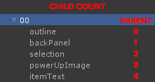

![图 9.68 – 游戏对象 00 的层次结构顺序 1.  输入以下代码：    ```cs    tmpSelection.transform.GetChild(1).gameObject.SetActive(true);    ```1.  在 `AttemptSelection` 方法内部，我们现在需要将旧的 `target` 游戏对象的名称更改为新的 `buttonName` 游戏对象。以下代码片段中加粗的部分显示了你需要更改名称的地方：    ```cs     UpdateDescriptionBox();     //not sold     if (buttonName.GetComponentInChildren<Text>().text !=     "SOLD")     {        //can afford        Affordable();        //can not afford        LackOfCredits();     }     else if (buttonName.GetComponentInChildren<Text>().text     == "SOLD")     {        SoldOut();     }     }    }    ```1.  保存脚本，并在 **Inspector** 窗口中为商店游戏对象重新输入你的 Game IDs。（**编辑 | 项目设置 | 服务 | 广告**）记住，如果你在这个部分遇到困难，你总是可以检查本章的“完整”文件夹，在那里你可以访问已完成的文件。到目前为止，我们已经删除了多个代码块，并用现在支持从 Unity 编辑器的事件触发器的最小代码量替换了它们。这将有助于提高性能并改善我们代码的可读性。在下一节中，我们将让每个 UI 按钮知道在做出选择时要运行哪些方法。### 应用触发事件以调用方法在本节的最后，我们将使玩家按下商店中的按钮时能够立即访问它，而不是我们的脚本发射射线并检查是否以及与哪个碰撞器接触以获取访问其方法。我们将使用 Unity 的 Event 系统直接运行方法。要使按钮直接运行一个方法，请按照以下步骤操作：1.  在 Unity 编辑器中，选择 **Hierarchy** 窗口中的第一个 `shop` 场景按钮，在选择网格中称为 `00`，如下截图所示：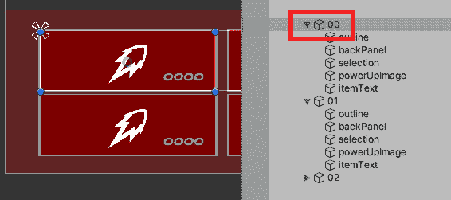

![图 9.69 – 在 Hierarchy 窗口中选择 00 游戏对象

1.  选择 `00` 后，在 **Inspector** 窗口中向下滚动，直到你遇到 **Button** 组件。在 **On Click ()** 面板中，点击以下截图所示的 **+** 图标：

![图 9.70 – 在按钮组件中点击 + 按钮以添加 On Click () 事件]

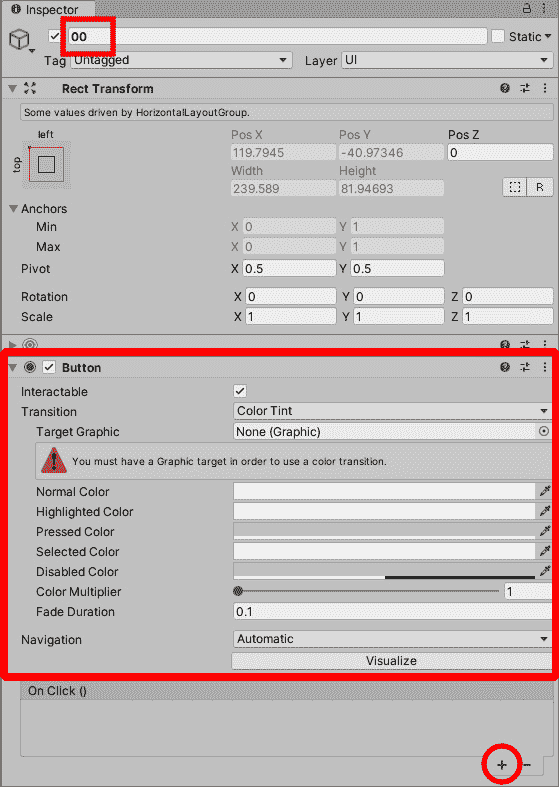

图 9.70 – 在按钮组件中点击 + 按钮以添加 On Click () 事件

1.  将`shop`游戏对象应用到当前显示为**None (Object**)的字段。

1.  将`shop`游戏对象从**层次结构**窗口拖动到**None (Object**)字段，如图下截图所示：

![图 9.71 – 将 shop 游戏对象从层次结构拖动到 00 游戏对象按钮的 On Click () 字段]

![图 9.71 – 将 shop 游戏对象从层次结构拖动到 00 游戏对象按钮的 On Click () 字段]

图 9.71 – 将 shop 游戏对象从层次结构拖动到 00 游戏对象按钮的 On Click () 字段

`00`游戏对象。现在，我们需要指定从`00`加载哪个函数。

当我们轻触/点击`shop`场景中的任一按钮时，我们将通过发出请求来调用`AttemptSelection`方法。

要使我们的`00`按钮加载`AttemptSelection`方法，请执行以下操作：

1.  点击`PlayerShipBuild`脚本和`AttemptSelection(GameObject)`公共方法，如图下截图所示：

![图 9.72 – 在字段中有 shop 游戏对象时，选择 PlayerShipBuild 脚本然后选择 AttemptSelection 函数]

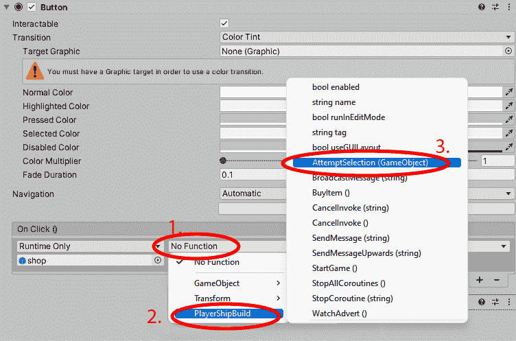

图 9.72 – 在字段中有 shop 游戏对象时，选择 PlayerShipBuild 脚本然后选择 AttemptSelection 函数

在`AttemptSelection`中添加的最后一个字段。

1.  点击最右侧的遥控按钮，并输入我们已选择的游戏对象，即`00`。当你在列表中看到它时，点击它。

因此，当玩家按下`00`按钮时，我们的`PlayerShipBuild`脚本将从`shop`游戏对象中运行。然后，它将运行`AttemptSelection`方法，并将`00`游戏对象作为参数的引用。

1.  设置`01`和`02`。完成后，所有三个游戏对象的**On Click()**面板将如下所示：

![图 9.73 – 每个游戏对象（00、01、02）及其按钮组件的 On Click () 事件属性设置]

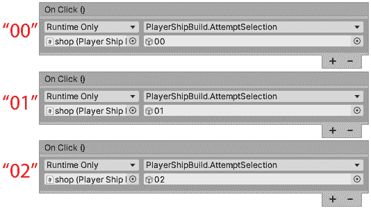

图 9.73 – 每个游戏对象（00、01、02）及其按钮组件的 On Click () 事件属性设置

对于我们的`START`和`AD`游戏对象按钮（位于**层次结构**窗口中），情况略有不同。

要使我们的`AD`和`START`游戏对象按钮在游戏中工作，请执行以下操作：

1.  在**检查器**窗口中，将`shop`游戏对象应用到`AD`游戏对象的`OnClick`事件，就像我们对最后几个游戏对象按钮所做的那样。

1.  对`START`游戏对象按钮执行相同的操作。

1.  按照以下方式更新`START`和`AD`游戏对象的`OnClick`事件：

    +   `PlayerShipBuild`，然后是`WatchAdvert`方法。

    +   `PlayerShipBuild`，然后是`StartGame`方法。记住，如果你在列表中看不到它，请确保在`PlayerShipBuild`脚本中将其设置为`public`。你现在知道如何做了。如果不是，请检查`Complete`文件夹。

![图 9.74 – AD 和 START 游戏对象按钮的 On Click () 事件属性值]

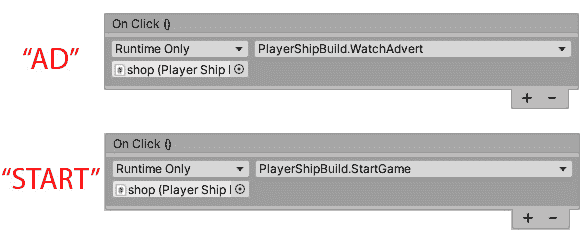

图 9.74 – AD 和 START 游戏对象按钮的 On Click()事件属性值

最后要更改的按钮是**层次结构**窗口中的`BUY?`游戏对象按钮：

1.  将通常的`shop`游戏对象应用到其**On Click()**面板上。

1.  将脚本设置为`PlayerShipBuild`，然后是`BuyItem`。

注意，我们不会将事件监听器应用到我们的底部按钮行（已售罄），因为没有理由按下这些按钮。

我们现在可以测试商店场景了。保存场景，并在 Unity 编辑器中按下**播放**来尝试我们的新商店按钮。还值得在**游戏**窗口中测试不同的横向视图，以查看在选择了横向比率时 UI 按钮如何弹出形状。

以下截图显示了您必须遵循的更改比率的步骤。通过在 Unity 编辑器中点击**游戏**选项卡，然后从两个相当常见的比率中进行选择来完成此操作：

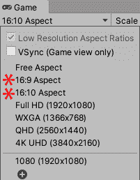

图 9.75 – 此截图显示了两个常见的比率标记

在本节中，我们重新评估了我们的代码，并移除了旧的射线投射系统，该系统涉及选择 3D 游戏对象来运行方法。我们用 Unity 的事件系统替换了它，包括动态组织了**水平和垂直布局组**组件的**按钮**组件。

现在，由于它支持不同的屏幕比率，UI 更加健壮。这将使我们的游戏与各种旧的和当前的移动和平板电脑屏幕以及尚未发布的便携式设备更加兼容。这有助于使我们的应用程序面向未来，避免出现任何令人尴尬的比率问题。

# 摘要

在本章中，我们探讨了游戏中的两个不同部分：游戏内 HUD 和重建我们的商店场景。这两个部分都使用了 Unity 的 UI 组件，但方式不同。

在游戏内 HUD 部分，我们研究了什么是 HUD 以及如何将其整合到我们的游戏中。通过这样做，我们学习了如何使用**水平布局组**正确排列图像，使用**渲染纹理**从第二个摄像头获取数据，以及使用**原始图像**显示从**渲染纹理**获取的数据。

最重要的是，根据 Unity 程序员考试的要求，你需要了解什么是 HUD 以及如何将其中的元素构建进去，例如小地图。

在本章的第二部分，我们回顾了当前商店场景的界面和代码。我们将其拆解并重新构建了其界面，作为一个 Unity 事件系统，它直接运行方法而不是投射射线来调用方法。我们还使界面支持多个比率。

使用本章涵盖的技能，你应该在审查和理解可以更高效地编写的代码时更有信心。

在下一章中，我们将继续我们的游戏内关卡制作，以便我们可以暂停游戏，手动添加和更改音乐和音效的音量，等等。
