# *第十一章*：存储数据和音频混合器

在本章中，我们将探讨为我们的游戏存储和发送数据的常见方法。这还将涉及我们使用 Unity 的现成 **音频混合器** 来存储玩家的游戏音量设置。

如您所忆，在前一章中，我们从头开始制作自己的暂停屏幕。我们将在本章继续这一工作。我们仍然需要处理暂停屏幕上的音乐和音效滑块。我们将保留所有要在 **音频混合器** 中播放的音频源控制。**音频混合器** 将作为所有声音的中心点，也可以通过脚本进行操作，我们将在本章中这样做。如果我们的游戏有更多的音效和音乐，一个控制游戏声音的 **音频混合器** 从一个地方控制所有声音，将帮助我们避免与所有附加到游戏对象的不同的音频源组件纠缠在一起。

我们将使用 Unity 自带的 `PlayerPrefs` 来存储音量设置，它会在游戏运行的平台本地存储数据。这也被称为持久数据，因为我们可以在关闭包含音量信息的机器后，当机器重新开启时，数据仍然保留在系统中。我们将介绍将我们的对象序列化成数据，并将数据反序列化回对象。如果我们想将数据批量发送到数据库，这很有用。

在本章中，我们将涵盖以下主题：

+   使用 **音频混合器**

+   存储数据

让我们开始吧！

# 本章涵盖的核心考试技能

以下是在本章中将要涵盖的核心考试技能：

*编程核心交互*：

+   实现和配置游戏对象的行为和物理。

*开发应用程序系统*：

+   解析应用界面流程的脚本，例如菜单系统、UI 导航和应用设置。

+   分析用于用户进度功能的脚本，例如得分、等级和游戏内经济，利用 Unity Analytics 和 `PlayerPrefs` 等技术。

+   识别用于保存和检索应用程序和用户数据的脚本。

*为场景和环境设计编程*：

+   确定实现音频资源的脚本。

*在专业软件开发团队中工作*：

+   识别构建模块化、可读性和可重用性脚本的技巧。

# 技术要求

本章的项目内容可以在 [`github.com/PacktPublishing/Unity-Certified-Programmer-Exam-Guide-Second-Edition/tree/main/Chapter_11`](https://github.com/PacktPublishing/Unity-Certified-Programmer-Exam-Guide-Second-Edition/tree/main/Chapter_11) 找到。

您可以下载每个章节的项目文件的全部内容，地址为 [`github.com/PacktPublishing/Unity-Certified-Programmer-Exam-Guide-Second-Edition`](https://github.com/PacktPublishing/Unity-Certified-Programmer-Exam-Guide-Second-Edition)。

本章的所有内容都保存在章节的`unitypackage`文件中，包括一个包含本章我们将执行的所有工作的`Complete`文件夹。

查看以下视频以查看*代码执行情况*：[`bit.ly/3EYHpxf`](https://bit.ly/3EYHpxf)。

# 使用音频混音器

随着游戏的增长，有一个专注于所有分配的音量和音效的混音器通道是有用的。否则，如果没有单独的混音器通道，我们就需要在**检查器**窗口中点击各种游戏对象并调整它们的每个组件。

对于我们的游戏，我们将保持简单，创建三个没有任何附加效果的**音频组**。让我们看看每个**音频组**将关注什么：

1.  **主音频组**：控制整个游戏的主音量

1.  **音乐音频组**：控制每个级别的音乐

1.  **效果音频组**：控制玩家飞船发射的子弹音效

以下截图显示了**音频混音器**和三个**音频组**的设置：

![Figure 11.1 – 带有主、音乐和效果音频组的音频混音器窗口

![img/Figure_11.01_B18381.jpg]

Figure 11.1 – 带有主、音乐和效果音频组的音频混音器窗口

更多信息

如果您想了解更多关于**音频混音器**布局的信息，请查看[`docs.unity3d.com/Manual/AudioMixerOverview.html`](https://docs.unity3d.com/Manual/AudioMixerOverview.html)上的文档。

让我们现在开始创建 Unity 编辑器中的**音频混音器**，按照以下步骤进行：

1.  在`资产`中右键单击文件夹内的空白区域。

1.  从下拉菜单中选择**创建**，然后选择**音频混音器**。以下截图显示了选择过程：

![Figure 11.2 – 创建音频混音器

![img/Figure_11.02_B18381.jpg]

Figure 11.2 – 创建音频混音器

1.  这样，就有一个新的`MasterMixer`。

在我们将混音器连接到`LevelMusic`和`Player_Bullet`游戏对象（因为这些是制造声音的两个游戏对象）之前，我们需要进入**音频混音器**并首先创建**音乐**和**效果**混音器（我们目前只有单独的**音频组**）。

让我们更仔细地看看我们的`MasterMixer`，在**项目**窗口中双击`MasterMixer`文件。我们将看到以下屏幕：

![Figure 11.3 – 带有主音频组的音频混音器窗口

![img/Figure_11.03_B18381.jpg]

Figure 11.3 – 带有主音频组的音频混音器窗口

上一张截图显示了我们的**音频混音器**设置。它由四个类别组成：

1.  `MasterMixer`。

1.  **快照**：将此视为混音器的保存状态。我们可以有多个快照，例如物理 Hi-Fi，我们可以选择不同的已保存预设（摇滚、迪斯科、古典等）。快照的使用方式与预设相同；它节省了我们的时间，这样我们就不必总是调整混音器设置。

1.  `MasterMixer`将是我们两个分组 – 一个用于**音乐**，另一个用于**效果**。我们很快就会创建这些。

1.  **视图**：用于保存不同的**音频混音器**UI 布局。

不要过于担心细节，因为我们主要将关注**分组**。我们可以用音频混音器做更多的事情。查看官方 Unity 文档以获取更多信息，链接为[`docs.unity3d.com/Documentation/Manual/AudioMixer.html`](https://docs.unity3d.com/Documentation/Manual/AudioMixer.html)。

要在**Master**旁边添加两个额外的音量混音器，我们需要执行以下操作：

1.  右键点击**分组**部分下的**Master**，然后选择**添加子分组**。我们将获得一个新的混音器，如下面的截图所示：

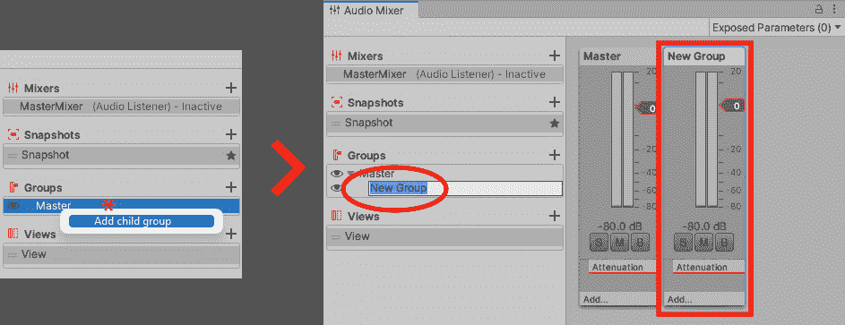

图 11.4 – 创建新的音频分组

1.  右键点击上一个截图中的**New Group**（已圈出），然后从下拉菜单中选择**重命名**。

1.  将`New Group`重命名为`Music`。

1.  重复*步骤 1-3*以创建另一个`Effects`。

以下截图显示了现在带有所有三个 ASV 的**音频混音器**窗口将看起来像什么：

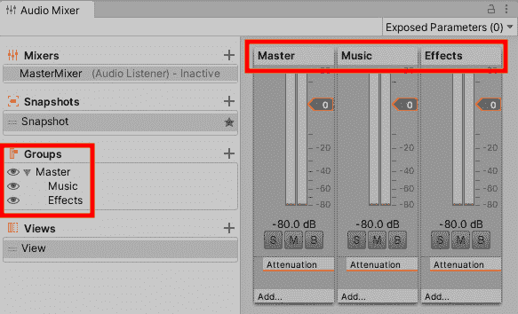

图 11.5 – 包含所有三个音频分组的音频混音器

太好了！现在，我们可以继续连接这些`LevelMusic`游戏对象，它是`GameManager`游戏对象的子对象。

要更新我们的`LevelMusic`游戏对象的**音频源**组件，请执行以下操作：

1.  从 Unity 编辑器加载`bootUp`场景。

1.  在`GameManager`游戏对象中，选择`LevelMusic`游戏对象。

1.  在**项目**窗口中，点击**MasterMixer**左侧的箭头以展开其内容。

1.  点击**Music**子分组，并将其拖入 LevelMusic 的**音频源**的**输出**字段，如下面的截图所示：

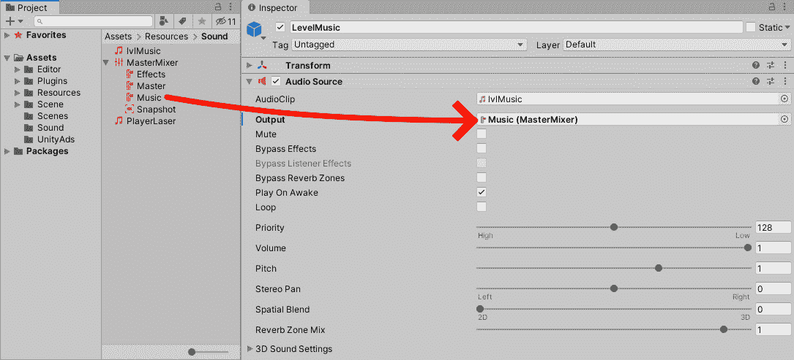

图 11.6 – 将音乐音频分组拖到 LevelMusic 音频源输出字段

1.  在**检查器**窗口中点击**覆盖|应用全部**以更新 GameManager 的预制件设置。

现在，我们需要为我们的`player_bullet`预制件做类似的事情。要使用**Effects**混音器更新其**音频源**，请执行以下操作：

1.  在`Assets/Prefab/Player`文件夹中。在那里，你应该找到我们的`player_bullet`游戏对象。

1.  选择`player_bullet`（表示为`player_bullet`的**音频源****输出**（表示为**3**）。

以下截图显示了`player_bullet`游戏对象的**音频源**在**检查器**窗口中应该看起来像什么：

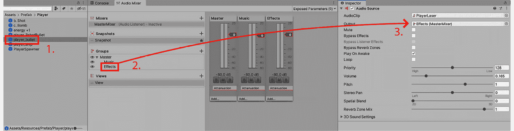

图 11.7 – 将 player_bullet 的音频分组效果拖入音频源输出字段

现在，**音频混音器**几乎准备好连接到暂停屏幕的**音乐**和**效果**滑块。在我们进入下一节之前，我们需要做最后一件事，那就是使**音频组的**音量可访问，以便我们可以使其与暂停屏幕的音频滑块进行通信。为此，我们需要将我们的**音频混音器的**衰减音量属性设置为打开或**暴露**给我们的脚本。

要暴露并命名我们的**音频组**，我们需要执行以下操作：

1.  在**项目**窗口中，转到**MasterMixer**并展开其内容，以便我们可以看到其组。

1.  选择**音乐**组。

1.  在**检查器**窗口中，我们看到了**音乐****组**的属性。我们想要暴露**音量**，以便我们可以用我们的脚本修改它。

1.  右键点击**音量**（在**检查器**窗口中，位于**衰减**下）并选择**将“音量（音乐）”暴露给脚本**，如图下所示：

![Figure 11.8 – 在检查器窗口中，右键点击衰减音量并选择将“音量（音乐）”暴露给脚本'

![img/Figure_11.08_B18381.jpg]

Figure 11.8 – 在检查器窗口中，右键点击衰减音量并选择将“音量（音乐）”暴露给脚本'

现在，我们也有选择给暴露的音量一个引用名称，而不是其默认名称`MyExposedParam`。

要更改暴露的**音乐****音量**的引用，请执行以下操作：

1.  返回到 `MasterMixer` 文件。

1.  如您可能已经注意到的，在**音频混音器**的右上角，我们被告知我们有**暴露参数（1**）（在下述截图中的**1**表示）。这个**1**是我们刚刚暴露的**音乐****音量**。

1.  点击**暴露参数（1**）（标记为**1**）。

1.  右键点击**我的暴露参数音量（音乐**）（标记为**2**）。

1.  从下拉菜单中选择**重命名**（标记为**3**）。

1.  在出现的参数中，将其重命名为`musicVol`（标记为**4**）。

以下截图显示了我们在前面的步骤中提到的阶段：

![Figure 11.9 – 将 MyExposedParam 重命名为 musicVol

![img/Figure_11.09_B18381.jpg]

Figure 11.9 – 将 MyExposedParam 重命名为 musicVol

我希望你们已经很好地理解了这个过程，因为我希望你们再次执行这个过程，但这次是使用 `effectsVol`。

最后，在我们的**音频混音器**中，我们将暴露的音量引用命名为如下：

![Figure 11.10 – 两个暴露的参数都已重命名

![img/Figure_11.10_B18381.png]

Figure 11.10 – 两个暴露的参数都已重命名

很好！在我们进入下一节之前，让我们简要回顾一下本节我们已经涵盖的内容：

+   我们介绍了**音频混音器**及其优点。

+   我们为我们的混音器创建了**音频组**。

+   我们将**音频混音器**附加到了游戏对象的音频源上。

+   我们将**音频混音器**暴露给了我们的脚本。

在下一节中，我们将编写暂停屏幕的**音量**和**效果**滑块的代码。

## 将音频混音器附加到 UI 滑块

在本节中，我们将编写两个方法（`SetMusicLevelFromSlider`和`SetEffectsLevelFromSlider`），将我们的暂停屏幕的**音乐**和**效果**滑块连接到我们在上一节中创建的**音频混音器**。

让我们先通过脚本将**音乐**滑块添加到我们的**音频混音器**中，如下所示：

1.  在`PauseComponent`脚本中，它应位于`Assets/Script`，并打开它。

因为我们将要访问**音频混音器**，我们需要一个额外的 Unity 库来实现这一点。

1.  在我们的`PauseComponent`脚本顶部，添加以下代码行：

    ```cs
    using UnityEngine.Audio;
    ```

1.  现在，添加一个字段来存储我们的**音频混音器**的引用：

    ```cs
     [SerializeField]
     AudioMixer masterMixer;
    ```

1.  我们还需要为`masterMixer`变量添加两个更多变量，如下所示：

    ```cs
     [SerializeField]
     GameObject musicSlider;
     [SerializeField]
     GameObject effectsSlider;
    ```

1.  保存脚本并返回到 Unity 编辑器。

1.  加载我们开始创建暂停屏幕的`level1`场景。

1.  从**层次结构**窗口中选择`PauseContainer`游戏对象。

1.  在`PauseComponent`。在这里，我们可以从**层次结构**窗口拖动两个滑块，以及从**项目**窗口中的**MasterMixer**，如下截图所示：

![图 11.11 – 将每个游戏对象和文件拖入其指定的字段]

](img/Figure_11.11_B18381.jpg)

图 11.11 – 将每个游戏对象和文件拖入其指定的字段

现在我们已经将三个引用（音乐滑块、效果滑块和主混音器）连接到它们的参数，我们可以返回到我们的`PauseComponent`脚本并为暂停屏幕的每个音量滑块编写一个方法。

为了添加功能，使我们的**音乐**滑块控制**音乐**混音器，请执行以下操作：

1.  在`PauseComponent`脚本中，在`PauseComponent`类内添加一个`public`方法：

    ```cs
      public void SetMusicLevelFromSlider()
      {
        masterMixer.SetFloat("musicVol",musicSlider.GetComponent<Slider>
          ().value);
      }
    ```

我们刚刚进入的`public`方法`SetMusicLevelFromSlider`将作为`masterMixer`的事件。在这个变量中，我们调用它的`SetFloat`函数，该函数接受两个参数。第一个是混音器的引用名称（我们在本章中将其称为`musicVol`），而第二个是要更改的值。我们正在发送来自暂停屏幕的**音乐**滑块的值。

1.  保存脚本并返回到 Unity 编辑器。

接下来，我们需要附加我们的`SetMusicLevelFromSlider`方法。为了使**音乐**滑块与该方法通信，请按照以下步骤操作：

1.  仍然在我们的`level1`场景中，在`Music`游戏对象中。

1.  在**检查器**窗口中，点击**检查器**窗口底部的**+**按钮，以便将事件附加到**滑块**组件（以下截图中的**1**所示）。

1.  将`PauseContainer`游戏对象从**层次结构**窗口拖到**无（对象**）参数（以下截图中的**2**所示）。

1.  点击`SetMusicLevelFromSlider`（以下截图中的**3**所示）。

以下截图引用了**检查器**窗口中`Music`游戏对象的先前说明：

![图 11.12 – 更新音乐游戏对象的音乐滑块事件的三个步骤]

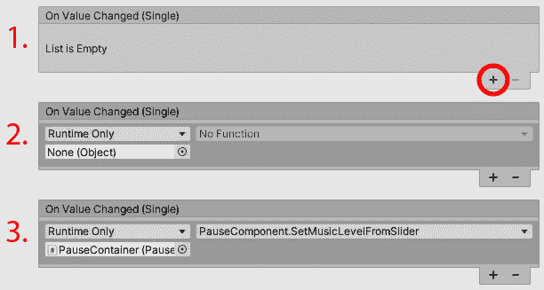

图 11.12 – 更新音乐游戏对象音乐滑块事件的三个步骤

如果我们回到**启动**场景，在 Unity 编辑器中点击**播放**，然后在**游戏**窗口中，当游戏暂停按钮出现时点击它，我们将能够通过**音乐**滑块调节音量大小。

现在，我们需要以类似的方式重复此过程，以便我们的**效果**滑块音量能够工作：

1.  返回到`PauseComponent`脚本，并输入以下方法：

    ```cs
        public void SetEffectsLevelFromSlider()
      {
        masterMixer.SetFloat("effectsVol",effectsSlider.    GetComponent
           <Slider>().value);
      }
    ```

如我们所见，代码几乎与`SetMusicLevelFromSlider`的代码相同，除了变量名不同。

1.  保存脚本。

1.  返回到 Unity 编辑器，重复相同的步骤拖动`PauseComponent`游戏对象，但这次是使用`Effects`游戏对象，并选择`SetEffectsLevelFromSlider`，如下面的截图所示：

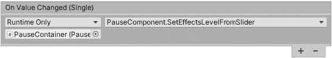


图 11.13 – 更新效果游戏对象音频滑块

最后，测试一下当我们运行游戏时，**效果**滑块是否工作。

这显然只能在`level1`中工作，因为`level2`和`level3`没有额外的游戏对象。在下一章中，我们将创建一个新的`level3`，所以如果你能等到那时，就可以避免再次经历删除和添加场景的过程。

在本节中，我们介绍了`PauseComponent`脚本的以下功能：

+   确保它识别音频混音器

+   确保**音乐**和**效果**UI 滑块改变**音频组**

在下一节中，我们将开始探讨如何存储我们的数据。我们将再次使用暂停屏幕来展示游戏记住我们的音量设置的好处。

# 存储数据

在本节中，我们将介绍如何存储我们的数据，例如游戏的音量设置，这样当我们玩游戏时，我们就不必不断将音量设置回之前的位置。我们希望游戏能为我们记住这些设置。

存储数据有多种方式。我们将介绍的是 Unity 开发中最常见的两种选择。它们如下：

1.  使用`PlayerPrefs`来保存我们的音量设置，这样当我们关闭并重新打开游戏时，它会记住我们的设置。`PlayerPrefs`可以通过文本文件读取器轻松地从游戏外部访问。在开发过程中，确保不要使用`PlayerPrefs`来存储敏感信息，例如信用卡详情或会给玩家不公平优势的信息，如存储生命值、能量、得分、游戏内信用等。有关`PlayerPrefs`的更多信息，请查看 Unity 的描述[`docs.unity3d.com/Documentation/ScriptReference/PlayerPrefs.html`](https://docs.unity3d.com/Documentation/ScriptReference/PlayerPrefs.html)。

1.  `PlayerPrefs` 的特点是它使用类似于 `PlayerPrefs` 的数据类型，如 `int`、`float` 和 `string`，但还包括 `object`（我们的类作为蓝图，以便我们可以创建对象）、`array`、`bool` 和 `null`。

使用这种形式的 **应用程序编程接口**（**API**）来传输游戏数据（生命值、关卡、玩家进度、能量等）是明智的，但不要将有关游戏内信用、银行详情、个人地址和电子邮件的高度个人详细信息本地存储，除非你正在使用某种形式的加密。

信息

一个 API 基本上告诉我们应用程序之间是如何相互通信的。

关于 Unity 中的 JSON 的更多信息，请查看[`docs.unity3d.com/Documentation/Manual/JSONSerialization.html`](https://docs.unity3d.com/Documentation/Manual/JSONSerialization.html) 的文档。

在以下章节中，我们将基于它们是官方支持的，并且可能会在考试中提到的两种方式来介绍如何在 Unity 中存储数据：

+   `PlayerPrefs` 和音量设置

+   JSON 和存储游戏统计数据

+   添加 JSON 变量

让我们从如何使用 `PlayerPrefs` 开始，并再次回顾我们的暂停屏幕。

## PlayerPrefs 和音量设置

如我们所知，我们的游戏在暂停屏幕上有音乐和音效的音量控制。为了使我们的游戏记住这些音量设置，即使游戏已经关闭并重新打开，我们需要做以下操作：

1.  在 `Assets/Script`。

1.  双击 `PauseComponent` 脚本。

1.  滚动到 `SetMusicLevelFromSlider` 方法，并在方法范围内但底部添加以下额外的代码行。以下代码显示了添加代码后方法现在的样子：

    ```cs
      public void SetMusicLevelFromSlider()
      {
        masterMixer.SetFloat("musicVol",musicSlider.        GetComponent
           <Slider>().value);
        PlayerPrefs.SetFloat("musicVolume",musicSlider.        GetComponent
           <Slider>().value);    // << NEW CODE LINE
      }
    ```

在上述代码中，我们使用了音乐 `<Slider>` 组件的 `value`，并将其 `float` `value` 应用到 `PlayerPrefs` 的 `float` 上，其中 `musicVolume` 作为我们的键（用于识别 `PlayerPrefs` 值的参考名称）。

1.  对 `effects` 方法也做同样的操作：

    ```cs
        public void SetEffectsLevelFromSlider()
      {
        masterMixer.SetFloat("effectsVol",effectsSlider.        GetComponent
          <Slider>().value);
        PlayerPrefs.SetFloat("effectsVolume",effectsSlider.        GetComponent
          <Slider>().value);  // << NEW CODE LINE
      }
    ```

这样我们的 `PlayerPrefs` 文件就准备好了，可以存储音乐和音效音量。接下来要做的是在下次从 `PlayerPrefs` 加载关卡时重新应用音乐/音效音量。

要从我们的 `PlayerPrefs` 中获取音乐音量设置，请执行以下操作：

1.  再次打开 `PauseComponent` 脚本。

1.  在 `PauseComponent` 类中，在 `Awake` 函数的底部输入以下代码：

    ```cs
        masterMixer.SetFloat("musicVol",PlayerPrefs.GetFloat("musicVolume"));
        masterMixer.SetFloat("effectsVol",PlayerPrefs.GetFloat("effectsVolume"));
    ```

在上述代码中，我们正在重新应用我们保存的 `PlayerPrefs` 值（音乐和音效音量，都是浮点数）到音频混音器的 **音频组**。

我们想要混音器拥有的音量现在已设置。我们最后需要做的是将两个音量滑块设置到它们的 UI 位置。

1.  要更新 `PauseComponent`：

    ```cs
      float GetMusicLevelFromMixer()
      {
        float musicMixersValue;
        bool result = masterMixer.GetFloat("musicVol", 
           out musicMixersValue); 

        if (result)
        {
          return musicMixersValue;
        }
        else
        {
          return 0;
        }
      }
    ```

上述代码是一个返回名为 `GetMusicLevelFromMixer` 的 `float` 值的方法。

让我们来看一下 `GetMusicLevelFromMixer` 的步骤：

1.  在这个方法中，我们创建了一个名为 `musicMixersValue` 的 `float` 变量。

1.  在 `musicMixersValue` 之后的行检查 `masterMixer` 实例是否包含 `musicVol`。我们知道它包含，因为我们之前在将每个音量设置从 **音频混音器** 公开时设置了它，如下面的截图所示：

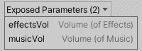

图 11.14 – 我们命名的公开参数

1.  因此，如果 `masterMixer` 包含一个名为（键）`musicVol` 的 `float` 值，我们将将其存储在名为 `musicMixersValue` 的 `float` 中。

1.  如果 `masterMixer` 包含一个在 `bool` 值中存储的 `float`，则 `masterMixer.GetFloat` 将发送一个 `true` 或 `false` 值；否则，它将返回 `0`。

1.  如果 `bool` 值为 `true`，则方法会返回 `masterMixer` 中的 `float` 值；否则，它将返回 `0`。

接下来，我们需要调用这个 `GetMusicLevelFromMixer` 并使其将值发送到音乐滑块。现在让我们编写这段代码。

1.  在 `PauseComponent` 脚本中，在顶部，在 `Awake` 函数中，在两个 `masterMixer` 编码行下面添加以下代码：

    ```cs
    musicSlider.GetComponent<Slider>().value = GetMusicLevelFromMixer();
    ```

在前面的代码片段中，我们在关卡开始时将 `GetMusicLevelFromMixer` 的结果发送到 `musicSlider` 的值。

这就是我们的音乐滑块设置。现在，我们需要为我们的效果滑块重复此过程。过程是相同的，只是使用效果滑块的变量，所以不重复相同的步骤，我想让你做以下操作：

1.  使用与 `GetMusicLevelFromMixer` 相同的代码模式创建一个 `GetEffectsLevelFromMixer` 方法，但使用 `effectsVol` 而不是 `musicVol`。

1.  在 `Awake` 函数中将 `GetEffectsLevelFromMixer` 的结果分配给 `effectsSlider` 变量。使用 `musicSlider` 变量作为参考。

尝试一下 – 如果你遇到困难，请查看本书 GitHub 存储库中的 `Complete` 文件夹。

保存脚本并返回到 Unity 编辑器。播放第一关，调整音量，退出游戏，然后返回到第一关，查看我们的音量是否已保存到音乐和效果滑块。

现在，我们将继续学习如何以稍微不同的方式存储和发送数据。

## JSON 和存储游戏统计数据

JSON 非常适合在我们的游戏中创建、存储和更新信息。正如我们在本章前面提到的，JSON 通常用于将游戏中的数据发送到在线服务器，JSON 数据可以传递到另一组数据。

我对 JSON 的最佳解释是一个类比，我就像在一家餐厅，坐在餐桌旁（我的游戏）；服务员过来，接收我的（JSON）订单，然后将其发送到厨房（在线服务器）。最后，服务员带着我的食物回来。

关于 JSON 编码，我们是在一个单独的类中存储变量，然后序列化这个类（对象）为数据（系统内存或文件）。从那里，我们可以将此数据传输到实际的文件或上传到数据库服务器。整个过程也可以反过来，即我们取数据并将其返回为对象。这被称为反序列化。

现在，让我们继续编写一些 JSON 值。

## 添加 JSON 变量

使用 JSON 的目的是创建一种简单的方式来存储和更新数据。在我们的项目中，我们将提供一个存储游戏统计数据的简单示例。当玩家完成游戏时，我们将存储数据并将其放入 JSON 格式。

我们将要存储的三个变量如下：

+   `livesLeft`：玩家剩余的生命值

+   `completed`：当玩家完成游戏时

+   `score`：存储玩家的得分

让我们从创建一个新的脚本开始，该脚本将接收我们游戏的三个统计更新。然后，这些更新将被转换为 JSON 格式。按照以下步骤操作：

1.  创建一个新的脚本（如果你不知道如何操作，请回顾*第二章**，*添加和操作对象*）中的*通过脚本更新我们的相机属性*部分。

1.  将新脚本命名为`GameStats`。

1.  在我们打开`GameStats`脚本之前，我建议你将文件存储在`Assets/Script`文件夹位置。

1.  接下来，我们可以打开`GameStats`脚本并编写以下变量：

    ```cs
    public class GameStats
    {
        public int livesLeft;
        public string completed;
        public int score;
    }
    ```

注意到`GameStats`脚本不需要库或需要继承`MonoBehaviour`。我们不需要这些额外的功能。

当玩家完成游戏时，我们将这三个读数以 JSON 格式存储。从那里，我们可以将此数据转换为 JSON 文件。这个过程被称为**序列化**。

序列化/反序列化

这两个术语基本上指的是数据存储的方向。

**序列化**：这指的是将我们的脚本中的对象转换为字节（在我们的例子中是一个文件）。

**反序列化**：正如你可能想象的那样，反序列化是序列化的相反。这意味着我们正在将我们的原始数据（文件）转换为对象。

1.  保存脚本。

接下来，我们需要编写一些代码来更新玩家的生命值、时间和日期以及得分。我们将在玩游戏并完成第 3 级时这样做。在这种情况下，我们需要前往我们的`ScenesManager`并更新代码。

为了更新我们的`ScenesManager`，使其能够读取玩家的统计数据并将它们转换为 JSON 格式，我们需要做以下操作：

1.  在 Unity 编辑器中，前往我们的`ScenesManager`脚本所在的位置。这应该在`Assets/Script`文件夹中。

1.  双击文件以在 IDE 中打开它，并滚动到检查游戏是否结束的位置。这位于`GameTimer`方法中。

以下截图显示了在 `ScenesManager` 脚本中需要添加我们的新方法的位置：

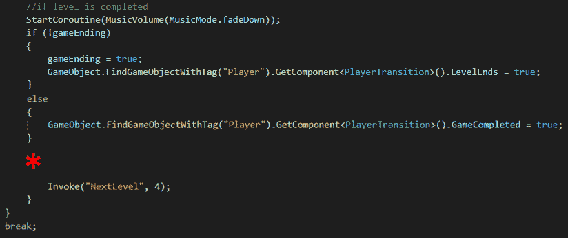

图 11.15 – 在我们的 ScenesManager 脚本中标记了添加新代码的位置

在前面的截图中，有一个星号（`string` 参数，它将是已完成的关卡名称）。

1.  在前面的截图中的 ***** 处输入以下方法名称：

    ```cs
    SendInJsonFormat(SceneManager.GetActiveScene().name);
    ```

1.  接下来，我们需要创建 `SendInJsonFormat` 方法。在 `ScenesManager` 脚本中向下滚动到一个点，我们仍然在其类内部，但不在另一个方法中，并输入以下内容：

    ```cs
      void SendInJsonFormat(string lastLevel)
      {
        if (lastLevel == "level3")
          {
            GameStats gameStats = new GameStats();
            gameStats.livesLeft = GameManager.playerLives;
            gameStats.completed = System.DateTime.Now.ToString();
             gameStats.score = GetComponent<ScoreManager>().             PlayersScore;

            string json = JsonUtility.ToJson(gameStats,true);
            Debug.Log(json);
          }
      }
    ```

在前面的代码中，我们执行以下一系列步骤：

1.  我们有一个 `SendInJsonFormat` 方法，它接受一个 `string` 参数。

1.  在 `SendInJsonFormat` 方法内部，我们设置了一个 `if` 语句，检查 `lastLevel` 字符串是否包含 `level3` 值。

1.  如果 `lastLevel` 等于 `level3` 字符串，我们将在 `if` 语句内部执行以下步骤：

1.  我们创建了一个 `GameStats` 类的实例，该类是在本章早期创建的。

1.  我们访问其 `livesLeft` `public` 变量，并应用来自 `GameManager` 类的静态 `playerLives` 变量。

1.  下一个变量显示了我们完成游戏的日期和时间。我们从 `System` 库中发送命令，该库提供了日期和时间，并将其转换为 `string`（`ToString()`）。我们将此结果发送到 `gameStats` 实例的 `completed` 变量中。

1.  我们发送数据的最后一个变量是玩家的得分。我们从 `ScoreManager` 类的 `playerScore` `static` 变量中获取它。

现在我们已经将三个变量应用到我们的 `gameStats` 实例上，我们可以使用 Unity 的 `JsonUtility` 类将我们的 `gameStats` 发送到 `ToJson` 函数。

我们也可以通过将 `true` 添加到参数中来使 JSON 数据可读，这样当我们向控制台发送 `log` 命令以查看此操作是否正确执行时，我们可以读取结果。

1.  保存脚本，然后回到 Unity 编辑器，并从 `bootUp` 场景完成游戏到 `gameOver` 场景。

以下截图显示了我在玩游戏并完成第 3 级时控制台的日志输出：

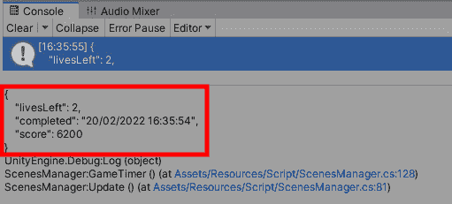

图 11.16 – 显示我们游戏统计信息的控制台窗口

如您所见，我们有来自我们脚本的但以 JSON 格式显示的数据。

此信息可以保存到物理文件，或者可以发送到服务器以记录我们的玩家游戏情况，并在以后的项目中反序列化结果（如果您对此感兴趣，请查看以下提示）。关键是我们在存储和携带数据，这些数据可以被发送出去，供我们或其他系统拾取、存储和修改。

更多信息

到目前为止，我们已经成功从我们的对象中提取变量，并将它们转换为 JSON 数据格式（序列化）。

现在，假设我们更改了我们的数据（更改其值），并希望将那些数据带回到我们的游戏代码和类中。反向方法将是 `GameStats loadJsonData = JsonUtility.FromJson<GameStats>(json);`。

这将更新我们的 `GameStats` 变量，从 JSON 文件中。您可以想象这将方便在游戏中保存和加载数据。

接下来，我们将最新的 JSON 数据文件发送到设备（我们玩游戏的那台机器）。为了创建和存储包含我们自定义统计数据的 JSON 文件，请执行以下操作：

1.  返回到 `ScenesManager` 脚本。

1.  滚动到我们创建的 `SendInJsonFormat` 方法处。

1.  在方法的 `if` 语句的底部，在 `if` 语句的作用域内，添加以下两行代码：

    ```cs
    Debug.Log(Application.persistentDataPath + "/GameStatsSaved.json");
    System.IO.File.WriteAllText(Application.persistentDataPath +
       "/GameStatsSaved.json",json);
    ```

上述代码块显示我们不一定需要添加 `Debug.Log`，并显示了下一行代码创建和存储我们的 JSON 文件的位置。每个平台都会在不同的文件夹中存储数据。有关不同平台的位置信息，请参阅 Unity 关于持久数据的官方文档 [`docs.unity3d.com/ScriptReference/Application-persistentDataPath.html`](https://docs.unity3d.com/ScriptReference/Application-persistentDataPath.html)。

我的系统是 Windows PC，所以 `Debug.Log` 将在我的系统上显示以下位置：


图 11.17 – JSON 文件的 Windows 位置

我们刚刚输入的代码的第二行正在使用系统库，并使用一个函数 (`Application.persistentDataPath`)，该函数将引用我们的设备本地存储。然后，在函数之后，我们添加了我们想要用来引用我们的 JSON 文件的名字 (`/GameStatsSaved.json`)，以及格式类型，即 `json`。

1.  保存脚本。

1.  返回 Unity 编辑器，玩到游戏结束，并前往控制台屏幕上显示的位置。以下截图显示了我们的游戏创建的文件位置：

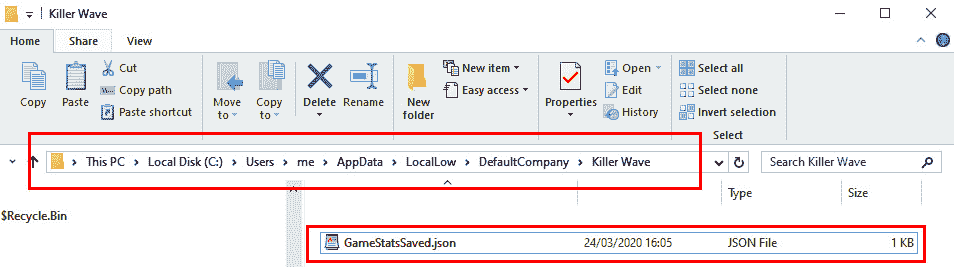

图 11.18 – 我们 JSON 文件的 Windows 位置

1.  双击文件以查看其内容。正如您将看到的，这是我们游戏统计数据存储的地方，如下面的截图所示：

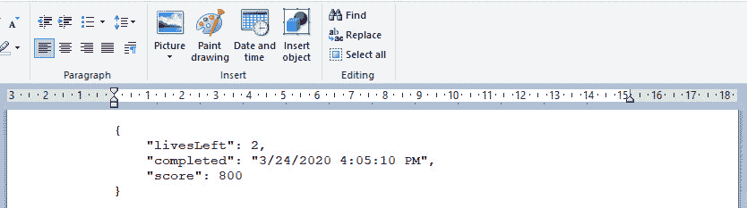

图 11.19 – 我们 JSON 文件的内容

通过这种方式，我们现在知道了如何存储非敏感数据，例如我们的游戏音量 (`PlayerPrefs`)，以及如何创建、存储和发送其他类型的 JSON 格式数据。

现在，让我们总结本章内容。

更多信息

更多关于所有这些事件的信息，请查看官方 Unity 文档 [`docs.unity3d.com/Manual/UnityAnalyticsEvents.html`](https://docs.unity3d.com/Manual/UnityAnalyticsEvents.html)。

# 概述

本章涵盖了各种主题，包括理解 Unity 的音频混音器，这是我们控制游戏中的声音的地方，以及使用我们的脚本调整级别。然后，我们继续前进，探讨了使用`PlayerPrefs`和 JSON 格式的自定义存储来存储数据，以便识别两种存储数据方式之间的差异。对于 JSON，我们将基于对象的数据转换为字节，并将结果存储在文件中（序列化）。

在未来的项目中，你可能会用到我们在前两章中介绍的编码，比如存储和重新应用数据，例如音乐和音效音量滑块。希望你能通过在项目中使用其他组件，进一步利用这些数据，使你的游戏能够将数据发送到云端，并监控玩家的进度，作为有助于改进开发的反馈。

在下一章中，我们将探讨路径查找以及如何提高我们游戏的整体性能。
