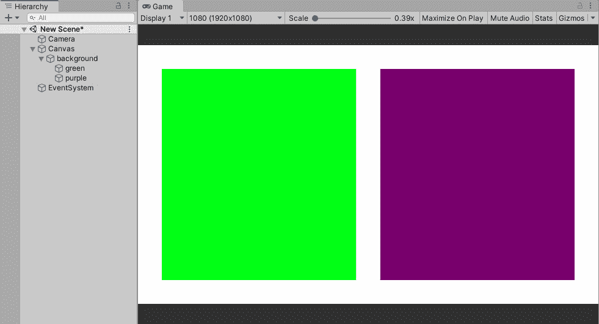

# 第十四章：*第十四章*: 完整 Unity 程序员模拟考试

欢迎参加完整的 Unity 程序员模拟考试。在这里，我们将提供一系列多项选择题，类似于你在本书每几章的结尾所回答的问题。

尽你所能，看看结果如何——目标是答对所有问题。如果你完成了这个模拟考试，你将准备好参加真正的 Unity 程序员考试。如果你因为任何原因答错了一个问题，回到这本书或 Google 上尝试找到答案。尽量避免直接跳到附录中的答案；更多地使用你的知识而不是肌肉记忆。理解问题很重要，这样你才能回答它。这些模拟问题只是你在考试中可能会遇到的问题类型。

我建议至少阅读每一题两次；有时候，考试题目会试图通过问题的措辞来迷惑你。考试还可能通过让你阅读一大段代码来试图消耗你的时间，而这实际上并不是必需的。

考试是计时进行的，但你应该有足够的时间回答每个多项选择题。最好在开始和完成这个模拟考试时留出一些个人时间。如果你遇到困难，可以先跳过问题，稍后再回来。有时候，通过一次解决所有问题，更容易把简单的问题排除掉。如果你仍然有困难，我在每个问题的末尾用括号标出了你可以从中获取更多信息的内容/*附录*。

因此，慢慢来，不要被措辞迷惑，继续前进...如果你喜欢它，那也是一个额外的奖励！

# 完整模拟考试

1.  你们中的一名初级程序员请求一个全局实例，该实例可以在游戏的任何代码中访问。当你有代码可以作为管理器时，哪种设计模式可以满足这一要求？（CH1）

    1.  原型

    1.  抽象工厂

    1.  单例

    1.  构建者

1.  你的开发主管要求你实现每当玩家穿过门口时，门旁边的一盏灯会亮起。你已经编写了一个`OnTriggerEnter()`脚本来启用灯光，并在你的门口上添加了一个带有`Rigidbody`的碰撞器。你的玩家也有碰撞器和`Rigidbody`。当你运行游戏以测试你的代码时，灯光没有亮起。

这个问题的最可能原因是什么？（CH2）

1.  门口的碰撞器没有被标记为触发器。

1.  光游戏对象也需要一个触发器。

1.  你不需要多个`Rigidbody`组件。

1.  门口没有连接到灯光。

1.  哪个函数允许我们从任何方向读取`Vector3`或`Vector2`，但保持其大小仅为一个？（CH7）

    1.  `Normalize()`

    1.  `MoveTowards()`

    1.  `Lerp()`

    1.  `Scale()`

1.  我们已经得到了我们的**游戏设计文档**（**GDD**），在其中，它指出我们的**玩家角色**（**PC**）将需要奔跑和躲避向他们投来的多个海滩球。海滩球可以相互弹跳。场景中还有各种静态道具和一个 PC 抓取健康的触发区域。

在这个场景中，哪些对象至少需要一个`Rigidbody`组件？（CH2）

1.  PC 和海滩球

1.  PC 和不可见健康区域

1.  仅海滩球

1.  海滩球和不可见健康区域

1.  关于海滩球的问题，在我们的项目层碰撞矩阵（**编辑 | 项目设置 | 物理**）中，当它们相互作用时，我们应该检查矩阵中我们的哪个碰撞器的物理？（CH13）

    1.  PC 和海滩球，海滩球和海滩球，以及 PC 和健康区域

    1.  PC 和海滩球

    1.  海滩球和健康区域，海滩球和海滩球

    1.  PC 和健康区域

1.  我们有一个需要支持低性能平板电脑的移动应用程序。在我们的应用程序中，我们将有一个迷你游戏，玩家将能够将无限数量的篮球投向篮筐。然而，只有 10 个篮球在摄像机的视野中。因此，程序员已经这样设计，即使用相同的 10 个篮球而不是在每次投掷时实例化一个新的篮球。

程序员知道用于重用篮球资源的设计模式有一个名称。这个设计模式的名称是什么？（CH1）

1.  抽象工厂

1.  对象池

1.  依赖注入

1.  构建者

1.  你被分配制作一个在应用程序启动时播放音乐的程序。当用户浏览不同的场景时，音乐不会被移除或受到影响，并继续播放。你已经通过创建一个游戏对象并将其添加到播放音乐的脚本中开始了这个程序。

我们还需要做什么来确保我们的音乐继续播放？（CH3）

1.  在起始场景中创建两个包含音乐脚本的游戏对象。

1.  每个场景都需要一个带有脚本的音乐游戏对象。

1.  在音乐脚本中的`Awake`函数中添加`DontDestroyOnLoad(this.gameObject);`。

1.  在每个场景中实例化`music`游戏对象。

1.  在 Unity 的 Cloud Build 中，我们应该检查什么来找到最新的构建？（CH1）

    1.  `cloudBuildTargetName`

    1.  `buildNumber`

    1.  `bundleID`

    1.  `scmCommitID`

1.  我们有一个手势控制的移动游戏，我们希望实现从屏幕的一侧滑动到另一侧来释放事件。

从`Touch`结构测量玩家手指按下位置的最佳方法是什么？（CH13）

1.  `Type`

1.  `Phase`

1.  `deltaPosition`

1.  `fingerId`

1.  我们的首席程序员正在尝试找到一种简单的方法，让我们的飞行模拟器游戏涵盖移动、PC 和游戏控制台的控制。

实现这一点的最简单方法是什么？（CH13）

1.  为每个游戏创建一个支持的项目。

1.  为每个平台创建一个类。

1.  从标准资产导入`CrossPlatformInput`包。

1.  使用`#define`指令为每个可能的平台创建一个自定义输入管理器。

1.  在我们的飞行模拟器中，我们刚刚将水平和垂直控制与`Input.GetAxis("Horizontal")`和`Input.GetAxis("Vertical")`连接起来。游戏设计师指出，控制响应缓慢，我们需要使动作更灵敏。（第二章）

我们需要在输入管理器中更改哪些设置来改进/修正这一点？

1.  **反转**

1.  **灵敏度**

1.  **轴**

1.  **重力**

1.  我们现在正在制作一个横向卷轴平台游戏，我们希望按下*A*按钮时可以跳跃，但我们还希望按下*上箭头键*时也可以跳跃。在输入管理器中，我们在哪里添加第二个跳跃按钮？（第二章）

    1.  正按钮

    1.  负按钮

    1.  负按钮

    1.  正按钮

1.  在我们的平台游戏中，我们注意到玩家可以左右跑动，但当我放下游戏手柄时，我的玩家角色会慢慢向右移动。我相信我需要在输入管理器中更改一个设置，但应该是哪一个？（第二章）

    1.  敏感性

    1.  快照

    1.  重力

    1.  死亡

1.  通常，在键入实例变量名称时，我们使用什么命名约定？（第二章）

    1.  位置表示法

    1.  全大写

    1.  蛇形命名法

    1.  驼峰式命名法

1.  已经为你发布了一个错误修复，游戏设计师在 Unity 编辑器中更改了一个公共`int`变量，并将其设置得太高。这个变量没有理由超过 100。

程序员应该使用哪个属性来限制游戏设计师？（第二章）

1.  `[GUITarget]`

1.  `[TextArea]`

1.  `[范围]`

1.  `[Header]`

1.  你已经被技术负责人分配了一个任务，要存储 800 个**非玩家角色**（**NPC**）预制体。这些预制体中的任何一个都可以被选中并拖放到游戏中四处游荡。这个系统需要对我们设计师友好，理想情况下，所有 NPC 的选择都应该来自**检查器**窗口。还有可能敌人的数量将从最初的 800 个增加。

你将如何准备发布这些 NPC？（第二章）

1.  简单地创建一个脚本，存储一个公共数组，以便容纳每个预制体的创建。

1.  创建一个包含引用预制体的数组的可脚本对象。

1.  创建一个包含私有序列化字段列表的类，该列表包含 NPC 预制体，并且每个 NPC 类在运行时创建一个 NPC 实例。

1.  在运行时创建所有 800+个 NPC 并将它们存储在摄像机视图之外。

1.  如果我们想在更新中某个特定时间计算 Unity 的物理，我们应该在**时间管理器**中更改哪个设置？（第十章）

    1.  允许的最大时间步长

    1.  固定时间步长

    1.  允许的最大粒子时间步长

    1.  时间缩放

1.  哪个碰撞器最有效？（第二章）

    1.  圆柱体

    1.  球体

    1.  网格

    1.  盒子

1.  我们正在模拟一块巨石从天空中坠落，以及一包薯片。我们希望巨石坠落得更快。

我们在哪个游戏对象的`Rigidbody`组件中更改了哪些设置？（第十三章）

1.  减少薯片的重量并增加巨石的阻力。

1.  增加薯片包的角动摩擦系数，并增加巨石的重量。

1.  增加巨石的重量，并减少薯片包的重量。

1.  减少巨石的阻力，并增加薯片包的阻力。

1.  我们会在什么情况下使用触发器而不是仅仅使用碰撞器？（第二章）

    1.  当角色坐在健康区域充电能量时。

    1.  如果两个游戏对象发生碰撞，但我们只想手动设置我们的粒子效果。

    1.  只有在我们需要在运行时更改我们的`Rigidbody`设置时。

    1.  当多个碰撞器是另一个碰撞器的子对象时。

1.  你正在制作一款科幻街机射击游戏。玩家的视角有一个围绕屏幕的 UI 显示，显示有关我们的任务和飞船健康状况的大量重要细节。在屏幕的左下角，我们有一个关于我们飞船状况的 3D 视图。每当飞船受到伤害时，我们可以在 3D 视图中看到结果，以及粒子效果来强调伤害。在 3D 视图中，飞船上每个可能的损伤点都有一个碰撞器，如果导弹击中它，该碰撞器会做出反应。

在测试中，你发现 3D 视图中飞船的敌导弹在应该损坏你的飞船时却从你的碰撞器上弹回。

程序员应该如何解决这个问题，同时保留游戏内对象和 UI 的功能？（第十三章）

1.  在层碰撞矩阵中，关闭 3D UI 飞船层与导弹和小行星层的碰撞。

1.  增加导弹的重量，使其能穿过碰撞器。

1.  在飞船上的所有碰撞器上添加第二个碰撞器，以增加其概率。

1.  在飞船周围添加一个主要碰撞器，以便当导弹击中它时，这将暂时禁用内部的所有碰撞器。

1.  你已经搬了工作室，并加入了一个新的游戏项目，在那里你身处沙漠，保卫堡垒，抵御 6000 头驴子冲来摧毁你的文明。你唯一的防御手段是扔出沉重的湿豆袋来耗尽驴子的体力。为了瞄准每一头驴子，你使用一个射线路径系统，该系统与任何一头驴子的网格碰撞器接触。现在，你的开发主管要求增加至 20000 头驴子以提高难度。你现在开始注意到游戏的性能急剧下降。团队中的每个人都正在努力，以确保所有 20000 头驴子都能进入游戏。

你能做出哪些改变来提高游戏性能？（第二章）

1.  让驴子稍微大一点，以便在环境中占据更多空间。

1.  将网格碰撞器替换为球体碰撞器。

1.  创建一个特殊的驴子层掩码，以便忽略环境中的其余部分。

1.  缩短你的射线路径长度。

1.  永远不要让驴子跑得飞快。

1.  你的团队成员已经为你游戏的某个新部分提交了一个 commit。在这个阶段，建议确保你的整个游戏运行正常。

你的开发主管要求你测试你的游戏。你应该进行哪种测试？（第十三章）

1.  烟雾

1.  集成

1.  回归

1.  系统

1.  你被要求通过创建自定义方法来检查别人的代码的特定部分，以确保返回值是正确的。

有一个特定的测试类型名称，是什么？（CH13）

1.  静态测试

1.  可访问性测试

1.  单元测试

1.  后端测试

1.  单元测试有哪些好处？（CH13）

    1.  它将检查你的全部代码。

    1.  它测试单个“单元”的代码。

    1.  如果定期执行，它只需要测试最新的代码。

    1.  单元测试揭示了函数之间代码的效率。

1.  当使用`MinMaxCurve`时，从性能角度来看哪个属性最节省成本？（CH4）

    1.  优化曲线

    1.  在两个常量之间随机

    1.  在两个曲线之间随机

    1.  常量

1.  以下哪个选项会阻止粒子系统支持过程模式？（CH4）

    1.  禁用循环。

    1.  将`Simulation Space`属性设置为`World`。

    1.  取消勾选`Auto Random Seed`复选框。

    1.  启用碰撞。

1.  一位艺术家找到你，要求你对正在制作的科幻游戏进行视觉上的修改。他要求你随着一系列小行星向行星靠近而逐渐缩小它们。

小行星来自粒子系统发射器；哪个模块适合艺术家的需求？（CH4）

1.  渲染器

1.  纹理表动画

1.  子发射器

1.  生命周期大小

1.  整个开发团队几乎完成了他们的“斯皮特菲尔英国战役”游戏的制作，并希望在每架斯皮特菲尔飞机的后面添加粒子效果作为最后的修饰。

其中一位游戏设计师建议斯皮特菲尔的烟雾应该随机改变以强调风的不稳定性。你已经编程到粒子效果能够检测到风，但你应该对粒子烟雾进行什么操作以显示风正在影响烟雾？（CH13）

1.  在**Rotation by Speed**模块中修改**Angular Velocity**属性。

1.  将`0`设置为。

1.  在**Noise**模块中增加**Strength**属性。

1.  修改**Size**属性在**Size by Speed**模块中的曲线。

1.  在你开发的独立游戏中，你将场景设置得使得环境光照强度乘数设置为`0.75`。当玩家完成关卡并进入下一个场景时，光照被设置为`1.24`。你正在使用`LoadSceneAsync`，其`LoadSceneMode`为累加模式。

当你加载下一个场景时，光强度将被设置为多少？（CH3）

1.  `1.24`

1.  `0.75`

1.  `1`

1.  `0`

1.  你又一次搬了工作室，开始制作一款开放世界游戏，玩家可以在数英里内行走。由于场景可能过于庞大而带来的复杂性，你决定将场景分割成多个部分。当进行场景切换时，玩家将被加载到下一个场景中。

哪个函数允许我们使游戏对象移动到另一个场景？（CH3）

1.  `CreateScene()`

1.  `MoveGameObjectToScene()`

1.  `MergeScenes()`

1.  `SetActiveScene()`

1.  当涉及到存储数据时，对于`PlayerPrefs`来说，哪种选择更可能？（第十一章）

    1.  购买信息

    1.  监视器分辨率设置

    1.  用户电子邮件地址

    1.  登录密码

1.  你可以在不模拟（本地）的情况下保存哪种类型的变量到`PlayerPrefs`？（第十一章）

    1.  浮点数

    1.  双精度

    1.  枚举

    1.  数组

1.  当序列化数据到设备的本地磁盘空间时，你会使用哪个系统命名空间？（第十一章）

    1.  Linq

    1.  IO

    1.  数据

    1.  集合

1.  在我们科幻游戏的最后，我们将所有统计数据以 JSON 格式从`PlayerStats`类保存到本地磁盘空间。但当我们想要从存储中检索 JSON 文件时，我们应该用什么来替换缺失的间隔？（第十一章）

`JsonUtility.FromJson<____>(stringFromFile);`

1.  `StatsInfo`

1.  `String`

1.  `Array`

1.  `PlayerStats`

1.  当从互联网检索图像时，我们使用哪个 UI 组件来显示结果？（第九章）

    1.  画布

    1.  原始图像

    1.  图片

    1.  面板

1.  哪个 UI 组件将一系列 UI 元素按固定距离排列成一行？（第九章）

    1.  垂直布局组

    1.  水平布局组

    1.  网格布局组

    1.  画布组

1.  我们已经使我们的游戏能够从 Unity 仪表板的远程设置部分更新几个统计数据。

我们可以使用以下哪些值？（第十一章）

1.  `Char`

1.  `string`

1.  `List`

1.  `UInt16`

1.  以下哪个平台可以使用 Unity Analytics？（第十一章）

    1.  PS4

    1.  科摩多阿米加 500

    1.  安卓

    1.  Xbox

1.  当你将你的游戏连接到 Unity Analytics 时，哪个事件会自动开始提供每日报告？（第十一章）

    1.  核心事件

    1.  标准事件

    1.  自定义事件

    1.  交易事件

1.  在我们的**第一人称射击**（**FPS**）游戏中，我们刚刚连接了我们的海军陆战队员的空间大炮的有限状态机，以便发射弹丸。

当大炮开火时，会有砰的一声巨响，粒子效果从大炮中喷涌而出，并且发射出光束。

目前，光束唯一能接触到的只有墙壁，它上面附着了一个碰撞器。

当光束击中墙壁时，当表面撞击时还会触发另一个粒子。在这场爆炸中，我们缩小然后摧毁光束。

我们应该在哪个事件中期待光束被摧毁？（第四章）

1.  `OnStateExit`

1.  `OnStateEnter`

1.  `OnStateMove`

1.  `OnStateUpdate`

1.  你正在为 SWAT 团队游戏原型化一个第三人称角色，我们需要让一些基本控制开始运行。我们的角色目前设置为在所有方向上奔跑、倾斜和射击。理想情况下，我们希望我们的角色可以射击和跳跃，或者射击和倾斜。目前，我们的基础移动设置为**覆盖混合**，而其他层设置为**添加混合**。

应该按什么顺序设置动画层？（第四章）

1.  射击、倾斜、基础移动

1.  基础移动、射击、倾斜

1.  倾斜、基础移动、射击

1.  射击、基础移动、倾斜

1.  我们有一个玩家从站立到蹲下的动画。我们希望每个动画之间的动画正好持续 0.8 秒。

在动画过渡中，我们需要关注哪些属性？（第四章）

1.  过渡持续时间和过渡偏移量

1.  固定持续时间和过渡持续时间

1.  有退出时间和固定持续时间

1.  有退出时间和退出时间

1.  当涉及到在 Unity 中动画化面部时，哪个混合树是最好的？（CH4）

    1.  2D 自由形式笛卡尔

    1.  直接

    1.  2D 简单方向

    1.  1D

1.  在你最新的独立游戏开发中，你一直专注于动画控制器的过渡。你的过渡顺序如下：

    1.  闲置到哭泣

    1.  闲置到跳过

    1.  闲置到打喷嚏

    1.  闲置到笑

你的动画过渡属性设置为以下内容：

+   中断来源：**当前状态**

+   有序中断：**勾选**

你当前的过渡设置为**跳过**。在运行时，你的角色已经开始跳过，但作为测试者，你也按下了所有四个按钮来触发每个动画状态。

哪个过渡将具有优先级？（CH4）

1.  闲置到笑

1.  闲置到打喷嚏

1.  闲置到哭泣

1.  闲置到跳过

1.  你正在创建一款**第一人称射击游戏**（**FPS**），你现在正在处理玩家的相机，并确保当玩家靠近时，他们的武器不会穿过物体。

所有玩家的武器都设置在一个名为**FPS**的层上。然后你设置相机的剔除遮罩以查看除了**FPS**层之外的所有内容。

接下来，你创建第二个相机，并将其剔除遮罩设置为仅渲染**FPS**层，其清除标志设置为？（CH9）

1.  深度仅

1.  实色

1.  不清除

1.  天空盒

1.  作为一名热情的独立开发者，你决定制作游戏“沙漠巴士”的精神续作。你几乎完成了游戏开发，并决定添加一些优化。你决定让任何较小的 3D 资产，如小石子、小植物和昆虫，在远距离时不渲染，只有在近距离时才渲染。无论我们离它们有多远，我们都应该仍然能看到较大的资产。

你会用哪个相机属性来帮助实现这一点？（CH2）

1.  `farClipPlane`

1.  `layerCullDistances`

1.  `cullingMatrix`

1.  `useOcclusionCulling`

1.  当编写自定义卡通阴影边缘检测效果脚本时，相机的`DepthTextureMode`应该设置为多少？（*附录*）

    1.  无

    1.  `DepthNormals`

    1.  `MotionVectors`

    1.  `Depth`

1.  我们目前正在开发一款游戏，我们的玩家可以通过 Unity 的主相机看到，并且具有临时放大的能力。

我们相机的哪个属性允许我们放大？（CH2）

1.  `targetDisplay`

1.  `aspect`

1.  `lensShift`

1.  `fieldOfView`

1.  你在你的游戏中引入了多人分屏模式。你现在正在将屏幕分为两行。

程序员应该如何设置相机的视口矩形选项？（CH2）

1.  设置两个相机的`1`和`0.5`。设置玩家 1 的`0.5`和玩家 2 的**Y**为 0。

1.  设置两个相机的`1`。设置玩家 1 的`0.5`和玩家 2 的`1`。设置两个相机的`0.5`。

1.  设置两个相机的`0.5`和`1`。设置玩家 1 的`1`和玩家 2 的`0.5`。

1.  设置两个相机的`1`和`0.5`。设置玩家 1 的`1`和玩家 2 的`0.5`。

1.  我们的游戏出现了一些冲突，因此作为预防措施，我们需要加强安全性。以下是一个代码示例：

    ```cs
    public class SuperFox : MonoBehaviour
         {
              public float superAttack = 1f;
              public float superFly = 5f;     
         }
    ```

最好的方法来保持这两个变量安全是什么？没有其他类使用它们，但我们需要从检查器中访问它们以供游戏设计师使用。

1.  将访问修饰符从`public`更改为`private`。

1.  将访问修饰符从`public`更改为`private`并添加`[SerializeField]`属性。

1.  将访问修饰符更改为`private`并为其提供`get`和`set`访问器

1.  `public`本身就足够安全；它只是几个浮点数

1.  我们有一个基于物理的对象，我们希望它围绕一个特定的点旋转，比如门。

哪种类型的关节将允许这种类型的运动？（CH2）

1.  角色

1.  固定

1.  轴承

1.  弹簧

1.  我们从一个艺术家那里得到了一个灯具资产，他们要求我们在游戏中使灯具的光闪烁。

我们需要在脚本中操作我们灯光的哪个属性来实现闪烁效果？（CH2）

1.  `Mode`

1.  `spotAngle`

1.  `range`

1.  `intensity`

1.  你正在测试一个场景并向其应用不同的灯光。在场景中，你有一系列游戏对象：

    +   装饰灯

    +   太阳

    +   一辆警示灯亮着的汽车

    +   一个车库

车停在车库中。车库内部周围是装饰灯，阳光透过车库门照射进来。

你已经启用了全局光照以增加太阳的真实感。尽管这看起来很令人印象深刻，但你的场景现在占用了大量的内存使用。

我们如何保持场景看起来令人印象深刻，同时继续保持低内存使用？（CH13）

1.  将阳光设置为`0`。

1.  将灯光的**光照模式**更改为**烘焙**。

1.  将装饰灯设置为`0`，即汽车的警示灯。

1.  在**光照**设置中禁用**实时全局光照**。

1.  一个艺术家要求我们使用脚本将霓虹灯的发光从红色改为蓝色。

我们可以使用哪个属性来改变我们标志的发光？（CH4）

1.  `_EmissionColor`

1.  `_Color`

1.  `_SrcBlend`

1.  `_EmissionMap`

1.  你被要求向一个闪亮的走廊添加一个反射的玻璃球效果，该走廊有大型、开阔的白色银色窗户。建筑外面是一个明亮、阳光明媚的背景，草地、灌木丛和树木都应用到了天空盒中。走廊包含一系列反射探针。

应该在走廊的**网格渲染器**组件上使用哪个反射探针选项来创建一个闪亮的反射表面？（CH13）

1.  简单

1.  混合探针和天空盒

1.  混合探针

1.  关闭

1.  我们的走廊地板因为反射探针而看起来闪亮且具有反射性。我们还注意到墙壁似乎与反射地板不同步。

我们需要更改关于我们的反射探针的哪个设置来解决这个问题？（CH13）

1.  启用盒子投影

1.  提高分辨率

1.  提高重要性

1.  启用 HDR

1.  您的艺术家为雪地级别创建了 3D 资产，并尝试使用之前游戏中的资产。艺术家制作了一个木屋，并将该资产放入游戏中。整体场景看起来很棒，但场景中的整体颜色并不协调。

我们后期处理堆栈中的哪个属性可以帮助使场景中的颜色统一，从而给我们的资产带来整体冰冷的视觉效果？（CH13）

1.  用户 LUT

1.  粒子

1.  色差

1.  暗角

1.  我们有一个技术演示，玩家在科幻走廊中行走，阳光透过窗户照进来，照亮了走廊。我们已经从我们的后期处理堆栈中应用了光晕效果。我们希望走廊中的某些游戏资产能够像光晕效果预期的那样发光和闪烁。一位艺术家通知你，所有艺术资产都有发射贴图，但它们的级别各不相同。

我们需要改变哪个属性才能使我们的光晕效果覆盖低级别的发射贴图？（CH13）

1.  减少阈值

1.  增加强度

1.  减少软膝盖

1.  增加半径

1.  在运行时，哪个函数可以将两种材质从一种过渡到另一种？（CH9）

    1.  `SetColor`

    1.  `Lerp`

    1.  `SetFloat`

    1.  `EnableKeyword`

1.  我们正在制作一款第一人称生存恐怖游戏。玩家在走动时有一个手电筒，用于在鬼屋周围行走。我们的设计师要求手电筒的末端在投射到的表面上产生玻璃图案。

哪个光属性将支持设计师的要求？（CH2）

1.  `cullingMask`

1.  `cookie`

1.  `spotAngle`

1.  `type`

1.  您的 PC VR 游戏开发已达到终点。您目前将 Camera 组件的**渲染路径**设置为**前向**。

以下哪个后期处理属性有助于降低使用 VR 应用程序时的恶心风险？（*附录*）

1.  景深

1.  部分乘法

1.  饱和度

1.  抗锯齿

1.  在开发 VR 游戏时，开发者应该针对多少光子延迟的运动水平来欺骗玩家的思维，使他们认为自己身处另一个地方？（*附录*）

    1.  80

    1.  20

    1.  35

    1.  50

1.  我们正在开发一个移动 VR 游戏，其中包含单色材料和未照明着色器的艺术资产。此外，我们的相机组件的渲染路径设置为前向。

哪个抗锯齿设置可以改善游戏视觉效果，但可能不会影响性能，使其处于不可玩的状态？（*附录*）

1.  4x 多采样

1.  8x 多采样

1.  12x 多采样

1.  禁用

1.  Unity 编辑器中的哪个窗口将提供我们项目的绘制调用列表，并允许我们逐帧遍历它？（CH13）

    1.  分析器

    1.  帧调试器

    1.  服务

    1.  统计

1.  我们创建了一个 VR 游戏，我们的玩家在一个有锁的门房间里，门无法打开。房间里有一扇窗户，外面是一片草地，远处有山脉。

玩家场景中的所有内容都是 3D 建模和纹理化的，还有一个单向光源。

当玩家走向窗口时，由于绘制调用激增，游戏开始出现卡顿。

我们如何提高我们游戏的表现力？（附录）

1.  移除远处的 3D 模型，并用渲染的天空盒替换它们。

1.  在**纹理导入设置**中禁用**生成 Mip Maps**，对所有远处的纹理进行设置。

1.  添加灯光。

1.  为了帮助减轻 VR 中的恶心感，开发者需要为他们的游戏设定多少**每秒帧数**（**FPS**）？（附录）

    1.  90 FPS

    1.  30 FPS

    1.  60 FPS

    1.  75 FPS

1.  在**帧调试器**窗口中，开发者选择游戏对象几何形状的绘制调用。

在哪个窗口中对象被突出显示？（第十三章）

1.  曲线编辑器

1.  项目

1.  层级

1.  控制台

1.  设计师想要更改您游戏角色的脚本参数，并将它们本地保存到磁盘上。

什么是最安全且最简单的方法给设计师访问权限？（第十一章）

1.  将数据作为公共变量存储在**MonoBehaviour**中。

1.  将数据保存在 ScriptableObject 中。

1.  将数据保存在 PlayerPrefs 中。

1.  创建一个带有游戏可以读取的 API 的 Web 服务。

1.  如果我们正在编写依赖于特定组件的脚本，我们应该添加哪个属性？（第二章）

    1.  `[Include]`

    1.  `[Range]`

    1.  `[SerializeField]`

    1.  `[RequireComponent]`

1.  哪种方法会返回一个`Touch`结构体？（第十三章）

    1.  `GetKeyDown()`

    1.  `touchSupported`

    1.  `Input()`

    1.  `GetTouch()`

1.  关于`Input`类，`GetMouseButtonUp`和`GetMouseButton`之间有什么区别？（第十三章）

    1.  如果鼠标按钮被按下，`GetMouseButton`将返回`true`，而`GetMouseButtonUp`将在鼠标按钮释放的帧中仅返回`true`一次。

    1.  `GetMouseButton`将返回一个`Int`，指示哪个鼠标按钮被按下，而`GetMouseButtonUp`如果任何鼠标按钮被按下，将返回`true`。

    1.  如果鼠标已连接，`GetMouseButton`将返回`true`，而`GetMouseButtonUp`将在鼠标按钮按下时返回`true`。

    1.  `GetMouseButton`将返回一个包含可用鼠标按钮的数组，而`GetMouseButtonUp`将返回一个索引，指示哪个鼠标按钮被按下。

1.  我们如何通过粒子系统提高性能？（第四章）

    1.  减少粒子的数量和大小，以减少屏幕上需要 alpha 混合的像素数。

    1.  增加粒子寿命，以便在内存中重用更多粒子而不是生成新的粒子。

    1.  减慢粒子的速度，以减少所需的物理更新次数。

    1.  在两个曲线之间而不是两个常量之间随机化属性，以减少需要生成的随机数的数量。

1.  以下哪种方法对于屏幕顶部的生命条来说是最理想的？（第八章）

    1.  `Horizontal`

    1.  `Radial90`

    1.  `Radial180`

    1.  `Span`

1.  你正在开发一个第三人称游戏，你的玩家将与其他角色互动和交谈。你目前正在开发当玩家在 3D 世界中交谈时出现在他们头顶上的语音框。

哪个画布属性最适合用于 3D 环境中的语音？（CH13）

1.  屏幕空间相机

1.  像素完美

1.  世界空间

1.  屏幕空间叠加

1.  哪个适合正交相机的使用？（CH9）

    1.  第一人称玩家视角

    1.  一个显示游戏世界概览的地图界面

    1.  一个 3D 空间战斗

    1.  一个敌人 AI

1.  我们正在开发一款所有玩家和 NPC 都基于户外的策略游戏。你需要创建一个昼夜循环，因此在你的场景中，你有一个天空盒和一个方向性光源。

你将如何实现这一点？（CH2）

1.  旋转方向性光源。

1.  调整方向性光源的阴影设置。

1.  更新 TimeManager 设置。

1.  切换天空盒。

1.  以下哪个会改变单个物体的材质属性？（CH4）

    1.  `Renderer.shader`

    1.  `Renderer.instance`

    1.  `Renderer.material`

    1.  `Renderer.sharedMaterial`

1.  创建发光熔岩湖的最佳方法是什么？（CH4）

    1.  为熔岩创建一个自发光纹理，并在材质上动画化 UV。

    1.  创建一个屏幕空间着色器，将熔岩效果应用到所需区域。

    1.  在熔岩移动的区域添加数十个点光源。

    1.  创建一个粒子效果来模拟熔岩的运动。

1.  我们的游戏有一个过场动画，我们希望它在特定的音量级别播放音乐。

实现这一点的最佳方法是什么？（CH10）

1.  当游戏播放过场动画时，切换到不同的音频混音快照。

1.  当过场动画开始时，更改播放音乐的音频源的音量，并附加一个脚本组件以消除高频。

1.  当过场动画开始时，在游戏区域周围应用混响区域。

1.  当过场动画开始时，将更改应用到玩家存储的音量控制`PlayerPrefs`中。

1.  一个用于低性能机器的 VR 游戏使用前向渲染路径。以下哪个选项可以在帧率略有下降的情况下提高游戏的整体视觉效果？（CH13）

    1.  抗锯齿

    1.  实时反射探针

    1.  延迟渲染

    1.  聚光灯

1.  你开发了一个移动应用，它从一个用户可以配置其体验的 UI 开始。一旦配置完毕，应用就进入 VR 模式。

我们如何让这个应用一开始就以非 VR 模式启动？(*附录*)

1.  在场景中放置一个相机并将其 FOV 设置为 null。

1.  将构建平台改为 PC 而不是 VR 平台。

1.  在游戏开始时将`Time.timeScale`设置为 0，并在第一帧渲染后添加一个脚本以搜索 VR 设备。

1.  将`None`添加到 VR SDK 列表的顶部。

1.  如果 VR 设备以 90 Hz 渲染，延迟应该低于多少毫秒？(*附录*)

    1.  11

    1.  12

    1.  13

    1.  14

1.  你开发了一个 VR 游戏，你的测试人员报告说游戏在某些部分卡顿。你的相机的渲染路径设置为前向（Forward）。你决定在运行时不重新分配眼纹理的内存，以避免任何其他性能冲突。

如果检测到帧率下降，我们可以在我们的`XRSetting`类中设置一个属性来帮助解决这个问题。

哪个属性最有效？（*附录*）

1.  `occlusionMaskScale`

1.  `eyeTextureResolutionScale`

1.  `renderViewportScale`

1.  `useOcclusionMesh`

1.  你正在做一个包含几个脚本的个人小项目。你打开其中一个脚本，将其公共列表（List）改为私有。你保存了脚本，现在在控制台窗口中遇到了`NullReferenceExeception`异常。

根据你提供的信息，什么原因导致了这个错误发生？

1.  私有（private）需要首字母大写。

1.  原始的公共列表（List）不能再从其他脚本中访问。

1.  很可能是一个错误，需要报告。

1.  有拼写错误。

1.  在下面的屏幕截图中，我们有一个包含单独图像组件的场景。两个彩色方块的比例完美：

![Figure 14.1 – 问题 92 的屏幕截图]



Figure 14.1 – 问题 92 的屏幕截图

哪个单一组件可以如此完美地填充这两个图像组件？

1.  水平布局组（Horizontal Layout Group）。

1.  单个组件无法实现。

1.  将方块放大并手动对齐。

1.  在白色背景上应用 3D 四边形，并用顶点捕捉围绕它们绘制。

1.  我们今天正在做一些用户界面（UI）的工作。我们被要求制作一个进度条，它将从底部开始填充，一直移动到顶部。

哪些属性一开始看起来是正确的？

```cs
progressChargeBar = GetComponent<Image>();
progressChargeBar.fillMethod = Image.FillMethod.Vertical;
progressChargeBar.fillAmount = 0;
progressChargeBar.type = Image.Type.Filled;
```

```cs
progressChargeBar = GetComponent<Image>();
progressChargeBar.fillMethod = Image.FillMethod.Radial180;
progressChargeBar.fillAmount = 100;
progressChargeBar.type = Image.Type.Simple;
```

```cs
progressChargeBar = GetComponent<Image>();
progressChargeBar.fillMethod = Image.FillMethod.Horizontal;
progressChargeBar.fillAmount = 50;
progressChargeBar.type = Image.Type.Sliced;
```

```cs
progressChargeBar = GetComponent<Image>();
progressChargeBar.fillMethod = Image.FillMethod.Vertical;
progressChargeBar.fillAmount = 0;
progressChargeBar.type = Image.Type.Tiled;
```

1.  同事请求帮助，他们的公交车原型运行缓慢。

这里是代码的一个示例：

```cs
public class BusRacer : MonoBehaviour
{
     public int playerCount;
     public Bus smallBus;
     private void Start()
     {
          CreateAndPlaceBus();
     }
     private void Update()
     {
          Bus[] buses = FindObjectsOfType<Bus>();
          foreach (Bus b in buses)
          {
               b.Drive();
          }
     }
     private void CreateAndPlaceBus()
     {
          for (int i = 0; i < playerCount; i++)
          {
               var busDriver = 
               Object.Instantiate(smallBus);
               busDriver.transform.position =
               StartingPosition();
          }
     }
     private Vector3 StartingPosition()
     {
          //TODO Needs filling with content
          return Vector3.zero;
     }
}
public class Bus : MonoBehaviour
{
     public void Drive()
     {
          //TODO drive fast
     }
}
```

你能看出前述代码中导致性能问题的原因吗？

1.  将`FindObjectsOfType`从`Update`中移除，并在`Start()`中缓存一次。

1.  将游戏中的公交车数量减少作为你的主要任务。

1.  代码看起来没问题，所以检查场景中的资源（纹理、多边形数量等）。

1.  `Drive()`为空，导致内存泄漏。

1.  以下脚本已被分配给你，需要重构为“MVC”模式。如果你不了解模型-视图-控制器（Model View Controller）模式，它包括将你的项目分割成：

    +   模型（Data，换句话说，变量）

    +   视图（Interface/Detection，换句话说，UI）

    +   控制器（Decision/Action，换句话说，`transform.rotation` / `transform.position`）

这里是代码的一个示例：

```cs
public class DrunkenMaster : MonoBehaviour
{
     private string talk;
     private float drinkMeter;
     private Vector2 location;
     private float runSpeed;
     private float punchStrength;
     private float kickStrength;
     private float rolyPolySpeed;
     public MeshRenderer mesh;
     public TextMesh label;
     public void Update()
     {
          //Get Input
          float kickForce = 
          Input.GetAxis("KickForce");
          float punchForce = 
          Input.GetAxis("PunchForce");
          float rolyPolyForce = 
          Input.GetAxis("RolyPolyForce");
          //set drunk strength
          punchStrength = Mathf.Clamp(punchStrength - 
          punchForce, 0, 120);
          kickStrength = Mathf.Clamp(kickStrength + 
          kickForce, -45, 45);
          rolyPolySpeed = Mathf.Clamp(rolyPolySpeed - 
          rolyPolyForce, -45, 45);
          //update position and drunken monkey skills
          transform.position = new Vector3(location.x, 
          drinkMeter, location.y);
          transform.rotation = 
          Quaternion.Euler(Vector3.forward);
          transform.Rotate(Vector3.up, punchStrength, 
          Space.Self);
          transform.Rotate(Vector3.forward, 
          rolyPolySpeed, Space.Self);
          transform.Rotate(Vector3.right, 
          kickStrength, Space.Self);
          //apply abuse UI
          label.text = talk;
     }
}
```

话虽如此，你认出这段代码中哪一部分需要重构以适应模型（Model）？

1.  变量

1.  `Update`函数中的内容

1.  `Label.text = talk`

1.  以上都不是

1.  我们有一个游戏，场景设定在夜晚，在一个巷子里，燃烧的油桶周围是无家可归的人，他们用双手取暖。

其中一位技术艺术家向您提出请求，希望改变火焰发光的过程。她要求火焰从火焰底部开始为绿色，中间为蓝色，顶部为黄色。然而，这是技术艺术家第五次要求进行颜色渐变更改了！

重要提示

为了刷新您对粒子模块的知识，请查看以下链接：[Unity 官方文档 - ParticleSystem.ColorOverLifetimeModule](https://docs.unity3d.com/ScriptReference/ParticleSystem.ColorOverLifetimeModule.html)。

您的更改必须通过脚本完成（根据您的老板的要求），而不是在检查器窗口或任何形式的拖放方法中。

选择您将用于更改粒子系统颜色过程的选项：

1.  创建一个颜色数据类型，并将整个桶状粒子系统的变量存储在其中作为`Color` `burningFlames = flamingBarrel.ColorOverLifeTime.color`。

1.  将控制粒子系统颜色渐变的粒子系统模块缓存为`ParticleSystem.ColorOverLifetimeModule flameStored = flamingBarrel.colorOverLifetime;`。

1.  忘记那个脚本吧！使用预制体——她可以自己做到这一点！

1.  这一切都是关于影响颜色的粒子速度，例如`Color burningFlames = flamingBarrel.colorBySpeed.color;`。

1.  有代码是为随着时间的推移饮用的水编写的。我们的协程正在检查直到没有水为止。

这里是代码的示例：

```cs
     public float waterMeasurements = 10f;
     private void Start()
     {
          StartCoroutine(CheckWaterDrank());
     }
     private void Update()
     {
          //Drinking Water
          waterMeasurements -= Time.deltaTime;
     }
     IEnumerator CheckWaterDrank()
     {
          bool AnyWaterLeft()
          {
               return waterMeasurements <= 0;
          }
          //ADD NEW CODE HERE...
          Debug.Log("No water left");
     }
```

IEnumerators 需要一个返回类型。我们应该给它什么返回类型才能在正确的时间触发日志？

1.  `yield return new WaitUntil(AnyWaterLeft);`

1.  `yield return new WaitWhile(AnyWaterLeft);`

1.  `return null;`

1.  `yield return new WaitForSeconds(null);`

其他信息

为了进一步帮助您回答这个问题，请查看 Unity 官方脚本参考页面上的以下链接：

[Unity 官方文档 - WaitUntil](https://docs.unity3d.com/ScriptReference/WaitUntil.html)

[Unity 官方文档 - WaitWhile](https://docs.unity3d.com/ScriptReference/WaitWhile.html)

1.  您的团队已经为他们的客户开发了一个应用程序。客户审查了工作，非常喜欢，但希望对横幅和背景颜色进行一些修改。这可以很容易地实现，无需添加或更改任何额外的代码。您的团队中的艺术家已经提出应用这些新更改。

    其他信息

    **单元测试** – 测试每个单独的代码片段（脚本/类）

    **集成测试** – 将单元组合在一起并确保没有引入错误

    **验收测试** – 客户检查代码/项目是否符合他们的要求

    **回归测试** – 检查是否引入了新的错误

除了一个之外，所有测试都已完成；根据提供的信息，哪个测试与客户接受这项工作相似？

1.  接受测试

1.  集成测试

1.  单元测试

1.  回归测试

1.  以下代码在我们的游戏中生成吸血鬼蝙蝠。当蝙蝠进入光束时，它将被销毁。每个蝙蝠类都包含一个名为`CheckForLight()`的函数，并返回一个`bool`。

下面是代码的一个示例：

```cs
using System.Collections.Generic;
using UnityEngine;
public class VampireBats : MonoBehaviour
{
     public GameObject batPrefab;
     public float spawnRate = 10f;
     private float timer = 0f;
     private List<Bat> bats;
     private void Start()
     {
          bats = new List<Bat>();
     }
     private void Update()
     {
          timer += Time.deltaTime;
          if (timer > spawnRate)
          {
               SpawnBats();
          }
     }
     private void SpawnBats()
     {
          timer -= spawnRate;
          GameObject spawnedBat = 
          Instantiate(batPrefab, transform);
          Bat batToAdd = 
          spawnedBat.GetComponent<Bat>();
          bats.Add(batToAdd);
     }
     public void BeamOfLight()
     {
          //NEW CODE TO ADD
     }
}
```

`BeamOfLight()`函数将执行以下操作：

+   检查与`VampireBats`脚本相关的每个蝙蝠。

+   从蝙蝠的`CheckForLight`函数获取返回的`bool`值。

+   如果为`true`，则删除蝙蝠的引用（从列表中移除）并从游戏中移除它。

哪个`for`循环可以解决这个问题？

```cs
          for (int i = bats.Count - 1; 1 >= 0; i--)
          {
               if (bats[i].IsInTheLight())
               {
                    monsters.Remove(bats[i]);
                    Destroy(monsters[i].gameObject);
               }
     }
```

```cs
              for (int i = 0; i < bats.Count; i++)
          {
               if (bats[i].IsInTheLight())
               {
                    bats.Remove(bats[i]);
                    Destroy(bats[i].gameObject);
               }
          }
```

```cs
              for (int i = 0; i < bats.Count; i++)
          {
               Bat thisBat = bats[i];
               if (bats[i].IsInTheLight())
               {
                    bats.Remove(thisBat);
                    Destroy(thisBat.gameObject);
               }
          }
```

```cs
           for (int i = bats.Count - 1; i >= 0; i--)
          {
               Bat thisBat = bats[i];
               if (bats[i].IsInTheLight())
               {
                    bats.Remove(thisBat);
                    Destroy(thisBat.gameObject);
               }
          }
```

1.  以下代码在 Unity 编辑器中运行良好，但在构建中会出错。

下面是代码的一个示例：

```cs
public class CoinCounter : MonoBehaviour
{
     private bool init;
#if UNITY_EDITOR
     public int CoinCollection { get; private set; }
#else
     CoinCollection = 1;
#endif
     public void Count()
     {
          CoinCollection += 1;
          init = true;
     }
     public void Reset()
     {
#if UNITY_EDITOR
          if (init)
          {
               CoinCollection = 0;
          }
#endif
     }
}
```

构建中错误的原因是什么？

1.  游戏在编辑器中运行良好；可能是系统有问题。

1.  代码中空格太多。

1.  `CoinCollection`仅在`UNITY_EDITOR`指令中定义。

1.  `Reset`函数没有被调用。

1.  当我们保存以下代码时，控制台会生成一个错误：

    ```cs
    using System.Collections.Generic;
    using UnityEngine;
    public class GameManager : MonoBehaviour
    {
         public static GameManager Instance
         {
              get;
              private set;
         }
         private List<GameObject> objectsInTheScene;
         public void Bucket(GameObject go)
         {
              objectsInTheScene.Add(go);
         }
    }
    public class AnotherDumbClass : MonoBehaviour
    {
         private void Start()
         {
              GameManager.Bucket(gameObject);
         }
    }
    ```

    额外提示

    如果不知道答案，尝试将代码复制粘贴到空脚本中，看看是否可以尝试解决问题。

你认为错误的原因是什么？

1.  需要一个对象引用来访问非静态字段、方法或属性，例如`GameManager.Bucket(GameObject)`。

1.  `Bucket`没有与 Bitbucket 连接。

1.  `Start`不能是`private`。

1.  没有生成错误。

1.  以下代码是一个触摸屏游戏的代码，其中玩家将布丁派投向对手的脸。已经要求当玩家将手指从屏幕上移开时发射派。

以下是一个代码示例：

```cs
using UnityEngine;
public class StartGame : MonoBehaviour
{
     private void Update()
     {
          WaitingForTouch();
     }
     private void WaitingForTouch()
     {
          if (Input.touches.Length > 0)
          {
               Touch touch = Input.GetTouch(0);
               if (/* ENTER CODE HERE */)
               {
                    LaunchCustardPieInTheirFace();
               }
          }
     }
}
```

应该将哪段代码输入到`if`语句的条件中？

1.  `If (touch.phase == TouchPhase.Ended)`

1.  `if (ALT+CTRL+DEL)`

1.  `if (touch.phase == TouchPhase.Begin)`

1.  `if(Input.GetFinger == null)`

1.  当场景在 Unity 编辑器中运行时，你按下键盘上的*空格键*，并观察到`points`变量在增加时给出不一致的点数。

下面是代码的一个示例：

```cs
using UnityEngine;
public class ZoomPacer : MonoBehaviour
{
     public int points;
     private void FixedUpdate()
     {
          if (Input.GetKeyDown(KeyCode.Space))
          {
               points++;
          }
     }
}
```

什么可以帮助缓解这个问题？

1.  将`FixedUpdate`改为`Update`，因为`Update`在每一帧都会被调用以进行检查。

1.  每次按下*空格键*时触发一个事件。

1.  将`points`数据类型从`int`改为`float`。

1.  为每个*空格键*的按下设置一个时间延迟，以便在每次按下后冷却。

1.  我们被要求创建一个基本原型，其中一辆车撞到墙上并弹回，使用刚体物理。

带有它们的组件的 GameObject 被检查并正确设置，但似乎代码有问题，因为汽车直接穿过墙壁而没有发生碰撞反应。

下面是代码的一个示例：

```cs
using UnityEngine;
public class Car : MonoBehaviour
{
     public float wallImpactForce = 88f;
     private void OnTriggerEnter(Collider other)
     {
          Rigidbody rb = 
          other.GetComponent<Rigidbody>();
          rb.AddForce(Vector3.up * wallImpactForce);
     }
}
```

导致汽车穿过墙壁的原因是什么？

1.  在`AddForce`参数中添加`ForceMode.Impuse`。

1.  减少汽车的质量。

1.  增加驾驶员的质量。

1.  减少项目的 timestep。

1.  你在一个团队中工作，团队成员技能不同，可能需要处理相同/类似的文件。在以下列表中，哪一项对团队最有帮助？

    1.  预制件

    1.  版本控制

    1.  离线复制文件

    1.  每个人都在单独的文件夹中工作

1.  以下代码是代表系统的一部分，其中一段代码可以订阅。然而，在检查器中公开代表是不可能的。

以下是一个代码示例：

```cs
     public delegate void EatFood();
     public EatFood onTriggerFood;
     void OnEnable()
     {
          onTriggerFood += Apple;
     }
     void OnDisable()
     {
          onTriggerFood -= Apple;
     }
     void Start()
     {
          onTriggerFood.Invoke();
     }
     void Apple()
     {
          Debug.Log("MUNCH");
     }
```

什么可以作为良好的等效替代品，并在 **检查器** 中公开其字段？

1.  在 `scripts` 类上方添加 `System.Serializable`。

1.  用 Unity 事件系统替换代表。

1.  将代表设为私有，并给它们添加 `SerializeField` 属性。

1.  这不可能完成。

1.  我们正在制作一个包含多个级别的游戏。每个级别都有自己的场景；已经要求当级别改变时，内容需要作为持久数据保留在场景中。但是当游戏关闭时，所有数据都会被清除。

完成后，从一场景传递信息到另一场景并清除其内容的最简单方法是什么？

1.  将一个带有所有保存数据的组件的 GameObject 添加到层次结构中。然后，向其添加 `DontDestroyOnLoad()` 函数。

1.  使用 `PlayerPrefs` 存储所有数据，然后在游戏退出时调用 `PlayerPrefs.DeleteAll()`。

1.  使用 `PlayerPrefs` 存储场景数据，然后在加载新关卡时，将 `PlayerPrefs` 数据复制到新的 PlayerPrefs 数据中，并删除之前关卡的人民币玩家数据。

1.  复制 GameObjects，然后在加载新场景时，将存储的 GameObjects 粘贴到新场景中。

1.  其中一位艺术家注意到游戏中的游泳者游泳不顺畅。

以下是一些示例代码：

```cs
public class Swimmer : MonoBehaviour
{
     [SerializeField]
     private int swimmingSpeed = 30;

     private void FixedUpdate()
     {
          if (Input.GetKey(KeyCode.A))
          {
transform.position += new Vector3(1 , 0 , 0) * swimmingSpeed * Time.deltaTime;
          }
          if (Input.GetKey(KeyCode.D))
          {
transform.position -= new Vector3(1 , 0, 0) * swimmingSpeed * Time.deltaTime;
          }
     }
}
```

你能做些什么来帮助解决这个问题？

1.  将 `FixedUpdate` 改为 `Update`。

1.  忽略艺术家；对你来说似乎没问题。

1.  将两个 `if` 语句合并为一个。

1.  将两个 `if` 语句放入一个方法中，并将其应用于 `FixedUpdate()`。
