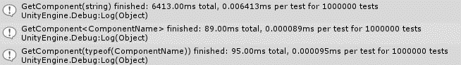
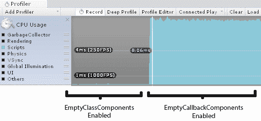
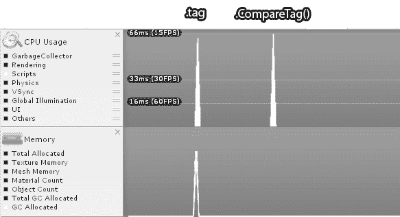
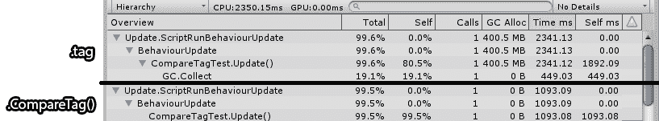
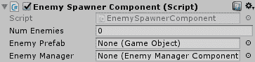
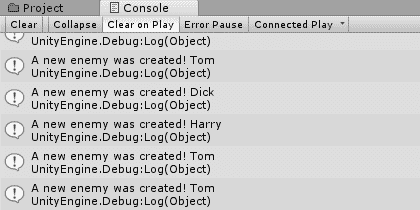

# 第二章：脚本策略

由于脚本编写将消耗我们大量的开发时间，因此学习一些最佳实践将非常有益。脚本是一个非常广泛的概念，所以我们将尝试在本章中限制我们的讨论范围，专注于与 MonoBehaviours、GameObject 和相关功能有关的问题。

我们将在第八章“精湛的内存管理”中讨论 C#语言、.NET 库和 Mono 框架的细微差别和高级主题。

在本章中，我们将探讨以下方面的性能提升方法：

+   在其他游戏对象中获取组件

+   优化组件回调（`Update()`、`Awake()`等）

+   使用协程

+   高效使用`GameObject`和`Transform`

+   在不同对象之间交换消息

+   优化数学计算

+   在场景和 Prefab 加载期间进行序列化和反序列化

无论你是否有想要解决的特定问题，或者只是想学习一些未来参考的技术，本章将向你介绍一系列你可以用来现在和未来提高脚本编写工作的方法。在每种情况下，我们将探讨性能问题是如何产生以及为什么会产生，一个发生问题的示例情况，以及一个或多个解决这个问题的方案。

# 使用最快的方法获取组件

`GetComponent()`方法有几个变体，它们各自有不同的性能成本，因此明智的做法是调用这个方法最快的版本。可用的三个重载是`GetComponent(string)`、`GetComponent<T>()`和`GetComponent(typeof(T))`。实际上，最快的版本取决于我们正在运行的 Unity 版本，因为多年来对这些方法进行了多次优化；然而，如果你使用任何版本的 Unity（从 Unity 2017 开始），最好使用`GetComponent<T>()`变体。

让我们通过一些简单的测试来证明这一点：

```cs
int numTests = 1000000;
TestComponent test;
using (new CustomTimer("GetComponent(string)", numTests)) {
  for (var i = 0; i < numTests; ++i) {
    test = (TestComponent)GetComponent("TestComponent");
  }
}

using (new CustomTimer("GetComponent<ComponentName>", numTests)) {
  for (var i = 0; i < numTests; ++i) {
    test = GetComponent<TestComponent>();
  }
}

using (new CustomTimer("GetComponent(typeof(ComponentName))", numTests))  {
  for (var i = 0; i < numTests; ++i) {
    test = (TestComponent)GetComponent(typeof(TestComponent));
  }
}
```

之前的代码测试了`GetComponent()`的每个重载一百万次。这比典型项目中的测试数量要多得多，但它有助于使相对成本变得清晰。

这里是测试完成后我们得到的结果（当然，具体的数值可能因机器而异）：



如您所见，`GetComponent<T>()`方法仅比`GetComponent(typeof(T))`快一小部分，而`GetComponent(string)`则比其他替代方案慢得多。因此，由于性能差异很小，使用`GetComponent()`的基于类型的版本是相当安全的。然而，我们应该确保永远不使用`GetComponent(string)`，因为结果相同，而且没有为所付出的成本带来任何好处。有一些非常罕见的例外。想象一下，如果我们正在编写一个用于 Unity 的自定义调试控制台，它可以解析用户输入的`string`以获取组件。在这种情况下，我们只有在调试和诊断情况下才会使用昂贵的`GetComponent(string)`来获取组件。在这些情况下，性能并不是很重要。相反，对于生产级应用程序，使用`GetComponent(string)`只是无谓地浪费 CPU 周期。

# 移除空的回调定义

Unity 中脚本的主要编写方式是在从`MonoBehaviour`派生的类中编写回调函数，我们知道 Unity 会在必要时调用这些函数。可能最常用的四个回调函数是`Awake()`、`Start()`、`Update()`和`FixedUpdate()`。

`Awake()`函数在`MonoBehaviour`首次创建时被调用，无论这是在场景初始化期间发生，还是在运行时从 Prefab 实例化包含`MonoBehaviour`组件的新`GameObject`实例时。`Start()`函数将在`Awake()`之后不久被调用，但在其第一次`Update()`之前。在场景初始化期间，每个`MonoBehaviour`组件的`Awake()`回调将在它们的`Start()`回调之前被调用。

之后，`Update()`函数将反复被调用，每次渲染管线呈现新的图像时都会调用一次。只要`MonoBehaviour`仍然存在于场景中，它仍然被启用，并且其父`GameObject`是活动的，`Update()`函数将持续被调用。

最后，`FixedUpdate()`函数在物理引擎更新之前被调用。固定更新在需要行为类似于`Update()`但不是直接绑定到渲染帧率，并且随时间更一致地被调用时使用。

请参考以下 Unity 文档中的页面，以了解各种 Unity 回调函数被调用的准确情况：[`docs.unity3d.com/Manual/ExecutionOrder.html`](https://docs.unity3d.com/Manual/ExecutionOrder.html)。

每当在我们的场景中首次实例化一个 `MonoBehaviour` 组件时，Unity 会将这些定义的回调函数添加到一个函数指针列表中，并在关键时刻调用它们。然而，重要的是要意识到，即使函数体为空，Unity 也会将这些回调函数钩入。核心 Unity 引擎并不知道这些函数体可能为空，只知道该方法已被定义，因此它必须获取它并在必要时调用它。因此，如果我们让这些回调函数的定义散布在代码库中，那么它们将因为引擎调用它们而产生的开销而浪费一小部分 CPU。

这可能是一个问题，因为每次我们在 Unity 中创建一个新的 `MonoBehaviour` 脚本文件时，它都会自动为我们生成两个样板回调函数，用于 `Start()` 和 `Update()`：

```cs
// Use this for initialization
void Start () {

}

// Update is called once per-frame
void Update () {

}
```

很容易不小心在实际上不需要这些函数的脚本上留下空定义。一个空的 `Start()` 定义可能会导致任何对象初始化得稍微慢一些，而没有任何合理的理由。这种影响可能对于少数几个 `MonoBehaviours` 来说并不明显，但随着项目的开发继续进行，我们将场景填充成千上万的具有许多空 `Start()` 定义的定制 `MonoBehaviours`，这可能会开始成为一个问题，每次通过 `GameObject.Instantiate()` 创建新的 Prefab 时，都会导致场景初始化缓慢和浪费 CPU 时间。

这种调用通常发生在关键的游戏事件期间；例如，当两个对象碰撞时，我们可能会生成一个粒子效果，创建一些漂浮的损伤文本，播放音效等等。这可能是性能的关键时刻，因为我们突然要求 CPU 进行大量的复杂更改，但在当前帧结束之前，我们只有有限的时间来完成它们。如果这个过程花费了太长时间，那么我们就会遇到帧率下降，因为渲染管线不允许在所有场景中的 `Update()` 回调（跨所有 `MonoBehaviours`）完成之前展示新的帧。因此，此时调用大量空的 `Start()` 定义是一种无谓的浪费，并可能在我们关键时刻的紧张时间预算中削减时间。

同时，如果我们的场景包含具有这些空 `Update()` 定义的成千上万的 `MonoBehaviours`，那么我们每帧都会浪费大量的 CPU 循环，这可能会对我们的帧率造成破坏。

让我们用一个简单的测试来证明所有这些。我们的测试场景应该包含具有两种类型组件的 GameObject，`EmptyClassComponent`，没有任何方法定义，以及 `EmptyCallbackComponent`，定义了一个空的 `Update()` 回调：

```cs
public class EmptyClassComponent : MonoBehaviour {
}

public class EmptyCallbackComponent : MonoBehaviour {
  void Update () {}
}
```

以下是对每种类型 30,000 个组件的测试结果。如果在运行时启用所有附加了 `EmptyClassComponents` 的 GameObject，那么在 Profiler 的 CPU 使用区域下将不会发生任何有趣的事情。会有一些少量的后台活动，但这些活动都不会由 `EmptyClassComponents` 引起。然而，一旦我们启用所有带有 `EmptyCallbackComponent` 的对象，我们就会观察到 CPU 使用量的巨大增加：



很难想象一个包含超过 30,000 个对象的场景，但请记住，MonoBehaviours 包含 `Update()` 回调，而不是 GameObjects。一个 `GameObject` 实例可以同时包含多个 MonoBehaviours，并且它们的每个子对象还可以包含更多的 MonoBehaviours，依此类推。几千个甚至一百个空的 `Update()` 回调将对帧率预算产生明显的影响，而没有任何潜在的好处。这在 Unity UI 组件中尤其常见，这些组件倾向于在非常深的层次结构中附加很多不同的组件。

解决这个问题很简单：删除空的回调定义。Unity 将没有任何东西可以挂钩，并且不会调用任何东西。在一个庞大的代码库中找到这样的空定义可能很困难，但如果我们使用一些基本的正则表达式（称为 *regex*），我们应该能够相对容易地找到我们想要的东西。

所有常见的 Unity 代码编辑工具，如 MonoDevelop、Visual Studio，甚至 Notepad++，都提供了一种在整个代码库上执行基于正则表达式的搜索的方法。请查阅工具的文档以获取更多信息，因为此方法可能因工具及其版本的不同而有很大差异。

以下正则表达式搜索应该能在我们的代码中找到任何空的 `Update()` 定义：

```cs
void\s*Update\s*?\(\s*?\)\s*?\n*?\{\n*?\s*?\}
```

此正则表达式检查 `Update()` 回调的标准方法定义，同时包括可能分布在整个方法定义中的任何多余的空白和换行符。

自然，所有上述内容也适用于非模板化的 Unity 回调，如 `OnGUI()`、`OnEnable()`、`OnDestroy()` 和 `LateUpdate()`。唯一的区别是，只有 `Start()` 和 `Update()` 在新脚本中自动定义。

查阅 Unity 的 `MonoBehaviour` 文档页面，以获取这些回调的完整列表，链接为 [`docs.unity3d.com/ScriptReference/MonoBehaviour.html`](http://docs.unity3d.com/ScriptReference/MonoBehaviour.html)。

在我们的代码库中，似乎不太可能有人生成这么多空的回调版本，但永远不要说永远不可能。例如，如果我们在我们所有的自定义组件中普遍使用一个常见的基类，`MonoBehaviour`，那么该基类中的单个空回调定义将渗透整个游戏，这可能会给我们带来巨大的损失。特别小心 `OnGUI()` 方法，因为它可以在同一帧或 UI 事件中多次被调用。

在 Unity 脚本中，性能问题最常见的原因之一是误用`Update()`回调，通过执行以下一项或多项操作：

+   反复重新计算很少或从不改变的价值

+   有太多组件为可能共享的结果执行工作

+   执行比必要更频繁的工作

值得养成记住的习惯，即我们编写的每一条代码，以及由这些回调调用的函数，都会消耗我们的帧率预算。为了达到 60 fps，我们每帧有 16.667 毫秒的时间来完成所有`Update()`回调中的工作。当我们开始原型设计时，这似乎是足够的，但在开发的中期，我们可能会开始注意到事情变得缓慢和响应迟钝，因为我们逐渐消耗了那个预算，这是由于我们无节制地想将更多东西塞入项目中的欲望。

让我们讨论一些直接解决这些问题的技巧。

# 缓存组件引用

在 Unity 脚本编写中，反复重新计算一个值是一个常见的错误，尤其是在使用`GetComponent()`方法时。例如，以下脚本代码试图检查一个生物的健康值，如果其健康值低于`0`，它将禁用一系列组件以准备死亡动画：

```cs
void TakeDamage() {

  Rigidbody rigidbody = GetComponent<Rigidbody>();
  Collider collider = GetComponent<Collider>();
  AIControllerComponent ai = GetComponent<AIControllerComponent>();
  Animator anim = GetComponent<Animator>();

  if (GetComponent<HealthComponent>().health < 0) {
    rigidbody.enabled = false;
    collider.enabled = false;
    ai.enabled = false;
    anim.SetTrigger("death");
  }
}
```

每次这个低效的方法执行时，它都会重新获取五个不同的组件引用。这对 CPU 使用率来说并不友好。如果主方法在`Update()`期间被调用，这尤其成问题。即使它没有被调用，它仍然可能与其他重要事件同时发生，例如创建粒子效果、用一个 Ragdoll 替换对象（从而在物理引擎中引发各种活动），等等。这种编码风格可能看似无害，但它可能会引起很多长期问题和运行时工作，而收益却微乎其微。

为了未来使用，缓存这些引用只花费我们一小部分内存空间（每次只有 32 或 64 位——取决于 Unity 版本、平台和碎片化允许），所以，除非你在内存上极度瓶颈，更好的方法是在初始化时获取引用并保留它们，直到需要它们：

```cs
private HealthComponent _healthComponent;
private Rigidbody _rigidbody;
private Collider _collider;
private AIControllerComponent _ai;
private Animator _anim;

void Awake() {
  _healthComponent = GetComponent<HealthComponent>();
  _rigidbody = GetComponent<Rigidbody>();
  _collider = GetComponent<Collider>();
  _ai = GetComponent<AIControllerComponent>();
  _anim = GetComponent<Animator>();
}

void TakeDamage() {
  if (_healthComponent.health < 0) {
    _rigidbody.detectCollisions = false;
    _collider.enabled = false;
    _ai.enabled = false;
    _anim.SetTrigger("death");
  }
}
```

以这种方式缓存组件引用可以让我们避免每次需要时都重新获取它们，每次都节省一些 CPU 开销。代价是额外的少量内存消耗，这通常是非常值得的。

同样的建议适用于我们决定在运行时计算的任何数据。当我们可以将它存储在内存中以供未来参考时，没有必要让 CPU 在每次`Update()`回调时都重新计算相同的值。

# 共享计算输出

通过让多个对象共享某些计算的结果，可以节省性能；当然，这只有在它们都生成相同的结果时才有效。这种情况通常很容易发现，但重构可能很棘手，因此利用这一点将非常依赖于实现。

一些例子可能包括在场景中找到一个对象、从文件中读取数据、解析数据（如 XML 或 JSON）、在一个大列表或信息深度字典中找到某个东西、计算一组**人工智能**（**AI**）对象的路径、类似复杂数学的轨迹、光线投射等等。

每当进行一次昂贵的操作时，考虑它是否从多个位置调用但总是产生相同的输出。如果是这样，那么重新组织事物以使结果只计算一次，然后将其分发给需要它的每个对象，以最小化重新计算的数量将是明智的。最大的成本通常是代码简单性的一小部分损失，尽管我们可能通过移动值而造成一些额外的开销。

注意，通常很容易养成在基类中隐藏一些大而复杂的函数的习惯，然后我们定义派生类来使用该函数，完全忘记了该函数的成本，因为我们很少再次查看那段代码。最好使用 Unity Profiler 来告诉我们那个昂贵的函数可能被调用多少次，并且像往常一样，除非已经证明它是性能问题，否则不要预先优化这些函数。无论它可能多么昂贵，如果它不会导致我们超过性能限制（如帧率和内存消耗），那么它实际上并不是一个性能问题。

# 更新、协程和 InvokeRepeating

另一个容易陷入的习惯是在`Update()`回调中以比所需更频繁的方式重复调用某些东西。例如，我们可能从一个类似这样的情况开始：

```cs
void Update() {
  ProcessAI();
}
```

在这种情况下，我们每帧都调用一些自定义的`ProcessAI()`子程序。这可能是一项复杂的工作，需要 AI 系统检查一些网格系统以确定它应该移动到哪个位置，或者为一批宇宙飞船或我们游戏 AI 需要的任何东西确定一些舰队机动。

如果这个活动消耗了我们的帧率预算太多，并且任务可以比每帧更少地完成而没有显著的缺点，那么提高性能的一个好方法就是简单地减少调用`ProcessAI()`的频率：

```cs
private float _aiProcessDelay = 0.2f;
private float _timer = 0.0f;

void Update() {
  _timer += Time.deltaTime;
  if (_timer > _aiProcessDelay) {
    ProcessAI();
    _timer -= _aiProcessDelay;
  }
}
```

在这种情况下，我们通过每秒只调用`ProcessAI()`大约五次来减少了`Update()`回调的整体成本，这比之前的情况有所改进，但代价是代码可能需要一点时间才能理解，并且需要额外的内存来存储一些浮点数据——尽管，最终，我们仍然经常让 Unity 调用一个空的回调函数。

这个函数是一个完美的例子，可以将它转换成协程以利用它们的延迟调用特性。如前所述，协程通常用于编写一系列事件，无论是单次还是重复执行的动作。它们不应与线程混淆，线程会在不同的 CPU 核心上并发运行，并且可以同时运行多个线程。相反，协程在主线程上以顺序方式运行，在任何给定时刻只处理一个协程，每个协程通过 `yield` 语句决定何时暂停和恢复。以下代码示例展示了我们如何将前面的 `Update()` 回调以协程的形式重写：

```cs
void Start() {
  StartCoroutine(ProcessAICoroutine ());
}

IEnumerator ProcessAICoroutine () {
  while (true) {
    ProcessAI();
    yield return new WaitForSeconds(_aiProcessDelay);
  }
}
```

前面的代码演示了一个协程，它调用 `ProcessAI()`，然后在 `yield` 语句上暂停给定的时间（`_aiProcessDelay` 的值）后，主线程再次恢复协程，此时它将回到循环的开始，调用 `ProcessAI()`，再次在 `yield` 语句上暂停，并无限重复（通过 `while(true)` 语句）直到被要求停止。

这种方法的主要好处是，这个函数将只根据 `_aiProcessDelay` 的值调用，并且在此期间将处于空闲状态，减少了对大多数帧造成的性能影响。然而，这种方法也有其缺点。

首先，启动协程相对于标准函数调用会带来额外的开销（大约慢三倍），以及一些内存分配来存储当前状态，直到下一次被调用。这种额外的开销也不是一次性成本，因为协程经常不断地调用 `yield`，这会反复产生相同的开销成本，因此我们需要确保减少频率带来的好处超过这种成本。

在对 1,000 个具有空 `Update()` 回调的对象进行测试时，处理耗时为 1.1 毫秒，而 1,000 个在 `WaitForEndOfFrame` 上产生 `yield` 的协程（其频率与 `Update()` 回调相同）耗时为 2.9 毫秒。因此，相对成本几乎是三倍。

其次，一旦初始化，协程将独立于触发 `MonoBehaviour` 组件的 `Update()` 回调运行，并且无论组件是否被禁用，都会继续被调用，这在我们进行大量的 `GameObject` 构造和销毁时可能会使它们难以控制。

第三，一旦包含它的 `GameObject` 实例因任何原因（无论是被设置为非活动状态还是其父对象之一被设置为非活动状态）变得非活动，协程将自动停止，并且如果 `GameObject` 再次设置为活动状态，它不会自动重新启动。

最后，通过将方法转换为协程，我们可能已经减少了在大多数帧上造成的性能损失，但如果方法体的单个调用导致我们超出帧率预算，那么无论我们调用该方法的频率有多低，它仍然会超出预算。因此，这种方法最好用于我们只是因为方法在给定帧中被调用的次数过多而打破帧率预算的情况，而不是因为方法本身成本过高。在这种情况下，我们别无选择，只能深入挖掘并提高方法本身的性能，或者减少其他任务的成本，以便为完成其工作腾出时间。

在生成协程时，我们有几种 `yield` 类型可供选择。`WaitForSeconds` 是相当直观的；协程将在 `yield` 语句暂停给定的时间数秒。然而，它并不是一个精确的计时器，因此当这个 `yield` 类型实际恢复时，请预期会有一些变化。

`WaitForSecondsRealTime` 是另一个选项，它与 `WaitForSeconds` 的区别仅在于它使用未缩放的时间。`WaitForSeconds` 是与缩放时间进行比较，这会受到全局 `Time.timeScale` 属性的影响，而 `WaitForSecondsRealTime` 则不会，因此在调整时间缩放值（例如，用于慢动作效果）时，请注意您使用的 `yield` 类型。

此外，还有 `WaitForEndOfFrame`，它将在下一个 `Update()` 回调结束时继续执行，然后是 `WaitForFixedUpdate`，它将在下一个 `FixedUpdate()` 调用结束时继续执行。最后，Unity 5.3 引入了 `WaitUntil` 和 `WaitWhile`，我们在这里提供委托函数，协程将暂停，直到提供的委托返回 `true` 或 `false`。请注意，提供给这些 `yield` 类型的委托将在每次 `Update()` 调用中执行，直到它们返回所需的布尔值以停止执行，这使得它们与使用 `WaitForEndOfFrame` 在 `while` 循环中结束的协程非常相似。当然，我们提供的委托函数执行成本不高也很重要。

委托函数是 C# 中非常实用的结构，它允许我们将局部方法作为参数传递给其他方法，并且通常用于回调。有关委托的更多信息，请参阅 MSDN 的 *C# 编程指南*，链接为 [`docs.microsoft.com/en-us/dotnet/csharp/programming-guide/delegates/`](https://docs.microsoft.com/en-us/dotnet/csharp/programming-guide/delegates/)。

一些`Update()`回调的编写方式可能可以被简化为简单的协程，这些协程始终在这些类型之一上调用`yield`，但我们应意识到之前提到的缺点。协程调试可能很棘手，因为它们不遵循正常的执行流程；在调用栈中没有直接的调用者可以责怪为什么协程在特定时间被触发，并且如果协程执行复杂任务并与其他子系统交互，那么它们可能导致一些难以置信的困难错误，因为这些错误发生在其他代码没有预料到的时间点，这些错误通常也很难重现。如果你确实希望使用协程，最好的建议是保持它们简单，并且与其他复杂的子系统独立。

事实上，如果我们的协程足够简单，可以简化为一个始终在`WaitForSeconds`或`WaitForSecondsRealtime`上调用`yield`的`while`循环，就像前面的例子一样，那么我们通常可以用一个`InvokeRepeating()`调用替换它，这甚至更容易设置，并且有稍微低的开销成本。以下代码在功能上与之前使用协程定期调用`ProcessAI()`方法的实现等效：

```cs
void Start() {
  InvokeRepeating("ProcessAI", 0f, _aiProcessDelay);
}
```

`InvokeRepeating()`和协程之间的重要区别在于`InvokeRepeating()`完全独立于`MonoBehaviour`和`GameObject`的状态。停止`InvokeRepeating()`调用的唯一两种方式是调用`CancelInvoke()`，这将停止由给定`MonoBehaviour`启动的所有`InvokeRepeating()`回调（注意，它们不能单独取消）或者销毁相关的`MonoBehaviour`或其父`GameObject`。禁用`MonoBehaviour`或`GameObject`都不会停止`InvokeRepeating()`。

对 1,000 次`InvokeRepeating()`调用的测试处理大约需要 2.6 毫秒；这比 1,000 次等效的协程`yield`调用快一点，后者耗时 2.9 毫秒。

这涵盖了与`Update()`回调相关的多数有用信息。让我们来看看其他有用的脚本提示。

# 更快的 GameObject 空引用检查

结果表明，对`GameObject`执行空引用检查将导致一些不必要的性能开销。与典型的 C#对象相比，GameObject 和 MonoBehaviours 是特殊对象，因为它们在内存中有两种表示：一个存在于管理我们编写的 C#代码的同一系统的内存中（托管代码），而另一个存在于不同的内存空间中，该空间被单独处理（原生代码）。数据可以在这两个内存空间之间移动，但每次发生这种情况都会导致一些额外的 CPU 开销，并可能需要额外的内存分配。

这种效果通常被称为跨越原生-托管桥接。如果发生这种情况，它可能会为对象的数据在桥接过程中生成额外的内存分配，这将需要垃圾回收器最终为我们执行一些自动内存清理。这个主题将在第八章*精通内存管理*中详细探讨，但在此期间，只需考虑有许多微妙的方式可以意外触发这种额外的开销，而检查`GameObject`的简单`null`引用就是其中之一：

```cs
if (gameObject != null) {
  // do stuff with gameObject
}
```

一种生成功能等效输出且操作速度快两倍的方法（尽管它稍微模糊了代码的目的）是`System.Object.ReferenceEquals()`：

```cs
if (!System.Object.ReferenceEquals(gameObject, null)) {
  // do stuff with gameObject
}
```

这适用于 GameObject 和 MonoBehaviours，以及具有原生和托管表示的其他 Unity 对象，例如`WWW`类。然而，一些基本的测试表明，无论是哪种`null`引用检查方法，在 Intel Core i5 3570K 处理器上仍然只消耗微秒级的纳秒。所以，除非你正在执行大量的`null`引用检查，否则收益可能微乎其微。然而，这是一个值得记住的未来警告，因为它会经常出现。

# 避免从 GameObject 中检索字符串属性

通常，从对象中检索`string`属性与检索 C#中的任何其他引用类型属性相同；它应该没有额外的内存成本。然而，从 GameObject 中检索`string`属性是另一种意外跨越原生-托管桥接的微妙方式。

受此行为影响的`GameObject`的两个属性是`tag`和`name`。因此，在游戏过程中使用这两个属性是不明智的，你应该只在性能无关的区域使用它们，例如编辑器脚本。然而，标签系统通常用于对象的运行时识别，这可能会给某些团队带来重大问题。

例如，以下代码会在循环的每次迭代中造成额外的内存分配：

```cs
for (int i = 0; i < listOfObjects.Count; ++i) {
  if (listOfObjects[i].tag == "Player") {
    // do something with this object
  }
}
```

通常，通过识别对象的组件和类类型来识别对象，以及识别不涉及`string`对象的值，是一种更好的做法。但有时我们被迫陷入困境。也许我们在开始时并不了解更好的方法，我们继承了别人的代码库，或者我们正在用它作为某种问题的解决方案。让我们假设，无论出于什么原因，我们都陷入了标签系统，并且我们希望避免原生-托管桥接的开销。

幸运的是，`tag`属性通常用于比较场景，`GameObject`提供了`CompareTag()`方法，这是一种比较`tag`属性的方法，可以完全避免原生-托管桥接。

让我们进行一个简单的测试来证明这个简单的改变可以带来多大的差异：

```cs
void Update() {

  int numTests = 10000000;

  if (Input.GetKeyDown(KeyCode.Alpha1)) {
    for(int i = 0; i < numTests; ++i) {
      if (gameObject.tag == "Player") {
        // do stuff
      }
    }
  }

  if (Input.GetKeyDown(KeyCode.Alpha2)) {
    for(int i = 0; i < numTests; ++i) {
      if (gameObject.CompareTag ("Player")) {
        // do stuff
      }
    }
  }
}
```

我们可以通过按下 *1* 和 *2* 键来触发相应的 `for` 循环来执行这些测试。以下是结果：



查看每个峰值的分析视图，我们可以看到两种完全不同的结果：



值得注意的是，时间轴视图中的两个峰值看起来高度相对相同，但一个操作却比另一个操作耗时多一倍。当超过 15FPS 标记时，Profiler 没有足够的垂直分辨率来生成相对准确的峰值。无论如何，这两种情况都会导致糟糕的游戏体验，所以准确性并不重要。

重复获取 `tag` 属性 1000 万次（在现实中远远超过合理的次数，但这对比较很有用）仅导致大约 400 兆字节的内存被分配，仅用于 `string` 对象。我们可以在时间轴视图的内存区域中看到 GC Allocated 元素中的峰值，这个过程大约需要 2,000 毫秒来处理，一旦 `string` 对象不再需要，垃圾回收会花费另外 400 毫秒。

同时，使用 `CompareTag()` 10 万次大约需要 1,000 毫秒来处理，并且不会引起内存分配，因此也不会有垃圾回收。这一点可以从内存区域中 GC Allocated 元素没有峰值中明显看出。这应该清楚地表明，我们应尽可能避免访问 `name` 和 `tag` 属性。如果 `tag` 比较成为必要，那么我们应该使用 `CompareTag()`。不幸的是，没有 `name` 属性的等效函数，因此我们应该尽可能使用标签。

注意，将 `string` 文字字面量，如 `"Player"`，传递给 `CompareTag()` 不会导致运行时内存分配，因为应用程序在初始化期间分配硬编码的字符串，并在运行时仅引用它们。

# 使用合适的数据结构

C# 在 `System.Collections` 命名空间中提供了许多不同的数据结构，我们不应该过于习惯于反复使用相同的结构。软件开发中常见的性能问题之一是，由于方便而使用不合适的数据结构来解决我们试图解决的问题。最常用的可能是列表 (`List<T>`) 和字典 (`Dictionary<K,V>`)。

如果我们想要遍历一组对象，那么列表是首选的，因为它实际上是一个动态数组，其中对象和/或引用在内存中相邻，因此迭代造成的缓存未命中最小。当两个对象相互关联，并且我们希望快速获取、插入或删除这些关联时，字典是最佳选择。例如，我们可能会将一个层级编号与特定的场景文件关联起来，或者用一个表示角色不同身体部位的`enum`与这些身体部位的`Collider`组件关联起来。

然而，我们通常希望有一个可以处理这两种情况的数据结构；我们希望快速找出哪个对象映射到另一个对象，同时还能遍历该组。通常，这个系统的开发者会使用一个字典，然后遍历它。然而，与遍历列表相比，这个过程非常慢，因为它必须检查字典中的每个潜在哈希值才能完全遍历它。

在这些情况下，通常更好的做法是在列表和字典中同时存储数据，以更好地支持这种行为。这将为维护多个数据结构带来额外的内存开销，并且插入和删除操作需要每次从这两个数据结构中添加和删除对象，但列表迭代的优点（这通常发生得更多）与遍历字典相比将形成鲜明的对比。

# 避免在运行时重新分配变换的父子关系

在 Unity 的早期版本（5.3 及更早版本）中，`Transform`组件的引用在内存中的布局通常是随机的。这意味着遍历多个`Transform`组件相当慢，因为缓存未命中的可能性很高。好处是，将`GameObject`重新分配给另一个对象不会真正造成显著的性能损失，因为`Transforms`操作类似于堆数据结构，通常在插入和删除方面相对较快。这种行为是我们无法控制的，所以我们只能忍受它。

然而，自从 Unity 5.4 版本以来，`Transform`组件的内存布局发生了显著变化。从那时起，`Transform`组件的父子关系更像是动态数组，Unity 试图在预分配的内存缓冲区中按顺序存储所有与同一父对象共享的`Transform`，并在父对象下方的层次结构窗口中按深度排序。这种数据结构允许在整个组上快速迭代，这对于多个子系统（如物理和动画）特别有益。

这种变化的缺点是，如果我们将 `GameObject` 重新设置为另一个对象的子对象，父对象必须在其预分配的内存缓冲区中适应新的子对象，并且根据新的深度对所有这些 `Transforms` 进行排序。此外，如果父对象没有预分配足够的空间来适应新的子对象，那么它必须扩展其缓冲区以能够适应新的子对象及其所有子对象，按照深度优先的顺序。对于深度和复杂的 `GameObject` 结构，这可能需要一些时间才能完成。

当我们通过 `GameObject.Instantiate()` 实例化一个新的 `GameObject` 时，其中一个参数是我们希望将 `GameObject` 设置为其父对象的 `Transform` 组件，默认情况下为 `null`，这将 `Transform` 放置在 Hierarchy 窗口的根位置。Hierarchy 窗口根位置的所有 `Transforms` 都需要分配一个缓冲区来存储其当前子对象以及以后可能添加的子对象（子 `Transforms` 不需要这样做）。但是，如果我们立即在实例化后重新将 `Transform` 设置为另一个对象，那么它会丢弃我们刚刚分配的缓冲区！为了避免这种情况，我们应该在 `GameObject.Instantiate()` 调用中提供父 `Transform` 参数，这将跳过此缓冲区分配步骤。

另一种减少此过程成本的方法是在我们需要之前预先为根 `Transform` 分配更大的缓冲区，这样我们就不需要在同一帧中同时扩展和重新将另一个 `GameObject` 实例放入缓冲区。这可以通过修改 `Transform` 组件的 `hierarchyCapacity` 属性来实现。如果我们能够估计父对象将包含的子 `Transforms` 的数量，那么我们可以节省大量的不必要的内存分配。

# 考虑缓存变换更改

`Transform` 组件仅存储相对于其自身父对象的数据。这意味着访问和修改 `Transform` 组件的 `position`、`rotation` 和/或 `scale` 属性可能会引发大量未预料的矩阵乘法计算，以生成通过父 `Transforms` 的正确 `Transform` 表示。对象在 Hierarchy 窗口中的深度越深，所需的计算就越多，以确定最终结果。

然而，这也意味着使用 `localPosition`、`localRotation` 和 `localScale` 与之相关的成本相对较小，因为这些值直接存储在给定的 `Transform` 组件中，并且可以在没有任何额外的矩阵乘法的情况下检索。因此，应尽可能使用这些局部属性值。

不幸的是，将我们的数学计算从世界空间转换为局部空间可能会使原本简单（且已解决）的问题变得过于复杂，因此进行此类更改的风险是破坏我们的实现并引入大量意外的错误。有时，为了更容易地解决复杂的 3D 数学问题，值得承受轻微的性能损失。

持续更改 `Transform` 组件的属性还存在另一个问题，即它还会向 `Collider`、`Rigidbody`、`Light` 和 `Camera` 等组件发送内部通知，这些组件也必须被处理，因为物理和渲染系统都需要知道新的 `Transform` 值并相应地更新。

在复杂的事件链中，我们有时会在同一帧内多次替换 `Transform` 组件的属性（尽管这可能是过度设计的一个警告信号）。这会导致每次发生这种情况时都会触发内部消息，即使它们发生在同一帧或同一函数调用中。因此，我们应该考虑通过在成员变量中缓存它们并在帧末尾提交来最小化修改 `Transform` 属性的次数，如下所示：

```cs
private bool _positionChanged;
private Vector3 _newPosition;

public void SetPosition(Vector3 position) {
  _newPosition = position;
  _positionChanged = true;
}

void FixedUpdate() {
  if (_positionChanged) {
    transform.position = _newPosition;
    _positionChanged = false;
  }
}
```

此代码只会在下一个 `FixedUpdate()` 方法中提交对 `position` 的更改。

注意，以这种方式更改 `Transform` 组件不会在游戏过程中导致看起来奇怪的行为或物体瞬移。这些内部事件的整体目的是确保物理和渲染系统始终与当前的 `Transform` 状态同步。因此，Unity 不会错过任何一次，每当通过 `Transform` 组件传递更改时，都会触发内部事件，以确保不会错过任何东西。

# 避免在运行时使用 Find() 和 SendMessage()

`SendMessage()` 方法及其 `GameObject.Find()` 方法族因其高昂的成本而臭名昭著，应尽量避免使用。`SendMessage()` 方法的速度大约是简单函数调用的 2,000 倍慢，而 `Find()` 方法的成本随着场景复杂性的增加而非常差，因为它必须遍历场景中的每一个 `GameObject`。在某些情况下，例如在场景初始化期间，如 `Awake()` 或 `Start()` 回调中调用 `Find()` 可能是情有可原的。即使在这种情况下，也仅应使用它来获取我们确信已经存在于场景中的对象，以及那些只有少数 `GameObject` 的场景。无论如何，在运行时使用这些方法进行对象间通信很可能会产生非常明显的开销，甚至可能导致帧率下降。

依赖于`Find()`和`SendMessage()`通常是设计不佳、C#和 Unity 编程经验不足或原型设计时的懒惰的典型症状。它们的用法在初级和中级项目中已经成为一种流行病，以至于 Unity Technologies 觉得有必要在他们的文档和会议上反复提醒用户，避免在实际游戏中反复使用它们。它们只是一种不那么“程序员风格”的方式来向新用户介绍对象间通信，以及在少数特殊情况下可以负责任地使用（这些情况很少见）。换句话说，它们过于昂贵，以至于违反了不预先优化代码的规则，如果我们的项目超出了原型设计阶段（由于你正在阅读这本书，这完全有可能），那么避免使用它们是值得的。

公平地说，Unity 的目标用户群体非常广泛，从爱好者到学生和专业人员，再到个人开发者，以及同一个团队中的数百人。这导致软件开发能力范围极其广泛。当你刚开始使用 Unity 时，自己很难弄清楚应该做哪些不同的事情，特别是考虑到 Unity 引擎并不遵循我们可能熟悉的许多其他游戏引擎的设计范式。它有一些与场景和 Prefab 相关的陌生和古怪的概念，并且没有内置的`God`类入口，也没有明显的原始数据存储系统可供使用。

`God`类是一个对我们应用中可能创建的第一个对象的别称，其职责是根据当前上下文（例如加载哪个级别，激活哪些子系统等）创建我们需要的所有其他东西。这些类在需要单个集中位置来控制事件在整个应用生命周期中发生顺序的情况下特别有用。

了解如何在复杂的软件架构组件之间交换消息不仅对 Unity 的性能有用，而且对任何实时事件驱动系统（包括但不限于游戏）的设计也很有用，因此详细探讨这个主题，评估一些替代对象间通信的方法是值得的。

让我们先考察一个最坏情况的例子，它同时使用`Find()`和`SendMessage()`在对象之间进行通信，然后探讨改进的方法。

以下是一个简单的`EnemyManagerComponent`实例的类定义，它跟踪表示游戏中敌人的 GameObject 列表，并提供一个`KillAll()`方法，在需要时销毁它们：

```cs
using UnityEngine;
using System.Collections.Generic;

class EnemyManagerComponent : MonoBehaviour {
  List<GameObject> _enemies = new List<GameObject>();

  public void AddEnemy(GameObject enemy) {
    if (!_enemies.Contains(enemy)) {
      _enemies.Add(enemy);
    }
  }

  public void KillAll() {
    for (int i = 0; i < _enemies.Count; ++i) {
      GameObject.Destroy(_enemies[i]);
    }
    _enemies.Clear();
  }
}
```

然后，我们将一个包含此组件的`GameObject`实例放置到场景中，并将其命名为`EnemyManager`。

以下示例方法尝试从给定的 Prefab 实例化几个敌人，然后通知`EnemyManager`对象它们的存在：

```cs
public void CreateEnemies(int numEnemies) {
  for(int i = 0; i < numEnemies; ++i) {
    GameObject enemy = (GameObject)GameObject.Instantiate(_enemyPrefab, 
                       5.0f * Random.insideUnitSphere, 
                       Quaternion.identity);
    string[] names = { "Tom", "Dick", "Harry" };
    enemy.name = names[Random.Range(0, names.Length)];
    GameObject enemyManagerObj = GameObject.Find("EnemyManager");
    enemyManagerObj.SendMessage("AddEnemy", 
                                enemy, 
                                SendMessageOptions.DontRequireReceiver);
  }
}
```

在任何类型的循环中初始化数据和将方法调用放入其中，这总是输出相同的结果，是性能不佳的一个大红旗，当我们处理像`Find()`这样的昂贵方法时，我们应该总是寻找尽可能少调用它们的方法。因此，我们可以做出的一个改进是将`Find()`调用移出`for`循环，并将结果缓存到局部变量中，这样我们就不需要一次又一次地重新获取`EnemyManager`对象。

将`names`变量的初始化移出`for`循环并不一定是关键的，因为编译器通常足够聪明，能够意识到它不需要重新初始化那些在其他地方没有改变的数据。然而，这通常会使代码更容易阅读。

我们可以实施的另一个重大改进是优化我们对`SendMessage()`方法的用法，通过将其替换为`GetComponent()`调用。这用一个成本高昂的方法替换了一个等效且成本更低的替代方案。

这给我们带来了以下结果：

```cs
public void CreateEnemies(int numEnemies) {
  GameObject enemyManagerObj = GameObject.Find("EnemyManager");
  EnemyManagerComponent enemyMgr = enemyManagerObj.GetComponent<EnemyManagerComponent>();
  string[] names = { "Tom", "Dick", "Harry" };

  for(int i = 0; i < numEnemies; ++i) {
    GameObject enemy = (GameObject)GameObject.Instantiate(_enemyPrefab, 
                        5.0f * Random.insideUnitSphere, 
                        Quaternion.identity);
    enemy.name = names[Random.Range(0, names.Length)];
    enemyMgr.AddEnemy(enemy);
  }
}
```

如果这个方法在场景初始化期间被调用，并且我们不太关心加载时间，那么我们可能可以认为我们的优化工作已经完成了。

然而，我们经常需要新的对象，这些对象在运行时实例化以找到现有对象进行通信。在这个例子中，我们希望新的敌人对象注册到我们的`EnemyManagerComponent`，以便它可以执行跟踪和控制场景中敌人对象所需的一切。我们还希望`EnemyManager`处理所有与敌人相关的行为，这样调用其函数的对象就不需要代表它执行工作。这将提高我们应用程序的耦合度（我们的代码库如何分离相关行为）和封装性（我们的类如何防止外部对其管理的数据进行更改）。最终目标是找到一种可靠且快速的方法，让新对象在场景中找到现有对象，而不必使用`Find()`方法，这样我们就可以最小化复杂性和性能成本。

我们可以采取多种方法来解决此问题，每种方法都有其自身的优点和缺点：

+   将引用分配给现有对象

+   静态类

+   单例组件

+   一个全局消息系统

# 将引用分配给现有对象

解决对象间通信问题的简单方法之一是使用 Unity 内置的序列化系统。软件设计纯粹主义者可能会对这个特性有些抵触，因为它打破了封装性；它使得标记为`private`的字段表现得像`public`字段一样。然而，它是一个非常有效的工具，可以改善开发工作流程。这在艺术家、设计师和程序员都在同一个产品上摸索，每个人的计算机科学和软件开发知识水平差异很大，有些人可能更愿意远离修改代码文件的情况下尤其如此。有时，为了提高生产力，稍微放宽一些规则是值得的。

无论何时我们在`MonoBehaviour`中创建一个`public`字段，当组件被选中时，Unity 都会自动序列化并在检查器窗口中暴露其值。然而，从软件设计的角度来看，`public`字段总是危险的。这些变量可以从任何地方通过代码随时更改，这使得跟踪变量变得困难，并且容易引入许多意外的错误。

一个更好的解决方案是将类的任何`private`或`protected`成员变量暴露给检查器窗口，使用`[SerializeField]`属性。然后，该值将像`public`字段一样在检查器窗口中表现，允许我们通过编辑器界面方便地更改它，但将数据安全地封装在我们的代码库的其他部分。

例如，以下类将三个`private`字段暴露给检查器窗口：

```cs
using UnityEngine;

public class EnemyCreatorComponent : MonoBehaviour {
  [SerializeField] private int _numEnemies;
  [SerializeField] private GameObject _enemyPrefab;
  [SerializeField] private EnemyManagerComponent _enemyManager;

  void Start() {
    for (int i = 0; i < _numEnemies; ++i) {
      CreateEnemy();
    }
  }

  public void CreateEnemy() {
    _enemyManager.CreateEnemy(_enemyPrefab); 
  }
}
```

注意，前面代码中显示的`private`访问修饰符在 C#中是多余的，因为字段和方法默认为`private`，除非指定了其他情况。然而，通常最好明确指定预期的访问级别。

在检查器窗口中查看此组件会显示三个值，最初给定默认值`0`或`null`，可以通过编辑器界面进行修改：



我们可以将从项目窗口拖放的一个 Prefab 引用拖放到检查器窗口中显示的 Enemy Prefab 字段。

注意 Unity 如何自动将驼峰式命名的字段名称转换为方便的检查器窗口名称。`_numEnemies`变为 Num Enemies，`_enemyPrefab`变为 Enemy Prefab，依此类推。

同时，`_enemyManager`字段很有趣，因为它是对特定`MonoBehaviour`类类型的引用。如果将`GameObject`拖放到这个字段中，那么它将引用给定对象上的组件，而不是`GameObject`本身。请注意，如果`GameObject`不包含预期的`MonoBehaviour`实例，则该字段将不会被分配任何内容。

这种组件引用技术的常见用法是获取附加到与组件相同的 `GameObject` 上的其他组件的引用。这是缓存组件的一种零成本替代方法，正如本章前面标题为“缓存组件引用”的部分所讨论的。

使用这种方法存在一些风险。我们的大部分代码都会假设 Prefab 被分配到一个用作 Prefab 的字段，而 `GameObject` 被分配到一个引用 `GameObject` 实例的字段。然而，由于 Prefab 本质上是 GameObject，任何 Prefab 或 `GameObject` 都可以分配到序列化的 `GameObject` 引用字段，这意味着我们可能会意外地分配错误的类型。

如果我们错误地分配了类型，那么我们可能会意外地从之前修改过的现有 `GameObject` 实例中实例化一个新的 `GameObject` 实例，或者我们可能会修改 Prefab，这将随后改变从它实例化的所有 GameObject 的状态。更糟糕的是，由于 Prefab 无论 Playmode 是否激活都占用相同的内存空间，任何对 Prefab 的意外更改都会变成永久性的。即使 Prefab 只在 Playmode 期间被修改，也是如此。

因此，这种方法是解决对象间通信问题的一种非常团队友好的方法，但由于所有涉及的风险，它并不理想，因为团队成员可能会意外地留下 `null` 引用，将 Prefab 分配到期望从场景中获取 `GameObject` 实例的引用，反之亦然。

还需要注意的是，并非所有对象都可以序列化并在检查器窗口中显示。Unity 可以序列化所有原始数据类型（`int`、`float`、`string` 和 `bool`）、各种内置类型（`Vector3`、`Quaternion` 等）、`enum`、`class`、`struct` 以及包含其他可序列化类型（如 `List`）的各种数据结构。然而，它无法序列化 `static` 字段、`readonly` 字段、属性和字典。

一些 Unity 开发者喜欢通过两个单独的列表来实现字典的伪序列化，一个用于键，一个用于值，以及一个自定义编辑器脚本，或者通过一个包含键和值的 `struct` 对象的单列表。这两种解决方案都有些笨拙，并且通常不如正确的字典那样高效，但它们仍然可能很有用。

解决对象间通信问题的另一种方法是尝试使用全局可访问的对象来最小化我们需要进行的自定义赋值数量。

# 静态类

这种方法涉及创建一个类，该类可以在任何时候被整个代码库全局访问。在软件工程领域，任何类型的全局管理类通常都不受欢迎，部分原因是名称“管理器”含糊不清，并没有说明它打算做什么，但主要原因是问题可能难以调试。更改可能发生在运行时任何地方和任何时刻，并且这类类倾向于维护其他系统所依赖的状态信息。此外，这可能是最难更改或替换的方法，因为我们的许多类可能直接调用它，如果需要替换，则每个类都需要在未来某个日期进行修改。尽管存在所有这些缺点，但这是最容易理解和实现的方法。

单例设计模式是确保在内存中始终只有一个特定对象类型的实例的常见方法。这种设计模式通过给类提供一个`private`构造函数来实现，维护一个`static`变量以跟踪对象实例，并且只能通过它提供的`static`属性来访问该类。单例对于管理共享资源或大量数据流量（如文件访问、下载、数据解析和消息传递）非常有用。单例确保我们有一个此类活动的单一入口点，而不是有大量不同的子系统争夺共享资源，并可能相互阻塞。

单例不一定是全局可访问的对象——它们最重要的特性是在任何时候只有一个对象实例存在。然而，单例在大多数项目中主要被用作对某些共享功能的全局访问点，并且它们被设计为在应用程序初始化期间创建一次，在整个应用程序生命周期中持续存在，并且仅在应用程序关闭时被销毁。因此，在 C#中实现这种行为的简单方法就是使用静态类。换句话说，在 C#中实现典型的单例设计模式只是提供了与静态类相同的行为，但需要更多的时间和代码来实现。

一个静态类，其功能与`EnemyManagerComponent`在先前的示例中展示的方式几乎相同，可以定义为如下：

```cs
using System.Collections.Generic;
using UnityEngine;

public static class StaticEnemyManager {
  private static List<Enemy> _enemies;

  public static void CreateEnemy(GameObject prefab) {
    string[] names = { "Tom", "Dick", "Harry" };
    GameObject enemy = GameObject.Instantiate(prefab, 5.0f * 
    Random.insideUnitSphere, Quaternion.identity);
    Enemy enemyComp = enemy.GetComponent<Enemy>();
    enemy.gameObject.name = names[Random.Range(0, names.Length)];
    _enemies.Add(enemyComp);
  }

  public static void KillAll() {
    for (int i = 0; i < _enemies.Count; ++i) {
      _enemies[i].Die();
      GameObject.Destroy(_enemies[i].gameObject);
    }
    _enemies.Clear();
  }
}
```

注意，静态类中的每个方法、属性和字段都必须附加`static`关键字，这意味着内存中将始终只有一个此类对象的实例。这也意味着其`public`方法和字段可以从任何地方访问。根据定义，静态类不允许定义任何非`static`字段。

如果静态类字段需要初始化（例如，`_enemies`字段最初设置为`null`），则静态类字段可以像这样内联初始化：

```cs
private static List<Enemy> _enemies = new List<Enemy>();
```

然而，如果对象构造比这更复杂，则可以给静态类提供一个`static`构造函数。静态类构造函数在第一次通过其任何字段、属性或方法访问类时自动调用，可以定义如下：

```cs
static StaticEnemyManager() {
  _enemies = new List<Enemy>();
  // more complicated initialization activity goes here
}
```

这次，我们实现了`CreateEnemy()`方法，以便它处理创建敌人对象的大部分活动。然而，静态类仍然需要提供一个从其中实例化敌人对象的 Prefab 的引用。静态类只能包含`static`成员变量，因此不能像 MonoBehaviours 那样轻松地与检查器窗口接口，因此需要调用者提供一些特定实现的详细信息。为了解决这个问题，我们可以为我们的静态类实现一个伴随组件，以使我们的代码正确地解耦。以下代码演示了这个类可能的样子：

```cs
using UnityEngine;

public class EnemyCreatorCompanionComponent : MonoBehaviour {
  [SerializeField] private GameObject _enemyPrefab;

  public void CreateEnemy() {
    StaticEnemyManager.CreateEnemy(_enemyPrefab);
  }
}
```

尽管有这些缺点，`StaticEnemyManager`类展示了如何使用静态类提供外部对象之间信息或通信的简单示例，这比使用`Find()`或`SendMessage()`提供了更好的替代方案。

# 单例组件

如前所述，静态类在接口 Unity 相关功能方面有困难，并且不能直接使用`MonoBehaviour`功能，如事件回调、协程、层次设计和 Prefab。此外，由于检查器窗口中没有对象可以选择，我们失去了在运行时通过检查器窗口检查静态类数据的能力，这可能会使调试变得困难。这些是我们可能希望在我们的全局类中使用的功能。

解决这个问题的常见方法是实现一个充当单例的组件——它提供`static`方法以提供全局访问，并且在任何给定时间只允许存在一个`MonoBehaviour`实例。

以下是对`SingletonComponent`类的定义：

```cs
using UnityEngine;

public class SingletonComponent<T> : MonoBehaviour where T : SingletonComponent<T> {
  private static T __Instance;

  protected static SingletonComponent<T> _Instance {
    get {
      if(!__Instance) {
        T[] managers = GameObject.FindObjectsOfType(typeof(T)) as T[];
        if (managers != null) {
          if (managers.Length == 1) {
            __Instance = managers[0];
            return __Instance;
          } else if (managers.Length > 1) {
            Debug.LogError("You have more than one " + 
                            typeof(T).Name + 
                            " in the Scene. You only need " + 
                            "one - it's a singleton!");
            for(int i = 0; i < managers.Length; ++i) {
              T manager = managers[i];
              Destroy(manager.gameObject);
            }
          }
        }
        GameObject go = new GameObject(typeof(T).Name, typeof(T));
        __Instance = go.GetComponent<T>();
        DontDestroyOnLoad(__Instance.gameObject);
      }
      return __Instance;
    }
    set {
      __Instance = value as T;
    }
  }
}
```

这个类通过在第一次访问时创建包含其自身组件的`GameObject`来工作。由于我们希望这是一个全局且持久化的对象，我们将在创建`GameObject`后不久调用`DontDestroyOnLoad()`。这是一个特殊函数，告诉 Unity 我们希望对象在应用程序运行期间在场景之间持久化。从那时起，当加载新场景时，该对象将不会被销毁并保留其所有数据。

这个类定义假设了两件事。首先，因为它使用*泛型*来定义其行为，我们必须从中派生出一个具体类。其次，必须定义一个方法来分配`_Instance`属性（这反过来又设置了私有的`__Instance`字段）并将其转换为正确的类类型。

例如，以下是需要成功生成一个名为 `EnemyManagerSingletonComponent` 的 `SingletonComponent` 派生类的最小代码量：

```cs
public class EnemyManagerSingletonComponent : SingletonComponent< EnemyManagerSingletonComponent > {
  public static EnemyManagerSingletonComponent Instance {
    get { return ((EnemyManagerSingletonComponent)_Instance); }
    set { _Instance = value; }
  }

  public void CreateEnemy(GameObject prefab) {
    // same as StaticEnemyManager
  }

  public void KillAll() {
    // same as StaticEnemyManager
  }
}
```

这个类可以在运行时通过任何其他对象在任何时候访问 `Instance` 属性来使用。如果该组件在我们的场景中尚未存在，则 `SingletonComponent` 基类将实例化自己的 `GameObject` 并将其派生类的实例作为组件附加到它上。从那时起，通过 `Instance` 属性的访问将引用创建的组件，并且同一时间只有一个该组件的实例存在。

注意，这意味着我们不需要在单例组件类定义中实现 `static` 方法。例如，我们可以简单地调用 `EnemyManagerSingletonComponent.Instance.KillAll()` 来访问 `KillAll()` 方法。

注意，由于 `SingletonComponent` 继承自 `MonoBehaviour`，因此可以在层次结构窗口中放置 `SingletonComponent` 的实例。但是，警告，`DontDestroyOnLoad()` 方法永远不会被调用，这会阻止单例组件的 `GameObject` 在加载下一个场景时持续存在。我们可能需要在派生类的 `Awake()` 回调中调用 `DontDestroyOnLoad()` 来使这生效，除非，当然，我们实际上想要可破坏的单例。有时，允许这样的单例在场景之间被销毁是有意义的，这样它就可以每次都从头开始；这完全取决于我们的特定用例。

在任何情况下，由于 Unity 如何拆解场景，单例组件的关闭可能会有些复杂。对象的 `OnDestroy()` 回调会在运行时对象被销毁时被调用。在应用程序关闭期间也会调用相同的方法，其中每个 `GameObject` 上的每个组件的 `OnDestroy()` 回调都会被 Unity 调用。在编辑器中结束 Playmode 时也会发生同样的活动，因此返回到编辑模式。然而，对象的销毁是随机发生的，我们不能假设 `SingletonComponent` 对象将是最后一个被销毁的对象。

因此，如果任何对象在它们的 `OnDestroy()` 回调期间尝试对单例组件进行任何操作，那么它们可能正在调用 `SingletonComponent` 对象的 `Instance` 属性。然而，如果单例组件在此之前已经被销毁，那么在应用程序关闭过程中将创建一个新的 `SingletonComponent` 实例。这可能会损坏我们的场景文件，因为我们的单例组件的实例将留在场景中。如果发生这种情况，那么 Unity 将抛出以下错误信息：

"在关闭场景时，一些对象没有被清理。（你是在 OnDestroy 中创建新的 GameObject 吗？）"

显然，解决方案是简单地在任何 `MonoBehaviour` 组件的 `OnDestroy()` 回调中不调用 `SingletonComponent` 对象。然而，我们可能有一些合法的理由想要这样做：最显著的是，单例通常被设计成利用观察者设计模式。这种设计模式允许其他对象注册/注销以执行特定任务，类似于 Unity 如何捕获回调方法，例如 `Start()` 和 `Update()`，但以一种更严格的方式。

使用观察者设计模式，对象通常在创建时会向系统注册，在运行时会使用它，然后在完成使用后或在它们自己的关闭过程中注销，以便进行清理。我们将在下一节中看到一个设计模式的例子，即**全局消息系统**，但如果想象 `MonoBehaviour` 使用这样一个系统，那么执行关闭注销的最方便地方可能就是 `OnDestroy()` 回调中。因此，这样的对象很可能会遇到上述问题，即在应用程序关闭期间意外创建 `SingletonComponent` 的新 `GameObject` 实例。

为了解决这个问题，我们需要进行三项更改。首先，我们需要向 `SingletonComponent` 添加一个额外的标志，该标志跟踪其活动状态并在适当的时候禁用它。这包括单例自己的销毁，以及应用程序关闭（`OnApplicationQuit()` 是另一个有用的 Unity 回调，它在此时被调用）：

```cs
private bool _alive = true;
void OnDestroy() { _alive = false; }
void OnApplicationQuit() { _alive = false; }
```

其次，我们应该实现一种方法，让外部对象验证单例的当前状态：

```cs
public static bool IsAlive {
  get {
    if (__Instance == null)
      return false;
    return __Instance._alive;
  }
}
```

最后，任何尝试在其自己的 `OnDestroy()` 方法中调用单例的对象，在调用 `Instance` 之前必须首先使用 `IsAlive` 属性验证状态，如下所示：

```cs
public class SomeComponent : MonoBehaviour {
  void OnDestroy() {
    if (MySingletonComponent.IsAlive) {
        MySingletonComponent.Instance.SomeMethod();
    }
  }
}
```

这将确保在销毁过程中没有人尝试访问单例实例。如果我们不遵循这个规则，那么我们可能会遇到问题，即我们的单例对象实例在返回到编辑模式后会被遗留在场景中。

`SingletonComponent` 方法的讽刺之处在于，我们在尝试分配 `__Instance` 引用变量之前，使用 `Find()` 调用来确定这些 `SingletonComponent` 对象中是否已经有一个存在于场景中。幸运的是，这只会发生在首次访问单例组件时，通常情况下，如果场景中游戏对象不多，这不会成为问题，但单例组件的初始化可能并不一定发生在场景初始化期间，因此可能会在游戏进行中，当首次获取实例并调用 `Find()` 时，给我们带来性能峰值。解决这个问题的方法是让某个 `God` 类通过简单地访问每个实例的 `Instance` 属性来确认重要的单例在场景初始化期间已经实例化。

这种方法的另一个缺点是，如果我们后来决定我们希望同时有多个这些单例执行，或者我们希望将其行为分离出来以使其更模块化，那么将需要更改大量的代码。

我们将要探索的最终方法将尝试解决之前解决方案中揭示的许多问题，并通过结合易于实现、易于扩展和严格的用法来提供一种方法，这也有助于在配置过程中减少人为错误的可能性。

# 全局消息系统

解决对象间通信问题的最终建议方法是实现一个全局消息系统，任何对象都可以访问并通过它向任何可能对特定类型消息感兴趣的对象发送消息。对象可以发送消息或监听消息（有时两者都是！），责任在于监听器决定他们感兴趣的消息。消息发送者可以广播消息而不关心谁在监听，并且无论消息的具体内容如何，都可以通过系统发送消息。这种方法无疑是迄今为止最复杂的，可能需要一些努力来实现和维护，但它是一个出色的长期解决方案，可以保持我们的对象通信模块化、解耦和快速，随着我们的应用程序变得越来越复杂。

我们希望发送的消息可以采取多种形式，包括数据值、引用、对监听器的指令等，但它们都应该有一个共同的、基本定义，我们的消息系统可以使用它来确定消息的内容以及它针对的对象。

以下是一个简单的 `Message` 对象的类定义：

```cs
public class Message {
  public string type;
  public Message() { type = this.GetType().Name; }
}
```

`Message` 类的构造函数将消息的 `type` 缓存到一个本地的 `string` 属性中，以便稍后用于分类和分发目的。缓存这个值非常重要，因为每次调用 `GetType().Name` 都会分配一个新的字符串，而我们之前已经了解到我们希望尽可能减少这种活动。

任何自定义消息都可以包含它们希望包含的任何多余数据，只要它们源自这个基类，这将允许它通过我们的消息系统发送。请注意，尽管在基类构造函数期间从对象中获取了`type`，但`name`属性仍然包含派生类的名称，而不是基类的名称。

接下来，让我们转向我们的`MessagingSystem`类，我们应该通过我们需要它满足的要求来定义其功能：

+   它应该是全局可访问的

+   任何对象（`MonoBehaviour`或不是）都应该能够注册/注销作为监听器以接收特定的消息类型（即观察者设计模式）

+   注册对象应提供在从其他地方广播给定消息时可以调用的方法

+   系统应该在合理的时间内将消息发送给所有监听器，但不会因为过多的请求而阻塞

# 一个全局可访问的对象

第一个要求使得消息系统成为单例对象的绝佳候选者，因为我们只需要系统的一个实例。尽管如此，在承诺实现单例之前深思熟虑是否真的是这样是明智的。

如果我们后来决定我们希望存在多个此类对象的实例，希望允许系统在运行时创建/销毁，或者甚至希望创建允许我们在测试过程中伪造或创建/销毁它们的测试用例，那么从代码库中重构单例可能是一项艰巨的任务。这是由于我们将逐渐引入到我们的代码中的所有依赖项。

如果我们希望避免上述缺点而避免使用单例，那么在初始化期间创建消息系统的单个实例，然后根据需要将其传递给子系统，或者我们可能希望进一步探索依赖注入的概念，该概念试图解决这些问题。然而，为了简单起见，我们将假设单例符合我们的需求，并据此设计我们的`MessagingSystem`类。

# 注册

第二和第三个要求可以通过提供一些公共方法来实现，这些方法允许与消息系统进行注册。如果我们强制监听对象提供一个在消息广播时调用的委托函数，那么这允许监听器自定义针对哪种消息调用哪种方法。如果我们根据要处理的消息命名委托，我们可以使我们的代码库非常易于理解。

在某些情况下，我们可能希望广播一个通用通知消息，并让所有监听器做出响应，例如一个*敌人已创建*消息。在其他时候，我们可能发送一个专门针对组中单个监听器的消息。例如，我们可能想发送一个*敌人生命值已更改*消息，该消息旨在针对被损坏的敌人附着的特定生命值条对象。然而，场景中可能有多个生命值条对象，所有这些对象都对这种消息类型感兴趣，但每个对象只对其提供的敌人生命值更新消息感兴趣。因此，如果我们实现一种让系统在处理完毕后停止检查的方法，那么当许多监听器都在等待相同类型的消息时，我们可能可以节省大量的 CPU 周期。

因此，我们定义的委托应该提供一种通过参数检索消息的方式，并返回一个响应，以确定是否停止对消息的处理，如果监听器处理完毕。是否停止处理的决定可以通过返回一个简单的布尔值来实现，其中`true`表示此监听器已处理消息，必须停止消息的处理，而`false`表示此监听器未处理消息，消息系统应尝试下一个监听器。

下面是委托的定义：

```cs
public delegate bool MessageHandlerDelegate(Message message);
```

监听器必须定义这种形式的方法，并在注册期间将委托引用传递给消息系统，从而为消息系统提供一种方式，告诉正在监听的对象消息正在广播。

# 消息处理

我们的消息系统最终需求是，这个对象应该内置某种基于时间的机制，以防止它因一次性接收太多消息而阻塞。这意味着在代码库的某个地方，我们需要使用`MonoBehaviour`事件回调来告诉我们的消息系统在 Unity 的`Update()`期间执行工作，从而使其能够计算时间。

这可以通过我们之前定义的静态类单例（singleton）来实现，这将需要一个基于`MonoBehaviour`的`God`类来调用它，通知它场景已经被更新。或者，我们可以使用单例组件来实现相同的功能，它有自己确定何时调用`Update()`的方法，因此可以独立于任何`God`类处理其工作负载。这两种方法之间最显著的区别是系统是否依赖于其他对象的控制以及管理单例组件的各种优缺点（这样它就不会在场景之间被销毁；我们不希望在关闭时意外地重新创建它）。

单例组件方法可能是最好的，因为并不是在所有情况下我们都不希望这个系统独立运行，即使我们的大部分游戏逻辑都依赖于它。例如，即使游戏暂停，我们也不希望游戏逻辑暂停我们的消息系统。我们仍然希望消息系统能够继续接收和处理消息，以便我们可以在游戏处于暂停状态时，保持与 UI 相关的组件之间的通信。

# 实现消息系统

让我们通过从 `SingletonComponent` 类派生来定义我们的消息系统，并为对象提供一个注册它的方法：

```cs
using System.Collections.Generic;
using UnityEngine;

public class MessagingSystem : SingletonComponent<MessagingSystem> {
  public static MessagingSystem Instance {
    get { return ((MessagingSystem)_Instance); }
    set { _Instance = value; }
  }

  private Dictionary<string,List<MessageHandlerDelegate>> _listenerDict = new Dictionary<string,List<MessageHandlerDelegate>>();

  public bool AttachListener(System.Type type, MessageHandlerDelegate handler) {
    if (type == null) {
      Debug.Log("MessagingSystem: AttachListener failed due to having no " + 
                "message type specified");
      return false;
    }

    string msgType = type.Name;
    if (!_listenerDict.ContainsKey(msgType)) {
      _listenerDict.Add(msgType, new List<MessageHandlerDelegate>());
    }

    List<MessageHandlerDelegate> listenerList = _listenerDict[msgType];
    if (listenerList.Contains(handler)) {
      return false; // listener already in list
    }

    listenerList.Add(handler);
    return true;
  }
}
```

`_listenerDict` 字段是一个字符串映射到包含 `MessageHandlerDelegate` 的列表的字典。这个字典根据它们希望监听的消息类型将我们的监听器委托组织到列表中。因此，如果我们知道正在发送什么消息类型，那么我们可以快速检索已为该消息类型注册的所有委托的列表。然后我们可以遍历列表，查询每个监听器，检查它们是否想要处理它。

`AttachListener()` 方法需要两个参数：一个表示消息类型的 `System.Type` 和一个 `MessageHandlerDelegate`，当给定的消息类型通过系统时，将使用它发送消息。

# 消息排队和处理

为了处理消息，我们的消息系统应该维护一个传入消息对象的队列，以便我们可以按它们被广播的顺序处理它们：

```cs
private Queue<Message> _messageQueue = new Queue<Message>();

public bool QueueMessage(Message msg) {
  if (!_listenerDict.ContainsKey(msg.type)) {
    return false;
  }
  _messageQueue.Enqueue(msg);
  return true;
}
```

`QueueMessage()` 方法简单地检查在将其添加到队列之前，给定的消息类型是否存在于我们的字典中。这实际上测试了在将消息排队以供稍后处理之前，对象是否真的关心监听该消息。为此，我们引入了一个新的 `private` 字段，`_messageQueue`。

接下来，我们将添加 `Update()` 的定义。这个回调将由 Unity 引擎定期调用。它的目的是逐个遍历消息队列的当前内容；验证自我们开始处理以来是否已经过去了太多时间；如果没有，就将它们传递到处理过程的下一阶段：

```cs
private const int _maxQueueProcessingTime = 16667;
private System.Diagnostics.Stopwatch timer = new System.Diagnostics.Stopwatch();

void Update() {
  timer.Start();
  while (_messageQueue.Count > 0) {
    if (_maxQueueProcessingTime > 0.0f) {
      if (timer.Elapsed.Milliseconds > _maxQueueProcessingTime) {
         timer.Stop();
         return;
      }
    }

    Message msg = _messageQueue.Dequeue();
    if (!TriggerMessage(msg)) {
      Debug.Log("Error when processing message: " + msg.type);
    }
  }
}
```

基于时间的保护措施旨在确保它不会超过处理时间限制阈值。这防止了消息系统在太多消息快速通过系统时冻结我们的游戏。如果总时间限制超过，则所有消息处理将停止，任何剩余的消息将在下一帧进行处理。

注意，我们在创建 `Stopwatch` 对象时使用了完整的命名空间。我们本来可以添加 `using System.Diagnostics`，但这会导致 `System.Diagnostics.Debug` 和 `UnityEngine.Debug` 之间的命名空间冲突。省略它允许我们继续使用 `Debug.Log()` 调用 Unity 的调试记录器，而无需每次都显式调用 `UnityEngine.Debug.Log()`。

最后，我们需要定义 `TriggerMessage()` 方法，它将消息分配给监听器：

```cs
public bool TriggerMessage(Message msg) {
  string msgType = msg.type;
  if (!_listenerDict.ContainsKey(msgType)) {
    Debug.Log("MessagingSystem: Message \"" + msgType + "\" has no listeners!");
    return false; // no listeners for message so ignore it
  }

  List<MessageHandlerDelegate> listenerList = _listenerDict[msgType];

  for(int i = 0; i < listenerList.Count; ++i) {
    if (listenerListi) {
      return true; // message consumed by the delegate
    }
    return true;
  }  
}
```

上述方法是消息系统背后的主要工作马。`TriggerEvent()` 方法的目的是获取给定消息类型的监听器列表，并给每个监听器一个处理它的机会。如果其中一个委托返回 `true`，则当前消息的处理将停止，方法退出，允许 `Update()` 方法处理下一个消息。

通常，我们希望使用 `QueueEvent()` 来广播消息，但我们也提供了对 `TriggerEvent()` 的直接访问作为替代。直接使用 `TriggerEvent()` 允许消息发送者强制其消息立即处理，而无需等待下一个 `Update()` 事件。这绕过了节流机制，这对于需要在游戏关键时刻发送的消息可能是必要的，等待额外的帧可能会导致看起来奇怪的行为。

例如，如果我们打算让两个对象在相互碰撞时被销毁并创建一个粒子效果，这项工作由另一个子系统处理（因此需要发送一个事件），那么我们希望通过 `TriggerEvent()` 发送消息，以防止对象在事件处理之前再存在一帧。相反，如果我们想做一些不那么帧关键的事情，比如当玩家走进一个新的区域时创建一个弹出消息，我们可以安全地使用 `QueueEvent()` 调用来处理它。

尽量避免习惯性地对所有事件使用 `TriggerEvent()`，因为我们可能会在同一帧内同时处理过多的调用，导致帧率突然下降。决定哪些事件是帧关键性的，哪些不是，并适当地使用 `QueueEvent()` 和 `TriggerEvent()` 方法。

# 实现自定义消息

我们已经创建了消息系统，但一个如何使用它的例子将帮助我们更好地理解这个概念。让我们从定义一对从 `Message` 派生的简单类开始，我们可以使用这些类来创建一个新的敌人，以及通知代码库的其他部分敌人已被创建：

```cs
public class CreateEnemyMessage : Message {}

public class EnemyCreatedMessage : Message {

  public readonly GameObject enemyObject;
  public readonly string enemyName;

  public EnemyCreatedMessage(GameObject enemyObject, string enemyName) {
    this.enemyObject = enemyObject;
    this.enemyName = enemyName;
  }
}
```

`CreateEnemyMessage` 是最简单的消息形式，不包含特殊数据，而 `EnemyCreatedMessage` 将包含对敌人 `GameObject` 的引用以及其名称。对于消息对象的好做法是使它们的成员变量不仅是 `public` 的，也是 `readonly` 的。这确保了数据易于访问，但在对象构造之后不能被更改。这保护了消息的内容不被更改，因为它们在监听器之间传递。

# 消息发送

要发送这些消息对象之一，我们只需调用`QueueEvent()`或`TriggerEvent()`，并传递我们希望发送的消息的实例。以下代码演示了当按下空格键时，我们如何广播`CreateEnemyMessage`对象：

```cs
public class EnemyCreatorComponent : MonoBehaviour {
  void Update() {
    if (Input.GetKeyDown(KeyCode.Space)) {
      MessagingSystem.Instance.QueueMessage(new CreateEnemyMessage()); 
    }
  }
}
```

如果我们现在测试此代码，将不会发生任何事情，因为尽管我们通过消息系统发送消息，但没有任何监听器为此消息类型。让我们来看看如何将监听器注册到消息系统中。

# 消息注册

以下代码包含一对简单的类，它们注册到消息系统中，每个类都请求在其代码库的任何地方广播特定类型的消息时调用它们的方法：

```cs

public class EnemyManagerWithMessagesComponent : MonoBehaviour {
  private List<GameObject> _enemies = new List<GameObject>();
  [SerializeField] private GameObject _enemyPrefab;

  void Start() {
    MessagingSystem.Instance.AttachListener(typeof(CreateEnemyMessage), 
                                            this.HandleCreateEnemy);
  }

  bool HandleCreateEnemy(Message msg) {
    CreateEnemyMessage castMsg = msg as CreateEnemyMessage;
    string[] names = { "Tom", "Dick", "Harry" };
    GameObject enemy = GameObject.Instantiate(_enemyPrefab, 
                       5.0f * Random.insideUnitSphere, 
                       Quaternion.identity);
    string enemyName = names[Random.Range(0, names.Length)];
    enemy.gameObject.name = enemyName;
    _enemies.Add(enemy);
    MessagingSystem.Instance.QueueMessage(new EnemyCreatedMessage(enemy, 
                                                                  enemyName));
    return true;
  }
}

public class EnemyCreatedListenerComponent : MonoBehaviour {
  void Start () {
    MessagingSystem.Instance.AttachListener(typeof(EnemyCreatedMessage), 
                                            HandleEnemyCreated);
  }

  bool HandleEnemyCreated(Message msg) {
    EnemyCreatedMessage castMsg = msg as EnemyCreatedMessage;
    Debug.Log(string.Format("A new enemy was created! {0}", 
                            castMsg.enemyName));
    return true;
  }
}
```

在初始化期间，`EnemyManagerWithMessagesComponent`类注册接收`CreateEnemyMessage`类型的消息，并通过其`HandleCreateEnemy()`代理处理这些消息。在这个过程中，它可以将其转换为适当的派生消息类型，并以其独特的方式解析消息。其他类可以注册相同的消息，并通过其自定义代理方法以不同的方式解析（假设早期监听器没有从其自己的代理返回`true`）。

我们知道`HandleCreateEnemy()`方法的`msg`参数将提供哪种类型的消息，因为我们通过`AttachListener()`调用在注册期间定义了它。因此，我们可以确信我们的类型转换是安全的，我们可以通过不必进行`null`引用检查来节省时间，尽管技术上没有阻止我们使用相同的代理来处理多个消息类型。然而，在这些情况下，我们需要实现一种方法来确定传递的是哪个消息对象，并相应地处理它。但是，最佳方法是为每种消息类型定义一个独特的方法，以保持适当的解耦。试图使用一个单一的方法来处理所有消息类型实际上几乎没有好处。

注意`HandleEnemyCreated()`方法定义与`MessageHandlerDelegate`函数签名（即，具有相同的返回类型和参数列表）相匹配，并且它在`AttachListener()`调用中被引用。这就是我们告诉消息系统在给定消息类型被广播时调用哪个方法的方式，以及委托如何确保类型安全。

如果函数签名有不同的返回值或不同的参数列表，那么它将不是`AttachListener()`方法的有效委托，我们会得到编译器错误。此外，请注意`HandleEnemyCreated()`是一个`private`方法，但我们的`MessagingSystem`类可以调用它。这是委托的一个有用特性，我们可以只允许我们给予权限的系统调用这个消息处理器。公开方法可能会导致我们代码的 API 中的一些混淆，开发者可能会认为他们可以直接调用该方法，但这不是它的预期用途。

美妙的部分在于我们可以自由地为委托方法命名。最合理的方法是按照它处理的消息来命名方法。这使任何阅读我们代码的人都能清楚地知道该方法的作用以及必须发送什么类型的消息对象来调用它。这使得我们代码的将来解析和调试变得更加简单，因为我们可以通过消息和它们的处理委托的匹配名称来跟踪事件链。

在`HandleCreateEnemy()`方法中，我们还排队另一个事件，它广播`EnemyCreatedMessage`。第二个类`EnemyCreatedListenerComponent`注册接收这些消息，然后打印出包含该信息的消息。这就是我们实现子系统通知其他子系统变化的方式。在实际应用中，我们可能会注册一个 UI 系统来监听这些类型的消息，并在屏幕上更新计数器以显示现在有多少敌人处于活动状态。在这种情况下，敌人和 UI 系统是适当*解耦*的，这样它们就不需要知道任何关于对方如何操作的具体信息，以便完成它们分配的任务。

如果我们现在将`EnemyManagerWithMessagesComponent`、`EnemyCreatorComponent`和`EnemyCreatedListenerComponent`添加到我们的场景中，并多次按下空格键，我们应该在控制台窗口中看到日志消息出现，告知我们测试成功：



注意，在场景初始化期间，当`EnemyManagerWithMessagesComponent`或`EnemyCreatedListenerComponent`对象的`Start()`方法被调用时（哪个先发生），将创建一个`MessagingSystem`单例对象，因为那时它们将它们的委托注册到消息系统中，该系统访问`Instance`属性，因此创建了包含单例组件的必要`GameObject`实例。我们不需要做任何额外的工作来创建`MessagingSystem`对象。

# 消息清理

由于消息对象是类，它们将在内存中动态创建，并在消息被处理并分发给所有监听器后不久被销毁。然而，正如你将在第八章“精通内存管理”中了解到的那样，这最终会导致垃圾回收，因为随着时间的推移，内存会积累。如果我们的应用程序运行时间足够长，最终会导致偶尔的垃圾回收，这是 Unity 应用程序中意外和突然的 CPU 性能激增的最常见原因。因此，明智的做法是谨慎使用消息系统，并避免在每次更新时频繁地发送消息。

需要考虑的重要清理操作是在对象需要被销毁时注销代表。如果我们处理不当，那么消息系统将保留代表引用，这会阻止对象被完全销毁并从内存中释放。

实际上，当对象被销毁、禁用或我们决定不再需要它在消息发送时被查询时，我们需要将每个`AttachListener()`调用与适当的`DetachListener()`调用配对。

在`MessagingSystem`类中的以下方法定义将断开特定事件的监听器：

```cs
public bool DetachListener(System.Type type, MessageHandlerDelegate handler) {
  if (type == null) {
    Debug.Log("MessagingSystem: DetachListener failed due to having no " + 
              "message type specified");
    return false;
  }

  string msgType = type.Name;

  if (!_listenerDict.ContainsKey(type.Name)) {
    return false;
  }

  List<MessageHandlerDelegate> listenerList = _listenerDict[msgType];
  if (!listenerList.Contains (handler)) {
    return false;
  }
  listenerList.Remove(handler);
  return true;
}
```

下面是添加到我们的`EnemyManagerWithMessagesComponent`类中的`DetachListener()`方法的一个示例用法：

```cs
void OnDestroy() {
  if (MessagingSystem.IsAlive) {
    MessagingSystem.Instance.DetachListener(typeof(EnemyCreatedMessage), 
                                            this.HandleCreateEnemy);
  }
}
```

注意这个定义是如何使用在`SingletonComponent`类中声明的`IsAlive`属性的。这保护我们免受在应用程序关闭期间意外创建新的`MessagingSystem`类的问题，因为我们永远无法保证单例是最后一个被销毁的。

# 总结消息系统

现在我们已经最终构建了一个完全功能化的全局消息系统，任何对象都可以与之交互并使用它来相互发送消息。这种方法的一个有用特性是它是`Type`无关的，这意味着消息发送者和监听者甚至不需要从任何特定的类派生出来，以便与消息系统交互；它只需要是一个提供消息类型和匹配函数签名的委托函数的类，这使得它对普通类和 MonoBehaviours 都可用。

就`MessagingSystem`类的基准测试而言，我们会发现它能够在单个帧中处理数百甚至数千条消息，同时 CPU 开销最小（当然，这取决于 CPU）。无论是一条消息被分发到 100 个不同的监听器，还是 100 条消息被分发到仅一个监听器，CPU 的使用率基本上是相同的。两种情况下，成本大致相同。

即使我们在 UI 或游戏事件期间主要发送消息，这也可能比我们需要的强大得多。所以，如果它似乎确实导致了性能问题，那么更有可能是由监听器委托处理消息的方式造成的，而不是消息系统能够处理这些消息的能力。

有许多方法可以增强消息系统，以提供我们未来可能需要的更多有用功能，如下所示：

+   允许消息发送者在消息传递给监听器之前建议一个延迟（时间或帧数）。

+   允许消息监听器定义一个优先级，以确定它相对于其他等待相同消息类型的监听器接收消息的紧急程度。这是监听器在注册晚于其他监听器时跳到队列前面的一个方法。

+   实现一些安全检查来处理在监听器被添加到特定消息的消息监听器列表中，而该类型的消息仍在处理时的情况。目前，C#会抛出`EnumerationException`，因为`AttachListener()`会更改委托列表，而它仍在`TriggerEvent()`中迭代。

到目前为止，我们可能已经足够了解消息系统了，所以这些任务将留给你作为学术练习，如果你在使用这个解决方案时感到舒适。让我们继续探索更多通过脚本代码提高性能的方法。

# 禁用未使用的脚本和对象

场景有时会非常繁忙，尤其是在我们构建大型开放世界时。调用`Update()`回调函数的对象越多，其扩展性越差，游戏运行速度越慢。然而，如果这些处理在玩家视野之外，或者距离太远以至于无关紧要，那么其中很大一部分可能是完全不必要的。这在大型城市模拟游戏中可能不是一个可行的选择，因为在所有时候都必须处理整个模拟，但在第一人称和赛车游戏中通常是可以的，因为玩家在一个广阔的区域中四处游荡，非可见对象可以暂时禁用，而不会对游戏玩法产生任何明显的影响。

# 通过可见性禁用对象

有时，我们可能希望当组件或 GameObject 不可见时禁用它们。Unity 自带内置的渲染功能，可以避免渲染玩家摄像机视野之外的物体（通过称为**视锥剔除**的技术，这是一个自动过程），以及避免渲染被其他物体遮挡的物体（**遮挡剔除**，将在第六章*动态图形*中讨论），但这些只是渲染优化。视锥和遮挡剔除不会影响在 CPU 上执行任务的组件，如 AI 脚本、用户界面和游戏逻辑。我们必须自己控制它们的行为。

解决这个问题的好方法是使用`OnBecameVisible()`和`OnBecameInvisible()`回调。正如其名称所暗示的，这些回调方法在可渲染对象相对于场景中的任何相机变得可见或不可见时被调用。此外，当场景中有多个相机（例如，本地多人游戏）时，只有当对象对任何相机可见而对所有相机不可见时，回调才会被调用。这意味着上述回调将在我们期望的确切时间被调用；如果没有人能看到它，`OnBecameInvisible()`将被调用，如果至少有一个玩家能看到它，`OnBecameVisible()`将被调用。

由于可见性回调必须与渲染管线通信，`GameObject`必须附加一个可渲染组件，例如`MeshRenderer`或`SkinnedMeshRenderer`。我们必须确保我们想要接收可见性回调的组件也附加到与可渲染对象相同的`GameObject`实例上，并且不是父或子`GameObject`；否则，它们不会被调用。

注意，Unity 也将场景窗口的隐藏相机计算到`OnBecameVisible()`和`OnBecameInvisible()`回调中。如果我们发现这些方法在 Playmode 测试期间没有被正确调用，确保将场景窗口的相机远离所有对象，或者完全禁用场景窗口。

要使用可见性回调来启用/禁用单个组件，我们可以添加以下方法：

```cs
void OnBecameVisible() { enabled = true; }
void OnBecameInvisible() { enabled = false; }
```

此外，要启用/禁用组件附加到的整个`GameObject`，我们可以这样实现方法：

```cs
void OnBecameVisible() { gameObject.SetActive(true); }
void OnBecameInvisible() { gameObject.SetActive(false); }
```

然而，请注意，禁用包含可渲染对象的`GameObject`或其父对象，将使得`OnBecameVisible()`无法被调用，因为现在没有图形表示供相机看到并触发回调。我们应该将组件放置在子`GameObject`上，并让脚本禁用该子对象，这样可渲染对象始终保持可见（或找到其他方法在稍后重新启用它）。

# 通过距离禁用对象

在其他情况下，我们可能希望组件或 GameObject 在距离玩家足够远时被禁用，这样它们可能几乎可见，但太远以至于无关紧要。这种活动的合适候选者是游荡的非玩家角色生物：我们希望在远处看到它们，但不需要它们处理任何事情，因此它们可以闲置直到我们靠近。

以下代码是一个简单的协程，它定期检查给定目标对象的总距离，并在偏离太远时禁用自己：

```cs
[SerializeField] GameObject _target;
[SerializeField] float _maxDistance;
[SerializeField] int _coroutineFrameDelay;

void Start() {
  StartCoroutine(DisableAtADistance());
}

IEnumerator DisableAtADistance() {
  while(true) {
    float distSqrd = (transform.position - _target.transform.position).sqrMagnitude;
    if (distSqrd < _maxDistance * _maxDistance) {
      enabled = true;
    } else {
      enabled = false;
    }

    for (int i = 0; i < _coroutineFrameDelay; ++i) {
      yield return new WaitForEndOfFrame();
    }
  }
}
```

我们应该在检查器窗口中将玩家的角色对象（或我们想要与之比较的任何对象）分配给`_target`字段，在`_maxDistance`中定义最大距离，并使用`_coroutineFrameDelay`字段修改协程调用的频率。每当对象距离分配给`_target`的对象超过`_maxDistance`距离时，它将被禁用。如果它返回到该距离内，它将被重新启用。

这种实现的微妙性能增强特性是使用距离平方而不是原始距离进行比较。这很方便地引出了我们下一个部分。

# 使用距离平方而不是距离

可以说，CPU 在乘以浮点数方面相对较好，但在从它们中计算平方根方面相对较差。每次我们要求`Vector3`使用`magnitude`属性或`Distance()`方法计算距离时，我们都在要求它执行平方根计算（根据勾股定理），这与其他类型的向量数学计算相比可能会消耗大量的 CPU 开销。

然而，`Vector3`类还提供了一个`sqrMagnitude`属性，它提供了与距离相同的结果，只是值是平方的。这意味着如果我们也将我们想要比较距离的值平方，那么我们可以不进行昂贵的平方根计算而进行本质上相同的比较。

例如，考虑以下代码：

```cs
float distance = (transform.position – other.transform.position).Distance();
if (distance < targetDistance) {
  // do stuff
}
```

这可以替换为以下代码，并实现几乎相同的结果：

```cs
float distanceSqrd = (transform.position – other.transform.position).sqrMagnitude;
if (distanceSqrd < (targetDistance * targetDistance)) {
  // do stuff
}
```

结果几乎相同的原因是浮点精度。我们可能会失去使用平方根值所拥有的部分精度，因为值将被调整到一个具有不同可表示数字密度的区域；它可能正好落在或更接近一个更精确的可表示数字上，或者更有可能，它将落在精度较低的数字上。因此，比较并不完全相同，但在大多数情况下，它足够接近以至于不明显，并且以这种方式替换每个指令的性能提升可以非常显著。

如果这种轻微的精度损失并不重要，那么应该考虑这种性能技巧。然而，如果精度非常重要（例如运行精确的大型星际空间模拟），那么你可能想跳过这个提示。

注意，这种技术可以用于任何平方根计算，而不仅仅是距离。这只是一个你可能遇到的常见例子，它突出了`Vector3`类的重要`sqrMagnitude`属性。这是一个 Unity Technologies 有意暴露给我们以便以这种方式使用的属性。

# 最小化反序列化行为

Unity 的序列化系统主要用于场景、Prefab、ScriptableObjects 以及各种资产类型（这些通常从 ScriptableObject 派生）。当这些对象类型之一被保存到磁盘时，它会被转换为使用**另一种标记语言**（**YAML**）格式的文本文件，稍后可以反序列化回原始对象类型。当 Prefab 或场景被序列化时，所有 GameObject 及其属性都会被序列化，包括`private`和`protected`字段以及所有组件，以及子 GameObject 及其组件等等。

当我们的应用程序构建时，这种序列化数据在 Unity 内部以大型二进制数据文件的形式捆绑在一起，称为序列化文件。在运行时从磁盘读取和反序列化这些数据是一个极其缓慢的过程（相对而言），因此所有反序列化活动都伴随着显著的性能成本。

这种类型的反序列化发生在我们调用`Resources.Load()`为名为`Resources`的文件夹下的文件路径时。一旦数据从磁盘加载到内存中，然后稍后重新加载相同的引用会更快，但第一次访问时始终需要磁盘活动。自然地，我们需要反序列化的数据集越大，这个过程就越长。由于 Prefab 的每个组件都会被序列化，因此层次结构越深，需要反序列化的数据就越多。

这对于具有非常深层次结构的 Prefab、具有许多空 GameObject 的 Prefab（因为每个`GameObject`都至少包含一个`Transform`组件）以及尤其是对于**用户界面**（**UI**）Prefab 来说可能是一个问题，因为它们通常包含比典型 Prefab 更多的组件。

加载这类大型序列化数据集可能会在首次加载时导致 CPU 使用量显著增加，如果它们在场景开始时立即需要，这往往会增加加载时间。更重要的是，如果在运行时加载，它们可能会导致帧率下降。我们可以采用几种方法来最小化反序列化的成本。

# 减少序列化对象的大小

我们应该努力使我们的序列化对象尽可能小，或者将它们分成更小的数据块，我们逐个将它们组合在一起，这样它们就可以在一段时间内逐个加载。对于 Prefab 来说，这可能很难管理，因为 Unity 本身不支持嵌套 Prefab，因此我们可能需要自己实现这样一个系统，这在 Unity 中是一个臭名昭著的难题。UIPrefab 是分离成更小块的好候选，因为我们通常不需要在任何给定时刻加载整个 UI，因此我们通常可以一次加载一个部分。

# 异步加载序列化对象

预制体和其他序列化内容可以通过`Resources.LoadAsync()`异步加载，这将把从磁盘读取的工作卸载到工作线程，从而减轻主线程的负担。序列化对象可用需要一些时间，可以通过调用前一个方法调用返回的`ResourceRequest`对象的`isDone`属性来检查。

这对于游戏开始时就需要立即使用的预制体来说并不理想，但如果我们愿意创建管理系统来管理这种行为，那么所有未来的预制体都是异步加载的良好候选者。

# 保持之前加载的序列化对象在内存中

如前所述，一旦序列化对象被加载到内存中，它就会保留在那里，如果以后需要，可以复制它，例如实例化更多预制体的副本。我们可以通过显式调用`Resources.Unload()`来释放这些数据，这将释放内存空间以供以后重用。但是，如果我们有大量的剩余内存空间，我们可以选择将这些数据保留在内存中，这会减少以后从磁盘重新加载的需要。这自然会消耗越来越多的内存，随着序列化数据的增加，这会使得内存管理策略变得风险较大，因此我们只有在必要时才这样做。

# 将公共数据移动到`ScriptableObjects`

如果我们有很多不同的预制体，它们包含大量倾向于共享数据的组件，例如游戏设计值，如生命值、力量和速度，那么所有这些数据都将序列化到使用它们的每个预制体中。更好的方法是序列化这些公共数据到`ScriptableObject`中，它们将加载并使用这些数据。这减少了预制体序列化文件中存储的数据量，并且可以通过避免过多重复工作显著减少场景的加载时间。

# 附加和异步加载场景

场景可以加载以替换当前场景，也可以附加加载以将其内容添加到当前场景中而不卸载先前的场景。这可以通过`SceneManager.LoadScene()`函数系列的`LoadSceneMode`参数来切换。

另一种场景加载模式是同步或异步地完成它，使用这两种方法都有很好的理由。同步加载是通过调用`SceneManager.LoadScene()`来加载场景的典型方法，此时主线程将阻塞，直到指定的场景加载完成。这通常会导致用户体验不佳，因为当内容加载时（无论是替换还是附加），游戏看起来会冻结。这最好用于我们希望尽快让玩家进入行动，或者我们没有时间等待场景对象出现的情况。通常情况下，如果我们正在加载游戏的第一级或返回主菜单，会使用这种方法。

然而，对于未来的场景加载，我们可能希望减少性能影响，以便我们可以继续让玩家保持活跃。加载一个场景可能需要大量工作，场景越大，所需时间越长。然而，异步增量加载的选项提供了巨大的好处：我们可以让场景在后台逐渐加载，而不会对用户体验造成重大影响。这可以通过`SceneManager.LoadSceneAsync()`实现，并结合传递`LoadSceneMode.Additive`作为加载模式参数。

重要的是要认识到，场景并不严格遵循游戏关卡的概念。在大多数游戏中，玩家通常一次被困在一个关卡中，但 Unity 可以通过增量加载支持同时加载多个场景，允许每个场景代表关卡的一小部分。因此，我们可以初始化关卡的第一个场景（*Scene-1-1a*），当玩家接近下一部分时，异步和增量加载下一个（*Scene-1-1b*），然后随着玩家在关卡中的移动持续重复这个过程。

利用这个功能需要一种系统，要么不断检查玩家在关卡中的位置直到他们接近，要么使用触发体积来广播一个消息，表明玩家即将进入下一部分，并在适当的时间开始异步加载。另一个重要的考虑因素是，由于异步加载有效地将加载分散在几个帧上以尽可能减少可见影响，场景的内容不会立即出现。我们需要确保我们有足够的时间触发异步场景加载，这样玩家就不会看到对象突然出现在游戏中。

场景也可以被卸载以从内存中清除。这将节省一些内存或运行时性能，通过移除不再需要的任何使用`Update()`组件来实现。再次强调，这可以通过`SceneManager.UnloadScene()`和`SceneManager.UnloadSceneAsync()`同步和异步地完成。这可以带来巨大的性能提升，因为我们只使用玩家在关卡中的位置所需要的内容，但请注意，不可能卸载单体场景的小部分。如果原始场景文件非常大，那么卸载它将卸载一切。原始场景必须被分割成更小的场景，然后根据需要加载和卸载。同样，我们只有在确定玩家无法再看到其组成对象时才开始卸载场景；否则，他们会看到对象突然消失。最后一个考虑因素是，场景卸载会触发许多对象的销毁，这可能会释放大量内存并触发垃圾回收器。在利用这个技巧时，高效地使用内存也很重要。

这种方法将需要大量的场景重新设计工作、脚本编写、测试和调试，这不可小觑，但改善用户体验的好处是显著的。在游戏中不同区域之间实现无缝过渡是玩家和评论家经常称赞的优点，因为它不会让玩家脱离游戏。如果我们恰当地使用它，可以节省大量的运行时性能，进一步提高用户体验。

# 创建一个自定义的 Update() 层

在本章前面的 *更新、协程和 InvokeRepeating* 部分，我们讨论了使用这些 Unity 引擎功能作为避免大多数帧中过度 CPU 工作负载的相对优缺点。无论我们可能采用哪种方法，都存在一个额外的风险，即许多 MonoBehaviours 都会定期调用某个函数，这会导致在同一帧内同时触发太多方法。

想象一下，在场景开始时一起初始化成千上万的 MonoBehaviours，每个 MonoBehaviours 都在相同的时间启动一个协程，每 500 毫秒处理一次它们的 AI 任务。它们很可能都在同一帧内触发，导致 CPU 使用率瞬间激增，然后暂时稳定下来，几秒钟后又因为下一轮 AI 处理而再次激增。理想情况下，我们希望将这些调用分散到不同的时间。

以下是对这个问题的可能解决方案：

+   每次计时器到期或协程触发时，生成一个随机的等待时间

+   将协程初始化分散开来，以便每帧只启动少数几个

+   将调用更新责任传递给一个名为 `God` 的类，该类对每帧发生的调用次数进行限制

前两种方法很有吸引力，因为它们相对简单，而且我们知道协程可以潜在地为我们节省很多不必要的开销。然而，正如我们讨论的那样，这种激进的设计变化有许多危险和意外的副作用。

优化更新的一个潜在更好的方法是完全不使用 `Update()`——或者更准确地说，只使用一次。当 Unity 调用 `Update()` 时，实际上是其任何回调，它都会跨越上述原生-托管桥，这可能是一项昂贵的任务。换句话说，执行 1,000 个单独的 `Update()` 回调的处理成本将比执行一个 `Update()` 回调（该回调调用 1,000 个常规函数）更高。正如我们在 `<q>删除空回调定义</q>` 部分所见证的，调用 `Update()` 数千次对 CPU 来说不是一项微不足道的工作，主要是因为桥接。因此，我们可以通过让一个 `God` 类 `MonoBehaviour` 使用其自己的 `Update()` 回调来调用我们自定义的更新风格系统（该系统由我们的自定义组件使用）来最小化 Unity 需要跨越桥的频率。

实际上，许多 Unity 开发者更喜欢从项目一开始就实现这种设计，因为它让他们能够更精细地控制更新何时以及如何在整个系统中传播；这可以用于菜单暂停、冷却时间操纵效果，或者在我们检测到即将达到当前帧的 CPU 预算时，优先处理重要任务和/或挂起低优先级任务。

所有希望与这种系统集成的对象都必须有一个公共的入口点。我们可以通过使用 `interface` 关键字的 `Interface` 类来实现这一点。`Interface` 是一种代码结构，用于基本上设置一个合同，即任何实现 `Interface` 类的类都必须提供一系列特定的方法。换句话说，如果我们知道对象实现了 `Interface` 类，那么我们可以确定有哪些方法可用。在 C# 中，类只能从单个基类派生，但它们可以实现任意数量的 `Interface` 类（这避免了 C++ 程序员熟悉的 *致命菱形死亡* 问题）。

以下 `Interface` 类定义就足够了，它只要求实现类定义一个名为 `OnUpdate()` 的方法：

```cs
public interface IUpdateable {
  void OnUpdate(float dt);
}
```

通常的做法是以大写 "I" 开头定义 `Interface` 类，以使其清晰表明我们正在处理的是一个 `Interface` 类。`Interface` 类的美丽之处在于它们提高了我们代码库的解耦，允许替换巨大的子系统，并且只要坚持 `Interface` 类，我们将更有信心它将继续按预期工作。

接下来，我们将定义一个自定义的 `MonoBehaviour` 类型，该类型实现了这个 `Interface` 类：

```cs
public class UpdateableComponent : MonoBehaviour, IUpdateable {
  public virtual void OnUpdate(float dt) {}
}
```

注意，我们给这个方法命名为 `OnUpdate()` 而不是 `Update()`。我们正在定义同一概念的定制版本，但希望避免与内置的 `Update()` 回调发生名称冲突。

`UpdateableComponent`类的`OnUpdate()`方法检索当前的时间增量(`dt`)，这使我们免去了许多不必要的`Time.deltaTime`调用，这些调用通常用于`Update()`回调中。我们还创建了一个`virtual`函数，以允许派生类自定义它。

这个函数永远不会被调用，因为它目前是这样编写的。Unity 会自动获取并调用名为`Update()`的方法，但它没有我们`OnUpdate()`函数的概念，因此我们需要实现一些东西，在适当的时候调用这个方法。例如，可以使用某种`GameLogic`的`God`类来完成这个目的。

在此组件初始化期间，我们应该做一些事情来通知我们的`GameLogic`对象其存在和销毁，以便它知道何时开始和停止调用其`OnUpdate()`函数。

在下面的示例中，我们将假设我们的`GameLogic`类是之前定义的`SingletonComponent`，在《<q>单例组件</q>》部分中定义，并且为注册和注销定义了适当的`static`函数。请记住，它同样可以使用上述的`MessagingSystem`来通知`GameLogic`其创建/销毁。

为了让 MonoBehaviours 能够钩入这个系统，最合适的地方是在它们的`Start()`和`OnDestroy()`回调中：

```cs
void Start() {
  GameLogic.Instance.RegisterUpdateableObject(this);
}

void OnDestroy() {
  if (GameLogic.Instance.IsAlive) {
    GameLogic.Instance.DeregisterUpdateableObject(this);
  }
}
```

使用`Start()`方法进行注册任务是最好的，因为使用`Start()`意味着我们可以确定所有其他现有的组件在此之前至少已经调用了它们的`Awake()`方法。这样，任何关键初始化工作在我们在其上调用更新之前就已经在对象上完成了。

注意，因为我们在一个`MonoBehaviour`基类中使用`Start()`，如果我们在一个派生类中定义一个`Start()`方法，它将有效地覆盖基类的定义，Unity 将获取派生类的`Start()`方法作为回调。因此，实现一个虚拟的`Initialize()`方法是明智的，以便派生类可以覆盖它来自定义初始化行为，而不会干扰基类通知`GameLogic`对象我们的组件存在的工作。

以下代码提供了一个示例，说明我们如何实现一个虚拟的`Initialize()`方法：

```cs
void Start() {
  GameLogic.Instance.RegisterUpdateableObject(this);
  Initialize();
}

protected virtual void Initialize() {
  // derived classes should override this method for initialization code, and NOT reimplement Start()
}
```

最后，我们需要实现`GameLogic`类。无论它是`SingletonComponent`还是`MonoBehaviour`，或者是否使用`MessagingSystem`，实现都是相同的。无论如何，我们的`UpdateableComponent`类必须注册和注销为`IUpdateable`对象，而`GameLogic`类必须使用它自己的`Update()`回调来遍历每个注册的对象并调用它们的`OnUpdate()`函数。

这里是`GameLogic`类的定义：

```cs
public class GameLogicSingletonComponent : SingletonComponent<GameLogicSingletonComponent> {
  public static GameLogicSingletonComponent Instance {
    get { return ((GameLogicSingletonComponent)_Instance); }
    set { _Instance = value; }
  }

  List<IUpdateable> _updateableObjects = new List<IUpdateable>();

  public void RegisterUpdateableObject(IUpdateable obj) {
    if (!_updateableObjects.Contains(obj)) {
      _updateableObjects.Add(obj);
    }
  }

  public void DeregisterUpdateableObject(IUpdateable obj) {
    if (_updateableObjects.Contains(obj)) {
      _updateableObjects.Remove(obj);
    }
  } 

  void Update()
  {
    float dt = Time.deltaTime;
    for (int i = 0; i < _updateableObjects.Count; ++i) {
      _updateableObjects[i].OnUpdate(dt);
    }
  }
}
```

如果我们确保所有的自定义组件都继承自`UpdateableComponent`类，那么我们就有效地将*N*次`Update()`回调调用替换为仅一次`Update()`回调调用，以及<q>N</q>次虚函数调用。这可以为我们节省大量的性能开销，因为尽管我们在调用虚函数（这比非虚函数调用多出一些开销，因为它们需要将调用重定向到正确的地方），但我们仍然将绝大多数的更新行为保持在我们的托管代码中，并尽可能避免使用原生-托管桥接。这个类甚至可以扩展以提供优先级系统，如果检测到当前帧耗时过长，则跳过低优先级任务，以及许多其他可能性。

根据你对当前项目的熟悉程度，这样的改变可能会非常令人畏惧、耗时且可能引入大量错误，因为子系统被更新以使用一组完全不同的依赖项。然而，如果时间站在你这边，这些好处可能会超过风险。明智的做法是在一个与你的当前场景文件设计类似的场景中测试一组对象，以验证好处是否超过成本。

# 摘要

本章向您介绍了许多方法，这些方法将提高您在 Unity 引擎中的脚本实践，并在（且仅在你已经证明某些脚本是性能问题的原因时）提高性能。这些技术中的一些在实施之前需要一些预先思考和性能分析调查，因为它们通常会带来额外的风险或使我们的代码库变得难以理解。工作流程通常与性能和设计一样重要，所以在你对代码进行任何性能更改之前，你应该考虑你是否在性能优化的祭坛上牺牲了太多。

我们将在第八章“精通内存管理”中稍后探讨更高级的脚本改进技术，但现在让我们暂时放下代码，探索一些使用名为动态批处理和静态批处理的一对内置 Unity 功能来提高图形性能的方法。
