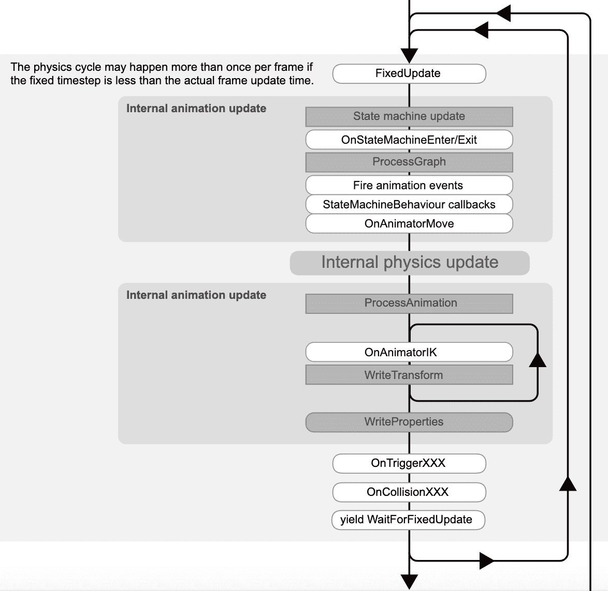
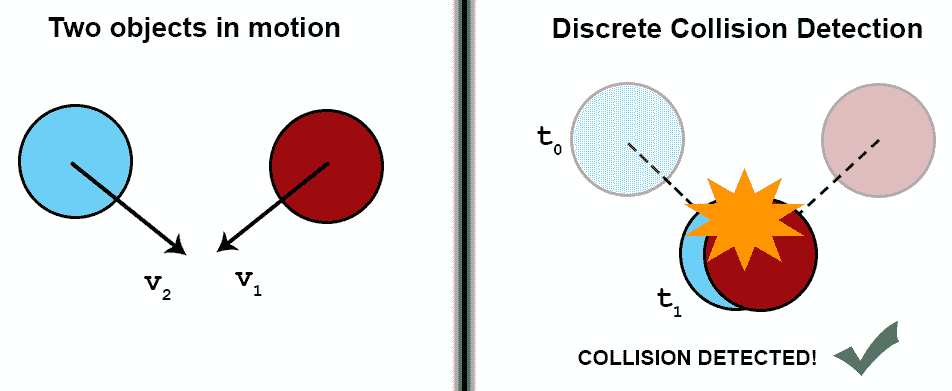
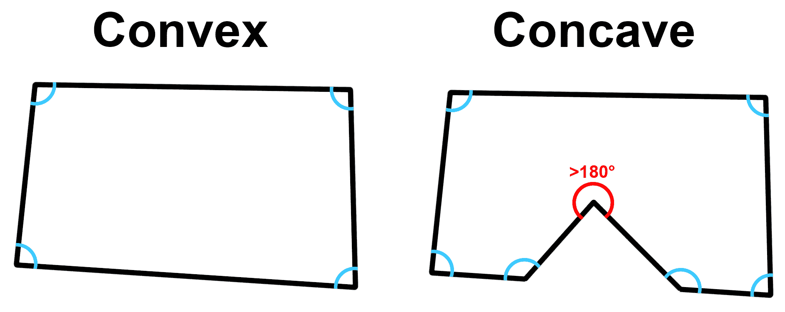
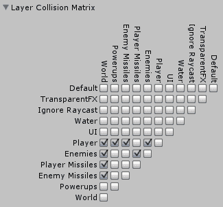
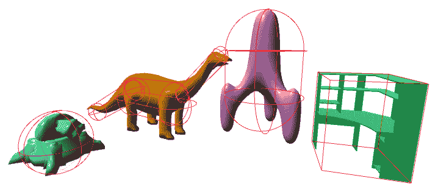
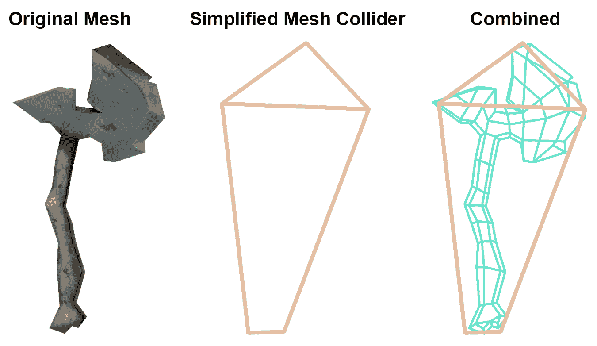

# 更快的物理

到目前为止，我们所探讨的每一个性能提升建议都主要集中在降低资源成本和避免帧率问题。然而，在最根本的层面上，追求峰值性能意味着提升用户体验。这是因为每一个帧率波动、每一次崩溃以及对于特定市场来说过于昂贵的系统要求，最终都会降低产品的质量。物理引擎是一个独特的子系统类别，其行为和一致性对产品质量有着显著的影响。花时间改善它们的行为通常是值得的。

如果重要的碰撞事件被遗漏，游戏在计算复杂的物理事件时会冻结，或者玩家会穿过地板，这些情况对游戏品质有明显的负面影响。一些小故障通常是可以忍受的，但持续的问题会妨碍游戏体验。这通常会导致玩家脱离游戏体验，而用户是否觉得不方便、讨厌或好笑则是一个未知数。除非我们的游戏明确针对喜剧物理类型（如*QWOP*或*Goat Simulator*），否则我们应该努力避免这些情况。

有些游戏可能根本不使用物理引擎，而有些游戏在游戏过程中需要物理引擎处理大量的任务，例如数百个对象之间的碰撞检测、触发体积以启动过场动画、射线投射以进行玩家攻击和 UI 行为、收集特定区域内的对象列表，或者只是使用物理效果作为视觉糖果，让大量的物理粒子四处飞舞。其重要性也取决于所创建的游戏类型。例如，在平台游戏和动作游戏中，正确调整物理引擎至关重要——玩家角色对输入的反应以及世界对玩家角色的反应是使游戏感觉响应和有趣的最关键的两个方面，而在**大型多人在线**（**MMO**）游戏中，物理交互通常有限，精确的物理可能不那么重要。

因此，在本章中，我们将介绍通过 Unity 的物理引擎来减少 CPU 峰值、开销和内存消耗的方法，同时也会包括改变物理行为以提升或至少保持游戏品质，同时优化性能的方法。在本章中，我们将涵盖以下内容：

+   理解 Unity 的物理引擎如何工作：

    +   时间步长和固定更新

    +   碰撞体类型

    +   碰撞

    +   射线投射

    +   Rigidbody 活跃状态

+   物理性能优化：

    +   如何构建场景以实现最佳的物理行为

    +   使用最合适的类型进行碰撞体

    +   优化碰撞矩阵

    +   提高物理一致性并避免易出错的行为

    +   布娃娃和其他基于关节的对象

# 理解物理引擎

Unity 在技术上具有两个不同的物理引擎：Nvidia 的 PhysX 用于 3D 物理，开源项目 Box2D 用于 2D 物理。然而，它们的实现高度抽象，从我们通过主 Unity 引擎配置的高级 Unity API 的角度来看，这两种物理引擎解决方案以功能上相同的方式运行。

在任何情况下，我们对 Unity 的物理引擎了解得越多，我们就能更好地理解可能的性能提升。因此，首先，我们将介绍 Unity 实现这些系统的理论。

# 物理和时间

物理引擎通常假设时间以固定值前进，Unity 的两个物理引擎都以这种方式运行。每个迭代都称为**时间步长**。物理引擎将只使用精确的时间值解决每个时间步长，这与渲染前一帧所需的时间无关。在 Unity 中，这被称为**固定更新时间步长**，默认设置为 20 毫秒（每秒 50 次更新）。

如果物理引擎使用可变时间步长，由于架构（在如何表示浮点值方面）的差异以及客户端之间的延迟，生成两个不同计算机之间碰撞和力的恒定结果可能会很具挑战性。这种物理引擎往往会在多人客户端之间或记录的重放期间产生非常不一致的结果。

下面的图显示了 Unity 执行顺序图的一个重要片段：



完整的执行顺序图可以在[`docs.unity3d.com/Manual/ExecutionOrder.html`](http://docs.unity3d.com/Manual/ExecutionOrder.html)找到。

正如我们在前面的图中可以看到的，固定更新是在物理引擎执行更新之前处理的，两者密不可分。这个过程从确定是否已经过去了足够的时间以启动下一个固定更新开始。一旦确定这一点，结果将取决于自上次固定更新以来过去的时间量。

如果已经过去了足够的时间，那么固定更新过程将调用场景中所有活动 MonoBehaviours 定义的所有`FixedUpdate()`回调，然后是任何与固定更新相关联的协程（特别是那些`yield`到`WaitForFixedUpdate`的协程）。请注意，在这两个过程中调用的方法执行顺序没有保证，所以我们绝对不应该基于这个假设编写代码。一旦这些任务完成，物理引擎就可以开始处理当前的时间步长并调用任何必要的触发器和碰撞器回调。

相反，如果自上次固定更新以来过去的时间太少（即少于 20 毫秒），则当前固定更新将被跳过，并且在前一迭代期间不会执行之前列出的所有任务。此时，输入、游戏逻辑和渲染将允许按正常方式发生。一旦这项活动完成，Unity 将检查是否需要下一次固定更新。

在高帧率下，渲染更新可能会在物理引擎有机会更新自己之前完成多次。因此，固定更新和物理引擎比渲染具有更高的优先级，同时也迫使物理模拟进入固定帧率。

为了确保物体在固定更新之间平滑移动，物理引擎（包括 Unity 的）将在物体在上一状态中的位置和根据剩余时间直到下一次固定更新后它应该所在的位置之间插值每个物体的可见位置。这种插值确保即使物体的物理位置、速度等更新频率低于渲染帧率，物体看起来仍然会平滑移动。

`FixedUpdate()` 回调是一个定义我们希望帧率无关的游戏行为的实用地方。由于假设固定更新频率更容易处理，AI 计算通常在固定更新中解决。

# 最大允许时间步长

需要注意的是，如果自上次固定更新以来已经过去了很多时间（例如，游戏瞬间冻结），那么固定更新将继续在同一个固定更新循环中进行计算，直到物理引擎赶上当前时间。例如，如果前一帧渲染耗时 100 毫秒（例如，突然的 CPU 峰值导致主线程长时间阻塞），那么物理引擎需要更新五次。因此，`FixedUpdate()` 方法将在再次调用 `Update()` 之前被调用五次，这是由于默认的固定更新时间步长为 20 毫秒。当然，如果在这五次固定更新期间有大量的物理活动需要处理，以至于处理它们需要超过 20 毫秒，那么物理引擎将需要调用第六次更新。

因此，在物理活动频繁的时刻，物理引擎处理固定更新所需的时间可能会超过它模拟的时间。例如，如果处理固定更新模拟了 20 毫秒的游戏时间需要了 30 毫秒，那么它就落后了，需要处理更多的时间步来尝试跟上，但这可能会导致它进一步落后，需要处理更多的时间步，依此类推。在这些情况下，物理引擎永远无法逃离固定更新循环并允许渲染另一帧。这个问题通常被称为 **死亡螺旋**。然而，为了防止物理引擎在这些时刻锁定我们的游戏，物理引擎被允许处理每个固定更新循环的最大时间量。这个阈值被称为 **Maximum Allowed Timestep**，如果当前批次的固定更新处理时间过长，那么它将简单地停止，并放弃进一步的处理，直到下一次渲染更新完成。这种设计允许渲染管线至少渲染当前状态，并允许在物理引擎出现异常（故意为之）的罕见时刻，让用户输入和游戏逻辑做出一些决策。

此设置可以通过 Edit | Project Settings | Time | Maximum Allowed Timestep 访问。

# 物理更新和运行时更改

当物理引擎处理一个给定的时间步长时，它必须移动任何活动的 `Rigidbody` 对象（具有 `Rigidbody` 组件的 GameObject），检测任何新的碰撞，并在相应的对象上调用碰撞回调。Unity 文档明确指出，对 `Rigidbody` 对象的更改应在 `FixedUpdate()` 和其他物理回调中处理，正是出于这个原因。这些方法与物理引擎的更新频率紧密耦合，而不是与其他游戏循环的部分，如 `Update()`。

这意味着像 `FixedUpdate()` 和 `OnTriggerEnter()` 这样的回调是进行 `Rigidbody` 变更的安全地方，而像 `Update()` 和在 `WaitForSeconds` 或 `WaitForEndOfFrame` 上产生协程的方法则不是。忽视这条建议可能会导致意外的物理行为，因为物理引擎有机会捕捉和处理所有更改之前，可能对同一对象进行多次更改。

在`Update()`回调中应用力或冲量，而不考虑这些调用的频率，尤其危险。例如，想象一下在玩家按住键的同时在`Update`函数中应用 10 牛顿的力：在两个不同的设备上，由于我们在固定更新中做了同样的事情，结果速度将完全不同。实际上，我们不能依赖于`Update()`调用的数量保持一致。然而，在`FixedUpdate()`回调中这样做将更加一致。因此，我们必须确保所有与物理相关的行为都在适当的回调中处理，否则我们可能会引入一些特别难以复现的游戏玩法错误。

逻辑上可以推断，我们在任何给定的固定更新迭代中花费的时间越多，我们用于下一轮游戏和渲染的时间就越少。大多数情况下，这会导致一些微不足道的、不易察觉的后台处理任务，因为物理引擎几乎没有工作要做，而`FixedUpdate()`回调有足够的时间来完成它们的工作。然而，在某些游戏中，物理引擎在每次固定更新期间可能会执行大量的计算。这种在物理处理时间上的瓶颈将影响我们的帧率，导致帧率随着物理引擎承担更大的工作负载而急剧下降。本质上，渲染管线将尝试按常规进行，但在需要固定更新时，物理引擎需要花费很长时间来处理，渲染管线将几乎没有时间在帧到期之前生成当前显示，导致突然的卡顿。这还加上物理引擎因为达到最大允许时间步长而提前停止的视觉效果。所有这些加在一起将产生一个较差的用户体验。

为了保持流畅和一致的帧率，我们需要通过最小化物理引擎处理任何给定时间步所需的时间来尽可能多地释放渲染时间。这适用于最佳情况（没有移动）和最坏情况（所有东西同时撞击到其他东西）。我们可以在物理引擎中调整几个与时间相关的特性和值，以避免这些性能陷阱。

# 静态碰撞体和动态碰撞体

Unity 中关于**静态**和**动态**术语存在相当极端的命名空间冲突。当使用静态时，通常意味着正在讨论的对象或过程是不动的，保持不变，或者只存在于一个位置，而动态则相反——倾向于移动或改变的对象或过程。然而，重要的是要记住，这些都是独立的话题，静态和动态术语的用法在每个情况下都不同。我们已经介绍了 GameObject 的静态子标志、动态批处理和静态批处理系统，以及 C#语言中的静态类、静态变量和静态函数的概念。所以，为了更加混乱，Unity 还有静态和动态碰撞体的概念。

动态碰撞体指的是包含一个`Collider`组件（可能是几种类型之一）和一个`Rigidbody`组件的 GameObject。通过将`Rigidbody`附加到与碰撞体相同的对象上，物理引擎会将该碰撞体视为必须对外部力（如重力）和与其他刚体碰撞做出反应的物理对象的边界体积。如果我们让一个动态碰撞体与另一个碰撞体相撞，它们将根据牛顿运动定律（或者至少是计算机使用浮点运算所能达到的最佳程度）做出反应。

我们还可以有不含`Rigidbody`组件的碰撞体，这些被称为静态碰撞体。它们实际上充当不可见的障碍物，动态碰撞体可以与之碰撞，但静态碰撞体不会做出反应。换一种方式来想，想象一下没有`Rigidbody`组件的对象具有无限质量。无论你多么用力地把石头扔向具有无限质量的对象，它都不会移动，但你仍然可以期待石头像刚刚撞到实墙一样做出反应。这使得静态碰撞体非常适合作为世界障碍物和其他必须不动的障碍物。

物理引擎自动将动态和静态碰撞体分别放入两个不同的数据结构中，每个数据结构都针对现有碰撞体的类型进行了优化。这有助于简化未来的处理任务，因为例如，在两个静态碰撞体之间解决碰撞和冲量是没有意义的。

# 碰撞检测

Unity 中碰撞检测有三个设置，可以在`RigidBody`组件的碰撞检测属性中进行配置：离散、连续和连续动态。

离散设置启用离散碰撞检测，它基于物体的速度和经过的时间在每个时间步长将物体传送一小段距离。一旦所有物体都移动了，它就会执行边界体积检查，以查找任何重叠部分，将它们视为碰撞，并根据它们的物理属性和重叠方式解决它们。如果小物体移动得太快，这种方法可能会错过碰撞。

下图显示了离散碰撞检测是如何在物体从一个位置瞬移到下一个位置时捕捉两个物体的：



剩余的任一设置都将启用连续碰撞检测，它通过在当前时间步长内插值碰撞器从起始位置到结束位置，并检查沿途是否有任何碰撞。这减少了漏检碰撞的风险，并以比离散碰撞检测显著更高的 CPU 开销为代价，生成更精确的模拟。

连续设置仅允许在给定的碰撞器和静态碰撞器之间启用连续碰撞检测。相同碰撞器与动态碰撞器之间的碰撞仍然会使用离散碰撞检测。

同时，ContinuousDynamic 设置允许碰撞器与所有静态和动态碰撞器之间启用连续碰撞检测，因此在资源消耗方面是最昂贵的。

下图显示了离散碰撞检测和连续碰撞检测方法是如何作用于一对小型、快速移动的物体的：


这是一个为了说明目的的极端例子。在离散碰撞检测的情况下，我们可以观察到物体在单个时间步长内移动的距离是其大小的四倍左右，这通常只会发生在非常小且速度非常高的物体上，因此，如果我们的游戏运行得最优，这种情况是非常罕见的。在绝大多数情况下，物体在单个 20 毫秒时间步长内移动的距离相对于物体的大小来说要小得多，因此碰撞很容易被离散碰撞检测方法捕捉到。

# 碰撞器类型

Unity 中有四种不同的 3D 碰撞器类型。按照性能成本从低到高的顺序，如下所示：

+   球体

+   胶囊体

+   矩形

+   网格

前三种碰撞类型通常被称为**原语**，并保持精确的形状，尽管它们通常可以沿不同方向缩放以满足特定需求。然而，网格碰撞器可以根据分配的网格定制为特定形状。还有三种类型的 2D 碰撞器——圆形、矩形和多边形，它们的功能分别类似于球体、矩形和网格碰撞器。以下所有信息大多可以转移到等效的 2D 形状。

注意，我们也可以在 Unity 中生成圆柱形 3D 对象，但这仅限于其图形表示。自动生成的圆柱形状使用胶囊体碰撞器来表示其物理边界体积，这可能会产生不符合预期的物理行为。

此外，网格碰撞体有两种类型：**凸面**和**凹面**。区别在于凹面形状至少有一个大于 180 度的内部角度（形状两个内部边之间的角度）。为了说明这一点，以下图表显示了**凸面**和**凹面**形状之间的区别：



记忆凸面和凹面形状之间区别的一个简单方法是，凹面形状在其内部至少有一个洞穴。

两种网格碰撞体类型使用相同的组件（一个`MeshCollider`组件）。通过凸面复选框切换生成的网格碰撞体类型。启用此选项将允许对象与所有原始形状（球体、盒子等）以及其他启用了凸面的网格碰撞体发生碰撞。

此外，如果对于一个具有凹面形状的网格碰撞体启用了凸面复选框，那么物理引擎将自动简化它，生成一个具有最近凸面形状的碰撞体。

在前面的例子中，如果我们导入右侧的凹面网格并启用凸面复选框，它将生成一个更接近左侧凸面形状的碰撞体形状。在任何情况下，物理引擎都将尝试生成一个与附加网格形状匹配的碰撞体，其顶点数上限为 255。如果目标网格的顶点数超过这个数，在网格生成过程中将抛出错误。

`Collider`组件还包含`IsTrigger`属性，允许它们被视为非物理对象，但在其他碰撞体进入或离开它们时仍然可以触发物理事件。这些被称为**触发体积**。通常，当另一个碰撞体接触、保持接触（每个时间步）或停止接触时，分别调用碰撞体的`OnCollisionEnter()`、`OnCollisionStay()`和`OnCollisionExit()`回调。然而，当碰撞体用作触发体积时，将使用`OnTriggerEnter()`、`OnTriggerStay()`和`OnTriggerExit()`回调。

注意，由于解决物体间碰撞的复杂性，凹面网格碰撞体不能也是动态碰撞体。凹面形状只能用作静态碰撞体或触发体积。如果我们尝试向凹面网格碰撞体添加`Rigidbody`组件，Unity 将忽略它。

假设你**真正**需要一个作为`Rigidbody`组件使用的凹面网格碰撞体？解决方案是将对象分解为多个独立的凸面网格碰撞体的组合：例如，你可能想通过组合两个凸面盒子来创建一个 L 形的`Rigidbody`。不幸的是，因为这是一个微妙的决策，没有自动化的方法来做这件事，你需要手动进行这种分解。

# 碰撞矩阵

物理引擎具有一个碰撞矩阵，它定义了哪些对象可以与哪些其他对象发生碰撞。当需要解决边界体积重叠和碰撞时，不符合此矩阵的对象将被物理引擎自动忽略。这有助于在碰撞检测阶段节省物理处理时间，并允许物体相互移动而不会发生任何碰撞。

可以通过“编辑 | 项目设置 | （物理 / 物理 2D）| 层碰撞矩阵”访问碰撞矩阵。

碰撞矩阵系统通过 Unity 的层系统工作。矩阵代表可能出现的每个层到层组合，勾选复选框意味着在碰撞检测阶段将检查这两个层中的碰撞体。请注意，没有方法可以仅允许两个对象中的一个响应碰撞。如果一个层可以与另一个层碰撞，那么它们都必须响应碰撞。然而，静态碰撞体是一个例外，因为它们不允许物理上对碰撞做出反应（尽管它们仍然会接收到`OnCollision...()`回调）。

注意，我们整个项目只能使用 32 个总层（因为物理引擎使用 32 位掩码来确定层间碰撞机会），因此我们必须将对象组织成合理的层，这些层将贯穿整个项目的生命周期。如果出于任何原因，32 个层不足以满足我们的项目需求，那么我们可能需要找到巧妙的方法来重复使用层或删除不必要的层。

# `Rigidbody`的活跃和休眠状态

每个现代物理引擎都共享一个标准的优化技术，即静止的物体将它们的内部状态从活跃状态更改为休眠状态。当`Rigidbody`处于休眠状态时，在固定更新期间将不会花费处理器时间来更新对象，直到外力或碰撞事件将其唤醒。

用于确定静止状态值的测量值在不同物理引擎中往往有所不同；它可以使用线性速度、角速度、动能、动量或其他`Rigidbody`的物理属性来计算。Unity 的两个物理引擎都是通过评估物体的质量归一化动能来工作的，这本质上等同于其速度大小的平方。

如果物体在短时间内速度没有超过某个阈值，那么物理引擎将假设物体将不再需要移动，直到它经历了新的碰撞，或者对其施加了新的力。在此之前，休眠的物体将保持其当前位置。设置阈值过低意味着物体不太可能进入休眠状态，因此我们将在物理引擎的每次固定更新中持续支付少量的处理成本，即使它没有做任何重要的事情。同时，设置阈值过高意味着缓慢移动的物体在物理引擎决定它们需要进入休眠状态时，会突然停止。控制休眠状态的阈值可以在“编辑 | 项目设置 | 物理 | 休眠阈值”下修改。我们还可以从 Profiler 窗口的物理区域获取活动`Rigidbody`对象的总数。

注意，休眠物体并没有完全从模拟中移除。如果一个移动的`Rigidbody`接近休眠物体，那么它仍然必须执行检查，以确定附近物体是否与之碰撞，这将重新唤醒休眠物体，将其重新引入模拟以进行处理。

# 射线和物体投射

另一个物理引擎的常见特性是能够从一个点到另一个点投射一条射线，并与其路径上的一个或多个物体生成碰撞信息。这被称为**射线投射**。通过射线投射实现几个游戏机制是很常见的，例如开枪。这通常是通过从玩家到目标位置执行射线投射，并找到其路径上的任何有效目标（即使只是一个墙壁）来实现的。

我们还可以使用`Physics.OverlapSphere()`检查在空间中固定点有限距离内的目标列表。这通常用于实现区域效果游戏特性，例如手榴弹或火球爆炸。我们甚至可以使用`Physics.SphereCast()`和`Physics.CapsuleCast()`将整个物体向前投射。这些方法通常用于模拟宽激光束，或者如果我们想看看移动角色的路径上会有什么。

# 调试物理

物理错误通常分为两类：一个物体对在它不应该发生碰撞时发生了碰撞/没有发生碰撞，或者物体发生了碰撞，但在之后发生了意料之外的事情。前者通常更容易调试；这通常是由于碰撞矩阵中的错误、在光线投射中使用的不正确的层，或者物体碰撞器的尺寸或形状不正确。后者通常由于三个大问题而更具挑战性：

+   确定哪些碰撞物体导致了问题

+   确定碰撞解决前的碰撞条件

+   重新模拟碰撞

这三部分信息中的任何一部分都会使问题解决变得容易得多，但在某些情况下，它们都很难获得。

分析器在物理和物理（二维）区域（分别对应 3D 和 2D 物理）提供了一些信息量，这可以是有一定帮助的。我们可以了解所有刚体和不同类型（如动态碰撞体、静态碰撞体、运动学对象、触发体积、约束（用于模拟铰链和其他连接的物理对象）和接触）的刚体组在 CPU 活动上花费了多少时间。

物理二维区域包含一些额外的信息，例如休眠和活动刚体数量以及处理时间步长所需的时间。详细分解视图在这两种情况下都提供了更多信息。这些信息有助于我们关注物理性能，但如果我们发现物理行为中存在错误，它并不能告诉我们太多关于出错原因的信息。

一个更适合帮助我们调试物理问题的工具是物理调试器，可以通过“窗口”|“分析”|“物理调试器”打开。这个工具可以帮助我们从场景窗口中过滤出不同类型的碰撞体，从而更好地了解哪些对象相互碰撞。当然，这并不能太多地帮助我们确定问题的条件并重现问题。

注意，物理调试器中的设置不会影响游戏窗口中的对象可见性。

很遗憾，对于剩余的问题，没有太多秘密建议可以提供。在碰撞发生之前或发生时捕捉有关碰撞的信息通常需要在`OnCollisionEnter()`或`OnTriggerEnter()`回调中设置许多目标断点，以捕捉问题发生时的状态，并使用单步调试直到问题的根源变得明显。作为最后的手段，我们可以在问题发生之前添加`Debug.Log()`语句来记录重要信息，尽管这可能是一项令人沮丧的练习，因为我们有时不知道需要记录哪些信息，或者从哪些对象中记录，因此我们最终将日志添加到所有内容中。

另一个常见的头痛来源是尝试重现物理问题。由于用户输入（通常在`Update()`中处理）和物理行为（在`FixedUpdate()`中处理）之间的非确定性，重现碰撞始终是一个挑战。尽管物理时间步长发生相对规律，但模拟在每个`Update()`会话之间会有不同的时间，因此，如果我们记录了用户输入时间并自动回放场景，试图在输入应用的时刻应用记录的输入并不总是完全相同，因此我们可能不会得到相同的结果。

将用户输入处理移动到`FixedUpdate()`是可能的，如果用户输入控制`Rigidbody`行为，例如在玩家按下某些键的同时施加不同方向的力，这将是很有帮助的。然而，这往往会引起输入延迟或*滞后*，因为物理引擎对按键响应需要从 0 到 20 毫秒（基于固定更新时间步频率）的时间。瞬间的输入，如跳跃或激活能力，始终最好在`Update()`中处理，以避免

缺少的按键。

辅助函数，如`Input.GetKeyDown()`，仅在玩家按下指定键的帧返回`true`，在下一个`Update()`期间返回`false`。如果我们试图在`FixedUpdate()`期间读取键按下事件，除非恰好在这两个帧之间发生物理时间步，否则我们永远不会知道用户是否按下了键。这可以通过输入缓冲/跟踪系统来解决，但如果仅仅是为了复制物理错误而实现它，这无疑是一个麻烦大于其价值的事情。

最终，经验和坚持是解决大多数物理问题的唯一正确途径。我们对物理引擎了解得越多，找到问题根源的直觉就越强，但遗憾的是，由于它们的可重复性有限，有时行为模糊不清，解决这些问题几乎总是需要花费大量时间，因此我们应该预期物理问题修复所需的时间会比大多数逻辑错误修复的时间更长，并在解决问题之前预留额外的时间。

现在我们已经了解了 Unity 物理引擎的大多数功能，我们可以介绍一些优化技术来提高我们游戏中的物理性能。

# 物理性能优化

在本节中，我们将介绍几种技术、优化、技巧和设置，这些可以帮助您的游戏从游戏中提取每一滴物理性能。这包括如何设置场景、何时使用静态碰撞器、如何配置碰撞矩阵、何时使用触发器而不是刚体，以及更多。让我们逐一介绍所有这些内容。

# 场景设置

首先，我们可以应用一些最佳实践来提高我们场景中物理模拟的一致性。请注意，这些技术中的几个不一定能提高 CPU 或内存使用，但它们将降低物理引擎不稳定性的可能性。

# 缩放

我们应该尽量将世界中的所有物理对象比例保持得尽可能接近 `(1,1,1)`。默认情况下，Unity 假设我们正在尝试模拟与地球表面相似的游戏玩法。地球表面的重力是每秒 9.81 米，因此默认的重力值设置为 `-9.81` 以匹配。Unity 世界空间中的一个单位相当于 1 米，负号表示它将拉动对象向下。我们的对象大小应该反映我们的有效世界比例，因为如果它们太大，重力看起来会移动对象比我们预期的要慢得多。如果我们的所有对象都放大了五倍，那么重力看起来会弱五倍。相反的情况也是真实的；对象缩放得太小会使它们看起来下落得太快，并且看起来不真实。

我们可以通过修改“编辑 | 项目设置 | 物理 / 2D 物理 | 重力”下的重力强度来调整世界的隐含比例。然而，请注意，任何浮点运算在值接近 `0` 时将更加准确，因此如果我们有一些比例值远高于 `(1,1,1)` 的对象，即使它们与隐含的世界比例相匹配，我们仍然可能会观察到不规则的物理行为。因此，在项目早期，我们应该将最常用的物理对象导入并围绕比例值 `(1,1,1)` 进行缩放，然后调整重力值以匹配。这将为我们引入新对象时提供一个参考点。

# 定位

类似地，将所有对象在世界的空间位置上保持接近 `(0,0,0)` 将导致更好的浮点精度，从而提高模拟的一致性。空间模拟器和自由运行的游戏试图模拟极其巨大的空间，通常使用一种秘密将玩家传送到世界中心的技巧，或者固定他们的位置，在这种情况下，要么将空间体积分成几个部分，以便物理计算始终使用接近 `0` 的值，要么将其他所有东西移动以模拟旅行，而玩家的运动只是一个幻觉。

大多数游戏不会引入浮点不准确性，因为大多数游戏关卡通常持续大约 10 到 30 分钟，这不会给玩家太多时间进行荒谬的长距离旅行，但如果我们正在处理特别大的场景，或者在整个游戏过程中异步加载场景，以至于玩家旅行了数万米，那么我们可能会开始注意到一些奇怪的物理行为，随着他们走得更远。

因此，除非我们已经非常深入到我们的项目中，以至于在后期阶段更改和重新测试一切会变得过于麻烦，我们应该尽量将所有物理对象保持接近 `(0,0,0)`。此外，这对于我们的项目工作流程来说也是良好的实践，因为它使得在游戏世界中查找对象和调整事物变得更快。

# 质量

质量作为浮点值存储在`Rigidbody`组件的质量属性下，由于其物理引擎的更新，关于其使用的文档在多年中发生了相当大的变化。自 Unity 5 后期以来，我们基本上可以自由选择`1.0`值代表什么，然后按比例调整其他值。

适当地分配值。

传统上，质量值为`1.0`用来表示 1 千克的质量，但我们可以决定一个人类的质量为`1.0`（约 80 千克），在这种情况下，汽车的质量值将为`15.0`（约 1,200 千克），物理碰撞将类似于我们预期的结果。最重要的是相对质量差异，这允许这些对象之间的碰撞看起来逼真，而不会过度压力引擎。浮点精度也是一个考虑因素，因此我们不想使用过于荒谬的大质量值。

注意，如果我们打算使用轮式碰撞体，它们的设计假设质量为`1.0`代表 1 千克，因此我们应该适当地分配我们的质量值。

理想情况下，我们应该保持质量值在`1.0`左右，并确保最大相对质量比大约为`100`。如果两个物体的质量比远高于这个值，那么大的动量差异可能会因为冲量而突然转变为巨大的速度变化，导致一些不稳定的物理现象和潜在的浮点精度损失。具有显著比例差异的对象对可能需要通过碰撞矩阵进行剔除以避免问题（关于这一点稍后还会讨论）。

不恰当的质量比是 Unity 中物理不稳定性和异常行为最常见的原因。这在使用关节连接如布娃娃等对象时尤其如此。

注意，地球中心的引力对所有物体的影响是相同的，无论其质量如何，因此我们是否将质量属性值`1.0`视为橡皮球的重量或战舰的重量并不重要。没有必要调整引力来补偿。然而，重要的是，给定物体在下落过程中所经历的空气阻力（这就是为什么降落伞会缓慢下落）。因此，为了保持逼真的行为，我们可能需要为这类对象自定义阻力属性或根据每个对象自定义引力。例如，我们可以禁用“使用重力”复选框，并在固定更新期间应用我们的自定义引力。

# 适当地使用静态碰撞体

如前所述，物理引擎会自动生成两个独立的数据结构来分别存储静态碰撞体和动态碰撞体。不幸的是，如果在运行时向静态碰撞体数据结构中引入新对象，那么它必须被重新生成，类似于调用`StaticBatchingUtility.Combine()`进行静态批处理。这很可能会导致 CPU 使用率显著上升。因此，在游戏过程中避免实例化新的静态碰撞体变得至关重要。

此外，仅仅移动、旋转或缩放静态碰撞体也会触发此再生过程，应避免这样做。如果我们希望移动碰撞体而无需物理上对其与其他对象的碰撞做出反应，则应附加 `Rigidbody` 以使其成为动态碰撞体并启用运动学标志。此标志防止对象对外部冲量做出反应，类似于静态碰撞体，但对象仍然可以通过其 `transform` 组件或通过施加到其 `Rigidbody` 组件上的力（最好在固定更新期间）进行移动。由于运动学对象不会对其他对象的撞击做出反应，因此它在移动时会倾向于将其他动态碰撞体推开。

正是因为这个原因，玩家角色对象通常会被制作成运动学碰撞体。

# 负责任地使用触发体积

如前所述，我们可以将我们的物理对象视为普通碰撞体或触发体积。这两种类型之间的重要区别是，`OnCollider...()` 回调函数将一个 `Collision` 对象作为参数传递给回调函数，其中包含有用的信息，例如碰撞的确切位置（有助于定位粒子效果）和接触法线（如果我们想在碰撞后手动移动对象，则很有用）。然而，`OnTrigger...()` 回调函数不提供此类信息。

因此，我们不应该尝试使用触发体积来实现碰撞反应行为，因为我们不会有足够的信息来使碰撞看起来准确。触发体积最好用于其预期目的，即跟踪对象何时进入/离开特定区域，例如，当玩家停留在熔岩坑中处理伤害，当玩家进入建筑时触发一个场景，以及当玩家接近/远离另一个主要区域时启动/卸载场景。

如果绝对需要接触信息来进行触发体积碰撞，则常见的解决方案包括以下任何一种：

+   通过将触发体积和碰撞对象质心之间的距离减半来生成接触点的粗略估计（这假设它们的大小大致相等）。

+   从触发体积的中心向碰撞对象的质心进行射线投射（如果两个对象都是球形的，效果最佳）。

+   创建一个非触发体积对象，给它一个无限小的质量（这样它的存在几乎不会影响碰撞对象），并在碰撞时立即销毁它（因为与如此大的质量差异的碰撞可能会将这个小物体送入轨道）。

当然，每种方法都有其缺点——有限的物理准确性、碰撞期间的额外 CPU 开销和/或额外的场景设置（以及看起来相当奇怪的碰撞代码），但在紧急情况下它们可能很有用。

# 优化碰撞矩阵

如我们所知，物理引擎的碰撞矩阵定义了分配给特定层的对象允许与分配给其他层的对象发生碰撞。更简洁地说，哪些对象碰撞对被物理引擎认为是可行的。其他所有对象-层对都被物理引擎简单地忽略，这使得这是一个减少物理引擎工作负载的重要途径，因为它减少了每个固定更新必须执行的边界体积检查的数量，以及在整个应用程序生命周期中需要处理的碰撞数量（这将为移动设备节省电池寿命）。

注意，可以通过“编辑”|“项目设置”|“物理”（或“物理 2D”）|“层碰撞矩阵”访问碰撞矩阵。

下面的截图显示了一个街机射击游戏的典型碰撞矩阵：



在前面的例子中，我们标记了对象为玩家、敌人、玩家导弹、敌人导弹和道具，并且我们已经最小化了物理引擎需要检查的可能对象间碰撞的数量。

从标记为玩家的第一行勾选开始，我们希望玩家对象能够与世界对象发生碰撞，拾取道具，被敌人导弹击中，并与敌人发生碰撞。然而，我们不希望它们与自己的玩家导弹或自身发生碰撞（尽管在这个层中可能只有一个对象）。因此，玩家行中启用的复选框反映了这些要求。我们只想让敌人与世界对象和玩家导弹发生碰撞，所以在敌人行中勾选了这些。请注意，玩家到敌人的碰撞对已经在上一行中处理过了；因此，没有必要在敌人行中再次出现。我们还希望玩家导弹和敌人导弹在击中世界对象时爆炸，所以这些被标记了，最后我们不在乎道具与玩家以外的任何东西发生碰撞，也不希望世界对象与其他世界对象发生碰撞，所以在最后两行没有勾选复选框。

在任何给定时刻，我们可能只有一个玩家对象，2 个增益道具，7 个玩家导弹，10 个敌人，和 20 个敌人导弹，这共有 780 个潜在的碰撞对（这是计算出来的，因为 40 个不同的对象中的每一个都可以与 39 个其他对象发生碰撞，从而产生 1,560 个可能的碰撞对，但然后我们将总数除以 2 以忽略重复的对）。仅仅优化这个矩阵，我们就将其减少到不到 100，这意味着潜在的碰撞检查减少了近 90%。当然，Unity 物理引擎会有效地剔除掉很多这些对象对，如果它们彼此之间距离太远。因此，几乎没有机会它们会碰撞（这是在称为**粗略阶段剔除**的隐藏过程中计算的），所以实际节省的可能会好得多，但它几乎不需要任何努力就能释放一些 CPU 周期。另一个显著的好处是它简化了我们的游戏逻辑编码；如果我们告诉物理引擎忽略增益道具和敌人导弹之间的碰撞，我们就不需要弄清楚如果它们发生碰撞会发生什么。

我们应该对所有潜在的层组合在碰撞矩阵中进行逻辑合理性检查，以查看我们是否在浪费宝贵的时间检查那些不必要的对象对之间的对象间碰撞。

# 倾向于使用离散碰撞检测

离散碰撞检测相对便宜，因为将对象传送一次并在单个时间步长内执行附近对象对之间的单个重叠检查是一项相对简单的工作。执行连续碰撞检测所需的计算量显著更高，因为它涉及到在分析这些点之间可能发生的任何轻微边界体积重叠的同时，对两个对象在起始位置和结束位置之间的插值。

因此，连续碰撞检测选项比离散检测方法贵一个数量级，而连续动态碰撞检测设置甚至比连续碰撞检测更昂贵。如果配置了太多对象使用任何一种连续碰撞检测类型，将会在复杂场景中导致严重的性能下降。在两种情况下，碰撞检测的成本都会随着任何给定帧中需要比较的对象数量呈指数增长，如果碰撞体是动态的而不是静态的，增长将更为陡峭。

因此，我们应该为绝大多数对象优先选择离散碰撞检测设置，而仅在极端情况下使用任一连续碰撞检测设置。当游戏世界的静态部分频繁错过重要碰撞时，应使用连续设置。例如，如果我们希望确保玩家角色永远不会从游戏世界中掉落，或者如果他们移动得太快，永远不会意外地通过墙壁传送，那么我们可能只想为这些对象应用连续碰撞检测。最后，如果相同的情况适用，并且我们希望捕捉到非常快速移动的动态碰撞器之间的碰撞，则应仅使用 ContinuousDynamic 设置。

# 修改固定更新频率

在某些情况下，离散碰撞检测在大规模上可能工作得不够好。也许我们的整个游戏都围绕着大量的小型物理对象，而离散碰撞检测根本无法捕捉到足够的碰撞以维持产品质量。然而，将连续碰撞检测设置应用于所有内容将对性能产生极大的负面影响。在这种情况下，我们可以尝试一个选项：我们可以自定义物理时间步长，通过修改引擎检查固定更新的频率，给离散碰撞检测系统更好的机会捕捉到这种碰撞。

如前所述，固定更新和物理时间步长处理紧密相关；因此，通过修改固定更新检查的频率，我们不仅改变了物理引擎计算和解决下一个回调的速率，还改变了`FixedUpdate()`回调和协程被调用的频率。因此，如果我们已经深入到项目中并且有很多依赖于这些回调的行为，那么更改此值可能会有风险，因为我们将会改变关于这些方法调用频率的基本假设。

使用编辑器中的“编辑 | 项目设置 | 时间 | 固定时间步长”属性或通过脚本代码中的`Time.fixedDeltaTime`属性，可以更改固定的更新频率。

减少此值（增加频率）将迫使物理引擎更频繁地处理，从而有更好的机会通过离散碰撞检测捕捉到碰撞。当然，这会带来额外的 CPU 成本，因为我们正在调用更多的`FixedUpdate()`回调，并要求物理引擎更频繁地更新，使其更频繁地移动对象和验证碰撞。

相反，增加这个值（降低频率）为 CPU 提供了更多时间在再次处理物理处理之前完成其他任务，或者从另一个角度来看，它给了物理引擎更多时间在开始处理下一个时间步之前处理最后一个时间步。不幸的是，降低固定更新频率将不可避免地减少物体在物理引擎无法再通过离散碰撞检测捕获碰撞之前可以移动的最大速度（取决于物体的尺寸）。我们可能还会看到物体以奇怪的方式改变速度，因为这本质上是对现实世界物理行为的较弱近似。

这使得每次更改固定时间步长值时进行大量测试变得至关重要。即使完全理解这个值的工作原理，也很难预测游戏过程中的整体结果以及结果是否在质量方面可以接受。因此，这个值的更改应该在项目的早期生命周期中进行，并且应该很少更改，以便尽可能多地针对尽可能多的物理情况进行测试。

创建一个测试场景，让一些高速物体相互碰撞，以验证结果是否可接受，并在每次固定时间步长变化时运行这个场景可能会有所帮助。然而，实际的游戏玩法往往相当复杂，有许多后台任务和未预见的玩家行为，这会给物理引擎带来额外的工作，或者给它更少的时间来处理当前迭代。在真空中无法复制实际游戏玩法条件。此外，没有替代品可以替代真实的事物，因此，我们可以在当前固定时间步长的值上进行更多测试，这样我们就可以更有信心地认为这些变化符合可接受的质量标准。

以一个从事软件开发自动化工具开发的人的经验来看：在许多情况下，软件测试的自动化是有帮助的，但当涉及到与多个硬件设备和复杂子系统（如物理引擎）同步的实时事件和用户输入驱动的应用程序时，这些子系统由于反馈的迭代而倾向于快速变化，自动化测试的支持和维护成本往往比其价值更大，这使得手动测试成为最合理的途径。

我们总是将连续碰撞检测作为最后的手段来抵消我们观察到的某些结果不稳定。不幸的是，即使这些变化是针对特定目标的，由于连续碰撞检测的开销成本，这很可能会比我们开始时造成更多的性能问题。在启用连续碰撞检测之前和之后对场景进行性能分析，以验证收益是否超过了成本，这将是一个明智的做法。

# 调整最大允许时间步长

如果我们经常超过最大允许时间步长（提醒一下，这决定了物理引擎在必须提前退出之前可以解决多少时间步长），那么将会导致一些相当奇怪的物理行为。刚体看起来会减速或突然停止，因为物理引擎需要在完全解决整个时间配额之前，多次提前退出时间步计算。在这种情况下，这是一个明显的迹象，表明我们需要从其他角度优化我们的物理行为。然而，至少我们可以确信，这个阈值将防止游戏在物理处理过程中中间出现峰值时完全锁定。

提醒：此设置可通过编辑 | 项目设置 | 时间 | 最大允许时间步长访问。

默认设置是消耗最多 0.333 秒，如果超过这个值，将会表现为帧率明显下降（仅为 3 FPS）。如果你觉得需要更改此设置，那么显然你的物理工作负载存在一些大问题，因此建议你只有在用尽所有其他方法后，才调整此值。

# 最小化射线投射和边界体积检查

所有射线投射方法都非常有用，但它们相对昂贵，尤其是`CapsuleCast()`和`SphereCast()`。我们应该避免在`Update()`回调或协程中定期调用这些方法，只为脚本代码中的关键事件保留它们。

如果我们在场景中使用持久线、射线或区域碰撞区域（例如安全激光、持续燃烧的火焰和光束武器），并且对象相对静止，那么使用简单的触发体积模拟可能更好。

如果这种替换不可行，并且我们确实需要使用这些方法进行持久的投射检查，我们应该通过利用`LayerMasks`来最小化每个射线投射的处理量。这尤其适用于我们使用`Physics.RaycastAll()`的情况。例如，这种射线投射的糟糕优化可能如下所示：

```cs
void PerformRaycast() {
 RaycastHit[] hits;
  hits = Physics.RaycastAll(transform.position, transform.forward, 
  100.0f);
  for (int i = 0; i < hits.Length; ++i) {
    RaycastHit hit = hits[i];
    EnemyComponent e = hit.transform.GetComponent<EnemyComponent>();
    if (e.GetType() == EnemyType.Orc) {
        e.DealDamage(10);
    }
  }
}
```

在前面的例子中，我们正在收集射线投射碰撞数据，针对这条射线路径上的每个对象，但我们只处理对具有特定`EnemyComponent`实例的对象的影响。因此，我们要求物理引擎完成比必要多得多的工作。

更好的方法是使用`RaycastAll()`的不同重载，它接受一个作为参数的`LayerMask`值。这将以与碰撞矩阵相同的方式过滤射线的碰撞，以便它只测试给定层（s）中的对象。以下代码通过提供额外的`LayerMask`属性进行细微的改进；我们将通过检查器窗口为此组件配置`LayerMask`，这将更快地过滤列表，并且只包含与掩码匹配的`hits`：

```cs
[SerializeField] LayerMask _layerMask;

void PerformRaycast() {
  RaycastHit[] hits;
  hits = Physics.RaycastAll(transform.position, transform.forward, 100.0f, _layerMask);
  for (int i = 0; i < hits.Length; ++i) {
    // as before ...
  }
}
```

这种优化对`Physics.RaycastHit()`函数的效果并不好，因为该版本只提供射线与第一个碰撞对象的碰撞信息，无论我们是否使用`LayerMask`。

注意，由于`RaycastHit`和`Ray`类由 Unity 引擎的本地内存空间管理，它们不会导致垃圾收集器注意到的内存分配。我们将在第八章“精湛的内存管理”中了解更多关于此类活动的内容。

# 避免复杂的网格碰撞体

按照碰撞检测效率的顺序，各种碰撞体是球体、胶囊体、盒子、凸网格碰撞体和凹网格碰撞体，其中最后一种是成本最高的。碰撞总是涉及成对的物体，解决碰撞所需的工作（数学运算）将取决于两个物体的复杂性。检测两个原始物体的碰撞可以简化为一系列相对简单的数学方程，这些方程经过了高度优化。对一对凸网格碰撞体进行比较的方程要复杂得多，这使得它们比两个原始物体之间的碰撞贵一个数量级。然后，还有两个凹网格碰撞体之间的碰撞，它们如此复杂，以至于不能简化为简单的公式，需要在每个网格的每对三角形之间进行碰撞检查，这使得它们比其他碰撞体类型的碰撞贵许多数量级。当我们解决不同组形状之间的碰撞时，涉及的工作量以类似的方式缩放。例如，原始物体与凹网格碰撞体之间的碰撞会比两个原始物体之间的碰撞慢，但会比两个凹网格碰撞体之间的碰撞快。

还有一个问题，即参与碰撞的物体中是否有一个或两个正在移动（如果一个物体是静态碰撞体，处理起来比两个都是动态碰撞体要容易）。还有一点是，场景中有多少这样的物体，因为如果我们不小心引入到模拟中的形状数量，碰撞检测的总处理成本将会激增。

在 3D 应用程序中，表示物理和图形之间的一个巨大讽刺是如何难以在这两者之间处理球形和立方体对象。完美的球形网格需要生成无限数量的多边形，这使得这样的对象在图形上无法表示。

然而，在物理引擎中处理两个球体之间的碰撞可能是解决接触点和碰撞的最直接问题（接触点始终位于任一球体半径的边缘，接触法线始终是它们质心之间的向量）。相反，立方体是图形上表示最简单的对象之一（只需 8 个顶点和 12 个三角形），但要找到接触点和解决碰撞（解决这些碰撞的数学取决于碰撞是发生在面、边、角还是混合配对之间）需要显著更多的数学和计算能力。据观察，这表明创建最大数量对象的最有效方法可能是用使用球形碰撞器的立方体对象来填充我们的世界。然而，这对人类观察者来说完全没有意义，因为他们会看到立方体像球一样滚动。

之前的例子提醒我们，一个对象的物理表示不一定需要与其图形表示相匹配。这是有益的，因为图形网格通常可以简化为更简单的形状，同时仍然产生非常相似的物理行为，并同时消除使用过于复杂的 Mesh Collider 的需求。

这种在图形和物理之间分离表示的方法使我们能够在不（必然）负面影响另一个系统的情况下优化一个系统的性能。只要没有对游戏玩法产生明显的负面影响（或者我们愿意做出牺牲），我们就自由地用更简单的物理形状来表示复杂的图形对象，而玩家不会注意到。此外，如果玩家从未注意到，那么就不会造成任何伤害。

因此，我们可以通过以下两种方式之一解决这个问题：要么通过使用一个（或多个）标准原语来近似复杂形状的物理行为，要么使用一个更简单的 Mesh Collider。

# 使用更简单的原语

大多数形状都可以使用三种基本碰撞器之一来近似。实际上，我们不需要仅使用单个碰撞器来表示对象。如果它们有助于我们通过附加具有碰撞器的额外子 GameObject 来创建复杂的碰撞形状，我们可以自由地使用多个碰撞器。这几乎总是比使用单个 Mesh Collider 更经济，应该优先考虑。

以下截图显示了由一个或多个更简单的原语碰撞器形状表示的一组复杂图形对象：



对于这些对象中的任何一个使用网格碰撞器，由于它们包含的多边形数量，其成本将显著高于这里显示的原始碰撞器。值得探索所有机会，尽可能使用这些原始形状简化我们的对象，因为它们可以提供显著的性能提升。

例如，凹面网格碰撞器是独特的，因为它们可以具有间隙或孔洞，允许其他网格落入甚至穿过它们，这为物体通过使用此类碰撞器作为世界碰撞区域提供了机会。在这种情况下，通常将盒形碰撞器放置在战略位置会更好。

# 使用更简单的网格碰撞器

同样，分配给网格碰撞器的网格不一定需要与同一对象的图形表示相匹配（Unity 只是将其作为默认选择）。这允许我们将一个更简单的网格分配给网格碰撞器的`mesh`属性，这与我们用于其图形表示的网格不同。

以下截图显示了一个复杂的图形网格，其网格碰撞器已被赋予了一个更简化的网格：



以这种方式将渲染网格简化为具有较低多边形计数的凸形状将显著减少确定与其他碰撞器边界体积重叠所需的开销。根据原始对象估计的好坏，游戏体验上的差异应该是最小的，尤其是在这个斧头的情况下，我们预计它将在攻击时快速移动，使得玩家不太可能注意到两种网格作为碰撞器之间的差异。实际上，简化后的网格不太可能被离散碰撞检测忽略，因此出于这个原因更可取。

# 避免复杂的物理组件

某些特殊的物理`Collider`组件，如`TerrainCollider`、`Cloth`和`WheelCollider`，在成本上比所有原始碰撞器甚至某些情况下的网格碰撞器高得多。除非绝对必要，否则我们不应在我们的场景中包含此类组件。例如，如果我们有玩家永远不会接近的远处的地形对象，那么包含附加的`TerrainCollider`组件就几乎没有理由。

拥有`Cloth`组件的游戏在运行在低质量设置时应考虑实例化不带它们的对象，或者简单地动画化布料行为（尽管如果团队已经对布料移动的方式产生了感情并爱上了它，这是完全可以理解的）。

使用`WheelCollider`组件的游戏应尽量减少轮轴碰撞器的使用。大型车辆，如果拥有超过四个轮子，可能仅用四个轮子就能模拟出类似的行为，同时通过图形上模拟额外的轮子来欺骗视觉效果。

# 让物理对象休眠

物理引擎的休眠功能可能会给我们的游戏带来几个问题。首先，一些开发者没有意识到他们的大多数刚体在应用程序的大部分生命周期中都是处于休眠状态的。这往往导致开发者认为他们可以通过（例如）将游戏中的刚体数量加倍来逃避问题，整体成本也会简单地加倍以匹配。这不太可能。碰撞频率和活动对象的总累积时间更有可能呈指数增长而不是线性增长。每次向模拟中引入新的物理对象时，都会导致意外的性能成本。当我们决定增加场景的物理复杂性时，我们应该牢记这一点。

第二，在运行时更改`Rigidbody`组件上的任何属性，例如质量、阻力和`useGravity`，也会唤醒一个对象。如果我们经常更改这些值（例如，对象大小和质量随时间变化的游戏），那么它们将比通常情况下保持更长时间的活动状态。应用力也是如此，因此如果我们使用自定义重力解决方案（例如在质量部分建议的），我们应该尽量避免在每次固定更新时应用重力；否则，对象将无法进入休眠状态。我们可以检查其质量归一化的动能（只需取`velocity.sqrMagnitude`的值）并在检测到它非常低时手动禁用我们的自定义重力。

第三，存在生成休眠物理对象孤岛的危险。当大量刚体相互接触并且系统动能降低到足够低时，孤岛就会形成。然而，由于它们仍然相互接触，一旦这些对象中的任何一个被唤醒，就会引发连锁反应，唤醒所有附近的刚体。突然之间，CPU 使用量会急剧上升，因为数十个对象重新进入了模拟。更糟糕的是，由于对象非常接近，将会有许多潜在的碰撞对需要不断解决，直到对象再次进入休眠状态。

避免这些情况的最佳做法是简化我们的场景复杂性，但如果发现自己无法做到这一点，我们可以寻找检测岛屿形成的方法，然后有策略地销毁/解散其中一些，以防止生成太多大型岛屿。然而，在所有刚体之间执行定期的距离比较并不是一项容易完成的任务，可能会很昂贵。物理引擎已经在广相剔除过程中自行执行此类检查，但不幸的是，Unity 并没有通过物理引擎 API 提供这些数据。任何针对此问题的解决方案都将取决于游戏的设计；例如，需要玩家将许多物理对象移动到某个区域（例如，需要将羊群赶到围栏的游戏）的游戏可以选择在玩家将羊移动到位置后立即移除羊的碰撞器，将对象锁定在其最终目的地，减轻物理引擎的工作负担，防止岛屿成为问题。

睡眠对象可能既是祝福也是诅咒。它们可以为我们节省大量的处理能力，但如果太多对象同时苏醒，或者我们的模拟过于繁忙，无法让足够多的对象进入睡眠状态，那么在游戏过程中可能会产生一些不幸的性能成本。我们应该尽可能限制这些情况，让我们的对象尽可能进入睡眠状态，并避免将它们分组成大型集群。

注意，可以在“编辑”|“项目设置”|“物理”|“睡眠阈值”下修改睡眠阈值。

# 修改求解器迭代次数

使用关节、弹簧和其他方式连接刚体在物理引擎中是相当复杂的模拟。由于将两个对象连接在一起而产生的相互依赖的交互性（内部表示为运动约束），系统必须经常尝试解决必要的数学方程。这种多迭代方法在对象链的任何部分发生速度变化时，都需要计算准确的结果。

因此，这变成了一种权衡，即在求解器尝试解决特定情况的最大次数与我们可以接受的准确度之间进行权衡。我们不希望求解器在单个碰撞上花费太多时间，因为物理引擎在同一迭代中还有许多其他任务要完成。然而，我们也不希望将最大迭代次数减少太多，因为这只会近似最终解决方案，使其运动看起来远不如如果给它更多时间计算结果那样可信。

在解决对象间碰撞和接触时，相同的求解器也会被涉及。它几乎总是可以通过单次迭代确定简单碰撞的正确结果，除了与网格碰撞器的一些非常罕见且复杂的碰撞情况。大多数情况下，当附加对象将通过关节受到影响时，求解器需要额外的努力来整合最终结果。

求解器允许尝试的最大迭代次数被称为**求解器迭代次数**，可以在“编辑 | 项目设置 | 物理 | 默认求解器迭代次数”下进行修改。在大多数情况下，默认的六次迭代值是完全可接受的。然而，包含非常复杂的关节系统的游戏可能希望增加此计数以抑制任何不规则的（或直接爆炸性的）`CharacterJoint`行为，而某些项目可能可以通过减少此计数来避免。更改此值后必须进行测试，以检查项目是否仍然保持预期的质量水平。请注意，此值是默认求解器迭代次数——应用于任何新创建的刚体的值。我们可以在运行时通过 `Physics.defaultSolverIterations` 属性更改此值，但这仍然不会影响现有的刚体。如果需要，我们可以在它们构建后通过 `Rigidbody.solverIterations` 属性修改它们的求解器迭代次数。

如果我们发现在游戏中经常遇到由于复杂的基于关节的对象（例如布娃娃）而导致的令人不快的、不规则的、违反物理规律的情景，那么我们应该考虑逐渐增加求解器的迭代次数，直到这些问题被抑制。这些问题通常发生在我们的布娃娃从碰撞对象中吸收了过多的能量，而求解器在被迫放弃之前无法迭代出合理的解决方案。在这种情况下，其中一个关节会发生超新星爆炸，将其他关节也拖入轨道。Unity 为此问题提供了一个单独的设置，可以在“编辑 | 项目设置 | 物理 | 默认求解器速度迭代次数”下找到。增加此值将给求解器更多的机会在基于关节的对象碰撞期间计算合理的速度，并有助于避免上述情况。再次强调，这是一个默认值；因此，它仅适用于新创建的刚体。此值可以通过 `Physics.defaultSolverVelocityIterations` 属性在运行时修改，并且可以通过 `Rigidbody.solverVelocityIterations` 属性在特定的刚体上自定义。

在任何情况下，增加迭代次数都会在关节对象保持活跃的每次固定更新期间消耗更多的 CPU 资源。

注意，Physics 2D 的求解器迭代设置被命名为“位置迭代”和“速度迭代”。

# 优化布娃娃

谈及基于关节的对象，ragdolls（布娃娃）因其独特的魅力而广受欢迎，这并非没有原因；它们非常有趣！暂且不提在游戏世界中抛掷尸体所带来的恐怖感，观看一个复杂物体链在周围挥舞并撞击其他物体，确实能触动许多人的乐趣心理。这使得我们非常想在我们的场景中同时让许多 ragdolls 共存，但很快我们发现，当太多的 ragdolls 处于运动状态或由于迭代求解器需要解决所有这些碰撞而与其他物体发生碰撞时，这会带来巨大的性能损失。因此，让我们探讨一些提高 ragdolls 性能的方法。

# 减少关节和碰撞体

Unity 在 GameObject | 3D Object | Ragdoll…下提供了一个简单的 ragdoll 生成工具（Ragdoll Wizard）。此工具可以通过选择适当的子 GameObject 来创建 ragdoll，并为任何给定的身体部位或肢体附加`Joint`和`Collider`组件。此工具始终创建 13 个不同的碰撞体和相关的关节（骨盆、胸部、头部、每只手臂两个碰撞体，每条腿三个碰撞体）。

注意，如果左脚或右脚的`transform`组件引用没有分配，Ragdoll Wizard 不会抱怨，但就像对其他组件一样，如果尝试创建没有分配的网格，Unity 将会抛出`NullReferenceException`。确保在我们尝试创建 ragdoll 时，所有 13 个`transform`组件引用都已分配。

然而，仅使用七个碰撞体（骨盆、胸部、头部和每条肢体一个碰撞体）就可以大大减少开销，尽管这会牺牲 ragdoll 的真实感。这可以通过删除不需要的碰撞体并手动重新分配角色关节的`connectedBody`属性到适当的父关节来实现（将手臂碰撞体连接到胸部，将腿部碰撞体连接到骨盆）。

注意，我们在使用 Ragdoll Wizard 创建 ragdoll 时分配了一个质量值。这个质量值会根据适当的关节分布，因此代表了物体的总质量。我们应该确保我们不会将质量值设置得过高或过低，与其他游戏中的物体相比，以避免潜在的不稳定性。

# 避免 ragdolls 之间的碰撞

当允许 ragdolls 与其他 ragdolls 碰撞时，它们的性能成本会呈指数增长。实际上，任何关节碰撞都需要求解器计算施加到所有连接到它的关节上的结果速度，然后是连接到另一个 ragdoll 的每个关节。这意味着在实践中，两个 ragdolls 都必须完全解决多次。此外，如果 ragdolls 的各个部分在相同碰撞中可能相互碰撞，这会变得更加复杂。

这对于求解器来说是一个艰巨的任务，因此我们应该避免它。最好的办法是使用碰撞矩阵。明智的做法是将所有 ragdolls 分配到它们自己的层，并在碰撞矩阵中取消选中相应的复选框，这样给定层的对象就不能与同一层的对象发生碰撞。

# 替换、停用或移除非活动 ragdolls

在某些游戏中，一旦 ragdoll 到达其最终位置，我们就不再需要它作为可交互对象留在游戏世界中。然后，当它们不再需要时，我们可以停用、销毁或用更简单的方法替换 ragdoll（一个很好的技巧是替换为之前建议的只使用七个关节的简单版本）。这种简化通常被用作降低硬件性能较弱/低质量设置的开销的手段，或者作为允许更多 ragdolls 共存于场景中的妥协。如果已经存在一定数量的 ragdolls，这甚至可以动态使用。

我们需要一个对象来跟踪所有的 ragdolls，每当创建一个 ragdoll 时都会得到通知，跟踪当前存在的 ragdolls 数量，通过`RigidBody.IsSleeping()`监视它们直到它们进入休眠状态，然后对它们进行适当的处理。这个对象还可以选择实例化更简单的 ragdoll 变体，如果场景中已经包含比合理数量更多的 ragdolls。这将是我们利用第二章中探讨的消息系统的好机会。

无论我们选择哪种方法来提高我们的 ragdolls 的表现，无疑都会导致将 ragdolls 作为游戏功能进行限制，无论是通过实例化更少的 ragdolls、减少它们的复杂性，还是缩短它们的存活时间，但考虑到性能提升的机会，这些妥协是合理的。

# 知道何时使用物理引擎

提高一个功能性能的最明显方法就是尽可能避免使用它。对于我们游戏中的所有可移动对象，我们应该花点时间问问自己，是否真的需要物理引擎的介入。如果不是，我们应该寻找机会用更简单、成本更低的东西来替换它们。

也许我们正在使用物理引擎来检测玩家是否掉入了死亡区域（水、熔岩、死亡悬崖等），但我们的游戏足够简单，我们只在特定高度有死亡区域。在这种情况下，我们可以完全避免使用物理碰撞器，只需检查玩家的*y*位置是否低于某个特定值即可。

考虑以下示例——我们试图模拟流星雨，我们的第一反应是让许多物体通过物理刚体移动，通过碰撞体检测地面碰撞，然后在碰撞点生成爆炸。然而，也许地面始终是平坦的，或者我们有访问地形高度图进行一些基本的碰撞检测。在这种情况下，可以通过手动在一段时间内缓动物体的 `transform.position` 来简化物体旅行，以模拟相同的旅行行为，而不需要任何物理组件。在这两种情况下，我们可以通过简化情况并将工作推入脚本代码来减少物理开销。

**缓动**是一个常见的简写术语，指的是在一段时间内逐渐从一个值插值到另一个值的行为。Unity Asset Store 上有许多有用的（且免费的）缓动库，可以提供很多有用的功能。尽管如此，要注意这些库中可能存在的潜在的低优化。

反过来也是可能的。可能会有这样的情况，我们通过脚本代码执行大量的计算，而这些计算可以通过物理相对简单地处理。例如，我们可能实现了一个包含许多可拾取物体的库存系统。当玩家按下拾取物体键时，这些物体中的每一个都可能被与玩家的位置进行比较，以确定哪个物体是最接近的。

我们可以考虑在按键时用单个 `Physics.OverlapSphere()` 调用来替换所有的脚本代码，以获取附近的物体，然后从结果中找出最近的拾取物体（或者，更好的是，自动拾取所有物体。为什么让玩家重复点击不必要的次数呢？）。这可以大大减少每次按键时必须比较的总物体数量，尽管应该进行比较以确保这一点。

确保你试图从场景中移除不必要的物理工作，或者使用物理来替换通过脚本代码执行时成本较高的行为。机会就像你的创造力一样广泛和深远。识别这种机会需要经验，但这是在当前和未来的游戏开发项目中节省性能的重要技能。

# 摘要

我们已经介绍了许多提高游戏物理模拟性能和一致性的方法。在涉及昂贵系统如物理引擎的情况下，最佳技术就是避免使用。我们越少使用系统，就越少担心它产生瓶颈。在最坏的情况下，我们可能需要缩小游戏范围，将物理活动仅限于必要部分，但正如我们所学的，有 plenty of ways to reduce physics complexity without causing any noticeable gameplay effects.

在下一章中，我们将深入 Unity 的渲染管线，了解如何通过利用之前章节中性能提升所释放的所有 CPU 周期，来最大化应用程序的图形保真度。
