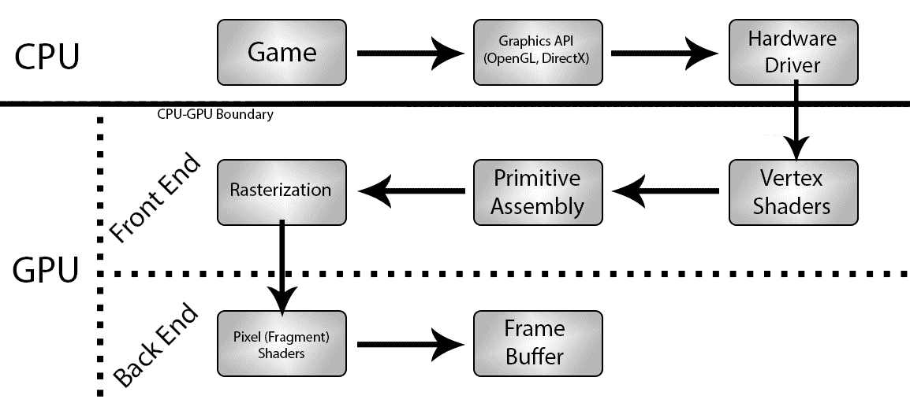
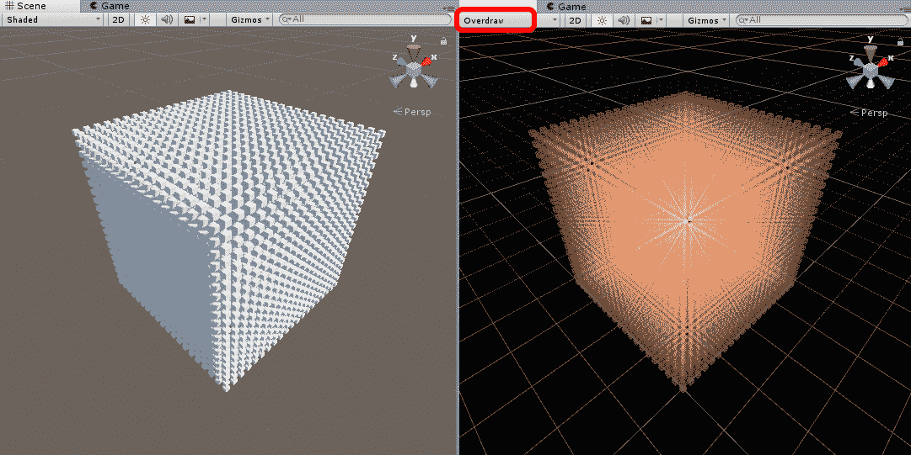
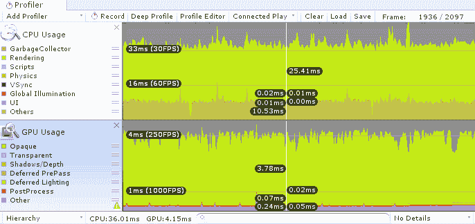
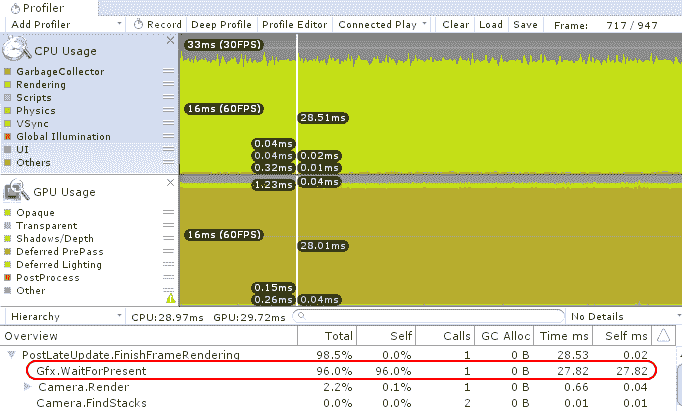
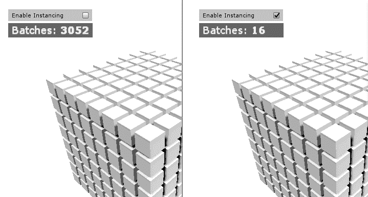
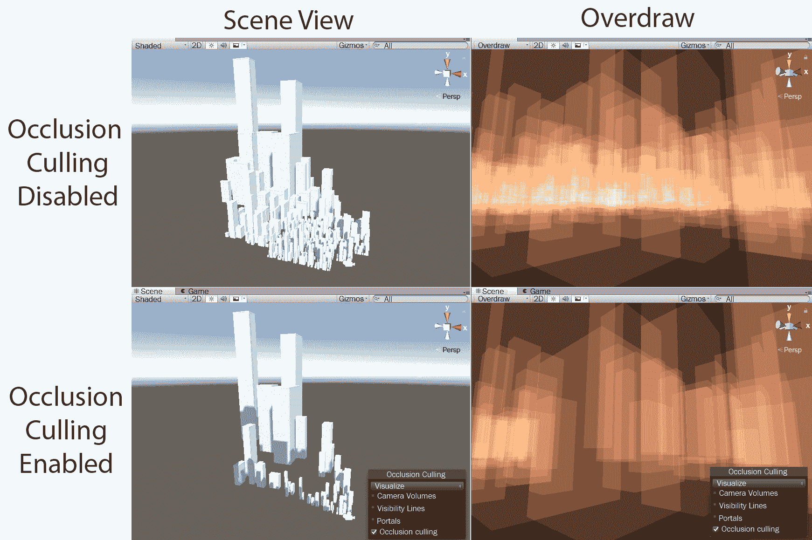
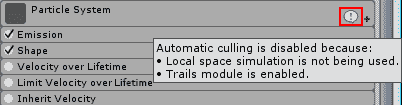
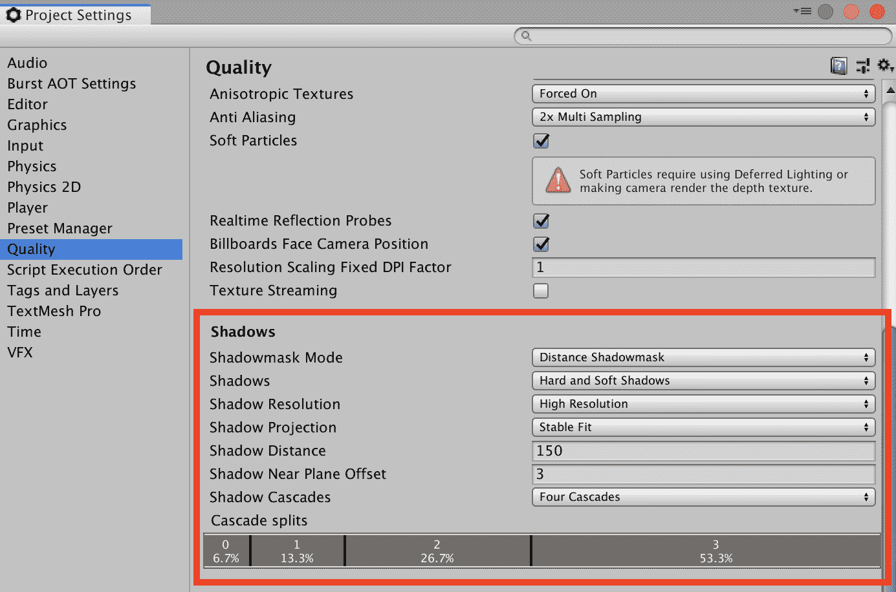

# 第六章：动态图形

毫无疑问，现代图形设备的渲染管线非常复杂。即使是将单个三角形渲染到屏幕上，也需要调用大量的图形 API。这包括创建用于相机视图的缓冲区，该缓冲区连接到操作系统（通常通过某种类型的窗口系统），为顶点数据分配缓冲区，设置数据通道以将顶点和纹理数据从 RAM 传输到 VRAM，配置每个内存空间以使用特定的数据格式，确定相机可见的对象，设置并初始化三角形的绘制调用，等待渲染管线完成其任务，最后将渲染的图像呈现到屏幕上。然而，这种看似复杂且过度设计的绘制简单对象的方式有一个简单的理由——渲染通常涉及重复执行相同的任务，而所有这些初始设置使得未来的渲染任务非常快速。

CPU 被设计来处理几乎任何计算场景，但不能同时处理太多任务，而 GPU 被设计用于处理极其大量的并行处理，但它们在处理复杂度方面有限，否则会破坏这种并行性。它们的并行性质需要大量数据被非常快速地复制。在渲染管线的设置过程中，我们为我们的图形数据配置内存数据通道。因此，如果这些通道被正确配置为传递的数据类型，那么它们将更有效地运行。然而，配置不当会导致相反的结果。

在整个图形渲染过程中，CPU 和 GPU 都被使用，这使得它成为跨越软件；硬件；多个内存空间，编程语言（每种语言都适合不同的优化），处理器和处理器类型；以及大量可以添加到混合中的特殊情况的高速度处理和内存管理舞蹈。

更复杂的是，我们将遇到的每个渲染情况都有其独特之处。在两个不同的 GPU 上运行相同的应用程序通常会导致苹果与橙子的比较，因为它们支持不同的功能和 API。

在如此复杂的硬件和软件系统中确定瓶颈所在可能具有挑战性，如果我们想要对现代渲染管线中性能问题的来源有强烈的直接直觉，这可能需要一生在 3D 图形行业的经验工作。

幸运的是，性能分析再次发挥了救星的作用，这使得成为渲染管线大师变得不那么必要。如果我们能够收集到关于每个设备的资料，使用多个性能指标进行比较，并调整我们的场景来观察不同的渲染特性如何影响其行为，那么我们应该有足够的证据来找到问题的根源并做出适当的改变。因此，在本章中，你将学习如何收集正确的数据，深入挖掘渲染管线以找到问题的真正源头，并探索各种解决方案和针对众多潜在问题的应对措施。

当涉及到提高渲染性能时，有许多主题需要讨论。因此，在本章中，我们将探讨以下主题：

+   对渲染管线的简要探索，重点关注 CPU 和 GPU 介入的部分

+   确定我们的渲染是否受 CPU 或 GPU 限制的一般技术

+   一系列性能优化技术和特性，例如：

    +   使用 GPU 实例化

    +   利用**细节级别**（**LOD**）和其他剔除组

    +   使用遮挡剔除

    +   优化粒子系统

    +   改进 Unity UI

    +   优化你的着色器

    +   使用光照贴图优化光照和阴影

    +   应用移动特定的渲染增强

# 探索渲染管线

根据设备是受 CPU 活动限制（我们受 CPU 限制）还是受 GPU 活动限制（我们受 GPU 限制），渲染性能不佳可能以多种方式表现出来。调查受 CPU 限制的应用程序可能相对简单，因为所有的 CPU 工作都包括从磁盘/内存加载数据和调用图形 API 指令。

然而，受 GPU 限制的应用程序可能更难分析，因为根本原因可能来自渲染管线中的大量潜在位置之一。我们可能会发现，我们需要依赖一点猜测或*排除法*来确定 GPU 瓶颈的来源。在任何情况下，一旦问题被发现并解决，我们都可以期待显著的改进，因为小的修复在解决渲染管线中的问题时往往会带来巨大的回报。

在第三章《批处理的好处》中，我们简要介绍了渲染管线。为了简要总结关键点，我们知道 CPU 通过图形 API 发送渲染指令，通过硬件驱动程序流向 GPU 设备，这导致一系列渲染指令积累在一个称为命令缓冲区的队列中。GPU 逐个处理这些命令，直到命令缓冲区为空。只要 GPU 能够跟上下一帧开始前的指令速率和复杂性，我们就能保持帧率。然而，如果 GPU 落后，或者 CPU 花费太多时间生成命令，帧率就会开始下降。

以下是一个现代 GPU 上典型渲染管线的高度简化图（这也可以根据设备、技术支持和自定义优化而有所不同），展示了发生的步骤的广泛视图：



最上面一行表示在 CPU 中进行的操作，这包括通过硬件驱动程序调用图形 API 以及将命令推送到 GPU。接下来的两行表示在 GPU 中进行的步骤。由于 GPU 的复杂性，其内部过程通常分为两个不同的部分——**前端**和**后端**，这需要一些额外的解释。

# GPU 前端

前端指的是渲染过程中 GPU 处理顶点数据的部分。让我们了解它是如何工作的：

1.  前端将从 CPU 接收网格数据（一个包含大量顶点信息的大包），并发出一个绘制调用。

1.  GPU 随后从网格数据中收集所有顶点信息，并通过顶点着色器传递它们，顶点着色器可以修改它们并以*1-to-1*的方式输出。

1.  因此，GPU 现在有一个要处理的原始数据列表（三角形——3D 图形中最原始的形状）。

1.  接下来，光栅化器将这些原始数据转换为最终图像需要绘制的像素，基于其顶点的位置和当前相机视图创建原始数据。从这个过程中生成的像素列表被称为**片段**，将在后端进行处理。

顶点着色器是类似于 C 语言的程序，它们确定它们感兴趣的数据输入以及它们将如何操作这些数据，然后输出一组信息供光栅化器生成片段。它也是细分过程的家，这个过程由几何着色器（有时称为**细分着色器**）处理，类似于顶点着色器，因为它们是上传到 GPU 的小脚本，但它们被允许以*1-to-many*的方式输出顶点，因此可以程序化地生成额外的几何形状。

**着色器**这个术语是从这些脚本最初主要处理光照和着色任务时的一个时代遗留下来的，那时它们的作用还没有扩展到包括今天它们所使用的所有任务。

# GPU 后端

后端代表渲染管线中处理片段的部分。让我们看看它是如何工作的：

1.  每个片段都将通过一个片段着色器（也称为**像素着色器**）。与顶点着色器相比，这些着色器通常涉及更多的复杂活动，例如深度测试、alpha 测试、着色、纹理采样、光照、阴影以及各种后期处理效果，仅举几例。

1.  然后，这些数据会被绘制到帧缓冲区上，帧缓冲区保存了当前图像，一旦完成当前帧的渲染任务，最终会发送到显示设备（我们的显示器）上。图形 API 默认情况下通常使用两个帧缓冲区（尽管在自定义渲染场景中可以生成更多）。

1.  在任何给定时刻，一个帧缓冲区包含我们渲染到帧的数据，并且正在被展示到屏幕上，而另一个帧缓冲区则被 GPU 积极绘制，同时它完成命令缓冲区中的命令。

1.  当 GPU 达到`swap buffers`命令（CPU 要求 GPU 完成的给定帧的最后一个指令）时，帧缓冲区就会翻转，以便展示新的帧。

1.  然后，GPU 将使用旧的帧缓冲区来绘制下一个帧。

1.  每当渲染一个新的帧时，这个过程就会重复；因此，GPU 只需要两个帧缓冲区来处理这个任务。

从调用图形 API 到交换帧缓冲区，这个过程会持续不断地为每个网格、顶点、片段和帧重复，只要我们的应用程序仍在渲染。

两个指标往往会导致后端出现瓶颈——填充率和内存带宽。让我们来稍微了解一下它们。

# 填充率

填充率是一个包含性术语，指的是 GPU 绘制片段的速度。然而，这仅包括在给定的片段着色器中启用了所有各种条件测试后幸存下来的片段。片段只是一个*潜在像素*，如果它未能通过任何启用的测试，那么它就会被立即丢弃。这可以是一个巨大的性能提升，因为渲染管线可以跳过昂贵的绘制步骤，转而开始处理下一个片段。

一个可能剔除片段的测试示例是*Z 测试*，它检查来自较近对象的片段是否已经绘制到相同的片段位置（*Z*指的是从摄像机的视角来看的深度维度）。如果是这样，当前片段就会被丢弃。如果不是，那么片段就会通过片段着色器并绘制到目标像素上，这正好消耗了我们的填充率中的一个。现在，想象一下将这个过程乘以成千上万的重叠对象，每个对象都生成数百或数千个可能的片段（更高的屏幕分辨率需要处理更多的片段）。由于主摄像机的所有可能重叠，这可能导致每帧处理数百万个片段。此外，我们每秒试图重复这个过程数十次。这就是为什么在渲染管线中进行如此多的初始设置很重要，而且应该很明显，跳过尽可能多的这些绘制操作可以显著节省渲染成本。

图形卡制造商通常将特定的填充率作为卡的特性进行宣传，通常以每秒千兆像素的形式出现，但这有点误导，因为它更准确地应该被称为每秒千兆片段；然而，这个论点主要是学术性的。无论如何，较大的值告诉我们设备可以潜在地通过渲染管线推送更多的片段。因此，在每秒 30 千兆像素的预算和 60Hz 的目标帧率下，我们可以在填充率瓶颈之前处理*30,000,000,000/60 = 5 亿个片段*每帧。以 2,560 x 1,440 的分辨率和最佳情况，即每个像素只绘制一次，理论上我们可以绘制整个场景大约 125 次而不会出现任何明显的问题。

可惜，这不是一个完美的世界。填充率也被其他高级渲染技术消耗，例如阴影和后期处理效果，这些技术需要处理相同的片段数据并在帧缓冲区上执行它们的遍历。即便如此，由于对象渲染的顺序，我们最终总是会因为相同的像素而有一些重绘。这被称为**过度绘制**，它是衡量我们如何有效地利用填充率的一个有用的指标。

# 过度绘制

我们有多少过度绘制可以通过将所有对象以加法 alpha 混合和平滑着色渲染来直观表示。过度绘制高的区域会显得更亮，因为相同的像素通过加法混合多次绘制。这正是场景窗口的过度绘制着色模式揭示我们的场景正在经历多少过度绘制的方式。

以下截图显示了正常绘制（左）与场景窗口的过度绘制着色模式（右）的几个千个盒子场景：



我们拥有的过度绘制越多，我们就浪费了更多的填充率，因为我们需要覆盖片段数据。我们可以应用几种技术来减少过度绘制，我们将在稍后探讨。

注意，用于渲染的队列有几种不同类型，可以分为两种：**不透明队列**和**透明队列**。

在不透明队列中渲染的对象可以通过*Z*-测试剔除片段，正如之前所解释的。然而，在透明队列中渲染的对象不能这样做，因为它们的透明性质意味着我们无法假设无论有多少其他对象挡在前面，它们都不需要被绘制，这导致了很多不必要的绘制。

所有 Unity UI 对象总是以透明队列渲染，这使得它们成为过度绘制的一个重要来源。

# 内存带宽

后端瓶颈的另一个潜在来源是内存带宽。每当需要从 GPU 的 VRAM 的一部分将纹理拉到较低的内存级别时，就会消耗内存带宽。这通常发生在纹理采样时，片段着色器试图为给定位置上的给定片段选择匹配的纹理像素（或*texel*）。GPU 包含多个核心，每个核心都可以访问相同的 VRAM 区域，但它们也各自包含一个更小、本地的纹理缓存，存储 GPU 最近最频繁使用的纹理。这与 CPU 内存缓存级别的多样性设计相似，允许内存在链中上下传输。这是硬件设计的一个解决方案，因为更快的内存不可避免地会更容易生产且成本更高。因此，我们不是有一个巨大的、昂贵的 VRAM 块，而是一个大型的、廉价的 VRAM 块，但使用一个更小、非常快速的底层纹理缓存来进行采样，这样我们就得到了两者的最佳结合；也就是说，快速采样且成本较低。

如果需要的纹理已经存在于核心的本地纹理缓存中，那么采样通常变得非常快，几乎感觉不到。如果不是这样，那么纹理必须从 VRAM 中拉入，才能进行采样。这实际上是对纹理缓存的一个缓存未命中，因为它现在需要时间来查找和从 VRAM 中拉取所需的纹理。这种传输消耗了我们可用内存带宽的一部分，具体来说，是存储在 VRAM 中纹理文件的总大小（这可能不是原始文件的确切大小或 RAM 中的大小，因为 GPU 级别的压缩技术）。

如果我们在内存带宽上遇到瓶颈，GPU 将不断获取必要的纹理文件，但整个过程将被限制，因为纹理缓存需要等待数据出现才能处理给定的片段批次。GPU 无法及时将数据推回帧缓冲区以在屏幕上渲染，这会阻塞整个过程，并导致帧率低下。

正确使用内存带宽是另一个预算关注点。例如，每核心每秒 96 GB 的内存带宽和每秒 60 帧的目标帧率，GPU 可以承受在内存带宽瓶颈之前，每帧大约提取 1.6 GB（*96/60*）的纹理数据。当然，这不是一个精确的预算，因为存在缓存未命中，但它确实为我们提供了一个大致的数值来工作。

内存带宽通常按每核心列出，但一些 GPU 制造商可能会通过将内存带宽乘以核心数来误导，列出更大的但不太实用的数字。因此，可能需要进行研究，以便比较苹果与苹果。

注意，这个值并不是我们游戏在项目中可以包含的纹理数据量的最大限制，也不是 CPU RAM，甚至不是 VRAM。这是一个本质上限制一帧内可以发生多少纹理交换的指标。同一个纹理可以在一帧内被多次拉回和推去，这取决于需要使用纹理的着色器的数量、对象的渲染顺序以及纹理采样必须发生的频率。只有少数对象可以消耗整个 GB 的内存带宽，因为可用的纹理缓存空间是有限的。如果一个着色器需要大量的大纹理，则更有可能造成缓存未命中，从而在内存带宽上造成瓶颈。如果我们考虑多个需要不同高质量纹理的对象以及多个二级纹理贴图（法线贴图、发射贴图等），并且这些贴图没有批量处理在一起，那么这种情况会令人惊讶地容易触发。在这种情况下，纹理缓存将无法长时间保留单个纹理文件，以便在下一个渲染过程中立即采样它。

我们现在已经涵盖了 GPU 的前端和后端，接下来我们将继续探索我们的渲染管线下一部分：光照和阴影。

# 光照和阴影

在现代游戏中，单个对象很少在单个步骤中完全完成渲染，这主要是由于光照和阴影。这些任务通常在多个片段着色器的多个“遍”中处理，每个遍对应于几个光源之一，最终结果被组合起来，以便多个光源都有机会被应用。结果看起来更加逼真，或者至少更具有视觉吸引力。

需要多次遍历来收集阴影信息。因此，让我们开始：

1.  我们首先设置场景，使其包含产生阴影的对象和接收阴影的对象，分别负责产生和接收阴影。

1.  然后，每次渲染阴影接收者时，GPU 都会从光源的视角渲染任何阴影产生者对象到一个纹理中，以收集每个片段的距离信息。

1.  然后，它会对阴影接收者执行相同的操作，但现在它知道阴影产生者会从光源重叠哪些片段，因此它可以渲染这些片段为较暗，因为它们将位于光源施加在阴影产生者上产生的阴影中。

1.  此信息随后成为被称为**阴影贴图**的附加纹理，并在从主摄像机的视角渲染时与阴影接收者的表面混合。这会使其表面在某些位置看起来更暗，因为这些位置有其他物体位于光源和指定物体之间。

创建光照贴图的过程与此类似，光照贴图是为场景中更静态的部分预先生成的光照信息。

光照和阴影在整个渲染管线中往往消耗大量资源。我们需要每个顶点提供一个法线方向（一个指向表面的向量）以确定光照应该如何从该表面反射，并且我们可能还需要额外的顶点颜色属性来应用一些额外的着色。这为 CPU 和前端提供了更多信息以传递。由于需要多次遍历片段着色器才能完成最终的渲染，后端在填充率（需要绘制、重绘和合并的大量像素）和内存带宽（为光照贴图和阴影贴图拉入或拉出的额外纹理）方面都保持忙碌。这就是为什么实时阴影与其他大多数渲染功能相比异常昂贵，并且当启用时，会大幅增加绘制调用次数。

然而，光照和阴影可能是游戏艺术和设计中最重要的两个部分，需要正确处理，通常使得额外的性能要求值得成本。良好的光照和阴影可以将一个平凡的场景转变为壮观的事物，因为专业的着色有一种神奇的魅力，使其视觉上吸引人。即使是低多边形艺术风格（例如，移动游戏《纪念碑谷*》）也严重依赖于良好的光照和阴影配置文件，以便玩家能够区分不同的对象并创建一个视觉上令人愉悦的场景。

Unity 提供了多个影响光照和阴影的功能，从实时光照和阴影（每种类型都有多种）到静态光照，称为**光照贴图**。有很多选项可以探索，当然，如果不小心，会有很多可能导致性能问题。

Unity 文档详细介绍了所有各种光照功能。从以下页面开始，并逐步学习。这样做将非常值得花费时间，因为这些系统影响整个渲染管线。参考以下内容：

+   [Unity3D 文档：光照概述](https://docs.unity3d.com/Manual/LightingOverview.html)

+   [Unity 学习教程：光照和渲染简介](https://learn.unity.com/tutorial/introduction-to-lighting-and-rendering)

有两种不同的渲染格式，它们可以极大地影响我们的光照性能，称为**前向渲染**和**延迟渲染**。这些渲染选项的设置可以在“编辑 | 项目设置 | 玩家 | 其他设置 | 渲染”下找到，并且可以在每个平台上进行配置。

# 前向渲染

前向渲染是我们场景中渲染灯光的传统形式，如前所述。在前向渲染过程中，每个对象将通过相同的着色器进行多次渲染。所需的遍历次数将基于光源的数量、距离和亮度。Unity 将尝试优先渲染对对象影响最大的`DirectionalLight`组件，并以一个*基础*遍历作为起点渲染对象。然后，它将取附近的一些最强大的`PointLight`组件，并通过相同的片段着色器多次重新渲染同一个对象。每个光源点将基于顶点进行处理，所有剩余的光源将使用称为球谐函数的技术合并成一个*平均*颜色。

通过将灯光的渲染模式设置为例如“不重要”等值，并更改“编辑 | 项目设置 | 质量 | 像素光照数量”的值，可以简化这种行为。此值限制了用于前向渲染的光照数量，但任何设置为“重要”渲染模式的光照将覆盖此限制。因此，我们必须负责任地使用这些设置的组合。

如我们可能想象的那样，在存在大量光源的场景中使用前向渲染可能会迅速增加我们的绘制调用次数，这是由于配置的渲染状态和所需的着色器遍历数量。

关于前向渲染的更多信息可以在 Unity 文档中找到，链接为[`docs.unity3d.com/Manual/RenderTech-ForwardRendering.html`](http://docs.unity3d.com/Manual/RenderTech-ForwardRendering.html)。

# 延迟着色

延迟渲染，或称为延迟着色（Deferred Shading），是一种大约十年前就在 GPU 上可用的技术，但由于涉及的限制和移动设备上支持有限，它并没有完全取代前向渲染方法。 

延迟着色（Deferred Shading）之所以被称为“延迟着色”，是因为实际的着色过程直到处理过程的后期才会发生，也就是说，它被延迟到后期。它通过创建一个几何缓冲区（称为*G-Buffer*），在没有任何光照应用的情况下首先渲染场景。有了这些信息，延迟着色系统可以在单次遍历中生成一个光照配置文件。

从性能角度来看，结果相当令人印象深刻，因为它可以在很少的绘制调用努力下生成非常好的每像素光照。一个缺点是，如抗锯齿、透明度和将阴影应用于动画角色等效果不能仅通过延迟着色来管理。在这种情况下，将前向渲染技术作为后备方案应用，以覆盖这些任务，因此需要额外的绘制调用来完成。延迟着色的一个更大问题是，它通常需要更强大、更昂贵的硬件，并且并非所有平台都可用，因此较少的用户能够使用它。

Unity 文档包含了关于延迟着色技术及其优点和缺点的优秀信息来源，这些信息可以在[`docs.unity3d.com/Manual/RenderTech-DeferredShading.html`](http://docs.unity3d.com/Manual/RenderTech-DeferredShading.html)找到。

# 顶点光照着色（遗留）

从技术上讲，除了两种光照方法之外，还有其他两种。剩下的两种是顶点光照着色和非常原始、功能宽松的延迟渲染版本（在 Unity 文档中，这被称为遗留延迟光照渲染路径）。顶点光照着色是对光照的极大简化，因为光照只考虑每个顶点而不是每个像素。换句话说，整个面基于入射光颜色进行着色，而不是通过单个像素混合光照颜色。

并不期望许多，或者实际上任何，3D 游戏会使用这种遗留技术，因为缺乏阴影和适当的光照使得深度可视化非常困难。它主要被简单的 2D 游戏使用，这些游戏不需要使用阴影、法线贴图以及各种其他光照功能。

# 全局照明

全局照明（**GI**）是烘焙光照贴图的一种实现。光照贴图与阴影技术创建的阴影贴图类似，为每个代表额外光照信息的对象生成一个或多个纹理，这些纹理随后在片段着色器的光照过程中应用于对象，以模拟静态光照效果。

这些光照贴图与其他形式的光照之间的主要区别在于，光照贴图是在编辑器中预先生成（或烘焙）并打包到游戏构建中的。这确保了我们不需要在运行时不断重新生成这些信息，从而节省了大量的绘制调用和显著的 GPU 活动。由于我们可以烘焙这些数据，我们有时间生成非常高质量的光照贴图（当然，这要以我们需要处理的更大的生成纹理文件为代价）。

由于这些信息是在游戏开始前烘焙的，它们不能在游戏过程中对实时活动做出反应，因此，默认情况下，任何光照贴图信息都只会应用于在光照贴图生成时场景中存在的静态对象，以及它们放置的确切位置。然而，可以向场景中添加光照探针以生成一组额外的光照贴图纹理，这些纹理可以应用于附近移动的动态对象，使这些对象能够从预先生成光照中受益。这不会达到像素级的精度，并且会消耗额外的光照探针地图的磁盘空间，以及在运行时交换这些地图所需的内存带宽，但它确实生成了一个更可信且令人愉悦的光照配置文件。

在过去的几年中，已经开发出几种生成光照贴图的技术，Unity 自从最初发布以来已经使用了几种不同的解决方案。全局照明仅仅是光照贴图背后数学技术的最新一代，它通过计算不仅影响给定对象的光照，还影响光线如何从附近的表面反射，从而提供非常逼真的着色效果。这种效果是通过一个名为 **enlighten** 的内部系统计算的。这个工具既用于创建静态光照贴图，也用于创建称为 **预计算实时全局照明** 的东西，它是实时和静态着色的混合，允许我们模拟诸如 **一天中的时间**（随着时间的推移，太阳光的方向发生变化）等效果，而不依赖于昂贵的实时光照效果。

生成光照贴图时常见的典型问题是生成它们所需的时间长度以及获取当前设置视觉反馈的时间，因为光照映射器通常试图在一次遍历中生成全细节光照贴图。如果用户尝试修改其配置，则整个工作必须取消并重新开始。为了解决这个问题，Unity Technologies 实现了渐进式光照映射器，它在一段时间内更渐进地执行光照映射任务，同时允许在计算过程中对其进行修改。这使得场景中的光照贴图看起来在后台工作时会逐渐变得更加详细，同时允许我们在它仍在工作时更改某些属性，而无需重新启动整个工作。这提供了几乎即时的反馈，并极大地改善了生成光照贴图的流程。

# 多线程渲染

多线程渲染在大多数系统上默认启用，例如提供多个核心的桌面和游戏机平台。其他平台仍然支持许多低端设备，默认启用此功能，因此它们是一个可切换的选项。对于 Android，可以通过在“编辑 | 项目设置 | 播放器 | 其他设置 | 多线程渲染”下的复选框中启用，而对于 iOS，可以通过在“编辑 | 项目设置 | 播放器 | 其他设置 | 图形 API”下配置应用程序以使用 Apple 的 Metal API 来启用多线程渲染。在撰写本书时，WebGL 不支持多线程渲染。

对于场景中的每个对象，我们需要完成三个任务：确定对象是否需要渲染（通过一种称为**视锥剔除**的技术），如果是的话，生成渲染对象的命令（因为渲染单个对象可能会产生数十个不同的命令），然后使用相关的图形 API 将命令发送到 GPU。在没有多线程渲染的情况下，所有这些任务都必须在 CPU 的主线程上执行；因此，主线程上的任何活动都成为所有渲染的关键路径。当启用多线程渲染时，将命令推送到 GPU 的任务由渲染线程处理，而其他任务，如剔除和生成命令，则分散到多个工作线程。这种设置可以为 CPU 的主线程节省大量的 CPU 周期，而主线程是大多数其他 CPU 任务发生的地方，例如物理和脚本代码。

启用此功能将影响 CPU 绑定的含义。在没有多线程渲染的情况下，主线程正在执行生成命令缓冲区指令所需的所有工作，这意味着我们可以在其他地方节省的任何性能都将为 CPU 生成命令腾出更多时间。然而，当进行多线程渲染时，大量工作量被推送到单独的线程，这意味着对主线程的改进对通过 CPU 的渲染性能的影响将较小。

注意，无论是否进行多线程渲染，GPU 绑定都是相同的。GPU 始终以多线程的方式执行其任务。

# 低级渲染 API

Unity 通过他们的`CommandBuffer`类向我们公开了渲染 API。这允许我们通过发出高级渲染命令，如`渲染此对象`、`使用此材质`、`使用此着色器`或`绘制此程序几何体的 N 个实例`，直接通过我们的 C#代码控制渲染管线。这种定制功能不如直接访问图形 API 强大，但对于 Unity 开发者来说，这是朝着定制独特图形效果的正确方向迈出的一步。

查看 Unity 文档中的`CommandBuffer`，以使用此功能，请访问[`docs.unity3d.com/ScriptReference/Rendering.CommandBuffer.html`](http://docs.unity3d.com/ScriptReference/Rendering.CommandBuffer.html)。

如果需要更直接的渲染控制级别，例如我们希望直接调用 OpenGL、DirectX 和 Metal 的图形 API，那么请注意，可以创建一个本地插件（一个用 C++ 编写的库，专门为目标的平台架构编译），该插件可以挂钩到 Unity 的渲染管线，为特定的渲染事件设置回调，类似于 `MonoBehaviours` 如何挂钩到主 Unity 引擎的各种回调。这绝对是一个对大多数 Unity 用户来说的高级话题，但对于我们渲染技术和图形 API 知识的成熟来说是有用的。

Unity 在[`docs.unity3d.com/Manual/NativePluginInterface.html`](https://docs.unity3d.com/Manual/NativePluginInterface.html)提供了关于在本地插件中生成渲染界面的良好文档。

显然，由于涉及到的复杂过程数量众多，GPU 可能以多种不同的方式成为瓶颈。现在我们已经彻底了解了渲染管线和瓶颈可能发生的方式，让我们来探讨如何检测这些问题。

# 检测性能问题

当你开始查看游戏中的问题时，照明往往被忽视。这是一个新手错误。在接下来的几节中，我们将看到如何检测和解决与照明相关的性能问题。

# 分析渲染问题

分析器可以用来快速缩小在渲染管线中使用的那两个设备中哪一个是我们瓶颈所在——是 CPU 还是 GPU。我们必须使用分析器窗口的 CPU 使用率和 GPU 使用率区域来检查问题，因为这可以告诉我们哪个设备工作最努力。

以下截图显示了针对 CPU 密集型应用程序的分析器数据。测试涉及创建成千上万的简单立方体对象，没有批处理或阴影技术。这导致 CPU 需要生成命令的绘制调用次数非常大（大约 32,000 次），但由于渲染的对象非常简单，GPU 的工作量相对较少：



本例表明，CPU 的渲染任务消耗了大量的周期（每帧约 25 毫秒），而 GPU 的处理时间不到 4 毫秒，这表明瓶颈位于 CPU。请注意，这个分析测试是在独立应用程序上进行的，而不是在编辑器内。我们现在知道我们的渲染是 CPU 密集型的，可以开始应用一些节省 CPU 的性能改进（注意不要通过这种方式在其他地方引入渲染瓶颈）。

同时，通过 Profiler 对 GPU 瓶颈应用进行性能分析要复杂一些。这次测试涉及创建一个需要最少绘制调用的简单对象，但使用一个非常昂贵的着色器，该着色器对纹理进行数千次采样，在后台创建大量活动。

为了进行公平的 GPU 瓶颈性能分析测试，你应该确保通过“编辑 | 项目设置 | 质量 | 其他 | V 同步计数”禁用垂直同步；否则，很可能会污染我们的数据。

以下截图显示了在独立应用程序中运行此测试时的 Profiler 数据：



如前一个截图所示，CPU 使用区域的渲染任务与 GPU 使用区域的总渲染成本非常接近。我们还可以看到，图像底部的 CPU 和 GPU 时间成本相对相似（大约各 29 毫秒）。这有些令人困惑，因为我们似乎在这两个设备上都有瓶颈，而我们预期 GPU 的工作量应该远大于 CPU。

实际上，如果我们使用分层模式深入到 CPU 使用区域的分析视图，我们会注意到大部分 CPU 时间都花在了标记为 Gfx.WaitForPresent 的任务上。这是 CPU 在等待 GPU 完成当前帧时浪费的时间。因此，尽管看起来我们似乎同时受到 CPU 和 GPU 的限制，但实际上我们是受 GPU 瓶颈所限。即使启用了多线程渲染，CPU 也必须等待渲染管线完成才能开始下一帧。

Gfx.WaitForPresent 也用于表示 CPU 正在等待垂直同步完成，因此需要禁用它进行此测试。

# 强制测试

如果我们在仔细查看性能分析数据，但仍不确定问题的根源在哪里，或者我们遇到 GPU 瓶颈并需要确定在渲染管线中的瓶颈位置，我们应该尝试强制测试方法，即从场景中删除特定的活动并检查它是否会导致性能显著提升。如果小的改动能带来显著的速度提升，那么我们就有了关于瓶颈位置的强烈线索。如果我们消除了足够的未知变量以确保数据引导我们走向正确的方向，那么这种方法并没有什么害处。

对于 CPU 瓶颈的明显强制测试将是减少绘制调用以检查性能是否突然提升。然而，这通常是不可能的，因为我们可能已经通过静态批处理、动态批处理和纹理图集等技术将绘制调用减少到最小。这意味着我们进一步减少它们的范围非常有限。

然而，我们可以故意增加绘制调用次数的小幅度，要么通过引入更多对象，要么禁用节省绘制调用的功能，如静态和动态批处理，并观察情况是否比之前显著恶化。如果是这样，那么我们有证据表明我们可能非常接近 CPU 限制，或者已经达到这种状态。

对于受 GPU 限制的应用程序，我们可以应用两种有效的暴力测试来确定我们是否受限于填充率或内存带宽：分别降低屏幕分辨率或降低纹理分辨率。

通过降低屏幕分辨率，我们将要求光栅化器生成显著更少的片段，并将它们传输到更小的像素画布上供后端处理。这将减少应用程序的填充率消耗，为渲染管线这个关键部分提供额外的空间。因此，如果性能随着屏幕分辨率的降低而突然提升，那么填充率应该是我们首要关注的问题。

将分辨率从 2560 x 1440 降低到 800 x 600，改善因子约为八倍，这通常足以足够减少填充率成本，使应用程序再次表现良好。

同样，如果我们受限于内存带宽，那么降低纹理质量可能会带来显著的性能提升。通过这样做，我们缩小了纹理的大小，大大减少了片段着色器的内存带宽成本，使得 GPU 能够更快地获取必要的纹理。通过访问“编辑 | 项目设置 | 质量 | 纹理质量”，并将值设置为“半分辨率”、“四分之一分辨率”或“八分之一分辨率”，可以全局降低纹理质量。

受 CPU 限制的应用程序，通过本书中几乎每一项性能提升技巧，都有充足的机会进行性能优化。如果我们从其他活动中释放 CPU 周期，那么我们可以通过更多的绘制调用渲染更多对象，当然，这也意味着每个对象都会让 GPU 承担更多的活动。然而，当我们试图改进渲染管线其他部分时，还有额外的机会在绘制调用次数上做一些间接的改进。这包括遮挡剔除、调整我们的光照和阴影行为，以及修改我们的着色器。这些内容将在以下章节中解释，当我们研究各种性能提升方法时。

同时，我们可能需要应用一些暴力测试和猜测来确定一个 GPU 受限的应用程序瓶颈在哪里。大多数应用程序的瓶颈在于填充率或内存带宽，因此我们应该从这里开始。在桌面应用程序中，前端很少出现性能瓶颈，所以只有在确认其他来源不是问题之后才值得检查。与片段着色器相比，顶点着色器通常很简单，因此前端处理可能引起问题的唯一机会是推入过多的几何形状或者拥有过于复杂的几何着色器。

最终，这项调查应该帮助我们确定我们是 CPU 受限还是 GPU 受限，在后一种情况下，我们是在前端受限还是后端受限，再次在后一种情况下，我们是在填充率受限还是内存带宽受限。有了这些知识，我们可以应用几种技术来提高性能。

# 渲染性能提升

现在我们应该拥有所有必要的信息来理解性能瓶颈，以便我们可以开始应用修复。在本章的剩余部分，我们将介绍一系列技术，以提高 CPU 受限和 GPU 受限应用程序的渲染管线性能。

# 启用/禁用 GPU 皮肤

第一条建议涉及一个设置，它以牺牲另一方的代价减轻 CPU 或 GPU 前端的工作负担，即 GPU 皮肤。皮肤是这样一个过程，即根据动画骨骼的当前位置转换网格顶点。动画系统在 CPU 上工作，转换用于确定对象当前姿态的骨骼，但动画过程中的下一个重要步骤是将网格顶点围绕这些骨骼包裹，以放置网格在最终姿态。这是通过遍历每个顶点并对其连接的骨骼执行加权平均来实现的。

这个顶点处理任务可以发生在 CPU 上，也可以发生在 GPU 的前端，这取决于是否启用了 GPU 皮肤选项。此功能可以在“编辑 | 项目设置 | 玩家设置 | 其他设置 | GPU 皮肤”下切换。启用此选项将皮肤活动推送到 GPU，但请注意，CPU 仍然需要将数据传输到 GPU，并为任务在命令缓冲区生成指令，因此它并没有完全消除 CPU 的工作量。禁用此选项通过在传输网格数据之前让 CPU 解决网格的姿态来减轻 GPU 的负担，并简单地要求 GPU 按原样绘制。显然，如果我们场景中有许多动画网格，这个功能很有用，并且可以帮助将工作推送到最不繁忙的设备。

# 减少几何复杂性

这个技巧关注的是 GPU 前端。我们已经在第四章“优化您的艺术资产”中介绍了一些网格优化技术，这些技术可以帮助减少我们的网格顶点属性。作为一个快速提醒，使用包含大量不必要的 UV 和法线向量数据的网格并不罕见，因此我们应该检查我们的网格是否存在这种多余的冗余。我们还应该让 Unity 为我们优化结构，这可以最小化缓存未命中，因为顶点数据是在前端读取的。

目标仅仅是减少实际的顶点数。这里有三种解决方案：

+   首先，我们可以通过艺术团队手动调整并生成具有较低多边形计数的网格，或者使用网格简化工具来简化网格。

+   第二，我们可以简单地从场景中删除网格，但这应该是最后的手段。

+   第三种方案是通过实现自动剔除，例如使用 LOD 等功能，这些将在本章后面解释。

# 减少细分

通过几何着色器进行细分可以非常有趣，因为它是一种相对较少使用的技巧，可以使我们的图形效果在仅使用最常见效果的众多游戏中脱颖而出。然而，它可能会极大地增加前端处理的工作量。

除了改进我们的细分算法或减轻其他前端任务带来的负担，以便我们的细分任务有更多的空间呼吸之外，我们实际上没有可以利用的简单技巧来提高细分。无论如何，如果我们前端存在瓶颈并正在使用细分技术，我们应该检查它们是否没有消耗前端预算的大部分。

# 使用 GPU 实例化

GPU 实例化是一种通过利用它们将具有相同的渲染状态这一事实来快速渲染相同网格多个副本的方法，因此需要最少的绘制调用。这实际上与动态批处理非常相似，但不是自动过程。实际上，我们可以将动态批处理视为“穷人的 GPU 实例化”，因为 GPU 实例化可以带来更好的节省，并允许通过允许参数化变化来实现更多定制。

GPU 实例化在材质级别通过勾选“启用实例化”复选框应用，可以通过修改着色器代码来引入变化。这样，我们可以为不同的实例提供不同的旋转、缩放、颜色等。这对于渲染森林和岩石区域等场景非常有用，在这些场景中，我们希望渲染数百或数千个略有变化的网格副本。

注意，由于与它们不能动态批处理类似的原因，骨骼网格渲染器不能实例化，并且并非所有平台和 API 都支持 GPU 实例化。

以下截图展示了 GPU 实例化在一组 512 个立方体对象（应用了一些额外的光照和阴影以增加总绘制调用次数）上的好处：



与动态批处理相比，此系统具有更高的灵活性，因为我们能更好地控制对象是如何一起批处理的。当然，如果我们以低效的方式批处理事物，会有更多的错误机会，因此我们应该谨慎地明智使用它们。

查阅 Unity 文档以获取更多关于 GPU 实例化的信息，请访问[`docs.unity3d.com/Manual/GPUInstancing.html`](https://docs.unity3d.com/Manual/GPUInstancing.html)。

# 使用基于网格的 LOD

LOD 是一个广泛的概念，指的是根据对象与摄像机的距离以及/或它们在摄像机视图中占据的空间大小动态替换特征。由于在远处很难区分低质量和高质量对象，因此几乎没有必要渲染高质量版本，所以我们不妨用更简化的东西动态替换远处的对象。LOD 最常见实现是基于网格的 LOD，其中网格随着摄像机越来越远而动态替换为更低的细节版本。

通过在场景中放置多个对象并将它们设置为具有附加`LODGroup`组件的`GameObject`的子对象，可以实现基于网格的 LOD。LOD 组的作用是从这些对象生成边界框，并根据边界框在摄像机视野中的大小决定渲染哪个对象。如果对象的边界框占据了当前视图的大部分区域，则它将启用分配给较低 LOD 组的网格（们），如果边界框非常小，则用来自较高 LOD 组的网格（们）替换网格（们）。如果网格太远，可以配置为隐藏所有子对象。因此，通过适当的设置，我们可以让 Unity 用更简单的替代品替换网格，或者完全剔除它们，从而减轻渲染过程的负担。

查阅 Unity 文档以获取更多关于基于网格的 LOD 功能的详细信息，请访问[`docs.unity3d.com/Manual/LevelOfDetail.html`](http://docs.unity3d.com/Manual/LevelOfDetail.html)。

完全实现此功能可能需要我们投入大量的开发时间；艺术家必须生成相同对象的低多边形版本，关卡设计师必须生成 LOD 组，配置它们，并测试它们以确保在摄像机靠近或远离时不会引起令人不快的过渡。

注意，一些游戏开发中间件公司提供用于自动 LOD 网格生成的第三方工具。这些工具可能值得调查，以比较它们的使用便捷性、质量损失和成本效益。

基于网格的 LOD 也会在磁盘占用、RAM 和 CPU 方面给我们带来成本；替代网格需要被打包、加载到 RAM 中，并且`LODGroup`组件必须定期检查相机是否移动到了需要改变 LOD 级别的新位置。然而，在渲染管线上的好处是非常令人印象深刻的。动态渲染更简单的网格可以减少我们需要传递的顶点数据量，并可能减少绘制调用次数、填充率和渲染对象所需的内存带宽。

由于基于网格的 LOD（细节层次）功能需要大量的牺牲，开发者应该避免通过自动假设基于网格的 LOD 会帮助他们来预先优化。过度使用该功能将导致应用程序性能的其他部分负担加重，消耗宝贵的发展时间，这一切都是为了不必要的担忧。只有在开始观察到渲染管线中的问题时，并且我们有足够的 CPU、RAM 和开发时间时，才应该使用它。

话虽如此，具有广阔世界视野和大量相机移动的场景可能需要尽早实施这项技术，因为增加的距离和大量可见对象可能会极大地增加顶点计数。作为反例，始终在室内或具有向下看世界的视点的相机场景将发现这项技术几乎没有好处，因为对象通常会始终以相似的距离从相机移动。例如包括**实时策略**（**RTS**）和**多人在线战斗竞技场**（**MOBA**）游戏。

# 遮挡剔除组

遮挡剔除组是 Unity API 的一部分，它有效地允许我们创建自己的自定义 LOD 系统，作为动态替换某些游戏或渲染行为的方式。我们可能想要应用 LOD 的一些例子包括用骨骼较少的版本替换动画角色、应用更简单的着色器、在远距离跳过粒子系统生成，以及简化 AI 行为。

由于遮挡剔除组系统在最基本层面上只是告诉我们对象是否对相机可见以及它们有多大，它还在游戏领域有其他用途，例如确定某些敌人出生点是否当前对玩家可见，或者玩家是否正在接近某些区域。遮挡剔除组系统提供了广泛的可能性，使其值得考虑。当然，实现、测试和重新设计场景以利用这些功能所花费的时间可能是相当大的。

查阅 Unity 文档以获取有关遮挡剔除组的更多信息，请访问[`docs.unity3d.com/Manual/CullingGroupAPI.html`](https://docs.unity3d.com/Manual/CullingGroupAPI.html)。

# 利用遮挡剔除

减少填充率消耗和过度绘制最有效的方法之一是利用 Unity 的遮挡剔除系统。该系统通过将世界划分为一系列小单元，并通过场景中的虚拟相机进行飞行，根据现有对象的大小和位置记录哪些单元对其他单元不可见（被遮挡）来工作。

注意，这与视锥剔除技术不同，视锥剔除技术剔除当前相机视图外的对象。视锥剔除始终处于激活和自动状态。因此，通过此过程剔除的对象将自动被遮挡剔除系统忽略。

遮挡剔除数据只能为在“静态标志”下拉菜单下正确标记为“遮挡器静态”和/或“被遮挡静态”的对象生成。遮挡器静态是我们期望的静态对象的一般设置，这些对象可能非常大，以至于它们将同时遮挡其他对象并被其他对象遮挡，例如摩天大楼或山脉，这些可以隐藏它们后面的其他对象，以及相互之间隐藏，等等。被遮挡静态是某些事物的特殊情况，例如始终需要渲染其他对象背后的透明对象，但它们自己如果被大物体遮挡其可见性时需要被隐藏。

自然地，因为静态标志必须启用才能进行遮挡剔除，所以此功能对动态对象不起作用。

下面的截图展示了为了演示目的，从外部视角如何有效地使用遮挡剔除来减少场景中渲染对象的数量。从主相机的视角来看，两种情况看起来是相同的。

渲染管线不会浪费时间渲染被更近的对象遮挡的对象：



启用遮挡剔除功能将消耗额外的磁盘空间、RAM 和 CPU 时间。需要额外的磁盘空间来存储遮挡数据，需要额外的 RAM 来保持数据结构在内存中，并且每帧确定哪些对象被遮挡都会有 CPU 处理成本。遮挡剔除数据结构必须正确配置，以创建适合我们场景的适当大小的单元，单元越小，生成数据结构所需的时间越长。然而，如果为场景正确配置，遮挡剔除可以通过减少过度绘制和剔除不可见对象来提供填充率节省和绘制调用节省。

注意，即使一个对象可能被遮挡剔除，其阴影仍然需要计算，所以我们不会从这些任务中节省任何绘制调用或填充率。

# 优化粒子系统

粒子系统适用于大量不同的视觉效果，通常情况下，它们生成的粒子越多，效果看起来越好。然而，我们需要对生成的粒子数量和使用的着色器的复杂性负责，因为它们会影响到渲染管道的各个部分；它们为前端生成大量的顶点（每个粒子都是一个四边形）并可能使用多个纹理，这会在后端消耗填充率和内存带宽，因此如果使用不当，可能会使应用程序在任何地方都受限。

减少粒子系统的密度和复杂性相对简单——使用更少的粒子系统，生成更少的粒子，以及/或者使用更少的特殊效果。图集也是减少粒子系统性能成本的另一种常见技术。然而，粒子系统背后有一个重要的性能考虑因素并不太为人所知，并且发生在幕后，那就是自动粒子系统剔除的过程。

# 利用粒子系统剔除

基本思想是，所有粒子系统要么是可预测的，要么不是（确定性与非确定性），这取决于各种设置。当一个粒子系统是可预测的并且对主视图不可见时，整个粒子系统可以自动剔除以节省性能。一旦可预测的粒子系统重新进入视图，Unity 就可以确定粒子系统在那一刻应该看起来是什么样子，就像它一直在生成粒子一样，尽管它之前是不可见的。

只要粒子系统以非常程序化的方式生成粒子，状态就可以立即通过数学方法解决。

然而，如果任何设置迫使粒子系统变得不可预测或非程序化，那么它将无法知道如果之前被隐藏，粒子系统的当前状态需要是什么，因此将需要在每一帧完全渲染它，无论它是否可见。破坏粒子系统可预测性的设置包括但不限于使粒子系统在世界空间中渲染；应用外部力、碰撞和尾迹；或使用复杂的动画曲线。请参阅之前提到的博客文章，以获取非程序化条件的严格列表。

注意，当 Unity 检测到某些情况会导致粒子系统自动剔除功能失效时，它会提供一个有用的警告，如下面的截图所示：



Unity Technologies 发布了一篇关于这个主题的优秀博客文章，可以在[`blogs.unity3d.com/2016/12/20/unitytips-particlesystem-performance-culling/`](https://blogs.unity3d.com/2016/12/20/unitytips-particlesystem-performance-culling/)找到。

# 避免递归调用粒子系统

可供`ParticleSystem`组件使用的许多方法都是递归调用。调用它们将遍历粒子系统的每个子代，然后对每个子代调用`GetComponent<ParticleSystem>()`，如果组件存在，它将调用相应的方法。然后，这将对原始父代下的每个`ParticleSystem`子代、孙子代等重复进行。这在具有深层粒子系统层次结构的情况下可能是一个大问题，这在复杂效果中有时是常见的情况。

受此行为影响的`ParticleSystem` API 调用有几个，例如`Start()`、`Stop()`、`Pause()`、`Clear()`、`Simulate()`和`isAlive()`。显然，我们无法完全避免这些方法，因为它们代表了我们在粒子系统上最希望调用的最常见方法。然而，这些方法中的每个都有一个默认为`true`的`withChildren`参数。通过用`false`绕过此参数（例如，通过调用`Clear(false)`），它将禁用递归行为，并且不会调用其子代。因此，方法调用将仅影响给定的粒子系统，从而减少调用开销。

这并不总是理想的，因为我们通常希望粒子的所有子代都受到方法调用的影響。因此，另一种方法是，以我们在第二章“脚本策略”中学到的方式缓存`ParticleSystem`组件，并手动遍历它们（确保每次传递`false`给`withChildren`参数）。

注意，在 Unity 2017.1 及更早版本中存在一个 bug，每次调用`Stop()`和`Simulate()`时都会分配额外的内存（即使粒子系统已经被停止）。这个 bug 在 Unity 2017.2 中得到了修复。

# 优化 Unity UI

Unity 在内置 UI 系统方面的最初几次尝试并不特别成功；它们通常很快就被资产商店上的产品所取代。然而，他们最新一代的解决方案（简单地称为 Unity UI）已经变得非常受欢迎，以至于许多开发者开始依赖它来满足他们的 UI 需求，实际上，到了 2017 年初，Unity Technologies 收购了 Text Mesh Pro 资产背后的公司，并将其作为内置功能合并到 Unity UI 中。

让我们探索一些可以提高 Unity 内置 UI 性能的技术。

# 使用更多画布

`Canvas`组件的主要任务是管理用于在层次结构窗口中绘制 UI 元素及其下元素的网格，并发出必要的绘制调用。Canvas 的一个重要任务是批量处理这些网格（这只能在它们共享相同的材质时发生），以减少绘制调用。然而，当对 Canvas 或其任何子代进行更改时，这被称为*污染*Canvas。

当画布变脏时，它需要在发出绘制调用之前重新生成其下所有 UI 元素的网格。这个过程不是一项简单的任务，并且是 Unity 项目中性能问题的常见来源，因为不幸的是，许多事情都可以使画布变脏。甚至在一个画布内更改单个 UI 元素也可能导致这种情况发生。引起脏化的因素如此之多，而没有引起脏化的因素如此之少（通常只在某些情况下），因此最好谨慎行事，假设任何更改都会产生这种效果。

可能唯一不会引起脏化的操作是改变 UI 元素的`Color`属性。

如果我们发现我们的 UI 在每次发生变化时都会导致 CPU 使用量大幅上升（有时如果它们每帧都在变化，那么实际上每帧都会发生变化），我们可以应用的一个解决方案是简单地使用更多的画布。一个常见的错误是将整个游戏的 UI 构建在一个画布中，并且随着游戏代码和 UI 的复杂度增加，保持这种方式。

这意味着每次 UI 中任何内容发生变化时，都需要检查每个元素，随着更多元素被挤入单个画布，这可能会对性能造成越来越大的影响。然而，每个画布都是独立的，不需要与其他 UI 中的画布交互，因此通过将 UI 拆分为多个画布，我们可以分离工作量并简化单个画布所需的任务。

确保将`GraphicsRaycaster`组件添加到与子画布相同的`GameObject`中，以便其自身的子元素仍然可以交互。相反，如果画布的子元素没有任何交互性，那么我们可以安全地从中移除任何`GraphicsRaycaster`组件以降低性能成本。

在这种情况下，即使一个元素仍在变化，也需要重新生成的其他元素会更少，从而降低性能成本。这种方法的缺点是，不同画布上的元素不会一起批量处理，因此，如果可能的话，我们应该尽量将具有相同材质的相似元素分组放在同一个画布中。

同样，为了组织目的，也可以将一个画布作为另一个画布的子画布，并且适用相同的规则。如果一个画布中的元素发生变化，另一个画布将不受影响。

# 在静态和动态画布之间分离对象。

我们应该努力尝试根据元素更新的时间来生成画布。我们应该将我们的元素视为适合以下三个组之一：

+   **静态**：静态 UI 元素是指永远不会变化的元素；这些元素的例子包括背景图像、标签等。

+   **偶然动态**：动态元素是指可以变化的元素，而偶然动态对象是指那些仅对某些事件（如 UI 按钮点击或悬停操作）做出响应的 UI 元素。

+   **连续动态**：连续动态对象是那些定期更新的 UI 元素，例如动画元素

我们应该尝试将 UI 元素从这三个组中分离出来，为 UI 的任何给定部分创建三个不同的 Canvas，这样将最小化再生过程中的浪费。

# 禁用非交互元素的 Raycast 目标

UI 元素有一个 Raycast 目标选项，它使它们能够通过点击、轻触和其他用户行为进行交互。每次发生这些事件之一时，`GraphicsRaycaster`组件将执行像素到边界框的检查，以确定哪个元素被交互，这是一个简单的迭代`for`循环。通过为非交互元素禁用此选项，我们减少了`GraphicsRaycaster`需要迭代的元素数量，从而节省了性能。

# 通过禁用父 Canvas 组件来隐藏 UI 元素

UI 使用一个独立的布局系统来处理某些元素类型的再生，它的工作方式与污染 Canvas 类似。`UIImage`、`UIText`和`LayoutGroup`都是属于这个系统的组件。许多事情都可以导致布局系统变得污染，其中最明显的是启用和禁用这些元素。然而，如果我们想禁用 UI 的一部分，我们可以通过简单地禁用它们所拥有的`Canvas`组件来避免布局系统中的这些昂贵的再生调用。这可以通过将`Canvas`组件的`enabled`属性设置为`false`来实现。

这种方法的缺点是，如果任何子对象具有一些`Update()`、`FixedUpdate()`、`LateUpdate()`或协程代码，那么我们也需要手动禁用它们，否则它们将继续运行。通过禁用`Canvas`组件，我们只是停止了 UI 的渲染和交互，我们应该期望各种更新调用继续正常发生。

# 避免使用 Animator 组件

Unity 的`Animator`组件从未打算与 UI 系统的最新版本一起使用，它们之间的交互是一个简单的实现。每一帧，动画师都会更改 UI 元素上的属性，导致它们的布局被污染并重新生成大量的内部 UI 信息。我们应该完全避免使用动画师，而是自己执行缓动或使用专为这些操作设计的实用资产。

# 明确定义世界空间 Canvas 的事件相机

画布可以用于 2D 和 3D 中的 UI 交互。这取决于画布的渲染模式设置是否配置为屏幕空间（2D）或世界空间（3D）。每次进行 UI 交互时，`Canvas` 组件都会检查其 `eventCamera` 属性（在检查器窗口中暴露为 Event Camera），以确定要使用哪个相机。默认情况下，2D 画布会将此属性设置为主相机，但 3D 画布将其设置为 `null`。这是不幸的，因为每次需要事件相机时，它仍然会使用主相机，但会通过调用 `FindObjectWithTag()` 来这样做。通过标签查找对象并不像使用其他 `Find()` 变化那样有性能成本，但其性能成本与在给定项目中使用的标签数量成线性关系。更糟糕的是，在给定帧中，对于世界空间画布，事件相机会被频繁访问，这意味着将此属性保留为 `null` 将导致巨大的性能损失，而没有任何实际的好处。我们应该手动将此属性设置为所有我们的世界空间画布的主相机。

# 不要使用 alpha 隐藏 UI 元素

在其 `color` 属性中使用 alpha 值为 `0` 的 UI 元素仍然会导致发出绘制调用。我们应该优先考虑更改 UI 元素的 `IsActive` 属性来在必要时隐藏它。另一个选择是使用通过 `CanvasGroup` 组件的 Canvas 组，这可以用来控制它们下方所有子元素的 alpha 透明度。将 Canvas 组的 `alpha` 值设置为 `0` 将剔除其子对象，因此不会发出绘制调用。

# 优化 ScrollRects

`ScrollRect` 组件是用于在列表中滚动其他 UI 元素的 UI 元素，在移动应用中相当常见。不幸的是，这些元素的性能与尺寸的缩放非常差，因为画布需要定期重新生成它们。我们可以做几件事情来提高我们的 `ScrollRect` 组件的性能。以下是一些方法。

# 确保使用 RectMask2D

通过简单地放置具有比 `ScrollRect` 元素更低 `depth` 值的其他 UI 元素，可以创建滚动 UI 行为。然而，这并不是一个好的实践，因为在 `ScrollRect` 中不会发生剔除，并且每个元素都需要在 `ScrollRect` 移动时为每一帧重新生成。如果我们还没有这样做，我们应该使用 `RectMask2D` 组件来剪辑和剔除不可见的子对象。此组件创建一个空间区域，其中任何位于其内的子 UI 元素如果超出 `RectMask2D` 组件的边界，将被剔除。与渲染过多不可见对象相比，确定是否剔除对象的成本通常是值得的。

# 禁用 ScrollRects 的像素完美

像素完美（Pixel Perfect）是`Canvas`组件上的一个设置，它强制其子 UI 元素以直接对齐屏幕上的像素进行绘制。这对于艺术和设计通常是必需的，因为 UI 元素将比禁用时看起来更清晰。虽然这种对齐行为是一个相对昂贵的操作，但对于动画和快速移动的对象来说，由于涉及到的运动，它可能有点没有意义。

禁用`ScrollRect`元素的像素完美（Pixel Perfect）设置是一种很好的节省资源的方法。然而，由于像素完美设置会影响整个画布，我们应该确保将`ScrollRect`元素作为一个子对象在单独的画布下启用，这样其他元素将保持其像素对齐的行为。

实际上，禁用像素完美（Pixel Perfect）后，不同类型的动画 UI 元素看起来更好。务必进行一些测试，因为这可以节省相当多的性能。

# 手动停止`ScrollRect`运动

即使每帧的速度只移动了像素的一部分，画布（Canvas）也总是需要重新生成整个`ScrollRect`元素。一旦我们检测到其速度低于某个阈值，我们可以使用`ScrollRect.velocity`和`ScrollRect.StopMovement()`手动冻结其运动。这可以大大减少重新生成的频率。

# 使用空`UIText`元素进行全屏交互

在大多数用户界面（UIs）中，常见的实现方式是激活一个覆盖整个屏幕的大透明交互元素，迫使玩家在继续之前处理一个弹出窗口，同时仍然允许玩家看到其背后的内容（作为不让玩家完全脱离游戏体验的手段）。这通常使用一个`UIImage`元素来完成，但不幸的是，这可能会破坏批处理操作，并且在移动设备上透明度可能成为问题。

解决这个问题的一个技巧是使用一个没有字体或文本定义的`UIText`元素。这创建了一个不需要生成任何可渲染信息的元素，并且只处理交互的边界框检查。

# 检查 Unity UI 源代码

如果我们的 UI 性能存在重大问题，查看源代码以确定可能发生的问题并希望发现绕过问题的方法是有可能的。

一个更激进的措施，但可能是一个选项，是实际上修改 UI 代码，编译它，并将其手动添加到我们的项目中。

Unity 在其 UI 系统的一个 Bitbucket 仓库中提供了代码，位于[`bitbucket.org/Unity-Technologies/ui`](https://bitbucket.org/Unity-Technologies/ui)。

# 检查文档

之前提到的技巧是一些较为隐蔽、未记录或关键的性能优化技巧，适用于 UI 系统。Unity 网站上有多篇优秀的资源解释了 UI 系统的工作原理以及如何最佳优化它，这些内容太多，无法完整地放入本书中。

从以下页面开始，逐步阅读以获取更多有用的 UI 优化技巧：[`unity3d.com/learn/tutorials/temas/best-practices/guide-optimizing-unity-ui`](https://unity3d.com/learn/tutorials/temas/best-practices/guide-optimizing-unity-ui)。

# 着色器优化

片段着色器是填充率和内存带宽的主要消费者。其成本取决于它们的复杂度——包括纹理采样量、使用的数学函数数量以及许多其他因素。GPU 的并行特性（将整个工作的小部分分配给数百个线程）意味着任何线程中的瓶颈都会限制在帧内可以通过该线程的片段数量。

经典的类比是汽车装配线。一辆完整的汽车需要多个制造阶段才能完成。完成的关键路径可能包括冲压、焊接、喷漆、组装和检查，每个步骤都由一个团队完成。对于任何给定的车辆，任何阶段都不能在之前的阶段完成之前开始，但处理最后一辆车冲压的团队可以在完成工作后立即开始为下一辆车冲压。这种组织方式允许每个团队成为其特定领域的专家，而不是试图过于分散他们的知识，这可能会导致车辆批次的质量不一致。

我们可以通过增加团队数量来加倍整体输出，但如果任何团队受阻，那么任何给定车辆以及所有未来将通过同一团队的车辆都会损失宝贵的时间。如果这些延迟很少，那么在整体方案中它们可以忽略不计，但如果不是这样，即使每个阶段每次都要比正常情况下多花几分钟才能完成任务，那么它可能成为一个瓶颈，威胁到整个批次的发布。

GPU 的并行处理器工作方式类似：每个处理器线程是一个装配线，每个处理阶段是一个团队，每个片段是需要构建的东西。如果线程在一个阶段上花费了很长时间，那么每个片段都会损失时间。这种延迟会成倍增加，以至于所有通过同一线程的未来片段都会被延迟。这有点过于简化，但它经常有助于描绘一些优化不良的着色器代码如何迅速消耗我们的填充率，以及着色器优化的小幅改进如何在后端性能上带来巨大好处。

着色器编程和优化是游戏开发中的一个非常狭窄的领域。它们的抽象和高度专业化的性质需要一种非常不同的思维方式来生成高质量的着色器代码，与典型的游戏玩法或引擎代码相比。它们通常包含数学技巧和后门机制，用于将数据拉入着色器，例如预先计算值并将它们放入纹理文件中。正因为如此，以及优化的重要性，着色器往往很难阅读和逆向工程。

因此，许多开发者依赖于预写的着色器，来自 Asset Store 的视觉着色器创建工具，如 Shader Forge 或 Amplify Shader Editor。这简化了初始着色器代码生成的过程，但可能不会产生最有效的着色器形式。无论我们是编写自己的着色器，还是依赖于预写/预生成的着色器，我们可能会发现使用一些经过验证的技术对它们进行一些优化是有价值的，这些技术我们将在以下章节中看到。

# 考虑使用针对移动平台设计的着色器

Unity 中内置的移动端着色器没有特定的限制，迫使它们只能在移动设备上使用。它们只是针对最小资源使用进行了优化（并且往往具有本节中列出的其他一些优化）。

桌面应用程序完全可以使用这些着色器，但它们往往会导致图形质量的损失。这仅仅是一个问题，即图形质量的损失是否可以接受。因此，考虑使用常见着色器的移动端等效产品进行一些测试，以检查它们是否适合您的游戏。

# 使用小型数据类型

GPU 可以使用比大型数据类型更小的数据类型更快地计算（尤其是在移动平台上），因此我们可以尝试的第一个调整是将我们的`float`数据类型（32 位，浮点数）替换为更小的版本，例如`half`（16 位，浮点数）或甚至`fixed`（12 位，定点数）。之前列出的数据类型的大小将取决于目标平台首选的浮点数格式。列出的尺寸是最常见的。

优化源于格式之间的相对大小，因为要处理的位数更少。

颜色值是进行精度降低的良好候选者，因为我们通常可以减少精确的颜色值数量，而不会在色彩上产生明显的损失。然而，降低精度的效果对于图形计算来说可能非常不可预测。因此，这些变化可能需要一些测试来验证降低精度是否导致图形保真度损失过多。

注意，这些调整的效果在不同 GPU 架构之间（例如，AMD 与 Nvidia 与 Intel）以及同一制造商的 GPU 品牌之间可能会有很大差异。在某些情况下，我们只需付出微小的努力，就能获得一些相当的性能提升。在其他情况下，我们可能根本看不到任何好处。

# 避免在混色时更改精度

混色是着色器编程技术，通过列出我们希望按顺序复制到新结构中的组件来从现有向量创建一个新的向量（值数组）。

下面是一些混色的示例：

```cs
float4 input = float4(1.0, 2.0, 3.0, 4.0);  // initial test value (x, y, z, w)

// swizzle two components
float2 val1 = input.yz; // val1 = (2.0, 3.0)

// swizzle three components in a different order
float3 val2 = input.zyx; // val2 = (3.0, 2.0, 1.0)

// swizzle the same component multiple times
float4 val3 = input.yyy; // val3 = (2.0, 2.0, 2.0)

// swizzle a scalar multiple times
float sclr = input.w; // sclr = (4.0)
float3 val4 = sclr.xxx; // val4 = (4.0, 4.0, 4.0)
```

我们可以使用`xyzw`和`rgba`表示法来引用相同的组件，顺序无关紧要。无论是颜色还是向量，它们只是使着色器代码更容易阅读。我们还可以按任何我们喜欢的顺序列出组件，以填充所需的数据，如果需要可以重复。

在着色器中将一个精度类型转换为另一个类型可能是一个昂贵的操作，但在同时进行混色转换时可能会特别痛苦。如果我们有使用混色的数学运算，确保它们不会同时转换精度类型。在这些情况下，最好从一开始就简单地使用高精度数据类型，或者全面降低精度以避免需要更改精度。

# 使用 GPU 优化的辅助函数

着色器编译器通常能很好地将数学计算优化为适合 GPU 的版本，但编译的定制代码可能不如**Cg**库的内置辅助函数以及 Unity **Cg**包含文件提供的额外辅助函数有效。如果我们使用包含定制函数代码的着色器，也许我们可以在**Cg**或 Unity 库中找到一个等效的辅助函数，它比我们的定制代码做得更好。

这些额外的`include`文件可以添加到我们的着色器中的`CGPROGRAM`块中，如下所示：

```cs
CGPROGRAM
// other includes
#include "UnityCG.cginc"
// Shader code here
ENDCG
```

可以使用的示例**Cg**库函数包括`abs()`用于绝对值，`lerp()`用于线性插值，`mul()`用于矩阵乘法，以及`step()`用于步进功能。有用的`UnityCG.cginc`函数包括`WorldSpaceViewDir()`用于计算朝向摄像机的方向和`Luminance()`用于将颜色转换为灰度。

请参阅[`http.developer.nvidia.com/CgTutorial/cg_tutorial_appendix_e.html`](http://http.developer.nvidia.com/CgTutorial/cg_tutorial_appendix_e.html)以获取 Cg 标准库函数的完整列表。

请参阅 Unity 文档，以获取可能的`include`文件及其相关辅助函数的完整和最新列表，请访问[`docs.unity3d.com/Manual/SL-BuiltinIncludes.html`](http://docs.unity3d.com/Manual/SL-BuiltinIncludes.html)。

# 禁用不必要的功能

也许我们可以通过简单地禁用非关键着色器功能来节省一些资源。着色器真的需要透明度、*Z*-写入、alpha 测试和/或 alpha 混合吗？调整这些设置或删除这些功能是否会给我们一个很好的近似效果，而不会损失太多的图形保真度？进行这样的更改是节省填充率成本的好方法。

# 移除不必要的输入数据

有时，编写着色器的过程涉及到在编辑代码和查看场景中的代码之间进行大量的来回实验。这个过程典型的结果是在着色器早期开发时需要的输入数据，一旦达到期望的效果，就变成了多余的冗余数据，而且如果这个过程拖得时间过长，很容易忘记都做了哪些更改。然而，这些冗余的数据值可能会让 GPU 付出宝贵的时间，因为即使它们没有被着色器明确使用，也必须从内存中检索。因此，我们应该仔细检查我们的着色器，以确保它们的所有输入几何、顶点和片段数据实际上正在被使用。

# 仅暴露必要的变量

将我们着色器中的不必要的变量暴露给配套的材质可能会造成成本，因为 GPU 不能假设这些值是恒定的，这意味着编译器不能将这些值编译掉。这些数据必须每次从 CPU 推送，因为它们可以通过材质对象的`SetColor()`和`SetFloat()`等方法在任意时刻被修改。如果我们发现，在项目后期，我们总是使用这些变量的相同值，那么它们应该被着色器中的常量替换，以消除这种过度的运行时工作负载。唯一的成本是混淆可能至关重要的图形效果参数，因此这应该在过程的后期进行。

# 降低数学复杂性

复杂的数学运算可能会严重限制渲染过程，因此我们应该尽一切可能来限制这种损害。通过预先计算并将它们作为浮点数据放置在纹理文件中，可以完全存储复杂数学函数输出的映射。毕竟，纹理文件只是一个由浮点值组成的巨大块，可以用三个维度快速索引：`x`、`y`和颜色（`rgba`）。

我们可以将这个纹理输入到着色器中，并在运行时从着色器中采样预先生成的表格，而不是在运行时完成复杂的计算。

对于像`sin()`和`cos()`这样的函数，我们可能看不到任何改进，因为它们已经被高度优化以利用 GPU 架构，但像`pow()`、`exp()`、`log()`以及我们自己的自定义数学计算这样的复杂方法只能优化到一定程度，并且会是简化的良好候选者。这是假设我们可以轻松地使用*x*和*y*坐标索引结果。如果需要复杂的计算来生成这些坐标，那么可能不值得付出努力。

这种技术将使我们额外的图形内存来存储运行时的纹理，以及一些内存带宽，但如果着色器已经接收到了纹理（在大多数情况下是这样的），但 alpha 通道没有被使用，那么我们可以通过纹理的 alpha 通道偷偷地传输数据，实际上不会影响性能，因为数据已经无论如何都通过了。这将涉及到手动编辑我们的艺术资产，以包括任何未使用的颜色通道中的数据，可能需要程序员和艺术家之间的协调，但这是一个非常好的方法，可以在不牺牲运行时的情况下节省着色器处理成本。

# 减少纹理采样

纹理采样是所有内存带宽成本的核心。我们使用的纹理越少，它们越小，就越好。我们使用的越多，我们可能遇到的缓存未命中就越多，它们越大，传输到纹理缓存所需的内存带宽就越多。这些情况应该尽可能地简化，以避免严重的 GPU 瓶颈。

更糟糕的是，以非顺序的方式采样纹理可能会给 GPU 带来一些非常昂贵的缓存未命中。所以，如果这样做，那么纹理应该重新排序，以便可以以更顺序的方式采样。例如，如果我们是通过反转`x`和`y`坐标来采样（例如，`tex2D(y, x)`而不是`tex2D(x, y)`），纹理查找将垂直迭代通过纹理，然后水平迭代，几乎每次迭代都会发生缓存未命中。通过简单地旋转纹理文件数据并在正确的顺序中进行采样（`tex2D(x,y)`），可以节省大量的性能。

# 避免条件语句

当条件语句在现代 CPU 上运行时，它们会经历许多聪明的预测技术来利用*指令级并行性*。这是一个功能，CPU 试图在条件语句实际解决之前预测其将采取的方向，并使用任何未用于解决条件的空闲核心（从内存中获取一些数据，将一些浮点值复制到未使用的寄存器等）来投机性地开始处理条件最可能的结果。如果最终证明这个决定是错误的，那么当前的结果将被丢弃，并采取正确的路径。只要投机处理和丢弃错误结果的成本低于等待决定正确路径的时间，并且它正确的情况比错误的情况多，那么这对 CPU 的速度来说就是一个净收益。

然而，由于 GPU 架构的并行性质，这个特性对 GPU 来说不太有益。GPU 的核心通常由一些高级结构管理，该结构指示其命令下的所有核心同时执行相同的机器代码级指令，例如一个巨大的冲压机，可以同时冲压金属板。因此，如果片段着色器需要将`float`乘以`2`，那么这个过程将开始于所有核心在一步中协调地将数据复制到适当的寄存器中。只有当所有核心都完成复制到寄存器后，核心才会被指示开始第二步：在第二步中，所有寄存器同时乘以`2`。

因此，当这个系统遇到一个条件语句时，它不能独立解决这两个语句。它必须确定其子核心中有多少会走条件语句的每条路径，获取一条路径所需的机器代码指令列表，为所有走这条路径的核心解决这些指令，并重复这些步骤，直到处理完所有可能的路径。所以，对于一个`if-else`语句（两种可能性），它会告诉一组核心处理`true`路径，然后要求剩余的核心处理`false`路径。除非每个核心都走相同的路径，否则它必须每次都处理两条路径。

因此，我们应该在我们的着色器代码中避免分支和条件语句。当然，这取决于条件语句对于实现我们想要的图形效果有多重要。然而，如果条件语句不依赖于每像素的行为，那么我们通常会更好，吸收不必要的数学成本，而不是在 GPU 上施加分支成本。

# 减少数据依赖

编译器会尽力将我们的着色器代码优化成更符合 GPU 的低级语言，以便它不会在等待数据被获取时处理其他任务。例如，以下优化不良的代码可以写在我们的着色器中：

```cs
float sum = input.color1.r;
sum = sum + input.color2.g;
sum = sum + input.color3.b;
sum = sum + input.color4.a;
float result = calculateSomething(sum);
```

这段代码有一个数据依赖，即每个计算必须在最后一个完成之前开始，因为依赖于`sum`变量。然而，这种情况通常会被着色器编译器检测到，并优化成一个使用指令级并行的版本。以下代码是编译前代码的结果机器代码的高级代码等效。

```cs
float sum1, sum2, sum3, sum4;
sum1 = input.color1.r;
sum2 = input.color2.g;
sum3 = input.color3.b;
sum4 = input.color4.a;
float sum = sum1 + sum2 + sum3 + sum4;
float result = CalculateSomething(sum);
```

在这种情况下，编译器会认识到它可以并行从内存中获取四个值，并在所有四个值都独立通过线程级并行性获取后完成求和。这相对于依次执行四个获取可以节省大量时间。

然而，无法编译消除的长链数据依赖关系绝对会摧毁着色器的性能。如果我们在我们着色器源代码中创建一个强大的数据依赖，那么它就没有自由去进行任何优化。例如，以下的数据依赖会对性能造成痛苦，因为一个步骤实际上不能完成，除非等待另一个步骤去获取数据，因为采样每个纹理都需要先采样另一个纹理，而编译器无法假设数据在此期间没有发生变化。

以下代码表示指令之间存在非常强的数据依赖，因为每个指令都依赖于从上一个指令中采样到的纹理数据：

```cs
float4 val1 = tex2D(_tex1, input.texcoord.xy);
float4 val2 = tex2D(_tex2, val1.yz); // requires data from _tex1
float4 val3 = tex2D(_tex3, val2.zw); // requires data from _tex2
```

应尽可能避免这种强大的数据依赖。

# 表面着色器

Unity 的表面着色器是片段着色器的一种简化形式，允许 Unity 开发者以更简化的方式掌握着色器编程。Unity 引擎会为我们处理转换我们的表面着色器代码，抽象掉我们刚刚提到的某些优化机会。然而，它确实提供了一些可以用来替换的杂项值，这些值降低了精度但简化了结果代码中的数学。表面着色器旨在高效地处理一般情况，但最佳优化是通过编写我们自己的着色器来实现，带有个人风格。

`approxview` 属性将近似视图方向，节省昂贵的操作。`halfasview` 属性将降低视图向量的精度，但要注意其对涉及多精度类型的数学运算的影响。`noforwardadd` 属性将限制着色器只考虑单一方向光源，减少绘制调用，因为着色器将只进行一次渲染，并降低光照复杂性。最后，`noambient` 属性将在着色器中禁用环境光照，移除一些可能不需要的额外数学运算。

# 使用基于着色器的 LOD

我们可以强制 Unity 使用更简单的着色器渲染远距离对象，这可以是一种有效的节省填充率的方法，尤其是如果我们将游戏部署到多个平台或支持广泛的硬件能力时。可以在着色器中使用`LOD`关键字来设置着色器支持的屏幕尺寸因子。如果当前 LOD 级别不匹配此值，它将降级到下一个后备着色器，依此类推，直到找到支持给定尺寸因子的着色器。我们还可以在运行时使用`maximumLOD`属性更改给定着色器对象的 LOD 值。

此功能与之前介绍的基于网格的 LOD 类似，并使用相同的 LOD 值来确定对象形状因子，因此应按此方式配置。

有关基于着色器的 LOD 的更多信息，请参阅 Unity 文档中的[`docs.unity3d.com/Manual/SL-ShaderLOD.html`](https://docs.unity3d.com/Manual/SL-ShaderLOD.html)。

# 使用更少的纹理数据

这种方法简单直接，始终是一个好主意考虑。通过分辨率或比特率降低纹理质量，对图形质量来说并不理想，但我们有时可以使用 16 位纹理而不会出现任何明显的降级。

Mipmaps（在第四章“优化您的艺术资源”中探讨）是减少 VRAM 和纹理缓存之间来回传输的纹理数据量的另一种优秀方法。请注意，场景窗口有一个 Mipmaps 着色模式，它将根据当前纹理比例是否适合当前场景窗口的相机位置和方向，将场景中的纹理以蓝色或红色突出显示。这将有助于识别哪些纹理是进一步优化的良好候选者。

# 测试不同的 GPU 纹理压缩格式

如您在第四章“优化您的艺术资源”中学习到的，存在不同的纹理压缩格式，这些格式可以减少我们应用程序的磁盘占用（可执行文件大小）、运行时 CPU 和 RAM 使用。这些压缩格式旨在支持给定平台的 GPU 架构。有众多不同的格式，如 DXT、PVRTC、ETC 和 ASTC，但在特定平台上只有少数几种可用。

默认情况下，Unity 将选择由纹理文件的压缩设置确定的最佳压缩格式。如果我们深入到特定纹理文件的平台特定选项，那么将提供不同的压缩类型选项，列出给定平台支持的纹理格式。我们可能可以通过覆盖默认的压缩选择来找到一些空间或性能上的节省。

虽然要注意，如果我们已经到了需要单独调整纹理压缩技术的地步，那么我们可能已经用尽了所有其他减少内存带宽的选项。沿着这条路走下去，我们将承诺支持许多不同的设备，每种设备都有其特定的方式。许多开发者宁愿使用通用解决方案来保持事情简单，而不是进行个人定制和耗时的人工操作以换取微小的性能提升。

查阅 Unity 文档以了解所有可用的不同纹理格式以及 Unity 默认首选的格式，请参阅[`docs.unity3d.com/Manual/class-TextureImporterOverride.html`](https://docs.unity3d.com/Manual/class-TextureImporterOverride.html)。

在 Unity 的旧版本中，所有格式都对外部高级纹理类型开放，但如果平台不支持给定的类型，它将在软件级别进行处理。换句话说，CPU 需要停止并重新压缩纹理到 GPU 想要的格式，而不是由 GPU 通过专门的硬件芯片来处理。Unity Technologies 决定在较新版本中移除此功能，以避免意外引发这些问题。

# 最小化纹理交换

这一点相当直接。如果内存带宽有问题，那么我们需要减少我们正在进行的纹理采样的数量。在这里实际上没有特别的技巧可以利用，因为内存带宽完全是关于吞吐量，所以主要考虑的指标是我们推送的数据量。

减少体积的一种方法是通过简单地降低纹理分辨率和质量来实现。这显然不是理想的选择，因此另一种方法是找到巧妙的方法在不同的网格上重复使用纹理，但使用不同的材质和着色器属性。例如，一个适当变暗的砖块纹理看起来可能像一块石头墙。当然，这将需要不同的渲染状态，因此我们不会节省绘制调用，但它可以减少内存带宽消耗。

你是否曾注意到在超级马里奥兄弟中云和灌木看起来完全一样，但颜色不同？这是同样的概念。

还可能有将纹理组合到图集中的方法来减少所需的交换次数。如果有几组纹理总是在相似的时间一起使用，那么它们可能可以合并在一起。这可以节省 GPU 在相同帧内反复拉取单独的纹理文件。

最后，完全从应用程序中移除纹理始终是我们能采取的最后手段。

# VRAM 限制

与纹理相关的一个最后考虑因素是我们有多少可用的 VRAM。大多数从 CPU 到 GPU 的纹理传输发生在初始化期间，但也可以在当前视图首次需要不存在的纹理时发生。这个过程通常是异步的，并且会导致使用空白纹理，直到完整的纹理准备好进行渲染（参考第四章，*优化您的艺术资产*，注意这假设对纹理的读写访问已被禁用）。因此，我们应该避免在运行时过于频繁地引入新的纹理。

# 使用隐藏的 GameObject 预加载纹理

在异步纹理加载期间使用的空白纹理在游戏质量方面可能会令人不快。我们希望有一种方法来控制和强制纹理从磁盘加载到 RAM，然后再加载到 VRAM，在它实际需要之前。

一个常见的解决方案是创建一个使用纹理的隐藏`GameObject`，并将其放置在场景中玩家将前往的区域的路径上。一旦玩家看向该对象，渲染管线就需要该纹理（即使它技术上被隐藏），它将开始从 RAM 复制数据到 VRAM 的过程。这有点笨拙，但易于实现，并且在大多数情况下效果足够好。

我们也可以通过脚本代码通过更改材质的`texture`属性来控制这种行为：

```cs
GetComponent<Renderer>().material.texture = textureToPreload;
```

# 避免纹理抖动

在极少数情况下，如果加载到 VRAM 的纹理数据过多，并且所需的纹理不存在，GPU 将需要从 RAM 请求它，并覆盖一个或多个现有纹理以腾出空间。随着时间的推移，内存变得碎片化，这可能会加剧问题，并且它引入了风险，即刚刚从 VRAM 中清除的纹理需要在同一帧内再次拉取。这将导致严重的内存抖动，应该不惜一切代价避免。

在现代控制台如 PS4、Xbox One 和 Wii U 上，这个问题不太令人担忧，因为它们共享 CPU 和 GPU 的公共内存空间。这种设计是硬件级别的优化，考虑到设备始终运行单个应用程序，并且几乎总是渲染 3D 图形。然而，大多数其他平台必须与多个应用程序共享时间和空间，其中 GPU 只是一个可选设备，并不总是存在。因此，它们为 CPU 和 GPU 提供独立的内存空间，我们必须确保在任何给定时刻的总纹理使用量都低于目标硬件可用的 VRAM。

注意，这种抖动并不完全等同于硬盘抖动，其中内存在主内存和虚拟内存（交换文件）之间来回复制，但它具有相似性。在任何情况下，数据都在两个内存区域之间不必要地来回复制，因为请求的数据量太大，以至于较小的内存区域无法容纳。

当游戏从现代游戏机移植到桌面平台时，这种类型的过度渲染可能是导致糟糕渲染性能的常见原因，因此应该谨慎处理。

避免这种行为可能需要根据每个平台和每个设备定制纹理质量和文件大小。请注意，如果我们处理的是同一台游戏机或桌面 GPU 代系的硬件，一些玩家可能会注意到这些不一致性。正如我们许多人所知，即使是硬件上的微小差异也可能导致大量的苹果与橙子比较，但硬核玩家通常期望在所有方面都能达到相似的质量水平。

# 光照优化

在本章前面我们已经讨论了光照行为理论，现在让我们回顾一下我们可以使用的技巧来提高光照成本。

# 负责任地使用实时阴影

如前所述，阴影很容易成为消耗绘制调用和填充率最大的因素之一，因此我们应该花时间调整这些设置，直到我们获得所需的性能和/或图形质量。

在“编辑 | 项目设置 | 质量 | 阴影”下可以找到多个重要的阴影设置。就阴影选项而言，软阴影成本较高，硬阴影成本较低，无阴影则是免费的。阴影分辨率、阴影投影、阴影距离和阴影级联也是影响我们阴影性能的重要设置：



阴影距离是运行时阴影渲染的全局乘数。在相机远处渲染阴影几乎没有意义，因此这个设置应根据我们的游戏和预期在游戏过程中看到的阴影量进行配置。它也是一个常见的设置，通常在选项屏幕中向用户公开，他们可以选择渲染阴影的距离以使游戏性能与他们的硬件相匹配（至少在桌面机器上）。

高阴影分辨率和阴影级联的值会增加我们的内存带宽和填充率消耗。这两个设置都可以帮助减轻由阴影渲染产生的伪影效果，但代价是更大的阴影贴图纹理尺寸，这会增加内存带宽和 VRAM 的使用。

Unity 文档中对阴影贴图别名效应的总结以及阴影级联功能如何帮助解决这个问题有很好的概述，请参阅[`docs.unity3d.com/Manual/DirLightShadows.html`](http://docs.unity3d.com/Manual/DirLightShadows.html)。

值得注意的是，与硬阴影相比，软阴影不会消耗更多的内存或 CPU 开销，因为唯一的区别是更复杂的着色器。这意味着具有足够填充率的程序可以享受软阴影带来的改进的图形保真度。

# 使用剔除掩码

`Light`组件的裁剪遮罩属性是一个基于层的遮罩，可以用来限制受给定光照影响的物体。这是一个有效减少光照开销的方法，假设层交互也符合我们使用层进行物理优化的方式。物体只能属于单个层，并且减少物理开销在大多数情况下可能比减少光照开销更重要；因此，如果存在冲突，那么这种方法可能不是最佳选择。

注意，在使用延迟着色时，对裁剪遮罩的支持有限。由于它以非常全局的方式处理光照，遮罩中只能禁用四个层，这限制了优化其行为的能力。

# 使用烘焙光照贴图

将光照和阴影烘焙到场景中，与在运行时生成它们相比，处理器消耗显著降低。缺点是增加了应用程序的磁盘占用、内存消耗和潜在的内存带宽滥用。最终，除非游戏的光照效果完全通过传统的顶点光照着色格式或通过单个`DirectionalLight`实例处理，否则可能应该在某个地方包含光照贴图，以在光照计算上节省大量预算。完全依赖实时光照和阴影可能会导致灾难，因为它们可能带来的性能成本。

几个指标可以影响光照贴图的成本，例如它们的分辨率、压缩、我们是否使用预计算的实时全局光照，以及当然，场景中物体的数量。光照贴图生成覆盖场景中所有标记为光照贴图静态的物体的纹理，因此，我们拥有的越多，必须为它们生成的纹理数据就越多。

这将是一个利用加法或减法场景加载来最小化每帧需要处理的物体数量的机会。当然，当加载多个场景时，这会引入更多的光照贴图数据，因此我们应该预期每次发生这种情况时，内存消耗都会大幅增加，只有在旧场景卸载后才会释放。

# 优化移动设备的渲染性能

Unity 部署到移动设备的能力极大地促进了它在业余爱好者、小型和中型开发团队中的普及。因此，明智的做法是介绍一些比桌面和其他设备更有益于移动平台的方法。让我们来看看这些方法中的几个。

注意，以下任何或所有方法最终可能变得过时，至少对于新设备来说是这样。移动设备的性能已经飞速发展，以下技术作为移动设备的应用，仅仅反映了过去五年左右的常规智慧。我们应该测试这些方法背后的假设，以检查移动设备的限制是否仍然适合移动市场。

# 避免 alpha 测试

移动 GPU 尚未达到桌面 GPU 相同的芯片优化水平，alpha 测试在移动设备上尤其成本高昂。在大多数情况下，应简单地避免 alpha 测试，转而使用 alpha 混合。

# 最小化绘制调用

移动应用程序在绘制调用上的瓶颈通常比填充率要高。虽然不能忽视填充率的问题（永远不能忽视！），但这几乎使得任何质量合理的移动应用程序在最初就必须实现网格合并、批处理和纹理图集技术。延迟渲染也是首选技术，因为它很好地适应了其他移动特定的问题，例如避免透明度和拥有过多的动画角色，但当然，并非所有移动设备和图形 API 都支持它。

查阅 Unity 文档以获取有关哪些平台/API 支持延迟着色的更多信息，请访问[`docs.unity3d.com/Manual/RenderingPaths.html`](https://docs.unity3d.com/Manual/RenderingPaths.html)。

# 最小化材质数量

这个问题与批处理和纹理图集的概念密切相关。我们使用的材质越少，所需的绘制调用就越少。这种策略还将有助于与 VRAM 和内存带宽相关的问题，这些在移动设备上通常非常有限。

# 最小化纹理大小

与桌面 GPU 相比，大多数移动设备的纹理缓存非常小。市场上仍然支持 OpenGL ES 1.1 或更低版本的设备非常少，例如 iPhone 3G，但这些设备只能支持最大 1024 x 1024 的纹理大小。支持 OpenGLES 2.0 的设备，例如从 iPhone 3GS 到 iPhone 6S 的所有设备，可以支持高达 2048 x 2048 的纹理。最后，支持 OpenGLES 3.0 或更高版本的设备，例如运行 iOS 7 的设备，可以支持高达 4096 x 4096 的纹理。

这里无法列出所有 Android 设备，但 Android 开发者门户提供了一个方便的 OpenGLES 设备支持的细分。这些信息定期更新，以帮助开发者确定 Android 市场上支持的 API，请访问[`developer.android.com/about/dashboards/index.html`](https://developer.android.com/about/dashboards/index.html)。

仔细检查我们针对的设备硬件，以确保它支持我们希望使用的纹理文件大小。然而，新一代设备永远不会是移动市场上的最常见设备。如果我们希望我们的游戏能够触及广泛的受众（增加其成功的可能性），那么我们必须愿意支持较弱的硬件。

注意，对于 GPU 无法处理的过大纹理，CPU 将在初始化过程中将其降级。这浪费了宝贵的加载时间，并可能导致由于分辨率的无控制降低而造成的不预期的质量损失。这使纹理重用在移动设备上变得极为重要，因为可用的 VRAM 和纹理缓存大小有限。

# 使纹理成为正方形和 2 的幂次

我们已经在第四章“优化您的艺术资产”中讨论了这一主题，但回顾 GPU 级纹理压缩的问题仍然很有价值。如果纹理不是正方形格式，GPU 将难以压缩纹理，或者根本无法压缩，因此请确保您坚持常见的开发约定，保持正方形并按 2 的幂次大小进行。

# 在着色器中使用最低可能的精度格式

移动 GPU 对其着色器中的精度格式特别敏感，因此应使用最小的格式，例如`half`。相关地，出于同样的原因，应尽量避免进行精度格式转换。

# 摘要

如果您没有跳过前面的内容，那么恭喜您。对于 Unity 引擎的一个子系统来说，这已经是一个需要吸收大量信息的内容，但显然它是其中最复杂的，需要相应的深度解释。希望您已经学到了许多有助于提高渲染性能的方法，以及足够关于渲染管道的知识，以便能够负责任地使用它们。

到现在为止，我们应该已经习惯了这样的想法，即除了算法改进之外，我们实施的每一项性能提升都将带来一些相关的成本，我们必须愿意承担这些成本，以消除一个瓶颈。我们应该随时准备实施多种技术，直到我们全部克服它们，并且可能需要花费大量的额外开发时间来实施和测试一些性能增强功能。

在下一章中，让我们通过探索可以应用于 VR 和 AR 项目的性能改进，将性能优化带入现代时代。
