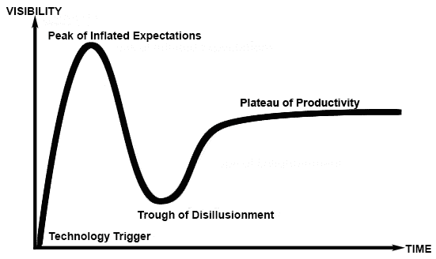
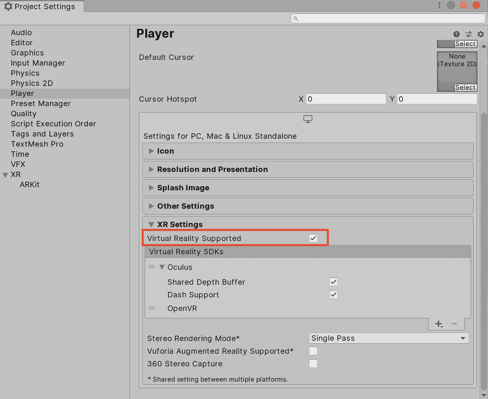
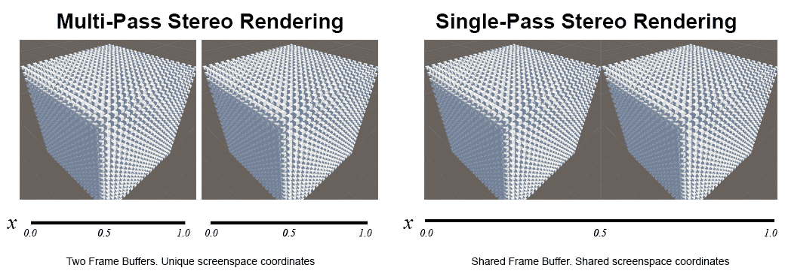

# 虚拟和增强现实优化

两种全新的娱乐媒介以**虚拟现实**（**VR**）和**增强现实**（**AR**）的形式进入了世界舞台。在**头戴式设备**（**HMD**）的使用下，用户被带入一个虚拟空间。在**增强现实**中，虚拟元素叠加在显示真实世界的显示之上。为了简洁起见，这两个术语通常被合并成一个单一术语——**扩展现实**（**XR**）。还有**混合现实**（**MR**）（也称为**混合现实**（**HR**）），其中应用程序将真实世界和虚拟世界混合在一起；这包括所有之前提到的格式，同时也包括 AR，其中真实世界物体被扫描并叠加在一个主要虚拟世界中。

这些媒体格式的市场迅速崛起，并且仍在快速增长，吸引了科技行业最大玩家的巨额投资。自然地，像 Unity 这样的游戏引擎迅速加入了这一行列，为大多数顶级竞争平台提供了充足的支持，例如谷歌的 Cardboard、宏达电的 VIVE、Oculus Rift、微软的 HoloLens 以及三星的 Gear VR 平台，以及更近期的加入者，如苹果的 ARKit、谷歌的 ARCore、微软的 Windows 混合现实平台、PTC 的（最初是高通的）Vuforia 和索尼的 PlayStation VR。

# XR 技术概述

XR 为开发者和创意人士提供了一个全新的探索领域。这包括娱乐产品，如游戏和 360 度视频（或简称 360 视频），其中一系列摄像头捆绑在一起，每个摄像头面向不同的方向——从这些摄像头捕获的各种图像被拼接在一起，并在 VR 头盔中像电影一样播放，实现全方位的可见性。创意行业工具在 XR 中也很常见，如 3D 建模软件、工作流程可视化以及提高生活质量的设备。已经确立的规则很少，因此有大量的创新机会，为这股新技术浪潮做出贡献，并成为制定这些规则的人。这导致了许多关于探索可能性和尝试在娱乐和互动体验的未来上留下印记的喧嚣和兴奋。

当然，几乎每一种新技术都会经历**炒作周期**（来自 Gartner 炒作周期，您可以在[`www.gartner.com/technology/research/methodologies/hype-cycle.jsp`](https://www.gartner.com/technology/research/methodologies/hype-cycle.jsp)查看）。炒作周期始于过度炒作的蜜月期，早期采用者会宣扬其好处。随后，随着它进入幻灭的低谷，情绪最终会冷却，因为它还没有完全进入主流，其好处尚未得到充分认可*.* 这种情况会持续，直到技术要么未能赢得人心，从而消失，要么稳固地占据市场并持续稳定地被采用。以下图表展示了 Gartner 炒作周期的关键要素：

争议性地，XR 最近可能正在经历这个最终阶段，并开始享受到比早期更好的支持和更高品质的体验，尽管 XR 的采用率确实比最初预测的要慢。是否 XR 将成长为一个数十亿美元的行业，或者仅仅消失在利基市场中，还有待观察。因此，在这个新媒介中开发并非没有风险，我们可以找到同意我们观点的行业分析师，无论我们对 XR 的未来持何种立场。有一点是肯定的：每当有人亲身体验 VR 和 AR 的能力时，他们都会被沉浸感和该媒介将他们成功地带入另一个世界的说服力所震撼。这种沉浸感和互动性是无与伦比的，并且随着平台的支持成熟和技术持续进步，预示着更多的可能性。

在本章中，我们将探讨以下主题：

+   在 Unity 中开发 VR 或 AR 项目时需要考虑的担忧以及必须避免的事项

+   专门针对 XR 媒介的性能提升

# 开发 XR 产品

在 Unity 中开发 XR 产品涉及将几个 XR **软件开发工具包**（**SDKs**）之一导入我们的 Unity 项目中，并在运行时通过一些专门的 API 调用配置和使用该平台。每个 SDK 都有其独特之处，并提供不同的功能集。例如，Oculus Rift 和 HTC VIVE SDKs 提供了控制 VR 头戴式显示器及其相应控制器的 API，而苹果的 ARKit 提供了确定空间定位和在显示上叠加对象的实用工具。Unity Technologies 一直在努力创建支持所有这些变化的 API，因此 Unity 中 XR 开发的 API 在过去几年中发生了很大变化。

Unity VR 开发的早期意味着将原生插件直接放入我们的 Unity 项目中，直接从外部开发者门户导入 SDK（涉及设置中的各种令人烦恼的繁琐工作），并手动应用更新。然而，从那时起，Unity 已经将这些 SDK 直接集成到编辑器中。此外，由于 AR 最近变得更加流行，主 API 在 Unity 2017.2.0 及以后的版本中已被重命名为`UnityEngine.VR`到`UnityEngine.XR`，并进行了修改，以便它可以与多个 AR SDK 一起工作。

Unity XR 系统目前正在从传统模式过渡到新的基于包的模式。默认情况下，Unity 支持有限的 XR 平台。要导入其他 XR SDK 并对其进行配置（例如 ARKit 或 Hololens），您需要首先通过前往 Window | Package Manager 使用包管理器来安装它们。

目前在 XR 产品上的开发体验有点好坏参半。这涉及到使用一些顶级的硬件和软件，这意味着会有不断的变更、重新设计、故障、补丁、错误、兼容性问题、性能问题、渲染伪影、平台之间功能不匹配等问题。所有这些问题都旨在减缓我们的进度，这使得在 XR 领域获得竞争优势变得格外困难。从积极的一面来看，几乎每个人都在遇到同样的问题，因此它们得到了开发者的很多关注，这使得它们更容易开发。随着每一次更新的进行，我们都会学到经验教训，API 会得到清理，新的功能、工具和优化也会被提供。

性能问题限制了 XR 产品的成功，可能比非 XR 项目更为严重，因为当前媒体的状态。让我们看看其中的一些性能问题：

+   首先，我们的用户将花费大量金钱购买 VR 头戴式显示器和传感器设备或 AR 兼容的硬件。这两个平台都非常资源密集，需要类似昂贵的图形硬件来支持它们。这通常导致用户期望与典型游戏相比的质量水平要高得多，这样投资才感觉值得。换句话说，这就使得由于用户需要投入的金钱，不良的用户体验变得可以理解地难以原谅。

+   其次，对于 VR 项目来说可能比 AR 项目更为重要，糟糕的应用程序性能可能导致严重的物理用户不适，迅速将最坚定的支持者转变为反对者。特别是，如果 XR 应用程序的帧率不足，玩家感受到的运动（例如，通过旋转头部）与他们看到的内容之间将存在差异（我们将在稍后详细了解这一点）。这导致常见的运动病问题，在某些情况下，可能持续数小时*。*

+   第三，XR 平台的主要吸引力是其沉浸感，而帧率下降、闪烁或任何迫使用户取下头戴式设备或重新启动应用程序的应用程序故障都会更快地打破这种沉浸感。

最终，我们必须准备好在早期对 XR 应用程序进行性能分析，以确保我们没有超出我们的运行时间预算，因为其背后的技术和媒体复杂且资源密集，这将使预算变得紧张。

# 用户舒适度

与典型的游戏和应用不同，VR 应用需要将用户舒适度作为一个指标来优化自己。不幸的是，眩晕、晕动症、眼睛疲劳、头痛，甚至由于平衡失调而导致的身体伤害，对于早期的 VR 采用者来说都太过常见了，而且责任在我们身上，我们需要限制这些负面影响。本质上，内容对用户舒适度的重要性与硬件一样，如果我们是为这个媒介构建，我们就必须认真对待这个问题。

并非每个人都会遇到这些问题，而且有一些幸运的人从未经历过这些问题；然而，绝大多数用户都曾在某个时候报告过这些问题。此外，仅仅因为我们的游戏在测试时没有触发这些问题，并不意味着它们不会在其他人身上触发。事实上，由于熟悉，我们可能会成为我们游戏的最有偏见的测试对象。不知不觉中，我们可能会开始预测我们应用产生的最令人恶心行为，这使得与一个新用户经历相同情况相比，测试变得不公平。这不幸地进一步提高了 VR 应用开发的成本，因为如果我们想弄清楚我们的体验是否会引起不适，就需要对不同的无偏见个体进行大量测试，这可能每次我们在影响运动和帧率的重大更改时都需要。

用户可以采取一些措施来提高他们的 VR 舒适度，例如从短时间会话开始，逐渐增加时间以获得平衡练习，并训练大脑预期不匹配的运动。一个更极端的选择是在之前服用晕动症药物或喝一点姜茶来稳定胃部。然而，如果我们承诺只需几场晕动症就会开始变得有趣，我们几乎无法说服用户尝试我们的应用。

用户在 VR 中可以体验到三种主要的不适类型：

+   **晕动症**：第一个问题是由于晕动症引起的恶心，通常发生在用户的眼睛认为的地平线与他们的其他感官告诉大脑的信息不一致时，例如内耳的平衡感。

+   **眼睛疲劳**：第二个问题是眼睛疲劳，这源于用户盯着离眼睛几英寸远的屏幕，这往往会导致长时间使用后眼睛疲劳，并最终引起头痛。

+   **迷失方向**：最后，迷失方向通常是因为 VR 用户有时站在一个封闭的空间内，所以如果一款游戏包含任何基于加速度的运动，用户会本能地试图通过调整平衡来抵消这种加速度，这可能导致迷失方向、跌倒，如果我们在确保用户体验平滑和可预测的运动方面不够小心，用户可能会受伤。

注意，术语**加速度**是故意这样使用的，因为它是一个矢量，这意味着它既有大小也有方向。任何类型的加速度都可能引起迷失方向，这包括不仅向前、向后和侧向加速，还包括旋转形式的加速度（转身）、坠落、跳跃等等。

VR 应用可能面临的另一个潜在问题是引发癫痫发作的可能性。VR 能够将图像以近距离投射到用户的眼睛中，这带来了一些风险，如果我们渲染行为崩溃并开始闪烁，我们可能会无意中触发易感用户的癫痫发作。这些都是我们在开发过程中需要牢记的事情，需要尽早测试和修复。

在 VR 应用中，可能最重要的性能指标是拥有高帧率（**帧每秒**，**FPS**），最好是 90 FPS 或更高，因为这将产生平滑的观看体验，因为用户头部运动和世界运动之间的脱节将非常小。任何长时间的帧率下降或帧率值持续低于这个值都可能给我们的用户带来很多问题，因此，我们的应用程序必须始终表现良好。此外，我们还应该非常小心地控制用户的视角。我们应该避免自己改变 HMD 的视野（让用户决定他们面向的方向），在长时间内产生加速度，或者引起不受控制的全球旋转和地平线运动，因为这些极有可能触发用户的运动病和平衡问题。

一个不容置疑的严格规则是，我们绝对不应该在我们的产品最终构建中对 HMD（头戴式显示器）的位置跟踪应用任何类型的增益、乘数效应或加速效应。这样做是为了测试是可以的，但如果真实用户将头部向侧面移动两英寸，那么它应该感觉就像在应用程序内部移动了相同的相对距离，并且应该在他们的头部停止时立即停止。否则，不仅会导致玩家感觉头部应该所在的位置和实际位置之间的脱节，而且如果摄像头相对于玩家的朝向和颈部角度发生偏移，还可能引起一些严重的不适。

对于玩家角色的动作，可以使用加速度，但应该在用户开始快速自我调整之前非常短促和迅速。最明智的做法是坚持使用基于恒定速度和/或瞬移的运动。

在赛车游戏中放置倾斜转弯似乎大大提高了用户的舒适度，因为用户会自然地倾斜头部并调整平衡以匹配转弯。

所有之前的规则同样适用于 360 度视频内容，就像它们适用于 VR 游戏一样。坦白说，市场上已经发布了大量没有考虑到上述要点的 360 度视频——它们包含太多颠簸的动作、缺乏相机稳定、手动视口旋转等问题。这些技巧通常被用来确保用户面向我们希望的方向；然而，我们必须付出更多努力来避免引起恶心感的行为，而不是通过黑客手段。人类天生对移动的事物非常好奇。如果他们在眼角注意到某个东西在移动，那么他们很可能会转身面对它。这可以非常有效地用来在用户观看视频时保持他们面向我们希望的方向。

在生成 VR 内容时，懒惰并不是一个好的选择。不要只是将 360 度相机放在一辆越野赛车顶部，并在视频中强行加入意外的相机旋转来保持动作在中心。动作需要平滑且可预测。在制作过程中，我们需要不断考虑我们期望用户看向哪里，以便正确捕捉动作镜头。

幸运的是，对于 360 度视频格式，似乎行业标准的帧率，如 24 FPS 或 29.97 FPS，对用户舒适度没有灾难性的影响，但请注意，这个帧率仅适用于视频播放。我们的渲染 FPS 是一个单独的 FPS 值，决定了位置头跟踪的平滑度。渲染 FPS 必须始终非常高，以避免不适（理想情况下，90 FPS）。

当构建 VR 应用时，会出现其他问题——不同的 HMD 和控制器支持不同的输入和行为，这使得在 VR 平台之间实现功能一致性变得困难。如果我们尝试将 2D 和 3D 内容合并在一起，可能会发生一个称为**立体冲突**的问题，其中 2D 对象似乎在 3D 对象深处渲染，因为眼睛无法正确区分距离。这通常是 VR 应用程序用户界面和 360 度视频播放的一个大问题，它们往往是一系列叠加在 3D 背景上的平面面板。立体冲突通常不会导致恶心，但它可能会造成额外的眼部疲劳。

虽然不适感在 AR 平台上的影响并不那么明显，但仍然很重要，不要忽视它。由于 AR 应用倾向于消耗大量资源，低帧率的应用可能会引起一些不适。这尤其适用于 AR 应用将对象叠加到相机图像上（这占大多数），其中背景相机图像和叠加其上的物体之间可能会出现帧率不匹配。我们应该尝试同步这些帧率，以限制这种不匹配。

# XR 中的性能提升

关于行业和 XR 开发的讨论就到这里。在下一节中，我们将介绍一些可以应用于 XR 项目的性能提升方法，例如选择不同类型的立体渲染算法，以及如何将抗锯齿和其他效果应用于 VR 游戏。

# 厨房水槽

由于 AR 和 VR 应用是使用与任何其他 Unity 游戏相同的引擎、子系统、资产、工具和实用程序构建的，因此本书中提到的几乎所有其他性能提升都可以以某种方式帮助 VR 和 AR 应用，我们应该在深入研究 XR 特定增强之前尝试它们所有。这令人欣慰，因为我们可以应用许多潜在的性能提升。缺点是我们可能需要应用许多它们才能达到我们应用所需的性能水平。

VR 应用性能的最大威胁是 GPU 填充率，这已经是任何其他游戏中更可能的瓶颈之一，但对于 VR 来说，影响更大，因为我们始终试图将高分辨率图像渲染到更大的帧缓冲区（因为我们实际上是在为每个眼睛渲染场景两次）。AR 应用通常会在 CPU 和 GPU 上发现极端消耗，因为 AR 平台大量使用 GPU 的并行管道来解决对象的空间局部性，执行图像识别等任务，以及需要大量的绘制调用来支持这些活动。

当然，某些性能提升技术在 XR 中可能不会特别有效。在 VR 应用中实施**遮挡剔除**可能很困难，因为用户可以查看场景中的物体下方、周围，有时甚至能透过物体（尽管它仍然可能带来巨大的好处）。与此同时，AR 应用通常在可触及的距离渲染物体；LOD 增强——即使用更简单的网格为远处的物体建模——可能设置起来相当没有意义。

我们在开始实施之前必须运用更好的判断力来确定一项性能优化技术是否值得实施，因为其中许多都需要花费大量时间来实施和支持。

# 单次遍历与多次遍历立体渲染

对于 VR 应用程序，Unity 提供了三种渲染模式：多通道渲染、单通道渲染和单通道实例渲染。这可以在“编辑 | 项目设置 | 玩家 | XR 设置 | 立体渲染方法”下进行配置（请注意，必须启用“支持虚拟现实”复选框才能显示此选项）：

多通道渲染会将场景渲染成两个不同的图像，这些图像将分别显示给每只眼睛。单通道立体渲染将这两个图像合并成一个双宽度的渲染纹理，其中只向每只眼睛显示相关的一半。

注意，XR 设置仅适用于旧系统。如果您安装了新的实验性**XR 管理**包，您可以通过“编辑 | 项目设置 | XR 插件管理”找到渲染模式。

多通道立体渲染是默认情况。单通道渲染的优势在于它为主线程中的 CPU 工作提供了显著的节省（通过减少绘制调用设置）以及在 GPU 上，因为需要发生的纹理交换更少。当然，GPU 仍然需要努力渲染对象，因为每个对象仍然从两个不同的视角渲染两次（这里没有免费的午餐）。缺点是，这种效果目前只能在使用 OpenGL ES3.0 或更高版本时使用，因此并非所有平台都可用。

此外，它对渲染管线的影响需要额外的关注和努力，尤其是在任何使用屏幕空间效果的着色器（仅使用已绘制到帧缓冲区中的数据的特效）周围。启用单通道立体渲染后，着色器代码不能再对传入的屏幕空间信息做出相同的假设。以下图像显示了**多通道立体渲染**和**单通道立体渲染**之间屏幕空间坐标的变化：

着色器总是被告知相对于整个输出渲染纹理的屏幕空间坐标，而不是它感兴趣的局部部分——例如，我们通常期望**x**值为**0.5**对应于屏幕的水平中点，这在使用**多通道立体渲染**时是这种情况；然而，如果我们使用**单通道立体渲染**，那么**x**值为**0.5**将对应于双眼渲染之间的中点（左眼的右侧或右眼的左侧）。

Unity 为着色器提供了有用的屏幕空间转换辅助方法，可以在[`docs.unity3d.com/Manual/SinglePassStereoRendering.html`](https://docs.unity3d.com/Manual/SinglePassStereoRendering.html)找到。

另一个需要担心的问题是后期处理效果。在 VR 场景中，我们实际上总是为任何应用的后期处理效果支付双倍的成本，因为它需要为每只眼睛评估一次。单次渲染立体渲染可以减少设置效果所需的绘制调用，但我们不能盲目地将后期处理效果同时应用于两张图像。因此，后期处理效果着色器也必须进行调整，以确保它们渲染到正确的输出渲染纹理的一半。如果不这样做，后期处理效果将被拉伸到两只眼睛上两次，对于如镜头光晕等效果可能会显得非常奇怪。

**单次渲染实例化**（也称为**立体实例化**），另一方面，是一种实验性的渲染模式，它相对于标准单次渲染有一些优势。它不是通过为左右眼渲染相同对象来加倍绘制调用，而是大量使用**GPU 实例化**。简而言之，GPU 实例化允许 Unity 向 GPU 发出单个绘制调用，但要求网格必须在两个不同的位置绘制。因此，单次渲染实例化可以与 CPU 性能相比提供显著的改进；然而，自定义着色器需要为 GPU 实例化做好准备：这涉及到向着色器添加一个位置参数（以便 GPU 知道如何移动网格）和几个 Unity 实用函数。

在自定义着色器上启用 GPU 实例化是一项艰巨的任务，除非你已经对 Unity 着色语言有一些经验，否则不建议这样做。如果你有经验，那么开始的地方是[`docs.unity3d.com/Manual/SinglePassInstancing.html`](https://docs.unity3d.com/Manual/SinglePassInstancing.html)。

单次渲染（包括传统和实例化）功能并不适用于所有平台。我们预计它最终将推广到更多平台，但对于支持该功能的平台，我们需要对我们的屏幕空间着色器进行一些性能分析和合理的合理性检查，以确保我们通过启用此选项获得积极的收益。

# 应用抗锯齿

应用抗锯齿更多的是一种需求，而不是性能提升。抗锯齿显著提高了 XR 项目的保真度，因为对象将更好地融合，看起来更少像素化，从而提高沉浸感，这可能会消耗大量的填充率。我们应该尽早启用此功能，并假设它始终存在，只在绝对最后关头禁用它，以尝试达到我们的性能目标。

# 使用前向渲染

延迟渲染的优势在于能够以最少的绘制调用解决许多光源。不幸的是，如果我们遵循前面的建议并应用抗锯齿效果，那么在采用延迟渲染时，这必须作为一个后处理屏幕空间着色器来完成。与在正向渲染中作为多采样效果应用相同技术相比，这可能会造成相当大的性能损失，从而使得正向渲染成为两种选项中性能更优的一种。

# 在 VR 中应用图像效果

法线贴图应用的效果在 VR 中很容易崩溃，纹理看起来是画在表面上的，而不是给人一种深度错觉。法线贴图通常在非常斜（浅）的观察角度下迅速崩溃，这与典型游戏中的情况不太常见；然而，在 VR 中，由于大多数头戴式显示器允许用户通过位置跟踪在 3D 空间中移动他们的头部（尽管并非所有设备都这样做），他们很快就会找到任何靠近摄像机的物体效果崩溃的位置。已知法线贴图可以改善 VR 中高多边形对象的质量，但很少为低多边形对象提供好处，因此我们应该进行一些测试，以确保任何视觉改进都值得在内存带宽上的成本。

最终，我们不能依赖法线贴图来为低多边形对象提供快速且经济的图形保真度提升，这些对象是我们从非 VR 场景中可能期望得到的。因此，需要进行测试以确定这种错觉是否按预期工作。应使用位移贴图、细分或视差贴图来创建更逼真的深度外观。不幸的是，所有这些技术都比典型的法线贴图成本更高，但这是我们在 VR 中实现良好图形质量必须承受的负担。

其他后处理效果，如景深、模糊和镜头光晕，在典型的 3D 游戏中看起来很好，但通常不是我们在现实世界中看到的效果，在 VR 中（至少在眼动追踪支持可用之前）会显得格格不入，因此应该一般避免。

# 反面裁剪

反面裁剪（从永远不会可见的对象中移除面）对于 VR 和 AR 项目来说可能很棘手，因为玩家的观察角度可能来自任何方向。如果我们想避免破坏沉浸感的角度，靠近摄像机的资产应该是完全封闭的形状。我们还应该仔细考虑对远程对象应用反面裁剪，尤其是如果用户通过传送移动，因为这可能很难完全限制用户的位置。确保您测试游戏世界的边界体积，以确保用户无法逃脱。

# 空间化音频

音频行业正充满对 VR（或更准确地说，是终于找到了良好用途的旧技术）的新技术，以空间音频的形式呈现音频体验。这些格式的音频数据不再代表特定通道的音频数据，而是包含某些音频谐波数据，这些数据在运行时合并以创建更逼真的音频体验，这取决于当前的相机视口，尤其是垂直方向。前一句话中的关键词是运行时，这意味着这种效果与它相关的连续非平凡成本。这些技术将需要 CPU 活动，但也可能使用 GPU 加速来生成它们的效果，因此如果我们在使用空间音频时遇到性能问题，我们应该双重检查这两个设备的行为。

# 避免相机物理碰撞

在 VR 和 AR 中，用户可以穿过物体移动相机，这可能会破坏他们的沉浸感。虽然添加物理碰撞器到这些表面以防止相机穿过它们可能很有吸引力，但这将在 VR 中导致方向混乱，因为相机不会与用户的移动同步。这也可能破坏 AR 应用的定位跟踪校准。更好的方法是允许用户看到物体内部，或者保持相机和这些表面之间的安全缓冲区。如果我们一开始就不允许玩家太靠近它们，那么就没有将头部穿过墙壁的风险。

由于减少了碰撞器的数量，这将节省性能，但应更多地将其视为一个生活质量问题。我们不应该过于担心通过这种方式冒险破坏沉浸感，因为研究表明，一旦用户意识到他们可以这样做，他们往往会避免看向物体。当这种情况首次发生时，他们可能会经历片刻的困惑或欢笑，但幸运的是，人们往往希望留在我们创造的沉浸式体验中，并且会倾向于避免将头部穿过墙壁。然而，能够这样做提供了游戏玩法上的优势，即能够透过墙壁观察敌人即将从哪里出现，因此我们应该考虑到这一点来开发我们的场景。

# 避免使用欧拉角

避免在任意类型的方向行为中使用欧拉角。四元数被设计得在表示角度方面要好得多（唯一的缺点是它们更抽象，在调试时更难可视化），并且当有变化时，它们可以保持准确性，同时避免可怕的陀螺仪锁定。在计算中使用欧拉角可能会导致大量旋转变化后的不准确，这在 VR 和 AR 中是极其可能的，因为用户的视点会每秒以微小的量多次改变。

欧拉角可能会出现陀螺仪锁定的问题。由于欧拉角通过三个轴来表示方向，当其中一个轴旋转 90 度时，会出现重叠，我们可能会意外地将它们锁定在一起，变得在数学上无法分离，并导致未来的方向变化同时影响两个轴。当然，人类可以想出如何旋转对象来解决这个问题，但陀螺仪锁定是一个纯粹数学上的问题。经典的例子是战斗机中的方向气泡。飞行员永远不会遇到陀螺仪锁定的问题，但他们的抬头显示仪中的方向仪器可能会因为陀螺仪锁定而变得不准确。四元数通过包含一个第四个值来解决这个问题，这个值有效地允许重叠的轴仍然可以相互区分。

# 练习节制

VR 应用的性能目标非常难以达到。因此，当我们试图将过多的质量塞入我们的应用中，超出了当前一代 XR 设备和典型用户硬件的容忍度时，认识到这一点非常重要。最后的手段总是从场景中剔除对象，直到我们达到性能目标。对于 XR 应用，我们应该比非 XR 应用更愿意这样做，因为性能不佳的成本往往远超过高质量带来的收益。如果已经明显看出渲染预算已经耗尽，我们就应该避免在场景中添加更多细节。这在沉浸式 VR 内容中可能很难承认，因为我们希望创造尽可能多的引人入胜的沉浸感，但直到技术赶上我们的野心，我们仍需要保持节俭。

# 跟踪最新发展

Unity 提供了一系列包含 VR 设计和优化技巧的有用文章和教程，随着媒体和市场的成熟以及新技术的发现，这些内容可能会得到更新。这个列表可能比这本书更新得更快，所以请时不时地查看它们，以获取最新的技巧。通常，相关的文章和教程可以在 [`learn.unity.com`](https://learn.unity.com) 找到。

我们还应该关注 Unity 博客，以确保我们不会错过关于 XR API 变更、性能增强和性能建议的重要信息。

# 摘要

希望这份简短的指南能帮助您提升您的 XR 应用性能。令人欣慰的消息是，您有许多性能优化选项可供选择，因为 Unity XR 应用是基于我们在整本书中一直在探索的相同底层平台构建的。不那么令人欣慰的是，我们可能必须测试和实施所有这些选项，才有可能达到我们的质量目标。我们可以预期硬件会随着时间的推移变得更加强大，价格会下降，采用率也会提高；然而，在此之前，如果我们想在科技世界的最新热潮中竞争，我们就必须全力以赴。

在下一章中，我们将深入探讨 Unity 的底层引擎，以及它所构建的各种框架、层和语言。本质上，我们将更深入地查看我们的脚本代码，并研究一些方法来全面提升我们的 CPU 和内存管理。
