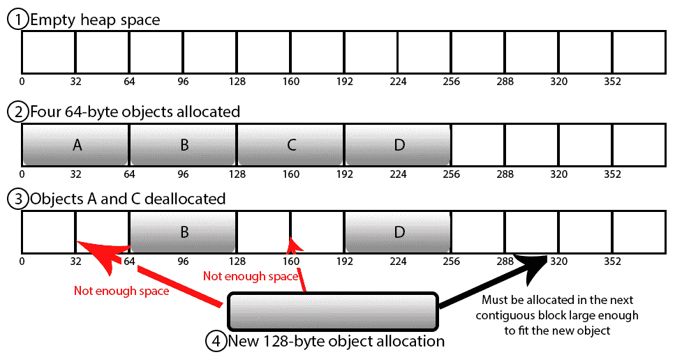
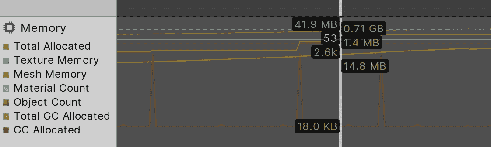
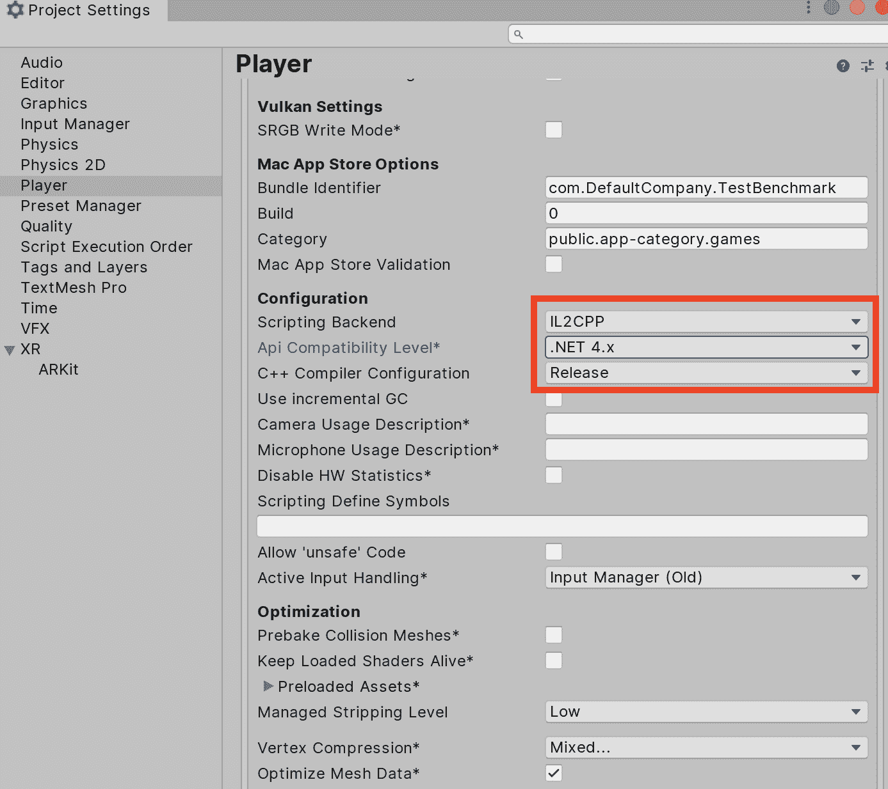
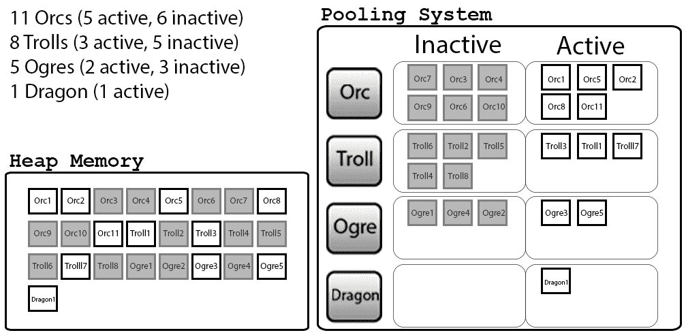
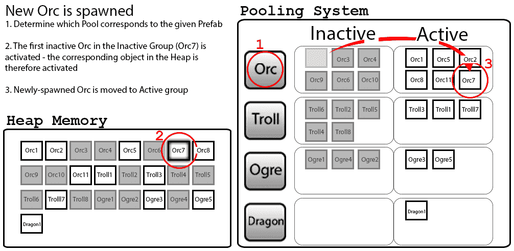
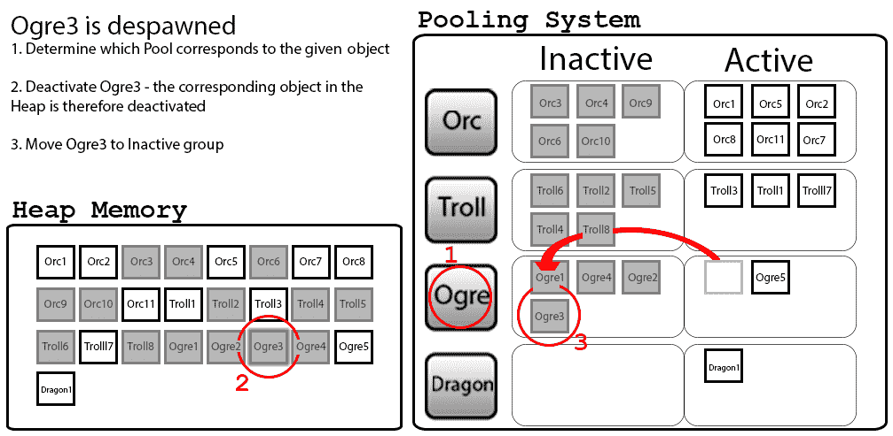
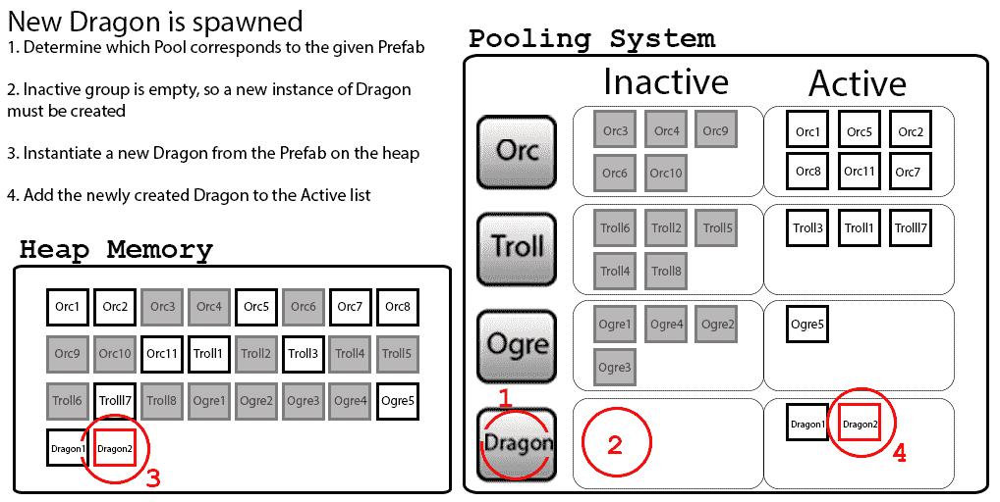

# 精通内存管理

内存效率是性能优化的一个重要元素。对于范围有限的游戏，如爱好项目和原型，可以忽略内存管理。这些游戏可能会浪费大量资源，并可能发生内存泄漏，但如果仅限于朋友和同事之间，这不会成为问题。然而，任何我们想要专业发布的，都需要认真对待这个问题。不必要的内存分配会导致垃圾回收过多（消耗宝贵的 CPU 时间）和内存泄漏，这会导致崩溃。在现代游戏发布中，这些情况都是不可接受的。

使用 Unity 高效利用内存需要深入了解底层 Unity 引擎、Mono 平台和 C#语言。此外，如果我们正在使用新的 IL2CPP 脚本后端，那么熟悉其内部工作原理将是明智的。这对一些开发者来说可能有点令人畏惧，因为许多人选择 Unity3D 作为他们的游戏开发解决方案，主要是为了避免来自引擎开发和内存管理的底层工作。我们更愿意关注与游戏实现、关卡设计和艺术资源管理相关的更高层次的问题，但不幸的是，现代计算机系统是复杂的工具，长期忽视底层问题可能会导致灾难。

理解内存分配和 C#语言特性正在发生什么，它们如何与 Mono 平台交互，以及 Mono 如何与底层 Unity 引擎交互，对于编写高质量、高效的脚本代码至关重要。因此，在本章中，你将了解底层 Unity 引擎的所有细节：Mono 平台、C#语言、**中间语言到 C++（IL2CPP**）和.NET 框架。

幸运的是，要有效地使用 C#语言，并不需要成为绝对的语言大师。本章将把这些复杂主题简化为更易于理解的形式，并分为以下主题：

+   Mono 平台概述：

    +   原生和托管内存域

    +   垃圾回收

    +   内存碎片化

+   使用 IL2CPP 构建项目

+   如何分析内存问题

+   实施各种与内存相关的性能提升：

    +   最小化垃圾回收

    +   正确使用值类型和引用类型

    +   负责任地使用字符串

    +   与 Unity 引擎相关的众多潜在提升

    +   对象和 Prefab 池化

# Mono 平台

Mono 是一种神奇的风味酱，被混合到 Unity 的配方中，赋予了它许多跨平台的能力。Mono 是一个开源项目，它基于微软 .NET 框架的 API、规范和工具构建了自己的平台库。本质上，它是对 .NET 库的开源重制，几乎无需访问原始源代码，并且与微软的原始库完全兼容。

Mono 项目的目标是提供一个框架，通过这个框架，用通用编程语言编写的代码可以在许多不同的硬件平台上运行，包括 Linux、macOS、Windows、ARM、PowerPC 等。Mono 还支持许多不同的编程语言。任何可以编译成 .NET 的 **通用中间语言**（**CIL**）的语言都足以与 Mono 平台集成。这包括 C# 本身，还包括 F#、Java、Visual Basic .NET、pythonnet 和 IronPython 等几种其他语言。

关于 Unity 引擎的一个常见误解是它建立在 Mono 平台之上。这是不正确的，因为基于 Mono 的层不处理许多重要的游戏任务，如音频、渲染、物理和跟踪时间。Unity Technologies 为了速度构建了一个本地的 C++ 后端，并允许用户通过 Mono 作为脚本接口来控制这个游戏引擎。因此，Mono 只是底层 Unity 引擎的一个成分。这与许多其他游戏引擎类似，它们在底层运行 C++，处理渲染、动画和资源管理等重要任务，同时为游戏逻辑的实现提供高级脚本语言。因此，Unity Technologies 选择 Mono 平台来提供这一功能。

本地代码是对专门为特定平台编写的代码的通俗说法。例如，在 Windows 中编写创建窗口对象或与网络子系统接口的代码，与为 macOS、Unix、PlayStation 4、Xbox One 等执行任务的代码完全不同。

脚本语言通常通过自动垃圾回收来抽象复杂的内存管理，并提供各种安全特性，从而简化编程过程，但这也带来了运行时的开销。一些脚本语言也可以在运行时进行解释，这意味着它们在执行前不需要编译。原始指令在运行时动态转换为机器代码，并在读取时立即执行；当然，这通常会使代码相对较慢。最后一个特性，也可能是最重要的特性，是它们允许编程命令具有更简单的语法。这通常极大地改善了开发工作流程，因为即使是没有太多使用 C++等语言经验的团队成员也能为代码库做出贡献。这使他们能够在牺牲一定程度的控制和运行时执行速度的情况下，以更简单的格式实现游戏逻辑等功能。

注意，这类语言通常被称为**管理语言**，它们具有**管理代码**的特点。技术上，这是一个由微软创造的术语，指的是必须在他们的**公共语言运行时**（**CLR**）环境中运行的任何源代码，与通过目标操作系统本地编译和运行的代码相对。

然而，由于 CLR 与其他具有类似设计的运行时环境的语言（如 Java）的普遍性和共同特性，术语**管理**已经被篡改。它通常用来指代任何依赖于其自身运行时环境，并且可能包含或不包含自动垃圾回收的语言或代码。在本章的其余部分，我们将采用这个定义，并使用术语**管理**来指代既依赖于单独的运行时环境来执行，又受到自动垃圾回收监控的代码。

管理语言的运行时性能成本始终大于等效的本地代码，但每年都在逐渐降低。这部分是由于工具和运行时环境的逐步优化，部分是由于平均设备的计算能力逐渐增强。然而，使用管理语言的主要争议点仍然是它们的自动内存管理。手动管理内存可能是一项复杂的任务，可能需要多年的困难调试才能熟练掌握，但许多开发者认为，管理语言以过于不可预测的方式解决这个问题，风险太大，可能会影响产品质量。这样的开发者可能会声称，管理代码永远不会达到本地代码相同的性能水平，因此用它们构建高性能应用是鲁莽的。

在一定程度上这是正确的，因为受管理语言不可避免地会带来运行时开销，我们失去了对运行时内存分配的部分控制。这对于高性能服务器架构来说可能是一个致命的问题；然而，对于游戏开发来说，这变成了一种权衡，因为并非所有资源的使用都会必然导致瓶颈，而且最好的游戏也不一定是那些充分利用每个字节的潜在能力的游戏。例如，想象一个用户界面通过原生代码在 30 毫秒内刷新，而通过受管理代码在 60 微秒内刷新，因为额外的 100% 开销（一个极端的例子）。受管理代码版本仍然足够快，以至于用户永远无法察觉到差异，那么使用受管理代码来完成这样的任务真的有伤害吗？

实际上，至少对于游戏开发来说，使用受管理语言通常意味着与原生代码开发者相比，开发者有一套独特的担忧需要关注。因此，选择使用受管理语言进行游戏开发部分是关于偏好，部分是关于控制与开发速度的妥协。

让我们回顾一下我们在前面的章节中提到但并未详细阐述的话题：Unity 引擎中内存域的概念。

# 内存域

Unity 引擎内的内存空间可以基本上分为三个不同的内存域。每个域存储不同类型的数据，并负责非常不同的任务。让我们逐一看看它们：

+   第一个内存域——受管理域——应该非常熟悉。这个域是 Mono 平台工作的地方，我们编写的任何 `MonoBehaviour` 脚本和自定义 C# 类将在运行时实例化，因此我们将通过我们编写的任何 C# 代码非常明确地与这个域交互。它被称为受管理域，因为这个内存空间是由 **垃圾回收器**（**GC**）自动管理的。

+   第二个域——原生域——更为微妙，因为我们只是间接地与之交互。Unity 有一个底层的原生代码基础，它用 C++ 编写，并根据目标平台的不同编译成我们的应用程序。这个域负责为诸如资产数据（例如，纹理、音频文件和网格）以及各种子系统（如渲染管线、物理系统和用户输入系统）分配内部内存空间。最后，它还包括重要的游戏玩法对象（如 GameObject 和组件）的部分原生表示，以便它们可以与这些内部系统交互。这就是许多内置的 Unity 类存储数据的地方，例如 `transform` 和 `Rigidbody` 组件。

+   第三和最后一个内存域是外部库，例如 DirectX 和 OpenGL 库，以及我们项目中所包含的任何自定义库和插件。从我们的 C#代码中引用这些库将导致类似的内存上下文切换和后续成本。

管理域还包括对存储在本地域中的相同对象表示的包装器。因此，当我们与如`transform`之类的组件交互时，大多数指令都会要求 Unity 深入到其本地代码中，在那里生成结果，然后将结果复制回管理域供我们使用。这就是本地-管理桥在管理域和本地域之间的由来，这在之前的章节中简要提到过。当两个域都有相同实体的自己的表示时，跨越它们之间的桥梁需要内存上下文切换，这可能会对我们的游戏造成相当大的性能影响。显然，由于涉及的开销，跨越这座桥梁的次数应该尽可能减少。我们在第二章“脚本策略”中介绍了几种处理这种问题的技术。

在大多数现代操作系统中，内存运行时空间被分为两个类别。

# 堆栈

堆栈是内存中的一个特殊预留空间，用于存储小而短暂的数据值，这些数据值一旦超出作用域就会被自动释放，这就是为什么它被称为堆栈。它实际上就像一个堆栈数据结构，从顶部推入和弹出数据。堆栈的分配符合以下属性：

+   堆栈包含我们声明的任何局部变量，并处理函数的加载和卸载，当函数被调用时。这些函数调用通过所谓的调用栈进行扩展和收缩。当调用栈完成当前函数的处理时，它会跳回到调用栈上的前一个点，并从那里继续执行。

+   上一次内存分配的起始位置总是已知的，因此没有必要执行任何清理操作，因为任何新的分配都可以简单地覆盖旧数据。因此，堆栈相对快速且高效。

+   总的堆栈大小通常非常小，通常在 MB 的数量级。如果分配的空间超过了堆栈所能支持的范围，就可能导致堆栈溢出。这种情况可能发生在异常大的调用栈（例如，无限循环）或拥有大量局部变量时，但在大多数情况下，尽管堆栈大小相对较小，但造成堆栈溢出通常不是一个大问题。

# 堆

堆代表所有剩余的内存空间，并且它被用于绝大多数的内存分配。

+   由于我们希望大部分分配的内存能够比当前函数调用持久，所以我们不能在栈上分配它，因为当当前函数结束时，它会被覆盖。因此，相反，每当一个数据类型太大而无法适应栈或者必须在声明它的函数外部持久时，它就会在堆上分配。

+   栈和堆在物理上没有区别；它们都是包含在 RAM 中的字节数据内存空间，这是操作系统为我们请求并预留的。唯一的不同在于它们的使用时间、地点和方式。

在原生代码中，例如用 C++等语言编写的代码，这些内存分配是手动处理的，我们负责确保所有分配的内存在我们不再需要时都得到适当的和明确的释放。如果没有正确处理，我们很容易无意中引入内存泄漏，因为我们可能会不断地从 RAM 中分配更多的内存空间，而这些内存永远不会被清理，直到没有更多的空间可以分配，应用程序崩溃。

同时，在托管语言中，这个过程通过 GC（垃圾回收）自动化。在我们 Unity 应用的初始化过程中，Mono 平台将从操作系统请求一块内存，并使用它来生成我们的 C#代码可以使用的堆内存空间（通常称为**托管堆**）。这个堆空间最初相当小，小于 1 MB，但随着我们的脚本代码需要新的内存块时，它会增长。如果 Unity 确定它不再需要，这个空间也可以通过释放回操作系统来缩小。

# 垃圾回收

GC 有一个重要的任务，就是确保我们不会使用比我们需要的更多的托管堆内存，并且不再需要的内存会被自动释放。例如，如果我们创建`GameObject`然后后来销毁它，GC 会标记`GameObject`使用的内存空间，以便稍后进行释放。这不是一个立即的过程，因为 GC 只有在必要时才会释放内存。

当发起一个新的内存请求，并且托管堆中有足够的空闲空间来满足请求时，GC 简单地分配新的空间并将其交给调用者。然而，如果托管堆没有足够的空间，GC 将需要扫描所有现有的内存分配，查找任何不再被使用的部分，并首先清理它们。它只有在最后手段的情况下才会扩展当前的堆空间。

Unity 使用的 Mono 版本中的 GC 是一种跟踪 GC，它使用**标记-清除**策略。这个算法分为两个阶段：每个分配的对象都通过一个额外的位来跟踪。这个位标记对象是否被标记。这些标志最初设置为`false`，表示它尚未被标记。

当收集过程开始时，它会通过将它们的标志设置为`true`来标记所有程序仍然可以到达的对象。这些可到达的对象可以是直接引用，例如堆栈上的静态或局部变量，或者是通过其他直接或间接可访问对象的字段（成员变量）进行间接引用。本质上，它是收集一组我们应用仍然可以引用的对象。所有不再可引用的东西将对我们应用来说实际上是不可见的，并且可以被 GC 回收。

第二阶段涉及遍历这个引用目录（GC 将在整个应用生命周期中跟踪这个目录），并根据其**标记**状态确定是否应该释放。如果对象被标记，那么它仍然被其他东西引用，因此 GC 不会对其进行操作。然而，如果没有标记，那么它就是释放的候选对象。在这个阶段，所有标记的对象都会被跳过，但在下一轮垃圾收集扫描的第一阶段之前，会将其标志重新设置为`false`。

本质上，GC 维护内存中所有对象的列表，而我们的应用维护一个单独的列表，只包含其中的一部分。每当我们的应用完成一个对象时，它只是简单地忘记它的存在，将其从列表中删除。因此，可以安全释放的对象列表将是 GC 的列表和我们的应用列表之间的差异。

第二阶段结束后，所有未标记的对象都会被释放到空闲空间，然后重新访问创建对象的初始请求。如果 GC 已经为对象释放了足够的空间，那么它将在新释放的空间中分配，并返回给调用者。然而，如果没有足够的空间，那么我们将遇到最后的手段情况，必须通过从操作系统请求来扩展托管堆，此时对象空间最终可以被分配并返回给调用者。

在一个理想的世界里，我们只分配和释放对象，但一次只存在有限数量的对象，堆将保持大致恒定的尺寸，因为总有足够的空间来容纳我们需要的新的对象。然而，一个应用中的所有对象很少按照它们分配的顺序被释放，而且它们在内存中的大小也很少相同。这导致了内存碎片。

# 内存碎片

当不同大小的对象交替分配和释放，并且大量小对象被释放，随后大量大对象被分配时，就会发生碎片化。

这最好通过一个例子来解释。以下展示了我们在典型堆内存空间中分配和释放内存的四个步骤：



内存分配如下：

1.  我们从一个空的堆空间开始

1.  然后我们在堆上分配了四个对象，**A**、**B**、**C** 和 **D**，每个对象大小为 64 字节

1.  在稍后的时间，我们释放了两个对象，**A** 和 **C**，释放了 128 字节

1.  然后我们尝试分配一个大小为 128 字节的新的对象

释放对象 **A** 和 **C** 从技术上讲释放了 128 字节的空间，但由于这些对象在内存中不是连续的（相邻的邻居），我们无法分配比这两个单独空间都大的对象。新的内存分配必须始终在内存中连续；因此，新对象必须在托管堆中下一个可用的连续 128 字节空间中分配。我们现在在内存空间中有两个 64 字节的空隙，除非我们分配大小为 64 字节或更小的对象，否则将永远不会被重用。

在长时间内，我们的堆内存可能会因为不同大小的对象释放后留下的更多、更小的空隙而变得布满空隙，然后系统稍后尝试在可以容纳新对象的最小可用空间内分配新对象，留下一些难以填充的小余量。如果没有自动清理这种碎片化的背景技术，这种效果会在任何内存空间中发生——RAM、堆空间，甚至硬盘——它们只是更大、更慢、更持久的内存存储区域（这就是为什么定期对硬盘进行碎片整理是个好主意）。

内存碎片化导致两个问题：

+   首先，它有效地减少了长期内新对象的可用内存空间，这取决于分配和释放的频率。这可能导致垃圾回收器必须扩展堆以为新分配腾出空间。

+   其次，它使得新的分配需要更长的时间来解决，因为找到足够大的新内存空间来容纳对象需要额外的时间。

当在堆中创建新的内存分配时，这变得很重要，因为可用空间的位置变得与可用空间的大小一样重要。无法将对象分割到部分内存位置，因此垃圾回收器必须继续搜索，直到找到足够大的空间，或者整个堆大小必须增加以容纳新对象，这会在它花费大量时间进行彻底搜索之后，再次花费更多时间。

# 运行时垃圾回收

因此，在最坏的情况下，当我们的游戏请求新的内存分配时，CPU 必须完成以下任务才能最终完成分配：

1.  确认有足够连续的空间用于新对象。

1.  如果空间不足，遍历所有已知的直接和间接引用，标记它们连接的所有内容为可到达的

1.  再次遍历所有这些引用，标记未标记的对象以进行释放

1.  遍历所有标记的对象，检查释放其中一些是否能为新对象创建足够的连续空间

1.  如果不是，则从操作系统请求新的内存块以扩展堆空间

1.  在新分配的块的前端分配新对象，并将其返回给调用者

这对于 CPU 来说可能是一项繁重的工作，尤其是如果这种新的内存分配是一个重要的对象，如粒子效果、新角色进入场景或场景过渡。用户极有可能注意到 GC 在处理这种极端情况时冻结游戏时刻。更糟糕的是，随着分配的堆空间增长，垃圾回收的工作负载扩展得不好，因为扫描几个 MB 的空间将比扫描几个 GB 的空间快得多。

所有这些使得智能控制堆空间变得绝对关键。我们的内存使用策略越懒惰，垃圾回收（GC）的行为就会以几乎指数级的速度变得更糟，因为我们越来越有可能遇到这种最坏的情况。因此，尽管管理语言试图使内存管理问题更容易解决，但管理语言的开发者仍然发现自己对内存消耗的关注程度与本地应用程序的开发者一样，如果不是更多的话。主要区别在于他们试图解决的问题类型。

# 线程化垃圾回收

GC 在两个独立的线程上运行：主线程和所谓的**终结器线程**。当 GC 被调用时，它将在主线程上运行，并为未来的释放标记堆内存块。这不会立即发生。由 Mono 控制的终结器线程，在内存最终被释放并可用于重新分配之前，可能会有几秒钟的延迟：



我们可以在分析器窗口中的内存区域（绿色线条，向那 5%的色盲/色觉异常人群道歉）的“总分配”块中观察到这种行为。垃圾回收发生后，总分配值可能需要几秒钟才能下降。由于这种延迟，我们不应依赖于内存一旦被释放就立即可用，因此我们永远不应浪费时间试图挤出我们认为应该可用的每一字节内存。我们必须确保始终有一些类型的缓冲区可用于未来的分配。

被 GC 释放的块有时会在一段时间后归还给操作系统，这将减少堆占用的预留空间，并允许内存为其他事物分配，例如另一个应用程序。然而，这是非常不可预测的，并且取决于目标平台，所以我们不应该依赖它。唯一安全的假设是，一旦内存被分配给 Mono，它就被预留，并且不再对本地域或同一系统上运行的任何其他应用程序可用。

在下一节中，我们将探讨开发过程中的另一个基本元素：代码编译。在代码编译过程中，C#代码将被转换成 CPU 实际执行的指令。令人惊讶的是，有多种执行这种转换的方法；让我们看看如何在这之间进行选择。

# 代码编译

当我们修改我们的 C#代码时，当我们从我们最喜欢的 IDE（通常是 MonoDevelop 或功能更丰富的 Visual Studio）切换回 Unity 编辑器时，它会被自动编译。然而，C#代码并不是直接转换成机器代码，正如我们预期的那样，如果我们使用像 C++这样的语言，静态编译器会这样做。

相反，代码被转换成一个称为**通用中间语言**（**CIL**）的中间阶段，它是对本地代码的抽象。这就是.NET 能够支持多种语言的原因——每种语言使用不同的编译器，但它们都被转换成 CIL，所以输出的结果在语言选择上实际上是相同的。CIL 类似于基于其之上的 Java 字节码，CIL 代码本身是完全无用的，因为 CPU 不知道如何运行这种语言中定义的指令。

在运行时，这种中间代码将通过 Mono 的**虚拟机**（**VM**）运行，这是一个基础设施元素，它允许相同的代码在多个平台上运行而无需更改代码本身。这是.NET CLR 的一个实现。如果我们运行在 iOS 上，我们就运行在基于 iOS 的 VM 基础设施上；如果我们运行在 Linux 上，我们就简单地使用更适合 Linux 的一个。这就是 Unity 允许我们一次编写代码，并在多个平台上神奇地工作的原因。

在 CLR 内部，中间的 CIL 代码实际上会在需要时编译成本地代码。这种即时本地编译可以通过**提前编译**（**AOT**）或**即时编译**（**JIT**）编译器来完成。使用哪种编译器将取决于目标平台。这些编译器允许代码段被编译成本地代码，使得平台的架构能够完成编写的指令，而无需我们亲自编写。这两种编译器类型的主要区别在于代码编译的时间。

AOT 编译是代码编译的典型行为，在构建过程中或在某些情况下在应用程序初始化期间早期（AOT）发生。在任何情况下，代码都已预编译，由于始终有机器代码指令可用，因此动态编译不会对运行时造成进一步的成本。

JIT 编译在运行时动态发生，在单独的线程中进行，并在执行前开始（JIT 用于执行）。通常，这种动态编译会导致代码的第一次调用运行得稍微慢一些（或者很多），因为代码必须完成编译才能执行。然而，从那时起，每次执行相同的代码块时，就无需重新编译，指令将通过之前编译的本地代码运行。

软件开发中有一个常见的谚语，那就是 90%的工作量只由 10%的代码完成。这通常意味着即时编译（JIT）在性能上比直接尝试解释 CIL 代码要更有优势。然而，由于 JIT 编译器必须快速编译代码，它无法利用静态 AOT 编译器可以使用的许多优化技术。

并非所有平台都支持 JIT 编译，但在使用 AOT 时，某些脚本功能不可用。Unity 在[`docs.unity3d.com/Manual/ScriptingRestrictions.html`](https://docs.unity3d.com/Manual/ScriptingRestrictions.html)提供了一个完整的限制列表。

几年前，Unity Technologies 面临着一个选择，要么继续支持 Mono 平台，而 Unity 发现越来越难以跟上这个平台的发展，要么实现自己的脚本后端。他们选择了后者，现在多个平台都支持 IL2CPP。

Unity Technologies 关于 IL2CPP 的初始帖子，包括决策背后的原因及其长期效益，可以在[`blogs.unity3d.com/2014/05/20/the-future-of-scripting-in-unity/`](https://blogs.unity3d.com/2014/05/20/the-future-of-scripting-in-unity/)找到。

# IL2CPP

IL2CPP 是一个脚本后端，旨在将 Mono 的 CIL 输出直接转换为本地 C++代码。这导致了性能的提升，因为应用程序现在将运行本地代码。这最终使 Unity Technologies 对运行时行为有了更多的控制，因为 IL2CPP 提供了自己的 AOT 编译器和 VM，允许对 GC 和编译过程等子系统进行自定义改进。IL2CPP 并不打算完全取代 Mono 平台，但它是一个我们可以启用的额外工具，它改进了 Mono 提供功能的一部分。

注意，IL2CPP 在 iOS 和 WebGL 项目中是自动启用的。对于支持它的其他平台，可以在“编辑”|“项目设置”|“播放器”|“其他设置”|“配置”|“脚本后端”下启用 IL2CPP。



当前支持 IL2CPP 的平台列表可以在[`docs.unity3d.com/Manual/IL2CPP.html`](https://docs.unity3d.com/Manual/IL2CPP.html)找到。

# 分析内存

在内存管理方面，我们关注两个问题：我们消耗了多少以及我们多久分配一次新的内存块。让我们分别讨论这些话题。

# 分析内存消耗

由于我们没有 Unity 引擎的源代码，因此无法直接控制本地域中的操作，我们无法直接添加任何与之交互的代码。然而，我们可以通过各种脚本级函数间接控制它，这些函数作为托管代码和本地代码之间的交互点。实际上，有各种内存分配器可用，它们在内部用于诸如 GameObject、图形对象和 Profiler 等事物，但这些都被隐藏在本地-托管桥接器后面。

然而，我们可以通过 Profiler 窗口的内存区域观察到在这个内存域中分配和保留了多少内存。本地内存分配显示在标记为 Unity 的值下，我们甚至可以使用详细模式和采样当前帧来获取更多信息：


在分解视图的“场景内存”部分，我们可以观察到`MonoBehaviour`对象总是消耗固定数量的内存，无论它们的成员数据如何。这是对象本地表示消耗的内存。

注意，由于各种调试和编辑器钩子数据的应用，编辑模式下的内存消耗总是与独立版本大相径庭。这进一步增加了避免使用编辑模式进行基准测试和仪器测量的动机。

我们还可以使用`Profiler.GetRuntimeMemorySize()`方法来获取特定对象的本地内存分配大小。

管理对象表示与它们的本地表示内在相关联。最小化我们的本地内存分配的最佳方式是简单地优化我们的托管内存使用。

我们可以使用 Profiler 窗口的内存区域，在标记为 Mono 的值下验证为托管堆分配和保留了多少内存，如下所示：


我们也可以使用`Profiler.GetMonoUsedSize()`和`Profiler.GetMonoHeapSize()`方法分别在运行时确定当前使用的和保留的堆空间。

# 分析内存效率

我们可以用来衡量我们内存管理健康状况的最佳指标是简单地观察 GC 的行为。它做的工作越多，我们产生的浪费就越多，我们的应用程序的性能可能就越差。

我们可以使用 Profiler 窗口的 CPU 使用区域（垃圾回收器复选框）和内存区域（GC 分配复选框）来观察 GC 正在执行的工作量以及它所花费的时间。在某些情况下，这可能是相对直接的，比如我们只分配了一小块临时内存，或者我们刚刚销毁了一个`GameObject`实例。

然而，对内存效率问题的根本原因分析可能具有挑战性和耗时。当我们观察到 GC 行为的峰值时，这可能意味着在前一帧分配了过多的内存，而在当前帧仅仅分配了更多一些，需要 GC 扫描大量碎片化的内存，确定是否有足够的空间，并决定是否分配一个新的块。它清理的内存可能是在很久以前分配的，我们可能只能在应用程序长时间运行时观察到这些效果，甚至可能在我们场景相对空闲时发生，这时 GC 突然触发没有明显的触发原因。更糟糕的是，Profiler 只能告诉我们过去几秒钟内发生了什么，而且清理了哪些数据可能不会立即明显。

我们必须保持警惕并对我们的应用程序进行严格的测试，在模拟典型游戏会话的同时观察其内存行为，以确保我们没有产生内存泄漏或创建一个 GC（垃圾回收器）在一个帧内需要完成太多工作的情况。

# 内存管理性能提升

在大多数游戏引擎中，如果我们遇到性能问题，我们可以将低效的托管代码移植到更快的本地代码中。除非我们投入大量资金获取 Unity 源代码，这作为一项单独的许可证提供，并且基于每个案例、每个标题，否则这不是一个选项。我们也可以购买 Unity Pro 许可证，希望使用本地插件，但这样做很少能带来性能提升，因为我们仍然必须跨越本地-托管桥来调用其中的函数调用。本地插件通常用于与为 C#构建的系统库接口。这迫使绝大多数人需要自己尽可能使 C#脚本级代码高效。

考虑到这一点，我们现在应该对 Unity 引擎内部和内存空间有足够的了解，以便检测和分析内存性能问题，并理解和实现对其的改进。因此，让我们来看看我们可以应用的一些性能提升方法。

# 垃圾回收策略

减少垃圾回收问题的一种策略是在玩家不会注意到的合适时机手动调用 GC。可以通过调用`System.GC.Collect()`来手动调用垃圾回收。

在加载不同层级之间、游戏暂停时、菜单界面刚打开后、场景切换过程中，或者在玩家不会看到或不在乎性能突然下降的任何游戏中断时，都可能有机会调用垃圾回收。我们甚至可以在运行时使用`Profiler.GetMonoUsedSize()`和`Profiler.GetMonoHeapSize()`方法来确定是否需要很快地调用垃圾回收。

我们还可以释放一些特定对象。如果问题对象是 Unity 对象包装器之一，例如`GameObject`或`MonoBehaviour`组件，那么终结器将首先在本地域中调用`Dispose()`方法。此时，本地域和管理域消耗的内存将被释放。在某些罕见情况下，如果 Mono 包装器实现了`IDisposable`接口类（即，从脚本代码中可用`Dispose()`方法），那么我们实际上可以控制这种行为并强制立即释放内存。

Unity 引擎中有许多不同的对象类型（其中大多数是在 Unity 5 或更高版本中引入的），它们实现了`IDisposable`接口类，如下所示：`NetworkConnection`、`WWW`、`UnityWebRequest`、`UploadHandler`、`DownloadHandler`、`VertexHelper`、`CullingGroup`、`PhotoCapture`、`VideoCapture`、`PhraseRecognizer`、`GestureRecognizer`、`DictationRecognizer`、`SurfaceObserver`等。

这些都是用于拉取可能非常大的数据集的实用类，我们可能希望确保立即销毁它所获取的数据，因为它们通常涉及在本地域中分配几个缓冲区和内存块以完成任务。如果我们长时间保留所有这些内存，那将是一种巨大的空间浪费。因此，通过从脚本代码中调用它们的`Dispose()`方法，我们可以确保内存缓冲区能够及时且精确地被释放。

所有其他资产对象都提供某种卸载方法来清理任何未使用的资产数据，例如`Resources.UnloadUnusedAssets()`。实际的资产数据存储在本地域中，因此 GC 实际上并不涉及这里，但基本思想是相同的。它将遍历特定类型的所有资产，检查它们是否不再被引用，如果是，则释放它们。然而，这同样是一个异步过程，我们无法保证确切的释放时间。此方法在场景加载后自动内部调用，但这仍然不能保证立即释放。首选的方法是使用`Resources.UnloadAsset()`，它将一次卸载一个特定的资产。这种方法通常更快，因为不会花费时间遍历整个资产数据集合来确定哪些是未使用的。

然而，最佳的垃圾回收策略始终是避免；如果我们尽可能少地分配堆内存并尽可能多地控制其使用，那么我们就无需担心 GC 造成频繁且昂贵的性能成本。我们将在本章的剩余部分介绍许多此类策略。

# 手动 JIT 编译

如果 JIT 编译导致运行时性能损失，请注意，实际上可以通过反射强制在任何时候对方法进行 JIT 编译。反射是 C#语言的一个有用特性，它允许我们的代码库以自省的方式探索自身以获取类型信息、方法、值和元数据。使用反射通常是一个代价很高的过程。它应该在运行时避免使用，或者至少仅在初始化或其他加载时间使用。不这样做很容易导致显著的 CPU 峰值和游戏冻结。

我们可以使用反射手动强制对方法进行 JIT 编译以获取其函数指针：

```cs
var method = typeof(MyComponent).GetMethod("MethodName");
if (method != null) {
  method.MethodHandle.GetFunctionPointer();
  Debug.Log("JIT compilation complete!");
}
```

上述代码仅适用于`public`方法。获取`private`或`protected`方法可以通过使用`BindingFlags`实现：

```cs
using System.Reflection;
// ...
var method = typeof(MyComponent).GetMethod("MethodName",  
BindingFlags.NonPublic | BindingFlags.Instance);
```

这种代码仅应在非常具体的方法上运行，其中我们确信 JIT 编译导致了 CPU 峰值。这可以通过重新启动应用程序并分析方法的第一次调用与所有后续调用之间的差异来验证。差异将告诉我们 JIT 编译的开销。

注意，强制在.NET 库中进行 JIT 编译的官方方法是`RuntimeHelpers.PrepareMethod()`，但在 Unity 当前默认版本的 Mono（Mono 版本 2.6.5）中并未正确实现。自 Unity 2018.1 以来，.NET 4.x 运行时不再被视为实验性；然而，它并不支持所有平台，并且仍然不是建议使用的版本。上述解决方案并不完美，但它仍然是最佳且最一致的方法。

# 值类型和引用类型

在 Mono 中，我们进行的所有内存分配并不都会通过堆。.NET Framework（以及通过扩展，C#语言，它仅仅实现了.NET 规范）有值类型和引用类型的概念，并且只有后者在 GC 执行其标记-清除算法时需要被标记。由于它们的复杂性、大小或使用方式，引用类型通常（或需要）在内存中持续很长时间。大型数据集以及从`class`实例实例化的任何类型的对象都是引用类型。这还包括数组（无论它是一个值类型数组还是引用类型数组）、委托、所有类，例如`MonoBehaviour`、`GameObject`以及我们定义的任何自定义类。

引用类型始终在堆上分配，而值类型可以在栈或堆上分配。例如，`bool`、`int` 和 `float` 这样的原始数据类型是值类型的例子。这些值通常在栈上分配，但一旦值类型被包含在引用类型中，例如 `class` 或数组，那么就隐含着它要么太大不适合栈，要么需要比当前作用域存活得更久，因此必须分配在堆上，与它所包含的引用类型一起。

所有这些都可以通过示例最好地解释。以下代码将创建一个作为值类型的整数，它仅在栈上临时存在：

```cs
public class TestComponent {
  void TestFunction() {
    int data = 5; // allocated on the stack
    DoSomething(data);
  } // integer is deallocated from the stack here
}
```

一旦 `TestFunction()` 方法结束，整数将从栈上释放。这本质上是一个免费操作，因为，如前所述，它不需要进行任何清理；它只是将栈指针移回到调用栈中的上一个内存位置（回到调用 `TestFunction()` 的 `TestComponent` 对象的函数）。任何未来的栈分配都会简单地覆盖旧数据。更重要的是，没有进行堆分配来创建数据，因此垃圾收集器不需要跟踪其存在。

然而，如果我们把整数作为 `MonoBehaviour` 类定义的成员变量创建，那么它现在包含在一个引用类型（`class`）中，并且必须与它的容器一起在堆上分配：

```cs
public class TestComponent : MonoBehaviour {
  private int _data = 5;
  void TestFunction() {
    DoSomething(_data);
  }
}
```

`_data` 整数现在是一块额外的数据，它占据了与它所包含的 `TestComponent` 对象一起在堆上的空间。如果 `TestComponent` 被销毁，那么整数也会随之被释放，但在此之前不会。

同样，如果我们把整数放入一个普通的 C# 类中，那么引用类型的规则仍然适用，对象将在堆上分配：

```cs
public class TestData {
  public int data = 5;
}

public class TestComponent {
  void TestFunction() {
    TestData dataObj = new TestData(); // allocated on the heap
    DoSomething(dataObj.data);
  } // dataObj is not immediately deallocated here, but it will 
    // become a candidate during the next GC sweep
}
```

因此，在 `class` 方法中创建临时值类型与将长期值类型作为 `class` 的成员字段存储之间有很大的区别。在前一种情况下，我们将其存储在栈上，但在后一种情况下，我们将其存储在引用类型中，这意味着它可以在其他地方被引用。例如，想象一下 `DoSomething()` 在一个成员变量中存储了 `dataObj` 的引用：

```cs
public class TestComponent {
  private TestData _testDataObj;

  void TestFunction() {
    TestData dataObj = new TestData(); // allocated on the heap
    DoSomething(dataObj.data);
  }

  void DoSomething (TestData dataObj) {
    _testDataObj = dataObj; // a new reference created! The referenced 
    // object will now be marked during Mark-and-Sweep
  }
}
```

在这种情况下，我们无法在 `TestFunction()` 方法结束时立即释放指向 `dataObj` 的对象，因为引用该对象的总数将从 `2` 变为 `1`。这不是 `0`，因此垃圾收集器仍然会在标记-清除过程中标记它。在对象不再可达之前，我们需要将 `_testDataObj` 的值设置为 `null` 或使其引用其他东西。

注意，值类型必须有一个值，并且永远不能为 `null`。如果栈分配的值类型被赋值给引用类型，那么数据就会被简单地复制。即使对于值类型的数组也是如此：

```cs
public class TestClass {
  private int[] _intArray = new int[1000]; // Reference type 
                                           // full of Value types
  void StoreANumber(int num) {
    _intArray[0] = num; // store a Value within the array
  }
}
```

当初始数组创建时（在对象初始化期间），将在堆上分配`1000`个整数，并设置为`0`的值。当调用`StoreANumber()`方法时，`num`的值仅仅是复制到数组的零元素，而不是存储对其的引用。

引用能力的微妙变化最终决定了某物是引用类型还是值类型，我们应该尽可能使用值类型，以便它们生成栈分配而不是堆分配。任何我们只是发送不需要比当前作用域存活更长时间的数据的情况，都是使用值类型而不是引用类型的好机会。表面上，无论我们将数据传递给同一类的另一个方法还是另一个类的方法，这都没有关系——它仍然是一个将存在于栈上直到创建它的方法超出作用域的值类型。

# 值传递和引用传递

技术上，每次将数据值作为参数从一个方法传递到另一个方法时，都会进行复制，这无论是值类型还是引用类型都适用。当我们传递对象的数据时，这被称为**值传递**。当我们只是复制对其他事物的引用时，这被称为**引用传递**。

值类型和引用类型之间的重要区别是，引用类型仅仅是内存中另一个位置的指针，它只占用 4 或 8 个字节（32 位或 64 位，取决于架构），无论它实际上指向什么。当引用类型作为参数传递时，只有这个指针的值被复制到函数中。即使引用类型指向一个巨大的数据数组，这个操作也会非常快，因为被复制的数据非常小。

同时，值类型包含存储在具体对象内的完整和完整的数据位。因此，值类型的数据在它们在方法之间传递或存储在其他值类型时都会被复制。在某些情况下，这意味着传递一个大的值类型作为参数可能比仅仅使用引用类型并让 GC 处理它更昂贵。对于大多数值类型来说，这并不是问题，因为它们的大小与指针相当，但当我们开始讨论下一节中的`struct`类型时，这一点变得很重要。

数据也可以通过 `ref` 关键字以引用方式传递，但这与值类型和引用类型的概念非常不同，在我们试图理解底层发生的事情时，非常重要的一点是要在脑海中区分它们。我们可以通过值或引用传递值类型，也可以通过值或引用传递引用类型。这意味着根据传递的类型以及是否使用 `ref` 关键字，可能会出现四种不同的数据传递情况。

当数据通过引用传递（即使它是值类型）时，对数据的任何更改都会改变原始数据。例如，以下代码将打印出值 `10`：

```cs
void Start() {
  int myInt = 5;
  DoSomething(ref myInt);
  Debug.Log(String.Format("Value = {0}", myInt));
}

void DoSomething(ref int val) {
  val = 10;
}
```

从两个地方都移除 `ref` 关键字将使其打印出值 `5`（并且只从其中一个移除会导致编译器错误，因为 `ref` 关键字需要同时出现在两个位置或都不出现）。这种理解将在我们开始思考一些更有趣的数据类型时派上用场，即结构体、数组和字符串。

# 结构体是值类型

`struct` 类型在 C# 中是一个有趣的特殊情况。结构体对象可以包含 `private`、`protected` 和 `public` 字段；有方法；并且可以在运行时实例化，就像 `class` 类型一样。然而，两者之间有一个根本的区别：结构体类型是值类型，而 `class` 类型是引用类型。因此，这导致两者之间的一些重要差异，即结构体类型不支持继承，它们的属性不能赋予自定义默认值（成员数据始终默认为 `0` 或 `null`，因为它是一个值类型），并且它们的默认构造函数不能被重写。这大大限制了它们的用途，与类相比，所以简单地将所有类替换为结构体（假设它只是将所有内容分配到栈上）并不像听起来那么简单。

然而，如果我们在一个仅用于将数据块发送到应用程序中其他地方的情况中使用类，并且它不需要超出当前作用域，那么我们可能能够使用 `struct` 类型，因为 `class` 类型会导致堆分配，而没有任何特别好的理由：

```cs
public class DamageResult {
  public Character attacker;
  public Character defender;
  public int totalDamageDealt;
  public DamageType damageType;
  public int damageBlocked;
  // etc.
}

public void DealDamage(Character _target) {
  DamageResult result = CombatSystem.Instance.CalculateDamage(this, _target);
  CreateFloatingDamageText(result);
}
```

在这个例子中，我们使用 `class` 类型从一个子系统（战斗系统）传递大量数据到另一个子系统（UI 系统）。这些数据的唯一目的是被各个子系统计算和读取，因此将其转换为 `struct` 类型是一个很好的候选方案。

仅将 `DamageResult` 定义从 `class` 类型更改为 `struct` 类型，就可以节省我们很多不必要的垃圾回收，因为它将作为值类型在栈上分配，而不是作为引用类型在堆上分配：

```cs
public struct DamageResult {
  // ...
}
```

这不是一个万能的解决方案。由于结构体是值类型，整个数据块将被复制并传递给调用堆栈中的下一个方法，无论它的大小如何。因此，如果`struct`对象在长链中的五个不同方法之间通过值传递，那么将同时发生五个不同的栈复制。回想一下，栈的释放是免费的，但栈的分配（涉及数据复制）不是。对于小值，如少量整数或浮点值，这种数据复制几乎可以忽略不计，但反复通过结构体传递大量数据集显然不是一项微不足道的工作，应该避免。

我们可以通过使用`ref`关键字通过引用传递`struct`对象来解决这个问题，以最小化每次复制的数据量（仅一个指针）。然而，这可能是危险的，因为通过引用传递允许任何后续方法对`struct`对象进行更改，在这种情况下，明智的做法是将其数据值设置为`readonly`。这意味着值只能在构造函数中初始化，并且永远不会再被初始化，即使是它的成员函数也不行，这可以防止在传递链中意外更改。

当结构体包含在引用类型中时，上述所有内容也是正确的，如下所示：

```cs
public struct DataStruct {
  public int val;
}

public class StructHolder {
  public DataStruct _memberStruct;
  public void StoreStruct(DataStruct ds) {
      _memberStruct = ds;
  }
}
```

对于未经训练的眼睛来说，前面的代码看起来像是在尝试将一个栈分配的结构体（`ds`）存储在一个引用类型（`StructHolder`）中。这意味着堆上的`StructHolder`对象现在可以引用栈上的对象吗？如果是这样，当`StoreStruct()`方法超出作用域并且`struct`对象（实际上）被删除时会发生什么？事实证明，这些问题都是错误的。

实际上发生的情况是，尽管`DataStruct`对象（`_memberStruct`）已经在`StructHolder`对象中分配在堆上，但它仍然是一个值类型，并且当它是引用类型的成员变量时，并不会神奇地变成引用类型。因此，适用于值类型的所有常规规则都适用。`_memberStruct`变量不能有`null`值，并且它的所有字段都将初始化为`0`或`null`值。当调用`StoreStruct()`时，`ds`中的数据将完整地复制到`_memberStruct`中。没有对栈对象的引用发生，也没有丢失数据的问题。

# 数组是引用类型

数组的目的在于包含大量数据集，这使得它们难以被视为值类型，因为堆栈上可能没有足够的空间来支持它们。因此，它们被视为引用类型，以便可以通过单个引用传递整个数据集（如果它是值类型，每次传递时都需要复制整个数组）。这与数组包含值类型或引用类型无关。

这意味着以下代码将导致堆分配：

```cs
TestStruct[] dataObj = new TestStruct[1000];

for(int i = 0; i < 1000; ++i) {
  dataObj[i].data = i;
  DoSomething(dataObj[i]);
}
```

然而，以下功能等效的代码不会导致任何堆分配，因为所使用的`struct`对象是值类型，因此它将在栈上创建：

```cs
for(int i = 0; i < 1000; ++i) {
  TestStruct dataObj = new TestStruct();
  dataObj.data = i;
  DoSomething(dataObj);
}
```

第二个示例中的微妙差异在于，一次只有一个`TestStruct`存在于栈上，而第一个示例需要通过数组分配`1000`个。显然，这些方法按现在的写法有点荒谬，但它们说明了需要考虑的一个重要观点。编译器并不足够智能，能够自动为我们找到这些情况并做出相应的更改。通过值类型替换优化内存使用的机遇将完全取决于我们检测它们和理解为什么从引用类型到值类型的转换会导致栈分配，而不是堆分配。

注意，当我们分配引用类型数组时，我们正在创建一个引用数组，它可以提供堆上的其他位置给每个引用。然而，当我们分配值类型数组时，我们正在堆上创建一个值类型的紧凑列表。由于这些值类型不能为`null`，因此每个值类型都将初始化为`0`（或等效值），而引用类型数组中的每个引用将始终初始化为`null`，因为尚未分配任何引用。

# 字符串是不可变引用类型

我们在第二章“脚本策略”中简要提到了字符串的主题，但现在我们需要更详细地探讨为什么正确使用字符串非常重要。

字符串本质上是由字符组成的数组，因此它们被认为是引用类型，并遵循所有其他引用类型的相同规则；它们将在堆上分配，并且从一种方法复制到另一种方法时，只需复制一个指针。由于字符串实际上是一个数组，这意味着它包含的字符在内存中必须是连续的。然而，我们经常发现自己需要扩展、收缩或组合字符串以创建其他字符串。这可能导致我们对字符串的工作方式产生一些错误的假设。我们可能会假设，由于字符串如此常见且无处不在，对它们进行操作既快又便宜。不幸的是，这是不正确的。字符串并不是为了快速而设计的。它们只是为了方便。

字符串对象类是不可变的，这意味着它们在分配后不能被更改。因此，当我们更改字符串时，我们实际上是在堆上分配了一个全新的字符串来替换它，其中原始字符串的内容将被复制并按需修改到一个全新的字符数组中，而原始字符串对象引用现在指向一个全新的字符串对象。在这种情况下，旧的字符串对象可能不再被任何地方引用，不会在*标记-清除*过程中被标记，最终会被 GC 清除。因此，懒惰的字符串编程可能导致大量的不必要的堆分配和垃圾回收。

以下代码是一个很好的例子，说明了字符串与普通引用类型的不同：

```cs
void TestFunction() {
  string testString = "Hello";
  DoSomething(testString);
  Debug.Log(testString);
}

void DoSomething(string localString) {
  localString = "World!";
}
```

如果我们错误地认为字符串的工作方式与其他引用类型一样，那么我们可能会被原谅，认为下面的日志输出是`World!`。看起来`testString`，一个引用类型，被传递到`DoSomething()`中，这将改变`testString`所引用的内容，在这种情况下，`Log`语句将打印出字符串的新值。

然而，情况并非如此，它只会打印出`Hello`。实际上发生的情况是，在`DoSomething()`的作用域内，`localString`变量一开始引用内存中的同一位置，就像我们处理任何其他引用类型时预期的那样，因为引用是通过值传递的。这给了我们两个指向内存中同一位置的引用，正如我们预期的那样。到目前为止，一切顺利。

然而，一旦我们更改`localString`的值，我们就会遇到一点冲突。字符串是不可变的，我们不能更改它们，因此，我们必须分配一个新的包含`World!`值的字符串，并将它的引用分配给`localString`的值；现在，对`Hello`字符串的引用数量又回到了一个。因此，`testString`的值并没有改变，这仍然是`Debug.Log()`将要打印的值。通过调用`DoSomething()`，我们成功做到的只是创建了一个新的字符串在堆上，它会被垃圾回收，但并没有改变任何东西。这就是教科书上对浪费的定义。

如果我们将`DoSomething()`的方法定义更改为通过`ref`关键字按引用传递字符串，输出确实会变为`World!`。当然，这也是我们对值类型的预期，这也导致许多开发者错误地假设字符串是值类型。然而，这是一个第四个也是最后一种数据传递情况的例子，其中引用类型是通过引用传递的，这允许我们改变原始引用所引用的内容。

那么，让我们回顾一下：

+   如果我们按值传递一个值类型，我们只能改变其数据副本的值

+   如果我们通过引用传递一个值类型，我们可以改变原始传入数据的值

+   如果我们通过值传递一个引用类型，我们可以修改原始引用变量所引用的对象

+   如果我们通过引用传递一个引用类型，我们可以改变原始引用所指向的对象

如果我们发现某些函数在被调用时似乎会生成大量的垃圾回收（GC）分配，那么我们可能是因为对先前规则的理解错误而导致了不必要的堆分配。

# 字符串连接

连接是将字符串附加到另一个字符串上以形成更大的字符串的行为。正如你所学的，任何此类情况都可能导致额外的堆分配。在基于字符串的内存浪费中，最大的罪魁祸首是使用 `+` 运算符和 `+=` 运算符连接字符串，因为它们引起的分配链效应。

例如，以下代码尝试将一组字符串对象组合起来，以打印关于战斗结果的一些信息：

```cs
void CreateFloatingDamageText(DamageResult result) {
  string outputText = result.attacker.GetCharacterName() + " 
             dealt " + result.totalDamageDealt.ToString() + " " + 
             result.damageType.ToString() + " damage to " + 
             result.defender.GetCharacterName() + " (" + 
             result.damageBlocked.ToString() + " blocked)";
  // ...
}
```

这个函数的一个示例输出可能是一个如下所示的字符串：

```cs
Dwarf dealt 15 Slashing damage to Orc (3 blocked)
```

这个函数包含一些字符串字面量（在应用程序初始化期间分配的硬编码字符串），例如 `" dealt "`, `" damage to "`, 和 `" blocked)"`，这些是编译器可以为我们预先分配的简单结构。然而，因为我们在这个组合字符串中使用了其他局部变量，所以它不能在构建时编译掉，因此每次函数被调用时，完整的字符串都会在运行时动态重新生成。

每次执行 `+` 或 `+=` 运算符时，都会生成一个新的堆分配。一次只会合并一对字符串，并且每次都会分配一个新的字符串对象。然后，合并的结果将被输入到下一个合并中，并与下一个字符串合并，依此类推，直到构建出最终的字符串对象。

因此，前面的示例将导致在一个语句中分配九个不同的字符串。所有以下字符串都将被分配以满足这个指令，并且最终都需要进行垃圾回收（注意运算符是从右到左解析的）：

```cs
"3 blocked)"
" (3 blocked)"
"Orc (3 blocked)"
" damage to Orc (3 blocked)"
"Slashing damage to Orc (3 blocked)"
" Slashing damage to Orc (3 blocked)"
"15 Slashing damage to Orc (3 blocked)"
" dealt 15 Slashing damage to Orc (3 blocked)"
"Dwarf dealt 15 Slashing damage to Orc (3 blocked)"
```

这样就使用了 262 个字符，而不是 49 个。此外，因为字符是一个 2 字节的 数据类型（对于 Unicode 字符串），所以当我们只需要 98 个字节时，就会分配 524 个字节数据。很可能如果这段代码在代码库中存在一次，它就会到处存在；因此，对于一个进行大量类似这种惰性字符串连接的应用程序来说，这会导致大量的内存浪费在生成不必要的字符串上。

注意，大型的、常量的字符串字面量可以使用 `+` 和 `+=` 运算符安全地组合。编译器知道你最终需要完整的字符串，并会自动预先生成字符串。这有助于我们在代码库中使大量文本更易于阅读，但前提是它们将产生一个常量字符串。

生成字符串的更好方法是用 `StringBuilder` 类或几个字符串类方法之一进行字符串格式化。

# `StringBuilder`

传统智慧认为，如果我们大致知道最终字符串的大小，那么我们可以在 AOT（提前优化）时分配一个合适的缓冲区，从而避免不必要的分配。这就是 `StringBuilder` 类的目的。它实际上是一个可变（可更改）的基于字符串的对象，其工作方式类似于动态数组。它分配一块空间，我们可以将未来的字符串对象复制到其中，并在当前大小超过时分配额外的空间。当然，通过预测我们需要的最大大小并提前分配足够大小的缓冲区，应尽可能避免扩展缓冲区。

当我们使用 `StringBuilder` 时，可以通过调用 `ToString()` 方法来检索生成的字符串对象。这仍然会导致为完成的字符串分配一个额外的内存空间，但至少，我们只分配了一个大字符串，而不是使用 `+` 或 `+=` 运算符时可能使用的数十个小字符串。

对于前面的示例，我们可能会分配一个容量为 `100` 个字符的 `StringBuilder` 缓冲区，以留出足够的空间用于长字符名称和伤害值：

```cs
using System.Text;
// ...
StringBuilder sb = new StringBuilder(100);
sb.Append(result.attacker.GetCharacterName());
sb.Append(" dealt " );
sb.Append(result.totalDamageDealt.ToString());
// etc.
string result = sb.ToString();
```

# 字符串格式化

如果我们不知道最终字符串的大小，那么使用 `StringBuilder` 类可能无法生成一个恰好适合结果大小的缓冲区。我们最终可能会得到一个过大的缓冲区（浪费空间），或者更糟糕的是，一个过小的缓冲区，随着我们生成完整的字符串，它必须不断扩展。在这种情况下，最好使用各种字符串类格式化方法之一。

有三种字符串类方法可用于生成字符串：`string.Format()`、`string.Join()` 和 `string.Concat()`。它们的工作方式略有不同，但总体输出是相同的。会分配一个新的字符串对象，包含我们传递给它们的字符串对象的内容，并且这一切都是在单一操作中完成的，这减少了多余的字符串分配。

不幸的是，无论我们使用哪种方法，如果我们正在将其他对象转换为额外的字符串对象（例如，在前面示例中生成 `"Orc"`、`"Dwarf"` 或 `"Slashing"` 字符串的调用），那么这将在堆上分配一个额外的字符串对象。我们对此分配无能为力，除非可能缓存结果，这样我们就不需要每次需要时都重新计算它。

在给定情况下，很难说哪种字符串生成方法更有益，因为涉及许多微小的细节，这些细节往往会演变成宗教辩论（只需在 Google 上搜索`C# string concatenation performance`，你就会明白我的意思），所以最简单的方法是使用之前描述的常规智慧实现一种或另一种方法。每当我们在字符串操作方法中遇到性能问题时，我们也应该尝试另一种方法，以检查它是否会导致性能提升。最确定的方法是为它们两者进行性能分析比较，然后选择最佳选项。

# 装箱

在 C#中，一切皆对象（有一些例外），这意味着它们都从`System.Object`类派生。即使是像`int`、`float`和`bool`这样的原始数据类型，也是隐式地从`System.Object`派生的，而`System.Object`本身是一个引用类型。这是一个特殊情况，它允许它们访问如`ToString()`这样的辅助方法，以便它们可以自定义其字符串表示形式，但又不实际上将它们转换为引用类型。每当这些值类型被隐式地以必须作为对象的方式处理时，CLR 会自动创建一个临时对象来存储或*装箱*其内部的值，以便它可以被当作典型的引用类型对象处理。正如我们所预期的，这会导致堆分配以创建包含容器。

注意，装箱与将值类型用作引用类型的成员变量不是一回事。装箱仅在值类型通过转换或强制类型转换被当作引用类型处理时才会发生。

查看以下示例：

+   以下代码将导致`i`整数变量在`obj`对象内部被装箱：

```cs
int i = 128;
object obj = i;
```

+   以下代码将使用`obj`对象表示来替换存储在整数中的值，并将其解箱回整数，存储在`i`中。`i`的最终值将是`256`：

```cs
int i = 128;
object obj = i;
obj = 256;
i = (int)obj; // i = 256
```

前面的类型可以动态更改。

+   以下是完全合法的 C#代码，其中我们重写了`obj`的类型，将其转换为`float`：

```cs
int i = 128;
object obj = i;
obj = 512f;
float f = (float)obj; // f = 512f
```

+   以下也是合法的——转换为`bool`：

```cs
int i = 128;
object obj = i;
obj = false;
bool b = (bool)obj; // b = false
```

+   注意，尝试将`obj`解箱到不是最近分配的类型会导致`InvalidCastException`：

```cs
int i = 128;
object obj = i;
obj = 512f;
i = (int)obj; // InvalidCastException thrown here since most recent conversion was to a float
```

所有这些都可能有点难以理解，直到我们记住，最终，一切只是内存中的位，我们可以自由地以任何方式解释它们。毕竟，像`int`、`float`等数据类型只是对二进制列表`0`和`1`的抽象。重要的是要知道我们可以通过装箱、转换类型，然后在以后的时间将它们解箱到不同的类型来将我们的原始类型当作对象处理，但每次这样做都会导致堆内存分配。

注意，可以使用许多`System.Convert.To…()`方法之一将装箱对象的类型转换为其他类型。

装箱可以是隐式的，如前例所示，或者通过类型转换到`System.Object`来显式。解装箱必须始终通过类型转换回其原始类型来显式进行。每次我们将值类型传递给使用`System.Object`作为参数的方法时，都会隐式地应用装箱。

例如，`String.Format()`这样的方法，它接受`System.Object`作为参数，就是这样一个例子。我们通常通过传递值类型，如`int`、`float`和`bool`，来生成字符串，这些情况下会自动进行装箱，导致额外的堆分配，我们应该注意。`Collections.Generic.ArrayList`也是这样的例子，因为`ArrayList`总是将其输入转换为`System.Object`引用，无论存储了什么类型。

每当我们使用一个接受`System.Object`作为参数的函数定义，并且传递值类型时，我们应该意识到我们正在隐式地导致堆分配，这是由于装箱造成的。

# 数据布局的重要性

我们在内存中如何组织数据的重要性可能很容易被忘记，但如果处理得当，可能会带来相当大的性能提升。应尽可能避免缓存未命中，这意味着在大多数情况下，内存中连续的数据数组应该按顺序迭代，而不是其他任何迭代方式。

这意味着数据布局对于垃圾回收也很重要，因为它是迭代进行的，如果我们能找到让 GC 跳过问题区域的方法，那么我们可以潜在地节省大量的迭代时间。

从本质上讲，我们希望将大量引用类型与大量值类型分开。如果值类型（如`struct`）中包含任何引用类型，那么垃圾回收器（GC）会认为整个对象及其所有数据成员都是间接可引用的对象。在执行标记-清除操作时，它必须验证对象的所有字段才能继续。然而，如果我们将各种类型分开到不同的数组中，那么我们可以让 GC 跳过大部分数据。

例如，如果我们有一个类似以下代码的`struct`对象数组，那么 GC 将需要迭代每个`struct`的每个成员，这可能相当耗时：

```cs
public struct MyStruct {
    int myInt;
    float myFloat;
    bool myBool;
    string myString;
}

MyStruct[] arrayOfStructs = new MyStruct[1000];
```

然而，如果我们将这些数据的所有部分重新组织成多个数组，那么 GC 将忽略所有原始数据类型，只检查字符串对象。以下代码将导致垃圾收集扫描速度更快：

```cs
int[] myInts = new int[1000];
float[] myFloats = new float[1000];
bool[] myBools = new bool[1000];
string[] myStrings = new string[1000];
```

这之所以有效，是因为我们给了 GC 更少的间接引用去检查。当数据被分成单独的数组（引用类型）时，它找到三个值类型的数组，标记这些数组，然后立即继续，因为没有理由标记值类型数组的内部内容。它仍然必须遍历 `myStrings` 中的所有字符串对象，因为每个都是引用类型，并且它需要验证其中没有间接引用。技术上，字符串对象不能包含间接引用，但 GC 在一个层面上工作，它只知道对象是引用类型还是值类型，因此无法区分字符串和类。然而，我们仍然节省了 GC 需要遍历额外的 3,000 份数据（`myInts`、`myFloats` 和 `myBools` 中的 3,000 个值）的需要。

# Unity API 中的数组

Unity API 中的几个指令会导致堆内存分配，我们应该对此有所了解。这基本上包括返回数据数组的所有内容。例如，以下方法在堆上分配内存：

```cs
GetComponents<T>(); // (T[])
Mesh.vertices; // (Vector3[])
Camera.allCameras; // (Camera[])
```

每次我们调用返回数组的 Unity API 方法时，都会分配一个新的数据版本。这些方法应尽可能避免使用，或者至少调用一次并缓存，以减少不必要的内存分配。

还有一些 Unity API 调用，我们将元素数组提供给方法，它将必要的数据写入数组。一个这样的例子是将 `Particle[]` 数组提供给 `ParticleSystem` 以获取其 `Particle` 数据。这些类型 API 调用的好处是我们可以避免重新分配大数组，而缺点是数组需要足够大以容纳所有对象。如果我们需要获取的对象数量持续增加，我们可能会发现自己需要重新分配更大的数组。在 `ParticleSystem` 的情况下，我们需要确保创建的数组足够大，可以包含它在任何给定时间生成的最大数量的 `Particle` 对象。

Unity Technologies 在过去暗示过，他们可能最终会将一些返回数组的 API 调用更改为需要提供数组的格式。这种形式的 API 在初看时可能会让新程序员感到困惑；然而，与第一种形式不同，它允许负责任的程序员更有效地使用内存。

# 使用 InstanceID 作为字典键

如第二章所述，*脚本策略*，字典用于映射两个不同对象之间的关联，它们非常快速地告诉我们是否存在映射，如果存在，映射是什么。将 `MonoBehaviour` 或 `ScriptableObject` 引用作为字典的键是一种常见做法，但这也引起了一些问题。当访问字典元素时，它将需要调用 `UnityEngine.Object` 的几个派生方法，这两个对象类型都从 `UnityEngine.Object` 派生。这使得元素比较和映射获取相对较慢。

这可以通过使用 `Object.GetInstanceID()` 来改进，它返回一个整数，代表该对象的唯一标识值，在整个应用程序的生命周期中该值永远不会改变，也不会在两个对象之间重复使用。如果我们以某种方式将此值缓存到对象中，并将其用作字典中的键，那么元素比较将比直接使用对象引用快两到三倍。

然而，这种方法也有一些注意事项。如果实例 ID 值未缓存（我们每次需要索引字典时都调用 `Object.GetInstanceID()`）并且我们使用 Mono（而不是 IL2CPP）进行编译，那么元素获取可能会变得缓慢。这是因为它将调用一些线程不安全的代码来获取实例 ID，在这种情况下，Mono 编译器无法优化循环，因此与缓存实例 ID 值相比，会产生一些额外的开销。如果我们使用 IL2CPP 进行编译，它没有这个问题，那么好处仍然不如事先缓存值（大约快 50%）。因此，我们应该努力以某种方式缓存整数值，以避免频繁调用 `Object.GetInstanceID()`。

# foreach 循环

`foreach` 循环关键字在 Unity 开发圈子中是一个有点争议的话题。事实证明，在 Unity C# 代码中实现的许多 `foreach` 循环在调用过程中会引发不必要的堆内存分配，因为它们在堆上分配了一个 `Enumerator` 对象作为类，而不是在栈上作为 `struct`。这完全取决于给定集合的 `GetEnumerator()` 方法的实现。

注意，在典型数组上使用 `foreach` 循环是安全的。Mono 编译器秘密地将数组上的 `foreach` 转换为简单的 for 循环。

自从 Unity 2018.1 以来，Unity 使用了升级的 Mono 运行时（4.0.30319）和一些编译器修复了之前 `foreach` 的一些问题。因此，在一般情况下，`foreach` 已不再是重大问题。然而，`foreach` 在开发者中仍然有很差的声誉。有时它们实际上可能存在问题，这使得一切变得更加复杂。通常，只有一种方法可以确保：使用 Profiler 并检查 `foreach` 是否确实在你的特定情况下造成问题。

在任何情况下，即使在最糟糕的场景中——也就是说，你的`foreach`循环实际上正在进行堆分配——成本也是相当可忽略的，因为堆分配成本不会随着迭代次数的增加而增加。只有一个`Enumerator`对象被分配并反复使用，这总共只花费了几字节内存。所以，除非我们的`foreach`循环在每次更新时都被调用（这通常本身就很危险），否则成本在小型项目中将主要是可以忽略的。将所有内容转换为`for`循环所需的时间可能不值得。

# 协程

如前所述，启动协程最初需要少量内存，但请注意，当方法调用`yield`时不会产生进一步的成本。如果内存消耗和垃圾回收是重大关注点，我们应该尽量避免有太多短生命周期的协程，并在运行时尽量避免过多调用`StartCoroutine()`。

# 闭包

闭包是有用的，但危险的工具。匿名方法和 lambda 表达式并不总是闭包，但它们可以是。这完全取决于方法是否使用其自身作用域和参数列表之外的数据。

例如，以下匿名函数不会是一个闭包，因为它自包含并且功能上等同于任何其他局部定义的函数：

```cs
System.Func<int,int> anon = (x) => { return x; };

int result = anon(5); // result = 5
```

然而，如果匿名函数从自身外部拉取数据，它就变成了闭包，因为它关闭了所需数据的周围环境。以下将导致闭包：

```cs
int i = 1024;
System.Func<int,int> anon = (x) => { return x + i; };
int result = anon(5);
```

为了完成这个交易，编译器必须定义一个新的自定义类，该类可以引用`i`数据值可访问的环境。在运行时，它会在堆上创建相应的对象并将其提供给匿名函数。请注意，这包括值类型（如前例所示），它们最初在栈上，可能最初分配在栈上的目的被抵消了。因此，我们应该预计第二次方法的每次调用都会导致堆分配和不可避免的垃圾回收。

# .NET 库函数

.NET 库提供了大量的常用功能，有助于解决程序员在日常实现过程中可能遇到的各种问题。这些类和函数大多数都针对通用用例进行了优化，可能不是特定情况的最佳选择。可能可以用更适合我们特定用例的自定义实现替换特定的.NET 库类。

.NET 库中也有两个大特性，当它们被使用时往往会成为性能瓶颈。这通常是因为它们只是作为一个针对特定问题的快速且简单的解决方案，而没有投入太多精力进行优化。这些特性是**LINQ**和**正则表达式**。

LINQ 提供了一种将数据数组视为小型数据库并使用类似 SQL 的语法对其执行查询的方法。其编码风格的简洁性和底层系统的复杂性（通过其闭包的使用）暗示了它有相当大的开销成本。LINQ 是一个方便的工具，但并不真正适用于高性能、实时应用，如游戏，甚至在不支持 JIT 编译的平台（如 iOS）上也无法运行。

同时，通过`Regex`类提供的正则表达式允许我们执行复杂的字符串解析，以找到匹配特定格式的子字符串，替换字符串的一部分，或从各种输入中构建字符串。正则表达式是非常有用的工具，但往往在它们在很大程度上不必要的地方或以所谓的巧妙方式实现功能（如文本本地化）时过度使用，而直接字符串替换会更为高效。

对于这两个功能的具体优化远远超出了本书的范围，因为它们可以单独填满一本书。我们应该尽可能地最小化它们的用法，用成本较低的方法替换它们的用法，引入 LINQ 或正则表达式专家来为我们解决问题，或者在网上搜索相关内容以优化我们使用它们的方式。

在网上找到正确答案的最好方法之一就是简单地发布错误的答案。人们可能会出于善意帮助我们，或者会因我们的实现而感到极大冒犯，以至于他们认为纠正我们是他们的公民责任。只是确保在发布之前对主题进行一些研究。即使是最忙碌的人，如果他们看到我们事先已经付出了公平的努力，通常也愿意提供帮助。

# 临时工作缓冲区

如果我们养成了使用大型的临时工作缓冲区来完成一项或另一项任务的习惯，那么寻找机会重复使用它们而不是反复重新分配它们就很有意义，因为这样可以降低分配和垃圾回收（通常称为**内存压力**）所涉及的开销。可能值得将此类功能从特定类中提取出来，放入一个包含大量工作区域以供多个类重复使用的通用**G**od 类中。

# 对象池

谈到临时工作缓冲区，对象池是一种既可最小化又可控制我们内存使用的方法，通过避免分配和重新分配来实现。其思路是制定我们自己的对象创建系统，隐藏我们获取的对象是刚刚分配的还是从之前的分配中回收的。描述此过程的典型术语是“生成”和“销毁”对象，而不是在内存中创建和删除它们。当一个对象被销毁时，我们只是将其隐藏起来，使其处于休眠状态，直到我们再次需要它，此时它将从之前销毁的对象中重新生成，并替代我们可能新分配的对象。

让我们快速实现一个对象池系统：

1.  首先，我们为要在对象池中使用的对象定义一个公共接口。此系统的一个重要特性是允许池化对象在需要时决定如何回收自己。以下名为`IPoolableObject`的接口类将很好地满足这一要求：

```cs
public interface IPoolableObject{
  void New();
  void Respawn();
}
```

此接口类定义了两个方法：`New()`和`Respawn()`。这些方法分别在对象首次创建和被重新生成时调用。

1.  现在，我们需要实现一个管理池化对象类的类。以下`ObjectPool`类定义是对象池概念的相当简单的实现：

```cs
using System.Collections.Generic;

public class ObjectPool<T> where T : IPoolableObject, new() {
  private Stack<T> _pool;
  private int _currentIndex = 0;

  public ObjectPool(int initialCapacity) {
    _pool = new Stack<T>(initialCapacity);
    for(int i = 0; i < initialCapacity; ++i) {
      Spawn (); // instantiate a pool of N objects
    }
    Reset ();
  }

  public int Count {
    get { return _pool.Count; }
  }

  public void Reset() {
    _currentIndex = 0;
  }

  public T Spawn() {
    if (_currentIndex < Count) {
      T obj = _pool.Peek ();
      _currentIndex++;
      IPoolableObject po = obj as IPoolableObject;
      po.Respawn();
      return obj;
    } else {
      T obj = new T();
      _pool.Push(obj);
      _currentIndex++;
      IPoolableObject po = obj as IPoolableObject;
      po.New();
      return obj;
    }
  }
}
```

此类允许`ObjectPool`与任何符合以下两个条件的对象类型一起使用：它必须实现`IPoolableObject`接口类，并且派生类必须允许无参数构造函数（由类声明中的`new()`关键字指定）。

1.  最后，我们需要为任何我们想要池化的对象实现`IPoolableObject`接口。一个示例池化对象可能如下所示：它必须实现两个`public`方法，`New()`和`Respawn()`，这些方法在适当的时候由`ObjectPool`类调用：

```cs
public class EnemyObject : IPoolableObject {
  public void New() {
    // very first initialization here
  }
  public void Respawn() {
    // reset data which allows the object to be recycled here
  }
}
```

现在，让我们考虑一个使用示例：我们希望有一个连续的怪物浪潮。显然，我们不想不断地创建新的敌人，而是希望回收玩家杀死的敌人。为此，首先我们创建一个包含 100 个`EnemyObject`对象的池（我们假设我们不需要同时显示超过 100 个敌人）：

```cs
private ObjectPool<EnemyObject> _objectPool = new ObjectPool<EnemyObject>(100);
```

在`ObjectPool`上对`Spawn()`的前 100 次调用将导致敌人被重新生成，每次为调用者提供一个对象的唯一实例。如果没有更多的敌人可以提供（我们已经调用了`Spawn()`超过 100 次），那么我们将分配一个新的`EnemyObject`实例并将其推入堆栈。最后，如果对`ObjectPool`调用`Reset()`，它将从头开始，回收敌人并将它们提供给调用者。

注意，我们正在使用`Stack`对象的`Peek()`方法，这样我们就不从堆栈中移除旧实例。我们希望`ObjectPool`维护我们创建的所有敌人的引用。

此外，请注意，这个池化解决方案不适用于我们没有定义且无法从`IPoolableObject`派生的类，例如`Vector3`和`Quaternion`。这通常由类定义中的`sealed`关键字决定。在这些情况下，我们需要定义一个包含类：

```cs
public class PoolableVector3 : IPoolableObject {
  public Vector3 vector = new Vector3();
  public void New() {
    Reset();
  }
  public void Respawn() {
    Reset();
  }
  public void Reset() {
    vector.x = vector.y = vector.z = 0f;
  }
}
```

我们可以通过多种方式扩展这个系统，例如定义一个`Despawn()`方法来处理对象的销毁，当我们在小范围内自动生成和销毁对象时，利用`IDisposable`接口类和`using`块，以及/或者允许在池外实例化的对象被添加到池中。

# 预制体池化

之前的池化解决方案对于典型的 C#对象很有用，但它不适用于专门的 Unity 对象，如`GameObject`和`MonoBehaviour`。这些对象往往消耗大量的运行时内存，在创建和销毁时可能会消耗大量的 CPU 资源，并且容易在运行时产生大量的垃圾回收。例如，在一个小型 RPG 游戏的生命周期中，我们可能会生成一千个兽人生物，但在任何给定时刻，我们可能只需要最多 10 个。如果能像之前一样执行类似的池化操作，但对于 Unity Prefabs 来说，可以节省创建和销毁我们不需要的 990 个兽人的大量不必要的开销，那就太好了。

我们的目标是将绝大多数对象实例化推到场景初始化阶段，而不是让它们在运行时创建。这可以在一定程度上节省运行时的 CPU 资源，并避免由于对象创建/销毁和垃圾回收导致的许多峰值，尽管这可能会牺牲场景加载时间和运行时内存消耗。因此，在 Asset Store 上有许多不同的池化解决方案可供处理这项任务，它们在简单性、质量和功能集方面各不相同。

通常建议，任何打算在移动设备上部署的游戏都应该实现池化，因为与桌面应用程序相比，内存分配和释放的额外开销更大。

然而，创建一个池化解决方案是一个有趣的话题，从头开始构建一个可以让我们更好地理解许多重要的 Unity 引擎内部行为。此外，了解这样一个系统是如何构建的，如果我们要使其满足我们特定游戏的需求，而不是依赖于预构建的解决方案，这将更容易进行扩展。

预制件池化的基本思想是创建一个系统，该系统包含从同一预制件引用实例化的活动和非活动 GameObject 的列表。以下图表展示了在经过几个不同预制件（**兽人**、**巨魔**、**兽人**和**龙**）的生成、销毁和重生后，系统可能的外观：



注意，前一个截图中的**堆内存**区域表示内存中存在的对象，而**池化系统**区域表示**池化系统**对这些对象的引用。

在这个例子中，每个预制件都实例化了多个实例（**11 个兽人**、**8 个巨魔**、**5 个兽人**和**1 条龙**）。目前，只有 11 个这些对象是活动的，而其他 14 个已经被先前销毁并且处于非活动状态。请注意，销毁的对象仍然存在于内存中，尽管它们不可见且无法与游戏世界交互，直到它们被重生。自然地，这在我们运行时需要持续占用一定的堆内存来维护非活动对象，但当我们实例化新对象时，我们可以重用现有的一个非活动对象，而不是分配更多内存来满足请求。这显著节省了对象创建和销毁期间的运行时 CPU 成本，并避免了垃圾回收。

以下图表展示了当**新兽人**被生成时需要发生的事件链：



**非活动**兽人池中的第一个对象（**兽人 7**）被重新激活并移动到**活动**池。我们现在有六个活动的兽人和五个非活动的兽人。

以下图表展示了当**兽人**对象被销毁时的事件顺序：



这次，对象被停用并从**活动**池移动到**非活动**池，留下我们有一个活动的**兽人**和四个非活动的兽人。

最后，以下图表展示了当生成新对象时，但没有非活动对象来满足请求会发生什么：



在这个场景中，必须分配更多内存来实例化新的**龙**对象，因为其**非活动**池中没有可重用的**龙**对象。因此，为了避免为我们的 GameObject 进行运行时内存分配，我们事先知道需要多少以及是否有足够的内存空间一次性容纳它们是至关重要的。这会根据所讨论的对象类型而变化，需要偶尔进行测试和合理性检查，以确保在运行时实例化了合理数量的每个预制件。

考虑到所有这些，让我们为预制件创建一个池化系统。

# 可池化组件

让我们先定义一个用于池化系统的组件的接口类：

```cs
public interface IPoolableComponent {
  void Spawned();
  void Despawned();
}
```

对于`IPoolableComponent`的方法将与`IPoolableObject`的方法大不相同。这次创建的对象是 GameObject，与标准对象相比，它们更难以处理，因为它们的运行时行为中有很大一部分是通过 Unity 引擎处理的，而我们对其的低级访问很少。

GameObjects 没有提供我们可以随时调用的等效`New()`方法，我们也不能从`GameObject`类派生以实现它。GameObject 是通过将它们放置在场景中或在运行时通过`GameObject.Instantiate()`实例化来创建的，我们唯一可以应用的是初始位置和旋转。当然，它们的组件有一个`Awake()`回调，我们可以定义它，它是在组件第一次被激活时调用的，但这仅仅是一个组合对象——它不是我们实际创建和销毁的父对象。

因此，因为我们只能控制`GameObject`类组件，所以假设我们想要池化的`GameObject`类至少有一个组件实现了`IPoolableComponent`接口类。

每次池化的`GameObject`类被重新生成时，应该在每个实现组件上调用`Spawned()`方法，而`Despawned()`方法则在它被销毁时被调用。这为我们提供了在父`GameObject`类的创建和销毁过程中控制数据变量和行为的方法。

销毁`GameObject`的行为很简单：通过`SetActive()`将其`active`标志设置为`false`。这会禁用`Collider`和`Rigidbody`进行物理计算，将其从可渲染对象列表中移除，并基本上在一次操作中处理与所有内置 Unity 引擎子系统的所有交互。唯一的例外是当前正在对象上调用的任何协程，因为，正如你在[第二章](https://cdp.packtpub.com/unity_2017_game_optimization__second_edition/wp-admin/post.php?post=123&action=edit#post_44)中学习的*脚本策略*，协程是独立于任何`Update()`和`GameObject`活动的。因此，在销毁此类对象时，我们需要调用`StopCoroutine()`或`StopAllCoroutines()`。

此外，组件通常也会连接到我们自己的自定义游戏子系统，因此`Despawn()`方法允许我们的组件在关闭之前处理任何自定义清理工作。例如，我们可能希望使用`Despawn()`来从我们在[第二章](https://cdp.packtpub.com/unity_2017_game_optimization__second_edition/wp-admin/post.php?post=123&action=edit#post_44)中定义的消息系统中注销组件，*脚本策略*。

很不幸，成功重新生成 `GameObject` 要复杂得多。当我们重新生成一个对象时，会有许多设置在对象之前处于活动状态时被遗留下来的，并且这些设置必须重置以避免冲突行为。这个问题的一个常见问题是 Rigidbody 的 `linearVelocity` 和 `angularVelocity` 属性。如果这些值在对象重新激活之前没有明确重置，那么新重新生成的对象将继续以旧版本在消失时相同的速度移动。

由于内置组件是 `sealed` 的，这意味着它们不能被继承，这个问题变得更加复杂。所以，为了避免这些问题，我们可以创建一个自定义组件，在对象消失时重置附加的 `Rigidbody` 实例：

```cs
public class ResetPooledRigidbodyComponent : MonoBehaviour, IPoolableComponent {
  [SerializeField] Rigidbody _body;
  public void Spawned() {  }
  public void Despawned() {
    if (_body == null) {
      _body = GetComponent<Rigidbody>();
      if (_body == null) {
        // no Rigidbody!
        return;
      }
    }
    _body.velocity = Vector3.zero;
    _body.angularVelocity = Vector3.zero;
  }
}
```

注意，执行清理任务的最佳位置是在消失期间，因为我们不能确定 `GameObject` 类的 `IPoolableComponent` 接口类将按什么顺序调用其 `Spawned()` 方法。在消失期间，另一个 `IPoolableComponent` 改变对象的速率的可能性不大，但可能存在一个附加到同一对象的不同的 `IPoolableComponent` 希望在其自己的 `Spawned()` 方法中将 Rigidbody 的初始速度设置为某个重要值。因此，在 `ResetPooledRigidbodyComponent` 类的 `Spawned()` 方法中执行速度重置可能会与其他组件冲突并导致一些非常令人困惑的错误。

事实上，创建不是自包含的且倾向于与其他组件（如本例所示）进行交互的池化组件是实现池化系统时最大的危险之一。我们应该最小化这种设计，并在尝试调试游戏中出现的奇怪问题时定期验证它们。

为了说明，以下是定义一个简单的可池化组件的示例，该组件利用我们在第二章中定义的 `MessagingSystem` 类。此组件在每次对象生成和消失时自动处理一些基本任务：

```cs
public class PoolableTestMessageListener : MonoBehaviour, IPoolableComponent {
  public void Spawned() {
    MessagingSystem.Instance.AttachListener(typeof(MyCustomMessage), 
                                            this.HandleMyCustomMessage);
  }

  bool HandleMyCustomMessage(BaseMessage msg) {
    MyCustomMessage castMsg = msg as MyCustomMessage;
    Debug.Log (string.Format("Got the message! {0}, {1}", 
                             castMsg._intValue, 
                             castMsg._floatValue));
    return true;
  }

  public void Despawned() {
    if (MessagingSystem.IsAlive) {
      MessagingSystem.Instance.DetachListener(typeof(MyCustomMessage), 
                                              this.HandleMyCustomMessage);
    }
  }
}
```

# 预制件池化系统

希望现在我们已经理解了我们需要的池化系统，所以剩下的就是实现它。要求如下：

+   它必须接受请求从 Prefab、初始位置和初始旋转生成 `GameObject` 实例：

    +   如果已经存在一个消失的版本，它应该重新生成第一个可用的一个

    +   如果不存在，则应该从 Prefab 实例化一个新的 `GameObject` 实例

    +   在任何情况下，都应在附加到 `GameObject` 的所有 `IPoolableComponent` 接口类上调用 `Spawned()` 方法

+   它必须接受请求以消失特定的 `GameObject` 实例：

    +   如果对象由池化系统管理，则应将其停用，并在 `GameObject` 上调用所有 `IPoolableComponent` 接口类的 `Despawned()` 方法

    +   如果对象不由池化系统管理，它应该发送一个错误

要求相当直接，但如果我们希望使解决方案性能友好，实现则需要一些调查。首先，一个典型的单例将是一个好的选择，因为我们希望这个系统可以从任何地方全局访问：

```cs
public static class PrefabPoolingSystem {}
```

对象生成的主任务涉及接受一个 Prefab 引用，并确定是否有任何原本由同一引用实例化的已销毁 GameObject。为此，我们希望我们的池化系统为任何给定的 Prefab 引用跟踪两个不同的列表：一个活跃（生成）GameObject 的列表和一个由它实例化的非活跃（销毁）对象的列表。这些信息最好抽象成一个单独的类，我们将它命名为`PrefabPool`。

为了最大化该系统的性能（从而相对于始终从内存中分配和释放对象所能实现的最大增益），我们希望使用一些快速的数据结构，以便在收到任何生成或销毁请求时获取相应的`PrefabPool`对象。

由于生成涉及到提供一个 Prefab，我们希望有一个可以快速将 Prefab 映射到管理它们的`PrefabPool`的数据结构。同样，由于销毁涉及到提供一个`GameObject`，我们希望有一个可以快速将生成的 GameObject 映射到最初生成它们的`PrefabPool`实例的数据结构。一对字典将满足这两个需求。

让我们在`PrefabPoolingSystem`类中定义这些字典：

```cs
public static class PrefabPoolingSystem {
  static Dictionary<GameObject,PrefabPool> _prefabToPoolMap = new Dictionary<GameObject,PrefabPool>();
  static Dictionary<GameObject,PrefabPool> _goToPoolMap = new Dictionary<GameObject,PrefabPool>();
}
```

接下来，我们将定义当我们`Spawn`一个对象时会发生什么：

```cs
public static GameObject Spawn(GameObject prefab, Vector3 position, Quaternion rotation) {
  if (!_prefabToPoolMap.ContainsKey (prefab)) {
    _prefabToPoolMap.Add (prefab, new PrefabPool());
  }
  PrefabPool pool = _prefabToPoolMap[prefab];
  GameObject go = pool.Spawn(prefab, position, rotation);
  _goToPoolMap.Add (go, pool);
  return go;
}
```

`Spawn()`方法将提供一个`prefab`引用、一个初始`位置`和一个初始`旋转`。我们需要确定`prefab`引用属于哪个`PrefabPool`（如果有的话），要求它使用提供的数据生成一个新的`GameObject`实例，然后将生成的对象返回给请求者。我们首先检查我们的 Prefab-to-pool 映射，看看是否已经为这个 Prefab 创建了一个池。如果没有，我们立即创建一个。在任何情况下，我们都会要求`PrefabPool`为我们生成一个新的对象。`PrefabPool`最终会重新生成一个之前已销毁的对象，或者如果没有剩余的非活跃实例，它会实例化一个新的对象。

这个类并不关心`PrefabPool`如何创建对象。它只想获取由`PrefabPool`类生成的实例，以便将其添加到 GameObject-to-pool 映射中，并返回给请求者。

为了方便起见，我们还可以定义一个重载，将对象放置在世界的中心。这对于不可见且只需存在于场景中的 GameObject 很有用：

```cs
public static GameObject Spawn(GameObject prefab) {
  return Spawn (prefab, Vector3.zero, Quaternion.identity);
}
```

注意，目前还没有实际发生生成和销毁。这个任务最终将在`PrefabPool`类中实现。

销毁涉及接收 `GameObject` 并确定管理它的 `PrefabPool`。这可以通过遍历我们的 `PrefabPool` 对象并检查它们是否包含给定的 `GameObject` 实例来实现。然而，如果我们最终生成了大量的 Prefab 池，那么这个迭代过程可能需要一段时间。我们最终会有与 Prefab 数量一样多的 `PrefabPool` 对象（至少，只要我们通过池化系统管理所有这些对象）。大多数项目通常有数十、数百，甚至数千个不同的 Prefab。

因此，GameObject 到池的映射被维护，以确保我们始终可以快速访问最初生成对象的 `PrefabPool`。它还可以用来快速检查给定的 `GameObject` 实例是否从一开始就被池化系统管理。以下是销毁方法的定义，它负责这些任务：

```cs
public static bool Despawn(GameObject obj) {
  if (!_goToPoolMap.ContainsKey(obj)) {
    Debug.LogError (string.Format ("Object {0} not managed by pool system!", obj.name));
    return false;
  }

  PrefabPool pool = _goToPoolMap[obj];
  if (pool.Despawn (obj)) {
    _goToPoolMap.Remove (obj);
    return true;
  }
  return false;
}
```

注意，`PrefabPoolingSystem` 和 `PrefabPool` 的 `Despawn()` 方法都返回一个布尔值，可以用来检查对象是否成功销毁。

因此，多亏了我们维护的两个映射，我们可以快速访问管理给定引用的 `PrefabPool` 实例，并且这个解决方案可以扩展到系统管理的任何数量的 Prefab。

# Prefab 池

现在我们有一个可以自动处理多个 Prefab 池的系统，剩下要定义的就是池的行为。如前所述，我们希望 `PrefabPool` 类维护两个数据结构：一个用于活动（已生成）对象，这些对象是从给定的 Prefab 实例化的，另一个用于非活动（已销毁）对象。

从技术上讲，`PrefabPoolingSystem` 类已经维护了一个映射，记录了哪个 Prefab 由哪个 `PrefabPool` 管理，因此我们可以通过使 `PrefabPool` 类依赖于 `PrefabPoolingSystem` 类来提供它所管理的 Prefab 的引用，从而节省一点内存。因此，这两个数据结构将是 `PrefabPool` 需要跟踪的唯一成员变量。

然而，对于每个生成的 `GameObject`，它还必须维护一个包含所有 `IPoolableComponent` 引用的列表，以便在它们上调用 `Spawned()` 和 `Despawned()` 方法。在运行时获取这些引用可能是一个昂贵的操作，因此最好将这些数据缓存在一个简单的 `struct` 中：

```cs
public struct PoolablePrefabData {
  public GameObject go;
  public IPoolableComponent[] poolableComponents;
}
```

这个 `struct` 将包含对 `GameObject` 的引用以及所有其 `IPoolableComponent` 组件的预缓存列表。

现在，我们可以定义我们的 `PrefabPool` 类的成员数据：

```cs
public class PrefabPool {
  Dictionary<GameObject,PoolablePrefabData> _activeList = new Dictionary<GameObject,PoolablePrefabData>();
  Queue<PoolablePrefabData> _inactiveList = new Queue<PoolablePrefabData>();
}
```

活动列表的数据结构应该是一个字典，以便从任何给定的 `GameObject` 引用快速查找相应的 `PoolablePrefabData` 组件。这在对象销毁时将非常有用。

同时，非活动数据结构被定义为`Queue`，但它也可以同样好地工作作为`List`、`Stack`或任何需要定期扩展或收缩的数据结构，其中我们只需要从组的一端弹出项目，因为哪个对象不重要。重要的是我们能够检索到其中一个。`Queue`在这种情况下很有用，因为我们可以在单个`Dequeue()`调用中从数据结构中检索并移除对象。

# 对象生成

让我们在我们的池化系统上下文中定义一下“生成`GameObject`”的含义：在某个时刻，`PrefabPool`将接收到一个请求，从特定的预制件生成`GameObject`，并指定其位置和旋转。我们首先应该检查是否有任何非活动状态的预制件实例。如果有，那么我们可以从`Queue`中取出下一个可用的实例并重新生成它。如果没有，那么我们需要使用`GameObject.Instantiate()`从预制件中实例化一个新的`GameObject`。在这个时候，我们还应该创建一个`PoolablePrefabData`对象来存储`GameObject`引用并获取所有附加到其上的实现`IPoolableComponent`的`MonoBehaviours`列表。

无论哪种方式，我们现在都可以激活`GameObject`，设置其位置和旋转，并在所有`IPoolableComponent`引用上调用`Spawned()`方法。一旦对象被重新生成，我们就可以将其添加到活动对象列表中，并将其返回给请求者。

以下是对定义此行为的`Spawn()`方法的定义：

```cs
public GameObject Spawn(GameObject prefab, Vector3 position, Quaternion rotation) {    
  PoolablePrefabData data;

  if (_inactiveList.Count > 0) {
    data = _inactiveList.Dequeue();
  } else {
    // instantiate a new object
    GameObject newGO = GameObject.Instantiate(prefab, position, rotation) as GameObject;
    data = new PoolablePrefabData();
    data.go = newGO;
    data.poolableComponents = newGO.GetComponents<IPoolableComponent>();
  }

  data.go.SetActive (true);
  data.go.transform.position = position;
  data.go.transform.rotation = rotation;

  for(int i = 0; i < data.poolableComponents.Length; ++i) {
    data.poolableComponents[i].Spawned ();
  }
  _activeList.Add (data.go, data);

  return data.go;
}
```

# 实例预先生成

由于我们每次`PrefabPool`耗尽已销毁的实例时都会使用`GameObject.Instantiate()`，因此这个系统并不能完全消除我们运行时对象实例化以及堆内存分配的需求。在当前场景的生命周期中，预先生成我们预期需要的实例数量非常重要，这样我们就可以最小化或消除在运行时需要更多实例化的需求。

注意，我们不应该预先生成太多的对象。如果我们预期在任何给定时间内场景中最多只能看到三到四个爆炸粒子效果，那么预先生成 100 个爆炸粒子效果将是浪费的。相反，生成太少的实例会导致过度的运行时内存分配，而这个系统的目标是尽可能将大多数分配推到场景生命周期的开始。我们需要小心地维护内存中的实例数量，以避免浪费比必要的更多内存空间。

让我们在`PrefabPoolingSystem`类中定义一个方法，我们可以用它快速从预制件预先生成指定数量的对象。这本质上涉及生成`N`个对象，然后立即销毁它们：

```cs
public static void Prespawn(GameObject prefab, int numToSpawn) {
  List<GameObject> spawnedObjects = new List<GameObject>();

  for(int i = 0; i < numToSpawn; i++) {
    spawnedObjects.Add (Spawn (prefab));
  }

  for(int i = 0; i < numToSpawn; i++) {
    Despawn(spawnedObjects[i]);
  }

  spawnedObjects.Clear ();
}
```

我们会在场景初始化期间使用此方法预先生成一组对象以在关卡中使用。例如，以下代码：

```cs
public class OrcPreSpawner : MonoBehaviour
  [SerializeField] GameObject _orcPrefab;
  [SerializeField] int _numToSpawn = 20;

  void Start() {
    PrefabPoolingSystem.Prespawn(_orcPrefab, _numToSpawn);
  }
}
```

# 对象销毁

最后，是对象销毁的行为。如前所述，这主要涉及禁用对象，但我们还需要处理各种账务任务，并在所有`IPoolableComponent`引用上调用`Despawned()`。

下面是`PrefabPool.Despawn()`方法的定义：

```cs
public bool Despawn(GameObject objToDespawn) {
  if (!_activeList.ContainsKey(objToDespawn)) {
    Debug.LogError ("This Object is not managed by this object pool!");
    return false;
  }

  PoolablePrefabData data = _activeList[objToDespawn];

  for(int i = 0; i < data.poolableComponents.Length; ++i) {
    data.poolableComponents[i].Despawned ();
  }

  data.go.SetActive (false);
  _activeList.Remove (objToDespawn);
  _inactiveList.Enqueue(data);
  return true;
}
```

首先，我们验证对象是否由池管理，然后获取相应的`PoolablePrefabData`实例以访问`IPoolableComponent`引用的列表。一旦在所有这些对象上调用`Despawned()`，我们就禁用对象，将其从活动列表中移除，并将其推入非活动队列，以便稍后重新生成。

# 预制件池测试

以下类定义允许我们对`PrefabPoolingSystem`类进行简单的实际测试；它将在应用程序初始化期间支持三个预制件，并为每个预制件预先生成五个实例。我们可以按*1*、*2*、*3*或*4*键生成每种类型的一个实例，然后按*Q*、*W*、*E*和*R*键分别销毁每种类型的随机实例：

```cs
public class PrefabPoolingTestInput : MonoBehaviour {
  [SerializeField] GameObject _orcPrefab;
  [SerializeField] GameObject _trollPrefab;
  [SerializeField] GameObject _ogrePrefab;
  [SerializeField] GameObject _dragonPrefab;

  List<GameObject> _orcs = new List<GameObject>();
  List<GameObject> _trolls = new List<GameObject>();
  List<GameObject> _ogres = new List<GameObject>();
  List<GameObject> _dragons = new List<GameObject>();

   void Start() {
     PrefabPoolingSystem.Prespawn(_orcPrefab, 11);
     PrefabPoolingSystem.Prespawn(_trollPrefab, 8);
     PrefabPoolingSystem.Prespawn(_ogrePrefab, 5);
     PrefabPoolingSystem.Prespawn(_dragonPrefab, 1);
   }

  void Update () {
    if (Input.GetKeyDown(KeyCode.Alpha1)) {SpawnObject(_orcPrefab, _orcs);}
    if (Input.GetKeyDown(KeyCode.Alpha2)) {SpawnObject(_trollPrefab, _trolls);}
    if (Input.GetKeyDown(KeyCode.Alpha3)) {SpawnObject(_ogrePrefab, _ogres);}
    if (Input.GetKeyDown(KeyCode.Alpha4)) {SpawnObject(_dragonPrefab, _dragons);}
    if (Input.GetKeyDown(KeyCode.Q)) { DespawnRandomObject(_orcs); }
    if (Input.GetKeyDown(KeyCode.W)) { DespawnRandomObject(_trolls); }
    if (Input.GetKeyDown(KeyCode.E)) { DespawnRandomObject(_ogres); }
    if (Input.GetKeyDown(KeyCode.R)) { DespawnRandomObject(_dragons); }
  }

  void SpawnObject(GameObject prefab, List<GameObject> list) {
    GameObject obj = PrefabPoolingSystem.Spawn (prefab, 
                                                5.0f * Random.insideUnitSphere, 
                                                Quaternion.identity);
    list.Add (obj);
  }

  void DespawnRandomObject(List<GameObject> list) {
    if (list.Count == 0) {
       // Nothing to despawn
       return;
    }

    int i = Random.Range (0, list.Count);
    PrefabPoolingSystem.Despawn(list[i]);
    list.RemoveAt(i);
  }
}
```

一旦我们为任何预制件生成超过五个实例，它将需要在内存中实例化一个新的实例，这会消耗一些内存分配。然而，如果我们观察 Profiler 窗口中的内存区域，当我们只生成和销毁已存在的实例时，我们会注意到绝对没有新的分配发生。

# 预制件池化和场景加载

这个系统有一个重要但尚未提到的注意事项：`PrefabPoolingSystem`类将超出场景的生命周期，因为它是一个静态类。这意味着当加载新场景时，池化系统的字典将尝试维持对前一个场景中任何池化实例的引用，但 Unity 会强制销毁这些对象，无论我们是否仍然保留对这些对象的引用（除非它们被设置为`DontDestroyOnLoad()`），因此字典将充满`null`引用。这会给下一个场景带来一些严重问题。

因此，我们应该在`PrefabPoolingSystem`中创建一个方法，以便为这个可能的事件重置池化系统。在加载新场景之前应该调用以下方法，以确保它为下一个场景中`Prespawn()`的早期调用做好准备：

```cs
public static void Reset() {
  _prefabToPoolMap.Clear ();
  _goToPoolMap.Clear ();
}
```

注意，如果我们还在场景转换期间调用垃圾回收，就没有必要明确销毁这些字典所引用的`PrefabPool`对象。因为这些是`PrefabPool`对象的唯一引用，它们将在下一次垃圾回收期间被回收。如果我们不在场景之间调用垃圾回收，那么`PrefabPool`和`PooledPrefabData`对象将保留在内存中，直到那时。

# 预制件池化总结

此池化系统为 GameObject 和 Prefab 的运行时内存分配问题提供了一个不错的解决方案，但作为一个快速提醒，我们需要注意以下注意事项：

+   我们需要小心正确重置重生对象中的重要数据（例如`Rigidbody`速度）。

+   我们必须确保我们不会预先生成太多或太少 Prefab 的实例。

+   我们应该小心`IPoolableComponent`上的`Spawned()`和`Despawned()`方法的执行顺序，不要假设它们将以特定的顺序被调用。

+   当加载新场景时，我们必须在`PrefabPoolingSystem`上调用`Reset()`以清除任何不再存在的对象的`null`引用。

我们可以实现一些其他功能。如果希望在将来扩展此系统，这些功能将被留作学术练习：

+   在初始化后添加到`GameObject`的任何`IPoolableComponent`都不会调用其`Spawned()`或`Despawned()`方法，因为我们只在`GameObject`首次实例化时收集这个列表。我们可以通过将`PrefabPool`更改为每次`Spawned()`和`Despawned()`被调用时都获取`IPoolableComponent`引用来修复这个问题，但这可能会在生成/销毁期间增加额外的开销。

+   附加到 Prefab 根节点子节点的任何`IPoolableComponent`也不会被计算。这可以通过将`PrefabPool`更改为使用`GetComponentsInChildren<T>`来修复，但这可能会增加额外的开销，如果我们使用具有深层层次结构的 Prefab。

+   场景中已经存在的 Prefab 实例将不会被池化系统管理。我们可以创建一个需要附加到此类对象上的组件，并在其`Awake()`回调中通知`PrefabPoolingSystem`类其存在，并将引用传递给相应的`PrefabPool`。

+   我们可以实现一种方法，让`IPoolableComponent`在获取时设置一个优先级，并直接控制其`Spawned()`和`Despawned()`方法的执行顺序。

+   我们可以添加计数器，跟踪对象在 Inactive 列表中相对于整个场景生命周期的持续时间，并在关闭时打印出数据。这可以告诉我们是否预先生成了太多给定 Prefab 的实例。

+   这个系统不会友好地与设置为`DontDestroyOnLoad()`的 Prefab 实例交互。可能明智的做法是为每个`Spawn()`调用添加一个布尔值，以说明对象是否应该持续存在，并将它们保存在一个在`Reset()`期间不会被清除的单独数据结构中。

+   我们可以将`Spawn()`函数修改为接受一个参数，允许请求者传递自定义数据到`IPoolableObject`的`Spawned()`函数，用于初始化目的。这可以采用与[第二章](https://cdp.packtpub.com/unity_2017_game_optimization__second_edition/wp-admin/post.php?post=123&action=edit#post_44)中我们消息系统的`Message`类派生自定义消息对象类似的方法，*脚本策略*。

# IL2CPP 优化

Unity Technologies 发布了一些关于在特定情况下提高 IL2CPP 性能的有趣方法的博客文章，但它们可能难以管理。如果你使用 IL2CPP 并且需要从我们的应用程序中榨取最后一点性能，那么请查看以下链接中的博客系列：

+   [`blogs.unity3d.com/2016/07/26/il2cpp-optimizations-devirtualization/`](https://blogs.unity3d.com/2016/07/26/il2cpp-optimizations-devirtualization/)

+   [`blogs.unity3d.com/2016/08/04/il2cpp-optimizations-faster-virtual-method-calls/`](https://blogs.unity3d.com/2016/08/04/il2cpp-optimizations-faster-virtual-method-calls/)

+   [`blogs.unity3d.com/2016/08/11/il2cpp-optimizations-avoid-boxing/`](https://blogs.unity3d.com/2016/08/11/il2cpp-optimizations-avoid-boxing/)

# WebGL 优化

Unity Technologies 还发布了几篇关于 WebGL 应用的博客文章，其中包含所有 WebGL 开发者都应该了解的关于内存管理的关键信息。这些文章可以在以下链接中找到：

+   [`blogs.unity3d.com/2016/09/20/understanding-memory-in-unity-webgl/`](https://blogs.unity3d.com/2016/09/20/understanding-memory-in-unity-webgl/)

+   [`blogs.unity3d.com/2016/12/05/unity-webgl-memory-the-unity-heap/`](https://blogs.unity3d.com/2016/12/05/unity-webgl-memory-the-unity-heap/)

# 摘要

在本章中，我们涵盖了大量的理论和语言概念，希望这些内容能帮助大家了解 Unity 引擎和 C#语言的内部工作原理。这些工具尽力减轻我们复杂内存管理的负担，但在开发游戏的过程中，我们仍需关注一系列问题。在编译过程、多个内存域、值类型与引用类型的复杂性、按值传递与按引用传递、装箱、对象池以及 Unity API 中的各种怪癖等方面，你有很多事情需要担心。然而，通过足够的实践，你将学会克服这些问题，而无需不断查阅像这样的大部头！

通过本章，我们已经涵盖了经典 Unity 中所有可能的优化区域。然而，随着 2019.1 版本的发布，Unity 官方引入了**面向数据的技术堆栈**（**DOTS**），一套全新的基本 API，用于访问一个全新的优化级别，尤其是在现代大规模多线程系统中。跟随我进入下一章，我们将探索这个新的前沿领域。
