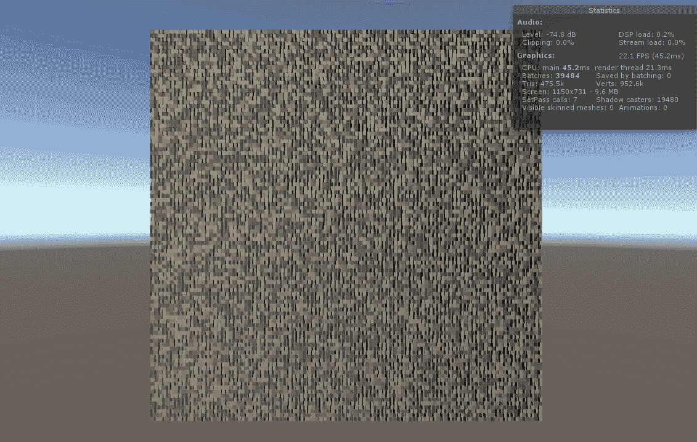
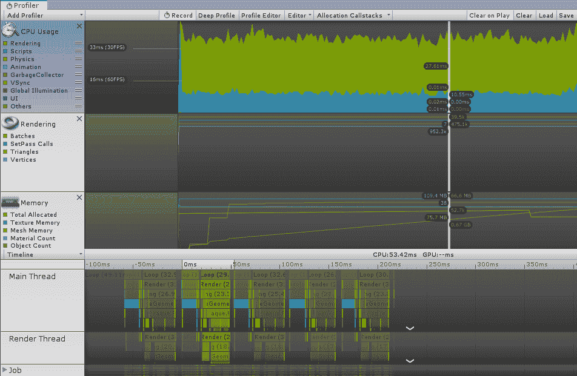
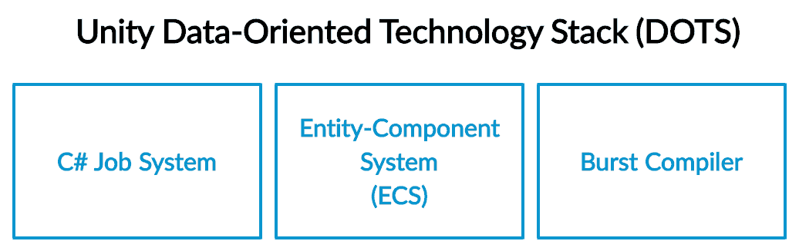
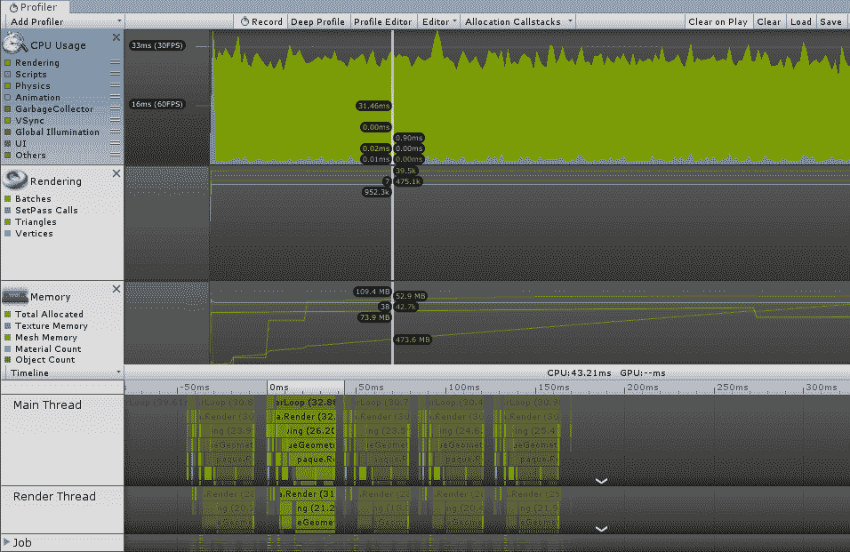
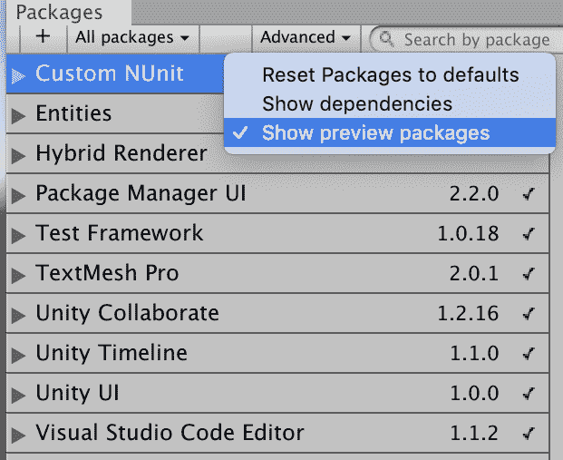
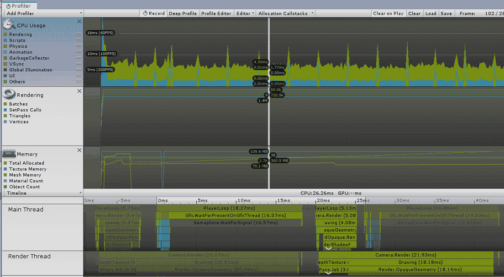

# 数据导向技术堆栈

近年来，我们看到了向多线程编程的大幅推进。原因很明显：虽然我们在单个核心的速度上已经达到了技术极限，但我们已经发现了如何有效地将数千个核心放入我们的硬件中，并使每段代码并行运行以获得巨大的性能提升。

然而，从单线程编程转向多线程编程并不简单。并非每个算法都可以轻易地分割成片段，即使可以，你还需要注意几个细节，以避免奇怪和不可预测的行为。

当 Unity 的第一个版本在 2005 年发布时，大规模多线程几乎是一个未来场景。然而，十四年对于游戏开发来说相当于一个地质时代，游戏引擎需要适应自己以跟上尖端技术的步伐。

Unity 目前正在努力将其核心设计适应一个由大规模多线程主导的世界。这项努力被称为**数据导向技术堆栈**（**DOTS**）。

在本章中，我们将探讨 DOTS 的组件：

+   任务系统

+   **实体组件系统**（**ECS**）

+   Burst 编译器

Unity 中的 DOTS 堆栈非常实验性，尽管它是公开的，但所有组件仍处于早期预览状态，这意味着它们的使用应避免用于重要项目。它们也变化非常快。官方关于 ECS 的教程在[`learn.unity.com`](https://learn.unity.com)上现在已不可用，因为它已经过时。如果几个月后，这一章节包含许多已弃用的函数和过程，我也不会感到惊讶。不要担心；我将在文末提供获取 DOTS 最新消息的链接。

# 多线程的问题

视频游戏具有巨大的多线程潜力。从理论上讲，每个`GameObject`都可以被视为一个独立的实体，拥有自己的生命周期和计算路径。这将通过大量的`GameObject`实例瞬间提高你的游戏性能。假设处理所有`GameObject`的更新需要 1 毫秒。如果你能有一千个类似的`GameObject`实例，那将需要整整一秒，但如果你能将每个更新分配给一个单独的核心，所有更新都可以并行运行，你的总计算时间将正好是 1 毫秒。这代表着 100,000%的速度提升！

不幸的是，这并不容易。正如我们之前所说，你不能只是将一段代码分配给一个核心并期望一切都能正常工作。编写多线程代码的一个大问题是存在竞争条件、死锁以及难以重现和调试的 bug 的风险。

竞态条件是指两个或多个计算在向完成的方向竞争，但实际结果取决于它们完成的顺序。想象一个线程试图将一个数字加三，而另一个线程将其乘以四。结果将取决于哪个操作先发生。死锁是一个问题，其中两个或多个线程正在竞争共享资源，每个线程都需要完整的资源集合来完成其任务，但每个线程都保留了一小部分资源，并且拒绝将其控制权交给另一个线程，在这种情况下，没有任何线程可以完成任何工作，因为它们都没有需要的完整集合。

由于这个原因，传统上，Unity API 不是线程安全的，这意味着它们不能被并行运行的多个线程调用。因此，几乎所有的 Unity 代码都在主线程中运行，包括每个`GameObject`和`MonoBehaviour`（这就是为什么如果你阻塞单个更新，你可能会冻结整个 Unity 编辑器）。

因为多线程是一个复杂的话题，我们将一步一步地通过一个例子来讲解。

# 一个小例子

假设你想要在场景中有成千上万的类似物品。这不是一个奇怪的要求；可能有许多合理的理由：你可能希望在巨大的星际战斗中渲染成千上万的飞船，或者你可能想要为**实时策略**（**RTS**）游戏动画化成千上万的单位，或者你可能想要处理大量的粒子。

为了简单起见，在我们的演示中，我们想要一个有 10,000 个旋转立方体的场景。所以，让我们开始吧：

1.  每个立方体将有一个单独的`MonoBehaviour`实例，它执行一个非常简单的旋转立方体操作：

```cs
using UnityEngine;

namespace Classic
{
  public class Rotator : MonoBehaviour
  {

    public float rotationSpeed;

    void Update()
    {
      transform.Rotate(0f, rotationSpeed * Time.deltaTime, 0f);
    }
  }
}
```

脚本是自我解释的：我们有一个公共变量`rotationSpeed`，用于存储立方体的旋转速度。然后，在`Update`方法中，我们简单地旋转立方体。

1.  现在，我们不想手动将 10,000 个立方体插入场景。所以，我们将创建一个**游戏管理器**，它将执行以下操作：

    1.  在场景中生成 10,000 个立方体

    1.  为每个立方体设置随机的旋转速度

1.  因此，我们创建一个空的`GameObject`，并将其附加到一个游戏管理脚本，如下所示：

```cs
using UnityEngine;
using System;

namespace Classic { 

    public class ClassicCubeManager : MonoBehaviour
    {

        #region COMMON_GAME_MANAGER_DATA
        public float cubeSpacing = 0.1f;
        public int width = 10;
        public int height = 10;

        public GameObject cubePrefab;
        #endregion

        void Start()
        {
            SpawnCubes();

        }

        private void SpawnCubes()
        {
            Debug.Log(String.Format("Spawning {0} cubes", (width / cubeSpacing) * (height / cubeSpacing)));
            Vector3 position = new Vector3();
            while (position.x < width)
            {
                while (position.y < height) {
                    var newCube = GameObject.Instantiate(cubePrefab);
                    newCube.transform.position = position;
                    newCube.GetComponent<Rotator>().rotationSpeed = UnityEngine.Random.Range(25.0f, 50.0f);
                    position = new Vector3(position.x, position.y + cubeSpacing, 0f);
                }
                position = new Vector3(position.x + cubeSpacing, 0f, 0f);
            }
        }

    }
} 
```

脚本简单地取一个`cubePrefab`，并在一个*宽 x 高*的矩形空间中生成一定数量的它们。令人兴奋的部分是`SpawnCubes`函数。该函数从原点开始，生成立方体，直到我们达到对角线。这是一个相当标准的脚本。

1.  现在我们可以运行它了，我们应该能看到类似这样的结果：



正如你所见，帧率并不理想。查看右上角的统计数据，你可以看到游戏正在以大约 22 FPS 的速度运行。

注意，这些值是从我的非最优机器上获取的。你可能会得到不同的值。如果你的电脑非常快，演示运行得非常完美，尝试将立方体的数量增加到 20,000 个或更多。

1.  这个 FPS 值不是最优的。然而，我们可以打开 Profiler 窗口（窗口 | 分析 | Profiler），并尝试了解应用程序的行为：



图像很清晰：我们几乎分配了 1 GB 的 RAM，并且每帧花费 45 毫秒，其中 10 毫秒仅用于脚本。这是错误的。更新脚本很简单：我们只是在每一帧旋转一个立方体几度。

我们应该做得更好。我们会的。

# Unity 工作系统

DOTS 中可以为我们提供巨大性能提升功能的大块是**C#工作系统**。像所有其他 DOTS 组件一样，这个功能仍在积极开发中，但自 Unity 2019.1 以来已经公开，因此尽早熟悉它而不是晚些时候是明智的，因为它将对 Unity 开发者编写高性能代码的方式带来重大变化：



正如我们将看到的，使用此系统与不使用此系统的游戏质量差异可能会非常明显，这可能会在 Unity 开发社区中引起一些碎片化。了解并利用新工作系统的优势，以便我们的应用程序具有最大的成功潜力，这是我们的最佳利益所在。

C#工作系统的想法是能够创建简单的任务，这些任务在后台线程上运行，以从主线程卸载工作。C#工作系统非常适合那些明显可以并行处理的任务，例如在场景中同时操作数十万个简单的 AI 代理，以及任何可以归结为数千个小而独立的操作的任何问题。当然，它也可以用于典型的多线程行为，我们在后台执行一些不需要立即进行的计算。工作系统还引入了一些编译器技术改进，以获得比仅仅将任务移动到单独的线程更大的性能提升。

# 基本工作

从本质上讲，一个工作就是一个在单独线程上运行的功能：

```cs
using Unity.Collections;
using Unity.Jobs;
using UnityEngine;

public struct SimpleJob : IJob
{
    // Put here a bunch of data...
    public float number;

    public NativeArray<float> data;

    // Write your Execute() function.
    public void Execute()
    {
        data[0] += number;
    }
}
```

每个工作都是一个扩展`IJobinterface`接口的结构体。结构体包含我们希望工作使用的任何数据，以及一个名为`Execute`的函数，用于在作业中执行的操作。例如，上一个示例只是将一定数量的值加到数组的第一个元素上。

因为，正如我们之前所说的，多线程是一个非常棘手的事情，Unity 在你可以传递和接收数据到工作（或一组工作）的方式上提供了一些限制。主要约束是`Execute`函数不接受任何参数，也不能返回任何值。工作所需的所有数据都必须复制到结构体中，结果也必须写入结构体。

需要将内容复制到结构体中的事实似乎是一个重大的限制：你不能传递一个`MonoBehaviour`实例的引用或`List`的引用。幸运的是，Unity 提供了一种使用一组线程安全的包装器通过原生容器访问作业共享内存的方法。

原生容器包括以下内容：

+   `NativeArray`: 数据的简单集合（线程安全的 C#数组的等价物）

+   `NativeList`: 与`NativeArray`类似，但可调整大小（线程安全的`List`的等价物）

+   `NativeHashMap`: `HashMap`的线程安全版本

+   `NativeMultiHashMap`: 与`NativeHashMap`类似，但每个键可以有多个值

+   `NativeQueue`: 一个线程安全的**先进先出**（**FIFO**）队列

因此，在我们的工作中，我们使用一个固定大小的`NativeArray`变量来存储输入和输出数据。

现在，我们想要运行这个任务。为了做到这一点，我们需要使用`MonoBehaviour`来初始化和运行它：

```cs
using Unity.Collections;
using Unity.Jobs;
using UnityEngine;

public class SimpleJobRunner : MonoBehaviour
{

    public float numberToAdd = 5;

    private NativeArray<float> theData;

    private JobHandle simpleJobHandle;

    void Start()
    {
        theData = new NativeArray<float>(1, Allocator.Persistent);
        theData[0] = 2;

        SimpleJob simpleJob = new SimpleJob
        {
            number = numberToAdd,
            data = theData
        };

        simpleJobHandle = simpleJob.Schedule();

        JobHandle.ScheduleBatchedJobs();

        simpleJobHandle.Complete();

        if (simpleJobHandle.IsCompleted)
        {
            Debug.Log(simpleJob.data[0]);
        }

                theData.Dispose();
    }
}
```

在`Start`方法中，我们首先创建一个空的`NativeArray`。`NativeArray`构造函数的第一个参数是大小；第二个参数是`Allocator`。实际上有三个分配器：

+   `Allocator.Temp`: 这是三者中最快的，但它的生命周期必须在一个帧之内。实际上，Unity 强制你在函数返回之前调用`Dispose`来处理这样的数组。因此，我们不能将`Allocator.Temp`用于作为作业参数传递的原生容器。作业不保证在它们开始启动的同一帧内完成。

+   `Allocator.TempJob`: 这比`Allocator.Temp`慢，其生命周期限制在四个帧以下。这是传递给简单作业的完美类型的`Allocator`，这些作业运行并快速返回，例如我们例子中的那种。

+   `Allocator.Persistent`: 这是三者中最慢的，但它的生命周期是无限的。这是你想要存储持久数据或作业需要长时间访问的数据的`Allocator`类型。

之后，我们创建一个新的`SimpleJob`实例，将`number`和`data`传递给它。然后，我们使用`Schedule`函数安排和运行作业。这将返回一个`jobHandle`实例，我们可以用它来控制作业执行。最后，我们等待作业完成，然后打印结果。一切看起来都像是标准的 C#代码，但作业是在一个单独的线程中运行的！

记住要做一个好的 C#公民，并且总是手动处理原生容器！你不想以污染内存的方式污染我们的世界，就像你不想以污染我们的世界的方式污染我们的世界一样。

在这一点上，如果你将`SimpleJobRunner`附加到一个空对象上，你应该在调试控制台中看到打印的结果。所有操作都是以多线程的方式进行的。

# 一个更复杂的例子

只为了求和两个数字就启动一个作业绝对不是最优编程的例子。Unity 创建作业是为了运行数千个，将繁重的工作提升到多线程领域。

因此，我们现在将修改我们之前的旋转立方体示例，以便实际的旋转由任务执行。我们首先想要做的是创建我们的任务，如下所示：

```cs
using System.Collections;
using System.Collections.Generic;
using Unity.Collections;
using UnityEngine;
using UnityEngine.Jobs;

namespace JobSystem
{

    public struct RotatorJob : IJobParallelForTransform
    {

        [ReadOnly]
        public NativeList<float> speeds;

        [ReadOnly]
        public float deltaTime;

        public void Execute(int index, TransformAccess transform)
        {
            Vector3 currentRotation = transform.rotation.eulerAngles;
            currentRotation.y += speeds[index] * deltaTime;
            transform.rotation = Quaternion.Euler(currentRotation);
        }
    }
}
```

这个任务稍微复杂一些，但不用担心。首先，它扩展了 `IJobParallelForTransform`；这是一个用于运行 `GameObject` 实例并行变换的专用任务接口。你也可以通过扩展 `IJob` 来实现同样的功能，但由于这是一个非常常见的用例，Unity 为我们编写了大部分代码。正如你所见，主要区别在于 `Execute` 现在有两个参数。在我们的演示中，我们想在我们的 10,000 个立方体中的每一个上运行相同的任务。在这种情况下，参数如下：

+   `index` 代表场景中的 `index`^(th) 立方体

+   `transform` 是对 `index`^(th) 立方体 `Transform` 的引用

我们的任务接受两个输入：

+   `speeds`: 它是一个包含每个立方体所有随机速度的数组。记住，我们无法获取特定 `GameObject` 的某些数据的引用，因此我们需要将所有速度写入共享内存。请注意，字段是 `[ReadOnly]`；我们不希望 *i*^(*th*) 立方体能够改变另一个立方体的速度。

+   `deltaTime`: 由于任务完全与 Unity 引擎解耦，它无法访问 `Time` 和其他线程不安全的 Unity 部分。因此，我们需要自己传递 `deltaTime`。

`Execute` 函数很简单；我们只是旋转立方体。

现在，我们需要在每个立方体上调用这些任务，并且我们需要使用游戏管理器来完成这个任务：

```cs
namespace JobSystem
{
    public class JobCubeManager : MonoBehaviour
    {

        #region COMMON_GAME_MANAGER_DATA
        public float cubeSpacing = 0.1f;
        public int width = 10;
        public int height = 10;

        public GameObject cubePrefab;
        #endregion

        TransformAccessArray transformAccessArray;
        Unity.Jobs.JobHandle jobHandle;
        NativeList<float> speeds;

                ...
```

我们首先定义与经典示例相同的基本数据。前几个属性是相同的；有趣的是最后三个：

+   `transformAccessArray` 是我们将存储所有立方体 `transform` 实例引用的数组。这就是我们的任务如何访问它们的方式。

+   `jobHandle` 是我们将用于查询任务系统任务状态的句柄。

+   `speeds` 是之前描述的随机速度列表：

```cs
        void Start()
        {
            transformAccessArray = new TransformAccessArray(0, -1);
            speeds = new NativeList<float>(1, Allocator.Persistent);
            SpawnCubes();
        }
```

在 `Start` 方法中，我们只是初始化所有原生容器，然后生成立方体。请注意，我们使用 `Allocator.Persistent` 分配器，因为我们想在 `Start` 时初始化速度，然后在应用程序的整个生命周期中使用相同的列表：

```cs
        private void SpawnCubes()
        {
            Debug.Log(String.Format("Spawning {0} cubes", (width / cubeSpacing) * (height / cubeSpacing)));
            Vector3 position = new Vector3();
            while (position.x < width)
            {
                while (position.y < height)
                {
                    var newCube = Instantiate(cubePrefab);
                    newCube.transform.position = position;
                    position = new Vector3(position.x, position.y + cubeSpacing, 0f);
                    transformAccessArray.Add(newCube.transform);
                    speeds.Add(UnityEngine.Random.Range(25.0f, 50.0f));
                }
                position = new Vector3(position.x + cubeSpacing, 0f, 0f);
            }

        }
```

`SpawnCubes` 函数与之前的非常相似。然而，有两行关键代码不同：

1.  在我们实例化一个立方体后，我们将它的 `transform` 添加到 `transformAccessArray`。

1.  我们不是在立方体的 `Rotator` `MonoBehaviour` 中设置随机速度，而是在速度数组中设置。实际上，我们不应该在 Prefab 中有 `Rotator` 组件！

现在，每一帧，我们都需要在所有立方体上并行运行任务：

```cs
        void Update()
        {
            jobHandle.Complete();

            if (jobHandle.IsCompleted)
            {
                var rotatorJob = new RotatorJob()
                {
                    deltaTime = Time.deltaTime,
                    speeds = speeds
                };

                jobHandle = rotatorJob.Schedule(transformAccessArray);
                JobHandle.ScheduleBatchedJobs();
            }

        }
```

我们使用与之前相同的模式。我们检查之前的任务是否已经完成，实例化一个新的任务，设置数据，然后在整个 **`transformAccessArray`** 上调度任务。

如果一切正常，我们可以运行游戏并看到与之前相同的场景。现在，然而，我们可以享受 ~35 FPS：



查看 Profiler，我们可以看到，现在脚本（下方的蓝色部分）所用的时间几乎看不见。它从 10 毫秒下降到 1 毫秒。这是一个 90%的改进！

然而，我们仍然有一个问题。我们的场景被 10,000 个`GameObject`实例、10,000 个`Transforms`、10,000 个`MeshRenderers`和另外 10,000 个不同组件的副本所填满。`MonoBehaviour`和`GameObject`是重量级的数据结构，它们消耗了相当数量的内存和 CPU 周期。

我们能做得更好吗？是的，我们可以。

# 新的 ECS

ECS 是一个勇敢而雄心勃勃的尝试，重新设计 Unity 设计核心基础：`GameObject`-`MonoBehaviour`范式。正如你可以想象的那样，改变游戏中每个对象的基本设计模式不是一件容易的任务。所以你可能想知道：为什么？

有几个原因。让我们客观地看看其中的一些：

+   首先，正如我们之前所说的，`GameObject`和`MonoBehaviour`是重量级对象；它们携带大量的内部代码和数据结构。`GameObject`实例和`MonoBehaviour`引入的开销足以限制屏幕上可以拥有的对象数量，这比渲染它们所需的资源还要多。这对抽象模型来说不是一件好事。

+   其次，`MonoBehaviour`实例散布在内存中。这意味着`GameObject`需要在内存中搜索以检索它连接的所有`MonoBehaviour`实例，并且系统依赖于引用。这有两个问题：它使缓存非常低效，更重要的是，当我们在大规模多线程应用程序中使用`GameObject`实例时，例如通过使用作业（我们已经看到作业不能安全地使用引用），这是一个问题。

+   最后但同样重要的是，从代码设计角度来看，`MonoBehaviour`实例存在一个问题：它们存储数据和行为。这并不是一个大问题。毕竟，许多令人惊叹的游戏都是使用这种范式发布的。然而，在软件架构中，通常将数据（通常称为**模型**）与使用数据的算法（通常称为**控制器**）分开。*

相反，ECS 朝着将数据与行为分离的方向发展。它基于三个不同的组件：

+   **实体**仅仅由其组件集定义。这里实际上没有抽象。

+   **组件**纯粹是数据。`Health`组件只包含生命值；`Shield`组件只包含护盾数量；`Rotation`组件只包含对象方向，等等。

+   **系统**定义了实体的行为。系统将特定的行为应用于包含特定组件集的每个实体。例如，`MoveAndRotateEnemy`可能将平移和旋转应用于具有`Rotation`、`Translation`和`Enemy`组件的每个实体。

现在一切都各就各位。

# 混合 ECS 和作业

是时候将 ECS 应用到我们 10,000 个旋转的立方体上了。在我们开始之前，我们需要安装以下包：

1.  打开窗口 | 包管理器。点击高级并确保已启用“显示预览包”。

1.  然后，从列表中安装“实体”包和“混合渲染器”包：



如前所述，ECS 正在快速发展。我们在这本书中测试了 0.1.1-preview 版本的代码。如果你作为未来的读者，有一个更近的版本，有很大可能会出现一些不兼容性。在这种情况下，我鼓励你将代码与这个官方仓库中包含的最新 ECS 示例进行比较：[`github.com/Unity-Technologies/EntityComponentSystemSamples`](https://github.com/Unity-Technologies/EntityComponentSystemSamples)。我为我的预测能力不足表示歉意。

1.  现在我们已经准备好编写第一个组件。我们的立方体需要旋转，因此我们需要一个特定的`RotationSpeed`。这将是我们的组件名称：

```cs
    [Serializable]
    public struct RotationSpeed : IComponentData
    {
        public float Value;
    }
```

看起来多么简单。正如我们之前所说，组件只是数据。旋转速度由一个单精度浮点数表示；因此，我们只需要存储一个简单的浮点数。

你可能会问：我如何将这个组件附加到实体上？我还能使用检查器来设置值吗？关于我在 Unity 中喜欢的一切好东西呢？遗憾的是，组件不能附加到`GameObject`（毕竟，`GameObject`不是 ECS 的一部分）。实体不会出现在场景编辑器中，组件也不会出现在检查器中。

幸运的是，如果我们想保留编辑器的一些功能，比如定义一个可以生成 10,000 次的预制体，那么有一个解决方案。将`GameObject`-`MonoBehaviour`范式与 ECS 混合称为**混合 ECS**，这是保持两者最佳之处的完美方式。

1.  为了使我们的组件启用，我们需要编写一个`IConvertGameObjectToEntity`实现。`IConvertGameObjectToEntity`是一段代码，它自动将标准的`MonoBehaviour`转换为相应的组件：

```cs
    using System.Collections;
    using System.Collections.Generic;
    using UnityEngine;
    using Unity.Entities;
    using System;
    using Unity.Mathematics;    

    [RequiresEntityConversion]
    public class RotationSpeedAuthoring : MonoBehaviour, IConvertGameObjectToEntity
    {

        public float rotationSpeed = 35f;

        public void Convert(Entity entity, EntityManager dstManager, GameObjectConversionSystem conversionSystem)
        {
            var data = new RotationSpeed { Value = math.radians(rotationSpeed) }; // Convert to speed in radians
            dstManager.AddComponentData(entity, data);
        }
    }
```

在前面的代码中，`RotationSpeedAuthoring`是一个`IConvertGameObjectToEntity`实现和一个`MonoBehaviour`（这样我们就可以将其附加到一个`GameObject`上）。转换的核心在于`Convert`函数。签名可能有些令人困惑；它过去改变了很多，将来可能还会再次改变。重要的是内容：该函数接受`MonoBehaviour`的数据，将其添加到一个新的组件（在我们的案例中是`RotationSpeed`），应用一些处理（在我们的案例中，我们将每秒度转换为每秒弧度），并最终将组件附加到实体上。

1.  我们现在创建`cubePrefab`，就像之前一样，并将`RotationSpeedAuthoring` `MonoBehaviour`添加到其中，在运行时，`GameObject`将被转换为实体。

1.  现在我们已经拥有了所有需要的，我们只需要编写我们的游戏控制器：

```cs
using System;
using UnityEngine;
using Unity.Entities;
using Unity.Transforms;
using Unity.Mathematics;

namespace ECSJob
{
    public class ECSJobManager : MonoBehaviour
    {

        #region COMMON_GAME_MANAGER_DATA
        public float cubeSpacing = 0.1f;
        public int width = 10;
        public int height = 10;

        public GameObject cubePrefab;
        #endregion

        EntityManager entityManager;

        void Start()
        {
            entityManager = World.Active.EntityManager;
            SpawnCubes();
        }

        private void SpawnCubes()
        {
            int amount = Mathf.FloorToInt(width / cubeSpacing) * Mathf.FloorToInt(height / cubeSpacing);
            Debug.Log(String.Format("Spawning {0} cubes", amount));

            Vector3 position = new Vector3();

            var entityPrefab = GameObjectConversionUtility.ConvertGameObjectHierarchy(cubePrefab, World.Active);

            while (position.x < width)
            {
                while (position.y < height)
                {
                    var instance = entityManager.Instantiate(entityPrefab);

                    position = new Vector3(position.x, position.y + cubeSpacing, 0f);
                    entityManager.SetComponentData(instance, new Translation() { Value = position });
                    entityManager.SetComponentData(instance, new RotationSpeed() { Value = math.radians(UnityEngine.Random.Range(25.0f, 50.0f)) });
                }
                position = new Vector3(position.x + cubeSpacing, 0f, 0f);
            }

        }

    }
}
```

这是一个相当标准的游戏管理器，但让我们来看看激动人心的部分。首先，我们有一个新的属性：`entityManager`。这只是一个对主要实体管理器的引用。正如其名所示，实体管理器是一个数据结构，你可以对实体执行基本操作，例如检查实体是否仍然存活，或创建和编辑实体。

你不需要创建实体管理器。Unity 会为你提供一个。正如你在 `Start` 中看到的，你只需要引用主要的全局一个。

1.  现在是时候生成立方体了。第一行有趣的代码是这一行：

```cs
var entityPrefab = GameObjectConversionUtility.ConvertGameObjectHierarchy(cubePrefab, World.Active);
```

使用这个类，我们将我们构建的预制体转换为实体。预制体中的每个 `MonoBehaviour` 都会被转换为组件，有时甚至更多。我们已经知道 `RotationSpeedAuthoring` 被转换为 `RotationSpeed`，但 Unity 为许多标准的 `MonoBehaviour` 子类提供了转换，如下所示：

+   每个 `Transform` 转换为 `Translation`、`Rotation` 和 `Scale` 组件（以及一些不太常见的，例如 `NonLocalScale`）

+   每个 `MeshRenderer` 转换为 `RenderMesh` 组件

1.  现在，对于每个立方体位置，我们需要实例化一个新的实体。这与我们实例化 `GameObject` 的方式类似，但我们调用 `entityManager` 上的 `Instantiate`，如下面的代码块所示：

```cs
var instance = entityManager.Instantiate(entityPrefab);
```

1.  然后，我们在实体上设置 `Translation` 和 `RotationSpeed` 组件。

第一件事是将立方体的位置设置为计算出的位置，后者设置为随机旋转速度。请注意，该组件使用每秒弧度，因此我们需要转换该值：

```cs
entityManager.SetComponentData(instance, new Translation() { Value = position });
entityManager.SetComponentData(instance, new RotationSpeed() { Value = math.radians(UnityEngine.Random.Range(25.0f, 50.0f)) });
```

到目前为止，我们有了组件，并且我们有了一种实例化实体的方法。我们仍然缺少一个实际移动立方体的系统。我们想要构建一个系统，该系统针对具有 `RotationSpeed` 和 `Rotation` 组件的每个实体，使它们旋转。不仅如此，我们还想使用 C# 作业，以便所有 10,000 个立方体并行旋转。这是一个典型的模式，因此 Unity 为我们提供了一个类。

然而，我们首先需要编写我们的工作：

```cs
public struct RotatorJob : IJobForEach<Rotation, RotationSpeed>
        {

            [ReadOnly]
            public float deltaTime;

            public void Execute(ref Rotation rotation, [ReadOnly] ref RotationSpeed rotationSpeed)
            {
                rotation.Value = math.mul(math.normalize(rotation.Value), quaternion.AxisAngle(math.up(), rotationSpeed.Value * deltaTime));
            }
        }
```

这与上一个工作类似，但有一些不同。首先，我们扩展了 `IJobForEachinstead` 而不是 `IJobParallelForTransform`，因为实体没有 `Transforms`。你可能注意到我们向 `IJobForEach` 接口传递了两个类型参数。这些是我们想在作业中使用的组件类型，即 `Rotation` 和 `RotationSpeed`。我们可以放入任意数量的组件；重要的是我们以与 `Execute` 参数相同的顺序添加相同的组件。

例如，如果我们扩展`IJobForEach<Rotation, RotationSpeed>`，那么`Execute`将接受一个`Rotation`和`RotationSpeed`组件的引用作为参数。然而，如果我们扩展`IJobForEach<Scale>`，那么`Execute`将只接受一个`Scale`组件的引用；等等。这就像对所有实体进行过滤，确保这个作业只应用于包含`Rotation`和`RotationSpeed`组件的实体。

最后，你可能注意到我们正在使用一些奇怪的旋转类型：`quaterion`，小写字母*q*。这是因为 Unity 在 ECS 中为向量和四元数开发了一些新的类型，这些类型在作业和组件方面具有更优化的优势。

有很多这样的组件，但像往常一样，它们仍在开发中。要获取它们的最新信息，请查看`Unity.Mathematics`模块的文档：[`docs.unity3d.com/Packages/com.unity.mathematics@1.0/manual/index.html`](https://docs.unity3d.com/Packages/com.unity.mathematics@1.0/manual/index.html)

现在我们有了作业，我们需要创建一个利用它的组件系统：

```cs
    public class RotationSystem : JobComponentSystem
    {
        protected override JobHandle OnUpdate(JobHandle inputDeps)
        {
            RotatorJob rotatorJob = new RotatorJob()
            {
                deltaTime = Time.deltaTime
            };

            return rotatorJob.Schedule(this, inputDeps);
        }
    }
```

`JobComponentSystem`是一个用于构建可以使用 C#作业运行的系统的类。

我们首先定义一个新的类，称为`RotationSystem`，它扩展了`JobComponentSystem`类。在这个类中，我们重写了`OnUpdate`（注意：`OnUpdate`，而不是`Update`）方法，在这个方法中，我们只是创建一个新的`RotatorJob`作业并安排它。

现在，我们只需将`ECSJobManager`附加到一个空的`GameObject`上，运行应用程序，就可以看到所有立方体像往常一样旋转。随着这些更改，我们最终达到了超过 100 FPS！让我们看看 Profiler：



时间过得如此之快，以至于我们可以看到 v-sync 的小峰值。每一帧都少于 10 毫秒；这比我们仅使用经典非 DOTS 方法在脚本上花费的时间还要少！这是一个令人难以置信的加速，而且应用程序的内存不到一半。

但是猜猜看。我们仍然可以做得更好。

# 爆发式编译器

DOTS 的最后一个组件是爆发式编译器。爆发式编译器是一个可以将 C#的子集编译成优化原生代码的编译器。Burst 的主要目标是编译作业，使它们尽可能快和轻量。

好玩的是，使用爆发式编译器非常简单。首先，你需要从 Window | 包管理器安装 Burst 包。然后，你需要更改的唯一一件事是在作业定义的顶部添加`[BurstCompile]`装饰器，如下所示：

```cs
[BurstCompile]
public struct RotatorJob : IJobForEach<Rotation, RotationSpeed>
        {

            [ReadOnly]
            public float deltaTime;

            public void Execute(ref Rotation rotation, [ReadOnly] ref RotationSpeed rotationSpeed)
            {
                rotation.Value = math.mul(math.normalize(rotation.Value), quaternion.AxisAngle(math.up(), rotationSpeed.Value * deltaTime));
            }
        }
```

就这样！现在作业是用 Burst 编译的，这将从我们的应用程序中挤出更多性能。我们的演示很简单，Burst 编译的效果有限——在我的机器上，我可以达到 110 FPS，但对于更复杂的作业，影响更为显著。

# 摘要

DOTS 是 Unity 推动 Unity 进入游戏未来之巅的努力的巅峰。我坚信，在未来，DOTS 将成为任何优化工作的核心组件，并且随着 DOTS 变得更加稳定并得到社区的支撑，这一章节肯定会发展成为几个章节。

不幸的是，在这个阶段，C# 作业和 ECS 仍然非常不稳定，它们的 API 正在迅速变化，因此，我不建议在大型、重要、商业游戏中使用它们。然而，我认为开始尝试它们是很重要的，以便为它们到来做好准备。

本章只是对 DOTS 的表面进行了探讨。还有很多更多的细节、配置和优化可以在作业和 ECS 中实现。更多信息，Unity DOTS 的主要中心([`unity.com/dots`](https://unity.com/dots))是你的最佳朋友。

本章有效地总结了我们可以赋予的所有旨在明确提高应用程序性能的技术。然而，优化你的工作流程也是非常有益的。正如之前提到的，性能优化工作的一个恒定成本是开发时间。但是，如果你能加快我们的开发工作，在工作的更繁琐部分节省一些时间，那么，希望你能节省足够的时间来实际实施我们在这整本书中讨论的尽可能多的优化技术。Unity 引擎中有很多小而巧妙的细节，这些细节并不为人所知或没有明确记录，只有通过使用引擎或参与其社区才能显现出来。因此，下一章将充满关于如何更有效地管理你的项目和场景以及如何充分利用 Unity 编辑器的提示和技巧。
